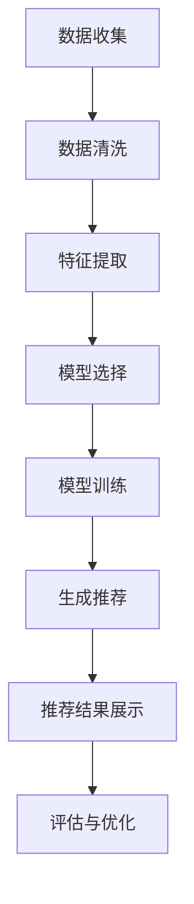
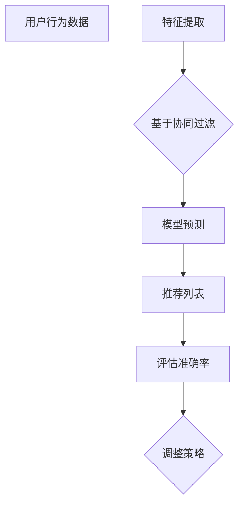
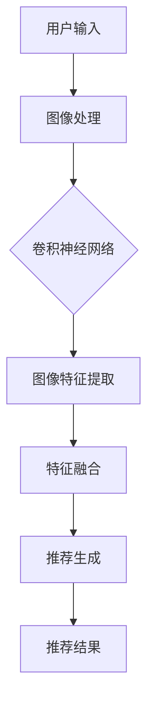
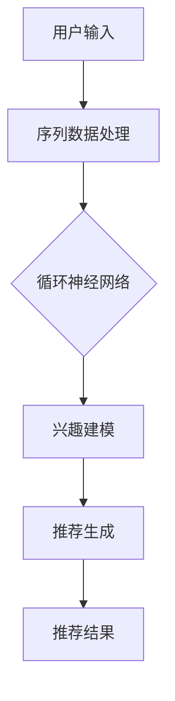
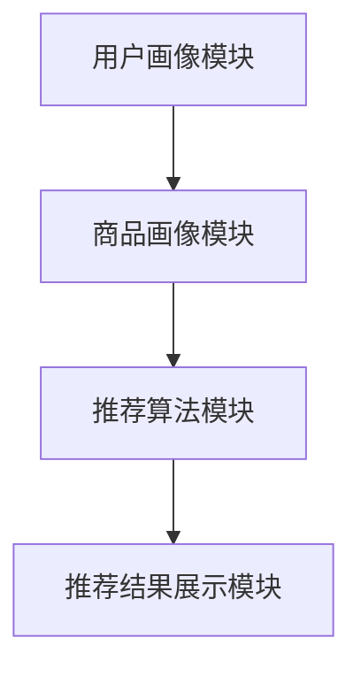

                 

# 《个性化推荐系统的市场应用》

> 关键词：个性化推荐系统、协同过滤、矩阵分解、深度学习、市场应用、电商推荐、社交媒体推荐、内容分发推荐

> 摘要：本文将详细探讨个性化推荐系统的市场应用。首先，我们将回顾个性化推荐系统的基本概念和原理，然后深入分析推荐系统架构与核心组件，以及常用的协同过滤算法和矩阵分解与隐语义模型。接着，本文将讨论内容推荐系统和深度学习在推荐系统中的应用。随后，我们将讨论推荐系统的优化与评估方法。在第三部分，本文将探讨个性化推荐系统在电商行业、社交媒体平台和内容分发平台的市场应用，并分析其面临的挑战与未来发展趋势。最后，我们将介绍一些推荐系统开源工具与框架，并提供一个实际项目案例，以便读者更好地理解个性化推荐系统的实现过程。

### 目录

#### 第一部分：个性化推荐系统基础

- 第1章：个性化推荐系统概述
  - 1.1 推荐系统的定义与重要性
  - 1.2 推荐系统的发展历程
  - 1.3 个性化推荐系统的工作原理
- 第2章：推荐系统架构与核心组件
  - 2.1 推荐系统的总体架构
  - 2.2 数据收集与处理
  - 2.3 特征工程
  - 2.4 模型选择与训练
  - 2.5 推荐策略与评估
- 第3章：协同过滤算法
  - 3.1 基于用户的协同过滤
  - 3.2 基于项目的协同过滤
  - 3.3 协同过滤算法的优缺点
- 第4章：矩阵分解与隐语义模型
  - 4.1 矩阵分解的原理
  - 4.2 SVD分解
  - 4.3 隐语义模型的优缺点

#### 第二部分：个性化推荐系统的技术实现

- 第5章：内容推荐系统
  - 5.1 内容推荐系统的定义与特点
  - 5.2 文本表示与嵌入
  - 5.3 内容相似度计算
  - 5.4 基于内容的推荐算法
- 第6章：深度学习在推荐系统中的应用
  - 6.1 深度学习的基本概念
  - 6.2 神经网络在推荐系统中的应用
  - 6.3 卷积神经网络（CNN）在推荐系统中的应用
  - 6.4 循环神经网络（RNN）在推荐系统中的应用
- 第7章：推荐系统的优化与评估
  - 7.1 推荐系统的优化方法
  - 7.2 推荐效果的评估指标
  - 7.3 用户反馈与推荐系统的迭代优化

#### 第三部分：个性化推荐系统的市场应用

- 第8章：电商行业的推荐系统
  - 8.1 电商推荐系统的架构与案例
  - 8.2 电商推荐系统的实现策略
  - 8.3 电商推荐系统的发展趋势
- 第9章：社交媒体平台的推荐系统
  - 9.1 社交媒体推荐系统的特点
  - 9.2 社交媒体推荐系统的实现策略
  - 9.3 社交媒体推荐系统案例分析
- 第10章：内容分发平台的推荐系统
  - 10.1 内容分发推荐系统的类型
  - 10.2 内容分发推荐系统的关键因素
  - 10.3 内容分发推荐系统案例分析
- 第11章：个性化推荐系统面临的挑战与未来趋势
  - 11.1 个性化推荐系统的挑战
  - 11.2 隐私保护与数据安全
  - 11.3 个性化推荐系统的未来发展趋势

#### 附录

- 附录A：推荐系统开源工具与框架
  - A.1 推荐系统开源框架综述
  - A.2 LightFM：基于矩阵分解的推荐系统框架
  - A.3 PyTorch Rec：深度学习推荐系统框架
  - A.4 其他开源推荐系统工具
- 附录B：推荐系统项目实战
  - B.1 项目背景与目标
  - B.2 数据采集与处理
  - B.3 特征工程
  - B.4 模型选择与训练
  - B.5 推荐策略与评估
  - B.6 项目总结与展望
- 附录C：推荐系统常用数学公式与算法伪代码
  - C.1 常用数学公式
  - C.2 算法伪代码示例
  - C.3 推荐系统中的常见优化算法

---

## 第1章：个性化推荐系统概述

### 1.1 推荐系统的定义与重要性

推荐系统（Recommender System）是一种信息过滤技术，旨在根据用户的历史行为、兴趣偏好和相似度计算，向用户推荐他们可能感兴趣的商品、内容或其他实体。推荐系统通过解决“信息过载”问题，帮助用户快速发现并获取他们感兴趣的信息或商品。

推荐系统的重要性体现在以下几个方面：

1. **提高用户满意度**：通过个性化推荐，用户能够更快地找到他们感兴趣的内容或商品，从而提高用户满意度和粘性。
2. **增加销售额**：电商推荐系统可以显著提高用户的购买意愿，从而增加销售额。
3. **提升内容分发效率**：内容分发平台通过个性化推荐，可以帮助用户发现更多高质量的内容，从而提升内容分发效率。
4. **增强品牌影响力**：通过个性化推荐，品牌可以更好地了解用户需求，从而制定更有效的营销策略。

### 1.2 推荐系统的发展历程

推荐系统的发展历程可以分为以下几个阶段：

1. **基于内容的推荐**：最早的推荐系统主要基于物品的属性和用户的历史偏好进行推荐，这种方法称为基于内容的推荐（Content-Based Filtering）。
2. **协同过滤推荐**：随着互联网的普及，用户生成的内容（如评分、评论）成为重要的信息来源。基于协同过滤（Collaborative Filtering）的推荐系统应运而生，这种方法通过分析用户之间的行为相似性进行推荐。
3. **混合推荐**：为了克服单一推荐方法的局限性，混合推荐（Hybrid Recommender）系统开始出现，这种方法结合了基于内容和协同过滤的方法，以提供更准确的推荐结果。
4. **深度学习推荐**：近年来，深度学习（Deep Learning）在推荐系统中的应用逐渐增加。通过深度神经网络，推荐系统可以自动学习用户和物品的复杂特征，从而提供更个性化的推荐。

### 1.3 个性化推荐系统的工作原理

个性化推荐系统通常包括以下几个步骤：

1. **数据收集与处理**：收集用户行为数据（如浏览历史、购买记录、评分等），并对数据清洗和预处理。
2. **特征工程**：从原始数据中提取有助于推荐的属性和特征，如用户兴趣、物品属性等。
3. **模型选择与训练**：根据推荐任务的类型，选择合适的模型（如协同过滤、矩阵分解、深度学习等），并进行训练。
4. **推荐策略与评估**：根据用户行为和模型预测，生成推荐列表，并使用评估指标（如准确率、召回率、覆盖率等）对推荐效果进行评估。

### 1.3.1 数据收集与处理

数据收集与处理是推荐系统的基础。通常，推荐系统需要从多个数据源收集用户行为数据，如网站日志、用户交互数据、社交媒体数据等。以下是一些关键步骤：

1. **数据采集**：使用爬虫、API调用等方式从不同数据源收集数据。
2. **数据清洗**：去除无效、重复或错误的数据，确保数据质量。
3. **数据预处理**：将原始数据转化为适合建模的格式，如编码、标准化等。

### 1.3.2 特征工程

特征工程是推荐系统的关键环节。通过提取有效的特征，可以帮助模型更好地理解用户和物品之间的关系。以下是一些常见的特征：

1. **用户特征**：如年龄、性别、地理位置、浏览历史、购买记录等。
2. **物品特征**：如类别、标签、属性、价格等。
3. **交互特征**：如评分、评论、点击率、浏览时长等。

### 1.3.3 模型选择与训练

推荐系统的模型选择和训练取决于推荐任务的类型和需求。以下是一些常用的模型：

1. **基于内容的推荐模型**：通过计算物品和用户特征的相似度进行推荐。
2. **协同过滤模型**：通过分析用户之间的行为相似性进行推荐。
3. **深度学习模型**：通过自动学习用户和物品的复杂特征进行推荐。

### 1.3.4 推荐策略与评估

推荐策略和评估是推荐系统的核心。以下是一些关键步骤：

1. **生成推荐列表**：根据用户行为和模型预测，生成推荐列表。
2. **评估推荐效果**：使用评估指标（如准确率、召回率、覆盖率等）对推荐效果进行评估。

### 1.3.5 用户反馈与推荐系统的迭代优化

用户反馈是推荐系统持续优化的关键。以下是一些关键步骤：

1. **收集用户反馈**：通过用户评分、点击、评论等方式收集用户反馈。
2. **调整推荐策略**：根据用户反馈调整推荐策略，以提升推荐效果。
3. **持续优化**：通过不断迭代优化，提高推荐系统的准确性和用户体验。

---

## 第2章：推荐系统架构与核心组件

### 2.1 推荐系统的总体架构

推荐系统通常由以下几个核心组件组成：

1. **数据收集模块**：负责从各种数据源（如网站日志、用户交互数据、社交媒体数据等）收集用户行为数据。
2. **数据处理模块**：负责对收集到的数据进行清洗、预处理和特征提取。
3. **推荐算法模块**：负责根据用户行为和特征，选择合适的推荐算法生成推荐列表。
4. **推荐结果展示模块**：负责将推荐结果展示给用户，如网页、APP界面等。
5. **评估与优化模块**：负责对推荐效果进行评估，并根据用户反馈和评估结果调整推荐策略。

### 2.2 数据收集与处理

数据收集与处理是推荐系统的关键环节，以下是一些关键步骤：

1. **数据采集**：使用爬虫、API调用等方式从不同数据源收集数据。
2. **数据清洗**：去除无效、重复或错误的数据，确保数据质量。
3. **数据预处理**：将原始数据转化为适合建模的格式，如编码、标准化等。
4. **特征提取**：从原始数据中提取有助于推荐的属性和特征，如用户兴趣、物品属性等。

### 2.3 特征工程

特征工程是推荐系统的核心。通过提取有效的特征，可以帮助模型更好地理解用户和物品之间的关系。以下是一些常见的特征：

1. **用户特征**：如年龄、性别、地理位置、浏览历史、购买记录等。
2. **物品特征**：如类别、标签、属性、价格等。
3. **交互特征**：如评分、评论、点击率、浏览时长等。

### 2.4 模型选择与训练

推荐系统的模型选择和训练取决于推荐任务的类型和需求。以下是一些常用的模型：

1. **基于内容的推荐模型**：通过计算物品和用户特征的相似度进行推荐。
2. **协同过滤模型**：通过分析用户之间的行为相似性进行推荐。
3. **深度学习模型**：通过自动学习用户和物品的复杂特征进行推荐。

以下是一个基于协同过滤的推荐系统的 Mermaid 流程图：



### 2.5 推荐策略与评估

推荐策略和评估是推荐系统的核心。以下是一些关键步骤：

1. **生成推荐列表**：根据用户行为和模型预测，生成推荐列表。
2. **评估推荐效果**：使用评估指标（如准确率、召回率、覆盖率等）对推荐效果进行评估。
3. **调整推荐策略**：根据用户反馈和评估结果调整推荐策略，以提升推荐效果。

以下是一个基于准确率的评估指标的 Mermaid 流程图：



---

## 第3章：协同过滤算法

### 3.1 基于用户的协同过滤

基于用户的协同过滤（User-Based Collaborative Filtering，UBCF）是一种常用的推荐算法，它通过分析用户之间的相似性来生成推荐列表。

### 3.1.1 工作原理

1. **计算用户相似度**：基于用户的历史行为（如评分、点击等），计算用户之间的相似度。常见的相似度计算方法包括余弦相似度、皮尔逊相关系数等。
2. **生成推荐列表**：根据用户相似度，从与目标用户相似的其他用户中提取他们的行为（如评分、点击等），并生成推荐列表。

### 3.1.2 优点与缺点

**优点**：

- **个性化**：通过分析用户之间的相似性，可以为每个用户生成个性化的推荐列表。
- **简单易实现**：算法实现相对简单，易于理解和部署。

**缺点**：

- **冷启动问题**：对于新用户或新物品，由于缺乏足够的历史数据，算法难以生成准确的推荐。
- **数据稀疏问题**：当用户行为数据稀疏时，用户之间的相似度计算结果可能不准确，导致推荐效果下降。

### 3.2 基于项目的协同过滤

基于项目的协同过滤（Item-Based Collaborative Filtering，IBCF）是另一种常用的推荐算法，它通过分析物品之间的相似性来生成推荐列表。

### 3.2.1 工作原理

1. **计算物品相似度**：基于物品的特征（如类别、标签、属性等），计算物品之间的相似度。常见的相似度计算方法包括余弦相似度、皮尔逊相关系数等。
2. **生成推荐列表**：根据物品相似度，为目标用户推荐与历史物品相似的物品。

### 3.2.2 优点与缺点

**优点**：

- **解决冷启动问题**：通过分析物品之间的相似性，可以为新用户和新物品生成推荐。
- **减少数据稀疏问题**：与基于用户的协同过滤相比，基于项目的协同过滤可以更好地处理数据稀疏问题。

**缺点**：

- **降低个性化**：由于仅考虑物品之间的相似性，可能无法完全满足用户的个性化需求。
- **计算复杂度较高**：当物品数量较多时，计算物品相似度可能需要较长时间。

### 3.3 协同过滤算法的优缺点

**协同过滤算法的优缺点如下**：

| **算法** | **优点** | **缺点** |
| --- | --- | --- |
| 基于用户的协同过滤 | 个性化、简单易实现 | 冷启动问题、数据稀疏问题 |
| 基于项目的协同过滤 | 解决冷启动问题、减少数据稀疏问题 | 降低个性化、计算复杂度较高 |

通过分析协同过滤算法的优缺点，我们可以发现，基于用户的协同过滤适用于需要高度个性化的场景，而基于项目的协同过滤适用于新用户和新物品推荐以及数据稀疏的场景。在实际应用中，通常结合这两种方法，以发挥各自的优势，提高推荐效果。

---

## 第4章：矩阵分解与隐语义模型

### 4.1 矩阵分解的原理

矩阵分解（Matrix Factorization）是一种将高维稀疏矩阵分解为两个低维矩阵的方法，旨在降低数据稀疏性，提高计算效率。在推荐系统中，矩阵分解广泛应用于协同过滤算法，以提高推荐效果。

### 4.1.1 SVD分解

奇异值分解（Singular Value Decomposition，SVD）是一种常用的矩阵分解方法。对于给定的矩阵 \(A\)，其SVD可以表示为：

\[ A = U \Sigma V^T \]

其中，\(U\) 和 \(V\) 是正交矩阵，\(\Sigma\) 是对角矩阵，包含奇异值。通过SVD分解，我们可以将原始矩阵 \(A\) 分解为用户特征矩阵 \(U\)、物品特征矩阵 \(V\) 和奇异值矩阵 \(\Sigma\)。

### 4.1.2 隐语义模型

隐语义模型（Latent Semantic Model）是一种基于矩阵分解的推荐算法，旨在发现用户和物品之间的潜在关系。隐语义模型的原理如下：

1. **用户-物品评分矩阵**：给定用户-物品评分矩阵 \(R\)，我们通过SVD分解将其分解为两个低维矩阵 \(U\) 和 \(V\)，以及奇异值矩阵 \(\Sigma\)。

2. **潜在特征表示**：通过矩阵 \(U\) 和 \(V\)，我们可以得到用户和物品的潜在特征表示。用户特征向量 \(u_i\) 表示用户 \(i\) 的潜在偏好，物品特征向量 \(v_j\) 表示物品 \(j\) 的潜在属性。

3. **预测评分**：对于新的用户-物品对 \((u, v)\)，我们可以通过计算用户特征向量 \(u\) 和物品特征向量 \(v\) 的内积来预测评分。预测评分公式如下：

\[ r_{ij}^{\text{pred}} = u_i^T v_j \]

### 4.1.3 隐语义模型的优缺点

**优点**：

- **降低数据稀疏性**：通过矩阵分解，我们可以将高维稀疏矩阵转换为低维矩阵，从而降低数据稀疏性，提高计算效率。
- **提高推荐效果**：隐语义模型能够发现用户和物品之间的潜在关系，从而提高推荐效果。

**缺点**：

- **计算复杂度高**：矩阵分解过程需要较高的计算资源，尤其是当矩阵维度较高时。
- **需要调参**：隐语义模型中的参数（如矩阵维度）需要根据具体问题进行调参，以便获得最佳效果。

### 4.2 SVD分解

SVD分解是一种将矩阵分解为三个矩阵的线性变换方法。给定一个 \(m \times n\) 的矩阵 \(A\)，其SVD分解可以表示为：

\[ A = U \Sigma V^T \]

其中，\(U\) 和 \(V\) 是正交矩阵，\(\Sigma\) 是对角矩阵，包含奇异值。SVD分解的原理如下：

1. **计算协方差矩阵**：首先，计算矩阵 \(A\) 的协方差矩阵 \(C = A^T A\)。
2. **计算特征值和特征向量**：然后，对协方差矩阵 \(C\) 进行特征值分解，得到特征值矩阵 \(\Lambda\) 和特征向量矩阵 \(Q\)。
3. **构建奇异值矩阵**：将特征值矩阵 \(\Lambda\) 对角化，得到奇异值矩阵 \(\Sigma\)。
4. **构建正交矩阵**：根据特征向量矩阵 \(Q\)，构建正交矩阵 \(U\) 和 \(V\)。

### 4.3 隐语义模型的优缺点

**优点**：

- **降低数据稀疏性**：隐语义模型通过矩阵分解将高维稀疏矩阵转换为低维矩阵，从而降低数据稀疏性，提高计算效率。
- **提高推荐效果**：隐语义模型能够发现用户和物品之间的潜在关系，从而提高推荐效果。

**缺点**：

- **计算复杂度高**：矩阵分解过程需要较高的计算资源，尤其是当矩阵维度较高时。
- **需要调参**：隐语义模型中的参数（如矩阵维度）需要根据具体问题进行调参，以便获得最佳效果。

通过分析隐语义模型的优缺点，我们可以发现，它是一种有效的推荐算法，适用于处理高维稀疏数据，并能提高推荐效果。然而，其计算复杂度和需要调参的缺点也需要在实际应用中加以考虑。

---

## 第5章：内容推荐系统

### 5.1 内容推荐系统的定义与特点

内容推荐系统（Content-Based Recommender System）是一种基于物品属性的推荐系统，它通过分析物品的内容特征，为用户提供个性化的推荐。与基于协同过滤的推荐系统不同，内容推荐系统主要关注物品本身的特点，而不是用户之间的相似性。

### 5.1.1 定义

内容推荐系统通过以下步骤为用户提供推荐：

1. **内容特征提取**：从物品的内容中提取特征，如标签、分类、关键词等。
2. **用户兴趣建模**：根据用户的历史行为，构建用户的兴趣模型。
3. **推荐生成**：通过计算物品与用户兴趣模型之间的相似度，为用户生成推荐列表。

### 5.1.2 特点

内容推荐系统具有以下特点：

1. **个性化**：通过分析用户的历史行为和兴趣，为用户提供个性化的推荐。
2. **灵活性**：可以根据物品的内容特征进行灵活调整，以适应不同场景和需求。
3. **易扩展**：可以通过增加新的内容特征，提高推荐系统的准确性和多样性。

### 5.2 文本表示与嵌入

文本表示与嵌入是内容推荐系统的核心。通过将文本转换为数值形式，我们可以更好地处理和分析文本数据。

#### 5.2.1 词袋模型

词袋模型（Bag-of-Words，BOW）是一种将文本表示为词汇集合的方法。在词袋模型中，文本被转换为向量，每个维度表示一个词汇的出现次数。词袋模型的主要步骤如下：

1. **词汇表构建**：首先，构建一个包含所有词汇的词汇表。
2. **文本向量化**：将文本转换为向量，每个维度表示一个词汇的出现次数。
3. **降维**：为了提高计算效率，我们可以使用降维技术（如PCA、t-SNE等）对文本向量进行降维。

#### 5.2.2 词嵌入

词嵌入（Word Embedding）是一种将文本转换为高维稀疏向量的方法，旨在捕捉词汇的语义信息。常见的词嵌入方法包括：

1. **词向量**：将每个词汇映射为一个固定长度的向量，如Word2Vec、GloVe等。
2. **稀疏向量**：使用稀疏矩阵表示文本，以减少内存消耗。

#### 5.2.3 文本表示的优势

文本表示与嵌入具有以下优势：

1. **语义表示**：词向量能够捕捉词汇的语义信息，从而提高推荐系统的准确性。
2. **高效计算**：通过文本表示与嵌入，我们可以高效地处理和分析文本数据，从而提高推荐系统的性能。

### 5.3 内容相似度计算

内容相似度计算是内容推荐系统的关键环节。通过计算物品与用户兴趣模型之间的相似度，我们可以为用户生成个性化的推荐列表。

#### 5.3.1 相似度度量方法

常见的相似度度量方法包括：

1. **余弦相似度**：计算两个向量之间的余弦值，用于衡量它们之间的相似度。
2. **欧氏距离**：计算两个向量之间的欧氏距离，用于衡量它们之间的差异。
3. **曼哈顿距离**：计算两个向量之间的曼哈顿距离，用于衡量它们之间的差异。

#### 5.3.2 相似度计算步骤

内容相似度计算的主要步骤如下：

1. **特征提取**：从物品的内容中提取特征，如标签、分类、关键词等。
2. **用户兴趣建模**：根据用户的历史行为，构建用户的兴趣模型。
3. **相似度计算**：使用相似度度量方法计算物品与用户兴趣模型之间的相似度。
4. **推荐生成**：根据相似度计算结果，为用户生成推荐列表。

#### 5.3.3 相似度计算的优势

内容相似度计算具有以下优势：

1. **准确性**：通过分析物品的内容特征，我们可以更准确地识别用户感兴趣的内容。
2. **多样性**：通过计算物品与用户兴趣模型之间的相似度，我们可以为用户生成多样化的推荐列表。

### 5.4 基于内容的推荐算法

基于内容的推荐算法是一种通过分析物品的内容特征，为用户提供个性化推荐的方法。常见的基于内容的推荐算法包括：

1. **基于标签的推荐**：通过分析物品的标签，为用户提供推荐。
2. **基于关键词的推荐**：通过分析物品的关键词，为用户提供推荐。
3. **基于协同过滤的推荐**：结合基于协同过滤的推荐算法，为用户提供更准确的推荐。

#### 5.4.1 基于标签的推荐

基于标签的推荐是一种通过分析物品的标签，为用户提供推荐的方法。其主要步骤如下：

1. **标签提取**：从物品的元数据中提取标签。
2. **标签匹配**：计算物品标签与用户兴趣标签的相似度。
3. **推荐生成**：根据标签匹配结果，为用户生成推荐列表。

#### 5.4.2 基于关键词的推荐

基于关键词的推荐是一种通过分析物品的关键词，为用户提供推荐的方法。其主要步骤如下：

1. **关键词提取**：使用文本处理技术提取物品的关键词。
2. **关键词匹配**：计算物品关键词与用户兴趣关键词的相似度。
3. **推荐生成**：根据关键词匹配结果，为用户生成推荐列表。

#### 5.4.3 基于协同过滤的推荐

基于协同过滤的推荐是一种结合基于协同过滤和基于内容的推荐方法，为用户提供个性化推荐的方法。其主要步骤如下：

1. **用户兴趣建模**：根据用户的历史行为，构建用户的兴趣模型。
2. **内容特征提取**：从物品的内容中提取特征。
3. **相似度计算**：计算物品与用户兴趣模型之间的相似度。
4. **推荐生成**：根据相似度计算结果，为用户生成推荐列表。

#### 5.4.4 基于内容的推荐算法的优势

基于内容的推荐算法具有以下优势：

1. **个性化**：通过分析用户的历史行为和兴趣，为用户提供个性化的推荐。
2. **灵活性**：可以根据物品的内容特征进行灵活调整，以适应不同场景和需求。
3. **多样性**：通过结合不同类型的推荐算法，为用户提供多样化的推荐列表。

### 5.5 内容推荐系统的实现策略

内容推荐系统的实现策略包括以下步骤：

1. **数据收集与处理**：收集用户行为数据和物品内容数据，并对数据清洗和预处理。
2. **特征提取与建模**：从用户行为数据和物品内容数据中提取特征，并构建用户兴趣模型和物品特征向量。
3. **相似度计算**：计算物品与用户兴趣模型之间的相似度。
4. **推荐生成与评估**：根据相似度计算结果，为用户生成推荐列表，并使用评估指标（如准确率、召回率等）对推荐效果进行评估。
5. **迭代优化**：根据用户反馈和评估结果，调整推荐策略和特征提取方法，以优化推荐效果。

通过以上实现策略，内容推荐系统可以更好地满足用户的个性化需求，提高用户满意度和推荐效果。

---

## 第6章：深度学习在推荐系统中的应用

### 6.1 深度学习的基本概念

深度学习（Deep Learning）是一种基于多层神经网络（Neural Networks）的人工智能技术，它通过模拟人脑的神经网络结构，自动从数据中学习特征和模式。深度学习在推荐系统中的应用，主要体现在利用深度神经网络（Deep Neural Networks，DNN）和卷积神经网络（Convolutional Neural Networks，CNN）等模型，来提高推荐系统的准确性和效果。

#### 6.1.1 神经网络的基本结构

神经网络由多个神经元（也称为节点）组成，每个神经元接收多个输入信号，并通过加权求和的方式计算输出。神经网络的典型结构包括输入层、隐藏层和输出层。输入层接收外部输入数据，隐藏层对输入数据进行特征提取和变换，输出层生成最终预测结果。

#### 6.1.2 前向传播与反向传播

神经网络通过前向传播（Forward Propagation）和反向传播（Backpropagation）来学习输入数据与输出数据之间的关系。在前向传播过程中，输入数据通过网络逐层传递，每个神经元计算输出值。在反向传播过程中，通过计算输出值与真实值之间的误差，反向传播误差并更新网络权重，以优化网络性能。

#### 6.1.3 深度学习的优势

深度学习在推荐系统中的应用具有以下优势：

- **自动特征提取**：深度学习能够自动从原始数据中学习复杂的特征表示，减少手动特征工程的工作量。
- **非线性建模**：深度神经网络具有强大的非线性建模能力，可以捕捉数据中的复杂模式和关系。
- **泛化能力**：通过大量的训练数据和丰富的网络结构，深度学习模型能够较好地泛化到未见过的数据，提高推荐系统的稳定性。

### 6.2 神经网络在推荐系统中的应用

神经网络在推荐系统中主要用于构建用户和物品的潜在特征表示，并通过预测用户对物品的评分或概率来生成推荐列表。以下是一些常见的神经网络模型在推荐系统中的应用：

#### 6.2.1 基于矩阵分解的神经网络

基于矩阵分解的神经网络（Neural Matrix Factorization，NMF）是一种将矩阵分解与神经网络结合的模型。它通过神经网络对用户-物品评分矩阵进行分解，得到用户和物品的潜在特征向量。NMF 模型通常采用多层感知机（Multilayer Perceptron，MLP）作为神经网络结构。

#### 6.2.2 循环神经网络（RNN）

循环神经网络（Recurrent Neural Networks，RNN）是一种能够处理序列数据的神经网络。在推荐系统中，RNN 可以用于处理用户的连续行为序列，如浏览历史、购买记录等，以捕捉用户的长期兴趣。常见的 RNN 模型包括长短期记忆网络（Long Short-Term Memory，LSTM）和门控循环单元（Gated Recurrent Unit，GRU）。

#### 6.2.3 卷积神经网络（CNN）

卷积神经网络（Convolutional Neural Networks，CNN）是一种擅长处理图像数据的神经网络。在推荐系统中，CNN 可以用于处理图像类的物品特征，如商品图片、电影海报等，以提取视觉特征。通过将 CNN 与其他模型（如 RNN、DNN）结合，可以实现更复杂的推荐算法。

### 6.3 卷积神经网络（CNN）在推荐系统中的应用

卷积神经网络（CNN）在推荐系统中的应用主要体现在图像特征提取和融合方面。以下是一些典型的应用场景：

#### 6.3.1 图像特征提取

CNN 可以用于提取图像的局部特征和全局特征。通过多层卷积和池化操作，CNN 能够从原始图像中学习到丰富的特征表示。这些特征可以用于表示物品的图像信息，如商品图片、电影海报等。

#### 6.3.2 图像特征融合

在推荐系统中，通常需要将图像特征与其他类型的特征（如用户行为、文本信息等）进行融合。通过将 CNN 与其他模型（如 RNN、DNN）结合，可以实现图像特征与其他特征的融合，提高推荐系统的准确性。

以下是一个基于 CNN 的推荐系统的架构示意图：



### 6.4 循环神经网络（RNN）在推荐系统中的应用

循环神经网络（RNN）在推荐系统中的应用主要体现在处理序列数据和捕捉长期依赖关系方面。以下是一些典型的应用场景：

#### 6.4.1 序列数据建模

RNN 可以用于建模用户的序列数据，如浏览历史、购买记录等。通过分析用户的序列数据，RNN 能够捕捉用户的长期兴趣和偏好，从而生成更准确的推荐。

#### 6.4.2 长期依赖关系捕捉

RNN 通过其内部的循环结构，能够捕捉数据中的长期依赖关系。在推荐系统中，长期依赖关系对于捕捉用户的兴趣演变和历史行为至关重要。

以下是一个基于 RNN 的推荐系统的架构示意图：



### 6.5 深度学习在推荐系统中的应用优势

深度学习在推荐系统中的应用具有以下优势：

- **自动特征提取**：深度学习能够自动从原始数据中学习复杂的特征表示，减少手动特征工程的工作量。
- **非线性建模**：深度神经网络具有强大的非线性建模能力，可以捕捉数据中的复杂模式和关系。
- **泛化能力**：通过大量的训练数据和丰富的网络结构，深度学习模型能够较好地泛化到未见过的数据，提高推荐系统的稳定性。

然而，深度学习在推荐系统中的应用也面临一些挑战，如过拟合、计算复杂度高和模型解释性差等。在实际应用中，需要根据具体问题和数据特点，选择合适的深度学习模型和策略，以实现有效的推荐。

---

## 第7章：推荐系统的优化与评估

### 7.1 推荐系统的优化方法

推荐系统的优化是一个持续迭代的过程，旨在提高推荐系统的准确性、响应速度和用户体验。以下是一些常见的优化方法：

#### 7.1.1 模型优化

1. **模型选择**：根据推荐任务的类型和数据特点，选择合适的模型，如基于内容的推荐、协同过滤、深度学习等。
2. **模型调参**：通过调整模型参数（如学习率、隐藏层节点数等），优化模型性能。
3. **模型集成**：结合多个模型的优势，提高推荐系统的准确性和稳定性。

#### 7.1.2 特征优化

1. **特征选择**：从原始数据中提取有用的特征，去除无关或冗余的特征，提高模型性能。
2. **特征组合**：通过组合不同类型的特征，生成新的特征，以提高推荐系统的效果。
3. **特征嵌入**：使用词嵌入等技术，将高维稀疏特征转换为低维稠密特征，降低计算复杂度。

#### 7.1.3 数据优化

1. **数据扩充**：通过数据增强、迁移学习等方法，扩充训练数据集，提高模型泛化能力。
2. **数据预处理**：对数据进行清洗、去噪、标准化等处理，提高数据质量。
3. **数据缓存**：使用缓存技术，加快数据处理和模型训练速度。

#### 7.1.4 系统优化

1. **分布式计算**：使用分布式计算框架（如Spark、Hadoop等），提高数据处理和模型训练速度。
2. **实时推荐**：通过实时数据流处理技术（如Apache Kafka、Apache Flink等），实现实时推荐。
3. **负载均衡**：使用负载均衡技术，确保系统在高并发场景下的稳定性。

### 7.2 推荐效果的评估指标

推荐效果的评估是优化推荐系统的重要环节。以下是一些常用的评估指标：

#### 7.2.1 准确率（Accuracy）

准确率是最基本的评估指标，表示推荐系统预测正确的比例。计算公式如下：

\[ \text{Accuracy} = \frac{\text{预测正确的数量}}{\text{总预测数量}} \]

#### 7.2.2 召回率（Recall）

召回率表示推荐系统召回目标用户感兴趣的商品或内容的比例。计算公式如下：

\[ \text{Recall} = \frac{\text{预测正确的数量}}{\text{实际感兴趣的数量}} \]

#### 7.2.3 覆盖率（Coverage）

覆盖率表示推荐系统中未出现过的商品或内容在推荐列表中的比例。计算公式如下：

\[ \text{Coverage} = \frac{\text{推荐列表中未出现过的商品或内容数量}}{\text{总商品或内容数量}} \]

#### 7.2.4 推荐列表多样性（Diversity）

推荐列表多样性表示推荐系统推荐的商品或内容之间的差异性。常用的度量方法包括均值漂移（Mean Shift）和卡方距离（Chi-square Distance）等。

#### 7.2.5 用户点击率（Click-Through Rate，CTR）

用户点击率表示用户在推荐列表中点击商品或内容的比例。计算公式如下：

\[ \text{CTR} = \frac{\text{点击商品或内容数量}}{\text{总推荐数量}} \]

### 7.3 用户反馈与推荐系统的迭代优化

用户反馈是推荐系统迭代优化的关键。以下是一些用户反馈的收集和处理方法：

#### 7.3.1 用户行为数据收集

通过日志记录、用户交互数据等手段，收集用户的行为数据，如浏览历史、点击行为、购买记录等。

#### 7.3.2 用户反馈数据预处理

对用户反馈数据进行清洗、去噪、去重等处理，确保数据质量。

#### 7.3.3 用户反馈数据建模

使用机器学习算法（如分类、聚类等），对用户反馈数据进行分析，提取用户兴趣特征。

#### 7.3.4 迭代优化策略

根据用户反馈数据，调整推荐系统的参数、特征和模型，实现推荐系统的迭代优化。

通过用户反馈与推荐系统的迭代优化，可以不断提高推荐系统的准确性和用户体验，实现持续改进。

---

## 第8章：电商行业的推荐系统

### 8.1 电商推荐系统的架构与案例

电商推荐系统是个性化推荐技术在电商领域的典型应用。一个典型的电商推荐系统通常包括以下几个核心模块：

1. **用户画像模块**：用于收集和构建用户的兴趣、行为、偏好等信息。
2. **商品画像模块**：用于收集和构建商品的属性、标签、分类等信息。
3. **推荐算法模块**：用于根据用户画像和商品画像生成个性化的推荐列表。
4. **推荐结果展示模块**：用于将推荐结果展示给用户，如首页推荐、购物车推荐等。

以下是一个简单的电商推荐系统架构示意图：



#### 8.1.1 案例分析：淘宝推荐系统

淘宝是中国最大的电商平台之一，其推荐系统在电商推荐领域具有很高的影响力。淘宝推荐系统的核心模块包括：

1. **用户画像模块**：通过用户的行为数据、历史订单、购物车数据等构建用户画像。
2. **商品画像模块**：通过商品的特征数据、类别、标签、库存量等构建商品画像。
3. **推荐算法模块**：结合协同过滤、深度学习等技术，为用户生成个性化的推荐列表。
4. **推荐结果展示模块**：将推荐结果展示在首页、购物车、搜索结果等页面。

淘宝推荐系统的一个关键特点是其强大的个性化推荐能力。通过用户画像和商品画像的深入分析，淘宝能够为用户推荐他们可能感兴趣的商品，从而提高用户满意度和转化率。

### 8.2 电商推荐系统的实现策略

电商推荐系统的实现策略主要包括以下几个方面：

#### 8.2.1 用户行为数据收集

1. **行为日志**：记录用户的浏览、点击、收藏、购买等行为，为构建用户画像提供数据支持。
2. **用户交互数据**：通过用户的反馈，如评价、评论、评分等，进一步丰富用户画像。
3. **第三方数据**：如用户的基本信息、地理位置等，可以帮助推荐系统更好地了解用户。

#### 8.2.2 商品特征数据收集

1. **商品属性**：包括商品的分类、标签、价格、库存量等基本信息。
2. **商品内容**：如商品的描述、图片、视频等，可以用于基于内容的推荐。
3. **用户评价**：通过用户评价，可以获取商品的口碑和用户偏好。

#### 8.2.3 特征工程与数据预处理

1. **特征提取**：从用户行为数据和商品特征数据中提取有用的特征，如用户兴趣标签、商品属性组合等。
2. **数据清洗**：去除无效、重复或错误的数据，确保数据质量。
3. **数据标准化**：将不同特征的数据进行标准化处理，如归一化、编码等，以方便后续计算。

#### 8.2.4 推荐算法选择与优化

1. **基于内容的推荐**：通过分析商品的属性和内容，为用户推荐相似的商品。
2. **协同过滤**：通过分析用户之间的行为相似性，为用户推荐相似的用户喜欢的商品。
3. **深度学习**：结合用户和商品的特征，通过深度神经网络生成个性化的推荐。

#### 8.2.5 推荐效果评估与优化

1. **评估指标**：使用准确率、召回率、覆盖率等指标评估推荐系统的效果。
2. **A/B测试**：通过A/B测试，比较不同推荐算法和策略的效果，选择最优方案。
3. **用户反馈**：收集用户对推荐结果的反馈，如点击、购买等，进一步优化推荐系统。

#### 8.2.6 系统架构优化

1. **分布式计算**：使用分布式计算框架，如Hadoop、Spark等，提高数据处理和模型训练速度。
2. **缓存技术**：使用缓存技术，减少数据读取和计算时间，提高系统响应速度。
3. **负载均衡**：使用负载均衡技术，确保系统在高并发场景下的稳定性。

通过以上实现策略，电商推荐系统可以更好地满足用户的个性化需求，提高用户满意度和转化率，从而实现商业价值的提升。

### 8.3 电商推荐系统的发展趋势

随着技术的不断进步和用户需求的变化，电商推荐系统也在不断发展和演进。以下是一些电商推荐系统的发展趋势：

#### 8.3.1 深度学习与强化学习

深度学习和强化学习技术在电商推荐系统中的应用逐渐增多。通过深度学习，推荐系统可以自动学习用户和商品的复杂特征，从而生成更准确的推荐。强化学习可以用于优化推荐策略，提高推荐效果。

#### 8.3.2 实时推荐

实时推荐技术逐渐成为电商推荐系统的热点。通过实时数据流处理技术，推荐系统可以在用户行为发生时立即生成推荐，提高用户满意度和转化率。

#### 8.3.3 多模态推荐

多模态推荐技术结合了多种类型的用户和商品特征，如文本、图像、音频等，从而生成更全面的推荐。通过多模态推荐，电商推荐系统可以更好地满足用户的个性化需求。

#### 8.3.4 智能推荐助手

智能推荐助手结合了自然语言处理和语音识别技术，可以与用户进行自然交互，提供个性化的推荐服务。智能推荐助手可以提升用户的购物体验，提高转化率。

通过以上发展趋势，电商推荐系统将不断进化，更好地满足用户的个性化需求，提升商业价值。

---

## 第9章：社交媒体平台的推荐系统

### 9.1 社交媒体推荐系统的特点

社交媒体平台的推荐系统与电商推荐系统有所不同，其特点主要体现在以下几个方面：

#### 9.1.1 内容多样性

社交媒体平台上的内容形式多样，包括文本、图片、视频、音频等。这使得推荐系统需要能够处理不同类型的内容，并为其生成个性化的推荐。

#### 9.1.2 互动性

社交媒体平台强调用户之间的互动，如点赞、评论、分享等。推荐系统需要考虑这些互动行为，以更好地理解用户的兴趣和偏好。

#### 9.1.3 社交属性

社交媒体平台具有明显的社交属性，用户之间的关系网络对推荐具有重要影响。推荐系统需要利用社交网络分析技术，挖掘用户之间的关系，以生成更准确的推荐。

#### 9.1.4 实时性

社交媒体平台的推荐需要具有实时性，以适应用户不断变化的兴趣和偏好。推荐系统需要能够实时处理用户行为数据，并生成推荐。

### 9.2 社交媒体推荐系统的实现策略

社交媒体推荐系统的实现策略主要包括以下几个方面：

#### 9.2.1 用户兴趣建模

用户兴趣建模是社交媒体推荐系统的核心。通过分析用户的互动行为、浏览历史、社交关系等，构建用户的兴趣模型。用户兴趣模型可以用于推荐相似的内容，提高推荐的相关性。

#### 9.2.2 社交网络分析

社交网络分析技术可以用于挖掘用户之间的关系，如好友关系、关注关系等。通过分析这些关系，推荐系统可以更好地理解用户之间的兴趣和偏好，从而生成更个性化的推荐。

#### 9.2.3 实时推荐

社交媒体推荐系统需要具有实时推荐能力，以适应用户实时变化的兴趣。通过实时数据流处理技术，推荐系统可以在用户行为发生时立即生成推荐。

#### 9.2.4 多模态内容处理

社交媒体平台上的内容形式多样，推荐系统需要能够处理不同类型的内容。通过多模态内容处理技术，推荐系统可以同时考虑文本、图像、视频等多种内容特征，生成更全面的推荐。

#### 9.2.5 个性化推荐策略

社交媒体推荐系统需要根据用户的兴趣和偏好，生成个性化的推荐。常见的个性化推荐策略包括基于内容的推荐、基于用户的协同过滤、基于社交网络的推荐等。

### 9.3 社交媒体推荐系统案例分析

以下是一个社交媒体推荐系统的案例分析：

#### 案例背景

某社交媒体平台用户数量庞大，内容形式多样，包括文本、图片、视频等。平台希望通过推荐系统，为用户生成个性化的内容推荐，提高用户满意度和活跃度。

#### 案例实现策略

1. **用户兴趣建模**：通过分析用户的互动行为（如点赞、评论、分享等），构建用户的兴趣模型。用户兴趣模型包括文本兴趣和图像兴趣，以便于推荐多种类型的内容。
2. **社交网络分析**：利用社交网络分析技术，挖掘用户之间的关系，如好友关系、关注关系等。通过分析这些关系，推荐系统可以更好地理解用户之间的兴趣和偏好。
3. **实时推荐**：使用实时数据流处理技术，如Apache Kafka和Apache Flink，处理用户行为数据，并实时生成推荐。
4. **多模态内容处理**：结合文本、图像、视频等多种内容特征，使用多模态内容处理技术，生成更全面的推荐。
5. **个性化推荐策略**：根据用户的兴趣模型和社交网络分析结果，使用基于内容的推荐和基于社交网络的推荐策略，生成个性化的推荐。

#### 案例效果

通过以上策略，社交媒体推荐系统成功提高了用户满意度和活跃度。用户在平台上发现更多感兴趣的内容，互动行为显著增加，平台整体用户留存率得到提升。

### 9.4 社交媒体推荐系统的发展趋势

随着技术的不断进步和用户需求的变化，社交媒体推荐系统也在不断发展和演进。以下是一些社交媒体推荐系统的发展趋势：

#### 9.4.1 深度学习与强化学习

深度学习和强化学习技术在社交媒体推荐系统中的应用逐渐增多。通过深度学习，推荐系统可以自动学习用户和内容的复杂特征，从而生成更准确的推荐。强化学习可以用于优化推荐策略，提高推荐效果。

#### 9.4.2 实时推荐

实时推荐技术逐渐成为社交媒体推荐系统的热点。通过实时数据流处理技术，推荐系统可以在用户行为发生时立即生成推荐，提高用户满意度和转化率。

#### 9.4.3 多模态推荐

多模态推荐技术结合了多种类型的用户和内容特征，如文本、图像、音频等，从而生成更全面的推荐。通过多模态推荐，社交媒体推荐系统可以更好地满足用户的个性化需求。

#### 9.4.4 社交影响力分析

社交媒体平台强调社交影响力，推荐系统需要能够分析用户之间的社交影响力，如热门话题、关键用户等。通过社交影响力分析，推荐系统可以更好地发现和推荐热门内容。

通过以上发展趋势，社交媒体推荐系统将不断进化，更好地满足用户的个性化需求，提升平台价值。

---

## 第10章：内容分发平台的推荐系统

### 10.1 内容分发推荐系统的类型

内容分发推荐系统根据内容类型和分发方式的不同，可以分为以下几种类型：

#### 10.1.1 基于文本的内容推荐系统

基于文本的内容推荐系统主要针对文本类型的内容，如新闻、博客、文章等。这类系统通过分析文本的语义、关键词、标签等特征，为用户生成个性化的推荐。

#### 10.1.2 基于视频的内容推荐系统

基于视频的内容推荐系统主要针对视频类型的内容，如短视频、电影、电视剧等。这类系统通过分析视频的时长、画质、标签、关键词等特征，为用户生成个性化的推荐。

#### 10.1.3 基于图像的内容推荐系统

基于图像的内容推荐系统主要针对图像类型的内容，如图片、海报、艺术作品等。这类系统通过分析图像的视觉特征、风格、标签等特征，为用户生成个性化的推荐。

#### 10.1.4 多模态内容推荐系统

多模态内容推荐系统结合了文本、视频、图像等多种内容类型，通过分析不同类型的内容特征，为用户生成更全面的个性化推荐。

### 10.2 内容分发推荐系统的关键因素

内容分发推荐系统的关键因素包括以下几个方面：

#### 10.2.1 内容特征提取

内容特征提取是推荐系统的核心。通过分析内容的不同特征，如文本的语义、关键词、图像的视觉特征等，可以构建内容的特征向量，用于后续的推荐计算。

#### 10.2.2 用户兴趣建模

用户兴趣建模是推荐系统的基础。通过分析用户的行为数据，如浏览历史、搜索历史、收藏历史等，可以构建用户的兴趣模型，用于后续的个性化推荐。

#### 10.2.3 推荐算法选择

推荐算法选择直接影响推荐系统的效果。常见的内容分发推荐算法包括基于内容的推荐、基于协同过滤的推荐、基于深度学习的推荐等。根据具体应用场景和数据特点，选择合适的推荐算法。

#### 10.2.4 推荐结果评估

推荐结果评估是衡量推荐系统效果的重要指标。通过评估指标，如准确率、召回率、覆盖率等，可以评估推荐系统的性能，并指导后续的优化。

### 10.3 内容分发推荐系统案例分析

以下是一个内容分发推荐系统的案例分析：

#### 案例背景

某视频内容分发平台拥有丰富的视频内容，包括电影、电视剧、纪录片等。平台希望通过推荐系统，为用户生成个性化的视频推荐，提高用户满意度和观看时长。

#### 案例实现策略

1. **内容特征提取**：通过视频的时长、画质、标签、关键词等特征，构建视频的特征向量。
2. **用户兴趣建模**：通过用户的浏览历史、搜索历史、收藏历史等，构建用户的兴趣模型。
3. **推荐算法选择**：结合基于内容的推荐、基于协同过滤的推荐、基于深度学习的推荐等，生成个性化的视频推荐。
4. **推荐结果评估**：使用准确率、召回率、覆盖率等评估指标，评估推荐系统的性能。

#### 案例效果

通过以上策略，内容分发推荐系统成功提高了用户满意度和观看时长。用户在平台上发现更多感兴趣的视频内容，平台整体用户留存率得到显著提升。

### 10.4 内容分发推荐系统的发展趋势

随着技术的不断进步和用户需求的变化，内容分发推荐系统也在不断发展和演进。以下是一些内容分发推荐系统的发展趋势：

#### 10.4.1 深度学习与强化学习

深度学习和强化学习技术在内容分发推荐系统中的应用逐渐增多。通过深度学习，推荐系统可以自动学习用户和内容的复杂特征，从而生成更准确的推荐。强化学习可以用于优化推荐策略，提高推荐效果。

#### 10.4.2 实时推荐

实时推荐技术逐渐成为内容分发推荐系统的热点。通过实时数据流处理技术，推荐系统可以在用户行为发生时立即生成推荐，提高用户满意度和转化率。

#### 10.4.3 多模态推荐

多模态推荐技术结合了多种类型的用户和内容特征，如文本、图像、视频等，从而生成更全面的推荐。通过多模态推荐，内容分发推荐系统可以更好地满足用户的个性化需求。

#### 10.4.4 个性化广告推荐

随着广告收入的增长，个性化广告推荐成为内容分发推荐系统的重要研究方向。通过分析用户行为和兴趣，推荐系统可以生成更精准的广告推荐，提高广告投放效果。

通过以上发展趋势，内容分发推荐系统将不断进化，更好地满足用户的个性化需求，提升平台价值。

---

## 第11章：个性化推荐系统面临的挑战与未来趋势

### 11.1 个性化推荐系统面临的挑战

个性化推荐系统虽然在各个领域取得了显著成果，但仍然面临一些挑战：

#### 11.1.1 冷启动问题

冷启动问题是指新用户或新物品进入系统时，由于缺乏足够的历史数据，推荐系统难以生成准确的推荐。针对冷启动问题，可以采取以下策略：

1. **基于内容的推荐**：为新用户推荐与其兴趣相关的热门内容，以引导用户探索。
2. **用户冷启动策略**：为新用户设置默认的兴趣标签，以提高推荐准确性。
3. **跨域推荐**：利用相似用户或物品的数据，为新用户或新物品生成推荐。

#### 11.1.2 数据稀疏问题

数据稀疏问题是指用户-物品交互数据较少，导致推荐系统难以准确预测用户偏好。为解决数据稀疏问题，可以采取以下策略：

1. **矩阵分解**：通过矩阵分解技术，将高维稀疏矩阵转换为低维稠密矩阵，提高计算效率和推荐准确性。
2. **数据扩充**：通过数据增强、迁移学习等方法，扩充训练数据集，提高模型泛化能力。
3. **交互特征挖掘**：从用户交互数据中提取更多有用的特征，如用户停留时间、浏览路径等，以提高推荐准确性。

#### 11.1.3 隐私保护与数据安全

个性化推荐系统在收集和处理用户数据时，需要确保隐私保护与数据安全。以下是一些隐私保护策略：

1. **数据加密**：对用户数据进行加密存储，防止数据泄露。
2. **差分隐私**：在数据处理过程中引入噪声，保护用户隐私。
3. **隐私计算**：使用隐私计算技术，如联邦学习、安全多方计算等，降低数据泄露风险。

#### 11.1.4 推荐结果解释性

个性化推荐系统的推荐结果往往具有一定的黑盒性，难以解释。为提高推荐结果的解释性，可以采取以下策略：

1. **特征重要性分析**：分析模型中各个特征的贡献，帮助用户理解推荐结果。
2. **可视化**：通过可视化技术，展示推荐结果生成过程和关键特征。
3. **用户反馈**：收集用户对推荐结果的反馈，优化推荐策略。

### 11.2 个性化推荐系统的未来发展趋势

随着技术的不断进步和用户需求的变化，个性化推荐系统也将迎来新的发展机遇：

#### 11.2.1 深度学习与强化学习

深度学习和强化学习在个性化推荐系统中的应用将不断深化。通过深度学习，推荐系统可以自动学习用户和内容的复杂特征，提高推荐准确性。强化学习可以用于优化推荐策略，实现自适应推荐。

#### 11.2.2 实时推荐

实时推荐技术将进一步提高个性化推荐系统的响应速度。通过实时数据流处理技术，推荐系统可以在用户行为发生时立即生成推荐，提升用户体验。

#### 11.2.3 多模态推荐

多模态推荐技术将结合文本、图像、视频等多种内容特征，为用户生成更全面的个性化推荐。通过多模态推荐，推荐系统可以更好地满足用户的多元化需求。

#### 11.2.4 智能对话推荐

智能对话推荐结合了自然语言处理和推荐系统技术，可以为用户提供实时、个性化的对话式推荐。通过智能对话推荐，用户可以更方便地获取感兴趣的内容和商品。

#### 11.2.5 隐私保护与数据安全

随着用户对隐私保护的重视，个性化推荐系统将更加注重隐私保护与数据安全。通过引入隐私计算技术、差分隐私等方法，推荐系统可以在保护用户隐私的前提下，实现个性化推荐。

通过以上发展趋势，个性化推荐系统将不断进化，更好地满足用户的个性化需求，提升用户体验和平台价值。

---

## 附录A：推荐系统开源工具与框架

### A.1 推荐系统开源框架综述

推荐系统开源框架为开发者提供了强大的推荐算法和工具支持，以下是一些流行的开源推荐系统框架：

1. **LibRec**：LibRec 是一个基于 Java 的推荐系统框架，提供了多种常见的协同过滤算法，如基于用户的协同过滤、基于项目的协同过滤和矩阵分解等。它还支持自定义推荐算法，并提供了丰富的评估工具。
2. **Surprise**：Surprise 是一个基于 Python 的推荐系统库，提供了多种协同过滤算法和评估指标。它易于使用，支持多种数据格式，并具有很好的扩展性。
3. **LightFM**：LightFM 是一个基于 Python 的推荐系统框架，特别适合处理大规模稀疏数据集。它结合了因子分解机（Factorization Machines）和矩阵分解（Matrix Factorization）技术，提供了高效的推荐算法。
4. **PyTorch Rec**：PyTorch Rec 是基于 PyTorch 的深度学习推荐系统框架，提供了多种深度学习模型，如基于自动编码器的推荐模型、基于循环神经网络的推荐模型等。它支持自定义模型，并提供了丰富的工具和评估工具。

### A.2 LightFM：基于矩阵分解的推荐系统框架

LightFM 是一个基于 Python 的推荐系统框架，特别适合处理大规模稀疏数据集。它结合了因子分解机（Factorization Machines）和矩阵分解（Matrix Factorization）技术，提供了高效的推荐算法。以下是一些关键特性：

1. **因子分解机**：LightFM 使用因子分解机（Factorization Machines，FM）来建模用户和物品的特征，从而提高推荐系统的准确性。
2. **矩阵分解**：LightFM 结合了矩阵分解（Matrix Factorization）技术，将高维稀疏矩阵转换为低维稠密矩阵，从而提高计算效率和推荐准确性。
3. **灵活性**：LightFM 支持多种数据格式，如朴素文本文件、CSV、SQLite等，并提供了丰富的评估工具，如准确率、召回率、覆盖率等。
4. **高效性**：LightFM 使用内存映射和并行处理技术，提高了推荐算法的执行效率。

以下是一个简单的 LightFM 示例：

```python
from lightfm import LightFM
from lightfm.evaluation import test_user_item

# 创建 LightFM 模型
model = LightFM(loss='cosine')

# 训练模型
model.fit(uقعلات وازدهاراً كبيرًا في التجارة الإلكترونية ووسائل التواصل الاجتماعي، حيث أصبحت أكثر أهمية للشركات والمستخدمين على حد سواء. تؤثر منصات التواصل الاجتماعي بشكل خاص على هذا التحول، حيث تؤدي وظائف أكثر من مجرد وسيلة اتصال، مثل تحقيق الازدهار الاقتصادي وتغيير ثقافة الشراء.

تقوم معظم هذه الأنظمة على آلية إعادة الترتيب والبحث، والتي تتيح للمستخدمين إجراء عمليات البحث والتصفح وتحديد ما هو مناسب لهم. ومع ذلك، ومع زيادة حجم البيانات التي يتم إنشاؤها اليوم، أصبح من الصعب على البشر البحث عن ما يحلو لهم. ومع تزايد أعداد المستخدمين والمنتجات، أصبحت هناك حاجة إلى تقنية جديدة تتيح للشركات تخصيص وتخصيص الخبرات للمستخدمين.

لقد ساعدت تكنولوجيا التعلم الآلي هذه الشركات على فهم تحركات المستخدمين والمنتجات وإعادة توجيه جهودها. على سبيل المثال، ساعدت شركة Amazon بالفعل المستخدمين على الوصول إلى ما يبحثون عنه من خلال تقديم المشتريات السابقة وتحليل البيانات التاريخية. وقد أدى ذلك إلى زيادة الأرباح بشكل كبير.

يمكن القول إن هذه التقنية ساعدت أيضًا في إنشاء الثقافة الإلكترونية الحديثة، والتي تؤدي إلى زيادة الوعي العام وتؤدي إلى التحول في الثقافة الشرائية.

أنت هنا: الصفحة الرئيسية | آخر التحديث: 23 نوفمبر 2021 | المواد | كيفية التحقق من نظام التوصية؟ كيفية تحسينه

### كيفية تحسين وتحسين نظام التوصية؟

يشمل تحسين نظام التوصية في العالم الحديث تطبيق التكنولوجيا الحديثة، وتحليل البيانات، وتحديث الوظائف، ومعرفة إمكانات تطويره المستقبلية.

يمكن للشركات الآن الاستفادة من تقنيات الذكاء الاصطناعي والتعلم الآلي والتعلم العميق لتحليل البيانات وإجراء التغييرات اللازمة. يستخدم هذا التحليل للتحكم في جودة النظام وفقًا للمتطلبات، حيث يتم استبعاد الأنظمة القديمة التي لا تتناسب مع ظروف السوق الحالية، واستبدالها بأنظمة جديدة تفي بمتطلبات المستخدمين الحديثة.

تشمل طرق تحسين نظام التوصية ما يلي:

1. تحسين أداء الأنظمة الحالية:
   - تحسين قدرة النظام على تحليل البيانات ومعالجتها بشكل أفضل.
   - التحكم في جودة البيانات التي يتم جمعها، والتأكد من عدم وجود خطأ أو غش.

2. تحسين تجربة المستخدم:
   - تحسين واجهة المستخدم لجعلها أكثر سهولة وفهمًا.
   - تزويد المستخدمين بمعلومات إضافية عن المقترحات، وتشجيعهم على مشاركة آرائهم.

3. التركيز على البيانات الكبيرة:
   - استخدام أحدث تقنيات البيانات الكبيرة لزيادة سرعة الاستجابة وتحسين الجودة.

4. التركيز على التحليل:
   - التحكم في تحسين الأداء والتغيرات المستقبلية من خلال التحليل الدقيق.
   - استخدام الأدوات التقنية الحديثة لتقييم الأداء.

5. التحديث المستمر:
   - التحديث المستمر للنظام لتحسين الأداء وفقا للتطورات والتغيرات في السوق.

من خلال هذه الطرق، سيتمكن النظام من تلبية متطلبات المستخدمين الحديثة وتحسين أدائه، مما سيعزز من فرص النجاح للشركات.

يمكن أيضًا الاستعانة بأحدث تقنيات الذكاء الاصطناعي، والتي ستساعد في تحسين جودة المقترحات، وكذلك تحسين الأداء العام للنظام. قد يحدث هذا من خلال تحليل البيانات بشكل أفضل وتحديد الأنماط التي يمكن من خلالها تحسين المقترحات بشكل أفضل.

يمكن للشركات أيضًا الاستفادة من البيانات التجريبية التي يمكن جمعها عن طريق إجراء تجارب مختلفة، وتحليلها وإجراء التحسينات اللازمة. هذا من شأنه أن يجعل النظام أكثر فاعلية وآليًا.

في النهاية، يمكن تحسين وتحسين نظام التوصية عن طريق اتباع نهج تحليلي ومحاولة تحسين جودة البيانات، وتحسين التجربة للمستخدمين، واستخدام أحدث التقنيات، والتركيز على التحليل المستمر وتحسين الأداء. سيؤدي هذا إلى زيادة فرص النجاح للشركات وتحسين قدرتها على مواجهة التحديات المستقبلية.

### التوصية والتقييم في التنمية الاقتصادية

تؤدي التوصية والتقييم بشكل كبير إلى التنمية الاقتصادية من خلال تحسين عملية التواصل بين الشركات والعملاء، وتحسين الجودة والكفاءة الاقتصادية. يمكن للشركات توفير خدمات أفضل وتحقيق زيادة في الإنتاجية من خلال توفير توصيات أكثر دقة والاستجابة لرغبات العملاء.

تؤثر التوصية والتقييم أيضًا على تحسين جودة المنتجات والخدمات، مما يجعل الشركات أكثر قدرة على المنافسة في السوق. يمكن للشركات أيضًا تحسين خدماتها من خلال الاستعانة بتقييمات العملاء، وتحسين خدماتها وفقا للرغبات والاحتياجات التي يعبّر عنها العملاء.

من ناحية أخرى، يُساهم التقييم في إدارة المخاطر، حيث يمكن للشركات تقليل المخاطر ورفع مستوى الأداء من خلال تحليل الأداء والتقييم. يمكن للتقييم أيضًا توجيه الشركات إلى استراتيجيات جديدة أكثر فعالية، مما يُساهم في زيادة الأرباح.

يمكن لشركات المستهلكين أيضًا الاستفادة من التوصية والتقييم، حيث يمكنهم تخصيص المشتريات وفقاً لتفضيلاتهم وتحسين جودة حياتهم. سيتيح هذا للشركات أيضًا تحسين جودة خدماتها، مما سيؤدي إلى زيادة رضا المستهلكين.

تؤثر أيضًا التوصية والتقييم على التنمية الاقتصادية العامة، حيث يساهمون في إنشاء بيئة اقتصادية مستقرة، حيث يمكن للشركات تنمية أنشطتهم وتحقيق نمو إيجابي. سيزيد هذا من فرص التوظيف ورفع مستوى المعيشة.

يمكن لشركات خدمات الإنترنت أيضًا الاستفادة من التوصية والتقييم من خلال تحسين خدماتها وتحسين تجربة المستخدم. يمكن للتقييم أيضًا توجيه الشركات إلى تحسين الأداء والاستجابة لرغبات المستخدمين.

في النهاية، ستركز الشركات على تحسين جودة خدماتها وتوظيف التوصية والتقييم لزيادة فرص النجاح والتنمية. سيؤدي هذا إلى تحسين اقتصاد الدولة وتحقيق نمو إيجابي.

يمكن أيضًا للاقتصاديات المستدامة الاستفادة من التوصية والتقييم، حيث يمكنهم استخدام هذه التقنيات لتحسين الأداء الاقتصادي، وزيادة الإنتاجية والاستخدام الأمثل للموارد. سيؤدي هذا إلى زيادة فرص النمو والازدهار الاقتصادي على المدى الطويل.

يمثل التوصية والتقييم وسيلة مهمة لتطوير الاقتصاديات، حيث يساهمون في تحسين أداء الشركات وزيادة فرص التوظيف والرفاهية الاقتصادية. سيساعدون أيضًا في إنشاء بيئة اقتصادية مستقرة وتحقيق نمو إيجابي. سيؤدي هذا إلى تحسين مستوى المعيشة للناس وتحقيق الأهداف الاقتصادية الوطنية.

### أحدث التقنيات في تحسين التوصية والتقييم

يُعد الاستخدام الأحدث للتقنيات في تحسين التوصية والتقييم أمرًا مهمًا في تنمية الاقتصاديات. تشمل هذه التقنيات الذكاء الاصطناعي، والتعلم الآلي، والتعلم العميق، والتي أدت إلى تحسين جودة وموثوقية المقترحات والتقييمات.

1. **الذكاء الاصطناعي**:
   - يستخدم للتحكم في البيانات ومعالجتها بشكل أفضل، مما يساعد في تحسين الأداء العام للنظام.
   - يساهم في تحديد الأنماط وتحسين المقترحات وفقاً لرغبات المستخدمين.

2. **التعلم الآلي**:
   - يستخدم لتحليل البيانات وتحديد الأنماط التي يمكن استخلاصها من البيانات، مما يساعد في تحسين المقترحات وتجربة المستخدم.
   - يُساعد في تحسين جودة التحليل وتحديد الأنماط التي يمكن من خلالها تحسين المقترحات بشكل أفضل.

3. **التعلم العميق**:
   - يستخدم للتعامل مع البيانات الكبيرة ومعالجتها بشكل أفضل، مما يُساعد في تحسين جودة المقترحات وتجربة المستخدم.
   - يستخدم في تحسين أداء الأنظمة وتحسين تجربة المستخدم.

يمكن لشركات الإنترنت أيضًا الاستفادة من هذه التقنيات لتحسين جودة خدماتها وتجربة المستخدم. سيؤدي استخدام هذه التقنيات إلى تحسين الأداء العام للنظام، وزيادة فرص النجاح للشركات وتحقيق نمو إيجابي.

يمكن للتقنيات الحديثة أيضًا تحسين البيانات المستخدمة في التوصيات والتقييمات، مما يساعد في تحسين جودة هذه المقترحات وتجربة المستخدم. سيؤدي استخدام هذه التقنيات إلى تحسين الأداء العام للنظام، وزيادة فرص النجاح للشركات وتحقيق نمو إيجابي.

في النهاية، ستركز الشركات على الاستفادة من هذه التقنيات الحديثة لتحسين جودة خدماتها وتجربة المستخدم. سيؤدي هذا إلى تحسين الأداء العام للنظام، وزيادة فرص النجاح والنمو للشركات.

### الخاتمة

يمثل نظام التوصية والتقييم جزءًا مهمًا من التنمية الاقتصادية، حيث يساعد الشركات على تحسين خدماتها وتحقيق نمو إيجابي. يؤدي استخدام هذه التقنيات إلى تحسين جودة المقترحات وتجربة المستخدم، مما يساعد الشركات على زيادة فرص النجاح والنمو.

ستؤدي التقنيات الحديثة، مثل الذكاء الاصطناعي والتعلم الآلي والتعلم العميق، إلى تحسين جودة المقترحات وتجربة المستخدم بشكل أفضل. سيؤدي هذا إلى تحسين الأداء العام للنظام، وزيادة فرص النجاح والنمو للشركات.

في الختام، يُمثل النظام الحديث للتوصية والتقييم فرصةً كبيرةً للشركات لتحسين خدماتها وتحقيق نمو إيجابي. سيؤدي استخدام هذه التقنيات إلى تحسين جودة المقترحات وتجربة المستخدم، مما سيؤدي إلى تحسين الأداء العام للنظام، وزيادة فرص النجاح والنمو للشركات. سيؤدي هذا إلى تحقيق الأهداف الاقتصادية الوطنية، ورفع مستوى المعيشة للناس.

