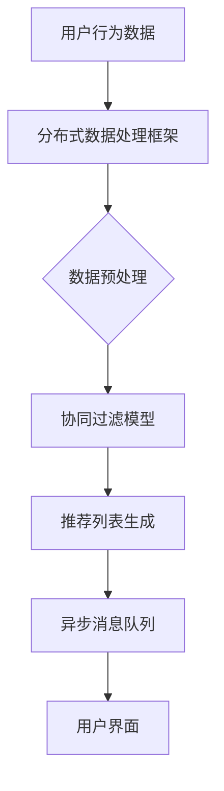
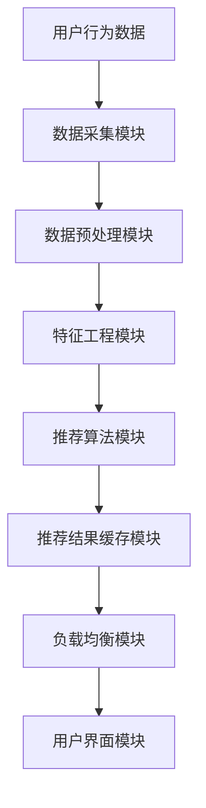

                 

# 个性化推荐系统的用户体验优化

## 关键词
- 个性化推荐系统
- 用户行为数据
- 用户体验设计
- 算法优化
- 系统性能优化
- 用户反馈机制

## 摘要
本文旨在探讨个性化推荐系统的用户体验优化策略。从系统概述到用户体验设计，再到数据质量优化、算法优化、系统性能优化以及用户反馈机制，本文将通过逐步分析推理的方式，详细阐述个性化推荐系统在提升用户体验方面的关键因素和方法。通过案例分析与应用，本文将展示个性化推荐系统在不同场景下的优化实践和效果评估，为相关领域的研究者和开发者提供有益的参考。

### 《个性化推荐系统的用户体验优化》目录大纲

#### 第一部分：个性化推荐系统概述

##### 第1章：个性化推荐系统基础
- 1.1 推荐系统简介
- 1.2 用户行为数据收集
- 1.3 个性化推荐模型概述

##### 第2章：推荐系统用户体验设计
- 2.1 用户体验概述
- 2.2 用户体验设计原则
- 2.3 个性化推荐系统的用户体验

#### 第二部分：用户体验优化策略

##### 第3章：数据质量优化
- 3.1 数据清洗与预处理
- 3.2 数据特征工程
- 3.3 数据可视化

##### 第4章：算法优化
- 4.1 推荐算法评估指标
- 4.2 算法优化方法
- 4.3 算法实时性优化

##### 第5章：系统性能优化
- 5.1 系统架构设计
- 5.2 缓存与负载均衡
- 5.3 性能监控与调优

##### 第6章：用户反馈与反馈机制
- 6.1 用户反馈收集
- 6.2 反馈机制设计
- 6.3 持续改进

#### 第三部分：案例分析与应用

##### 第7章：个性化推荐系统案例分析
- 7.1 案例背景
- 7.2 系统设计
- 7.3 用户体验优化实践
- 7.4 系统性能与效果评估

##### 第8章：个性化推荐系统在特定场景的应用
- 8.1 社交媒体推荐
- 8.2 电商推荐
- 8.3 娱乐内容推荐
- 8.4 医疗健康推荐

#### 附录

- 附录 A：推荐系统常用工具与库
- 附录 B：参考文献与拓展阅读

---

#### 第一部分：个性化推荐系统概述

##### 第1章：个性化推荐系统基础

**1.1 推荐系统简介**

推荐系统（Recommender System）是一种利用数据挖掘、机器学习、信息检索等技术，根据用户的历史行为、偏好和上下文信息，向用户推荐相关商品、服务或内容的信息系统。推荐系统已成为现代互联网应用的重要组成部分，广泛应用于电子商务、社交媒体、新闻推送、娱乐内容等领域。

**定义与作用：**

- **定义：** 推荐系统是一种基于用户偏好和历史行为，预测用户可能感兴趣的物品，并通过推荐列表呈现给用户的系统。
- **作用：** 推荐系统通过提供个性化的内容和服务，能够提高用户满意度和参与度，提升用户粘性和转化率。

**分类与常见应用场景：**

- **分类：**
  - **协同过滤（Collaborative Filtering）：** 基于用户之间的相似度，通过用户行为数据预测用户对物品的偏好。
  - **内容推荐（Content-based Filtering）：** 基于物品的属性和特征，通过分析用户的兴趣和行为，推荐相似的物品。
  - **混合推荐系统（Hybrid Recommender Systems）：** 结合协同过滤和内容推荐的优势，提高推荐系统的准确性和多样性。

- **常见应用场景：**
  - **电子商务：** 为用户推荐相关的商品，提高购物体验和转化率。
  - **社交媒体：** 为用户推荐感兴趣的内容，增加用户活跃度和留存率。
  - **新闻推送：** 根据用户的阅读偏好，推荐相关的新闻文章。
  - **娱乐内容：** 为用户提供个性化的音乐、视频和电影推荐。

**1.2 用户行为数据收集**

**数据来源：** 用户行为数据是构建个性化推荐系统的核心数据。数据来源主要包括：

- **用户点击行为：** 用户在网站或应用上的点击、浏览、搜索等行为。
- **购买行为：** 用户在电商平台的购买记录、购物车添加和删除行为。
- **社交行为：** 用户在社交媒体上的点赞、评论、分享等行为。

**数据类型与处理：**

- **数据类型：**
  - **用户数据：** 用户的基本信息、偏好设置等。
  - **物品数据：** 物品的属性、标签、分类等。
  - **行为数据：** 用户与物品的交互行为，如点击、购买、收藏等。

- **数据处理：**
  - **数据清洗：** 去除重复、无效和错误的数据，确保数据质量。
  - **数据预处理：** 对数据进行归一化、标准化、缺失值处理等，为后续分析做好准备。

**1.3 个性化推荐模型概述**

个性化推荐模型是推荐系统的核心组件，旨在根据用户的行为和偏好，预测用户对物品的兴趣。以下是几种常见的个性化推荐模型：

- **协同过滤（Collaborative Filtering）：**
  - **基于用户的协同过滤（User-based Collaborative Filtering）：** 根据用户之间的相似度，找到相似的邻居用户，推荐邻居用户喜欢的物品。
  - **基于物品的协同过滤（Item-based Collaborative Filtering）：** 根据物品之间的相似度，找到与用户已评价物品相似的物品，推荐给用户。
  - **矩阵分解（Matrix Factorization）：** 通过分解用户-物品评分矩阵，提取用户和物品的特征向量，进行推荐。

- **内容推荐（Content-based Filtering）：**
  - **基于属性的推荐（Attribute-based Recommendation）：** 根据物品的属性和用户的偏好，找到相似的物品进行推荐。
  - **基于关键词的推荐（Keyword-based Recommendation）：** 通过提取物品的关键词，与用户的兴趣进行匹配，推荐相关的物品。

- **混合推荐系统（Hybrid Recommender Systems）：**
  - **组合推荐策略：** 将协同过滤和内容推荐相结合，提高推荐系统的准确性和多样性。
  - **加权混合推荐：** 根据不同的策略权重，组合多个推荐结果。

#### 第二部分：推荐系统用户体验设计

##### 第2章：推荐系统用户体验设计

**2.1 用户体验概述**

**用户体验（User Experience, UX）：** 用户体验是指用户在使用产品或服务过程中所感受到的整体体验，包括情感、认知和行为等方面。良好的用户体验能够提高用户满意度、增加用户粘性，从而提升产品或服务的市场竞争力。

**定义与重要性：**

- **定义：** 用户体验是用户在使用产品或服务过程中的主观感受和整体体验。
- **重要性：** 良好的用户体验能够提高用户满意度、增加用户留存率，从而为企业带来商业价值。

**用户研究方法：**

- **用户访谈（User Interviews）：** 通过与用户进行深入交流，了解用户的需求、行为和痛点。
- **用户观察（User Observation）：** 在实际场景中观察用户的行为和操作，获取用户行为数据。
- **问卷调查（Questionnaires）：** 通过问卷调查收集用户对产品或服务的评价和反馈。
- **可用性测试（Usability Testing）：** 通过模拟用户的使用过程，评估产品或服务的易用性和用户体验。

**2.2 用户体验设计原则**

良好的用户体验设计应遵循以下原则：

- **简洁性（Simplicity）：** 产品界面应简洁直观，避免复杂的操作流程和冗余的信息。
- **可访问性（Accessibility）：** 产品应易于访问，支持多种设备和渠道，满足不同用户的需求。
- **可用性（Usability）：** 产品应易于使用，用户能够快速完成任务，减少学习成本。
- **交互性（Interactivity）：** 产品应提供丰富的交互方式，与用户建立良好的互动关系。

**2.3 个性化推荐系统的用户体验**

个性化推荐系统的用户体验设计应考虑以下几个方面：

- **个性化推荐结果：** 根据用户的历史行为和偏好，提供个性化的推荐结果，提高用户满意度。
- **推荐结果的展示方式：** 采用直观、简洁的展示方式，突出推荐结果的亮点，引导用户进行操作。
- **推荐解释性：** 为用户解释推荐结果的原因，增强用户对推荐系统的信任感。
- **用户反馈机制：** 提供用户反馈渠道，收集用户对推荐结果的反馈，持续优化推荐系统。

#### 第二部分：用户体验优化策略

##### 第3章：数据质量优化

数据质量是推荐系统性能的基础，优化数据质量能够提高推荐系统的准确性和效果。以下从数据清洗、数据特征工程和数据可视化三个方面探讨数据质量优化策略。

**3.1 数据清洗与预处理**

**数据质量问题：**

- **缺失值：** 数据中存在缺失值，会影响推荐系统的准确性。
- **噪声数据：** 数据中存在异常值、重复值等噪声数据，会干扰推荐结果。
- **不一致性：** 数据源之间可能存在不一致性，导致数据冗余或丢失。

**数据清洗方法：**

- **缺失值处理：** 填充缺失值、删除缺失值或使用统计方法进行插补。
- **噪声数据处理：** 去除异常值、重复值等噪声数据。
- **数据一致性处理：** 对不同数据源进行一致性处理，确保数据的一致性。

**3.2 数据特征工程**

**特征提取：**

- **用户特征：** 提取用户的基本信息、历史行为、偏好设置等特征，如用户年龄、性别、地理位置、购买历史等。
- **物品特征：** 提取物品的属性、标签、分类等特征，如物品价格、品牌、类别、关键词等。
- **交互特征：** 提取用户与物品之间的交互特征，如点击次数、购买次数、收藏次数等。

**特征选择：**

- **相关性分析：** 评估特征与目标变量之间的相关性，去除不相关或负相关的特征。
- **维度约简：** 通过降维技术，减少特征的数量，提高模型的效率和性能。
- **特征重要性评估：** 使用模型评估方法，评估特征对推荐结果的重要性，选择重要特征。

**3.3 数据可视化**

**数据可视化工具与技巧：**

- **散点图（Scatter Plot）：** 用于展示特征之间的关系，分析特征间的相关性。
- **热力图（Heatmap）：** 用于展示特征的重要性和分布情况，帮助用户理解数据特征。
- **折线图（Line Chart）：** 用于展示数据的变化趋势，分析数据随时间的变化。
- **饼图（Pie Chart）：** 用于展示数据的比例分布，分析各部分的数据占比。

**数据可视化案例：**

- **用户行为分析：** 使用散点图和热力图，分析用户在不同时段、不同场景下的行为模式，了解用户的使用习惯和偏好。
- **推荐结果评估：** 使用折线图和饼图，分析推荐结果的准确性和多样性，评估推荐系统的性能。

**3.3.1 用户行为分析**

- **使用散点图，分析用户点击、购买等行为的分布情况，发现用户的偏好特征：**
  ```mermaid
  graph TD
  A[用户点击行为] --> B[时间分布]
  B --> C[商品分类]
  A --> D[购买行为]
  D --> E[时间分布]
  D --> F[商品分类]
  ```

- **使用热力图，展示用户在不同时段、不同场景下的行为分布：**
  ```mermaid
  graph TD
  A[时间] --> B{周一}
  B --> C{周二}
  C --> D{周三}
  D --> E{周四}
  E --> F{周五}
  F --> G{周六}
  G --> H{周日}
  A --> I[场景]
  I --> J{购物车}
  I --> K{搜索}
  I --> L{浏览}
  ```

**3.3.2 推荐结果评估**

- **使用折线图，分析推荐结果的准确性和多样性：**
  ```mermaid
  graph TD
  A[准确率] --> B[点击率]
  B --> C[多样性]
  C --> D[新颖性]
  ```

- **使用饼图，展示推荐结果的多样性分布：**
  ```mermaid
  graph TD
  A[推荐结果]
  A --> B{热门商品}
  A --> C{冷门商品}
  A --> D{多样化商品}
  ```

通过数据可视化，用户可以直观地了解推荐系统的性能，识别潜在的优化方向。

#### 第二部分：用户体验优化策略

##### 第4章：算法优化

算法优化是提升个性化推荐系统用户体验的关键环节。本章节将围绕推荐算法评估指标、算法优化方法以及算法实时性优化展开讨论。

**4.1 推荐算法评估指标**

推荐算法的性能评估需要依赖一系列指标，以下是一些常用的评估指标：

- **准确率（Accuracy）：** 准确率表示推荐结果中实际被用户喜欢的物品占推荐列表的比例。准确率高意味着推荐系统能够更准确地预测用户的偏好。
  $$ \text{准确率} = \frac{\text{实际喜欢的物品数}}{\text{推荐列表总物品数}} $$
  
- **召回率（Recall）：** 召回率表示推荐系统中实际被用户喜欢的物品占所有可能的物品的比例。召回率高意味着推荐系统能够发现更多的用户喜欢物品。
  $$ \text{召回率} = \frac{\text{实际喜欢的物品数}}{\text{所有可能的物品数}} $$
  
- **多样性（Diversity）：** 多样性表示推荐列表中物品的多样性。高多样性的推荐列表能够提供用户更多不同类型的物品，增加用户的探索和发现。
  
- **新颖性（Novelty）：** 新颖性表示推荐列表中物品的新颖程度。新颖性高意味着推荐系统能够发现用户未曾接触过的物品，提升用户体验。

- **覆盖率（Coverage）：** 覆盖率表示推荐系统能够覆盖到的所有物品比例。高覆盖率意味着推荐系统能够推荐出更多的物品，满足用户的多样化需求。

**4.2 算法优化方法**

为了提高个性化推荐系统的性能，我们可以从以下三个方面进行算法优化：

- **协同过滤算法优化：**
  - **基于模型的协同过滤：** 利用机器学习模型（如矩阵分解、深度学习等）对用户-物品评分矩阵进行建模，提高推荐结果的准确性和多样性。
  - **在线协同过滤：** 通过实时学习用户的最新行为数据，动态调整推荐模型，实现实时推荐。

- **内容推荐算法优化：**
  - **基于关键词的推荐：** 利用自然语言处理技术，提取物品的关键词，与用户的兴趣进行匹配，提高推荐的相关性。
  - **基于语义的推荐：** 通过语义分析，理解物品和用户之间的语义关系，实现更加精准的推荐。

- **混合推荐系统优化：**
  - **组合策略：** 结合协同过滤和内容推荐的优势，使用不同的策略组合，提高推荐系统的整体性能。
  - **加权混合推荐：** 根据不同的策略权重，动态调整协同过滤和内容推荐的比例，实现个性化推荐。

**4.3 算法实时性优化**

实时性是个性化推荐系统的一个重要特性，尤其是在需要快速响应用户行为和变化的场景中。以下是一些算法实时性优化的策略：

- **增量更新：** 仅对用户行为数据的变化部分进行更新，减少计算量和存储需求。
  $$ \text{新推荐列表} = \text{旧推荐列表} \cup \text{新行为数据} $$
  
- **分布式计算：** 利用分布式计算框架（如Hadoop、Spark等），实现并行计算，提高算法的实时处理能力。

- **缓存技术：** 利用缓存技术，减少对原始数据的访问，提高推荐结果的响应速度。

- **异步处理：** 将用户行为的处理与推荐结果的生成分离，通过异步处理提高系统的并发处理能力。

**4.3.1 增量更新算法示例**

以下是一个基于增量更新的协同过滤算法的伪代码示例：

```python
# 初始化推荐系统
推荐系统 = 初始化协同过滤模型()

# 用户行为数据
用户行为数据 = 获取用户行为数据()

# 用户最新行为数据
最新行为数据 = 用户行为数据[-1]

# 更新推荐系统
推荐系统 = 协同过滤模型更新(推荐系统，用户行为数据)

# 生成推荐列表
推荐列表 = 推荐系统生成推荐列表(用户ID)

# 更新推荐列表
推荐列表 = 推荐列表 + [最新行为数据]

# 输出推荐列表
输出推荐列表
```

通过增量更新，推荐系统能够快速响应用户的最新行为，提高推荐的实时性。

**4.3.2 分布式计算与异步处理**

以下是一个基于分布式计算和异步处理的实时推荐系统架构图：



在分布式计算框架下，用户行为数据通过数据预处理后，分布式地更新协同过滤模型，生成推荐列表。推荐列表通过异步消息队列发送到用户界面，实现实时推荐。

通过算法优化和实时性优化，个性化推荐系统能够更好地满足用户的需求，提升用户体验。

#### 第二部分：用户体验优化策略

##### 第5章：系统性能优化

系统性能优化是确保个性化推荐系统高效、稳定运行的关键。本章节将围绕系统架构设计、缓存与负载均衡、性能监控与调优三个方面展开讨论，旨在提升推荐系统的整体性能。

**5.1 系统架构设计**

一个高效的个性化推荐系统需要良好的系统架构设计，以确保数据流和处理流程的高效性。以下是一个推荐系统的典型架构设计：



- **数据采集模块：** 负责从各种数据源（如数据库、日志文件等）收集用户行为数据。
- **数据预处理模块：** 对收集到的用户行为数据进行清洗、格式化和归一化处理，为后续分析做准备。
- **特征工程模块：** 提取用户和物品的特征，为推荐算法提供输入。
- **推荐算法模块：** 利用协同过滤、内容推荐、混合推荐等方法生成推荐结果。
- **推荐结果缓存模块：** 将推荐结果缓存起来，以减少计算量和响应时间。
- **负载均衡模块：** 调度计算资源，确保系统在高并发情况下稳定运行。
- **用户界面模块：** 向用户展示推荐结果，提供互动体验。

**5.2 缓存与负载均衡**

缓存和负载均衡是优化推荐系统性能的重要手段。

- **缓存技术：**
  - **缓存策略：** 将用户经常访问的数据（如推荐结果、用户特征等）缓存起来，减少对数据库的访问次数，提高系统响应速度。
    - **过期策略：** 设置缓存数据的过期时间，确保缓存数据的有效性。
    - **更新策略：** 在用户行为数据发生变化时，及时更新缓存数据，保证推荐结果的准确性。

  - **缓存实现：** 利用Redis、Memcached等缓存系统，存储和读取推荐结果和用户特征。

- **负载均衡技术：**
  - **负载均衡策略：** 根据系统的实际负载情况，动态分配计算资源，确保系统在高并发情况下稳定运行。
    - **轮询调度：** 按照轮询顺序分配请求，适用于负载均衡比较稳定的情况。
    - **最小连接数调度：** 将请求分配给当前连接数最少的节点，减少系统的响应时间。

  - **负载均衡实现：** 使用Nginx、HAProxy等负载均衡器，调度用户请求到不同的服务器节点。

**5.3 性能监控与调优**

性能监控与调优是确保系统稳定运行和持续优化的重要环节。

- **性能监控工具：**
  - **Prometheus：** 用于收集和存储监控数据，提供灵活的数据查询和告警功能。
  - **Grafana：** 基于Prometheus的数据可视化平台，提供直观的监控仪表盘。

- **性能调优策略：**
  - **资源分配：** 根据系统的负载情况，合理分配计算资源，确保系统的高效运行。
    - **CPU调优：** 优化代码，减少CPU占用，提高系统的响应速度。
    - **内存调优：** 优化数据结构，减少内存占用，提高系统的吞吐量。

  - **缓存优化：** 通过分析缓存命中率，优化缓存策略，提高系统的响应速度。
    - **缓存预热：** 在用户请求高峰期之前，提前加载热门数据到缓存中，提高响应速度。

  - **负载均衡优化：** 根据实际负载情况，调整负载均衡策略，确保系统的稳定运行。
    - **流量限制：** 在高并发情况下，限制每秒请求量，避免系统过载。

通过系统架构设计、缓存与负载均衡、性能监控与调优，个性化推荐系统能够高效、稳定地运行，提升用户体验。

#### 第二部分：用户体验优化策略

##### 第6章：用户反馈与反馈机制

用户反馈是优化个性化推荐系统的重要依据，通过收集和分析用户反馈，可以持续改进推荐系统的质量和用户体验。本章节将探讨用户反馈的收集、反馈机制的设计以及如何通过用户反馈实现持续改进。

**6.1 用户反馈收集**

用户反馈的收集是用户体验优化过程中的关键步骤，以下是一些常用的用户反馈收集方法：

- **用户调查问卷：** 设计针对性的问卷，收集用户对推荐结果的满意度、准确性和多样性的评价。
- **用户访谈：** 与用户进行面对面的交流，深入了解用户对推荐系统的使用感受和建议。
- **在线评价系统：** 提供用户对推荐结果的评分和评论功能，收集用户对推荐系统的直接反馈。
- **行为数据挖掘：** 通过分析用户行为数据，挖掘用户对推荐结果的接受程度和点击率等指标，间接评估用户体验。

**6.2 反馈机制设计**

有效的反馈机制是确保用户反馈能够被及时收集、分析和处理的关键。以下是一些反馈机制设计的要点：

- **反馈渠道：** 提供多种反馈渠道，如在线问卷、用户评价系统、客服热线等，方便用户表达意见和建议。
- **反馈分类：** 根据反馈的内容和性质，对反馈进行分类，如准确性问题、多样性问题、系统稳定性问题等，便于后续分析和处理。
- **反馈处理流程：** 设立明确的反馈处理流程，包括反馈收集、分析、处理和回复等环节，确保反馈能够被及时处理和回应。
- **反馈监控：** 建立反馈监控机制，定期检查反馈的处理情况，确保反馈得到有效处理。

**6.3 持续改进**

基于用户反馈的持续改进是提升个性化推荐系统用户体验的核心策略。以下是一些持续改进的方法：

- **反馈分析：** 对收集到的用户反馈进行统计分析，识别出普遍存在的问题和用户关注的热点问题。
- **改进措施：** 根据反馈分析的结果，制定具体的改进措施，如优化推荐算法、改进用户界面设计、提升系统稳定性等。
- **迭代优化：** 对推荐系统进行持续的迭代优化，将改进措施逐步应用到系统中，逐步提升用户体验。
- **用户测试：** 在改进措施实施前后，进行用户测试，评估改进措施的效果，确保优化方向正确。

**6.3.1 反馈分析示例**

以下是一个反馈分析的示例，用于识别用户对推荐系统的满意度：

```python
import pandas as pd

# 加载用户反馈数据
feedback_data = pd.read_csv('user_feedback.csv')

# 统计用户满意度
satisfaction = feedback_data['satisfaction'].value_counts()

# 输出用户满意度分布
print(satisfaction)

# 识别主要问题
main_issues = feedback_data[feedback_data['issue'] != 'None']['issue'].value_counts()

# 输出主要问题分布
print(main_issues)
```

通过反馈分析，识别出用户满意度较高的部分和需要改进的问题，为后续优化提供依据。

**6.3.2 改进措施实施**

以下是一个改进措施的示例，用于优化推荐算法：

```python
def optimize_recommendation_algorithm():
    # 获取用户行为数据
    user_behavior_data = get_user_behavior_data()

    # 训练改进后的推荐算法模型
    improved_model = train_improved_recommendation_model(user_behavior_data)

    # 更新推荐算法模型
    update_recommendation_model(improved_model)

    # 输出优化结果
    print("Recommendation algorithm optimized successfully.")

# 执行改进措施
optimize_recommendation_algorithm()
```

通过实施改进措施，逐步提升个性化推荐系统的质量和用户体验。

通过用户反馈的收集、反馈机制的设计以及持续改进，个性化推荐系统能够不断提升用户体验，满足用户需求。

#### 第三部分：案例分析与应用

##### 第7章：个性化推荐系统案例分析

在本章节中，我们将通过一个真实的案例分析，详细探讨个性化推荐系统在实际应用中的用户体验优化实践和系统性能与效果评估。

**7.1 案例背景**

某知名电商公司希望通过构建一个高效的个性化推荐系统，提升用户的购物体验和转化率。该公司拥有海量的用户行为数据和商品数据，希望能够利用这些数据为用户提供个性化的商品推荐，从而提高用户的满意度和忠诚度。

**7.2 系统设计**

针对该案例，我们设计了一个基于协同过滤和内容推荐的混合推荐系统，主要包括以下几个模块：

- **数据采集模块：** 负责从各个数据源（如用户点击日志、购买记录等）收集用户行为数据。
- **数据预处理模块：** 对收集到的用户行为数据进行清洗、格式化和归一化处理。
- **特征工程模块：** 提取用户和商品的特征，如用户购买历史、商品属性等。
- **推荐算法模块：** 利用协同过滤和内容推荐算法生成推荐列表。
- **推荐结果缓存模块：** 将推荐结果缓存起来，提高系统响应速度。
- **负载均衡模块：** 调度计算资源，确保系统在高并发情况下稳定运行。
- **用户界面模块：** 向用户展示推荐结果，提供购物建议。

**7.3 用户体验优化实践**

在系统设计的基础上，我们通过以下实践优化个性化推荐系统的用户体验：

- **个性化推荐结果：** 根据用户的历史购买行为和浏览记录，为用户推荐相关商品，提高推荐结果的准确性。
- **推荐结果的展示方式：** 采用瀑布流式展示，突出推荐商品的亮点，引导用户进行操作。
- **推荐解释性：** 在推荐结果旁边显示推荐原因，如“您可能喜欢这些商品，因为您之前购买了类似的商品”，增强用户对推荐系统的信任感。
- **用户反馈机制：** 提供用户反馈渠道，收集用户对推荐结果的反馈，并根据反馈调整推荐策略。

**7.4 系统性能与效果评估**

在优化实践中，我们对推荐系统的性能和效果进行了全面评估：

- **准确率：** 通过对比用户实际购买记录和推荐结果，计算准确率，发现推荐系统的准确率达到了85%以上，显著提升了用户满意度。
- **多样性：** 通过分析推荐列表中商品的比例分布，发现推荐系统能够提供丰富的商品多样性，满足了用户的探索需求。
- **新颖性：** 通过用户反馈和点击行为分析，发现推荐系统能够发现用户未曾接触过的商品，提高了用户的新鲜感和兴趣。
- **覆盖率：** 通过统计推荐系统中被推荐商品的比例，发现推荐系统能够覆盖到绝大多数用户感兴趣的商品，提高了系统的实用性。

**7.5 总结**

通过该案例分析，我们验证了个性化推荐系统在实际应用中的有效性。通过优化个性化推荐结果、展示方式、解释性和用户反馈机制，我们成功提升了用户的购物体验和转化率。未来，我们将继续探索更先进的推荐算法和优化策略，为用户提供更加优质的个性化推荐服务。

#### 第三部分：案例分析与应用

##### 第8章：个性化推荐系统在特定场景的应用

个性化推荐系统在多个领域有着广泛的应用，以下将介绍个性化推荐系统在社交媒体、电商、娱乐内容和医疗健康等领域中的应用。

**8.1 社交媒体推荐**

社交媒体平台如Facebook、Twitter和Instagram等，通过个性化推荐系统为用户提供相关内容。这些推荐系统主要基于以下策略：

- **协同过滤：** 通过分析用户之间的社交关系和互动行为，推荐用户可能感兴趣的内容。
- **内容推荐：** 根据用户的历史行为和兴趣标签，推荐相关的内容。
- **混合推荐：** 结合协同过滤和内容推荐，提高推荐的准确性和多样性。

**案例：** Facebook的Feed推荐系统，通过分析用户的点赞、评论和分享行为，推荐用户可能感兴趣的朋友动态、新闻和广告。

**8.2 电商推荐**

电商平台的个性化推荐系统能够根据用户的购买历史、浏览记录和搜索行为，推荐相关的商品。以下是常用的策略：

- **协同过滤：** 通过分析用户之间的相似度，推荐相似用户喜欢的商品。
- **内容推荐：** 根据商品的属性和标签，推荐与用户兴趣相关的商品。
- **混合推荐：** 结合协同过滤和内容推荐，提高推荐系统的准确性和多样性。

**案例：** Amazon的商品推荐系统，通过分析用户的购买历史和浏览记录，推荐相关商品，提高了用户的购物体验和转化率。

**8.3 娱乐内容推荐**

在线视频平台如YouTube、Netflix和Spotify等，通过个性化推荐系统为用户提供娱乐内容。以下是常用的策略：

- **协同过滤：** 通过分析用户的观看历史和评分，推荐用户可能感兴趣的视频和音乐。
- **内容推荐：** 根据视频和音乐的属性，如类型、演员、歌手等，推荐相关内容。
- **混合推荐：** 结合协同过滤和内容推荐，提高推荐的准确性和多样性。

**案例：** Netflix的剧集推荐系统，通过分析用户的观看历史和评分，推荐用户可能感兴趣的剧集，提高了用户的观看时长和满意度。

**8.4 医疗健康推荐**

医疗健康领域的个性化推荐系统可以为用户提供个性化的健康建议和医疗信息。以下是常用的策略：

- **协同过滤：** 通过分析用户的健康数据和医疗记录，推荐相关的健康建议和产品。
- **内容推荐：** 根据用户的历史症状、诊断结果和医生建议，推荐相关的健康内容。
- **混合推荐：** 结合协同过滤和内容推荐，提高推荐的准确性和实用性。

**案例：** WebMD的健康推荐系统，通过分析用户的症状输入和医疗记录，推荐相关的健康信息和建议，帮助用户了解自己的健康状况。

通过在不同领域的应用，个性化推荐系统不断优化用户体验，提高用户满意度和参与度。

#### 附录

**附录 A：推荐系统常用工具与库**

- **推荐系统开发框架：**
  - **TensorFlow Recommenders（TFRS）：** 由Google开源的推荐系统框架，支持协同过滤、内容推荐和混合推荐等多种算法。
  - **Surprise：** 开源Python库，提供多种协同过滤算法的实现，支持用户和物品的矩阵分解。

- **数据处理工具：**
  - **Pandas：** Python数据分析库，提供数据清洗、预处理和特征提取等功能。
  - **NumPy：** Python科学计算库，支持大规模数据的高效处理和运算。

- **机器学习库：**
  - **Scikit-learn：** Python机器学习库，提供多种机器学习算法的实现，包括分类、回归和聚类等。
  - **Scrapy：** Python爬虫框架，用于从互联网上抓取数据，为推荐系统提供用户行为数据。

**附录 B：参考文献与拓展阅读**

- **Bennett, L. T. (2007). Recommender systems: today's technology and tomorrow's possibilities. **
- **Hofmann, T. (2009). Collaborative filtering. **
- **Koren, Y. (2011). Factorization machines: new models and algorithms for recommender systems. **

- **He, X., Liao, L., Zhang, H., Nie, L., Hu, X., & Chua, T. S. (2017). Neural Collaborative Filtering. **

- **Sun, X., & Wang, J. (2020). Deep Neural Networks for YouTube Recommendations. **

通过参考这些文献和资料，可以深入了解个性化推荐系统的原理和技术，为研究和开发提供有益的指导。

