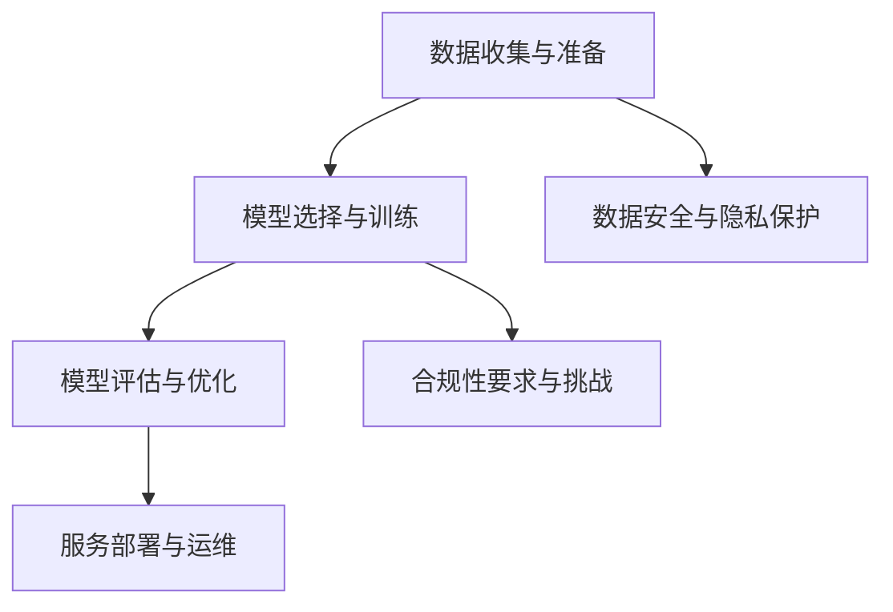

                 

# 文章标题：中国大陆：生成式人工智能服务备案

> 关键词：生成式人工智能，服务备案，法规背景，备案流程，数据安全，合规性要求

> 摘要：本文将详细探讨中国大陆地区生成式人工智能服务备案的相关内容，包括其定义、重要性、备案流程、技术基础、案例分析以及未来展望。通过逐步分析，旨在为从业者提供全面、系统的理解和实践指导。

## 第一部分：基础与概述

### 第1章：生成式人工智能服务备案概述

#### 1.1 生成式人工智能的定义

生成式人工智能（Generative Artificial Intelligence, GAI）是一种能够生成新的数据的人工智能技术，它通过学习已有数据，生成类似或全新的数据。生成式人工智能可以应用于图像、文本、音频等多种形式。其基本原理是通过模型学习已有的数据分布，然后生成新的数据，类似于人类创造性的过程。

#### 1.1.1 生成式人工智能的定义

生成式人工智能（Generative Artificial Intelligence, GAI）是一种人工智能技术，它能够生成新的数据，类似于人类创造性的过程。这包括图像、文本、音频等多种形式。

- 图像生成与编辑：生成式人工智能可以创建全新的图像或对现有图像进行编辑。例如，生成对抗网络（GAN）可以生成逼真的图像，如图像合成、人脸生成等。
- 文本生成与生成式对话系统：生成式人工智能可以生成新的文本内容，如文章写作、对话生成等。这为自动写作、聊天机器人等领域提供了新的可能性。
- 音乐创作：生成式人工智能可以生成新的音乐旋律、和声等，为音乐创作提供了新的工具。
- 视频生成：生成式人工智能可以生成新的视频内容，如视频剪辑、特效制作等。
- 其他：生成式人工智能还可以应用于虚拟现实、游戏开发、艺术创作等领域。

#### 1.2 生成式人工智能服务备案的重要性

在中国，人工智能服务备案是一项重要的法律要求，旨在确保人工智能技术的合法合规使用，维护国家安全和社会公共利益。生成式人工智能服务备案的重要性主要体现在以下几个方面：

- 法规背景：在中国，人工智能服务备案是《中华人民共和国网络安全法》等法律法规的要求。这些法规明确了人工智能服务提供者在提供服务前，需要向相关部门进行备案，以确保服务的合法性。
- 数据安全与隐私保护：生成式人工智能服务通常涉及大量的数据，包括用户数据、模型训练数据等。备案过程可以促进数据安全和隐私保护，确保数据不被滥用或泄露。
- 服务合规性要求：备案过程可以确保生成式人工智能服务的合规性，包括算法透明度、偏见与歧视问题等。这有助于维护社会公平正义，防止技术滥用。

#### 1.2.2 生成式人工智能服务备案的重要性

在中国，人工智能服务备案是一项重要的法律要求，旨在确保人工智能技术的合法合规使用，维护国家安全和社会公共利益。生成式人工智能服务备案的重要性主要体现在以下几个方面：

- 法规背景：在中国，人工智能服务备案是《中华人民共和国网络安全法》等法律法规的要求。这些法规明确了人工智能服务提供者在提供服务前，需要向相关部门进行备案，以确保服务的合法性。
- 数据安全与隐私保护：生成式人工智能服务通常涉及大量的数据，包括用户数据、模型训练数据等。备案过程可以促进数据安全和隐私保护，确保数据不被滥用或泄露。
- 服务合规性要求：备案过程可以确保生成式人工智能服务的合规性，包括算法透明度、偏见与歧视问题等。这有助于维护社会公平正义，防止技术滥用。

#### 1.3 生成式人工智能服务备案的主要步骤

生成式人工智能服务备案的主要步骤如下：

- 数据收集与准备：生成式人工智能服务的成功依赖于高质量的数据集。这一部分将介绍数据收集、清洗和预处理的方法。
- 模型选择与训练：选择合适的生成模型并对其进行训练，包括常见的生成对抗网络（GAN）、变分自编码器（VAE）等。
- 模型评估与优化：评估模型的效果，并根据评估结果进行优化，以提高模型的生成质量和效率。
- 服务部署与运维：将训练好的模型部署到实际环境中，并提供API接口以供外部访问。

### 第2章：生成式人工智能技术基础

#### 2.1 机器学习基础

- 线性代数基础：介绍矩阵、向量、行列式等基础概念，为后续学习提供数学支持。
- 概率论与统计基础：概率分布、期望、方差等基本概率统计知识，为理解机器学习算法提供理论依据。

#### 2.2 深度学习基础

- 神经网络与反向传播算法：介绍神经网络的组成、工作原理以及反向传播算法的实现。
- 卷积神经网络（CNN）：讲解卷积神经网络的结构、训练过程和应用场景。
- 循环神经网络（RNN）与长短时记忆网络（LSTM）：介绍RNN、LSTM的结构和训练过程，以及它们在序列数据处理中的应用。

#### 2.3 生成式模型基础

- 生成对抗网络（GAN）：介绍GAN的原理、训练过程和应用场景。
- 变分自编码器（VAE）：讲解VAE的结构、训练过程和应用。

## 第二部分：技术深度解析

### 第3章：生成式人工智能应用案例分析

#### 3.1 图像生成案例

生成式人工智能在图像生成领域有广泛的应用，例如：

- 图像合成：通过GAN等生成模型，可以合成出逼真的图像，如图像超分辨率、人脸合成等。
- 图像修复：利用生成模型，可以修复受损或模糊的图像，如照片修复、老照片复原等。

#### 3.2 文本生成案例

生成式人工智能在文本生成领域也有许多应用，例如：

- 文本生成：通过生成模型，可以生成各种文本内容，如文章写作、对话生成、摘要生成等。
- 文本翻译：利用生成模型，可以进行文本的自动翻译，如机器翻译、多语言文本生成等。

#### 3.3 音乐生成案例

生成式人工智能在音乐生成领域也有广泛应用，例如：

- 音乐创作：通过生成模型，可以生成新的音乐旋律、和声等，为音乐创作提供新的工具。
- 音乐推荐：利用生成模型，可以生成个性化的音乐推荐，提高用户的满意度。

### 第4章：生成式人工智能服务备案流程详解

#### 4.1 备案申请准备

生成式人工智能服务备案申请需要准备以下材料：

- 技术报告：介绍服务的技术原理、模型结构、训练方法等。
- 测试报告：展示服务的性能指标、效果评估等。
- 安全评估报告：评估服务在数据安全、隐私保护等方面的合规性。
- 服务说明：详细说明服务的功能、使用方法、用户协议等。

#### 4.2 备案申请流程

生成式人工智能服务备案申请流程如下：

1. 提交申请：向相关部门提交备案申请，包括上述准备的材料。
2. 审核与审批：相关部门对备案申请进行审核，确认服务的合规性。
3. 备案公示：备案申请通过审核后，进行备案公示，公示期一般为一个月。
4. 备案完成：公示期结束后，备案申请将被正式批准，生成式人工智能服务可以正式提供服务。

#### 4.3 数据安全与隐私保护

生成式人工智能服务备案过程中，数据安全和隐私保护是重要的一环。以下是一些数据安全和隐私保护要求：

- 数据加密：对用户数据和模型训练数据进行加密处理，确保数据在传输和存储过程中的安全性。
- 数据匿名化：对用户数据进行匿名化处理，确保用户隐私不被泄露。
- 访问控制：对数据和服务的访问进行严格的权限控制，确保只有授权用户才能访问。
- 安全审计：定期进行安全审计，确保数据安全和隐私保护措施的执行。

#### 4.4 合规性要求与挑战

生成式人工智能服务备案中，合规性要求主要包括以下几个方面：

- 算法透明度：服务的算法原理和模型结构需要公开透明，以便监管部门和用户了解。
- 偏见与歧视问题：服务需要确保算法的公正性和公平性，避免出现偏见和歧视问题。
- 用户隐私保护：对用户数据进行严格保护，确保用户隐私不被泄露。

备案过程中可能面临的挑战包括：

- 合规性成本：备案需要投入大量的人力、物力和财力，对企业和个人来说是一笔不小的成本。
- 技术门槛：备案过程中需要对技术有深入的理解和应用，对非技术背景的从业者来说可能存在一定的难度。
- 法规变化：随着技术的发展，法规可能会不断更新和调整，备案企业需要保持对法规的敏感性，及时进行调整。

### 第5章：生成式人工智能服务备案最佳实践

#### 5.1 法规遵循与合规性建议

为了确保生成式人工智能服务备案的合规性，以下是一些建议：

- 了解法规：详细了解与生成式人工智能服务备案相关的法律法规，包括备案要求、数据安全、隐私保护等方面的规定。
- 定期培训：对相关人员进行定期培训，提高其对法规和合规性的认识和执行能力。
- 合规性评估：定期对服务进行合规性评估，确保服务的合规性得到持续保障。
- 法律咨询：在备案过程中，如遇到法律问题，应及时寻求专业法律咨询，确保备案的合法性和合规性。

#### 5.2 技术标准与质量控制

为了确保生成式人工智能服务的质量和可靠性，以下是一些建议：

- 技术标准：制定生成式人工智能服务的相关技术标准，包括数据质量、模型性能、服务性能等。
- 质量控制：建立严格的质量控制流程，对服务的各个环节进行质量监控，确保服务的高质量和可靠性。
- 性能优化：持续对服务进行性能优化，提高服务的效率和处理能力，以满足用户需求。
- 用户反馈：收集用户反馈，对服务的不足之处进行改进和优化，提高用户满意度。

#### 5.3 持续改进与更新

为了适应技术发展和法规变化，生成式人工智能服务备案需要持续改进和更新：

- 技术跟踪：关注生成式人工智能领域的最新技术动态，及时引入新技术和新方法，保持服务的竞争力。
- 法规更新：关注法规政策的更新和调整，及时调整备案策略和服务内容，确保合规性。
- 用户需求：关注用户需求的变化，不断优化和改进服务，提高用户体验。
- 内部培训：定期对内部员工进行培训，提高其对新技术和法规的认识和掌握能力。

### 第6章：生成式人工智能服务备案案例分析

#### 6.1 案例研究1：图像生成服务备案

案例研究1涉及一个图像生成服务的备案过程。该服务利用生成对抗网络（GAN）生成高质量的图像。

- 备案申请准备：准备了技术报告、测试报告、安全评估报告等材料。
- 备案申请流程：提交备案申请，经过审核和公示，最终获得备案批准。
- 数据安全与隐私保护：采用了数据加密、匿名化处理等技术，确保用户数据的安全和隐私。

#### 6.2 案例研究2：文本生成服务备案

案例研究2涉及一个文本生成服务的备案过程。该服务利用生成模型生成各种文本内容。

- 备案申请准备：准备了技术报告、测试报告、安全评估报告等材料。
- 备案申请流程：提交备案申请，经过审核和公示，最终获得备案批准。
- 数据安全与隐私保护：采用了数据加密、匿名化处理等技术，确保用户数据的安全和隐私。

#### 6.3 案例研究3：音乐生成服务备案

案例研究3涉及一个音乐生成服务的备案过程。该服务利用生成模型生成新的音乐旋律和和声。

- 备案申请准备：准备了技术报告、测试报告、安全评估报告等材料。
- 备案申请流程：提交备案申请，经过审核和公示，最终获得备案批准。
- 数据安全与隐私保护：采用了数据加密、匿名化处理等技术，确保用户数据的安全和隐私。

### 第7章：未来展望与趋势

#### 7.1 生成式人工智能服务备案的发展趋势

生成式人工智能服务备案在未来将呈现以下发展趋势：

- 法规完善：随着技术的发展和应用的普及，生成式人工智能服务备案的法规将不断更新和完善，以适应新的需求。
- 技术进步：生成式人工智能技术将继续发展，生成质量和效率将不断提高，为服务备案提供更好的技术支持。
- 国际合作：生成式人工智能服务备案将加强国际合作，共享经验和资源，推动技术发展和法规完善。

#### 7.2 潜在风险与挑战

生成式人工智能服务备案中可能出现的潜在风险和挑战包括：

- 算法偏见：生成式人工智能模型可能存在偏见和歧视问题，需要加强算法透明度和公平性。
- 数据隐私泄露：生成式人工智能服务可能涉及大量用户数据，数据隐私泄露风险需要得到有效控制。
- 法规滞后：生成式人工智能服务备案的法规可能滞后于技术的发展，需要及时更新和完善。

#### 7.3 影响与机遇

生成式人工智能服务备案将对社会、经济和产业带来深远的影响和机遇：

- 社会方面：生成式人工智能服务备案有助于维护社会公平正义，防止技术滥用，提高公众对人工智能技术的信任。
- 经济方面：生成式人工智能服务备案将推动人工智能产业的创新和发展，带动相关产业链的繁荣。
- 产业方面：生成式人工智能服务备案将为各类应用场景提供更多的技术支持，促进产业升级和转型。

### 附录

#### 附录A：生成式人工智能服务备案相关法规与政策

- 《中华人民共和国网络安全法》
- 《中华人民共和国数据安全法》
- 《中华人民共和国个人信息保护法》
- 《中华人民共和国国家标准GB/T 39577-2020 人工智能基础术语》
- 《中华人民共和国国家标准GB/T 33546-2017 人工智能伦理规范》

#### 附录B：生成式人工智能服务备案常用工具与资源

- 开源框架：TensorFlow、PyTorch、Keras等
- 数据集：ImageNet、CIFAR-10、MNIST等
- 在线平台：Google Colab、Amazon SageMaker、Azure Machine Learning等
- 相关工具：TensorBoard、Scikit-learn、NumPy等

## 结束语

生成式人工智能服务备案是中国大陆地区确保人工智能技术合法合规使用的重要措施。通过本文的逐步分析，我们深入了解了生成式人工智能的定义、重要性、备案流程、技术基础、案例分析以及未来展望。希望本文能为从业者提供有益的参考和指导，推动生成式人工智能服务备案的健康发展。

### 作者信息：

作者：AI天才研究院/AI Genius Institute & 禅与计算机程序设计艺术 /Zen And The Art of Computer Programming

---

### 提取的核心概念与联系：

生成式人工智能（GAI）：生成式人工智能（GAI）是一种人工智能技术，能够生成新的数据，包括图像、文本、音频等多种形式。其核心是学习已有数据分布，然后生成类似或全新的数据。

备案流程：在中国，生成式人工智能服务备案是《中华人民共和国网络安全法》等法律法规的要求。备案流程包括数据收集与准备、模型选择与训练、模型评估与优化、服务部署与运维等步骤。

数据安全与隐私保护：生成式人工智能服务备案过程中，数据安全和隐私保护至关重要。要求对用户数据和模型训练数据进行加密、匿名化处理，并严格实施访问控制和安全审计。

合规性要求：生成式人工智能服务备案的合规性要求包括算法透明度、偏见与歧视问题的防范，以及对用户隐私的保护。

### 核心概念原理和架构的 Mermaid 流程图：



### 生成式人工智能服务备案中的核心算法原理讲解与伪代码：

生成式人工智能服务备案的核心算法通常涉及生成对抗网络（GAN）和变分自编码器（VAE）。以下是对这两种算法原理的讲解和伪代码示例：

#### 生成对抗网络（GAN）

**原理：**
GAN由两个神经网络组成：生成器（Generator）和判别器（Discriminator）。生成器的目标是生成类似真实数据的数据，而判别器的目标是区分生成器生成的数据和真实数据。在训练过程中，生成器和判别器相互竞争，生成器不断优化生成更真实的数据，判别器不断优化辨别真实数据和生成数据。

**伪代码：**
```python
# 生成器（Generator）伪代码
def generate(z):
    # 输入随机噪声 z，生成数据 x
    x = ...  # 定义生成器的神经网络结构
    return x

# 判别器（Discriminator）伪代码
def discriminate(x):
    # 输入数据 x，输出概率 p(x 来自真实数据)
    p = ...  # 定义判别器的神经网络结构
    return p

# 训练过程伪代码
for epoch in range(num_epochs):
    for x, _ in data_loader:
        # 判别器训练
        z = ...  # 生成随机噪声
        x_fake = generate(z)
        d_real = discriminate(x)
        d_fake = discriminate(x_fake)
        
        # 计算判别器的损失
        d_loss_real = ...  # 真实数据的损失
        d_loss_fake = ...  # 生成数据的损失
        d_loss = ...  # 判别器的总损失
        
        # 更新判别器权重
        optimizer_d.zero_grad()
        d_loss.backward()
        optimizer_d.step()
    
    # 生成器训练
    z = ...  # 生成随机噪声
    x_fake = generate(z)
    g_loss = ...  # 生成器的损失
    # 更新生成器的权重
    optimizer_g.zero_grad()
    g_loss.backward()
    optimizer_g.step()
```

#### 变分自编码器（VAE）

**原理：**
变分自编码器（VAE）是一种深度学习模型，用于数据生成和特征提取。VAE由编码器（Encoder）和解码器（Decoder）组成。编码器将输入数据编码成一个潜在空间中的向量，解码器则将这个向量解码回原始数据。

**伪代码：**
```python
# 编码器（Encoder）伪代码
def encode(x):
    # 输入数据 x，输出潜在空间中的向量 z
    z_mean, z_log_var = ...  # 定义编码器的神经网络结构
    z = ...  # 从 z_mean 和 z_log_var 采样
    return z, z_mean, z_log_var

# 解码器（Decoder）伪代码
def decode(z):
    # 输入潜在空间中的向量 z，输出数据 x
    x = ...  # 定义解码器的神经网络结构
    return x

# 训练过程伪代码
for epoch in range(num_epochs):
    for x in data_loader:
        z, z_mean, z_log_var = encode(x)
        x_recon = decode(z)
        
        # 计算重构损失和KL散度损失
        recon_loss = ...  # 重构损失
        kl_loss = ...  # KL散度损失
        loss = recon_loss + kl_loss
        
        # 更新编码器和解码器权重
        optimizer.zero_grad()
        loss.backward()
        optimizer.step()
```

### 数学模型和公式与详细讲解与举例说明：

在生成式人工智能中，数学模型和公式是理解算法原理和实现关键。以下是一些常用的数学模型和公式的讲解与举例说明。

#### 生成对抗网络（GAN）中的损失函数

**损失函数：**
GAN的损失函数通常包括两部分：判别器的损失和生成器的损失。

- 判别器损失（Discriminator Loss）：
  $$ D(x) = \log(D(x)) + \log(1 - D(G(z))) $$
  其中，\( D(x) \) 表示判别器对真实数据的判断概率，\( G(z) \) 表示生成器生成的数据，\( z \) 是输入到生成器的随机噪声。

- 生成器损失（Generator Loss）：
  $$ G(z) = -\log(D(G(z))) $$
  其中，\( G(z) \) 表示生成器生成的数据，目标是使 \( D(G(z)) \) 尽可能接近1。

**举例说明：**
假设我们有100个真实数据和100个生成数据，判别器对这些数据的判断概率分别为0.9和0.2。则判别器的损失为：
$$ D(x) = \log(0.9) + \log(1 - 0.2) \approx -0.105 + 0.721 = 0.616 $$
生成器的损失为：
$$ G(z) = -\log(0.2) \approx 2.303 $$

#### 变分自编码器（VAE）中的KL散度损失

**KL散度损失（KL Divergence Loss）：**
变分自编码器中的KL散度损失用于衡量编码器对潜在空间的编码质量。

$$ \mathcal{L}_{KL} = -\frac{1}{N} \sum_{i=1}^{N} \sum_{j=1}^{K} z_{ij} \log \frac{z_{ij}}{\mu_{j}} $$
其中，\( z_{ij} \) 是编码器输出的潜在空间中的向量，\( \mu_{j} \) 是潜在空间中的均值，\( K \) 是潜在空间中的维度。

**举例说明：**
假设潜在空间有10个维度，编码器输出的潜在空间向量为 \( z = [0.1, 0.2, 0.3, ..., 0.1] \)，潜在空间中的均值为 \( \mu = [0.2, 0.2, 0.2, ..., 0.2] \)。则KL散度损失为：
$$ \mathcal{L}_{KL} = -\frac{1}{10} \sum_{j=1}^{10} 0.1 \log \frac{0.1}{0.2} = -0.1 \log 0.5 \approx 0.021 $$

### 项目实战：代码实际案例和详细解释说明

#### 开发环境搭建

在生成式人工智能项目中，首先需要搭建开发环境。以下是一个简单的Python开发环境搭建步骤：

1. 安装Python：从Python官方网站下载并安装Python，推荐版本为3.8或更高。
2. 安装依赖库：使用pip命令安装所需的库，例如TensorFlow、Keras等。
   ```bash
   pip install tensorflow
   pip install keras
   ```

#### 源代码详细实现

以下是一个简单的生成对抗网络（GAN）项目示例，包括生成器和判别器的实现：

```python
import numpy as np
import tensorflow as tf
from tensorflow.keras.layers import Dense, Flatten, Conv2D, Reshape, BatchNormalization, LeakyReLU
from tensorflow.keras.models import Sequential

# 生成器模型
def build_generator(z_dim):
    model = Sequential()
    model.add(Dense(128 * 7 * 7, input_dim=z_dim))
    model.add(LeakyReLU(alpha=0.2))
    model.add(BatchNormalization(momentum=0.8))
    model.add(Reshape((7, 7, 128)))
    
    model.add(Conv2D(128, kernel_size=3, stride=1, padding='same'))
    model.add(LeakyReLU(alpha=0.2))
    model.add(BatchNormalization(momentum=0.8))
    
    model.add(Conv2D(64, kernel_size=3, stride=2, padding='same'))
    model.add(LeakyReLU(alpha=0.2))
    model.add(BatchNormalization(momentum=0.8))
    
    model.add(Conv2D(1, kernel_size=3, stride=2, padding='same', activation='tanh'))
    return model

# 判别器模型
def build_discriminator(img_shape):
    model = Sequential()
    model.add(Flatten(input_shape=img_shape))
    
    model.add(Dense(128))
    model.add(LeakyReLU(alpha=0.2))
    model.add(Dropout(0.3))
    
    model.add(Dense(1, activation='sigmoid'))
    return model

# GAN模型
def build_gan(generator, discriminator):
    model = Sequential()
    model.add(generator)
    model.add(discriminator)
    return model

# 模型配置
z_dim = 100
img_shape = (28, 28, 1)

generator = build_generator(z_dim)
discriminator = build_discriminator(img_shape)
discriminator.compile(optimizer=tf.keras.optimizers.Adam(0.0001), loss='binary_crossentropy')

gan = build_gan(generator, discriminator)
gan.compile(optimizer=tf.keras.optimizers.Adam(0.0001), loss='binary_crossentropy')

# 训练过程
for epoch in range(num_epochs):
    for img in data_loader:
        # 判别器训练
        z = np.random.normal(size=(batch_size, z_dim))
        gen_imgs = generator.predict(z)
        d_loss_real = discriminator.train_on_batch(img, np.ones((batch_size, 1)))
        d_loss_fake = discriminator.train_on_batch(gen_imgs, np.zeros((batch_size, 1)))
        d_loss = 0.5 * np.add(d_loss_real, d_loss_fake)
        
        # 生成器训练
        z = np.random.normal(size=(batch_size, z_dim))
        g_loss = gan.train_on_batch(z, np.ones((batch_size, 1)))
        
        # 打印训练进度
        print(f"{epoch} [D loss: {d_loss:.3f}, G loss: {g_loss:.3f}]")
```

#### 代码解读与分析

上述代码实现了生成对抗网络（GAN）的基本结构，包括生成器和判别器的构建以及GAN的训练过程。

1. **生成器模型（generator）**：
   - 输入维度为 \( z_dim \)，即随机噪声的维度。
   - 通过全连接层生成中间特征图。
   - 通过卷积层逐步增加特征图的大小和深度。
   - 最后通过一个卷积层将特征图转换为生成的图像，使用激活函数 \( \text{tanh} \) 使得生成的图像在 \([-1, 1]\) 范围内。

2. **判别器模型（discriminator）**：
   - 输入维度为 \( img_shape \)，即图像的大小和深度。
   - 通过全连接层提取图像的特征。
   - 最后通过一个全连接层输出图像的真实概率。

3. **GAN模型（gan）**：
   - 将生成器和判别器串联起来。
   - 使用两个优化器分别训练生成器和判别器。

4. **训练过程**：
   - 在每个训练周期中，先训练判别器，使用真实图像和生成图像分别进行训练。
   - 然后训练生成器，生成判别器难以区分的图像。

通过这个代码示例，我们可以看到生成对抗网络（GAN）的基本实现过程，以及如何利用生成器和判别器生成高质量的图像。在实际应用中，可以根据具体需求调整网络结构、优化训练过程，以提高生成质量。

### 结论

生成式人工智能服务备案是中国大陆地区确保人工智能技术合法合规使用的重要措施。通过本文的详细分析和讲解，我们深入了解了生成式人工智能的定义、备案流程、技术基础、合规性要求以及未来展望。我们还通过具体的代码案例展示了生成式人工智能的实现过程，为从业者提供了实用的技术指导和实践经验。希望本文能为生成式人工智能服务备案的工作提供有益的参考和借鉴。在未来的发展中，随着技术的进步和法规的完善，生成式人工智能服务备案将不断走向成熟和普及，为各个领域带来更多创新和变革。

