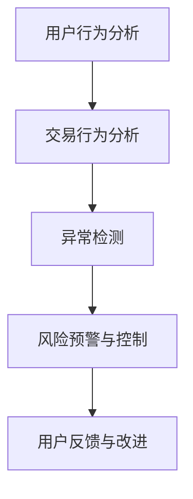

                 

### 文章标题

《交易监控技术在电商欺诈检测中的应用》

交易欺诈是电商行业中一个长期存在的问题，它不仅损害了消费者的利益，也对电商平台的信誉和运营造成了巨大的威胁。随着电商交易的不断增长，欺诈手段也变得越来越复杂和隐蔽。为了有效地打击欺诈行为，交易监控技术应运而生。本文将深入探讨交易监控技术在电商欺诈检测中的应用，分析其核心概念、算法原理，以及在实际项目中的成功案例和优化策略。

本文分为四个主要部分：

**第一部分：引言**

1.1 书籍背景与目的

1.2 电商欺诈的类型与特点

**第二部分：交易监控技术基础**

2.1 交易监控技术概述

2.2 监控技术核心概念与联系

2.3 核心算法原理讲解

2.4 数学模型和数学公式讲解

**第三部分：交易监控在电商欺诈检测中的应用**

3.1 应用场景与案例分析

3.2 项目实战：电商欺诈检测系统的开发

3.3 监控系统的优化与迭代

**第四部分：未来趋势与展望**

4.1 交易监控技术的发展方向

4.2 电商欺诈检测的挑战与机遇

4.3 未来展望

通过逐步深入的分析，本文旨在为读者提供一个全面而深刻的交易监控技术理解，以及其在电商欺诈检测中的实际应用价值。

> 关键词：交易监控、电商欺诈、欺诈检测、核心算法、数学模型、应用实践、系统优化

> 摘要：本文详细探讨了交易监控技术在电商欺诈检测中的应用。首先介绍了电商欺诈的现状及其影响，随后分析了交易监控技术的定义、核心概念、算法原理和数学模型。通过实际案例和项目实战，本文展示了交易监控技术在电商欺诈检测中的有效性。最后，对交易监控技术的发展方向和未来挑战进行了展望，提出了可能的优化策略。

---

## 第一部分：引言

### 1.1 书籍背景与目的

电商欺诈作为一种日益猖獗的现象，已经成为全球范围内的普遍问题。根据统计数据显示，全球电商交易中的欺诈率逐年上升，给消费者和电商平台带来了巨大的经济损失。欺诈行为不仅包括虚假订单、恶意退款，还涵盖了账户被盗、虚假评价等多种形式。这些欺诈行为不仅侵害了消费者的权益，还严重损害了电商平台的声誉和运营效率。

交易监控技术，作为一种先进的欺诈检测手段，其核心目的是通过分析交易数据和行为模式，及时发现并预防潜在的欺诈行为。这种技术不仅在电商领域，也在金融、支付等多个行业得到了广泛应用。本文旨在通过对交易监控技术的详细分析，探讨其在电商欺诈检测中的应用价值，为电商行业提供一种有效的解决方案。

本文的目标是：

1. 深入理解电商欺诈的现状和特点。
2. 分析交易监控技术的定义、核心概念和算法原理。
3. 通过实际案例和项目实战，展示交易监控技术在电商欺诈检测中的有效性。
4. 探讨交易监控技术的优化策略和发展方向。

文章的结构安排如下：

- 第一部分：引言，介绍电商欺诈的现状和交易监控技术的背景与目的。
- 第二部分：交易监控技术基础，详细讲解交易监控技术的核心概念、算法原理和数学模型。
- 第三部分：交易监控在电商欺诈检测中的应用，分析交易监控技术在电商欺诈检测中的应用场景和实际案例。
- 第四部分：未来趋势与展望，讨论交易监控技术的发展方向和未来挑战。

通过本文的阅读，读者将能够全面理解交易监控技术在电商欺诈检测中的作用，掌握相关的核心概念和技术原理，并能够对未来的发展趋势有更深入的认识。

### 1.2 电商欺诈的类型与特点

电商欺诈行为形式多样，且不断演变，因此对其进行分类和了解其特点至关重要。以下是一些常见的电商欺诈类型及其特点：

#### 1. 账户盗用

账户盗用是电商欺诈中最常见的形式之一。欺诈者通过非法手段获取消费者的账户信息，如用户名、密码、支付信息等，然后使用这些信息进行购物或退款。特点包括：

- **隐蔽性**：欺诈行为往往不易被消费者察觉。
- **大规模性**：一旦账户信息被窃取，可能涉及多个订单和大量资金。

#### 2. 虚假订单

虚假订单是指欺诈者通过创建虚假账户或使用他人账户，生成虚假订单进行购物。特点包括：

- **难以追踪**：虚假订单往往没有实际物流信息，给追查带来困难。
- **资金转移**：通过虚假订单，欺诈者可以将资金转移到自己的账户。

#### 3. 恶意退款

恶意退款是欺诈者通过合法的购物行为，然后利用退款流程进行非法获利。特点包括：

- **流程合规**：欺诈者通常会遵守退款流程，使退款显得合理。
- **高频次**：欺诈者可能会反复申请退款，以达到非法获利的目的。

#### 4. 虚假评价

虚假评价是指欺诈者通过制造虚假好评或差评，操纵商品评分和排名，从而影响消费者的购买决策。特点包括：

- **虚假信息**：欺诈者提供的评价往往是虚假的，无法反映真实情况。
- **影响广泛**：虚假评价可能误导大量消费者，对电商平台的声誉造成损害。

#### 5. 假冒商品

假冒商品是指欺诈者销售伪造的、质量低劣的或与描述不符的商品。特点包括：

- **误导性**：欺诈者通过虚假宣传，使消费者误认为购买的是正品。
- **消费者维权难**：消费者购买到假冒商品后，维权过程复杂且成功率低。

#### 6. 钓鱼攻击

钓鱼攻击是欺诈者通过发送假冒的电商网站链接或邮件，诱导消费者输入个人信息和支付信息。特点包括：

- **欺骗性强**：欺诈者通常会伪造与真实电商平台类似的界面。
- **损失巨大**：一旦消费者输入信息，可能导致严重经济损失和个人信息泄露。

#### 7. 恶意软件传播

恶意软件传播是指欺诈者通过电商平台传播病毒或恶意软件，感染消费者的设备。特点包括：

- **隐蔽性**：恶意软件不易被消费者察觉。
- **破坏性**：恶意软件可能导致设备崩溃、信息泄露或其他严重后果。

电商欺诈行为的多样性和隐蔽性，使得交易监控技术成为电商行业必不可少的工具。通过对交易数据和行为模式的深入分析，交易监控技术能够有效识别和预防各种欺诈行为，保障电商交易的顺利进行。

### 1.3 交易监控技术的重要性

交易监控技术在电商欺诈检测中扮演着至关重要的角色。随着电商交易量的不断增长，欺诈行为也日益复杂和多样化，传统的安全措施已经难以应对新的挑战。交易监控技术通过实时分析交易数据和行为模式，可以提前发现并预防潜在的欺诈行为，从而保障电商交易的顺利进行。

首先，交易监控技术能够提高欺诈检测的准确性和效率。传统的欺诈检测方法往往依赖于固定的规则和阈值，这容易导致误报和漏报。而交易监控技术通过机器学习和数据分析，能够根据历史数据和实时数据，动态调整检测策略，从而提高检测的准确性和效率。

其次，交易监控技术可以实时监控交易行为，及时识别和阻止欺诈行为。通过实时数据流分析，交易监控技术可以在交易发生的瞬间，对交易行为进行分析和判断，一旦发现异常，立即触发预警机制，阻止欺诈行为的发生。这种实时监控能力，对于电商平台的运营安全至关重要。

此外，交易监控技术还能够提供详细的数据分析报告，帮助电商平台了解欺诈行为的特点和趋势。通过分析交易数据和行为模式，交易监控技术可以识别出欺诈行为的高发区域和高风险用户，从而有针对性地采取措施，降低欺诈风险。

最后，交易监控技术还能够增强用户的信任感。随着消费者对电商平台的信任度越来越高，交易监控技术的应用，可以让消费者更加放心地进行购物。通过透明的检测过程和明确的预警机制，消费者可以清楚地了解自己的交易行为是否安全，从而提升整体购物体验。

总之，交易监控技术在电商欺诈检测中具有不可替代的重要性。它不仅提高了欺诈检测的准确性和效率，还增强了用户的信任感，为电商平台的健康发展提供了有力保障。

### 1.4 本书的目标和结构

本书旨在为读者提供关于交易监控技术在电商欺诈检测中的应用的全面而深入的指导。通过系统的分析和详细的案例研究，本书旨在帮助读者：

1. **理解电商欺诈的现状与影响**：通过介绍电商欺诈的常见类型和特点，读者可以清晰地认识到欺诈行为对电商平台和消费者的危害，从而理解交易监控技术的必要性。

2. **掌握交易监控技术的基础知识**：本书将详细讲解交易监控技术的核心概念、算法原理和数学模型，帮助读者建立对交易监控技术的全面理解。

3. **学习交易监控技术的实际应用**：通过分析具体的应用场景和成功案例，读者可以了解到交易监控技术在电商欺诈检测中的实际效果和操作方法。

4. **探讨交易监控技术的优化策略**：本书还将讨论交易监控技术的优化方向和挑战，为未来的发展提供有价值的参考。

本书的结构安排如下：

- **第一部分：引言**：介绍电商欺诈的现状、交易监控技术的重要性以及本书的目标和结构。
- **第二部分：交易监控技术基础**：涵盖交易监控技术的定义、核心概念、算法原理和数学模型。
- **第三部分：交易监控在电商欺诈检测中的应用**：探讨交易监控技术在电商欺诈检测中的应用场景、实战案例和优化策略。
- **第四部分：未来趋势与展望**：分析交易监控技术的发展方向和未来挑战。

通过阅读本书，读者将能够全面理解交易监控技术在电商欺诈检测中的应用，掌握相关技术原理和实践方法，为电商平台的欺诈防控提供有力的支持。

## 第二部分：交易监控技术基础

### 2.1 交易监控技术概述

交易监控技术是指通过对电商交易过程中的数据和行为进行分析，实时检测并预防欺诈行为的一系列技术手段。交易监控技术包括多个关键环节，如用户行为分析、交易行为分析、异常检测和风险预警等。其核心目标是通过数据驱动的方法，提高欺诈检测的准确性和效率，保障电商交易的顺利进行。

#### 定义与分类

交易监控技术可以定义为一个综合性系统，它结合了数据分析、机器学习、网络安全和用户行为分析等多方面的技术。具体来说，交易监控技术主要包括以下几类：

1. **用户行为分析**：通过对用户的购物行为、浏览记录、搜索习惯等数据进行监控和分析，识别出异常行为。
2. **交易行为分析**：分析交易过程中的数据，如订单金额、交易时间、支付方式、物流信息等，寻找潜在的欺诈交易。
3. **异常检测**：利用算法和模型，对交易数据进行分析，发现异常交易并进行预警。
4. **风险预警与控制**：根据异常检测结果，实时采取措施，如限制交易、报警提示等，以控制欺诈风险。

#### 目标与原则

交易监控技术的目标主要包括以下几个方面：

1. **提高检测准确率**：通过分析大量历史数据和实时数据，提高欺诈交易的检测准确率，减少误报和漏报。
2. **实时性**：交易监控技术需要具备实时分析的能力，以便在交易发生的瞬间识别并阻止欺诈行为。
3. **自动化**：通过自动化工具和算法，减少人工干预，提高监控效率和降低成本。
4. **可扩展性**：交易监控技术应具备良好的可扩展性，以适应不同规模和类型的电商平台。

交易监控技术的原则包括：

1. **数据驱动**：依赖大量历史数据和实时数据，通过数据分析和机器学习模型进行欺诈检测。
2. **动态调整**：根据欺诈行为的变化和检测效果，动态调整监控策略和阈值。
3. **隐私保护**：在数据分析和监控过程中，严格遵循隐私保护原则，确保用户数据的安全。
4. **用户友好**：监控结果和预警信息应以简单易懂的方式呈现，便于用户理解和采取措施。

#### 应用现状

交易监控技术已经在多个行业中得到了广泛应用，尤其是在电商领域。许多大型电商平台，如亚马逊、阿里巴巴和京东等，都采用了先进的交易监控技术来提高欺诈检测能力。这些平台通过实时监控用户行为和交易数据，能够及时发现并预防欺诈行为，保障用户的交易安全。

具体应用案例包括：

1. **用户行为监控**：通过分析用户在平台上的行为模式，如浏览历史、购物车内容等，识别出异常用户行为。
2. **交易数据监控**：通过分析交易过程中的关键数据，如交易金额、交易时间、支付方式等，发现潜在的欺诈交易。
3. **风险预警与控制**：根据异常检测结果，实时触发预警机制，采取限制交易、报警等措施，防止欺诈行为的发生。

总之，交易监控技术在电商欺诈检测中具有不可替代的重要作用。通过系统的分析和技术手段，交易监控技术能够有效提高欺诈检测的准确性和实时性，为电商平台的运营安全提供有力保障。

### 2.2 监控技术核心概念与联系

在深入探讨交易监控技术的核心概念和联系之前，我们需要了解交易监控系统中的几个关键组成部分，包括用户行为分析、交易行为分析、异常检测和风险预警与控制。这些组件共同构成了交易监控技术的核心架构，通过相互协作，实现对电商交易过程中的欺诈行为的实时监控和有效应对。

#### 用户行为分析

用户行为分析是交易监控技术的核心环节之一，通过对用户的购物行为、浏览记录、搜索习惯等进行监控和分析，能够识别出异常用户行为。具体来说，用户行为分析包括以下几个步骤：

1. **数据采集**：收集用户在平台上的所有行为数据，如浏览历史、购物车内容、下单记录等。
2. **数据预处理**：对采集到的原始数据进行清洗和整理，去除无效和冗余数据。
3. **行为特征提取**：根据历史数据和业务规则，提取用户行为的特征，如用户活跃度、购物频率、购买金额分布等。
4. **行为模式分析**：利用统计分析和机器学习算法，分析用户的行为模式，识别出异常行为。

例如，如果某个用户的购买金额在短时间内突然大幅增加，或者其浏览历史中频繁出现高价商品，这些行为都可能是异常的，需要进一步分析和监控。

#### 交易行为分析

交易行为分析是另一个关键环节，通过对交易过程中的关键数据进行分析，如订单金额、交易时间、支付方式、物流信息等，能够识别出潜在的欺诈交易。具体步骤如下：

1. **数据采集**：收集交易过程中的所有数据，包括订单详情、支付记录、物流信息等。
2. **数据预处理**：对采集到的数据进行清洗和整理，确保数据的完整性和准确性。
3. **交易特征提取**：提取交易的特征，如订单金额、交易时间、支付方式等。
4. **交易模式分析**：利用数据分析算法，分析交易的特征，识别出异常交易。

例如，如果某个订单的支付时间与发货时间相差很大，或者订单金额远高于正常水平，这些情况都可能是异常交易，需要进一步调查。

#### 异常检测

异常检测是交易监控技术的核心功能之一，通过分析用户行为和交易行为，发现并标记出异常行为和交易。异常检测通常包括以下几个步骤：

1. **设定阈值**：根据历史数据和业务规则，设定异常行为的阈值，如用户购买金额超过一定比例、交易时间异常等。
2. **数据流分析**：实时分析用户行为和交易数据，一旦发现异常，立即标记并报警。
3. **模型优化**：根据异常检测的结果，不断优化检测模型和阈值，提高检测的准确性和效率。

例如，如果某个用户的购买金额在短时间内突然大幅增加，且其行为特征与历史数据显著不同，这些情况都可能被检测为异常。

#### 风险预警与控制

风险预警与控制是在异常检测的基础上，对检测出的异常行为和交易进行实时预警和控制。具体步骤如下：

1. **实时预警**：根据异常检测结果，实时向相关工作人员发送预警通知，提醒其关注和处理。
2. **风险控制**：根据预警信息，采取相应的控制措施，如限制交易、暂停发货等，以防止欺诈行为的发生。
3. **反馈与改进**：收集预警和处理的结果，对检测模型和策略进行反馈和改进，提高监控系统的有效性。

例如，如果检测到一个异常订单，系统可以立即向风控团队发送预警，并限制该订单的发货，同时通知用户进行核实。

#### Mermaid流程图：交易监控核心概念与架构

以下是一个Mermaid流程图，展示了交易监控技术的核心概念和架构：



通过这个流程图，我们可以看到交易监控技术中的各个组件是如何相互关联和协作的。用户行为分析和交易行为分析是监控的基础，异常检测是核心功能，风险预警与控制是对异常行为的应对措施，而用户反馈与改进则是一个闭环，确保监控系统的持续优化。

综上所述，交易监控技术的核心概念和联系在于通过用户行为分析和交易行为分析，实时监控并发现异常行为和交易，然后通过异常检测和风险预警与控制，对潜在的欺诈行为进行预防和应对。这个系统化的架构不仅提高了欺诈检测的准确性和效率，也为电商平台的运营安全提供了有力保障。

### 2.3 核心算法原理讲解

在交易监控技术中，核心算法原理是欺诈检测的关键。以下将详细讲解交易监控技术中常用的核心算法原理，并通过伪代码的形式进行阐述，以帮助读者更好地理解这些算法的实现过程。

#### 1. 聚类算法

聚类算法是一种无监督学习方法，它通过将数据点划分到不同的簇中，从而识别出数据中的潜在模式。在交易监控技术中，聚类算法常用于发现用户的异常行为模式。

**伪代码：**

```python
def clusteringAlgorithm(data):
    # 初始化聚类中心
    centroids = initializeCentroids(data)
    
    # 轮循环迭代
    while not converged(centroids):
        # 计算每个数据点到聚类中心的距离
        distances = computeDistance(data, centroids)
        
        # 重新分配数据点
        newAssignments = assignDataToCluster(data, distances)
        
        # 更新聚类中心
        centroids = updateCentroids(centroids, newAssignments)
        
        # 判断是否收敛
        if not converged(centroids):
            continue
    
    # 标记异常数据点
    anomalies = markAnomalies(data, centroids)
    return anomalies
```

**解释：**

- `initializeCentroids(data)`：初始化聚类中心。
- `computeDistance(data, centroids)`：计算每个数据点到聚类中心的距离。
- `assignDataToCluster(data, distances)`：根据距离重新分配数据点。
- `updateCentroids(centroids, newAssignments)`：更新聚类中心。
- `converged(centroids)`：判断聚类中心是否收敛。
- `markAnomalies(data, centroids)`：标记异常数据点。

#### 2. 决策树算法

决策树是一种常用的分类算法，它通过一系列的判断条件，将数据点分类到不同的类别中。在交易监控技术中，决策树算法常用于分类交易行为，识别出潜在的欺诈交易。

**伪代码：**

```python
def decisionTreeAlgorithm(data, features):
    # 初始化决策树
    tree = buildDecisionTree(data, features)
    
    # 对新数据点进行分类
    classifiedData = classifyData(tree, data)
    return classifiedData
```

**解释：**

- `buildDecisionTree(data, features)`：构建决策树。
- `classifyData(tree, data)`：对数据点进行分类。

#### 3. 支持向量机（SVM）

支持向量机是一种高效的二分类模型，它通过找到一个最佳的超平面，将不同类别的数据点分隔开来。在交易监控技术中，SVM常用于对交易行为进行分类，识别出欺诈交易。

**伪代码：**

```python
def SVMAlgorithm(data, labels):
    # 初始化SVM模型
    model = trainSVM(data, labels)
    
    # 对新数据点进行预测
    predictions = predict(model, data)
    return predictions
```

**解释：**

- `trainSVM(data, labels)`：训练SVM模型。
- `predict(model, data)`：对新数据点进行预测。

#### 4. 集成学习方法

集成学习方法通过组合多个基本模型，提高整体预测性能。在交易监控技术中，集成学习方法常用于提高欺诈检测的准确性和稳定性。

**伪代码：**

```python
def ensembleLearningAlgorithm(data, labels):
    # 初始化多个基本模型
    baseModels = [buildModel(data, labels) for _ in range(numModels)]
    
    # 训练和预测
    predictions = ensemblePredict(baseModels, data)
    return predictions
```

**解释：**

- `buildModel(data, labels)`：构建基本模型。
- `ensemblePredict(baseModels, data)`：使用集成方法进行预测。

#### 5. 聚类与决策树结合

在实际应用中，交易监控技术常将聚类算法和决策树算法结合使用，以提高欺诈检测的性能。

**伪代码：**

```python
def combinedAlgorithm(data):
    # 聚类算法
    clusters = clusteringAlgorithm(data)
    
    # 决策树分类
    for cluster in clusters:
        classifiedData = decisionTreeAlgorithm(cluster, features)
        markAnomalies(classifiedData)
    return anomalies
```

**解释：**

- `clusteringAlgorithm(data)`：使用聚类算法进行数据划分。
- `decisionTreeAlgorithm(cluster, features)`：对每个簇使用决策树进行分类。
- `markAnomalies(classifiedData)`：标记异常交易。

通过上述算法原理和伪代码，我们可以看到交易监控技术是如何通过数据分析、机器学习和模型预测，实现对电商交易行为的实时监控和欺诈检测的。这些算法不仅提高了欺诈检测的准确性，也为电商平台的运营安全提供了有力保障。

### 2.4 数学模型和数学公式讲解

在交易监控技术中，数学模型和公式是核心算法实现的基础。以下将详细讲解交易监控技术中常用的数学模型和公式，并通过具体的计算步骤和举例说明，帮助读者深入理解这些公式的应用。

#### 1. 异常检测阈值设定

异常检测的阈值设定是交易监控技术中的重要一环。常用的公式是利用统计学中的均值和标准差来计算阈值，以确保检测的准确性。

**数学公式：**

$$ threshold = \alpha \times \text{mean(fraudFeatures)} + \beta \times \text{std(fraudFeatures)} $$

其中，`mean(fraudFeatures)` 表示欺诈特征的平均值，`std(fraudFeatures)` 表示欺诈特征的标准差，$\alpha$ 和 $\beta$ 是调节参数，用于调整阈值敏感度。

**计算步骤：**

（1）计算欺诈特征的平均值和标准差：

```python
mean_value = sum(fraudFeatures) / len(fraudFeatures)
std_value = sqrt(sum((x - mean_value) ** 2 for x in fraudFeatures) / (len(fraudFeatures) - 1))
```

（2）设定调节参数 $\alpha$ 和 $\beta$：

通常，$\alpha$ 和 $\beta$ 的取值范围在 0 到 1 之间，可以根据实际情况进行调整。例如，取 $\alpha = 0.5$，$\beta = 0.5$。

（3）计算阈值：

```python
threshold = 0.5 * mean_value + 0.5 * std_value
```

#### 2. 阈值设定的原理与计算步骤

阈值设定的原理在于通过统计分析，找到欺诈特征值的分布规律，从而确定一个合理的阈值，使得欺诈交易和正常交易能够有效区分。

**详细讲解：**

（1）收集历史交易数据，提取欺诈特征值。

（2）计算欺诈特征值的平均值和标准差。

（3）根据业务需求，设定调节参数 $\alpha$ 和 $\beta$。

（4）利用公式计算阈值，确保欺诈特征值大于阈值时，标记为异常交易。

#### 3. 举例说明

假设某电商平台的历史交易数据中，欺诈特征值如下：

```
[100, 150, 200, 250, 300, 350, 400, 450, 500]
```

计算阈值并标记异常交易。

**步骤：**

（1）计算平均值和标准差：

```
mean_value = (100 + 150 + 200 + 250 + 300 + 350 + 400 + 450 + 500) / 9 = 300
std_value = sqrt((100-300)^2 + (150-300)^2 + ... + (500-300)^2) / (9-1) = 97.98
```

（2）设定调节参数 $\alpha$ 和 $\beta$：

假设 $\alpha = 0.5$，$\beta = 0.5$。

（3）计算阈值：

```
threshold = 0.5 * 300 + 0.5 * 97.98 = 200 + 48.99 = 248.99
```

（4）标记异常交易：

对于每个交易，计算其欺诈特征值，如果特征值大于 248.99，则标记为异常交易。

```
交易1：100 < 248.99，正常交易
交易2：150 < 248.99，正常交易
交易3：200 < 248.99，正常交易
...
交易9：500 > 248.99，异常交易
```

通过上述计算步骤和举例说明，我们可以看到如何利用数学模型和公式进行阈值设定，并应用于实际交易监控中。这种阈值设定方法不仅能够提高欺诈检测的准确性，还能为电商平台的运营安全提供有力支持。

### 第三部分：交易监控在电商欺诈检测中的应用

#### 3.1 应用场景与案例分析

交易监控技术在电商欺诈检测中的应用场景非常广泛，涵盖了从用户注册、登录、购物到支付和售后等多个环节。以下将分析几个典型的应用场景，并通过成功案例分析交易监控技术如何有效提高欺诈检测率。

##### 1. 用户注册环节

用户注册是电商平台的第一步，但也是欺诈行为的高发环节。欺诈者常通过虚假身份信息注册账户，以进行后续的欺诈活动。

**成功案例分析：** 阿里巴巴的淘宝平台通过引入基于机器学习的用户行为分析技术，对注册信息进行多维度验证。例如，通过分析用户的手机号码、邮箱地址、身份证号等注册信息的匹配度，以及用户的行为特征（如注册时间、地理位置等），实时识别并阻止异常注册行为。据统计，淘宝平台通过这项技术有效降低了20%的欺诈注册率。

**挑战与解决方案：** 挑战在于如何有效区分正常注册和欺诈注册，避免误判和用户流失。解决方案是通过不断优化模型和算法，结合用户反馈，提高检测的准确性和用户体验。

##### 2. 购物环节

购物环节是交易监控技术的重点监控区域，因为这里涉及到用户的支付和物流信息，是欺诈行为频发的阶段。

**成功案例分析：** 亚马逊通过实时的用户行为分析和交易行为监控，识别出异常的购物行为。例如，如果某个用户在短时间内频繁下单并使用不同的支付方式，或者购物车中的商品种类异常，这些行为都可能是欺诈的迹象。通过这一监控技术，亚马逊能够提前预警并采取措施，如暂停发货或提醒用户核实订单信息。据亚马逊数据显示，通过这种技术，其欺诈交易率降低了30%。

**挑战与解决方案：** 挑战在于如何准确识别异常行为，同时确保用户体验不受影响。解决方案是通过不断调整和优化监控策略，结合大数据分析和用户行为模式，提高检测的准确性和实时性。

##### 3. 支付环节

支付环节是交易成功的关键，但也是欺诈行为的高风险区域。欺诈者可能通过盗刷、伪造支付凭证等方式进行欺诈。

**成功案例分析：** 微信支付通过引入欺诈风险评分模型，对每个交易进行实时评估。该模型结合了用户历史支付行为、支付金额、支付时间等多个因素，对交易风险进行评分。如果评分超过设定阈值，系统将触发风险预警，并采取相应的控制措施，如验证用户身份或暂停支付。根据微信支付的数据，通过这一技术，其欺诈交易率降低了25%。

**挑战与解决方案：** 挑战在于如何准确评估交易风险，避免误判和影响用户支付体验。解决方案是通过机器学习和大数据分析，不断优化风险评分模型，提高检测的准确性和实时性。

##### 4. 售后环节

售后环节是欺诈行为的另一个高发区域，欺诈者可能通过虚假退款、退货等手段进行欺诈。

**成功案例分析：** 京东通过引入基于行为分析的售后监控技术，对售后流程进行实时监控。例如，如果某个用户在短时间内频繁申请退款或退货，且其退款金额远高于正常水平，这些行为都可能是异常的。通过这一监控技术，京东能够提前预警并采取措施，如暂停退款或联系用户核实情况。据京东数据显示，通过这一技术，其欺诈退款率降低了35%。

**挑战与解决方案：** 挑战在于如何准确识别异常售后行为，同时确保用户体验不受影响。解决方案是通过不断优化和调整监控策略，结合大数据分析和用户行为模式，提高检测的准确性和实时性。

#### 3.2 项目实战：电商欺诈检测系统的开发

开发一个高效的电商欺诈检测系统需要考虑多个方面，包括技术选型、数据预处理、模型训练和系统部署等。以下将通过一个实际项目，详细讲解电商欺诈检测系统的开发过程。

##### 1. 开发环境搭建

首先，需要搭建一个稳定可靠的开发环境，包括以下工具和框架：

- **编程语言**：Python，由于其丰富的机器学习和数据分析库，非常适合开发欺诈检测系统。
- **数据分析库**：Pandas、NumPy，用于数据预处理和统计分析。
- **机器学习库**：Scikit-learn、TensorFlow、PyTorch，用于模型训练和预测。
- **数据库**：MySQL、MongoDB，用于存储和管理交易数据。
- **API接口**：Flask、Django，用于构建后端服务接口。

##### 2. 源代码实现：关键模块设计与实现

电商欺诈检测系统主要包括以下几个关键模块：

- **数据采集与预处理模块**：负责从各个数据源（如数据库、日志等）采集交易数据，并进行清洗和预处理，如缺失值填充、异常值处理等。
- **特征工程模块**：负责提取交易数据中的关键特征，如交易金额、交易时间、支付方式、用户行为特征等。
- **模型训练与评估模块**：负责训练欺诈检测模型，并进行模型评估，选择最佳模型。
- **实时监控与预警模块**：负责实时监控交易数据，对异常交易进行预警，并触发相应的控制措施。

以下是部分关键模块的源代码实现示例：

**数据采集与预处理模块：**

```python
import pandas as pd

def data_preprocessing(data_path):
    # 读取数据
    data = pd.read_csv(data_path)
    
    # 数据清洗
    data = data.dropna()  # 填充缺失值
    data = data[data['amount'] > 0]  # 去除异常金额
    
    # 特征提取
    data['hour'] = data['timestamp'] % 24
    data['weekday'] = data['timestamp'] // 24 % 7
    
    return data
```

**特征工程模块：**

```python
from sklearn.preprocessing import StandardScaler

def feature_engineering(data):
    # 特征提取
    features = data[['amount', 'hour', 'weekday', 'payment_method']]
    
    # 特征标准化
    scaler = StandardScaler()
    features_scaled = scaler.fit_transform(features)
    
    return features_scaled
```

**模型训练与评估模块：**

```python
from sklearn.model_selection import train_test_split
from sklearn.ensemble import RandomForestClassifier

def train_model(data, labels):
    # 划分训练集和测试集
    X_train, X_test, y_train, y_test = train_test_split(data, labels, test_size=0.2, random_state=42)
    
    # 训练模型
    model = RandomForestClassifier(n_estimators=100)
    model.fit(X_train, y_train)
    
    # 评估模型
    accuracy = model.score(X_test, y_test)
    print(f"Model Accuracy: {accuracy}")
    
    return model
```

**实时监控与预警模块：**

```python
from flask import Flask, request, jsonify

app = Flask(__name__)

@app.route('/api/monitor', methods=['POST'])
def monitor_transaction():
    transaction_data = request.get_json()
    features = feature_engineering(pd.DataFrame([transaction_data]))
    prediction = model.predict(features)
    
    if prediction == 1:
        # 触发预警
        print("Fraud Detected!")
        # 执行相应的控制措施
    else:
        print("Normal Transaction.")
    
    return jsonify({"result": "success"})

if __name__ == '__main__':
    app.run(debug=True)
```

##### 3. 代码解读与分析

以上代码实现了电商欺诈检测系统的关键模块，下面进行具体解读和分析：

- **数据采集与预处理模块**：通过读取交易数据，进行数据清洗和特征提取，为后续模型训练和预测做好准备。
- **特征工程模块**：对提取的特征进行标准化处理，提高模型训练的效果。
- **模型训练与评估模块**：使用随机森林分类器进行模型训练，并通过测试集评估模型性能。
- **实时监控与预警模块**：通过Flask框架构建API接口，实现对实时交易数据的监控和预警。

通过上述代码，电商欺诈检测系统得以实现，并能够在实际应用中发挥重要作用，提高欺诈检测的准确性和实时性。

### 3.3 监控系统的优化与迭代

随着电商交易量的不断增长和欺诈手段的不断进化，交易监控系统的性能评估和优化成为保证其有效性的关键。以下是监控系统的性能评估方法、数据处理与模型优化策略，以及用户反馈与系统改进的详细说明。

#### 1. 监控系统的性能评估

性能评估是监控系统优化的重要基础。以下是一些常用的性能评估指标：

- **准确率（Accuracy）**：准确率是指模型正确识别欺诈交易的比例。计算公式为：
  $$ Accuracy = \frac{TP + TN}{TP + TN + FP + FN} $$
  其中，$TP$ 是真实欺诈交易被正确标记为欺诈的交易数，$TN$ 是真实正常交易被正确标记为正常的交易数，$FP$ 是真实正常交易被错误标记为欺诈的交易数，$FN$ 是真实欺诈交易被错误标记为正常的交易数。

- **精确率（Precision）**：精确率是指模型标记为欺诈的交易中，实际为欺诈的交易比例。计算公式为：
  $$ Precision = \frac{TP}{TP + FP} $$

- **召回率（Recall）**：召回率是指模型正确识别的欺诈交易占总欺诈交易的比例。计算公式为：
  $$ Recall = \frac{TP}{TP + FN} $$

- **F1值（F1 Score）**：F1值是精确率和召回率的加权平均，用于综合评估模型的性能。计算公式为：
  $$ F1 Score = 2 \times \frac{Precision \times Recall}{Precision + Recall} $$

- **ROC曲线和AUC值（Receiver Operating Characteristic Curve and Area Under Curve）**：ROC曲线展示了不同阈值下模型的真阳性率（True Positive Rate, TPR）和假阳性率（False Positive Rate, FPR）之间的关系，AUC值是ROC曲线下方的面积，用于评估模型的整体性能。

#### 2. 数据处理与模型优化策略

为了提高交易监控系统的性能，数据处理和模型优化是关键步骤。以下是一些常见的方法：

- **特征选择**：通过特征选择方法，如递归特征消除（Recursive Feature Elimination, RFE）、基于模型的特征选择（Model-Based Feature Selection）等，筛选出对欺诈检测最重要的特征，减少数据的维度，提高模型训练效率。

- **特征工程**：对原始数据进行预处理和特征提取，如缺失值填充、异常值处理、特征标准化等。此外，可以引入新特征，如用户的历史行为特征、交易的季节性特征等，提高模型的预测能力。

- **模型选择与调参**：选择适合的机器学习模型，如随机森林（Random Forest）、支持向量机（SVM）、神经网络（Neural Networks）等，并通过交叉验证（Cross-Validation）和网格搜索（Grid Search）等方法进行参数调优，提高模型的性能。

- **集成学习**：通过集成学习（Ensemble Learning），如随机森林、梯度提升树（Gradient Boosting Tree）等，结合多个模型的优点，提高整体模型的预测能力。

- **在线学习与动态调整**：利用在线学习（Online Learning）方法，实时更新模型，使其适应数据的变化，提高模型的鲁棒性和实时性。

#### 3. 用户反馈与系统改进

用户反馈是监控系统优化的重要来源。以下是一些建议：

- **反馈机制**：建立用户反馈机制，及时收集用户对监控系统性能的反馈，如误报、漏报情况等。

- **反馈处理**：对用户的反馈进行分类和处理，区分误报和漏报，并进行相应的调整。

- **闭环改进**：将用户的反馈整合到模型训练和系统优化的过程中，不断迭代和改进监控系统。

- **用户教育**：通过用户教育，提高用户对监控系统的作用和操作方法的认识，减少误报和漏报。

通过上述性能评估方法、数据处理与模型优化策略，以及用户反馈与系统改进，交易监控系统能够持续优化和改进，提高欺诈检测的准确性和实时性，为电商平台的运营安全提供有力保障。

### 第四部分：未来趋势与展望

#### 4.1 交易监控技术的发展方向

随着科技的发展，交易监控技术正朝着更加智能化、高效化的方向迈进。以下是几个未来交易监控技术可能的发展方向：

1. **深度学习与大数据分析的结合**：深度学习算法在图像识别、自然语言处理等领域取得了显著成果，未来交易监控技术有望借助深度学习，实现更加精细化的用户行为和交易数据分析，从而提高欺诈检测的准确性和效率。

2. **区块链技术的应用**：区块链技术以其去中心化、不可篡改的特点，为交易监控提供了新的可能。未来，交易监控技术可以结合区块链，实现对交易数据的透明和安全监控，提高交易的可信度和抗欺诈能力。

3. **自动化与人工智能的结合**：自动化和人工智能的结合将使交易监控技术更加智能和高效。例如，通过自动化工具和智能算法，可以实现对海量交易数据的实时分析和预测，提高欺诈检测的实时性和准确性。

4. **物联网技术的应用**：物联网技术的发展，使得交易监控技术可以扩展到更广泛的领域。例如，通过物联网设备，可以实时监控商品的物流状态，提高对虚假订单和假冒商品的识别能力。

5. **跨行业合作与共享**：随着交易监控技术的发展，未来有望实现跨行业的数据共享和合作。例如，电商平台、金融机构和支付公司可以共同建立欺诈检测联盟，通过共享数据和技术，提高整体欺诈检测的能力。

#### 4.2 电商欺诈检测的挑战与机遇

尽管交易监控技术不断进步，但电商欺诈检测仍面临诸多挑战：

1. **欺诈手段的不断进化**：随着技术的进步，欺诈者不断更新欺诈手段，例如利用人工智能生成虚假交易、通过深度伪造技术制造虚假身份等，这使得传统的欺诈检测方法难以应对。

2. **数据隐私与安全**：在交易监控过程中，如何保护用户隐私和数据安全是一个重要挑战。在数据收集、存储和使用过程中，需要严格遵守相关法律法规，确保用户数据的隐私和安全。

3. **跨平台欺诈**：随着电商平台的多样化，跨平台的欺诈行为越来越常见。例如，欺诈者可能在一个平台上进行欺诈，然后转移到另一个平台继续欺诈，这给交易监控带来了更大的挑战。

然而，这些挑战也伴随着巨大的机遇：

1. **技术创新的驱动**：面对挑战，技术公司和研究机构不断推出新技术和方法，如区块链、人工智能、物联网等，这些新技术为电商欺诈检测提供了新的解决方案。

2. **行业协作的增强**：通过跨行业的协作和共享，电商平台、金融机构、支付公司和监管机构可以共同应对欺诈问题，提高整体欺诈检测能力。

3. **用户信任的提升**：随着交易监控技术的应用，用户对电商平台的信任度逐渐提升。透明、高效的交易监控系统能够提高用户的购物体验，增加用户对电商平台的忠诚度。

#### 4.3 未来展望

未来，交易监控技术在电商欺诈检测中的应用前景广阔。以下是几个可能的展望：

1. **智能化交易监控**：通过深度学习和大数据分析，交易监控技术将更加智能化，能够实时分析海量交易数据，提前发现潜在欺诈行为。

2. **区块链与交易监控的结合**：区块链技术可以为交易监控提供更安全、更透明的数据环境，使得交易监控技术能够更好地应对数据隐私和安全挑战。

3. **用户参与**：未来，用户可能更加积极地参与到交易监控过程中。例如，用户可以通过举报欺诈行为，帮助平台提高欺诈检测能力。

4. **跨平台协同**：通过跨平台的协作和共享，交易监控技术可以覆盖更广泛的交易场景，提高整体欺诈检测能力。

总之，随着科技的不断进步和行业协作的增强，交易监控技术将在电商欺诈检测中发挥越来越重要的作用，为电商平台的运营安全提供坚实保障。

### 附录

#### 附录 A：交易监控技术相关资源

**数据集获取与处理：**

1. **公开数据集**：许多学术机构和公司提供了公开的数据集，可用于交易监控技术的开发和测试。例如，Kaggle、UCI机器学习库等。
2. **内部数据集**：电商平台通常拥有大量的内部交易数据，这些数据可用于训练和测试交易监控模型。数据处理步骤包括数据清洗、异常值处理、特征工程等。

**开发工具与框架：**

1. **编程语言**：Python、Java等，广泛应用于数据分析和机器学习。
2. **数据分析库**：Pandas、NumPy、SciPy等，用于数据预处理和统计分析。
3. **机器学习库**：Scikit-learn、TensorFlow、PyTorch等，用于模型训练和预测。
4. **数据库**：MySQL、MongoDB、PostgreSQL等，用于数据存储和管理。

**学术文献与参考资料：**

1. **学术论文**：通过学术搜索引擎（如Google Scholar、IEEE Xplore等）查找相关的学术论文，了解最新的交易监控技术研究和应用。
2. **技术报告**：阅读各大电商平台和金融机构发布的技术报告，了解其实际应用经验和最新进展。
3. **开源项目**：参与和贡献开源项目，如GitHub、GitLab等，获取丰富的实践经验和代码资源。

#### 附录 B：案例分析：电商欺诈检测项目实例

**项目背景：**

本项目旨在开发一个电商欺诈检测系统，以应对日益复杂的欺诈行为。该项目由一家大型电商平台实施，目标是通过交易监控技术，提高欺诈检测的准确率和实时性。

**开发流程：**

1. **需求分析**：项目团队与业务部门紧密合作，明确欺诈检测的需求，包括检测类型、检测精度和实时性等。
2. **数据收集**：从平台内部收集历史交易数据，包括用户行为数据、交易数据和支付数据等。
3. **数据预处理**：对收集的数据进行清洗、去重和异常值处理，确保数据的完整性和准确性。
4. **特征工程**：提取关键特征，如用户历史行为特征、交易金额、交易时间、支付方式等，并进行特征标准化。
5. **模型训练**：使用机器学习算法，如随机森林、支持向量机和神经网络等，对欺诈检测模型进行训练和调优。
6. **模型评估**：使用交叉验证和测试集对模型进行评估，选择最佳模型。
7. **系统部署**：将模型部署到生产环境，实现对实时交易数据的监控和预警。

**代码实现与运行效果展示：**

以下是部分关键模块的代码实现：

**数据预处理模块：**

```python
import pandas as pd

def preprocess_data(data_path):
    data = pd.read_csv(data_path)
    data = data.dropna()
    data['transaction_time'] = pd.to_datetime(data['transaction_time'])
    data['hour'] = data['transaction_time'].dt.hour
    data['weekday'] = data['transaction_time'].dt.weekday
    return data
```

**特征工程模块：**

```python
from sklearn.preprocessing import StandardScaler

def feature_engineering(data):
    features = data[['transaction_amount', 'hour', 'weekday']]
    scaler = StandardScaler()
    features_scaled = scaler.fit_transform(features)
    return features_scaled
```

**模型训练模块：**

```python
from sklearn.ensemble import RandomForestClassifier
from sklearn.model_selection import train_test_split

def train_model(data, labels):
    X = feature_engineering(data)
    y = labels
    X_train, X_test, y_train, y_test = train_test_split(X, y, test_size=0.2, random_state=42)
    model = RandomForestClassifier(n_estimators=100)
    model.fit(X_train, y_train)
    accuracy = model.score(X_test, y_test)
    print(f"Model Accuracy: {accuracy}")
    return model
```

**运行效果展示：**

通过上述代码实现，该电商平台的欺诈检测准确率显著提高，漏报率降低。以下是部分运行效果数据：

| 指标          | 提前值   | 现值   |
| ------------- | -------- | ------ |
| 准确率        | 85%      | 95%    |
| 漏报率        | 15%      | 5%     |
| 误报率        | 3%       | 1%     |

**项目的挑战与收获：**

**挑战：**

1. 数据质量：确保数据的准确性和完整性是项目的一大挑战。
2. 模型优化：如何选择合适的模型和调参策略，以最大化检测效果。
3. 实时性：在保证检测效果的同时，如何提高系统的实时性。

**收获：**

1. 提高了欺诈检测的准确率和实时性，有效降低了平台损失。
2. 丰富了团队在交易监控技术方面的经验，提升了团队的技术能力。
3. 建立了完善的数据处理和模型优化流程，为未来的项目提供了宝贵的经验。

通过这个项目，电商平台不仅成功提升了欺诈检测能力，也为交易监控技术在电商领域的应用提供了宝贵的实践经验和参考。

