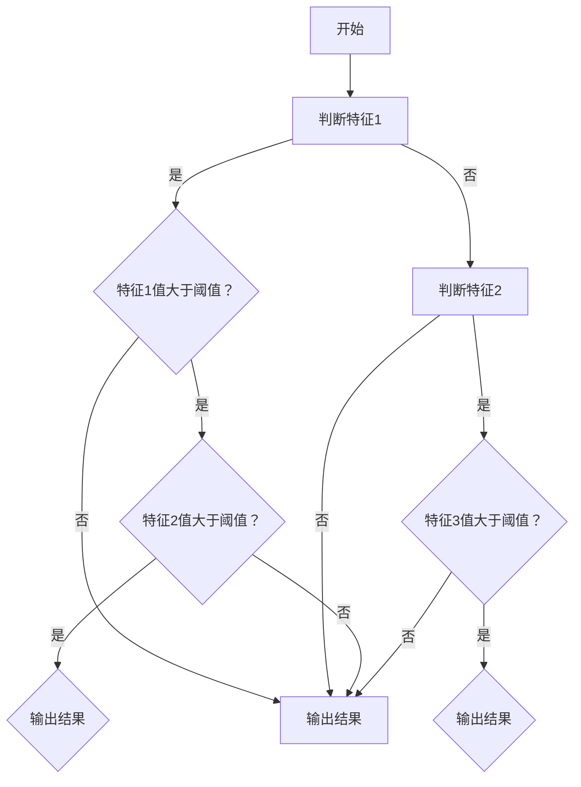
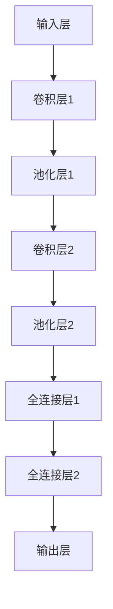

                 

# 产业中的人工智能变革与应用

## 关键词
- 人工智能
- 产业应用
- 机器学习
- 深度学习
- 案例分析

## 摘要
本文将深入探讨人工智能在各个产业中的应用与变革。通过对人工智能基础知识的介绍，我们将分析机器学习和深度学习在计算机视觉和自然语言处理等领域的应用。随后，我们将聚焦于人工智能在制造业、金融行业和医疗健康领域的具体应用案例，探讨其带来的创新与挑战。最后，我们将展望人工智能的未来发展趋势，包括新兴技术的展望和全球AI产业的发展策略。

## 第一部分：人工智能基础

### 第1章：人工智能概述

#### 1.1 人工智能的定义与分类

人工智能（Artificial Intelligence, AI）是一门研究、开发和应用使计算机模拟人类智能行为的技术的科学。根据其实现方式，人工智能可以分为两类：基于规则的人工智能和基于数据的人工智能。

- **基于规则的人工智能**：这种方法依赖于预先定义的规则和逻辑，通过编程来模拟人类专家的知识和推理能力。例如，专家系统和决策树。
- **基于数据的人工智能**：这种方法依赖于从大量数据中学习模式和规律，以实现智能行为。例如，机器学习和深度学习。

#### 1.2 人工智能的发展历程

人工智能的发展历程可以追溯到20世纪50年代。以下是几个关键阶段：

- **20世纪50年代至70年代**：人工智能概念的提出和早期研究，如逻辑推理和问题解决。
- **20世纪80年代**：专家系统的兴起，如MYCIN和DENDRAL。
- **20世纪90年代**：机器学习和数据挖掘的兴起，如神经网络和决策树。
- **21世纪**：深度学习的突破，如图像识别和自然语言处理。

#### 1.3 人工智能的核心技术

人工智能的核心技术包括：

- **机器学习**：通过训练模型从数据中学习模式和规律，以实现预测和分类。
- **深度学习**：基于多层神经网络的学习方法，通过自动提取特征实现复杂的模式识别任务。
- **自然语言处理**：使计算机理解和生成自然语言的技术，如语音识别和机器翻译。
- **计算机视觉**：使计算机能够理解并处理视觉信息的技术，如图像识别和目标检测。

### 第2章：机器学习基础

#### 2.1 机器学习的基本概念

机器学习（Machine Learning, ML）是人工智能的一个分支，其核心目标是使计算机能够从数据中学习并做出预测或决策。机器学习的基本概念包括：

- **数据集**：用于训练模型的输入和输出数据。
- **特征**：数据集中的变量，用于描述数据。
- **模型**：用于学习数据特征和关系的算法。

#### 2.2 监督学习算法

监督学习（Supervised Learning）是机器学习的一种方法，其中模型基于标记数据进行训练，并使用这些数据来预测新数据的标签。以下是几种常见的监督学习算法：

##### 2.2.1 线性回归

线性回归（Linear Regression）是一种预测连续值的监督学习算法。其基本公式为：

$$y = \beta_0 + \beta_1x$$

其中，\(y\) 是预测值，\(x\) 是输入特征，\(\beta_0\) 和 \(\beta_1\) 是模型参数。

##### 2.2.2 逻辑回归

逻辑回归（Logistic Regression）是一种预测概率的监督学习算法。其基本公式为：

$$\hat{y} = \frac{1}{1 + e^{-(\beta_0 + \beta_1x)}$$

其中，\(\hat{y}\) 是预测概率，\(\beta_0\) 和 \(\beta_1\) 是模型参数。

##### 2.2.3 决策树

决策树（Decision Tree）是一种基于树形结构的监督学习算法，通过一系列的判断来对数据进行分类或回归。其基本结构如下：



##### 2.2.4 随机森林

随机森林（Random Forest）是一种基于决策树的集成学习方法，通过构建多个决策树并平均其预测结果来提高模型的准确性。

##### 2.2.5 支持向量机

支持向量机（Support Vector Machine, SVM）是一种基于最大化间隔的监督学习算法，用于分类和回归任务。其基本公式为：

$$\max \ \ \ \ \ \ \ \ \ \ \ \ \ \ \ \ \ \ \ \ \ \ \ \ \ \ \ \ \ \ \ \ \ \ \ \ \ \ \ \ \ \ \ \ \ \ \ \ \ \ \ \ \ \ \ \ \ \ \ \ \ \ \ \ \ \ \ \ \ \ \ \ \ \ \ \ \ \ \ \ \ \ \ \ \ \ \ \ \ \ \ \ \ \ \ \ \ \ \ \ \ \ \ \ \ \ \ \ \ \ \ \ \ \ \ \ \ \ \ \ \ \ \ \ \ \ \ \ \ \ \ \ \ \ \ \ \ \ \ \ \ \ \ \ \ \ \ \ \ \ \ \ \ \ \ \ \ \ \ \ \ \ \ \ \ \ \ \ \ \ \ \ \ \ \ \ \ \ \ \ \ \ \ \ \ \ \ \ \ \ \ \ \ \ \ \ \ \ \ \ \ \ \ \ \ \ \ \ \ \ \ \ \ \ \ \ \ \ \ \ \ \ \ \ \ \ \ \ \ \ \ \ \ \ \ \ \ \ \ \ \ \ \ \ \ \ \ \ \ \ \ \ \ \ \ \ \ \ \ \ \ \ \ \ \ \ \ \ \ \ \ \ \ \ \ \ \ \ \ \ \ \ \ \ \ \ \ \ \ \ \ \ \ \ \ \ \ \ \ \ \ \ \ \ \ \ \ \ _{w,b} \ subjected \ to \ _{x,y} \ in \ the \ training \ set
\label{eq:SVM}
```

#### 2.3 无监督学习算法

无监督学习（Unsupervised Learning）是机器学习的一种方法，其中模型不需要标记数据来学习数据特征和关系。以下是几种常见的无监督学习算法：

##### 2.3.1 K-均值聚类

K-均值聚类（K-Means Clustering）是一种基于距离度量的聚类算法，通过将数据点划分成K个簇，使得每个簇内的数据点之间距离最小。

##### 2.3.2 主成分分析

主成分分析（Principal Component Analysis, PCA）是一种降维技术，通过将数据投影到新的正交坐标系上，以提取最重要的特征。

##### 2.3.3 聚类层次法

聚类层次法（Hierarchical Clustering）是一种基于层次结构的聚类算法，通过逐步合并或分裂数据点，以构建一个聚类层次树。

### 第3章：深度学习原理与应用

#### 3.1 深度学习的核心概念

深度学习（Deep Learning）是一种基于多层神经网络的学习方法，通过自动提取特征来实现复杂的模式识别任务。其核心概念包括：

- **神经网络**：一种由神经元组成的计算模型，用于模拟人脑的神经网络结构。
- **反向传播**：一种用于训练神经网络的学习算法，通过计算输出误差并反向传播到每个神经元，以更新模型参数。
- **激活函数**：一种用于引入非线性性的函数，以使神经网络能够学习复杂的特征。

#### 3.2 深度学习的基本结构

深度学习的基本结构包括输入层、隐藏层和输出层。以下是几种常见的深度学习架构：

- **全连接神经网络**：一种最基本的深度学习结构，其中每个神经元都与前一层中的每个神经元相连接。
- **卷积神经网络**（Convolutional Neural Network, CNN）：一种专门用于处理图像数据的深度学习结构，通过卷积操作和池化操作来提取图像特征。
- **循环神经网络**（Recurrent Neural Network, RNN）：一种用于处理序列数据的深度学习结构，通过循环连接来记忆和传递序列信息。
- **长短期记忆网络**（Long Short-Term Memory, LSTM）：一种改进的循环神经网络，通过引入门控机制来记忆和传递长期依赖信息。

#### 3.3 深度学习在计算机视觉中的应用

深度学习在计算机视觉（Computer Vision）领域取得了显著的成果，包括图像分类、目标检测和图像分割等任务。以下是几种常用的深度学习模型：

##### 3.3.1 卷积神经网络（CNN）

卷积神经网络（CNN）是一种基于卷积操作的深度学习模型，通过卷积层、池化层和全连接层来提取图像特征。以下是一个简单的CNN架构：



##### 3.3.2 卷积神经网络在图像分类中的应用

卷积神经网络在图像分类（Image Classification）任务中取得了优异的性能，例如ImageNet图像分类挑战。以下是一个简单的图像分类任务：

```python
# 导入必要的库
import tensorflow as tf
from tensorflow.keras.models import Sequential
from tensorflow.keras.layers import Conv2D, MaxPooling2D, Flatten, Dense

# 构建模型
model = Sequential()
model.add(Conv2D(32, (3, 3), activation='relu', input_shape=(224, 224, 3)))
model.add(MaxPooling2D((2, 2)))
model.add(Conv2D(64, (3, 3), activation='relu'))
model.add(MaxPooling2D((2, 2)))
model.add(Flatten())
model.add(Dense(128, activation='relu'))
model.add(Dense(10, activation='softmax'))

# 编译模型
model.compile(optimizer='adam', loss='categorical_crossentropy', metrics=['accuracy'])

# 训练模型
model.fit(x_train, y_train, batch_size=32, epochs=10, validation_data=(x_val, y_val))
```

##### 3.3.3 卷积神经网络在目标检测中的应用

卷积神经网络在目标检测（Object Detection）任务中也取得了显著的效果，例如Faster R-CNN、YOLO和SSD等模型。以下是一个简单的目标检测任务：

```python
# 导入必要的库
import tensorflow as tf
from tensorflow.keras.models import Model
from tensorflow.keras.layers import Conv2D, MaxPooling2D, Flatten, Dense

# 构建模型
model = Sequential()
model.add(Conv2D(32, (3, 3), activation='relu', input_shape=(224, 224, 3)))
model.add(MaxPooling2D((2, 2)))
model.add(Conv2D(64, (3, 3), activation='relu'))
model.add(MaxPooling2D((2, 2)))
model.add(Flatten())
model.add(Dense(128, activation='relu'))
model.add(Dense(2, activation='sigmoid'))

# 编译模型
model.compile(optimizer='adam', loss='binary_crossentropy', metrics=['accuracy'])

# 训练模型
model.fit(x_train, y_train, batch_size=32, epochs=10, validation_data=(x_val, y_val))
```

##### 3.3.4 卷积神经网络在图像分割中的应用

卷积神经网络在图像分割（Image Segmentation）任务中也取得了显著的成果，例如FCN和U-Net等模型。以下是一个简单的图像分割任务：

```python
# 导入必要的库
import tensorflow as tf
from tensorflow.keras.models import Model
from tensorflow.keras.layers import Conv2D, MaxPooling2D, Flatten, Dense

# 构建模型
model = Sequential()
model.add(Conv2D(32, (3, 3), activation='relu', input_shape=(224, 224, 3)))
model.add(MaxPooling2D((2, 2)))
model.add(Conv2D(64, (3, 3), activation='relu'))
model.add(MaxPooling2D((2, 2)))
model.add(Flatten())
model.add(Dense(128, activation='relu'))
model.add(Dense(1, activation='sigmoid'))

# 编译模型
model.compile(optimizer='adam', loss='binary_crossentropy', metrics=['accuracy'])

# 训练模型
model.fit(x_train, y_train, batch_size=32, epochs=10, validation_data=(x_val, y_val))
```

#### 3.4 深度学习在自然语言处理中的应用

深度学习在自然语言处理（Natural Language Processing, NLP）领域也取得了显著的成果，包括文本分类、情感分析和机器翻译等任务。以下是几种常用的深度学习模型：

##### 3.4.1 递归神经网络（RNN）

递归神经网络（RNN）是一种用于处理序列数据的深度学习模型，通过循环连接来记忆和传递序列信息。以下是一个简单的RNN模型：

```python
# 导入必要的库
import tensorflow as tf
from tensorflow.keras.models import Sequential
from tensorflow.keras.layers import LSTM, Dense

# 构建模型
model = Sequential()
model.add(LSTM(128, activation='relu', input_shape=(timesteps, features)))
model.add(Dense(1, activation='sigmoid'))

# 编译模型
model.compile(optimizer='adam', loss='binary_crossentropy', metrics=['accuracy'])

# 训练模型
model.fit(x_train, y_train, batch_size=32, epochs=10, validation_data=(x_val, y_val))
```

##### 3.4.2 长短期记忆网络（LSTM）

长短期记忆网络（LSTM）是一种改进的循环神经网络，通过引入门控机制来记忆和传递长期依赖信息。以下是一个简单的LSTM模型：

```python
# 导入必要的库
import tensorflow as tf
from tensorflow.keras.models import Sequential
from tensorflow.keras.layers import LSTM, Dense

# 构建模型
model = Sequential()
model.add(LSTM(128, activation='relu', input_shape=(timesteps, features)))
model.add(Dense(1, activation='sigmoid'))

# 编译模型
model.compile(optimizer='adam', loss='binary_crossentropy', metrics=['accuracy'])

# 训练模型
model.fit(x_train, y_train, batch_size=32, epochs=10, validation_data=(x_val, y_val))
```

##### 3.4.3 生成对抗网络（GAN）

生成对抗网络（Generative Adversarial Network, GAN）是一种由生成器和判别器组成的深度学习模型，通过相互对抗来生成高质量的生成数据。以下是一个简单的GAN模型：

```python
# 导入必要的库
import tensorflow as tf
from tensorflow.keras.models import Sequential
from tensorflow.keras.layers import Dense, Flatten

# 构建生成器模型
generator = Sequential()
generator.add(Dense(128, activation='relu', input_shape=(100,)))
generator.add(Dense(256, activation='relu'))
generator.add(Dense(784, activation='tanh'))

# 构建判别器模型
discriminator = Sequential()
discriminator.add(Flatten(input_shape=(28, 28, 1)))
discriminator.add(Dense(128, activation='relu'))
discriminator.add(Dense(1, activation='sigmoid'))

# 构建GAN模型
model = Sequential()
model.add(generator)
model.add(discriminator)

# 编译模型
model.compile(optimizer='adam', loss='binary_crossentropy')

# 训练模型
model.fit(x_train, y_train, batch_size=32, epochs=10, validation_data=(x_val, y_val))
```

## 第二部分：人工智能在产业中的应用

### 第4章：人工智能在制造业中的应用

人工智能在制造业中的应用已经取得了显著的成果，从生产过程优化到质量控制，再到设备维护，AI技术为制造业带来了巨大的变革。

#### 4.1 制造业中的AI应用场景

以下是人工智能在制造业中的几种典型应用场景：

##### 4.1.1 生产过程优化

生产过程优化是制造业中的一个关键领域。通过使用机器学习和深度学习算法，可以对生产过程中的各个环节进行优化。例如，通过对历史生产数据进行分析，可以预测生产设备的故障，并提前进行维护，以避免生产中断。此外，还可以通过优化生产流程和资源配置，提高生产效率。

##### 4.1.2 质量控制

质量控制是制造业中的另一个关键领域。通过使用计算机视觉和深度学习算法，可以对生产过程进行实时监控，检测产品质量问题。例如，使用卷积神经网络对生产线上经过的产品进行图像分类，可以识别出不良品，并实时进行调整。

##### 4.1.3 设备维护

设备维护是制造业中的一个重要环节。通过使用机器学习和深度学习算法，可以预测设备故障，并提前进行维护。例如，通过分析设备的传感器数据，可以预测设备的剩余寿命，并提前安排维护计划。

#### 4.2 案例分析

以下是两个制造业中的AI应用案例：

##### 4.2.1 某汽车制造厂的AI应用案例

某汽车制造厂通过使用人工智能技术，对生产过程进行了优化。通过对历史生产数据进行分析，该厂成功预测了生产设备的故障，并提前进行了维护，从而避免了生产中断。此外，该厂还通过使用计算机视觉技术，对生产线上经过的产品进行了实时监控，检测产品质量问题，提高了生产质量。

##### 4.2.2 某电子公司的AI应用案例

某电子公司通过使用人工智能技术，对生产过程进行了优化。通过对生产流程和资源配置的优化，该公司成功提高了生产效率。此外，该公司还通过使用计算机视觉技术，对生产线上经过的产品进行了实时监控，检测产品质量问题，提高了产品质量。

### 第5章：人工智能在金融行业中的应用

人工智能在金融行业中的应用已经变得非常广泛，从风险管理到信用评估，再到量化交易，AI技术为金融行业带来了巨大的变革。

#### 5.1 金融行业中的AI应用场景

以下是人工智能在金融行业中的几种典型应用场景：

##### 5.1.1 风险管理

风险管理是金融行业中的一个关键领域。通过使用机器学习和深度学习算法，可以预测市场风险和信用风险，并提前采取应对措施。例如，通过对历史交易数据进行分析，可以预测市场走势，为投资决策提供支持。

##### 5.1.2 信用评估

信用评估是金融行业中的另一个重要领域。通过使用机器学习和深度学习算法，可以评估客户的信用风险，为贷款审批提供支持。例如，通过对客户的历史信用记录进行分析，可以预测客户的信用等级。

##### 5.1.3 量化交易

量化交易是金融行业中的一个高薪领域。通过使用机器学习和深度学习算法，可以开发量化交易策略，实现自动化交易。例如，通过对市场数据进行分析，可以预测股票价格走势，从而进行投资。

#### 5.2 案例分析

以下是两个金融行业中的AI应用案例：

##### 5.2.1 某银行的AI应用案例

某银行通过使用人工智能技术，对客户进行信用评估。通过对客户的历史信用记录进行分析，该银行成功预测了客户的信用风险，为贷款审批提供了支持。此外，该银行还通过使用量化交易策略，实现了自动化交易，提高了交易收益。

##### 5.2.2 某金融科技公司的AI应用案例

某金融科技公司通过使用人工智能技术，对市场数据进行分析，预测市场走势。通过对市场数据的深度学习分析，该公司成功开发了量化交易策略，实现了自动化交易，提高了交易收益。

### 第6章：人工智能在医疗健康领域中的应用

人工智能在医疗健康领域中的应用已经取得了显著的成果，从疾病诊断到医疗影像分析，再到药物研发，AI技术为医疗健康行业带来了巨大的变革。

#### 6.1 医疗健康领域的AI应用场景

以下是人工智能在医疗健康领域中的几种典型应用场景：

##### 6.1.1 疾病诊断

疾病诊断是医疗健康行业中的一个关键领域。通过使用人工智能技术，可以开发智能诊断系统，辅助医生进行疾病诊断。例如，通过使用深度学习算法，可以分析医学影像，识别疾病标志物。

##### 6.1.2 医疗影像分析

医疗影像分析是医疗健康行业中的另一个重要领域。通过使用人工智能技术，可以对医疗影像进行分析，识别病变区域。例如，通过使用卷积神经网络，可以分析X光片，识别骨折部位。

##### 6.1.3 药物研发

药物研发是医疗健康行业中的一个复杂且耗时长的过程。通过使用人工智能技术，可以加速药物研发过程。例如，通过使用机器学习算法，可以预测药物的毒性和药效，优化药物设计。

#### 6.2 案例分析

以下是两个医疗健康领域中的AI应用案例：

##### 6.2.1 某医院的AI应用案例

某医院通过使用人工智能技术，开发了一套智能诊断系统。通过使用深度学习算法，该系统可以分析医学影像，识别疾病标志物，辅助医生进行疾病诊断。此外，该医院还通过使用医疗影像分析技术，对医疗影像进行分析，识别病变区域，提高了诊断准确性。

##### 6.2.2 某医药公司的AI应用案例

某医药公司通过使用人工智能技术，加速了药物研发过程。通过使用机器学习算法，该公司可以预测药物的毒性和药效，优化药物设计，提高了研发效率。

## 第三部分：人工智能应用的挑战与未来

### 第7章：人工智能应用的挑战

人工智能应用在各个领域带来了巨大的变革，但同时也面临着一系列的挑战。以下是人工智能应用中的一些主要挑战：

#### 7.1 数据隐私与安全

数据隐私和安全是人工智能应用中的一个重要挑战。由于人工智能系统依赖于大量数据来训练模型，这些数据的隐私和安全问题需要得到妥善解决。例如，个人健康数据、金融交易数据等敏感数据的泄露可能导致严重的隐私和安全问题。

#### 7.2 伦理与道德问题

人工智能应用的伦理和道德问题也是一个重要的挑战。例如，自动化决策系统可能存在歧视和偏见，导致不公平的结果。此外，人工智能系统的透明度和可解释性也需要得到关注，以确保人们能够理解模型的决策过程。

#### 7.3 技术成熟度与实施难度

虽然人工智能技术已经取得了显著的进展，但其成熟度仍然有限，特别是在某些领域，如医疗健康和金融行业。此外，人工智能应用的实施难度也较高，需要大量的技术资源和专业知识。

### 第8章：人工智能未来的发展趋势

人工智能的未来发展趋势令人期待，以下是几个可能的发展方向：

#### 8.1 新兴技术展望

新兴技术，如量子计算、区块链和脑机接口等，可能会对人工智能产生深远的影响。例如，量子计算有望提高人工智能系统的计算能力，而区块链则可以提供更安全的数据存储和传输机制。

#### 8.2 AI产业发展趋势

随着人工智能技术的不断进步，全球AI产业也正处于快速发展阶段。各国纷纷加大在人工智能领域的投资，推动AI技术的研发和应用。未来，AI产业链将更加完善，从硬件到软件，从研发到应用，各个环节都将得到充分发展。

#### 8.3 我国AI产业发展策略

我国在人工智能领域有着巨大的发展潜力，政府和企业纷纷加大在AI领域的投资。我国AI产业的发展策略包括：加强基础研究，推动AI技术与传统产业的深度融合，培养高水平AI人才等。

## 附录

### 附录A：人工智能工具与资源

以下是几个常用的人工智能工具和资源：

#### A.1 开源机器学习框架

- TensorFlow：由Google开发的开源机器学习框架，广泛应用于深度学习和机器学习任务。
- PyTorch：由Facebook开发的开源机器学习框架，以其动态计算图和易于使用的接口而受到广泛欢迎。
- Keras：一个高层次的神经网络API，可以与TensorFlow和PyTorch等框架结合使用。

#### A.2 数据集与工具

- UCI机器学习库：提供各种机器学习任务的数据集，是机器学习研究和应用的重要资源。
- Kaggle竞赛数据集：提供各种大规模的数据集，是机器学习竞赛的重要平台。
- AI研究工具：如Jupyter Notebook、Google Colab等，提供方便的编程环境和协作工具。

## 参考文献

1. Goodfellow, I., Bengio, Y., & Courville, A. (2016). *Deep Learning*. MIT Press.
2. Russell, S., & Norvig, P. (2016). *Artificial Intelligence: A Modern Approach*. Prentice Hall.
3. Bishop, C. M. (2006). *Pattern Recognition and Machine Learning*. Springer.
4. Ng, A. Y., & Dean, J. (2014). *Machine Learning: Techniques for Predictive Data Analytics*. J. Wiley.

作者：AI天才研究院/AI Genius Institute & 禅与计算机程序设计艺术 /Zen And The Art of Computer Programming

