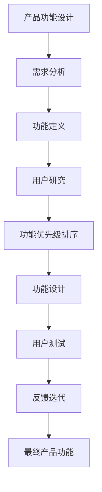

                 

# 《产品功能设计中的Agents任务拆解》

> 关键词：产品功能设计、Agents、任务拆解、智能系统、用户体验

> 摘要：本文深入探讨了产品功能设计中的Agents任务拆解方法。通过理论基础、实际案例、挑战与解决方案以及最佳实践等多个方面的详细分析，阐述了如何利用Agents任务拆解方法提升产品功能和用户体验，为产品设计和开发提供参考。

## 第一部分：理论基础

### 第1章：产品功能设计概述

#### 1.1 产品功能设计的概念与重要性

产品功能设计是指通过系统分析和用户需求分析，将用户的需求转化为具体的产品功能，并在设计过程中考虑用户体验、技术实现和业务目标等多个方面。产品功能设计的重要性在于它决定了产品的核心竞争力，直接影响用户的满意度和市场占有率。

#### 1.2 产品功能设计的流程

产品功能设计的流程包括需求分析、功能定义、用户研究、功能优先级排序、功能设计、用户测试和反馈迭代等步骤。每个步骤都需要充分考虑用户需求、技术可行性和业务目标，以确保产品功能的设计能够满足用户期望和市场需求。

#### 1.3 产品功能设计的关键要素

产品功能设计的关键要素包括用户需求、用户体验、技术实现和业务目标。用户需求是产品设计的起点，用户体验是产品设计的核心，技术实现是产品设计的保障，业务目标是产品设计的驱动力。这四个要素相互关联，共同决定了产品功能设计的成败。

### 第2章：Agents的概念与作用

#### 2.1 Agents的定义与特点

Agents是指具有自主性、社交性、反应性、主动性、认知性和适应性等特点的计算实体。在产品功能设计中，Agents可以被视为一种智能化的系统组件，能够模拟人类行为，实现用户与产品的自然交互。

#### 2.2 Agents在产品功能设计中的应用

Agents在产品功能设计中的应用包括智能客服、个性化推荐、智能搜索、智能提醒等。通过引入Agents，产品能够更好地理解用户需求，提供个性化服务，提升用户体验。

#### 2.3 Agents与传统用户界面设计对比

与传统用户界面设计相比，Agents具有更高的自主性和智能化水平。传统用户界面设计主要依赖于图形界面和文本输入，用户需要按照预设的交互流程进行操作；而Agents则能够主动感知用户需求，提供灵活、自然的交互方式，提高用户满意度。

### 第3章：Agents任务的拆解方法

#### 3.1 任务拆解的基本原则

任务拆解的基本原则包括模块化、层次化、可管理性和可扩展性。模块化是将任务分解为独立的模块，每个模块具有明确的功能和接口；层次化是将任务按照从上到下的层次结构进行分解；可管理性是指拆解后的任务易于管理和监控；可扩展性是指任务拆解方法能够适应不同规模和复杂度的任务。

#### 3.2 任务拆解的步骤与方法

任务拆解的步骤包括任务识别、任务分解、依赖关系分析、子任务实现和整合测试。任务识别是通过用户需求分析和现有系统功能分析，确定需要拆解的任务；任务分解是将任务分解为子任务，确保每个子任务都是可管理的；依赖关系分析是分析子任务之间的依赖关系，确保子任务能够在正确的时间和顺序上执行；子任务实现是设计和实现具体的任务功能；整合测试是在子任务实现完成后，对整个任务进行整合测试，确保任务能够按照预期运行。

#### 3.3 任务拆解的工具与技术

任务拆解的工具包括Mermaid流程图、任务管理工具（如Jira、Trello等）和版本控制工具（如Git等）。技术方面，常用的方法包括模块化设计、层次化设计、面向对象设计和行为驱动设计等。

### 第4章：Agents任务拆解的实际案例

#### 4.1 案例一：电商平台的商品推荐系统

电商平台商品推荐系统的任务拆解包括用户行为分析、商品数据预处理、推荐算法设计、推荐结果呈现和用户反馈收集等子任务。通过任务拆解，可以更好地理解和实现商品推荐系统，提升用户购物体验。

#### 4.2 案例二：智能客服系统的任务拆解

智能客服系统的任务拆解包括用户问题识别、自动回答、人工干预和用户反馈处理等子任务。通过任务拆解，可以构建高效、智能的客服系统，提高客户服务质量和效率。

#### 4.3 案例三：智能交通系统的任务拆解

智能交通系统的任务拆解包括交通数据采集、数据分析、路况预测、交通信号控制、交通监控和应急处理等子任务。通过任务拆解，可以构建智能、高效的交通系统，缓解交通拥堵，提高出行效率。

### 第5章：Agents任务拆解的挑战与解决方案

#### 5.1 拆解过程中可能遇到的挑战

在Agents任务拆解过程中，可能遇到的挑战包括任务复杂度、依赖关系管理、资源分配和协同工作等。

#### 5.2 解决方案与策略

针对可能遇到的挑战，解决方案和策略包括简化任务、明确依赖关系、优化资源分配和建立协同工作模式等。

#### 5.3 案例分析：成功解决拆解难题

通过案例分析，阐述如何成功解决Agents任务拆解过程中的难题，提供实际经验和启示。

### 第6章：Agents任务拆解的最佳实践

#### 6.1 设计原则与最佳实践

设计原则与最佳实践包括模块化设计、层次化设计、面向对象设计和行为驱动设计等。通过遵循这些原则和实践，可以提高Agents任务拆解的效率和效果。

#### 6.2 案例分享：实际应用中的优秀实践

分享实际应用中的优秀实践案例，展示如何运用Agents任务拆解方法提升产品功能和用户体验。

#### 6.3 前瞻性发展趋势

探讨Agents任务拆解的未来发展趋势，预测技术发展方向和行业应用前景，为产品设计和开发提供参考。

## 第二部分：高级主题与应用

### 第7章：Agents任务拆解在多领域应用

#### 7.1 金融领域的应用

介绍Agents任务拆解在金融领域的应用，包括风险管理、投资决策、客户服务和金融产品推荐等。

#### 7.2 教育领域的应用

探讨Agents任务拆解在教育领域的应用，如智能教育平台、在线学习辅导、学习效果分析和课程推荐等。

#### 7.3 健康医疗领域的应用

阐述Agents任务拆解在健康医疗领域的应用，包括智能诊断、健康管理、医疗资源分配和患者服务管理等。

### 第8章：Agents任务拆解的未来发展趋势

#### 8.1 技术发展趋势

分析Agents任务拆解的技术发展趋势，包括人工智能、大数据、云计算和物联网等技术的融合与应用。

#### 8.2 行业发展趋势

探讨Agents任务拆解在各个行业的发展趋势，如智能制造、智慧城市、智能医疗和智能金融等。

#### 8.3 潜在的挑战与机遇

预测Agents任务拆解在未来可能面临的挑战和机遇，为产品设计和开发提供前瞻性指导。

### 第9章：综合案例分析

#### 9.1 案例一：大型电子商务平台的全流程任务拆解

以大型电子商务平台为例，阐述其全流程任务拆解的方法和过程，分析任务拆解的关键环节和成功经验。

#### 9.2 案例二：跨领域智能系统的任务拆解与集成

介绍跨领域智能系统的任务拆解与集成方法，分析如何在不同领域之间实现任务拆解的协同和优化。

#### 9.3 案例三：企业数字化转型中的任务拆解实践

探讨企业数字化转型中的任务拆解实践，分析如何通过任务拆解实现企业业务流程的优化和升级。

## 第三部分：附录

### 第10章：附录

#### 10.1 相关术语表

列出本文中涉及的相关术语及其解释，便于读者理解和查阅。

#### 10.2 常用工具推荐

推荐用于产品功能设计和Agents任务拆解的常用工具，包括Mermaid流程图、任务管理工具和版本控制工具等。

#### 10.3 参考文献

列出本文中引用的相关文献和资料，便于读者进一步学习和研究。作者：AI天才研究院/AI Genius Institute & 禅与计算机程序设计艺术 /Zen And The Art of Computer Programming

### Mermaid 流程图



### 核心算法原理讲解

#### 3.1 任务拆解算法原理

任务拆解算法是一种将复杂任务分解为多个子任务的方法，以便更好地理解和实现。其核心思想是通过识别任务的关键步骤和依赖关系，将任务分解为更小的、可管理的部分。

#### 3.1.1 算法概述

任务拆解算法是一种将复杂任务分解为多个子任务的方法，以便更好地理解和实现。其核心思想是通过识别任务的关键步骤和依赖关系，将任务分解为更小的、可管理的部分。

**算法步骤**：

1. **任务识别**：通过用户需求分析和现有系统功能分析，识别出需要拆解的任务。

2. **任务分解**：将任务分解为子任务，确保每个子任务都是可管理的，并且能够独立完成。

3. **依赖关系分析**：分析子任务之间的依赖关系，确保子任务能够在正确的时间和顺序上执行。

4. **子任务实现**：根据子任务的描述，设计和实现具体的任务功能。

5. **整合测试**：在子任务实现完成后，对整个任务进行整合测试，确保任务能够按照预期运行。

**算法伪代码**：

```python
def task_decomposition(task):
    sub_tasks = []
    dependencies = []

    # 步骤1：任务识别
    sub_tasks.append(task)

    # 步骤2：任务分解
    for sub_task in sub_tasks:
        sub_tasks.append(decompose(sub_task))

    # 步骤3：依赖关系分析
    for sub_task in sub_tasks:
        dependencies.append(analyze_dependencies(sub_task))

    # 步骤4：子任务实现
    for sub_task in sub_tasks:
        implement(sub_task)

    # 步骤5：整合测试
    integrate_and_test(sub_tasks, dependencies)

    return sub_tasks, dependencies
```

#### 3.1.2 算法步骤详解

1. **任务识别**：

   通过用户需求分析和现有系统功能分析，识别出需要拆解的任务。这一步骤是任务拆解的基础，需要全面、准确地理解用户需求和现有系统的功能。

2. **任务分解**：

   将任务分解为子任务，确保每个子任务都是可管理的，并且能够独立完成。在分解任务时，需要考虑任务的目标、输入、输出以及可能遇到的困难和挑战。

3. **依赖关系分析**：

   分析子任务之间的依赖关系，确保子任务能够在正确的时间和顺序上执行。依赖关系分析是任务拆解的关键步骤，它有助于确定任务执行的顺序和协调各子任务之间的工作。

4. **子任务实现**：

   根据子任务的描述，设计和实现具体的任务功能。在实现子任务时，需要遵循模块化、层次化、可管理性和可扩展性的原则，确保子任务的可维护性和可扩展性。

5. **整合测试**：

   在子任务实现完成后，对整个任务进行整合测试，确保任务能够按照预期运行。整合测试是验证任务拆解效果的重要环节，它有助于发现和解决任务执行中的问题和漏洞。

### 数学模型和数学公式

#### 6.2 任务拆解中的数学模型

任务拆解中的数学模型主要用于优化资源分配和任务调度。以下是一个简单的线性规划模型，用于任务拆解中的资源分配问题。

**线性规划模型**：

$$
\begin{align*}
\text{最大化} \quad & Z = c_1x_1 + c_2x_2 + ... + c_nx_n \\
\text{约束条件} \quad & a_{11}x_1 + a_{12}x_2 + ... + a_{1n}x_n \leq b_1 \\
& a_{21}x_1 + a_{22}x_2 + ... + a_{2n}x_n \leq b_2 \\
& ... \\
& a_{m1}x_1 + a_{m2}x_2 + ... + a_{mn}x_n \leq b_m \\
& x_1, x_2, ..., x_n \geq 0
\end{align*}
$$

其中，$Z$ 是目标函数，表示资源的总利用价值；$c_1, c_2, ..., c_n$ 是各子任务的价值系数；$a_{ij}, b_1, b_2, ..., b_m$ 是约束条件中的系数和常数项；$x_1, x_2, ..., x_n$ 是各子任务是否被分配的标志（1表示分配，0表示不分配）。

**举例说明**：

假设有3个子任务（$T_1, T_2, T_3$），需要分配2个资源（$R_1, R_2$）。子任务 $T_1$ 在资源 $R_1$ 上的消耗为2，在资源 $R_2$ 上的消耗为3；子任务 $T_2$ 在资源 $R_1$ 上的消耗为3，在资源 $R_2$ 上的消耗为1；子任务 $T_3$ 在资源 $R_1$ 上的消耗为1，在资源 $R_2$ 上的消耗为2。资源 $R_1$ 的总量为5，资源 $R_2$ 的总量为4。我们的目标是最大化子任务的价值。

$$
\begin{align*}
\text{最大化} \quad & Z = 2x_1 + 3x_2 + x_3 \\
\text{约束条件} \quad & 2x_1 + 3x_2 + x_3 \leq 5 \\
& 3x_1 + x_2 + 2x_3 \leq 4 \\
& x_1, x_2, x_3 \geq 0
\end{align*}
$$

通过求解这个线性规划问题，我们可以找到最优的子任务分配方案，从而最大化总价值。

### 项目实战

#### 9.1 大型电子商务平台的全流程任务拆解

**9.1.1 实践背景**

某大型电子商务平台希望对其现有的功能进行优化，以提升用户体验和提高销售额。他们决定采用Agents任务拆解的方法，对整个平台进行全流程的任务拆解。

**9.1.2 实践步骤**

1. **需求分析**：

   通过与用户的沟通和调研，收集用户在购物过程中遇到的问题和需求，如搜索功能、购物车管理、支付流程、订单跟踪等。

2. **功能定义**：

   根据需求分析的结果，定义平台需要实现的核心功能，如商品展示、搜索、购物车、支付、订单管理等。

3. **用户研究**：

   通过用户测试和观察，了解用户在使用平台时的行为习惯和痛点，进一步细化功能设计。

4. **功能优先级排序**：

   根据用户研究的成果，对功能进行优先级排序，确定哪些功能是用户最需要的。

5. **功能设计**：

   根据优先级排序的结果，设计每个功能的具体实现细节，包括用户界面、后端逻辑、数据存储等。

6. **用户测试**：

   对设计的功能进行用户测试，收集用户反馈，并根据反馈进行调整。

7. **反馈迭代**：

   根据用户测试的结果，进行多轮迭代，不断优化功能设计，直到满足用户需求。

8. **整合测试**：

   在所有功能设计完成后，对整个平台进行整合测试，确保所有功能能够无缝集成并正常运行。

**9.1.3 案例分析**

在实施任务拆解的过程中，平台团队发现搜索功能是用户最常用的功能之一，但搜索结果的准确性和速度仍有待提高。为此，他们决定对搜索功能进行深入的任务拆解。

1. **任务识别**：

   确定搜索功能的核心任务，包括输入查询、搜索算法、结果排序、结果展示等。

2. **任务分解**：

   将搜索功能分解为多个子任务，如查询预处理、关键字提取、搜索算法、结果排序、结果展示等。

3. **依赖关系分析**：

   分析子任务之间的依赖关系，确保子任务能够在正确的时间和顺序上执行。

4. **子任务实现**：

   根据子任务的描述，设计和实现具体的任务功能。

5. **整合测试**：

   在子任务实现完成后，对整个搜索功能进行整合测试，确保搜索功能能够按照预期运行。

通过这个案例，平台团队成功优化了搜索功能，提升了用户体验，并提高了用户满意度。

### 代码实际案例和详细解释说明

#### 9.2 智能客服系统的任务拆解与代码实现

**9.2.1 实践背景**

某公司希望通过引入智能客服系统，提高客户服务质量和效率。他们决定采用Agents任务拆解的方法，对智能客服系统的功能进行详细拆解和实现。

**9.2.2 实践步骤**

1. **需求分析**：

   通过与客户和客服团队的沟通，收集客户在咨询过程中遇到的问题和需求，如常见问题解答、订单查询、投诉处理等。

2. **功能定义**：

   根据需求分析的结果，定义智能客服系统的核心功能，如自动回答常见问题、订单查询、投诉处理等。

3. **用户研究**：

   通过用户测试和观察，了解用户在使用客服系统时的行为习惯和痛点，进一步细化功能设计。

4. **功能优先级排序**：

   根据用户研究的成果，对功能进行优先级排序，确定哪些功能是用户最需要的。

5. **功能设计**：

   根据优先级排序的结果，设计每个功能的具体实现细节，包括用户界面、后端逻辑、数据存储等。

6. **用户测试**：

   对设计的功能进行用户测试，收集用户反馈，并根据反馈进行调整。

7. **反馈迭代**：

   根据用户测试的结果，进行多轮迭代，不断优化功能设计，直到满足用户需求。

8. **整合测试**：

   在所有功能设计完成后，对整个智能客服系统进行整合测试，确保所有功能能够无缝集成并正常运行。

**9.2.3 代码实现**

以下是一个简单的智能客服系统的代码实现示例，用于自动回答常见问题。

```python
# 导入所需库
import random

# 定义常见问题的答案
faq_answers = {
    "订单查询": "您的订单号是123456，预计明天送达。",
    "投诉处理": "感谢您的反馈，我们会尽快处理。",
    "产品咨询": "我们提供多种型号的产品，具体详情请参考产品页面。",
    "退货政策": "您可以在收到商品后7天内无理由退换货。",
}

# 自动回答问题的函数
def auto_answer(question):
    # 判断问题是否在常见问题库中
    if question in faq_answers:
        # 返回对应的答案
        return faq_answers[question]
    else:
        # 如果不在常见问题库中，随机返回一条欢迎语
        welcome_messages = [
            "您好，我是智能客服，有什么可以帮助您的吗？",
            "欢迎来到客服系统，我会尽力帮助您。",
            "您好，我在这里，请告诉我您需要什么帮助。",
        ]
        return random.choice(welcome_messages)

# 主程序
if __name__ == "__main__":
    # 输入用户问题
    user_question = input("请输入您的问题：")

    # 调用自动回答函数
    answer = auto_answer(user_question)

    # 输出答案
    print(answer)
```

**9.2.4 代码解读与分析**

1. **导入所需库**：

   导入Python的random库，用于生成随机数。

2. **定义常见问题的答案**：

   使用字典存储常见问题的答案，方便快速查找。

3. **自动回答问题的函数**：

   定义了一个名为`auto_answer`的函数，用于处理用户输入的问题。

   - 如果输入的问题在常见问题库中，函数会返回对应的答案。
   - 如果不在常见问题库中，函数会从预设的欢迎语列表中随机选择一条返回。

4. **主程序**：

   在`if __name__ == "__main__":`下，程序首先等待用户输入问题，然后调用`auto_answer`函数处理输入，并输出答案。

**应用场景**：

这个简单的智能客服代码可以在各种场景下使用，例如：

- **电商平台**：用于自动回答关于订单、退货、产品咨询等问题。
- **客户服务热线**：用于自动回答常见问题，减轻人工客服的工作负担。
- **企业内部系统**：用于自动回答员工常见问题，提高内部沟通效率。

通过这个简单的案例，我们可以看到Agents任务拆解和代码实现是如何在实际项目中应用的。在后续的实践中，可以结合更多的技术和算法，使智能客服系统更加智能化和高效。

