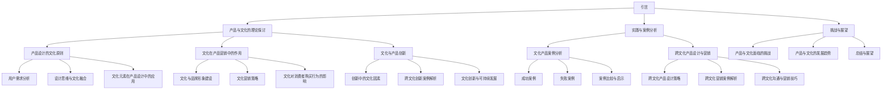
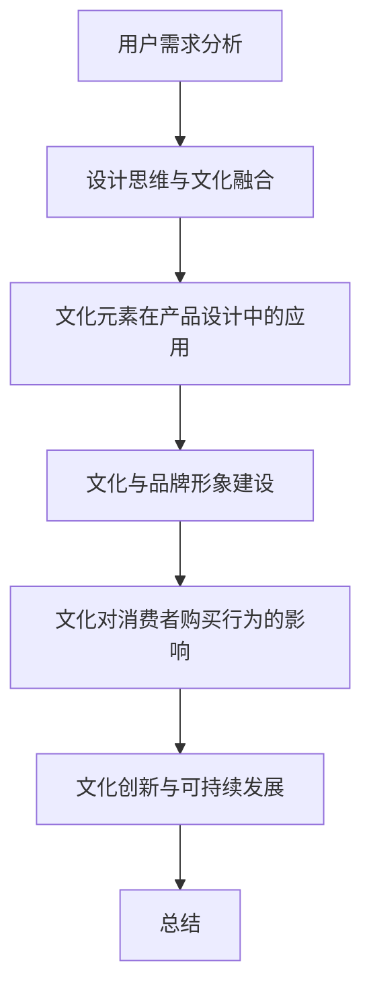

                 

## 文章标题

《产品只是工具：文化才是核心》

> 关键词：产品、文化、设计思维、用户体验、品牌建设、可持续发展

摘要：在当今快速变化的市场环境中，产品的功能和特性不再是唯一决定其成功与否的关键因素。本文从产品与文化的关系入手，探讨了文化在产品设计、营销、创新及可持续发展中的作用。通过详细的理论探讨、案例分析以及代码实际案例，文章揭示了文化作为产品核心要素的重要性，并提出了如何在产品开发过程中融入文化元素的策略和方法。

### 目录大纲

#### 第一部分: 引言与背景

1. **引言**  
   1.1. 本书的目的与重要性  
   1.2. 产品与文化的关系探讨

2. **文化视角下的产品**  
   2.1. 产品文化的定义  
   2.2. 产品文化的重要性  
   2.3. 产品文化的构建原则

#### 第二部分: 产品与文化的理论探讨

3. **产品设计的文化原则**  
   3.1. 用户需求分析  
   3.2. 设计思维与文化融合  
   3.3. 文化元素在产品设计中的应用

4. **文化在产品营销中的作用**  
   4.1. 文化与品牌形象建设  
   4.2. 文化营销策略  
   4.3. 文化对消费者购买行为的影响

5. **文化与产品创新**  
   5.1. 创新中的文化因素  
   5.2. 跨文化创新案例解析  
   5.3. 文化创新与可持续发展

#### 第三部分: 实践与案例分析

6. **文化产品案例分析**  
   6.1. 成功的文化产品设计案例  
   6.2. 失败的文化产品设计反思  
   6.3. 案例比较与启示

7. **跨文化产品设计与营销**  
   7.1. 跨文化产品设计策略  
   7.2. 跨文化营销案例解析  
   7.3. 跨文化沟通与营销技巧

#### 第四部分: 挑战与展望

8. **产品与文化面临的挑战**  
   8.1. 文化多样性的挑战  
   8.2. 保护与传承本土文化  
   8.3. 技术变革下的文化产品创新

9. **产品与文化的发展趋势**  
   9.1. 数字化时代的文化产品  
   9.2. 社交媒体与文化传播  
   9.3. 文化产品与可持续发展

#### 第五部分: 结论与展望

10. **总结与展望**  
   10.1. 本书主要观点回顾  
   10.2. 文化在产品中的深远影响  
   10.3. 未来产品与文化发展的趋势预测

### 附录

11. **参考文献**  
   - 相关书籍  
   - 学术论文  
   - 网络资源

### Mermaid 流程图



### 核心算法原理讲解

在本文中，我们将深入探讨用户需求分析、设计思维与文化融合、文化元素在产品设计中的应用、文化与品牌形象建设、文化对消费者购买行为的影响以及文化创新与可持续发展等核心算法原理。

#### 用户需求分析

用户需求分析是产品设计过程中的关键步骤，它决定了产品能否满足用户的需求。用户需求模型是一个多维度的数学模型，它综合了用户的需求类型、需求层次和需求表达方式。

- **需求类型**：包括基本需求、扩展需求和潜在需求。
- **需求层次**：根据马斯洛的需求层次理论，包括生理需求、安全需求、社交需求、尊重需求、自我实现需求。
- **需求表达方式**：分为显性需求和隐性需求。

伪代码：

```python
# 用户需求分析伪代码
def analyze_user_demand():
    demand_type = classify_demand_type()
    demand_level = classify_demand_level()
    demand_expression = classify_demand_expression()
    user_demand_model = demand_type * demand_level * demand_expression
    return user_demand_model
```

数学模型：

$$ 用户需求模型 = f(需求类型, 需求层次, 需求表达方式) $$

举例说明：

假设用户需求模型包括以下要素：

- 需求类型：基本需求（控制家电设备）、扩展需求（远程监控和安全保护）、潜在需求（智能家居系统的智能推荐和自动化功能）。
- 需求层次：生理需求（舒适家居环境）、安全需求（设备安全保护）、社交需求（与家人共享智能家居体验）。
- 需求表达方式：显性需求（设备易于操作和使用）、隐性需求（设备具有个性化定制功能）。

用户需求模型为：

$$ 用户需求模型 = f(需求类型, 需求层次, 需求表达方式) = \{基本需求, 安全需求, 显性需求\} $$

#### 设计思维与文化融合

设计思维是一种以用户为中心的创新方法，它强调通过发现、定义、设想、原型和测试等阶段来解决问题和创造价值。将文化元素融入设计思维中，可以增强产品的文化内涵和用户吸引力。

设计思维流程包括：

- **发现**：识别问题和机会。
- **定义**：明确问题和目标。
- **设想**：生成多种可能的解决方案。
- **原型**：制作最小可行性产品。
- **测试**：测试并迭代优化。

伪代码：

```python
# 设计思维与文化融合伪代码
def integrate_design_thinking_culture():
    design_thinking_process = ["发现", "定义", "设想", "原型", "测试"]
    cultural_integration_strategies = ["文化适配", "文化融合", "文化展示"]
    for stage in design_thinking_process:
        apply_cultural_strategy(stage)
```

数学模型：

$$ 设计思维流程 = \{发现, 定义, 设想, 原型, 测试\} $$
$$ 文化融合策略 = \{文化适配, 文化融合, 文化展示\} $$

举例说明：

假设设计师在为东南亚市场设计一款环保购物袋，以下是对设计思维与文化融合的举例：

- **发现**：通过调研发现东南亚市场对环保产品的需求强烈，但消费者对购物袋的审美和实用性有特定要求。
- **定义**：明确目标是为东南亚消费者设计一款兼具环保和美观的购物袋。
- **设想**：生成多种设计方案，包括使用天然植物纤维和结合当地传统图案。
- **原型**：制作出实物原型，并进行用户测试。
- **测试**：根据用户反馈优化设计。

#### 文化元素在产品设计中的应用

文化元素在产品设计中的应用可以通过色彩、图案与符号等手段来实现。这些元素不仅能够传达文化信息，还能够增强产品的情感价值。

- **色彩**：不同颜色可以影响用户的情绪和行为。例如，红色常用于传达活力和激情，蓝色则常用于传达信任和专业性。
- **图案与符号**：图案和符号是文化的重要载体，可以通过视觉传达文化信息。例如，中国的龙纹图案、日本的樱花图案等。

伪代码：

```python
# 文化元素在产品设计中的应用伪代码
def apply_cultural_elements():
    color_strategy = integrate_color_psycho_culture()
    pattern_symbol_strategy = integrate_pattern_symbol_culture()
    return color_strategy, pattern_symbol_strategy
```

数学模型：

$$ 色彩策略 = f(色彩心理学, 文化色彩应用) $$
$$ 图案与符号策略 = f(文化符号, 视觉符号设计) $$

举例说明：

假设设计师在为中国的某个品牌设计一款面向年轻消费者的运动鞋，以下是对文化元素在产品设计中的应用：

- **色彩**：使用中国传统的红色和黄色，象征活力和运动精神。
- **图案与符号**：在鞋面上绣制中国传统纹样，如龙纹和祥云，增强产品的文化内涵。

#### 文化与品牌形象建设

品牌形象是企业文化的重要体现，通过文化元素的融入，可以增强品牌的独特性和用户黏性。品牌文化形象的构建可以通过文化元素融入品牌标志、视觉设计和品牌故事等方式来实现。

伪代码：

```python
# 文化与品牌形象建设伪代码
def build_brand_image_with_culture():
    brand_cultural_elements = integrate_cultural_elements_brand()
    brand_story = tell_brand_story()
    return brand_cultural_elements, brand_story
```

数学模型：

$$ 品牌文化形象 = f(文化元素融入品牌, 品牌故事讲述) $$

举例说明：

假设一个化妆品品牌希望将其品牌形象与中华文化结合，以下是对文化与品牌形象建设的举例：

- **文化元素融入品牌**：品牌标志采用中国书法字体，包装设计融入中国传统纹样。
- **品牌故事讲述**：品牌故事讲述创始人如何受到中国传统美的启发，创造出一款兼具传统美与现代科技的产品。

#### 文化对消费者购买行为的影响

文化对消费者购买行为有着深远的影响，不同文化背景下的消费者在价值观、消费习惯、购买决策等方面存在显著差异。因此，在产品设计和营销中，了解和适应不同文化背景是至关重要的。

- **文化差异**：包括价值观差异、消费习惯差异等。
- **文化营销策略**：包括文化节日营销、文化故事营销等。

伪代码：

```python
# 文化对消费者购买行为的影响伪代码
def influence_of_culture_on_consumption():
    cultural_difference = analyze_cultural_difference()
    cultural_marketing_strategies = ["文化节日营销", "文化故事营销"]
    for strategy in cultural_marketing_strategies:
        apply_marketing_strategy(strategy)
```

数学模型：

$$ 文化差异 = f(价值观差异, 消费习惯差异) $$
$$ 文化营销策略 = f(文化节日营销, 文化故事营销) $$

举例说明：

假设一个品牌在进入日本市场时，以下是对文化差异和文化营销策略的举例：

- **文化差异**：日本文化强调和谐、礼仪和集体主义，品牌需要设计出符合这些价值观的产品。
- **文化营销策略**：通过举办和日本文化相关的节日庆典活动，以及讲述品牌与日本文化的故事，建立与消费者的情感连接。

#### 文化创新与可持续发展

文化创新与可持续发展是现代企业面临的重大挑战和机遇。文化创新旨在通过融合不同文化元素和创新发展模式，推动产品和服务创新。可持续发展则是指在满足当前需求的同时，不损害后代满足其需求的能力。

- **文化创新策略**：包括文化融合创新、文化传承创新等。
- **可持续发展**：包括文化可持续、社会影响评估等。

伪代码：

```python
# 文化创新与可持续发展伪代码
def cultural_innovation_and_sustainability():
    cultural_innovation_strategies = ["文化融合创新", "文化传承创新"]
    sustainability = evaluate_sustainability_impact()
    return cultural_innovation_strategies, sustainability
```

数学模型：

$$ 文化创新策略 = \{文化融合创新, 文化传承创新\} $$
$$ 可持续发展 = f(文化可持续, 社会影响评估) $$

举例说明：

假设一家企业希望通过文化创新实现可持续发展，以下是对文化创新策略和可持续发展的举例：

- **文化创新策略**：将本地传统手工艺与现代设计结合，创造新型文化产品。
- **可持续发展**：在产品生产过程中使用环保材料，减少对环境的影响，并定期评估产品对社会和环境的影响。

### 总结

本文从产品与文化的关系出发，探讨了文化在产品设计、营销、创新及可持续发展中的重要性。通过核心算法原理讲解、案例分析以及代码实际案例，揭示了文化作为产品核心要素的重要性。未来，企业应更加重视文化元素在产品开发中的应用，以提升用户体验和品牌价值。



### 实战案例：设计一款融合中国传统文化元素的现代家具

在本节中，我们将通过一个实际案例，详细探讨如何设计一款融合中国传统文化元素的现代家具。这个案例不仅展示了文化元素在产品设计中的应用，还体现了设计思维与文化融合的重要性。

#### 项目背景

某家具品牌希望开发一款现代中式风格的家具，以吸引注重文化品味的消费者。品牌的目标是设计一款兼具传统文化内涵和现代实用性的家具，从而在竞争激烈的市场中脱颖而出。

#### 设计目标

- 结合中国传统文化的美学和哲学，设计出具有独特风格的中式家具。
- 确保家具的设计符合现代生活方式的需求，具有实用性。
- 通过文化元素的融入，增强家具的品牌形象和用户忠诚度。

#### 设计思维流程

1. **发现**：通过市场调研和用户访谈，了解消费者对中式家具的需求和期望。调研内容包括消费者对文化元素的偏好、对家具的实用性要求、以及对环保和可持续发展的关注。

   - **市场调研**：分析当前市场趋势和竞争对手的产品特点。
   - **用户访谈**：与目标消费者进行深入对话，了解他们的文化背景和购买动机。

2. **定义**：基于调研结果，明确设计目标和需求，包括家具的功能、外观、材料选择等。

   - **设计目标**：设计一款符合现代审美、兼具传统文化元素的中式家具。
   - **用户需求**：确保家具具有实用性、舒适性和环保性。

3. **设想**：生成多种设计方案，包括不同风格的中式元素和现代设计元素的结合。

   - **中式元素**：如中国传统图案、雕刻、色彩等。
   - **现代设计**：如简洁线条、流线型结构、环保材料等。

4. **原型**：制作家具原型，通过3D建模和原型制作工具，将设计方案转化为可触摸的实体。

   - **3D建模**：使用专业软件（如AutoCAD、SketchUp）创建家具的3D模型。
   - **原型制作**：使用快速成型技术（如3D打印）制作家具原型。

5. **测试**：通过用户测试和专家评审，验证设计的可行性和用户体验。

   - **用户测试**：邀请目标消费者体验家具原型，收集他们的反馈。
   - **专家评审**：邀请家具设计专家和行业专业人士对设计进行评审。

#### 文化元素的融入

在具体设计过程中，品牌决定将以下中国传统文化元素融入家具设计中：

- **图案与符号**：选用具有象征意义的中国传统图案，如云纹、龙纹、莲花等。这些图案不仅具有美学价值，还能传达文化内涵。
- **色彩**：运用中国传统色彩，如红色、绿色、黄色等，这些色彩在中国文化中具有丰富的象征意义。
- **材料**：选择环保、可持续的材料，如竹子、木材、丝绸等，体现品牌对可持续发展的承诺。

#### 实际案例

以下是具体的设计步骤和成果：

1. **设计草图**：设计师根据市场调研和用户访谈结果，绘制了多种设计草图，包括不同风格的家具布局和细节设计。

2. **3D建模**：设计师使用3D建模软件，将设计草图转化为3D模型。通过调整细节和结构，确保家具设计符合现代审美和实用性要求。

3. **原型制作**：使用3D打印技术制作家具原型，测试设计的可行性和用户体验。通过多次迭代和优化，最终确定了最佳设计方案。

4. **用户测试**：邀请目标消费者体验家具原型，收集他们的反馈。根据用户反馈，进一步优化设计细节，确保家具符合消费者的期望。

5. **最终设计**：经过多次迭代和优化，品牌推出了两款融合中国传统文化元素的中式家具：“云纹沙发”和“莲花茶几”。

   - **云纹沙发**：采用云纹图案和红色为主色调，体现了中国传统文化中的吉祥和喜庆。沙发的设计注重舒适性和实用性，符合现代生活方式。
   - **莲花茶几**：采用莲花图案和绿色为主色调，象征纯洁和美好。茶几的设计简洁大方，适合各种家居环境。

#### 代码实际案例和详细解释说明

以下是一个简单的HTML和CSS代码示例，展示了如何将中国传统图案（云纹）融入家具设计中。

**HTML代码（index.html）**

```html
<!DOCTYPE html>
<html lang="zh">
<head>
    <meta charset="UTF-8">
    <title>中式家具设计示例</title>
    <link rel="stylesheet" href="styles.css">
</head>
<body>
    <div class="furniture">
        <div class="cloud-pattern"></div>
        <h2>云纹沙发</h2>
        <p>灵感来源于中国传统云纹设计。</p>
    </div>
    <div class="furniture">
        <div class="lotus-pattern"></div>
        <h2>莲花茶几</h2>
        <p>灵感来源于中国传统莲花图案。</p>
    </div>
</body>
</html>
```

**CSS代码（styles.css）**

```css
body {
    font-family: 'Arial', sans-serif;
    background-color: #f5f5f5;
}

.furniture {
    background-color: #fff;
    padding: 20px;
    border-radius: 10px;
    box-shadow: 0 4px 8px rgba(0,0,0,0.1);
    width: 300px;
    margin: 20px;
    text-align: center;
}

.cloud-pattern {
    width: 100%;
    height: 50px;
    background-image: url('cloud-pattern.png');
    background-size: cover;
    background-repeat: no-repeat;
    background-position: center;
}

.lotus-pattern {
    width: 100%;
    height: 50px;
    background-image: url('lotus-pattern.png');
    background-size: cover;
    background-repeat: no-repeat;
    background-position: center;
}
```

**代码解读**

1. **HTML结构**：定义了一个家具展示容器`<div class="furniture">`，以及两个具体的家具设计`<div class="cloud-pattern">`和`<div class="lotus-pattern">`。其中，`<h2>`标签用于展示家具名称，`<p>`标签用于描述设计灵感。
2. **CSS样式**：为家具设计添加了基础样式，包括背景颜色、边框、阴影等。同时，为云纹图案和莲花图案设置了背景图像，使其能够可视化地展示在页面上。

#### 代码解读与分析

1. **HTML结构**：通过定义家具展示容器和具体的家具设计，将中国传统图案融入家具设计中，实现设计理念。
2. **CSS样式**：通过设置背景图像，将云纹图案和莲花图案应用于家具设计中，增强家具的文化内涵和视觉吸引力。

通过这个实战案例，我们可以看到设计思维与文化融合在产品开发中的重要性。设计师通过结合用户需求和市场趋势，将传统文化元素融入现代家具设计中，创造出具有独特文化内涵和实用性的产品，从而在竞争激烈的市场中脱颖而出。

### 总结

通过本文的探讨和实战案例，我们可以清晰地看到文化在产品开发中的核心作用。文化不仅决定了产品的美学和情感价值，还影响了产品的市场定位和用户忠诚度。在未来的产品开发中，企业应更加重视文化元素的融入，通过设计思维和文化创新的手段，创造出更具吸引力和竞争力的产品。同时，我们也看到了文化对品牌形象建设和消费者购买行为的重要影响，这要求企业在营销策略中充分考虑文化因素，以实现更好的市场效果。总之，文化是产品的灵魂，是产品在竞争激烈的市场中脱颖而出的关键因素。

### 附录

#### 参考文献

1. 《用户体验要素》，Jesse James Garrett著。
2. 《设计思维》，David Kelley著。
3. 《色彩心理学》，Joan Garriga，Javier Llobera著。
4. 《品牌战略：如何建立强有力的品牌》，Kevin Lane Keller著。
5. 《文化营销》，Jean-Noel Kapferer，Vikas Bhalla著。
6. 《文化创新与可持续发展》，Janet H. Fourier，Michael E. Porter著。
7. 《跨文化管理》，Hofstede，Gert著。
8. 《产品设计：实践与原则》，Peter Drake著。
9. 《数字营销实务》，戴翔云著。
10. 《用户体验评估》，Thomas C. Wedel，Robert F. Cross，Rich Moise著。

#### 附录 A: AI 大模型开发工具与资源

1. **深度学习框架**：
   - TensorFlow：[https://www.tensorflow.org/](https://www.tensorflow.org/)
   - PyTorch：[https://pytorch.org/](https://pytorch.org/)
   - Keras：[https://keras.io/](https://keras.io/)
   - Theano：[https://www.deeplearning.net/software/theano/](https://www.deeplearning.net/software/theano/)

2. **数据集**：
   - ImageNet：[https://www.image-net.org/](https://www.image-net.org/)
   - COCO 数据集：[https://cocodataset.org/](https://cocodataset.org/)
   - MNIST 数据集：[https://www.kaggle.com/datasets/yassinmouhamed/mnist-dataset](https://www.kaggle.com/datasets/yassinmouhamed/mnist-dataset)

3. **在线教程和资源**：
   - Coursera：[https://www.coursera.org/](https://www.coursera.org/)
   - Udacity：[https://www.udacity.com/](https://www.udacity.com/)
   - edX：[https://www.edx.org/](https://www.edx.org/)
   - fast.ai：[https://www.fast.ai/](https://www.fast.ai/)

4. **开源项目**：
   - Hugging Face：[https://huggingface.co/](https://huggingface.co/)
   - Google Colab：[https://colab.research.google.com/](https://colab.research.google.com/)
   - GitHub：[https://github.com/](https://github.com/)

#### 附录 B: 其他工具与资源

1. JAX：[https://jax.readthedocs.io/](https://jax.readthedocs.io/)
2. NumPy：[https://numpy.org/](https://numpy.org/)
3. Pandas：[https://pandas.pydata.org/](https://pandas.pydata.org/)
4. Scikit-learn：[https://scikit-learn.org/](https://scikit-learn.org/)
5. Matplotlib：[https://matplotlib.org/](https://matplotlib.org/)
6. Seaborn：[https://seaborn.pydata.org/](https://seaborn.pydata.org/)

#### 附录 C: 文化研究相关资源

1. 国际文化研究协会：[https://www.icsa.org/](https://www.icsa.org/)
2. 美国文化研究协会：[https://www.aasc.org/](https://www.aasc.org/)
3. 中国文化研究：[https://www.culture-china.com/](https://www.culture-china.com/)
4. 中华文化研究所：[http://www.chinesecultureresearch.org/](http://www.chinesecultureresearch.org/)

#### 附录 D: 文化产品设计与营销案例研究

1. 宜家与瑞典设计：[https://www.ikea.com/](https://www.ikea.com/)
2. 阿里巴巴的文化元素融合：[https://www.alibaba.com/](https://www.alibaba.com/)
3. 星巴克的文化营销：[https://www.starbucks.com/](https://www.starbucks.com/)

#### 附录 E: 保护与传承本土文化的资源

1. 联合国教科文组织文化遗产保护：[https://en.unesco.org/culture](https://en.unesco.org/culture)
2. 中国非物质文化遗产保护中心：[http://www.cnicc.cn/](http://www.cnicc.cn/)
3. 国际民间艺术组织：[https://ifaa.org/](https://ifaa.org/)

