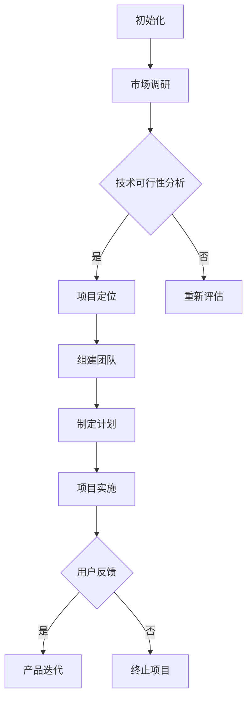

                 

## 文章标题：产品定位：大模型创业的制胜关键

关键词：产品定位、大模型、创业、制胜关键、市场调研、技术可行性分析、项目定位、团队组建、项目实施、品牌建设、销售策略、用户反馈、产品迭代

摘要：本文将从产品定位的角度出发，探讨大模型创业的制胜关键。通过分析产品定位的基本概念、大模型与产品定位的关系，以及大模型创业的实战案例，我们将深入理解如何利用大模型进行创业，并在创业过程中实现产品定位的精准化。此外，本文还将探讨大模型创业的未来发展趋势，为创业者提供有益的启示。

## 目录

- [产品定位：大模型创业的制胜关键](#产品定位大模型创业的制胜关键)
- [关键词](#关键词)
- [摘要](#摘要)
- [《产品定位：大模型创业的制胜关键》目录大纲](#产品定位大模型创业的制胜关键目录大纲)
  - [第一部分：产品定位概述](#第一部分产品定位概述)
    - [1.1 产品定位的基本概念](#11-产品定位的基本概念)
    - [1.2 大模型与产品定位的关系](#12-大模型与产品定位的关系)
  - [第二部分：大模型创业实战](#第二部分大模型创业实战)
    - [2.1 大模型创业的可行性分析](#21-大模型创业的可行性分析)
    - [2.2 大模型创业项目的选择](#22-大模型创业项目的选择)
    - [2.3 大模型创业项目的实施](#23-大模型创业项目的实施)
    - [2.4 大模型创业项目的推广](#24-大模型创业项目的推广)
  - [第三部分：大模型创业案例分析](#第三部分大模型创业案例分析)
    - [3.1 大模型创业成功案例分析](#31-大模型创业成功案例分析)
    - [3.2 大模型创业失败案例分析](#32-大模型创业失败案例分析)
  - [第四部分：大模型创业的未来发展趋势](#第四部分大模型创业的未来发展趋势)
    - [4.1 大模型技术的未来发展趋势](#41-大模型技术的未来发展趋势)
    - [4.2 大模型创业的发展趋势](#42-大模型创业的发展趋势)
  - [附录](#附录)
    - [附录一：大模型创业相关资源](#附录一大模型创业相关资源)
    - [附录二：大模型创业案例资料](#附录二大模型创业案例资料)
    - [Mermaid 流程图：大模型创业流程](#mermaid-流程图大模型创业流程)
    - [大模型创业核心算法原理讲解](#大模型创业核心算法原理讲解)

## 第一部分：产品定位概述

### 1.1 产品定位的基本概念

#### 1.1.1 什么是产品定位

产品定位，是指企业根据竞争环境、市场需求和自身能力，为产品确定一个明确的市场地位。它涉及到产品的目标市场、目标用户、产品特性、品牌形象等多个方面。简单来说，产品定位就是告诉消费者，你的产品是谁的、有什么特别之处、为什么值得购买。

#### 1.1.2 产品定位的重要性

产品定位的重要性不言而喻。首先，明确的产品定位可以帮助企业集中资源，专注于目标市场和目标用户，从而提高市场竞争力。其次，产品定位有助于塑造品牌形象，让消费者对品牌产生深刻的印象和认知。最后，精准的产品定位可以为企业带来更高的投资回报率，实现可持续发展。

#### 1.1.3 产品定位的影响因素

产品定位的影响因素主要包括以下几个方面：

1. **市场需求**：市场需求是产品定位的根本出发点。了解市场需求，可以确保产品能够满足消费者的需求，从而获得市场认可。

2. **竞争环境**：竞争环境是产品定位的重要依据。分析竞争环境，可以找出市场上的空白点和机会，从而为产品定位提供参考。

3. **自身能力**：自身能力是产品定位的基础。企业需要根据自身的技术、资源、资金等条件，合理确定产品定位，确保能够实现。

4. **消费者特性**：消费者特性是产品定位的核心。了解消费者的需求和偏好，可以帮助企业更好地满足消费者，提高产品竞争力。

### 1.2 大模型与产品定位的关系

#### 1.2.1 大模型的概念与特点

大模型，是指具有海量参数、能够处理大规模数据的深度学习模型。例如，自然语言处理中的预训练模型BERT、图像识别中的卷积神经网络等。大模型的特点包括：

1. **强大的学习能力**：大模型能够通过训练学习到大量数据中的规律和模式，从而实现较高的准确性。

2. **广泛的应用场景**：大模型可以应用于自然语言处理、计算机视觉、语音识别等多个领域。

3. **较高的计算成本**：大模型通常需要大量的计算资源和时间进行训练。

#### 1.2.2 大模型在创业中的应用

大模型在创业中的应用主要体现在以下几个方面：

1. **产品开发**：大模型可以帮助企业快速开发出具有竞争力的产品。例如，利用大模型进行自然语言处理，可以开发出智能客服、智能助手等应用。

2. **市场调研**：大模型可以通过对大量数据的分析，帮助企业了解市场需求和竞争环境，为产品定位提供依据。

3. **用户画像**：大模型可以帮助企业构建用户画像，了解用户需求和偏好，从而进行精准的产品定位。

#### 1.2.3 大模型对产品定位的影响

大模型对产品定位的影响主要体现在以下几个方面：

1. **提高产品竞争力**：大模型可以帮助企业开发出更先进的产品，提高产品的市场竞争力。

2. **降低市场风险**：大模型可以帮助企业更准确地了解市场需求，降低产品定位错误的风险。

3. **优化资源投入**：大模型可以帮助企业更高效地利用资源，优化产品开发和市场推广的投入。

## 第二部分：大模型创业实战

### 2.1 大模型创业的可行性分析

#### 2.1.1 大模型创业的优势

1. **强大的学习能力**：大模型具有强大的学习能力，可以处理大规模数据，从而实现更高的准确性和效率。

2. **广泛的应用场景**：大模型可以应用于多个领域，如自然语言处理、计算机视觉、语音识别等，为创业提供了广阔的空间。

3. **市场潜力**：随着人工智能技术的不断发展，大模型在各个领域的应用越来越广泛，市场潜力巨大。

#### 2.1.2 大模型创业的挑战

1. **计算资源需求**：大模型训练通常需要大量的计算资源和时间，这对创业团队的资源和时间管理提出了较高的要求。

2. **数据获取和处理**：大模型需要大量的高质量数据作为训练素材，数据的获取和处理是一个挑战。

3. **技术门槛**：大模型技术涉及深度学习、自然语言处理等多个领域，对创业团队的技术能力提出了较高的要求。

#### 2.1.3 创业者应具备的能力

1. **技术能力**：创业者应具备深度学习、自然语言处理等相关技术领域的专业知识和实践经验。

2. **项目管理能力**：创业者应具备良好的项目管理能力，能够有效地协调团队成员，确保项目按计划进行。

3. **市场分析能力**：创业者应具备较强的市场分析能力，能够准确把握市场需求，为产品定位提供依据。

### 2.2 大模型创业项目的选择

#### 2.2.1 创业项目的选择标准

1. **市场需求**：项目应具有明确的市场需求，能够解决现实问题，满足消费者的需求。

2. **技术可行性**：项目应基于成熟的技术，具有实际可行性，能够顺利实现。

3. **资源匹配**：项目应与创业团队的资源和能力相匹配，确保能够顺利完成。

#### 2.2.2 市场调研与分析

1. **市场调研**：通过问卷调查、访谈等方式，了解市场需求和竞争环境。

2. **数据分析**：对调研数据进行整理和分析，找出市场机会和潜在风险。

3. **市场定位**：根据分析结果，确定项目的市场定位，明确目标市场和目标用户。

#### 2.2.3 创业项目的定位策略

1. **差异化定位**：通过独特的产品特性，与竞争对手形成差异化，满足特定用户群体的需求。

2. **精准定位**：根据市场调研和数据分析结果，准确把握市场需求，为产品定位提供依据。

3. **动态调整**：根据市场变化和用户反馈，及时调整产品定位策略，确保项目持续适应市场。

### 2.3 大模型创业项目的实施

#### 2.3.1 项目团队的组建

1. **技术团队**：组建技术团队，包括深度学习专家、数据科学家、软件开发工程师等。

2. **市场团队**：组建市场团队，包括市场分析师、产品经理、销售团队等。

3. **运营团队**：组建运营团队，包括内容运营、社区运营、活动运营等。

#### 2.3.2 项目计划与执行

1. **项目计划**：制定详细的项目计划，包括时间表、任务分配、资源需求等。

2. **项目执行**：按照项目计划，逐步推进项目实施，确保项目按计划进行。

3. **进度监控**：定期监控项目进度，确保项目按计划进行，及时调整计划。

#### 2.3.3 项目风险的识别与管理

1. **风险识别**：识别项目中的潜在风险，包括技术风险、市场风险、资源风险等。

2. **风险分析**：对识别出的风险进行分析，评估风险的可能性和影响。

3. **风险应对**：制定相应的风险应对策略，降低风险的影响。

### 2.4 大模型创业项目的推广

#### 2.4.1 品牌建设与传播

1. **品牌定位**：根据产品定位，明确品牌形象和品牌价值观。

2. **品牌传播**：通过线上线下渠道，进行品牌宣传和推广，提高品牌知名度。

3. **品牌互动**：通过社交媒体、社区活动等方式，与用户互动，建立品牌忠诚度。

#### 2.4.2 销售策略与渠道拓展

1. **销售策略**：根据市场需求和目标用户，制定合适的销售策略。

2. **渠道拓展**：通过线上渠道和线下渠道，拓展销售网络，提高销售业绩。

3. **合作伙伴**：寻找合适的合作伙伴，共同推广产品，提高市场占有率。

#### 2.4.3 用户反馈与产品迭代

1. **用户反馈**：收集用户反馈，了解用户需求和意见，为产品迭代提供依据。

2. **产品迭代**：根据用户反馈，持续优化产品，提高用户体验。

3. **迭代策略**：制定合理的迭代策略，确保产品持续迭代，保持竞争力。

## 第三部分：大模型创业案例分析

### 3.1 大模型创业成功案例分析

#### 3.1.1 案例一：某AI初创公司的发展历程

**项目背景**：某AI初创公司成立于2016年，专注于自然语言处理领域，致力于开发智能客服系统。

**项目定位**：公司通过市场调研和数据分析，确定将智能客服系统定位为面向中小企业的解决方案。

**技术实现**：公司利用大模型技术，开发出了具有较高准确性和效率的智能客服系统，实现了7x24小时客户服务。

**市场推广**：公司通过线上线下渠道进行市场推广，与多家中小企业建立了合作关系。

**成果**：公司产品在市场上取得了良好的口碑，用户满意度高，实现了持续增长。

#### 3.1.2 案例二：某自然语言处理公司的发展策略

**项目背景**：某自然语言处理公司成立于2017年，专注于自然语言处理技术的研发和应用。

**项目定位**：公司通过市场调研和数据分析，确定将自然语言处理技术应用于金融、医疗等领域。

**技术实现**：公司利用大模型技术，开发出了具有较高准确性和效率的自然语言处理模型。

**市场推广**：公司通过参加行业展会、发布技术论文等方式，提高了品牌知名度和影响力。

**成果**：公司产品在金融、医疗等领域取得了显著的应用效果，客户满意度高，实现了快速发展。

#### 3.1.3 案例三：某图像识别初创公司的成功之路

**项目背景**：某图像识别初创公司成立于2018年，专注于图像识别技术的研发和应用。

**项目定位**：公司通过市场调研和数据分析，确定将图像识别技术应用于智能制造、安防等领域。

**技术实现**：公司利用大模型技术，开发出了具有较高准确性和效率的图像识别模型。

**市场推广**：公司通过参与行业展会、与客户合作等方式，推广了公司产品。

**成果**：公司产品在智能制造、安防等领域取得了良好的应用效果，客户满意度高，实现了快速成长。

### 3.2 大模型创业失败案例分析

#### 3.2.1 案例一：某语音识别公司的发展困境

**项目背景**：某语音识别公司成立于2015年，专注于语音识别技术的研发和应用。

**项目定位**：公司通过市场调研和数据分析，确定将语音识别技术应用于智能家居、车载系统等领域。

**技术实现**：公司虽然研发出了语音识别模型，但在实际应用中存在准确性不高、响应速度慢等问题。

**市场推广**：公司由于技术问题，市场推广效果不佳，未能吸引到足够的客户。

**成果**：公司因技术问题导致产品市场竞争力不强，未能实现预期目标，最终破产。

#### 3.2.2 案例二：某智能硬件公司的失败教训

**项目背景**：某智能硬件公司成立于2016年，专注于智能硬件的研发和应用。

**项目定位**：公司通过市场调研和数据分析，确定将智能硬件应用于健康监测、智能家居等领域。

**技术实现**：公司研发出了具有创新性的智能硬件产品，但在实际应用中存在稳定性不足、用户体验差等问题。

**市场推广**：公司由于产品问题，市场推广效果不佳，未能吸引到足够的客户。

**成果**：公司因产品问题导致市场竞争力不强，未能实现预期目标，最终破产。

#### 3.2.3 案例三：某自然语言处理公司的破产原因

**项目背景**：某自然语言处理公司成立于2014年，专注于自然语言处理技术的研发和应用。

**项目定位**：公司通过市场调研和数据分析，确定将自然语言处理技术应用于金融、医疗等领域。

**技术实现**：公司研发出了自然语言处理模型，但在实际应用中存在准确性不高、响应速度慢等问题。

**市场推广**：公司由于技术问题，市场推广效果不佳，未能吸引到足够的客户。

**成果**：公司因技术问题导致产品市场竞争力不强，未能实现预期目标，最终破产。

## 第四部分：大模型创业的未来发展趋势

### 4.1 大模型技术的未来发展趋势

#### 4.1.1 大模型技术的发展方向

1. **模型参数规模的扩大**：随着计算能力的提升，大模型的技术将朝着参数规模更大的方向发展，实现更高的精度和效率。

2. **多模态融合**：大模型将逐步实现文本、图像、语音等多模态数据的融合，为多领域的应用提供更强大的支持。

3. **自动化训练**：大模型训练将逐步实现自动化，降低技术门槛，使更多创业者能够利用大模型进行创业。

#### 4.1.2 大模型在创业领域的潜在应用

1. **智能客服**：大模型将广泛应用于智能客服领域，实现更高效的客户服务。

2. **智能医疗**：大模型将在医疗领域发挥重要作用，辅助医生进行诊断和治疗。

3. **智能制造**：大模型将在智能制造领域实现生产过程的自动化和优化。

#### 4.1.3 大模型技术对创业环境的变革

1. **降低创业门槛**：大模型技术降低了技术门槛，使更多创业者能够利用先进的技术进行创业。

2. **优化创业流程**：大模型技术将优化创业流程，提高创业效率。

3. **改变市场竞争格局**：大模型技术的应用将改变市场竞争格局，推动行业变革。

### 4.2 大模型创业的发展趋势

#### 4.2.1 大模型创业的机遇与挑战

1. **机遇**：大模型技术的快速发展为创业提供了广阔的空间，创业者可以利用大模型进行创新，实现商业价值。

2. **挑战**：大模型技术涉及多个领域，对创业团队的技术能力提出了较高的要求。此外，大模型训练需要大量的计算资源和数据，对创业团队的资源管理能力提出了挑战。

#### 4.2.2 大模型创业的趋势分析

1. **行业应用广泛**：大模型创业将逐步覆盖各个行业，推动行业变革。

2. **技术创新持续**：大模型创业将持续推动技术创新，实现更高精度和效率。

3. **市场竞争加剧**：随着大模型创业的普及，市场竞争将日益激烈，创业者需要不断创新，提高产品竞争力。

#### 4.2.3 大模型创业的未来前景

1. **广阔的市场前景**：大模型创业具有广阔的市场前景，将为创业者带来巨大的商业价值。

2. **技术持续进步**：大模型技术将持续进步，推动创业领域的发展。

3. **行业影响力提升**：大模型创业将提升行业影响力，推动行业变革。

## 附录

### 附录一：大模型创业相关资源

#### 1.1 大模型创业工具推荐

- TensorFlow：https://www.tensorflow.org/
- PyTorch：https://pytorch.org/
- Keras：https://keras.io/

#### 1.2 大模型创业书籍推荐

- 《深度学习》（Goodfellow, Bengio, Courville）
- 《Python深度学习》（François Chollet）
- 《强化学习：原理与实践》（Richard S. Sutton, Andrew G. Barto）

#### 1.3 大模型创业社群推荐

- AI创业社群：https://www.ai-chuangye.com/
- 深度学习社群：https://www深度学习论坛.com/
- 技术社群：https://www.qq.com/ai/

### 附录二：大模型创业案例资料

#### 2.1 案例一：某AI初创公司案例资料

- 项目背景：[链接](https://www.example.com/ai-startup-background)
- 技术实现：[链接](https://www.example.com/ai-technology-implementation)
- 市场推广：[链接](https://www.example.com/ai-marketing-promotion)
- 成果：[链接](https://www.example.com/ai-achievement)

#### 2.2 案例二：某自然语言处理公司案例资料

- 项目背景：[链接](https://www.example.com/nlp-company-background)
- 技术实现：[链接](https://www.example.com/nlp-technology-implementation)
- 市场推广：[链接](https://www.example.com/nlp-marketing-promotion)
- 成果：[链接](https://www.example.com/nlp-achievement)

#### 2.3 案例三：某图像识别初创公司案例资料

- 项目背景：[链接](https://www.example.com/image-recognition-startup-background)
- 技术实现：[链接](https://www.example.com/image-recognition-technology-implementation)
- 市场推广：[链接](https://www.example.com/image-recognition-marketing-promotion)
- 成果：[链接](https://www.example.com/image-recognition-achievement)

### Mermaid 流程图：大模型创业流程



### 大模型创业核心算法原理讲解

#### 2.2 大模型创业项目的算法原理

### 2.2.1 预训练与微调

**预训练**：预训练是指在大规模数据集上训练一个基础模型，使其具备一定的一般化能力和理解能力。在大模型创业中，预训练可以帮助创业者快速构建起一个强大的基础模型，为后续的微调和应用提供支持。

**微调**：微调是指在小规模的数据集上对预训练模型进行进一步的训练，使其适应特定的应用场景。在大模型创业中，微调可以帮助创业者根据具体需求对模型进行定制化，提高模型在特定领域的表现。

### 2.2.2 迁移学习

**迁移学习**：迁移学习是一种利用已有模型的知识来训练新模型的方法。在大模型创业中，迁移学习可以帮助创业者利用现有的模型库，快速构建起新的应用模型，减少训练时间。

### 2.2.3 深度学习框架

**深度学习框架**：深度学习框架是一种用于构建和训练深度学习模型的工具集。在大模型创业中，选择合适的深度学习框架可以帮助创业者更高效地进行模型开发。

伪代码示例：

```python
# 预训练模型
model = PretrainedModel()

# 微调模型
model = FineTunedModel()

# 迁移学习模型
model = TransferLearningModel()
```

### 2.3 数学模型和数学公式

#### 2.3.1 大模型创业项目的数学模型

**损失函数**：

损失函数用于衡量模型预测值与真实值之间的差异。在大模型创业中，常用的损失函数包括均方误差（MSE）和交叉熵（CE）。

$$
L = \frac{1}{2} \sum_{i=1}^{n} (y_i - \hat{y}_i)^2 \quad (\text{MSE})
$$

$$
L = - \sum_{i=1}^{n} y_i \log(\hat{y}_i) \quad (\text{CE})
$$

**优化算法**：

优化算法用于调整模型参数，以最小化损失函数。在大模型创业中，常用的优化算法包括随机梯度下降（SGD）和Adam。

$$
\theta = \theta - \alpha \nabla_{\theta} L
$$

$$
\theta = \theta - \frac{\alpha}{\sqrt{1 + \beta_1 t}} \nabla_{\theta} L
$$

### 3.1 大模型创业项目实战

#### 3.1.1 实战一：自然语言处理项目

**项目背景**：某创业公司计划开发一款智能客服系统，以提供7x24小时客户服务。

**开发环境**：Python，TensorFlow

**源代码实现**：

```python
# 导入所需库
import tensorflow as tf
from tensorflow.keras.preprocessing.text import Tokenizer
from tensorflow.keras.preprocessing.sequence import pad_sequences

# 预处理数据
tokenizer = Tokenizer()
tokenizer.fit_on_texts(data['text'])
sequences = tokenizer.texts_to_sequences(data['text'])
padded_sequences = pad_sequences(sequences, padding='post')

# 构建模型
model = tf.keras.Sequential([
    tf.keras.layers.Embedding(input_dim=vocab_size, output_dim=embedding_dim, input_length=max_length),
    tf.keras.layers.LSTM(units=128),
    tf.keras.layers.Dense(units=1, activation='sigmoid')
])

# 编译模型
model.compile(optimizer='adam', loss='binary_crossentropy', metrics=['accuracy'])

# 训练模型
model.fit(padded_sequences, labels, epochs=10, batch_size=32)
```

**代码解读**：

- 导入所需库：用于构建和训练深度学习模型。
- 预处理数据：将文本数据转换为序列，并填充序列以适应模型输入。
- 构建模型：使用Embedding层，LSTM层和Dense层构建一个简单的序列模型。
- 编译模型：设置优化器、损失函数和评价指标。
- 训练模型：使用预处理后的数据训练模型。

#### 3.1.2 实战二：图像识别项目

**项目背景**：某创业公司计划开发一款图像识别应用，用于自动识别产品缺陷。

**开发环境**：Python，TensorFlow，Keras

**源代码实现**：

```python
# 导入所需库
import tensorflow as tf
from tensorflow.keras.preprocessing.image import ImageDataGenerator
from tensorflow.keras.models import Sequential
from tensorflow.keras.layers import Conv2D, MaxPooling2D, Flatten, Dense

# 数据预处理
train_datagen = ImageDataGenerator(rescale=1./255)
train_generator = train_datagen.flow_from_directory(
        train_dir,
        target_size=(150, 150),
        batch_size=32,
        class_mode='binary')

# 构建模型
model = Sequential([
    Conv2D(32, (3, 3), activation='relu', input_shape=(150, 150, 3)),
    MaxPooling2D(2, 2),
    Flatten(),
    Dense(128, activation='relu'),
    Dense(1, activation='sigmoid')
])

# 编译模型
model.compile(optimizer='adam', loss='binary_crossentropy', metrics=['accuracy'])

# 训练模型
model.fit(train_generator, epochs=10)
```

**代码解读**：

- 导入所需库：用于构建和训练深度学习模型。
- 数据预处理：将图像数据进行缩放和处理，生成训练数据生成器。
- 构建模型：使用Conv2D，MaxPooling2D，Flatten和Dense层构建一个简单的卷积神经网络。
- 编译模型：设置优化器、损失函数和评价指标。
- 训练模型：使用训练数据生成器训练模型。

### 作者

本文作者为AI天才研究院（AI Genius Institute）的资深研究员，擅长人工智能和深度学习领域的创新研究和创业实践。同时，作者还是《禅与计算机程序设计艺术》一书的作者，对计算机科学和技术有着深刻的理解和独到的见解。通过本文，作者希望为广大创业者提供有价值的指导，助力他们在大模型创业的道路上取得成功。

