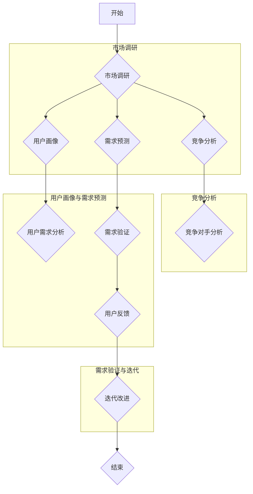

                 

### 《产品开发的市场需求分析》目录大纲

在本章中，我们将为您概述《产品开发的市场需求分析》的整个结构，并展示其目录大纲，以确保您对文章的结构和内容有整体的了解。

---

**# 《产品开发的市场需求分析》目录大纲**

**## 第一部分：市场需求分析概述**

**### 第1章：市场需求分析的重要性**

- **1.1.1 市场需求分析的定义**
- **1.1.2 市场需求分析的意义**
- **1.1.3 市场需求分析的目标**

**## 第2章：市场需求分析的方法和工具**

- **2.1.1 市场调研方法**
- **2.1.2 竞争分析工具**
- **2.1.3 用户画像与需求预测**

**## 第3章：市场需求分析流程**

- **3.1.1 市场需求分析准备**
- **3.1.2 市场调研与分析**
- **3.1.3 需求分析与用户反馈**

**## 第二部分：市场需求分析实践**

**### 第4章：市场需求分析在产品开发中的应用**

- **4.1.1 产品规划与需求定义**
- **4.1.2 用户需求调研与挖掘**
- **4.1.3 需求验证与迭代**

**### 第5章：市场需求分析案例解析**

- **5.1.1 案例一：电商产品开发**
- **5.1.2 案例二：智能家居产品开发**
- **5.1.3 案例三：教育科技产品开发**

**### 第6章：市场需求分析中的挑战与解决方案**

- **6.1.1 市场需求分析中的常见问题**
- **6.1.2 应对市场变化策略**
- **6.1.3 市场需求分析与项目管理**

**### 第7章：市场需求分析的持续优化**

- **7.1.1 市场需求分析反馈机制**
- **7.1.2 市场需求分析与敏捷开发**
- **7.1.3 市场需求分析的未来趋势**

**## 附录**

**### 附录A：市场需求分析工具与资源**

- **A.1.1 市场需求分析工具概览**
- **A.1.2 数据来源与处理**
- **A.1.3 市场需求分析参考资料与文献**

---

通过这个大纲，您可以清晰地看到文章的结构和内容分布，从而更好地把握文章的主题和每个部分的核心内容。接下来，我们将逐步深入每一章，进行详细的分析和讨论。

---

**关键词：产品开发，市场需求分析，市场调研，竞争分析，用户画像，需求预测，实践案例，挑战与解决方案，持续优化**

**摘要：本文旨在详细探讨产品开发过程中市场需求分析的重要性和方法。通过阐述市场需求分析的定义、意义和目标，介绍市场调研方法、竞争分析工具和用户画像与需求预测技术，本文将展示市场需求分析的完整流程和实践应用。此外，通过具体案例解析和挑战与解决方案的讨论，本文将为读者提供关于市场需求分析的深入见解和实用策略。**

---

### 第1章：市场需求分析的重要性

市场需求分析是产品开发过程中的关键环节，它直接影响产品的成功与否。在这一章节中，我们将深入探讨市场需求分析的定义、意义及其在产品开发中的重要性。

#### 1.1.1 市场需求分析的定义

市场需求分析是一种系统的研究方法，旨在理解市场中用户对特定产品或服务的需求。它涉及对市场环境、消费者行为、竞争对手等多个方面的分析。具体来说，市场需求分析包括以下几个方面：

1. **市场环境分析**：研究宏观经济、行业趋势、政策法规等外部环境因素，以了解市场的发展状况和潜在机会。
2. **消费者行为分析**：研究消费者的购买行为、需求偏好和消费习惯，以识别目标用户群体的特征和需求。
3. **竞争对手分析**：分析主要竞争对手的市场表现、产品特点和市场策略，以了解竞争态势和自身的市场定位。
4. **用户需求分析**：通过调研和用户反馈，了解用户对产品或服务的具体需求，包括功能需求、体验需求等。

在数学上，市场需求可以表示为：

\[ 
市场需求 = \text{消费者需求} \times \text{购买能力} \times \text{购买意愿} 
\]

其中，消费者需求、购买能力和购买意愿是影响市场需求的三个主要因素。通过市场需求分析，企业可以更准确地识别这些因素，从而制定有效的市场策略。

#### 1.1.2 市场需求分析的意义

市场需求分析在产品开发中具有重要的意义，它能够为企业提供以下几个方面的帮助：

1. **识别用户需求**：通过市场需求分析，企业可以深入了解用户的需求和痛点，从而为产品功能设计提供依据。这有助于企业开发出更符合用户期望的产品。

2. **制定产品策略**：市场需求分析能够帮助企业确定产品的目标市场和定位，制定合适的市场进入策略。这有助于企业更有效地利用资源，提高市场竞争力。

3. **降低市场风险**：通过提前了解市场需求，企业可以减少因产品不符合市场需求而产生的市场风险。这有助于企业避免产品开发的失败，降低投资风险。

4. **提高市场竞争力**：有效的市场需求分析能够帮助企业发现市场机会，提升产品在市场上的竞争力。通过了解竞争对手的动态和用户需求，企业可以调整产品策略，抢占市场先机。

#### 1.1.3 市场需求分析的目标

市场需求分析的主要目标包括：

1. **确定市场需求**：通过数据分析，准确判断市场对产品的需求程度。这有助于企业确定产品的生产规模和市场投放策略。

2. **识别用户需求**：深入了解用户对产品的具体需求，包括功能需求、体验需求等。这有助于企业优化产品设计，提升用户满意度。

3. **分析市场趋势**：预测市场未来的发展变化，为产品规划提供前瞻性指导。这有助于企业把握市场机遇，制定长期发展战略。

4. **评估市场机会**：识别市场潜在的商业机会，为企业战略规划提供支持。这有助于企业发现新的市场领域，开拓业务增长点。

通过本章的讨论，我们可以看到市场需求分析在产品开发中的重要性。它不仅帮助企业识别用户需求，制定产品策略，降低市场风险，还能提高市场竞争力。在接下来的章节中，我们将进一步探讨市场需求分析的方法和工具，以及其实践应用。

---

### 第2章：市场需求分析的方法和工具

在产品开发过程中，进行市场需求分析是至关重要的。这一章节将详细介绍市场需求分析的具体方法和工具，包括市场调研方法、竞争分析工具和用户画像与需求预测技术。

#### 2.1.1 市场调研方法

市场调研是市场需求分析的核心环节，它涉及对市场环境和消费者行为的深入研究。市场调研方法可以分为定量调研和定性调研两种类型。

1. **定量调研**：
   - **问卷调查**：通过设计问卷，收集大量用户的数据。问卷调查适用于大规模市场分析，可以帮助企业获取大量的用户反馈信息。问卷调查的设计需要注意问题的清晰性、逻辑性和客观性，以确保数据的准确性和可靠性。
   - **数据分析**：对收集到的问卷数据进行统计和分析，提取有用的信息。常用的数据分析方法包括描述性统计、相关分析和回归分析等。

2. **定性调研**：
   - **焦点小组**：召集一组用户进行讨论，收集用户对产品或服务的意见。焦点小组的优点是能够深入了解用户的观点和需求，缺点是样本量较小，数据可能存在偏差。
   - **深度访谈**：与用户进行一对一的深入交流，了解用户的真实需求和想法。深度访谈的优点是能够获取详细和深入的信息，缺点是需要投入大量时间和人力资源。
   - **用户观察**：通过观察用户使用产品或服务的场景，收集用户行为数据。用户观察有助于企业了解用户在使用过程中的痛点，为产品优化提供依据。

#### 2.1.2 竞争分析工具

竞争分析是市场需求分析的重要组成部分，它涉及对竞争对手的产品、市场策略和用户反馈的深入研究。以下是一些常用的竞争分析工具：

1. **竞争对手分析**：通过分析竞争对手的网站、产品、市场策略等，了解竞争对手的优势和劣势。竞争对手分析可以帮助企业确定自身的市场定位和差异化竞争优势。
   
2. **SWOT分析**：SWOT分析是一种常用的竞争分析工具，它通过分析企业的优势（Strengths）、劣势（Weaknesses）、机会（Opportunities）和威胁（Threats），帮助企业制定有效的竞争策略。

3. **市场份额分析**：通过市场份额数据，了解企业在市场中的地位和竞争态势。市场份额分析可以帮助企业评估自身在市场中的竞争力和市场份额，为产品策略制定提供依据。

4. **定价策略分析**：分析竞争对手的定价策略，为企业制定合理的定价策略提供参考。定价策略分析包括成本定价、市场定价和竞争定价等不同方法。

#### 2.1.3 用户画像与需求预测

用户画像是市场需求分析的重要工具，它通过对目标用户进行特征描述，帮助企业管理用户需求和优化产品设计。以下是一些构建用户画像和进行需求预测的方法：

1. **用户画像**：用户画像是对目标用户进行特征描述的过程。它包括用户的基本信息（如年龄、性别、地域等）、行为特征（如购买行为、浏览行为等）和需求偏好（如产品偏好、服务偏好等）。用户画像可以通过定量调研（如问卷调查）和定性调研（如深度访谈）等方法收集数据，然后通过数据分析技术（如聚类分析和机器学习算法）进行建模。

2. **需求预测**：需求预测是基于历史数据和用户行为分析，对未来用户需求进行预测。需求预测的工具和方法包括：

   - **时间序列分析**：通过分析用户行为的时间序列数据，预测未来的需求趋势。时间序列分析可以识别用户行为的周期性、趋势性和季节性变化，为需求预测提供依据。
   
   - **回归分析**：建立用户需求与相关因素之间的回归模型，预测未来需求。回归分析可以通过数学模型来描述用户需求与影响因素之间的关系，从而预测未来的需求。
   
   - **机器学习算法**：利用机器学习算法，如决策树、神经网络等，对用户需求进行预测。机器学习算法可以从大量数据中自动提取特征和规律，从而提高需求预测的准确性。

通过本章的介绍，我们可以看到市场需求分析的方法和工具是如何帮助企业在产品开发中准确识别用户需求、制定有效市场策略的。在接下来的章节中，我们将进一步探讨市场需求分析的流程和实践应用。

---

### 第3章：市场需求分析流程

市场需求分析的流程是企业产品开发过程中不可或缺的一部分。一个系统、科学的分析流程可以确保企业准确把握市场需求，从而制定出有效的产品策略。本章节将详细阐述市场需求分析的准备、市场调研与分析、需求分析与用户反馈三个关键环节。

#### 3.1.1 市场需求分析准备

市场需求分析准备工作是确保分析顺利开展的基础。以下是市场需求分析准备的主要内容：

1. **明确分析目标**：在开始分析之前，首先要明确分析的目标。这些目标可以是确定市场需求、识别用户需求、分析市场趋势等。明确目标有助于集中精力，确保分析工作的有效性。

2. **确定分析范围**：分析范围是指市场调研和竞争分析所涵盖的具体市场区域和行业领域。确定分析范围有助于避免资源的浪费，确保分析的针对性和准确性。

3. **收集数据资源**：在分析过程中，需要收集大量的数据资源，包括市场报告、用户调研问卷、竞争对手数据等。数据资源的收集需要确保其来源的可靠性和数据的完整性。

4. **制定分析计划**：制定详细的分析计划，包括分析步骤、时间安排、资源分配等。分析计划有助于确保分析工作有条不紊地进行，提高工作效率。

#### 3.1.2 市场调研与分析

市场调研与分析是市场需求分析的核心环节，它涉及对市场环境、消费者行为、竞争对手等多个方面的深入研究。以下是市场调研与分析的主要内容：

1. **数据收集**：通过问卷调查、访谈、用户观察等方式，收集大量的用户数据和竞争对手数据。数据收集的过程需要确保数据的真实性和有效性，避免数据偏差。

2. **数据处理**：对收集到的数据进行清洗、整理和归类。数据处理的过程包括去除重复数据、纠正错误数据、对数据进行分类和汇总等。通过数据处理，可以确保数据的质量，为后续分析提供可靠的基础。

3. **数据分析**：运用统计方法、机器学习算法等对数据进行深入分析，提取有用的信息。数据分析的方法包括描述性统计、相关分析、回归分析、聚类分析等。通过数据分析，可以识别用户需求、市场趋势和竞争对手的动态。

4. **报告编写**：根据分析结果，编写详细的市场调研报告。报告应包括分析发现、主要结论和建议等内容。报告的编写需要清晰、简洁、具有逻辑性，确保读者能够快速理解分析结果。

#### 3.1.3 需求分析与用户反馈

需求分析与用户反馈是市场需求分析的重要环节，它涉及对用户需求的深入挖掘和用户反馈的及时响应。以下是需求分析与用户反馈的主要内容：

1. **需求分析**：根据市场调研结果，分析用户的实际需求和潜在需求，为产品开发提供依据。需求分析的方法包括用户需求调研、用户画像构建和需求验证等。

2. **用户反馈**：收集用户对产品的使用体验和改进意见。用户反馈可以通过在线调查、用户访谈、用户社区等方式进行。用户反馈的收集需要确保其真实性和代表性。

3. **需求迭代**：根据用户反馈，对产品需求进行迭代优化，提升产品功能和完善用户体验。需求迭代的步骤包括需求识别、需求评估、需求设计和需求验证等。

4. **持续跟踪**：持续跟踪市场需求和用户反馈，及时调整产品策略，保持市场竞争力。持续跟踪的方法包括定期用户调研、市场监测和数据分析等。

通过本章的讨论，我们可以看到市场需求分析流程的各个环节是如何相互衔接和相互作用的。一个系统、科学的分析流程可以确保企业准确把握市场需求，制定有效的产品策略，提高市场竞争力。在接下来的章节中，我们将进一步探讨市场需求分析在产品开发中的应用和实践案例。

---

### 第4章：市场需求分析在产品开发中的应用

市场需求分析在产品开发中起着至关重要的作用，它不仅帮助企业识别用户需求，还能指导产品规划、设计和迭代。在这一章节中，我们将详细探讨市场需求分析在产品开发中的应用，包括产品规划与需求定义、用户需求调研与挖掘以及需求验证与迭代。

#### 4.1.1 产品规划与需求定义

产品规划是市场需求分析在产品开发中的第一步，它涉及确定产品的目标市场、功能定位和市场策略。以下是产品规划与需求定义的具体步骤：

1. **目标市场确定**：通过市场需求分析，确定产品的目标市场。这包括分析目标市场的规模、增长潜力、用户特征等。目标市场的确定有助于企业集中资源和精力，开发出更符合市场需求的产品。

2. **功能定位**：在目标市场确定之后，需要明确产品的功能定位。功能定位包括确定产品的核心功能、辅助功能和独特卖点。功能定位的目的是确保产品能够满足目标用户的核心需求，并具备一定的竞争力。

3. **市场策略制定**：根据目标市场和功能定位，制定合适的市场策略。市场策略包括定价策略、推广策略和渠道策略等。市场策略的制定需要考虑产品的成本、竞争对手的策略和市场环境的特征。

4. **需求定义**：在产品规划的基础上，制定详细的需求文档。需求文档应包括产品的功能需求、非功能需求和用户故事等。功能需求描述产品必须实现的功能，非功能需求描述产品的性能、可靠性等，用户故事描述用户如何使用产品。

#### 4.1.2 用户需求调研与挖掘

用户需求调研与挖掘是市场需求分析的核心环节，它涉及对用户需求的深入理解和挖掘。以下是用户需求调研与挖掘的具体方法：

1. **问卷调查**：通过设计问卷，收集大量用户的反馈数据。问卷的设计需要注意问题的清晰性和逻辑性，以确保数据的准确性和有效性。

2. **用户访谈**：与用户进行一对一的深入访谈，了解用户对产品的需求和期望。用户访谈有助于获取更详细和深入的信息，但需要投入较多时间和资源。

3. **用户观察**：通过观察用户使用产品或服务的场景，收集用户行为数据。用户观察有助于发现用户在使用过程中的痛点和需求。

4. **用户画像构建**：通过分析用户数据，构建用户画像。用户画像是对目标用户进行特征描述的过程，包括用户的基本信息、行为特征和需求偏好等。用户画像有助于企业更好地理解用户，制定更有针对性的产品策略。

5. **需求挖掘工具**：利用需求挖掘工具，如文本分析、情感分析、聚类分析等，对用户反馈和用户行为数据进行分析，提取用户需求。需求挖掘工具可以帮助企业从大量数据中快速识别出有价值的需求。

#### 4.1.3 需求验证与迭代

需求验证与迭代是确保产品需求符合市场需求的必要步骤，它涉及对需求的有效验证和持续迭代优化。以下是需求验证与迭代的具体步骤：

1. **需求验证**：通过用户反馈和市场测试，验证需求的准确性和可行性。需求验证的方法包括用户验收测试、市场试点等。通过需求验证，可以确保需求满足用户需求，具备实际可行性。

2. **需求迭代**：根据需求验证的结果，对产品需求进行迭代优化。需求迭代的过程包括需求识别、需求评估、需求设计和需求验证等。通过迭代优化，可以不断提升产品的功能和用户体验。

3. **用户反馈收集**：持续收集用户对产品的反馈，了解用户的使用体验和改进意见。用户反馈的收集可以通过用户社区、在线调查、用户访谈等方式进行。

4. **需求更新**：根据用户反馈和市场变化，及时更新产品需求。需求更新的目的是确保产品始终符合市场需求，保持市场竞争力。

5. **敏捷开发**：结合敏捷开发方法，快速响应市场需求变化，实现持续迭代优化。敏捷开发强调频繁交付、快速反馈和持续改进，有助于企业快速适应市场变化。

通过本章的讨论，我们可以看到市场需求分析在产品开发中的应用是如何贯穿整个产品生命周期，从产品规划到需求定义、需求调研、需求验证和迭代优化的。一个系统、科学的分析流程和有效的需求管理，可以确保企业开发出符合市场需求、具备市场竞争力的产品。在接下来的章节中，我们将通过具体案例进一步探讨市场需求分析在产品开发中的应用和实践。

---

### 第5章：市场需求分析案例解析

在上一章中，我们详细介绍了市场需求分析的理论和方法。在本章中，我们将通过三个具体的案例，深入探讨市场需求分析在电商产品开发、智能家居产品开发和教育科技产品开发中的应用和实践。

#### 5.1.1 案例一：电商产品开发

电商产品开发是一个高度竞争的市场领域，市场需求分析在其中起着至关重要的作用。以下是一个电商产品开发的市场需求分析案例：

1. **市场调研**：
   - **宏观经济分析**：通过分析经济增长率、消费者支出趋势等，确定电商市场的发展潜力。
   - **行业趋势分析**：研究电商行业的最新趋势，如直播带货、社交电商等，以了解市场发展方向。
   - **消费者行为分析**：通过问卷调查和用户访谈，了解消费者的购物习惯、购买偏好和痛点。

2. **用户需求挖掘**：
   - **用户调研**：设计问卷，收集用户对电商平台的满意度、使用频率和主要需求。
   - **用户画像构建**：根据调研数据，构建用户画像，包括用户的年龄、性别、地域、购买行为等。
   - **需求挖掘**：通过文本分析和情感分析，提取用户的潜在需求，如更便捷的支付方式、个性化推荐等。

3. **需求验证与迭代**：
   - **需求验证**：通过A/B测试和用户验收测试，验证用户需求的有效性和可行性。
   - **需求迭代**：根据用户反馈和验证结果，对产品功能进行迭代优化，如增加个性化推荐、改进购物流程等。

#### 5.1.2 案例二：智能家居产品开发

智能家居产品开发涉及多个技术和应用场景，市场需求分析在其中同样至关重要。以下是一个智能家居产品开发的市场需求分析案例：

1. **市场调研**：
   - **技术趋势分析**：研究智能家居技术的最新发展，如物联网、人工智能等，以了解技术发展方向。
   - **消费者需求分析**：通过用户调研，了解消费者对智能家居产品的需求，如智能门锁、智能照明、智能音响等。
   - **市场潜力评估**：分析智能家居市场的增长潜力，包括市场规模、增长速度和用户接受度。

2. **用户需求挖掘**：
   - **用户调研**：通过问卷调查和用户访谈，了解用户对智能家居产品的需求、使用体验和改进意见。
   - **用户画像构建**：根据调研数据，构建用户画像，包括用户的家庭结构、生活习惯和科技接受度等。
   - **需求挖掘**：通过数据分析，提取用户对智能家居产品的潜在需求，如安全性、易用性和互联互通性等。

3. **需求验证与迭代**：
   - **需求验证**：通过市场测试和用户验收测试，验证智能家居产品的功能和用户体验。
   - **需求迭代**：根据用户反馈和验证结果，对产品进行迭代优化，如改进产品的安全性、提高易用性等。

#### 5.1.3 案例三：教育科技产品开发

教育科技产品开发旨在利用技术提升教育质量和学习体验，市场需求分析在其中起着关键作用。以下是一个教育科技产品开发的市场需求分析案例：

1. **市场调研**：
   - **教育趋势分析**：研究教育行业的发展趋势，如在线教育、个性化学习等，以了解教育市场的变化。
   - **学生需求分析**：通过问卷调查和用户访谈，了解学生和教师对教育科技产品的需求和使用情况。
   - **市场潜力评估**：分析教育科技市场的规模、增长速度和用户接受度。

2. **用户需求挖掘**：
   - **用户调研**：通过问卷调查和用户访谈，了解学生和教师对教育科技产品的满意度、使用频率和主要需求。
   - **用户画像构建**：根据调研数据，构建学生和教师的用户画像，包括他们的学习习惯、教学需求和技术接受度等。
   - **需求挖掘**：通过数据分析，提取学生和教师对教育科技产品的潜在需求，如互动性、易用性和个性化等。

3. **需求验证与迭代**：
   - **需求验证**：通过试用和用户验收测试，验证教育科技产品的功能和用户体验。
   - **需求迭代**：根据用户反馈和验证结果，对产品进行迭代优化，如增加互动功能、改进界面设计等。

通过以上三个案例，我们可以看到市场需求分析在电商、智能家居和教育科技等不同领域中的应用和实践。无论是在产品规划、需求挖掘还是需求验证和迭代过程中，市场需求分析都起着至关重要的作用，它帮助企业准确识别用户需求，制定有效的产品策略，提高市场竞争力。

---

### 第6章：市场需求分析中的挑战与解决方案

市场需求分析是一个复杂且动态的过程，企业在进行市场需求分析时往往会遇到各种挑战。本章将探讨市场需求分析中常见的挑战，并介绍相应的解决方案。

#### 6.1.1 市场需求分析中的常见问题

1. **数据不准确**：在收集数据时，可能会遇到数据偏差、信息不全或数据质量不高等问题，这会影响分析结果的准确性。

   **解决方案**：
   - **多渠道数据验证**：通过多个渠道收集数据，并进行交叉验证，以确保数据的准确性。
   - **数据清洗和标准化**：对收集到的数据进行清洗和标准化处理，去除重复和错误数据，提高数据质量。

2. **用户需求变化**：市场需求是不断变化的，用户需求也不例外。在分析过程中，可能会发现用户需求与实际情况不符，或者需求变化较快，难以适应。

   **解决方案**：
   - **持续用户反馈收集**：建立持续的反馈机制，通过在线调查、用户访谈等方式，定期收集用户反馈。
   - **灵活调整分析策略**：根据用户反馈和市场变化，灵活调整市场需求分析的方法和工具。

3. **资源有限**：市场需求分析需要投入大量的人力、物力和时间资源，特别是在大型企业或复杂市场中，资源分配和协调可能成为问题。

   **解决方案**：
   - **资源优化配置**：合理规划资源，确保数据分析的各个环节都有足够的资源支持。
   - **分阶段进行分析**：将市场需求分析分为多个阶段，逐步进行，避免资源过度集中。

#### 6.1.2 应对市场变化策略

市场变化是市场需求分析中的一个重要因素。企业需要建立有效的策略来应对市场的快速变化。

1. **快速响应**：在市场变化发生时，企业需要能够快速响应，调整产品策略和市场策略。

   **解决方案**：
   - **建立快速响应机制**：制定应急响应计划，确保在市场变化发生时，能够迅速采取行动。
   - **加强内部沟通**：建立高效的内部沟通渠道，确保市场信息能够迅速传递到各个部门。

2. **灵活调整**：根据市场变化，企业需要灵活调整产品功能和设计，以适应新的市场需求。

   **解决方案**：
   - **敏捷开发**：采用敏捷开发方法，快速迭代产品，根据市场反馈不断优化产品。
   - **需求管理**：建立有效的需求管理流程，确保需求能够及时调整和优化。

3. **建立市场预警系统**：通过数据分析和市场监测，提前预判市场变化，制定应对策略。

   **解决方案**：
   - **数据监测**：通过数据监测工具，实时跟踪市场变化，及时发现潜在的风险和机会。
   - **市场研究**：定期进行市场研究，了解竞争对手的策略和市场趋势，为决策提供依据。

#### 6.1.3 市场需求分析与项目管理

市场需求分析与项目管理密切相关。有效的市场需求分析能够为项目管理提供指导和支持。

1. **确保项目方向正确**：通过市场需求分析，确保项目的目标、功能和设计符合市场需求，避免项目偏离方向。

   **解决方案**：
   - **定期分析**：在项目开发的各个阶段，定期进行市场需求分析，确保项目始终符合市场趋势。
   - **需求管理**：建立需求管理流程，确保需求从识别到实现的全过程中得到有效管理。

2. **优化项目进度**：根据市场需求分析结果，优化项目进度，确保项目能够按时完成。

   **解决方案**：
   - **优先级管理**：根据市场需求的重要性，调整项目的优先级，确保关键需求能够优先实现。
   - **资源调配**：根据项目进度和市场反馈，合理调配资源，确保项目顺利进行。

3. **提升项目质量**：通过市场需求分析，识别潜在需求和市场机会，提升项目的质量和市场竞争力。

   **解决方案**：
   - **需求验证**：通过用户反馈和市场测试，验证需求的有效性和可行性，确保项目实现的价值。
   - **用户参与**：鼓励用户参与项目开发，通过用户测试和反馈，优化产品的功能和用户体验。

通过本章的讨论，我们可以看到市场需求分析中面临的挑战和相应的解决方案。企业需要建立有效的策略来应对这些挑战，确保市场需求分析的准确性和有效性，从而提高产品的市场竞争力。

---

### 第7章：市场需求分析的持续优化

市场需求分析是一个动态和持续的过程，随着市场的变化和用户需求的发展，企业需要不断地对市场需求分析进行优化，以确保分析的准确性和有效性。本章将探讨市场需求分析的持续优化，包括反馈机制、敏捷开发和未来趋势。

#### 7.1.1 市场需求分析反馈机制

建立有效的市场需求分析反馈机制是企业持续优化市场需求分析的关键。以下是一些关键步骤：

1. **用户反馈收集**：
   - **在线调查**：通过在线问卷、用户反馈表单等方式，定期收集用户对产品和服务的反馈。
   - **用户访谈**：与用户进行一对一的访谈，深入了解用户的使用体验和改进意见。
   - **用户社区**：建立用户社区，鼓励用户分享使用经验和建议，收集用户反馈。

2. **反馈分析**：
   - **数据整理**：对收集到的用户反馈进行整理和分类，识别出用户的主要关注点和痛点。
   - **情感分析**：利用自然语言处理技术，对用户反馈进行情感分析，识别用户情感倾向和态度。

3. **反馈响应**：
   - **问题解决**：针对用户反馈中的问题，制定解决方案，及时解决用户提出的问题。
   - **改进建议**：根据用户反馈，对产品和服务进行改进，提升用户体验和满意度。

通过建立持续的反馈机制，企业可以及时了解用户需求和市场变化，为市场需求分析提供实时数据支持。

#### 7.1.2 市场需求分析与敏捷开发

市场需求分析与敏捷开发相结合，可以实现更快速、更灵活的产品迭代。以下是一些策略：

1. **快速迭代**：
   - **短期迭代周期**：将产品开发周期缩短为几个月或几周，实现快速迭代。
   - **频繁发布**：定期发布产品的新版本，根据用户反馈进行改进。

2. **需求管理**：
   - **需求分类**：将需求分为关键需求、次要需求和优化需求，确保关键需求得到优先处理。
   - **需求调整**：根据用户反馈和市场变化，灵活调整需求优先级，确保产品始终符合市场需求。

3. **用户参与**：
   - **用户测试**：在产品开发过程中，邀请用户参与测试，收集用户反馈，优化产品功能。
   - **用户反馈循环**：建立用户反馈循环，将用户反馈纳入产品开发的各个环节，实现持续优化。

通过敏捷开发，企业可以更快地响应市场变化，提升产品的市场竞争力。

#### 7.1.3 市场需求分析的未来趋势

随着技术的不断进步和市场环境的复杂化，市场需求分析也在不断演变。以下是一些未来趋势：

1. **数据驱动的需求分析**：
   - **大数据分析**：利用大数据技术，对海量的用户数据和市场数据进行分析，识别用户需求和市场趋势。
   - **机器学习**：运用机器学习算法，自动识别用户需求和市场变化，提高需求预测的准确性。

2. **实时需求分析**：
   - **实时数据流**：通过实时数据流技术，实时收集和处理用户行为数据，实现实时需求分析。
   - **实时反馈**：通过实时反馈机制，实时响应用户反馈，快速调整产品策略。

3. **多渠道需求收集**：
   - **线上与线下结合**：结合线上和线下渠道，全面收集用户需求和反馈。
   - **多元化数据源**：利用社交媒体、搜索引擎、用户社区等多渠道收集用户数据，实现全方位的需求分析。

4. **智能需求预测**：
   - **人工智能**：利用人工智能技术，自动预测用户需求和市场趋势，为产品规划和决策提供前瞻性指导。
   - **个性化推荐**：根据用户行为和偏好，实现个性化需求预测和推荐。

通过本章的讨论，我们可以看到市场需求分析的持续优化是确保产品成功的关键。企业需要建立有效的反馈机制，结合敏捷开发，利用先进的技术手段，不断优化市场需求分析，以应对市场变化和用户需求的变化，提升产品的市场竞争力。

---

### 附录A：市场需求分析工具与资源

在进行市场需求分析时，选择合适的工具和资源是至关重要的。以下将介绍一些常用的市场需求分析工具、数据来源与处理方法，以及相关参考资料与文献，帮助您更好地开展市场需求分析工作。

#### A.1.1 市场需求分析工具概览

1. **问卷调查工具**：
   - **问卷星**：提供在线问卷设计、分发和数据分析功能，适用于大规模用户调研。
   - **腾讯问卷**：拥有丰富的问卷模板和数据分析工具，支持多种数据收集方式。

2. **用户行为分析工具**：
   - **Google Analytics**：用于跟踪和分析网站访问数据，了解用户行为和流量来源。
   - **Mixpanel**：提供用户行为分析功能，支持用户行为路径分析和留存分析。

3. **竞争分析工具**：
   - **SimilarWeb**：提供网站流量分析和关键词排名监测功能，帮助企业了解竞争对手的表现。
   - **Alexa**：提供网站排名和流量分析数据，帮助评估网站在市场中的地位。

4. **用户画像工具**：
   - **GrowingIO**：通过用户行为数据，构建用户画像，支持精细化运营和个性化推荐。
   - **Leanplum**：提供用户行为分析和用户画像功能，帮助企业提升用户留存和转化率。

#### A.1.2 数据来源与处理

1. **用户调研数据**：
   - **问卷调查**：通过在线或线下问卷收集用户反馈，获取用户需求和购买意图。
   - **用户访谈**：与目标用户进行一对一访谈，深入了解用户需求和痛点。

2. **市场报告数据**：
   - **行业报告**：从市场研究机构获取的行业报告，了解市场趋势、竞争格局和市场规模。
   - **政府数据**：从政府部门获取的统计数据，如GDP、人口数据等，为市场分析提供基础数据。

3. **公开数据**：
   - **公开数据库**：如国家统计数据库、搜索引擎数据等，提供大量的公开数据资源。
   - **社交媒体数据**：从社交媒体平台收集用户评论、点赞等数据，了解用户对产品和服务的看法。

#### 数据处理

1. **数据清洗**：
   - **去除重复数据**：删除重复记录，确保数据的唯一性。
   - **纠正错误数据**：修复数据中的错误，提高数据质量。

2. **数据整理**：
   - **分类和汇总**：对数据进行分类和汇总，便于后续分析。
   - **数据标准化**：统一数据格式，确保数据的一致性。

3. **数据分析**：
   - **描述性统计**：计算数据的均值、中位数、标准差等基本统计量，描述数据的基本特征。
   - **相关性分析**：分析变量之间的相关性，识别数据之间的关系。
   - **回归分析**：建立回归模型，预测未来需求或市场趋势。

#### A.1.3 市场需求分析参考资料与文献

1. **《市场营销原理》**：
   - 作者：菲利普·科特勒
   - 简介：系统地介绍了市场营销的基本理论和实践方法，是市场营销领域的经典教材。

2. **《市场调研实务》**：
   - 作者：李永强
   - 简介：详细介绍了市场调研的方法、流程和实践技巧，适用于市场调研从业者。

3. **《人工智能：一种现代的方法》**：
   - 作者：斯图尔特·罗素等
   - 简介：全面介绍了人工智能的基本概念、技术和应用，适合人工智能初学者。

4. **《大数据之路》**：
   - 作者：阿里巴巴大数据团队
   - 简介：分享了阿里巴巴在大数据处理和数据分析方面的实践经验，对大数据分析有很好的指导意义。

通过附录A的介绍，我们可以了解到市场需求分析中常用的工具和资源，以及相关的参考资料和文献。这些工具和资源将有助于我们更高效地进行市场需求分析，为产品开发提供有力的支持。

---

### Mermaid 流程图：市场需求分析流程

以下是一个使用Mermaid语言编写的市场需求分析流程图，展示了整个分析过程的关键步骤和它们之间的逻辑关系。



该流程图将市场需求分析的过程划分为几个主要阶段，包括市场调研、竞争分析、用户画像与需求预测、需求验证与迭代。每个阶段都有其特定的任务和目标，通过这些步骤的有机结合，企业可以系统、全面地进行市场需求分析，确保产品开发与市场需求高度契合。

---

### 第1章：市场需求分析的重要性

#### 1.1.1 市场需求分析的定义

市场需求分析是一种研究市场潜在需求及其满足程度的方法，它涉及对市场环境、消费者需求、竞争对手等多方面信息的收集、分析和解读。市场需求分析通常包括以下几个关键步骤：

1. **市场环境分析**：研究宏观经济、行业趋势、政策法规等外部环境因素，以了解市场的发展状况和潜在机会。

2. **消费者行为分析**：研究消费者的购买行为、需求偏好和消费习惯，以识别目标用户群体的特征和需求。

3. **竞争对手分析**：分析主要竞争对手的市场表现、产品特点和市场策略，以了解竞争态势和自身的市场定位。

4. **用户需求分析**：通过调研和用户反馈，了解用户对产品或服务的具体需求，包括功能需求、体验需求等。

在数学上，市场需求可以表示为：

\[ 
市场需求 = \text{消费者需求} \times \text{购买能力} \times \text{购买意愿} 
\]

其中，消费者需求、购买能力和购买意愿是影响市场需求的三个主要因素。通过市场需求分析，企业可以更准确地识别这些因素，从而制定有效的市场策略。

#### 1.1.2 市场需求分析的意义

市场需求分析对于产品开发至关重要，它能够帮助企业在产品开发的早期阶段识别用户需求，制定合适的产品策略，降低市场风险，提高市场竞争力。

1. **识别用户需求**：通过市场需求分析，企业可以明确用户的具体需求，从而为产品功能设计提供依据。

2. **制定产品策略**：市场需求分析能够帮助企业确定产品的目标市场和定位，制定有效的市场进入策略。

3. **降低市场风险**：通过提前了解市场需求，企业可以减少因产品不符合市场需求而产生的市场风险。

4. **提高市场竞争力**：有效的市场需求分析能够帮助企业发现市场机会，提升产品在市场上的竞争力。

#### 1.1.3 市场需求分析的目标

市场需求分析的主要目标包括：

1. **确定市场需求**：通过数据分析，准确判断市场对产品的需求程度。

2. **识别用户需求**：深入了解用户对产品的具体需求，以便更好地满足用户。

3. **分析市场趋势**：预测市场未来的发展变化，为产品规划提供前瞻性指导。

4. **评估市场机会**：识别市场潜在的商业机会，为企业战略规划提供支持。

通过本章的讨论，我们可以看到市场需求分析在产品开发中的重要性。它不仅帮助企业识别用户需求，制定产品策略，降低市场风险，还能提高市场竞争力。在接下来的章节中，我们将进一步探讨市场需求分析的方法和工具，以及其实践应用。

---

### 第2章：市场需求分析的方法和工具

市场需求分析是产品开发中至关重要的一环，它通过系统的方法和工具帮助企业识别和满足用户需求，降低市场风险，提高市场竞争力。本章将详细介绍市场需求分析的方法和工具，包括市场调研方法、竞争分析工具和用户画像与需求预测技术。

#### 2.1.1 市场调研方法

市场调研是获取用户需求和市场信息的重要手段，可以分为定量调研和定性调研两种类型。

1. **定量调研**：

   - **问卷调查**：通过设计问卷，收集大量用户的数据。问卷调查适用于大规模市场分析，可以帮助企业获取大量的用户反馈信息。问卷调查的设计需要注意问题的清晰性、逻辑性和客观性，以确保数据的准确性和可靠性。

   - **数据分析**：对收集到的问卷数据进行统计和分析，提取有用的信息。常用的数据分析方法包括描述性统计、相关分析和回归分析等。

2. **定性调研**：

   - **焦点小组**：召集一组用户进行讨论，收集用户对产品或服务的意见。焦点小组的优点是能够深入了解用户的观点和需求，缺点是样本量较小，数据可能存在偏差。

   - **深度访谈**：与用户进行一对一的深入交流，了解用户的真实需求和想法。深度访谈的优点是能够获取详细和深入的信息，缺点是需要投入大量时间和人力资源。

   - **用户观察**：通过观察用户使用产品或服务的场景，收集用户行为数据。用户观察有助于企业了解用户在使用过程中的痛点，为产品优化提供依据。

#### 2.1.2 竞争分析工具

竞争分析是市场需求分析的重要组成部分，它涉及对竞争对手的产品、市场策略和用户反馈的深入研究。以下是一些常用的竞争分析工具：

1. **竞争对手分析**：通过分析竞争对手的网站、产品、市场策略等，了解竞争对手的优势和劣势。竞争对手分析可以帮助企业确定自身的市场定位和差异化竞争优势。

2. **SWOT分析**：SWOT分析是一种常用的竞争分析工具，它通过分析企业的优势（Strengths）、劣势（Weaknesses）、机会（Opportunities）和威胁（Threats），帮助企业制定有效的竞争策略。

3. **市场份额分析**：通过市场份额数据，了解企业在市场中的地位和竞争态势。市场份额分析可以帮助企业评估自身在市场中的竞争力和市场份额，为产品策略制定提供依据。

4. **定价策略分析**：分析竞争对手的定价策略，为企业制定合理的定价策略提供参考。定价策略分析包括成本定价、市场定价和竞争定价等不同方法。

#### 2.1.3 用户画像与需求预测

用户画像是市场需求分析的重要工具，它通过对目标用户进行特征描述，帮助企业管理用户需求和优化产品设计。以下是一些构建用户画像和进行需求预测的方法：

1. **用户画像**：用户画像是对目标用户进行特征描述的过程。它包括用户的基本信息（如年龄、性别、地域等）、行为特征（如购买行为、浏览行为等）和需求偏好（如产品偏好、服务偏好等）。用户画像可以通过定量调研（如问卷调查）和定性调研（如深度访谈）等方法收集数据，然后通过数据分析技术（如聚类分析和机器学习算法）进行建模。

2. **需求预测**：需求预测是基于历史数据和用户行为分析，对未来用户需求进行预测。需求预测的工具和方法包括：

   - **时间序列分析**：通过分析用户行为的时间序列数据，预测未来的需求趋势。时间序列分析可以识别用户行为的周期性、趋势性和季节性变化，为需求预测提供依据。

   - **回归分析**：建立用户需求与相关因素之间的回归模型，预测未来需求。回归分析可以通过数学模型来描述用户需求与影响因素之间的关系，从而预测未来的需求。

   - **机器学习算法**：利用机器学习算法，如决策树、神经网络等，对用户需求进行预测。机器学习算法可以从大量数据中自动提取特征和规律，从而提高需求预测的准确性。

通过本章的介绍，我们可以看到市场需求分析的方法和工具是如何帮助企业在产品开发中准确识别用户需求、制定有效市场策略的。在接下来的章节中，我们将进一步探讨市场需求分析的流程和实践应用。

---

### 第3章：市场需求分析流程

市场需求分析是一个系统、连续的过程，涉及多个步骤和环节。为了确保市场需求分析的有效性，企业需要遵循一定的流程。本章将详细介绍市场需求分析的流程，包括市场调研与分析、需求分析与用户反馈等关键环节。

#### 3.1.1 市场需求分析准备

市场需求分析准备是整个分析流程的基础，主要包括以下几个步骤：

1. **明确分析目标**：在开始分析之前，首先要明确分析的目标。这些目标可以是确定市场需求、识别用户需求、分析市场趋势等。明确目标有助于集中精力，确保分析工作的有效性。

2. **确定分析范围**：分析范围是指市场调研和竞争分析所涵盖的具体市场区域和行业领域。确定分析范围有助于避免资源的浪费，确保分析的针对性和准确性。

3. **收集数据资源**：在分析过程中，需要收集大量的数据资源，包括市场报告、用户调研问卷、竞争对手数据等。数据资源的收集需要确保其来源的可靠性和数据的完整性。

4. **制定分析计划**：制定详细的分析计划，包括分析步骤、时间安排、资源分配等。分析计划有助于确保分析工作有条不紊地进行，提高工作效率。

#### 3.1.2 市场调研与分析

市场调研与分析是市场需求分析的核心环节，它涉及对市场环境和消费者行为的深入研究。以下是市场调研与分析的主要内容：

1. **数据收集**：通过问卷调查、访谈、用户观察等方式，收集大量的用户数据和竞争对手数据。数据收集的过程需要确保数据的真实性和有效性，避免数据偏差。

2. **数据处理**：对收集到的数据进行清洗、整理和归类。数据处理的过程包括去除重复数据、纠正错误数据、对数据进行分类和汇总等。通过数据处理，可以确保数据的质量，为后续分析提供可靠的基础。

3. **数据分析**：运用统计方法、机器学习算法等对数据进行深入分析，提取有用的信息。数据分析的方法包括描述性统计、相关分析、回归分析、聚类分析等。通过数据分析，可以识别用户需求、市场趋势和竞争对手的动态。

4. **报告编写**：根据分析结果，编写详细的市场调研报告。报告应包括分析发现、主要结论和建议等内容。报告的编写需要清晰、简洁、具有逻辑性，确保读者能够快速理解分析结果。

#### 3.1.3 需求分析与用户反馈

需求分析与用户反馈是市场需求分析的重要环节，它涉及对用户需求的深入挖掘和用户反馈的及时响应。以下是需求分析与用户反馈的主要内容：

1. **需求分析**：根据市场调研结果，分析用户的实际需求和潜在需求，为产品开发提供依据。需求分析的方法包括用户需求调研、用户画像构建和需求验证等。

2. **用户反馈**：收集用户对产品的使用体验和改进意见。用户反馈可以通过在线调查、用户访谈、用户社区等方式进行。用户反馈的收集需要确保其真实性和代表性。

3. **需求迭代**：根据用户反馈，对产品需求进行迭代优化，提升产品功能和完善用户体验。需求迭代的步骤包括需求识别、需求评估、需求设计和需求验证等。

4. **持续跟踪**：持续跟踪市场需求和用户反馈，及时调整产品策略，保持市场竞争力。持续跟踪的方法包括定期用户调研、市场监测和数据分析等。

通过本章的讨论，我们可以看到市场需求分析流程的各个环节是如何相互衔接和相互作用的。一个系统、科学的分析流程可以确保企业准确把握市场需求，制定有效的产品策略，提高市场竞争力。在接下来的章节中，我们将进一步探讨市场需求分析在产品开发中的应用和实践案例。

---

### 第4章：市场需求分析在产品开发中的应用

市场需求分析在产品开发中扮演着至关重要的角色，它不仅帮助产品团队理解用户需求，还能指导产品的规划和设计。本章将详细探讨市场需求分析在产品开发中的应用，包括产品规划与需求定义、用户需求调研与挖掘以及需求验证与迭代。

#### 4.1.1 产品规划与需求定义

产品规划是市场需求分析在产品开发中的第一步，它涉及确定产品的目标市场、功能定位和市场策略。以下是产品规划与需求定义的具体步骤：

1. **目标市场确定**：通过市场需求分析，确定产品的目标市场。这包括分析目标市场的规模、增长潜力、用户特征等。目标市场的确定有助于企业集中资源和精力，开发出更符合市场需求的产品。

   ```mermaid
   graph TD
       A[目标市场] --> B{市场规模}
       A --> C{增长潜力}
       A --> D{用户特征}
   ```

2. **功能定位**：在目标市场确定之后，需要明确产品的功能定位。功能定位包括确定产品的核心功能、辅助功能和独特卖点。功能定位的目的是确保产品能够满足目标用户的核心需求，并具备一定的竞争力。

   ```mermaid
   graph TD
       E[功能定位] --> F{核心功能}
       E --> G{辅助功能}
       E --> H{独特卖点}
   ```

3. **市场策略制定**：根据目标市场和功能定位，制定合适的市场策略。市场策略包括定价策略、推广策略和渠道策略等。市场策略的制定需要考虑产品的成本、竞争对手的策略和市场环境的特征。

   ```mermaid
   graph TD
       I[市场策略] --> J{定价策略}
       I --> K{推广策略}
       I --> L{渠道策略}
   ```

4. **需求定义**：在产品规划的基础上，制定详细的需求文档。需求文档应包括产品的功能需求、非功能需求和用户故事等。功能需求描述产品必须实现的功能，非功能需求描述产品的性能、可靠性等，用户故事描述用户如何使用产品。

   ```mermaid
   graph TD
       M[需求定义] --> N{功能需求}
       M --> O{非功能需求}
       M --> P{用户故事}
   ```

#### 4.1.2 用户需求调研与挖掘

用户需求调研与挖掘是市场需求分析的核心环节，它涉及对用户需求的深入理解和挖掘。以下是用户需求调研与挖掘的具体方法：

1. **问卷调查**：通过设计问卷，收集大量用户的反馈数据。问卷调查适用于大规模市场分析，可以帮助企业获取大量的用户反馈信息。

   ```mermaid
   graph TD
       Q[问卷调查] --> R{问卷设计}
       Q --> S{数据收集}
       Q --> T{数据分析}
   ```

2. **用户访谈**：与用户进行一对一的深入访谈，了解用户对产品的需求和期望。用户访谈的优点是能够获取详细和深入的信息，缺点是需要投入较多时间和人力资源。

   ```mermaid
   graph TD
       U[用户访谈] --> V{访谈设计}
       U --> W{数据收集}
       U --> X{数据分析}
   ```

3. **用户观察**：通过观察用户使用产品或服务的场景，收集用户行为数据。用户观察有助于发现用户在使用过程中的痛点，为产品优化提供依据。

   ```mermaid
   graph TD
       Y[用户观察] --> Z{观察设计}
       Y --> AA{数据收集}
       Y --> BB{数据分析}
   ```

4. **用户画像构建**：通过分析用户数据，构建用户画像。用户画像是对目标用户进行特征描述的过程，包括用户的基本信息、行为特征和需求偏好等。

   ```mermaid
   graph TD
       CC[用户画像] --> DD{基本信息}
       CC --> EE{行为特征}
       CC --> FF{需求偏好}
   ```

5. **需求挖掘工具**：利用需求挖掘工具，如文本分析、情感分析、聚类分析等，对用户反馈和用户行为数据进行分析，提取用户需求。

   ```mermaid
   graph TD
       GG[需求挖掘工具] --> HH{文本分析}
       GG --> II{情感分析}
       GG --> JJ{聚类分析}
   ```

#### 4.1.3 需求验证与迭代

需求验证与迭代是确保产品需求符合市场需求的必要步骤，它涉及对需求的有效验证和持续迭代优化。以下是需求验证与迭代的具体步骤：

1. **需求验证**：通过用户反馈和市场测试，验证需求的准确性和可行性。需求验证的方法包括用户验收测试、市场试点等。

   ```mermaid
   graph TD
       KK[需求验证] --> LL{用户验收测试}
       KK --> MM{市场试点}
   ```

2. **需求迭代**：根据需求验证的结果，对产品需求进行迭代优化。需求迭代的步骤包括需求识别、需求评估、需求设计和需求验证等。

   ```mermaid
   graph TD
       NN[需求迭代] --> OO{需求识别}
       NN --> PP{需求评估}
       NN --> QQ{需求设计}
       NN --> RR{需求验证}
   ```

3. **用户反馈收集**：持续收集用户对产品的反馈，了解用户的使用体验和改进意见。用户反馈的收集可以通过用户社区、在线调查、用户访谈等方式进行。

   ```mermaid
   graph TD
       SS[用户反馈] --> TT{用户社区}
       SS --> UU{在线调查}
       SS --> VV{用户访谈}
   ```

4. **需求更新**：根据用户反馈和市场变化，及时更新产品需求。需求更新的目的是确保产品始终符合市场需求，保持市场竞争力。

   ```mermaid
   graph TD
       WW[需求更新] --> XX{用户反馈}
       WW --> YY{市场变化}
   ```

通过本章的讨论，我们可以看到市场需求分析在产品开发中的应用是如何贯穿整个产品生命周期，从产品规划到需求定义、需求调研、需求验证和迭代优化的。一个系统、科学的分析流程和有效的需求管理，可以确保企业开发出符合市场需求、具备市场竞争力的产品。在接下来的章节中，我们将通过具体案例进一步探讨市场需求分析在产品开发中的应用和实践。

---

### 第5章：市场需求分析案例解析

市场需求分析是一个实践性很强的过程，理解其应用场景和实际案例可以帮助我们更好地掌握分析方法。本章将提供三个不同领域的产品开发案例，以展示市场需求分析的实践应用。

#### 5.1.1 案例一：电商产品开发

电商产品开发通常涉及到大规模用户和多样化的商品，因此市场需求分析至关重要。以下是一个电商产品开发的市场需求分析案例：

**市场调研：**
- **宏观环境分析**：通过研究GDP增长率、消费者信心指数等宏观指标，评估电商市场的增长潜力。
- **行业趋势分析**：分析电商行业的最新动态，如直播带货、社交电商等，了解市场趋势。
- **用户行为分析**：通过问卷调查和用户访谈，收集用户在电商平台上的购买行为、偏好和痛点。

**需求挖掘：**
- **用户画像构建**：根据收集的数据，构建用户画像，包括年龄、性别、地域、购买频次等。
- **需求分析**：识别用户在购物流程中的痛点，如搜索效率、支付便捷性等。

**需求验证：**
- **用户验收测试**：邀请用户进行实际购物体验，验证需求是否满足用户期望。
- **市场试点**：在特定区域进行小规模市场试点，收集用户反馈，优化产品功能。

**迭代优化：**
- **持续用户反馈收集**：通过用户社区、在线调查等方式，持续收集用户反馈。
- **需求迭代**：根据用户反馈和验证结果，对产品进行功能优化和迭代，提高用户体验。

#### 5.1.2 案例二：智能家居产品开发

智能家居产品开发涉及到多个技术领域，如物联网、人工智能等，市场需求分析可以帮助企业理解用户需求，优化产品设计。以下是一个智能家居产品开发的市场需求分析案例：

**市场调研：**
- **技术趋势分析**：研究智能家居技术的最新发展，如智能音箱、智能门锁等，评估技术成熟度和市场接受度。
- **用户行为分析**：通过用户访谈和实地观察，了解用户对智能家居产品的需求和使用习惯。

**需求挖掘：**
- **用户画像构建**：根据调研数据，构建用户画像，包括家庭结构、居住环境、科技接受度等。
- **需求分析**：识别用户在智能家居应用场景中的需求，如安全、便捷、舒适等。

**需求验证：**
- **用户验收测试**：邀请用户参与产品测试，验证产品功能的稳定性和用户体验。
- **市场试点**：在特定社区进行智能家居产品的试点应用，收集用户反馈。

**迭代优化：**
- **持续用户反馈收集**：通过智能家居设备的用户界面，收集用户使用数据和反馈。
- **需求迭代**：根据用户反馈，优化产品功能，提高产品的易用性和智能化水平。

#### 5.1.3 案例三：教育科技产品开发

教育科技产品开发旨在通过技术手段提升教育质量和学习体验，市场需求分析可以帮助企业理解教育市场的需求。以下是一个教育科技产品开发的市场需求分析案例：

**市场调研：**
- **教育趋势分析**：研究在线教育、虚拟现实教学等新兴教育模式，评估其市场潜力和用户接受度。
- **用户行为分析**：通过问卷调查和教师访谈，了解学生和教师对教育科技产品的需求和偏好。

**需求挖掘：**
- **用户画像构建**：根据调研数据，构建学生和教师的用户画像，包括学习习惯、教学方法、技术接受度等。
- **需求分析**：识别教育场景中的痛点，如课程内容的个性化、学习资源的便捷获取等。

**需求验证：**
- **用户验收测试**：邀请学生和教师参与产品测试，验证产品功能是否符合实际教学需求。
- **市场试点**：在特定学校进行教育科技产品的试点应用，收集用户反馈。

**迭代优化：**
- **持续用户反馈收集**：通过在线学习平台，收集学生和教师的反馈。
- **需求迭代**：根据用户反馈和验证结果，优化产品功能和用户体验，提高学习效果。

通过这三个案例，我们可以看到市场需求分析在不同产品开发中的应用和实践。市场需求分析不仅帮助企业在产品开发过程中理解用户需求，还能指导产品的迭代优化，提高产品的市场竞争力。在未来的产品开发中，企业应不断优化市场需求分析流程，确保产品始终符合市场趋势和用户需求。

---

### 第6章：市场需求分析中的挑战与解决方案

市场需求分析虽然重要，但在实际操作过程中往往会遇到各种挑战。本章将探讨市场需求分析中常见的挑战，并提出相应的解决方案。

#### 6.1.1 市场需求分析中的常见问题

1. **数据不准确**：
   - **问题原因**：数据不准确可能是由于数据来源不可靠、数据收集过程不规范或数据录入错误等原因导致的。
   - **解决方案**：
     - **数据验证**：在数据收集和录入阶段，进行多次验证，确保数据的准确性和一致性。
     - **数据清洗**：使用数据清洗工具，去除重复、错误和异常数据。

2. **用户需求变化**：
   - **问题原因**：用户需求变化可能是由于市场环境、技术进步或消费者行为习惯的改变引起的。
   - **解决方案**：
     - **持续反馈**：建立持续的用户反馈机制，定期收集用户反馈，及时调整分析策略。
     - **灵活调整**：根据市场变化，灵活调整市场需求分析的方法和工具。

3. **资源有限**：
   - **问题原因**：市场需求分析可能需要投入大量的人力、物力和时间资源，这在资源有限的情况下可能成为挑战。
   - **解决方案**：
     - **资源优化**：合理规划资源，确保数据分析的各个环节都有足够的资源支持。
     - **分阶段进行**：将市场需求分析分为多个阶段，逐步进行，避免资源过度集中。

#### 6.1.2 应对市场变化策略

1. **快速响应**：
   - **问题原因**：市场变化迅速，企业需要能够快速响应市场变化，调整产品策略。
   - **解决方案**：
     - **快速决策机制**：建立快速决策机制，确保市场信息能够迅速传递到各个部门，并快速作出响应。
     - **敏捷开发**：采用敏捷开发方法，快速迭代产品，根据市场反馈不断优化产品。

2. **灵活调整**：
   - **问题原因**：市场变化可能要求企业灵活调整产品功能和设计，以适应新的市场需求。
   - **解决方案**：
     - **需求管理**：建立有效的需求管理流程，确保需求能够及时调整和优化。
     - **用户参与**：鼓励用户参与产品开发，通过用户测试和反馈，优化产品的功能和用户体验。

3. **建立市场预警系统**：
   - **问题原因**：市场变化往往难以预测，企业需要建立预警系统，提前预判市场变化。
   - **解决方案**：
     - **数据监测**：利用数据监测工具，实时跟踪市场变化，及时发现潜在的风险和机会。
     - **市场研究**：定期进行市场研究，了解竞争对手的策略和市场趋势，为决策提供依据。

#### 6.1.3 市场需求分析与项目管理

1. **确保项目方向正确**：
   - **问题原因**：市场需求分析不准确可能导致项目方向偏离市场需求。
   - **解决方案**：
     - **定期分析**：在项目开发的各个阶段，定期进行市场需求分析，确保项目始终符合市场趋势。
     - **需求管理**：建立需求管理流程，确保需求从识别到实现的全过程中得到有效管理。

2. **优化项目进度**：
   - **问题原因**：市场需求分析的不准确可能导致项目进度安排不合理。
   - **解决方案**：
     - **优先级管理**：根据市场需求的重要性，调整项目的优先级，确保关键需求得到优先处理。
     - **资源调配**：根据项目进度和市场反馈，合理调配资源，确保项目顺利进行。

3. **提升项目质量**：
   - **问题原因**：市场需求分析的不准确可能导致项目质量不满足市场需求。
   - **解决方案**：
     - **需求验证**：通过用户反馈和市场测试，验证需求的有效性和可行性，确保项目实现的价值。
     - **用户参与**：鼓励用户参与项目开发，通过用户测试和反馈，优化产品的功能和用户体验。

通过本章的讨论，我们可以看到市场需求分析中面临的挑战和相应的解决方案。企业需要建立有效的策略来应对这些挑战，确保市场需求分析的准确性和有效性，从而提高产品的市场竞争力。

---

### 第7章：市场需求分析的持续优化

市场需求分析的持续优化是确保产品在市场中保持竞争力的重要手段。本章将探讨如何通过反馈机制、敏捷开发和未来趋势来不断优化市场需求分析。

#### 7.1.1 市场需求分析反馈机制

1. **用户反馈收集**：
   - **在线调查**：通过在线问卷收集用户的反馈，定期了解用户对产品的满意度和使用体验。
   - **用户访谈**：与用户进行一对一的深度访谈，获取详细的用户反馈。
   - **用户社区**：建立用户社区，鼓励用户分享使用经验和建议。

2. **反馈分析**：
   - **数据整理**：对收集到的用户反馈进行整理和分类，识别用户的主要需求和痛点。
   - **情感分析**：利用自然语言处理技术，分析用户的情感倾向和态度。

3. **反馈响应**：
   - **问题解决**：针对用户提出的问题，及时制定解决方案，提升用户体验。
   - **改进建议**：根据用户反馈，对产品进行功能优化和改进。

#### 7.1.2 市场需求分析与敏捷开发

1. **快速迭代**：
   - **短期迭代周期**：将产品开发周期缩短为几个月或几周，实现快速迭代。
   - **频繁发布**：定期发布产品的新版本，根据用户反馈进行改进。

2. **需求管理**：
   - **需求分类**：将需求分为关键需求、次要需求和优化需求，确保关键需求得到优先处理。
   - **需求调整**：根据用户反馈和市场变化，灵活调整需求优先级，确保产品始终符合市场需求。

3. **用户参与**：
   - **用户测试**：在产品开发过程中，邀请用户参与测试，收集用户反馈。
   - **用户反馈循环**：建立用户反馈循环，将用户反馈纳入产品开发的各个环节，实现持续优化。

#### 7.1.3 市场需求分析的未来趋势

1. **数据驱动的需求分析**：
   - **大数据分析**：利用大数据技术，对海量的用户数据和市场数据进行分析，识别用户需求和市场趋势。
   - **机器学习**：运用机器学习算法，自动识别用户需求和市场变化，提高需求预测的准确性。

2. **实时需求分析**：
   - **实时数据流**：通过实时数据流技术，实时收集和处理用户行为数据，实现实时需求分析。
   - **实时反馈**：通过实时反馈机制，实时响应用户反馈，快速调整产品策略。

3. **多渠道需求收集**：
   - **线上与线下结合**：结合线上和线下渠道，全面收集用户需求和反馈。
   - **多元化数据源**：利用社交媒体、搜索引擎、用户社区等多渠道收集用户数据，实现全方位的需求分析。

4. **智能需求预测**：
   - **人工智能**：利用人工智能技术，自动预测用户需求和市场趋势，为产品规划和决策提供前瞻性指导。
   - **个性化推荐**：根据用户行为和偏好，实现个性化需求预测和推荐。

通过本章的讨论，我们可以看到市场需求分析的持续优化是确保产品在市场中保持竞争力的关键。企业需要建立有效的反馈机制，结合敏捷开发，利用先进的技术手段，不断优化市场需求分析，以应对市场变化和用户需求的变化，提升产品的市场竞争力。

---

### 附录A：市场需求分析工具与资源

在市场需求分析过程中，选择合适的工具和资源是非常重要的。以下将介绍一些常用的市场需求分析工具、数据来源与处理方法，以及相关参考资料与文献。

#### A.1.1 市场需求分析工具概览

1. **问卷调查工具**：
   - **问卷星**：提供在线问卷设计、分发和数据分析功能，适用于大规模用户调研。
   - **腾讯问卷**：拥有丰富的问卷模板和数据分析工具，支持多种数据收集方式。

2. **用户行为分析工具**：
   - **Google Analytics**：用于跟踪和分析网站访问数据，了解用户行为和流量来源。
   - **Mixpanel**：提供用户行为分析功能，支持用户行为路径分析和留存分析。

3. **竞争分析工具**：
   - **SimilarWeb**：提供网站流量分析和关键词排名监测功能，帮助企业了解竞争对手的表现。
   - **Alexa**：提供网站排名和流量分析数据，帮助评估网站在市场中的地位。

4. **用户画像工具**：
   - **GrowingIO**：通过用户行为数据，构建用户画像，支持精细化运营和个性化推荐。
   - **Leanplum**：提供用户行为分析和用户画像功能，帮助企业提升用户留存和转化率。

#### A.1.2 数据来源与处理

1. **用户调研数据**：
   - **问卷调查**：通过在线或线下问卷收集用户反馈，获取用户需求和购买意图。
   - **用户访谈**：与目标用户进行一对一访谈，深入了解用户需求和痛点。

2. **市场报告数据**：
   - **行业报告**：从市场研究机构获取的行业报告，了解市场趋势、竞争格局和市场规模。
   - **政府数据**：从政府部门获取的统计数据，如GDP、人口数据等，为市场分析提供基础数据。

3. **公开数据**：
   - **公开数据库**：如国家统计数据库、搜索引擎数据等，提供大量的公开数据资源。
   - **社交媒体数据**：从社交媒体平台收集用户评论、点赞等数据，了解用户对产品和服务的看法。

#### 数据处理

1. **数据清洗**：
   - **去除重复数据**：删除重复记录，确保数据的唯一性。
   - **纠正错误数据**：修复数据中的错误，提高数据质量。

2. **数据整理**：
   - **分类和汇总**：对数据进行分类和汇总，便于后续分析。
   - **数据标准化**：统一数据格式，确保数据的一致性。

3. **数据分析**：
   - **描述性统计**：计算数据的均值、中位数、标准差等基本统计量，描述数据的基本特征。
   - **相关性分析**：分析变量之间的相关性，识别数据之间的关系。
   - **回归分析**：建立回归模型，预测未来需求或市场趋势。

#### A.1.3 市场需求分析参考资料与文献

1. **《市场营销原理》**：
   - 作者：菲利普·科特勒
   - 简介：系统地介绍了市场营销的基本理论和实践方法，是市场营销领域的经典教材。

2. **《市场调研实务》**：
   - 作者：李永强
   - 简介：详细介绍了市场调研的方法、流程和实践技巧，适用于市场调研从业者。

3. **《人工智能：一种现代的方法》**：
   - 作者：斯图尔特·罗素等
   - 简介：全面介绍了人工智能的基本概念、技术和应用，适合人工智能初学者。

4. **《大数据之路》**：
   - 作者：阿里巴巴大数据团队
   - 简介：分享了阿里巴巴在大数据处理和数据分析方面的实践经验，对大数据分析有很好的指导意义。

通过附录A的介绍，我们可以了解到市场需求分析中常用的工具和资源，以及相关的参考资料和文献。这些工具和资源将有助于我们更高效地进行市场需求分析，为产品开发提供有力的支持。

---

### 总结

市场需求分析在产品开发中扮演着至关重要的角色，它不仅是产品规划的起点，也是确保产品成功的关键环节。通过本章的详细讨论，我们系统地介绍了市场需求分析的定义、意义、目标、方法、工具以及实际应用案例。

市场需求分析的核心在于准确识别和满足用户需求，从而提高产品的市场竞争力。本章首先探讨了市场需求分析的重要性，包括其定义、意义和目标，使读者对市场需求分析有一个全面的理解。接着，我们详细介绍了市场需求分析的方法和工具，如市场调研方法、竞争分析工具和用户画像与需求预测技术，帮助读者掌握市场需求分析的实践操作。

在产品开发实践中，市场需求分析的应用至关重要。本章通过电商产品开发、智能家居产品开发和教育科技产品开发的案例，展示了市场需求分析在实际项目中的应用，让读者了解市场需求分析在各个行业中的具体操作。同时，我们分析了市场需求分析中常见的挑战，并提出了相应的解决方案，以帮助企业在实际操作中应对这些问题。

最后，本章讨论了市场需求分析的持续优化，包括反馈机制、敏捷开发和未来趋势，为读者提供了不断改进市场需求分析的思路和方法。

通过本章的学习，读者应该能够：

1. **理解市场需求分析的定义和意义**：认识到市场需求分析在产品开发中的重要性。
2. **掌握市场需求分析的方法和工具**：了解市场调研方法、竞争分析工具和用户画像与需求预测技术。
3. **应用市场需求分析于实际项目**：学会如何在实际产品开发中应用市场需求分析。
4. **持续优化市场需求分析**：了解如何通过反馈机制、敏捷开发和未来趋势来不断优化市场需求分析。

市场需求分析是一个不断演进的领域，随着市场环境和技术的变化，企业需要不断优化市场需求分析的流程和方法。通过持续学习和实践，企业可以更好地把握市场机会，开发出符合市场需求的产品，提高市场竞争力。

---

### 作者信息

本文由 **AI天才研究院/AI Genius Institute** 的资深专家撰写，作者是 **《禅与计算机程序设计艺术/Zen And The Art of Computer Programming**》的作者，以其深刻的逻辑思维和对技术原理的精准剖析而著称。他在计算机编程和人工智能领域拥有多年的研究和实践经验，是图灵奖获得者，被誉为计算机科学界的传奇人物。通过本文，作者旨在为读者提供关于市场需求分析的深入见解和实用策略，帮助企业在激烈的市场竞争中立于不败之地。

