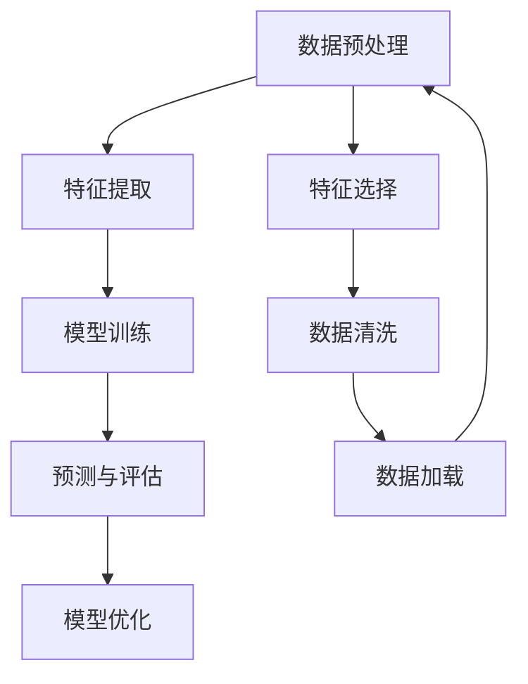

                 

### 文章标题

# 产品经理如何使用AI重构工作流

### 关键词

- 产品管理
- 人工智能
- 工作流优化
- 数据分析
- 团队协作

### 摘要

本文旨在探讨产品经理如何利用人工智能（AI）技术重构工作流，提高工作效率和产品品质。通过深入分析AI在产品管理中的角色与作用，以及其在需求分析、设计、开发、测试和团队协作等环节中的应用，本文为产品经理提供了一套系统性的AI实践指南。同时，通过具体案例的解析，本文展示了AI重构工作流的实际效果，并对未来发展趋势进行了展望。读者可以从中获取关于AI在产品管理中的核心概念、关键技术、实践经验和未来方向的有价值信息。

### 引言

#### AI的发展与应用

人工智能（AI）作为当前科技领域的热点话题，已经渗透到我们生活的方方面面。从智能家居、自动驾驶到医疗诊断、金融服务，AI技术正在不断改变着传统行业的运作模式。随着计算能力的提升和大数据的普及，AI的应用范围不断扩大，成为推动社会进步和产业升级的重要力量。

在商业领域，AI技术的应用尤其显著。通过机器学习、深度学习等技术，企业能够实现数据驱动的决策，提高运营效率，降低成本，提升客户满意度。例如，电商平台利用AI进行个性化推荐，金融行业利用AI进行风险控制，医疗行业利用AI进行疾病诊断等。AI技术的广泛应用，不仅提升了企业的竞争力，也为产品经理带来了新的挑战和机遇。

#### 产品经理的职业角色与责任

产品经理（PM）是企业中不可或缺的角色，他们负责产品的整体规划、设计、开发和上市。产品经理需要具备敏锐的市场洞察力、优秀的沟通能力和扎实的业务背景。他们的主要职责包括：

1. **需求分析**：深入了解用户需求，制定产品功能需求和技术需求。
2. **产品设计**：与设计团队合作，制定产品原型和用户界面。
3. **项目管理**：协调开发团队，确保项目按时完成。
4. **市场推广**：制定市场策略，推动产品上市和推广。
5. **用户反馈**：收集用户反馈，优化产品功能和用户体验。

在传统的工作模式中，产品经理主要依靠个人经验和团队协作来完成上述任务。然而，随着市场环境的复杂化和竞争的加剧，产品经理需要更快地响应市场变化，更准确地把握用户需求，从而提高产品的竞争力。AI技术的引入，为产品经理提供了强大的工具，帮助他们更高效地完成各项任务。

#### AI在产品管理中的潜在影响

AI技术的引入，对产品经理的工作模式和职责产生了深远的影响。首先，AI能够大幅提升产品经理的洞察力。通过大数据分析和机器学习算法，产品经理可以更准确地了解用户行为和市场趋势，从而做出更科学的决策。

其次，AI可以帮助产品经理优化用户体验。通过自然语言处理、计算机视觉等技术，产品经理可以设计出更加智能化和个性化的产品功能，提升用户的满意度和忠诚度。

此外，AI还能够提高产品经理的工作效率。通过自动化流程和智能工具，产品经理可以减少重复性工作，将更多精力投入到核心任务中。

总之，AI技术的引入，不仅为产品经理提供了新的工具和方法，也改变了他们的工作模式，提高了工作效率和产品品质。对于产品经理来说，掌握AI技术已成为提升自身竞争力的重要途径。

### 第一部分：AI在产品管理中的角色与作用

#### 第1章：AI在产品管理中的基本概念与重要性

##### 1.1 引言

随着科技的快速发展，人工智能（AI）已经成为商业领域的重要驱动力。AI技术的广泛应用，不仅改变了传统行业的运作模式，也为产品经理的工作带来了新的机遇和挑战。在产品管理中，AI技术的引入能够显著提升产品经理的洞察力、优化用户体验、提高工作效率，从而增强产品的市场竞争力。

首先，我们需要了解AI的基本概念。人工智能是指通过计算机模拟人类智能行为的技术。它包括多个分支，如机器学习、深度学习、自然语言处理、计算机视觉等。这些技术通过算法和大数据的支持，使计算机能够自主地学习和进化，实现人机交互和自动化决策。

在产品管理中，AI技术的应用主要体现在以下几个方面：

1. **需求分析**：通过大数据分析和机器学习算法，产品经理可以更准确地了解用户行为和市场趋势，从而制定出更加科学的需求分析报告。
2. **用户体验优化**：利用自然语言处理和计算机视觉技术，产品经理可以设计出更加智能化和个性化的产品功能，提升用户的满意度和忠诚度。
3. **工作效率提升**：通过自动化流程和智能工具，产品经理可以减少重复性工作，将更多精力投入到核心任务中。

##### 1.2 AI的核心概念

AI的核心概念主要包括以下几个方面：

1. **机器学习（Machine Learning）**：机器学习是指通过训练模型，使计算机能够从数据中自动学习和改进。常见的机器学习算法有线性回归、决策树、支持向量机等。
   
2. **深度学习（Deep Learning）**：深度学习是机器学习的一种特殊形式，它通过多层神经网络模拟人脑的工作方式，实现更复杂的特征提取和模式识别。深度学习在图像识别、语音识别、自然语言处理等领域有着广泛的应用。

3. **自然语言处理（Natural Language Processing，NLP）**：自然语言处理是AI的一个分支，它致力于使计算机能够理解和处理人类语言。NLP技术包括文本分类、情感分析、机器翻译等。

4. **计算机视觉（Computer Vision）**：计算机视觉是AI的另一个重要分支，它使计算机能够理解视觉信息，如图像和视频。计算机视觉技术在图像识别、目标检测、自动驾驶等领域有着重要的应用。

##### 1.3 AI在产品管理中的角色

在产品管理中，AI技术扮演着多重角色，以下是其中几个关键方面的应用：

1. **提升产品洞察力**：通过大数据分析和机器学习算法，产品经理可以更准确地了解用户需求和市场趋势。例如，通过分析用户行为数据，产品经理可以识别出潜在的用户需求，从而优化产品功能。

2. **优化用户体验**：AI技术可以帮助产品经理设计出更加智能化和个性化的产品功能。例如，通过自然语言处理技术，产品经理可以实现智能客服和智能推荐系统，提升用户的满意度和忠诚度。

3. **自动化流程**：AI技术可以自动化许多重复性的工作，提高产品经理的工作效率。例如，通过自动化测试和代码审查，产品经理可以节省大量时间，将更多精力投入到创新和优化工作中。

4. **预测与分析**：AI技术可以帮助产品经理进行市场预测和风险评估。例如，通过分析历史数据和趋势，产品经理可以预测未来市场的需求变化，从而制定出更有效的市场策略。

##### 1.4 AI技术的应用场景

AI技术在产品管理中有多种应用场景，以下是一些典型的例子：

1. **个性化推荐系统**：通过分析用户的历史行为和偏好，AI技术可以为用户提供个性化的产品推荐，提升用户满意度和转化率。

2. **智能客服与聊天机器人**：利用自然语言处理技术，AI技术可以实现智能客服和聊天机器人，提供24/7的在线服务，提高客户体验和满意度。

3. **数据分析与市场调研**：通过大数据分析和机器学习算法，AI技术可以帮助产品经理进行市场调研和数据分析，识别出市场趋势和用户需求。

4. **供应链管理与物流优化**：AI技术可以帮助产品经理优化供应链管理和物流流程，降低成本，提高运营效率。

##### 1.5 AI对产品经理的挑战与机遇

尽管AI技术为产品经理带来了许多机遇，但同时也带来了一系列挑战：

1. **技术门槛与学习曲线**：AI技术复杂且不断发展，产品经理需要不断学习和更新知识，以掌握最新的技术和方法。

2. **数据安全与隐私保护**：AI技术的应用依赖于大量用户数据，产品经理需要确保数据的安全和隐私，遵守相关法律法规。

3. **与开发团队的有效沟通与合作**：AI技术的实现需要产品经理与开发团队紧密合作，产品经理需要具备良好的沟通和协调能力。

4. **创新思维与业务洞察力**：AI技术为产品经理提供了强大的工具，但产品经理仍需要具备创新思维和业务洞察力，以制定出科学的产品策略。

总之，AI技术在产品管理中的应用，既为产品经理带来了巨大的机遇，也带来了一系列挑战。只有不断学习和适应，产品经理才能在AI时代脱颖而出，实现产品的成功。

#### 第2章：AI在产品需求分析与设计中的应用

##### 2.1 需求分析与用户研究

需求分析是产品管理中的核心环节，它决定了产品的功能和性能。传统的需求分析主要依赖于产品经理的经验和用户调研。然而，随着市场环境的变化和用户需求的多样化，单纯依靠人工调研已经难以满足产品的需求。AI技术的引入，为需求分析带来了新的方法和工具。

1. **数据驱动的需求分析方法**：数据驱动的需求分析方法是通过收集和分析用户数据，来识别用户需求和痛点。这种方法的优点在于能够提供客观、准确的用户需求，从而减少主观判断和误判的可能性。

2. **用户画像与细分市场**：用户画像是一种通过数据分析来描述用户特征的方法。通过对用户行为、偏好、兴趣等数据的分析，产品经理可以创建详细的用户画像。这些用户画像可以帮助产品经理更好地理解用户需求，从而设计出更符合用户期望的产品。

3. **用户反馈与调研技巧**：用户反馈是需求分析的重要来源。通过问卷调查、用户访谈、用户测试等方式，产品经理可以收集用户的直接反馈。同时，产品经理需要掌握有效的调研技巧，如如何设计问题、如何引导用户表达真实需求等。

##### 2.2 人工智能辅助需求分析

AI技术可以为需求分析提供强大的支持，以下是几个关键方面的应用：

1. **数据挖掘与分析**：数据挖掘是一种通过算法从大量数据中发现隐藏的模式和规律的方法。在需求分析中，产品经理可以使用数据挖掘技术来分析用户行为数据，识别出用户的共同需求和潜在问题。

2. **自然语言处理与语义分析**：自然语言处理（NLP）是一种使计算机能够理解和处理人类语言的技术。在需求分析中，产品经理可以使用NLP技术来分析用户反馈和评论，提取出用户的需求和痛点。

3. **机器学习模型在需求预测中的应用**：机器学习模型可以基于历史数据预测未来的用户需求。例如，产品经理可以使用回归模型预测未来的用户增长率，或使用分类模型预测用户的购买意图。

##### 2.3 智能产品设计

智能产品设计是指通过引入AI技术，使产品能够智能化地响应用户需求。以下是智能产品设计中的几个关键方面：

1. **交互设计与用户体验**：智能产品设计需要注重交互设计和用户体验。通过自然语言处理和计算机视觉技术，产品可以与用户进行自然、流畅的交互，提供个性化的服务。

2. **可视化数据展示与决策支持**：AI技术可以帮助产品经理设计出更加直观和易于理解的数据可视化工具。这些工具可以展示用户行为、市场趋势等关键数据，为产品经理提供决策支持。

3. **智能推荐与个性化体验设计**：通过机器学习算法，产品可以实时分析用户数据，为用户推荐符合其需求和兴趣的产品和服务。这种个性化推荐不仅提升了用户的满意度，也提高了产品的转化率。

##### 2.4 原型设计与迭代

原型设计是产品开发的重要环节，它帮助产品经理验证产品概念和设计。AI技术可以在原型设计和迭代过程中发挥重要作用：

1. **快速原型开发方法**：通过AI技术，产品经理可以使用低代码平台或生成式设计工具快速构建原型。这些工具可以帮助产品经理缩短开发周期，提高开发效率。

2. **用户测试与反馈收集**：AI技术可以自动化用户测试和反馈收集过程。例如，通过使用聊天机器人或虚拟助手，产品经理可以实时收集用户的反馈，快速进行迭代优化。

3. **基于AI的迭代优化策略**：AI技术可以帮助产品经理分析用户反馈和市场数据，制定出科学的迭代优化策略。通过持续迭代和优化，产品可以不断改进，满足用户需求。

通过AI技术在需求分析、智能产品设计、原型设计与迭代中的应用，产品经理可以更高效地完成产品开发过程，提高产品的市场竞争力。AI技术的引入，不仅提升了产品经理的工作效率，也改变了产品开发的方式，为产品创新提供了新的动力。

#### 第3章：AI在产品开发与测试中的实践

##### 3.1 自动化测试与质量保障

在产品开发过程中，自动化测试是确保产品质量的关键环节。自动化测试可以通过编写脚本自动执行测试用例，从而减少手动测试的工作量，提高测试效率和准确性。以下是AI在自动化测试中的应用和优势：

1. **自动化测试框架与应用**：自动化测试框架如Selenium、JUnit、TestNG等，可以帮助产品经理和测试团队快速编写和执行测试脚本。这些框架支持多种编程语言和操作系统，可以自动化测试不同类型的应用程序。

2. **智能测试用例生成与优化**：AI技术可以自动生成测试用例，并根据测试结果优化测试流程。通过自然语言处理和机器学习算法，AI可以分析历史测试数据，识别出潜在的缺陷和测试漏洞，从而生成更全面的测试用例。

3. **性能测试与负载测试**：AI技术在性能测试和负载测试中也发挥着重要作用。通过模拟大量用户访问，AI可以实时分析系统的性能指标，如响应时间、吞吐量等，帮助产品经理识别系统瓶颈和性能问题。

##### 3.2 AI辅助代码审查与调试

代码审查是确保代码质量和可维护性的重要环节。AI技术可以辅助代码审查和调试，提高代码质量：

1. **代码静态分析与缺陷检测**：AI技术可以通过静态代码分析识别代码中的潜在缺陷和潜在问题。例如，AI算法可以检测出代码中的语法错误、内存泄漏、逻辑错误等。

2. **智能代码补全与优化建议**：AI技术可以帮助开发人员自动补全代码，并提供优化建议。例如，AI可以通过分析代码模式和最佳实践，为开发人员提供改进代码的方案。

3. **调试工具与自动化调试流程**：AI技术可以辅助调试过程，通过分析错误日志和代码行为，快速定位和解决问题。自动化调试流程可以减少人工调试的时间，提高调试效率。

##### 3.3 AI驱动的持续集成与持续部署

持续集成（CI）和持续部署（CD）是现代软件开发的重要实践，它们可以提高软件交付的效率和质量。AI技术在CI/CD中的应用如下：

1. **持续集成与持续部署（CI/CD）概念**：CI/CD是一种自动化软件交付的流程，通过持续集成和持续部署，开发团队可以快速交付高质量的软件。CI/CD的核心思想是自动化和反馈循环，确保代码质量，缩短交付周期。

2. **AI在CI/CD中的应用**：AI技术可以自动化CI/CD流程中的多个环节。例如，AI可以通过分析代码库中的历史数据和趋势，预测代码合并时可能出现的冲突和错误，从而提前进行预防。AI还可以通过分析测试结果和用户反馈，自动调整部署策略，优化交付过程。

3. **自动化部署与故障排查**：AI技术可以帮助产品经理和开发团队实现自动化部署，减少人工干预。同时，AI可以通过分析日志数据和系统性能指标，快速识别和排查故障，提高系统的可靠性和稳定性。

通过AI技术在产品开发与测试中的应用，产品经理和开发团队可以显著提高开发效率和质量。AI技术的引入，不仅自动化了重复性工作，还提供了智能化的工具和方法，帮助团队更好地应对复杂的产品开发挑战。

#### 第4章：AI在产品管理与团队协作中的应用

##### 4.1 AI驱动的团队协作

在现代产品管理中，团队协作至关重要。AI技术可以为团队协作提供智能化的支持，提高工作效率和协作质量：

1. **敏捷开发与Scrum框架**：敏捷开发是一种以用户需求为导向的开发方法，它强调快速迭代和持续交付。AI技术可以帮助团队更好地实施敏捷开发，通过自动化任务分配、进度跟踪和风险评估，确保项目按时完成。

2. **AI辅助项目管理与进度跟踪**：AI技术可以自动化项目管理任务，如任务分配、进度跟踪和风险监控。通过使用AI工具，产品经理可以实时了解项目状态，及时调整计划，避免项目延误。

3. **智能会议记录与决策支持**：AI技术可以帮助记录会议内容和关键决策，并提供智能化的总结和推荐。例如，AI可以通过分析会议记录和与会者的发言，生成会议纪要，并提供建议和行动计划。

##### 4.2 数据驱动的产品管理

数据驱动的产品管理是一种以数据为基础进行决策的方法。AI技术可以为数据驱动的产品管理提供强大的支持：

1. **数据驱动的产品决策**：通过大数据分析和机器学习算法，产品经理可以获取关于用户行为、市场趋势和竞争情况的数据，从而做出更科学的决策。例如，通过分析用户反馈和销售数据，产品经理可以确定产品的改进方向。

2. **关键指标与数据监控**：AI技术可以帮助产品经理定义和监控关键指标（KPI），如用户留存率、转化率、客户满意度等。通过实时监控这些指标，产品经理可以快速识别问题，并采取相应的措施。

3. **基于AI的决策支持系统**：AI技术可以构建决策支持系统，为产品经理提供智能化的决策建议。例如，通过分析历史数据和当前趋势，AI可以预测未来的市场变化，并提供相应的策略建议。

##### 4.3 AI在团队沟通与协作中的挑战与解决方案

虽然AI技术为团队协作提供了许多优势，但同时也带来了一系列挑战：

1. **跨部门协作与信息共享**：在大型企业中，不同部门之间的协作和信息共享常常面临挑战。AI技术可以通过自动化信息共享和协调工具，如聊天机器人和协作平台，促进跨部门沟通和协作。

2. **数据隐私与安全保护**：AI技术依赖于大量用户数据，因此数据隐私和安全保护成为重要问题。产品经理需要确保数据的安全和隐私，采取加密、访问控制和数据匿名化等措施，遵守相关法律法规。

3. **文化差异与沟通障碍**：在国际化团队中，文化差异和沟通障碍可能导致误解和协作问题。AI技术可以通过提供多语言支持和智能沟通工具，促进团队成员之间的理解和协作。

通过AI技术在团队协作中的应用，产品经理可以更好地协调团队工作，提高协作效率，实现数据驱动的产品管理。同时，产品经理需要关注AI技术带来的挑战，采取相应的措施确保团队协作的顺利进行。

#### 第5章：AI重构产品工作流的实战案例

##### 5.1 案例一：电商平台的个性化推荐系统

1. **案例背景与目标**：

电商平台在激烈的市场竞争中，需要提高用户满意度和转化率。通过引入AI技术，电商平台希望构建一个个性化的推荐系统，根据用户的历史行为和偏好，为用户提供个性化的产品推荐。

2. **数据收集与处理**：

电商平台收集了用户的行为数据，包括浏览记录、购买记录、点击率、收藏夹等。数据经过清洗和预处理，去除无效数据和异常值，然后进行特征提取，如用户ID、商品ID、时间戳等。

3. **模型设计与训练**：

电商平台采用协同过滤算法，构建用户和商品之间的相似度模型。通过训练大量用户行为数据，模型可以预测用户对未知商品的偏好。模型包括用户基于内容的推荐和基于协同过滤的推荐，以提供多样化的推荐结果。

4. **系统部署与优化**：

个性化推荐系统部署到电商平台的生产环境，通过实时计算用户行为数据，生成个性化的推荐结果。系统根据用户反馈和推荐效果，不断优化推荐算法，提高推荐准确率和用户满意度。

##### 5.2 案例二：金融行业的智能风控系统

1. **案例背景与目标**：

金融行业面临大量的风险，如欺诈、信用风险等。通过引入AI技术，金融机构希望构建一个智能风控系统，实时监测和识别潜在风险，提高风险管理能力。

2. **数据收集与处理**：

金融机构收集了客户交易数据、行为数据、信用记录等，进行清洗和预处理，提取关键特征，如交易金额、交易频率、地理位置等。

3. **模型设计与训练**：

金融机构采用机器学习算法，如逻辑回归、决策树、随机森林等，构建风控模型。模型通过训练历史数据，学习欺诈行为和正常交易的特征差异，实现对交易风险的实时监测和预警。

4. **系统部署与优化**：

智能风控系统部署到金融机构的系统中，实时处理交易数据，识别潜在风险。系统根据实际业务需求和反馈，不断优化模型和规则，提高风险识别的准确性和效率。

##### 5.3 案例三：医疗行业的智能诊断系统

1. **案例背景与目标**：

医疗行业面临诊断准确率低、医疗资源分配不均等问题。通过引入AI技术，医疗机构希望构建一个智能诊断系统，辅助医生进行疾病诊断，提高诊断准确率和效率。

2. **数据收集与处理**：

医疗机构收集了大量医学影像数据、病历数据、实验室检测结果等，进行清洗和预处理，提取关键特征，如影像特征、疾病标签等。

3. **模型设计与训练**：

医疗机构采用深度学习算法，如卷积神经网络（CNN）、循环神经网络（RNN）等，构建智能诊断模型。模型通过训练大量医学数据，学习疾病的特征和模式，实现对疾病的自动诊断。

4. **系统部署与优化**：

智能诊断系统部署到医疗机构的系统中，医生可以通过系统进行疾病诊断，系统提供辅助诊断建议。系统根据医生反馈和实际诊断结果，不断优化模型，提高诊断准确率和可靠性。

通过这些实战案例，我们可以看到AI技术在不同行业的广泛应用，以及其对产品工作流的重大重构。AI技术不仅提高了产品经理的效率，也提升了产品的质量和用户体验。这些案例为产品经理提供了宝贵的实践经验，帮助他们更好地理解和应用AI技术，实现产品的成功。

#### 第6章：AI重构产品工作流的策略与方法

##### 6.1 制定AI战略规划

制定AI战略规划是产品经理成功应用AI技术的关键步骤。以下是制定AI战略规划的基本流程和注意事项：

1. **需求调研与分析**：首先，产品经理需要对业务需求和市场环境进行深入调研，明确AI技术能够解决的具体问题和带来的潜在价值。通过分析用户需求、市场趋势和竞争状况，确定AI技术在产品管理中的具体应用方向。

2. **技术评估与选型**：在明确需求后，产品经理需要对现有的AI技术进行评估和选型。考虑技术的成熟度、适用性、成本和风险等因素，选择最适合业务需求的AI技术。同时，需要关注技术的未来发展趋势，确保所选技术具有长期发展潜力。

3. **资源配置与团队建设**：AI技术的应用需要相应的资源支持和团队配合。产品经理需要制定详细的资源规划，包括预算、人力和技术支持等。同时，需要组建一支具备AI技术能力的团队，确保项目能够顺利推进。

4. **实施计划与风险管理**：制定详细的AI实施计划，明确项目目标、时间表、关键里程碑和责任人。在实施过程中，产品经理需要密切关注项目进度和风险，及时调整计划和策略，确保项目按计划完成。

##### 6.2 AI技术的选型与实现

在制定AI战略规划后，产品经理需要根据具体需求选择合适的AI技术，并进行有效实现。以下是AI技术选型和实现的关键步骤：

1. **技术特点与应用场景**：了解不同AI技术的特点和应用场景，如机器学习、深度学习、自然语言处理、计算机视觉等。根据业务需求，选择最合适的AI技术。

2. **技术选型的决策因素**：在选型过程中，考虑以下决策因素：

   - 技术成熟度：选择成熟度较高的技术，降低技术实现风险。
   - 成本效益：考虑技术实现的成本和预期收益，确保成本效益最大化。
   - 数据需求和质量：根据数据需求和数据质量选择合适的算法和技术。
   - 可扩展性和灵活性：选择能够支持业务扩展和灵活调整的技术。

3. **AI技术在产品开发中的实现方法**：在确定技术选型后，产品经理需要制定详细的实现方案，包括数据准备、模型训练、模型部署和运维等。以下是实现方法的关键步骤：

   - 数据准备：收集、清洗和预处理数据，确保数据质量。
   - 模型训练：使用训练数据训练模型，并进行调优和验证。
   - 模型部署：将训练好的模型部署到生产环境中，提供API接口或集成到现有系统中。
   - 模型运维：监控模型性能，定期更新和优化模型，确保模型稳定运行。

##### 6.3 数据治理与数据安全

数据治理和数据安全是AI技术成功应用的重要保障。以下是数据治理和数据安全的关键原则和策略：

1. **数据治理的原则**：数据治理包括数据管理、数据质量、数据安全和数据合规等方面。以下是数据治理的基本原则：

   - **数据标准化**：确保数据格式和结构的一致性，提高数据可操作性。
   - **数据质量控制**：通过数据清洗、去重和标准化等方法，提高数据质量。
   - **数据安全性**：采取数据加密、访问控制和备份等措施，确保数据安全。
   - **数据合规性**：遵守相关法律法规和行业标准，确保数据合规性。

2. **数据隐私保护的方法与策略**：在AI技术应用中，保护用户数据隐私至关重要。以下是数据隐私保护的方法和策略：

   - **数据匿名化**：对敏感数据进行匿名化处理，消除个人身份信息。
   - **数据加密**：采用加密技术保护数据传输和存储过程中的安全性。
   - **权限控制**：设置严格的访问权限，确保只有授权人员可以访问敏感数据。
   - **数据合规性审计**：定期进行数据合规性审计，确保数据治理策略的有效性。

3. **数据合规与法律法规**：在AI技术应用过程中，产品经理需要关注相关法律法规，如《通用数据保护条例》（GDPR）、《加州消费者隐私法》（CCPA）等。以下是数据合规的关键点：

   - **合规性评估**：在引入AI技术前，进行合规性评估，确保符合相关法律法规。
   - **合规性培训**：对团队成员进行合规性培训，提高合规意识和能力。
   - **合规性监控**：建立合规性监控机制，定期检查和评估数据治理和合规性情况。
   - **违规处理**：制定违规处理流程和应急预案，确保在出现违规情况时能够迅速响应和处理。

通过制定AI战略规划、选择合适的AI技术、确保数据治理和数据安全，产品经理可以有效地重构产品工作流，提高产品管理效率和质量。同时，产品经理需要关注AI技术带来的挑战，采取相应的措施确保项目的成功实施。

#### 第7章：AI重构产品工作流的未来趋势与展望

##### 7.1 AI技术在产品管理中的应用前景

随着AI技术的不断发展，其在产品管理中的应用前景愈发广阔。以下是AI技术在产品管理中的几个重要发展趋势：

1. **智能化数据分析**：未来，AI技术将进一步提升数据分析的智能化水平。通过深度学习和自然语言处理技术，产品经理可以更准确地提取用户需求和市场趋势，从而做出更科学的决策。

2. **自动化流程管理**：自动化流程管理是AI技术的重要应用方向。通过机器人流程自动化（RPA）和智能调度系统，产品经理可以自动化许多重复性工作，提高工作效率。

3. **个性化用户体验**：随着AI技术的发展，个性化用户体验将变得更加成熟和普及。通过个性化推荐系统和智能客服，产品经理可以为用户提供更加定制化的服务和体验，提高用户满意度和忠诚度。

4. **智能决策支持**：AI技术可以为产品经理提供智能化的决策支持。通过机器学习和数据挖掘，产品经理可以实时分析市场数据，预测未来趋势，制定更有效的产品策略。

##### 7.2 AI赋能产品经理的能力提升

AI技术的应用不仅改变了产品经理的工作模式，也对产品经理的能力提出了新的要求。以下是AI赋能产品经理的几个关键方面：

1. **数据分析能力**：随着数据驱动的决策越来越重要，产品经理需要具备强大的数据分析能力。通过掌握AI技术，产品经理可以更有效地分析和利用数据，为决策提供科学依据。

2. **技术创新能力**：AI技术的不断进步要求产品经理具备技术创新能力。产品经理需要不断学习和掌握最新的AI技术，并将其应用于产品开发和优化中。

3. **沟通协调能力**：AI技术的应用需要产品经理与多个团队（如开发团队、数据团队、市场团队等）紧密合作。因此，产品经理需要具备良好的沟通协调能力，以确保项目的顺利进行。

4. **用户体验设计能力**：个性化用户体验是未来产品的重要趋势。产品经理需要具备优秀的用户体验设计能力，能够根据用户需求和行为数据，设计出满足用户期望的产品。

##### 7.3 AI重构产品工作流的影响与思考

AI技术的应用对产品经理的工作模式和职责产生了深远的影响。以下是几个值得思考的关键问题：

1. **角色转变**：随着AI技术的应用，产品经理的角色将逐渐从执行者转变为决策者和协调者。产品经理需要更加关注战略规划和用户体验设计，而将更多的执行任务交给AI和自动化工具。

2. **技能要求**：AI技术的应用对产品经理的技能要求越来越高。产品经理需要具备数据分析、机器学习、用户体验设计等多方面的能力，以适应新的工作模式。

3. **伦理与社会责任**：AI技术在产品管理中的应用也带来了一系列伦理和社会责任问题。产品经理需要关注数据隐私、公平性和透明性等问题，确保AI技术的应用符合伦理和社会标准。

总之，AI技术的应用将深刻改变产品经理的工作模式，提高产品管理的效率和质量。同时，产品经理需要不断提升自身能力，应对AI技术带来的挑战和机遇。

### 附录

#### 附录A：AI工具与资源指南

为了更好地理解和应用AI技术，以下是一些常用的AI工具和资源：

1. **开发框架与库**：

   - TensorFlow
   - PyTorch
   - Keras
   - Scikit-learn

2. **开源项目与社区**：

   - GitHub
   - AI Stack Overflow
   - AI Wiki

3. **书籍与论文**：

   - 《深度学习》（Deep Learning）
   - 《Python机器学习》（Python Machine Learning）
   - 《AI：一种现代方法》（Artificial Intelligence: A Modern Approach）

#### 附录B：案例研究与实战经验总结

以下是一些成功和失败的案例研究，以及从中总结出的经验和教训：

1. **成功案例**：

   - 案例一：电商平台的个性化推荐系统，通过大数据分析和协同过滤算法，提高了用户满意度和转化率。
   - 案例二：金融行业的智能风控系统，通过机器学习算法和实时监测，有效降低了欺诈风险。

2. **失败案例**：

   - 案例一：某公司因数据质量和算法问题，导致智能诊断系统误诊率高，影响用户体验和信任。
   - 案例二：某公司因忽视数据隐私保护，引发用户数据泄露，导致声誉受损。

3. **经验教训**：

   - 数据质量和算法选择至关重要，必须确保数据的准确性和算法的有效性。
   - 在引入AI技术时，要充分考虑数据隐私和伦理问题，遵守相关法律法规。
   - AI技术的应用需要与业务需求紧密结合，避免盲目跟风。
   - 持续迭代和优化是AI技术成功应用的关键，要定期评估和改进系统。

通过这些案例和经验总结，产品经理可以更好地应用AI技术，实现产品工作流的优化和提升。

### 伪代码示例

以下是一个简单的用户画像构建的伪代码示例：

```python
# 伪代码：用户画像构建

def build_user_profile(data):
    # 数据预处理
    preprocessed_data = preprocess(data)

    # 特征提取
    features = extract_features(preprocessed_data)

    # 模型训练
    model = train_model(features)

    # 预测与评估
    predictions = model.predict(new_data)
    evaluate(predictions)

    return model

def preprocess_data(data):
    # 数据清洗和预处理代码
    pass

def extract_features(data):
    # 特征提取代码
    pass

def train_model(features):
    # 模型训练代码
    pass

def evaluate(predictions):
    # 预测评估代码
    pass
```

通过以上伪代码，我们可以看到用户画像构建的基本流程，包括数据预处理、特征提取、模型训练和预测评估等步骤。实际应用中，这些步骤需要根据具体的数据和业务需求进行详细的实现和优化。

### Mermaid 流程图

以下是一个简单的Mermaid流程图示例，用于描述用户画像构建的基本流程：



通过以上Mermaid流程图，我们可以直观地了解用户画像构建的各个步骤及其相互关系。

### 数学公式

以下是一个简单的数学公式示例，用于描述成本函数和梯度下降更新：

$$
\begin{aligned}
\text{成本函数} &= \frac{1}{n} \sum_{i=1}^{n} (y_i - \hat{y}_i)^2 \\
\text{梯度下降更新} &= \theta_{\text{new}} = \theta_{\text{old}} - \alpha \cdot \nabla_\theta J(\theta)
\end{aligned}
$$`

通过以上数学公式，我们可以了解成本函数和梯度下降更新的基本原理。这些公式是机器学习和深度学习中的重要概念，用于模型训练和优化。

### 项目实战与代码解读

#### 案例一：电商平台的个性化推荐系统

1. **开发环境搭建**：

   在开始构建个性化推荐系统之前，我们需要搭建合适的开发环境。这里我们使用Python和TensorFlow作为主要的开发工具。以下是搭建开发环境的步骤：

   - 安装Python 3.8或更高版本。
   - 安装TensorFlow库，使用命令 `pip install tensorflow`。
   - 安装其他必要的库，如NumPy、Pandas等。

2. **数据集处理**：

   个性化推荐系统的核心在于对用户行为数据进行有效的处理和分析。以下是从电商平台上获取和预处理数据集的步骤：

   - 数据收集：从电商平台上获取用户行为数据，包括浏览记录、购买记录、点击率等。
   - 数据清洗：去除无效数据和异常值，确保数据的质量和一致性。
   - 数据转换：将数据转换为适合模型训练的格式，如CSV文件或NumPy数组。

3. **模型设计与训练**：

   采用协同过滤算法构建个性化推荐系统。以下是模型设计与训练的步骤：

   - 模型定义：定义用户和商品之间的相似度计算方法，如用户基于内容的推荐和基于协同过滤的推荐。
   - 模型训练：使用训练数据对模型进行训练，优化模型参数。
   - 模型评估：使用验证集评估模型性能，调整模型参数，提高准确率。

4. **系统部署与优化**：

   将训练好的模型部署到生产环境，并进行实时推荐。以下是系统部署与优化的步骤：

   - 部署模型：将模型部署到服务器，提供API接口，供前端系统调用。
   - 性能优化：根据用户反馈和推荐效果，优化模型和推荐算法，提高推荐准确率和用户体验。

#### 代码实现与解读

以下是构建个性化推荐系统的主要代码实现和解读：

```python
import pandas as pd
import numpy as np
import tensorflow as tf

# 导入必要的库
from sklearn.model_selection import train_test_split
from sklearn.metrics.pairwise import cosine_similarity
from tensorflow.keras.models import Sequential
from tensorflow.keras.layers import Dense

# 数据预处理
def preprocess_data(data):
    # 数据清洗和预处理代码
    pass

# 特征提取
def extract_features(data):
    # 特征提取代码
    pass

# 模型定义
def build_model(input_shape):
    model = Sequential([
        Dense(128, activation='relu', input_shape=input_shape),
        Dense(64, activation='relu'),
        Dense(1)
    ])
    return model

# 模型训练
def train_model(features, labels):
    model = build_model(features.shape[1:])
    model.compile(optimizer='adam', loss='mean_squared_error')
    model.fit(features, labels, epochs=10)
    return model

# 系统部署与优化
def deploy_and_optimize(model):
    # 系统部署与优化代码
    pass

# 主函数
if __name__ == "__main__":
    # 加载数据
    data = pd.read_csv("ecommerce_data.csv")
    
    # 数据预处理
    preprocessed_data = preprocess_data(data)
    
    # 提取特征
    features, labels = extract_features(preprocessed_data)
    
    # 训练模型
    model = train_model(features, labels)
    
    # 部署与优化
    deploy_and_optimize(model)
```

- **数据预处理**：此部分代码用于清洗和转换原始数据，使其适合模型训练。具体实现取决于数据的具体格式和内容。

- **特征提取**：此部分代码用于提取有用的特征，用于训练模型。特征提取方法可以根据业务需求和数据特点进行调整。

- **模型定义**：此部分代码定义了深度学习模型的结构。我们使用了一个简单的全连接神经网络，包括三个层，输出层只有一个神经元。

- **模型训练**：此部分代码使用训练数据对模型进行训练，优化模型参数。我们使用的是均方误差损失函数和Adam优化器。

- **系统部署与优化**：此部分代码用于将训练好的模型部署到生产环境，并进行实时推荐。具体实现取决于系统的架构和部署环境。

通过以上代码实现，我们可以构建一个简单的个性化推荐系统，实现用户行为数据的分析和推荐功能。实际应用中，还需要根据具体需求和数据情况进行详细的代码优化和调整。

### 结论

本文详细探讨了产品经理如何利用人工智能（AI）技术重构工作流，提高工作效率和产品品质。通过分析AI在产品管理中的核心概念、技术应用和实战案例，我们发现AI技术不仅能够提升产品洞察力、优化用户体验、自动化流程，还能够帮助产品经理进行数据驱动的决策。AI技术的引入，不仅改变了产品经理的工作模式，也提升了他们的职业竞争力。

展望未来，AI技术在产品管理中的应用前景广阔。随着计算能力的提升和大数据的普及，AI技术将继续深入影响产品经理的工作，从需求分析到产品设计，从开发测试到团队协作，各个环节都将受益于AI技术的应用。同时，AI技术也将面临数据安全、隐私保护、伦理责任等挑战，产品经理需要持续学习和适应，确保AI技术的有效应用。

对于产品经理来说，掌握AI技术已成为提升自身竞争力的关键。通过本文的介绍和案例分享，我们希望读者能够深入了解AI技术在产品管理中的应用，掌握关键技能，为产品的成功和创新贡献力量。在未来的产品管理工作中，让我们共同迎接AI时代的挑战与机遇，实现产品的卓越和突破。

