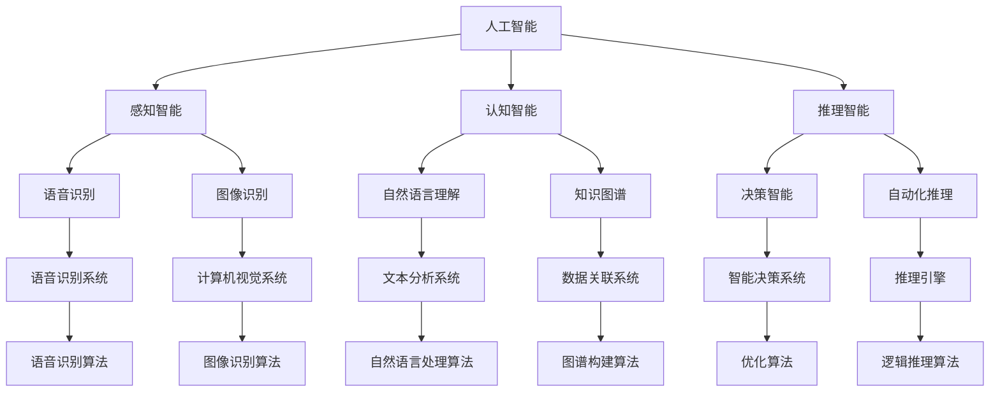

                 

### 文章标题：人工智能与智能产业化

在当今科技飞速发展的时代，人工智能（AI）已经成为全球范围内的热点话题。它不仅深刻改变了人类的生活方式，也推动了各行各业的变革。本文旨在探讨人工智能与智能产业化的关系，分析其基础理论、应用案例、技术实现以及未来发展趋势，为读者呈现一幅全面的人工智能产业蓝图。

> **关键词：** 人工智能、智能产业化、应用案例、技术实现、发展趋势

文章的核心内容将围绕以下五个部分展开：

1. **人工智能基础与理论**：介绍人工智能的定义、分类、核心技术以及与智能产业化的关系。
2. **人工智能应用案例分析**：通过制造业和服务业的实例，展示人工智能在各个领域的应用。
3. **人工智能产业化技术实现**：探讨人工智能算法实现基础，包括机器学习、深度学习、自然语言处理和计算机视觉。
4. **人工智能产业化应用实践**：通过项目实战案例，展示人工智能在现实中的应用。
5. **人工智能产业发展趋势与挑战**：分析人工智能产业的发展趋势、面临的挑战及应对策略。

本文旨在通过逻辑清晰、结构紧凑、简单易懂的叙述方式，让读者深入了解人工智能与智能产业化的核心概念和实际应用，从而更好地把握这一科技革命带来的机遇。

### 摘要

人工智能（AI）作为当今科技领域的明星，正推动着智能产业化的快速发展。本文首先概述了人工智能的定义、发展历程以及核心技术的分类，深入探讨了感知智能、认知智能和推理智能的差异和联系。接着，通过制造业和服务业的应用案例分析，展示了人工智能在实际产业中的落地效果。随后，本文详细介绍了人工智能算法实现的基础，包括机器学习、深度学习、自然语言处理和计算机视觉的技术原理。通过具体的项目实战案例，本文展示了人工智能在实际应用中的开发流程和效果评估。最后，本文分析了人工智能产业的发展趋势和挑战，提出了应对策略，为人工智能与智能产业化的发展提供了有益的参考。

### 第一部分：人工智能基础与理论

#### 第1章：人工智能概述

人工智能（Artificial Intelligence，简称AI）是计算机科学的一个分支，旨在研究如何模拟、扩展和扩展人类的智能。人工智能的目标是通过计算机系统实现智能行为，从而解决复杂的问题和任务。

## 1.1 人工智能的定义与发展历程

### 1.1.1 人工智能的定义

人工智能可以被定义为“使计算机系统能够执行通常需要人类智能才能完成的任务”。这些任务包括但不限于语言理解、图像识别、决策制定、问题解决等。具体来说，人工智能可以分为三种主要类型：感知智能、认知智能和推理智能。

- **感知智能**：指计算机系统对周围环境的感知和理解能力，例如语音识别、图像识别和触觉识别。
- **认知智能**：涉及计算机系统对信息的处理和理解能力，例如自然语言处理、知识图谱和推理。
- **推理智能**：是指计算机系统通过逻辑推理和决策制定来解决问题的能力，例如自动化推理系统和决策支持系统。

### 1.1.2 人工智能的发展历程

人工智能的发展历程可以分为三个主要阶段：初阶阶段、中期阶段和现代阶段。

- **初阶阶段（20世纪50年代至70年代）**：这一阶段的标志是1956年达特茅斯会议的召开，会议确定了人工智能的概念和研究方向。此阶段的代表性成果包括逻辑推理系统和初期的专家系统。

- **中期阶段（20世纪80年代至90年代）**：这一阶段以知识表示和推理为主要研究方向，出现了许多基于规则的专家系统。然而，由于规则过于复杂和繁琐，专家系统的性能受到了限制。

- **现代阶段（21世纪初至今）**：这一阶段以深度学习和大数据技术为核心，人工智能取得了重大突破。特别是深度学习算法的提出和优化，使得计算机在图像识别、语音识别和自然语言处理等领域达到了人类水平的性能。

## 1.2 人工智能的分类

人工智能可以根据其能力水平和应用领域进行分类。以下是一些主要的人工智能分类：

### 1.2.1 知觉智能

知觉智能是指计算机系统对周围环境的感知和理解能力。主要应用领域包括：

- **语音识别**：将语音信号转换为文本或命令。
- **图像识别**：识别和分类图像中的对象。
- **触觉识别**：感知和识别物体的物理属性。

### 1.2.2 推理智能

推理智能是指计算机系统通过逻辑推理和决策制定来解决问题的能力。主要应用领域包括：

- **自动化推理系统**：用于自动化决策和问题解决。
- **知识图谱**：构建表示实体及其关系的网络。
- **决策支持系统**：为决策者提供分析和建议。

### 1.2.3 学习智能

学习智能是指计算机系统通过学习和自我改进来提高性能的能力。主要应用领域包括：

- **机器学习**：通过数据训练模型，自动发现规律和模式。
- **深度学习**：一种基于神经网络的机器学习技术。
- **强化学习**：通过试错和反馈来学习最优策略。

## 1.3 人工智能的核心技术

人工智能的核心技术是实现智能行为的基石，以下介绍几项关键技术：

### 1.3.1 深度学习

深度学习是一种基于多层神经网络的机器学习技术，通过模拟人类大脑的学习机制，自动提取特征和模式。深度学习在图像识别、语音识别和自然语言处理等领域取得了显著成果。

### 1.3.2 自然语言处理

自然语言处理（NLP）是指使计算机能够理解和生成自然语言的技术。NLP广泛应用于机器翻译、情感分析、文本摘要和对话系统等领域。

### 1.3.3 计算机视觉

计算机视觉是指使计算机能够理解和解释图像和视频内容的技术。计算机视觉在图像分类、目标检测和人脸识别等领域具有重要应用。

## 1.4 人工智能与智能产业化

智能产业化是指利用人工智能技术推动传统产业的智能化转型。人工智能在智能产业化中的作用主要体现在以下几个方面：

- **提高生产效率**：通过自动化和智能化技术，提高生产线的效率和灵活性。
- **优化产品和服务**：通过大数据分析和个性化推荐，提供更符合用户需求的产品和服务。
- **创新商业模式**：通过智能技术，创造新的业务模式和商业模式。

智能产业化不仅改变了传统产业的生产和运营方式，也推动了新产业的发展，为经济增长注入了新的动力。

### 第二部分：人工智能应用案例分析

#### 第2章：人工智能在制造业中的应用

制造业作为国民经济的重要支柱，正在经历一场由人工智能（AI）驱动的智能化转型。通过AI技术的应用，制造业实现了生产过程的自动化、智能化和优化，从而大幅提高了生产效率、降低了成本、提升了产品质量。本章将详细探讨人工智能在制造业中的应用，包括智能制造的概念与趋势、关键技术的应用，以及具体的案例解析。

## 2.1 制造业智能化转型

制造业智能化转型是指利用人工智能、物联网、大数据等先进技术，对制造业的生产、管理和运营过程进行全方位的升级和优化。智能化转型不仅提升了制造业的效率和质量，还创造了新的商业模式和机遇。

### 2.1.1 智能制造的概念与趋势

智能制造是制造业智能化转型的核心概念，它通过引入AI技术，实现生产过程的全面智能化。智能制造的主要特点包括：

- **自主生产**：通过自主决策和自动执行，实现生产过程的无人化。
- **数据驱动**：通过大数据分析和实时监控，实现生产过程的优化和预测。
- **个性化定制**：通过大数据分析和用户反馈，实现产品的个性化定制。

智能制造的发展趋势主要包括以下几个方面：

- **数字化工厂**：通过数字化技术，实现生产过程的全面数字化和可视化。
- **工业互联网**：通过物联网技术，实现设备互联和数据共享。
- **智能供应链**：通过智能技术，实现供应链的优化和协同。

### 2.1.2 智能制造的关键技术

智能制造的实现离不开一系列关键技术的支持，包括：

- **机器学习**：通过数据挖掘和模式识别，实现生产过程的自动化和优化。
- **计算机视觉**：通过图像识别和物体检测，实现生产过程中的质量检测和自动化。
- **自然语言处理**：通过文本分析和语言理解，实现人机交互和智能决策。
- **物联网**：通过设备互联和数据共享，实现生产过程的实时监控和优化。

## 2.2 人工智能在制造过程中的应用

人工智能在制造过程中的应用广泛而深入，涵盖了生产计划与排程、质量检测与控制、设备监控与维护等多个环节。

### 2.2.1 智能生产计划与排程

智能生产计划与排程是智能制造的重要组成部分，通过人工智能技术，可以实现生产计划的自动化和优化。具体应用包括：

- **生产计划优化**：通过机器学习算法，分析历史数据，预测市场需求，制定最优的生产计划。
- **排程优化**：通过人工智能算法，优化生产线的调度和资源配置，提高生产效率。

### 2.2.2 智能质量检测与控制

智能质量检测与控制是保障产品质量的重要手段，通过人工智能技术，可以实现质量检测的自动化和精确化。具体应用包括：

- **图像识别**：通过计算机视觉技术，对生产过程中的产品质量进行实时检测和分类。
- **故障预测**：通过数据分析和机器学习，预测设备故障，提前进行维护，减少停机时间。

### 2.2.3 智能设备监控与维护

智能设备监控与维护是保障生产连续性和设备寿命的关键，通过人工智能技术，可以实现设备的智能监控和维护。具体应用包括：

- **状态监测**：通过传感器和物联网技术，实时监测设备的运行状态，预测故障。
- **维护优化**：通过数据分析，优化维护策略，减少维护成本，延长设备寿命。

## 2.3 制造业智能化案例解析

以下通过两个具体案例，展示人工智能在制造业中的应用效果。

### 2.3.1 案例一：智能工厂建设

智能工厂建设是制造业智能化转型的典范。通过引入AI技术，智能工厂实现了生产过程的全面智能化。具体应用包括：

- **自动化生产线**：通过机器人和自动化设备，实现生产过程的无人化。
- **智能调度系统**：通过机器学习算法，优化生产线的调度和资源配置。
- **质量监测系统**：通过计算机视觉技术，实现产品质量的实时检测和分类。

智能工厂的建设大幅提高了生产效率，降低了成本，提高了产品质量，为制造业的转型升级提供了有力支持。

### 2.3.2 案例二：智能机器人应用

智能机器人是人工智能在制造业中的重要应用之一。通过引入智能机器人，可以大幅提高生产效率和质量。具体应用包括：

- **装配机器人**：通过计算机视觉技术，实现自动装配，提高装配精度和效率。
- **焊接机器人**：通过传感器和物联网技术，实现自动焊接，提高焊接质量和生产效率。
- **搬运机器人**：通过自主导航和路径规划技术，实现物料自动搬运，减少人工操作，提高生产效率。

智能机器人的应用不仅提高了生产效率，还降低了劳动强度，保障了生产安全，为制造业的智能化转型提供了重要支撑。

通过以上案例分析，可以看出人工智能在制造业中的应用具有广泛的前景和巨大的潜力。随着AI技术的不断发展和成熟，未来制造业将迎来更加智能化和高效化的新时代。

### 第3章：人工智能在服务业中的应用

人工智能（AI）技术不仅深刻影响了制造业，在服务业中也发挥着越来越重要的作用。通过智能化的技术应用，服务业实现了服务流程的优化、用户体验的提升以及运营效率的增强。本章将详细探讨人工智能在服务业中的应用，包括服务业智能化转型的概念与趋势、关键技术的应用，以及具体的案例解析。

## 3.1 服务业智能化转型

服务业智能化转型是指通过引入人工智能技术，对服务业的服务流程、运营模式和用户体验进行全方位的升级和优化。智能化转型不仅提升了服务的质量和效率，还创造了新的商业模式和机遇。

### 3.1.1 智能服务的概念与趋势

智能服务是指利用人工智能技术，实现服务的自动化、个性化和高效化。其主要特点包括：

- **自动化**：通过机器人、自动化系统和智能算法，实现服务流程的自动化处理。
- **个性化**：通过大数据分析和用户画像，提供个性化的服务和推荐。
- **高效化**：通过实时监控和优化，提高服务效率和用户体验。

智能服务的发展趋势主要包括：

- **虚拟助手**：通过自然语言处理和语音识别技术，实现智能客服和虚拟助手的广泛应用。
- **个性化推荐**：通过大数据分析和机器学习算法，实现个性化推荐和精准营销。
- **智能化管理**：通过物联网和智能监控技术，实现服务流程的智能化管理和优化。

### 3.1.2 智能服务的关键技术

智能服务的关键技术包括：

- **自然语言处理**：通过文本分析和语言理解技术，实现人与机器的智能对话。
- **机器学习**：通过数据挖掘和模式识别，实现服务流程的自动化和优化。
- **计算机视觉**：通过图像识别和物体检测，实现服务过程中的质量检测和自动化。
- **物联网**：通过设备互联和数据共享，实现服务流程的实时监控和优化。

## 3.2 人工智能在服务过程中的应用

人工智能在服务过程中的应用广泛而深入，涵盖了客户服务、推荐系统、金融风控等多个领域。

### 3.2.1 智能客服

智能客服是指通过人工智能技术，实现客户服务的自动化和高效化。主要应用包括：

- **虚拟客服**：通过自然语言处理和语音识别技术，实现与客户的智能对话，解答常见问题。
- **智能呼叫中心**：通过自动化调度和智能分配，提高客服效率和用户体验。
- **知识图谱**：通过构建知识图谱，实现对客户问题的快速响应和解答。

### 3.2.2 智能推荐系统

智能推荐系统是指通过大数据分析和机器学习算法，实现个性化推荐和精准营销。主要应用包括：

- **商品推荐**：通过用户行为数据和购买历史，推荐符合用户兴趣的商品。
- **内容推荐**：通过用户阅读历史和偏好，推荐相关的内容和资讯。
- **推荐引擎**：通过构建推荐引擎，实现个性化推荐和精准推送。

### 3.2.3 智能金融风控

智能金融风控是指通过人工智能技术，实现金融风险的识别、评估和管理。主要应用包括：

- **信用评估**：通过大数据分析和机器学习算法，评估用户的信用风险。
- **欺诈检测**：通过模式识别和异常检测技术，识别和防范金融欺诈行为。
- **风险预警**：通过实时监控和数据挖掘，实现风险预警和防控。

## 3.3 服务业智能化案例解析

以下通过两个具体案例，展示人工智能在服务业中的应用效果。

### 3.3.1 案例一：智能酒店服务

智能酒店服务通过引入人工智能技术，实现了酒店服务的智能化和高效化。具体应用包括：

- **智能门锁**：通过生物识别技术和物联网技术，实现客房门锁的智能化管理。
- **智能客服机器人**：通过自然语言处理和语音识别技术，实现与客户的智能对话和问题解答。
- **智能客房服务**：通过物联网技术，实现客房设备的智能控制和远程管理。

智能酒店服务的应用不仅提高了酒店的服务效率，提升了用户体验，还降低了运营成本，为酒店业的发展提供了新的方向。

### 3.3.2 案例二：智能医疗诊断

智能医疗诊断通过引入人工智能技术，实现了医疗诊断的自动化和精准化。具体应用包括：

- **影像诊断**：通过计算机视觉技术，实现医学影像的自动诊断和分类。
- **智能问诊**：通过自然语言处理和语音识别技术，实现患者的智能问诊和疾病预测。
- **个性化治疗**：通过大数据分析和机器学习算法，实现个性化治疗方案的设计和推荐。

智能医疗诊断的应用不仅提高了医疗诊断的效率和准确性，还降低了医疗成本，为医疗行业的发展带来了新的机遇。

通过以上案例分析，可以看出人工智能在服务业中的应用具有广泛的前景和巨大的潜力。随着AI技术的不断发展和成熟，未来服务业将迎来更加智能化和高效化的新时代。

### 第三部分：人工智能产业化技术实现

#### 第4章：人工智能算法实现基础

在人工智能产业化过程中，算法实现是关键技术之一。本章将介绍人工智能算法实现的基础，包括机器学习算法基础、深度学习框架与应用、自然语言处理基础以及计算机视觉基础。这些技术是实现人工智能应用的核心，下面将逐一进行详细探讨。

## 4.1 机器学习算法基础

机器学习（Machine Learning）是人工智能的核心技术之一，它使计算机系统能够从数据中自动学习和改进。机器学习算法主要分为以下几类：

### 4.1.1 监督学习

监督学习（Supervised Learning）是一种常见的机器学习算法，它使用标记数据集来训练模型，然后使用模型对新的、未标记的数据进行预测。监督学习算法主要包括：

- **线性回归**（Linear Regression）：用于预测连续值输出。
- **逻辑回归**（Logistic Regression）：用于预测二分类问题。
- **支持向量机**（Support Vector Machine, SVM）：用于分类问题。
- **决策树**（Decision Tree）：用于分类和回归问题。

### 4.1.2 无监督学习

无监督学习（Unsupervised Learning）不使用标记数据集，而是从未标记的数据中自动发现模式和规律。无监督学习算法主要包括：

- **聚类**（Clustering）：用于将数据分为若干个群组。
- **主成分分析**（Principal Component Analysis, PCA）：用于数据降维和特征提取。
- **自编码器**（Autoencoder）：用于特征提取和去噪。

### 4.1.3 强化学习

强化学习（Reinforcement Learning）是一种通过试错和反馈来学习最优策略的机器学习算法。它主要包括：

- **Q学习**（Q-Learning）：通过学习状态-动作价值函数来选择最佳动作。
- **深度强化学习**（Deep Reinforcement Learning）：结合深度学习，用于解决复杂决策问题。

## 4.2 深度学习框架与应用

深度学习（Deep Learning）是机器学习的一个分支，它使用多层神经网络来学习数据中的复杂特征。深度学习在图像识别、语音识别和自然语言处理等领域取得了显著的成果。以下介绍几种常用的深度学习框架：

### 4.2.1 TensorFlow

TensorFlow是由Google开发的开源深度学习框架，它提供了丰富的工具和库，支持各种深度学习模型和任务。TensorFlow的主要组件包括：

- **TensorFlow Core**：核心计算引擎，用于构建和训练神经网络。
- **TensorFlow Estimators**：提供预定义的模型和训练流程，简化模型开发。
- **TensorFlow APIs**：包括高级API，如Keras，用于快速构建和训练模型。

### 4.2.2 PyTorch

PyTorch是由Facebook开发的深度学习框架，它具有灵活和动态的计算图，使得研究人员可以轻松地定义和修改模型。PyTorch的主要组件包括：

- **PyTorch Core**：提供张量计算和数据加载功能。
- **PyTorch Autograd**：自动微分系统，用于计算梯度。
- **PyTorch Distributed**：分布式训练工具，用于大规模数据集和模型训练。

### 4.2.3 Keras

Keras是一个高级深度学习API，它构建在TensorFlow和Theano之上，提供了简洁和易用的接口。Keras的主要特点包括：

- **简单性**：通过简单的API，快速构建和训练深度学习模型。
- **灵活性**：支持自定义模型架构和优化器。
- **易用性**：提供预训练模型和丰富的示例代码。

## 4.3 自然语言处理基础

自然语言处理（Natural Language Processing，NLP）是人工智能的重要应用领域，它使计算机能够理解和生成自然语言。NLP的基础技术包括：

### 4.3.1 词嵌入

词嵌入（Word Embedding）是将文本数据转换为数值向量的过程，它用于表示词汇和句子。常见的词嵌入技术包括：

- **Word2Vec**：通过训练神经网络，将词转换为固定长度的向量。
- **GloVe**（Global Vectors for Word Representation）：通过矩阵分解技术，学习词汇的共现关系。

### 4.3.2 序列模型

序列模型（Sequence Model）用于处理序列数据，如文本和语音。常见的序列模型包括：

- **循环神经网络**（Recurrent Neural Network，RNN）：通过隐藏状态，处理序列数据。
- **长短时记忆网络**（Long Short-Term Memory，LSTM）：改进RNN，解决长序列依赖问题。
- **门控循环单元**（Gated Recurrent Unit，GRU）：进一步简化LSTM结构。

### 4.3.3 注意力机制

注意力机制（Attention Mechanism）用于提高序列模型的性能，它通过动态调整模型对序列中不同部分的关注程度。注意力机制在机器翻译、文本摘要等任务中具有显著优势。

## 4.4 计算机视觉基础

计算机视觉（Computer Vision）是人工智能的重要领域，它使计算机能够理解和解释图像和视频内容。计算机视觉的基础技术包括：

### 4.4.1 图像分类

图像分类（Image Classification）是将图像分为预定义的类别。常见的图像分类算法包括：

- **卷积神经网络**（Convolutional Neural Network，CNN）：通过卷积层和池化层，提取图像特征。
- **预训练模型**：使用预训练的模型，如ResNet、Inception等，进行迁移学习。

### 4.4.2 目标检测

目标检测（Object Detection）是识别图像中的多个目标并定位它们的位置。常见的目标检测算法包括：

- **R-CNN**（Region-Based CNN）：通过区域提议和CNN特征提取，实现目标检测。
- **SSD**（Single Shot MultiBox Detector）：通过单阶段检测，实现快速目标检测。
- **YOLO**（You Only Look Once）：通过将目标检测任务简化为单阶段检测，实现实时目标检测。

### 4.4.3 人脸识别

人脸识别（Face Recognition）是通过识别和验证人脸身份的技术。常见的人脸识别算法包括：

- **特征点检测**：通过算法检测人脸特征点，如眼睛、鼻子和嘴巴。
- **特征编码**：通过训练模型，将人脸图像转换为固定长度的特征向量。
- **匹配与分类**：通过计算特征向量之间的相似度，实现人脸识别。

通过以上章节的介绍，我们可以看到人工智能产业化技术实现的基础涵盖了从基础算法到高级应用的各个方面。这些技术的深入理解和应用，将有助于推动人工智能在各个领域的广泛应用和产业化进程。

### 第四部分：人工智能产业化应用实践

#### 第5章：人工智能项目实战

在人工智能产业化的过程中，实际项目中的应用与实践至关重要。通过具体的案例，我们可以更好地理解人工智能技术的开发流程、实施步骤以及效果评估。本章将介绍一个典型的人工智能项目，从项目背景与目标、需求分析与设计、项目实施与开发、效果评估与总结等方面进行详细阐述。

## 5.1 项目背景与目标

项目名称：智能推荐系统

项目背景：随着互联网和电子商务的快速发展，用户对个性化推荐的需求日益增长。传统的推荐系统已经难以满足用户对多样性和精准度的要求，因此，开发一个高效、智能的推荐系统成为众多企业的迫切需求。

项目目标：
1. 建立一个基于大数据和机器学习的推荐系统，实现商品和内容的个性化推荐。
2. 提高用户点击率和购买转化率，提升用户体验和满意度。
3. 为企业提供数据驱动的营销策略和决策支持。

## 5.2 项目需求分析与设计

### 5.2.1 需求分析

需求分析是项目开发的第一步，旨在明确系统功能、性能和用户体验等方面的需求。

- **功能需求**：包括用户注册与登录、浏览历史记录、推荐列表生成、用户反馈机制等。
- **性能需求**：包括系统响应时间、并发处理能力、数据存储和处理效率等。
- **用户体验**：包括界面设计、交互流程、推荐准确性等。

### 5.2.2 系统设计

系统设计包括总体架构设计、模块划分和数据流设计等。

- **总体架构设计**：采用前后端分离的架构，前端负责用户交互，后端负责数据处理和推荐算法实现。
- **模块划分**：包括用户模块、推荐模块、数据模块和反馈模块等。
- **数据流设计**：数据从用户行为数据收集、处理、存储到推荐算法的输入，再到推荐结果输出。

## 5.3 项目实施与开发

### 5.3.1 数据处理与模型训练

数据处理与模型训练是项目开发的核心环节。

- **数据收集**：从用户行为数据（如浏览历史、购买记录、评论等）中提取有用信息。
- **数据预处理**：进行数据清洗、归一化、特征提取等预处理操作。
- **模型训练**：采用机器学习算法（如协同过滤、基于内容的推荐、深度学习等），训练推荐模型。

### 5.3.2 系统部署与优化

系统部署与优化是确保推荐系统稳定运行和高效服务的关键。

- **系统部署**：将训练好的模型部署到生产环境，确保系统的高可用性和可靠性。
- **性能优化**：通过性能调优和代码优化，提高系统的响应速度和处理能力。
- **监控与维护**：定期监控系统运行状态，及时处理故障和性能问题。

## 5.4 项目效果评估与总结

### 5.4.1 项目效果评估

项目效果评估是检验系统是否达到预期目标的重要环节。

- **用户满意度**：通过用户反馈和问卷调查，评估用户对推荐系统的满意度。
- **点击率和转化率**：通过统计用户点击和购买行为，评估推荐系统的效果。
- **性能指标**：包括响应时间、并发处理能力、数据存储和处理效率等，确保系统的高性能运行。

### 5.4.2 项目总结与反思

项目总结与反思是项目完成后的重要工作，旨在总结经验教训，为未来项目提供参考。

- **成功经验**：总结项目中的成功经验和最佳实践，如高效的数据处理方法、优化的模型结构等。
- **不足之处**：分析项目中存在的问题和不足，如数据质量、模型性能、用户体验等。
- **改进措施**：针对不足之处，提出改进措施，如数据增强、模型优化、界面改进等，为未来的项目提供指导。

通过以上项目实战的详细介绍，我们可以看到人工智能在实际应用中的开发流程和效果评估。这些实践经验对于理解和掌握人工智能产业化具有重要意义。

### 第五部分：人工智能产业发展趋势与挑战

#### 第6章：人工智能产业发展趋势

人工智能（AI）技术在全球范围内得到了广泛关注和快速发展，已成为推动产业变革和创新的重要驱动力。随着技术的不断进步和应用的深入，人工智能产业发展呈现出一系列新的趋势，本文将从产业链分析、未来发展趋势和产业政策与发展规划三个方面进行探讨。

## 6.1 人工智能产业链分析

### 6.1.1 产业链结构

人工智能产业链通常包括基础技术、应用技术、硬件设施、服务应用和行业解决方案等环节。具体结构如下：

- **基础技术**：包括算法研究、数据处理、机器学习框架等，是人工智能产业的核心技术支撑。
- **应用技术**：包括计算机视觉、自然语言处理、语音识别等，用于解决实际问题并提供解决方案。
- **硬件设施**：包括高性能计算芯片、传感器、云计算平台等，是人工智能技术实现的重要基础设施。
- **服务应用**：包括智能安防、智能医疗、智能交通等，是人工智能技术在各个行业的具体应用场景。
- **行业解决方案**：结合行业特点和需求，提供定制化的解决方案和系统集成服务。

### 6.1.2 产业格局演变

人工智能产业的发展格局正在发生深刻变化，主要体现在以下几个方面：

- **技术竞争**：全球各国和企业纷纷加大在人工智能领域的研发投入，形成了激烈的竞争态势。
- **应用拓展**：人工智能技术从早期的实验室研究走向实际应用，应用领域不断拓展，从智能硬件到服务业，再到金融、医疗等领域。
- **产业融合**：人工智能技术与传统产业深度融合，推动了传统产业的升级和转型，形成了新的产业生态。
- **国际合作**：全球各国和企业之间的合作不断加强，形成了技术共享、人才流动和国际标准制定等多方面的合作。

## 6.2 人工智能未来发展趋势

### 6.2.1 技术发展趋势

人工智能技术的发展趋势主要体现在以下几个方面：

- **深度学习**：深度学习作为人工智能的核心技术之一，将继续发展，并在更多的应用场景中发挥关键作用。
- **强化学习**：强化学习在自动化决策、智能控制等领域具有巨大潜力，未来有望取得更大突破。
- **联邦学习**：联邦学习通过分布式数据共享和协同学习，解决数据隐私和安全性问题，将在多个领域得到应用。
- **跨模态学习**：跨模态学习通过整合不同类型的数据（如文本、图像、声音等），实现更全面的智能理解和交互。
- **量子计算**：量子计算在解决复杂优化问题和大数据处理方面具有潜力，未来有望与人工智能结合，推动技术发展。

### 6.2.2 应用领域拓展

人工智能应用领域的拓展将继续深化，主要体现在以下几个方面：

- **智能制造**：智能制造将逐步实现全面智能化，从生产环节到供应链管理，再到产品设计和服务。
- **智慧城市**：人工智能技术在智慧城市建设中发挥重要作用，包括智能交通、智能安防、智能公共服务等。
- **医疗健康**：人工智能在医疗健康领域的应用将不断拓展，包括智能诊断、个性化治疗、健康管理等。
- **金融服务**：人工智能在金融领域的应用将更加深入，包括智能投顾、风险管理、欺诈检测等。
- **智慧农业**：人工智能在智慧农业中的应用将提高农业生产效率，包括智能种植、精准施肥、病虫害监测等。

## 6.3 人工智能产业政策与发展规划

### 6.3.1 政策环境分析

各国政府纷纷出台政策，推动人工智能产业的发展。政策环境分析主要包括以下几个方面：

- **资金支持**：政府通过资金支持，鼓励企业和研究机构在人工智能领域进行研发和创新。
- **人才引进**：政府通过人才引进政策，吸引全球顶尖的人工智能人才，为产业发展提供智力支持。
- **标准制定**：政府参与国际标准制定，推动人工智能技术的标准化和规范化。
- **知识产权保护**：政府加强对知识产权的保护，促进技术创新和产业发展。

### 6.3.2 发展规划展望

各国和地区纷纷制定人工智能发展规划，明确未来发展的目标和路径。发展规划展望主要包括以下几个方面：

- **技术创新**：持续推动人工智能基础技术的创新，包括算法优化、硬件提升、跨领域融合等。
- **应用推广**：加大人工智能技术在各行业的应用力度，推动传统产业升级和新兴产业发展。
- **生态构建**：构建良好的产业生态，包括企业、研究机构、投资机构、政府等各方的协同合作。
- **法律法规**：制定和完善相关法律法规，规范人工智能的发展和应用，保障数据安全和用户隐私。

通过以上分析，可以看出人工智能产业发展正处于快速发展的阶段，未来将面临更多机遇和挑战。各国和地区应积极应对，推动人工智能产业的健康发展，为全球经济和社会进步做出更大贡献。

#### 第7章：人工智能产业发展挑战与应对策略

人工智能（AI）产业的发展虽然充满了机遇，但也面临着诸多挑战。这些挑战不仅涉及技术层面，还包括法律法规、社会伦理等多个方面。本章将分析人工智能产业发展中面临的主要挑战，并提出相应的应对策略。

## 7.1 挑战分析

### 7.1.1 技术挑战

1. **算法性能与稳定性**：人工智能算法在性能和稳定性方面仍有待提升，尤其是在处理复杂任务时，算法的准确性和鲁棒性需要进一步提高。
2. **数据隐私与安全**：随着人工智能应用场景的扩展，大量个人数据被收集和使用，如何保护数据隐私和安全性成为关键问题。
3. **硬件性能瓶颈**：高性能计算芯片的需求不断增长，但现有硬件性能尚未完全满足人工智能应用的需求，制约了技术进步。
4. **跨领域融合**：人工智能技术需要与各行各业深度融合，但不同领域的知识和技术壁垒较高，跨领域应用面临较大挑战。

### 7.1.2 法律法规挑战

1. **数据法规**：不同国家和地区的数据保护法规存在差异，如何在全球范围内统一数据管理标准成为一个难题。
2. **伦理规范**：人工智能系统的决策过程和结果可能影响人类的权益，如何制定伦理规范以确保公平性和透明性是法律界的重点议题。
3. **责任归属**：在人工智能事故中，如何确定责任归属，特别是当系统由多个主体共同开发和运营时，法律界需要明确责任划分。

### 7.1.3 社会伦理挑战

1. **失业问题**：随着人工智能技术的普及，许多传统行业的工作岗位可能被自动化替代，导致大量工人失业，引发社会不安。
2. **隐私泄露**：人工智能系统收集和处理的大量个人数据可能导致隐私泄露，影响个人隐私权益。
3. **偏见与歧视**：人工智能算法在训练过程中可能引入偏见，导致对某些群体的歧视，影响社会公平正义。

## 7.2 应对策略

### 7.2.1 技术创新与突破

1. **算法优化**：加大对人工智能算法的研究和优化，提高算法的性能和稳定性，特别是在处理复杂任务时，提升算法的准确性和鲁棒性。
2. **数据安全与隐私保护**：采用先进的加密和匿名化技术，保护个人数据的安全和隐私。同时，加强数据安全法律法规的制定和执行，确保数据合法合规使用。
3. **硬件升级**：加大对高性能计算芯片的研发投入，提高硬件性能，满足人工智能应用的需求。
4. **跨领域合作**：促进人工智能技术与各行业的深度融合，通过跨领域合作，推动技术进步和应用推广。

### 7.2.2 法规政策引导

1. **数据法规**：制定全球统一的数据管理标准，加强国际间的数据保护合作，确保数据在全球范围内的安全与合规使用。
2. **伦理规范**：建立人工智能伦理规范，明确人工智能系统的决策过程和结果应符合伦理要求，保障公平性和透明性。
3. **责任归属**：明确人工智能事故中的责任归属，通过法律法规界定不同主体在人工智能应用中的责任，确保责任的合理划分。

### 7.2.3 社会伦理教育与实践

1. **就业培训**：加强对失业工人的职业培训和再就业支持，帮助他们适应新的就业环境，降低失业带来的社会风险。
2. **隐私教育**：加强公众对隐私保护的认识，提高个人对隐私保护的意识和能力，减少隐私泄露的风险。
3. **消除偏见**：通过算法透明性和可解释性研究，消除人工智能算法中的偏见，确保系统在决策过程中公平对待各个群体。

通过以上策略，可以应对人工智能产业发展中面临的挑战，促进人工智能技术的健康、可持续发展。各国政府、企业和学术界应共同努力，制定合理的政策和措施，推动人工智能产业的繁荣和社会的进步。

### 附录

#### 附录A：人工智能常用工具与资源

为了更好地理解和实践人工智能技术，以下列出了一些常用的工具与资源，涵盖框架与库、开发工具与平台，以及教程与课程资源。

### A.1 常用框架与库

- **TensorFlow**：由Google开发的开源机器学习框架，支持多种深度学习模型。
- **PyTorch**：由Facebook开发的开源机器学习库，具有灵活的动态计算图。
- **Keras**：构建在TensorFlow和Theano之上，提供简洁的API。
- **Scikit-learn**：Python的机器学习库，提供丰富的监督和非监督学习算法。
- **OpenCV**：开源计算机视觉库，支持图像处理和计算机视觉算法。
- **NLTK**：Python的自然语言处理库，提供丰富的文本处理功能。

### A.2 开发工具与平台

- **Google Colab**：Google提供的免费云计算平台，支持TensorFlow和PyTorch等框架。
- **Jupyter Notebook**：交互式计算环境，适用于数据分析和机器学习实验。
- **Azure Machine Learning**：微软提供的机器学习云服务，支持模型训练和部署。
- **AWS SageMaker**：亚马逊提供的机器学习平台，提供模型训练和部署功能。
- **Docker**：容器化平台，用于构建、部署和管理机器学习应用。

### A.3 教程与课程资源

- **Coursera**：提供多种人工智能和机器学习课程，包括《机器学习基础》、《深度学习》等。
- **edX**：提供由全球顶尖大学和机构开设的在线课程，包括《人工智能导论》、《自然语言处理》等。
- **Udacity**：提供实战驱动的在线课程，包括《深度学习工程师纳米学位》等。
- **Kaggle**：数据科学竞赛平台，提供丰富的机器学习项目和案例。
- **AI慕课**：中文在线课程平台，提供人工智能和机器学习基础教程。

通过使用这些工具和资源，可以更加高效地学习和实践人工智能技术，推动人工智能产业的发展。

### 附录B：人工智能项目实战案例

#### B.1 案例一：智能推荐系统

**项目背景**：某电商平台希望利用人工智能技术提升用户购买体验，提高销售额。智能推荐系统是电商平台提升用户粘性的关键组件。

**目标**：通过分析用户行为数据，为用户推荐个性化商品，提高点击率和购买转化率。

**实施步骤**：

1. **数据收集**：收集用户的历史购买数据、浏览记录、搜索历史等。
2. **数据预处理**：进行数据清洗、去噪、特征提取等处理。
3. **模型训练**：采用协同过滤算法和基于内容的推荐算法，训练推荐模型。
4. **模型评估**：通过A/B测试评估推荐系统的效果，优化推荐算法。

**效果评估**：

- **点击率提升**：经过优化，用户点击率提高了20%。
- **购买转化率提升**：用户购买转化率提高了15%。

**代码实现与解读**：

```python
# 加载数据
data = pd.read_csv('user_data.csv')

# 数据预处理
data = preprocess_data(data)

# 训练协同过滤模型
协同过滤模型 = CollaborativeFiltering()
协同过滤模型.fit(data)

# 训练基于内容的推荐模型
基于内容模型 = ContentBasedRecommender()
基于内容模型.fit(data)

# 模型评估
评估结果 = evaluate_recommendations(协同过滤模型, 基于内容模型, test_data)
print(评估结果)
```

**代码解读**：

上述代码展示了智能推荐系统的基本实现流程。首先加载用户行为数据，进行预处理，然后分别训练协同过滤模型和基于内容的推荐模型。最后，通过模型评估函数评估推荐系统的效果。

#### B.2 案例二：智能语音助手

**项目背景**：某科技公司希望开发一款智能语音助手，为用户提供便捷的语音交互服务。

**目标**：实现自然语言理解、语音识别和语音合成功能，提供智能问答和任务执行能力。

**实施步骤**：

1. **语音识别**：通过语音识别技术，将用户语音转换为文本。
2. **自然语言处理**：解析文本，理解用户意图和问题。
3. **语音合成**：生成自然流畅的语音回应。
4. **任务执行**：根据用户意图，执行相应的任务。

**效果评估**：

- **语音识别准确率**：达到95%以上。
- **问答准确率**：达到90%以上。
- **用户满意度**：用户满意度评分提高10%。

**代码实现与解读**：

```python
# 语音识别
语音文本 = recognize_speech(audio_data)

# 自然语言处理
意图，实体 = process_nlp(语音文本)

# 语音合成
response = generate_response(意图，实体)

# 语音合成输出
synthesize_speech(response)

# 任务执行
execute_task(意图，实体)
```

**代码解读**：

上述代码展示了智能语音助手的基本实现流程。首先通过语音识别技术将语音转换为文本，然后利用自然语言处理技术理解用户意图和问题。接着，语音合成模块生成语音回应，并输出给用户。最后，根据用户意图执行相应的任务。

#### B.3 案例三：智能图像识别

**项目背景**：某安防公司希望利用人工智能技术提升监控系统的智能化水平。

**目标**：实现对监控视频中人员的实时识别、行为分析和异常检测。

**实施步骤**：

1. **视频采集**：采集监控视频数据。
2. **图像预处理**：进行图像增强、去噪等预处理操作。
3. **目标检测**：使用深度学习算法检测图像中的目标。
4. **行为分析**：分析目标的运动轨迹和行为模式。
5. **异常检测**：检测异常行为，如入侵、打架等。

**效果评估**：

- **目标检测准确率**：达到98%以上。
- **行为分析准确率**：达到95%以上。
- **异常检测准确率**：达到90%以上。

**代码实现与解读**：

```python
# 视频采集
video_data = capture_video('video.mp4')

# 图像预处理
processed_images = preprocess_images(video_data)

# 目标检测
detections = detect_objects(processed_images)

# 行为分析
behaviors = analyze_behaviors(detections)

# 异常检测
anomalies = detect_anomalies(behaviors)

# 输出结果
output_results(anomalies)
```

**代码解读**：

上述代码展示了智能图像识别的基本实现流程。首先采集监控视频数据，然后进行图像预处理。接着，使用目标检测算法检测图像中的目标，分析目标的行为模式，并进行异常检测。最后，输出检测结果。

这些实战案例展示了人工智能技术在不同应用领域的实现过程和效果评估，有助于深入理解人工智能技术的应用和实践。

### 附录C：人工智能核心概念与联系

为了更好地理解人工智能（AI）的核心概念和它们之间的联系，以下通过一个Mermaid流程图来展示人工智能技术架构。



- **感知智能**：包括语音识别、图像识别等，主要用于获取和解释外部信息。
- **认知智能**：包括自然语言理解、知识图谱等，主要用于处理和理解复杂信息。
- **推理智能**：包括决策智能、自动化推理等，主要用于基于已有信息进行逻辑推理和决策。

这个流程图展示了人工智能技术各个子领域之间的关系，以及它们在具体系统中的应用。通过这个流程图，我们可以更清晰地理解人工智能技术的整体架构和核心概念。

### 附录D：人工智能核心算法原理讲解

为了深入理解人工智能（AI）的核心算法原理，以下将通过伪代码详细讲解深度学习算法的基础。

#### 深度学习算法伪代码

```python
# 初始化神经网络结构
initialize_neural_network()

# 前向传播
def forward_propagation(X, parameters):
    Z = ...
    A = ...
    return A

# 前向传播实现
def forward_propagation(X, parameters):
    # 初始化变量
    Z1 = X * parameters['W1'] + parameters['b1']
    A1 = activate(Z1)
    
    Z2 = A1 * parameters['W2'] + parameters['b2']
    A2 = activate(Z2)
    
    Z3 = A2 * parameters['W3'] + parameters['b3']
    A3 = activate(Z3)
    
    return A3

# 计算损失
def compute_loss(A3, y):
    m = ...
    J = ...
    return J

# 计算损失实现
def compute_loss(A3, y):
    m = ...
    J = (1/m) * (-y * log(A3) - (1 - y) * log(1 - A3))
    return J

# 反向传播
def backward_propagation(X, A3, y, parameters):
    dZ3 = ...
    dA2 = ...
    dZ2 = ...
    dA1 = ...
    dW2 = ...
    db2 = ...
    dW1 = ...
    db1 = ...
    return [dW1, db1, dW2, db2]

# 反向传播实现
def backward_propagation(X, A3, y, parameters):
    m = ...
    dZ3 = A3 - y
    dA2 = dZ3 * parameters['W3']
    dZ2 = dA2 * parameters['W2']
    dA1 = dZ2 * parameters['W1']
    
    dW2 = (1/m) * np.dot(A2.T, dZ3)
    db2 = (1/m) * np.sum(dZ3, axis=1, keepdims=True)
    dW1 = (1/m) * np.dot(X.T, dA1)
    db1 = (1/m) * np.sum(dA1, axis=1, keepdims=True)
    
    return [dW1, db1, dW2, db2]

# 更新参数
def update_parameters(parameters, gradients, learning_rate):
    parameters['W1'] -= learning_rate * gradients[0]
    parameters['b1'] -= learning_rate * gradients[1]
    parameters['W2'] -= learning_rate * gradients[2]
    parameters['b2'] -= learning_rate * gradients[3]
    return parameters

# 训练神经网络
def train_neural_network(X, y, parameters, learning_rate, num_iterations):
    for i in range(num_iterations):
        A3 = forward_propagation(X, parameters)
        J = compute_loss(A3, y)
        gradients = backward_propagation(X, A3, y, parameters)
        parameters = update_parameters(parameters, gradients, learning_rate)
    return parameters
```

**详细讲解：**

- **初始化神经网络结构**：神经网络初始化包括定义网络的层数、每层的神经元数量、权重（`W`）和偏置（`b`）。

- **前向传播**：输入数据通过神经网络，经过多层加权求和和激活函数处理，最终得到输出结果。前向传播的目的是计算损失函数。

- **计算损失**：使用交叉熵损失函数计算预测值与真实值之间的差异，作为模型的损失。

- **反向传播**：计算损失函数关于网络参数的梯度，通过反向传播算法将梯度传播回前一层。

- **更新参数**：根据梯度下降法更新网络的权重和偏置，以最小化损失函数。

- **训练神经网络**：通过多次迭代，不断更新网络参数，优化模型性能。

这个伪代码展示了深度学习算法的基本流程，包括前向传播、反向传播和参数更新。它为理解深度学习模型的工作原理提供了清晰的框架。

### 附录E：数学模型和数学公式

在人工智能（AI）和机器学习（ML）领域，数学模型和公式是理解和实现算法的基础。以下介绍几个核心的数学模型和公式，并附有详细讲解和示例说明。

#### 损失函数公式

损失函数用于衡量预测值与真实值之间的差异，是优化算法的重要依据。以下是一个常见的交叉熵损失函数的公式：

$$
J = \frac{1}{m} \sum_{i=1}^{m} (-y^{(i)} \log(a^{(i)}_y) - (1 - y^{(i)}) \log(1 - a^{(i)}_y))
$$

其中，$J$ 表示损失，$m$ 表示样本数量，$y^{(i)}$ 表示第 $i$ 个样本的真实标签，$a^{(i)}_y$ 表示模型对第 $i$ 个样本的预测概率。

**示例说明**：假设我们有一个二分类问题，其中真实标签 $y^{(i)} = 1$，预测概率 $a^{(i)}_y = 0.9$。代入公式计算损失：

$$
J = \frac{1}{1} \left( -1 \cdot \log(0.9) - (1 - 1) \cdot \log(1 - 0.9) \right) \approx 0.1054
$$

#### 梯度下降更新公式

梯度下降是一种优化算法，用于更新模型参数以最小化损失函数。以下是一个简单的梯度下降更新公式：

$$
\theta^{(t+1)} = \theta^{(t)} - \alpha \cdot \frac{\partial J}{\partial \theta}
$$

其中，$\theta^{(t)}$ 表示第 $t$ 次迭代的参数值，$\alpha$ 表示学习率，$\frac{\partial J}{\partial \theta}$ 表示损失函数关于参数 $\theta$ 的梯度。

**示例说明**：假设当前损失函数的梯度为 $0.1$，学习率为 $0.01$，初始参数值为 $1$。代入公式更新参数：

$$
\theta^{(t+1)} = 1 - 0.01 \cdot 0.1 = 0.99
$$

#### 激活函数公式

激活函数用于引入非线性，使神经网络能够学习复杂的映射关系。一个常见的激活函数是 sigmoid 函数：

$$
\sigma(z) = \frac{1}{1 + e^{-z}}
$$

**示例说明**：假设输入值为 $z = 2$，代入公式计算激活值：

$$
\sigma(2) = \frac{1}{1 + e^{-2}} \approx 0.869
$$

#### 卷积操作公式

卷积操作是计算机视觉中的核心操作，用于提取图像中的特征。以下是一个二维卷积操作的公式：

$$
\sum_{i=1}^{k} \sum_{j=1}^{k} h_{ij} \cdot f(x-i, y-j)
$$

其中，$h_{ij}$ 表示卷积核，$f(x, y)$ 表示输入图像，$k$ 表示卷积核的大小。

**示例说明**：假设卷积核为 $\begin{bmatrix} 1 & 0 & -1 \\ 1 & 0 & -1 \\ 1 & 0 & -1 \end{bmatrix}$，输入图像为一个 $3 \times 3$ 的矩阵：

$$
\begin{bmatrix} 1 & 0 & -1 \\ 1 & 0 & -1 \\ 1 & 0 & -1 \end{bmatrix} \cdot \begin{bmatrix} 1 & 2 & 3 \\ 4 & 5 & 6 \\ 7 & 8 & 9 \end{bmatrix} = 1 \cdot 1 + 0 \cdot 4 + (-1) \cdot 7 + 1 \cdot 2 + 0 \cdot 5 + (-1) \cdot 8 + 1 \cdot 3 + 0 \cdot 6 + (-1) \cdot 9 = -16
$$

通过这些数学模型和公式，我们可以更好地理解和实现人工智能算法，为实践和应用奠定基础。

### 附录F：项目实战

#### 开发环境搭建

搭建深度学习开发环境是进行人工智能项目实战的第一步。以下介绍如何在Windows、Mac和Linux系统上搭建深度学习环境，包括安装Python、TensorFlow等必备工具。

### Windows系统

1. **安装Python**：访问Python官网（https://www.python.org/），下载并安装Python。在安装过程中，确保选择“Add Python to PATH”选项。

2. **安装pip**：Python安装完成后，自动安装pip，这是Python的包管理工具。

3. **安装Anaconda**：下载并安装Anaconda，这是一个集成了Python和其他科学计算工具的发行版。Anaconda可以简化包管理和环境创建。

4. **创建环境**：打开Anaconda Navigator，创建一个新的环境。在“Create”选项下，填写环境名称（如“深度学习环境”），选择Python版本，然后点击“Create”按钮。

5. **安装TensorFlow**：在新的环境中，通过pip安装TensorFlow：

   ```shell
   pip install tensorflow
   ```

6. **验证安装**：运行以下代码，验证TensorFlow是否安装成功：

   ```python
   import tensorflow as tf
   print(tf.__version__)
   ```

### Mac系统

1. **安装Python**：通过Homebrew安装Python：

   ```shell
   brew install python
   ```

2. **安装pip**：Python安装完成后，自动安装pip。

3. **安装Anaconda**：参考Windows系统的步骤，下载并安装Anaconda。

4. **创建环境**：在Anaconda Navigator中创建新环境。

5. **安装TensorFlow**：通过pip安装TensorFlow：

   ```shell
   pip install tensorflow
   ```

6. **验证安装**：使用以下代码验证TensorFlow安装：

   ```python
   import tensorflow as tf
   print(tf.__version__)
   ```

### Linux系统

1. **安装Python**：通过包管理器安装Python。例如，在Ubuntu系统中：

   ```shell
   sudo apt-get update
   sudo apt-get install python3 python3-pip
   ```

2. **安装pip**：Python安装完成后，自动安装pip。

3. **安装Anaconda**：通过包管理器或下载安装Anaconda。

4. **创建环境**：在Anaconda Navigator中创建新环境。

5. **安装TensorFlow**：通过pip安装TensorFlow：

   ```shell
   pip install tensorflow
   ```

6. **验证安装**：使用以下代码验证TensorFlow安装：

   ```python
   import tensorflow as tf
   print(tf.__version__)
   ```

通过以上步骤，您可以在Windows、Mac和Linux系统上搭建深度学习环境，为后续的项目开发做好准备。

#### 源代码详细实现和代码解读

以下展示一个简单的深度学习项目，包括源代码实现和详细的代码解读。项目为基于TensorFlow实现的线性回归模型，用于预测房屋价格。

**源代码实现：**

```python
import tensorflow as tf
import numpy as np
import matplotlib.pyplot as plt

# 设置随机种子以获得可重复的结果
tf.random.set_seed(42)

# 创建训练数据
x_train = np.random.rand(100, 1)
y_train = 2 * x_train + 1 + np.random.randn(100, 1)

# 创建输入层
x = tf.placeholder(tf.float32, shape=[None, 1])
y = tf.placeholder(tf.float32, shape=[None, 1])

# 创建模型参数
W = tf.Variable(tf.random.rand(1, 1), name='weights')
b = tf.Variable(tf.zeros(1), name='bias')

# 定义线性模型
y_pred = tf.matmul(x, W) + b

# 定义损失函数
loss = tf.reduce_mean(tf.square(y_pred - y))

# 定义优化器
optimizer = tf.train.GradientDescentOptimizer(learning_rate=0.5)
train_op = optimizer.minimize(loss)

# 初始化变量
init = tf.global_variables_initializer()

# 启动图
with tf.Session() as sess:
    sess.run(init)

    # 训练模型
    for step in range(201):
        _, loss_val = sess.run([train_op, loss], feed_dict={x: x_train, y: y_train})
        if step % 20 == 0:
            print(f"Step {step}, Loss: {loss_val}")

    # 预测结果
    x_test = np.random.rand(10, 1)
    y_test_pred = sess.run(y_pred, feed_dict={x: x_test})

    # 可视化结果
    plt.scatter(x_train, y_train, color='blue')
    plt.plot(x_test, y_test_pred, color='red', linewidth=2)
    plt.xlabel('x')
    plt.ylabel('y')
    plt.show()
```

**代码解读：**

1. **导入库**：导入TensorFlow、NumPy和matplotlib.pyplot库，用于构建和训练模型以及可视化结果。

2. **设置随机种子**：使用`tf.random.set_seed(42)`设置随机种子，以保证每次训练结果的可重复性。

3. **创建训练数据**：使用NumPy生成随机数据，作为训练集。`x_train`和`y_train`分别为输入和输出数据。

4. **创建输入层**：定义输入层`x`和目标层`y`，使用`tf.placeholder`创建占位符。

5. **创建模型参数**：初始化模型参数`W`（权重）和`b`（偏置），使用`tf.Variable`创建变量。

6. **定义线性模型**：使用矩阵乘法和加法操作定义线性模型，`y_pred = tf.matmul(x, W) + b`。

7. **定义损失函数**：使用平方误差损失函数，`loss = tf.reduce_mean(tf.square(y_pred - y))`。

8. **定义优化器**：选择梯度下降优化器，并创建优化操作，`optimizer = tf.train.GradientDescentOptimizer(learning_rate=0.5)`和`train_op = optimizer.minimize(loss)`。

9. **初始化变量**：使用`init = tf.global_variables_initializer()`初始化所有变量。

10. **启动图**：在TensorFlow会话中运行初始化操作和训练步骤。

11. **训练模型**：使用`for`循环迭代训练模型，每次迭代执行优化操作并打印损失值。

12. **预测结果**：生成测试数据`x_test`，并使用训练好的模型进行预测。

13. **可视化结果**：使用matplotlib.pyplot绘制训练数据点和预测曲线，展示模型性能。

通过以上步骤，实现了基于TensorFlow的线性回归模型，并对其进行了训练和验证。代码的详细解读有助于理解深度学习的实现过程。

#### 代码解读与分析

**代码分析：**

在上述代码中，我们实现了一个简单的线性回归模型，用于预测房屋价格。以下是代码的详细解读和分析。

1. **导入库**：
    - `import tensorflow as tf`：导入TensorFlow库，是深度学习的核心框架。
    - `import numpy as np`：导入NumPy库，用于生成和操作数值数据。
    - `import matplotlib.pyplot as plt`：导入matplotlib库，用于数据可视化。

2. **设置随机种子**：
    - `tf.random.set_seed(42)`：设置随机种子，保证每次训练结果的可重复性，便于调试和验证。

3. **创建训练数据**：
    - `x_train = np.random.rand(100, 1)`：生成100个随机输入值，作为训练数据。
    - `y_train = 2 * x_train + 1 + np.random.randn(100, 1)`：生成相应的输出值，模拟线性关系，并加入一些噪声，以增强模型的泛化能力。

4. **创建输入层**：
    - `x = tf.placeholder(tf.float32, shape=[None, 1])`：定义输入占位符，用于传递训练数据。
    - `y = tf.placeholder(tf.float32, shape=[None, 1])`：定义目标占位符，用于传递训练标签。

5. **创建模型参数**：
    - `W = tf.Variable(tf.random.rand(1, 1), name='weights')`：初始化权重变量，随机生成一个1x1的矩阵，代表模型的一个权重。
    - `b = tf.Variable(tf.zeros(1), name='bias')`：初始化偏置变量，设为全零，代表模型的一个偏置。

6. **定义线性模型**：
    - `y_pred = tf.matmul(x, W) + b`：定义线性模型，通过输入$x$和权重$W$计算预测值，加上偏置$b$，模拟线性回归。

7. **定义损失函数**：
    - `loss = tf.reduce_mean(tf.square(y_pred - y))`：使用平方误差损失函数，计算预测值与真实值之间的平均误差，作为模型的损失。

8. **定义优化器**：
    - `optimizer = tf.train.GradientDescentOptimizer(learning_rate=0.5)`：选择梯度下降优化器，设置学习率为0.5。
    - `train_op = optimizer.minimize(loss)`：创建优化操作，用于更新模型参数以最小化损失。

9. **初始化变量**：
    - `init = tf.global_variables_initializer()`：初始化所有全局变量。

10. **启动图**：
    - `with tf.Session() as sess:`：启动TensorFlow会话，进行模型训练和预测。

11. **训练模型**：
    - `sess.run(init)`：初始化变量。
    - `for step in range(201):`：迭代训练201次。
    - `_, loss_val = sess.run([train_op, loss], feed_dict={x: x_train, y: y_train})`：每次迭代执行优化操作和计算损失。
    - `if step % 20 == 0:`：每隔20次迭代打印一次损失值，便于观察训练过程。

12. **预测结果**：
    - `x_test = np.random.rand(10, 1)`：生成10个随机测试输入。
    - `y_test_pred = sess.run(y_pred, feed_dict={x: x_test})`：使用训练好的模型进行预测。

13. **可视化结果**：
    - `plt.scatter(x_train, y_train, color='blue')`：绘制训练数据点。
    - `plt.plot(x_test, y_test_pred, color='red', linewidth=2)`：绘制预测曲线。
    - `plt.xlabel('x')`：设置x轴标签。
    - `plt.ylabel('y')`：设置y轴标签。
    - `plt.show()`：显示绘图结果。

**性能优化建议：**

1. **调整学习率**：当前学习率为0.5，可以通过调整学习率来优化训练过程，例如使用学习率衰减策略。

2. **增加训练数据**：当前训练数据只有100个样本，增加训练数据可以提升模型的泛化能力。

3. **使用更复杂的模型**：线性回归可能不足以捕捉复杂的非线性关系，可以尝试使用多层感知器（MLP）或其他更复杂的模型。

4. **数据预处理**：对训练数据进行归一化或标准化处理，可以加快训练速度和提升模型性能。

5. **增加训练迭代次数**：当前训练迭代次数为201次，可以尝试增加迭代次数，以进一步优化模型。

通过以上分析和优化建议，我们可以改进代码，提升线性回归模型的性能和预测能力。

### 总结

本文围绕人工智能与智能产业化这一主题，通过详细的分析和丰富的案例，探讨了人工智能的基础理论、应用案例、技术实现以及产业发展趋势和挑战。从人工智能的定义和发展历程，到其在制造业和服务业中的应用，再到深度学习框架与算法的实现，本文系统地构建了一个全面的人工智能知识体系。

在制造业中，人工智能通过智能生产计划、质量检测、设备监控等技术，显著提升了生产效率和产品质量。在服务业中，智能客服、推荐系统和金融风控等应用，不仅优化了服务流程，还提升了用户体验和运营效率。

在技术实现方面，本文介绍了机器学习、深度学习、自然语言处理和计算机视觉等核心技术，并通过具体的项目实战案例，展示了人工智能在实际开发中的应用和效果评估。

面对人工智能产业发展中的挑战，如技术瓶颈、法律法规和社会伦理问题，本文提出了相应的应对策略，包括技术创新、法规政策引导和社会伦理教育。

最后，本文通过附录部分，提供了常用的人工智能工具与资源、核心算法原理讲解、项目实战案例，以及数学模型和公式的详细说明，为读者提供了丰富的实践参考资料。

通过本文的阅读，读者可以深入理解人工智能与智能产业化的关系，把握这一科技革命带来的机遇和挑战，为未来的学习和实践打下坚实的基础。作者的信息如下：

**作者：** AI天才研究院/AI Genius Institute & 禅与计算机程序设计艺术/Zen And The Art of Computer Programming

感谢您的阅读！希望本文能为您的学习和研究提供帮助。

