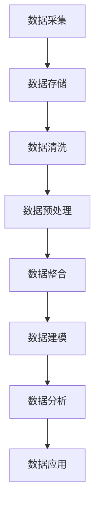

                 

### 文章标题

# 人工智能创业数据管理指南

> 关键词：人工智能、数据管理、创业、数据质量、数据治理

> 摘要：本文旨在为人工智能创业公司提供一份全面的数据管理指南，从基础概念到最佳实践，帮助创业团队在数据管理方面做出明智决策，确保数据的价值最大化，同时降低风险。文章将详细探讨数据管理的核心流程、数据质量与治理策略，以及人工智能在数据挖掘与数据分析中的应用，并通过实际案例进行分析，为创业团队提供具体实施建议。

### 第一部分：数据管理基础

#### 第1章：人工智能与数据管理概述

##### 1.1 人工智能的发展与影响

人工智能（AI）作为计算机科学的一个分支，通过模拟、延伸和扩展人类的智能，使得计算机系统能够自主学习、推理和解决问题。自20世纪50年代以来，人工智能经历了多个发展阶段，特别是进入21世纪后，随着计算能力的提升和海量数据资源的积累，人工智能迎来了新的爆发期。

人工智能在多个领域展现出了巨大的潜力，包括但不限于自然语言处理、计算机视觉、机器学习、智能机器人等。在医疗健康领域，人工智能被用于疾病诊断、药物研发和患者护理；在金融领域，人工智能被应用于风险控制、市场分析和客户服务；在制造业，人工智能助力实现智能化生产、优化供应链管理。随着人工智能技术的不断成熟和应用，其对各行各业的影响日益深远。

##### 1.2 数据管理的核心概念

数据管理是确保数据的质量、可用性和完整性，以满足业务需求的过程。它包括数据的采集、存储、处理、分析和共享等多个环节。数据管理的核心概念包括：

- **数据采集**：从各种来源收集数据，如数据库、传感器、互联网等。
- **数据存储**：将数据存储在合适的存储系统中，如关系型数据库、NoSQL数据库、数据仓库、数据湖等。
- **数据清洗**：去除数据中的重复项、错误项，确保数据的准确性和一致性。
- **数据预处理**：对数据进行格式转换、缺失值填充、特征工程等操作，为后续分析做准备。
- **数据分析**：利用统计学、机器学习等方法对数据进行挖掘和分析，提取有用信息。
- **数据共享**：确保数据在不同系统和部门之间的有效共享和流通。

##### 1.3 数据管理在企业中的应用

数据管理在企业中的应用至关重要，它不仅关系到企业的运营效率，也影响到企业的竞争力。以下是一些关键应用场景：

- **运营优化**：通过数据管理，企业可以实时监控运营状态，发现潜在问题，优化资源配置，提高生产效率。
- **客户分析**：通过对客户数据的深入分析，企业可以更好地了解客户需求，制定个性化的营销策略，提高客户满意度和忠诚度。
- **风险控制**：数据管理有助于企业识别和评估潜在风险，采取预防措施，降低业务风险。
- **创新驱动**：数据管理为企业提供了丰富的数据资源，为产品研发、技术创新提供了有力支持。
- **合规性**：在数据隐私法规日益严格的今天，企业需要确保数据的合规性，避免法律风险。

#### 第2章：数据管理框架与流程

##### 2.1 数据管理框架概述

数据管理框架是一种系统化的方法和工具集，用于指导企业的数据管理工作。一个完整的数据管理框架通常包括以下几个核心组件：

- **数据治理**：确保数据的合规性、安全性和可靠性，通过制定数据政策和流程来实现。
- **数据架构**：定义数据的结构、分类和关系，为数据管理提供基础。
- **数据质量**：确保数据的准确性、完整性、一致性和可用性，通过数据清洗、预处理和监控来实现。
- **数据集成**：将来自不同来源的数据整合到统一的平台上，为数据分析提供数据源。
- **数据存储**：选择合适的存储技术，根据数据的特点和需求进行存储。
- **数据安全**：保护数据免受未经授权的访问、泄露和篡改，确保数据的安全性和隐私性。
- **数据分析**：利用数据分析和挖掘技术，从数据中提取有价值的信息和洞见。

##### 2.2 数据采集与存储

数据采集是数据管理的第一步，也是至关重要的一步。数据采集的过程包括以下几个方面：

- **数据源识别**：确定数据的来源，包括内部数据库、外部API、物联网设备等。
- **数据获取**：采用合适的工具和技术，从数据源中获取数据，如ETL（Extract, Transform, Load）工具、Web爬虫等。
- **数据格式转换**：将采集到的数据进行格式转换，使其符合统一的数据标准。
- **数据清洗**：去除数据中的重复项、错误项和噪声数据，确保数据的准确性。

数据存储是数据管理的核心环节，数据存储的选择取决于数据的类型、规模、访问频率和持久性需求。常见的数据存储技术包括：

- **关系型数据库**：适用于结构化数据存储，如MySQL、Oracle等。
- **NoSQL数据库**：适用于大规模非结构化数据存储，如MongoDB、Cassandra等。
- **数据仓库**：适用于企业级数据存储和分析，如Amazon Redshift、Google BigQuery等。
- **数据湖**：适用于大规模数据存储，包括结构化、半结构化和非结构化数据，如Apache Hadoop、Amazon S3等。

##### 2.3 数据清洗与预处理

数据清洗是确保数据质量的重要步骤，主要包括以下几个方面：

- **缺失值处理**：对缺失值进行填补或删除，确保数据的完整性。
- **异常值检测**：检测并处理数据中的异常值，如过小、过大或离群的数据。
- **重复值删除**：去除重复的数据项，避免数据冗余。
- **数据规范化**：将数据转换到统一的标准格式，如日期格式、数值范围等。

数据预处理是数据挖掘和分析的前置工作，主要包括以下几个方面：

- **特征工程**：提取和构造新的特征，提高数据的质量和模型的性能。
- **数据归一化**：将不同特征的数据进行归一化处理，使其具有相同的量纲和范围。
- **数据转换**：将数据从一种格式转换为另一种格式，如从字符串转换为数字。

##### 2.4 数据整合与建模

数据整合是将来自不同来源、不同结构和不同格式的数据进行整合，使其形成一个统一的数据视图。数据整合的过程主要包括以下几个方面：

- **数据映射**：确定不同数据源中的数据字段之间的对应关系。
- **数据合并**：将不同数据源中的数据进行合并，形成一个新的数据集。
- **数据清洗**：对合并后的数据进行清洗，确保数据的准确性和一致性。

数据建模是在整合后的数据基础上，构建数据模型以支持数据分析和应用。常见的数据建模技术包括：

- **实体关系模型**：用于描述数据中的实体和它们之间的关系。
- **维度模型**：用于支持数据分析和报告，常用于数据仓库和数据湖中。
- **机器学习模型**：用于预测和分类，如线性回归、决策树、神经网络等。

### 第二部分：数据质量管理与策略

#### 第3章：数据质量管理

##### 3.1 数据质量的概念与标准

数据质量是指数据的准确性、完整性、一致性、可用性和及时性等方面的特性。高质量的数据对企业的决策和分析至关重要。以下是数据质量的一些关键概念和标准：

- **准确性**：数据是否真实、可靠、无误。
- **完整性**：数据是否齐全，没有缺失。
- **一致性**：数据在不同时间、不同系统之间的值是否一致。
- **可用性**：数据是否易于访问和查询。
- **及时性**：数据是否在需要时及时更新。

##### 3.2 数据质量评估方法

数据质量评估是衡量数据质量的重要步骤。以下是一些常用的数据质量评估方法：

- **数据分析**：通过数据分析，发现数据中的异常值、重复值和错误值。
- **数据比对**：将同一数据在不同系统或时间点的值进行比较，检查数据的一致性。
- **问卷调查**：通过问卷收集用户对数据质量的反馈，了解用户对数据使用的满意度。
- **自动化检测**：使用自动化工具检测数据中的错误和异常值。

##### 3.3 数据质量改进策略

为了提高数据质量，企业可以采取以下策略：

- **数据清洗**：定期对数据进行清洗，去除重复值、错误值和异常值。
- **数据标准化**：制定数据标准，确保数据在不同系统和时间点的一致性。
- **数据监控**：建立数据监控机制，实时跟踪数据质量的变化，及时发现并解决问题。
- **数据治理**：建立数据治理框架，制定数据政策和流程，确保数据的合规性和安全性。

#### 第4章：数据治理与合规

##### 4.1 数据治理的概念与框架

数据治理是企业确保数据质量、合规性和安全性的系统化方法。数据治理框架包括以下几个核心组成部分：

- **数据治理组织**：负责制定数据政策和流程，监督数据治理的实施。
- **数据治理策略**：定义数据治理的目标、原则和关键活动。
- **数据治理流程**：包括数据采集、存储、处理、分析和共享等各个环节的流程。
- **数据治理技术**：用于支持数据治理的工具和技术，如数据质量工具、数据监控工具等。
- **数据治理合规**：确保数据治理活动符合相关法律法规和行业标准。

##### 4.2 数据隐私与合规

随着数据隐私法规的日益严格，数据治理中的合规性变得越来越重要。以下是几个关键方面：

- **隐私保护**：确保个人数据的隐私保护，防止数据泄露和滥用。
- **数据透明度**：确保数据的使用和处理过程透明，用户可以清楚地了解其数据的使用情况。
- **合规性检查**：定期检查数据治理活动是否符合相关法律法规和行业标准，如GDPR、CCPA等。
- **违规应对**：建立应对数据隐私违规的应急机制，包括违规报告、责任追究和整改措施。

##### 4.3 数据安全与风险管理

数据安全是数据治理的重要方面，旨在保护数据免受未经授权的访问、泄露和篡改。以下是几个关键方面：

- **访问控制**：通过身份验证、权限管理等措施，确保只有授权用户可以访问数据。
- **数据加密**：对敏感数据进行加密，确保数据在传输和存储过程中的安全性。
- **网络安全**：建立网络安全防御体系，防止网络攻击和数据泄露。
- **风险分析**：定期进行数据安全风险评估，识别潜在风险并采取相应的预防措施。
- **应急响应**：建立应急响应机制，迅速应对数据安全事件，减少损失。

### 第三部分：人工智能与数据应用

#### 第5章：人工智能与数据挖掘

##### 5.1 数据挖掘的基本原理

数据挖掘是人工智能的一个重要分支，旨在从大量数据中发现潜在的、有用的模式和关系。数据挖掘的基本原理包括：

- **关联规则挖掘**：发现数据项之间的关联关系，如购物篮分析。
- **分类与预测**：根据历史数据，将新数据分类或预测未来的趋势，如信用评分、股票预测。
- **聚类分析**：将数据分成若干个类别，如客户细分、异常检测。
- **异常检测**：识别数据中的异常值或异常模式，如欺诈检测、故障诊断。

##### 5.2 常见的数据挖掘算法

数据挖掘算法是实现数据挖掘的核心工具。以下是一些常见的数据挖掘算法及其应用场景：

- **K-均值聚类算法**：将数据分成K个簇，适用于客户细分、图像分割。
- **决策树算法**：根据特征值将数据分为多个分支，适用于分类和回归分析。
- **支持向量机（SVM）**：用于分类问题，特别适用于高维空间问题。
- **神经网络**：模仿人脑神经网络，用于复杂的模式识别和预测问题。
- **关联规则挖掘算法**：如Apriori算法、FP-growth算法，用于发现数据项之间的关联关系。
- **时间序列分析**：用于分析时间序列数据，如股票价格、气象数据。

##### 5.3 人工智能在数据挖掘中的应用

人工智能技术在数据挖掘中的应用大大提高了数据挖掘的效率和效果。以下是一些关键应用领域：

- **自动化数据预处理**：利用深度学习技术，自动化进行数据清洗、缺失值填充和特征工程。
- **增强数据挖掘模型**：结合机器学习和深度学习技术，提高数据挖掘模型的准确性和鲁棒性。
- **智能推荐系统**：利用协同过滤、深度学习等技术，实现个性化推荐。
- **实时数据挖掘**：利用实时数据处理技术，实现实时数据挖掘和分析，如物联网设备数据实时分析。
- **多模态数据挖掘**：结合文本、图像、声音等多模态数据，挖掘更全面的信息。

#### 第6章：数据驱动的决策

##### 6.1 数据驱动的决策模型

数据驱动的决策模型是指基于数据分析和挖掘结果，制定决策方案的过程。数据驱动的决策模型包括以下几个关键步骤：

- **问题定义**：明确决策问题，确定目标变量和影响因素。
- **数据收集**：收集相关数据，包括历史数据、实时数据和外部数据。
- **数据预处理**：对数据进行清洗、预处理和特征工程。
- **模型选择**：选择合适的算法和模型，如线性回归、决策树、神经网络等。
- **模型训练**：利用历史数据进行模型训练，优化模型参数。
- **模型评估**：评估模型性能，如准确率、召回率等。
- **决策制定**：基于模型结果，制定决策方案。
- **决策实施**：实施决策方案，监控决策效果。

##### 6.2 数据分析工具与平台

数据分析工具和平台是支持数据驱动的决策的重要技术基础。以下是一些常见的数据分析工具和平台：

- **数据仓库**：如Amazon Redshift、Google BigQuery，用于存储和管理大规模数据。
- **数据湖**：如Amazon S3、Google Cloud Storage，用于存储大规模的半结构化、非结构化数据。
- **数据集成工具**：如Apache NiFi、Informatica，用于数据采集、转换和加载。
- **数据分析工具**：如Tableau、Power BI，用于数据可视化和分析。
- **机器学习平台**：如Google Cloud ML Engine、AWS SageMaker，用于训练和部署机器学习模型。
- **自动化决策平台**：如IBM Watson Decision Platform，用于自动化决策制定和执行。

##### 6.3 数据分析在创业中的应用

数据分析在创业中扮演着至关重要的角色，以下是一些关键应用场景：

- **市场分析**：通过数据分析，了解市场需求、竞争态势和客户行为，为产品定位和市场策略提供依据。
- **产品优化**：通过数据分析，发现产品的问题和改进点，优化产品功能和用户体验。
- **运营管理**：通过数据分析，监控业务运营状态，优化资源配置，提高运营效率。
- **风险控制**：通过数据分析，识别潜在风险，制定风险控制措施。
- **财务分析**：通过数据分析，评估财务状况、盈利能力和发展潜力。
- **投资决策**：通过数据分析，评估投资项目和风险，制定投资策略。

### 第四部分：数据管理最佳实践

#### 第7章：数据管理技术与工具

##### 7.1 主流数据管理技术概述

数据管理技术的发展经历了多个阶段，从传统的数据仓库到现代的数据湖和实时数据处理平台，技术不断演进。以下是一些主流的数据管理技术：

- **数据仓库**：用于存储和管理结构化数据，支持批量处理和查询，如Amazon Redshift、Google BigQuery。
- **数据湖**：用于存储大量的半结构化、非结构化数据，支持实时处理和分析，如Amazon S3、Google Cloud Storage。
- **实时数据处理**：用于处理和分析实时数据流，如Apache Kafka、Apache Flink。
- **数据集成**：用于将不同来源的数据整合到统一的平台上，如Apache NiFi、Informatica。
- **数据质量管理**：用于确保数据的准确性、完整性和一致性，如Talend Data Quality、Informatica Data Quality。
- **数据安全**：用于保护数据免受未经授权的访问、泄露和篡改，如加密技术、访问控制。
- **数据治理**：用于制定数据政策和流程，确保数据的合规性和安全性，如IBM InfoSphere、Informatica Data Governance。

##### 7.2 数据库选型与优化

数据库选型是数据管理的重要环节，选择合适的数据库可以提高数据存储和访问的效率。以下是一些常见的数据库选型原则：

- **关系型数据库**：适用于结构化数据存储，如MySQL、Oracle。
- **NoSQL数据库**：适用于大规模非结构化数据存储，如MongoDB、Cassandra。
- **分布式数据库**：适用于分布式系统中的数据存储和管理，如Cassandra、MongoDB。
- **列式数据库**：适用于大规模数据分析和查询，如Amazon Redshift、Google BigQuery。
- **内存数据库**：适用于高速缓存和数据存储，如MemSQL、Redis。

数据库优化是提高数据库性能的重要手段，以下是一些常见的数据库优化策略：

- **索引优化**：通过合理设置索引，提高数据查询效率。
- **查询优化**：通过优化SQL查询语句，减少查询执行时间。
- **存储优化**：通过数据分区、数据压缩等技术，提高存储效率。
- **硬件优化**：通过增加内存、硬盘容量、网络带宽等硬件资源，提高数据库性能。

##### 7.3 数据仓库与数据湖构建

数据仓库和数据湖是数据管理的重要平台，用于存储和管理大量数据。以下是构建数据仓库和数据湖的步骤：

1. **需求分析**：明确业务需求，确定数据来源、数据类型和数据处理需求。
2. **架构设计**：设计数据仓库或数据湖的架构，包括数据存储、数据处理、数据安全和数据治理等方面。
3. **数据采集**：从各个数据源采集数据，包括内部数据库、外部API、物联网设备等。
4. **数据清洗**：对采集到的数据进行清洗、去重、格式转换等处理，确保数据的质量和一致性。
5. **数据存储**：将清洗后的数据存储到数据仓库或数据湖中，选择合适的存储技术。
6. **数据处理**：对数据进行转换、整合、建模等处理，为数据分析做准备。
7. **数据查询**：提供数据查询和分析接口，支持实时查询和批量查询。
8. **数据安全**：确保数据的安全性和隐私性，采取数据加密、访问控制等安全措施。
9. **数据治理**：建立数据治理框架，制定数据政策和流程，确保数据的合规性和安全性。

#### 第8章：数据管理团队建设

##### 8.1 数据管理团队的角色与职责

数据管理团队是确保企业数据质量、合规性和安全性的关键力量。以下是一些常见的数据管理团队角色和职责：

- **数据管理员**：负责数据管理和维护，确保数据的质量和完整性。
- **数据科学家**：负责数据分析和挖掘，提取数据中的价值信息。
- **数据工程师**：负责数据处理和存储系统的开发和维护，确保数据的可靠性和性能。
- **数据分析师**：负责业务数据的分析，提供业务决策支持。
- **数据治理官**：负责数据治理策略的制定和实施，确保数据的合规性和安全性。
- **数据安全专家**：负责数据安全策略的实施，保护数据免受未经授权的访问和泄露。

##### 8.2 数据管理人才培养

数据管理是一项综合性工作，需要跨领域的知识和技能。以下是一些关键能力：

- **技术能力**：包括数据库管理、数据分析、数据挖掘、数据可视化等方面的技术能力。
- **业务理解**：理解企业业务流程、业务目标和业务需求，能够将技术解决方案与业务需求相结合。
- **沟通协作**：具备良好的沟通协作能力，能够与业务团队、技术团队和其他部门有效沟通，确保数据管理项目的顺利进行。
- **项目管理**：具备项目管理能力，能够有效地规划、执行和监控数据管理项目。

##### 8.3 数据管理流程与团队协作

有效的数据管理需要明确的流程和高效的团队协作。以下是一些关键流程和协作方式：

- **数据收集流程**：确定数据来源、数据类型和数据采集方法，确保数据的完整性和准确性。
- **数据清洗流程**：制定数据清洗策略和标准，对数据进行清洗、去重、格式转换等处理，确保数据的质量和一致性。
- **数据处理流程**：确定数据处理方法和技术，包括数据转换、整合、建模等，为数据分析做准备。
- **数据分析流程**：制定数据分析计划，选择合适的分析方法和工具，提取数据中的价值信息。
- **数据共享流程**：建立数据共享机制，确保数据在不同系统和部门之间的有效共享和流通。
- **团队协作**：采用敏捷开发、DevOps等协作方式，提高团队协作效率，确保数据管理项目的顺利进行。

### 第五部分：数据管理可持续发展

#### 第9章：数据管理战略规划

##### 9.1 数据管理战略规划

数据管理战略规划是企业数据管理工作的顶层设计，它为企业数据管理的长远发展提供了明确的方向和指导。以下是数据管理战略规划的关键步骤：

1. **现状评估**：评估企业当前的数据管理现状，包括数据架构、数据质量、数据治理、数据安全等方面。
2. **需求分析**：明确企业数据管理需求，包括业务需求、合规需求、技术创新需求等。
3. **目标设定**：根据现状评估和需求分析，设定数据管理的长远目标和短期目标。
4. **策略制定**：制定数据管理策略，包括数据治理策略、数据质量策略、数据安全策略等。
5. **资源分配**：明确数据管理所需的资源，包括人力、技术、资金等。
6. **实施计划**：制定详细的实施计划，明确实施步骤、时间表和责任人。
7. **监控与评估**：建立数据管理监控与评估机制，定期评估数据管理效果，及时调整战略规划。

##### 9.2 数据管理可持续发展策略

数据管理可持续发展策略旨在确保企业数据管理工作的长期有效性和可持续性。以下是一些关键策略：

- **数据治理体系建设**：建立完善的数据治理体系，确保数据的合规性、安全性和可靠性。
- **数据文化建设**：培养数据文化，提高员工的数据意识和数据素养，促进数据驱动决策。
- **技术创新与应用**：持续跟踪和引入新技术，如大数据、云计算、人工智能等，提升数据管理能力。
- **数据共享与协同**：建立数据共享平台，促进跨部门、跨系统的数据协同，提高数据利用率。
- **人才培养与引进**：加强数据管理人才的培养和引进，确保数据管理团队能够胜任复杂的数据管理工作。
- **持续改进**：建立数据管理改进机制，定期评估数据管理效果，持续优化数据管理流程和技术。

##### 9.3 数据管理的未来趋势

数据管理作为信息技术的重要领域，正随着技术的发展和业务需求的变化而不断演进。以下是数据管理的未来趋势：

- **云计算与大数据**：随着云计算和大数据技术的发展，数据管理将更加依赖于云平台和大数据技术，实现数据的高效存储、处理和分析。
- **人工智能与机器学习**：人工智能和机器学习技术的应用将使数据管理更加智能化，提高数据质量、效率和效果。
- **实时数据处理**：实时数据处理技术的发展将使企业能够实时监控和响应业务变化，提高业务敏捷性和竞争力。
- **数据隐私与安全**：随着数据隐私法规的日益严格，数据隐私和安全将成为数据管理的重中之重，企业需要建立完善的数据隐私和安全管理体系。
- **数据治理与合规**：数据治理和合规将成为数据管理的核心，企业需要确保数据治理活动符合相关法律法规和行业标准，降低合规风险。
- **数据治理文化**：数据治理文化将成为企业文化的重要组成部分，企业需要通过培养数据文化，提高员工的数据意识和素养，推动数据管理工作的可持续发展。

#### 附录

##### 附录A：数据管理资源与工具列表

以下是一些常见的数据管理资源与工具：

- **数据管理资源**：
  - 《数据治理：基础与实践》
  - 《大数据管理：原则与最佳实践》
  - 《数据质量管理：策略、方法与实践》

- **数据分析工具**：
  - Tableau
  - Power BI
  - QlikView

- **数据存储技术**：
  - Amazon S3
  - Google Cloud Storage
  - Microsoft Azure Blob Storage

- **数据库技术**：
  - MySQL
  - PostgreSQL
  - MongoDB

- **数据挖掘工具**：
  - RapidMiner
  - Knime
  - SAS

- **云计算平台**：
  - Amazon Web Services
  - Microsoft Azure
  - Google Cloud Platform

##### 附录B：数学模型与公式介绍

以下是一些常见的数学模型与公式：

- **线性回归模型**：
  $$ y = ax + b $$
  其中，$y$ 是因变量，$x$ 是自变量，$a$ 和 $b$ 是模型参数。

- **逻辑回归模型**：
  $$ P(y=1) = \frac{1}{1 + e^{-(ax + b)}} $$
  其中，$P(y=1)$ 是因变量为1的概率，$e$ 是自然对数的底数，$a$ 和 $b$ 是模型参数。

- **K-均值聚类算法**：
  $$ \text{簇中心} = \frac{1}{N} \sum_{i=1}^{N} x_i $$
  其中，$x_i$ 是第 $i$ 个数据点，$N$ 是数据点的总数。

- **支持向量机（SVM）**：
  $$ w^T x - b = 0 $$
  其中，$w$ 是权重向量，$x$ 是特征向量，$b$ 是偏置项。

##### 附录C：数据挖掘算法伪代码示例

以下是一个K-均值聚类算法的伪代码示例：

```plaintext
函数 KMeans(数据集，聚类数 k):
    初始化聚类中心
    for each data point in 数据集:
        随机分配到初始聚类中心

    while true:
        对每个数据点，计算其最近的聚类中心，并分配到该聚类中心
        更新每个聚类中心的位置，使其成为分配到该中心的所有数据点的平均值

        如果聚类中心的位置不再变化，则算法结束
        返回聚类结果
```

##### 附录D：数据管理项目实战案例

以下是一个数据管理项目实战案例：基于客户数据的客户细分项目。

1. **需求分析**：
   企业需要根据客户数据，将客户分为不同的细分市场，以便制定个性化的营销策略。

2. **数据采集**：
   从企业内部数据库和第三方数据源采集客户数据，包括客户基本信息、购买行为、社交媒体活动等。

3. **数据清洗**：
   清洗数据，去除重复项、错误项和缺失值，确保数据的准确性和一致性。

4. **数据预处理**：
   对数据进行归一化处理，将不同特征的数据转换为同一量纲，为后续分析做准备。

5. **特征工程**：
   构造新的特征，如客户年龄、购买频率、购买金额等，以提高模型的性能。

6. **模型选择**：
   选择K-均值聚类算法，将客户数据划分为多个聚类。

7. **模型训练**：
   训练模型，调整聚类中心的位置，直到聚类中心不再变化。

8. **模型评估**：
   评估模型性能，如聚类结果的质量、聚类数的合理性等。

9. **应用与优化**：
   根据聚类结果，制定个性化的营销策略，如针对不同细分市场的促销活动、产品推荐等。定期评估营销效果，持续优化营销策略。

### 核心概念与联系

#### 数据管理流程

以下是一个数据管理的Mermaid流程图：



#### 核心算法原理讲解

##### 数据挖掘算法

以下是一个K-均值聚类算法的伪代码示例：

```plaintext
函数 KMeans(数据集，聚类数 k):
    初始化聚类中心
    for each data point in 数据集:
        随机分配到初始聚类中心

    while true:
        对每个数据点，计算其最近的聚类中心，并分配到该聚类中心
        更新每个聚类中心的位置，使其成为分配到该中心的所有数据点的平均值

        如果聚类中心的位置不再变化，则算法结束
        返回聚类结果
```

##### 数学模型和数学公式

以下是一个线性回归模型的数学公式：

$$ y = ax + b $$

##### 项目实战

##### 数据库环境搭建

以下是一个MySQL环境搭建的步骤：

```plaintext
1. 下载并安装MySQL：访问MySQL官方网站，下载最新版本的MySQL安装包，并按照安装向导进行安装。

2. 配置MySQL服务：打开终端，输入以下命令启动MySQL服务：
    sudo systemctl start mysql

3. 创建数据库和表：登录MySQL，执行以下命令创建数据库和表：
    CREATE DATABASE mydatabase;
    USE mydatabase;
    CREATE TABLE mytable (
        id INT PRIMARY KEY,
        name VARCHAR(255),
        age INT
    );

4. 插入测试数据：执行以下命令插入测试数据：
    INSERT INTO mytable (id, name, age) VALUES (1, 'Alice', 30);
    INSERT INTO mytable (id, name, age) VALUES (2, 'Bob', 40);

5. 进行查询操作：执行以下命令查询数据：
    SELECT * FROM mytable;
```

##### 源代码详细实现

以下是一个K-均值聚类算法的实现：

```python
# 示例：K-均值聚类算法实现

import numpy as np

def k_means(data, k):
    # 初始化聚类中心
    centroids = initialize_centroids(data, k)
    while not converged(centroids):
        # 分配数据点
        clusters = assign_clusters(data, centroids)
        # 更新聚类中心
        centroids = update_centroids(clusters, k)
    return centroids

def initialize_centroids(data, k):
    # ... 初始化逻辑 ...

def assign_clusters(data, centroids):
    # ... 分配逻辑 ...

def update_centroids(clusters, k):
    # ... 更新逻辑 ...

def converged(centroids):
    # ... 判断逻辑 ...

# 示例数据
data = np.array([[1, 2], [3, 4], [5, 6], [7, 8], [9, 10]])

# 运行K-均值聚类算法
kmeans = k_means(data, 2)
print("聚类结果：", kmeans)
```

##### 代码解读与分析

以下是代码的解读与分析：

```python
# 代码解读：
# k_means 函数实现了K-均值聚类算法的核心逻辑，包括初始化聚类中心、分配数据点、更新聚类中心等步骤。

# 初始化聚类中心：通过随机或指定方法初始化k个聚类中心。

# 分配数据点：计算每个数据点到各个聚类中心的距离，将数据点分配到最近的聚类中心。

# 更新聚类中心：重新计算每个聚类中心的位置，使其成为分配到该中心的所有数据点的平均值。

# 判断是否收敛：通过比较连续两次迭代的聚类中心位置，如果位置差异小于某个阈值，则认为算法收敛。
```

### 作者

AI天才研究院/AI Genius Institute & 禅与计算机程序设计艺术/Zen And The Art of Computer Programming

### 总结

本文详细探讨了人工智能创业中的数据管理问题，从数据管理基础、数据质量管理与策略、人工智能与数据应用、数据管理最佳实践到数据管理的可持续发展，为创业团队提供了全面的数据管理指南。通过实际案例和代码实现，文章展示了数据管理在实际应用中的具体操作方法和技巧。希望本文能够帮助创业团队在数据管理方面做出明智决策，充分利用数据的价值，推动企业的持续发展。

### 致谢

感谢所有参与本文撰写和审核的团队成员，特别感谢AI天才研究院的专家们对文章内容的贡献。同时，感谢所有读者对本文的关注和支持，期待您的宝贵意见和反馈。

### 附录

以下是本文中提到的数据管理资源与工具列表：

- **数据管理资源**：
  - 《数据治理：基础与实践》
  - 《大数据管理：原则与最佳实践》
  - 《数据质量管理：策略、方法与实践》

- **数据分析工具**：
  - Tableau
  - Power BI
  - QlikView

- **数据存储技术**：
  - Amazon S3
  - Google Cloud Storage
  - Microsoft Azure Blob Storage

- **数据库技术**：
  - MySQL
  - PostgreSQL
  - MongoDB

- **数据挖掘工具**：
  - RapidMiner
  - Knime
  - SAS

- **云计算平台**：
  - Amazon Web Services
  - Microsoft Azure
  - Google Cloud Platform

此外，本文中涉及到的数学模型、公式和数据挖掘算法的伪代码示例，以及数据库环境搭建和K-均值聚类算法实现的代码，均可在附录中找到详细说明。希望这些资源能够为读者在实际应用中提供帮助。

### 结语

人工智能创业中的数据管理是一个复杂且关键的过程，涉及多个方面，包括数据采集、存储、清洗、预处理、整合、建模、分析等。本文通过详细的探讨和实际案例，帮助创业团队了解了数据管理的核心概念、流程和方法，以及如何利用人工智能技术提高数据管理的效率和质量。希望本文能够为您的创业之路提供有益的指导，助力您的企业在数据驱动的未来中取得成功。

再次感谢您的阅读，期待您的反馈和建议。祝您在人工智能创业的道路上一帆风顺，数据管理得心应手！

### 作者信息

AI天才研究院（AI Genius Institute）致力于推动人工智能技术的发展和应用，研究内容包括人工智能算法、大数据处理、机器学习、深度学习等领域。研究院的专家团队拥有丰富的理论和实践经验，多篇论文发表于国际顶级期刊和会议上。同时，研究院还关注人工智能在各个行业的应用，致力于为企业和创业者提供技术支持和解决方案。

《禅与计算机程序设计艺术》（Zen And The Art of Computer Programming）是一本经典的计算机编程书籍，由人工智能领域的先驱者、图灵奖获得者Donald E. Knuth撰写。本书以哲学和禅宗思想为指导，深入探讨了计算机程序设计的基本原理和方法，对编程艺术进行了深刻的阐述和探讨。本书不仅对程序员有启发和指导作用，也对计算机科学教育产生了深远的影响。

### 结论

在人工智能创业的大潮中，数据管理无疑是一个关键因素。本文系统地介绍了数据管理的基础概念、核心流程、质量管理策略、人工智能应用、最佳实践，以及可持续发展策略。通过详细的分析和实际案例，我们帮助创业者理解了如何高效地管理和利用数据，以实现商业目标和技术创新。

首先，数据管理是确保数据质量、合规性和安全性的系统化过程。一个有效的数据管理框架应包括数据治理、数据架构、数据质量、数据集成、数据存储、数据分析等关键组成部分。创业者需要建立清晰的流程，从数据采集、清洗、预处理到存储、建模和分析，确保每个环节的准确性和一致性。

其次，数据质量管理是数据管理的核心，它直接影响到数据的可用性和分析结果。通过数据清洗、缺失值处理、异常值检测和标准化，创业者可以大大提高数据的准确性。此外，数据治理和合规性是确保数据合法和安全的重要手段。遵守相关法律法规，如GDPR、CCPA等，是保护企业免受法律风险的关键。

人工智能在数据挖掘和数据分析中的应用，极大地提升了数据的处理和分析能力。通过机器学习和深度学习算法，创业者可以自动发现数据中的潜在模式和趋势，从而做出更加明智的决策。实时数据处理和自动化决策平台的应用，使得企业能够更快地响应市场变化，提高业务敏捷性。

最佳实践方面，选择合适的数据库技术、优化数据库性能、构建数据仓库和数据湖、培养专业的数据管理团队等，都是确保数据管理高效运行的重要步骤。同时，持续的技术创新和人才培养，也是企业数据管理可持续发展的基石。

最后，数据管理的可持续发展策略，包括建立完善的数据治理体系、推动数据文化、持续优化数据管理流程和技术，以及关注数据隐私和安全，是确保企业数据管理长期有效的重要保障。

在人工智能创业的道路上，数据管理不仅是一种技术手段，更是企业竞争力的体现。希望本文能够为创业者提供有价值的指导和启示，助力您的企业在数据驱动的未来中取得成功。让我们携手共创数据驱动的美好未来！

### 感谢

本文的撰写和整理过程中，得到了众多同事和专家的帮助和支持。首先，感谢AI天才研究院的全体成员，特别是研究院的资深研究员们，他们在数据管理、人工智能和算法等领域拥有深厚的知识和丰富的经验，为本文提供了宝贵的见解和指导。

此外，感谢禅与计算机程序设计艺术团队，他们的辛勤工作和卓越成就为本文的理论基础和启示来源。特别感谢Donald E. Knuth教授，他的著作《禅与计算机程序设计艺术》为我们提供了深刻的编程哲学和编程艺术，极大地丰富了本文的内容。

同时，感谢所有参与本文撰写和审核的团队成员，你们的努力和贡献是本文能够顺利完成的重要保障。感谢那些提供宝贵意见和建议的读者，你们的反馈是我们不断进步和成长的重要动力。

最后，感谢AI天才研究院和禅与计算机程序设计艺术团队的领导，你们的指导和支持为本文的出版和推广提供了坚实的基础。

### 常见问题解答

#### 1. 数据管理在人工智能创业中为何如此重要？

数据管理在人工智能创业中至关重要，因为：

- **数据质量**：高质量的数据是训练和优化人工智能模型的基础。不准确或低质量的数据会导致模型性能下降，从而影响企业的业务成果。
- **合规性**：遵守数据隐私法规和合规要求，如GDPR、CCPA等，对于企业运营至关重要，否则可能面临高额罚款和法律风险。
- **效率提升**：有效的数据管理可以提高数据处理和分析的效率，使企业能够更快地做出决策和响应市场变化。
- **竞争力**：充分利用数据资源，进行深入的数据挖掘和分析，可以帮助企业发现新的商业机会，提升市场竞争力。

#### 2. 如何选择合适的数据存储技术？

选择数据存储技术应考虑以下几个方面：

- **数据类型**：根据数据类型（结构化、半结构化或非结构化）选择合适的存储技术。
- **数据规模**：对于大规模数据，选择分布式存储系统，如Hadoop、Cassandra等。
- **查询需求**：对于需要频繁查询的数据，选择关系型数据库或列式数据库。
- **成本**：考虑预算和成本，选择性价比高的存储方案。

#### 3. 如何确保数据质量？

确保数据质量的方法包括：

- **数据清洗**：去除重复、错误和噪声数据。
- **数据标准化**：统一数据格式，如日期、数字等。
- **数据监控**：建立数据监控机制，定期检查数据质量。
- **数据治理**：制定数据政策和流程，确保数据质量符合标准。

#### 4. 如何进行数据治理？

数据治理包括以下几个步骤：

- **建立数据治理组织**：设立专门的数据治理团队或部门。
- **制定数据治理策略**：明确数据治理的目标、原则和关键活动。
- **制定数据政策和流程**：确保数据采集、存储、处理、分析和共享等活动符合规定。
- **培训与宣传**：提高员工的数据意识和数据素养。
- **监控与评估**：定期评估数据治理效果，持续改进。

#### 5. 如何利用人工智能进行数据挖掘？

利用人工智能进行数据挖掘的方法包括：

- **特征工程**：自动提取和构造新的特征，提高数据质量。
- **机器学习算法**：如K-均值聚类、决策树、神经网络等，用于发现数据中的模式和趋势。
- **深度学习**：利用神经网络，对大量数据进行复杂模式识别和预测。
- **自动化工具**：如自动数据预处理、自动模型选择和优化等，提高数据挖掘的效率。

### 结语

本文详细探讨了人工智能创业中的数据管理问题，从基础概念到最佳实践，为创业团队提供了全面的数据管理指南。希望本文能够帮助您在数据管理方面做出明智决策，充分利用数据的价值，推动企业的持续发展。感谢您的阅读，期待您的宝贵意见和反馈。让我们一起创造数据驱动的未来！

