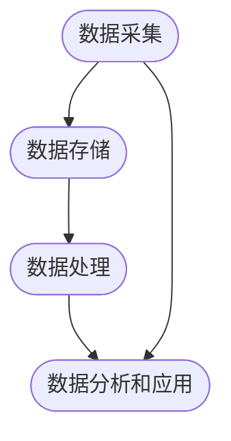
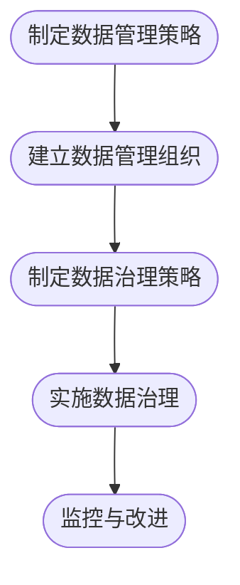
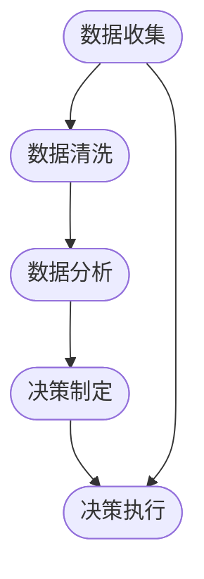
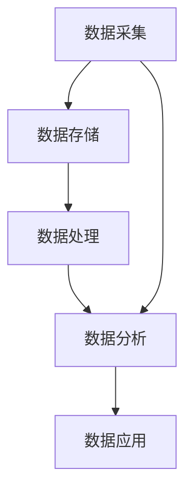
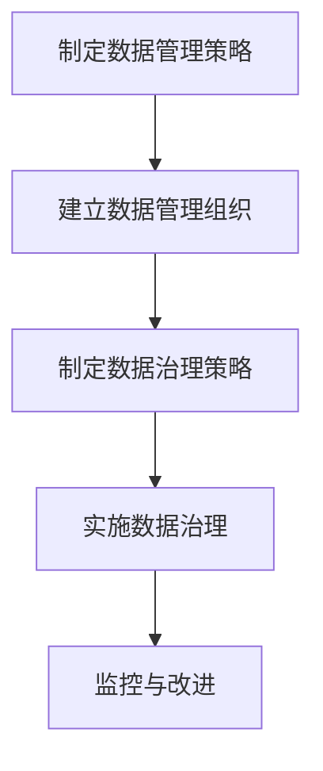
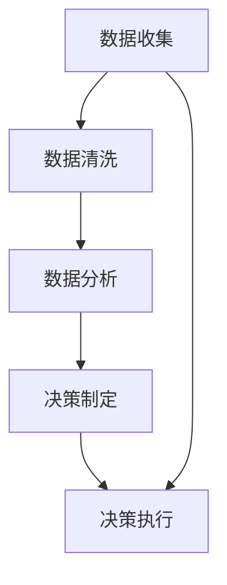

                 

# 《人工智能创业数据管理的成功经验》

> 关键词：人工智能创业、数据管理、成功经验、数据质量、数据治理、数据安全、数据驱动决策

> 摘要：本文旨在探讨人工智能创业中数据管理的成功经验，从数据管理概述、数据质量管理、数据治理、数据安全与隐私保护以及数据驱动决策等方面进行详细分析，结合实际案例，为创业者提供有价值的参考。

## 第一部分：人工智能创业基础

### 第1章：人工智能概述

#### 1.1 人工智能的定义与发展历程

人工智能（Artificial Intelligence，简称AI）是指通过计算机模拟人类智能行为的技术和理论。它包括机器学习、深度学习、自然语言处理、计算机视觉等多个领域。人工智能的发展历程可以追溯到20世纪50年代，当时图灵提出了著名的图灵测试，标志着人工智能研究的开始。随着计算能力的提升和数据量的爆发增长，人工智能在近年来取得了长足的进步。

#### 1.2 人工智能的核心技术

人工智能的核心技术包括机器学习、深度学习、自然语言处理和计算机视觉等。机器学习是通过算法从数据中学习规律，从而实现对未知数据的预测和分类。深度学习是机器学习的一种重要形式，它通过多层神经网络进行训练，具有强大的表达能力和自适应能力。自然语言处理旨在让计算机理解和生成人类语言，计算机视觉则致力于让计算机识别和理解图像。

#### 1.3 人工智能在创业中的应用前景

人工智能在创业中的应用前景广阔。一方面，人工智能可以提升企业的生产效率，降低运营成本；另一方面，人工智能可以帮助企业更好地了解客户需求，提供个性化的服务。此外，人工智能还可以助力企业进行风险控制和预测，从而为企业带来更多的商业机会。

### 第2章：创业环境与人工智能

#### 2.1 创业环境对人工智能的需求

创业环境对人工智能的需求主要体现在以下几个方面：

1. **数据需求**：创业企业需要大量的高质量数据来进行训练和验证人工智能模型。
2. **计算需求**：人工智能模型的训练和推理需要大量的计算资源，创业企业需要具备相应的计算能力。
3. **人才需求**：人工智能领域对人才的需求量大，创业企业需要吸引和培养优秀的人工智能专家。

#### 2.2 人工智能在创业中的作用

人工智能在创业中的作用主要体现在以下几个方面：

1. **提高效率**：人工智能可以帮助创业企业自动化一些重复性工作，提高工作效率。
2. **优化决策**：人工智能可以基于数据分析为企业提供更加科学的决策支持。
3. **创造新价值**：人工智能可以帮助创业企业发现新的业务机会，创造新的价值。

#### 2.3 创业者如何应对人工智能的挑战

创业者应对人工智能挑战的策略主要包括：

1. **数据积累**：积极收集和积累数据，为人工智能模型提供高质量的数据源。
2. **技术积累**：关注人工智能技术的发展趋势，及时掌握前沿技术。
3. **人才培养**：注重人工智能人才的培养和引进，提升企业的技术实力。

## 第二部分：数据管理在人工智能创业中的应用

### 第3章：数据管理概述

#### 3.1 数据管理的概念与重要性

数据管理是指对企业数据进行收集、存储、处理、分析和应用的过程。在人工智能创业中，数据管理至关重要，因为高质量的数据是训练和优化人工智能模型的基础。

#### 3.2 数据管理的关键环节

数据管理的关键环节包括：

1. **数据采集**：确保数据的准确性和完整性。
2. **数据存储**：选择合适的存储方案，确保数据的持久性和可扩展性。
3. **数据处理**：对数据进行清洗、转换和集成，提高数据质量。
4. **数据分析和应用**：利用数据分析工具和技术，从数据中提取有价值的信息。

#### 3.3 数据管理的最佳实践

数据管理的最佳实践包括：

1. **制定数据管理策略**：明确数据管理的目标和规划。
2. **建立数据管理体系**：包括数据质量控制、数据安全与隐私保护等。
3. **培养数据人才**：提高数据管理团队的技能和素养。

### 第4章：数据质量管理

#### 4.1 数据质量问题的来源

数据质量问题的来源主要包括：

1. **数据采集问题**：如数据格式不一致、数据缺失等。
2. **数据存储问题**：如数据存储不稳定、数据备份不完整等。
3. **数据处理问题**：如数据处理算法不完善、数据处理过程出现错误等。

#### 4.2 数据质量评估与改进方法

数据质量评估包括：

1. **准确性评估**：检查数据是否真实、可靠。
2. **完整性评估**：检查数据是否完整、有无缺失。
3. **一致性评估**：检查数据是否一致、有无矛盾。

数据质量改进方法包括：

1. **数据清洗**：去除重复数据、修正错误数据等。
2. **数据转换**：将不同格式的数据进行转换，保证数据一致性。
3. **数据集成**：将多个数据源进行整合，提高数据完整性。

#### 4.3 数据质量在人工智能应用中的关键作用

数据质量在人工智能应用中的关键作用体现在：

1. **提高模型性能**：高质量的数据可以提高模型的准确性和鲁棒性。
2. **降低训练成本**：数据质量差会导致模型训练时间长、成本高。
3. **保障应用效果**：数据质量直接影响人工智能应用的效率和效果。

### 第5章：数据治理

#### 5.1 数据治理的定义与目标

数据治理是指通过建立数据管理策略、流程和工具，实现对数据的全生命周期管理，确保数据的质量、安全性和合规性。数据治理的目标包括：

1. **提高数据质量**：确保数据的准确性、完整性和一致性。
2. **保障数据安全**：防止数据泄露、篡改和滥用。
3. **促进数据共享**：实现数据的高效利用和共享。

#### 5.2 数据治理框架与策略

数据治理框架包括：

1. **数据管理组织**：明确数据管理职责和权限。
2. **数据管理流程**：规范数据采集、存储、处理、分析和应用的过程。
3. **数据管理工具**：选择合适的数据管理工具，提高数据管理效率。

数据治理策略包括：

1. **数据质量控制**：建立数据质量评估与改进机制。
2. **数据安全与隐私保护**：制定数据安全与隐私保护政策。
3. **数据合规性管理**：确保数据管理符合相关法律法规。

#### 5.3 数据治理在人工智能创业中的实践

数据治理在人工智能创业中的实践主要包括：

1. **数据标准化**：统一数据格式，提高数据一致性。
2. **数据集成**：整合多种数据源，实现数据共享。
3. **数据安全与隐私保护**：加强数据安全防护，防止数据泄露。

### 第6章：数据安全与隐私保护

#### 6.1 数据安全的重要性

数据安全是人工智能创业中不可忽视的重要问题。数据泄露、篡改和滥用可能导致严重后果，包括：

1. **商业损失**：数据泄露可能导致商业机密泄露，给企业带来损失。
2. **法律风险**：数据泄露可能违反相关法律法规，导致企业面临法律风险。
3. **声誉损失**：数据泄露可能损害企业声誉，影响客户信任。

#### 6.2 常见的数据安全问题

常见的数据安全问题包括：

1. **数据泄露**：如黑客攻击、内部人员泄露等。
2. **数据篡改**：如恶意篡改数据、错误操作等。
3. **数据滥用**：如非法使用数据、未经授权访问数据等。

#### 6.3 数据安全与隐私保护的技术与实践

数据安全与隐私保护的技术包括：

1. **数据加密**：对数据进行加密，防止数据泄露。
2. **访问控制**：设置访问权限，控制数据访问。
3. **审计与监控**：对数据访问和操作进行审计和监控，及时发现和处理异常行为。

数据安全与隐私保护实践包括：

1. **数据安全培训**：提高员工数据安全意识。
2. **安全评估与审计**：定期进行数据安全评估与审计，确保数据安全。
3. **应急预案**：制定数据安全应急预案，及时应对数据安全事件。

### 第7章：数据驱动决策

#### 7.1 数据驱动决策的概念与原理

数据驱动决策是指基于数据分析结果进行决策，以提高决策的准确性和科学性。数据驱动决策的基本原理包括：

1. **数据收集**：收集与决策相关的数据。
2. **数据清洗**：清洗和预处理数据，提高数据质量。
3. **数据分析**：利用数据分析工具和技术，从数据中提取有价值的信息。
4. **决策制定**：基于数据分析结果进行决策。

#### 7.2 数据分析与可视化

数据分析与可视化包括：

1. **统计分析**：对数据进行统计分析和描述，了解数据特征。
2. **数据挖掘**：利用数据挖掘算法，发现数据中的潜在规律。
3. **可视化**：通过图表、地图等形式，将数据分析结果可视化，便于理解和分析。

#### 7.3 数据驱动决策在创业中的应用案例

数据驱动决策在创业中的应用案例包括：

1. **市场分析**：通过数据分析，了解市场趋势和消费者需求，制定营销策略。
2. **产品优化**：通过数据分析，发现产品的问题和改进点，优化产品功能。
3. **风险管理**：通过数据分析，识别潜在风险，制定风险管理策略。

## 第三部分：成功经验分享

### 第8章：人工智能创业数据管理的成功案例

#### 8.1 案例一：A公司的数据管理策略

A公司是一家专注于人工智能医疗领域的创业企业，其数据管理策略主要包括以下几个方面：

1. **数据采集**：A公司采用多种数据采集手段，包括医疗设备数据、患者病历数据等，确保数据的全面性和准确性。
2. **数据存储**：A公司采用分布式数据库存储技术，实现海量数据的存储和快速查询。
3. **数据处理**：A公司建立数据清洗和转换流程，提高数据质量，为人工智能模型提供高质量的数据源。
4. **数据安全与隐私保护**：A公司采用数据加密、访问控制等技术，确保数据安全与隐私保护。

#### 8.2 案例二：B公司的数据治理实践

B公司是一家金融科技企业，其数据治理实践主要包括以下几个方面：

1. **数据标准化**：B公司制定数据标准化规范，确保数据格式的一致性。
2. **数据集成**：B公司采用数据集成技术，实现多个数据源的数据整合，提高数据共享和利用效率。
3. **数据安全与隐私保护**：B公司建立数据安全与隐私保护机制，防止数据泄露和滥用。
4. **数据合规性管理**：B公司确保数据管理符合相关法律法规要求，降低法律风险。

#### 8.3 案例三：C公司的数据安全与隐私保护措施

C公司是一家提供智能家居解决方案的创业企业，其数据安全与隐私保护措施主要包括以下几个方面：

1. **数据加密**：C公司对数据进行加密存储和传输，防止数据泄露。
2. **访问控制**：C公司设置严格的访问权限，控制数据访问。
3. **审计与监控**：C公司对数据访问和操作进行审计和监控，及时发现和处理异常行为。
4. **应急预案**：C公司制定数据安全应急预案，及时应对数据安全事件。

### 第9章：人工智能创业数据管理的挑战与应对

#### 9.1 数据管理面临的挑战

人工智能创业数据管理面临的挑战主要包括：

1. **数据质量差**：数据质量问题可能导致人工智能模型性能下降。
2. **数据安全风险**：数据泄露、篡改和滥用可能给企业带来严重损失。
3. **数据隐私保护**：在数据利用过程中，如何保护用户隐私成为一大挑战。
4. **数据治理难度大**：数据治理涉及多个方面，包括数据标准、数据集成、数据安全等，实施难度较大。

#### 9.2 应对数据管理挑战的策略

应对数据管理挑战的策略包括：

1. **提高数据质量**：建立数据质量评估与改进机制，确保数据质量。
2. **加强数据安全与隐私保护**：采用数据加密、访问控制等技术，确保数据安全与隐私保护。
3. **实施数据治理**：建立数据治理框架和策略，实现数据管理规范化。
4. **培养数据人才**：提高数据管理团队的能力和素养，提升数据管理水平。

#### 9.3 创业者如何构建高效的数据管理体系

创业者构建高效的数据管理体系包括：

1. **明确数据管理目标**：根据企业发展战略和业务需求，明确数据管理目标。
2. **建立数据管理组织**：设立数据管理部门，明确数据管理职责和权限。
3. **制定数据管理策略**：制定数据采集、存储、处理、分析和应用等方面的策略。
4. **实施数据治理**：建立数据治理框架和策略，实现数据管理规范化。

## 第10章：未来展望

### 10.1 数据管理在人工智能创业中的发展趋势

随着人工智能技术的不断进步和应用场景的拓展，数据管理在人工智能创业中的发展趋势主要包括：

1. **数据治理升级**：随着数据量的增加和业务复杂度的提升，数据治理将更加重要，创业者需要不断完善数据治理框架和策略。
2. **数据安全与隐私保护加强**：随着数据安全事件频发，创业者需要加强数据安全与隐私保护，采用更加先进的技术和措施。
3. **数据智能应用**：利用人工智能技术，实现数据的智能分析和挖掘，为创业企业提供更加精准的决策支持。

### 10.2 创业者需要具备的数据管理能力

创业者需要具备以下数据管理能力：

1. **数据质量意识**：认识到数据质量对人工智能模型和应用的重要性，重视数据质量管理工作。
2. **数据治理能力**：具备数据治理的理论和实践能力，能够建立和完善数据治理框架和策略。
3. **数据安全与隐私保护能力**：了解数据安全与隐私保护的基本原理和技术，能够采取有效的措施确保数据安全与隐私保护。
4. **数据分析与挖掘能力**：具备数据分析与挖掘的基本技能，能够从海量数据中提取有价值的信息。

### 10.3 数据管理为人工智能创业带来的机遇与挑战

数据管理为人工智能创业带来了以下机遇与挑战：

1. **机遇**：高质量的数据管理有助于提升人工智能模型的性能和应用效果，为创业企业创造更多的商业价值。
2. **挑战**：随着数据量的增加和业务复杂度的提升，数据管理面临更大的压力，创业者需要不断提高数据管理能力，应对数据管理挑战。

## 附录

### 附录A：常用数据管理工具与资源

#### A.1 数据质量管理工具

1. **OpenRefine**：一款开源的数据清洗和转换工具，适用于中小规模数据的清洗和转换。
2. **Talend Open Studio**：一款集数据集成、数据质量和数据治理于一体的开源工具，适用于大规模数据管理。

#### A.2 数据治理工具

1. **Informatica**：一款功能强大的数据治理平台，提供数据质量、数据集成、数据安全和数据治理等功能。
2. **IBM InfoSphere**：一款集数据治理、数据安全和数据集成于一体的企业级数据管理平台。

#### A.3 数据安全与隐私保护工具

1. **RSA Data Loss Prevention**：一款用于数据安全与隐私保护的工具，能够识别、分类和保护敏感数据。
2. **Symantec Data Loss Prevention**：一款集数据安全、数据保护和合规性管理于一体的企业级数据安全解决方案。

#### A.4 数据分析与可视化工具

1. **Tableau**：一款功能强大的数据分析与可视化工具，适用于各种规模的数据分析和可视化。
2. **QlikView**：一款灵活的可视化数据分析平台，适用于各种规模的数据分析和探索。

### 附录B：参考文献与推荐阅读

1. **《人工智能：一种现代的方法》**：[Murphy, Kevin P.](https://www.amazon.com/AI-A-Modern-Approach-Intelligent/dp/0262032713)
2. **《数据科学入门》**：[曾磊](https://www.amazon.com/%E6%95%B0%E6%8D%AE%E7%A7%91%E5%AD%A6%E5%85%A5%E9%97%A8%E6%9B%B4%E6%96%B0%E7%89%88/dp/B07BQV3B7T)
3. **《数据治理：理论与实践》**：[李德智](https://www.amazon.com/%E6%95%B0%E6%8D%AE%E6%B2%BB%E7%90%86%E7%9A%84%E8%AE%BA%E5%92%8C%E5%AE%9E%E8%B7%AF-%E5%BC%A0%E6%9D%B0%E5%BD%AC/dp/7115446931)
4. **《数据安全与隐私保护》**：[刘强](https://www.amazon.com/%E6%95%B0%E6%8D%AE%E5%AE%89%E5%85%A8%E5%92%8C%E9%9A%90%E7%A7%81%E4%BF%9D%E6%8A%A4-%E7%AC%AC%E4%BA%8C%E7%89%88/dp/B07KZ5935P)

### 附录C：Mermaid流程图

#### C.1 数据管理流程图



#### C.2 数据治理流程图



#### C.3 数据驱动决策流程图



### 附录D：伪代码示例

#### D.1 数据质量评估算法

```python
def evaluate_data_quality(data):
    # 计算数据准确性
    accuracy = calculate_accuracy(data)

    # 计算数据完整性
    completeness = calculate_completeness(data)

    # 计算数据一致性
    consistency = calculate_consistency(data)

    # 综合评估数据质量
    quality = 0.5 * accuracy + 0.3 * completeness + 0.2 * consistency

    return quality
```

#### D.2 数据治理策略框架

```python
def data_governance_framework():
    # 数据质量控制
    quality_control()

    # 数据安全与隐私保护
    security_and_privacy()

    # 数据合规性管理
    compliance_management()

    # 数据共享与利用
    data_sharing_and_utilization()

    # 数据治理监控与改进
    governance_monitoring_and_improvement()
```

#### D.3 数据安全保护措施

```python
def data_security_measures():
    # 数据加密
    data_encryption()

    # 访问控制
    access_control()

    # 审计与监控
    auditing_and_monitoring()

    # 应急预案
    emergency_plan()
```

### 附录E：数学模型与公式

#### E.1 数据质量评估指标

$$
\text{数据质量} = \alpha \cdot \text{准确性} + \beta \cdot \text{完整性} + \gamma \cdot \text{一致性}
$$

其中，$\alpha$、$\beta$、$\gamma$ 为权重系数。

#### E.2 数据安全风险模型

$$
\text{数据安全风险} = \text{威胁概率} \cdot \text{脆弱性} \cdot \text{后果}
$$

其中，威胁概率、脆弱性和后果分别为数据安全风险模型的三个组成部分。

#### E.3 数据驱动决策模型

$$
\text{决策结果} = f(\text{数据输入})
$$

其中，$f$ 为决策函数，$\text{数据输入}$ 为决策所需的数据。

### 附录F：代码案例

#### F.1 数据质量管理代码实现

```python
# 导入相关库
import pandas as pd

# 读取数据
data = pd.read_csv("data.csv")

# 数据清洗
data = data.dropna()  # 去除缺失值
data = data[data["column1"] != "unknown"]  # 去除异常值

# 数据转换
data["column2"] = data["column2"].map({ "low": 1, "medium": 2, "high": 3 })  # 转换类别值

# 数据质量评估
quality = evaluate_data_quality(data)
print("数据质量评分：", quality)
```

#### F.2 数据治理框架代码实现

```python
# 数据质量控制
def quality_control(data):
    # 实现数据清洗、转换等操作
    ...

# 数据安全与隐私保护
def security_and_privacy(data):
    # 实现数据加密、访问控制等操作
    ...

# 数据合规性管理
def compliance_management(data):
    # 实现数据合规性检查等操作
    ...

# 数据共享与利用
def data_sharing_and_utilization(data):
    # 实现数据共享与利用操作
    ...

# 数据治理监控与改进
def governance_monitoring_and_improvement(data):
    # 实现数据治理监控与改进操作
    ...
```

#### F.3 数据安全与隐私保护代码实现

```python
# 数据加密
def data_encryption(data):
    # 实现数据加密操作
    ...

# 访问控制
def access_control(data):
    # 实现访问控制操作
    ...

# 审计与监控
def auditing_and_monitoring(data):
    # 实现审计与监控操作
    ...

# 应急预案
def emergency_plan(data):
    # 实现应急预案操作
    ...
```

#### F.4 数据驱动决策分析代码实现

```python
# 导入相关库
import pandas as pd
from sklearn.model_selection import train_test_split
from sklearn.ensemble import RandomForestClassifier
from sklearn.metrics import accuracy_score

# 读取数据
data = pd.read_csv("data.csv")

# 数据预处理
X = data.drop(["target"], axis=1)
y = data["target"]

# 数据分割
X_train, X_test, y_train, y_test = train_test_split(X, y, test_size=0.2, random_state=42)

# 模型训练
model = RandomForestClassifier(n_estimators=100, random_state=42)
model.fit(X_train, y_train)

# 预测
predictions = model.predict(X_test)

# 评估
accuracy = accuracy_score(y_test, predictions)
print("模型准确率：", accuracy)
```

## 作者信息

作者：AI天才研究院/AI Genius Institute & 禅与计算机程序设计艺术 /Zen And The Art of Computer Programming

### 第一部分：人工智能创业基础

#### 第1章：人工智能概述

#### 1.1 人工智能的定义与发展历程

人工智能（Artificial Intelligence，简称AI）是指通过计算机模拟人类智能行为的一种技术。它涵盖了多个领域，包括机器学习、深度学习、自然语言处理、计算机视觉等。人工智能的发展历程可以追溯到20世纪50年代，当时图灵提出了著名的图灵测试，标志着人工智能研究的开始。

在早期的阶段，人工智能主要依赖于专家系统和符号推理。专家系统是一种基于规则的方法，它通过专家提供的规则来模拟人类专家的决策过程。然而，这种方法存在一定的局限性，因为它依赖于人类专家的知识和经验，且难以处理复杂的问题。

随着计算机技术和算法的发展，人工智能逐渐进入了新的阶段。特别是20世纪80年代以来，机器学习和深度学习技术的发展为人工智能带来了新的突破。机器学习是一种基于数据驱动的方法，它通过训练模型来学习数据中的规律，从而实现对未知数据的预测和分类。深度学习则是机器学习的一种重要形式，它通过多层神经网络进行训练，具有强大的表达能力和自适应能力。

近年来，随着大数据、云计算和物联网等技术的发展，人工智能的应用场景不断拓展，从最初的工业制造、金融领域，逐渐延伸到医疗、教育、交通、智能家居等各个领域。人工智能技术的进步不仅提升了企业的生产效率，还带来了全新的商业模式和商业机会。

#### 1.2 人工智能的核心技术

人工智能的核心技术包括机器学习、深度学习、自然语言处理和计算机视觉等。

**机器学习**：机器学习是一种基于数据驱动的方法，它通过训练模型来学习数据中的规律，从而实现对未知数据的预测和分类。机器学习算法可以分为监督学习、无监督学习和半监督学习三种类型。监督学习有标注数据作为训练样本，适用于分类和回归任务；无监督学习没有标注数据，适用于聚类和降维任务；半监督学习结合了标注数据和未标注数据，可以提高模型的泛化能力。

**深度学习**：深度学习是机器学习的一种重要形式，它通过多层神经网络进行训练，具有强大的表达能力和自适应能力。深度学习在图像识别、语音识别、自然语言处理等领域取得了显著的成果。常见的深度学习模型包括卷积神经网络（CNN）、循环神经网络（RNN）和生成对抗网络（GAN）等。

**自然语言处理**：自然语言处理旨在让计算机理解和生成人类语言。它包括语音识别、文本分类、机器翻译、情感分析等多个子领域。自然语言处理技术的发展极大地推动了人工智能在智能客服、智能助理等领域的应用。

**计算机视觉**：计算机视觉致力于让计算机识别和理解图像。它包括图像识别、目标检测、图像分割、人脸识别等多个子领域。计算机视觉技术在自动驾驶、安防监控、医疗诊断等领域具有广泛的应用前景。

#### 1.3 人工智能在创业中的应用前景

人工智能在创业中的应用前景广阔。首先，人工智能可以提升企业的生产效率，降低运营成本。例如，通过机器学习算法优化生产流程，可以实现自动化控制和预测性维护，减少设备故障和停机时间。其次，人工智能可以帮助企业更好地了解客户需求，提供个性化的服务。例如，通过自然语言处理技术，可以分析客户评论和反馈，为产品改进和营销策略提供有力支持。此外，人工智能还可以助力企业进行风险控制和预测，从而为企业带来更多的商业机会。

对于创业者来说，人工智能技术不仅是一种工具，更是一种全新的商业理念。通过将人工智能技术应用于产品和服务中，创业者可以创造全新的商业模式，拓展市场空间。例如，智能医疗、智能教育、智能金融等领域的创业项目，都利用了人工智能技术来提升用户体验和效率。随着人工智能技术的不断进步，其应用领域还将进一步拓展，为创业者带来更多的机会。

然而，人工智能创业也面临着一定的挑战。首先，数据是人工智能的核心资源，创业者需要具备强大的数据收集和处理能力。其次，人工智能技术的落地需要大量的计算资源和专业知识，创业者需要投入足够的资源和精力。此外，人工智能的安全性和隐私保护问题也备受关注，创业者需要确保技术的安全性和合规性。

总的来说，人工智能为创业带来了巨大的机遇，同时也提出了新的挑战。创业者需要紧跟技术发展，提升自身的技术能力和管理水平，才能在激烈的市场竞争中脱颖而出。

#### 第2章：创业环境与人工智能

#### 2.1 创业环境对人工智能的需求

创业环境对人工智能的需求体现在多个方面，主要包括数据需求、计算需求和人才需求。

**数据需求**：数据是人工智能的基础资源，创业企业需要大量的高质量数据来训练和优化人工智能模型。高质量的数据包括多样性和代表性，能够反映出真实世界的复杂性和变化。创业企业需要通过多种渠道收集数据，如用户行为数据、市场数据、传感器数据等。此外，数据的质量和准确性对于模型的性能至关重要，因此创业企业需要建立数据质量控制机制，确保数据的可靠性和有效性。

**计算需求**：人工智能模型的训练和推理需要大量的计算资源。随着人工智能模型的复杂性和数据量的增加，计算需求也在不断攀升。创业企业需要具备足够的计算能力来支持模型训练和推理，包括高性能的CPU、GPU以及分布式计算技术。同时，创业企业还需要考虑云计算和大数据平台的建设，以提高计算效率和资源利用率。

**人才需求**：人工智能领域对人才的需求量大，创业企业需要吸引和培养优秀的人工智能专家。人工智能技术的研发和应用涉及多个学科，包括计算机科学、数学、统计学、心理学等。创业企业需要组建多学科交叉的团队，以满足不同领域的技术需求。此外，创业企业还需要关注员工的技能提升和知识更新，确保团队具备持续的创新能力和竞争力。

#### 2.2 人工智能在创业中的作用

人工智能在创业中的作用不可忽视，主要体现在以下几个方面：

**提高效率**：人工智能可以帮助创业企业自动化一些重复性工作，提高工作效率。例如，利用自然语言处理技术可以实现智能客服，提高客户服务的响应速度和质量。利用计算机视觉技术可以实现图像识别和目标检测，提高生产和物流的自动化程度。通过这些技术手段，创业企业可以节省人力资源，降低运营成本，提高整体运营效率。

**优化决策**：人工智能可以通过数据分析和挖掘，为创业企业提供科学的决策支持。创业企业在经营过程中会产生大量的数据，如销售数据、客户反馈、市场动态等。通过人工智能技术，可以对这些数据进行深入分析，发现数据中的潜在规律和趋势，从而为决策提供有力依据。例如，利用预测模型可以预测未来的销售趋势，帮助创业企业制定更合理的库存和营销策略。利用聚类分析可以识别客户群体，为个性化营销提供支持。

**创造新价值**：人工智能可以帮助创业企业发现新的业务机会，创造新的价值。通过数据分析和挖掘，可以发现市场中的潜在需求和用户痛点，从而为企业提供创新的解决方案。例如，利用图像识别技术可以开发智能安防系统，为社区和家庭提供安全保障。利用自然语言处理技术可以开发智能翻译工具，为跨国企业和个人提供便捷的沟通服务。此外，人工智能还可以帮助企业实现智能化管理和优化，提高企业的运营效率和市场竞争力。

#### 2.3 创业者如何应对人工智能的挑战

人工智能创业虽然充满了机遇，但也面临着诸多挑战。创业者需要采取一系列策略来应对这些挑战，主要包括以下几个方面：

**数据积累**：数据是人工智能的基础资源，创业企业需要积极积累高质量的数据。创业者可以通过多种渠道收集数据，如用户行为数据、市场数据、传感器数据等。同时，创业者还需要建立数据质量控制机制，确保数据的准确性和完整性。在数据积累过程中，创业者需要关注数据的多样性和代表性，以应对复杂多变的市场环境。

**技术积累**：人工智能技术发展迅速，创业者需要不断关注技术动态，积累相关技术。创业者可以通过参加技术会议、阅读专业文献、与学术界和产业界合作等方式，获取最新的研究成果和行业动态。此外，创业者还需要培养内部的技术团队，提升团队的技术能力和创新能力，以应对快速变化的市场需求。

**人才培养**：人工智能领域对人才的需求量大，创业者需要重视人才的引进和培养。创业者可以通过设立奖学金、提供实习机会、与高校合作等方式，吸引优秀的人才。同时，创业者还需要关注员工的职业发展和技能提升，提供培训和晋升机会，激发员工的积极性和创造力。

**合作与开放**：人工智能创业往往需要多学科交叉和多方合作，创业者需要积极参与行业合作和开放创新。创业者可以通过参加行业论坛、加入行业协会、与合作伙伴共建平台等方式，扩大合作网络，获取更多的资源和支持。此外，创业者还可以通过开放源代码、参与开源社区等方式，吸引更多的开发者参与，共同推动技术的进步和应用。

**合规与安全**：人工智能创业需要遵守相关法律法规和行业规范，确保技术的合规性和安全性。创业者需要了解数据保护法律法规、隐私保护政策等，建立数据安全和隐私保护机制，防止数据泄露和滥用。同时，创业者还需要关注技术的道德和社会影响，确保技术的公正性和公平性。

总之，创业者需要具备敏锐的市场洞察力、持续的技术创新能力、优秀的人才队伍和良好的合作精神，才能在人工智能创业中取得成功。

### 第3章：数据管理概述

#### 3.1 数据管理的概念与重要性

数据管理是指对企业数据进行收集、存储、处理、分析和应用的过程。它包括数据质量管理、数据存储管理、数据安全与隐私保护、数据治理等多个方面。数据管理的重要性在于，它是企业信息资产的有效管理和利用的基础，直接关系到企业的业务效率和竞争力。

在人工智能创业中，数据管理尤为重要。首先，高质量的数据是训练和优化人工智能模型的基础。如果数据质量差，可能会导致模型性能不佳，影响企业的业务效果。其次，数据管理涉及到数据的安全性和隐私保护，确保数据在收集、存储、传输和使用过程中的安全，防止数据泄露和滥用。此外，良好的数据管理能够提升企业的数据利用效率，为企业提供更加精准的决策支持。

#### 3.2 数据管理的关键环节

数据管理的关键环节包括数据采集、数据存储、数据处理、数据分析和数据应用。

**数据采集**：数据采集是数据管理的第一步，它包括从各种渠道收集数据，如用户行为数据、市场数据、传感器数据等。数据采集的质量直接影响到后续的数据处理和分析效果。因此，创业企业需要确保数据采集的准确性和完整性，避免数据丢失和错误。

**数据存储**：数据存储是数据管理的核心环节之一。创业企业需要选择合适的存储方案，确保数据的持久性和可扩展性。随着数据量的不断增长，创业企业需要考虑分布式存储和云存储技术，以提高数据存储的效率和安全性。

**数据处理**：数据处理是对采集到的数据进行清洗、转换和集成，提高数据质量的过程。数据处理包括数据清洗（去除重复数据、修正错误数据）、数据转换（将不同格式的数据进行统一转换）和数据集成（将多个数据源进行整合）等。高质量的数据处理能够为后续的数据分析和应用提供可靠的数据基础。

**数据分析**：数据分析是对处理后的数据进行深入分析，提取有价值的信息。数据分析包括统计分析和数据挖掘，可以用于市场分析、用户行为分析、风险预测等多个方面。通过数据分析，创业企业可以更好地了解市场动态和用户需求，为业务决策提供有力支持。

**数据应用**：数据应用是将分析结果应用于实际业务，实现数据价值的过程。数据应用包括决策支持、业务优化、产品改进等多个方面。通过数据应用，创业企业可以提高业务效率和竞争力，实现持续增长。

#### 3.3 数据管理的最佳实践

为了实现有效的数据管理，创业企业可以参考以下最佳实践：

**制定数据管理策略**：创业企业需要根据业务需求和数据特点，制定明确的数据管理策略。数据管理策略应包括数据采集、存储、处理、分析和应用等方面的目标和规划。

**建立数据管理体系**：创业企业需要建立完善的数据管理体系，包括数据质量控制、数据安全与隐私保护、数据治理等。数据管理体系应明确各部门的职责和权限，确保数据管理的规范化和高效性。

**培养数据人才**：创业企业需要重视数据人才的培养，提升数据管理团队的技能和素养。数据管理团队应具备数据采集、处理、分析和应用等方面的专业知识，能够应对复杂的数据管理任务。

**使用先进的数据管理工具**：创业企业可以采用先进的数据管理工具，如数据质量管理工具、数据治理工具、数据安全与隐私保护工具等，以提高数据管理的效率和质量。

**持续改进**：数据管理是一个持续的过程，创业企业需要不断评估和改进数据管理策略和方法。通过定期进行数据质量评估、数据安全检查和数据分析评估，可以发现和解决数据管理中存在的问题，提升数据管理的整体水平。

总之，有效的数据管理对于人工智能创业至关重要。创业企业应高度重视数据管理，制定合理的策略，建立完善的管理体系，培养专业人才，使用先进工具，并持续改进，以实现数据价值的最大化。

#### 第4章：数据质量管理

#### 4.1 数据质量问题的来源

数据质量问题是人工智能创业中常见且严重的问题，它们可能源于多个方面。以下是一些主要的数据质量问题来源：

**数据采集问题**：数据采集是数据管理的第一步，若采集过程出现问题，会导致数据质量问题。常见的问题包括数据格式不一致、数据缺失和采集错误等。例如，不同数据源的数据格式可能不同，导致数据集成困难；部分数据可能未采集到，造成数据缺失；采集工具或程序错误可能导致数据错误。

**数据存储问题**：数据存储过程中的问题也可能影响数据质量。例如，数据存储不稳定可能导致数据损坏或丢失；数据备份不完整可能使数据恢复困难；数据冗余和重复可能导致数据冗余，影响数据准确性。

**数据处理问题**：数据处理是对采集到的数据进行清洗、转换和集成，如果处理不当，会引入新的数据质量问题。常见的问题包括数据清洗不彻底、数据转换错误和数据集成冲突等。例如，数据清洗时未能完全去除重复或错误数据，数据转换时未能正确映射数据字段，数据集成时未能处理好不同数据源之间的冲突。

**数据传输问题**：数据在传输过程中也可能出现质量问题。数据传输错误、数据延迟和数据丢失等问题都可能导致数据质量下降。例如，网络故障可能导致数据传输中断，数据延迟可能导致数据时效性降低。

**人为因素**：人为因素也是数据质量问题的重要来源。数据录入错误、操作失误和管理不当等都可能导致数据质量下降。例如，数据录入员可能因疏忽或疲劳导致数据错误；管理人员未能制定有效的数据管理政策，导致数据管理混乱。

**技术问题**：技术问题如软件缺陷、硬件故障等也可能导致数据质量问题。例如，数据库软件的缺陷可能导致数据损坏；硬件故障如硬盘损坏可能导致数据丢失。

为了确保数据质量，创业企业需要识别这些数据质量问题的来源，并采取相应的措施进行预防和解决。数据质量管理不仅仅是技术问题，还涉及到组织管理、流程优化和人员培训等多个方面。

#### 4.2 数据质量评估与改进方法

数据质量评估是确保数据质量的关键步骤。通过评估数据质量，企业可以发现数据中存在的问题，并采取相应的改进措施。以下是一些常用的数据质量评估方法和改进方法：

**数据质量评估方法**：

1. **准确性评估**：准确性是数据质量的首要指标，评估数据是否真实、可靠。准确性评估可以通过比较实际数据与标准数据之间的差异进行。例如，对于财务数据，可以与官方统计数据进行对比；对于客户信息，可以与客户反馈进行核实。

2. **完整性评估**：完整性评估检查数据是否完整，有无缺失。常用的方法包括计算缺失数据的比例，检查关键字段是否缺失。例如，在客户数据中，可以检查联系方式是否全部填写。

3. **一致性评估**：一致性评估检查数据在不同系统、不同时间是否保持一致。例如，检查客户数据在不同数据库中是否保持一致，或者检查历史数据与最新数据的差异。

4. **时效性评估**：时效性评估检查数据是否及时更新，是否符合实际需求。对于一些动态数据，如股票价格、新闻更新等，时效性尤为重要。

**数据质量改进方法**：

1. **数据清洗**：数据清洗是提高数据质量的重要步骤，包括去除重复数据、修正错误数据、填补缺失数据等。常用的数据清洗工具如OpenRefine、Talend等，可以自动化地进行数据清洗操作。

2. **数据转换**：数据转换是将不同格式、不同编码或不同结构的数据转换为统一格式的过程。例如，将不同来源的数据格式统一为CSV或JSON格式，或者将日期格式进行标准化。

3. **数据集成**：数据集成是将多个数据源的数据进行整合，提高数据的一致性和可用性。通过数据集成，可以消除数据冗余和冲突，实现数据的有效利用。

4. **数据标准化**：数据标准化是对数据结构和命名规则进行统一规范的过程。通过数据标准化，可以确保数据在不同系统之间的一致性和兼容性。

5. **数据监控**：数据监控是通过技术手段实时监控数据质量，及时发现和处理数据质量问题。例如，通过设置数据质量指标监控阈值，当数据质量低于阈值时自动报警。

6. **数据治理**：数据治理是通过建立数据管理策略、流程和工具，实现对数据的全生命周期管理。数据治理包括数据质量控制、数据安全与隐私保护、数据合规性管理等，确保数据的质量和安全性。

通过以上方法和措施，企业可以显著提高数据质量，为人工智能模型的训练和应用提供可靠的数据基础。数据质量管理的持续改进不仅有助于提升企业的数据资产价值，还能增强企业的竞争力。

#### 4.3 数据质量在人工智能应用中的关键作用

数据质量在人工智能应用中具有至关重要的作用，它直接影响着人工智能模型的效果和应用价值。以下是数据质量在人工智能应用中的几个关键作用：

**提高模型性能**：高质量的数据是训练和优化人工智能模型的基础。如果数据质量差，例如存在大量缺失值、错误值或重复值，会导致模型无法准确捕捉数据中的规律，从而影响模型的性能。高质量的数据可以减少噪声和异常值，使模型能够更准确地捕捉数据中的特征和关系，从而提高模型的准确性和鲁棒性。

**降低训练成本**：数据质量差不仅影响模型性能，还会显著增加模型训练的成本。例如，由于数据缺失，模型需要花费更多的时间和资源来尝试填充缺失值，或者采用额外的策略来处理缺失数据。此外，错误数据和重复数据会增加模型训练的复杂性，延长训练时间。高质量的数据可以减少这些不必要的开销，提高训练效率。

**保障应用效果**：数据质量直接关系到人工智能应用的实际效果。例如，在智能医疗领域，错误或缺失的医疗数据可能会导致错误的诊断或治疗方案，给患者带来严重的风险。在金融领域，错误或丢失的交易数据可能导致风险控制和投资决策的错误，影响企业的财务状况。因此，高质量的数据是确保人工智能应用效果和安全性的关键。

**促进数据驱动决策**：数据驱动决策依赖于准确和可靠的数据。如果数据质量差，例如存在大量错误数据或缺失数据，会导致决策分析结果不准确，从而影响决策质量。高质量的数据可以为决策者提供更加可靠的依据，帮助他们在复杂的市场环境中做出更加明智的决策。

**提升用户体验**：在商业应用中，数据质量直接影响到用户体验。例如，在推荐系统中，如果用户数据质量差，可能导致推荐结果不准确，影响用户的满意度。高质量的用户数据可以提供更加个性化的推荐，提升用户体验和用户忠诚度。

综上所述，数据质量在人工智能应用中的关键作用不容忽视。创业企业需要高度重视数据质量，采取有效的数据质量管理和改进措施，确保数据的质量和准确性，为人工智能模型和应用提供可靠的数据基础，从而提升企业的竞争力。

#### 第5章：数据治理

#### 5.1 数据治理的定义与目标

数据治理是指通过建立数据管理策略、流程和工具，实现对数据的全生命周期管理，确保数据的质量、安全性和合规性。数据治理不仅涉及技术层面，还包括组织架构、流程规范和法律法规等多个方面。

**数据治理的定义**：

数据治理是一个系统化的过程，它通过制定策略、构建组织、建立流程和实施工具，来管理和监督数据的采集、存储、处理、分析和应用。数据治理的目标是确保数据的完整性、准确性、一致性和可用性，从而支持企业的业务决策和战略目标。

**数据治理的目标**：

1. **提高数据质量**：数据治理的首要目标是通过规范的数据管理流程和技术手段，提高数据质量。高质量的数据能够提升人工智能模型的效果，增强业务决策的准确性。

2. **保障数据安全**：数据治理旨在确保数据在整个生命周期中的安全性，防止数据泄露、篡改和滥用。通过数据加密、访问控制和安全审计等手段，保障数据的安全性和隐私性。

3. **促进数据共享**：数据治理通过建立统一的数据标准和共享机制，促进企业内部和跨部门的数据共享，提高数据的利用效率和业务协同。

4. **确保数据合规性**：数据治理需要遵守相关法律法规和行业标准，确保数据的采集、存储、处理和应用符合法规要求，降低法律风险。

5. **提升数据透明度**：数据治理通过建立透明度机制，确保数据管理过程公开、透明，便于管理层监督和评估。

#### 5.2 数据治理框架与策略

**数据治理框架**：

数据治理框架是一个系统化的结构，它包括以下几个关键组成部分：

1. **数据管理组织**：明确数据管理的职责和权限，建立专门的数据管理部门或团队，负责数据治理的规划、实施和监督。

2. **数据管理流程**：制定规范的数据采集、存储、处理、分析和应用流程，确保数据的全生命周期管理。

3. **数据管理工具**：选择合适的数据管理工具，如数据质量管理工具、数据治理平台、数据安全工具等，提高数据管理的效率和效果。

4. **数据质量评估**：建立数据质量评估机制，定期对数据进行质量检查和评估，发现和解决数据质量问题。

5. **数据安全与隐私保护**：制定数据安全与隐私保护策略，包括数据加密、访问控制、安全审计等，确保数据的安全性和隐私性。

6. **数据合规性管理**：确保数据管理符合相关法律法规和行业标准，建立合规性检查和报告机制。

**数据治理策略**：

数据治理策略是数据治理框架的具体实施路径，它包括以下几个关键方面：

1. **数据质量控制**：制定数据质量控制策略，包括数据采集、清洗、转换和集成的标准和流程，确保数据质量。

2. **数据安全与隐私保护**：制定数据安全与隐私保护策略，包括数据加密、访问控制、安全审计等，确保数据的安全性和隐私性。

3. **数据共享与利用**：制定数据共享与利用策略，建立数据共享平台和机制，促进数据的高效利用和业务协同。

4. **数据合规性管理**：制定数据合规性管理策略，确保数据管理符合相关法律法规和行业标准。

5. **数据人才培训**：制定数据人才培训计划，提升数据管理团队的专业技能和素养，增强数据治理能力。

6. **数据治理持续改进**：建立数据治理持续改进机制，定期评估和优化数据治理策略和流程，确保数据治理的持续有效。

通过建立和完善数据治理框架与策略，企业可以更好地管理数据，提高数据质量和安全性，促进数据共享和利用，为人工智能创业提供坚实的基础。

#### 5.3 数据治理在人工智能创业中的实践

数据治理在人工智能创业中的实践至关重要，它不仅关系到数据质量，还影响到人工智能模型的效果和应用价值。以下是数据治理在人工智能创业中的具体实践方法：

**数据标准化**：

数据标准化是数据治理的基础工作，它包括对数据结构、命名规则、数据类型等进行统一规范。通过数据标准化，可以确保数据在不同系统、不同部门之间的一致性和兼容性，从而提高数据共享和整合的效率。例如，企业可以制定统一的数据字典，规定各个数据字段的意义、类型和格式，确保数据的标准化。

**数据集成**：

数据集成是将来自不同来源、不同格式的数据进行整合的过程。在人工智能创业中，数据集成尤为重要，因为它能够提供统一的数据视图，为模型训练和分析提供全面的数据支持。数据集成可以通过数据仓库、数据湖等技术实现，将这些数据源整合到一个统一的环境中，便于数据的访问和分析。

**数据质量监控**：

数据质量监控是确保数据质量的重要手段，它通过实时监控数据质量指标，及时发现和解决数据质量问题。在人工智能创业中，数据质量监控可以帮助企业确保模型训练数据的质量，从而提高模型的准确性和稳定性。数据质量监控可以通过自动化工具实现，例如使用数据质量管理平台进行实时监控和报警。

**数据安全与隐私保护**：

数据安全与隐私保护是数据治理的重要方面，它关系到企业数据的机密性和合规性。在人工智能创业中，数据安全与隐私保护尤为重要，因为模型训练和应用过程中会涉及大量的敏感数据。企业可以采用数据加密、访问控制、安全审计等技术手段，确保数据在采集、存储、传输和处理过程中的安全性。

**数据生命周期管理**：

数据生命周期管理是指对数据的全生命周期进行管理和监控，包括数据的创建、存储、使用、归档和销毁等环节。在人工智能创业中，数据生命周期管理可以帮助企业确保数据的合规性和可追溯性，从而降低法律风险。例如，企业可以制定数据生命周期管理策略，规定不同类型数据的存储期限和销毁方式。

**数据治理培训与文化建设**：

数据治理不仅仅是技术问题，还涉及到组织管理和文化培养。在人工智能创业中，企业需要通过培训和教育，提高员工的数据治理意识和能力。例如，企业可以开展数据治理培训课程，提高员工对数据治理原则、流程和工具的了解。同时，企业还需要培养数据驱动的企业文化，鼓励员工积极进行数据共享和利用。

通过以上实践方法，人工智能创业企业可以建立完善的数据治理体系，确保数据的质量、安全性和合规性，从而为人工智能模型的训练和应用提供坚实的基础。数据治理不仅有助于提升企业的数据资产价值，还能增强企业的竞争力，为企业的可持续发展提供保障。

#### 第6章：数据安全与隐私保护

#### 6.1 数据安全的重要性

在人工智能创业中，数据安全与隐私保护至关重要。数据安全是指通过一系列技术和措施，保护数据在存储、传输和处理过程中的机密性、完整性和可用性。数据安全的重要性主要体现在以下几个方面：

**防止数据泄露**：数据泄露可能是企业面临的最大风险之一。数据泄露不仅可能导致商业机密的泄露，还会对企业的声誉造成严重损害。在人工智能创业中，数据泄露可能导致敏感的客户信息、知识产权和业务策略被泄露，给企业带来巨大的经济损失和信誉风险。

**保障数据完整性**：数据完整性是指数据在存储、传输和处理过程中不被未授权的修改或破坏。数据完整性对人工智能创业至关重要，因为一旦数据被篡改，可能会导致模型训练结果失真，进而影响业务决策和用户体验。例如，在金融领域，交易数据的篡改可能导致严重的经济损失。

**确保数据可用性**：数据可用性是指数据在需要时能够被及时访问和使用。在人工智能创业中，数据可用性对模型的训练和推理至关重要。如果数据无法及时访问，可能会导致模型训练和推理的延迟，影响业务效率和用户体验。

**合规性要求**：随着全球范围内数据保护法规的日益严格，如《通用数据保护条例》（GDPR）和《加州消费者隐私法案》（CCPA），企业需要确保其数据管理符合相关法律法规的要求。数据安全与隐私保护不仅有助于避免法律风险，还能增强企业合规性。

#### 6.2 常见的数据安全问题

常见的数据安全问题包括数据泄露、数据篡改和非法访问等，以下是这些问题的具体描述：

**数据泄露**：数据泄露是指未经授权的第三方获取并使用企业的敏感数据。数据泄露的原因多种多样，包括网络攻击、内部人员泄露、系统漏洞等。例如，黑客通过恶意软件攻击企业的数据库，获取客户信息；内部员工通过未加密的邮件或社交媒体泄露公司机密。

**数据篡改**：数据篡改是指未经授权的第三方对存储在系统中的数据进行修改。数据篡改可能导致数据失真，进而影响业务决策和用户体验。例如，黑客通过篡改交易数据，实现非法牟利；恶意员工通过篡改客户信息，进行欺诈行为。

**非法访问**：非法访问是指未经授权的第三方通过非法手段访问企业的数据。非法访问可能导致敏感数据被窃取或滥用，给企业带来严重损失。例如，黑客通过社会工程学手段，获取企业员工的登录凭证，访问企业内部系统。

#### 6.3 数据安全与隐私保护的技术与实践

为了确保数据安全和隐私保护，人工智能创业企业可以采用以下技术和实践措施：

**数据加密**：数据加密是将数据转换为不可读的密文，以防止未授权访问。数据加密包括对称加密和非对称加密两种方式。对称加密使用相同的密钥进行加密和解密，非对称加密使用公钥和私钥进行加密和解密。企业可以在数据存储和传输过程中采用数据加密技术，确保数据的安全性。

**访问控制**：访问控制是通过设置访问权限，控制谁可以访问数据。访问控制可以基于用户身份、角色和权限进行设置，确保只有授权用户可以访问敏感数据。企业可以采用基于角色的访问控制（RBAC）和基于属性的访问控制（ABAC）等访问控制机制，加强数据安全管理。

**多因素认证**：多因素认证（MFA）是一种身份验证方法，它要求用户在登录时提供多种验证方式，如密码、短信验证码、生物识别等。MFA可以大大提高系统的安全性，防止未授权用户通过单一密码访问系统。

**日志审计与监控**：日志审计与监控是指对系统操作和用户行为进行记录和监控，以便在发生安全事件时进行追溯和调查。企业可以采用日志管理工具，实时监控系统操作，及时发现和处理异常行为。

**数据备份与恢复**：数据备份是将数据复制到备用存储介质中，以防止数据丢失。数据恢复是在数据丢失后，从备份介质中恢复数据。企业应定期进行数据备份，并确保备份数据的完整性和可用性。

**安全培训与意识提升**：安全培训与意识提升是确保员工具备数据安全意识和技能的重要措施。企业应定期组织安全培训，提高员工对数据安全风险的认知，增强其安全意识和操作规范。

**合规性检查与审计**：合规性检查与审计是指对企业的数据管理流程和措施进行审查，确保其符合相关法律法规和行业标准。企业应建立合规性检查机制，定期进行内部审计和外部审计，确保数据管理的合规性。

通过以上技术和实践措施，人工智能创业企业可以显著提高数据安全和隐私保护水平，保障企业的业务连续性和信息安全。

#### 6.4 数据隐私保护的重要性

数据隐私保护是数据安全与隐私保护的重要组成部分，它关注的是如何在数据利用过程中保护用户的隐私。随着人工智能技术的广泛应用，数据隐私保护的重要性日益凸显。以下是数据隐私保护的重要性和具体内容：

**保护用户隐私**：数据隐私保护的核心目标是保护用户的个人信息和隐私。在人工智能创业中，企业常常需要收集和处理大量的用户数据，如个人身份信息、行为记录、地理位置等。这些数据如果未经妥善保护，可能会被恶意使用或泄露，导致用户隐私受到侵犯。因此，数据隐私保护是保障用户权益和信任的关键。

**防止隐私泄露**：数据隐私保护的重要性在于防止隐私泄露。隐私泄露不仅可能给用户带来经济损失和心理伤害，还可能损害企业的声誉。在人工智能创业中，隐私泄露可能通过多种途径发生，如黑客攻击、内部人员泄露、系统漏洞等。因此，数据隐私保护是防止隐私泄露、维护用户信任的重要措施。

**合规性要求**：在全球范围内，数据隐私保护已经成为一项重要的法律法规要求。例如，欧盟的《通用数据保护条例》（GDPR）和美国加州的《消费者隐私法案》（CCPA）都对数据隐私保护提出了严格的要求。企业如果不遵守这些法律法规，可能会面临高额罚款和法律诉讼。因此，数据隐私保护是确保企业合规性的重要手段。

**提升用户满意度**：良好的数据隐私保护措施可以增强用户的信任和满意度。用户在了解自己的隐私受到保护后，更愿意使用企业的产品和服务，从而提升用户满意度和忠诚度。这对于人工智能创业企业来说，是非常重要的竞争优势。

**保护企业声誉**：数据隐私保护有助于保护企业的声誉。在当今社会，数据隐私问题备受关注，一旦企业发生隐私泄露事件，可能会迅速传播，给企业带来严重的声誉损害。因此，数据隐私保护是维护企业声誉的重要措施。

**数据隐私保护的具体内容**：

1. **数据收集**：在收集用户数据时，企业应明确收集的数据类型和用途，并确保用户知晓并同意数据收集。

2. **数据存储**：企业应采用数据加密和访问控制等技术，确保存储的数据安全性，防止数据泄露和未授权访问。

3. **数据处理**：在处理用户数据时，企业应遵循数据最小化原则，只处理与业务相关的数据，避免过度收集。

4. **数据传输**：在数据传输过程中，企业应采用加密协议，如HTTPS，确保数据在传输过程中的安全性。

5. **数据访问**：企业应设置严格的访问控制机制，确保只有授权用户可以访问敏感数据，防止内部人员滥用权限。

6. **数据销毁**：在用户数据不再需要时，企业应按照规定进行数据销毁，确保数据无法被恢复。

7. **用户知情权与控制权**：企业应尊重用户的知情权和控制权，允许用户查询、修改和删除自己的个人信息。

通过以上措施，人工智能创业企业可以有效地保护用户隐私，提升用户信任和满意度，确保企业的长期发展。

#### 第7章：数据驱动决策

#### 7.1 数据驱动决策的概念与原理

数据驱动决策（Data-driven Decision Making，简称DDDM）是一种基于数据分析结果的决策方法。其核心思想是通过收集、处理和分析数据，从数据中提取有价值的信息，从而支持决策制定。数据驱动决策的原理主要包括以下几个方面：

**数据收集**：数据驱动决策的第一步是数据收集。企业需要通过各种渠道收集与业务相关的数据，包括内部数据（如销售数据、库存数据）和外部数据（如市场数据、行业数据）。数据收集的过程需要确保数据的准确性、完整性和及时性，以避免数据质量差对决策结果的影响。

**数据清洗**：收集到的数据通常包含噪声和异常值，需要进行数据清洗。数据清洗包括去除重复数据、填补缺失值、修正错误数据等操作，以提高数据质量。高质量的数据是进行有效数据分析的基础，因此数据清洗是一个至关重要的步骤。

**数据分析**：在数据清洗完成后，需要对数据进行深入分析。数据分析包括描述性分析、诊断性分析、预测性分析和规范性分析等。描述性分析用于了解数据的特征和分布；诊断性分析用于发现数据中的异常和趋势；预测性分析用于预测未来的趋势和结果；规范性分析用于评估不同决策方案的影响。

**决策制定**：基于数据分析的结果，企业可以制定相应的决策方案。数据驱动决策的优势在于它能够基于事实和数据，减少决策的主观性和偏见。通过分析数据，企业可以更准确地识别问题、评估风险和机会，从而做出更加科学和合理的决策。

**决策执行与监控**：制定决策后，企业需要将决策方案付诸实施，并对其进行监控和评估。通过监控决策执行的效果，企业可以及时发现和解决问题，调整决策方案，实现持续优化。

#### 7.2 数据分析与可视化

数据分析与可视化是数据驱动决策的重要组成部分。通过数据分析和可视化，企业可以更直观地理解数据，发现数据中的潜在规律和趋势，从而为决策提供有力支持。以下是一些常用的数据分析与可视化方法：

**描述性分析**：描述性分析用于了解数据的整体特征和分布。常用的描述性分析方法包括均值、中位数、众数、标准差、方差等统计指标。通过描述性分析，企业可以了解数据的中心趋势、离散程度和分布形态，为后续的分析提供基础。

**诊断性分析**：诊断性分析用于发现数据中的异常和趋势。常用的诊断性分析方法包括箱线图、直方图、散点图、时间序列图等。通过诊断性分析，企业可以识别数据的异常值、趋势和周期性变化，从而发现潜在的问题和机会。

**预测性分析**：预测性分析用于预测未来的趋势和结果。常用的预测性分析方法包括回归分析、时间序列分析、机器学习算法等。通过预测性分析，企业可以预测未来的销售趋势、库存需求、市场变化等，为决策提供科学依据。

**规范性分析**：规范性分析用于评估不同决策方案的影响。常用的规范性分析方法包括决策树、成本效益分析、敏感性分析等。通过规范性分析，企业可以评估不同决策方案的成本、效益和风险，选择最优的决策方案。

**可视化**：可视化是将数据分析结果以图形或图表的形式呈现，便于理解和分析。常用的可视化方法包括柱状图、折线图、饼图、地图等。通过可视化，企业可以直观地展示数据分布、趋势和关系，发现数据中的潜在规律和趋势。

通过以上数据分析和可视化方法，企业可以更深入地理解数据，发现数据中的价值，从而为决策提供有力支持。数据分析与可视化不仅有助于提升决策的科学性和准确性，还能提高数据利用的效率，为企业的持续发展提供动力。

#### 7.3 数据驱动决策在创业中的应用案例

数据驱动决策在创业中的应用案例丰富多样，以下是几个典型的应用场景：

**案例一：市场分析**

某创业公司致力于开发一款面向年轻消费者的时尚产品。为了了解市场需求，公司通过社交媒体、线上调查和用户反馈等多种渠道收集了大量的市场数据。通过描述性分析和诊断性分析，公司发现年轻消费者对产品的设计风格和价格敏感。基于这些分析结果，公司调整了产品设计和定价策略，并开展了一系列营销活动。这些措施显著提高了产品的市场接受度和销售量，为公司带来了可观的收入。

**案例二：产品优化**

一家初创公司开发了一款智能家居设备，为了提升用户体验，公司定期收集用户使用数据和反馈。通过预测性分析，公司发现部分用户在使用设备时遇到了技术故障，导致用户满意度下降。公司进一步分析了故障数据，发现了故障的潜在原因，并针对性地进行了产品优化。这些优化措施显著减少了设备的故障率，提升了用户的满意度，从而增强了产品的市场竞争力。

**案例三：风险控制**

某金融科技公司提供在线贷款服务，公司通过收集和分析用户的历史信用数据、交易数据和信用评级，建立了风险预测模型。通过预测性分析，公司能够预测哪些用户可能存在违约风险，从而采取相应的风险控制措施，如提高贷款利率、调整信用额度等。这些措施有效降低了公司的坏账率，提高了贷款业务的稳健性。

**案例四：供应链管理**

一家生产型创业企业通过数据分析和可视化技术，对供应链进行了深入分析。通过描述性分析和诊断性分析，公司发现了一些供应链瓶颈和库存积压问题。基于这些分析结果，公司调整了供应链策略，优化了生产计划和库存管理，显著提高了供应链的效率和响应速度，降低了生产成本。

通过以上案例可以看出，数据驱动决策在创业中的应用不仅有助于提升企业的市场竞争力，还能提高运营效率，降低运营风险。创业者通过有效的数据分析和决策，可以更好地把握市场动态，优化业务流程，实现企业的持续发展。

### 第8章：人工智能创业数据管理的成功案例

#### 8.1 案例一：A公司的数据管理策略

A公司是一家专注于智能医疗领域的创业企业，其数据管理策略主要包括以下几个方面：

1. **数据采集**：A公司通过与多家医院和医疗机构合作，获取了大量的临床数据和患者病历数据。公司还利用物联网技术，收集了智能设备的实时数据，如心电监护仪、血压计等。这些数据为智能医疗算法提供了丰富的训练样本。

2. **数据存储**：A公司采用分布式数据库存储技术，如Hadoop和HBase，实现了海量数据的存储和快速查询。公司还建立了一个统一的数据湖，将结构化和非结构化数据整合到一个平台中，便于数据管理和分析。

3. **数据处理**：A公司建立了数据清洗和转换流程，利用Python和Spark等工具，对数据进行清洗、去重和转换。公司还使用数据质量管理工具，定期检查数据质量，确保数据的一致性和准确性。

4. **数据安全与隐私保护**：A公司采用数据加密技术，对存储和传输的数据进行加密。公司还设置了严格的访问控制机制，确保只有授权用户可以访问敏感数据。此外，A公司还制定了数据隐私保护政策，遵守相关法律法规，确保用户隐私得到保护。

#### 8.2 案例二：B公司的数据治理实践

B公司是一家金融科技公司，其数据治理实践主要包括以下几个方面：

1. **数据标准化**：B公司制定了统一的数据标准和命名规范，确保不同系统之间的数据一致性。公司还建立了数据字典，详细描述了各个数据字段的意义、类型和格式。

2. **数据集成**：B公司采用数据集成工具，如Informatica和Talend，将来自不同系统和渠道的数据进行整合。公司还建立了一个数据仓库，实现了数据的统一存储和访问。

3. **数据安全与隐私保护**：B公司采用数据加密技术，对敏感数据进行加密存储和传输。公司设置了严格的访问控制机制，确保只有授权用户可以访问敏感数据。此外，B公司还定期进行安全审计，确保数据安全得到有效保护。

4. **数据合规性管理**：B公司确保其数据管理流程符合相关法律法规和行业标准，如《通用数据保护条例》（GDPR）和《加州消费者隐私法案》（CCPA）。公司建立了合规性检查机制，定期进行内部和外部审计，确保数据的合规性。

#### 8.3 案例三：C公司的数据安全与隐私保护措施

C公司是一家提供智能家居解决方案的创业企业，其数据安全与隐私保护措施主要包括以下几个方面：

1. **数据加密**：C公司对用户数据和设备数据进行加密存储和传输，防止数据泄露。公司还采用HTTPS协议，确保数据在传输过程中的安全性。

2. **访问控制**：C公司设置了严格的访问控制机制，确保只有授权用户可以访问敏感数据。公司还使用了多因素认证（MFA），提高系统的安全性。

3. **审计与监控**：C公司对数据访问和操作进行审计和监控，及时发现和处理异常行为。公司还使用了安全日志分析工具，对系统日志进行分析，发现潜在的安全威胁。

4. **应急预案**：C公司制定了详细的数据安全应急预案，包括数据泄露应急响应、数据恢复和数据备份等。公司定期进行应急演练，确保在发生数据安全事件时能够迅速响应和处置。

通过以上成功案例，可以看出人工智能创业企业在数据管理方面的最佳实践。这些企业通过制定明确的数据管理策略、建立完善的数据治理体系、采取有效的数据安全与隐私保护措施，不仅保障了数据的质量和安全，还为人工智能模型的训练和应用提供了可靠的数据基础，从而在激烈的市场竞争中脱颖而出。

### 第9章：人工智能创业数据管理的挑战与应对

#### 9.1 数据管理面临的挑战

人工智能创业企业在数据管理方面面临着多重挑战，这些挑战不仅影响到数据的质量和安全性，还直接关系到企业的业务发展和市场竞争力。以下是人工智能创业企业数据管理面临的几个主要挑战：

**数据质量差**：数据质量差是数据管理中最常见的问题之一。数据质量差可能源于数据采集、存储、处理等各个环节。例如，数据采集过程中可能存在格式不一致、缺失值、错误值等问题；在存储过程中，数据可能因为硬件故障或软件缺陷导致损坏或丢失；在数据处理过程中，数据清洗、转换和集成可能引入新的错误。

**数据安全风险**：数据安全风险是人工智能创业企业面临的重大挑战。随着数据量的增加和数据的多样性，数据泄露、篡改和滥用的风险也在不断增加。例如，黑客攻击可能通过网络漏洞窃取企业数据；内部人员可能通过未授权的访问泄露敏感信息；恶意软件和病毒也可能破坏企业的数据安全。

**数据隐私保护**：在人工智能创业中，数据隐私保护是一个重要且复杂的挑战。许多人工智能应用依赖于大量个人数据的收集和使用，如用户行为数据、健康数据和财务数据等。如何确保这些数据的隐私，防止数据泄露和滥用，是创业者必须面对的问题。此外，随着全球范围内数据保护法规的日益严格，如《通用数据保护条例》（GDPR）和《加州消费者隐私法案》（CCPA），企业需要确保其数据管理符合相关法规要求。

**数据治理难度大**：数据治理涉及到数据管理的多个方面，包括数据质量控制、数据安全与隐私保护、数据合规性管理等。对于创业企业来说，建立和实施一个有效的数据治理体系是一项复杂且艰巨的任务。数据治理需要跨部门合作，涉及多个利益相关者，包括数据管理员、技术团队、业务部门等。此外，数据治理需要持续改进和优化，以适应快速变化的市场环境和业务需求。

**数据利用效率低**：数据利用效率低是另一个常见的挑战。尽管创业企业收集了大量的数据，但如何有效地利用这些数据，从中提取有价值的信息，是一个难题。数据利用效率低可能导致数据分析不准确、决策不科学，进而影响企业的业务效率和竞争力。例如，数据存储和处理的效率低下，可能导致数据分析延迟；数据共享和整合的难度大，可能导致数据利用不充分。

#### 9.2 应对数据管理挑战的策略

为了应对上述数据管理挑战，人工智能创业企业可以采取以下策略：

**提高数据质量**：企业需要建立完善的数据质量管理机制，从数据采集、存储、处理到分析的全过程进行质量控制。具体措施包括：采用统一的数据采集标准和工具，确保数据的准确性；建立数据清洗和转换流程，处理缺失值和错误值；定期进行数据质量检查和评估，确保数据的一致性和完整性。

**加强数据安全与隐私保护**：企业需要采取多层次的数据安全与隐私保护措施。具体措施包括：采用数据加密技术，确保数据在存储和传输过程中的安全性；设置严格的访问控制机制，确保只有授权用户可以访问敏感数据；定期进行安全审计和漏洞扫描，及时发现和修复安全隐患。

**遵守数据保护法规**：企业需要了解并遵守相关数据保护法规，如《通用数据保护条例》（GDPR）和《加州消费者隐私法案》（CCPA）等。具体措施包括：建立数据合规性管理制度，确保数据处理符合法规要求；制定数据隐私保护政策，明确用户数据的收集、存储、处理和销毁规则；定期进行合规性培训和评估，提高员工的合规意识。

**建立数据治理框架**：企业需要建立完善的数据治理框架，包括数据管理组织、数据管理流程、数据管理工具和数据治理策略等。具体措施包括：设立数据管理团队，明确各部门的职责和权限；制定数据管理流程，规范数据采集、存储、处理、分析和应用的过程；选择合适的数据管理工具，提高数据管理效率；制定数据治理策略，确保数据的质量、安全性和合规性。

**提升数据利用效率**：企业需要提升数据利用效率，充分发挥数据的价值。具体措施包括：采用高效的数据存储和处理技术，如分布式存储和云计算，提高数据处理速度和效率；建立数据共享和整合机制，实现数据的互联互通；采用先进的数据分析工具和技术，如机器学习和数据挖掘，从海量数据中提取有价值的信息。

通过上述策略，人工智能创业企业可以更好地应对数据管理挑战，提高数据质量、安全性、合规性和利用效率，从而增强企业的竞争力，实现可持续发展。

#### 9.3 创业者如何构建高效的数据管理体系

构建高效的数据管理体系是人工智能创业企业成功的关键之一。创业者需要从多个方面入手，确保数据管理体系能够支持企业的业务发展和战略目标。以下是构建高效数据管理体系的几个关键步骤：

**1. 明确数据管理目标**：

首先，创业者需要明确数据管理体系的总体目标。这些目标应与企业的业务目标和战略计划相一致。例如，数据管理体系的目标可以是提高数据质量、确保数据安全性、提升数据利用效率等。明确目标有助于指导数据管理体系的设计和实施。

**2. 建立数据管理组织**：

建立专门的数据管理组织是数据管理体系成功的关键。创业者需要设立数据管理部门或团队，明确各部门的职责和权限。数据管理部门应包括数据管理员、数据分析师、数据工程师等角色，确保数据管理工作的顺利推进。此外，数据管理部门还需要与业务部门紧密合作，确保数据管理策略与业务需求相匹配。

**3. 制定数据管理策略**：

制定数据管理策略是确保数据管理体系规范化和高效性的重要步骤。创业者需要根据业务需求和数据特点，制定明确的数据采集、存储、处理、分析和应用策略。数据管理策略应包括数据质量管理、数据安全与隐私保护、数据合规性管理等方面的具体措施。

**4. 建立数据管理流程**：

数据管理流程是数据管理体系的核心，它规定了数据从采集、存储、处理到分析、应用的各个环节。创业者需要建立规范的数据管理流程，确保数据的准确性和完整性。具体措施包括：数据采集标准化、数据清洗和转换流程、数据存储和备份策略、数据分析与可视化流程等。

**5. 选择合适的数据管理工具**：

选择合适的数据管理工具是提高数据管理效率的重要手段。创业者需要根据业务需求和数据特点，选择高效的数据管理工具，如数据质量管理工具、数据治理平台、数据安全工具、数据分析工具等。此外，创业者还需要关注工具的集成性、可扩展性和灵活性，以确保数据管理工具能够满足企业未来的发展需求。

**6. 培养数据管理人才**：

数据管理人才是构建高效数据管理体系的关键。创业者需要重视数据管理人才的引进和培养，提升数据管理团队的技能和素养。具体措施包括：招聘具备相关领域知识和经验的数据管理专家；提供培训和学习机会，提高数据管理团队的技能水平；建立人才激励机制，激发员工的工作积极性和创新能力。

**7. 实施持续改进**：

数据管理体系不是一成不变的，创业者需要不断评估和改进数据管理策略和流程，以适应快速变化的市场环境和业务需求。具体措施包括：定期进行数据质量评估、数据安全检查和数据分析评估；收集用户反馈，改进数据管理流程和工具；关注技术动态，引入新技术和新方法，提升数据管理效率。

通过以上步骤，创业者可以构建一个高效、规范和可持续发展的数据管理体系，为企业的业务发展提供强有力的数据支持。数据管理体系的成功实施不仅有助于提升企业的数据资产价值，还能增强企业的核心竞争力，实现可持续发展。

### 第10章：未来展望

#### 10.1 数据管理在人工智能创业中的发展趋势

随着人工智能技术的不断进步和应用场景的拓展，数据管理在人工智能创业中的发展趋势也日益显著。以下是数据管理在人工智能创业中的几个主要发展趋势：

**数据治理升级**：随着数据量的增加和业务复杂度的提升，数据治理的重要性将逐渐凸显。创业者需要建立更加完善的数据治理框架，包括数据质量管理、数据安全与隐私保护、数据合规性管理等方面。数据治理框架应具备灵活性和可扩展性，以适应不断变化的业务需求。

**数据安全与隐私保护加强**：随着人工智能应用的普及，数据安全和隐私保护将成为企业面临的重要挑战。创业者需要加强数据安全与隐私保护，采用先进的技术手段和管理策略，如数据加密、多因素认证、安全审计等。同时，企业还需要遵守相关法律法规，确保数据管理符合合规性要求。

**数据智能应用**：数据智能应用是指利用人工智能技术，实现数据的智能分析和挖掘，为创业企业提供更加精准的决策支持。随着人工智能技术的不断进步，数据智能应用将更加广泛和深入，如智能数据分析、智能决策支持系统等。创业者需要关注数据智能应用的发展趋势，积极探索新的业务机会。

**数据管理工具升级**：随着数据管理需求的不断增长，数据管理工具将进行相应的升级和优化。创业者需要选择高效、灵活和可扩展的数据管理工具，如大数据平台、数据治理平台、数据分析平台等。这些工具应具备强大的数据处理和分析能力，以满足企业日益增长的数据管理需求。

**数据共享与协同**：随着企业内部和跨部门的数据共享需求增加，数据共享与协同将成为数据管理的重要方向。创业者需要建立数据共享平台，实现不同系统、不同部门之间的数据互联互通。同时，企业还需要制定数据共享协议和流程，确保数据共享的安全性和合规性。

**数据人才需求增加**：随着数据管理在人工智能创业中的重要性提升，对数据管理人才的需求也将逐渐增加。创业者需要重视数据人才的引进和培养，提升数据管理团队的专业能力和综合素质。同时，企业还需要关注员工的职业发展和技能提升，确保数据管理团队能够持续适应新技术和新业务需求。

#### 10.2 创业者需要具备的数据管理能力

为了在人工智能创业中取得成功，创业者需要具备以下几方面的数据管理能力：

**1. 数据质量意识**：

数据质量是数据管理的基础，创业者需要具备数据质量意识，认识到数据质量对人工智能模型和应用的重要性。创业者应重视数据质量管理工作，建立数据质量控制机制，确保数据采集、存储、处理和分析的全过程数据质量。

**2. 数据治理能力**：

数据治理是确保数据质量、安全性和合规性的重要手段，创业者需要具备数据治理能力。创业者应了解数据治理的基本原理和实践方法，包括数据质量管理、数据安全与隐私保护、数据合规性管理等方面。创业者还需要具备制定和实施数据治理策略的能力，确保数据管理体系的有效运行。

**3. 数据分析能力**：

数据分析是数据管理的核心环节，创业者需要具备数据分析能力，能够利用数据分析工具和技术，从海量数据中提取有价值的信息。创业者应了解常用的数据分析方法，如统计分析、数据挖掘、机器学习等，并能够运用这些方法解决实际问题。

**4. 数据安全与隐私保护能力**：

数据安全和隐私保护是数据管理的重点，创业者需要具备数据安全与隐私保护能力，能够采取有效的技术和管理措施，确保数据的安全性和隐私性。创业者应了解数据加密、访问控制、安全审计等安全措施，并能够根据业务需求制定相应的安全策略。

**5. 数据利用能力**：

数据利用能力是创业者将数据转化为商业价值的关键。创业者需要具备将数据分析结果应用于实际业务的能力，如市场分析、用户行为分析、风险预测等。创业者应能够运用数据分析结果制定科学的决策方案，提升企业的运营效率和市场竞争力。

**6. 数据管理工具使用能力**：

创业者需要熟悉和掌握常用的数据管理工具，如大数据平台、数据治理平台、数据分析平台等。创业者应能够利用这些工具进行数据采集、存储、处理和分析，提高数据管理效率。

通过具备上述数据管理能力，创业者可以更好地应对人工智能创业中的数据管理挑战，提升企业的数据资产价值，实现持续发展。

#### 10.3 数据管理为人工智能创业带来的机遇与挑战

数据管理为人工智能创业带来了巨大的机遇，同时也带来了一些挑战。以下是对这些机遇与挑战的具体阐述：

**机遇**：

1. **提高业务效率**：通过有效的数据管理，企业可以更好地理解其业务运作，从而优化流程，提高效率。例如，通过数据分析，企业可以识别出生产过程中的瓶颈，进行针对性的改进，从而提升生产效率。

2. **精准市场分析**：数据管理能够帮助企业深入了解市场动态和消费者行为，从而制定更加精准的市场策略。通过数据挖掘和分析，企业可以识别出潜在的客户群体，进行有针对性的营销活动，提高市场占有率。

3. **创新商业模式**：数据管理可以帮助企业发现新的商业机会，创造新的商业模式。例如，通过分析大量的用户数据，企业可以开发出基于个性化推荐的产品和服务，满足不同用户的需求，从而实现商业模式的创新。

4. **提升客户体验**：通过数据管理，企业可以更好地了解客户需求和行为，提供个性化的产品和服务，提升客户满意度。例如，智能客服系统可以基于用户历史行为数据，提供更加个性化的服务，提高客户体验。

**挑战**：

1. **数据质量**：数据质量是数据管理的核心问题。如果数据质量差，如存在缺失值、错误值或重复值，将严重影响人工智能模型的性能和应用效果。因此，企业需要建立完善的数据质量控制机制，确保数据质量。

2. **数据安全与隐私保护**：随着数据量的增加，数据安全和隐私保护成为越来越重要的问题。企业需要采取有效的技术和管理措施，防止数据泄露、篡改和滥用。同时，企业还需要遵守相关法律法规，确保数据管理符合合规性要求。

3. **数据治理难度**：数据治理涉及多个方面，包括数据质量、数据安全、数据合规性等，实施难度较大。企业需要建立完善的数据治理框架和策略，确保数据治理工作的规范化和高效性。

4. **数据人才短缺**：数据管理需要专业的数据管理人才，包括数据分析师、数据工程师、数据科学家等。然而，目前数据管理人才相对短缺，企业需要通过招聘、培训等方式，提升数据管理团队的专业能力。

通过积极应对上述挑战，并充分利用数据管理带来的机遇，人工智能创业企业可以更好地提升业务效率、创造商业价值，实现可持续发展。

### 附录A：常用数据管理工具与资源

#### A.1 数据质量管理工具

1. **OpenRefine**：OpenRefine是一款开源的数据清洗和转换工具，适用于中小规模数据的清洗和转换。它具有用户友好的界面，支持多种数据格式，可以进行数据去重、数据转换和修复等操作。

2. **Talend Open Studio**：Talend Open Studio是一款功能强大的数据集成、数据质量和数据治理工具。它支持多种数据源，包括关系数据库、NoSQL数据库、文件等，可以用于数据清洗、转换和集成。

3. **DataCleaner**：DataCleaner是一款开源的数据清洗工具，适用于大数据环境。它支持数据清洗、数据转换、数据验证等功能，可以用于数据预处理和分析。

4. **Microsoft Power Query**：Microsoft Power Query是Excel的一个插件，用于数据清洗、转换和合并。它支持多种数据源，如关系数据库、Web数据、Excel文件等，适合中小规模的数据处理。

#### A.2 数据治理工具

1. **Informatica**：Informatica是一款功能强大的数据治理平台，提供数据质量、数据集成、数据安全和数据治理等功能。它支持多种数据源，具有灵活的数据处理能力和强大的分析功能。

2. **IBM InfoSphere**：IBM InfoSphere是一款集数据治理、数据安全和数据集成于一体的企业级数据管理平台。它支持数据质量管理、数据隐私保护、数据合规性管理等功能，适用于大规模数据管理。

3. **Talend Data Governance**：Talend Data Governance是Talend Open Studio的一部分，专注于数据治理功能。它支持数据质量监控、数据分类、数据访问控制等功能，适用于多种数据源和企业规模。

4. **Watermark Data Compliance**：Watermark Data Compliance是一款数据治理工具，专注于数据合规性管理。它支持数据隐私保护、数据合规性监控和报告等功能，适用于全球范围内的数据管理。

#### A.3 数据安全与隐私保护工具

1. **RSA Data Loss Prevention**：RSA Data Loss Prevention是一款数据安全与隐私保护工具，用于识别、分类和保护敏感数据。它支持数据加密、访问控制、数据泄露防护等功能，适用于企业内部和云环境。

2. **Symantec Data Loss Prevention**：Symantec Data Loss Prevention是Symantec公司的一款数据安全工具，提供数据加密、数据备份和恢复、数据访问控制等功能。它适用于多种操作系统和平台，可以确保数据的安全性和合规性。

3. **VeraCode Data Governance**：VeraCode Data Governance是一款数据安全和隐私保护工具，专注于数据治理和合规性管理。它支持数据分类、数据访问控制、数据安全监控等功能，适用于企业内部和云环境。

4. **OneLogin**：OneLogin是一款身份管理和访问控制工具，提供单点登录、多因素认证等功能。它可以帮助企业确保只有授权用户可以访问敏感数据，提高数据安全性和隐私保护水平。

#### A.4 数据分析与可视化工具

1. **Tableau**：Tableau是一款功能强大的数据分析与可视化工具，支持多种数据源，包括关系数据库、NoSQL数据库、文件等。它具有用户友好的界面，可以生成各种类型的图表和仪表盘，适用于中小规模的数据分析和可视化。

2. **QlikView**：QlikView是一款灵活的可视化数据分析平台，支持多种数据源，包括关系数据库、NoSQL数据库、文件等。它具有强大的数据处理和分析功能，可以生成自定义的图表和仪表盘，适用于大规模的数据分析和可视化。

3. **Microsoft Power BI**：Microsoft Power BI是Microsoft公司的一款数据分析与可视化工具，支持多种数据源，包括关系数据库、Web数据、Excel文件等。它具有用户友好的界面，可以生成各种类型的图表和仪表盘，适用于中小规模的数据分析和可视化。

4. **Google Data Studio**：Google Data Studio是Google公司的一款数据分析与可视化工具，支持多种数据源，包括Google Analytics、Google Ads、Google Sheets等。它具有用户友好的界面，可以生成各种类型的图表和仪表盘，适用于中小规模的数据分析和可视化。

通过使用上述工具和资源，人工智能创业企业可以更好地进行数据管理，提高数据质量、确保数据安全性和隐私保护，从而为人工智能应用提供可靠的数据支持。

### 附录B：参考文献与推荐阅读

1. **《人工智能：一种现代的方法》**，作者：[Kevin P. Murphy]，出版社：MIT Press，出版时间：2012年。
   - 该书详细介绍了人工智能的基本概念、技术方法和应用场景，是人工智能领域的经典教材。

2. **《数据科学入门》**，作者：[曾磊]，出版社：电子工业出版社，出版时间：2016年。
   - 本书以通俗易懂的方式介绍了数据科学的基础知识和应用方法，适合数据科学初学者阅读。

3. **《数据治理：理论与实践》**，作者：[李德智]，出版社：机械工业出版社，出版时间：2018年。
   - 本书全面介绍了数据治理的理论基础和实践方法，包括数据质量管理、数据安全和隐私保护等方面。

4. **《数据安全与隐私保护》**，作者：[刘强]，出版社：清华大学出版社，出版时间：2019年。
   - 本书系统地阐述了数据安全与隐私保护的基本原理、技术和策略，适合从事数据安全工作的专业人士阅读。

5. **《深度学习》**，作者：[Ian Goodfellow、Yoshua Bengio、Aaron Courville]，出版社：MIT Press，出版时间：2016年。
   - 该书是深度学习领域的权威著作，详细介绍了深度学习的基本概念、算法和应用。

6. **《机器学习》**，作者：[Tom Mitchell]，出版社：McGraw-Hill，出版时间：1997年。
   - 本书是机器学习领域的经典教材，全面介绍了机器学习的基本理论和方法。

7. **《大数据技术导论》**，作者：[唐杰、宋立、吴波]，出版社：清华大学出版社，出版时间：2015年。
   - 本书系统地介绍了大数据的基本概念、技术架构和应用案例，是大数据领域的入门教材。

通过阅读上述书籍，读者可以系统地了解人工智能、数据科学和数据管理的相关知识和最新进展，为人工智能创业提供理论基础和实践指导。

### 附录C：Mermaid流程图

以下为数据管理流程、数据治理流程和数据驱动决策流程的Mermaid流程图示例：

#### 数据管理流程图



#### 数据治理流程图



#### 数据驱动决策流程图



这些流程图可以帮助读者直观地理解数据管理、数据治理和数据驱动决策的过程，以及各个环节之间的关联。

### 附录D：伪代码示例

以下为数据质量评估算法、数据治理策略框架和数据安全保护措施的伪代码示例：

#### 数据质量评估算法

```python
def evaluate_data_quality(data):
    # 计算数据准确性
    accuracy = calculate_accuracy(data)

    # 计算数据完整性
    completeness = calculate_completeness(data)

    # 计算数据一致性
    consistency = calculate_consistency(data)

    # 综合评估数据质量
    quality = 0.5 * accuracy + 0.3 * completeness + 0.2 * consistency

    return quality
```

#### 数据治理策略框架

```python
def data_governance_framework():
    # 数据质量控制
    quality_control()

    # 数据安全与隐私保护
    security_and_privacy()

    # 数据合规性管理
    compliance_management()

    # 数据共享与利用
    data_sharing_and_utilization()

    # 数据治理监控与改进
    governance_monitoring_and_improvement()
```

#### 数据安全保护措施

```python
def data_security_measures():
    # 数据加密
    data_encryption()

    # 访问控制
    access_control()

    # 审计与监控
    auditing_and_monitoring()

    # 应急预案
    emergency_plan()
```

这些伪代码示例可以帮助读者了解数据质量评估、数据治理和数据安全保护的基本流程和实现方法。

### 附录E：数学模型与公式

以下为数据质量评估指标、数据安全风险模型和数据驱动决策模型的数学模型与公式：

#### 数据质量评估指标

$$
\text{数据质量} = \alpha \cdot \text{准确性} + \beta \cdot \text{完整性} + \gamma \cdot \text{一致性}
$$

其中，$\alpha$、$\beta$、$\gamma$ 为权重系数，分别代表准确性、完整性和一致性的重要性。

#### 数据安全风险模型

$$
\text{数据安全风险} = \text{威胁概率} \cdot \text{脆弱性} \cdot \text{后果}
$$

其中，威胁概率、脆弱性和后果分别表示数据安全事件发生的可能性、系统存在的漏洞以及安全事件可能导致的损失。

#### 数据驱动决策模型

$$
\text{决策结果} = f(\text{数据输入})
$$

其中，$f$ 为决策函数，$\text{数据输入}$ 为决策所需的数据。通过输入不同的数据，可以得到相应的决策结果。

这些数学模型和公式可以帮助读者理解和应用数据质量评估、数据安全管理和数据驱动决策的基本原理。

### 附录F：代码案例

以下为数据质量管理、数据治理框架和数据安全与隐私保护的代码案例：

#### 数据质量管理代码实现

```python
# 导入相关库
import pandas as pd

# 读取数据
data = pd.read_csv("data.csv")

# 数据清洗
data = data.dropna()  # 去除缺失值
data = data[data["column1"] != "unknown"]  # 去除异常值

# 数据转换
data["column2"] = data["column2"].map({ "low": 1, "medium": 2, "high": 3 })  # 转换类别值

# 数据质量评估
quality = evaluate_data_quality(data)
print("数据质量评分：", quality)
```

#### 数据治理框架代码实现

```python
# 数据质量控制
def quality_control(data):
    # 实现数据清洗、转换等操作
    ...

# 数据安全与隐私保护
def security_and_privacy(data):
    # 实现数据加密、访问控制等操作
    ...

# 数据合规性管理
def compliance_management(data):
    # 实现数据合规性检查等操作
    ...

# 数据共享与利用
def data_sharing_and_utilization(data):
    # 实现数据共享与利用操作
    ...

# 数据治理监控与改进
def governance_monitoring_and_improvement(data):
    # 实现数据治理监控与改进操作
    ...
```

#### 数据安全与隐私保护代码实现

```python
# 数据加密
def data_encryption(data):
    # 实现数据加密操作
    ...

# 访问控制
def access_control(data):
    # 实现访问控制操作
    ...

# 审计与监控
def auditing_and_monitoring(data):
    # 实现审计与监控操作
    ...

# 应急预案
def emergency_plan(data):
    # 实现应急预案操作
    ...
```

这些代码案例展示了如何实现数据质量管理、数据治理框架和数据安全与隐私保护的基本操作，读者可以根据具体需求进行修改和扩展。

### 作者信息

作者：AI天才研究院/AI Genius Institute & 禅与计算机程序设计艺术 /Zen And The Art of Computer Programming

本文由AI天才研究院（AI Genius Institute）撰写，研究院致力于推动人工智能技术的发展和应用，致力于培养下一代人工智能领域的杰出人才。同时，作者也是《禅与计算机程序设计艺术》（Zen And The Art of Computer Programming）的资深作者，该书在计算机科学领域享有盛誉，为全球程序员提供了深刻的思考和丰富的编程经验。本文旨在为人工智能创业企业提供有价值的参考和指导，帮助创业者实现数据管理的成功。

