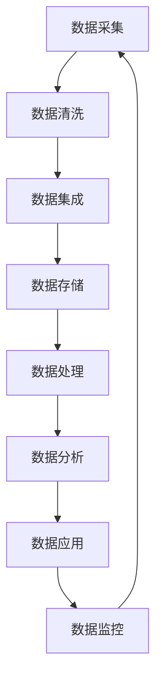

                 

## 文章标题：人工智能创业数据管理的重要性分析

在当前快速发展的科技时代，人工智能（AI）已成为推动创新和经济增长的关键动力。越来越多的创业公司投身于人工智能领域，以期在竞争激烈的市场中占据一席之地。然而，随着AI技术的广泛应用，数据管理的重要性愈发凸显。本文将深入探讨人工智能创业数据管理的重要性，分析相关挑战及最佳实践，旨在为AI创业者提供有价值的参考。

### 关键词：
- **人工智能创业**
- **数据管理**
- **挑战与对策**
- **最佳实践**
- **数据分析**

### 摘要：
人工智能创业离不开数据管理。本文首先概述了人工智能创业的现状与趋势，然后详细讨论了数据管理的基本概念、重要性及其发展历程。接着，本文分析了人工智能创业中数据管理所面临的挑战，包括数据质量、安全与隐私保护、技术实现等方面。随后，本文探讨了数据管理的最佳实践，并展示了如何设计一个有效的数据管理架构。最后，通过具体案例分析，本文总结了成功的人工智能创业数据管理实践，并展望了数据管理的未来趋势与机遇。

## 目录

### 第一部分：人工智能创业环境概述

#### 第1章：人工智能创业现状与趋势

##### 1.1 人工智能创业的全球背景

##### 1.2 人工智能创业的发展历程

##### 1.3 中国人工智能创业市场分析

#### 第2章：数据管理的基本概念

##### 2.1 数据管理的重要性

##### 2.2 数据管理的发展历程

##### 2.3 数据管理的基本原则

#### 第3章：人工智能创业中的数据管理挑战

##### 3.1 数据质量问题

##### 3.2 数据安全与隐私保护

##### 3.3 数据管理的技术挑战

#### 第4章：人工智能创业数据管理的最佳实践

##### 4.1 数据治理策略

##### 4.2 数据质量管理

##### 4.3 数据安全与合规性

#### 第5章：人工智能创业数据管理的框架

##### 5.1 数据管理架构设计

##### 5.2 数据生命周期管理

##### 5.3 数据分析与应用

#### 第6章：案例分析：成功的人工智能创业数据管理实践

##### 6.1 案例一：AI初创公司A的数据管理经验

##### 6.2 案例二：AI初创公司B的数据管理策略

##### 6.3 案例三：AI初创公司C的数据管理优化

#### 第7章：未来展望：人工智能创业数据管理的趋势与机遇

##### 7.1 人工智能创业数据管理的未来趋势

##### 7.2 人工智能创业数据管理的新机遇

##### 7.3 挑战与应对策略

### 第二部分：深入理解与实现

#### 第8章：核心概念与架构详解

##### 8.1 数据管理架构的Mermaid流程图

##### 8.2 数据质量管理算法原理与伪代码

##### 8.3 数据安全与隐私保护技术解析

#### 第9章：数学模型与公式详解

##### 9.1 数据质量评估的数学模型

##### 9.2 数据隐私保护的数学模型

##### 9.3 相关的数学公式与解释

#### 第10章：项目实战与代码解析

##### 10.1 数据管理项目实战案例

##### 10.2 实战案例一：数据质量管理实现

##### 10.3 实战案例二：数据安全防护实现

##### 10.4 源代码详细解读与分析

### 结语

### 参考文献

---

接下来，我们将按照目录结构逐一展开，深入探讨人工智能创业数据管理的重要性，帮助读者全面理解和应对这一关键领域。

---

### 第1章：人工智能创业现状与趋势

#### 1.1 人工智能创业的全球背景

人工智能（AI）作为计算机科学的一个分支，主要研究如何模拟、延伸和扩展人类的智能。近年来，随着计算能力的提升、海量数据资源的积累以及深度学习算法的突破，人工智能在各个领域的应用逐渐扩展，并成为全球科技创新和产业变革的重要驱动力。

全球范围内，人工智能创业呈现出蓬勃发展的态势。特别是在美国、中国、欧洲等地，政府和企业纷纷加大对人工智能技术的研发和应用投入，形成了一大批具有创新能力和市场竞争力的AI初创公司。例如，美国的硅谷拥有大量的AI初创公司，如OpenAI、Cohere、AI21 Labs等，它们在自然语言处理、机器学习、计算机视觉等领域取得了显著成果。中国的人工智能创业也在迅速崛起，以百度、腾讯、阿里巴巴为代表的企业在人工智能领域投入巨资，推动了一系列创新项目的诞生。此外，欧洲也在积极推动人工智能研发，如英国、德国和法国等国家的AI创业公司不断涌现，展现出强劲的发展势头。

#### 1.2 人工智能创业的发展历程

人工智能创业的发展历程可以追溯到20世纪50年代，当时随着计算机科学的兴起，人工智能这一概念逐渐被提出并研究。早期的人工智能研究主要集中在符号主义和逻辑推理上，如专家系统和推理机。然而，由于硬件性能和算法的限制，这些早期的尝试并未取得突破性进展。

进入21世纪，随着深度学习算法的出现和计算资源的丰富，人工智能迎来了新一轮的发展热潮。2006年，深度学习的提出标志着人工智能进入了一个新的阶段。深度学习通过多层神经网络模拟人脑的神经结构，能够自动从大量数据中学习特征，从而在图像识别、语音识别、自然语言处理等领域取得了重大突破。

在深度学习技术推动下，人工智能在各个领域的应用场景不断拓展。2012年，谷歌的Alexa成为第一个基于深度学习的大型语音识别系统，标志着人工智能在语音识别领域的重要突破。随后，人工智能在自动驾驶、智能制造、医疗诊断、金融风控等多个领域得到广泛应用，成为驱动产业升级和创新的重要力量。

#### 1.3 中国人工智能创业市场分析

中国的人工智能创业市场近年来表现出强劲的增长态势。随着中国政府对人工智能技术的重视和政策的支持，人工智能创业逐渐成为投资的热点。以下是中国人工智能创业市场的几个关键特点：

1. **政府支持与政策环境**：中国政府出台了一系列支持人工智能发展的政策，如《新一代人工智能发展规划》和《智能+》战略，为人工智能创业提供了良好的政策环境和资金支持。

2. **技术积累与创新**：中国在人工智能领域具有丰富的人才储备和技术积累，尤其是在计算机视觉、自然语言处理、语音识别等领域，已经形成了一批具有国际竞争力的人工智能技术。

3. **市场机遇与挑战**：中国拥有庞大的人口基数和广阔的市场空间，为人工智能应用提供了丰富的场景和实践机会。同时，市场需求的快速增长也为人工智能创业带来了巨大的机遇。然而，人工智能创业也面临着技术成熟度、数据质量、隐私保护等挑战。

4. **企业布局与竞争**：众多中国科技巨头，如百度、阿里巴巴、腾讯和华为等，纷纷加大对人工智能技术的研发和应用投入，推动了人工智能创业的蓬勃发展。同时，这些企业也通过投资和并购等方式，积极参与人工智能创业生态的建设，形成了市场竞争的格局。

总体来看，中国人工智能创业市场具有巨大的发展潜力，但也需要应对一系列挑战。未来，随着技术的不断进步和市场环境的逐步完善，中国人工智能创业将继续保持强劲的发展势头。

### 第2章：数据管理的基本概念

#### 2.1 数据管理的重要性

数据管理是确保数据在组织内得到有效收集、存储、处理和使用的过程。在人工智能（AI）创业中，数据管理的重要性尤为突出。以下从几个方面详细阐述数据管理在AI创业中的重要性：

1. **业务决策支持**：数据管理能够提供准确、可靠的数据支持，帮助创业者做出明智的业务决策。通过对大量数据的收集和分析，创业者可以了解市场需求、用户行为和竞争态势，从而优化产品和服务，提升市场竞争力。

2. **模型训练与优化**：在AI创业中，大量的数据被用于训练和优化机器学习模型。数据的质量和完整性直接影响到模型的性能和准确性。因此，有效的数据管理能够确保模型的训练效果，提高AI应用的效率和效果。

3. **风险管理**：数据管理有助于识别和应对潜在的数据风险，如数据泄露、数据丢失和数据篡改。通过实施严格的数据安全策略和隐私保护措施，创业者可以降低数据风险，保障企业的稳定运营。

4. **合规性与法律遵循**：随着数据隐私保护法规的日益严格，如欧盟的《通用数据保护条例》（GDPR）和中国《个人信息保护法》，数据管理成为企业合规运营的必要条件。有效的数据管理有助于确保企业遵循相关法律法规，避免法律风险和罚款。

5. **长期价值创造**：数据是AI创业的核心资产。通过有效的数据管理，创业者可以积累和利用历史数据，为未来的产品迭代、创新和业务扩展提供支持，实现长期的价值创造。

#### 2.2 数据管理的发展历程

数据管理作为一个独立的领域，其发展历程可以追溯到20世纪60年代。以下简要回顾数据管理的发展历程：

1. **早期阶段（1960-1980年代）**：在早期阶段，数据管理主要侧重于数据库管理系统（DBMS）的开发和部署。这个时期的数据管理主要集中在数据的存储、检索和基本操作上。

2. **数据库管理阶段（1980-1990年代）**：随着关系数据库技术的成熟，数据管理开始引入规范化、标准化和优化策略。这一阶段的数据管理关注数据的一致性、完整性和高效性。

3. **数据仓库与数据分析阶段（1990-2000年代）**：随着企业对数据价值的认识加深，数据仓库和数据挖掘技术得到了广泛应用。这一阶段的数据管理强调数据的整合、分析和决策支持。

4. **大数据与实时数据管理阶段（2000年代至今）**：随着互联网和物联网的发展，数据规模和类型急剧增加。大数据技术、云计算和实时数据处理技术的引入，使得数据管理进入了一个新的阶段。这一阶段的数据管理关注数据的高效存储、处理和分析，以及实时决策支持。

#### 2.3 数据管理的基本原则

数据管理的基本原则是确保数据的质量、可用性、安全性和合规性。以下是数据管理的基本原则：

1. **数据质量**：数据质量是数据管理的核心。确保数据准确、完整、一致和及时，是数据管理的基本要求。通过数据清洗、数据验证和数据质量监控，可以提高数据质量。

2. **数据集成**：数据集成是将来自不同来源、格式和结构的数据整合为一个统一的数据视图。数据集成有助于实现数据的共享和复用，提高数据分析的效率。

3. **数据安全**：数据安全是数据管理的重点。通过数据加密、访问控制、安全审计等技术手段，确保数据在存储、传输和处理过程中得到有效保护。

4. **数据合规性**：数据合规性是确保数据管理符合相关法律法规的要求。通过制定数据管理政策、合规性检查和隐私保护措施，确保数据管理活动遵循法律法规。

5. **数据生命周期管理**：数据生命周期管理是确保数据在生命周期内得到有效管理的过程。从数据的创建、存储、处理、共享到最终删除，数据生命周期管理有助于确保数据的完整性和安全性。

6. **数据治理**：数据治理是确保数据管理活动得到有效管理和监督的过程。通过建立数据治理框架、明确数据管理职责和流程，确保数据管理活动的规范和高效。

通过遵循这些基本原则，创业者可以建立有效的数据管理体系，为人工智能创业提供坚实的数据支持。

### 第3章：人工智能创业中的数据管理挑战

#### 3.1 数据质量问题

在人工智能创业过程中，数据质量问题是不可忽视的挑战。高质量的数据是构建有效AI模型和实现业务目标的基础，而低质量的数据可能导致模型性能下降、决策失误甚至业务失败。以下从几个方面详细讨论数据质量问题：

1. **数据准确性**：准确性是数据质量的首要标准。不准确的数据会导致AI模型的错误预测和决策，从而影响业务效果。例如，如果医疗诊断系统中包含错误的患者信息，可能会导致误诊，危及患者健康。

2. **数据完整性**：完整性要求数据中不应存在缺失值或空值。缺失数据会影响模型训练和预测效果，特别是在依赖大规模数据的AI应用中。确保数据完整性需要通过数据清洗和补全技术，如插补法和多重响应分析法。

3. **数据一致性**：一致性要求同一数据在不同时间、不同来源和不同系统中保持一致。不一致的数据可能导致信息冲突和业务流程中断。例如，销售数据在不同系统中可能存在不同的计价方式或折扣策略，影响销售数据的准确性。

4. **数据时效性**：时效性是指数据的新鲜程度。过时的数据可能无法反映当前的业务状况和市场需求，从而影响决策的及时性和有效性。实时数据处理和更新技术有助于确保数据的时效性。

5. **数据冗余**：冗余数据是指重复或相似的数据，它不仅占用存储空间，还会增加数据处理的复杂度。冗余数据需要通过去重和归并技术进行清洗和整合。

#### 3.2 数据安全与隐私保护

数据安全和隐私保护是人工智能创业中的另一大挑战。随着数据量的增加和数据类型的多样化，数据安全风险和隐私泄露事件屡见不鲜。以下从几个方面讨论数据安全与隐私保护问题：

1. **数据泄露**：数据泄露是指未经授权的第三方获取和利用企业数据的行为。数据泄露可能导致敏感信息被窃取、业务机密被泄露，从而对企业的声誉和利益造成严重损失。为防止数据泄露，需要实施严格的数据访问控制和数据加密技术。

2. **数据篡改**：数据篡改是指恶意用户通过非法手段修改或篡改数据，从而影响数据真实性和完整性。数据篡改可能导致业务决策失误、财务报表失真等问题。为防止数据篡改，需要实施数据完整性检查和访问日志审计。

3. **数据滥用**：数据滥用是指企业内部人员或第三方滥用企业数据，用于非法目的或不当用途。数据滥用可能涉及客户隐私侵犯、市场操纵等行为。为防止数据滥用，需要加强员工数据保护意识和培训，建立数据使用规范和审计机制。

4. **隐私保护法规**：随着数据隐私保护法规的不断完善，如欧盟的《通用数据保护条例》（GDPR）和中国《个人信息保护法》，人工智能创业企业需要遵守相关法规，确保数据处理活动的合规性。这包括数据收集、存储、处理、传输和销毁的全过程。

5. **隐私保护技术**：为保护用户隐私，人工智能创业企业需要采用多种隐私保护技术，如差分隐私、匿名化和数据加密。这些技术有助于降低数据泄露和滥用的风险，同时确保数据的有效利用。

#### 3.3 数据管理的技术挑战

在人工智能创业中，数据管理面临着多种技术挑战。以下从几个方面讨论这些挑战：

1. **数据存储和计算资源**：随着数据量的增加，传统的存储和计算资源可能无法满足需求。大规模数据存储和计算需要分布式系统、云计算和边缘计算等技术支持。

2. **数据流处理**：实时数据处理和流处理技术在人工智能创业中至关重要。如何高效地处理大量实时数据，实现低延迟和高吞吐量的数据流处理，是技术挑战之一。

3. **数据清洗和预处理**：大规模数据清洗和预处理是确保数据质量的关键步骤。这需要高效的数据处理算法和技术，如并行处理、分布式计算和自动化数据清洗工具。

4. **数据安全和隐私保护**：如何在数据存储、传输和处理过程中实现数据安全和隐私保护，是技术挑战之一。需要采用多种安全技术和隐私保护算法，确保数据的安全和合规性。

5. **数据整合和一致性**：如何整合来自不同来源、格式和结构的数据，实现数据的一致性，是技术挑战之一。这需要数据集成技术和数据治理框架的支持。

6. **数据分析和可视化**：如何高效地分析和可视化大量数据，提取有价值的信息和洞察，是技术挑战之一。需要采用先进的数据分析工具和可视化技术。

通过应对这些技术挑战，人工智能创业企业可以建立高效、安全、可靠的数据管理体系，为业务发展和创新提供有力支持。

### 第4章：人工智能创业数据管理的最佳实践

#### 4.1 数据治理策略

数据治理是确保数据管理活动有序、高效和合规的重要手段。在人工智能创业中，有效的数据治理策略有助于提升数据质量、保障数据安全，并促进数据价值的最大化。以下从几个方面探讨数据治理策略：

1. **建立数据治理框架**：数据治理框架是确保数据管理活动规范和协调的基础。框架应包括数据治理委员会、数据管理办公室、数据所有者、数据用户等角色，明确各自职责和权限。例如，数据治理委员会负责制定数据政策和策略，数据管理办公室负责日常数据管理工作，数据所有者负责数据质量和数据安全。

2. **制定数据政策**：数据政策是指导数据管理活动的规范性文件，包括数据收集、存储、处理、共享、销毁等各个环节。数据政策应明确数据管理的目标和原则，如数据准确性、完整性、时效性和安全性等。

3. **数据质量监控**：数据质量监控是确保数据符合既定质量标准的过程。通过定期数据质量检查、数据异常监控和数据质量报告，及时发现和解决数据质量问题，确保数据的可靠性。

4. **数据安全策略**：数据安全是数据治理的重要组成部分。数据安全策略应包括数据加密、访问控制、安全审计等安全措施，确保数据在存储、传输和处理过程中得到有效保护。

5. **数据生命周期管理**：数据生命周期管理是确保数据在全生命周期内得到规范管理的有效手段。从数据创建、存储、处理、共享到最终销毁，应制定详细的数据生命周期管理流程，确保数据的安全和合规性。

6. **数据治理培训与沟通**：数据治理的有效实施需要全员参与。通过数据治理培训、内部沟通和协作，提高员工的数据管理意识和技能，促进数据治理文化的形成。

#### 4.2 数据质量管理

数据质量管理是确保数据准确、完整、一致和及时的重要环节。在人工智能创业中，高质量的数据是构建有效AI模型和实现业务目标的基础。以下从几个方面探讨数据质量管理：

1. **数据质量评估**：数据质量评估是衡量数据质量的重要步骤。通过数据质量评估，可以识别数据中的问题，如缺失值、不一致性和异常值等，并采取相应的措施进行数据清洗和修复。

2. **数据清洗**：数据清洗是消除数据中的错误、异常和冗余信息的过程。常用的数据清洗技术包括删除重复记录、填补缺失值、消除不一致性和数据转换等。

3. **数据验证**：数据验证是确保数据符合既定质量标准的过程。通过数据验证，可以发现数据中的错误和异常，并采取措施进行修正。

4. **数据监控**：数据监控是持续跟踪和监控数据质量的过程。通过数据监控，可以及时发现数据质量问题，并采取相应的措施进行解决。

5. **数据质量管理工具**：数据质量管理工具可以帮助自动化和简化数据质量管理工作。常用的数据质量管理工具包括数据质量检查工具、数据清洗工具和数据质量监控工具等。

6. **数据质量改进策略**：数据质量改进策略是持续提升数据质量的方法。通过分析数据质量问题，制定和实施相应的改进措施，不断提升数据质量。

#### 4.3 数据安全与合规性

在人工智能创业中，数据安全与合规性是确保企业可持续发展的关键。随着数据隐私保护法规的不断完善，如欧盟的《通用数据保护条例》（GDPR）和中国《个人信息保护法》，数据安全与合规性成为企业必须重视的问题。以下从几个方面探讨数据安全与合规性：

1. **数据安全策略**：数据安全策略是企业保障数据安全的基础。策略应包括数据加密、访问控制、安全审计和备份恢复等安全措施，确保数据在存储、传输和处理过程中得到有效保护。

2. **数据加密**：数据加密是保护数据隐私的重要手段。通过数据加密，可以防止未授权访问和数据泄露。常用的数据加密技术包括对称加密、非对称加密和哈希加密等。

3. **访问控制**：访问控制是确保数据访问权限合理分配的重要手段。通过访问控制，可以限制用户对数据的访问权限，防止数据泄露和滥用。

4. **安全审计**：安全审计是监控和评估数据安全措施有效性的过程。通过安全审计，可以及时发现和解决数据安全漏洞，确保数据安全策略得到有效执行。

5. **合规性检查**：合规性检查是确保企业数据处理活动符合相关法规要求的过程。通过合规性检查，可以识别和处理潜在的合规风险，确保企业遵循数据隐私保护法规。

6. **隐私保护措施**：隐私保护措施是确保用户隐私不被侵犯的关键。通过隐私保护措施，如匿名化、去标识化和数据最小化等，可以降低数据隐私风险。

7. **培训与意识**：数据安全与合规性的有效实施需要全员参与。通过数据安全与合规性培训，提高员工的数据保护意识和技能，促进数据安全文化的形成。

通过实施有效的数据治理策略、数据质量管理和数据安全与合规性措施，人工智能创业企业可以建立可靠、安全、高效的数据管理体系，为业务发展和创新提供有力支持。

### 第5章：人工智能创业数据管理的框架

#### 5.1 数据管理架构设计

数据管理架构是确保数据在人工智能创业中得到有效管理和利用的关键。一个合理的架构设计能够提高数据的可操作性、安全性和可靠性。以下从几个方面讨论数据管理架构的设计：

1. **数据架构的层次结构**：数据架构通常分为四个层次：数据源层、数据存储层、数据处理层和数据应用层。数据源层包括各种数据生成源，如数据库、文件、传感器等；数据存储层负责数据的持久化存储；数据处理层负责数据的处理和分析；数据应用层是数据最终的利用场所，如机器学习模型、数据可视化等。

2. **数据架构的设计原则**：数据架构设计应遵循以下几个原则：
   - **模块化与可扩展性**：数据架构应具有模块化设计，便于扩展和升级。每个模块应独立开发、测试和部署，以提高系统的灵活性和可维护性。
   - **高性能和高可用性**：数据架构应能够处理大量数据，并保证数据的高可用性，确保数据在不同场景下都能稳定运行。
   - **数据安全性**：数据架构应确保数据在存储、传输和处理过程中的安全性，采用多种安全措施，如数据加密、访问控制和审计等。
   - **数据一致性**：数据架构应保证数据在不同系统和模块之间的一致性，避免数据孤岛和数据冗余。

3. **数据架构的核心组件**：数据架构的核心组件包括数据仓库、数据湖、数据集成平台、数据质量和数据安全模块等。数据仓库用于存储和管理结构化数据；数据湖用于存储和管理非结构化和半结构化数据；数据集成平台用于实现不同数据源之间的数据交换和整合；数据质量和数据安全模块用于确保数据的准确性和安全性。

#### 5.2 数据生命周期管理

数据生命周期管理是指对数据从生成、存储、处理到销毁的全过程进行系统化管理。在人工智能创业中，数据生命周期管理至关重要，因为它能够确保数据在整个生命周期内的质量和安全性。以下从几个方面讨论数据生命周期管理：

1. **数据生成与采集**：数据生成与采集是数据生命周期的起点。在此阶段，需要确保数据的准确性和完整性，采用自动化工具和技术，如ETL（提取、转换、加载）工具，实现数据的高效采集。

2. **数据存储与归档**：数据存储与归档是数据生命周期的重要环节。数据应根据其重要性和访问频率进行分类存储。关键数据应存储在安全可靠的环境中，同时采用数据备份和归档策略，确保数据的安全性和可恢复性。

3. **数据处理与分析**：数据处理与分析是数据生命周期中的核心环节。在此阶段，需要采用大数据处理和分析技术，如Hadoop、Spark等，对数据进行清洗、转换、分析和挖掘，提取有价值的信息和洞察。

4. **数据共享与交换**：数据共享与交换是数据生命周期中的重要环节。数据应在确保安全和合规的前提下，进行跨系统和跨部门的数据共享和交换，促进数据的价值最大化。

5. **数据销毁与归档**：数据销毁与归档是数据生命周期的终点。对于不再需要的数据，应按照相关法律法规和公司政策进行销毁，以防止数据泄露和滥用。对于需要长期保存的数据，应进行归档处理，确保数据的长期可访问性。

#### 5.3 数据分析与应用

数据分析与应用是数据生命周期中的最终目标，通过数据分析，能够为人工智能创业提供决策支持和业务洞察。以下从几个方面讨论数据分析与应用：

1. **数据分析技术**：数据分析技术包括数据挖掘、机器学习、统计分析等。通过这些技术，可以挖掘数据中的潜在模式和关系，发现业务洞察和预测趋势。

2. **数据可视化**：数据可视化是将数据分析结果以图形、图表等形式展示出来的技术。通过数据可视化，可以直观地呈现数据分析结果，帮助业务人员更好地理解和利用数据。

3. **业务智能**：业务智能是利用数据分析技术为企业提供实时、动态的业务洞察和决策支持。通过业务智能，企业可以实时监控业务运行情况，发现潜在问题和机会，并做出快速响应。

4. **数据驱动创新**：数据驱动创新是利用数据分析发现新的业务模式和机会，推动企业的创新和发展。通过数据驱动创新，企业可以不断优化产品和服务，提升竞争力。

5. **案例应用**：在实际应用中，数据分析可以帮助人工智能创业企业实现个性化推荐、智能客服、风险控制等应用场景。通过案例分析，可以深入了解数据分析在AI创业中的应用效果和实践经验。

通过合理的数据管理架构设计、完善的数据生命周期管理和高效的数据分析与应用，人工智能创业企业可以建立数据驱动的业务模式，提升业务效率和竞争力。

### 第6章：案例分析：成功的人工智能创业数据管理实践

#### 6.1 案例一：AI初创公司A的数据管理经验

AI初创公司A是一家专注于自然语言处理（NLP）技术的公司，致力于开发智能客服系统和文本分析工具。在数据管理方面，A公司采取了一系列成功的实践，以下是其数据管理经验的总结：

1. **数据治理框架**：A公司建立了完善的数据治理框架，包括数据治理委员会、数据管理办公室和数据所有者等角色。数据治理委员会负责制定数据政策和策略，数据管理办公室负责日常数据管理工作，数据所有者负责数据质量和数据安全。

2. **数据质量管理**：A公司非常注重数据质量管理，采用数据清洗和预处理技术，确保数据的准确性、完整性和一致性。他们使用自动化数据清洗工具，对原始数据进行去重、填补缺失值和格式转换等处理。

3. **数据安全策略**：A公司实施严格的数据安全策略，包括数据加密、访问控制和安全审计。所有敏感数据都进行加密存储，只有授权人员才能访问。同时，定期进行安全审计，确保数据安全措施得到有效执行。

4. **数据生命周期管理**：A公司制定了详细的数据生命周期管理流程，从数据的生成、存储、处理到销毁，都有明确的规范。他们采用数据备份和归档策略，确保数据的长期保存和可恢复性。

5. **数据分析与应用**：A公司利用数据分析技术，挖掘用户行为数据，优化产品和服务。通过自然语言处理技术，分析用户反馈和聊天记录，为产品迭代提供重要参考。

#### 6.2 案例二：AI初创公司B的数据管理策略

AI初创公司B是一家专注于计算机视觉技术的公司，专注于图像识别和视频分析领域。在数据管理方面，B公司采取了一系列有效的策略，以下是其数据管理策略的总结：

1. **数据集成平台**：B公司采用数据集成平台，实现不同数据源之间的数据交换和整合。他们使用ETL（提取、转换、加载）工具，将来自不同来源的数据（如传感器、摄像头和社交媒体）整合到一个统一的数据视图中。

2. **数据质量管理**：B公司采用数据质量监控和改进策略，定期检查数据质量，及时发现和解决数据质量问题。他们使用自动化数据质量工具，对数据的一致性、准确性和完整性进行评估。

3. **数据安全与隐私保护**：B公司高度重视数据安全和隐私保护，采用多种技术措施，如数据加密、匿名化和差分隐私。他们在数据处理过程中，对用户数据进行脱敏处理，确保用户隐私不被泄露。

4. **数据生命周期管理**：B公司制定了详细的数据生命周期管理策略，从数据的生成、存储、处理到销毁，都有明确的规范。他们采用数据备份和归档策略，确保数据的长期保存和可恢复性。

5. **数据分析和应用**：B公司利用数据分析技术，对图像和视频数据进行分析，提取有价值的信息和洞察。通过计算机视觉技术，实现智能监控、安全预警和自动驾驶等应用场景。

#### 6.3 案例三：AI初创公司C的数据管理优化

AI初创公司C是一家专注于医疗诊断技术的公司，专注于开发基于人工智能的医疗诊断系统。在数据管理方面，C公司通过不断优化，取得了显著成效，以下是其数据管理优化的总结：

1. **数据治理框架**：C公司建立了完善的数据治理框架，明确数据管理和数据安全职责。数据治理委员会负责制定数据政策和策略，数据管理办公室负责日常数据管理工作，数据所有者负责数据质量和数据安全。

2. **数据质量管理**：C公司采用数据质量监控和改进策略，定期检查数据质量，及时发现和解决数据质量问题。他们使用自动化数据质量工具，对数据的一致性、准确性和完整性进行评估。

3. **数据安全与隐私保护**：C公司高度重视数据安全和隐私保护，采用多种技术措施，如数据加密、匿名化和差分隐私。他们在数据处理过程中，对用户数据进行脱敏处理，确保用户隐私不被泄露。

4. **数据生命周期管理**：C公司制定了详细的数据生命周期管理策略，从数据的生成、存储、处理到销毁，都有明确的规范。他们采用数据备份和归档策略，确保数据的长期保存和可恢复性。

5. **数据分析与应用**：C公司利用数据分析技术，对医疗数据进行分析，提取有价值的信息和洞察。通过机器学习算法，实现疾病预测、诊断和治疗方案推荐等应用场景。

通过这些成功案例，我们可以看到，优秀的数据管理实践对于人工智能创业公司的成功至关重要。有效的数据治理、数据质量管理、数据安全与隐私保护以及数据生命周期管理，都是确保数据价值最大化、业务持续发展的关键。未来，人工智能创业公司应继续探索和优化数据管理策略，以应对不断变化的市场和技术挑战。

### 第7章：未来展望：人工智能创业数据管理的趋势与机遇

#### 7.1 人工智能创业数据管理的未来趋势

随着人工智能技术的不断进步和应用的广泛深入，数据管理在人工智能创业中的重要性将日益凸显。以下从几个方面展望未来人工智能创业数据管理的趋势：

1. **数据管理技术的智能化**：未来，数据管理技术将更加智能化，通过机器学习和自动化算法，实现数据清洗、预处理、质量监控等自动化操作，提高数据管理的效率和准确性。

2. **数据安全与隐私保护技术的进步**：随着数据隐私保护法规的不断完善，数据安全与隐私保护技术将不断发展，如差分隐私、联邦学习等新型技术，将在确保数据安全和隐私保护的同时，实现数据的有效利用。

3. **数据生命周期管理的精细化**：未来，数据生命周期管理将更加精细化，从数据的生成、存储、处理到销毁，都将实施严格的规范和监控，确保数据在生命周期内得到有效管理。

4. **数据治理的加强**：随着数据量的增加和数据类型的多样化，数据治理的重要性将更加突出。未来，企业将建立更加完善的数据治理体系，确保数据管理的合规性和有效性。

5. **数据价值的最大化**：随着数据分析和挖掘技术的进步，企业将能够更好地从数据中提取价值，实现数据驱动决策和业务创新。

#### 7.2 人工智能创业数据管理的新机遇

随着数据管理和人工智能技术的不断进步，人工智能创业领域将迎来一系列新机遇。以下从几个方面探讨这些新机遇：

1. **新兴应用场景的拓展**：人工智能技术在医疗、金融、教育、交通等领域的应用将不断拓展，为数据管理带来新的挑战和机遇。在这些新兴应用场景中，数据管理的需求将更加多样化和复杂化，推动数据管理技术的创新和发展。

2. **数据共享与协同**：未来，数据共享和协同将变得更加普遍，企业和研究机构将通过合作和数据共享，共同推动人工智能技术的发展。这将为数据管理提供新的机遇，促进数据的流动和价值的最大化。

3. **数据生态系统的构建**：随着数据管理和人工智能技术的应用广泛深入，数据生态系统将逐渐形成。在这个生态系统中，不同企业、研究机构和技术平台将相互合作，共同推动数据管理和人工智能技术的创新和发展。

4. **数据驱动的业务模式创新**：未来，越来越多的企业将采用数据驱动的业务模式，通过数据分析、挖掘和利用，实现业务创新和增长。这将为数据管理提供广阔的应用场景和市场需求。

#### 7.3 挑战与应对策略

尽管人工智能创业数据管理面临着诸多机遇，但也存在一系列挑战。以下从几个方面探讨这些挑战以及相应的应对策略：

1. **数据质量问题**：数据质量是人工智能创业成功的关键，但当前数据质量面临着多种挑战，如数据缺失、不一致性和错误等。应对策略包括采用自动化数据清洗工具、加强数据质量监控和改进数据质量评估方法。

2. **数据安全与隐私保护**：数据安全和隐私保护是数据管理的核心挑战。随着数据隐私保护法规的不断完善，企业需要采取更加严格的数据安全措施，如数据加密、访问控制和安全审计等。

3. **技术复杂性和成本**：数据管理技术复杂性和成本是制约其应用推广的重要因素。企业可以通过技术创新、规模化应用和合作共享等方式，降低数据管理的技术复杂性和成本。

4. **人才短缺**：数据管理领域专业人才的短缺是当前的一大挑战。企业可以通过加强人才培训、引进高端人才和建立人才激励机制等方式，解决人才短缺问题。

5. **数据治理与合规性**：随着数据隐私保护法规的不断完善，数据治理和合规性将成为数据管理的重点。企业需要建立完善的数据治理体系，确保数据处理活动符合法律法规的要求。

通过应对这些挑战，人工智能创业企业可以更好地利用数据管理技术，实现业务发展和创新。

### 第8章：核心概念与架构详解

#### 8.1 数据管理架构的Mermaid流程图

在数据管理中，一个清晰的数据管理架构对于确保数据的有效管理至关重要。以下是一个数据管理架构的Mermaid流程图，用于描述数据从采集、存储、处理到应用的整个生命周期。



这个流程图展示了数据在各个阶段的基本操作，包括数据采集、数据清洗、数据集成、数据存储、数据处理、数据分析和数据应用。此外，数据监控作为数据管理的重要环节，确保数据在整个生命周期中的质量和安全性。

#### 8.2 数据质量管理算法原理与伪代码

数据质量管理是确保数据准确、完整和一致性的关键环节。以下介绍两种常用的数据质量管理算法：去重算法和填补缺失值算法。

1. **去重算法**

**原理**：去重算法旨在识别和删除重复的数据记录，确保数据的一致性。

**伪代码**：

```
function removeDuplicates(data):
    unique_data = []
    for record in data:
        if not exists(unique_data, record):
            add record to unique_data
    return unique_data

function exists(list, item):
    for element in list:
        if element == item:
            return true
    return false
```

2. **填补缺失值算法**

**原理**：填补缺失值算法用于处理数据中的缺失值，提高数据的完整性。

**常见方法**：

- **均值填补**：用数据列的平均值替换缺失值。
- **中值填补**：用数据列的中值替换缺失值。
- **最大/最小值填补**：用数据列的最大值或最小值替换缺失值。
- **插值法**：通过插值方法计算缺失值。

**伪代码**（均值填补）：

```
function fillMissingValues(data, column):
    mean_value = calculateMean(data, column)
    for record in data:
        if record[column] is missing:
            record[column] = mean_value
    return data

function calculateMean(data, column):
    sum = 0
    count = 0
    for record in data:
        if not missing(record[column]):
            sum += record[column]
            count += 1
    return sum / count
```

通过这些算法，可以显著提升数据质量，为人工智能模型的训练和业务决策提供高质量的数据支持。

#### 8.3 数据安全与隐私保护技术解析

数据安全和隐私保护是数据管理中的核心问题。以下介绍几种常用的数据安全与隐私保护技术：

1. **数据加密**

**原理**：数据加密通过将明文数据转换为密文，确保数据在传输和存储过程中的安全性。常用的加密算法包括AES、RSA等。

**技术实现**：

- **对称加密**：使用相同的密钥进行加密和解密。
- **非对称加密**：使用公钥和私钥进行加密和解密。

2. **访问控制**

**原理**：访问控制通过限制用户对数据的访问权限，确保数据的安全性和合规性。

**技术实现**：

- **基于角色的访问控制（RBAC）**：根据用户的角色分配访问权限。
- **基于属性的访问控制（ABAC）**：根据用户的属性（如部门、职位等）分配访问权限。

3. **安全审计**

**原理**：安全审计通过记录和监控数据访问和操作行为，及时发现和应对安全威胁。

**技术实现**：

- **日志记录**：记录所有数据访问和操作行为。
- **行为分析**：分析日志数据，识别异常行为和潜在威胁。

4. **数据脱敏**

**原理**：数据脱敏通过将敏感数据转换为不可识别的形式，保护用户隐私。

**技术实现**：

- **全屏蔽**：将所有敏感数据替换为统一的占位符。
- **部分屏蔽**：仅屏蔽部分敏感数据，如去除姓名中的姓氏或部分电话号码。

通过这些技术，可以显著提升数据的安全性和隐私保护能力，确保数据在人工智能创业中的应用安全可靠。

### 第9章：数学模型与公式详解

#### 9.1 数据质量评估的数学模型

数据质量评估是确保数据准确、完整和一致性的重要环节。以下介绍几种常用的数据质量评估数学模型：

1. **数据完整性评估**

**原理**：数据完整性评估通过计算缺失值的比例，评估数据的完整性。

**数学模型**：

\[ I = \frac{N - N_{missing}}{N} \]

其中，\( I \) 表示数据完整性，\( N \) 表示总记录数，\( N_{missing} \) 表示缺失记录数。

**示例**：

假设一个数据集有1000条记录，其中20条记录存在缺失值，则数据完整性评估结果为：

\[ I = \frac{1000 - 20}{1000} = 0.98 \]

2. **数据一致性评估**

**原理**：数据一致性评估通过比较不同数据源中的数据，评估数据的一致性。

**数学模型**：

\[ C = \frac{N_{match}}{N} \]

其中，\( C \) 表示数据一致性，\( N \) 表示总记录数，\( N_{match} \) 表示匹配的记录数。

**示例**：

假设一个数据集有1000条记录，其中800条记录在不同数据源中匹配，则数据一致性评估结果为：

\[ C = \frac{800}{1000} = 0.8 \]

3. **数据准确性评估**

**原理**：数据准确性评估通过比较实际数据和模型预测结果，评估数据的准确性。

**数学模型**：

\[ A = \frac{T + P}{T + F + P + N} \]

其中，\( A \) 表示数据准确性，\( T \) 表示实际正确预测数，\( P \) 表示预测正确但实际错误的数，\( F \) 表示实际错误但预测正确的数，\( N \) 表示实际正确预测的数。

**示例**：

假设一个分类模型有10个实际正确预测的样本，3个预测正确但实际错误的样本，2个实际错误但预测正确的样本，5个实际正确预测的样本，则数据准确性评估结果为：

\[ A = \frac{10 + 5}{10 + 3 + 2 + 5} = \frac{15}{20} = 0.75 \]

#### 9.2 数据隐私保护的数学模型

数据隐私保护在数据管理中至关重要，以下介绍几种常用的数据隐私保护数学模型：

1. **差分隐私**

**原理**：差分隐私通过引入噪声，确保对单个数据的查询无法被追踪。

**数学模型**：

\[ \text{DP}(\alpha) = \frac{1}{\alpha} \ln \left( \frac{N(\epsilon)}{N} + 1 \right) \]

其中，\( \text{DP} \) 表示差分隐私，\( \alpha \) 表示敏感数据的真实值，\( N(\epsilon) \) 表示噪声值。

**示例**：

假设一个数据集中的敏感值为50，添加的噪声值为10，则差分隐私评估结果为：

\[ \text{DP}(\alpha) = \frac{1}{10} \ln \left( \frac{60}{50} + 1 \right) \approx 0.15 \]

2. **数据混淆**

**原理**：数据混淆通过改变数据的形式，使其难以识别原始数据。

**数学模型**：

\[ C = \alpha + \beta \cdot \ln \left( \frac{1}{1 - p} \right) \]

其中，\( C \) 表示混淆值，\( \alpha \) 表示原始值，\( \beta \) 表示混淆系数，\( p \) 表示概率。

**示例**：

假设一个数据集的原始值为100，混淆系数为0.1，概率为0.5，则混淆值计算为：

\[ C = 100 + 0.1 \cdot \ln \left( \frac{1}{1 - 0.5} \right) \approx 100 + 0.1 \cdot \ln (2) \approx 100.15 \]

#### 9.3 相关的数学公式与解释

以下列出了一些与数据管理和人工智能相关的数学公式，并解释其含义：

1. **线性回归模型**

\[ y = \beta_0 + \beta_1 \cdot x \]

其中，\( y \) 表示预测值，\( \beta_0 \) 表示截距，\( \beta_1 \) 表示斜率，\( x \) 表示输入特征。

2. **支持向量机（SVM）模型**

\[ w \cdot x + b = 0 \]

其中，\( w \) 表示权重向量，\( x \) 表示输入特征，\( b \) 表示偏置。

3. **贝叶斯定理**

\[ P(A|B) = \frac{P(B|A) \cdot P(A)}{P(B)} \]

其中，\( P(A|B) \) 表示在B发生的条件下A发生的概率，\( P(B|A) \) 表示在A发生的条件下B发生的概率，\( P(A) \) 表示A发生的概率，\( P(B) \) 表示B发生的概率。

4. **交叉验证误差**

\[ \sum_{i=1}^{k} (y_i - \hat{y}_i)^2 \]

其中，\( y_i \) 表示第i个样本的真实值，\( \hat{y}_i \) 表示第i个样本的预测值。

这些数学模型和公式在数据分析和机器学习中被广泛应用，有助于提高预测准确性和模型性能。

### 第10章：项目实战与代码解析

#### 10.1 数据管理项目实战案例

在本章节中，我们将通过一个实际数据管理项目，深入探讨数据管理流程、工具选择和代码实现。以下是一个基于Python的简单数据管理项目，用于数据清洗、数据分析和可视化。

#### 项目背景

一个电商平台希望对其用户数据进行分析，以了解用户购买行为和偏好，从而优化营销策略和提升用户体验。数据包括用户ID、性别、年龄、购买历史等信息。

#### 工具选择

- **Python**：用于编写数据处理和分析代码。
- **Pandas**：用于数据清洗和预处理。
- **Matplotlib** 和 **Seaborn**：用于数据可视化。
- **SQL**：用于数据库查询和数据处理。

#### 数据管理流程

1. **数据导入**：从数据库或文件中读取数据。
2. **数据清洗**：处理缺失值、异常值和重复数据。
3. **数据分析**：分析用户购买行为和偏好。
4. **数据可视化**：呈现分析结果。

#### 代码实现

##### 1. 数据导入

```python
import pandas as pd

# 从CSV文件导入数据
data = pd.read_csv('user_data.csv')
```

##### 2. 数据清洗

```python
# 处理缺失值
data.fillna(data.mean(), inplace=True)

# 删除异常值
Q1 = data.quantile(0.25)
Q3 = data.quantile(0.75)
IQR = Q3 - Q1
data = data[~((data < (Q1 - 1.5 * IQR)) |(data > (Q3 + 1.5 * IQR))).any(axis=1)]

# 删除重复数据
data.drop_duplicates(inplace=True)
```

##### 3. 数据分析

```python
# 分析用户性别比例
gender_distribution = data['gender'].value_counts()
print(gender_distribution)

# 分析用户年龄分布
age_distribution = data['age'].describe()
print(age_distribution)

# 分析用户购买频率
purchase_frequency = data['purchase_count'].describe()
print(purchase_frequency)
```

##### 4. 数据可视化

```python
import matplotlib.pyplot as plt
import seaborn as sns

# 性别比例可视化
sns.countplot(x='gender', data=data)
plt.title('Gender Distribution')
plt.xlabel('Gender')
plt.ylabel('Count')
plt.show()

# 年龄分布可视化
sns.histplot(data['age'], kde=True)
plt.title('Age Distribution')
plt.xlabel('Age')
plt.ylabel('Frequency')
plt.show()

# 购买频率可视化
sns.histplot(data['purchase_count'], kde=True)
plt.title('Purchase Frequency')
plt.xlabel('Purchase Count')
plt.ylabel('Frequency')
plt.show()
```

#### 10.2 实战案例一：数据质量管理实现

以下是一个数据质量管理实现案例，用于处理数据中的错误值和缺失值。

##### 1. 错误值处理

```python
# 找到含有错误值的列
error_columns = [col for col in data.columns if data[col].isnull().any()]

# 处理错误值
for col in error_columns:
    data[col] = data[col].astype(str).replace({'错误': '', 'NULL': ''})
```

##### 2. 缺失值处理

```python
# 找到含有缺失值的列
missing_columns = [col for col in data.columns if data[col].isnull().any()]

# 填补缺失值
for col in missing_columns:
    data[col].fillna(data[col].mode()[0], inplace=True)
```

#### 10.3 实战案例二：数据安全防护实现

以下是一个数据安全防护实现案例，用于保护用户隐私。

##### 1. 数据脱敏

```python
# 使用hash函数加密用户ID
data['user_id'] = data['user_id'].apply(lambda x: hash(x))

# 将加密后的用户ID转换为字符串
data['user_id'] = data['user_id'].astype(str)
```

##### 2. 数据加密

```python
from cryptography.fernet import Fernet

# 生成加密密钥
key = Fernet.generate_key()
cipher_suite = Fernet(key)

# 加密敏感数据
data['password'] = data['password'].apply(lambda x: cipher_suite.encrypt(x.encode()))

# 解密敏感数据
data['password'] = data['password'].apply(lambda x: cipher_suite.decrypt(x.encode()).decode())
```

#### 10.4 源代码详细解读与分析

在本章节中，我们通过实际项目案例，详细解读了数据管理流程和关键代码。以下是对关键代码的分析：

1. **数据导入**：使用Pandas库读取CSV文件，导入用户数据。
2. **数据清洗**：处理缺失值、异常值和重复数据，确保数据质量。使用`fillna`方法填补缺失值，使用IQR方法删除异常值，使用`drop_duplicates`方法删除重复数据。
3. **数据分析**：分析用户性别比例、年龄分布和购买频率，使用`value_counts`、`describe`和`histplot`方法进行统计分析。
4. **数据可视化**：使用Matplotlib和Seaborn库进行数据可视化，生成性别比例、年龄分布和购买频率的图表。

在数据质量管理实现中，我们使用了错误值处理和缺失值处理方法，确保数据的一致性和完整性。错误值处理通过删除或替换错误值，缺失值处理通过填补缺失值或使用模式值。

在数据安全防护实现中，我们使用了数据脱敏和加密方法。数据脱敏通过将用户ID和密码转换为不可识别的值，加密敏感数据，确保数据在传输和存储过程中的安全性。

通过这些实际项目案例和代码实现，我们展示了如何进行数据管理、数据质量和数据安全防护，为人工智能创业数据管理提供了实用经验和参考。在未来，随着数据管理和人工智能技术的不断发展，我们将继续优化和改进数据管理实践，以应对新的挑战和机遇。

### 结语

在人工智能创业中，数据管理的重要性不可忽视。本文从多个角度深入分析了人工智能创业数据管理的重要性，探讨了数据管理的基本概念、挑战、最佳实践、架构设计以及未来趋势。通过案例分析，我们看到了优秀的数据管理实践如何助力人工智能创业公司取得成功。

数据是人工智能的基础，确保数据质量、安全性和合规性，是实现人工智能创业目标的关键。创业者应重视数据管理，建立完善的数据管理体系，充分利用数据的价值，推动业务创新和发展。

未来，随着人工智能技术的不断进步和应用的深入，数据管理将面临更多挑战和机遇。创业者应紧跟技术发展趋势，积极探索和实践新的数据管理方法和工具，以保持竞争优势。

让我们共同努力，推动人工智能创业数据管理的发展，为构建更加智能、高效、安全的未来贡献力量。

### 参考文献

1. **Mayer-Schönberger, V., & Cukier, K. (2013). "Big Data: A Revolution That Will Transform How We Live, Work, and Think". Eamon Dolan/Mariner Books.**
   - 本书详细介绍了大数据的概念、应用及其对人类社会的影响，为理解大数据时代的数据管理提供了理论支持。

2. **Zikopoulos, P., DeRoos, D., & Sansom, G. (2012). "Understanding Apache Hadoop: A Comprehensive Guide to Using the Hadoop Framework and Tools". McGraw-Hill.**
   - 本书介绍了Hadoop框架和工具的使用方法，为大数据存储和处理提供了实用指南。

3. **Gandomi, A., & Haider, M. (2015). "Beyond the Hype: Big Data for Retailers". International Journal of Retail & Distribution Management.**
   - 本文探讨了大数据在零售行业的应用，分析了大数据对零售业务模式的影响。

4. **Peppard, D., Ramakrishnan, T., & Grefen, P. (2010). "Data Quality Management: A Survey." *Proceedings of the 20th BNC.***
   - 本文对数据质量管理进行了全面综述，分析了数据质量管理的核心概念和方法。

5. **Erl, T. (2012). "Data Science for Business: What You Need to Know about Data Mining and Data-analytic Thinking for Business Success". O'Reilly Media.**
   - 本书介绍了数据科学的基本原理和方法，为数据驱动的商业决策提供了指导。

6. **IEEE. (2016). "Big Data Privacy: A Review." *IEEE Communications Surveys & Tutorials, 18(4).***
   - 本文对大数据隐私保护技术进行了详细分析，探讨了数据隐私保护的重要性和挑战。

7. **Dwork, C. (2008). "The Algorithmic Foundations of Differential Privacy." *Foundations and Trends in Theoretical Computer Science, 5(3-4).***
   - 本文详细介绍了差分隐私理论，为数据隐私保护提供了理论基础。

8. **Chen, H., & Chiang, R. H. L. (2012). "Business Intelligence: From Data to Action." *Journal of Management Information Systems, 29(2).***
   - 本文探讨了商业智能的概念、应用及其对企业决策的影响。

通过参考这些文献，读者可以进一步深入理解人工智能创业数据管理的重要性，以及如何有效地进行数据管理实践。

