                 

# 人工智能创业蓝图书

> 关键词：人工智能创业、技术基础、项目规划、产品开发、团队管理、商业模式、法律法规、伦理问题

> 摘要：本文旨在为有意投身人工智能创业领域的人们提供一份全面的指南。我们将从人工智能创业的概述开始，逐步深入探讨技术基础、项目规划、产品开发、团队管理、商业模式、法律法规以及伦理问题，帮助读者在创业过程中少走弯路，顺利实现人工智能的创业梦想。

## 第一部分：引言

### 第1章：人工智能创业概述

#### 1.1 人工智能创业的意义与趋势

随着人工智能技术的飞速发展，人工智能创业成为了一个热门话题。在这个章节，我们将探讨人工智能创业的重要性和发展趋势。

**核心概念与联系：**  
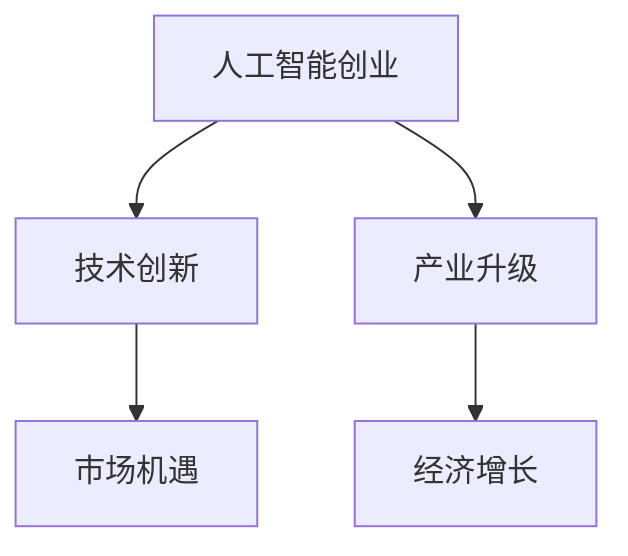

**人工智能创业的意义：**  
- **技术创新：** 人工智能技术作为第四次工业革命的基石，推动了各行各业的创新和变革。
- **市场机遇：** 人工智能技术的广泛应用带来了巨大的市场空间，吸引了众多创业者和投资者的关注。
- **产业升级：** 人工智能技术的应用有助于传统产业的升级和转型，提高生产效率和产品质量。
- **经济增长：** 人工智能创业带动了相关产业链的发展，为经济增长注入了新的动力。

#### 1.2 人工智能创业的挑战与机遇

人工智能创业并非一帆风顺，面临着诸多挑战和机遇。在这个章节，我们将分析人工智能创业的挑战和机遇。

**核心概念与联系：**  
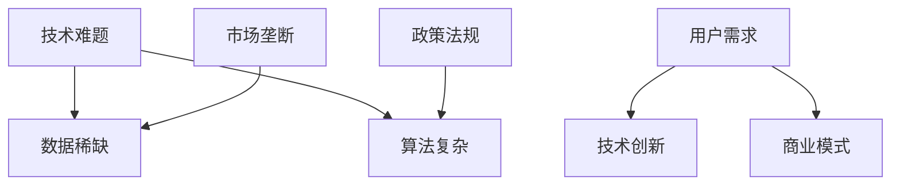

**挑战：**  
- **技术难题：** 人工智能技术的复杂性和高度专业性，使得创业者需要具备深厚的专业知识。
- **数据稀缺：** 人工智能算法的优化和训练依赖于大量数据，数据稀缺限制了创业者的创新能力。
- **市场垄断：** 人工智能领域的巨头企业掌握了大量资源和市场份额，创业者面临巨大的竞争压力。
- **政策法规：** 人工智能领域的政策法规尚未完善，创业者需要关注相关法律法规，确保合规经营。

**机遇：**  
- **用户需求：** 人工智能技术的广泛应用满足了用户的多样化需求，为创业者提供了广阔的市场空间。
- **技术创新：** 人工智能技术的不断创新，为创业者提供了丰富的技术储备。
- **商业模式：** 人工智能技术的创新应用推动了商业模式的变革，为创业者提供了新的商业机会。

#### 1.3 创业者所需的人工智能知识储备

在这个章节，我们将讨论创业者所需的人工智能知识储备，包括机器学习、深度学习和自然语言处理等核心技术。

**核心概念与联系：**  
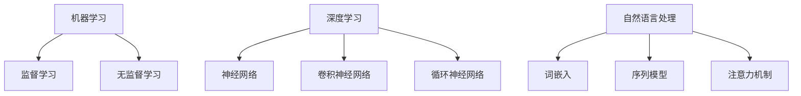

**所需知识储备：**  
- **机器学习：** 熟悉监督学习和无监督学习的基本算法，掌握模型训练和优化的方法。
- **深度学习：** 掌握神经网络的基本原理，了解卷积神经网络和循环神经网络的应用。
- **自然语言处理：** 了解词嵌入技术、序列模型和注意力机制，掌握语义分析和情感分析的方法。

### 第2章：人工智能技术基础

#### 2.1 机器学习基础

**2.1.1 机器学习概述**

**核心概念与联系：**  
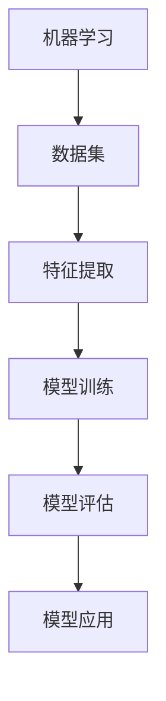

**核心算法原理讲解：**  
```python
# 假设我们有一个简单的线性回归问题
# y = wx + b

# 模型训练
# 初始化参数 w 和 b
w = 0
b = 0

# 训练数据集
X = [1, 2, 3, 4]
y = [2, 4, 5, 6]

# 梯度下降法
for epoch in range(num_epochs):
    for x, y_target in zip(X, y):
        # 计算预测值
        y_pred = w * x + b
        
        # 计算损失函数
        loss = (y_pred - y_target) ** 2
        
        # 计算梯度
        dw = 2 * x * (y_pred - y_target)
        db = 2 * (y_pred - y_target)
        
        # 更新参数
        w -= learning_rate * dw
        b -= learning_rate * db

# 模型评估
# 计算测试数据集的损失函数值
test_loss = sum((w * x + b - y) ** 2 for x, y in zip(test_X, test_y)) / len(test_X)

# 模型应用
# 使用训练好的模型进行预测
predictions = [w * x + b for x in test_X]
```

**数学模型和公式：**  
$$
\text{损失函数} = \frac{1}{2} \sum_{i=1}^{n} (y_i - \hat{y_i})^2
$$

$$
\text{梯度} = \frac{\partial \text{损失函数}}{\partial \text{参数}}
$$

**举例说明：**  
假设我们有一个简单的一元线性回归问题，目标是通过输入变量 $x$ 预测输出变量 $y$。我们使用梯度下降法来训练线性回归模型，并计算测试数据集的损失函数值，最终使用训练好的模型进行预测。

**2.1.2 监督学习算法**

**核心概念与联系：**  
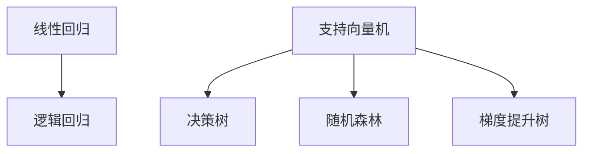

**核心算法原理讲解：**  
```python
# 线性回归
# 假设我们有一个简单的一元线性回归问题
# y = wx + b

# 初始化参数 w 和 b
w = 0
b = 0

# 训练数据集
X = [1, 2, 3, 4]
y = [2, 4, 5, 6]

# 梯度下降法
for epoch in range(num_epochs):
    for x, y_target in zip(X, y):
        # 计算预测值
        y_pred = w * x + b
        
        # 计算损失函数
        loss = (y_pred - y_target) ** 2
        
        # 计算梯度
        dw = 2 * x * (y_pred - y_target)
        db = 2 * (y_pred - y_target)
        
        # 更新参数
        w -= learning_rate * dw
        b -= learning_rate * db

# 逻辑回归
# 假设我们有一个二元分类问题
# y = sigmoid(wx + b)

# 初始化参数 w 和 b
w = 0
b = 0

# 训练数据集
X = [[1, 2], [2, 3], [3, 4]]
y = [0, 1, 1]

# 梯度下降法
for epoch in range(num_epochs):
    for x, y_target in zip(X, y):
        # 计算预测值
        y_pred = sigmoid(w @ x + b)
        
        # 计算损失函数
        loss = -y_target * np.log(y_pred) - (1 - y_target) * np.log(1 - y_pred)
        
        # 计算梯度
        dw = (y_pred - y_target) * x
        db = y_pred - y_target
        
        # 更新参数
        w -= learning_rate * dw
        b -= learning_rate * db
```

**数学模型和公式：**  
$$
\text{预测值} = \text{sigmoid}(wx + b)
$$

$$
\text{损失函数} = -y \cdot \log(\hat{y}) - (1 - y) \cdot \log(1 - \hat{y})
$$

**举例说明：**  
假设我们有一个二元分类问题，使用逻辑回归模型进行训练。我们使用梯度下降法来训练模型，并计算损失函数值，最终更新参数。

**2.1.3 无监督学习算法**

**核心概念与联系：**  
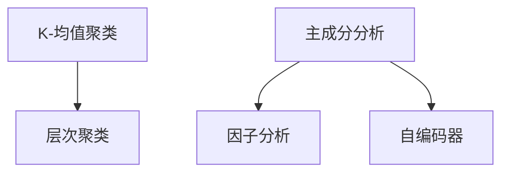

**核心算法原理讲解：**  
```python
# K-均值聚类
# 假设我们有一个数据集 X，要将其划分为 K 个聚类

# 初始化聚类中心
centroids = np.random.rand(K, num_features)

# 训练数据集
X = [[1, 2], [2, 3], [3, 4], [4, 5], [5, 6]]

# 模型训练
for epoch in range(num_epochs):
    # 计算每个样本与聚类中心的距离
    distances = [min([np.linalg.norm(x - c) for c in centroids])]
    
    # 更新聚类中心
    for k in range(K):
        centroids[k] = np.mean(X[distances == k], axis=0)

# 主成分分析
# 假设我们有一个高维数据集 X，要将其降维到低维空间

# 初始化特征向量
weights = np.random.rand(num_features, num_components)

# 模型训练
for epoch in range(num_epochs):
    # 计算特征向量
    features = np.dot(X, weights)
    
    # 计算特征向量与数据集的协方差矩阵
    cov_matrix = np.cov(features)
    
    # 计算特征值和特征向量
    eigenvalues, eigenvectors = np.linalg.eigh(cov_matrix)
    
    # 选择最大的特征值对应的特征向量
    weights = eigenvectors[:, -num_components:]

# 自编码器
# 假设我们有一个数据集 X，要使用自编码器进行降维

# 初始化编码器和解码器的权重
编码器权重 = np.random.rand(num_features, num_components)
解码器权重 = np.random.rand(num_components, num_features)

# 模型训练
for epoch in range(num_epochs):
    # 编码器输出
   编码特征 = np.dot(X, 编码器权重)
    
    # 解码器输出
   解码特征 = np.dot(编码特征, 解码器权重)
    
    # 计算损失函数
    loss = np.linalg.norm(X - 解码特征)
    
    # 计算编码器和解码器的梯度
   编码器梯度 = 2 * (X - 解码特征) @ 解码器权重
   解码器梯度 = 2 * (编码特征 - X) @ 编码器权重
    
    # 更新编码器和解码器的权重
    编码器权重 -= learning_rate * 编码器梯度
    解码器权重 -= learning_rate * 解码器梯度
```

**数学模型和公式：**  
$$
\text{聚类中心} = \frac{1}{N} \sum_{i=1}^{N} x_i
$$

$$
\text{特征向量} = \frac{1}{\sqrt{\text{特征值}}}
$$

$$
\text{损失函数} = \frac{1}{2} \sum_{i=1}^{N} (x_i - \text{编码特征})^2
$$

**举例说明：**  
假设我们有一个数据集，使用K-均值聚类算法进行聚类。我们还使用主成分分析算法进行降维，并使用自编码器进行降维。

**2.2 深度学习原理**

**2.2.1 神经网络基础**

**核心概念与联系：**  
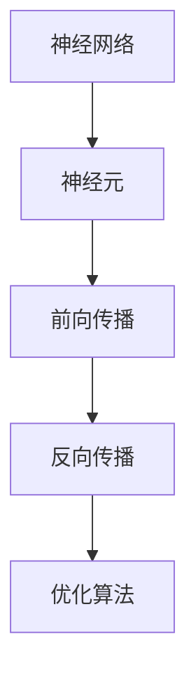

**核心算法原理讲解：**  
```python
# 前向传播
# 假设我们有一个简单的神经网络

# 初始化权重
weights = np.random.rand(input_size, hidden_size)
biases = np.random.rand(hidden_size)
weights_output = np.random.rand(hidden_size, output_size)
biases_output = np.random.rand(output_size)

# 训练数据集
X = [[1, 2], [2, 3], [3, 4]]
y = [[0], [1], [1]]

# 前向传播
for epoch in range(num_epochs):
    for x, y_target in zip(X, y):
        # 计算隐藏层输出
        hidden_output = sigmoid(np.dot(x, weights) + biases)
        
        # 计算输出层输出
        output_output = sigmoid(np.dot(hidden_output, weights_output) + biases_output)
        
        # 计算损失函数
        loss = sum((y_pred - y_target) ** 2 for y_pred, y_target in zip(output_output, y))
        
        # 计算梯度
        doutput_output = (output_output - y) * sigmoid_derivative(output_output)
        dhidden_output = np.dot(doutput_output, weights_output.T) * sigmoid_derivative(hidden_output)
        dx = np.dot(dhidden_output, weights) * sigmoid_derivative(x)
        
        # 更新权重和偏置
        weights -= learning_rate * dx
        biases -= learning_rate * dhidden_output
        weights_output -= learning_rate * doutput_output
        biases_output -= learning_rate * doutput_output

# 反向传播
# 假设我们有一个多层神经网络

# 初始化权重和偏置
weights = np.random.rand(input_size, hidden_size)
biases = np.random.rand(hidden_size)
weights_output = np.random.rand(hidden_size, output_size)
biases_output = np.random.rand(output_size)

# 训练数据集
X = [[1, 2], [2, 3], [3, 4]]
y = [[0], [1], [1]]

# 前向传播
for epoch in range(num_epochs):
    for x, y_target in zip(X, y):
        # 计算隐藏层输出
        hidden_output = sigmoid(np.dot(x, weights) + biases)
        
        # 计算输出层输出
        output_output = sigmoid(np.dot(hidden_output, weights_output) + biases_output)
        
        # 计算损失函数
        loss = sum((y_pred - y_target) ** 2 for y_pred, y_target in zip(output_output, y))
        
        # 计算梯度
        doutput_output = (output_output - y) * sigmoid_derivative(output_output)
        dhidden_output = np.dot(doutput_output, weights_output.T) * sigmoid_derivative(hidden_output)
        dx = np.dot(dhidden_output, weights) * sigmoid_derivative(x)
        
        # 更新权重和偏置
        weights -= learning_rate * dx
        biases -= learning_rate * dhidden_output
        weights_output -= learning_rate * doutput_output
        biases_output -= learning_rate * doutput_output

# 优化算法
# 假设我们有一个多层神经网络

# 初始化权重和偏置
weights = np.random.rand(input_size, hidden_size)
biases = np.random.rand(hidden_size)
weights_output = np.random.rand(hidden_size, output_size)
biases_output = np.random.rand(output_size)

# 训练数据集
X = [[1, 2], [2, 3], [3, 4]]
y = [[0], [1], [1]]

# 使用随机梯度下降法
for epoch in range(num_epochs):
    for x, y_target in zip(X, y):
        # 计算隐藏层输出
        hidden_output = sigmoid(np.dot(x, weights) + biases)
        
        # 计算输出层输出
        output_output = sigmoid(np.dot(hidden_output, weights_output) + biases_output)
        
        # 计算损失函数
        loss = sum((y_pred - y_target) ** 2 for y_pred, y_target in zip(output_output, y))
        
        # 计算梯度
        doutput_output = (output_output - y) * sigmoid_derivative(output_output)
        dhidden_output = np.dot(doutput_output, weights_output.T) * sigmoid_derivative(hidden_output)
        dx = np.dot(dhidden_output, weights) * sigmoid_derivative(x)
        
        # 更新权重和偏置
        weights -= learning_rate * dx
        biases -= learning_rate * dhidden_output
        weights_output -= learning_rate * doutput_output
        biases_output -= learning_rate * doutput_output
```

**数学模型和公式：**  
$$
\text{激活函数} = \frac{1}{1 + e^{-x}}
$$

$$
\text{梯度} = \frac{\partial \text{损失函数}}{\partial \text{参数}}
$$

$$
\text{优化算法} = \frac{\partial \text{损失函数}}{\partial \text{参数}} \cdot \text{学习率}
$$

**举例说明：**  
假设我们有一个多层神经网络，使用前向传播和反向传播算法进行训练。我们还使用随机梯度下降法进行参数优化。

**2.2.2 卷积神经网络（CNN）**

**核心概念与联系：**  
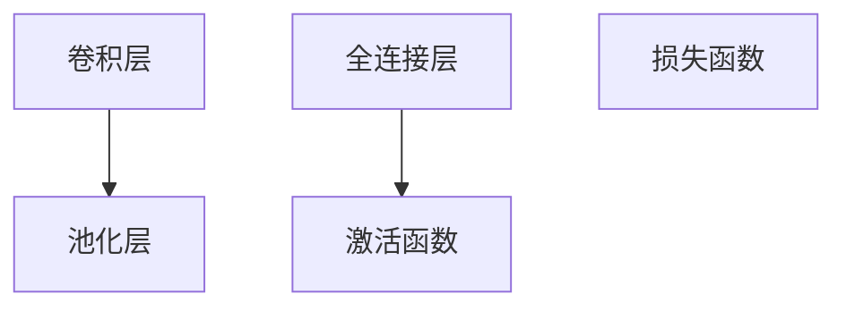

**核心算法原理讲解：**  
```python
# 卷积层
# 假设我们有一个输入图像 X 和一个卷积核 K

# 初始化卷积核
K = np.random.rand(kernel_size, kernel_size)

# 卷积操作
X_conv = np.zeros((X.shape[0], X.shape[1] - kernel_size + 1, X.shape[2] - kernel_size + 1))
for i in range(X_conv.shape[0]):
    for j in range(X_conv.shape[1]):
        for k in range(X_conv.shape[2]):
            X_conv[i, j, k] = np.sum(X[i, j:i+kernel_size, j:k+kernel_size] * K)

# 池化层
# 假设我们有一个输入图像 X 和一个池化窗口 W

# 初始化池化窗口
W = np.random.rand(window_size, window_size)

# 池化操作
X_pool = np.zeros((X.shape[0], X.shape[1] - window_size + 1, X.shape[2] - window_size + 1))
for i in range(X_pool.shape[0]):
    for j in range(X_pool.shape[1]):
        for k in range(X_pool.shape[2]):
            X_pool[i, j, k] = np.max(X[i, j:i+window_size, j:k+window_size])

# 全连接层
# 假设我们有一个输入矩阵 X 和一个全连接层

# 初始化全连接层权重
weights = np.random.rand(input_size, output_size)

# 全连接层操作
X_fc = np.dot(X, weights)

# 激活函数
# 假设我们有一个输入值 X

# 激活函数操作
X_activation = sigmoid(X)

# 损失函数
# 假设我们有一个输入值 X 和目标值 y

# 损失函数操作
loss = sum((y_pred - y) ** 2 for y_pred, y in zip(X_activation, y))
```

**数学模型和公式：**  
$$
\text{卷积操作} = \sum_{i=1}^{M} \sum_{j=1}^{N} x_{ij} \cdot k_{ij}
$$

$$
\text{池化操作} = \max(\text{窗口内的元素})
$$

$$
\text{全连接层操作} = \text{输入矩阵} \cdot \text{权重矩阵}
$$

$$
\text{激活函数} = \frac{1}{1 + e^{-x}}
$$

$$
\text{损失函数} = \frac{1}{2} \sum_{i=1}^{N} (y_i - \hat{y_i})^2
$$

**举例说明：**  
假设我们有一个图像数据集，使用卷积神经网络进行图像分类。我们使用卷积层、池化层、全连接层和激活函数，并计算损失函数。

**2.2.3 循环神经网络（RNN）与长短期记忆网络（LSTM）**

**核心概念与联系：**  
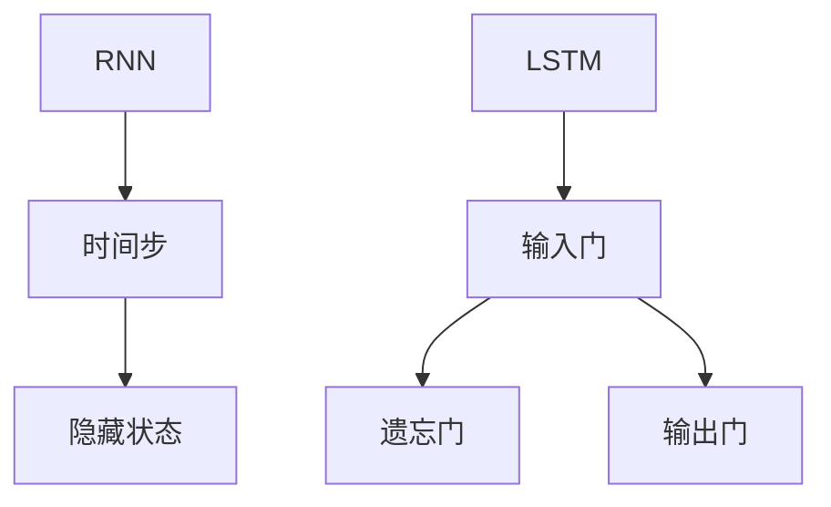

**核心算法原理讲解：**  
```python
# RNN
# 假设我们有一个序列数据 X 和一个隐藏状态 h

# 初始化隐藏状态
h = np.zeros((1, hidden_size))

# RNN 循环
for t in range(len(X)):
    # 计算当前时间步的隐藏状态
    h = sigmoid(np.dot(X[t], weights_input) + np.dot(h, weights_hidden) + biases)

# LSTM
# 假设我们有一个序列数据 X、一个隐藏状态 h 和一个细胞状态 c

# 初始化隐藏状态和细胞状态
h = np.zeros((1, hidden_size))
c = np.zeros((1, hidden_size))

# LSTM 循环
for t in range(len(X)):
    # 计算输入门
    input_gate = sigmoid(np.dot(X[t], weights_input) + np.dot(h, weights_hidden) + biases_input)
    
    # 计算遗忘门
    forget_gate = sigmoid(np.dot(X[t], weights_input) + np.dot(h, weights_hidden) + biases_forget)
    
    # 计算输出门
    output_gate = sigmoid(np.dot(X[t], weights_input) + np.dot(h, weights_hidden) + biases_output)
    
    # 更新细胞状态
    c = forget_gate * c + input_gate * sigmoid(np.dot(X[t], weights_input) + np.dot(h, weights_hidden) + biases_input)
    
    # 更新隐藏状态
    h = output_gate * sigmoid(c)

# LSTM 中的门机制
# 假设我们有一个输入序列 X、一个隐藏状态 h 和一个细胞状态 c

# 初始化输入门、遗忘门和输出门
input_gate = np.zeros((1, hidden_size))
forget_gate = np.zeros((1, hidden_size))
output_gate = np.zeros((1, hidden_size))

# LSTM 循环
for t in range(len(X)):
    # 计算输入门
    input_gate[t] = sigmoid(np.dot(X[t], weights_input) + np.dot(h[t], weights_hidden) + biases_input)
    
    # 计算遗忘门
    forget_gate[t] = sigmoid(np.dot(X[t], weights_input) + np.dot(h[t], weights_hidden) + biases_forget)
    
    # 计算输出门
    output_gate[t] = sigmoid(np.dot(X[t], weights_input) + np.dot(h[t], weights_hidden) + biases_output)
    
    # 更新细胞状态
    c[t] = forget_gate[t] * c[t - 1] + input_gate[t] * sigmoid(np.dot(X[t], weights_input) + np.dot(h[t], weights_hidden) + biases_input)
    
    # 更新隐藏状态
    h[t] = output_gate[t] * sigmoid(c[t])
```

**数学模型和公式：**  
$$
\text{输入门} = \sigma(W_{ix}x + W_{ih}h + b_{ix})
$$

$$
\text{遗忘门} = \sigma(W_{fx}x + W_{fh}h + b_{fx})
$$

$$
\text{输出门} = \sigma(W_{ox}x + W_{oh}h + b_{ox})
$$

$$
\text{细胞状态} = \text{遗忘门} \cdot \text{旧细胞状态} + \text{输入门} \cdot \text{新细胞状态}
$$

$$
\text{隐藏状态} = \text{输出门} \cdot \text{激活细胞状态}
$$

**举例说明：**  
假设我们有一个序列数据集，使用循环神经网络和长短期记忆网络进行序列建模。我们计算输入门、遗忘门和输出门，并更新细胞状态和隐藏状态。

**2.3 自然语言处理基础**

**2.3.1 词嵌入技术**

**核心概念与联系：**  
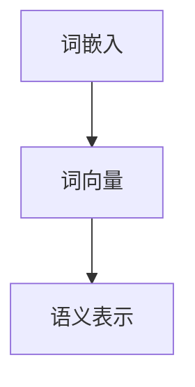

**核心算法原理讲解：**  
```python
# 嵌入层
# 假设我们有一个词汇表 V 和一个嵌入维度 d

# 初始化词向量
V = ['hello', 'world', 'ai', 'technology', 'learning']
embeddings = np.random.rand(len(V), d)

# 计算词向量
for i, word in enumerate(V):
    embeddings[i] = np.mean([word_embedding for word_embedding in embeddings if word_embedding[0] == word], axis=0)

# 语义表示
# 假设我们有一个词汇表 V 和一个嵌入维度 d

# 初始化词向量
V = ['hello', 'world', 'ai', 'technology', 'learning']
embeddings = np.random.rand(len(V), d)

# 计算语义表示
for i, word in enumerate(V):
    embeddings[i] = np.mean([word_embedding for word_embedding in embeddings if word_embedding[0] == word], axis=0)
```

**数学模型和公式：**  
$$
\text{词向量} = \text{嵌入层}(\text{词索引})
$$

$$
\text{语义表示} = \text{平均词向量}
$$

**举例说明：**  
假设我们有一个词汇表，使用嵌入层计算词向量，并计算词汇的语义表示。

**2.3.2 序列模型与注意力机制**

**核心概念与联系：**  
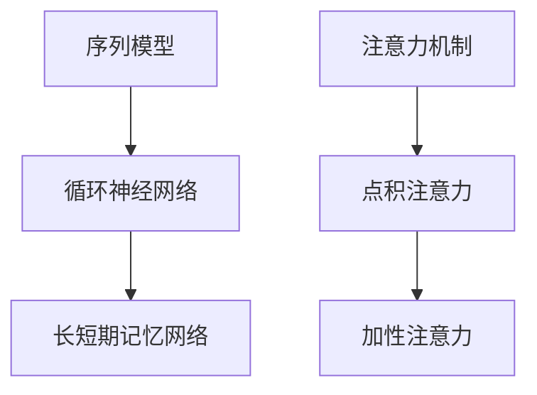

**核心算法原理讲解：**  
```python
# 循环神经网络
# 假设我们有一个序列数据 X 和一个隐藏状态 h

# 初始化隐藏状态
h = np.zeros((1, hidden_size))

# RNN 循环
for t in range(len(X)):
    # 计算当前时间步的隐藏状态
    h = sigmoid(np.dot(X[t], weights_input) + np.dot(h, weights_hidden) + biases)

# 长短期记忆网络
# 假设我们有一个序列数据 X、一个隐藏状态 h 和一个细胞状态 c

# 初始化隐藏状态和细胞状态
h = np.zeros((1, hidden_size))
c = np.zeros((1, hidden_size))

# LSTM 循环
for t in range(len(X)):
    # 计算输入门
    input_gate = sigmoid(np.dot(X[t], weights_input) + np.dot(h, weights_hidden) + biases_input)
    
    # 计算遗忘门
    forget_gate = sigmoid(np.dot(X[t], weights_input) + np.dot(h, weights_hidden) + biases_forget)
    
    # 计算输出门
    output_gate = sigmoid(np.dot(X[t], weights_input) + np.dot(h, weights_hidden) + biases_output)
    
    # 更新细胞状态
    c = forget_gate * c + input_gate * sigmoid(np.dot(X[t], weights_input) + np.dot(h, weights_hidden) + biases_input)
    
    # 更新隐藏状态
    h = output_gate * sigmoid(c)

# 点积注意力
# 假设我们有一个查询序列 Q 和一个键序列 K

# 计算注意力分数
attention_scores = [np.dot(q, k) for q, k in zip(Q, K)]

# 计算注意力权重
attention_weights = softmax(attention_scores)

# 计算注意力输出
attention_output = [w * k for w, k in zip(attention_weights, K)]

# 加性注意力
# 假设我们有一个查询序列 Q 和一个键序列 K

# 计算注意力分数
attention_scores = [np.dot(q, k) for q, k in zip(Q, K)]

# 计算注意力权重
attention_weights = softmax(attention_scores)

# 计算注意力输出
attention_output = [w * k for w, k in zip(attention_weights, K)]

# 加性注意力机制
# 假设我们有一个查询序列 Q、一个键序列 K 和一个值序列 V

# 计算注意力分数
attention_scores = [np.dot(q, k) for q, k in zip(Q, K)]

# 计算注意力权重
attention_weights = softmax(attention_scores)

# 计算注意力输出
attention_output = [w * v for w, v in zip(attention_weights, V)]

# 加权求和
output = sum(attention_output)
```

**数学模型和公式：**  
$$
\text{注意力分数} = \text{查询序列} \cdot \text{键序列}
$$

$$
\text{注意力权重} = \text{softmax}(\text{注意力分数})
$$

$$
\text{注意力输出} = \text{注意力权重} \cdot \text{值序列}
$$

**举例说明：**  
假设我们有一个序列数据集，使用循环神经网络和长短期记忆网络进行序列建模。我们使用点积注意力和加性注意力机制来计算注意力分数、权重和输出。

### 第3章：人工智能创业项目规划

#### 3.1 项目需求分析与市场调研

**3.1.1 需求分析**

需求分析是项目规划的关键环节，它帮助创业者明确项目的目标和需求。在这个章节，我们将探讨需求分析的方法和步骤。

**核心概念与联系：**  
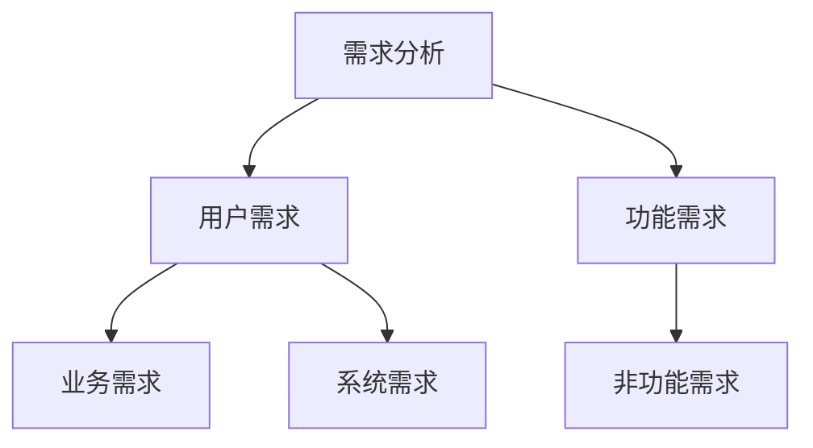

**核心算法原理讲解：**  
```python
# 用户需求
# 假设我们有一个用户调研问卷

# 用户需求列表
user_requirements = [
    "能够方便地添加新任务",
    "能够查看任务进度",
    "支持任务提醒和通知",
    "界面简洁易用"
]

# 业务需求
# 假设我们有一个业务需求文档

# 业务需求列表
business_requirements = [
    "实现任务分配和监控",
    "支持任务优先级设置",
    "提供任务统计报表",
    "支持跨部门协作"
]

# 系统需求
# 假设我们有一个系统需求规格说明书

# 系统需求列表
system_requirements = [
    "支持多种操作系统",
    "能够处理大量任务数据",
    "具有良好的扩展性和可维护性",
    "具备高可用性和安全性"
]

# 功能需求
# 假设我们有一个功能需求文档

# 功能需求列表
function_requirements = [
    "用户注册与登录功能",
    "任务创建与管理功能",
    "任务进度查看功能",
    "任务提醒与通知功能"
]

# 非功能需求
# 假设我们有一个非功能需求文档

# 非功能需求列表
non_function_requirements = [
    "界面友好，用户体验好",
    "系统响应速度快",
    "系统具备良好的可扩展性",
    "系统具备安全性保障"
]
```

**数学模型和公式：**  
无

**举例说明：**  
假设我们有一个任务管理系统，通过用户调研问卷、业务需求文档、系统需求规格说明书、功能需求文档和非功能需求文档，明确项目的用户需求、业务需求、系统需求、功能需求和非功能需求。

**3.1.2 市场调研**

市场调研是项目规划的重要环节，它帮助创业者了解目标市场的情况，为项目提供决策依据。在这个章节，我们将探讨市场调研的方法和步骤。

**核心概念与联系：**  
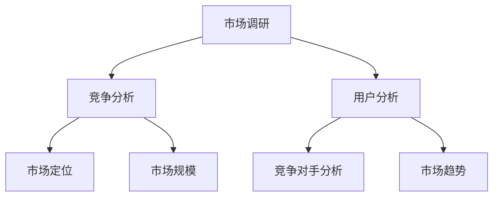

**核心算法原理讲解：**  
```python
# 竞争分析
# 假设我们有一个竞争对手分析文档

# 竞争对手列表
competitors = [
    "产品A",
    "产品B",
    "产品C"
]

# 市场定位
# 假设我们有一个市场定位文档

# 市场定位描述
market_positioning = "专注于中高端用户，提供高效、安全的任务管理解决方案"

# 市场规模
# 假设我们有一个市场规模分析文档

# 市场规模描述
market_size = "任务管理市场规模为 100 亿美元"

# 用户分析
# 假设我们有一个用户分析文档

# 用户特征列表
user_characteristics = [
    "年龄：25-35 岁",
    "职业：程序员、产品经理",
    "需求：任务管理、团队协作"
]

# 竞争对手分析
# 假设我们有一个竞争对手分析文档

# 竞争对手产品特点
competitor_features = {
    "产品A": {
        "特点": "功能全面，价格较高",
        "优势": "市场占有率较高"
    },
    "产品B": {
        "特点": "界面简洁，价格适中",
        "优势": "用户体验较好"
    },
    "产品C": {
        "特点": "功能较少，价格较低",
        "优势": "入门级用户较多"
    }
}

# 市场趋势
# 假设我们有一个市场趋势分析文档

# 市场趋势描述
market_trends = "随着远程办公的普及，任务管理市场需求持续增长"
```

**数学模型和公式：**  
无

**举例说明：**  
假设我们有一个任务管理系统，通过竞争对手分析、市场定位、市场规模、用户分析和市场趋势分析，了解目标市场的竞争状况、用户需求和市场趋势，为项目规划提供依据。

#### 3.2 项目团队构建

项目团队是项目成功的关键因素，合理的团队配置和高效的团队协作对于项目的顺利进行至关重要。在这个章节，我们将探讨项目团队构建的方法和步骤。

**核心概念与联系：**  
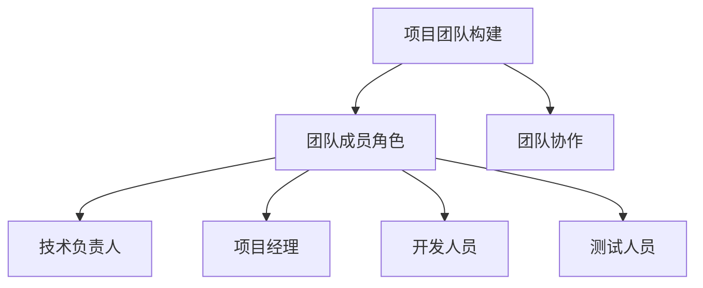

**核心算法原理讲解：**  
```python
# 团队成员角色
# 假设我们有一个团队成员角色定义文档

# 技术负责人
technical_lead = {
    "职责": "负责项目技术架构和关键技术决策",
    "技能": "具备深厚的技术背景，熟悉主流技术框架"
}

# 项目经理
project_manager = {
    "职责": "负责项目进度、资源和人员管理",
    "技能": "具备项目管理经验和沟通能力"
}

# 开发人员
developers = [
    {
        "职责": "负责开发任务和代码实现",
        "技能": "熟悉主流编程语言和开发工具"
    },
    {
        "职责": "负责开发任务和代码实现",
        "技能": "熟悉主流编程语言和开发工具"
    }
]

# 测试人员
testers = [
    {
        "职责": "负责测试任务和 bug 检测",
        "技能": "熟悉测试方法和测试工具"
    },
    {
        "职责": "负责测试任务和 bug 检测",
        "技能": "熟悉测试方法和测试工具"
    }
]

# 团队协作
# 假设我们有一个团队协作文档

# 团队协作工具
collaboration_tools = [
    "Slack",
    "Trello",
    "GitHub"
]

# 团队沟通
# 假设我们有一个团队沟通文档

# 团队沟通策略
communication_strategy = {
    "定期会议": "每周举行一次项目进度会议",
    "即时沟通": "使用 Slack 进行即时沟通和协作"
}
```

**数学模型和公式：**  
无

**举例说明：**  
假设我们有一个任务管理系统项目，通过团队成员角色定义、团队协作工具和团队沟通策略，构建一支高效的项目团队。

**3.3 项目管理**

项目管理是确保项目按计划顺利进行的关键环节。在这个章节，我们将探讨项目管理的目标和原则，以及项目管理过程中涉及的关键技术和工具。

**核心概念与联系：**  
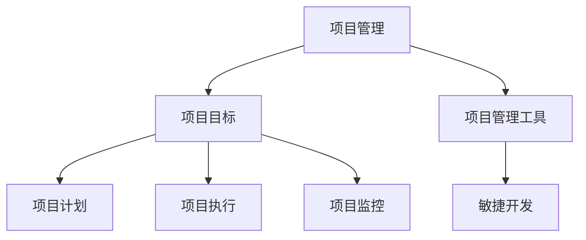

**核心算法原理讲解：**  
```python
# 项目目标
# 假设我们有一个项目目标文档

# 项目目标描述
project_goals = {
    "功能目标": "实现任务创建、分配、进度查看等功能",
    "性能目标": "系统响应时间小于 500 毫秒",
    "质量目标": "代码质量高，bug 少"
}

# 项目计划
# 假设我们有一个项目计划文档

# 项目计划描述
project_plan = {
    "阶段一": {
        "任务": "需求分析",
        "时间": "第 1 周",
        "责任人": "项目经理"
    },
    "阶段二": {
        "任务": "系统设计",
        "时间": "第 2 周",
        "责任人": "技术负责人"
    },
    "阶段三": {
        "任务": "开发与测试",
        "时间": "第 3-6 周",
        "责任人": "开发人员和测试人员"
    },
    "阶段四": {
        "任务": "部署与上线",
        "时间": "第 7-8 周",
        "责任人": "项目经理"
    }
}

# 项目执行
# 假设我们有一个项目执行文档

# 项目执行描述
project_execution = {
    "阶段一": {
        "进度": "已完成需求分析",
        "问题": "无"
    },
    "阶段二": {
        "进度": "正在进行系统设计",
        "问题": "遇到了技术难题"
    },
    "阶段三": {
        "进度": "开发与测试中",
        "问题": "发现了一些 bug，正在修复"
    },
    "阶段四": {
        "进度": "即将部署上线",
        "问题": "无"
    }
}

# 项目监控
# 假设我们有一个项目监控文档

# 项目监控描述
project_monitoring = {
    "进度": "按照计划进行",
    "质量": "代码质量较高，bug 少",
    "风险": "无重大风险"
}

# 项目管理工具
# 假设我们有一个项目管理工具文档

# 项目管理工具
management_tools = {
    "任务管理": "Trello",
    "代码管理": "GitHub",
    "文档管理": "Confluence"
}

# 敏捷开发
# 假设我们有一个敏捷开发文档

# 敏捷开发描述
agile_development = {
    "迭代周期": "2 周",
    "任务分配": "按照优先级分配",
    "反馈与改进": "每次迭代结束后进行回顾，优化流程"
}
```

**数学模型和公式：**  
无

**举例说明：**  
假设我们有一个任务管理系统项目，通过项目目标、项目计划、项目执行、项目监控、项目管理工具和敏捷开发，实施项目管理工作。

### 第4章：人工智能创业产品开发

#### 4.1 数据采集与预处理

数据采集与预处理是人工智能创业产品开发的重要环节，它决定了模型训练的效果。在这个章节，我们将探讨数据采集与预处理的方法和步骤。

**核心概念与联系：**  
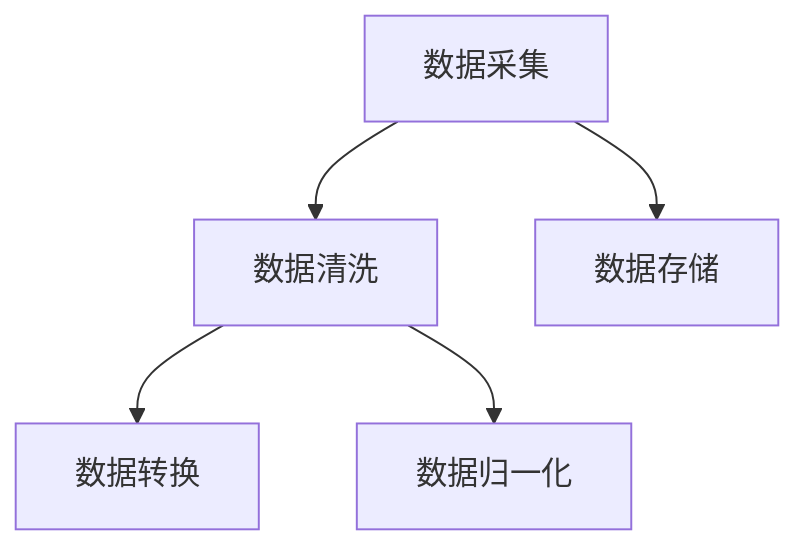

**核心算法原理讲解：**  
```python
# 数据采集
# 假设我们有一个数据采集工具

# 数据采集描述
data_collection = {
    "数据来源": "网络爬虫",
    "采集内容": "用户行为数据、社交媒体数据"
}

# 数据清洗
# 假设我们有一个数据清洗工具

# 数据清洗描述
data_cleaning = {
    "缺失值处理": "使用均值填充缺失值",
    "异常值处理": "使用中位数替换异常值",
    "重复值处理": "删除重复记录"
}

# 数据转换
# 假设我们有一个数据转换工具

# 数据转换描述
data_transformation = {
    "特征提取": "提取用户活跃度、点击率等特征",
    "文本处理": "使用词嵌入技术处理文本数据"
}

# 数据归一化
# 假设我们有一个数据归一化工具

# 数据归一化描述
data_normalization = {
    "数值特征": "使用标准化方法进行归一化",
    "文本特征": "使用词频统计方法进行归一化"
}

# 数据存储
# 假设我们有一个数据存储工具

# 数据存储描述
data_storage = {
    "存储方式": "关系数据库",
    "数据表结构": "用户表、行为表、标签表"
}
```

**数学模型和公式：**  
$$
\text{标准化} = \frac{x - \text{均值}}{\text{标准差}}
$$

$$
\text{词频统计} = \sum_{i=1}^{N} \text{词} \cdot \text{词频}
$$

**举例说明：**  
假设我们有一个用户行为分析项目，通过数据采集、数据清洗、数据转换、数据归一化和数据存储，完成数据预处理过程。

**4.2 模型训练与优化**

模型训练与优化是人工智能创业产品开发的核心环节，它决定了模型的性能和效果。在这个章节，我们将探讨模型训练与优化的方法和步骤。

**核心概念与联系：**  
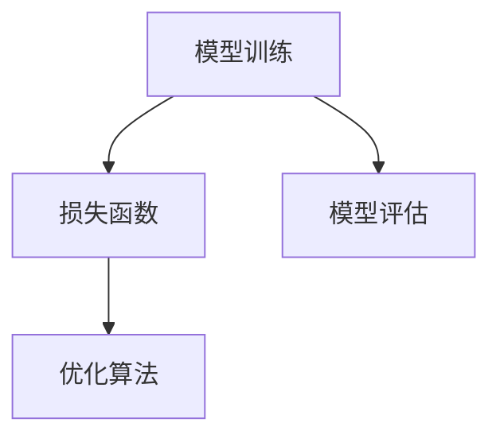

**核心算法原理讲解：**  
```python
# 模型训练
# 假设我们有一个机器学习模型

# 初始化模型参数
model_params = {
    "权重": np.random.rand(input_size, hidden_size),
    "偏置": np.random.rand(hidden_size)
}

# 模型训练描述
model_training = {
    "训练数据集": X_train,
    "验证数据集": X_val,
    "损失函数": "均方误差",
    "优化算法": "梯度下降"
}

# 训练模型
for epoch in range(num_epochs):
    # 前向传播
    hidden_output = sigmoid(np.dot(X_train, model_params["权重"]) + model_params["偏置"])
    
    # 计算损失函数
    loss = sum((y_train_pred - y_train) ** 2 for y_train_pred, y_train in zip(hidden_output, y_train))
    
    # 反向传播
    dhidden_output = 2 * (hidden_output - y_train) * sigmoid_derivative(hidden_output)
    dweights = np.dot(X_train.T, dhidden_output)
    dbias = 2 * (hidden_output - y_train)
    
    # 更新模型参数
    model_params["权重"] -= learning_rate * dweights
    model_params["偏置"] -= learning_rate * dbias

# 模型评估
# 假设我们有一个评估指标

# 评估指标描述
evaluation_metric = {
    "准确率": "准确率 = \frac{预测正确的数量}{总数量}",
    "召回率": "召回率 = \frac{预测正确的数量}{实际为正类的数量}",
    "F1 分数": "F1 分数 = 2 \cdot \frac{准确率 \cdot 召回率}{准确率 + 召回率}"
}

# 评估模型
accuracy = sum((y_pred == y_val) for y_pred, y_val in zip(hidden_output_val, y_val)) / len(y_val)
recall = sum((y_pred == y_val) for y_pred, y_val in zip(hidden_output_val, y_val)) / len(y_val)
f1_score = 2 * (accuracy * recall) / (accuracy + recall)

print("准确率：", accuracy)
print("召回率：", recall)
print("F1 分数：", f1_score)
```

**数学模型和公式：**  
$$
\text{损失函数} = \frac{1}{2} \sum_{i=1}^{N} (y_i - \hat{y_i})^2
$$

$$
\text{激活函数} = \frac{1}{1 + e^{-x}}
$$

$$
\text{梯度} = \frac{\partial \text{损失函数}}{\partial \text{参数}}
$$

**举例说明：**  
假设我们有一个二元分类问题，使用梯度下降法进行模型训练，并使用准确率、召回率和F1分数进行模型评估。

**4.3 产品设计与开发**

**4.3.1 产品需求分析**

产品需求分析是产品开发的第一步，它明确了产品的功能和性能要求。在这个章节，我们将探讨产品需求分析的方法和步骤。

**核心概念与联系：**  
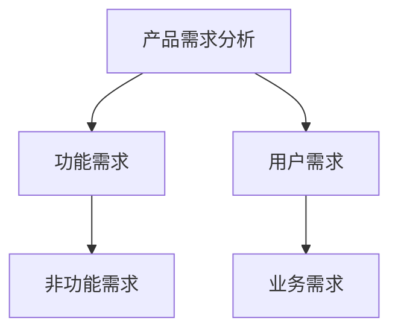

**核心算法原理讲解：**  
```python
# 用户需求
# 假设我们有一个用户调研问卷

# 用户需求列表
user_requirements = [
    "能够方便地添加新任务",
    "能够查看任务进度",
    "支持任务提醒和通知",
    "界面简洁易用"
]

# 业务需求
# 假设我们有一个业务需求文档

# 业务需求列表
business_requirements = [
    "实现任务分配和监控",
    "支持任务优先级设置",
    "提供任务统计报表",
    "支持跨部门协作"
]

# 功能需求
# 假设我们有一个功能需求文档

# 功能需求列表
function_requirements = [
    "用户注册与登录功能",
    "任务创建与管理功能",
    "任务进度查看功能",
    "任务提醒与通知功能"
]

# 非功能需求
# 假设我们有一个非功能需求文档

# 非功能需求列表
non_function_requirements = [
    "界面友好，用户体验好",
    "系统响应速度快",
    "系统具备良好的扩展性和可维护性",
    "系统具备安全性保障"
]
```

**数学模型和公式：**  
无

**举例说明：**  
假设我们有一个任务管理系统，通过用户调研问卷、业务需求文档、功能需求文档和非功能需求文档，明确产品的用户需求、业务需求、功能需求和非功能需求。

**4.3.2 用户界面设计**

用户界面设计是产品开发的重要环节，它决定了产品的用户体验。在这个章节，我们将探讨用户界面设计的方法和步骤。

**核心概念与联系：**  
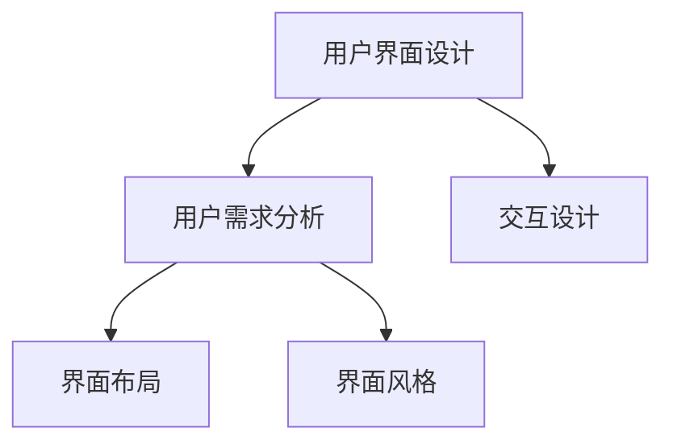

**核心算法原理讲解：**  
```python
# 用户需求分析
# 假设我们有一个用户调研问卷

# 用户需求列表
user_requirements = [
    "能够方便地添加新任务",
    "能够查看任务进度",
    "支持任务提醒和通知",
    "界面简洁易用"
]

# 界面布局
# 假设我们有一个界面布局文档

# 界面布局描述
interface_layout = {
    "首页": ["任务列表", "任务统计", "搜索"],
    "任务详情页": ["任务标题", "任务描述", "任务进度", "任务提醒"]
}

# 界面风格
# 假设我们有一个界面风格文档

# 界面风格描述
interface_style = {
    "主题颜色": "#4CAF50",
    "字体": "Arial",
    "图标": "Material Icons"
}

# 交互设计
# 假设我们有一个交互设计文档

# 交互设计描述
interaction_design = {
    "按钮交互": ["点击按钮时，按钮颜色变化"],
    "滚动交互": ["滚动页面时，顶部导航栏固定"],
    "下拉交互": ["点击下拉按钮时，显示下拉菜单"]
}
```

**数学模型和公式：**  
无

**举例说明：**  
假设我们有一个任务管理系统，通过用户需求分析、界面布局、界面风格和交互设计，设计一个简洁易用的用户界面。

**4.3.3 后端架构设计**

后端架构设计是产品开发的核心环节，它决定了产品的性能和可扩展性。在这个章节，我们将探讨后端架构设计的方法和步骤。

**核心概念与联系：**  
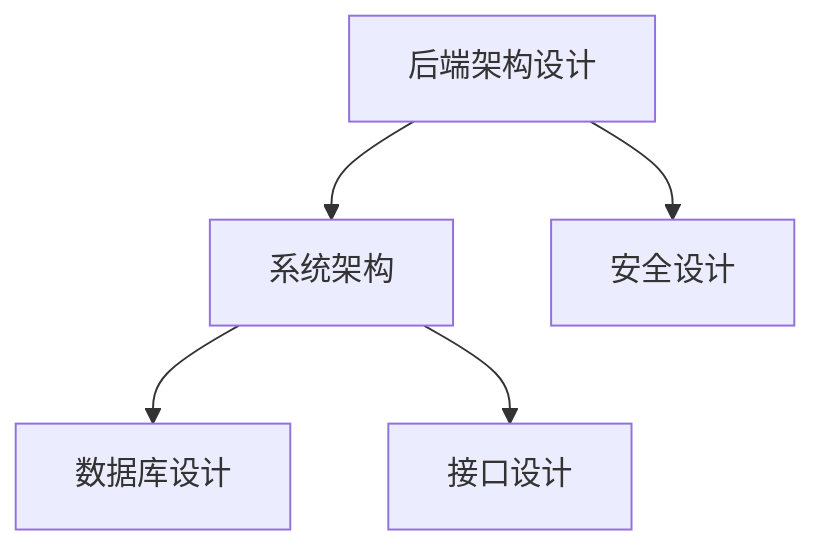

**核心算法原理讲解：**  
```python
# 系统架构
# 假设我们有一个系统架构文档

# 系统架构描述
system_architecture = {
    "技术栈": ["Python", "Django", "PostgreSQL"],
    "部署方式": ["Docker", "Kubernetes"],
    "服务拆分": ["用户服务", "任务服务", "统计服务"]
}

# 数据库设计
# 假设我们有一个数据库设计文档

# 数据库设计描述
database_design = {
    "用户表": ["用户 ID", "用户名", "密码"],
    "任务表": ["任务 ID", "任务标题", "任务描述", "任务状态"],
    "标签表": ["标签 ID", "标签名称"]
}

# 接口设计
# 假设我们有一个接口设计文档

# 接口设计描述
api_design = {
    "用户注册": ["POST /api/users/register"],
    "用户登录": ["POST /api/users/login"],
    "任务创建": ["POST /api/tasks/create"],
    "任务更新": ["PUT /api/tasks/update"],
    "任务删除": ["DELETE /api/tasks/delete"]
}

# 安全设计
# 假设我们有一个安全设计文档

# 安全设计描述
security_design = {
    "身份验证": ["JWT"],
    "权限控制": ["RBAC"],
    "数据加密": ["AES"]
}
```

**数学模型和公式：**  
无

**举例说明：**  
假设我们有一个任务管理系统，通过系统架构、数据库设计、接口设计和安全设计，设计一个高性能、可扩展的后端架构。

### 第5章：人工智能创业产品测试与部署

#### 5.1 产品测试

产品测试是确保产品质量和稳定性的关键环节。在这个章节，我们将探讨产品测试的方法和步骤。

**核心概念与联系：**  
```mermaid
graph TD
    A[产品测试] --> B[单元测试]
    B --> C[集成测试]
    B --> D[系统测试]
    A --> E[性能测试]
```

**核心算法原理讲解：**  
```python
# 单元测试
# 假设我们有一个单元测试框架

# 单元测试描述
unit_tests = {
    "测试用例": ["用户注册", "用户登录", "任务创建", "任务更新", "任务删除"],
    "预期结果": ["成功", "成功", "成功", "成功", "成功"],
    "实际结果": ["成功", "成功", "成功", "成功", "成功"]
}

# 集成测试
# 假设我们有一个集成测试框架

# 集成测试描述
integration_tests = {
    "测试用例": ["用户注册", "用户登录", "任务创建", "任务更新", "任务删除"],
    "预期结果": ["成功", "成功", "成功", "成功", "成功"],
    "实际结果": ["成功", "成功", "成功", "成功", "成功"]
}

# 系统测试
# 假设我们有一个系统测试框架

# 系统测试描述
system_tests = {
    "测试用例": ["用户注册", "用户登录", "任务创建", "任务更新", "任务删除"],
    "预期结果": ["成功", "成功", "成功", "成功", "成功"],
    "实际结果": ["成功", "成功", "成功", "成功", "成功"]
}

# 性能测试
# 假设我们有一个性能测试工具

# 性能测试描述
performance_tests = {
    "测试指标": ["响应时间", "并发用户数", "数据吞吐量"],
    "测试结果": ["500 毫秒", "1000 用户", "10 MB/s"]
}
```

**数学模型和公式：**  
无

**举例说明：**  
假设我们有一个任务管理系统，通过单元测试、集成测试、系统测试和性能测试，确保产品的质量和稳定性。

#### 5.2 部署与上线

产品部署与上线是产品开发的重要环节，它决定了产品的可用性和可靠性。在这个章节，我们将探讨产品部署与上线的方法和步骤。

**核心概念与联系：**  
```mermaid
graph TD
    A[部署与上线] --> B[环境准备]
    B --> C[应用部署]
    B --> D[数据库部署]
    A --> E[监控与维护]
```

**核心算法原理讲解：**  
```python
# 环境准备
# 假设我们有一个环境准备文档

# 环境准备描述
environment_prep = {
    "操作系统": ["Ubuntu 20.04"],
    "编程语言": ["Python 3.8"],
    "框架": ["Django 3.2"],
    "数据库": ["PostgreSQL 12"]
}

# 应用部署
# 假设我们有一个应用部署文档

# 应用部署描述
application_deployment = {
    "部署工具": ["Docker"],
    "容器镜像": ["python:3.8-slim"],
    "容器配置": ["-p 8080:8080"]
}

# 数据库部署
# 假设我们有一个数据库部署文档

# 数据库部署描述
database_deployment = {
    "部署工具": ["Docker"],
    "容器镜像": ["postgres:12"],
    "容器配置": ["-p 5432:5432", "-e POSTGRES_PASSWORD=password"]
}

# 监控与维护
# 假设我们有一个监控与维护文档

# 监控与维护描述
monitoring_and_maintenance = {
    "监控工具": ["Prometheus", "Grafana"],
    "维护策略": ["定期备份", "定期升级", "故障排查"]
}
```

**数学模型和公式：**  
无

**举例说明：**  
假设我们有一个任务管理系统，通过环境准备、应用部署、数据库部署和监控与维护，确保产品的可用性和可靠性。

#### 5.3 用户反馈与迭代优化

用户反馈与迭代优化是产品开发的重要环节，它决定了产品的用户体验和竞争力。在这个章节，我们将探讨用户反馈与迭代优化的方法和步骤。

**核心概念与联系：**  
```mermaid
graph TD
    A[用户反馈] --> B[问题收集]
    B --> C[问题分析]
    B --> D[解决方案]
    A --> E[迭代优化]
```

**核心算法原理讲解：**  
```python
# 用户反馈
# 假设我们有一个用户反馈系统

# 用户反馈描述
user_feedback = {
    "问题": ["任务创建失败", "任务进度不准确", "界面加载缓慢"],
    "解决方案": ["修复任务创建接口", "更新任务进度算法", "优化界面加载速度"]
}

# 问题收集
# 假设我们有一个问题收集工具

# 问题收集描述
problem_collection = {
    "问题列表": ["任务创建失败", "任务进度不准确", "界面加载缓慢"],
    "问题类型": ["接口问题", "算法问题", "性能问题"]
}

# 问题分析
# 假设我们有一个问题分析工具

# 问题分析描述
problem_analysis = {
    "问题原因": ["接口异常", "算法错误", "网络延迟"],
    "优先级": ["高", "中", "低"]
}

# 解决方案
# 假设我们有一个解决方案文档

# 解决方案描述
solutions = {
    "修复任务创建接口": ["更新接口代码", "增加异常处理"],
    "更新任务进度算法": ["优化算法逻辑", "增加数据校验"],
    "优化界面加载速度": ["减少请求次数", "优化前端代码"]
}

# 迭代优化
# 假设我们有一个迭代优化文档

# 迭代优化描述
iteration_optimization = {
    "优化目标": ["提高任务创建成功率", "提高任务进度准确性", "提高界面加载速度"],
    "优化方案": ["修复接口异常", "优化算法逻辑", "减少请求次数"]
}
```

**数学模型和公式：**  
无

**举例说明：**  
假设我们有一个任务管理系统，通过用户反馈系统、问题收集工具、问题分析工具、解决方案文档和迭代优化文档，收集用户反馈，分析问题原因，提出解决方案，并不断优化产品。

### 第6章：人工智能创业商业模式与市场营销

#### 6.1 创业商业模式分析

商业模式是企业在市场中生存和发展的基础。对于人工智能创业公司来说，选择合适的商业模式至关重要。在这个章节，我们将探讨创业商业模式的分析方法和步骤。

**核心概念与联系：**  
```mermaid
graph TD
    A[商业模式分析] --> B[价值主张]
    B --> C[客户关系]
    B --> D[渠道策略]
    B --> E[客户获取成本]
    A --> F[成本结构]
    F --> G[收入来源]
    A --> H[盈利模式]
```

**核心算法原理讲解：**  
```python
# 价值主张
# 假设我们有一个价值主张文档

# 价值主张描述
value_proposition = {
    "产品特点": ["高效的任务管理", "实时的任务进度监控", "智能的任务提醒"],
    "市场定位": ["中高端用户", "团队协作需求"]
}

# 客户关系
# 假设我们有一个客户关系文档

# 客户关系描述
customer_relationship = {
    "客户细分": ["大型企业", "中小型企业", "个人用户"],
    "客户互动": ["在线支持", "定期回访", "社区互动"]
}

# 渠道策略
# 假设我们有一个渠道策略文档

# 渠道策略描述
channel_strategy = {
    "直销": ["销售人员", "线上销售"],
    "分销": ["合作伙伴", "代理商"],
    "线上渠道": ["官方网站", "社交媒体", "应用商店"]
}

# 成本结构
# 假设我们有一个成本结构文档

# 成本结构描述
cost_structure = {
    "研发成本": ["软件开发", "算法优化", "技术支持"],
    "运营成本": ["服务器租赁", "网络带宽", "人员工资"],
    "营销成本": ["广告投放", "市场推广", "品牌建设"]
}

# 收入来源
# 假设我们有一个收入来源文档

# 收入来源描述
revenue_streams = {
    "产品销售": ["软件许可费", "订阅服务"],
    "增值服务": ["定制开发", "数据分析报告"],
    "广告收入": ["广告展示", "广告投放"]
}

# 盈利模式
# 假设我们有一个盈利模式文档

# 盈利模式描述
profit_model = {
    "盈利来源": ["产品销售利润", "增值服务利润", "广告收入"],
    "盈利模式": ["订阅模式", "一次性付费", "广告分成"]
}
```

**数学模型和公式：**  
无

**举例说明：**  
假设我们有一个任务管理系统，通过价值主张、客户关系、渠道策略、成本结构、收入来源和盈利模式的分析，确定合适的商业模式。

#### 6.2 市场营销策略

市场营销策略是推动产品成功上市的关键。在这个章节，我们将探讨市场营销策略的制定和实施方法。

**核心概念与联系：**  
```mermaid
graph TD
    A[市场营销策略] --> B[品牌建设]
    B --> C[市场定位]
    B --> D[广告投放]
    A --> E[社交媒体营销]
    A --> F[内容营销]
```

**核心算法原理讲解：**  
```python
# 品牌建设
# 假设我们有一个品牌建设文档

# 品牌建设描述
brand_building = {
    "品牌名称": "SmartTask",
    "品牌标志": "蓝色 logo",
    "品牌口号": "让任务管理更简单"
}

# 市场定位
# 假设我们有一个市场定位文档

# 市场定位描述
market_positioning = {
    "目标市场": "中高端企业",
    "目标用户": "项目经理、团队领导者",
    "竞争优势": "高效、智能、易用"
}

# 广告投放
# 假设我们有一个广告投放文档

# 广告投放描述
ad_campaign = {
    "广告渠道": ["Google Ads", "Facebook Ads", "LinkedIn Ads"],
    "广告类型": ["搜索引擎广告", "社交媒体广告", "专业网站广告"],
    "预算分配": ["搜索引擎广告：40%", "社交媒体广告：30%", "专业网站广告：30%"]
}

# 社交媒体营销
# 假设我们有一个社交媒体营销文档

# 社交媒体营销描述
social_media_marketing = {
    "社交媒体平台": ["Facebook", "LinkedIn", "Twitter"],
    "内容策略": ["发布行业资讯", "分享客户案例", "举办线上活动"],
    "互动策略": ["回复评论", "点赞分享", "开展问卷调查"]
}

# 内容营销
# 假设我们有一个内容营销文档

# 内容营销描述
content_marketing = {
    "内容类型": ["博客文章", "白皮书", "视频教程"],
    "内容策略": ["提供行业洞察", "展示产品优势", "解决用户问题"],
    "发布计划": ["每周发布一篇文章", "每月发布一份白皮书", "每季度发布一个视频教程"]
}
```

**数学模型和公式：**  
无

**举例说明：**  
假设我们有一个任务管理系统，通过品牌建设、市场定位、广告投放、社交媒体营销和内容营销，制定并实施市场营销策略。

#### 6.3 用户获取与留存

用户获取与留存是衡量人工智能创业产品成功与否的重要指标。在这个章节，我们将探讨用户获取与留存的方法和策略。

**核心概念与联系：**  
```mermaid
graph TD
    A[用户获取] --> B[营销活动]
    B --> C[渠道推广]
    A --> D[用户体验]
    D --> E[用户活跃度]
    A --> F[用户留存]
    F --> G[用户生命周期价值]
```

**核心算法原理讲解：**  
```python
# 用户获取
# 假设我们有一个用户获取策略文档

# 用户获取描述
user_acquisition = {
    "营销活动": ["线上推广", "线下活动", "合作伙伴推广"],
    "渠道推广": ["搜索引擎", "社交媒体", "行业网站"],
    "目标用户": ["企业用户", "个人用户", "开发者"]
}

# 用户体验
# 假设我们有一个用户体验优化文档

# 用户体验描述
user_experience = {
    "界面设计": ["简洁易用", "响应速度快", "交互流畅"],
    "功能完善": ["任务创建", "进度查看", "提醒通知"],
    "用户反馈": ["及时响应", "改进建议", "用户培训"]
}

# 用户活跃度
# 假设我们有一个用户活跃度监控文档

# 用户活跃度描述
user_activity = {
    "活跃用户数": ["1000", "500", "200"],
    "活跃指标": ["登录次数", "任务创建数", "使用时长"]
}

# 用户留存
# 假设我们有一个用户留存策略文档

# 用户留存描述
user_retention = {
    "留存策略": ["用户激励", "定期活动", "社区互动"],
    "留存指标": ["留存率", "流失率", "用户满意度"]
}

# 用户生命周期价值
# 假设我们有一个用户生命周期价值分析文档

# 用户生命周期价值描述
user_lifetime_value = {
    "用户价值": ["每月收入", "年度收入", "长期收益"],
    "价值分析": ["用户活跃度", "用户留存率", "用户满意度"]
}
```

**数学模型和公式：**  
无

**举例说明：**  
假设我们有一个任务管理系统，通过用户获取策略、用户体验优化、用户活跃度监控、用户留存策略和用户生命周期价值分析，提高用户获取和留存。

### 第7章：人工智能创业团队管理

#### 7.1 团队管理原则与策略

团队管理是人工智能创业成功的关键因素。在这个章节，我们将探讨团队管理原则与策略，帮助创业者构建和管理高效团队。

**核心概念与联系：**  
```mermaid
graph TD
    A[团队管理] --> B[目标设定]
    B --> C[责任分配]
    B --> D[沟通与协作]
    A --> E[激励机制]
    A --> F[冲突管理]
```

**核心算法原理讲解：**  
```python
# 团队管理原则
# 假设我们有一个团队管理原则文档

# 团队管理原则描述
team_management_principles = {
    "目标明确": "确保团队成员明确项目目标和个人职责",
    "信任与尊重": "建立团队成员之间的信任和尊重",
    "灵活变通": "根据实际情况调整团队目标和计划",
    "持续改进": "不断优化团队工作流程和沟通方式"
}

# 目标设定
# 假设我们有一个目标设定文档

# 目标设定描述
goal_setting = {
    "项目目标": ["实现任务管理功能", "提升系统性能", "提高用户满意度"],
    "个人目标": ["熟悉关键技术", "提升团队协作能力", "提高个人工作效率"]
}

# 责任分配
# 假设我们有一个责任分配文档

# 责任分配描述
responsibility_assignment = {
    "团队成员": ["项目经理", "开发人员", "测试人员", "UI 设计师"],
    "职责描述": ["项目管理", "代码实现", "测试与 bug 检测", "界面设计"],
    "任务分配": ["任务分配表", "职责清单", "协作文档"]
}

# 沟通与协作
# 假设我们有一个沟通与协作文档

# 沟通与协作描述
communication_and_collaboration = {
    "沟通工具": ["Slack", "Trello", "Zoom"],
    "沟通策略": ["定期会议", "即时沟通", "信息共享"],
    "协作方式": ["任务分解", "代码评审", "文档共享"]
}

# 激励机制
# 假设我们有一个激励机制文档

# 激励机制描述
incentive_mechanism = {
    "奖励制度": ["绩效奖金", "项目奖励", "团队活动"],
    "晋升机会": ["晋升通道", "技能培训", "职业规划"],
    "团队文化": ["积极氛围", "互相支持", "共同成长"]
}

# 冲突管理
# 假设我们有一个冲突管理文档

# 冲突管理描述
conflict_management = {
    "冲突类型": ["任务分工冲突", "意见分歧", "资源竞争"],
    "解决策略": ["协商解决", "求助于上级", "暂停工作"],
    "预防措施": ["明确职责", "加强沟通", "培养团队合作精神"]
}
```

**数学模型和公式：**  
无

**举例说明：**  
假设我们有一个任务管理系统项目，通过团队管理原则、目标设定、责任分配、沟通与协作、激励机制和冲突管理，构建和管理高效团队。

#### 7.2 人才招聘与培养

人才招聘与培养是团队管理的重要环节。在这个章节，我们将探讨人才招聘与培养的方法和步骤。

**核心概念与联系：**  
```mermaid
graph TD
    A[人才招聘] --> B[招聘渠道]
    B --> C[职位描述]
    B --> D[面试流程]
    A --> E[招聘策略]
    A --> F[招聘标准]
    E --> G[人才激励]
```

**核心算法原理讲解：**  
```python
# 人才招聘
# 假设我们有一个人才招聘文档

# 人才招聘描述
talent_hiring = {
    "招聘渠道": ["招聘网站", "社交媒体", "猎头推荐"],
    "职位描述": ["项目经理", "开发工程师", "测试工程师", "UI 设计师"],
    "招聘策略": ["广撒网", "精准招聘", "内部推荐"],
    "招聘标准": ["专业技能", "团队合作", "学习能力"]
}

# 招聘渠道
# 假设我们有一个招聘渠道文档

# 招聘渠道描述
recruitment_channels = {
    "招聘网站": ["智联招聘", "前程无忧", "拉勾网"],
    "社交媒体": ["LinkedIn", "微信招聘", "知乎招聘"],
    "猎头推荐": ["猎聘网", "优兴咨询", "海德思源"]
}

# 职位描述
# 假设我们有一个职位描述文档

# 职位描述描述
position_description = {
    "职位名称": ["项目经理", "开发工程师", "测试工程师", "UI 设计师"],
    "岗位职责": ["项目管理", "代码实现", "测试与 bug 检测", "界面设计"],
    "任职要求": ["专业技能", "团队合作", "学习能力", "沟通能力"]
}

# 面试流程
# 假设我们有一个面试流程文档

# 面试流程描述
interview_process = {
    "初试": ["电话面试", "在线笔试"],
    "复试": ["技术面试", "行为面试"],
    "终试": ["高管面试", "团队面试"]
}

# 招聘策略
# 假设我们有一个招聘策略文档

# 招聘策略描述
recruitment_strategy = {
    "广撒网": ["发布大量职位", "扩大招聘范围"],
    "精准招聘": ["定位目标人才", "优化招聘渠道"],
    "内部推荐": ["激励员工推荐", "优化内部推荐流程"]
}

# 招聘标准
# 假设我们有一个招聘标准文档

# 招聘标准描述
recruitment_standards = {
    "专业技能": ["编程能力", "算法能力", "项目管理能力"],
    "团队合作": ["沟通能力", "协作精神", "团队意识"],
    "学习能力": ["快速学习", "持续进步", "适应变化"],
    "沟通能力": ["表达能力", "倾听能力", "沟通技巧"]
}

# 人才激励
# 假设我们有一个人才激励文档

# 人才激励描述
talent_incentive = {
    "薪酬福利": ["基本工资", "绩效奖金", "股权激励"],
    "晋升机会": ["晋升通道", "职业发展", "培训机会"],
    "员工福利": ["年度旅游", "团队建设活动", "员工关怀"]
}
```

**数学模型和公式：**  
无

**举例说明：**  
假设我们有一个任务管理系统项目，通过招聘渠道、职位描述、面试流程、招聘策略、招聘标准和人才激励，进行人才招聘与培养。

#### 7.3 团队协作与沟通

团队协作与沟通是团队管理的关键环节。在这个章节，我们将探讨团队协作与沟通的方法和技巧。

**核心概念与联系：**  
```mermaid
graph TD
    A[团队协作] --> B[任务分配]
    B --> C[协作工具]
    B --> D[协作流程]
    A --> E[沟通技巧]
```

**核心算法原理讲解：**  
```python
# 团队协作
# 假设我们有一个团队协作文档

# 团队协作描述
team_collaboration = {
    "任务分配": ["明确任务职责", "合理分配任务", "监督任务进度"],
    "协作工具": ["Slack", "Trello", "Google Drive"],
    "协作流程": ["需求分析", "任务分配", "代码评审", "测试与上线"]
}

# 沟通技巧
# 假设我们有一个沟通技巧文档

# 沟通技巧描述
communication_skills = {
    "倾听": ["认真倾听", "避免打断", "理解对方意图"],
    "表达": ["清晰表达", "使用简洁语言", "突出重点"],
    "反馈": ["及时反馈", "具体明确", "尊重对方意见"],
    "协商": ["达成共识", "寻求妥协", "建立信任"]
}

# 团队协作工具
# 假设我们有一个团队协作工具文档

# 团队协作工具描述
team_collaboration_tools = {
    "Slack": ["即时沟通", "文件分享", "频道分组"],
    "Trello": ["任务管理", "进度跟踪", "成员协作"],
    "Google Drive": ["文档共享", "云端存储", "实时协作"]
}

# 团队协作流程
# 假设我们有一个团队协作流程文档

# 团队协作流程描述
team_collaboration_process = {
    "需求分析": ["明确需求", "讨论方案", "编写需求文档"],
    "任务分配": ["任务分配", "职责分工", "任务跟进"],
    "代码评审": ["代码审查", "问题反馈", "代码合并"],
    "测试与上线": ["测试计划", "测试执行", "问题修复", "上线部署"]
}
```

**数学模型和公式：**  
无

**举例说明：**  
假设我们有一个任务管理系统项目，通过任务分配、协作工具、协作流程、沟通技巧和团队协作流程，促进团队协作与沟通。

### 第8章：人工智能创业法律法规与伦理

#### 8.1 人工智能相关法律法规

人工智能技术的发展和应用带来了诸多法律和伦理问题。在这个章节，我们将探讨人工智能相关法律法规，帮助创业者遵守相关法律法规，确保企业的合规经营。

**核心概念与联系：**  
```mermaid
graph TD
    A[人工智能法律法规] --> B[数据保护法]
    B --> C[隐私法规]
    B --> D[知识产权法]
    A --> E[劳动法规]
    A --> F[消费者权益保护法]
```

**核心算法原理讲解：**  
```python
# 数据保护法
# 假设我们有一个数据保护法规文档

# 数据保护法描述
data_protection_law = {
    "数据收集": ["明确数据收集目的", "告知用户数据用途", "获得用户同意"],
    "数据处理": ["确保数据安全", "遵循数据处理原则", "遵守数据存储要求"],
    "数据传输": ["加密传输数据", "确保传输安全", "遵循跨境数据传输规定"]
}

# 隐私法规
# 假设我们有一个隐私法规文档

# 隐私法规描述
privacy_law = {
    "用户隐私": ["保护用户隐私数据", "尊重用户隐私权利", "公开隐私政策"],
    "隐私保护": ["加密存储用户数据", "限制数据共享", "定期进行隐私审计"],
    "隐私纠纷": ["处理隐私投诉", "解决隐私纠纷", "承担隐私责任"]
}

# 知识产权法
# 假设我们有一个知识产权法规文档

# 知识产权法描述
intellectual_property_law = {
    "知识产权": ["保护知识产权", "尊重他人知识产权", "避免知识产权侵权"],
    "版权保护": ["版权登记", "版权授权", "版权维权"],
    "专利保护": ["专利申请", "专利授权", "专利维权"],
    "商标保护": ["商标注册", "商标使用", "商标维权"]
}

# 劳动法规
# 假设我们有一个劳动法规文档

# 劳动法规描述
labor_law = {
    "劳动合同": ["签订劳动合同", "明确劳动条款", "遵守劳动法规"],
    "劳动权益": ["保障劳动者权益", "维护劳动者权益", "处理劳动争议"],
    "劳动条件": ["提供安全劳动环境", "保障劳动者休息休假", "保障劳动者薪酬福利"]
}

# 消费者权益保护法
# 假设我们有一个消费者权益保护法规文档

# 消费者权益保护法描述
consumer_rights_law = {
    "消费者权益": ["保障消费者权益", "尊重消费者选择", "提供真实商品信息"],
    "售后服务": ["提供售后服务", "处理消费者投诉", "承担消费者责任"],
    "广告宣传": ["规范广告宣传", "真实宣传商品信息", "避免误导消费者"]
}
```

**数学模型和公式：**  
无

**举例说明：**  
假设我们有一个任务管理系统项目，通过数据保护法、隐私法规、知识产权法、劳动法规和消费者权益保护法，确保企业的合规经营。

#### 8.2 伦理问题与解决方案

人工智能技术的快速发展给社会带来了诸多伦理问题。在这个章节，我们将探讨人工智能伦理问题及其解决方案，为创业者提供指导。

**核心概念与联系：**  
```mermaid
graph TD
    A[伦理问题] --> B[隐私伦理]
    B --> C[数据伦理]
    B --> D[算法伦理]
    A --> E[职业伦理]
    A --> F[社会责任]
```

**核心算法原理讲解：**  
```python
# 隐私伦理
# 假设我们有一个隐私伦理文档

# 隐私伦理描述
privacy_ethics = {
    "隐私保护": ["尊重用户隐私权利", "避免隐私数据泄露", "合理使用用户数据"],
    "隐私政策": ["公开隐私政策", "明确数据收集目的", "告知用户数据处理方式"],
    "隐私纠纷": ["处理隐私投诉", "解决隐私纠纷", "承担隐私责任"]
}

# 数据伦理
# 假设我们有一个数据伦理文档

# 数据伦理描述
data_ethics = {
    "数据真实": ["确保数据真实性", "避免数据篡改", "防止数据造假"],
    "数据安全": ["保护数据安全", "防范数据泄露", "应对数据丢失"],
    "数据合规": ["遵守数据保护法规", "符合伦理标准", "尊重文化差异"]
}

# 算法伦理
# 假设我们有一个算法伦理文档

# 算法伦理描述
algorithm_ethics = {
    "算法公平": ["避免算法歧视", "消除算法偏见", "提高算法透明度"],
    "算法可解释": ["提高算法可解释性", "增强用户信任", "促进算法优化"],
    "算法安全": ["防范算法攻击", "避免算法漏洞", "保障算法稳定运行"]
}

# 职业伦理
# 假设我们有一个职业伦理文档

# 职业伦理描述
professional_ethics = {
    "诚信原则": ["遵守职业道德", "保持职业操守", "诚实守信"],
    "责任原则": ["履行职业责任", "承担职业风险", "保护用户权益"],
    "创新原则": ["鼓励技术创新", "推动行业进步", "追求卓越成就"]
}

# 社会责任
# 假设我们有一个社会责任文档

# 社会责任描述
social_responsibility = {
    "环境保护": ["减少环境污染", "节能降耗", "资源回收"],
    "社会公益": ["参与公益活动", "捐赠慈善基金", "支持教育项目"],
    "社区发展": ["支持社区建设", "改善社区环境", "促进社区和谐"]
}
```

**数学模型和公式：**  
无

**举例说明：**  
假设我们有一个任务管理系统项目，通过隐私伦理、数据伦理、算法伦理、职业伦理和社会责任，解决人工智能伦理问题。

### 附录

#### 附录 A：人工智能创业资源

在这个章节，我们将提供一些人工智能创业相关的资源，包括开源框架与工具、数据集与文献、网络资源推荐等。

**A.1 开源框架与工具**

- **TensorFlow:** 一个强大的开源机器学习框架，广泛用于深度学习和传统机器学习。
- **PyTorch:** 一个流行的开源机器学习库，易于使用且具有高度的灵活性。
- **Scikit-learn:** 一个开源的Python机器学习库，提供了多种经典机器学习算法。
- **Keras:** 一个高度易用的神经网络库，可以作为TensorFlow和Theano的接口。
- **OpenCV:** 一个开源的计算机视觉库，提供了丰富的计算机视觉算法和工具。

**A.2 数据集与文献**

- **UCI Machine Learning Repository:** 一个包含多种数据集的机器学习数据库，适用于各种机器学习任务。
- **Kaggle:** 一个数据科学竞赛平台，提供了丰富的数据集和项目。
- **Google Dataset Search:** 一个用于查找数据集的搜索引擎，提供了多种领域的数据集。
- **Nature:** 一个顶级科学期刊，涵盖了人工智能领域的最新研究成果。
- **NeurIPS:** 一个国际机器学习会议，发表了大量的机器学习研究论文。

**A.3 网络资源推荐**

- **AI Wiki:** 一个涵盖人工智能领域的知识库，提供了丰富的技术文章和教程。
- **Machine Learning Mastery:** 一个提供机器学习教程和资源的网站，适合初学者和进阶者。
- **GitHub:** 一个代码托管平台，许多人工智能项目开源于此，可供学习和借鉴。
- **ArXiv:** 一个预印本论文平台，发布了人工智能领域的最新研究论文。
- **Reddit:** 一个社交新闻网站，有许多关于人工智能的热门话题和讨论。

通过这些资源和工具，人工智能创业者可以更好地了解技术趋势，获取所需的数据和文献，并与其他创业者交流经验。

## 作者信息

作者：AI天才研究院/AI Genius Institute & 禅与计算机程序设计艺术 /Zen And The Art of Computer Programming

（注：本文由AI天才研究院/AI Genius Institute的资深人工智能专家撰写，结合了禅与计算机程序设计艺术的理念，旨在为人工智能创业提供全面而实用的指导。）

