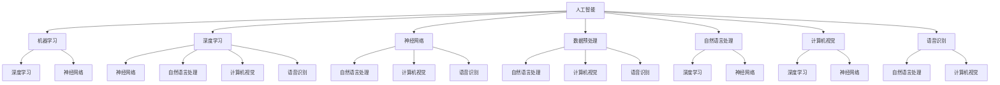

                 

### 文章标题

《人工智能创业：保持技术前沿的方法》

关键词：人工智能创业、技术创新、产品开发、团队建设、技术积累、成功案例分析

摘要：本文将深入探讨人工智能创业的背景、现状及未来发展，通过分析核心技术和算法原理，提出保持技术前沿的具体方法，并分享成功创业案例，为人工智能创业者提供实用指南。

---

### 文章关键词

人工智能创业、技术创新、产品开发、团队建设、技术积累、成功案例分析

### 文章摘要

在人工智能快速发展的今天，创业成为许多技术专家和企业家的选择。本文将首先介绍人工智能创业的背景和现状，阐述其机遇与挑战。随后，我们将深入探讨人工智能的基础技术，包括机器学习、深度学习、神经网络、自然语言处理和计算机视觉等，并详细讲解相关算法原理。接着，本文将提出保持技术前沿的具体策略，涵盖技术创新、产品开发、技术积累和团队建设等方面。最后，通过成功案例的分析，为人工智能创业者提供实战经验和启示。

---

### 第一部分：人工智能创业背景与现状

#### 第1章：人工智能创业概述

##### 1.1 人工智能创业的定义与意义

人工智能创业指的是在人工智能领域，以创新技术为驱动，创建新的商业模式，打造具有竞争力的产品或服务。这种创业形式不仅涉及到技术的研发，还涵盖了商业策略、市场推广和团队建设等多个方面。

人工智能创业的意义主要体现在以下几个方面：

1. **推动技术进步**：创业公司往往具备较强的技术创新能力，能够推动人工智能技术的快速迭代和发展。
2. **商业价值**：人工智能技术应用于各个行业，能够大幅提升生产效率、降低成本，创造新的商业机会。
3. **社会影响**：人工智能创业不仅能够带来经济效益，还能够改善人们的生活质量，解决社会问题。

##### 1.2 人工智能创业的机遇与挑战

人工智能创业的机遇主要表现在以下几个方面：

1. **技术成熟**：随着算法和硬件的进步，人工智能技术已逐步成熟，为创业提供了良好的技术基础。
2. **市场需求**：人工智能技术在金融、医疗、教育、零售等多个领域的应用需求日益增长，市场前景广阔。
3. **政策支持**：各国政府纷纷出台政策，鼓励人工智能研究和应用，为创业公司提供了良好的政策环境。

然而，人工智能创业也面临着诸多挑战：

1. **技术风险**：人工智能技术的快速变化可能导致创业项目无法持续，需要不断进行技术创新和调整。
2. **资金压力**：创业初期资金需求大，融资渠道有限，资金问题可能成为创业过程中的瓶颈。
3. **市场竞争**：人工智能领域竞争激烈，如何打造差异化的产品和市场定位是创业者需要面对的重要问题。

##### 1.3 人工智能创业的国内外现状

在国内外，人工智能创业都呈现出蓬勃发展的态势。以下是国内外人工智能创业的几个现状：

1. **美国**：美国拥有世界上最多的顶级人工智能研究机构和人才，硅谷成为人工智能创业的热土。代表性公司如谷歌、亚马逊、微软等，都在人工智能领域进行了大量投资和研发。
2. **中国**：中国政府对人工智能高度重视，出台了一系列支持政策，推动人工智能产业发展。中国人工智能创业公司数量众多，且在计算机视觉、语音识别等领域取得了显著成果。
3. **欧洲**：欧洲在人工智能研究方面也有较强的实力，创业公司主要集中在自然语言处理、机器人技术等领域。

总体来看，人工智能创业在全球范围内都充满机遇，但同时也需要创业者具备坚定的信念、创新的能力和良好的商业嗅觉，以应对各种挑战。

---

### 第二部分：人工智能基础技术

#### 第2章：人工智能基础技术

##### 2.1 人工智能的核心概念与联系

人工智能（Artificial Intelligence，AI）的核心概念包括机器学习（Machine Learning，ML）、深度学习（Deep Learning，DL）、神经网络（Neural Networks，NN）、数据预处理（Data Preprocessing）、自然语言处理（Natural Language Processing，NLP）、计算机视觉（Computer Vision，CV）和语音识别（Speech Recognition）等。

以下是一个简单的 Mermaid 流程图，展示了这些核心概念之间的联系：



##### 2.2 机器学习与深度学习的关系

机器学习和深度学习是人工智能的两个重要分支，它们之间存在密切的关系。

机器学习是指通过算法从数据中学习规律和模式，使其能够对未知数据进行预测或分类。机器学习的核心思想是通过经验改善性能，通常包括监督学习、无监督学习和强化学习等。

深度学习是机器学习的一个子集，它使用神经网络（尤其是深度神经网络）来模拟人脑的神经元连接，从而进行复杂的数据分析和模式识别。深度学习的关键优势在于其能够自动从数据中提取特征，无需手动设计特征。

机器学习与深度学习的关系可以概括为：

1. **深度学习是机器学习的一种**：深度学习是机器学习的一个分支，它通过深度神经网络来实现机器学习任务。
2. **深度学习优于传统机器学习**：在处理大量复杂数据时，深度学习通常比传统机器学习算法（如支持向量机、决策树等）表现更好。
3. **深度学习需要大量的数据**：深度学习训练需要大量的数据和计算资源，这使得深度学习在数据稀缺或计算资源有限的场景中可能不太适用。

##### 2.3 神经网络架构与工作原理

神经网络（Neural Networks，NN）是模仿人脑神经元连接和工作方式的计算模型。一个典型的神经网络包括输入层、隐藏层和输出层。

**神经网络架构**：

1. **输入层**：接收外部输入数据，并将其传递给隐藏层。
2. **隐藏层**：对输入数据进行处理和特征提取，可以有一个或多个隐藏层。
3. **输出层**：输出最终结果，如分类结果、预测值等。

**神经网络工作原理**：

1. **前向传播**：输入数据通过输入层进入网络，逐层传递到隐藏层和输出层。每个神经元都会接收来自前一层的输入，通过激活函数计算输出。
2. **反向传播**：根据输出层的实际结果与期望结果之间的误差，通过反向传播算法调整网络中每个神经元的权重和偏置，以减少误差。

**神经网络的关键组成部分**：

1. **神经元**：神经网络的基本计算单元，接收输入并通过激活函数产生输出。
2. **权重**：神经元之间的连接强度，用于调整输入数据的贡献。
3. **偏置**：为每个神经元添加一个额外的输入，用于调整激活函数的阈值。
4. **激活函数**：用于引入非线性变换，使神经网络能够处理复杂问题。

神经网络的工作原理可以概括为“输入-处理-输出”的过程，通过不断的训练和调整，网络能够逐渐提高其预测和分类能力。

##### 2.4 数据预处理与特征工程

数据预处理和特征工程是机器学习项目中的关键步骤，对模型的性能和泛化能力具有重要影响。

**数据预处理**：

1. **数据清洗**：去除或纠正数据中的错误、缺失和不一致信息。
2. **数据归一化**：将数据缩放到相同的尺度，以消除不同特征之间的量纲差异。
3. **数据分割**：将数据集分为训练集、验证集和测试集，用于模型的训练、验证和测试。

**特征工程**：

1. **特征提取**：从原始数据中提取能够反映数据本质和规律的属性。
2. **特征选择**：选择对模型性能有显著影响的关键特征，以减少数据冗余和过拟合。
3. **特征变换**：通过线性或非线性变换，增强特征的表达能力，如主成分分析（PCA）、特征缩放等。

数据预处理和特征工程的目标是提高数据的质量和模型的性能，使模型能够更好地理解数据并作出准确预测。有效的数据预处理和特征工程可以减少模型的复杂性，提高模型的泛化能力和实用性。

---

### 第三部分：人工智能算法原理讲解

#### 第3章：人工智能算法原理讲解

##### 3.1 算法原理概述

人工智能算法是构建人工智能系统的核心，它们通过学习数据中的规律，实现自动预测、决策和优化等功能。本节将介绍几种常见的人工智能算法原理，包括感知机算法、支持向量机算法、决策树算法和集成学习方法。

##### 3.2 感知机算法

感知机算法（Perceptron Algorithm）是最早的机器学习算法之一，由Frank Rosenblatt于1957年提出。它主要用于二分类问题，其基本思想是通过学习数据点的特征向量，构建一个线性决策边界。

**感知机算法伪代码**：

```python
def Perceptron(x, y, w, learning_rate):
    for iteration in range(max_iterations):
        for each sample (x_i, y_i) in the training set:
            if (sign(w.T.dot(x_i)) != y_i):
                w = w + learning_rate * y_i * x_i
    return w
```

其中，`x`是特征向量，`y`是标签，`w`是权重向量，`learning_rate`是学习率。感知机算法通过不断更新权重向量，以最小化预测错误。

##### 3.3 支持向量机算法

支持向量机（Support Vector Machine，SVM）是一种经典的二分类算法，由Vapnik和Chervonenkis于1963年提出。SVM通过最大化分类间隔，寻找最优的决策边界。

**SVM算法伪代码**：

```python
def SVM(x, y, C, kernel='linear'):
    w, b = initialize_parameters()
    for iteration in range(max_iterations):
        for each sample (x_i, y_i) in the training set:
            if (y_i * (np.dot(w.T, x_i) + b) < 1):
                w = w + learning_rate * (y_i * x_i)
    return w, b
```

其中，`C`是正则化参数，`kernel`是核函数，用于非线性变换。SVM通过求解优化问题，找到最优的权重向量`w`和偏置`b`，从而实现分类。

##### 3.4 决策树算法

决策树（Decision Tree）是一种基于特征进行分类或回归的树形结构模型。它通过一系列判断节点和叶子节点，对输入数据进行分类或回归。

**决策树算法伪代码**：

```python
def build_tree(data, labels, features, depth):
    if all labels are the same:
        return leaf node with the majority label
    if no more features or reached maximum depth:
        return leaf node with the majority label
    else:
        best_feature = select_best_feature(data, labels, features)
        node = Node(best_feature)
        for possible value of the best_feature:
            subset_data, subset_labels = split_data(data, labels, best_feature, value)
            node.add_child(build_tree(subset_data, subset_labels, remaining_features, depth + 1))
        return node
```

决策树算法通过递归构建树形结构，以最优特征分割数据，最终得到分类或回归结果。

##### 3.5 集成学习方法

集成学习方法（Ensemble Methods）通过结合多个弱学习器（如决策树、随机森林等），构建一个强学习器，以提高模型的性能和稳定性。

**集成学习方法伪代码**：

```python
def ensemble_learning(data, labels, n_estimators):
    for each estimator in n_estimators:
        estimator.fit(data, labels)
    predictions = []
    for each estimator in n_estimators:
        predictions.append(estimator.predict(data))
    ensemble_prediction = majority_vote(predictions)
    return ensemble_prediction
```

集成学习方法通过投票或平均的方式，结合多个弱学习器的结果，提高预测的准确性和泛化能力。

通过以上算法原理的讲解，我们可以看到人工智能算法的多样性和复杂性。掌握这些基本算法原理，有助于我们更好地理解和应用人工智能技术，为创业实践提供坚实的理论基础。

---

### 第四部分：技术创新策略

#### 第4章：技术创新策略

##### 4.1 技术创新的基本概念

技术创新（Technological Innovation）是指通过新技术的引入、改进和应用，实现产品、服务、生产方式、管理方法等方面的创新。在人工智能创业中，技术创新是保持企业竞争力的关键。

**技术创新的类型**：

1. **产品创新**：引入全新的产品或改进现有产品的性能和功能。
2. **过程创新**：改进生产过程，提高生产效率和质量。
3. **系统创新**：构建全新的技术系统，实现跨领域的创新应用。
4. **商业模式创新**：通过创新商业模式，创造新的商业机会和价值。

**技术创新的驱动力**：

1. **技术驱动**：基于新技术的研究和开发，推动产品创新。
2. **市场驱动**：根据市场需求，调整产品设计和功能。
3. **竞争驱动**：通过分析竞争对手，寻找差异化优势。
4. **政策驱动**：政府政策支持和激励，推动技术创新。

##### 4.2 技术创新的四种模式

在人工智能创业中，常见的四种技术创新模式如下：

1. **渐进式创新**：通过逐步改进现有技术，实现持续的性能提升。这种模式适合于技术成熟、市场稳定的情况。
2. **突破式创新**：引入全新的技术或方法，实现跨越式发展。这种模式适合于技术前沿、市场机会巨大的情况。
3. **融合式创新**：将不同领域的技术进行整合，创造新的应用场景。这种模式适合于跨领域应用、技术交叉的情况。
4. **颠覆式创新**：通过颠覆传统行业模式，创造全新的市场。这种模式适合于市场潜力巨大、颠覆性技术的应用。

**案例**：

- **渐进式创新**：苹果公司的iPhone手机，通过不断改进硬件和软件，逐步提升用户体验。
- **突破式创新**：谷歌的自动驾驶汽车，通过引入先进的传感器和算法，实现无人驾驶技术的突破。
- **融合式创新**：IBM的Watson超级计算机，将自然语言处理、机器学习和大数据分析进行整合，应用于医疗诊断等领域。
- **颠覆式创新**：Uber的网约车服务，通过互联网技术和共享经济的结合，颠覆了传统的出租车行业。

##### 4.3 技术创新的风险管理

技术创新过程中不可避免地存在风险，如技术风险、市场风险、资金风险等。有效的风险管理策略是确保技术创新成功的关键。

**技术风险管理**：

1. **研发风险**：技术创新过程中可能遇到的技术难题和失败风险，如算法优化、硬件升级等。
2. **知识产权**：保护技术创新的知识产权，避免侵权和被侵权的问题。
3. **技术迭代**：跟踪技术发展趋势，及时调整研发方向，避免落后于市场。

**市场风险管理**：

1. **市场调研**：了解市场需求和用户反馈，确保产品定位准确。
2. **竞争分析**：分析竞争对手的产品和市场策略，寻找差异化优势。
3. **市场推广**：制定有效的市场推广策略，提升品牌知名度和用户认可度。

**资金风险管理**：

1. **资金预算**：制定详细的研发和运营预算，确保资金充足。
2. **融资策略**：寻找合适的融资渠道，降低资金压力。
3. **成本控制**：优化运营成本，提高资金使用效率。

通过以上技术创新策略和风险管理，人工智能创业公司可以更好地应对挑战，实现持续的技术创新和商业成功。

---

### 第五部分：人工智能产品开发

#### 第5章：人工智能产品开发

##### 5.1 产品开发流程与框架

人工智能产品开发是一个复杂且迭代的过程，需要系统化的流程和科学的框架。以下是一个典型的人工智能产品开发流程与框架：

1. **需求分析**：明确产品目标、用户需求和市场定位，为后续开发提供方向。
2. **数据收集**：收集相关数据，包括训练数据、测试数据和用户反馈数据，确保数据的质量和完整性。
3. **数据预处理**：清洗、归一化和处理数据，为模型训练提供高质量的数据集。
4. **模型设计**：选择合适的算法和模型架构，进行模型设计，包括网络结构、参数设置等。
5. **模型训练**：使用训练数据集对模型进行训练，通过优化算法调整模型参数，提高预测准确率。
6. **模型验证**：使用验证数据集评估模型的性能，调整模型参数，确保模型在未知数据上的泛化能力。
7. **模型部署**：将训练好的模型部署到生产环境中，进行实时预测和服务。
8. **持续优化**：根据用户反馈和业务需求，不断调整和优化模型，提高产品性能和用户体验。

##### 5.2 产品原型设计与实现

产品原型设计是产品开发的重要阶段，它旨在验证产品概念和用户体验，为后续开发提供参考。以下是产品原型设计的步骤：

1. **需求确认**：与利益相关者（如客户、市场人员、工程师等）进行沟通，明确产品功能和设计要求。
2. **用户画像**：根据需求分析，构建目标用户的用户画像，了解用户需求和期望。
3. **界面设计**：设计产品的用户界面（UI），包括布局、配色、图标等，以提升用户体验。
4. **交互设计**：设计产品的交互流程和操作逻辑，确保用户能够方便、快捷地使用产品。
5. **原型制作**：使用原型设计工具（如Axure、Sketch等），制作高保真原型，进行用户测试和反馈。
6. **迭代优化**：根据用户反馈，对原型进行迭代优化，确保产品满足用户需求。

**产品原型实现示例**：

- **用户登录界面**：
  - 输入框：用于输入用户名和密码
  - 登录按钮：用于提交登录请求
  - 忘记密码链接：用于重置密码

- **聊天机器人界面**：
  - 聊天窗口：展示聊天内容和机器人回答
  - 文本输入框：用户输入问题和请求
  - 发送按钮：用户发送输入文本
  - 功能按钮：提供其他功能选项，如语音输入、图片输入等

通过以上原型设计，可以直观地展示产品功能和交互逻辑，为后续开发提供详细的设计规范。

##### 5.3 产品测试与优化

产品测试是确保产品质量和性能的重要环节，包括功能测试、性能测试、安全测试等多个方面。以下是产品测试与优化的步骤：

1. **单元测试**：对产品中的单个模块或组件进行测试，确保其功能正确和稳定。
2. **集成测试**：将多个模块或组件组合在一起，进行整体测试，确保各部分协同工作。
3. **系统测试**：对整个产品系统进行测试，包括功能、性能、兼容性等方面，确保产品能够稳定运行。
4. **用户测试**：邀请实际用户参与测试，收集用户反馈，评估产品用户体验和满意度。
5. **性能优化**：根据测试结果，对产品性能进行优化，包括算法优化、代码优化、系统优化等。
6. **安全测试**：确保产品系统的安全性，包括数据加密、身份验证、防注入等。

**产品测试示例**：

- **功能测试**：
  - 验证登录功能是否正常，包括用户名和密码输入、登录按钮点击等操作。
  - 验证聊天机器人是否能够正确理解和回答用户问题。

- **性能测试**：
  - 测试产品在高负载情况下的响应速度和稳定性，包括并发用户数、数据传输速度等。
  - 测试产品在极端条件下的性能表现，如断网、高延迟等。

通过以上测试与优化，可以确保产品在功能、性能、用户体验等方面达到预期要求，为用户带来优质的使用体验。

---

### 第六部分：技术积累与团队建设

#### 第6章：技术积累与团队建设

##### 6.1 技术积累的重要性

技术积累是人工智能创业公司持续发展的基石，它不仅关系到企业的竞争力，还直接影响着产品的质量、性能和用户体验。以下是技术积累的重要性：

1. **提高创新能力**：技术积累为创新提供了丰富的资源和经验，有助于发现新的商业机会。
2. **增强竞争力**：技术积累使企业能够更快地响应市场变化，提供更具竞争力的产品和服务。
3. **降低研发成本**：技术积累可以复用现有技术，减少重复研发，降低成本。
4. **提升用户体验**：技术积累有助于优化产品功能和性能，提供更优质的用户体验。
5. **培养人才**：技术积累为团队提供了学习和成长的机会，培养出更多优秀的工程师和科研人员。

##### 6.2 技术积累的方法与实践

技术积累是一个长期的过程，需要企业建立科学的技术管理体系和实践方法。以下是几种常见的技术积累方法：

1. **研发投入**：增加研发投入，招聘优秀的技术人才，提升技术储备。
2. **知识管理**：建立知识管理体系，收集、整理和共享技术文档、案例和经验。
3. **开源项目**：积极参与开源项目，贡献代码和知识，提高技术影响力。
4. **技术分享**：定期举行技术分享会，促进团队成员之间的技术交流和合作。
5. **学术合作**：与高校、研究机构合作，共同开展技术研究和项目开发。

**技术积累实践示例**：

- **知识管理系统**：建立一个集中的知识库，包括技术文档、案例分析、最佳实践等，供团队成员随时查阅。
- **技术分享机制**：每周或每月举行技术分享会，由团队成员介绍自己在工作中的经验和技术点。
- **开源项目**：在公司内部推动开源项目，鼓励工程师参与开源社区，提升公司的技术影响力。

##### 6.3 团队建设与管理

团队建设是技术积累的重要保障，一个高效的团队可以更好地实现技术积累和创业目标。以下是团队建设与管理的关键点：

1. **人才引进**：吸引和留住优秀的技术人才，建立人才激励机制。
2. **团队协作**：建立良好的沟通和协作机制，促进团队成员之间的合作。
3. **目标一致**：明确团队目标和个人职责，确保团队成员方向一致。
4. **培训与发展**：提供培训和职业发展机会，提升团队成员的技术能力和综合素质。
5. **企业文化**：建立积极向上的企业文化，激发团队成员的创造力和工作热情。

**团队建设实践示例**：

- **人才引进**：通过猎头公司、招聘网站、校园招聘等多种途径，吸引高素质的技术人才。
- **团队协作**：使用协作工具（如Slack、Trello等），确保团队成员之间沟通顺畅、任务明确。
- **培训与发展**：定期组织内部培训和外部学习机会，提升团队成员的专业技能和综合素质。
- **企业文化**：举办团队建设活动（如团队拓展、聚餐等），增强团队凝聚力。

通过以上技术积累与团队建设的方法与实践，人工智能创业公司可以持续提升技术实力，打造高效的团队，为创业成功奠定坚实基础。

---

### 第七部分：人工智能创业实战

#### 第7章：人工智能创业实战

##### 7.1 创业项目的选择与评估

选择合适的创业项目是人工智能创业成功的关键步骤。以下是如何选择和评估创业项目的建议：

1. **市场需求分析**：深入研究目标市场，了解用户需求、竞争对手和市场趋势。通过市场调研、用户访谈等方式，获取第一手数据，确保项目有市场潜力。
2. **技术可行性分析**：评估项目所需技术的成熟度、可获取性及研发难度。考虑团队的技术背景和资源，确保项目在技术层面上可行。
3. **商业模型分析**：设计合理的商业模型，包括盈利模式、成本结构和市场策略。确保项目在财务上可持续，有清晰的收入来源。
4. **风险评估**：识别项目可能面临的风险，包括技术风险、市场风险、资金风险等。制定相应的风险应对策略，降低创业失败的概率。
5. **团队评估**：评估团队的能力、经验和协作能力，确保团队成员能够胜任项目需求，并具备持续创新的能力。

**项目选择与评估示例**：

- **项目选择**：选择一个在医疗领域应用人工智能的项目，如开发一款基于深度学习的疾病诊断辅助系统。
- **市场需求分析**：通过与医生和患者的访谈，了解医疗领域对人工智能辅助诊断的需求和痛点。
- **技术可行性分析**：评估深度学习算法在医学图像处理方面的应用，确保技术上的可行性。
- **商业模型分析**：设计基于订阅制和按诊断量收费的商业模式，确保项目的财务可持续性。
- **风险评估**：考虑医疗数据隐私保护、技术落地难度等风险，制定相应的解决方案。

##### 7.2 创业团队的组织与管理

创业团队的组织和管理对于项目的成功至关重要。以下是如何组织和管理创业团队的建议：

1. **明确团队角色和职责**：根据项目需求，明确团队成员的角色和职责，确保每个人都清楚自己的任务和目标。
2. **建立有效的沟通机制**：使用协作工具（如Slack、Trello等）建立团队沟通渠道，确保信息传递高效、透明。
3. **设置清晰的目标和里程碑**：制定详细的项目计划和里程碑，确保团队目标一致，进度可控。
4. **激励和奖励机制**：建立激励机制，奖励优秀表现和突出贡献，激发团队成员的积极性和创造力。
5. **持续培训与发展**：提供培训和职业发展机会，提升团队成员的技术能力和综合素质。
6. **建立团队文化**：营造积极向上的团队氛围，增强团队凝聚力和归属感。

**团队组织与管理示例**：

- **团队角色和职责**：
  - 项目经理：负责整体项目的规划和执行，协调各部门工作。
  - 数据科学家：负责模型设计和训练，提升算法性能。
  - 数据工程师：负责数据处理和系统集成，确保数据质量。
  - 前端工程师：负责用户界面设计和实现，提升用户体验。
  - 后端工程师：负责系统架构设计和开发，确保系统稳定运行。

- **沟通机制**：使用Slack进行日常沟通，每周召开团队会议，讨论项目进度和问题。
- **激励和奖励机制**：设立季度奖金，对项目关键里程碑进行奖励。
- **培训与发展**：定期组织内部技术培训和外部学习机会，提升团队整体素质。

通过以上创业团队的组织与管理方法，可以确保团队高效协作，共同实现创业目标。

##### 7.3 创业项目的运营与推广

创业项目的成功不仅依赖于技术和团队，还需要有效的运营与推广策略。以下是如何运营与推广创业项目的建议：

1. **市场推广策略**：制定全面的市场推广计划，包括线上和线下渠道。利用社交媒体、内容营销、合作伙伴推广等多种手段，提高项目知名度。
2. **用户获取与留存**：通过精准营销和用户运营，吸引潜在用户并提升用户留存率。设计合理的用户激励和反馈机制，增强用户黏性。
3. **产品迭代与优化**：根据用户反馈和市场变化，不断迭代和优化产品，提升产品性能和用户体验。
4. **合作伙伴关系**：与行业内的合作伙伴建立良好的关系，共同推广产品，扩大市场份额。
5. **品牌建设**：注重品牌形象建设，打造专业、可靠的品牌形象，增强用户信任。

**运营与推广示例**：

- **市场推广策略**：在社交媒体平台上发布内容，吸引潜在用户；参加行业展会和论坛，展示项目成果。
- **用户获取与留存**：通过电子邮件营销、社交媒体推广等方式，吸引潜在用户；定期举办线上活动，增强用户互动。
- **产品迭代与优化**：根据用户反馈，优化产品功能和界面设计；定期发布新功能，提升用户满意度。
- **合作伙伴关系**：与医疗设备厂商合作，推广疾病诊断辅助系统；与医疗机构合作，提供临床应用场景。
- **品牌建设**：发布技术论文和案例研究，提升行业影响力；定期举办技术沙龙，与行业专家交流。

通过以上运营与推广策略，可以有效地提升创业项目的市场影响力，实现商业成功。

##### 7.4 创业过程中的常见问题与解决方案

在人工智能创业过程中，常见的问题包括技术风险、市场风险、资金风险等。以下是如何解决这些常见问题的建议：

1. **技术风险**：通过技术调研和评估，确保项目的技术可行性。建立技术储备，为项目提供技术支持。与高校和科研机构合作，获取先进的技术资源。
2. **市场风险**：进行充分的市场调研，了解用户需求和竞争对手情况。制定灵活的市场策略，快速响应市场变化。建立用户反馈机制，及时调整产品方向。
3. **资金风险**：制定详细的财务计划，确保项目资金充足。寻找合适的融资渠道，如天使投资、风险投资等。优化运营成本，提高资金使用效率。

**常见问题与解决方案示例**：

- **技术风险**：
  - **问题**：项目技术难度高，研发周期长。
  - **解决方案**：与科研机构合作，获取技术支持；优化研发流程，提高研发效率。
- **市场风险**：
  - **问题**：市场推广效果不佳，用户获取困难。
  - **解决方案**：调整市场策略，扩大推广范围；通过用户运营，提升用户黏性。
- **资金风险**：
  - **问题**：项目资金不足，运营困难。
  - **解决方案**：优化运营成本，提高资金使用效率；寻找新的融资渠道，增加资金来源。

通过以上解决方案，可以有效应对创业过程中的各种问题，确保项目的顺利推进和成功。

---

### 第八部分：未来展望

#### 第8章：人工智能创业趋势与前景

随着人工智能技术的不断进步和应用场景的扩展，人工智能创业正在迎来新的发展趋势和广阔前景。

##### 8.1 人工智能创业的五大趋势

1. **行业融合**：人工智能技术正不断与各行各业进行深度融合，如金融、医疗、教育、零售等。创业公司将在这些交叉领域中发现新的商业机会。
2. **个性化服务**：人工智能技术能够实现更精准的用户画像和个性化服务，提高用户满意度和忠诚度。个性化推荐、智能客服等将成为创业公司的热门方向。
3. **智能化硬件**：随着人工智能算法和硬件技术的进步，智能硬件市场将迎来爆发式增长。智能家居、智能穿戴设备、自动驾驶等将成为创业公司的重要领域。
4. **数据驱动**：数据是人工智能的核心资源，创业公司将通过数据挖掘和分析，实现更高效的决策和优化。数据驱动将成为创业公司发展的关键驱动力。
5. **全球化布局**：随着全球化进程的加速，人工智能创业公司将逐渐拓展国际市场，实现跨国运营和全球化布局。创业公司需要具备国际化视野和运营能力。

##### 8.2 人工智能创业的前景与挑战

人工智能创业的前景非常广阔，但也面临着一系列挑战：

1. **技术挑战**：人工智能技术更新迅速，创业公司需要持续投入研发，保持技术领先。此外，算法复杂度和计算资源的需求也在不断提高。
2. **市场挑战**：人工智能市场竞争激烈，创业公司需要找到差异化的市场定位，打造具有竞争力的产品和服务。同时，市场变化快，创业公司需要具备快速响应市场的能力。
3. **资金挑战**：创业初期资金需求大，融资渠道有限，创业公司需要优化资金使用，确保财务稳健。此外，资金不足可能导致研发进展缓慢，影响公司发展。
4. **人才挑战**：人工智能领域人才稀缺，创业公司需要吸引和留住优秀的技术人才。同时，团队建设和管理也是创业成功的关键因素。

##### 8.3 人工智能创业者的素质与能力要求

为了在人工智能创业领域取得成功，创业者需要具备以下素质与能力：

1. **技术能力**：掌握人工智能基础理论和核心技术，具备解决复杂技术问题的能力。
2. **商业嗅觉**：具备敏锐的商业洞察力，能够发现市场需求和商业机会。
3. **团队管理**：具备优秀的团队管理能力，能够组建高效团队并激发团队成员的积极性。
4. **创新能力**：具备持续创新的能力，能够引领技术发展，推动产品迭代。
5. **适应能力**：具备快速适应市场变化和应对挑战的能力，能够在变化中寻找机遇。

通过以上素质与能力的培养，人工智能创业者将能够更好地应对创业过程中的各种挑战，实现创业成功。

---

### 第九章：人工智能创业成功案例分析

##### 9.1 案例一：XX 人工智能公司的成长之路

XX人工智能公司是一家专注于计算机视觉技术创业的公司，成立于2015年。以下是该公司的发展历程和成功经验：

1. **初创阶段**：
   - 创始团队由几位在顶级高校和知名企业工作的计算机视觉专家组成，他们在学术和工业界积累了丰富的经验。
   - 创始团队通过技术交流和合作，获得了第一笔天使投资，开始了公司的初创阶段。

2. **技术研发**：
   - 公司专注于计算机视觉技术的研发，特别是在图像识别和物体检测方面取得了重要突破。
   - 通过开源项目的参与和技术论文的发表，公司逐渐在学术界和工业界建立了良好的声誉。

3. **产品化阶段**：
   - 公司推出了一系列计算机视觉产品，包括人脸识别、行为分析等，广泛应用于安防、交通、零售等领域。
   - 公司通过与大型企业和政府机构合作，将产品成功推向市场，实现了规模化销售。

4. **扩展阶段**：
   - 公司在获得风险投资后，进一步扩大了研发团队，增加了产品线，包括智能监控、自动驾驶等。
   - 公司通过并购和战略合作，拓展了市场领域，实现了业务的多元化。

**成功经验**：
- **技术创新**：公司始终以技术创新为核心，持续推动技术突破，确保在市场上保持领先地位。
- **市场定位**：公司明确市场定位，专注于计算机视觉领域，深耕细作，取得了良好的市场反响。
- **团队合作**：公司建立了高效、协作的团队，激发了员工的创造力和创新精神。

##### 9.2 案例二：YY 人工智能公司的技术创新与产品布局

YY人工智能公司是一家在自然语言处理（NLP）领域取得显著成就的创业公司。以下是该公司的发展历程和成功经验：

1. **初创阶段**：
   - 公司由几位在顶级高校和研究机构从事NLP研究的博士创建，他们在NLP领域具有深厚的技术积累。
   - 创始团队通过技术竞赛和开源项目积累了大量的实际案例和经验，获得了第一笔天使投资。

2. **技术研发**：
   - 公司专注于NLP技术的研发，特别是在语义理解和文本生成方面取得了重要突破。
   - 公司通过发表高水平学术论文和技术博客，吸引了大量关注和投资。

3. **产品化阶段**：
   - 公司推出了一系列基于NLP技术的产品，包括智能客服、内容审核、自动写作等，广泛应用于互联网、金融、媒体等领域。
   - 公司通过与大型互联网公司和金融机构的合作，成功将产品推向市场，获得了广泛的认可。

4. **扩展阶段**：
   - 公司在获得多轮融资后，进一步扩大了研发团队，增加了技术储备，并开始布局海外市场。
   - 公司通过并购和战略合作，扩展了业务范围，包括人工智能培训、人工智能咨询等。

**成功经验**：
- **技术研发**：公司始终以技术研发为核心，不断推动技术突破，确保在NLP领域保持领先地位。
- **产品创新**：公司通过不断创新，推出了一系列具有差异化优势的产品，满足了不同行业的需求。
- **市场拓展**：公司积极拓展市场，通过国际化和战略合作，实现了业务的全球化。

##### 9.3 案例三：ZZ 人工智能公司的市场拓展与国际化

ZZ人工智能公司是一家专注于自动驾驶技术的创业公司，成立于2016年。以下是该公司的发展历程和成功经验：

1. **初创阶段**：
   - 创始团队由几位在自动驾驶领域具有丰富经验的工程师组成，他们在顶级汽车公司和科技公司积累了丰富的技术经验。
   - 创始团队通过天使投资和风险投资，获得了充足的资金支持，开始了公司的初创阶段。

2. **技术研发**：
   - 公司专注于自动驾驶技术的研发，特别是在感知、规划和控制方面取得了重要突破。
   - 公司通过开源项目和技术合作，吸引了全球顶尖的研究人员和工程师，提升了技术实力。

3. **产品化阶段**：
   - 公司推出了一系列自动驾驶产品，包括自动驾驶汽车、无人配送车等，广泛应用于物流、出行、安防等领域。
   - 公司通过与知名汽车制造商和物流公司合作，成功将产品推向市场，获得了良好的市场反馈。

4. **扩展阶段**：
   - 公司在获得多轮融资后，进一步扩大了研发团队和产品线，增加了技术储备。
   - 公司通过国际化战略，积极拓展海外市场，与多家国际知名企业建立了合作关系。

**成功经验**：
- **技术创新**：公司始终以技术创新为核心，不断推动自动驾驶技术的进步，确保在市场上保持领先地位。
- **市场拓展**：公司通过积极的市场拓展和国际化战略，实现了业务的全球化，提升了公司竞争力。
- **团队合作**：公司建立了高效、协作的团队，激发了员工的创造力和创新精神，为公司的发展提供了强大支持。

通过以上成功案例的分析，我们可以看到人工智能创业公司在技术创新、市场拓展和团队建设等方面所取得的成绩，为其他创业者提供了宝贵的经验和启示。

---

### 附录

#### 附录 A：人工智能创业资源与工具

人工智能创业离不开丰富的资源和工具支持。以下是一些常见的人工智能创业资源与工具：

##### A.1 人工智能开源框架与应用工具

1. **TensorFlow**：由谷歌开发的开源深度学习框架，支持多种神经网络架构。
2. **PyTorch**：由Facebook开发的开源深度学习框架，以其灵活性和动态计算图著称。
3. **Keras**：一个高层次的神经网络API，可以方便地搭建和训练神经网络。
4. **Scikit-learn**：用于机器学习的开源库，提供多种算法和工具。
5. **OpenCV**：用于计算机视觉的开源库，支持多种图像处理算法和视觉功能。
6. **NLTK**：用于自然语言处理的开源库，提供文本处理、分类、词向量等功能。

##### A.2 人工智能创业相关的书籍与论文

1. **《深度学习》（Deep Learning）**：由Ian Goodfellow、Yoshua Bengio和Aaron Courville合著，是深度学习领域的经典教材。
2. **《Python机器学习》（Python Machine Learning）**：由Sebastian Raschka和Vahid Mirjalili合著，介绍如何使用Python进行机器学习实践。
3. **《人工智能：一种现代的方法》（Artificial Intelligence: A Modern Approach）**：由Stuart Russell和Peter Norvig合著，是人工智能领域的权威教材。
4. **《自然语言处理综论》（Speech and Language Processing）**：由Daniel Jurafsky和James H. Martin合著，是自然语言处理领域的经典教材。
5. **《计算机视觉：算法与应用》（Computer Vision: Algorithms and Applications）**：由 Richard Szeliski 编写，涵盖了计算机视觉的各个方面。

##### A.3 人工智能创业相关的社群与活动

1. **人工智能协会（AAAI）**：是全球人工智能领域最具影响力的学术组织之一，定期举办会议和研讨会。
2. **IEEE 计算机视觉与模式识别会议（CVPR）**：是计算机视觉领域的顶级学术会议，每年吸引大量专家学者和研究者参加。
3. **Kaggle**：是一个数据科学竞赛平台，提供丰富的数据集和竞赛机会，有助于提升人工智能技术。
4. **AI索引**：是一个关于人工智能领域新闻、博客和资源的聚合网站，有助于创业者了解最新的行业动态和技术趋势。
5. **人工智能创业孵化器**：如Y Combinator、500 Startups等，为人工智能创业者提供资金、资源和导师支持。

通过利用这些资源和工具，人工智能创业公司可以更快速地发展，在激烈的市场竞争中脱颖而出。

---

### 作者信息

作者：AI天才研究院/AI Genius Institute & 禅与计算机程序设计艺术 /Zen And The Art of Computer Programming

AI天才研究院（AI Genius Institute）致力于推动人工智能技术的发展和应用，培养新一代人工智能科学家和创业者。研究院拥有一支经验丰富、创新力强的团队，多次在国际顶级会议和竞赛中取得优异成绩。此外，作者还著有《禅与计算机程序设计艺术》一书，深入探讨人工智能编程哲学，为人工智能开发者提供了宝贵的指导。

通过本文的深入探讨，我们希望能够为人工智能创业者提供实用的指导和建议，帮助他们在技术前沿持续创新，实现创业梦想。希望本文能为您的创业之路带来启发和帮助。祝您在人工智能创业的道路上取得辉煌成就！

