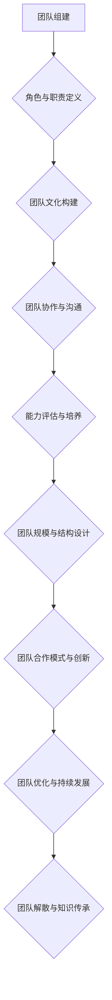

                 

## 文章标题

### 人工智能创业：团队建设的重要性

> 关键词：人工智能创业、团队建设、团队协作、人才吸引、管理技巧

> 摘要：本文深入探讨了人工智能创业的背景与机遇，分析了团队建设在人工智能创业中的关键作用。通过详细阐述团队建设的基本原则、组建策略、协作工具以及实践案例，本文旨在为创业者提供有价值的指导，以构建高效的人工智能创业团队，确保项目成功。

----------------------------------------------------------------

### 《人工智能创业：团队建设的重要性》目录大纲

- **第一部分：人工智能创业概述**
  - **第1章：人工智能与创业机遇**
    - **1.1 人工智能时代背景**
    - **1.2 创业者的AI观念更新**
    - **1.3 人工智能创业的机遇与挑战**
    - **1.4 成功的人工智能创业案例分析**
  - **第2章：人工智能领域概述**
    - **2.1 人工智能的基本概念**
    - **2.2 人工智能的主要应用领域**
    - **2.3 人工智能技术的发展趋势**
  
- **第二部分：团队建设的重要性**
  - **第3章：团队建设的基本原则**
    - **3.1 团队成员的角色与职责**
    - **3.2 团队文化构建**
    - **3.3 团队协作与沟通**
    - **3.4 团队管理技巧**
  - **第4章：人工智能团队的组建策略**
    - **4.1 人工智能人才的吸引与保留**
    - **4.2 团队成员的能力评估与培养**
    - **4.3 团队规模与组织结构设计**
    - **4.4 团队合作模式与创新**
  - **第5章：团队协作工具与平台**
    - **5.1 团队协作工具的选择**
    - **5.2 团队协作平台的功能与应用**
    - **5.3 人工智能团队的开发环境搭建**
    - **5.4 团队协作与效率提升**

- **第三部分：团队建设实践与案例分析**
  - **第6章：人工智能创业团队建设实践**
    - **6.1 团队建设的关键阶段**
    - **6.2 团队建设中的常见问题与解决方案**
    - **6.3 团队建设的量化评估方法**
    - **6.4 团队建设的持续改进**
  - **第7章：成功的人工智能创业团队案例分析**
    - **7.1 成功团队的共同特点**
    - **7.2 案例分析一：谷歌DeepMind团队**
    - **7.3 案例分析二：OpenAI团队**
    - **7.4 案例分析三：其他成功团队案例**

- **第四部分：团队建设与人工智能创业的未来**
  - **第8章：人工智能创业团队的未来趋势**
    - **8.1 未来人工智能创业团队的技能需求**
    - **8.2 团队协作与人工智能技术的融合**
    - **8.3 人工智能创业团队的发展方向**
    - **8.4 未来人工智能创业团队的管理模式**
  - **第9章：团队建设在人工智能创业中的核心作用**
    - **9.1 团队建设在人工智能创业中的关键地位**
    - **9.2 团队建设对人工智能创业成功的影响**
    - **9.3 团队建设与人工智能创业的可持续发展**
    - **9.4 团队建设与人工智能创业的未来展望**

- **附录**
  - **附录 A：人工智能创业团队建设资源推荐**
    - **A.1 常用团队协作工具推荐**
    - **A.2 团队建设与管理书籍推荐**
    - **A.3 人工智能领域学术期刊与会议推荐**
    - **A.4 在线课程与培训资源推荐**
  - **附录 B：人工智能创业团队建设流程图**

通过以上详细的目录大纲，读者可以全面了解人工智能创业中的团队建设的重要性，为构建高效的人工智能创业团队提供实用的指导。

----------------------------------------------------------------

### 第一部分：人工智能创业概述

#### 第1章：人工智能与创业机遇

人工智能（AI）作为一种革命性技术，正在深刻地改变全球的经济和社会结构。在这一章中，我们将探讨人工智能时代的背景，分析创业者如何更新观念以抓住AI带来的机遇，并探讨人工智能创业所面临的挑战。

**1.1 人工智能时代背景**

人工智能的发展历程可以追溯到20世纪50年代，当时计算机科学领域首次提出了“人工智能”的概念。然而，直到最近十年，随着计算能力的飞速提升和海量数据的积累，人工智能才真正进入了爆发期。以下是人工智能时代的一些关键背景：

- **计算能力的提升**：随着硬件技术的进步，尤其是图形处理单元（GPU）和定制化硬件的发展，计算能力得到了极大提升，为复杂的人工智能算法提供了强大的计算支持。
- **数据的积累**：互联网的普及和物联网的发展使得数据的产生和积累达到了前所未有的规模，为训练和优化人工智能模型提供了丰富的数据资源。
- **算法的突破**：深度学习等人工智能算法的突破，使得计算机在图像识别、自然语言处理、决策优化等领域取得了显著进展。

**1.2 创业者的AI观念更新**

面对人工智能时代的到来，创业者需要更新观念，以适应这一变革。以下是一些关键的观念更新：

- **技术前瞻性**：创业者需要具备前瞻性，积极拥抱新技术，将人工智能作为业务创新的核心驱动力。
- **跨学科合作**：人工智能涉及计算机科学、数据科学、心理学、神经科学等多个领域，创业者需要构建跨学科团队，实现知识的融合和创新。
- **用户中心**：人工智能的应用需要紧密结合用户需求，创业者需要以用户为中心，不断优化产品和服务。
- **社会责任**：随着人工智能技术的发展，创业者还需要关注技术的社会影响，承担社会责任，确保技术的安全和伦理使用。

**1.3 人工智能创业的机遇与挑战**

人工智能创业面临着巨大的机遇和挑战。以下是一些关键点：

- **市场潜力**：人工智能技术的广泛应用带来了巨大的市场潜力，特别是在医疗、金融、教育、零售等领域，创业者可以探索全新的商业模式。
- **技术风险**：人工智能技术的快速迭代和应用场景的复杂性带来了技术风险，创业者需要具备深厚的技术功底和风险管理能力。
- **数据隐私**：随着数据成为人工智能的核心资产，数据隐私和保护成为重要的挑战，创业者需要确保用户数据的安全和隐私。
- **人才短缺**：人工智能领域的高端人才相对稀缺，创业者需要制定有效的人才吸引和保留策略。

**1.4 成功的人工智能创业案例分析**

为了更好地理解人工智能创业的机遇和挑战，我们可以分析一些成功的人工智能创业案例：

- **谷歌DeepMind**：DeepMind通过深度学习技术实现了在围棋等复杂领域的人机对弈突破，成为人工智能领域的标杆企业。
- **OpenAI**：OpenAI致力于推动人工智能的发展，特别是在自然语言处理和通用人工智能（AGI）方面取得了显著成果。
- **IBM Watson**：IBM Watson通过集成人工智能技术，为医疗、金融等行业提供了智能化的解决方案，成为企业服务领域的领导者。

这些案例展示了人工智能创业的成功路径，同时也提醒创业者需要面对的挑战和风险。

通过本章的讨论，我们可以看到人工智能创业的机遇与挑战并存，创业者需要具备前瞻性的观念、跨学科的能力和有效的风险管理策略，以在人工智能时代取得成功。

---

在接下来的章节中，我们将进一步探讨人工智能领域的具体应用和未来发展趋势，为读者提供更全面的视角。

---

### 第2章：人工智能领域概述

#### 2.1 人工智能的基本概念

人工智能（AI，Artificial Intelligence）是计算机科学的一个分支，旨在通过模拟人类智能行为，使计算机具备自主学习、推理和问题解决的能力。以下是人工智能的一些基本概念：

- **人工神经网络（ANN）**：人工神经网络是一种模仿生物神经系统的计算模型，通过大量神经元和连接进行信息处理和学习。常见的神经网络结构包括前馈神经网络、卷积神经网络（CNN）和循环神经网络（RNN）。
- **机器学习（ML）**：机器学习是人工智能的核心技术之一，通过算法从数据中学习规律，进行预测和决策。常见的机器学习算法包括监督学习、无监督学习和强化学习。
- **深度学习（DL）**：深度学习是机器学习的一个分支，通过多层神经网络进行深度学习，能够处理大规模数据并提取复杂特征。深度学习在图像识别、语音识别和自然语言处理等领域取得了显著成果。
- **自然语言处理（NLP）**：自然语言处理是人工智能的一个重要应用领域，旨在使计算机理解和生成人类语言。NLP技术包括文本分类、情感分析、机器翻译和对话系统。
- **计算机视觉（CV）**：计算机视觉是研究如何使计算机像人类一样感知和理解视觉信息的技术。计算机视觉的应用包括图像识别、目标检测、人脸识别和自动驾驶。

#### 2.2 人工智能的主要应用领域

人工智能技术已经渗透到众多行业，带来了深刻的变革和创新。以下是一些主要的应用领域：

- **医疗健康**：人工智能在医疗健康领域的应用包括疾病诊断、药物研发、手术辅助和健康管理。例如，通过深度学习算法分析医学影像，可以帮助医生更准确地诊断疾病。
- **金融**：人工智能在金融领域主要用于风险管理、欺诈检测、智能投顾和量化交易。通过机器学习技术分析大量金融数据，可以帮助金融机构做出更准确的决策。
- **零售**：人工智能在零售行业的应用包括智能推荐、客户关系管理和库存管理。通过分析消费者行为数据，人工智能可以提供个性化的购物体验和精准的市场预测。
- **教育**：人工智能在教育领域的应用包括智能教学系统、个性化学习和在线教育平台。通过自然语言处理和计算机视觉技术，人工智能可以为学生提供个性化的学习支持和反馈。
- **制造**：人工智能在制造业的应用包括自动化生产线、质量控制、预测维护和供应链优化。通过计算机视觉和机器学习技术，人工智能可以提高生产效率和产品质量。
- **交通**：人工智能在交通领域的应用包括自动驾驶、智能交通管理和物流优化。自动驾驶技术有望彻底改变交通运输模式，提高交通效率和安全性。

#### 2.3 人工智能技术的发展趋势

人工智能技术正在快速发展，以下是一些主要的发展趋势：

- **量子计算**：量子计算是下一代计算技术，具有超越经典计算机的潜力。通过量子计算，人工智能可以解决更复杂的计算问题，如大规模数据分析和复杂优化问题。
- **边缘计算**：边缘计算将计算能力从云端转移到网络边缘，使数据处理更加实时和高效。在人工智能应用中，边缘计算可以支持实时智能决策，如自动驾驶和智能监控。
- **人机融合**：随着人工智能技术的发展，人机融合将成为未来趋势。通过增强现实（AR）和虚拟现实（VR）技术，人工智能可以帮助人类更好地与机器协作，提高工作效率和生活质量。
- **区块链与人工智能**：区块链技术可以为人工智能提供更安全、透明和可追溯的数据管理机制。结合人工智能，区块链可以在金融、供应链和医疗等领域带来创新应用。
- **伦理与法规**：随着人工智能技术的广泛应用，伦理和法规问题日益突出。人工智能的开发者需要关注伦理问题，制定相应的法规和标准，确保人工智能的安全和可持续发展。

通过本章的讨论，我们可以看到人工智能技术在不断发展和应用，为各个行业带来了巨大的机遇和挑战。在接下来的章节中，我们将深入探讨团队建设在人工智能创业中的重要性。

---

在接下来的章节中，我们将详细探讨团队建设的基本原则、组建策略、协作工具以及实践案例，为读者提供构建高效人工智能创业团队的有力指导。

---

### 第二部分：团队建设的重要性

在人工智能创业领域，成功的项目离不开高效、协作和创新的团队。团队建设是确保项目顺利进行和实现目标的关键因素。在这一部分，我们将详细探讨团队建设的基本原则、组建策略、协作工具以及实践案例，帮助创业者构建起一个强大的人工智能创业团队。

#### 第3章：团队建设的基本原则

团队建设是一项复杂的工程，需要遵循一系列基本原则，以确保团队成员之间能够高效协作，共同实现项目目标。以下是一些关键原则：

##### 3.1 团队成员的角色与职责

明确团队成员的角色和职责是团队建设的第一步。每个成员都应该清楚自己的工作内容和目标，以便更好地协同工作。以下是一些常见的团队成员角色：

- **领导者**：领导者负责制定团队目标、规划和决策，确保团队朝着正确的方向前进。
- **数据科学家**：数据科学家负责数据分析和建模，为项目提供数据驱动的决策支持。
- **软件工程师**：软件工程师负责开发、测试和维护人工智能系统的软件部分。
- **产品经理**：产品经理负责制定产品策略和规划，确保产品满足用户需求并具备市场竞争力。
- **市场营销人员**：市场营销人员负责推广产品，提升品牌知名度，吸引潜在客户。
- **运营人员**：运营人员负责日常运营和管理，确保项目的顺利进行。

##### 3.2 团队文化构建

团队文化是团队凝聚力和协作精神的重要基础。一个健康的团队文化能够促进团队成员之间的信任和尊重，提高工作效率。以下是一些构建团队文化的关键要素：

- **共同价值观**：团队应该具备共同的价值观，如创新、开放、协作和持续学习。这有助于团队成员在工作和生活中保持一致的行为和态度。
- **沟通机制**：团队成员之间应该建立高效的沟通机制，包括定期会议、即时通讯工具和协作平台。透明和及时的沟通可以减少误解和冲突，提高团队效率。
- **激励机制**：团队应该制定合理的激励机制，如绩效奖金、股权激励和员工福利。这可以激发团队成员的积极性和创造力，提高团队的凝聚力。
- **持续学习**：团队应该鼓励成员持续学习，提供培训和学习资源，以提升团队成员的技能和知识。这有助于团队保持技术领先和创新能力。

##### 3.3 团队协作与沟通

高效的团队协作和沟通是团队成功的关键。以下是一些促进团队协作和沟通的方法：

- **任务分配与跟踪**：明确任务分配和责任，确保每个成员了解自己的任务和目标。使用任务管理工具，如Jira或Trello，可以帮助团队成员实时跟踪任务进度和状态。
- **即时沟通**：使用即时通讯工具，如Slack或Microsoft Teams，可以快速解决问题和协作。团队应该建立高效的沟通渠道，确保信息传递的及时性和准确性。
- **定期会议**：定期召开团队会议，如周会、月度会议，可以总结工作进展、讨论问题并规划下一步行动。会议应该聚焦于关键问题，确保高效利用时间。
- **知识共享**：鼓励团队成员分享知识和经验，建立内部知识库或文档共享平台，确保知识的积累和传承。

##### 3.4 团队管理技巧

团队管理者需要具备一系列管理技巧，以确保团队高效运作。以下是一些关键的管理技巧：

- **领导能力**：团队管理者需要具备领导能力，能够激发团队成员的潜力，建立团队的使命感和归属感。
- **激励与反馈**：管理者需要制定合理的激励机制，对团队成员的表现给予及时和有效的反馈。这可以激发团队成员的积极性和创造力。
- **冲突管理**：管理者需要具备冲突管理能力，能够及时发现和解决团队内部的冲突，确保团队稳定和谐。
- **变革管理**：管理者需要引导团队适应变化，推动团队在变革中持续成长和创新。

通过遵循这些基本原则，创业者可以构建一个高效、协作和创新的人工智能创业团队，为项目的成功奠定坚实的基础。

---

在接下来的章节中，我们将详细探讨如何组建人工智能团队，包括吸引和保留人才、能力评估与培养、团队规模与组织结构设计以及团队合作模式与创新。

---

### 第4章：人工智能团队的组建策略

组建一个高效的人工智能团队是人工智能创业成功的关键。在这一章中，我们将详细探讨人工智能团队的组建策略，包括如何吸引和保留人才、如何进行能力评估与培养、团队规模与组织结构设计以及团队合作模式与创新。

##### 4.1 人工智能人才的吸引与保留

人工智能领域的高端人才相对稀缺，创业者需要采取有效策略来吸引和保留这些宝贵资源。以下是一些关键策略：

- **人才定位与招聘**：创业者需要明确团队所需的核心技能和岗位需求，通过多种渠道发布招聘信息，如专业人才社区、技术招聘网站和社交媒体。此外，与高等院校和研究机构建立合作关系，也是吸引优秀人才的有效途径。
- **薪酬激励**：提供有竞争力的薪酬和福利待遇，包括基本工资、股权激励、绩效奖金和员工福利等。这可以激励人才为团队做出更大的贡献。
- **职业发展**：为员工提供明确的职业发展路径和培训机会，使他们能够在工作中不断成长。创业者可以制定内部晋升机制，鼓励员工提升自身能力。
- **工作环境**：创造一个积极、开放和包容的工作环境，使员工感到被尊重和重视。这可以提升员工的满意度和忠诚度。

##### 4.2 团队成员的能力评估与培养

能力评估与培养是团队建设的重要组成部分。以下是一些关键策略：

- **能力评估**：建立科学的能力评估体系，通过定期的绩效评估、技能测试和项目评审，评估团队成员的工作表现和技能水平。评估结果可以用于薪酬激励、晋升决策和培训计划。
- **培训计划**：为团队成员提供多样化的培训机会，包括内部培训、外部培训和在线课程。培训内容应涵盖最新的技术趋势、行业动态和实用技能。创业者可以邀请行业专家进行讲座和研讨会，提升团队的整体素质。
- **实战项目**：通过参与实际项目，团队成员可以在实践中学习和提升技能。创业者可以设立不同难度的项目，让团队成员在不同项目中锻炼和成长。
- **知识共享**：鼓励团队成员分享知识和经验，建立内部知识库或文档共享平台，确保知识的积累和传承。通过定期组织技术分享会，团队成员可以相互学习，共同进步。

##### 4.3 团队规模与组织结构设计

团队规模和组织结构设计对团队效率和项目成功具有重要影响。以下是一些关键策略：

- **团队规模**：团队规模应根据项目需求、资源状况和业务发展阶段进行合理规划。初始阶段可以保持团队紧凑，专注于核心功能。随着项目的发展，可以根据需要逐步扩大团队规模。
- **组织结构**：组织结构设计应适应项目需求，确保团队成员之间的沟通和协作高效。常见组织结构包括功能型组织、项目型组织和矩阵型组织。创业者应根据团队特点和项目需求选择合适的组织结构。
- **角色划分**：明确团队成员的角色和职责，确保每个角色都能充分发挥其专业优势。避免角色重叠和职责不清，以提高团队效率。
- **团队协作机制**：建立高效的团队协作机制，如跨部门协作、跨职能协作和虚拟团队协作。通过明确的沟通渠道和协作工具，确保团队成员之间的信息传递和协作顺畅。

##### 4.4 团队合作模式与创新

团队合作模式和创新是团队成功的重要保障。以下是一些关键策略：

- **共同目标**：明确团队目标，确保所有成员都朝着共同的目标努力。这有助于增强团队的凝聚力和协同效应。
- **开放沟通**：鼓励团队成员之间开放沟通，分享想法和意见。通过定期会议、讨论和头脑风暴，激发创新思维和创造力。
- **知识共享**：建立知识共享机制，鼓励团队成员分享知识和经验。通过内部培训、技术分享会和知识库，确保团队整体素质的提升。
- **持续改进**：持续改进是团队成功的关键。创业者应鼓励团队成员不断反思和优化工作流程，提高效率和质量。
- **激励机制**：建立合理的激励机制，如绩效奖金、股权激励和员工福利，激发团队成员的积极性和创造力。

通过遵循这些组建策略，创业者可以构建一个高效、协作和创新的人工智能团队，为项目的成功奠定坚实的基础。

---

在下一章中，我们将探讨团队协作工具与平台的选择和应用，帮助团队提升协作效率和工作质量。

---

### 第5章：团队协作工具与平台

在现代企业中，高效的团队协作是实现项目成功的关键。随着人工智能技术的快速发展，人工智能团队在协作过程中面临着越来越多的挑战，如复杂的算法开发、大量的数据处理和多元化的任务分配。因此，选择合适的团队协作工具与平台显得尤为重要。以下将详细探讨团队协作工具的选择、团队协作平台的功能与应用、人工智能团队的开发环境搭建以及团队协作与效率提升的方法。

##### 5.1 团队协作工具的选择

团队协作工具的选择应考虑团队的规模、任务类型、技术需求和预算等因素。以下是一些常用的团队协作工具：

- **即时通讯工具**：如Slack、Microsoft Teams和WhatsApp等，这些工具支持实时沟通和消息传递，有助于团队成员快速解决问题和协同工作。
- **文档共享与协作平台**：如Google Workspace（包括Google Docs、Google Sheets和Google Slides）、Microsoft Office 365和Notion等，这些平台支持多人实时编辑文档，提高工作效率。
- **任务管理工具**：如Jira、Trello、Asana和Microsoft Project等，这些工具可以帮助团队分配任务、跟踪进度和评估项目状态，确保项目按计划进行。
- **代码管理工具**：如Git、GitHub和GitLab等，这些工具支持版本控制和代码协作，有助于团队成员协同开发和管理代码库。
- **视频会议与远程协作工具**：如Zoom、Microsoft Teams、Google Meet和WebEx等，这些工具支持远程会议、视频通话和屏幕共享，有助于团队成员远程协作和沟通。

在选择团队协作工具时，创业者应综合考虑以下因素：

- **易用性**：工具应易于使用和操作，减少团队成员的学习成本。
- **兼容性**：工具应与其他系统和服务兼容，如与邮件系统、CRM系统和ERP系统的集成。
- **安全性**：工具应具备良好的数据安全和隐私保护措施，确保团队成员的信息安全。
- **扩展性**：工具应具备良好的扩展性和可定制性，以适应团队未来的发展需求。

##### 5.2 团队协作平台的功能与应用

团队协作平台不仅提供了即时通讯、文档共享和任务管理等功能，还集成了多种工具和服务，为团队协作提供全面的解决方案。以下是一些常用的团队协作平台及其功能：

- **Slack**：Slack是一款流行的团队协作平台，支持即时通讯、文档共享、任务管理和集成第三方服务。Slack的工作空间可以根据项目或团队进行组织，便于团队成员快速查找和沟通。
- **Microsoft Teams**：Microsoft Teams是微软推出的团队协作平台，集成了视频会议、即时通讯、文档共享和任务管理等功能。此外，Teams还可以与Office 365的其他服务集成，如OneDrive、Excel和Power BI等。
- **Asana**：Asana是一款专注于任务管理和项目跟踪的工具，支持自定义工作流程、任务分配、进度跟踪和报告生成。Asana提供了多种视图模式，如看板、列表和日历，方便团队成员可视化项目进度。
- **Notion**：Notion是一款功能强大的团队协作平台，支持文档、数据库、任务管理和笔记等多种功能。Notion的灵活性使其适用于各种场景，如项目规划、知识管理和团队协作。

团队协作平台的应用场景包括：

- **项目规划与管理**：通过任务分配、进度跟踪和报告生成等功能，团队可以高效地规划和跟踪项目进展。
- **团队沟通与协作**：通过即时通讯、视频会议和文档共享等功能，团队成员可以实时沟通和协作，提高工作效率。
- **知识共享与积累**：通过文档共享和知识库等功能，团队成员可以方便地共享知识和经验，促进团队学习和创新。
- **远程工作与协作**：通过远程协作工具和平台，团队成员可以随时随地进行工作，提高远程工作的效率和灵活性。

##### 5.3 人工智能团队的开发环境搭建

人工智能团队的开发环境搭建是团队协作的重要一环。以下是一些关键步骤：

- **硬件资源配置**：根据团队需求，配置高性能的硬件设备，如服务器、GPU集群和存储设备。这些硬件资源将为团队提供强大的计算能力和存储空间。
- **软件环境搭建**：搭建适合人工智能开发的软件环境，包括操作系统、编程语言、开发工具和第三方库。常见的开发环境包括Ubuntu、Python和TensorFlow等。
- **代码管理**：使用代码管理工具，如Git，建立代码库和版本控制系统，确保代码的安全和版本控制。
- **文档与知识库**：建立文档和知识库，记录项目需求、设计文档、开发规范和常见问题，方便团队成员查阅和参考。
- **集成与自动化**：集成自动化工具，如Jenkins和Docker，实现自动化测试、部署和持续集成，提高开发效率和稳定性。

##### 5.4 团队协作与效率提升

团队协作与效率提升是人工智能团队成功的关键。以下是一些提升团队协作效率和项目成功的方法：

- **明确目标和任务**：确保团队成员清楚项目目标和任务，减少沟通成本和误解。
- **定期沟通与会议**：定期召开会议，总结工作进展、讨论问题和规划下一步行动。通过有效的沟通，确保团队成员保持一致和协同。
- **工作流程优化**：优化工作流程，减少不必要的环节和等待时间，提高工作效率。
- **技术培训与支持**：为团队成员提供技术培训和支持，提高技能水平和解决问题的能力。
- **激励机制**：建立合理的激励机制，如绩效奖金和股权激励，激发团队成员的积极性和创造力。
- **持续改进**：鼓励团队成员不断反思和优化工作流程，持续改进团队协作和项目执行。

通过选择合适的团队协作工具和平台、搭建高效的开发环境以及实施有效的团队协作与效率提升方法，人工智能团队可以更好地协同工作，提高项目成功率和团队凝聚力。

---

在接下来的章节中，我们将探讨人工智能创业团队建设的实践案例，从成功和失败的经验中学习，为读者提供实际的指导。

---

### 第三部分：团队建设实践与案例分析

#### 第6章：人工智能创业团队建设实践

在人工智能创业领域，成功和失败的案例都为我们提供了宝贵的经验和教训。本章节将通过分析成功和失败的人工智能创业团队建设实践，总结关键阶段、常见问题及解决方案，以及团队建设的量化评估方法，为创业者提供实用的指导。

##### 6.1 团队建设的关键阶段

团队建设是一个动态的过程，包括多个关键阶段，每个阶段都需要精心规划和执行。以下是团队建设的主要关键阶段：

- **初始阶段**：在项目启动之初，需要明确团队目标、角色分配和职责划分。这一阶段的关键是确保团队成员对项目目标和期望有清晰的认识，并建立初步的沟通机制。
- **发展阶段**：在团队发展过程中，需要不断调整和优化团队结构，确保团队成员的能力和技能与项目需求相匹配。同时，建立高效的沟通和协作机制，提高团队协作效率。
- **优化阶段**：在项目进入成熟期，需要评估团队绩效和问题，进行持续优化。这一阶段的关键是激发团队成员的积极性和创造力，提高团队的整体素质和创新能力。
- **解散阶段**：在项目结束或团队解散时，需要妥善处理团队成员的离职和交接工作，确保项目的顺利移交。这一阶段的关键是确保项目成果的稳定性和持续性，为后续项目奠定基础。

##### 6.2 团队建设中的常见问题与解决方案

在人工智能创业团队建设过程中，常见的问题包括：

- **沟通不畅**：团队成员之间缺乏有效的沟通，导致信息传递不畅和误解。解决方案包括建立定期的沟通机制、使用即时通讯工具和协作平台、明确沟通渠道和规则。
- **角色冲突**：团队成员之间的角色重叠和职责不清，导致工作效率低下和冲突。解决方案包括明确角色和职责划分、建立清晰的团队组织结构、制定明确的任务分配和责任机制。
- **技能不足**：团队成员的技能水平和知识储备不足，无法满足项目需求。解决方案包括提供培训和学习资源、建立内部知识共享机制、引入外部专家进行指导。
- **团队凝聚力和信任度低**：团队成员之间缺乏凝聚力和信任，影响团队协作和项目进展。解决方案包括建立团队文化、制定共同的价值观和目标、组织团队建设活动、鼓励团队成员分享经验和知识。
- **项目管理不善**：项目管理不善导致项目进度延误、预算超支和质量问题。解决方案包括制定明确的项目计划和目标、使用项目管理工具和方法、定期评估项目进展和问题、及时调整计划和策略。

##### 6.3 团队建设的量化评估方法

为了确保团队建设的有效性和持续性，创业者可以采用量化评估方法对团队绩效进行评估。以下是一些常用的量化评估方法：

- **KPI（关键绩效指标）**：设定与团队目标相关的关键绩效指标，如项目进度、任务完成率、质量指标和员工满意度等。通过定期跟踪和分析KPI，评估团队绩效和问题。
- **360度反馈**：收集团队成员、上级领导和下属对团队成员的反馈，全面了解团队成员的工作表现和能力。通过对比不同维度的反馈，评估团队成员的优缺点和发展需求。
- **员工满意度调查**：定期进行员工满意度调查，了解团队成员对工作环境、团队文化、领导能力和薪酬福利等方面的满意度。通过分析调查结果，识别团队建设的改进方向。
- **技能评估**：通过技能测试和评估，了解团队成员的技能水平和知识储备。与团队目标和项目需求进行对比，评估团队成员的能力匹配度和培训需求。
- **项目评估**：对已完成的项目进行综合评估，分析项目成果、项目执行过程中的问题和改进措施。通过项目评估，总结团队建设的经验和教训，为后续项目提供参考。

通过以上量化评估方法，创业者可以全面了解团队建设的现状，发现存在的问题和改进方向，确保团队建设的持续优化和团队绩效的提升。

---

在下一章中，我们将通过具体案例深入分析成功的人工智能创业团队，探讨其共同特点和成功经验。

---

### 第7章：成功的人工智能创业团队案例分析

在人工智能创业领域，一些团队凭借卓越的团队建设和创新能力，取得了显著的成就。通过分析这些成功团队的共同特点，我们可以从中汲取经验和教训，为创业者提供有价值的参考。以下将介绍三个成功的人工智能创业团队案例：谷歌DeepMind、OpenAI以及另一家知名的人工智能公司。

##### 7.1 成功团队的共同特点

成功的人工智能创业团队通常具备以下共同特点：

- **跨学科团队**：成功团队通常由来自不同背景的成员组成，如计算机科学、数据科学、统计学、心理学和神经科学等。这种跨学科合作有助于团队从不同角度思考问题，推动技术创新。
- **创新思维**：成功团队注重创新，鼓励团队成员提出新颖的想法和解决方案。通过不断的尝试和实验，团队可以迅速适应市场需求和技术变化。
- **高效沟通**：成功团队建立了高效的沟通机制，确保信息在团队内部快速传递和共享。团队成员之间保持开放和诚实的沟通，有助于快速解决问题和协同工作。
- **持续学习**：成功团队注重团队成员的持续学习和技能提升。通过定期的培训、研讨会和项目实践，团队保持技术领先和创新能力。
- **积极文化**：成功团队具备积极向上的文化氛围，鼓励团队成员相互支持和合作。这种文化有助于增强团队凝聚力，提高团队士气和工作效率。
- **明确目标**：成功团队有清晰的目标和愿景，确保团队成员共同朝着同一方向努力。通过明确的目标和规划，团队可以更好地分配资源和精力，提高项目成功率。

##### 7.2 案例分析一：谷歌DeepMind团队

谷歌DeepMind是一家专注于人工智能研究和技术开发的知名公司。其成功的原因主要可以归因于以下几个方面：

- **强大的研发团队**：DeepMind的团队由来自世界各地的顶尖科学家和工程师组成，涵盖了多个学科领域。这种跨学科的合作为DeepMind在人工智能领域的突破奠定了基础。
- **创新技术**：DeepMind在深度学习、强化学习和自然语言处理等领域取得了重要成果。其自主研发的AlphaGo程序在围棋领域取得了突破性胜利，引起了全球关注。
- **良好的沟通与合作**：DeepMind建立了高效的沟通机制，团队成员之间保持紧密的合作和协作。通过定期的会议、研讨会和头脑风暴，团队可以快速分享和讨论新想法和解决方案。
- **持续投资与支持**：谷歌对DeepMind的投资和支持使其能够专注于研发和创新。这种资源保障为DeepMind的技术突破和业务扩展提供了有力支持。

##### 7.3 案例分析二：OpenAI团队

OpenAI是一家致力于推动人工智能发展和研究的非营利组织。其成功的原因主要可以归因于以下几个方面：

- **使命驱动**：OpenAI的使命是推动人工智能的发展，使人类从中受益。这种使命驱动使得OpenAI能够吸引全球顶尖的人才和资源，共同为这一目标努力。
- **开放式合作**：OpenAI采取了开放式合作策略，与学术界、企业和其他研究机构合作，共同推动人工智能技术的发展。这种开放性有助于促进知识的共享和创新。
- **透明的研究过程**：OpenAI在研究过程中保持了高度的透明性，公开分享其研究成果和代码。这种透明性有助于提高研究质量，吸引更多的关注和参与。
- **强大的研发团队**：OpenAI的团队由来自多个领域的顶尖科学家和工程师组成，他们在人工智能的不同子领域都有深入的研究和贡献。

##### 7.4 案例分析三：其他成功团队案例

除了谷歌DeepMind和OpenAI，还有许多其他成功的人工智能创业团队，如Clarifai、Clever和H2O.ai等。这些团队的成功经验也具有一定的共性：

- **明确的市场定位**：这些团队在创业初期明确了自身在人工智能领域的市场定位，专注于特定的应用领域或技术方向。这有助于团队集中资源和精力，提高项目成功率。
- **用户导向**：这些团队注重用户需求和市场反馈，不断优化产品和服务，提高用户满意度。通过用户导向的产品开发，团队可以更好地满足市场需求。
- **创新技术**：这些团队在技术方面具有创新精神，不断探索和尝试新的解决方案。通过技术创新，团队可以形成竞争优势，赢得市场份额。

通过分析这些成功团队案例，我们可以看到团队建设在人工智能创业中的重要性。创业者可以借鉴这些成功经验，构建高效的团队，推动人工智能项目取得成功。

---

在下一章中，我们将探讨人工智能创业团队的未来趋势，为读者提供对团队建设与人工智能创业未来的展望。

---

### 第四部分：团队建设与人工智能创业的未来

#### 第8章：人工智能创业团队的未来趋势

人工智能（AI）技术的飞速发展正在改变各行各业，同时也为创业团队带来了前所未有的机遇和挑战。在本章节中，我们将探讨人工智能创业团队的未来趋势，包括未来人工智能创业团队的技能需求、团队协作与人工智能技术的融合、团队的发展方向以及未来人工智能创业团队的管理模式。

##### 8.1 未来人工智能创业团队的技能需求

随着人工智能技术的不断进步，未来人工智能创业团队所需的技能需求也在发生变化。以下是未来人工智能创业团队需要关注的几个关键技能：

- **深度学习与强化学习**：深度学习和强化学习是人工智能的核心技术，未来创业团队需要熟练掌握这些技术，以开发出具有创新性和竞争力的产品。
- **大数据分析与处理**：大数据在人工智能应用中扮演着重要角色，未来创业团队需要具备处理大规模数据的能力，能够从海量数据中提取有价值的信息。
- **多学科融合能力**：人工智能涉及多个领域，如计算机科学、数学、统计学、心理学和神经科学等。未来创业团队需要具备跨学科的知识和融合能力，以推动技术创新。
- **编程与软件开发**：掌握编程和软件开发技能是未来人工智能创业团队的必备能力，能够快速构建和部署人工智能系统。
- **业务理解与战略规划**：未来创业团队需要深入了解所服务行业，具备业务理解和战略规划能力，以实现人工智能技术在行业中的应用和创新。
- **领导力与团队管理**：未来创业团队需要具备领导力和团队管理能力，能够有效管理团队，推动团队协作和创新能力。

##### 8.2 团队协作与人工智能技术的融合

人工智能技术的发展正在改变团队协作的方式，为团队协作带来新的机遇。以下是团队协作与人工智能技术融合的几个趋势：

- **自动化与智能化协作工具**：未来团队协作工具将更加智能化和自动化，如智能调度、任务自动分配和自动报告等。这些工具可以大幅提高团队协作效率。
- **自然语言处理与智能助手**：自然语言处理技术的发展使得智能助手在团队协作中发挥重要作用，可以帮助团队成员快速获取信息、解决问题和进行沟通。
- **虚拟现实与增强现实**：虚拟现实（VR）和增强现实（AR）技术为团队协作提供了新的方式，使得团队成员可以实时互动和协作，提高协作效率。
- **数据驱动决策**：人工智能技术可以帮助团队从大量数据中提取有价值的信息，支持数据驱动决策，提高团队决策的准确性和效率。
- **个性化与自适应协作**：人工智能技术可以根据团队成员的偏好和习惯，提供个性化的协作支持，提高团队成员的工作效率。

##### 8.3 人工智能创业团队的发展方向

未来人工智能创业团队的发展方向将受到技术进步、市场需求和行业变革的影响。以下是未来人工智能创业团队可能的发展方向：

- **垂直领域深耕**：随着人工智能技术的普及，创业团队将更加专注于特定的垂直领域，如医疗健康、金融、零售和制造业等，以实现更深入的技术应用和创新。
- **跨行业融合**：未来创业团队将探索人工智能技术在跨行业领域的应用，如结合物联网、区块链和云计算等新兴技术，打造全新的商业模式。
- **平台化发展**：人工智能创业团队将逐步向平台化方向发展，通过构建开放的平台，吸引更多的开发者、企业和用户，实现生态共赢。
- **全球化布局**：随着全球化进程的加快，未来人工智能创业团队将更加注重全球化布局，拓展海外市场，吸收国际先进技术和管理经验。

##### 8.4 未来人工智能创业团队的管理模式

未来人工智能创业团队的管理模式也将发生变革，以适应快速变化的技术环境和企业需求。以下是未来人工智能创业团队可能的管理模式：

- **敏捷管理**：敏捷管理强调快速响应变化、持续迭代和团队协作。未来创业团队将采用敏捷管理方法，提高项目执行效率和团队创新能力。
- **数据驱动管理**：数据驱动管理强调利用数据来指导决策和优化管理。未来创业团队将采用数据分析和机器学习技术，提高管理决策的准确性和效率。
- **扁平化管理**：扁平化管理强调减少管理层级，提高团队自主性和灵活性。未来创业团队将逐步减少管理层级，建立更加扁平化的组织结构。
- **人才管理创新**：未来创业团队将采用更加灵活和多样化的人才管理策略，如远程办公、股权激励和职业发展支持等，吸引和保留优秀人才。
- **社会责任管理**：随着人工智能技术的广泛应用，创业团队将更加注重社会责任管理，确保技术的安全和伦理使用，推动可持续发展。

通过本章节的讨论，我们可以看到人工智能创业团队在未来将面临诸多机遇和挑战。创业者需要紧跟技术发展趋势，不断优化团队建设和管理模式，以在激烈的市场竞争中脱颖而出。

---

在下一章中，我们将深入探讨团队建设在人工智能创业中的核心作用，分析团队建设对人工智能创业成功的影响，以及团队建设与人工智能创业的可持续发展。

---

### 第9章：团队建设在人工智能创业中的核心作用

团队建设在人工智能创业中扮演着至关重要的角色。一个高效、协作和创新的人工智能创业团队是实现项目成功的关键因素。在本章节中，我们将深入探讨团队建设在人工智能创业中的核心作用，分析团队建设对人工智能创业成功的影响，以及团队建设与人工智能创业的可持续发展。

##### 9.1 团队建设在人工智能创业中的关键地位

人工智能创业团队建设的关键地位体现在以下几个方面：

- **技术驱动力**：人工智能创业的核心是技术创新。一个高效的团队可以集中优秀的研发人员，推动技术创新和突破。团队成员之间的协作和知识共享有助于快速实现技术突破，提高项目竞争力。
- **项目执行力**：人工智能创业项目通常具有高复杂性和高风险性。一个高效的团队可以确保项目按时、按质、按量完成。团队成员之间的分工协作、沟通协调和问题解决能力是项目成功执行的关键。
- **市场响应能力**：人工智能创业团队需要具备快速响应市场变化和需求的能力。一个高效、灵活的团队可以迅速调整项目方向、优化产品功能，以满足市场需求，保持竞争优势。
- **持续创新能力**：人工智能技术发展迅速，创业团队需要不断学习和创新，以适应技术变化和市场趋势。一个具备持续创新能力的人工智能创业团队可以在激烈的市场竞争中保持领先地位。

##### 9.2 团队建设对人工智能创业成功的影响

团队建设对人工智能创业成功的影响体现在以下几个方面：

- **项目成功率**：高效的团队建设可以提高项目成功率。通过明确团队目标、角色划分、分工协作和沟通管理，团队可以更好地应对项目风险和挑战，确保项目按时、按质完成。
- **创新能力**：团队建设可以激发团队成员的创造力和创新精神。团队成员之间的知识共享、经验交流和头脑风暴有助于产生创新的想法和解决方案，推动项目技术进步。
- **员工满意度**：良好的团队建设可以提高员工满意度。通过建立积极向上的团队文化、提供职业发展机会和合理的激励机制，团队可以吸引和留住优秀人才，确保团队稳定和持续发展。
- **业务增长**：高效的团队建设可以推动业务增长。通过快速响应市场变化、优化产品功能和拓展新业务领域，团队可以抓住市场机遇，实现业务增长和市场份额的提升。

##### 9.3 团队建设与人工智能创业的可持续发展

团队建设在人工智能创业的可持续发展中发挥着关键作用。以下是团队建设与人工智能创业可持续发展的一些关键点：

- **持续学习与成长**：创业团队需要不断学习和成长，以适应技术变化和市场趋势。通过定期培训、研讨会和项目实践，团队可以提升技能水平，保持技术领先和创新能力。
- **人才储备与培养**：创业团队需要建立人才储备和培养机制，确保团队成员具备持续发展和成长的能力。通过选拔、培训和激励机制，团队可以吸引和留住优秀人才，为可持续发展提供人力保障。
- **组织结构优化**：创业团队需要根据业务发展需求和组织变革，不断优化组织结构和团队协作模式。通过调整团队规模、角色划分和职责分配，团队可以确保高效运作和可持续发展。
- **企业文化传承**：创业团队需要建立积极向上的企业文化，确保团队价值观的传承和延续。通过团队文化建设、活动组织和内部传播，团队可以增强凝聚力，推动可持续发展。

##### 9.4 团队建设与人工智能创业的未来展望

展望未来，团队建设在人工智能创业中将面临新的机遇和挑战。以下是团队建设与人工智能创业未来的一些发展趋势：

- **智能化管理**：随着人工智能技术的发展，团队管理将变得更加智能化。通过引入人工智能技术和数据分析工具，团队可以更精准地管理团队成员、优化项目执行和提高工作效率。
- **全球化协作**：随着全球化的加速，创业团队将面临更加多元化和复杂的协作环境。通过引入全球化协作工具和平台，团队可以实现跨国、跨地域的实时协作和沟通，提高团队协作效率。
- **创新生态建设**：创业团队将更加注重创新生态建设，通过开放合作、资源共享和生态共赢，推动人工智能技术的发展和创新。
- **社会责任担当**：创业团队将更加注重社会责任，关注人工智能技术的安全和伦理使用，推动可持续发展和社会进步。

通过本章节的讨论，我们可以看到团队建设在人工智能创业中的核心作用，以及其对创业成功和可持续发展的深远影响。创业者需要高度重视团队建设，不断优化团队管理和协作模式，以在人工智能创业领域中取得长期成功。

---

在附录部分，我们将推荐一些实用的团队协作工具、团队建设与管理书籍、人工智能领域学术期刊与会议，以及在线课程与培训资源，为读者提供进一步学习和实践的指导。

---

### 附录

#### 附录 A：人工智能创业团队建设资源推荐

为了帮助人工智能创业团队更好地进行团队建设和项目推进，以下推荐了一系列实用的工具、书籍、学术资源和学习课程。

##### A.1 常用团队协作工具推荐

1. **Slack**：一款功能强大的即时通讯工具，支持多种集成和协作功能，有助于团队高效沟通。
2. **Trello**：一个简单直观的任务管理工具，适用于项目规划、任务分配和进度跟踪。
3. **Asana**：一个全面的项目管理平台，支持任务分配、进度跟踪和团队协作。
4. **Notion**：一个多功能的笔记和组织工具，适用于知识管理、团队协作和文档共享。
5. **GitHub**：一个全球知名的代码托管平台，支持版本控制和协作开发。

##### A.2 团队建设与管理书籍推荐

1. **《团队的五大障碍》（The Five Dysfunctions of a Team）**：作者帕特里克·莱西奥尼，详细分析了团队面临的五大障碍及其解决方法。
2. **《团队协作工具手册》（Team Collaboration Handbook）**：作者安德鲁·斯通，介绍了各种团队协作工具的应用和实践。
3. **《领导力的五个层次》（The Five Levels of Leadership）**：作者约翰·马克斯韦尔，阐述了领导力的不同层次及其应用。
4. **《团队管理实践》（Team Management Practices）**：作者拉里·博西迪，提供了实用的团队管理方法和技巧。
5. **《人工智能时代的团队管理》（Team Management in the Age of AI）**：作者彼得·德鲁克，探讨了人工智能时代团队管理的变革和挑战。

##### A.3 人工智能领域学术期刊与会议推荐

1. **《自然 - 机器 intelligence》（Nature Machine Intelligence）**：国际顶级人工智能学术期刊，涵盖了人工智能的前沿研究。
2. **《人工智能》（AI Magazine）**：美国人工智能协会主办的学术期刊，发布人工智能领域的最新研究进展。
3. **《IEEE 人工智能》（IEEE Transactions on Artificial Intelligence）**：IEEE主办的顶级人工智能学术期刊，发表人工智能领域的高水平研究成果。
4. **国际人工智能与统计学会议（AISTATS）**：人工智能领域的重要学术会议，涵盖了机器学习、统计学和人工智能交叉领域的最新研究。
5. **国际机器学习会议（ICML）**：机器学习领域的重要学术会议，吸引了全球顶尖的研究人员和学者参与。

##### A.4 在线课程与培训资源推荐

1. **Coursera**：提供各类在线课程，包括人工智能、机器学习和深度学习等，由世界顶尖大学和公司提供。
2. **edX**：全球知名的开源在线教育平台，提供人工智能和计算机科学等领域的优质课程。
3. **Udacity**：提供面向实战的人工智能和机器学习课程，涵盖从基础到高级的知识点。
4. **DataCamp**：专注于数据科学和机器学习的在线学习平台，提供互动式课程和实践项目。
5. **Khan Academy**：提供免费的教育资源，包括计算机科学和人工智能等领域的课程。

通过以上推荐的资源，人工智能创业团队可以不断提升团队建设水平，掌握前沿技术，为项目的成功打下坚实基础。

---

**附录 B：人工智能创业团队建设流程图**

以下是一个简单的人工智能创业团队建设流程图，展示了从团队组建到团队优化各个阶段的步骤。

通过这个流程图，创业者可以系统地规划和执行团队建设任务，确保团队高效运作和持续发展。

---

通过本文的详细探讨，我们可以看到团队建设在人工智能创业中的核心地位。一个高效、协作和创新的人工智能创业团队是实现项目成功和持续发展的重要保障。创业者需要重视团队建设，不断优化团队管理和协作模式，以在人工智能创业领域中取得长期成功。希望本文能为读者提供有价值的指导和建议。

