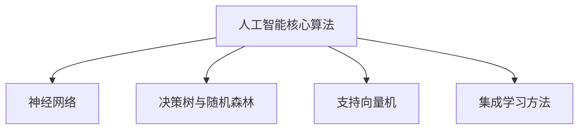

                 

# 《人工智能创业：成功的秘诀》

> 关键词：人工智能创业、成功秘诀、核心算法、商业模式、团队建设、国际化策略

> 摘要：本文旨在深入探讨人工智能创业的各个方面，包括技术原理、项目实战、创业策略和可持续发展。通过系统分析，本文为创业者提供了一条成功的路径，包括市场分析、商业模式探索、团队建设、融资策略、国际化扩展及未来展望。

## 目录大纲

### 第一部分：人工智能概述

#### 第1章：人工智能基础知识

- **1.1 人工智能的定义与历史**
- **1.2 人工智能的核心技术**
- **1.3 人工智能的应用领域**
- **1.4 人工智能的现状与未来趋势**

#### 第2章：人工智能核心算法原理

- **2.1 神经网络原理**
  - **2.1.1 神经元与感知机**
  - **2.1.2 反向传播算法**
  - **2.1.3 神经网络架构**
- **2.2 决策树与随机森林**
  - **2.2.1 决策树原理**
  - **2.2.2 随机森林算法**
- **2.3 支持向量机**
  - **2.3.1 SVM原理**
  - **2.3.2 SVM分类与回归**
- **2.4 集成学习方法**
  - **2.4.1 Boosting方法**
  - **2.4.2 Bagging方法**

#### 第3章：人工智能项目实战

- **3.1 项目实战概述**
- **3.2 数据处理与特征工程**
  - **3.2.1 数据预处理**
  - **3.2.2 特征提取与选择**
- **3.3 模型选择与训练**
  - **3.3.1 模型评估与选择**
  - **3.3.2 模型训练与调参**
- **3.4 项目部署与维护**
  - **3.4.1 模型部署策略**
  - **3.4.2 项目维护与更新**

### 第二部分：人工智能创业策略

#### 第4章：人工智能创业机会分析

- **4.1 创业环境与机遇**
- **4.2 行业热点与趋势**
- **4.3 创业者能力与素质**

#### 第5章：人工智能商业模式探索

- **5.1 商业模式定义与分类**
- **5.2 AI产品设计与定位**
- **5.3 AI服务与运营策略**

#### 第6章：人工智能创业融资策略

- **6.1 融资渠道与方式**
- **6.2 融资策略与规划**
- **6.3 融资风险与应对**

#### 第7章：人工智能创业团队建设

- **7.1 团队组建与管理**
- **7.2 技术团队建设**
- **7.3 运营与市场团队建设**

#### 第8章：人工智能创业案例与启示

- **8.1 成功案例分析**
- **8.2 失败原因剖析**
- **8.3 启示与建议**

### 第三部分：人工智能创业持续发展

#### 第9章：人工智能创业可持续发展

- **9.1 创新与研发**
- **9.2 知识产权保护**
- **9.3 社会责任与伦理**

#### 第10章：人工智能创业的国际化策略

- **10.1 国际市场分析**
- **10.2 国际化策略与路径**
- **10.3 国际合作与竞争**

#### 第11章：人工智能创业的未来展望

- **11.1 人工智能发展的新趋势**
- **11.2 创业者在未来竞争中的定位**
- **11.3 创业前景与挑战**

### 附录

#### 附录A：人工智能开发工具与资源

- **A.1 开发工具与框架**
  - **A.1.1 TensorFlow**
  - **A.1.2 PyTorch**
  - **A.1.3 Keras**
- **A.2 数据集与开源项目**
  - **A.2.1 公开数据集**
  - **A.2.2 开源人工智能项目**
- **A.3 社群与资源**
  - **A.3.1 社交媒体**
  - **A.3.2 在线课程与教程**
  - **A.3.3 行业报告与白皮书**

### Mermaid 流程图



### 神经网络原理伪代码

```python
def neural_network(input_data, weights, bias):
    layer_1_output = (sigmoid((input_data @ weights) + bias))
    return layer_1_output

def sigmoid(x):
    return 1 / (1 + exp(-x))
```

### 数学模型与公式

$$
y = \sigma(\sum_{i=1}^{n} w_i x_i + b)
$$

其中，$y$ 是输出，$\sigma$ 是激活函数，$w_i$ 是权重，$x_i$ 是输入，$b$ 是偏置。

### 代码解读与分析

- **数据处理**：首先，我们需要加载数据集并进行预处理，如数据清洗、归一化等。
- **模型训练**：然后，我们使用训练数据来训练神经网络模型，调整模型参数。
- **模型评估**：使用验证数据集来评估模型的性能。
- **模型部署**：最后，将训练好的模型部署到生产环境，进行实时预测。

```python
# 加载数据集
X_train, X_test, y_train, y_test = train_test_split(X, y, test_size=0.2, random_state=42)

# 数据预处理
X_train = normalize(X_train)
X_test = normalize(X_test)

# 模型训练
model = Sequential()
model.add(Dense(units=64, activation='relu', input_shape=(X_train.shape[1],)))
model.add(Dense(units=1, activation='sigmoid'))
model.compile(optimizer='adam', loss='binary_crossentropy', metrics=['accuracy'])
model.fit(X_train, y_train, epochs=10, batch_size=32, validation_data=(X_test, y_test))

# 模型评估
loss, accuracy = model.evaluate(X_test, y_test)
print(f"Test accuracy: {accuracy:.2f}")

# 模型部署
# ...（部署代码）
```

**详细解释与分析：**

- **数据处理**：预处理是模型训练的重要步骤，它可以提高模型的训练效果和泛化能力。数据清洗包括处理缺失值、异常值等；数据归一化可以将数据缩放到一个统一的范围，使得模型训练过程更加稳定。
- **模型训练**：在训练过程中，我们使用反向传播算法来更新模型参数，使得模型在训练数据上得到更好的拟合。通过多次迭代训练，模型可以逐渐提高性能。
- **模型评估**：评估指标包括损失函数和准确率等。损失函数用于衡量模型预测结果与真实结果之间的差异，准确率则用于衡量模型在测试集上的性能。
- **模型部署**：模型部署是将训练好的模型应用到实际业务场景中，进行实时预测和决策。在部署过程中，我们需要考虑模型的性能、稳定性和可扩展性等因素。

**注意：**

- 上述代码是一个简化的示例，实际项目中可能涉及更多的数据处理、模型调整和优化步骤。
- 模型的选择和参数配置会根据具体问题和数据集进行调整。

## 第一部分：人工智能概述

### 第1章：人工智能基础知识

#### 1.1 人工智能的定义与历史

人工智能（Artificial Intelligence，简称AI）是计算机科学的一个分支，旨在使计算机模拟人类智能，进行感知、学习、推理和决策。人工智能的概念最早由约翰·冯·诺伊曼在20世纪40年代提出，其目标是创造能够执行复杂任务的智能机器。

在历史上，人工智能可以分为三个主要阶段：

1. **符号人工智能**：20世纪50年代至70年代，基于逻辑推理和符号表示方法，旨在模拟人类的推理过程。
2. **基于知识的系统**：20世纪80年代至90年代，利用知识库和推理机，实现自动化决策和支持系统。
3. **计算智能**：20世纪90年代至今，结合机器学习、神经网络和进化算法等技术，实现自动化学习和优化。

#### 1.2 人工智能的核心技术

人工智能的核心技术包括：

1. **机器学习**：通过训练模型来从数据中学习规律和模式，实现自动预测和决策。
2. **深度学习**：基于多层神经网络，通过逐层提取特征，实现高层次的抽象表示。
3. **自然语言处理**：使计算机能够理解、生成和处理人类语言，实现人机交互。
4. **计算机视觉**：使计算机能够理解视觉信息，实现图像识别、目标检测等应用。
5. **机器人技术**：结合人工智能和机械工程，实现自动化机器人和智能机器人。

#### 1.3 人工智能的应用领域

人工智能在各个领域都有广泛的应用：

1. **金融**：智能投顾、风险评估、反欺诈等。
2. **医疗**：疾病预测、诊断辅助、手术机器人等。
3. **制造业**：智能制造、质量检测、供应链优化等。
4. **交通运输**：自动驾驶、智能交通系统、物流优化等。
5. **教育**：个性化学习、智能测评、教育机器人等。
6. **安防**：人脸识别、行为识别、智能监控等。

#### 1.4 人工智能的现状与未来趋势

目前，人工智能正处于快速发展阶段，越来越多的应用落地，取得显著成果。未来，人工智能将继续向以下几个方向演进：

1. **智能化**：通过不断优化算法和模型，提高人工智能系统的智能化水平。
2. **泛在化**：人工智能将渗透到各个领域，实现全面智能化。
3. **自主化**：通过强化学习、自主决策等技术，实现人工智能系统的自主运行。
4. **协同化**：通过多智能体系统、联邦学习等技术，实现人工智能系统的协同工作。

## 第2章：人工智能核心算法原理

#### 2.1 神经网络原理

神经网络（Neural Networks，简称NN）是人工智能领域的一个重要分支，其基本原理模拟了生物神经网络的结构和工作方式。神经网络由大量简单的处理单元（神经元）连接而成，通过学习输入数据中的特征和模式，实现对数据的处理和预测。

##### 2.1.1 神经元与感知机

神经元是神经网络的基本构成单元，通常由三个部分组成：输入层、中间层（隐藏层）和输出层。每个神经元接收来自输入层的信号，通过加权求和后，应用一个非线性激活函数，生成输出信号。

感知机（Perceptron）是最简单的神经网络模型，由一个输入层和一个输出层组成。感知机通过比较输入信号与设定的阈值，输出二值结果。感知机的激活函数通常为阶跃函数。

##### 2.1.2 反向传播算法

反向传播算法（Backpropagation Algorithm）是神经网络的核心训练算法。反向传播算法通过不断调整网络中的权重和偏置，使网络输出接近目标输出。

反向传播算法分为两个阶段：

1. **前向传播**：将输入信号从输入层传递到输出层，计算每个神经元的输出。
2. **后向传播**：根据输出误差，反向传播误差信号，计算每个神经元的权重和偏置的梯度，并更新权重和偏置。

##### 2.1.3 神经网络架构

神经网络架构分为多层结构，包括输入层、隐藏层和输出层。隐藏层的数量和神经元数量可以根据具体问题进行调整。常用的神经网络架构包括：

1. **全连接神经网络**：每个神经元都与前一层的所有神经元相连。
2. **卷积神经网络**（CNN）：适用于图像处理，通过卷积层提取特征。
3. **循环神经网络**（RNN）：适用于序列数据，通过循环结构处理序列信息。
4. **生成对抗网络**（GAN）：通过生成器和判别器之间的对抗训练，实现数据的生成。

#### 2.2 决策树与随机森林

决策树（Decision Tree）是一种基于特征进行分类或回归的算法。决策树通过递归地将数据集划分为子集，每个节点代表一个特征，每个分支代表一个划分规则。

##### 2.2.1 决策树原理

决策树的基本原理是递归地将数据集划分为满足条件的子集，直到满足停止条件。停止条件包括：

1. 所有样本都属于同一类别。
2. 最大深度达到预设值。
3. 子集的纯度达到预设阈值。

##### 2.2.2 随机森林算法

随机森林（Random Forest）是基于决策树构建的一个集成学习模型。随机森林通过以下步骤进行构建：

1. 从原始数据集中随机选择一部分样本和特征，构建多个决策树。
2. 对于每个决策树，使用交叉验证选择最佳分割特征和阈值。
3. 在预测阶段，对多个决策树的结果进行投票，得到最终预测结果。

随机森林的优点包括：

1. 防止过拟合，提高模型的泛化能力。
2. 随机选择特征和样本，降低模型的方差。
3. 易于实现和解释。

#### 2.3 支持向量机

支持向量机（Support Vector Machine，简称SVM）是一种基于间隔最大化原理的分类和回归算法。SVM通过找到一个最优的超平面，将数据集中的正负样本分隔开来。

##### 2.3.1 SVM原理

SVM的基本原理是找到一个最优的超平面，使得正负样本之间的间隔最大化。这个超平面由以下公式确定：

$$
w \cdot x + b = 0
$$

其中，$w$ 是权重向量，$x$ 是特征向量，$b$ 是偏置。

##### 2.3.2 SVM分类与回归

SVM可以用于分类和回归任务。对于分类任务，SVM通过找到一个最优的超平面，将正负样本分隔开来。对于回归任务，SVM通过找到一个最优的超平面，使得预测值与真实值之间的误差最小。

#### 2.4 集成学习方法

集成学习方法（Ensemble Learning）通过结合多个模型来提高模型的性能和稳定性。常见的集成学习方法包括：

##### 2.4.1 Boosting方法

Boosting方法通过训练多个弱学习器，并将它们组合成一个强学习器。每个弱学习器专注于纠正前一个弱学习器的错误，从而提高整体模型的性能。

常见的Boosting算法包括：

1. **Adaboost**：通过加权集成，使弱学习器在纠正错误样本上具有更高的权重。
2. **XGBoost**：通过引入正则化项，优化弱学习器的权重和预测结果。

##### 2.4.2 Bagging方法

Bagging方法通过训练多个独立的学习器，并将它们组合成一个强学习器。每个学习器从原始数据集中随机抽取样本进行训练，从而降低模型的方差。

常见的Bagging算法包括：

1. **随机森林**：通过随机选择特征和样本，构建多个决策树，并对结果进行投票。
2. **Bagging回归**：通过随机选择特征和样本，构建多个回归树，并对结果进行平均。

## 第3章：人工智能项目实战

#### 3.1 项目实战概述

人工智能项目实战是创业者将人工智能技术应用于实际问题的过程。一个成功的人工智能项目通常包括以下几个关键步骤：

1. **问题定义**：明确项目要解决的问题和目标。
2. **数据收集**：收集与问题相关的数据，并进行预处理。
3. **模型设计**：选择合适的算法和模型架构，设计模型的输入和输出。
4. **模型训练**：使用训练数据对模型进行训练，调整模型参数。
5. **模型评估**：使用验证数据集评估模型的性能，进行调参和优化。
6. **模型部署**：将训练好的模型部署到生产环境，进行实时预测和应用。

#### 3.2 数据处理与特征工程

数据处理与特征工程是人工智能项目的重要环节，直接影响模型的性能和泛化能力。

##### 3.2.1 数据预处理

数据预处理包括以下步骤：

1. **数据清洗**：处理缺失值、异常值和重复数据。
2. **数据归一化**：将数据缩放到一个统一的范围，以避免数据量级差异带来的影响。
3. **数据转换**：将类别数据转换为数值数据，如使用独热编码或标签编码。
4. **数据分割**：将数据集划分为训练集、验证集和测试集，用于模型训练、评估和测试。

##### 3.2.2 特征提取与选择

特征提取与选择是提高模型性能的关键步骤。

1. **特征提取**：从原始数据中提取出具有代表性的特征，如使用统计学方法提取特征，或使用深度学习模型提取高层次的抽象特征。
2. **特征选择**：从提取的特征中选择最重要的特征，以减少特征维度和计算复杂度，提高模型性能。常见的特征选择方法包括：

   - **相关性分析**：选择与目标变量高度相关的特征。
   - **特征重要性评估**：使用模型训练结果评估特征的重要性，如随机森林中的特征重要性得分。
   - **降维方法**：如主成分分析（PCA）和t-SNE等。

#### 3.3 模型选择与训练

模型选择与训练是人工智能项目的核心环节。

##### 3.3.1 模型评估与选择

模型评估与选择包括以下步骤：

1. **模型选择**：根据问题特点和数据集性质，选择合适的模型。常见的模型包括线性回归、逻辑回归、决策树、随机森林、支持向量机、神经网络等。
2. **模型评估**：使用验证数据集评估模型的性能，常用的评估指标包括准确率、召回率、F1值、ROC曲线、AUC值等。
3. **模型调参**：通过调整模型的超参数，如学习率、隐藏层神经元数量、正则化参数等，提高模型的性能。

##### 3.3.2 模型训练与调参

模型训练与调参包括以下步骤：

1. **模型训练**：使用训练数据集对模型进行训练，通过优化算法（如梯度下降、随机梯度下降、Adam等）调整模型参数，使其在训练数据上得到更好的拟合。
2. **模型验证**：使用验证数据集评估模型的性能，通过交叉验证等方法优化模型参数。
3. **模型测试**：使用测试数据集对模型进行最终评估，以验证模型的泛化能力。

#### 3.4 项目部署与维护

项目部署与维护是确保模型在实际应用中稳定运行的关键。

##### 3.4.1 模型部署策略

模型部署策略包括以下步骤：

1. **模型转换**：将训练好的模型转换为可以在生产环境中运行的格式，如ONNX、TensorFlow Lite等。
2. **模型部署**：将模型部署到生产环境，如云服务器、边缘设备等。
3. **模型监控**：监控模型的运行状态和性能，如响应时间、准确率、错误率等。

##### 3.4.2 项目维护与更新

项目维护与更新包括以下步骤：

1. **错误处理**：及时发现和解决模型运行中的错误和异常。
2. **性能优化**：根据用户反馈和监控数据，对模型进行性能优化和调整。
3. **模型更新**：定期更新模型，以适应新的数据和应用需求。

### 第二部分：人工智能创业策略

#### 第4章：人工智能创业机会分析

#### 4.1 创业环境与机遇

人工智能（AI）的快速发展为创业者提供了丰富的创业机会。以下是对当前创业环境的分析：

##### 政策支持

政府对人工智能的发展高度重视，出台了一系列政策支持措施，包括：

1. **资金支持**：政府设立专项基金，支持人工智能创新创业项目。
2. **税收优惠**：为鼓励企业研发和创新，政府提供税收减免政策。
3. **人才引进**：政府通过吸引国际顶尖人才和留学回国人员，为人工智能创业提供人才保障。

##### 技术发展

人工智能技术的迅速发展，为创业者提供了丰富的技术储备。以下是一些关键技术的发展趋势：

1. **深度学习**：深度学习技术在图像识别、自然语言处理、语音识别等领域取得了重大突破，为创业者提供了强大的工具。
2. **大数据**：大数据技术的发展，使得创业者能够从海量数据中挖掘有价值的信息，为商业决策提供支持。
3. **云计算**：云计算技术的普及，使得创业者可以低成本、高效地部署和管理人工智能应用。

##### 市场需求

随着人工智能技术的成熟，市场需求也在不断增长。以下是一些主要的应用场景：

1. **智能制造**：人工智能技术在制造业中的应用，如自动化生产、智能质检等，有助于提高生产效率和降低成本。
2. **智能医疗**：人工智能技术在医疗领域的应用，如疾病诊断、药物研发等，有助于提高医疗水平和降低医疗成本。
3. **智能交通**：人工智能技术在交通领域的应用，如自动驾驶、智能交通管理等，有助于缓解交通拥堵、提高交通效率。

#### 4.2 行业热点与趋势

人工智能行业的快速发展，涌现出许多热点和趋势。以下是一些值得关注的方向：

1. **自动驾驶**：自动驾驶技术是人工智能领域的重要应用方向，未来有望改变交通运输方式。
2. **智能医疗**：人工智能在医疗领域的应用，如疾病预测、诊断辅助、药物研发等，有望提高医疗水平和降低医疗成本。
3. **智能家居**：智能家居是人工智能在消费电子领域的典型应用，未来智能家居市场规模将持续扩大。
4. **金融科技**：人工智能在金融领域的应用，如智能投顾、风险管理、反欺诈等，有助于提高金融服务的效率和安全性。

#### 4.3 创业者能力与素质

创业者要成功进军人工智能领域，需要具备以下能力和素质：

1. **技术能力**：创业者应具备一定的技术背景，了解人工智能的基本原理和核心技术，能够解决实际问题。
2. **创新能力**：人工智能领域发展迅速，创业者应具备创新思维，不断探索新的应用场景和商业模式。
3. **团队建设**：创业者应具备团队建设和管理能力，吸引和留住优秀的团队成员，共同推动项目发展。
4. **市场洞察力**：创业者应具备敏锐的市场洞察力，把握行业发展趋势，发现市场需求和机会。
5. **资金管理**：创业者应具备良好的资金管理能力，合理规划资金使用，确保项目顺利推进。

#### 第5章：人工智能商业模式探索

#### 5.1 商业模式定义与分类

商业模式（Business Model）是指企业如何创造、传递和捕获价值的体系。在人工智能（AI）领域，商业模式需要考虑技术、市场、用户、资金等多个方面。以下是对商业模式的基本定义和分类：

##### 商业模式定义

商业模式是企业通过特定的价值创造和传递方式，实现价值捕获的过程。它包括以下几个方面：

1. **价值创造**：企业如何利用资源和技术，为用户提供有价值的产品或服务。
2. **价值传递**：企业如何将价值传递给用户，包括渠道、营销策略等。
3. **价值捕获**：企业如何从用户那里获取回报，包括收入来源、成本结构等。

##### 商业模式分类

根据不同的维度，商业模式可以有多种分类方式。以下是一些常见的分类方法：

1. **基于产品或服务的分类**：

   - **产品导向型**：企业主要提供产品，如硬件设备、软件产品等。
   - **服务导向型**：企业主要提供服务，如SaaS（软件即服务）、咨询等。

2. **基于价值传递方式的分类**：

   - **直销模式**：企业直接向用户销售产品或服务。
   - **分销模式**：企业通过渠道或合作伙伴向用户销售产品或服务。

3. **基于收入来源的分类**：

   - **单一收入模式**：企业主要依靠一种收入来源，如订阅费、销售提成等。
   - **多元化收入模式**：企业依靠多种收入来源，如广告收入、会员收入、产品销售等。

4. **基于价值创造的分类**：

   - **技术创新型**：企业通过技术创新创造价值，如谷歌、苹果等。
   - **模式创新型**：企业通过商业模式创新创造价值，如Airbnb、Uber等。

#### 5.2 AI产品设计与定位

AI产品的设计与定位是商业模式探索的重要环节。以下是一些关键点：

##### 产品设计

1. **用户需求**：深入理解用户需求，设计出符合用户需求的产品。

2. **技术实现**：选择合适的人工智能技术，如深度学习、自然语言处理等，实现产品的核心功能。

3. **用户体验**：注重用户体验，设计直观、易用、流畅的用户界面。

4. **可扩展性**：设计可扩展的产品架构，支持未来的功能扩展和业务增长。

##### 产品定位

1. **市场细分**：根据用户需求和市场规模，确定产品的市场细分。

2. **差异化优势**：明确产品的差异化优势，如技术领先、用户体验好、成本优势等。

3. **目标用户**：明确产品的目标用户群体，设计符合目标用户需求的产品。

4. **市场进入策略**：制定市场进入策略，如免费试用、战略合作等，快速占领市场份额。

#### 5.3 AI服务与运营策略

AI服务与运营策略是商业模式的重要组成部分。以下是一些关键点：

##### 服务模式

1. **SaaS服务**：通过云平台提供软件服务，用户按需付费。

2. **咨询与定制服务**：为客户提供专业的AI咨询和定制化服务。

3. **在线教育和培训**：提供在线课程和培训，帮助用户提高AI技能。

##### 运营策略

1. **用户反馈**：建立用户反馈机制，及时收集用户反馈，优化产品和服务。

2. **数据分析**：利用大数据分析技术，分析用户行为和需求，指导产品迭代和服务优化。

3. **品牌建设**：通过品牌营销和公关活动，提高品牌知名度和影响力。

4. **合作伙伴关系**：建立与合作伙伴的紧密关系，共同开发市场，实现共赢。

### 第6章：人工智能创业融资策略

#### 6.1 融资渠道与方式

人工智能（AI）创业公司要想获得足够的资金以推动业务发展，需要了解并利用多种融资渠道。以下是一些常见的融资渠道和方式：

##### 天使投资

天使投资是指个人投资者对初创企业进行早期投资，通常在项目启动或种子阶段。天使投资的特点是资金规模相对较小，但能提供宝贵的资源和经验。

##### 风险投资

风险投资（Venture Capital，简称VC）是专业投资机构对具有高增长潜力的初创企业进行的投资。风险投资通常在企业发展较成熟、有明确的商业计划和市场需求后进行。

##### 银行贷款

银行贷款是创业公司从银行获得的资金支持，通常需要提供担保或抵押物。银行贷款的优点是资金成本较低，但审批流程较长。

##### 政府补贴和奖励

政府为了鼓励科技创新和创业，通常会提供各种形式的补贴和奖励。这些资金通常是无偿的，或者只需要很低的手续费。

##### 众筹

众筹是一种通过互联网平台向公众募集资金的方式，特别适合初创企业。众筹不仅可以筹集资金，还可以测试市场对产品的兴趣。

##### 上市融资

对于发展较为成熟的AI企业，可以通过上市融资来获得大量资金。上市融资通常涉及较高的法律和财务成本，但能大大提升企业的知名度和资金实力。

#### 6.2 融资策略与规划

成功的融资策略需要结合企业的实际情况和市场需求。以下是一些关键的融资策略和规划建议：

##### 确定融资目标

在启动融资前，企业应明确自己的融资目标，包括所需资金的具体用途、资金规模和时间节点。这有助于向投资者清晰地传达企业的资金需求。

##### 制作商业计划书

商业计划书是向投资者展示企业前景的重要文档。它应包括企业的愿景、使命、市场分析、产品或服务描述、财务预测等关键内容。

##### 选择合适的融资渠道

根据企业的需求和市场情况，选择最适合的融资渠道。例如，如果企业处于早期阶段，可能更适合通过天使投资或众筹融资。

##### 建立良好的投资者关系

与投资者建立良好的关系是成功融资的关键。企业应主动与潜在投资者沟通，展示项目的亮点和潜力，争取获得他们的支持。

##### 调整融资策略

在融资过程中，企业可能需要根据市场反馈和自身发展情况调整融资策略。例如，如果市场反应不佳，企业可能需要调整商业计划或寻求其他融资渠道。

#### 6.3 融资风险与应对

融资过程中存在多种风险，企业需要制定相应的应对策略。以下是一些常见的融资风险和应对方法：

##### 资金使用不当

如果企业不能有效管理和使用资金，可能会导致资金短缺、项目推迟或失败。应对方法包括制定详细的资金使用计划，并设立监督机制。

##### 融资成本过高

高融资成本可能侵蚀企业的利润。企业可以通过选择合适的融资渠道、谈判利率等方式降低融资成本。

##### 投资者关系管理不当

如果企业与投资者关系紧张，可能导致投资者撤资或影响企业的声誉。企业应建立透明、诚信的投资者关系，定期向投资者报告项目进展。

##### 融资失败

如果企业无法成功融资，可能面临业务停滞或倒闭的风险。企业应制定备选方案，如通过内部融资、延迟项目进度等方式应对融资失败。

### 第7章：人工智能创业团队建设

#### 7.1 团队组建与管理

一个高效的人工智能创业团队是确保项目成功的关键。团队组建和管理涉及以下几个方面：

##### 团队组建

1. **确定团队成员**：根据项目需求，选择具备专业技能和团队协作精神的人才。团队成员应包括：

   - **技术核心**：包括AI算法工程师、数据科学家、软件工程师等。
   - **业务拓展**：包括市场营销、商务拓展、客户服务人员等。
   - **管理支持**：包括项目经理、财务管理人员等。

2. **明确岗位职责**：为每个团队成员明确具体的岗位职责和任务，确保工作有序开展。

3. **团队文化**：建立积极、开放、包容的团队文化，促进团队成员之间的沟通与合作。

##### 团队管理

1. **领导力**：作为团队领导，应具备激励团队成员、协调资源、解决冲突的能力。

2. **沟通与协作**：建立有效的沟通渠道，确保团队成员之间信息畅通，共同解决问题。

3. **激励机制**：设计合理的激励机制，包括薪酬、股权、荣誉等，激发团队成员的积极性和创造力。

4. **培训与发展**：定期组织培训和团队建设活动，提升团队成员的专业能力和团队凝聚力。

#### 7.2 技术团队建设

技术团队是人工智能创业团队的核心，其建设重点包括：

##### 技术能力提升

1. **技术培训**：定期组织技术培训，帮助团队成员掌握最新的AI技术和工具。

2. **技术交流**：鼓励团队成员参加行业会议、研讨会和技术沙龙，拓宽技术视野。

3. **开源贡献**：鼓励团队成员参与开源项目，提升技术能力和行业影响力。

##### 技术架构与工具

1. **技术架构**：构建稳定、可扩展的技术架构，支持项目的长期发展。

2. **开发工具**：选择合适的开发工具和平台，提高开发效率和代码质量。

3. **自动化测试**：建立自动化测试体系，确保代码质量和系统稳定性。

##### 技术合作与交流

1. **内部协作**：建立内部技术交流和合作机制，促进团队成员之间的技术分享。

2. **外部合作**：与其他技术团队或研究机构合作，共同解决技术难题，提升技术水平。

#### 7.3 运营与市场团队建设

运营与市场团队负责项目的推广、用户维护和业务拓展，其建设重点包括：

##### 运营能力提升

1. **用户研究**：通过用户调研、数据分析等方式，深入了解用户需求和偏好。

2. **产品运营**：制定有效的产品运营策略，提高产品用户黏性和活跃度。

3. **数据分析**：利用数据分析工具，监控产品运营效果，优化运营策略。

##### 市场能力提升

1. **市场调研**：定期进行市场调研，掌握行业动态和竞争对手情况。

2. **品牌建设**：通过品牌宣传、公关活动等方式，提升品牌知名度和影响力。

3. **营销策略**：制定有效的营销策略，包括线上和线下渠道，扩大用户群体。

##### 团队协作

1. **跨部门协作**：建立跨部门协作机制，确保运营和市场团队与研发团队的有效沟通。

2. **资源整合**：整合内部资源和外部资源，提高团队的整体工作效率。

3. **激励制度**：设立合理的激励制度，激发团队成员的积极性和创造力。

### 第8章：人工智能创业案例与启示

#### 8.1 成功案例分析

人工智能创业领域的成功案例有很多，以下列举几个具有代表性的案例，并分析其成功原因。

##### 案例一：谷歌（Google）

**背景**：谷歌成立于1998年，是一家全球知名的互联网技术公司。谷歌的成功离不开其强大的技术实力和创新精神。

**成功原因**：

1. **技术创新**：谷歌在搜索引擎、云计算、人工智能等领域持续进行技术创新，推出了一系列颠覆性的产品和服务。
2. **人才战略**：谷歌注重人才的引进和培养，聚集了一批顶尖的技术人才，为公司的持续发展提供了强有力的支持。
3. **商业模式**：谷歌通过广告收入模式，实现了持续盈利，为公司的发展提供了稳定的资金支持。

##### 案例二：特斯拉（Tesla）

**背景**：特斯拉成立于2003年，是一家专注于电动汽车和能源储存系统的科技公司。

**成功原因**：

1. **技术创新**：特斯拉在电动汽车领域取得了显著的成果，其产品在性能、续航等方面处于行业领先地位。
2. **品牌塑造**：特斯拉通过独特的品牌形象和创新的营销策略，成功塑造了高端科技品牌。
3. **市场定位**：特斯拉准确抓住了电动汽车市场的趋势，推出了符合市场需求的产品，赢得了大量用户。

##### 案例三：OpenAI

**背景**：OpenAI成立于2015年，是一家专注于人工智能研究和应用的非营利性组织。

**成功原因**：

1. **技术创新**：OpenAI在深度学习、强化学习等领域取得了重要突破，推出了许多具有影响力的研究成果。
2. **合作模式**：OpenAI采用开放合作模式，与全球顶尖的研究机构和大学合作，推动人工智能技术的发展。
3. **社会价值**：OpenAI关注人工智能的社会价值，致力于推动人工智能技术的安全和可持续发展。

#### 8.2 失败原因剖析

人工智能创业领域同样存在许多失败的案例，以下列举几个常见的失败原因。

##### 原因一：技术创新不足

许多AI创业公司在技术上缺乏核心竞争力，导致产品无法满足市场需求，难以获得用户认可。此外，技术更新迭代速度快，创业公司可能无法及时跟上技术发展的步伐，从而失去竞争优势。

##### 原因二：商业模式不清晰

一些AI创业公司在商业模式上存在模糊性，无法明确自身的盈利模式，导致公司发展缺乏持续动力。此外，过度依赖政府补贴或风险投资，缺乏自主盈利能力，也是导致失败的重要原因。

##### 原因三：团队建设不足

团队建设是AI创业成功的关键，许多失败的公司在团队建设上存在缺陷。例如，团队成员专业技能不足、沟通不畅、缺乏协作精神等，都会影响公司的整体运营和发展。

##### 原因四：市场定位不准确

一些AI创业公司在市场定位上存在偏差，未能准确把握市场趋势和用户需求。此外，过度竞争和市场饱和也可能导致创业公司难以生存。

#### 8.3 启示与建议

通过对成功和失败案例的分析，我们可以得到以下启示和建议：

1. **技术创新**：创业公司应注重技术创新，不断提升自身的技术实力，以保持竞争优势。
2. **商业模式**：明确商业盈利模式，制定可行的商业模式，确保公司可持续发展。
3. **团队建设**：重视团队建设，培养专业技能和协作精神，建立高效的团队管理体系。
4. **市场定位**：准确把握市场趋势和用户需求，制定合适的市场定位策略。
5. **风险管理**：制定风险管理策略，提前识别和应对潜在的风险和挑战。
6. **持续学习**：关注行业动态和技术发展，不断提升自身的知识和技能水平。

### 第三部分：人工智能创业持续发展

#### 第9章：人工智能创业可持续发展

#### 9.1 创新与研发

创新与研发是人工智能（AI）创业公司持续发展的核心驱动力。以下从多个角度探讨如何实现AI技术的创新与研发：

##### 技术创新

1. **前沿技术研究**：跟踪最新的AI研究动态，探索新的算法、模型和技术，如生成对抗网络（GAN）、强化学习等。
2. **技术创新**：在现有技术基础上进行改进和优化，提高算法的效率和性能。例如，通过改进深度学习模型的结构，提高图像识别的准确性。

##### 研发策略

1. **开放式创新**：与外部研究机构、大学和企业合作，共同进行技术研究和开发，共享资源和成果。
2. **内部研发**：建立独立的研发团队，专注于公司的核心技术攻关，推动产品的技术升级和迭代。
3. **跨学科融合**：将AI与其他领域（如生物、物理、工程等）相结合，实现跨学科的创新。

##### 技术孵化

1. **技术孵化平台**：建立内部或外部的技术孵化平台，为初创项目提供资金、资源和支持，推动新技术的孵化和应用。
2. **项目筛选**：对有潜力的技术项目进行筛选和评估，确定优先级，进行重点孵化。
3. **持续投资**：持续投资于研发，保持技术领先地位，为公司的长期发展奠定基础。

##### 创新文化

1. **鼓励创新**：建立鼓励创新的企业文化，鼓励员工提出新想法和解决方案，形成创新氛围。
2. **创新激励机制**：设立创新奖项和激励机制，鼓励员工积极参与创新活动。
3. **开放交流**：定期举办技术交流会议和研讨会，促进内部和外部技术交流，激发创新思维。

#### 9.2 知识产权保护

知识产权保护对于AI创业公司至关重要，以下从几个方面讨论如何保护知识产权：

##### 专利申请

1. **技术分析**：对公司的核心技术进行分析，确定具有专利潜力的技术点，制定专利申请策略。
2. **专利撰写**：撰写高质量的专利申请文件，确保专利权的申请和保护。
3. **专利布局**：在全球范围内进行专利布局，保护公司的核心技术和市场。

##### 商业秘密保护

1. **保密协议**：与员工、合作伙伴等签订保密协议，确保商业秘密不被泄露。
2. **内部管理**：建立严格的内部管理制度，对涉及商业秘密的文档和数据进行严格管理。
3. **信息加密**：采用加密技术，保护公司的电子数据和通信安全。

##### 法律咨询

1. **专业法律咨询**：聘请专业的知识产权律师，提供法律咨询和维权服务。
2. **风险预警**：定期对公司涉及的知识产权进行风险评估，及时发现潜在的法律风险。
3. **维权行动**：对侵犯公司知识产权的行为采取法律行动，维护公司的合法权益。

##### 合作与共享

1. **知识产权合作**：与其他企业、研究机构合作，共享知识产权资源，实现互利共赢。
2. **开放创新**：在保护自身知识产权的同时，积极参与开放创新，促进技术交流和合作。
3. **国际标准**：积极参与国际标准的制定和推广，提升公司在国际市场的影响力。

#### 9.3 社会责任与伦理

人工智能创业公司在追求商业成功的同时，应承担社会责任，关注伦理问题，以下从几个方面讨论社会责任与伦理：

##### 数据安全与隐私

1. **数据安全**：建立完善的数据安全体系，确保用户数据的安全和保密性。
2. **隐私保护**：遵守隐私保护法规，尊重用户的隐私权，确保用户数据不被滥用。
3. **透明度**：向用户透明地披露数据收集、使用和存储的情况，增强用户信任。

##### 伦理审查

1. **伦理审查机制**：建立伦理审查机制，对涉及伦理问题的项目和产品进行评估和审查。
2. **伦理培训**：对员工进行伦理培训，提高员工的伦理意识和责任感。
3. **伦理委员会**：设立独立的伦理委员会，负责监督和评估公司的伦理问题。

##### 社会影响

1. **社会公益**：积极参与社会公益活动，回馈社会，提升公司形象。
2. **可持续发展**：关注环境和社会问题，推动可持续发展，减少对环境的影响。
3. **社会责任报告**：定期发布社会责任报告，公开公司的社会责任履行情况。

##### 合作与对话

1. **利益相关者对话**：与利益相关者（如用户、员工、社区等）进行对话，了解他们的需求和期望。
2. **公共政策参与**：积极参与公共政策讨论，为人工智能的发展提供意见和建议。
3. **跨行业合作**：与不同领域的合作伙伴进行合作，共同解决社会问题，推动人工智能的健康发展。

### 第10章：人工智能创业的国际化策略

#### 10.1 国际市场分析

在国际市场上，人工智能（AI）创业公司面临巨大的机遇和挑战。以下从几个方面分析国际市场的特点：

##### 市场需求

1. **技术创新需求**：国际市场对AI技术有强烈的需求，特别是在自动驾驶、智能医疗、金融科技等领域。
2. **应用场景多样化**：国际市场的应用场景更加丰富，包括智能制造、智能城市、智慧农业等。
3. **市场规模巨大**：国际市场的市场规模庞大，为AI创业公司提供了广阔的发展空间。

##### 竞争格局

1. **发达国家领先**：发达国家在AI技术研发和应用上处于领先地位，拥有大量的顶尖企业和研究机构。
2. **新兴市场崛起**：新兴市场国家也在迅速崛起，对AI技术的需求不断增长。
3. **跨国竞争**：国际市场上的竞争激烈，创业公司需要具备全球竞争力。

##### 政策环境

1. **政策支持**：许多国家出台了一系列政策，支持人工智能技术的发展和应用。
2. **数据保护法规**：国际市场对数据保护的要求越来越高，企业需要遵守相关的法律法规。
3. **市场准入**：国际市场的市场准入条件复杂，创业公司需要了解和适应各国的市场规则。

#### 10.2 国际化策略与路径

为了在国际市场上取得成功，AI创业公司需要制定合适的国际化策略和路径。以下是一些建议：

##### 市场选择

1. **目标市场分析**：根据公司的技术优势和市场定位，选择最具潜力的目标市场。
2. **区域市场布局**：从区域性市场开始，逐步扩大到全球市场。
3. **细分市场深耕**：在选定的市场中，深耕细分市场，提供针对性的解决方案。

##### 市场进入策略

1. **本地化策略**：根据目标市场的文化、语言、消费习惯等，对产品和服务进行本地化调整。
2. **合作伙伴**：寻找当地合作伙伴，借助他们的资源和网络，快速进入市场。
3. **品牌建设**：建立国际化的品牌形象，提升公司的国际知名度。

##### 营销与推广

1. **线上营销**：利用社交媒体、搜索引擎等线上渠道，开展全球性的营销活动。
2. **线下活动**：参加国际性展会、研讨会等活动，与潜在客户建立联系。
3. **内容营销**：发布高质量的内容，如博客、白皮书、案例研究等，提升品牌影响力。

##### 资源整合

1. **全球资源**：利用全球资源，包括人才、技术、资金等，提升公司的竞争力。
2. **供应链管理**：建立全球化的供应链体系，确保产品质量和成本控制。
3. **风险管理**：制定风险管理策略，应对国际市场的风险和挑战。

##### 文化交流

1. **跨文化沟通**：提高员工跨文化沟通能力，增强团队凝聚力。
2. **本地化团队**：组建本地化团队，深入了解目标市场的需求和趋势。
3. **文化交流活动**：举办文化交流活动，增进与当地社区和合作伙伴的了解。

#### 10.3 国际合作与竞争

在国际市场上，AI创业公司需要与其他国际企业竞争，同时也需要建立合作关系。以下是一些建议：

##### 竞争策略

1. **技术创新**：持续进行技术创新，保持技术领先地位。
2. **成本优势**：通过优化供应链和运营效率，降低成本，提高市场竞争力。
3. **差异化优势**：提供差异化的产品和服务，满足不同市场需求。

##### 合作策略

1. **战略合作**：与行业领先企业建立战略合作关系，共同开展技术研发和市场推广。
2. **国际合作**：与国际研究机构、大学等建立合作关系，共同推动技术进步。
3. **产业链合作**：与上下游企业建立合作，形成产业链优势，共同提升市场竞争力。

##### 竞争应对

1. **市场定位**：根据自身优势，明确市场定位，避免与竞争对手直接竞争。
2. **产品创新**：持续进行产品创新，提供新颖的产品和服务，满足不同用户的需求。
3. **品牌形象**：建立强大的品牌形象，提升公司的市场认可度。

##### 知识产权保护

1. **专利布局**：在全球范围内进行专利布局，保护公司的知识产权。
2. **知识产权合作**：与合作伙伴共同保护知识产权，防止侵权行为。
3. **法律维权**：对侵犯公司知识产权的行为采取法律行动，维护公司的合法权益。

### 第11章：人工智能创业的未来展望

#### 11.1 人工智能发展的新趋势

人工智能（AI）正处于快速发展阶段，未来几年将出现以下新趋势：

##### 1. 人工智能+5G

5G技术的普及将大幅提升AI应用的实时性和效率。在自动驾驶、智能医疗、工业自动化等领域，5G与AI的结合将带来革命性的变化。

##### 2. 强化学习与自主决策

强化学习将进一步提升AI系统的自主决策能力，使其能够更好地应对复杂、动态的环境。自主决策将使AI系统在更多领域实现智能化。

##### 3. 联邦学习

联邦学习（Federated Learning）将解决数据隐私和安全问题，实现跨平台的数据共享和协同学习，推动AI技术的普及和应用。

##### 4. 多模态人工智能

多模态人工智能将结合多种数据类型（如图像、语音、文本等），实现更全面、准确的感知和认知能力。

##### 5. 人工智能伦理与法规

随着AI技术的发展，伦理和法规问题日益突出。未来，AI伦理和法规将更加完善，为AI技术的健康发展提供保障。

#### 11.2 创业者在未来竞争中的定位

在人工智能创业领域，创业者需要准确把握未来的竞争态势，以下是一些建议：

##### 1. 技术创新

持续进行技术创新，保持技术领先地位。创业者应关注前沿技术，积极参与技术创新，推动业务发展。

##### 2. 跨界融合

积极跨界融合，与其他领域（如医疗、金融、教育等）结合，开发具有差异化优势的产品和服务。

##### 3. 资源整合

整合全球资源，包括人才、技术、资金等，提升公司的竞争力。创业者应善于利用全球资源，实现优势互补。

##### 4. 用户体验

注重用户体验，提供优质的服务和产品。创业者应深入了解用户需求，提供个性化、差异化的解决方案。

##### 5. 社会责任

承担社会责任，关注伦理问题。创业者应关注社会问题，推动AI技术的可持续发展，为社会带来积极影响。

#### 11.3 创业前景与挑战

人工智能创业领域充满机遇，但也面临诸多挑战。以下是对未来前景和挑战的展望：

##### 前景

1. **市场需求增长**：随着AI技术的普及，市场需求将持续增长，为创业者提供广阔的市场空间。
2. **技术进步**：AI技术的不断进步将推动创业公司实现更高的业务效率和创新能力。
3. **资本投入**：风险投资和政府资金将持续投入AI领域，为创业者提供充足的资金支持。
4. **国际合作**：国际市场的合作将推动AI技术的全球化和应用范围的扩大。

##### 挑战

1. **技术风险**：AI技术的不确定性和风险将给创业公司带来挑战，需要持续的技术创新和风险管理。
2. **数据隐私**：数据隐私和安全问题日益突出，创业者需要建立完善的数据保护机制。
3. **市场竞争**：国际市场上的竞争激烈，创业者需要具备全球竞争力，不断优化产品和业务。
4. **法规政策**：AI技术的法规和政策将不断演变，创业者需要密切关注相关法规，确保合规运营。

### 附录

#### 附录A：人工智能开发工具与资源

##### A.1 开发工具与框架

1. **TensorFlow**

   TensorFlow是由Google开发的一款开源机器学习框架，广泛应用于深度学习、自然语言处理、计算机视觉等领域。

2. **PyTorch**

   PyTorch是由Facebook开发的一款开源机器学习库，以其动态计算图和易于使用的API而受到广泛欢迎。

3. **Keras**

   Keras是建立在TensorFlow和Theano之上的高级神经网络API，提供简单易用的接口，适合快速原型开发。

##### A.2 数据集与开源项目

1. **公开数据集**

   - **ImageNet**：大规模的图像识别数据集，包含大量标记的图像。
   - **CIFAR-10/100**：小型图像识别数据集，适合快速实验和测试。

2. **开源人工智能项目**

   - **TensorFlow Models**：Google提供的预训练模型和教程。
   - **PyTorch Examples**：包含多种AI应用案例的示例代码。

##### A.3 社群与资源

1. **社交媒体**

   - **Twitter**：关注AI相关的账号，获取最新动态和行业信息。
   - **LinkedIn**：加入AI相关的群组，与行业专家交流。

2. **在线课程与教程**

   - **Coursera**：提供大量AI相关的在线课程。
   - **Udacity**：提供实践导向的AI课程和项目。

3. **行业报告与白皮书**

   - **IDC**：提供全球人工智能市场分析和预测报告。
   - **Gartner**：发布人工智能技术成熟度曲线和市场趋势报告。


### 结论

人工智能创业是一个充满机遇和挑战的领域。通过深入分析技术原理、商业模式、团队建设和国际化策略，创业者可以更好地把握市场趋势，制定合适的战略，实现可持续发展。本文旨在为创业者提供一条清晰的成功路径，希望对读者有所启发。随着人工智能技术的不断进步，创业前景将更加广阔，让我们一起迎接未来的挑战与机遇。


### 作者

**作者：AI天才研究院/AI Genius Institute & 禅与计算机程序设计艺术 /Zen And The Art of Computer Programming**

