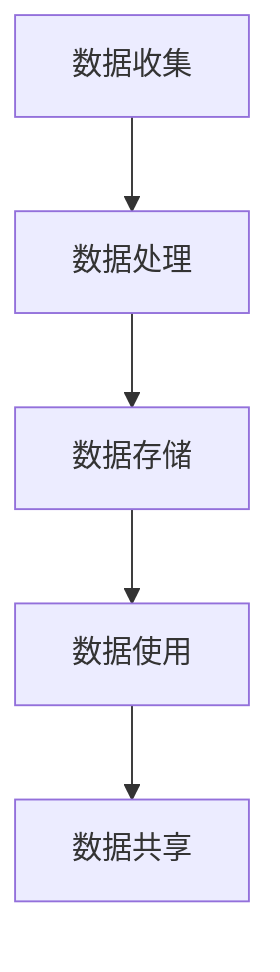

                 

# 人工智能创业：确保数据合法性

> 关键词：人工智能、创业、数据合法性、隐私保护、合规性

> 摘要：本文旨在探讨人工智能创业过程中的数据合法性问题，分析相关法律法规、核心概念，并提供实践案例和解决方案，以帮助创业者确保数据合法性，实现人工智能创业项目的成功。

---

### 第一部分：人工智能创业概述

#### 第1章 人工智能创业的背景与趋势

1. **1.1 人工智能发展的背景**

   人工智能（Artificial Intelligence，简称AI）作为计算机科学的一个分支，旨在使计算机模拟人类的智能行为，实现智能决策、智能交互等功能。近年来，随着计算能力的提升、算法的进步以及大数据的普及，人工智能技术取得了显著的突破，成为科技发展的热点领域。

   - **技术突破与产业发展**：深度学习、强化学习等人工智能算法的不断成熟，为各行各业带来了前所未有的变革。例如，自动驾驶技术、智能语音助手、医疗诊断等领域的应用逐渐普及，推动了人工智能产业的快速发展。

   - **政府和企业对人工智能的重视**：各国政府纷纷出台政策，鼓励人工智能的研发和应用，推动产业创新。同时，企业对人工智能技术的重视程度也不断提高，纷纷投入大量资金进行技术研发和产业化应用。

2. **1.2 人工智能创业的趋势**

   人工智能创业呈现出以下几个趋势：

   - **市场需求与创业机遇**：随着人工智能技术的不断成熟，市场需求迅速增长，为创业者提供了广阔的创业空间。例如，智能家居、智能安防、智能医疗等领域的创业项目层出不穷。

   - **创业成功的关键因素**：技术创新、市场需求、团队建设、资本支持等是人工智能创业成功的关键因素。其中，数据资源的获取和处理能力尤为关键，因为数据是人工智能应用的基础。

3. **1.3 数据合法性在人工智能创业中的重要性**

   数据合法性在人工智能创业中具有重要地位：

   - **法律法规**：各国针对数据合法性制定了相应的法律法规，如《通用数据保护条例》（GDPR）等，要求企业在数据处理过程中遵循合规性原则。

   - **隐私保护**：人工智能应用通常涉及大量个人数据的处理，隐私保护成为企业面临的重大挑战。确保数据合法性，不仅能够规避法律风险，还能提升用户信任度，促进业务的可持续发展。

#### 第2章 人工智能创业的核心概念

1. **2.1 人工智能的基本原理**

   人工智能的基本原理包括以下几个方面：

   - **定义与发展历程**：人工智能是指使计算机模拟人类智能行为的技术，其发展历程可分为多个阶段，如符号主义、连接主义、统计学习等。

   - **机器学习与深度学习的基本概念**：机器学习是人工智能的核心技术之一，通过训练模型使计算机具备学习能力和决策能力。深度学习作为机器学习的一个分支，利用多层神经网络进行数据建模和特征提取，具有较高的准确性。

2. **2.2 人工智能的应用领域**

   人工智能在多个领域得到了广泛应用：

   - **自然语言处理**：涉及文本分析、机器翻译、情感分析等，为信息检索、智能客服等领域提供了强大的技术支持。

   - **计算机视觉**：通过图像识别、目标检测等技术，实现图像分析和物体识别，广泛应用于安防监控、自动驾驶等领域。

   - **机器人技术**：利用人工智能技术，开发具有感知、决策和行动能力的机器人，应用于工业生产、医疗护理、家庭服务等领域。

3. **2.3 人工智能创业中的挑战与机遇**

   人工智能创业面临着诸多挑战和机遇：

   - **技术挑战**：人工智能技术仍处于快速发展阶段，创业者需要不断跟进新技术、新算法，保持技术优势。

   - **商业模式探索**：人工智能创业项目需要找到合适的商业模式，实现可持续盈利。

   - **市场竞争**：人工智能领域竞争激烈，创业者需要找准市场定位，提升核心竞争力。

### 第二部分：确保数据合法性

#### 第3章 数据合法性的法律法规

1. **3.1 数据合法性的相关法律法规**

   各国针对数据合法性制定了相应的法律法规，主要包括以下几个方面：

   - **数据保护法**：如《通用数据保护条例》（GDPR）、《加州消费者隐私法案》（CCPA）等，规定了数据收集、处理、存储和传输等方面的合规性要求。

   - **隐私保护政策**：企业需要制定隐私保护政策，明确数据收集、使用和共享的原则和流程，确保用户隐私权益。

2. **3.2 数据合法性的核心原则**

   数据合法性核心原则包括以下几个方面：

   - **数据收集与处理的合法性**：企业需要明确数据收集的目的和方式，确保用户知情并同意数据收集。

   - **数据使用与共享的合规性**：企业需要遵循法律法规，合理使用和共享数据，确保数据安全和个人隐私保护。

3. **3.3 数据合规性评估与风险管理**

   数据合规性评估与风险管理是确保数据合法性的重要环节：

   - **数据合规性评估流程**：企业应建立数据合规性评估机制，定期对数据处理流程进行审查和评估，确保合规性。

   - **数据风险管理策略**：企业需要制定数据风险管理策略，预防和应对数据泄露、滥用等风险，确保数据安全和合规性。

#### 第4章 数据收集与处理的合法性

1. **4.1 数据收集的合法性**

   数据收集的合法性主要包括以下几个方面：

   - **数据收集的目的与方式**：企业需要明确数据收集的目的，采用合法方式收集数据，确保用户知情并同意。

   - **用户同意与隐私声明**：企业应在收集数据前向用户告知收集数据的用途和方式，并要求用户同意。

2. **4.2 数据处理的合法性**

   数据处理的合法性主要包括以下几个方面：

   - **数据处理的合规性要求**：企业需要遵循法律法规，合理处理数据，确保数据安全和隐私保护。

   - **数据处理的合法合规措施**：企业应采取技术和管理措施，确保数据处理过程的合规性，如数据加密、访问控制等。

3. **4.3 数据收集与处理的实践案例**

   数据收集与处理的实践案例包括：

   - **成功案例**：某企业通过用户授权，收集用户数据并进行合法处理，实现了业务的可持续发展。

   - **失败案例分析**：某企业未经用户同意收集数据，导致用户隐私泄露，受到法律制裁和用户投诉。

#### 第5章 数据使用与共享的合法性

1. **5.1 数据使用的合法性**

   数据使用的合法性主要包括以下几个方面：

   - **数据使用的合规性要求**：企业需要遵循法律法规，合理使用数据，确保数据安全和隐私保护。

   - **数据使用的合规性措施**：企业应采取技术和管理措施，确保数据使用的合规性，如数据匿名化、数据加密等。

2. **5.2 数据共享的合法性**

   数据共享的合法性主要包括以下几个方面：

   - **数据共享的方式与合规性要求**：企业需要明确数据共享的方式和范围，确保数据共享的合规性。

   - **数据共享的风险管理**：企业需要评估数据共享的风险，采取风险管理措施，确保数据安全和合规性。

3. **5.3 数据使用与共享的实践案例**

   数据使用与共享的实践案例包括：

   - **成功案例**：某企业通过合法共享数据，实现了业务拓展和合作共赢。

   - **失败案例分析**：某企业未经授权共享数据，导致数据泄露，受到法律制裁和用户投诉。

#### 第6章 数据合法性与隐私保护技术

1. **6.1 数据匿名化技术**

   数据匿名化技术包括：

   - **数据匿名化的方法**：如伪匿名化、完全匿名化等。

   - **数据匿名化的效果评估**：通过评估匿名化数据的安全性、可用性，确保数据匿名化的效果。

2. **6.2 数据加密技术**

   数据加密技术包括：

   - **数据加密的基本原理**：如对称加密、非对称加密等。

   - **数据加密的实现**：如使用加密算法对数据进行加密和解密。

3. **6.3 数据隐私保护技术**

   数据隐私保护技术包括：

   - **数据隐私保护的方法**：如数据脱敏、数据加密、访问控制等。

   - **数据隐私保护的效果评估**：通过评估隐私保护技术的有效性，确保数据隐私保护的实施。

#### 第7章 数据合法性与人工智能应用

1. **7.1 人工智能应用中的数据合法性挑战**

   人工智能应用中的数据合法性挑战包括：

   - **数据收集与处理的合规性要求**：人工智能应用通常涉及大量个人数据的收集和处理，需要确保数据收集和处理过程的合规性。

   - **隐私保护要求**：人工智能应用需要保护用户隐私，确保数据使用的合规性。

2. **7.2 数据合法性与人工智能应用的合规性要求**

   数据合法性与人工智能应用的合规性要求包括：

   - **政策法规对人工智能应用的约束**：如《通用数据保护条例》（GDPR）对人工智能应用的合规性要求。

   - **企业内部合规性要求**：企业需要制定内部合规性要求，确保人工智能应用的数据合法性。

3. **7.3 数据合法性与人工智能应用的实践案例**

   数据合法性与人工智能应用的实践案例包括：

   - **成功案例**：某企业通过合法收集和使用数据，实现了人工智能应用的合规性。

   - **失败案例分析**：某企业未经授权收集和使用数据，导致用户隐私泄露，受到法律制裁和用户投诉。

### 第三部分：创业实践

#### 第8章 人工智能创业项目规划

1. **8.1 项目策划与市场调研**

   - **项目策划书撰写**：明确项目目标、市场需求、技术路线等。

   - **市场调研与分析**：分析市场竞争、用户需求等，为项目策划提供依据。

2. **8.2 技术路线规划**

   - **技术选型**：根据项目需求，选择合适的人工智能技术。

   - **技术路线图**：明确项目技术实现的关键路径和阶段性目标。

3. **8.3 团队组建与人员配置**

   - **团队结构设计**：根据项目需求，设计合理的团队结构。

   - **人员招聘策略**：根据团队需求，制定招聘计划，选拔合适的人才。

#### 第9章 人工智能创业项目实施

1. **9.1 项目开发与测试**

   - **开发环境搭建**：搭建项目开发所需的环境和工具。

   - **测试策略与执行**：制定测试策略，确保项目质量。

2. **9.2 项目部署与上线**

   - **部署策略与流程**：明确项目部署的步骤和流程。

   - **上线准备与实施**：确保项目上线前的准备工作，如环境测试、数据备份等。

3. **9.3 项目运营与维护**

   - **运营策略与流程**：制定项目运营的策略和流程。

   - **维护策略与措施**：确保项目运营期间的技术支持和维护。

#### 第10章 数据合法性与隐私保护实践

1. **10.1 数据合法性与隐私保护策略**

   - **数据合法性与隐私保护的整体策略**：明确数据合法性、隐私保护的目标和措施。

   - **数据合规性管理**：制定数据合规性管理制度，确保数据合法性。

2. **10.2 隐私保护实践案例**

   - **成功案例**：某企业通过有效的隐私保护实践，实现了数据合法性和用户信任。

   - **失败案例分析**：某企业因隐私保护不足，导致数据泄露，受到法律制裁和用户投诉。

3. **10.3 数据合法性与隐私保护的未来趋势**

   - **法规政策变化**：分析未来数据合法性和隐私保护的法规政策变化。

   - **技术发展趋势**：探讨数据合法性和隐私保护技术未来的发展趋势。

### 第四部分：创业案例研究

#### 第11章 人工智能创业成功案例

1. **11.1 成功案例概述**

   - **案例背景**：介绍成功案例的创业背景和项目概述。

   - **创业成果**：分析成功案例的创业成果和业务发展。

2. **11.2 创业经验总结**

   - **市场定位**：总结成功案例在市场定位方面的经验。

   - **技术创新**：探讨成功案例在技术创新方面的经验。

   - **数据合法性实践**：分析成功案例在数据合法性方面的实践经验。

3. **11.3 案例启示**

   - **对创业者的启示**：为创业者提供有价值的启示和建议。

   - **对企业的借鉴意义**：为其他企业在人工智能创业方面提供借鉴。

#### 第12章 人工智能创业失败案例分析

1. **12.1 失败案例概述**

   - **案例背景**：介绍失败案例的创业背景和项目概述。

   - **失败原因**：分析失败案例的失败原因。

2. **12.2 失败原因分析**

   - **市场策略失误**：分析失败案例在市场策略方面的失误。

   - **技术难题**：探讨失败案例在技术方面的挑战。

   - **数据合法性问题**：分析失败案例在数据合法性方面的原因。

3. **12.3 启示与教训**

   - **启示**：为创业者提供失败案例的教训和反思。

   - **教训**：总结失败案例的教训，为人工智能创业提供借鉴。

### 附录

#### 附录A：人工智能创业资源与工具

1. **A.1 人工智能创业资源**

   - **相关法规政策**：介绍与人工智能创业相关的法规政策。

   - **学术研究资源**：提供学术研究资源，帮助创业者了解前沿技术。

2. **A.2 人工智能创业工具**

   - **开发工具与平台**：介绍人工智能创业中常用的开发工具和平台。

   - **测试与评估工具**：提供用于测试和评估人工智能项目的工具。

3. **A.3 人工智能创业社区与网络**

   - **行业组织**：介绍与人工智能创业相关的行业组织。

   - **创业者交流平台**：提供创业者交流和学习的平台。

#### 附录B：人工智能创业常见问题解答

1. **B.1 数据合法性相关问题**

   - **数据收集与处理的合规性**：解答关于数据收集和处理合规性的问题。

   - **数据使用与共享的合法性**：解答关于数据使用和共享合法性的问题。

2. **B.2 技术与市场相关问题**

   - **技术选型**：解答关于技术选型的问题。

   - **市场策略**：解答关于市场策略的问题。

3. **B.3 团队与运营相关问题**

   - **团队建设**：解答关于团队建设的问题。

   - **项目运营**：解答关于项目运营的问题。

---

**Mermaid 流程图示例**



**核心算法原理讲解示例（伪代码）**

```python
# 伪代码：机器学习中的线性回归算法原理

def linear_regression(X, y):
    # 计算权重系数
    w = solve(X'X, X'y)
    
    # 预测
    predictions = X * w
    
    # 计算均方误差
    mse = (predictions - y).dot((predictions - y)) / n
    
    return w, mse
```

**数学模型与公式示例**

$$
\text{均方误差 (MSE)} = \frac{1}{n}\sum_{i=1}^{n}(y_i - \hat{y}_i)^2
$$

**代码实际案例与详细解释说明**

```python
# 实际案例：使用Python进行线性回归模型训练与预测

import numpy as np
from numpy.linalg import solve

# 训练数据
X = np.array([[1, 2], [2, 3], [3, 4]])
y = np.array([2, 4, 6])

# 计算权重系数
w = solve(X.T @ X, X.T @ y)

# 预测新数据
new_data = np.array([[1, 1], [2, 2]])
predictions = new_data @ w

print("预测结果：", predictions)
```

**代码解读与分析**

- **数据预处理**：将输入数据转换为矩阵形式，准备用于计算。

- **线性回归模型**：使用线性回归算法计算权重系数。

- **预测**：使用计算得到的权重系数对新数据进行预测。

- **输出**：打印出预测结果。

---

**完整目录大纲**

# 人工智能创业：确保数据合法性

> 关键词：人工智能、创业、数据合法性、隐私保护、合规性

> 摘要：本文旨在探讨人工智能创业过程中的数据合法性问题，分析相关法律法规、核心概念，并提供实践案例和解决方案，以帮助创业者确保数据合法性，实现人工智能创业项目的成功。

---

## 第一部分：人工智能创业概述

### 第1章 人工智能创业的背景与趋势

#### 1.1 人工智能发展的背景

#### 1.2 人工智能创业的趋势

#### 1.3 数据合法性在人工智能创业中的重要性

### 第2章 人工智能创业的核心概念

#### 2.1 人工智能的基本原理

#### 2.2 人工智能的应用领域

#### 2.3 人工智能创业中的挑战与机遇

### 第二部分：确保数据合法性

### 第3章 数据合法性的法律法规

#### 3.1 数据合法性的相关法律法规

#### 3.2 数据合法性的核心原则

#### 3.3 数据合规性评估与风险管理

### 第4章 数据收集与处理的合法性

#### 4.1 数据收集的合法性

#### 4.2 数据处理的合法性

#### 4.3 数据收集与处理的实践案例

### 第5章 数据使用与共享的合法性

#### 5.1 数据使用的合法性

#### 5.2 数据共享的合法性

#### 5.3 数据使用与共享的实践案例

### 第6章 数据合法性与隐私保护技术

#### 6.1 数据匿名化技术

#### 6.2 数据加密技术

#### 6.3 数据隐私保护技术

### 第7章 数据合法性与人工智能应用

#### 7.1 人工智能应用中的数据合法性挑战

#### 7.2 数据合法性与人工智能应用的合规性要求

#### 7.3 数据合法性与人工智能应用的实践案例

### 第三部分：创业实践

### 第8章 人工智能创业项目规划

#### 8.1 项目策划与市场调研

#### 8.2 技术路线规划

#### 8.3 团队组建与人员配置

### 第9章 人工智能创业项目实施

#### 9.1 项目开发与测试

#### 9.2 项目部署与上线

#### 9.3 项目运营与维护

### 第10章 数据合法性与隐私保护实践

#### 10.1 数据合法性与隐私保护策略

#### 10.2 隐私保护实践案例

#### 10.3 数据合法性与隐私保护的未来趋势

### 第四部分：创业案例研究

### 第11章 人工智能创业成功案例

#### 11.1 成功案例概述

#### 11.2 创业经验总结

#### 11.3 案例启示

### 第12章 人工智能创业失败案例分析

#### 12.1 失败案例概述

#### 12.2 失败原因分析

#### 12.3 启示与教训

### 附录

### 附录A：人工智能创业资源与工具

#### 1.1 人工智能创业资源

#### 1.2 人工智能创业工具

#### 1.3 人工智能创业社区与网络

### 附录B：人工智能创业常见问题解答

#### 2.1 数据合法性相关问题

#### 2.2 技术与市场相关问题

#### 2.3 团队与运营相关问题

---

**作者**：AI天才研究院/AI Genius Institute & 禅与计算机程序设计艺术 /Zen And The Art of Computer Programming

