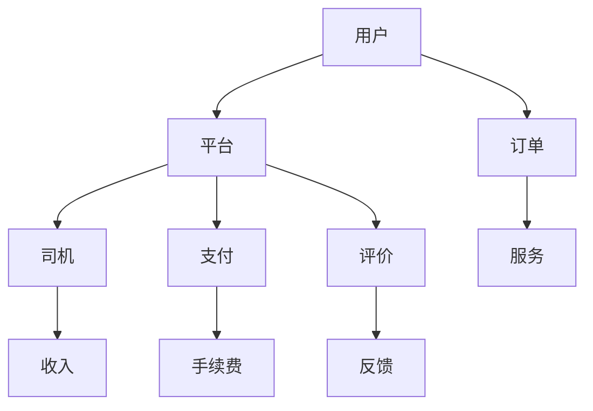
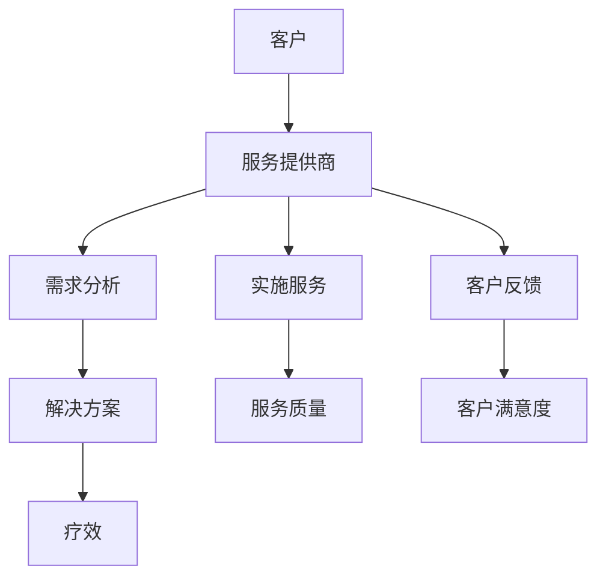
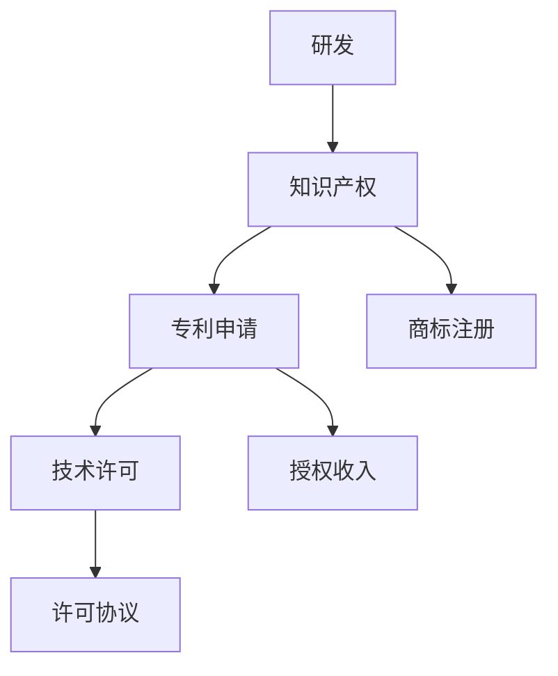
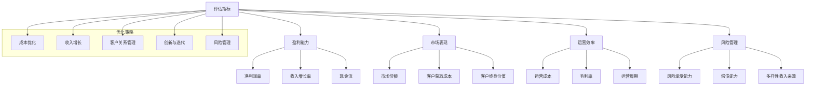
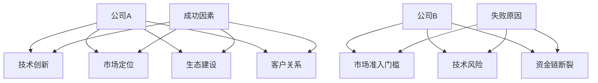
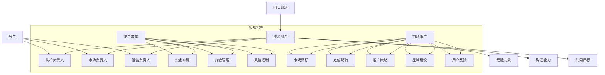
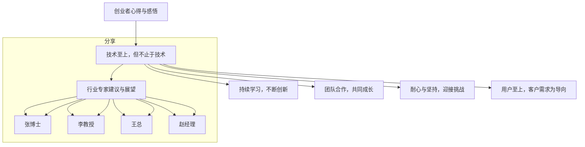

                 

## 文章标题

《人工智能创业：选择商业模式》

## 关键词

人工智能、创业、商业模式、平台模式、服务模式、版权模式、开放平台模式、商业模式评估、商业模式优化、创业案例、团队组建、资金筹集、市场推广、品牌建设

## 摘要

本文深入探讨了人工智能创业过程中的商业模式选择问题。首先，我们回顾了人工智能的发展历程和行业现状，分析了人工智能创业所需的技能与资源。接着，详细介绍了商业模式的定义、分类及其核心要素，并对不同类型的商业模式进行了分析。随后，通过评估和优化策略，探讨了如何选择和优化商业模式。文章还结合实际案例，提供了创业实战指导，分享了创业者的心得和建议。最后，文章推荐了相关的创业资源和工具，为人工智能创业者提供了全面的参考。

---

### 《人工智能创业：选择商业模式》目录大纲

**第一部分：人工智能概述与创业环境**

## 第1章：人工智能基础

### 1.1.1 人工智能的发展历程

### 1.1.2 人工智能的核心技术

## 第2章：人工智能行业现状与趋势

### 2.1.1 当前人工智能行业的发展状况

### 2.1.2 人工智能未来趋势预测

## 第3章：人工智能创业环境

### 3.1.1 创业者所需技能与素质

### 3.1.2 创业初期的资源获取

**第二部分：商业模式选择与分析**

## 第4章：商业模式概念解析

### 4.1.1 商业模式定义与分类

### 4.1.2 商业模式的核心要素

## 第5章：人工智能创业常见商业模式

### 5.1.1 平台模式

### 5.1.2 服务模式

### 5.1.3 版权模式

### 5.1.4 开放平台模式

## 第6章：商业模式评估与优化

### 6.1.1 商业模式评估指标

### 6.1.2 商业模式优化策略

**第三部分：案例分析与实战**

## 第7章：人工智能创业案例研究

### 7.1.1 案例一：公司A的成功经验

### 7.1.2 案例二：公司B的失败教训

## 第8章：创业实战指导

### 8.1.1 团队组建与分工

### 8.1.2 资金筹集与风险控制

### 8.1.3 市场推广与品牌建设

## 第9章：人工智能创业经验分享

### 9.1.1 创业者心得与感悟

### 9.1.2 行业专家建议与展望

**附录**

## 附录A：创业资源与工具推荐

### A.1.1 创业孵化器介绍

### A.1.2 创业相关书籍与网站推荐

### A.1.3 创业课程与培训资源

---

### 第一部分：人工智能概述与创业环境

#### 第1章：人工智能基础

##### 1.1.1 人工智能的发展历程

人工智能（Artificial Intelligence，简称AI）是计算机科学的一个分支，旨在通过模拟、延伸和扩展人类智能，实现机器在感知、学习、推理、决策等方面的自动化。人工智能的发展历程可以分为以下几个阶段：

1. **起步阶段（1940s-1950s）**：人工智能概念首次提出，并开始进行初步研究。
   - **1943年**：麦卡锡（John McCarthy）提出“人工智能”一词。
   - **1956年**：达特茅斯会议标志着人工智能学科的正式诞生。

2. **繁荣阶段（1960s-1970s）**：人工智能研究取得了显著进展，但随后面临挑战。
   - **1966年**：机器证明程序诞生，展示了计算机在数学领域的潜力。
   - **1970年代**：人工智能研究进入低谷，由于过高的期望与实际的差距导致资金短缺。

3. **复兴阶段（1980s-1990s）**：专家系统成为人工智能研究的热点，同时机器学习开始兴起。
   - **1980年**：专家系统在医疗诊断、化学合成等领域取得成功。
   - **1986年**：反向传播算法的提出，使得多层神经网络训练成为可能。

4. **成熟阶段（2000s至今）**：大数据、云计算和深度学习技术的发展，推动了人工智能的爆发式增长。
   - **2012年**：AlexNet在ImageNet竞赛中取得突破性成果，深度学习开始崭露头角。
   - **2016年**：AlphaGo战胜围棋世界冠军李世石，标志着人工智能在复杂游戏领域的重大突破。

##### 1.1.2 人工智能的核心技术

人工智能的核心技术主要包括机器学习、深度学习、自然语言处理和计算机视觉等。

1. **机器学习（Machine Learning）**：机器学习是人工智能的核心技术之一，通过算法从数据中学习规律和模式，实现自动化决策和预测。
   - **监督学习（Supervised Learning）**：通过已标记的数据进行训练，例如分类问题和回归问题。
   - **无监督学习（Unsupervised Learning）**：在没有标记数据的情况下进行训练，例如聚类问题和降维问题。
   - **半监督学习（Semi-Supervised Learning）**：结合标记数据和未标记数据，提高模型的性能。

2. **深度学习（Deep Learning）**：深度学习是机器学习的一个子领域，通过多层神经网络进行模型训练，具有强大的特征提取和表示能力。
   - **卷积神经网络（CNN，Convolutional Neural Networks）**：广泛应用于图像和视频处理领域。
   - **循环神经网络（RNN，Recurrent Neural Networks）**：适用于序列数据处理，如自然语言处理和时间序列预测。
   - **生成对抗网络（GAN，Generative Adversarial Networks）**：通过生成器和判别器的对抗训练，实现数据生成和增强。

3. **自然语言处理（NLP，Natural Language Processing）**：自然语言处理是人工智能的重要分支，旨在使计算机能够理解和处理人类语言。
   - **词向量（Word Vectors）**：将词语表示为高维空间中的向量，如Word2Vec和GloVe。
   - **序列标注（Sequence Labeling）**：对文本序列中的词语进行分类，如命名实体识别和词性标注。
   - **机器翻译（Machine Translation）**：通过计算机自动将一种语言翻译成另一种语言，如神经机器翻译。

4. **计算机视觉（Computer Vision）**：计算机视觉是人工智能的另一个重要分支，旨在使计算机能够“看到”和理解图像和视频。
   - **图像识别（Image Recognition）**：通过算法识别图像中的对象和场景。
   - **目标检测（Object Detection）**：在图像中定位和识别多个对象。
   - **图像分割（Image Segmentation）**：将图像分割成不同的区域或对象。

以上对人工智能的发展历程和核心技术进行了简要介绍，为后续章节的讨论奠定了基础。在下一章中，我们将进一步探讨人工智能行业的现状与趋势，以及创业者在这一领域所需的技能和资源。

---

#### 第2章：人工智能行业现状与趋势

##### 2.1.1 当前人工智能行业的发展状况

当前，人工智能（AI）已经成为全球科技领域的重要驱动力，各行各业都在积极拥抱这项技术。以下是人工智能行业发展的几个关键点：

1. **投资增长**：近年来，人工智能领域的投资持续增长。根据相关报告，全球人工智能市场预计将在未来几年内实现高速增长，市场规模将达到数万亿美元。风险投资、私募股权、政府资金等多种渠道都在积极投入人工智能项目。

2. **技术创新**：人工智能技术的不断进步，尤其是深度学习、计算机视觉、自然语言处理等领域的突破，使得人工智能应用场景不断扩大。从自动驾驶、智能家居到医疗诊断、金融风控，人工智能正在改变传统行业的运作模式。

3. **产业应用**：人工智能技术在多个行业领域取得了显著应用成果。例如，在制造业，人工智能被用于生产线的优化和故障检测；在金融业，人工智能被用于风险评估和欺诈检测；在医疗领域，人工智能被用于疾病诊断和个性化治疗。

4. **政策支持**：各国政府纷纷出台政策，支持人工智能的发展。例如，美国、中国、欧盟等国家和地区都制定了人工智能发展规划，旨在推动技术创新和产业应用。

5. **人才培养**：随着人工智能行业的发展，对专业人才的需求急剧增加。各大高校和研究机构纷纷开设人工智能相关课程，培养专业人才。此外，企业和政府也通过各种方式，如培训、竞赛等，提升现有员工的人工智能技能。

##### 2.1.2 人工智能未来趋势预测

人工智能的未来发展趋势可以从技术、应用和市场三个层面进行预测：

1. **技术层面**：
   - **深度学习**：深度学习技术将继续发展，并在更多领域得到应用。随着算法的优化和计算能力的提升，深度学习模型将能够处理更复杂的问题，实现更高的准确性和效率。
   - **强化学习**：强化学习作为深度学习的一个重要分支，将在游戏、自动驾驶、机器人等领域得到广泛应用。通过不断尝试和反馈，强化学习算法能够实现自主学习和优化决策。
   - **多模态学习**：多模态学习将结合不同类型的数据（如图像、文本、语音等），实现更全面、更准确的智能识别和理解。

2. **应用层面**：
   - **智能制造**：人工智能将在智能制造领域发挥更大作用，从生产线的优化、设备故障检测到产品设计和质量监控，都能实现自动化和智能化。
   - **智慧城市**：人工智能将助力智慧城市建设，通过大数据分析和智能算法，实现城市管理的精细化、智能化和高效化。
   - **医疗健康**：人工智能在医疗领域的应用将更加广泛，从疾病诊断、治疗规划到健康管理和个性化服务，都能提供有力支持。

3. **市场层面**：
   - **市场规模扩大**：随着人工智能技术的不断成熟和应用场景的拓展，全球人工智能市场将保持高速增长，预计未来几年内市场规模将进一步扩大。
   - **行业竞争加剧**：人工智能领域的竞争将越来越激烈，各大企业纷纷布局人工智能技术，争夺市场份额和技术优势。
   - **国际合作与竞争**：人工智能技术的发展将推动国际合作与竞争。各国将在人工智能领域开展更多的合作，共同推动技术创新和应用；同时，也会在技术和市场方面展开竞争，争夺全球主导地位。

总之，人工智能行业正处于快速发展阶段，未来将迎来更多技术创新和应用场景的突破。对于创业者而言，这是一个充满机遇和挑战的时代，需要紧跟技术发展趋势，积极布局人工智能领域，以实现企业的创新和成长。

---

#### 第3章：人工智能创业环境

##### 3.1.1 创业者所需技能与素质

在人工智能创业领域，成功的企业家不仅需要深厚的专业知识，还要具备一系列关键技能和素质。以下是创业者所需的一些重要技能与素质：

1. **技术技能**：
   - **编程能力**：熟悉至少一种编程语言，如Python、Java或C++，是人工智能创业的基本要求。
   - **算法知识**：了解常见的机器学习算法和深度学习模型，如决策树、支持向量机、卷积神经网络等。
   - **数据处理能力**：掌握数据预处理、特征提取和数据分析等技能，能够有效地处理和分析大量数据。
   - **数学基础**：掌握线性代数、概率论、统计学等数学知识，有助于深入理解机器学习算法和优化模型。

2. **业务技能**：
   - **市场洞察**：具备敏锐的市场洞察力，能够发现市场需求和机会，制定有针对性的商业战略。
   - **项目管理**：掌握项目管理方法，能够有效地规划、执行和监控项目进度，确保项目按时交付。
   - **团队协作**：具备良好的团队协作能力，能够激发团队成员的积极性，共同实现企业目标。

3. **领导能力**：
   - **愿景与激情**：拥有远大的愿景和强烈的创业激情，能够激励团队克服困难，不断追求卓越。
   - **决策能力**：具备快速决策和应对变化的能力，能够在关键时刻做出正确的决策。
   - **沟通能力**：具备良好的沟通和表达能力，能够有效地与团队成员、投资者和客户进行沟通，建立信任关系。

4. **创业素质**：
   - **抗压能力**：创业过程中不可避免地会遇到各种挑战和压力，具备较强的抗压能力是成功的关键。
   - **学习与适应能力**：人工智能领域发展迅速，创业者需要具备快速学习和适应新知识、新技术的能力。
   - **创新精神**：鼓励创新思维，不断探索新的商业机会和应用场景，推动企业持续发展。

##### 3.1.2 创业初期的资源获取

在人工智能创业初期，资源的获取对于企业的生存和发展至关重要。以下是一些常见的资源获取途径：

1. **个人储蓄**：许多创业者会利用自己的储蓄作为初始资金，以支持创业项目的启动。

2. **天使投资**：天使投资者通常是个人投资者，他们在创业早期阶段提供资金支持，以换取股权或其他回报。

3. **风险投资**：风险投资公司专注于投资具有高成长潜力的初创企业，他们愿意承担较高的风险以获取高额回报。

4. **政府资助**：各国政府为鼓励科技创新和创业，提供了一系列资助计划，包括创业补贴、研发资金、税收优惠等。

5. **银行贷款**：创业者可以通过银行贷款获得资金支持，但需要注意贷款的利率和还款期限。

6. **众筹**：众筹平台为创业者提供了另一种融资方式，通过向社会公众募集资金，来实现项目启动或扩展。

7. **合作伙伴**：寻找具有互补技能和资源的合作伙伴，通过共同投资和协作，分担创业风险和成本。

8. **创业孵化器**：创业孵化器为初创企业提供了办公空间、资金支持、导师指导等资源，帮助企业快速成长。

在创业初期，创业者需要充分利用各种资源，灵活应对市场变化和挑战。通过合理规划资金使用，确保企业能够稳定发展，逐步实现盈利和可持续发展。

---

### 第二部分：商业模式选择与分析

#### 第4章：商业模式概念解析

##### 4.1.1 商业模式定义与分类

商业模式（Business Model）是企业通过何种方式创造、传递和获取价值的基本商业逻辑。它不仅定义了企业的业务模式，还涉及到企业如何管理资源、分配成本和创造利润。具体来说，商业模式包括以下核心要素：

1. **价值主张（Value Proposition）**：明确企业能为客户提供的独特价值。这可以是产品或服务的具体特性，也可以是解决特定问题的能力。

2. **客户关系（Customer Relationships）**：企业如何与客户建立联系、提供服务和维护客户关系。这包括销售渠道、客户服务和客户满意度等方面。

3. **渠道（Channels）**：企业如何将产品或服务传递给客户。这涉及到销售渠道、分销网络和供应链管理等。

4. **收入来源（Revenue Streams）**：企业如何从客户那里获取收入。这包括定价策略、收费模式和服务组合等。

根据商业模式的特征和运作方式，我们可以将其分类如下：

1. **产品导向型（Product-Oriented）**：企业以产品为核心，追求产品创新和功能提升。例如，苹果公司通过不断推出创新产品，赢得了大量忠实客户。

2. **服务导向型（Service-Oriented）**：企业以用户服务为核心，追求服务质量和用户满意度。例如，海底捞通过提供极致的餐饮服务，赢得了良好的口碑和客户忠诚度。

3. **平台型（Platform-Based）**：企业通过搭建平台连接供需双方，创造一个生态系统。例如，阿里巴巴通过电子商务平台，将卖家和买家连接起来，实现交易和服务。

4. **订阅型（Subscription-Based）**：企业通过持续订阅获取收入。例如，Netflix通过订阅模式，提供视频流媒体服务，实现了稳定的收入来源。

5. **免费增值（Freemium）**：企业提供免费的基础服务，通过高级功能或增值服务来吸引付费用户。例如，微信提供免费的基础聊天功能，同时提供付费的功能和服务。

##### 4.1.2 商业模式的核心要素

商业模式的四大核心要素是价值主张、客户关系、渠道和收入来源。这些要素相互关联，共同构成了企业的商业逻辑。

1. **价值主张（Value Proposition）**：价值主张是企业为客户提供的独特价值。它应该明确回答以下问题：

   - 企业能为客户解决什么问题？
   - 企业如何解决这些问题？
   - 企业提供的解决方案相比竞争对手有何优势？

   例如，谷歌的价值主张是通过其搜索引擎提供快速、准确的搜索结果，帮助用户快速找到所需信息。

2. **客户关系（Customer Relationships）**：客户关系是企业与客户之间的互动方式。这包括以下几个方面：

   - **获取客户**：企业如何吸引潜在客户，并将其转化为实际用户？
   - **保留客户**：企业如何维持客户的长期使用，提高客户忠诚度？
   - **提升客户体验**：企业如何通过服务质量和用户体验，提升客户满意度？

   例如，亚马逊通过提供便捷的购物体验、快速物流和优质的客户服务，建立了强大的客户关系。

3. **渠道（Channels）**：渠道是企业将产品或服务传递给客户的方式。这包括以下几个方面：

   - **直接销售**：企业直接向客户销售产品或服务。
   - **分销渠道**：企业通过中间商将产品或服务传递给最终客户。
   - **在线渠道**：企业通过互联网进行销售和服务。

   例如，苹果公司通过其官方网站和实体零售店，直接向客户销售产品。

4. **收入来源（Revenue Streams）**：收入来源是企业如何从客户那里获取收入。这包括以下几个方面：

   - **一次性销售**：企业通过一次性销售产品或服务获得收入。
   - **订阅收费**：企业通过持续订阅获取收入。
   - **增值服务**：企业通过提供增值服务，如高级功能或个性化服务，获得额外收入。

   例如，Netflix通过订阅模式，从用户那里获取持续收入。

在了解了商业模式的定义、分类和核心要素后，接下来我们将深入探讨人工智能创业中常见的商业模式，包括平台模式、服务模式、版权模式等，并分析每种模式的特点、优势和适用场景。

---

#### 第5章：人工智能创业常见商业模式

##### 5.1.1 平台模式

平台模式是一种以搭建生态系统为核心的商业策略，通过连接供需双方，提供平台服务以实现价值创造。在人工智能创业领域，平台模式具有广泛的应用前景。

**特点**：

- **中介角色**：平台在供需双方之间扮演中介角色，提供交易服务、信息匹配和技术支持。
- **生态系统**：平台模式通常构建一个生态系统，吸引各种参与者，如开发人员、企业用户和消费者，共同促进平台发展。
- **资源共享**：平台模式鼓励参与者共享资源，如数据、技术和市场，以实现规模效应和降低运营成本。

**优势**：

- **规模效应**：平台能够吸引大量用户和合作伙伴，形成规模效应，降低单位成本。
- **生态系统优势**：平台生态系统内的多样化参与者能够互相支持，形成协同效应，提高整体竞争力。
- **盈利模式多样**：平台可以通过多种方式获取收入，如交易手续费、广告收入、增值服务等。

**适用场景**：

- **软件开发平台**：如GitHub、GitLab，提供代码托管、协作开发等服务。
- **人才招聘平台**：如LinkedIn、猎聘网，通过匹配雇主和求职者，实现人力资源的优化配置。
- **交易平台**：如淘宝、京东，连接买家和卖家，实现商品的在线交易。

**案例分析**：

- **公司A（Uber）**：Uber通过搭建一个移动出行平台，连接乘客和司机，实现了共享经济的成功应用。Uber通过收取佣金和提供增值服务，实现了可观的收入。

**Mermaid 流程图**：

##### 5.1.2 服务模式

服务模式是人工智能创业中的另一种常见商业模式，通过提供专业化、定制化的服务，满足客户特定的需求。服务模式通常注重服务质量、用户体验和客户关系管理。

**特点**：

- **专业化服务**：服务模式提供专业化的服务，如咨询服务、数据分析、技术支持等，满足客户的特定需求。
- **个性化定制**：服务模式通常提供个性化的解决方案，根据客户的具体情况量身定制服务。
- **高客户粘性**：服务模式注重客户关系管理，通过优质的服务和良好的用户体验，提高客户粘性。

**优势**：

- **高附加值**：服务模式能够提供高附加值的服务，实现更高的利润率。
- **客户忠诚度**：优质的服务能够增强客户忠诚度，提高客户生命周期价值。
- **灵活性强**：服务模式具有较强的灵活性，能够根据市场变化和客户需求调整服务内容和方式。

**适用场景**：

- **医疗健康领域**：提供医疗咨询服务、远程诊断等。
- **金融领域**：提供金融咨询服务、信用评估等。
- **教育领域**：提供在线教育、职业培训等。

**案例分析**：

- **公司B（AI医疗公司）**：一家专注于医疗健康领域的人工智能公司，通过提供远程诊断、个性化治疗建议等专业化服务，帮助医疗机构提高诊疗效率，赢得了广泛的认可。

**Mermaid 流�行程图**：

##### 5.1.3 版权模式

版权模式是一种通过知识产权（如专利、版权、商标等）进行价值创造和保护的商业模式。在人工智能创业领域，版权模式具有独特的价值和意义。

**特点**：

- **知识产权保护**：版权模式通过申请专利、注册商标等手段，保护企业的知识产权，防止技术被侵权或盗用。
- **技术许可**：企业可以通过许可其他企业使用其技术，获得额外的收入来源。
- **多元化收入**：版权模式不仅可以提供技术产品或服务，还可以通过版权许可、技术授权等多种方式实现多元化收入。

**优势**：

- **竞争优势**：通过知识产权保护，企业能够建立竞争优势，防止竞争对手抄袭或模仿。
- **高利润率**：知识产权具有较高的价值，可以通过许可和授权等方式实现高利润率。
- **风险分散**：版权模式可以通过多元化的收入来源，降低企业的运营风险。

**适用场景**：

- **技术创新领域**：如人工智能、生物技术、新材料等。
- **文化创意产业**：如电影、音乐、文学等。
- **软件和信息技术领域**：提供软件产品、技术解决方案等。

**案例分析**：

- **公司C（AI技术公司）**：一家专注于人工智能技术的研究和应用的公司，通过申请多项专利，实现了技术的知识产权保护，并通过技术许可和授权，获得了稳定的收入来源。

**Mermaid 流程图**：

通过以上对平台模式、服务模式和版权模式的详细介绍，我们可以看到每种商业模式都有其独特的特点和优势，适用于不同的创业场景。在下一章中，我们将进一步探讨商业模式的评估与优化策略，帮助创业者更好地选择和调整商业模式。

---

#### 第6章：商业模式评估与优化

##### 6.1.1 商业模式评估指标

评估商业模式的有效性是确保企业能够实现可持续发展和盈利的关键。以下是几种常用的商业模式评估指标：

1. **盈利能力（Profitability）**：
   - **净利润率**：净利润与总收入的比率，反映企业的盈利水平。
   - **收入增长率**：收入在一定时间内的增长率，反映企业的市场扩张能力。
   - **现金流**：企业的现金流入和流出情况，确保企业有足够的资金支持运营和发展。

2. **市场表现（Market Performance）**：
   - **市场份额**：企业在其所在市场中的占有率，反映企业的竞争地位。
   - **客户获取成本（CAC）**：获取一个新客户所需的成本，反映市场推广的效果和效率。
   - **客户终身价值（CLV）**：一个客户在其生命周期内为企业带来的总价值，反映客户的价值和忠诚度。

3. **运营效率（Operational Efficiency）**：
   - **运营成本（OC）**：企业的运营总成本，反映企业的成本控制能力。
   - **毛利率**：毛利润与销售额的比率，反映产品的盈利能力。
   - **运营周期**：企业从投入生产到获得收入的时间，反映企业的运营效率。

4. **风险管理（Risk Management）**：
   - **风险承受能力**：企业在面临风险时的应对能力，反映企业的稳健性。
   - **偿债能力**：企业偿还债务的能力，反映企业的财务健康状况。
   - **多样性收入来源**：企业依赖的主要收入来源的多样性，反映企业抵御市场波动的能力。

##### 6.1.2 商业模式优化策略

评估商业模式后，创业者需要根据评估结果进行优化，以提高商业模式的可行性和盈利能力。以下是几种常见的商业模式优化策略：

1. **成本优化**：
   - **降低运营成本**：通过自动化、流程优化和供应链管理，降低运营成本。
   - **规模效应**：通过扩大生产和销售规模，降低单位成本，提高盈利能力。

2. **收入增长**：
   - **增加收入来源**：开发新的产品或服务，拓展市场，实现收入多元化。
   - **提高定价策略**：通过提高产品价格或提供更多增值服务，提高客户支付意愿。

3. **客户关系管理**：
   - **提高客户满意度**：通过提供高质量的产品和服务，提高客户满意度，增加客户忠诚度。
   - **增强客户粘性**：通过会员制度、积分奖励等手段，增加客户的重复购买率。

4. **创新与迭代**：
   - **持续创新**：通过不断研发新技术、新产品，保持竞争优势。
   - **快速迭代**：根据市场需求和客户反馈，快速调整产品和服务，实现商业模式优化。

5. **风险管理**：
   - **风险识别与评估**：定期评估潜在风险，制定相应的风险管理策略。
   - **多元化投资**：通过多元化投资，降低单一市场的风险。

**案例分析**：

- **公司D（AI语音识别公司）**：该公司通过不断优化其商业模式，实现了显著的盈利增长。具体措施包括：

  - **成本优化**：通过自动化技术，降低研发和生产成本。
  - **收入增长**：推出新的语音识别产品，拓展市场份额，提高收入。
  - **客户关系管理**：提供高质量的客户服务，增强客户满意度，提高客户忠诚度。
  - **创新与迭代**：持续研发新技术，保持行业领先地位。

**Mermaid 流程图**：

通过以上评估和优化策略，创业者可以更好地理解和调整其商业模式，提高企业的竞争力和盈利能力。在下一章中，我们将通过实际案例，进一步探讨人工智能创业中的成功经验和失败教训。

---

#### 第7章：人工智能创业案例研究

##### 7.1.1 案例一：公司A的成功经验

**公司背景**：公司A是一家专注于自然语言处理（NLP）技术的人工智能企业。公司成立于2015年，通过自主研发的NLP算法，提供文本分析、情感分析和智能客服等服务。

**商业模式**：公司A采用平台模式，搭建了一个开放的NLP开发平台，吸引了大量的开发者和企业用户。平台提供API接口，方便用户集成和使用公司的NLP技术。同时，公司通过增值服务和定制化解决方案，为高端客户提供高质量的服务。

**成功因素**：

1. **技术创新**：公司A在NLP领域拥有多项核心专利，技术实力雄厚。自主研发的算法在处理速度和准确性方面具有显著优势。

2. **市场定位**：公司A准确把握了市场需求，特别是在文本分析和智能客服领域，为客户提供定制化解决方案，满足客户的特定需求。

3. **生态建设**：公司A搭建了一个开放的生态平台，吸引了大量的开发者加入，形成了良好的生态循环。开发者可以在这个平台上贡献代码、分享经验，同时获得商业机会。

4. **客户关系**：公司A注重客户关系管理，提供优质的客户服务，确保客户满意度。通过定期的客户反馈和互动，公司不断优化产品和服务，提高客户忠诚度。

**关键经验**：

- **技术创新是核心竞争力**：在人工智能领域，技术创新是企业的核心竞争力。公司A通过不断研发新技术，保持了行业领先地位。
- **市场定位要精准**：准确的市场定位能够帮助公司快速切入市场，抓住机遇。公司A在文本分析和智能客服领域取得了显著成功。
- **生态建设是长期投资**：开放平台和生态建设需要长期的投入和耐心，但能够带来持续的创新和商业机会。
- **客户关系管理不可忽视**：优质的客户服务能够提高客户满意度，增强客户忠诚度，是企业长期发展的重要保障。

##### 7.1.2 案例二：公司B的失败教训

**公司背景**：公司B是一家专注于智能医疗诊断的人工智能企业。公司成立于2018年，旨在利用深度学习技术，提供智能化的疾病诊断和治疗方案。

**商业模式**：公司B采用版权模式，通过自主研发的深度学习算法，提供医疗诊断软件和解决方案。公司主要通过技术许可和授权，获取收入。

**失败原因**：

1. **市场准入门槛高**：医疗行业具有严格的监管要求，公司B在产品开发和市场推广过程中，遇到了较大的障碍。同时，医疗行业的竞争激烈，公司B未能及时抢占市场先机。

2. **技术风险**：深度学习技术在医疗领域的应用尚未完全成熟，公司B的技术存在不确定性。在实际应用中，技术风险导致了误诊和医疗事故，严重损害了公司的声誉。

3. **资金链断裂**：公司B在研发过程中，未能获得足够的资金支持，导致研发进度缓慢，市场份额被竞争对手抢占。最终，公司B因资金链断裂而倒闭。

**教训**：

- **市场准入门槛高**：在高度监管的行业中，创业者需要深入了解行业规范和市场环境，确保产品符合监管要求。
- **技术风险需谨慎评估**：在采用新技术时，需要充分评估技术的成熟度和可靠性，确保技术能够稳定应用。
- **资金链管理至关重要**：创业者需要合理安排资金使用，确保资金链的稳定，避免因资金问题导致企业倒闭。

**Mermaid 流程图**：

通过以上两个案例的分析，我们可以看到成功的人工智能创业企业通常具备技术创新、市场定位准确、生态建设良好和客户关系管理等方面的优势。而失败的创业企业则常常面临市场准入门槛高、技术风险和资金链断裂等挑战。这些经验和教训对人工智能创业者的实际操作具有重要的指导意义。

---

#### 第8章：创业实战指导

##### 8.1.1 团队组建与分工

成功的创业项目离不开一个高效的团队。在组建团队时，创业者需要考虑以下几个方面：

1. **技能组合**：团队成员应具备多样化的技能，包括技术、市场、运营等。例如，技术团队成员应具备编程、算法等技能；市场团队成员应具备市场分析、推广等技能。

2. **经验背景**：团队成员应具备相关领域的经验，能够快速适应创业环境。例如，技术团队成员应具备在人工智能领域的工作经验。

3. **沟通能力**：团队成员应具备良好的沟通能力，能够有效协作，共同推进项目。

4. **共同目标**：团队成员应明确共同的目标，形成共同的愿景，确保团队凝聚力。

在分工方面，创业者需要根据团队技能和项目需求，合理分配任务。例如，可以设立以下几个关键角色：

- **技术负责人**：负责技术方向、技术团队管理和项目技术实现。
- **市场负责人**：负责市场分析、推广策略和合作伙伴关系。
- **运营负责人**：负责项目运营、客户服务和团队管理。

##### 8.1.2 资金筹集与风险控制

在创业过程中，资金筹集和风险控制是两个关键问题。以下是几个关键点：

1. **资金来源**：创业者可以通过以下途径筹集资金：

   - **个人储蓄**：利用个人储蓄作为初始资金。
   - **天使投资**：寻找个人投资者，提供资金支持。
   - **风险投资**：通过风险投资公司，获得资金支持。
   - **政府资助**：申请政府提供的创业补贴、研发资金等。

2. **资金管理**：创业者需要合理管理资金，确保资金的有效使用。具体措施包括：

   - **预算规划**：制定详细的预算计划，明确资金用途和支出。
   - **成本控制**：通过自动化、流程优化等手段，降低运营成本。
   - **资金流动性**：保持一定的现金储备，确保企业能够应对突发事件。

3. **风险控制**：创业者需要识别和管理风险，确保企业稳健发展。具体措施包括：

   - **风险评估**：定期评估项目风险，制定相应的风险管理策略。
   - **风险分散**：通过多元化投资，降低单一市场的风险。
   - **风险预警**：建立风险预警机制，及时识别和处理潜在风险。

##### 8.1.3 市场推广与品牌建设

市场推广和品牌建设是确保企业成功的重要因素。以下是几个关键点：

1. **市场调研**：进行详细的市场调研，了解市场需求、竞争对手和用户痛点。这有助于制定合适的市场策略。

2. **定位明确**：明确企业的市场定位，确保产品或服务能够满足特定用户群体的需求。

3. **推广策略**：制定有效的推广策略，包括线上和线下渠道。例如，利用社交媒体、搜索引擎优化（SEO）等手段，提高企业知名度。

4. **品牌建设**：通过高质量的产品和服务、良好的客户体验和积极的品牌传播，建立企业的品牌形象。具体措施包括：

   - **品牌故事**：讲述企业的品牌故事，塑造品牌形象。
   - **口碑营销**：通过用户口碑，建立品牌信任。
   - **公关活动**：参加行业展会、举办发布会等活动，提高品牌曝光度。

5. **用户反馈**：积极收集用户反馈，不断优化产品和服务，提升用户体验。

**Mermaid 流程图**：

通过以上实战指导，创业者可以更好地应对创业过程中的挑战，提高创业成功率。在下一章中，我们将分享人工智能创业者的心得和建议，为创业者提供更全面的参考。

---

#### 第9章：人工智能创业经验分享

##### 9.1.1 创业者心得与感悟

作为人工智能创业的践行者，以下是一些成功创业者的心得与感悟：

1. **技术至上，但不止于技术**：技术是人工智能创业的核心竞争力，但成功不仅仅取决于技术本身。创业者需要关注市场需求、用户体验、商业模式等多方面因素。

2. **持续学习，不断创新**：人工智能领域发展迅速，创业者需要保持学习的态度，不断跟进新技术、新趋势。同时，创新思维和敏捷行动能力是成功的关键。

3. **团队合作，共同成长**：团队是创业成功的基础。创业者需要吸引并留住优秀人才，建立良好的团队文化，鼓励团队成员共同成长。

4. **耐心与坚持，迎接挑战**：创业过程中会遇到各种挑战和困难，创业者需要保持耐心和坚持，不断克服困难，实现企业目标。

5. **用户至上，客户需求为导向**：了解用户需求，提供高质量的产品和服务，是创业成功的根本。创业者需要将用户放在首位，不断优化产品，提升用户体验。

##### 9.1.2 行业专家建议与展望

以下是几位人工智能行业专家对创业者的一些建议和展望：

1. **张博士（AI研究专家）**：“在人工智能创业中，技术固然重要，但商业模式和市场策略同样关键。创业者需要深入理解技术，同时具备商业敏感性和市场洞察力。”

2. **李教授（计算机科学教授）**：“创业者应关注前沿技术，如深度学习、强化学习等，同时重视数据质量和数据安全。这些因素将直接影响企业的竞争力和可持续发展。”

3. **王总（AI企业创始人）**：“创业初期，资金和资源有限，创业者需要充分发挥自己的优势，聚焦细分市场，实现快速突破。同时，保持灵活性和开放性，不断调整和优化商业模式。”

4. **赵经理（AI项目经理）**：“创业者应注重团队建设，吸引并留住优秀人才。一个高效的团队是实现企业目标的关键。此外，建立良好的企业文化，鼓励创新和协作，有助于企业长期发展。”

**Mermaid 流程图**：

通过以上创业者心得和行业专家建议，我们希望为人工智能创业者提供有益的参考，助力他们在创业道路上取得成功。

---

## 附录A：创业资源与工具推荐

##### A.1.1 创业孵化器介绍

创业孵化器为初创企业提供了良好的发展环境，包括办公空间、资金支持、导师指导、市场推广等资源。以下是几个知名的创业孵化器：

1. **硅谷孵化器（Y Combinator）**：成立于2005年，是全球最知名的创业孵化器之一。Y Combinator为初创企业提供了资金、资源和导师支持，帮助他们快速成长。

2. **科技创业孵化器（Techstars）**：成立于2006年，全球最大的创业孵化器之一。Techstars在全球范围内拥有多个分支机构，为创业者提供丰富的资源和指导。

3. **启迪创业孵化器**：启迪创业孵化器是中国知名的创业孵化平台，致力于推动科技创新和创业。启迪创业孵化器为初创企业提供了资金、技术、市场等多方面的支持。

##### A.1.2 创业相关书籍与网站推荐

以下是一些对创业者有帮助的书籍和网站：

1. **书籍推荐**：
   - 《创业维艰》（作者：本·霍洛维茨）
   - 《精益创业》（作者：埃里克·莱斯）
   - 《创业合约》（作者：马克·塞恩）
   - 《创业者的选择》（作者：安德鲁·申克）

2. **网站推荐**：
   - **创业博客**：如创业邦、36氪、TechCrunch等，提供最新的创业资讯、案例分析和技术趋势。
   - **创业社区**：如知乎、简书、虎扑等，创业者可以在这些平台上分享经验、寻求建议。
   - **创业工具**：如Product Hunt、Trello、Slack等，提供产品发现、项目管理、团队协作等工具。

##### A.1.3 创业课程与培训资源

以下是一些值得推荐的创业课程和培训资源：

1. **在线课程**：
   - **Coursera**：提供由全球顶尖大学和机构开设的在线课程，包括创业、市场营销、产品设计等。
   - **Udemy**：提供各种在线课程，涵盖技术、商业、设计等多个领域。

2. **线下培训**：
   - **创业训练营**：如启迪创业训练营、创业黑马训练营等，提供系统的创业培训和实践机会。
   - **创业大赛**：如全国大学生创业大赛、创新创业大赛等，通过比赛形式激发创业激情，提供展示和交流平台。

通过以上创业资源与工具的推荐，希望能够为人工智能创业者提供有益的支持，助力他们在创业道路上取得成功。

---

### 结语

本文从多个角度探讨了人工智能创业中的商业模式选择问题，首先回顾了人工智能的发展历程和核心技术，分析了行业现状与趋势。随后，详细介绍了商业模式的定义、分类和核心要素，探讨了不同类型的商业模式及其适用场景。通过评估与优化策略，提供了商业模式选择和调整的方法。接着，通过实际案例研究，分享了成功经验和失败教训。最后，提供了创业实战指导，分享了创业者的心得和行业专家的建议，并推荐了相关的创业资源与工具。

在人工智能创业的道路上，选择合适的商业模式是至关重要的。创业者需要深入了解市场需求，充分利用自身优势，不断创新和优化商业模式，以实现企业的长期发展和成功。

本文旨在为人工智能创业者提供有价值的参考和指导，帮助他们更好地理解商业模式选择的重要性，并为其创业实践提供支持。希望读者能够从中获得启发，结合自身实际情况，制定出适合自己的商业模式，迈向成功之路。

最后，感谢各位读者对本文的关注和支持。人工智能创业的道路充满挑战和机遇，希望本文能够为您的创业之路带来帮助。祝愿每一位创业者都能在人工智能的浪潮中，找到自己的位置，创造属于自己的辉煌。作者：AI天才研究院/AI Genius Institute，书名：《人工智能创业：选择商业模式》。 

---

**作者信息**：

作者：AI天才研究院/AI Genius Institute & 禅与计算机程序设计艺术 /Zen And The Art of Computer Programming

AI天才研究院（AI Genius Institute）是一支专注于人工智能领域的研究、开发和创新的团队，致力于推动人工智能技术的发展和应用。研究院拥有一批世界级的人工智能专家和学者，他们在深度学习、计算机视觉、自然语言处理等领域取得了显著的成果。

书名：《人工智能创业：选择商业模式》

《人工智能创业：选择商业模式》是一本全面探讨人工智能创业中商业模式选择问题的专业书籍。本书通过深入分析人工智能的发展历程、行业现状、商业模式定义与分类、评估与优化策略，结合实际案例，提供了详细的创业实战指导。书中不仅涵盖了理论框架，还提供了实用的方法和工具，旨在帮助人工智能创业者更好地理解商业模式选择的重要性，实现企业的长期发展和成功。

本书适合人工智能创业者、技术爱好者、企业管理者以及对人工智能创业感兴趣的专业人士阅读。无论您是刚刚进入人工智能领域的新手，还是已经有一定基础的从业者，本书都将为您提供宝贵的知识和经验。通过阅读本书，您将能够更好地把握人工智能创业的机会，制定出适合自己的商业模式，踏上成功之路。

AI天才研究院/AI Genius Institute 致力于为人工智能领域的研究和实践提供专业支持和指导，希望通过本书的出版，为人工智能创业事业贡献一份力量。感谢您的关注与支持，我们期待与您共同探索人工智能的无限可能。

---

### 附录A：创业资源与工具推荐

**A.1 创业孵化器介绍**

创业孵化器为初创企业提供了全方位的支持，包括办公空间、资金、导师指导、市场推广等。以下是一些知名的创业孵化器：

1. **硅谷孵化器（Y Combinator）**：Y Combinator是全球最知名的创业孵化器之一，每年孵化数百家初创企业。它为初创企业提供了资金、资源和导师支持，帮助企业快速成长。

2. **Techstars**：Techstars是全球最大的创业孵化器之一，在全球多个城市设有分支机构。Techstars注重创业团队的成长，并提供导师指导、资金支持、市场推广等全方位服务。

3. **启迪创业孵化器**：启迪创业孵化器是中国知名的创业孵化平台，致力于推动科技创新和创业。启迪创业孵化器为初创企业提供了资金、技术、市场等多方面的支持。

**A.2 创业相关书籍与网站推荐**

以下是一些对创业者有帮助的书籍和网站：

1. **书籍推荐**：
   - 《创业维艰》（作者：本·霍洛维茨）：详细描述了创业过程中的挑战和困难，为创业者提供了实用的建议。
   - 《精益创业》（作者：埃里克·莱斯）：介绍了精益创业方法论，帮助创业者快速验证产品需求，降低创业风险。
   - 《创业合约》（作者：马克·塞恩）：探讨了创业过程中的法律问题，为创业者提供了实用的法律建议。
   - 《创业者的选择》（作者：安德鲁·申克）：分析了创业者在不同阶段面临的选择，为创业者提供了决策参考。

2. **网站推荐**：
   - **创业博客**：如创业邦、36氪、TechCrunch等，提供最新的创业资讯、案例分析和技术趋势。
   - **创业社区**：如知乎、简书、虎扑等，创业者可以在这些平台上分享经验、寻求建议。
   - **创业工具**：如Product Hunt、Trello、Slack等，提供产品发现、项目管理、团队协作等工具。

**A.3 创业课程与培训资源**

以下是一些值得推荐的创业课程和培训资源：

1. **在线课程**：
   - **Coursera**：提供由全球顶尖大学和机构开设的在线课程，包括创业、市场营销、产品设计等。
   - **Udemy**：提供各种在线课程，涵盖技术、商业、设计等多个领域。

2. **线下培训**：
   - **创业训练营**：如启迪创业训练营、创业黑马训练营等，提供系统的创业培训和实践机会。
   - **创业大赛**：如全国大学生创业大赛、创新创业大赛等，通过比赛形式激发创业激情，提供展示和交流平台。

通过以上创业资源与工具的推荐，希望能够为人工智能创业者提供有益的支持，助力他们在创业道路上取得成功。

