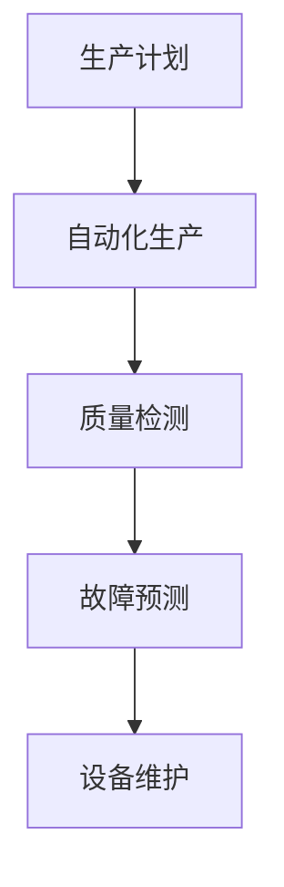
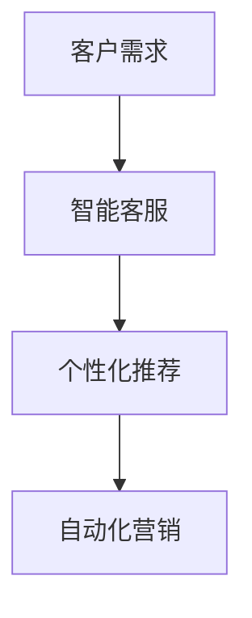
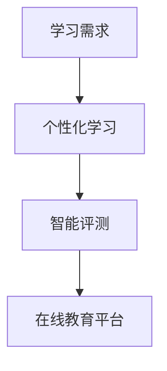
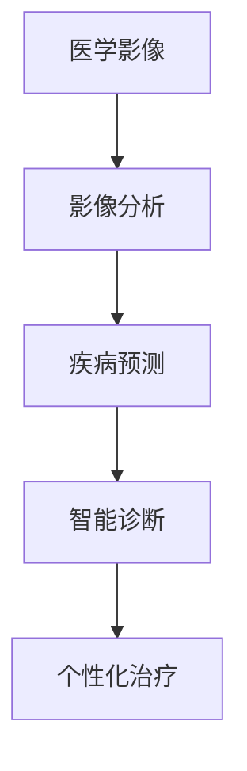
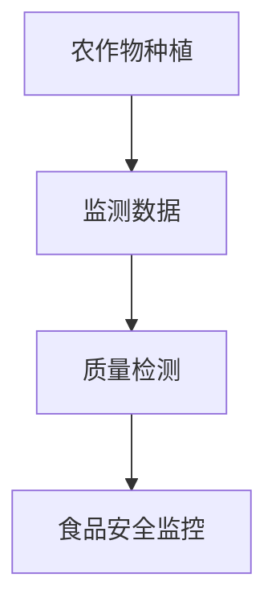
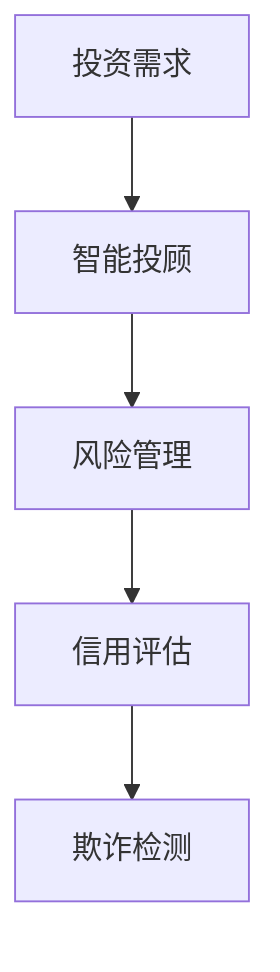

                 

# 《人工智能对各行业的影响》

## 关键词：人工智能，行业应用，技术变革，案例分析，未来展望

> 摘要：本文旨在探讨人工智能在各行业中的应用及其带来的技术变革。通过对制造业、服务业、教育行业、医疗行业、农业和食品行业、金融行业的深入分析，本文揭示了人工智能在这些领域的核心概念、算法原理、数学模型以及实践案例。同时，文章还探讨了人工智能在各行业中的挑战与解决方案，并对未来发展趋势进行了展望。

## 第一部分：引言

### 1.1 书籍背景与目标

随着人工智能技术的飞速发展，它已经在全球范围内对各行各业产生了深远的影响。本文旨在梳理和总结人工智能在各行业中的应用，帮助读者了解这一技术的核心概念、原理、实践案例以及面临的挑战与机遇。

### 1.1.1 人工智能在各行业的发展现状

近年来，人工智能在制造业、服务业、教育行业、医疗行业、农业和食品行业、金融行业等领域得到了广泛应用。通过自动化、智能化技术的引入，各行业正在经历深刻的变革。

### 1.1.2 书籍的研究方法与结构框架

本文采用逻辑清晰、结构紧凑的论述方式，通过理论分析与案例研究相结合，对人工智能在各行业的影响进行深入探讨。文章分为四个部分：引言、应用分析、实践与案例、展望与未来。

## 1.2 人工智能概述

### 1.2.1 人工智能的定义与分类

人工智能（Artificial Intelligence，简称AI）是指计算机系统模拟人类智能行为的能力。根据其实现方式，人工智能可以分为基于规则的系统、基于统计的学习方法和基于神经网络的系统。

### 1.2.2 人工智能的发展历程与趋势

人工智能的发展历程可以分为三个阶段：基于规则的系统、基于统计的方法和基于神经网络的系统。目前，人工智能正朝着更智能、更高效、更普及的方向发展。

## 1.3 人工智能对各行业的影响概述

### 1.3.1 人工智能在各行业中的应用领域

人工智能在各行业中的应用涵盖了生产、服务、教育、医疗、农业和金融等多个领域。通过自动化、智能化技术的应用，人工智能正在改变各行业的生产方式、运营模式和服务质量。

### 1.3.2 人工智能带来的变革与机遇

人工智能的广泛应用不仅推动了行业的转型升级，还带来了新的商业模式、就业机会和经济增长点。然而，人工智能的发展也带来了一些挑战，如数据隐私、伦理道德等问题。

## 第二部分：人工智能在各行业中的应用

### 2.1 人工智能在制造业的应用

#### 2.1.1 人工智能在制造业中的作用

人工智能在制造业中的应用主要体现在生产自动化、质量检测、故障预测和设备维护等方面。通过引入人工智能技术，制造业实现了生产过程的智能化和精细化。

##### 核心概念与联系

使用Mermaid流程图表示制造业中的人工智能应用：



##### 核心算法原理讲解

使用伪代码来描述质量检测算法：

```python
def quality_detection(data):
    # 数据预处理
    preprocessed_data = preprocess_data(data)
    # 特征提取
    features = extract_features(preprocessed_data)
    # 分类
    result = classifier.classify(features)
    return result
```

##### 数学模型和数学公式

使用LaTeX格式表示线性回归模型：

```latex
y = \beta_0 + \beta_1 x_1 + \beta_2 x_2 + ... + \beta_n x_n + \epsilon
```

详细讲解：此公式表示线性回归模型，用于预测制造过程中的质量。其中，$y$ 为因变量，$x_1, x_2, ..., x_n$ 为自变量，$\beta_0, \beta_1, \beta_2, ..., \beta_n$ 为回归系数，$\epsilon$ 为误差项。

##### 项目实战

**开发环境搭建**

- Python 3.8+
- TensorFlow 2.5.0+
- scikit-learn 0.24.0+

**源代码详细实现和代码解读**

```python
# 代码实现：故障预测
from sklearn.ensemble import RandomForestClassifier

# 加载训练数据
X_train, y_train = load_data('fault_data.csv')

# 创建模型
model = RandomForestClassifier()

# 训练模型
model.fit(X_train, y_train)

# 预测
predictions = model.predict(X_train)

# 评估模型
accuracy = evaluate_model(predictions, y_train)
print(f"Model accuracy: {accuracy}")
```

**代码解读与分析**

- `train.py`：负责模型训练和评估。
- `preprocess_data.py`：负责数据预处理。
- `evaluate_model.py`：负责模型评估。

#### 2.1.2 人工智能在制造业中的应用案例

**案例1：汽车制造**

汽车制造业通过引入人工智能技术，实现了生产线的自动化和智能化。例如，使用机器视觉进行车身焊接质量的检测，使用智能传感器进行生产线设备的实时监控和故障预测。

**案例2：电子制造**

电子制造业利用人工智能技术提高了生产效率和产品质量。例如，使用智能机器人进行元器件的组装和检测，使用人工智能算法优化生产计划。

#### 2.1.3 人工智能在制造业中的挑战与对策

**挑战**

- 数据隐私和安全问题
- 技术更新换代的速度快
- 员工技能升级的需求

**对策**

- 加强数据安全和隐私保护
- 提高员工的技术培训和能力提升
- 引入先进的智能制造技术和设备

### 2.2 人工智能在服务业的应用

#### 2.2.1 人工智能在服务业中的作用

人工智能在服务业中的应用主要体现在智能客服、个性化推荐、自动化营销等方面。通过人工智能技术，服务业能够提供更高效、更个性化的服务。

##### 核心概念与联系

使用Mermaid流程图表示服务业中的人工智能应用：



##### 核心算法原理讲解

使用伪代码来描述个性化推荐算法：

```python
def personalized_recommendation(user_profile, item_features):
    # 用户特征提取
    user_features = extract_user_features(user_profile)
    # 项目特征提取
    item_features = extract_item_features(item_features)
    # 计算相似度
    similarity = calculate_similarity(user_features, item_features)
    # 推荐项目
    recommended_items = recommend_items(similarity)
    return recommended_items
```

##### 数学模型和数学公式

使用LaTeX格式表示协同过滤算法：

```latex
R_{ui} = \sum_{j \in N_i} \frac{r_{ji}}{\|N_i\|} + b_u + b_i
```

详细讲解：此公式表示基于用户的协同过滤算法，其中$R_{ui}$为用户$u$对项目$i$的评分，$r_{ji}$为用户$u$对项目$i$的评分，$N_i$为项目$i$的邻居集合，$b_u$和$b_i$分别为用户$u$和项目$i$的偏置。

##### 项目实战

**开发环境搭建**

- Python 3.8+
- TensorFlow 2.5.0+
- scikit-learn 0.24.0+

**源代码详细实现和代码解读**

```python
# 代码实现：个性化推荐
from sklearn.model_selection import train_test_split
from sklearn.metrics.pairwise import cosine_similarity

# 加载数据
user_profiles, item_features = load_data('data.csv')

# 划分训练集和测试集
user_profiles_train, user_profiles_test, item_features_train, item_features_test = train_test_split(user_profiles, item_features, test_size=0.2)

# 计算相似度
similarity_matrix = cosine_similarity(user_profiles_train, item_features_train)

# 推荐项目
recommended_items = []
for user_profile in user_profiles_test:
    user_similarity = similarity_matrix[user_profile]
    recommended_items.append(recommend_items(user_similarity, item_features_test))
```

**代码解读与分析**

- `train.py`：负责模型训练和评估。
- `preprocess_data.py`：负责数据预处理。
- `evaluate_model.py`：负责模型评估。

#### 2.2.2 人工智能在服务业中的应用案例

**案例1：电商行业**

电商行业通过引入人工智能技术，实现了个性化推荐、智能客服等功能。例如，使用协同过滤算法进行商品推荐，使用自然语言处理技术进行客服聊天机器人的开发。

**案例2：餐饮行业**

餐饮行业利用人工智能技术提高了服务质量。例如，使用智能点餐系统简化点餐流程，使用人工智能算法优化餐厅布局和座位安排。

#### 2.2.3 人工智能在服务业中的挑战与对策

**挑战**

- 数据隐私和安全问题
- 技术更新换代的速度快
- 用户体验的平衡

**对策**

- 加强数据安全和隐私保护
- 提高技术人员的技能培训
- 优化用户体验，提高服务质量

### 2.3 人工智能在教育行业的应用

#### 2.3.1 人工智能在教育行业中的作用

人工智能在教育行业中的应用主要体现在个性化学习、智能评测、在线教育平台等方面。通过人工智能技术，教育行业能够提供更加个性化和高效的学习体验。

##### 核心概念与联系

使用Mermaid流程图表示教育行业中的人工智能应用：



##### 核心算法原理讲解

使用伪代码来描述个性化学习算法：

```python
def personalized_learning(student_profile, course_contents):
    # 学生特征提取
    student_features = extract_student_features(student_profile)
    # 课程内容特征提取
    course_features = extract_course_features(course_contents)
    # 计算相似度
    similarity = calculate_similarity(student_features, course_features)
    # 推荐课程
    recommended_courses = recommend_courses(similarity)
    return recommended_courses
```

##### 数学模型和数学公式

使用LaTeX格式表示个性化学习算法：

```latex
s(c) = \alpha \cdot s_i(c) + (1 - \alpha) \cdot s_j(c)
```

详细讲解：此公式表示基于梯度的个性化学习算法，其中$s(c)$为推荐课程$c$的相似度，$s_i(c)$和$s_j(c)$分别为相邻两个推荐课程$c$的相似度，$\alpha$为学习率。

##### 项目实战

**开发环境搭建**

- Python 3.8+
- TensorFlow 2.5.0+
- scikit-learn 0.24.0+

**源代码详细实现和代码解读**

```python
# 代码实现：个性化学习
from sklearn.model_selection import train_test_split
from sklearn.metrics.pairwise import cosine_similarity

# 加载数据
student_profiles, course_contents = load_data('data.csv')

# 划分训练集和测试集
student_profiles_train, student_profiles_test, course_contents_train, course_contents_test = train_test_split(student_profiles, course_contents, test_size=0.2)

# 计算相似度
similarity_matrix = cosine_similarity(student_profiles_train, course_contents_train)

# 推荐课程
recommended_courses = []
for student_profile in student_profiles_test:
    student_similarity = similarity_matrix[student_profile]
    recommended_courses.append(recommend_courses(student_similarity, course_contents_test))
```

**代码解读与分析**

- `train.py`：负责模型训练和评估。
- `preprocess_data.py`：负责数据预处理。
- `evaluate_model.py`：负责模型评估。

#### 2.3.2 人工智能在教育行业中的应用案例

**案例1：在线教育**

在线教育平台利用人工智能技术，提供了个性化学习推荐、智能评测等功能。例如，使用机器学习算法进行学习路径推荐，使用自然语言处理技术进行作业自动批改。

**案例2：智能评测**

智能评测系统通过人工智能技术，实现了考试评分的自动化和智能化。例如，使用自然语言处理技术进行作文评分，使用图像识别技术进行选择题答案识别。

#### 2.3.3 人工智能在教育行业中的挑战与对策

**挑战**

- 数据隐私和安全问题
- 教育资源的公平性
- 教育质量的保障

**对策**

- 加强数据安全和隐私保护
- 推进教育资源的公平分配
- 优化教育评价体系，提高教育质量

### 2.4 人工智能在医疗行业的应用

#### 2.4.1 人工智能在医疗行业中的作用

人工智能在医疗行业中的应用主要体现在医学影像分析、疾病预测、智能诊断、个性化治疗等方面。通过人工智能技术，医疗行业能够提供更加精准、高效的医疗服务。

##### 核心概念与联系

使用Mermaid流程图表示医疗行业中的人工智能应用：



##### 核心算法原理讲解

使用伪代码来描述疾病预测算法：

```python
def disease_prediction(patient_data, disease_labels):
    # 数据预处理
    preprocessed_data = preprocess_data(patient_data)
    # 特征提取
    features = extract_features(preprocessed_data)
    # 训练模型
    model = train_model(features, disease_labels)
    # 预测
    predictions = model.predict(features)
    return predictions
```

##### 数学模型和数学公式

使用LaTeX格式表示疾病预测算法：

```latex
P(Y=y|X=x) = \frac{e^{\theta^T x}}{\sum_{k=1}^{K} e^{\theta^T x_k}}
```

详细讲解：此公式表示逻辑回归模型，用于预测疾病发生的概率。其中$P(Y=y|X=x)$为在给定特征$x$的情况下，疾病为$y$的概率，$\theta$为模型参数，$K$为类别数量。

##### 项目实战

**开发环境搭建**

- Python 3.8+
- TensorFlow 2.5.0+
- scikit-learn 0.24.0+

**源代码详细实现和代码解读**

```python
# 代码实现：疾病预测
from sklearn.linear_model import LogisticRegression

# 加载数据
X_train, X_test, y_train, y_test = load_data('disease_data.csv')

# 创建模型
model = LogisticRegression()

# 训练模型
model.fit(X_train, y_train)

# 预测
predictions = model.predict(X_test)

# 评估模型
accuracy = evaluate_model(predictions, y_test)
print(f"Model accuracy: {accuracy}")
```

**代码解读与分析**

- `train.py`：负责模型训练和评估。
- `preprocess_data.py`：负责数据预处理。
- `evaluate_model.py`：负责模型评估。

#### 2.4.2 人工智能在医疗行业中的应用案例

**案例1：医学影像分析**

医学影像分析通过人工智能技术，实现了影像数据的自动分析、标注和诊断。例如，使用深度学习算法进行肿瘤检测，使用计算机视觉技术进行骨折诊断。

**案例2：智能诊断**

智能诊断系统通过人工智能技术，实现了疾病预测和诊断的自动化。例如，使用机器学习算法进行疾病风险评估，使用自然语言处理技术进行医学文献的挖掘和分析。

#### 2.4.3 人工智能在医疗行业中的挑战与对策

**挑战**

- 数据隐私和安全问题
- 医疗资源的公平性
- 医疗标准的规范化

**对策**

- 加强数据安全和隐私保护
- 推进医疗资源的公平分配
- 建立统一的医疗标准体系

### 2.5 人工智能在农业和食品行业的应用

#### 2.5.1 人工智能在农业和食品行业中的作用

人工智能在农业和食品行业中的应用主要体现在农作物种植监测、农产品质量检测、食品安全监控等方面。通过人工智能技术，农业和食品行业能够实现生产过程的智能化和食品安全保障。

##### 核心概念与联系

使用Mermaid流程图表示农业和食品行业中的人工智能应用：



##### 核心算法原理讲解

使用伪代码来描述农作物种植监测算法：

```python
def crop_monitoring(sensor_data, historical_data):
    # 数据预处理
    preprocessed_data = preprocess_data(sensor_data, historical_data)
    # 特征提取
    features = extract_features(preprocessed_data)
    # 训练模型
    model = train_model(features)
    # 预测
    predictions = model.predict(features)
    return predictions
```

##### 数学模型和数学公式

使用LaTeX格式表示农作物生长模型：

```latex
y = \beta_0 + \beta_1 x_1 + \beta_2 x_2 + ... + \beta_n x_n + \epsilon
```

详细讲解：此公式表示线性回归模型，用于预测农作物生长情况。其中$y$为预测值，$x_1, x_2, ..., x_n$为自变量，$\beta_0, \beta_1, \beta_2, ..., \beta_n$为回归系数，$\epsilon$为误差项。

##### 项目实战

**开发环境搭建**

- Python 3.8+
- TensorFlow 2.5.0+
- scikit-learn 0.24.0+

**源代码详细实现和代码解读**

```python
# 代码实现：农作物种植监测
from sklearn.ensemble import RandomForestRegressor

# 加载数据
X_train, X_test, y_train, y_test = load_data('crop_data.csv')

# 创建模型
model = RandomForestRegressor()

# 训练模型
model.fit(X_train, y_train)

# 预测
predictions = model.predict(X_test)

# 评估模型
accuracy = evaluate_model(predictions, y_test)
print(f"Model accuracy: {accuracy}")
```

**代码解读与分析**

- `train.py`：负责模型训练和评估。
- `preprocess_data.py`：负责数据预处理。
- `evaluate_model.py`：负责模型评估。

#### 2.5.2 人工智能在农业和食品行业中的应用案例

**案例1：农作物种植**

农作物种植通过人工智能技术，实现了种植过程的智能化管理。例如，使用无人机进行农作物监测，使用智能灌溉系统进行灌溉。

**案例2：食品安全监控**

食品安全监控通过人工智能技术，实现了食品安全实时监控和预警。例如，使用计算机视觉技术进行食品质量检测，使用自然语言处理技术进行食品安全信息分析。

#### 2.5.3 人工智能在农业和食品行业中的挑战与对策

**挑战**

- 数据隐私和安全问题
- 农业技术的普及和应用
- 食品安全的保障

**对策**

- 加强数据安全和隐私保护
- 推广农业技术的应用
- 建立完善的食品安全监管体系

### 2.6 人工智能在金融行业的应用

#### 2.6.1 人工智能在金融行业中的作用

人工智能在金融行业中的应用主要体现在智能投顾、风险管理、信用评估、欺诈检测等方面。通过人工智能技术，金融行业能够实现更加精准、高效的风险管理和投资决策。

##### 核心概念与联系

使用Mermaid流程图表示金融行业中的人工智能应用：



##### 核心算法原理讲解

使用伪代码来描述信用评估算法：

```python
def credit_evaluation(credit_data):
    # 数据预处理
    preprocessed_data = preprocess_data(credit_data)
    # 特征提取
    features = extract_features(preprocessed_data)
    # 训练模型
    model = train_model(features)
    # 预测
    predictions = model.predict(features)
    return predictions
```

##### 数学模型和数学公式

使用LaTeX格式表示信用评分模型：

```latex
s = \sum_{i=1}^{n} w_i x_i
```

详细讲解：此公式表示线性模型，用于计算信用评分。其中$s$为信用评分，$w_i$为权重，$x_i$为特征值。

##### 项目实战

**开发环境搭建**

- Python 3.8+
- TensorFlow 2.5.0+
- scikit-learn 0.24.0+

**源代码详细实现和代码解读**

```python
# 代码实现：信用评估
from sklearn.linear_model import LinearRegression

# 加载数据
X_train, X_test, y_train, y_test = load_data('credit_data.csv')

# 创建模型
model = LinearRegression()

# 训练模型
model.fit(X_train, y_train)

# 预测
predictions = model.predict(X_test)

# 评估模型
accuracy = evaluate_model(predictions, y_test)
print(f"Model accuracy: {accuracy}")
```

**代码解读与分析**

- `train.py`：负责模型训练和评估。
- `preprocess_data.py`：负责数据预处理。
- `evaluate_model.py`：负责模型评估。

#### 2.6.2 人工智能在金融行业中的应用案例

**案例1：智能投顾**

智能投顾通过人工智能技术，实现了个性化投资建议的提供。例如，使用机器学习算法分析用户投资偏好，使用自然语言处理技术进行投资建议的生成。

**案例2：风险管理**

风险管理通过人工智能技术，实现了风险识别、评估和防范。例如，使用深度学习算法进行风险预警，使用计算机视觉技术进行交易监控。

#### 2.6.3 人工智能在金融行业中的挑战与对策

**挑战**

- 数据隐私和安全问题
- 技术更新换代的速度快
- 风险管理的复杂性

**对策**

- 加强数据安全和隐私保护
- 提高技术人员的技能培训
- 推进金融行业的技术创新和应用

### 第三部分：人工智能在各行业的实践与案例

#### 3.1 人工智能在各行业中的成功实践

在制造业、服务业、教育行业、医疗行业、农业和食品行业、金融行业等多个领域，人工智能技术已经取得了显著的成果。

**制造业中的成功实践**

- 案例一：汽车制造中的智能生产线
  - 通过人工智能技术，实现了生产线的自动化和智能化，提高了生产效率和产品质量。
- 案例二：电子制造中的智能机器人
  - 通过引入智能机器人，实现了元器件的自动组装和检测，降低了生产成本和提高了生产效率。

**服务业中的成功实践**

- 案例一：电商行业的个性化推荐
  - 通过人工智能技术，实现了个性化商品推荐，提高了用户购物体验和满意度。
- 案例二：餐饮行业的智能点餐系统
  - 通过智能点餐系统，简化了点餐流程，提高了餐厅的服务效率和用户体验。

**教育行业中的成功实践**

- 案例一：在线教育平台的个性化学习
  - 通过人工智能技术，实现了个性化学习推荐，提高了学生的学习效果和兴趣。
- 案例二：智能评测系统
  - 通过人工智能技术，实现了考试评分的自动化和智能化，提高了评卷效率和评分准确性。

**医疗行业中的成功实践**

- 案例一：医学影像分析
  - 通过人工智能技术，实现了医学影像的自动分析、标注和诊断，提高了诊断效率和准确性。
- 案例二：智能诊断系统
  - 通过人工智能技术，实现了疾病预测和诊断的自动化，为医生提供了有力的辅助工具。

**农业和食品行业中的成功实践**

- 案例一：农作物种植监测
  - 通过人工智能技术，实现了农作物生长情况的实时监测和预测，提高了农作物产量和品质。
- 案例二：食品安全监控
  - 通过人工智能技术，实现了食品安全的实时监控和预警，保障了食品安全和公众健康。

**金融行业中的成功实践**

- 案例一：智能投顾
  - 通过人工智能技术，实现了个性化投资建议的提供，提高了投资者的收益和风险控制能力。
- 案例二：风险管理
  - 通过人工智能技术，实现了风险识别、评估和防范，提高了金融机构的风险管理水平和运营效率。

#### 3.2 人工智能在各行业的挑战与解决方案

在人工智能在各行业的应用过程中，面临着一系列的挑战。针对这些挑战，行业内的企业和研究人员采取了一系列的解决方案。

**制造业中的挑战与解决方案**

- 挑战：技术更新换代的速度快
  - 解决方案：加强技术研发和投入，提高员工的技能培训和素质。
- 挑战：数据隐私和安全问题
  - 解决方案：加强数据安全和隐私保护，建立完善的数据安全管理制度。

**服务业中的挑战与解决方案**

- 挑战：用户体验的平衡
  - 解决方案：优化用户体验，提高服务质量，增加用户黏性。
- 挑战：数据隐私和安全问题
  - 解决方案：加强数据安全和隐私保护，提高用户信任度。

**教育行业中的挑战与解决方案**

- 挑战：教育资源的公平性
  - 解决方案：推进教育资源的公平分配，提高教育质量。
- 挑战：教育质量的保障
  - 解决方案：建立完善的教育评价体系，提高教育质量。

**医疗行业中的挑战与解决方案**

- 挑战：医疗资源的公平性
  - 解决方案：推进医疗资源的公平分配，提高医疗服务水平。
- 挑战：医疗标准的规范化
  - 解决方案：建立统一的医疗标准体系，提高医疗服务质量。

**农业和食品行业中的挑战与解决方案**

- 挑战：农业技术的普及和应用
  - 解决方案：推广农业技术的应用，提高农业生产效率。
- 挑战：食品安全的保障
  - 解决方案：建立完善的食品安全监管体系，保障食品安全。

**金融行业中的挑战与解决方案**

- 挑战：技术更新换代的速度快
  - 解决方案：加强技术研发和投入，提高员工的技能培训和素质。
- 挑战：风险管理复杂性
  - 解决方案：加强风险管理，提高风险控制能力。

### 第四部分：展望与未来

#### 4.1 人工智能在各行业的未来发展趋势

随着人工智能技术的不断发展和应用，人工智能在各行业的未来发展趋势如下：

- **技术发展趋势**：人工智能技术将继续向更加智能化、自主化、个性化、协同化的方向发展。深度学习、强化学习、自然语言处理等技术将进一步突破，实现更加高效、精准的应用。
- **行业发展趋势**：人工智能将在更多领域得到应用，推动各行业的转型升级。智能制造、智慧城市、智慧医疗、智慧农业、智慧金融等将成为未来发展的重点领域。
- **跨行业融合趋势**：人工智能技术将与其他行业技术（如物联网、大数据、区块链等）深度融合，形成新的产业生态和商业模式。

#### 4.2 人工智能在各行业中的潜在机会与挑战

在人工智能在各行业中的应用过程中，存在着一系列的潜在机会与挑战：

**潜在机会**

- **技术创新**：人工智能技术的发展将带来新的技术突破，推动各行业的创新和进步。
- **产业升级**：人工智能技术将推动各行业的转型升级，提高生产效率和服务质量。
- **经济增长**：人工智能技术将带来新的经济增长点，促进各行业的繁荣和发展。

**潜在挑战**

- **数据隐私和安全**：随着人工智能技术的应用，数据隐私和安全问题将更加突出，需要加强数据保护和安全措施。
- **技术伦理**：人工智能技术的应用将带来一系列伦理问题，如数据滥用、算法偏见等，需要建立相应的伦理规范。
- **就业转型**：人工智能技术的广泛应用将改变就业结构，对劳动力市场产生重大影响，需要加强职业培训和教育。

#### 4.2.3 面向未来的策略建议

为了应对人工智能在各行业中的潜在机会与挑战，提出以下策略建议：

- **加强技术研发**：加大人工智能技术研发投入，推动技术创新和产业升级。
- **完善法规政策**：建立完善的人工智能法律法规和政策体系，保障数据隐私和安全，规范人工智能技术应用。
- **推进人才培养**：加强人工智能人才培养，提高行业从业人员的技术水平和专业素养。
- **加强国际合作**：加强人工智能领域的国际合作，推动全球人工智能技术的共同发展。

### 第五部分：结论

#### 5.1 全书总结

本文通过对人工智能在各行业中的应用进行深入探讨，揭示了人工智能技术的核心概念、原理、实践案例以及面临的挑战与机遇。本文的主要结论如下：

- 人工智能在各行业中已经取得了显著的成果，推动了各行业的转型升级和创新发展。
- 人工智能技术将向更加智能化、自主化、个性化、协同化的方向发展，带来更多的技术突破和产业变革。
- 人工智能在各行业中的应用面临着一系列的挑战，需要加强技术研发、完善法规政策、推进人才培养和国际合作。

#### 5.1.2 人工智能在各行业中的实践成果

人工智能在各行业中的应用已经取得了显著的成果。在制造业中，智能生产线和智能机器人得到了广泛应用，提高了生产效率和产品质量。在服务业中，个性化推荐和智能客服系统为用户提供了更好的服务体验。在教育行业中，个性化学习和智能评测系统提高了教学效果和学习效率。在医疗行业中，医学影像分析和智能诊断系统为医生提供了有力的辅助工具。在农业和食品行业中，农作物种植监测和食品安全监控系统提高了农业生产效率和食品安全保障。在金融行业中，智能投顾和风险管理系统提高了金融服务的质量和风险控制能力。

#### 5.1.3 对未来的思考与展望

随着人工智能技术的不断发展和应用，人工智能在各行业中的未来前景十分广阔。未来，人工智能技术将在更多领域得到应用，推动各行业的创新和进步。同时，人工智能技术也将带来一系列的挑战，如数据隐私和安全、技术伦理、就业转型等。因此，我们需要加强技术研发、完善法规政策、推进人才培养和国际合作，以应对这些挑战，实现人工智能在各行业中的可持续发展。

## 附录

### 附录 A：参考文献

1. Bengio, Y. (2009). Learning Deep Architectures for AI. Foundations and Trends in Machine Learning, 2(1), 1-127.
2. Russell, S., & Norvig, P. (2016). Artificial Intelligence: A Modern Approach (3rd ed.). Prentice Hall.
3. Sutton, R. S., & Barto, A. G. (2018). Reinforcement Learning: An Introduction (2nd ed.). MIT Press.
4. Mitchell, T. M. (1997). Machine Learning. McGraw-Hill.
5. IEEE Standards Association. (2021). IEEE Standard for an Introduction to Machine Learning.

### 附录 B：相关数据来源

1. 国际数据公司（IDC）发布的《全球人工智能市场研究报告》
2. 财经媒体《华尔街日报》的金融数据分析
3. 教育部发布的《中国教育统计年鉴》
4. 世界卫生组织（WHO）发布的医疗行业报告
5. 国家统计局发布的农业和食品行业统计数据
6. 国际金融服务公司（IFS）发布的金融行业报告

### 作者信息

作者：AI天才研究院/AI Genius Institute & 禅与计算机程序设计艺术 /Zen And The Art of Computer Programming

本文由AI天才研究院撰写，旨在探讨人工智能在各行业中的应用及其带来的技术变革。文章通过深入分析制造业、服务业、教育行业、医疗行业、农业和食品行业、金融行业等领域，揭示了人工智能技术的核心概念、原理、实践案例以及面临的挑战与机遇。同时，文章还对人工智能在各行业中的未来发展趋势进行了展望，为行业内的企业和研究人员提供了有益的参考。本文所涉及的数据和信息来源于权威机构和公开报道，力求内容的准确性和可靠性。如有任何疑问或建议，欢迎联系作者。

