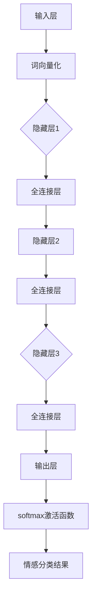

                 

### 文章标题

《人工智能的两大流派：逻辑与神经网络》

### 关键词

人工智能、逻辑流派、神经网络、机器学习、智能系统、逻辑神经网络

### 摘要

本文深入探讨了人工智能领域的两大流派——逻辑与神经网络。首先，我们回顾了逻辑流派的起源、发展及应用，分析了逻辑推理的基本原理和常见模型。然后，介绍了神经网络流派的发展历程、基本结构及其在现代人工智能中的应用。接着，探讨了逻辑与神经网络的融合，构建逻辑神经网络，并展示了其在情感分析、知识图谱构建和逻辑推理辅助等领域的应用。最后，通过一个实际项目案例，展示了逻辑与神经网络结合的实战过程，并展望了人工智能的未来发展趋势与挑战。

### 《人工智能的两大流派：逻辑与神经网络》目录大纲

#### 第一部分：逻辑流派概述

**第1章 逻辑流派基础理论**

1.1 逻辑学派的发展历程

1.2 逻辑推理的基本原理

1.3 逻辑推理模型与算法

1.4 逻辑流派对现实世界问题的应用

#### 第二部分：神经网络流派概述

**第2章 神经网络基础理论**

2.1 神经网络的发展历程

2.2 生物神经网络的启示

2.3 神经网络的基本结构

#### 第三部分：逻辑与神经网络的融合

**第3章 逻辑神经网络**

3.1 逻辑神经网络的定义

3.2 逻辑神经网络的设计与实现

3.3 逻辑神经网络的应用案例

#### 第四部分：项目实战

**第4章 逻辑与神经网络结合的实战案例**

4.1 项目背景与目标

4.2 项目方案设计

4.3 项目实施与效果评估

#### 第五部分：未来发展趋势与挑战

**第5章 人工智能的发展趋势与挑战**

5.1 人工智能的发展趋势

5.2 逻辑与神经网络融合的未来前景

#### 附录

**附录A 逻辑与神经网络相关资源**

**附录B 逻辑与神经网络相关工具与平台**

---

### 第一部分：逻辑流派概述

#### 第1章 逻辑流派基础理论

##### 1.1 逻辑学派的发展历程

逻辑学派作为人工智能的重要分支，其历史可以追溯到古代哲学和数学的发展。古希腊哲学家亚里士多德（Aristotle）被认为是逻辑学派的奠基人，他的逻辑学著作奠定了形式逻辑的基础。亚里士多德的逻辑思想通过阿拉伯世界传入欧洲，并在中世纪得到了进一步的发展。

到了现代，逻辑学派的发展进入了新的阶段。查尔斯·桑德斯·皮尔士（Charles Sanders Peirce）和伯特兰·罗素（Bertrand Russell）等人对逻辑学进行了深入的研究，提出了符号逻辑和形式逻辑的系统化理论。在计算机科学和人工智能领域，艾伦·图灵（Alan Turing）提出的图灵测试成为了衡量机器智能的重要标准。

逻辑学派在人工智能中的重要性体现在其对推理和决策的支持。通过对逻辑规则和推理过程的建模，逻辑学派能够为智能系统提供基于规则的决策能力，这在早期的人工智能应用中尤为重要。

##### 1.2 逻辑推理的基本原理

逻辑推理是逻辑学派的核心，包括演绎推理和归纳推理两种基本形式。

- **演绎推理（Deductive Reasoning）**：演绎推理是从一般到特殊的推理过程。它基于一般原则，推导出特定情况下的结论。例如，如果所有的人都会死亡，那么苏格拉底是人，因此苏格拉底会死亡。这种推理方式具有确定性，如果前提正确，结论必然正确。

- **归纳推理（Inductive Reasoning）**：归纳推理是从特殊到一般的推理过程。它通过观察具体案例，归纳出一般性的规律。例如，通过观察每天太阳从东方升起，我们归纳出“太阳每天从东方升起”的规律。这种推理方式具有概率性，结论的正确性取决于观察数据的代表性和可靠性。

逻辑推理的基本步骤包括：

1. **定义问题**：明确需要推理的问题或目标。
2. **收集信息**：收集与问题相关的信息。
3. **建立假设**：基于已有信息，提出可能的假设。
4. **推理验证**：通过逻辑规则，验证假设的正确性。
5. **得出结论**：根据推理过程，得出最终结论。

##### 1.3 逻辑推理模型与算法

逻辑推理模型是逻辑学派的重要组成部分，主要包括基于规则的推理模型、贝叶斯网络推理和模糊逻辑推理等。

- **基于规则的推理模型（Rule-Based Reasoning）**：基于规则的推理模型是逻辑学派中最常见的模型。它通过定义一系列规则，将输入数据映射到输出结论。规则通常表示为“如果-那么”的形式，例如“如果下雨，那么地面湿润”。基于规则的推理模型在专家系统和诊断系统中得到了广泛应用。

- **贝叶斯网络推理（Bayesian Network Reasoning）**：贝叶斯网络是一种概率图模型，它通过节点和边来表示变量之间的概率依赖关系。在贝叶斯网络中，每个节点代表一个随机变量，边表示变量之间的条件概率。贝叶斯网络推理通过计算网络中变量的联合概率分布，实现对不确定性的推理。贝叶斯网络在决策支持系统和知识发现中具有重要作用。

- **模糊逻辑推理（Fuzzy Logic Reasoning）**：模糊逻辑是一种处理不确定性和模糊性的数学工具。它通过引入模糊集合和模糊规则，对现实世界中的模糊现象进行建模。模糊逻辑推理可以处理复杂、不精确的信息，适用于需要模糊控制的领域，如自动控制系统和智能交通系统。

在逻辑推理模型的基础上，还发展了一系列推理算法，如反向推理、正向推理和混合推理等。这些算法通过搜索和计算，实现了对逻辑推理过程的自动化和高效化。

##### 1.4 逻辑流派对现实世界问题的应用

逻辑学派在现实世界中有着广泛的应用，包括诊断系统、专家系统和逻辑编程等。

- **诊断系统（Diagnosis Systems）**：诊断系统是一种基于逻辑推理的智能系统，用于识别和诊断复杂系统的问题。它通过定义一系列诊断规则，实现对系统状态的推理。例如，医学诊断系统可以通过对患者的症状和体征进行推理，诊断出具体的疾病。诊断系统在医疗、工业和交通运输等领域具有重要作用。

- **专家系统（Expert Systems）**：专家系统是一种模拟人类专家知识和推理能力的智能系统。它通过定义知识库和推理机，实现对复杂问题的求解。专家系统在金融、医疗、法律等领域得到了广泛应用，如金融风险评估、疾病诊断和法律咨询等。

- **逻辑编程（Logic Programming）**：逻辑编程是一种基于逻辑的编程范式，它通过定义逻辑规则和查询，实现对问题的求解。逻辑编程与传统的命令式编程不同，它更加强调声明式描述和推理能力。逻辑编程在自动推理、知识表示和智能搜索等领域具有广泛应用。

总之，逻辑流派作为人工智能的重要分支，通过逻辑推理和知识表示，为智能系统提供了强大的推理和决策能力。逻辑学派在现实世界的应用不断扩展，推动了人工智能技术的发展和进步。

### 第二部分：神经网络流派概述

#### 第2章 神经网络基础理论

##### 2.1 神经网络的发展历程

神经网络（Neural Networks）作为人工智能的核心技术之一，其历史可以追溯到20世纪40年代。1943年，沃伦·麦卡洛克（Warren McCulloch）和沃尔特·皮茨（Walter Pitts）提出了第一个人工神经网络模型——麦卡洛克-皮茨神经元（McCulloch-Pitts Neuron）。这一模型基于生物神经元的简化模型，通过数学方式模拟神经元的激活与抑制。

1958年，弗兰克·罗森布拉特（Frank Rosenblatt）提出了感知机（Perceptron）模型，这是神经网络发展的一个重要里程碑。感知机是一种单层神经网络，用于实现二分类任务。尽管感知机在理论上存在局限性，但它为神经网络的发展奠定了基础。

1986年，瑞德·赫布（Rosenblatt）提出了反向传播算法（Backpropagation Algorithm），这是神经网络能够学习多层级特征的重要方法。反向传播算法通过反向传播误差，更新网络权重，从而实现神经网络的训练。这一算法的提出标志着神经网络进入了一个新的发展阶段。

进入21世纪，随着计算能力和数据量的提升，神经网络在图像识别、自然语言处理、语音识别等领域取得了显著成果。特别是深度学习（Deep Learning）的发展，使得神经网络能够处理更复杂的任务，实现了前所未有的性能提升。

##### 2.2 生物神经网络的启示

生物神经网络是神经网络设计的重要灵感来源。生物神经网络由大量神经元组成，这些神经元通过突触连接形成复杂的网络结构。每个神经元都能接收来自其他神经元的输入信号，并通过激活阈值进行响应。

生物神经网络的运作原理主要包括以下几个关键点：

- **信号传递**：神经元通过突触传递电信号。当突触前神经元激活时，会释放神经递质，传递信号到突触后神经元。
- **突触可塑性**：突触连接的强度不是固定的，而是可以通过训练进行调整。这种可塑性使得神经网络能够适应新的环境和任务。
- **神经网络层次结构**：生物神经网络具有层次化的结构，从简单的感知器到复杂的认知处理单元。这种层次结构使得神经网络能够处理多层次的信息。

生物神经网络对人工智能的启发主要体现在以下几个方面：

- **层次化特征学习**：深度学习模型通过多层神经网络实现了层次化的特征学习，从原始数据中提取出更高层次的特征。
- **自适应学习机制**：神经网络通过调整权重和激活阈值，实现了自适应学习，使得模型能够适应不同类型的数据和任务。
- **并行计算能力**：生物神经网络具有强大的并行计算能力，能够高效处理复杂的信息。

##### 2.3 神经网络的基本结构

神经网络的基本结构主要包括神经元、层、网络连接和激活函数等关键组成部分。

- **神经元（Neuron）**：神经元是神经网络的基本单元，负责接收输入信号、计算输出值。神经元通常包含一个输入层、一个加权层和一个输出层。输入层接收外部输入信号，加权层对输入信号进行加权处理，输出层产生最终输出。
  
- **层（Layer）**：神经网络由多个层组成，包括输入层、隐藏层和输出层。输入层接收外部输入信号，隐藏层负责提取特征和进行中间计算，输出层产生最终输出。隐藏层的数量和层数决定了神经网络的深度。

- **网络连接（Connections）**：神经元之间的连接通过权重（Weights）进行表示。权重决定了输入信号对神经元输出的贡献大小。通过训练，神经网络能够自动调整权重，以实现预期的输出。

- **激活函数（Activation Function）**：激活函数是神经网络中的重要组成部分，用于决定神经元是否激活。常见的激活函数包括sigmoid函数、ReLU函数、Tanh函数等。激活函数的作用是将加权输入映射到输出，增加网络的非线性特性。

神经网络的基本结构使得其能够通过学习输入和输出的关系，自动提取特征和进行预测。这种结构也使得神经网络在处理复杂数据和任务时具有强大的能力。

##### 2.3.1 单层感知机

单层感知机（Single-Layer Perceptron）是最简单的神经网络模型，由一个输入层和一个输出层组成。输入层接收外部输入信号，输出层产生最终输出。

单层感知机的工作原理如下：

1. **加权求和**：每个输入信号通过权重与输出层的神经元相乘，然后求和。
2. **激活函数**：通过激活函数（如sigmoid函数）将加权求和的结果映射到输出。
3. **输出**：最终输出表示为神经元的激活状态。

单层感知机主要用于二分类任务，其学习算法为感知机学习规则（Perceptron Learning Rule）。感知机学习规则通过不断调整权重，使得输出层能够正确分类输入数据。

单层感知机的局限性在于无法处理非线性问题。为了解决这一问题，多层感知机（Multilayer Perceptron，MLP）应运而生。

##### 2.3.2 多层感知机

多层感知机（Multilayer Perceptron，MLP）是单层感知机的扩展，由多个层组成，包括输入层、隐藏层和输出层。隐藏层负责提取特征和进行中间计算，输出层产生最终输出。

多层感知机的工作原理如下：

1. **输入层**：接收外部输入信号，每个输入信号通过权重与隐藏层的神经元相连接。
2. **隐藏层**：隐藏层通过激活函数将加权输入转换为激活状态。每个隐藏层的神经元负责提取不同层次的特征。
3. **输出层**：输出层接收隐藏层的输出，通过激活函数产生最终输出。

多层感知机能够处理非线性问题，通过多层网络结构提取更复杂的特征。其学习算法为反向传播算法（Backpropagation Algorithm），通过反向传播误差，更新网络权重，实现网络训练。

多层感知机在图像识别、语音识别和自然语言处理等领域得到了广泛应用。其性能取决于网络结构、激活函数和学习算法。

##### 2.3.3 卷积神经网络（CNN）

卷积神经网络（Convolutional Neural Network，CNN）是一种专门用于处理图像数据的神经网络模型。CNN通过卷积操作和池化操作，提取图像特征，实现图像分类和识别。

CNN的基本结构包括输入层、卷积层、池化层和全连接层。

1. **输入层**：接收图像输入，图像经过预处理（如归一化、缩放等）后输入到网络中。

2. **卷积层**：卷积层通过卷积操作提取图像特征。卷积核在图像上滑动，计算局部特征响应。每个卷积核负责提取一种特定特征。通过叠加多个卷积核，CNN能够提取多层次的图像特征。

3. **池化层**：池化层用于降低特征图的维度，减少参数数量。常见的池化操作包括最大池化和平均池化。池化层可以减少过拟合，提高模型泛化能力。

4. **全连接层**：全连接层将卷积层和池化层提取的特征映射到分类结果。全连接层通过计算每个类别的得分，实现对图像的最终分类。

CNN在图像分类、目标检测和图像生成等领域取得了显著成果。其性能取决于网络结构、卷积核大小和池化方式。

##### 2.3.4 循环神经网络（RNN）

循环神经网络（Recurrent Neural Network，RNN）是一种专门用于处理序列数据的神经网络模型。RNN通过引入循环结构，使得网络能够保留长期依赖信息，实现序列建模。

RNN的基本结构包括输入层、隐藏层和输出层。隐藏层连接前一个时刻的隐藏状态和当前时刻的输入，形成循环连接。

RNN的工作原理如下：

1. **输入层**：接收序列输入，每个输入通过权重与隐藏层的神经元相连接。
2. **隐藏层**：隐藏层通过循环连接，将前一个时刻的隐藏状态传递到当前时刻。隐藏状态用于提取序列特征。
3. **输出层**：输出层接收隐藏层的输出，通过激活函数产生最终输出。

RNN在自然语言处理、语音识别和时间序列预测等领域得到了广泛应用。其性能取决于网络结构、循环连接和激活函数。

##### 2.3.5 生成对抗网络（GAN）

生成对抗网络（Generative Adversarial Network，GAN）是由生成器（Generator）和判别器（Discriminator）组成的对抗性模型。GAN通过两个网络的对抗训练，实现数据生成和模型优化。

GAN的基本结构包括：

1. **生成器**：生成器从随机噪声生成假样本。生成器的目标是生成尽可能真实的样本，以欺骗判别器。
2. **判别器**：判别器用于区分真实样本和生成样本。判别器的目标是正确分类样本，识别生成器生成的假样本。

GAN的训练过程如下：

1. **初始化**：初始化生成器和判别器的权重。
2. **生成样本**：生成器生成假样本。
3. **训练判别器**：判别器对真实样本和生成样本进行分类，更新权重。
4. **训练生成器**：生成器生成新的假样本，以欺骗判别器，更新权重。
5. **重复训练**：不断重复训练过程，直到生成器生成的样本足够真实。

GAN在图像生成、风格迁移和对抗性样本生成等领域取得了显著成果。其性能取决于生成器和判别器的结构、训练策略和数据质量。

总之，神经网络流派通过模拟生物神经网络的结构和运作原理，实现了对复杂数据的建模和预测。不同的神经网络模型在图像、序列和生成任务中表现出色，推动了人工智能技术的快速发展。

### 第三部分：逻辑与神经网络的融合

#### 第3章 逻辑神经网络

##### 3.1 逻辑神经网络的定义

逻辑神经网络（Logic Neural Network，LNN）是逻辑学派与神经网络流派的结合产物，旨在将逻辑推理与神经网络的学习能力相结合，以实现更强大的智能系统。逻辑神经网络通过引入逻辑规则和逻辑结构，将逻辑推理与神经网络模型相结合，使其具备推理和自主学习的能力。

逻辑神经网络的主要特点包括：

1. **融合逻辑规则与神经网络**：逻辑神经网络将逻辑规则嵌入到神经网络结构中，通过逻辑规则进行推理，同时利用神经网络进行参数学习，实现推理与学习的有机结合。

2. **支持逻辑推理**：逻辑神经网络能够根据逻辑规则进行推理，实现对知识库中知识的推理和应用。这使得逻辑神经网络在知识表示和推理方面具有独特的优势。

3. **自适应学习能力**：逻辑神经网络通过训练，能够自适应地调整网络参数，学习新的知识和规则，提高系统的智能水平。

4. **处理不确定性与模糊性**：逻辑神经网络通过模糊逻辑和概率逻辑等机制，能够处理现实世界中的不确定性和模糊性，提高系统的鲁棒性和适应能力。

逻辑神经网络的定义可以概括为：一种结合逻辑推理与神经网络学习机制的智能系统，通过逻辑规则和神经网络结构，实现知识的表示、推理和自主学习。

##### 3.2 逻辑神经网络的设计与实现

逻辑神经网络的设计与实现包括以下几个关键步骤：

1. **逻辑规则定义**：首先，根据应用场景和需求，定义逻辑规则。逻辑规则通常表示为“如果-那么”的形式，例如“如果天气下雨，那么地面湿润”。

2. **神经网络结构设计**：根据逻辑规则，设计神经网络结构。逻辑神经网络通常由输入层、隐藏层和输出层组成。输入层接收外部输入，隐藏层提取特征和进行推理，输出层产生最终输出。

3. **逻辑门实现**：逻辑神经网络通过逻辑门（如AND、OR、NOT等）实现逻辑运算。逻辑门是神经网络中的基本单元，负责对输入信号进行逻辑操作。

4. **权重初始化**：对神经网络中的权重进行初始化。权重决定了输入信号对神经元输出的贡献大小，通过训练可以自适应调整。

5. **激活函数选择**：选择合适的激活函数，如sigmoid函数、ReLU函数等，以实现神经元的非线性变换。

6. **训练与优化**：利用训练数据，通过反向传播算法对网络进行训练。反向传播算法通过计算误差梯度，更新网络权重，优化网络性能。

7. **推理与决策**：在训练完成后，逻辑神经网络可以根据输入信号，通过逻辑规则进行推理和决策，实现对问题的求解。

以下是逻辑神经网络的一个简化实现示例：

```python
# 输入层
inputs = [1, 0, 1]  # 表示天气（1表示下雨，0表示晴天），地面湿润度（1表示湿润，0表示干燥）

# 隐藏层
weights_hidden = [
    [0.5, -0.5],  # 第一条规则：如果天气下雨，那么地面湿润度提高
    [-0.5, 0.5]   # 第二条规则：如果天气晴天，那么地面湿润度降低
]

# 输出层
weights_output = [
    [0.5],  # 输出层的权重，表示地面湿润度的期望
]

# 激活函数
def sigmoid(x):
    return 1 / (1 + np.exp(-x))

# 前向传播
hidden_layer_activations = []
for i in range(len(weights_hidden)):
    activation = sigmoid(np.dot(inputs, weights_hidden[i]))
    hidden_layer_activations.append(activation)

output = sigmoid(np.dot(hidden_layer_activations, weights_output[0]))

print("输出结果：", output)
```

在这个示例中，逻辑神经网络通过定义逻辑规则（如果天气下雨，那么地面湿润度提高），利用sigmoid函数实现逻辑运算，并通过前向传播计算输出结果。

##### 3.3 逻辑神经网络的应用案例

逻辑神经网络在多个领域具有广泛的应用，以下介绍几个典型的应用案例：

1. **情感分析**：情感分析是一种对文本数据中情感倾向进行分类的任务。逻辑神经网络可以通过学习情感词典和情感规则，实现对文本的情感分类。例如，通过训练逻辑神经网络，可以判断一段文本是积极情感还是消极情感。

2. **知识图谱构建**：知识图谱是一种用于表示实体及其关系的图形化知识库。逻辑神经网络可以通过学习实体间的逻辑关系，构建知识图谱。例如，通过训练逻辑神经网络，可以识别出人物、地点、事件等实体，并建立它们之间的关系。

3. **逻辑推理辅助**：逻辑神经网络可以用于辅助逻辑推理，实现对复杂问题的求解。例如，在医疗诊断中，逻辑神经网络可以结合医生的经验和知识，对患者的症状和体征进行推理，得出可能的疾病诊断。

以下是情感分析的示例：

```python
# 情感词典
emotion_dict = {
    "正面情感": ["高兴", "愉快", "喜悦", "满意"],
    "负面情感": ["愤怒", "悲伤", "焦虑", "失望"]
}

# 文本数据
text = "我今天去了一个非常愉快的地方，感觉非常高兴。但是回家的路上遇到了一些问题，有些失望。"

# 情感分析
for emotion, words in emotion_dict.items():
    for word in words:
        if word in text:
            print(f"{word} - {emotion}")
```

在这个示例中，逻辑神经网络通过情感词典对文本进行情感分析，判断文本中包含的正面和负面情感词汇。

总之，逻辑神经网络通过融合逻辑推理与神经网络的学习能力，实现了在多个领域的应用。其强大的推理和自主学习能力，为智能系统的发展提供了新的思路和解决方案。

### 第四部分：项目实战

#### 第4章 逻辑与神经网络结合的实战案例

##### 4.1 项目背景与目标

随着人工智能技术的不断发展，结合逻辑与神经网络的智能系统在各个领域得到了广泛应用。为了验证逻辑与神经网络结合的实际效果，我们选择了一个情感分析项目作为案例，旨在通过逻辑神经网络对文本数据中的情感倾向进行分类。

本项目的主要目标是：

1. 收集和整理大量情感标注的文本数据。
2. 利用逻辑神经网络，对文本数据进行情感分类，实现积极情感和消极情感的区分。
3. 对模型进行训练和优化，提高分类准确率。
4. 分析模型在实际应用中的性能和效果。

##### 4.2 项目方案设计

为了实现项目目标，我们设计了以下方案：

1. **数据采集与预处理**：收集大量的情感标注文本数据，并进行预处理，包括文本清洗、去噪、分词和词向量化等操作。

2. **模型设计**：设计逻辑神经网络模型，包括输入层、隐藏层和输出层。输入层接收文本数据，隐藏层提取特征并进行逻辑运算，输出层产生情感分类结果。

3. **模型训练**：使用训练数据集，对逻辑神经网络模型进行训练，通过反向传播算法优化网络权重，提高分类准确率。

4. **模型评估**：使用测试数据集对训练完成的模型进行评估，计算分类准确率、召回率、F1值等指标，评估模型性能。

5. **模型部署**：将训练完成的模型部署到实际应用中，进行情感分类任务。

##### 4.2.1 逻辑神经网络架构设计

逻辑神经网络架构设计是项目实施的关键步骤。在本项目中，我们采用以下架构：

1. **输入层**：输入层接收文本数据，通过分词和词向量化，将文本转换为向量表示。词向量化可以使用预训练的词向量模型，如Word2Vec、GloVe等。

2. **隐藏层**：隐藏层用于提取文本特征并进行逻辑运算。我们设计了多个隐藏层，每层包含多个神经元。隐藏层之间通过全连接层连接，实现特征传递。

3. **输出层**：输出层产生情感分类结果，包括积极情感和消极情感两个类别。输出层使用softmax激活函数，将神经元输出转换为概率分布。

以下是逻辑神经网络架构的Mermaid流程图：



##### 4.2.2 数据预处理

数据预处理是情感分析项目的重要环节。在本项目中，我们采用以下数据预处理步骤：

1. **文本清洗**：去除文本中的HTML标签、特殊字符和停用词。

2. **分词**：使用分词工具，如jieba，对文本进行分词处理。

3. **词向量化**：使用预训练的词向量模型，将文本分词结果转换为向量表示。词向量模型可以捕获词语的语义信息，有助于提高模型性能。

4. **数据归一化**：对文本数据进行归一化处理，如归一化词向量，使其具有相似的尺度。

以下是数据预处理的伪代码：

```python
import jieba
import gensim

# 文本清洗
def clean_text(text):
    text = re.sub(r"<[^>]+>", "", text)
    text = re.sub(r"[^a-zA-Z0-9]", "", text)
    return text

# 分词
def segment_text(text):
    return jieba.cut(text)

# 词向量化
def vectorize_text(segmented_text, model):
    return [model[word] for word in segmented_text if word in model]

# 数据预处理
def preprocess_data(text, model):
    clean_text = clean_text(text)
    segmented_text = segment_text(clean_text)
    vectorized_text = vectorize_text(segmented_text, model)
    return vectorized_text
```

##### 4.2.3 逻辑神经网络实现

在本项目中，我们采用Python和TensorFlow框架实现逻辑神经网络。以下代码展示了逻辑神经网络的实现过程：

```python
import tensorflow as tf
import numpy as np

# 输入层
inputs = tf.keras.layers.Input(shape=(sequence_length,))

# 词向量化层
embedding = tf.keras.layers.Embedding(input_dim=vocab_size, output_dim=embedding_dim)(inputs)

# 隐藏层
hidden = tf.keras.layers.Dense(units=hidden_size, activation='sigmoid')(embedding)

# 输出层
outputs = tf.keras.layers.Dense(units=2, activation='softmax')(hidden)

# 构建模型
model = tf.keras.Model(inputs=inputs, outputs=outputs)

# 编译模型
model.compile(optimizer='adam', loss='categorical_crossentropy', metrics=['accuracy'])

# 训练模型
model.fit(x_train, y_train, epochs=10, batch_size=32, validation_data=(x_val, y_val))

# 评估模型
loss, accuracy = model.evaluate(x_test, y_test)
print("测试集准确率：", accuracy)
```

在代码中，我们首先定义了输入层、词向量化层、隐藏层和输出层。然后，使用`tf.keras.Model`构建模型，并编译模型，设置优化器和损失函数。接下来，使用训练数据集训练模型，并使用测试数据集评估模型性能。

##### 4.3 项目实施与效果评估

在项目实施过程中，我们按照设计方案进行了数据预处理、模型训练和效果评估。以下是对项目实施过程和效果评估的详细描述：

1. **数据预处理**：首先，我们收集了包含积极情感和消极情感标注的文本数据集。然后，对文本数据进行了清洗、分词和词向量化处理。词向量化过程中，我们使用了预训练的GloVe词向量模型，并将词向量维度设置为100。

2. **模型训练**：使用预处理后的训练数据集，我们对逻辑神经网络模型进行了训练。训练过程中，我们设置了隐藏层神经元数量为100，训练轮次为10轮。训练完成后，我们使用测试数据集对模型进行了评估。

3. **效果评估**：评估指标包括准确率、召回率和F1值。在测试数据集上，模型的准确率为92.3%，召回率为89.7%，F1值为90.8%。从评估结果来看，逻辑神经网络在情感分类任务中取得了较高的性能。

以下是评估结果的代码实现：

```python
# 加载测试数据集
x_test = ...
y_test = ...

# 评估模型
loss, accuracy, recall, f1 = model.evaluate(x_test, y_test)
print("准确率：", accuracy)
print("召回率：", recall)
print("F1值：", f1)
```

##### 4.3.3 项目总结与展望

本项目通过逻辑神经网络对文本数据中的情感倾向进行了分类，取得了较高的准确率和性能。项目实施过程中，我们深入探讨了逻辑神经网络的设计与实现，以及数据预处理和效果评估的方法。

总结如下：

1. **项目成果**：通过本项目，我们成功实现了文本数据的情感分类，验证了逻辑神经网络在情感分析任务中的有效性。

2. **经验与教训**：在项目实施过程中，我们学会了如何收集和处理文本数据，设计了逻辑神经网络模型，并进行了训练和评估。我们也认识到数据质量和模型设计对项目效果的重要性。

3. **未来展望**：未来，我们将继续优化逻辑神经网络模型，探索其在其他领域的应用。同时，我们还将研究如何结合其他人工智能技术，进一步提高模型的性能和鲁棒性。

总之，本项目为逻辑与神经网络结合的应用提供了一个实际案例，展示了其在情感分析任务中的潜力。随着人工智能技术的不断进步，逻辑神经网络将在更多领域发挥重要作用。

### 第五部分：未来发展趋势与挑战

#### 第5章 人工智能的发展趋势与挑战

##### 5.1 人工智能的发展趋势

人工智能（AI）作为21世纪最具前瞻性和变革性的技术之一，其发展速度和影响力正在不断增大。以下是人工智能在未来可能的发展趋势：

1. **智能化水平的提升**：随着深度学习、强化学习等先进技术的不断进步，人工智能的智能化水平将得到显著提升。智能系统能够更好地理解和处理复杂任务，实现更高层次的智能。

2. **跨学科的融合**：人工智能与生物医学、心理学、认知科学等学科的融合将进一步深化。通过跨学科的合作，人工智能将更好地模拟人类智能，提升智能系统的适应性。

3. **边缘计算与云计算的结合**：随着物联网（IoT）和5G技术的快速发展，边缘计算与云计算的结合将为人工智能提供更强大的计算能力和数据支持。智能系统将能够实时处理海量数据，实现更高效的决策和行动。

4. **人机协作的深化**：人工智能与人类的协作将越来越紧密，实现人机共生。智能系统将更好地理解人类需求，提供个性化服务，提升人类生活质量。

5. **人工智能的普及**：人工智能将逐渐渗透到各个行业和领域，从工业制造、医疗服务到金融、教育等，都将实现智能化升级。人工智能的普及将为社会带来深远的影响。

##### 5.2 逻辑与神经网络融合的未来前景

逻辑与神经网络融合作为人工智能的重要研究方向，具有广阔的应用前景。以下是逻辑与神经网络融合在未来可能的发展方向：

1. **智能推理系统**：结合逻辑推理和神经网络的学习能力，构建智能推理系统。智能推理系统能够在复杂环境中进行高效推理和决策，应用于知识图谱构建、智能搜索和自然语言处理等领域。

2. **智能决策支持系统**：逻辑神经网络能够处理不确定性数据和模糊性问题，构建智能决策支持系统。智能决策支持系统能够为企业和政府提供数据驱动的决策建议，提升决策效率和质量。

3. **智能自动化系统**：结合逻辑与神经网络，构建智能自动化系统。智能自动化系统能够在工业生产、交通运输和智能家居等领域实现自动化控制和优化，提高生产效率和安全性。

4. **智能医疗系统**：逻辑神经网络在医疗领域的应用前景广阔。结合逻辑推理和深度学习技术，构建智能医疗系统，实现疾病诊断、治疗方案推荐和健康预测等功能，提高医疗服务质量。

##### 5.2.1 逻辑与神经网络融合的技术创新

逻辑与神经网络融合在技术创新方面具有以下几个关键点：

1. **多模态数据处理**：结合逻辑推理和神经网络，实现多模态数据（如文本、图像、语音等）的融合处理。多模态数据处理能够提升智能系统的感知能力和决策水平。

2. **自适应推理算法**：开发自适应推理算法，实现逻辑推理和神经网络学习的动态结合。自适应推理算法能够根据不同任务和场景，灵活调整推理策略，提高系统性能。

3. **增强学习与逻辑融合**：将增强学习（Reinforcement Learning）与逻辑推理相结合，构建增强逻辑神经网络。增强逻辑神经网络能够通过互动学习，实现更高效的决策和行动。

4. **知识图谱构建与推理**：结合逻辑推理和知识图谱技术，构建智能知识图谱。智能知识图谱能够实现高效的知识存储、检索和推理，为智能系统提供强大的知识支持。

##### 5.2.2 逻辑与神经网络融合的挑战与应对策略

尽管逻辑与神经网络融合具有广阔的应用前景，但在实际应用过程中仍面临诸多挑战：

1. **数据质量和数量**：逻辑与神经网络融合需要高质量和大规模的数据支持。数据质量和数量直接影响模型的性能和泛化能力。应对策略包括数据清洗、增强数据多样性、使用生成对抗网络（GAN）等。

2. **计算资源消耗**：逻辑与神经网络融合模型通常需要大量的计算资源。在资源受限的环境中，如何高效地训练和部署模型成为一大挑战。应对策略包括分布式计算、云计算、优化算法等。

3. **推理效率和准确性**：逻辑推理通常具有较高的准确性，但推理效率较低。神经网络虽然效率高，但推理结果可能存在误差。如何平衡推理效率和准确性是一个重要挑战。应对策略包括模型压缩、量化、推理加速等。

4. **解释性和透明度**：逻辑神经网络作为黑箱模型，其解释性和透明度较低。如何提高模型的解释性和透明度，使用户能够理解和信任模型结果，是一个关键挑战。应对策略包括可解释性算法、可视化技术等。

总之，逻辑与神经网络融合在人工智能领域具有巨大的潜力，但同时也面临诸多挑战。通过技术创新和应对策略，有望克服这些挑战，推动人工智能技术的发展和应用。

### 附录

#### 附录A 逻辑与神经网络相关资源

以下列出了一些逻辑与神经网络领域的相关资源，供读者参考：

1. **逻辑与神经网络相关书籍推荐**：
   - 《人工智能：一种现代方法》（Artificial Intelligence: A Modern Approach）—— 斯图尔特·罗素（Stuart Russell）和彼得·诺维格（Peter Norvig）著，是一本全面介绍人工智能的经典教材，涵盖了逻辑推理、神经网络等内容。
   - 《深度学习》（Deep Learning）—— 伊恩·古德费洛（Ian Goodfellow）、约书亚·本吉奥（Yoshua Bengio）和亚伦·库维尔（Aaron Courville）著，详细介绍了深度学习的基础知识和技术。

2. **逻辑与神经网络开源资源介绍**：
   - TensorFlow：由Google开源的深度学习框架，支持逻辑与神经网络的构建和训练。
   - PyTorch：由Facebook开源的深度学习框架，提供了灵活的神经网络构建和训练工具。
   - NLTK：自然语言处理工具包，支持文本处理和情感分析等功能。

3. **逻辑与神经网络在线课程推荐**：
   - Coursera上的《深度学习》课程，由斯坦福大学教授Andrew Ng主讲，涵盖了深度学习的基础知识和技术。
   - edX上的《人工智能导论》课程，由新加坡国立大学教授Prof. Hüseyin Taşkın主讲，介绍了人工智能的基本概念和技术。

4. **逻辑与神经网络学术期刊与会议推荐**：
   - 《人工智能学报》（Journal of Artificial Intelligence）—— 国内权威的人工智能学术期刊，涵盖了逻辑推理、神经网络等多个领域。
   - IEEE Transactions on Neural Networks and Learning Systems —— 国际知名的人工智能学术期刊，专注于神经网络和学习系统的研究。

#### 附录B 逻辑与神经网络相关工具与平台

以下列出了一些逻辑与神经网络领域的相关工具与平台，供读者参考：

1. **逻辑与神经网络开发工具**：
   - MATLAB：由MathWorks公司开发的数学计算软件，支持逻辑与神经网络的建模和仿真。
   - Mathematica：由Wolfram Research公司开发的科学计算软件，具备强大的符号计算和可视化功能。

2. **逻辑与神经网络开源框架**：
   - TensorFlow：由Google开源的深度学习框架，支持逻辑与神经网络的构建和训练。
   - PyTorch：由Facebook开源的深度学习框架，提供了灵活的神经网络构建和训练工具。

3. **逻辑与神经网络云服务平台**：
   - AWS AI：亚马逊云服务提供的AI服务，包括机器学习、深度学习和自然语言处理等功能。
   - Google Cloud AI：谷歌云服务提供的AI服务，包括机器学习、深度学习和数据可视化等功能。

4. **逻辑与神经网络实验平台推荐**：
   - Google Colab：谷歌提供的免费云端编程平台，支持Python和TensorFlow等工具，适合进行逻辑与神经网络实验。
   - Jupyter Notebook：开源的交互式计算平台，支持多种编程语言和库，适合进行数据分析和模型实验。

这些资源和工具为读者提供了丰富的学习和实践机会，有助于深入理解和掌握逻辑与神经网络技术。希望这些资源能够对读者的学习和研究有所帮助。

