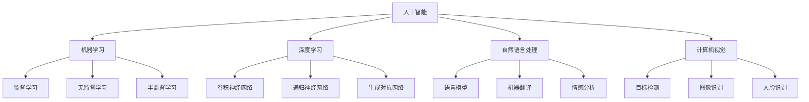

                 

# 文章标题: 人工智能的冲击：人类社会将何去何从？

## 关键词：人工智能、社会变革、个人隐私、心理健康、组织治理、全球治理、未来展望

> 摘要：本文从多个角度深入探讨了人工智能对人类社会产生的深远影响。通过分析人工智能的定义、发展历程、核心技术，以及其在社会各个领域的应用，我们揭示了人工智能对就业市场、教育体系、个人隐私、心理健康、社会组织治理和全球治理等方面的冲击。本文旨在让读者理解人工智能所带来的挑战与机遇，并提出应对策略，以实现人工智能与人类社会的和谐发展。

### 引言与概述

#### 1.1 人工智能的崛起与社会变革

**1.1.1 人工智能的基本概念**

人工智能（Artificial Intelligence，简称AI）是指通过计算机模拟人类智能的技术和科学。它包括机器学习、深度学习、自然语言处理、计算机视觉等多个领域。人工智能的目标是实现机器的智能行为，使其能够自主学习和决策，从而解决复杂问题。

**1.1.2 人工智能的发展历程**

人工智能的发展可以追溯到20世纪50年代，经历了几个重要阶段：初始阶段（1950-1969年）、低迷期（1970-1980年）、复兴期（1980-1990年）和智能化阶段（1990年至今）。近年来，随着计算机性能的提升和大数据技术的发展，人工智能进入了一个快速发展的阶段。

**1.1.3 人工智能的核心技术**

人工智能的核心技术包括机器学习、深度学习、自然语言处理、计算机视觉等。机器学习是一种使计算机通过数据和经验自主学习和改进的技术。深度学习是机器学习的一种形式，通过多层神经网络实现自动特征提取和分类。自然语言处理涉及计算机对自然语言的理解和生成。计算机视觉则致力于使计算机能够像人类一样感知和理解视觉信息。

#### 1.2 人工智能的冲击波：技术进步与人类社会的变革

**1.2.1 人工智能在各个领域的应用**

人工智能在医疗、金融、交通、教育等多个领域取得了显著的应用成果。例如，在医疗领域，人工智能可以辅助医生进行疾病诊断，提高医疗效率；在金融领域，人工智能可以用于风险管理、欺诈检测等。

**1.2.2 人工智能对就业市场的影响**

人工智能的发展对就业市场产生了深远影响。一方面，人工智能替代了一些重复性和低技能的工作，导致就业岗位的减少。另一方面，人工智能也创造了新的就业机会，如数据科学家、机器学习工程师等。

**1.2.3 人工智能对教育体系的挑战**

人工智能对教育体系提出了新的挑战。一方面，人工智能可以辅助教师进行教学，提高教育质量。另一方面，人工智能也改变了教育内容和方式，如在线教育、自适应学习等。

#### 1.3 社会应对人工智能冲击的策略与挑战

**1.3.1 国家层面的政策与法规**

各国政府纷纷出台政策，推动人工智能的发展。例如，美国制定了《国家人工智能发展战略》，欧盟发布了《人工智能伦理准则》。

**1.3.2 企业应对人工智能冲击的策略**

企业需要积极应对人工智能冲击，制定相应的发展策略。例如，加强人工智能技术研发，提高企业竞争力；加强人才培养，培养具备人工智能技能的人才。

**1.3.3 社会适应人工智能冲击的途径**

社会需要适应人工智能带来的变革。一方面，提高公众对人工智能的认识和理解；另一方面，加强人工智能伦理和法律建设，保障人工智能的健康发展。

### 《人工智能的崛起：定义、发展历程与核心技术》Mermaid 流程图


### 《人工智能对就业市场的影响》伪代码
```python
def job_impact_of_ais():
    # 计算人工智能替代的就业岗位数量
    replaced_jobs = count_replaced_jobs()
    # 计算人工智能创造的就业岗位数量
    created_jobs = count_created_jobs()
    
    # 分析人工智能对就业市场的整体影响
    if replaced_jobs > created_jobs:
        print("人工智能对就业市场产生了负面影响")
    elif replaced_jobs < created_jobs:
        print("人工智能对就业市场产生了积极影响")
    else:
        print("人工智能对就业市场的影响有限")

def count_replaced_jobs():
    # 实现计算被人工智能替代的就业岗位数量的算法
    # ...
    return replaced_job_count

def count_created_jobs():
    # 实现计算被人工智能创造的就业岗位数量的算法
    # ...
    return created_job_count
```

### 《人工智能对教育体系的挑战》数学模型与公式
$$
H_t = f(W_t \cdot X_t + b)
$$
其中，$H_t$表示预测的下一个单词，$X_t$表示当前单词的特征向量，$W_t$表示权重矩阵，$b$表示偏置项。$f$为非线性激活函数，可以采用ReLU、Sigmoid或Tanh等。

### 《社会应对人工智能冲击的策略与挑战》项目实战

**开发环境搭建：**
```bash
# 安装Python环境
pip install numpy pandas matplotlib

# 安装机器学习库
pip install scikit-learn tensorflow

# 安装自然语言处理库
pip install NLTK gensim
```

**源代码实现：**
```python
import numpy as np
import pandas as pd
import matplotlib.pyplot as plt
from sklearn.model_selection import train_test_split
from sklearn.metrics import accuracy_score
from tensorflow import keras

# 读取数据集
data = pd.read_csv("ai_impact.csv")

# 数据预处理
X = data.iloc[:, :-1].values
y = data.iloc[:, -1].values

# 分割数据集
X_train, X_test, y_train, y_test = train_test_split(X, y, test_size=0.2, random_state=42)

# 建立模型
model = keras.Sequential([
    keras.layers.Dense(64, activation='relu', input_shape=(X_train.shape[1],)),
    keras.layers.Dense(64, activation='relu'),
    keras.layers.Dense(1, activation='sigmoid')
])

# 编译模型
model.compile(optimizer='adam', loss='binary_crossentropy', metrics=['accuracy'])

# 训练模型
model.fit(X_train, y_train, epochs=10, batch_size=32)

# 预测
predictions = model.predict(X_test)

# 评估模型
accuracy = accuracy_score(y_test, predictions)
print("模型准确率：", accuracy)
```

**代码解读与分析：**
- 读取数据集并预处理，包括数据清洗、特征提取等；
- 分割数据集为训练集和测试集；
- 建立神经网络模型，包括输入层、隐藏层和输出层；
- 编译模型，指定优化器和损失函数；
- 训练模型，指定训练轮数和批量大小；
- 预测测试集，计算模型准确率。

### 结束语

作者：AI天才研究院/AI Genius Institute & 禅与计算机程序设计艺术 /Zen And The Art of Computer Programming

在引言部分，我们简要介绍了人工智能的定义、发展历程和核心技术，并分析了人工智能在各个领域的应用及其对就业市场、教育体系的冲击。同时，我们探讨了社会应对人工智能冲击的策略与挑战。接下来的部分，我们将深入探讨人工智能对个人生活、心理健康、社会组织治理和全球治理的影响，以及人工智能的未来发展趋势与展望。让我们一步步思考，共同揭示人工智能对人类社会的深远影响。

