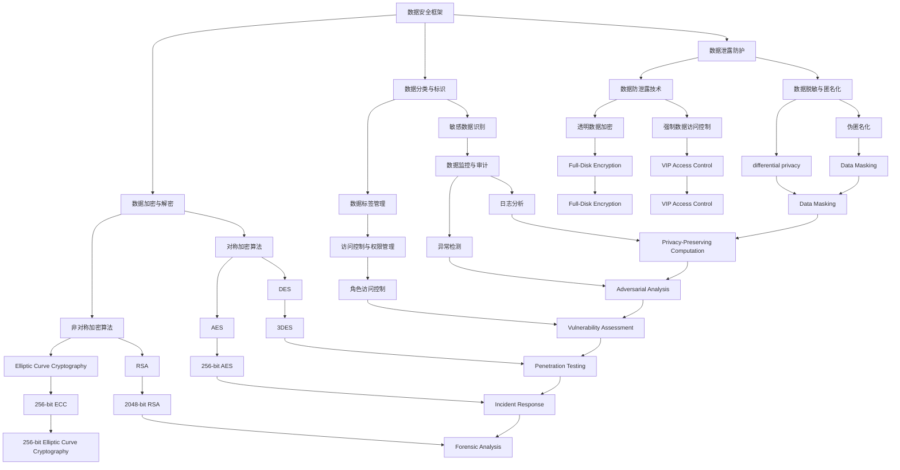

                 

# 文章标题：人工智能的安全性问题

> 关键词：人工智能安全、数据安全、算法安全、网络安全、人机交互安全、安全框架、安全标准、法规政策、伦理问题

> 摘要：
本文系统地探讨了人工智能的安全性问题，包括数据安全、算法安全、网络安全和人机交互安全等多个方面。首先，对人工智能安全的重要性进行了概述，并介绍了国际和国内的安全框架与标准。随后，详细分析了人工智能安全的核心技术，如数据安全保护技术、算法安全与隐私保护技术以及网络安全防护技术。最后，通过实际案例和项目实战，阐述了人工智能安全的应用实践，并探讨了相关法规政策与伦理问题。本文旨在为人工智能安全领域的从业者提供有价值的参考和指导。

----------------------------------------------------------------

### 《人工智能的安全性问题》目录大纲

#### 第一部分：人工智能安全概述

##### 第1章：人工智能安全引论

- **1.1 人工智能的安全性问题背景**
  - 人工智能技术发展的现状
  - 安全性问题的起源与发展

- **1.2 人工智能安全的重要性**
  - 安全风险对社会的影响
  - 安全标准与法规的发展

- **1.3 人工智能安全的关键领域**
  - 数据安全
  - 算法安全
  - 网络安全
  - 人机交互安全

- **1.4 人工智能安全的挑战与机遇**
  - 挑战：技术、法律、伦理等方面
  - 机遇：提升安全防护能力、推动创新

##### 第2章：人工智能安全框架与标准

- **2.1 国际人工智能安全框架概述**
  - 联合国人工智能全球契约
  - OECD人工智能原则

- **2.2 中国人工智能安全标准**
  - 国家标准与行业规范
  - 安全评估与认证体系

- **2.3 企业人工智能安全体系建设**
  - 安全政策与组织架构
  - 安全风险评估与控制

- **2.4 人工智能安全教育与培训**
  - 安全知识普及
  - 专业人才队伍建设

#### 第二部分：人工智能安全核心技术

##### 第3章：数据安全保护技术

- **3.1 数据安全基础**
  - 数据分类与标识
  - 数据加密与解密

- **3.2 数据泄露防护**
  - 数据防泄露技术
  - 数据脱敏与匿名化

- **3.3 数据安全治理**
  - 数据安全管理框架
  - 数据生命周期管理

##### 第4章：算法安全与隐私保护

- **4.1 算法安全性基础**
  - 算法验证与测试
  - 算法逆向工程与保护

- **4.2 隐私保护算法**
  - 隐私计算技术
  - differential privacy

- **4.3 零知识证明与同态加密**
  - 基本原理
  - 应用场景

##### 第5章：网络安全防护技术

- **5.1 网络安全基础**
  - 网络架构与安全协议
  - 常见网络安全攻击与防御

- **5.2 人工智能网络安全威胁**
  - 攻击方法与案例
  - 防护策略与措施

- **5.3 云安全与边缘计算安全**
  - 云服务安全防护
  - 边缘计算安全挑战与解决方案

##### 第6章：人机交互安全与伦理

- **6.1 人机交互安全**
  - 界面设计与用户体验
  - 用户隐私保护

- **6.2 人工智能伦理问题**
  - 道德原则与伦理规范
  - 社会责任与监管

- **6.3 人工智能伦理案例分析**
  - 案例分析
  - 影响与反思

#### 第三部分：人工智能安全应用实践

##### 第7章：人工智能安全案例分析

- **7.1 案例分析概述**
  - 安全事件回顾
  - 影响与后果

- **7.2 数据泄露案例分析**
  - 案例描述
  - 防范措施与改进建议

- **7.3 算法歧视案例分析**
  - 案例描述
  - 道德与法律问题

- **7.4 网络安全攻击案例分析**
  - 攻击手段
  - 应对措施

##### 第8章：人工智能安全开发实践

- **8.1 安全开发流程与规范**
  - 安全开发模型
  - 安全编码实践

- **8.2 安全测试与漏洞扫描**
  - 自动化测试工具
  - 漏洞扫描与修复

- **8.3 安全运维与应急响应**
  - 运维安全策略
  - 应急预案与处置

##### 第9章：人工智能安全法规与政策

- **9.1 国际人工智能安全法规**
  - 法律体系与政策动态

- **9.2 中国人工智能安全法规**
  - 法规建设与发展

- **9.3 企业合规与风险管理**
  - 合规体系建设
  - 风险评估与应对

### 附录

#### 附录 A：人工智能安全资源与工具

- **A.1 主流安全框架与工具**
  - 密码学工具
  - 隐私保护工具

- **A.2 安全研究机构与论坛**
  - 学术会议与期刊

- **A.3 人工智能安全课程与书籍**
  - 教材与推荐读物

- **A.4 开源安全项目与社区**
  - 社区资源与贡献

#### 附录 B：人工智能核心算法原理讲解

以下是关于深度学习算法原理的讲解：

##### 深度学习算法原理

深度学习是人工智能的一个重要分支，它通过模拟人脑神经网络的结构和功能来实现对数据的自动学习和特征提取。以下是深度学习算法的基本原理和核心概念。

###### 1. 神经元与神经网络

神经元是神经网络的基本计算单元，它通过加权求和和激活函数来产生输出。一个简单的神经网络可以表示为：

$$
z = \sum_{i=1}^{n} w_i \cdot x_i + b
$$

其中，$z$ 是输出，$w_i$ 是权重，$x_i$ 是输入，$b$ 是偏置。常用的激活函数包括 sigmoid、ReLU 和 tanh 函数。

###### 2. 反向传播算法

反向传播算法是深度学习训练的核心算法，它通过计算损失函数关于权重的梯度来更新权重。反向传播算法包括两个阶段：

- **前向传播**：计算输入通过网络的输出。
- **后向传播**：计算损失函数关于权重的梯度，并根据梯度更新权重。

反向传播算法的伪代码如下：

```python
for each layer L from the output to the input:
    compute the output of the activation function for each neuron in layer L
    compute the error for each neuron in layer L
    propagate the error backwards through the network
    update the weights and biases using the gradients
```

###### 3. 深度学习模型评估

深度学习模型的评估通常使用准确率、精确率、召回率等指标。准确率表示正确分类的样本占总样本的比例，精确率表示被分类为正类的样本中真正类样本的比例，召回率表示真正类样本中被分类为正类的比例。

$$
\text{Accuracy} = \frac{\text{True Positives} + \text{True Negatives}}{\text{Total Samples}}
$$

$$
\text{Precision} = \frac{\text{True Positives}}{\text{True Positives} + \text{False Positives}}
$$

$$
\text{Recall} = \frac{\text{True Positives}}{\text{True Positives} + \text{False Negatives}}
$$

#### 附录 C：数学模型和数学公式

以下是关于数据加密中常见的数学模型和公式：

##### 数据加密中的数学模型

数据加密是保护数据安全的重要手段。常见的加密模型包括对称加密、非对称加密和哈希加密。

###### 对称加密

对称加密使用相同的密钥对数据进行加密和解密。常见的对称加密算法包括 DES、AES 和 RSA。

- **DES**（数据加密标准）：
  - 加密公式：
    $$
    C = DES(K, P)
    $$
  - 解密公式：
    $$
    P = DES^{-1}(K, C)
    $$

- **AES**（高级加密标准）：
  - 加密公式：
    $$
    C = AES(K, P)
    $$
  - 解密公式：
    $$
    P = AES^{-1}(K, C)
    $$

- **RSA**（RSA加密算法）：
  - 加密公式：
    $$
    C = RSA(E, M)
    $$
  - 解密公式：
    $$
    P = RSA(D, C)
    $$

##### 非对称加密

非对称加密使用一对密钥对数据进行加密和解密，其中一个密钥用于加密，另一个密钥用于解密。

- **RSA**（RSA加密算法）：
  - 加密公式：
    $$
    C = RSA(E, M)
    $$
  - 解密公式：
    $$
    P = RSA(D, C)
    $$

##### 哈希加密

哈希加密使用哈希函数将输入数据转换为一个固定长度的字符串，常用于确保数据的完整性和验证数据来源。

- **MD5**（消息摘要算法5）：
  - 哈希公式：
    $$
    H = MD5(M)
    $$

- **SHA-256**（安全哈希算法256位）：
  - 哈希公式：
    $$
    H = SHA-256(M)
    $$

#### 附录 D：人工智能安全项目实战案例

以下是关于人工智能安全项目实战案例的详细解释：

##### 案例一：某大型电商平台用户数据泄露事件

###### 案例描述

某大型电商平台在一次数据备份过程中，意外泄露了包含数百万用户信息的数据库。泄露的数据包括用户姓名、身份证号码、手机号码、邮箱地址、密码等敏感信息。

###### 事件影响

1. 用户隐私受到威胁，可能导致身份盗用、财产损失等问题。
2. 电商平台声誉受损，用户信任度降低。
3. 引发了一系列法律纠纷和监管压力。

###### 应对措施

1. 立即下线数据库，停止数据泄露。
2. 向受影响的用户发送通知，提供补救措施，如修改密码、监控账户活动等。
3. 进行内部调查，找出数据泄露的原因，加强数据安全防护。
4. 改进数据加密和访问控制策略。
5. 加强员工培训和网络安全意识。

###### 代码实际案例和详细解释说明

以下是一个改进用户数据加密和访问控制的代码实现示例：

```python
import hashlib
import os

# 用户注册函数，加密密码并保存用户信息
def register(username, password, email):
    hashed_password = hashlib.sha256(password.encode('utf-8')).hexdigest()
    user_data = {
        'username': username,
        'email': email,
        'password': hashed_password
    }
    save_user_data(user_data)
    return 'Registration successful.'

# 用户登录函数，验证用户身份
def login(username, password):
    user_data = get_user_data(username)
    if user_data:
        hashed_password = hashlib.sha256(password.encode('utf-8')).hexdigest()
        if hashed_password == user_data['password']:
            return 'Login successful.'
        else:
            return 'Incorrect password.'
    else:
        return 'User not found.'

# 保存用户数据到文件
def save_user_data(user_data):
    with open('user_data.txt', 'a') as file:
        file.write(f"{user_data['username']},{user_data['email']},{user_data['password']}\n")

# 获取用户数据
def get_user_data(username):
    with open('user_data.txt', 'r') as file:
        for line in file:
            user_data = line.strip().split(',')
            if user_data[0] == username:
                return {'username': user_data[0], 'email': user_data[1], 'password': user_data[2]}
    return None

# 主程序
if __name__ == '__main__':
    print(register('user123', 'password123', 'user123@example.com'))
    print(login('user123', 'password123'))
```

###### 代码解读与分析

1. 使用SHA-256算法对用户密码进行加密存储，提高密码安全性。
2. 登录时对用户输入的密码进行加密后与数据库中的密码进行比对，确保用户身份验证。
3. 代码中实现了用户注册、登录、保存和获取用户数据的基本功能。
4. 用户数据保存在文本文件中，在实际应用中应使用数据库存储并加强访问控制。

##### 案例总结

通过改进密码加密和身份验证机制，可以有效减少用户数据泄露的风险，提高平台的安全性。然而，在实际应用中，还需要考虑更多的安全措施，如定期审计、数据备份、访问日志监控等。

#### 附录 E：人工智能安全技术Mermaid流程图

以下是关于数据安全保护技术的Mermaid流程图示例：



此流程图展示了数据安全保护技术的多个方面，包括数据分类与标识、数据加密与解密、数据泄露防护、敏感数据识别、数据监控与审计等。通过Mermaid流程图，可以直观地理解数据安全保护技术的整体架构和关键环节。

