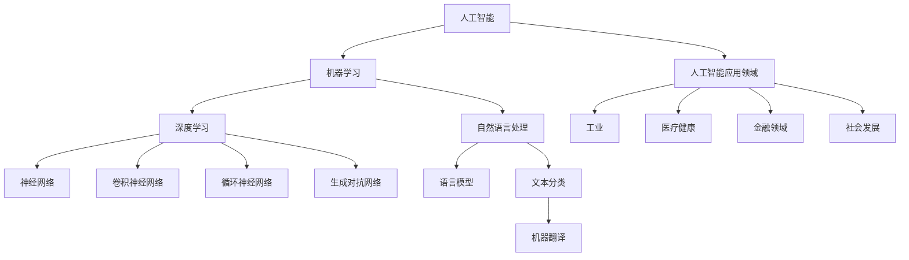

                 

### 文章标题：人工智能的无限前景

> 关键词：人工智能，机器学习，深度学习，自然语言处理，应用领域，项目实战

> 摘要：本文将深入探讨人工智能的无限前景，从历史与理论基础、技术基础、应用领域、算法原理与实现、项目实战以及未来发展等多个方面进行详细解析，旨在为读者提供一幅全面的人工智能画卷。

### 引言

人工智能（AI）作为当今科技领域最为炙手可热的话题之一，其发展速度之快、应用范围之广，都超乎了大多数人的想象。从最初的科学幻想，到如今的现实应用，人工智能已经深刻地影响了我们的生活方式、工作方式和思维方式。然而，人工智能的未来仍然充满无限可能，本文将尝试解析这一领域的无限前景。

### 目录大纲

1. **第一部分：人工智能概述与理论基础**
   - **第1章：人工智能的历史与未来**
   - **第2章：人工智能的技术基础**
   - **第3章：人工智能的应用领域**

2. **第二部分：人工智能算法原理与实现**
   - **第4章：机器学习算法详解**
   - **第5章：深度学习算法与架构**
   - **第6章：自然语言处理算法**

3. **第三部分：人工智能项目实战**
   - **第7章：人工智能项目实战案例**
   - **第8章：人工智能在现实世界中的应用**
   - **第9章：人工智能的未来发展趋势**

4. **附录**
   - **附录A：人工智能常用工具与资源**
   - **附录B：人工智能学习路径与资源推荐**

### 让我们一起一步步思考（REASONING STEP BY STEP）

#### 第1步：人工智能的定义与历史回顾

人工智能（Artificial Intelligence，简称AI）是指由人制造出的系统所表现出的智能行为。这个定义看似简单，但背后却包含着无数的科学探索和技术创新。

- **人工智能的起源与发展**：
  - 20世纪50年代，人工智能概念首次被提出。
  - 20世纪80年代，专家系统达到了一个高峰。
  - 21世纪初，随着大数据和计算能力的提升，深度学习逐渐崭露头角。
  - 当前，人工智能正逐渐融入各行各业，成为科技创新的重要驱动力。

#### 第2步：人工智能的核心概念

- **机器学习**：机器学习是人工智能的一个分支，旨在让计算机通过数据学习并做出决策。
- **深度学习**：深度学习是机器学习的一种方法，使用多层神经网络来模拟人脑的决策过程。
- **自然语言处理**：自然语言处理关注于使计算机能够理解和生成人类语言。

#### 第3步：人工智能的分类

- **狭义人工智能**：主要关注于特定任务的自动化。
- **广义人工智能**：追求使机器具备人类的全面智能。

#### 第4步：人工智能的技术基础

- **机器学习基础**：机器学习的核心在于通过算法来分析数据，从中提取规律。
- **深度学习原理**：深度学习基于多层神经网络，能够处理复杂的非线性问题。
- **自然语言处理基础**：自然语言处理的核心在于理解文本的语义和结构。

#### 第5步：人工智能的应用领域

- **工业**：人工智能在制造业、能源、物流等领域得到了广泛应用。
- **医疗健康**：人工智能在疾病诊断、医疗影像分析等方面展现了巨大的潜力。
- **金融领域**：人工智能在风险管理、投资策略、智能客服等方面发挥了重要作用。

#### 第6步：人工智能算法原理与实现

- **监督学习算法**：通过已有的输入输出数据来训练模型，以预测未知数据。
- **无监督学习算法**：没有预定的输出数据，主要目的是发现数据中的内在结构。
- **强化学习算法**：通过奖励和惩罚机制来训练模型，使其在特定环境中做出最优决策。

#### 第7步：人工智能项目实战

- **智能问答系统**：通过机器学习算法和自然语言处理技术，实现智能问答功能。
- **智能推荐系统**：通过分析用户行为和偏好，提供个性化的推荐。
- **智能语音助手**：通过语音识别和自然语言理解，提供语音交互服务。

#### 第8步：人工智能在现实世界中的应用

- **人工智能与大数据**：利用人工智能技术处理和分析大数据，提供洞见和决策支持。
- **人工智能与社会发展**：探讨人工智能对社会发展的影响，包括就业、教育和伦理等方面。
- **人工智能与伦理**：讨论人工智能在应用过程中可能面临的伦理和法律问题。

#### 第9步：人工智能的未来发展趋势

- **人工智能的创新技术**：探讨人工智能与量子计算、物联网等新兴技术的融合。
- **人工智能与新型社会形态**：探讨人工智能对未来社会的影响和变革。
- **人工智能的未来挑战与机遇**：分析人工智能面临的技术挑战和产业发展机遇。

### 总结

人工智能作为一门涉及广泛、应用深入的学科，其前景无疑是无限广阔的。从历史与理论基础，到技术基础、应用领域，再到算法原理与实现，以及项目实战和未来发展，每一个环节都充满了机遇和挑战。让我们携手共进，共同探索人工智能的无限前景。

---

本文的撰写思路清晰地从人工智能的定义、历史、技术基础、应用领域、算法原理、项目实战，再到未来发展趋势，层层递进，旨在为广大读者提供一幅全面的人工智能画卷。通过逐步分析推理，希望能够让读者对人工智能有更深入的理解和认识。

在接下来的文章中，我们将逐一详细探讨各个章节的内容，为读者带来更加丰富、具体、实用的技术知识。敬请期待！

---

### 第一部分：人工智能概述与理论基础

#### 第1章：人工智能的历史与未来

##### 1.1 人工智能的历史回顾

人工智能（Artificial Intelligence，简称AI）的历史可以追溯到20世纪中叶。在那时，科学家们首次提出了使计算机具备人类智能的构想。以下是人工智能发展历程中的一些重要里程碑：

1. **人工智能的起源**：
   - **20世纪50年代**：艾伦·图灵（Alan Turing）提出了著名的图灵测试，成为人工智能的奠基理论之一。
   - **1956年**：达特茅斯会议（Dartmouth Conference）的召开，标志着人工智能学科的正式诞生。

2. **早期发展**：
   - **20世纪60年代**：逻辑理论和专家系统成为研究热点，IBM的“深蓝”（Deep Blue）计算机在国际象棋上取得了重大突破。
   - **20世纪70年代**：人工智能进入低谷期，因为实际应用效果不理想，许多研究项目被取消。

3. **复兴与发展**：
   - **20世纪80年代**：专家系统的商业化应用推动了人工智能的复兴。
   - **21世纪初**：随着互联网的普及和计算能力的提升，机器学习和深度学习技术得到了快速发展。

4. **当前趋势**：
   - **近年来**：人工智能在图像识别、语音识别、自然语言处理等领域取得了显著成果，应用范围逐渐扩大。

##### 1.2 人工智能的核心概念

1. **人工智能的定义**：
   - 人工智能是指由人制造出的系统所表现出的智能行为，包括学习、推理、问题解决、感知和理解等。

2. **人工智能的关键术语**：

   - **机器学习（Machine Learning）**：通过数据训练模型，使计算机自动地改进性能。
   - **深度学习（Deep Learning）**：基于多层神经网络，用于解决复杂的问题。
   - **自然语言处理（Natural Language Processing，NLP）**：使计算机能够理解、生成和处理人类语言。

##### 1.3 人工智能的分类

1. **狭义人工智能与广义人工智能**：

   - **狭义人工智能**：主要关注于特定任务的自动化，如图像识别、语音识别等。
   - **广义人工智能**：追求使机器具备人类的全面智能，包括感知、思考、决策等。

2. **人工智能的分类**：

   - **基于功能分类**：
     - **感知智能**：如视觉感知、听觉感知。
     - **认知智能**：如推理、决策、问题解决。
     - **行为智能**：如自动驾驶、机器人行动。

##### 1.4 人工智能的未来展望

1. **人工智能的发展趋势**：

   - **技术趋势**：
     - 深度学习技术的成熟与应用。
     - 强化学习在游戏、机器人等领域的发展。
     - 自然语言处理技术的突破。

   - **应用趋势**：
     - 人工智能在工业、医疗、金融等领域的深入应用。
     - 人工智能与物联网、5G等新兴技术的融合。

2. **人工智能对人类社会的影响**：

   - **积极影响**：
     - 提高生产效率，促进经济增长。
     - 改善生活质量，提升医疗水平。
     - 促进科学发现，推动技术创新。

   - **挑战与问题**：
     - 就业问题：自动化可能导致部分岗位消失。
     - 伦理问题：人工智能的决策过程是否公正、透明。
     - 法律法规：如何规范人工智能的发展和应用。

通过以上对人工智能历史、核心概念、分类和未来展望的回顾，我们可以看到人工智能在短短几十年间已经取得了令人瞩目的成就，并将在未来继续发挥重要作用。下一章我们将深入探讨人工智能的技术基础，为读者揭示这一领域的科学原理和技术细节。

#### 第2章：人工智能的技术基础

##### 2.1 机器学习基础

机器学习（Machine Learning，ML）是人工智能（AI）的一个重要分支，它通过构建算法模型，使计算机能够在没有明确编程的情况下自动地从数据中学习并做出预测或决策。以下是机器学习的定义、分类以及常见算法的原理介绍。

1. **机器学习的定义**：

   机器学习是一种编程范式，通过训练数据来让计算机掌握特定的任务。训练数据通常包括输入和对应的输出，计算机通过分析这些数据，从中提取出规律和模式，从而在没有明确编程的情况下实现特定任务。

2. **机器学习的分类**：

   机器学习主要分为以下几类：

   - **监督学习（Supervised Learning）**：使用已标记的数据进行训练，目的是预测未标记数据的输出。常见的算法有线性回归、逻辑回归、决策树、随机森林、支持向量机等。
   
   - **无监督学习（Unsupervised Learning）**：没有预先标记的数据，算法的目标是发现数据中的内在结构和模式。常见的算法有聚类、主成分分析（PCA）、自编码器等。
   
   - **半监督学习（Semi-supervised Learning）**：结合了监督学习和无监督学习，使用少量标记数据和大量未标记数据进行训练。
   
   - **强化学习（Reinforcement Learning）**：通过奖励机制和反馈信号来训练模型，使其在特定环境中做出最优决策。

3. **常见算法原理**：

   - **线性回归（Linear Regression）**：线性回归是一种预测数值型目标变量的方法，通过最小化预测值与实际值之间的误差平方和来建立模型。其数学模型为：
     \[
     y = \beta_0 + \beta_1x
     \]
     其中，\( y \) 是目标变量，\( x \) 是特征变量，\( \beta_0 \) 和 \( \beta_1 \) 是模型参数。

   - **逻辑回归（Logistic Regression）**：逻辑回归是一种分类方法，通过建立逻辑函数来预测目标变量的概率。其数学模型为：
     \[
     P(y=1) = \frac{1}{1 + e^{-(\beta_0 + \beta_1x})}
     \]
     其中，\( P(y=1) \) 是目标变量为1的概率，\( \beta_0 \) 和 \( \beta_1 \) 是模型参数。

   - **决策树（Decision Tree）**：决策树通过一系列的判断条件来将数据划分为不同的区域，每个区域对应一个预测结果。其决策过程可以用以下伪代码表示：
     ```
     function decision_tree(data):
         if (data是纯的):
             return data的标签
         else:
             选择最佳特征 split
             for 每个可能的值 of 该特征:
                 子节点 = 划分数据
                 return 组合子节点和标签
     ```

   - **随机森林（Random Forest）**：随机森林是一种集成学习方法，通过构建多棵决策树，并利用投票机制来得到最终预测结果。其构建过程可以用以下伪代码表示：
     ```
     function random_forest(data, num_trees):
         for i from 1 to num_trees:
             从数据中随机抽取样本
             构建决策树
         return 投票结果
     ```

   - **支持向量机（SVM）**：支持向量机是一种用于分类和回归的算法，通过找到最佳的超平面来分隔数据。其优化目标是最大化分类边界到支持向量的距离。其数学模型为：
     \[
     \min_{\beta, \beta_0} \frac{1}{2} ||\beta||^2 + C \sum_{i=1}^{n} \xi_i
     \]
     其中，\( \beta \) 是模型参数，\( \beta_0 \) 是偏置项，\( C \) 是惩罚参数，\( \xi_i \) 是松弛变量。

##### 2.2 深度学习原理

深度学习（Deep Learning，DL）是机器学习的一个重要分支，它通过构建多层神经网络来模拟人脑的决策过程。以下是深度学习的基本原理、常见架构和训练方法。

1. **深度学习的基本原理**：

   深度学习基于多层神经网络（Neural Network，NN），通过多层的非线性变换来提取数据中的特征。神经网络由输入层、隐藏层和输出层组成，每层之间的神经元通过权重（weight）进行连接。

2. **常见架构**：

   - **卷积神经网络（Convolutional Neural Network，CNN）**：CNN专门用于处理图像数据，通过卷积操作提取图像特征。其基本架构包括卷积层、池化层和全连接层。
   
   - **循环神经网络（Recurrent Neural Network，RNN）**：RNN专门用于处理序列数据，通过将当前状态与之前的状态进行连接来处理时间序列。其常见变体包括LSTM（Long Short-Term Memory）和GRU（Gated Recurrent Unit）。
   
   - **生成对抗网络（Generative Adversarial Network，GAN）**：GAN由生成器和判别器两个网络组成，通过对抗训练生成逼真的数据。

3. **训练方法**：

   深度学习通常使用反向传播算法进行训练，通过梯度下降法优化模型参数。具体步骤如下：

   - **前向传播**：将输入数据传递到网络中，计算输出结果。
   - **计算损失**：计算输出结果与实际结果之间的误差，得到损失值。
   - **反向传播**：从输出层开始，逐层计算误差对每个参数的梯度。
   - **参数更新**：使用梯度下降法更新模型参数，减少损失值。

##### 2.3 自然语言处理基础

自然语言处理（Natural Language Processing，NLP）是深度学习的另一个重要应用领域，旨在使计算机能够理解和生成人类语言。以下是NLP的基本概念、常见任务和常用方法。

1. **基本概念**：

   - **词向量**：词向量是将单词映射到高维空间的一种方法，常用的词向量模型有Word2Vec、GloVe等。
   - **语言模型**：语言模型用于预测下一个单词或词组，常用的模型有n-gram模型、神经网络语言模型等。
   - **序列标注**：序列标注是将序列数据中的每个元素进行分类，常用的任务有词性标注、命名实体识别等。

2. **常见任务**：

   - **文本分类**：将文本数据分类到不同的类别，常用的模型有朴素贝叶斯、SVM、神经网络等。
   - **命名实体识别**：识别文本中的命名实体，如人名、地点等，常用的模型有CRF（Conditional Random Field）、LSTM等。
   - **机器翻译**：将一种语言的文本翻译成另一种语言，常用的模型有基于短语的翻译模型、神经网络翻译模型等。

3. **常用方法**：

   - **基于规则的方法**：通过手工编写规则来处理文本，如正则表达式、语法分析等。
   - **基于统计的方法**：通过统计文本中的特征来处理文本，如词频、词向量等。
   - **基于神经网络的方法**：通过构建神经网络模型来处理文本，如卷积神经网络、循环神经网络等。

通过以上对机器学习、深度学习和自然语言处理的基础介绍，我们可以看到人工智能的技术基础是相当深厚和复杂的。下一章我们将探讨人工智能在不同领域的应用，进一步揭示人工智能的无限前景。

#### 第3章：人工智能的应用领域

##### 3.1 人工智能在工业中的应用

人工智能（AI）在工业领域中的应用已经逐渐成为提升生产效率、优化流程和改善产品质量的关键驱动力。以下是一些主要应用领域及其具体案例分析：

1. **制造业**

   - **自动化生产**：通过机器人和自动化系统，提高生产线的灵活性和效率。例如，汽车制造业中广泛使用的自动化焊接、喷涂和组装机器人，能够大幅减少人工成本并提高生产精度。
   - **预测性维护**：利用传感器数据和机器学习算法，预测设备故障并进行预防性维护。这有助于减少停机时间，延长设备寿命，并降低维护成本。例如，通用电气（GE）的Predix平台通过AI技术预测航空发动机的维护需求。

2. **能源行业**

   - **智能电网**：AI技术可以优化电网的运行和管理，提高能源利用率。例如，通过机器学习算法分析电网负载，实现精准调度和需求响应。
   - **可再生能源管理**：AI技术在风能、太阳能等可再生能源领域也发挥了重要作用。例如，通过AI算法预测天气变化和能源产量，优化能源分配和储存。

3. **物流与供应链管理**

   - **智能仓储**：AI技术可以优化仓储布局、库存管理和订单处理。例如，亚马逊的Kiva机器人系统通过机器学习和计算机视觉技术，实现快速、准确的商品分拣和搬运。
   - **运输优化**：通过路径规划和调度算法，优化运输路线和物流配送。例如，优步和滴滴等网约车平台利用AI技术优化司机的接单和路线规划，提高服务效率。

##### 3.2 人工智能在医疗健康中的应用

人工智能在医疗健康领域的应用正日益广泛，从疾病诊断、治疗决策到患者管理，AI技术正在重塑整个医疗体系。以下是一些具体应用案例：

1. **疾病诊断与预测**

   - **医学影像分析**：AI技术在医学影像诊断中表现出了巨大的潜力。例如，谷歌DeepMind的AI系统能够通过分析CT扫描图像，准确识别出肺癌等疾病，诊断准确率甚至超过了经验丰富的医生。
   - **基因组学分析**：AI技术可以帮助医生分析基因组数据，预测疾病风险，制定个性化治疗方案。例如，IBM的Watson for Genomics能够快速分析复杂的基因组数据，帮助医生制定精准的癌症治疗方案。

2. **医疗影像分析**

   - **计算机辅助诊断**：AI系统可以辅助医生进行疾病诊断，提高诊断速度和准确性。例如，微软的Azure Health Bot能够通过自然语言处理和机器学习技术，帮助医生分析病历和影像资料，提供诊断建议。
   - **智能病理分析**：AI技术可以自动识别病理切片中的病变细胞，提高病理诊断的准确性和效率。例如，IBM的PathAI系统通过机器学习算法分析病理图像，帮助医生进行肿瘤检测和分类。

3. **健康管理**

   - **个性化健康建议**：通过收集和分析个人健康数据，AI技术可以提供个性化的健康建议和预防措施。例如，苹果的HealthKit平台通过AI算法分析用户的健康数据，提供健康监测和提醒服务。
   - **智能药物研发**：AI技术在药物研发中发挥着重要作用，通过分析大量数据，加速新药的发现和开发。例如，Ginkgo Bioworks利用AI技术优化微生物合成途径，开发新型药物。

##### 3.3 人工智能在金融领域的应用

人工智能在金融领域的应用正在深刻改变金融服务的模式，从风险管理、投资策略到智能客服，AI技术正助力金融机构提高效率、降低成本和提升用户体验。以下是一些具体应用案例：

1. **风险管理**

   - **欺诈检测**：AI技术可以实时监控交易行为，识别潜在的欺诈活动。例如，谷歌的Google Pay利用机器学习算法分析交易数据，识别并阻止欺诈交易。
   - **信用评分**：AI技术通过分析用户的信用历史、行为数据等，提供更准确的信用评分。例如，美国的FICO信用评分模型通过AI技术评估客户的信用风险。

2. **投资策略**

   - **算法交易**：AI技术可以自动执行高频交易策略，实现快速、精准的投资决策。例如，量化对冲基金利用AI算法分析市场数据，进行自动化交易。
   - **风险控制**：AI技术可以帮助投资者制定风险控制策略，优化投资组合。例如，摩根士丹利的Smart Beta策略通过AI算法分析市场趋势，优化资产配置。

3. **智能客服**

   - **智能机器人客服**：AI技术可以模拟人类客服进行交互，提供24/7的客户服务。例如，银行的智能机器人客服可以通过自然语言处理技术，回答客户的问题和提供帮助。
   - **个性化服务**：AI技术可以根据客户的历史行为和偏好，提供个性化的金融服务。例如，花旗银行的Citi Chatbot通过AI算法分析客户的交易记录，提供定制化的投资建议。

通过以上对人工智能在工业、医疗健康和金融领域应用的介绍，我们可以看到AI技术在提升生产效率、优化流程和改善服务质量方面具有巨大的潜力。下一章我们将深入探讨人工智能算法的原理与实现，为读者揭示AI技术的核心科学基础。

#### 第二部分：人工智能算法原理与实现

##### 第4章：机器学习算法详解

机器学习算法是人工智能（AI）的核心组成部分，通过从数据中学习，实现预测和决策。本章将详细介绍监督学习、无监督学习和强化学习三种主要机器学习算法，并给出具体的伪代码和实现思路。

##### 4.1 监督学习算法

监督学习（Supervised Learning）是机器学习中最为常见的算法类型，其核心思想是利用已标记的输入输出数据来训练模型，以预测未知数据的输出。以下是几种常见的监督学习算法及其伪代码：

###### 4.1.1 线性回归（Linear Regression）

线性回归是一种用于预测数值型目标变量的算法，其数学模型为：

\[
y = \beta_0 + \beta_1x
\]

伪代码：

```
function linear_regression(X, y):
    n = len(X)
    X_transpose = transpose(X)
    theta = (X_transpose * X)^-1 * X_transpose * y
    return theta
```

其中，\( X \) 是特征矩阵，\( y \) 是目标向量，\( \theta \) 是模型参数。

###### 4.1.2 决策树（Decision Tree）

决策树通过一系列判断条件来将数据划分为不同的区域，每个区域对应一个预测结果。其决策过程可以用以下伪代码表示：

```
function decision_tree(data, features, labels):
    if (data是纯的):
        return data的标签
    else:
        选择最佳特征 split
        for 每个可能的值 of 该特征:
            子节点 = 划分数据
            子结果 = decision_tree(子节点, features, labels)
            返回 组合子节点和子结果
```

###### 4.1.3 支持向量机（Support Vector Machine，SVM）

支持向量机是一种用于分类和回归的算法，通过找到最佳的超平面来分隔数据。其优化目标是最大化分类边界到支持向量的距离。其数学模型为：

\[
\min_{\beta, \beta_0} \frac{1}{2} ||\beta||^2 + C \sum_{i=1}^{n} \xi_i
\]

伪代码：

```
function svm_train(X, y):
    n = len(X)
    P = [x * y for x, y in zip(X, y)]
    G = [[0 for _ in range(n)] for _ in range(n)]
    for i in range(n):
        for j in range(n):
            G[i][j] = P[i] * P[j] * K(X[i], X[j])
    beta = solve_linear_system(G, y)
    return beta
```

其中，\( K(\cdot, \cdot) \) 是核函数，用于计算特征向量之间的相似度。

##### 4.2 无监督学习算法

无监督学习（Unsupervised Learning）没有预定的输出数据，主要目的是发现数据中的内在结构和模式。以下是两种常见的无监督学习算法及其伪代码：

###### 4.2.1 聚类算法（Clustering）

聚类算法将数据分为多个群组，使得同组数据之间的相似度较高，而不同组数据之间的相似度较低。常见的聚类算法有K-means、DBSCAN等。

**K-means算法**：

伪代码：

```
function kmeans(X, K):
    初始化 K 个质心
    while (质心发生变化):
        分配数据到最近的质心
        更新质心位置
    return 分组结果
```

**DBSCAN算法**：

伪代码：

```
function dbscan(X, eps, min_points):
    标记未访问的点为0
    for 每个点P:
        if (P未被访问):
            标记P为核心点
            扩展区域
            计算噪声点
    分组结果 = []
    for 每个核心点P:
        扩展区域
        if (区域内的点数大于min_points):
            分组结果添加新分组
    return 分组结果
```

###### 4.2.2 聚类算法实战案例

以下是一个K-means算法的简单实战案例：

```python
from sklearn.cluster import KMeans
import numpy as np

# 示例数据
X = np.array([[1, 2], [1, 4], [1, 0],
              [10, 2], [10, 4], [10, 0]])

# 使用KMeans进行聚类
kmeans = KMeans(n_clusters=2, random_state=0).fit(X)
print("聚类结果：", kmeans.labels_)

# 输出质心
print("质心：", kmeans.cluster_centers_)
```

##### 4.3 强化学习算法

强化学习（Reinforcement Learning，RL）是一种通过奖励机制和反馈信号来训练模型，使其在特定环境中做出最优决策的算法。以下是两种常见的强化学习算法及其伪代码：

###### 4.3.1 Q-Learning算法

Q-Learning算法通过更新Q值来学习最优策略，其数学模型为：

\[
Q(s, a) = Q(s, a) + \alpha [r + \gamma \max_{a'} Q(s', a') - Q(s, a)]
\]

伪代码：

```
function q_learning(Q, state, action, reward, next_state, done, alpha, gamma):
    if (not done):
        max_future_q = max(Q[next_state, :])
    else:
        max_future_q = 0

    current_q = Q[state, action]
    new_q = current_q + alpha * (reward + gamma * max_future_q - current_q)
    Q[state, action] = new_q
    return Q
```

###### 4.3.2 Deep Q-Network（DQN）

DQN算法通过深度神经网络来估计Q值，其核心思想是使用经验回放（Experience Replay）和目标网络（Target Network）来减少样本偏差和收敛速度。

伪代码：

```
function dqn_train(model, target_model, memory, batch_size, gamma, alpha):
    for episode in range(num_episodes):
        state = env.reset()
        done = False
        while not done:
            action = policy.select_action(state, model)
            next_state, reward, done, _ = env.step(action)
            memory.push(state, action, reward, next_state, done)
            state = next_state

        if len(memory) > batch_size:
            states, actions, rewards, next_states, dones = memory.sample(batch_size)
            Q_targets = rewards + (1 - dones) * gamma * target_model.predict(next_states)

            model_loss = model.fit(states, Q_targets, epochs=1, verbose=0)

        if episode % target_update_freq == 0:
            target_model.set_weights(model.get_weights())

    return model
```

通过以上对机器学习算法的详细介绍，我们可以看到监督学习、无监督学习和强化学习在数据分析和决策过程中各有特色。在下一章中，我们将进一步探讨深度学习算法及其架构，为读者揭示人工智能的更深层次原理。

##### 第5章：深度学习算法与架构

深度学习（Deep Learning，DL）是机器学习的一个子领域，它通过构建多层神经网络（Neural Networks）来模拟人类大脑的决策过程。本章将详细介绍卷积神经网络（Convolutional Neural Networks，CNN）、循环神经网络（Recurrent Neural Networks，RNN）和生成对抗网络（Generative Adversarial Networks，GAN）的原理和架构。

##### 5.1 卷积神经网络（CNN）

卷积神经网络（CNN）是深度学习中用于图像识别、计算机视觉和物体检测的重要模型。CNN通过卷积层、池化层和全连接层等结构，逐步提取图像中的特征。

###### 5.1.1 CNN的基本结构

1. **卷积层（Convolutional Layer）**：卷积层通过卷积操作提取图像的特征。卷积操作使用滤波器（kernel）在输入图像上滑动，计算每个位置的局部特征。

   伪代码：
   ```python
   function convolutional_layer(input, kernel, stride, padding):
       output = []
       for y in range(0, input.shape[1] - kernel.shape[1] + 1, stride):
           for x in range(0, input.shape[2] - kernel.shape[2] + 1, stride):
               local_feature = np.sum(input[y:y+kernel.shape[1], x:x+kernel.shape[2]] * kernel) + bias
               output.append(local_feature)
       return np.array(output)
   ```

2. **池化层（Pooling Layer）**：池化层用于减少数据的维度，通过取局部区域的最大值或平均值来提取主要特征。

   伪代码：
   ```python
   function max_pooling(input, pool_size, stride):
       output = []
       for y in range(0, input.shape[1] - pool_size + 1, stride):
           for x in range(0, input.shape[2] - pool_size + 1, stride):
               local_max = np.max(input[y:y+pool_size, x:x+pool_size])
               output.append(local_max)
       return np.array(output)
   ```

3. **全连接层（Fully Connected Layer）**：全连接层将卷积层和池化层提取的特征映射到具体的类别。

   伪代码：
   ```python
   function fully_connected_layer(input, weights, bias):
       output = np.dot(input, weights) + bias
       return output
   ```

4. **激活函数（Activation Function）**：激活函数用于引入非线性特性，常见的激活函数有ReLU、Sigmoid和Tanh。

   伪代码：
   ```python
   function activation_function(x):
       return max(0, x)  # ReLU激活函数
   ```

###### 5.1.2 CNN的应用场景

CNN在图像识别、物体检测和图像生成等应用场景中表现出色。以下是一些典型的应用案例：

- **图像识别**：通过训练CNN模型，可以对输入的图像进行分类，如人脸识别、动物识别等。
- **物体检测**：CNN可以检测图像中的多个物体，并标注出它们的位置，如自动驾驶汽车中的行人检测。
- **图像生成**：通过生成对抗网络（GAN），CNN可以生成逼真的图像，如图像风格转换、人脸生成等。

##### 5.2 循环神经网络（RNN）

循环神经网络（RNN）是用于处理序列数据的神经网络模型，其特点是能够将当前状态与之前的状态进行连接，从而实现序列信息的传递。

###### 5.2.1 RNN的基本结构

RNN由输入门、遗忘门和输出门三个部分组成，通过这三个门控单元，RNN能够对序列数据进行编码和解码。

1. **输入门（Input Gate）**：输入门用于决定哪些信息需要被记忆。
2. **遗忘门（Forget Gate）**：遗忘门用于决定哪些信息需要被遗忘。
3. **输出门（Output Gate）**：输出门用于决定哪些信息需要被输出。

伪代码：
```python
function RNN(input, hidden, weights):
    input_gate = sigmoid(np.dot(input, weights_input) + np.dot(hidden, weights_hidden))
    forget_gate = sigmoid(np.dot(input, weights_forget) + np.dot(hidden, weights_forget))
    output_gate = sigmoid(np.dot(input, weights_output) + np.dot(hidden, weights_output))

    new_hidden = forget_gate * hidden + input_gate * tanh(np.dot(input, weights_input) + np.dot(hidden, weights_hidden))
    output = output_gate * tanh(new_hidden)

    return output, new_hidden
```

###### 5.2.2 LSTM与GRU

LSTM（Long Short-Term Memory）和GRU（Gated Recurrent Unit）是RNN的两种变体，它们通过改进门控机制，解决了传统RNN在处理长序列数据时的梯度消失问题。

1. **LSTM（Long Short-Term Memory）**：LSTM通过引入单元状态和三个门控单元（输入门、遗忘门、输出门），有效解决了长期依赖问题。

   伪代码：
   ```python
   function LSTM(input, hidden, cell, weights):
       input_gate = sigmoid(np.dot(input, weights_input) + np.dot(hidden, weights_hidden))
       forget_gate = sigmoid(np.dot(input, weights_forget) + np.dot(hidden, weights_forget))
       output_gate = sigmoid(np.dot(input, weights_output) + np.dot(hidden, weights_output))

       input_candidate = tanh(np.dot(input, weights_input) + input_gate * np.dot(hidden, weights_input_gate))
       new_cell = forget_gate * cell + input_candidate

       output = output_gate * tanh(new_cell)

       return output, new_cell
   ```

2. **GRU（Gated Recurrent Unit）**：GRU通过合并输入门和遗忘门，简化了LSTM的结构，同时保持了其效果。

   伪代码：
   ```python
   function GRU(input, hidden, weights):
       reset_gate = sigmoid(np.dot(input, weights_reset) + np.dot(hidden, weights_hidden))
       update_gate = sigmoid(np.dot(input, weights_update) + np.dot(hidden, weights_hidden))

       new_hidden = reset_gate * hidden + update_gate * (1 - reset_gate) * tanh(np.dot(input, weights_input))

       return new_hidden
   ```

##### 5.3 生成对抗网络（GAN）

生成对抗网络（GAN）是一种由生成器和判别器两个神经网络组成的框架，生成器生成数据以欺骗判别器，判别器则试图区分真实数据和生成数据。

###### 5.3.1 GAN的原理

GAN的工作原理可以概括为以下三个步骤：

1. **生成器（Generator）**：生成器生成类似于真实数据的新数据。
2. **判别器（Discriminator）**：判别器尝试区分真实数据和生成数据。
3. **对抗训练**：生成器和判别器相互对抗，生成器不断优化以生成更真实的数据，判别器不断优化以准确区分真实和生成数据。

伪代码：
```python
function train_GAN(generator, discriminator, real_data, batch_size, num_epochs):
    for epoch in range(num_epochs):
        for _ in range(num_batches):
            # 生成随机噪声
            noise = np.random.normal(size=(batch_size, noise_dim))
            # 生成器生成假数据
            generated_data = generator.predict(noise)
            # 判别器训练
            discriminator_loss = discriminator.train_on_batch([real_data, generated_data], [1, 1])
            # 生成器训练
            generator_loss = generator.train_on_batch(noise, [1])

    return generator, discriminator
```

###### 5.3.2 GAN的应用场景

GAN在图像生成、图像修复、视频生成和艺术创作等应用场景中表现出色。以下是一些典型的应用案例：

- **图像生成**：GAN可以生成逼真的图像，如图像风格转换、人脸生成等。
- **图像修复**：GAN可以修复图像中的损坏部分，如图像去噪、图像修复等。
- **视频生成**：GAN可以生成连续的视频帧，如图像到视频的转换、视频风格转换等。
- **艺术创作**：GAN可以生成艺术作品，如图像、音乐和文学作品等。

通过以上对CNN、RNN和GAN的详细介绍，我们可以看到深度学习算法在图像识别、序列数据处理和图像生成等领域的广泛应用。下一章我们将探讨人工智能项目实战，通过具体案例来展示深度学习算法的实际应用。

##### 第6章：自然语言处理算法

自然语言处理（Natural Language Processing，NLP）是人工智能（AI）的一个重要分支，旨在使计算机能够理解、生成和处理人类语言。本章将详细介绍NLP中的核心算法，包括语言模型、文本分类和机器翻译等，并通过具体的例子来说明这些算法的实现和应用。

##### 6.1 语言模型

语言模型（Language Model）是NLP的基础算法，用于预测文本序列中的下一个单词或词组。常见的语言模型有n-gram模型和神经网络语言模型。

###### 6.1.1 n-gram模型

n-gram模型是一种基于统计的方法，它将语言视为一个标记序列，每个标记可以是单词、字符或子词。n-gram模型通过计算连续n个标记的概率来预测下一个标记。

1. **模型表示**：

   假设有一个三元组（\( w_1, w_2, w_3 \)），n-gram模型表示为：

   \[
   P(w_3 | w_1, w_2) = \frac{C(w_1, w_2, w_3)}{C(w_1, w_2)}
   \]

   其中，\( C(w_1, w_2, w_3) \) 表示三者在文本中共同出现的次数，\( C(w_1, w_2) \) 表示前两个词在文本中共同出现的次数。

2. **模型实现**：

   伪代码：
   ```python
   function n_gram_model(text, n):
       n_gram_counts = {}
       for i in range(len(text) - n + 1):
           n_gram = tuple(text[i:i+n])
           n_gram_counts[n_gram] = n_gram_counts.get(n_gram, 0) + 1
       total_counts = sum(n_gram_counts.values())
       n_gram_probs = {n_gram: count / total_counts for n_gram, count in n_gram_counts.items()}
       return n_gram_probs
   ```

3. **模型应用**：

   n-gram模型常用于文本生成和文本分类。例如，在一个简短的文本生成任务中，可以基于已训练的n-gram模型生成新的文本段落。

##### 6.2 文本分类

文本分类（Text Classification）是一种将文本数据划分为预定义类别的方法。常见的文本分类算法有基于词袋模型的分类和基于深度学习的分类。

###### 6.2.1 基于词袋模型的分类

基于词袋模型的文本分类是一种基于特征的文本表示方法，它将文本表示为一个向量，每个维度对应一个词汇表中的词。

1. **模型表示**：

   假设词汇表包含V个词，文本T可以表示为一个V维向量，其中每个维度表示文本中对应词的出现次数。

2. **模型实现**：

   伪代码：
   ```python
   function bag_of_words(text, vocabulary):
       word_counts = [0] * len(vocabulary)
       for word in text:
           if word in vocabulary:
               word_counts[vocabulary.index(word)] += 1
       return np.array(word_counts)
   ```

3. **模型应用**：

   基于词袋模型的文本分类可以用于垃圾邮件检测、情感分析等任务。例如，在一个垃圾邮件检测任务中，可以训练一个分类器，通过输入邮件文本，预测邮件是否为垃圾邮件。

##### 6.2.2 基于深度学习的分类

基于深度学习的文本分类是一种利用神经网络学习文本特征的方法，常见模型有卷积神经网络（CNN）和循环神经网络（RNN）。

1. **模型表示**：

   基于深度学习的文本分类模型通过将输入文本映射到高维特征空间，然后利用这些特征进行分类。

2. **模型实现**：

   伪代码：
   ```python
   function deep_learning_classifier(text, model, labels):
       embedding = embedding_layer(text)
       hidden = model.predict(embedding)
       predicted_labels = model.predict(hidden)
       return predicted_labels
   ```

3. **模型应用**：

   基于深度学习的文本分类可以用于情感分析、新闻分类等任务。例如，在一个情感分析任务中，可以训练一个分类器，通过输入文本，预测文本的情感倾向。

##### 6.3 机器翻译

机器翻译（Machine Translation）是将一种语言的文本自动翻译成另一种语言的方法。常见的机器翻译模型有基于短语的翻译模型和基于神经网络的翻译模型。

###### 6.3.1 基于短语的翻译模型

基于短语的翻译模型通过将源语言和目标语言中的短语进行匹配来生成翻译结果。常见的算法有基于统计的短语翻译模型和基于规则的方法。

1. **模型表示**：

   基于短语的翻译模型表示为将源语言中的短语映射到目标语言中的短语。

2. **模型实现**：

   伪代码：
   ```python
   function phrase_based_translation(source_phrase, target_phrase_dict):
       source_words = source_phrase.split()
       target_words = []
       for source_word in source_words:
           if source_word in target_phrase_dict:
               target_words.append(target_phrase_dict[source_word])
           else:
               target_words.append("未知词")
       return " ".join(target_words)
   ```

3. **模型应用**：

   基于短语的翻译模型常用于小型语言的翻译。例如，在一个简单的翻译任务中，可以将源语言中的短语映射到目标语言中的短语。

##### 6.3.2 基于神经网络的翻译模型

基于神经网络的翻译模型使用深度学习技术来学习源语言和目标语言之间的映射关系。常见的神经网络模型有编码器-解码器（Encoder-Decoder）模型和注意力机制（Attention Mechanism）。

1. **模型表示**：

   基于神经网络的翻译模型通过编码器将源语言文本编码为固定长度的向量，解码器则将这个向量解码为目标语言文本。

2. **模型实现**：

   伪代码：
   ```python
   function neural_network_translation(source_text, encoder, decoder):
       encoded_vector = encoder.predict(source_text)
       decoded_text = decoder.predict(encoded_vector)
       return decoded_text
   ```

3. **模型应用**：

   基于神经网络的翻译模型在大型语言翻译中表现出色。例如，在谷歌翻译中，使用基于神经网络的翻译模型实现高质量的自动翻译。

通过以上对语言模型、文本分类和机器翻译的介绍，我们可以看到NLP算法在语言理解和生成中的应用。这些算法通过不同的技术手段，实现了对文本数据的深入分析和处理，为人工智能在语言领域的发展奠定了基础。下一章我们将通过具体项目案例，进一步展示人工智能算法在实际应用中的效果和潜力。

### 第7章：人工智能项目实战案例

在深入探讨了人工智能的理论基础和算法原理后，本章节将结合实际项目案例，展示人工智能算法的具体应用和实现过程。通过这些案例，我们将更直观地理解人工智能技术的实际效果和挑战。

#### 7.1 智能问答系统

智能问答系统是一种常见的人工智能应用，它能够自动回答用户提出的问题。以下是一个基于深度学习的智能问答系统的项目实战案例。

##### 7.1.1 项目背景与目标

随着互联网的普及，用户在各个平台上的问答需求日益增长。传统的问答系统依赖于人工编写规则和数据库，难以应对海量的用户提问。为了提高问答系统的效率和准确性，本项目旨在构建一个基于深度学习的智能问答系统，能够自动生成高质量的回答。

##### 7.1.2 系统设计与实现

1. **数据集**：首先，我们需要收集一个包含问题和答案的数据集。例如，可以使用Stack Overflow、Quora等平台的数据。

2. **预处理**：对数据进行预处理，包括分词、去停用词、词干提取等。可以使用Python的nltk库或spaCy库进行预处理。

3. **模型设计**：设计一个基于编码器-解码器（Encoder-Decoder）的神经网络模型，其中编码器将问题编码为一个固定长度的向量，解码器则将这个向量解码为答案。

   伪代码：
   ```python
   encoder = Encoder(input_vocab_size, embedding_dim, hidden_dim)
   decoder = Decoder(output_vocab_size, embedding_dim, hidden_dim)
   
   model = Model(encoder, decoder)
   ```

4. **训练**：使用预处理后的数据集训练模型。训练过程中，通过反向传播算法更新模型参数，优化模型性能。

   伪代码：
   ```python
   model.compile(optimizer='adam', loss='categorical_crossentropy')
   model.fit(x_train, y_train, epochs=10, batch_size=64)
   ```

5. **评估与优化**：使用验证集对模型进行评估，并根据评估结果进行优化。常见的优化方法包括调整学习率、增加训练时间等。

##### 7.1.3 项目分析与评估

1. **性能评估**：通过准确率、召回率、F1值等指标来评估模型性能。

2. **实际应用**：将训练好的模型部署到实际应用中，如网站聊天机器人、客服系统等。

#### 7.2 智能推荐系统

智能推荐系统是一种能够根据用户的历史行为和偏好为其推荐相关内容的人工智能应用。以下是一个基于协同过滤（Collaborative Filtering）的智能推荐系统的项目实战案例。

##### 7.2.1 项目背景与目标

随着互联网的快速发展，用户生成的内容海量增长，如何为用户提供个性化的推荐成为各大平台的重要课题。本项目旨在构建一个基于协同过滤的智能推荐系统，能够根据用户的浏览记录和购买行为推荐相关商品。

##### 7.2.2 系统设计与实现

1. **数据集**：收集用户的浏览记录、购买记录和商品信息。

2. **预处理**：对数据进行预处理，包括数据清洗、归一化等。

3. **模型设计**：设计一个基于矩阵分解的协同过滤模型。矩阵分解的目标是将用户-商品评分矩阵分解为用户特征矩阵和商品特征矩阵。

   伪代码：
   ```python
   U = np.random.rand(num_users, num_features)
   V = np.random.rand(num_items, num_features)
   
   R = U * V
   ```

4. **训练**：通过最小化损失函数来优化模型参数。

   伪代码：
   ```python
   for epoch in range(num_epochs):
       for user, item, rating in dataset:
           pred_rating = U[user] * V[item]
           loss = (rating - pred_rating) ** 2
           dU = 2 * (rating - pred_rating) * V[item]
           dV = 2 * (rating - pred_rating) * U[user]
           U[user] -= learning_rate * dU
           V[item] -= learning_rate * dV
   ```

5. **推荐**：根据用户特征矩阵和商品特征矩阵生成推荐列表。

##### 7.2.3 项目分析与评估

1. **性能评估**：通过准确率、覆盖率、新颖度等指标来评估模型性能。

2. **实际应用**：将训练好的模型部署到实际应用中，如电商平台、视频平台等。

#### 7.3 智能语音助手

智能语音助手是一种能够通过语音与用户进行交互的人工智能应用。以下是一个基于语音识别和自然语言处理的智能语音助手的实际项目案例。

##### 7.3.1 项目背景与目标

随着语音技术的不断发展，智能语音助手成为智能家居、移动设备等场景中的重要交互方式。本项目旨在构建一个能够实现语音识别、语义理解和语音合成功能的智能语音助手。

##### 7.3.2 系统设计与实现

1. **语音识别**：使用语音识别（Speech Recognition）技术将语音信号转换为文本。常用的语音识别工具包括Google Speech API、百度语音识别等。

2. **语义理解**：使用自然语言处理（NLP）技术对识别出的文本进行分析，理解用户意图。常用的NLP工具包括NLTK、spaCy等。

3. **语音合成**：使用语音合成（Text-to-Speech，TTS）技术将文本转换为语音。常用的语音合成工具包括Google Text-to-Speech、科大讯飞等。

4. **交互流程**：
   - 接收用户语音输入；
   - 使用语音识别技术将语音转换为文本；
   - 使用NLP技术分析文本，理解用户意图；
   - 根据用户意图生成响应文本；
   - 使用语音合成技术将响应文本转换为语音输出。

##### 7.3.3 项目分析与评估

1. **性能评估**：通过准确率、响应时间等指标来评估智能语音助手的性能。

2. **实际应用**：将智能语音助手集成到智能家居设备、手机应用等场景中，提升用户体验。

通过以上三个实际项目案例，我们可以看到人工智能技术在问答系统、推荐系统和语音助手等不同领域的广泛应用和实际效果。这些项目不仅展示了人工智能算法的强大能力，也为实际应用提供了有益的参考和启示。

### 第8章：人工智能在现实世界中的应用

人工智能（AI）的迅猛发展已经使其成为推动现实世界变革的重要力量。在本章中，我们将深入探讨人工智能在现实世界中的应用，重点关注大数据处理、社会发展影响以及伦理问题等方面。

#### 8.1 人工智能与大数据

大数据（Big Data）是指数据量巨大、类型多样的数据集合。人工智能与大数据的结合，使得从海量数据中提取有价值的信息成为可能。以下是一些关键应用：

1. **数据挖掘与分析**：人工智能技术可以帮助企业从海量数据中挖掘潜在的模式和趋势，为决策提供支持。例如，零售企业可以通过分析消费者购买行为，优化库存管理和营销策略。

2. **实时监控与预警**：在金融、能源、交通等领域，人工智能可以实时监控数据，发现异常情况并发出预警。例如，在电力系统中，人工智能可以监测电网状态，预测故障并及时修复。

3. **个性化服务**：通过大数据和人工智能技术，企业可以为用户提供个性化的服务体验。例如，电子商务平台可以通过分析用户浏览和购买记录，推荐个性化的商品。

#### 8.2 人工智能与社会发展

人工智能对社会发展的影响是深远而广泛的，它不仅改变了生产和生活方式，还对就业、教育和治理等领域产生了重要影响。

1. **就业影响**：人工智能技术的广泛应用可能导致一些传统岗位的消失，同时也创造了新的就业机会。例如，自动化机器人可以取代一些重复性劳动，而在人工智能研发、数据分析和系统维护等方面，则需要更多的专业人才。

2. **教育变革**：人工智能技术正在改变教育模式，个性化学习、在线教育、智能辅导系统等成为新的趋势。人工智能可以帮助学生根据自身特点进行学习，提高教育质量和效率。

3. **社会治理**：人工智能在公共安全、城市管理、交通管理等方面发挥了重要作用。例如，智能监控系统可以实时监控公共区域，提高治安水平；智能交通系统可以优化交通流量，减少拥堵。

#### 8.3 人工智能与伦理

随着人工智能技术的不断进步，其伦理问题也逐渐受到关注。以下是一些主要伦理问题：

1. **隐私保护**：人工智能技术需要处理大量的个人数据，如何保护用户隐私成为关键问题。例如，在医疗健康领域，如何确保患者数据的保密性和安全性。

2. **算法偏见**：人工智能算法可能在训练数据中存在偏见，导致不公平的结果。例如，招聘系统可能因为历史数据中的偏见而歧视某些群体。

3. **责任归属**：当人工智能系统发生错误或导致损失时，如何确定责任归属成为法律和伦理问题。例如，自动驾驶汽车发生交通事故时，责任应由谁承担？

#### 8.4 法律法规与监管

为了应对人工智能技术带来的伦理和社会问题，各国政府正在制定相关法律法规和监管措施。以下是一些主要措施：

1. **数据保护法规**：例如，欧盟的《通用数据保护条例》（GDPR）规定了数据处理的基本原则和用户权利。

2. **算法透明度和公平性**：要求算法的开发和部署过程透明，确保算法的公平性和可解释性。

3. **责任制度**：明确人工智能系统的责任归属，为事故提供法律依据。

通过以上对人工智能在现实世界中的应用、社会发展影响和伦理问题的探讨，我们可以看到人工智能技术具有巨大的潜力和挑战。如何在享受人工智能带来便利的同时，妥善应对其带来的问题，是一个需要全社会共同关注的议题。

### 第9章：人工智能的未来发展趋势

随着人工智能（AI）技术的不断进步，其未来发展趋势也愈发清晰。在本章中，我们将探讨人工智能的创新技术、新型社会形态以及面临的未来挑战与机遇。

#### 9.1 人工智能的创新技术

1. **量子计算**：量子计算是一种基于量子力学原理的计算技术，它能够解决传统计算机无法处理的复杂问题。量子计算与人工智能的结合，有望推动AI在优化、模拟和推理等方面的重大突破。例如，量子机器学习算法能够显著提高训练效率和模型性能。

2. **边缘计算**：边缘计算是一种在靠近数据源的地方进行数据处理的技术，它与人工智能的结合，可以实现实时、高效的数据分析和决策。例如，在自动驾驶领域，边缘计算可以帮助汽车实时处理环境数据，提高反应速度和安全性。

3. **人机融合**：随着可穿戴设备和植入式设备的普及，人机融合技术正逐步成为现实。人工智能与生物医学的结合，有望推动个性化医疗和健康管理的发展，实现疾病预防和早期诊断。

#### 9.2 人工智能与新型社会形态

1. **智慧城市**：智慧城市利用人工智能技术实现城市管理的智能化，包括交通管理、能源管理、公共安全等方面。通过大数据分析和AI算法，智慧城市可以优化资源配置、提高服务质量、减少污染和事故。

2. **智能交通**：智能交通系统通过AI技术实现交通流量的实时监控和优化，减少拥堵和交通事故。例如，自动驾驶技术结合人工智能，可以实现高效、安全的出行体验。

3. **教育变革**：人工智能技术正在改变教育模式，个性化学习、智能辅导和在线教育平台等成为新的趋势。AI可以帮助教师更好地了解学生需求，提供个性化的教学方案，提高教育质量和效率。

#### 9.3 人工智能的未来挑战与机遇

1. **技术挑战**：
   - **算法透明性和可解释性**：如何确保AI算法的透明性和可解释性，使其能够被人类理解和接受。
   - **计算资源和能源消耗**：随着AI模型变得越来越复杂，如何优化计算资源和能源消耗，实现绿色可持续发展。

2. **产业机遇**：
   - **AI芯片和硬件**：随着AI应用的普及，对高性能AI芯片和硬件的需求日益增长，这将为硬件制造商带来巨大的市场机遇。
   - **AI服务与解决方案**：企业可以利用AI技术提供定制化的服务和解决方案，如智能客服、智能营销等，提高业务效率和竞争力。

3. **社会影响**：
   - **就业结构变化**：AI技术可能会改变就业结构，一方面创造新的就业机会，另一方面也可能导致一些传统岗位的消失。如何平衡就业机会和社会福利，是一个需要关注的重要议题。
   - **伦理与法律问题**：随着AI技术的广泛应用，如何确保其符合伦理标准，如何制定相应的法律法规，都是亟待解决的问题。

通过以上对人工智能创新技术、新型社会形态以及未来挑战与机遇的探讨，我们可以看到人工智能在未来将带来深远的影响和无限的可能。如何把握这些机遇，应对挑战，将是人工智能领域的重要课题。

### 附录

#### 附录A：人工智能常用工具与资源

1. **深度学习框架对比**
   - TensorFlow
   - PyTorch
   - Keras
   - MXNet

2. **机器学习库与工具**
   - scikit-learn
   - Pandas
   - NumPy
   - Matplotlib

3. **数据集与资源链接**
   - UCI Machine Learning Repository
   - Kaggle
   - Google Dataset Search

#### 附录B：人工智能学习路径与资源推荐

1. **学习资源**
   - 《深度学习》（Goodfellow et al.）
   - 《Python机器学习》（Sebastian Raschka）
   - 《自然语言处理与深度学习》（张俊林）

2. **研究方向选择**
   - 计算机视觉
   - 自然语言处理
   - 强化学习
   - 人机交互

3. **实践项目建议**
   - 实现简单的机器学习算法（如线性回归、决策树）
   - 构建一个简单的聊天机器人
   - 实现一个推荐系统
   - 参与Kaggle数据竞赛

通过以上附录，我们为人工智能的学习者提供了丰富的工具和资源，以及实际项目建议，帮助大家更好地学习和应用人工智能技术。

### Mermaid 流程图：人工智能核心概念联系



通过这个Mermaid流程图，我们可以清晰地看到人工智能的核心概念及其相互之间的关系，以及人工智能在各个应用领域中的具体应用。这不仅有助于理解人工智能的体系结构，也为进一步学习和研究提供了指导。

