                 

# 人机协作2.0：精准对齐LLM与人类意图

> 关键词：人机协作，语言模型，精准对齐，深度学习，自然语言处理，伦理问题，未来展望

> 摘要：本文深入探讨了人机协作2.0的概念、核心技术、应用实践以及未来展望。文章首先介绍了人机协作2.0的背景与核心概念，接着详细解析了精准对齐语言模型（LLM）与人类意图的挑战与策略。随后，文章分章节介绍了人机协作2.0在商业智能、客户服务与支持、内容创作与编辑等领域的应用实践。最后，文章讨论了人机协作2.0的伦理与法律问题，并对其未来发展趋势进行了展望。

## 第一部分：人机协作2.0的概述

### 第1章：人机协作2.0：背景与核心概念

#### 1.1 人机协作2.0：概念与意义

##### 1.1.1 人机协作的发展历程

人机协作（Human-Computer Collaboration）是指人与计算机系统相互协作，共同完成任务的过程。从早期的计算机辅助设计（CAD）、辅助制造（CAM）到现代的智能化系统，人机协作经历了从简单的任务分担到深度融合的转变。

##### 1.1.2 人机协作2.0的定义

人机协作2.0（Human-Computer Collaboration 2.0，简称HCC2.0）是指在人工智能（AI）技术特别是深度学习、自然语言处理（NLP）技术高度发展的背景下，人与计算机系统通过更加紧密、智能化的互动，实现高效协作的新模式。

##### 1.1.3 人机协作2.0的核心目标

人机协作2.0的核心目标是通过提升计算机在理解人类意图、执行任务方面的能力，实现以下几方面的优化：

1. **提高工作效率**：通过智能化的辅助，减少人类在重复性、繁琐任务上的时间投入。
2. **增强决策质量**：借助大数据分析、智能预测等工具，提供更准确的决策支持。
3. **拓展人类认知**：通过人机协同，拓展人类在处理复杂信息、创造性思维等方面的能力。

#### 1.2 精准对齐：LLM与人类意图

##### 1.2.1 语言模型LLM的工作原理

语言模型（Language Model，简称LM）是自然语言处理的核心技术，通过学习大量文本数据，预测下一个词或句子。在深度学习框架下，语言模型通常采用神经网络架构，如Transformer、BERT等。

##### 1.2.2 人类意图的理解与表达

人类意图是指人们在执行某项任务时所追求的目标或期望的结果。理解人类意图是有效人机协作的基础，而准确表达人类意图则需要良好的沟通机制和自然语言处理能力。

##### 1.2.3 精准对齐的挑战与策略

精准对齐（Precise Alignment）是指确保语言模型能够准确理解和执行人类意图的过程。这一过程面临的挑战包括：

1. **意图多样性与模糊性**：人类的意图具有多样性和模糊性，如何设计模型来处理这些特性是一个挑战。
2. **上下文理解**：语言模型需要理解意图的上下文，才能准确执行任务。
3. **实时性**：在实时交互场景中，如何快速、准确地处理人类意图。

应对这些挑战的策略包括：

1. **增强的上下文感知**：通过增加上下文信息，提高语言模型对意图的理解能力。
2. **多模态输入**：结合图像、声音等多种信息源，提升模型的感知能力。
3. **交互优化**：通过设计智能化的交互流程，提高人机协作的效率。

#### 1.3 人机协作2.0的应用场景

##### 1.3.1 商业智能与数据分析

人机协作2.0在商业智能（Business Intelligence，简称BI）与数据分析领域具有广泛应用。通过智能化的数据分析工具，企业可以快速获取有价值的信息，支持决策制定和业务优化。

##### 1.3.2 客户服务与支持

在客户服务与支持领域，人机协作2.0可以通过智能客服系统提供24/7的服务，提高客户满意度，降低人力成本。

##### 1.3.3 内容创作与编辑

内容创作与编辑是另一个受益于人机协作2.0的领域。智能写作助手、内容推荐系统等工具可以大幅提升内容创作的效率和质量。

##### 1.3.4 其他潜在应用领域

除了上述领域，人机协作2.0还在教育、医疗、制造等多个领域具有广泛的应用潜力。

### 第2章：人机协作2.0的技术基础

#### 2.1 自然语言处理与深度学习

##### 2.1.1 语言模型与深度学习

语言模型是自然语言处理的核心组成部分，而深度学习则为语言模型提供了强大的计算能力。深度学习模型如Transformer、BERT等在语言模型中的应用，极大地提升了自然语言处理的性能。

##### 2.1.2 注意力机制与编码器-解码器架构

注意力机制（Attention Mechanism）是深度学习模型中的一个关键组件，它通过分配不同的重要性权重，使模型能够聚焦于输入数据中最重要的部分。编码器-解码器（Encoder-Decoder）架构是处理序列数据的常用模型结构，广泛应用于机器翻译、文本生成等领域。

##### 2.1.3 多模态学习与人机交互

多模态学习（Multimodal Learning）是指结合多种类型的数据（如图像、文本、声音等）进行学习。在人机交互中，多模态学习可以提供更丰富、更自然的交互方式，提升用户体验。

#### 2.2 人机协作的核心算法

##### 2.2.1 对齐算法

对齐算法（Alignment Algorithm）是确保语言模型能够准确理解和执行人类意图的关键技术。通过分析上下文信息，对齐算法可以帮助模型捕捉到人类意图的核心要素。

##### 2.2.2 交互优化算法

交互优化算法（Interactive Optimization Algorithm）旨在设计出最有效的人机交互流程，提升协作效率。这些算法可以通过多种策略，如主动学习、强化学习等，优化人机交互过程。

##### 2.2.3 质量评估算法

质量评估算法（Quality Assessment Algorithm）用于评估人机协作的结果，确保输出结果满足预期。这些算法可以从多个维度，如准确性、完整性、用户体验等，对协作结果进行评估。

#### 2.3 人机协作2.0的技术挑战与解决方案

##### 2.3.1 数据隐私与安全

数据隐私与安全是人机协作2.0面临的一个重要挑战。为了保护用户隐私，需要设计出安全可靠的数据传输和处理机制，确保数据在整个协作过程中不被泄露。

##### 2.3.2 模型解释性与透明性

模型的解释性与透明性是用户信任的重要基础。为了提升模型的透明性，需要开发出能够向用户解释模型决策过程的工具和方法。

##### 2.3.3 系统稳定性与可扩展性

人机协作2.0系统需要具备高稳定性与可扩展性，以应对不断变化的业务需求和大规模用户群体。这要求系统设计者关注系统的鲁棒性、性能和可扩展性。

## 第二部分：人机协作2.0的应用实践

### 第3章：商业智能与数据分析

#### 3.1 人机协作2.0在商业智能中的应用

##### 3.1.1 数据预处理与清洗

在商业智能领域，人机协作2.0首先需要对数据进行预处理与清洗。这一过程涉及数据去重、数据清洗、数据标准化等步骤，以确保数据的质量和一致性。

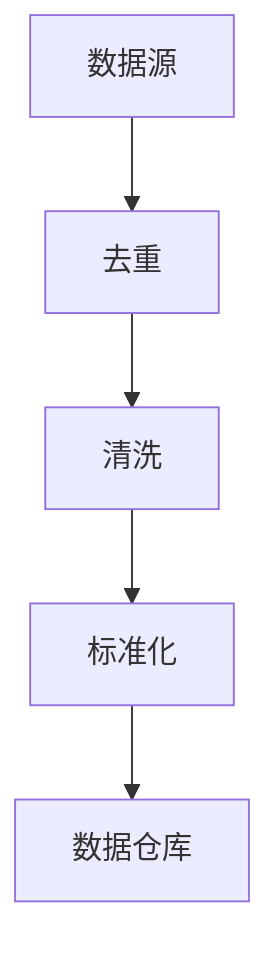

##### 3.1.2 数据分析与可视化

在数据预处理完成后，人机协作2.0可以通过数据分析与可视化工具，帮助用户快速洞察数据背后的信息。常见的分析方法包括统计分析、数据挖掘、机器学习等。

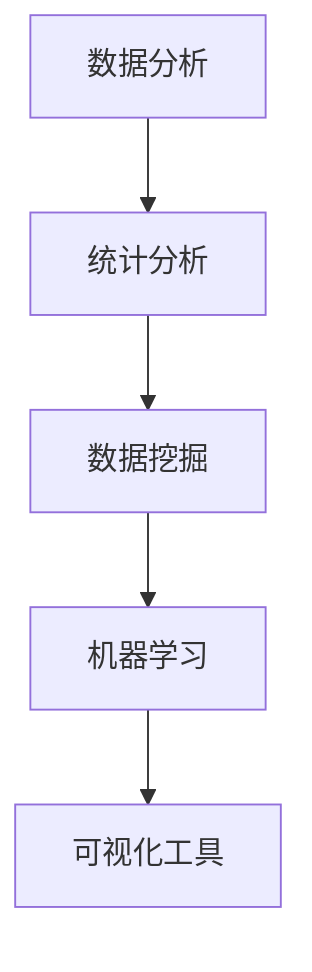

##### 3.1.3 数据挖掘与预测

数据挖掘与预测是人机协作2.0在商业智能领域的核心应用之一。通过分析历史数据，预测未来趋势，企业可以更好地制定战略决策。

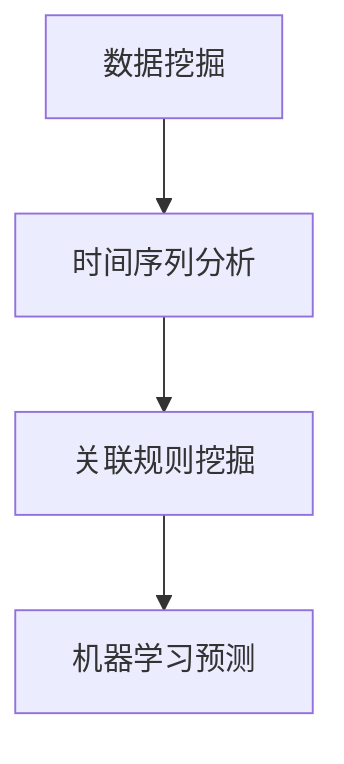

#### 3.2 实战案例：商业智能系统开发

##### 3.2.1 项目背景与需求分析

某大型零售企业希望通过人机协作2.0技术，提升其销售预测和分析能力，以优化库存管理和市场营销策略。

##### 3.2.2 系统架构设计

系统架构包括数据采集模块、数据预处理模块、数据分析模块和可视化模块。核心算法包括时间序列分析和关联规则挖掘。

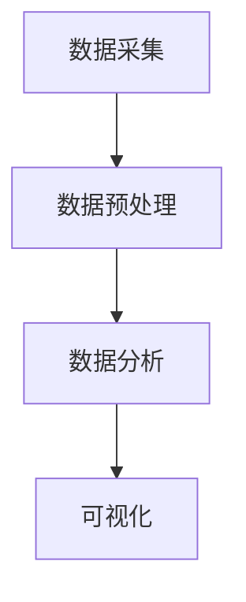

##### 3.2.3 核心算法实现与优化

核心算法包括时间序列分析（ARIMA模型）和关联规则挖掘（Apriori算法）。在实现过程中，通过调整参数和优化算法，提升预测精度。

```python
# 时间序列分析伪代码
def arima_model(data):
    # 调整参数并拟合模型
    # ...
    return model

# 关联规则挖掘伪代码
def apriori(data, min_support, min_confidence):
    # 执行Apriori算法
    # ...
    return rules
```

##### 3.2.4 系统测试与部署

系统在测试阶段通过多种测试用例，验证其功能正确性和性能。最终，系统在生产环境中稳定运行，为企业提供了有效的数据分析和销售预测支持。

### 第4章：客户服务与支持

#### 4.1 人机协作2.0在客户服务中的应用

##### 4.1.1 聊天机器人与自然语言理解

聊天机器人是人机协作2.0在客户服务领域的重要应用之一。通过自然语言理解（NLU）技术，聊天机器人可以与客户进行自然、流畅的对话，解答常见问题。

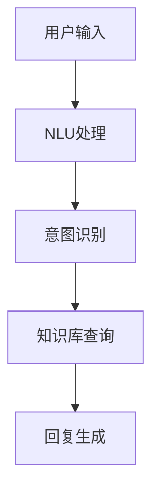

##### 4.1.2 个性化推荐与情感分析

个性化推荐和人机协作2.0相结合，可以提供更符合客户需求的推荐服务。情感分析技术可以捕捉客户的情感变化，为客服人员提供更有针对性的服务。

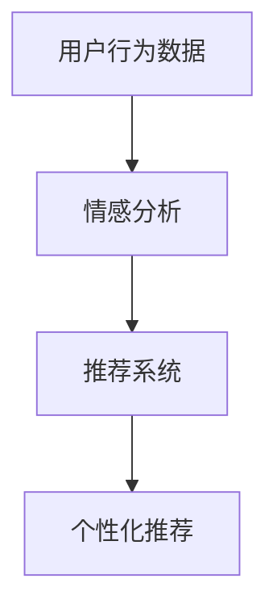

##### 4.1.3 客户行为分析与预测

通过对客户行为的数据分析，人机协作2.0可以预测客户需求，提前采取行动，提供更加个性化的服务。

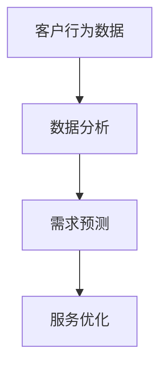

#### 4.2 实战案例：客户服务平台搭建

##### 4.2.1 项目背景与需求分析

某电子商务平台希望通过人机协作2.0技术，提升其客户服务质量，降低客户流失率，提高客户满意度。

##### 4.2.2 系统架构设计

系统架构包括前端交互层、后端服务层和数据库层。核心算法包括自然语言理解（NLU）、情感分析和推荐系统。

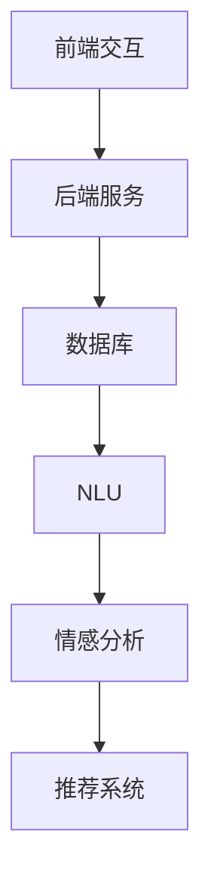

##### 4.2.3 核心算法实现与优化

核心算法包括基于BERT的NLU模型、情感分析模型和基于协同过滤的推荐系统。在实现过程中，通过优化算法和模型参数，提升系统性能。

```python
# NLU模型伪代码
def nlu_model(input_text):
    # 使用BERT模型进行文本处理
    # ...
    return intent, entities

# 情感分析模型伪代码
def sentiment_analysis(text):
    # 使用预训练的情感分析模型
    # ...
    return sentiment

# 推荐系统伪代码
def collaborative_filtering(user_data):
    # 使用协同过滤算法生成推荐列表
    # ...
    return recommendations
```

##### 4.2.4 系统测试与部署

系统在测试阶段通过多种测试用例，验证其功能正确性和性能。最终，系统在生产环境中稳定运行，为电子商务平台提供了高效的客户服务支持。

### 第5章：内容创作与编辑

#### 5.1 人机协作2.0在内容创作中的应用

##### 5.1.1 自动写作与内容生成

自动写作与内容生成是人机协作2.0在内容创作领域的重要应用。通过语言模型，计算机可以自动生成文章、报告等文本内容。

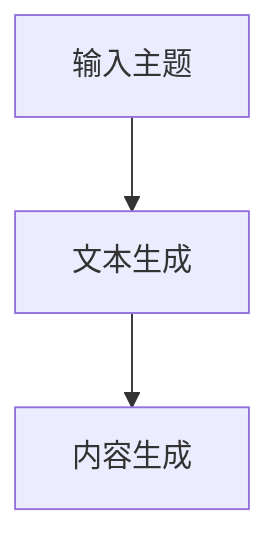

##### 5.1.2 情感分析与内容推荐

情感分析和内容推荐相结合，可以提供更加个性化的内容推荐服务。通过分析用户的情感状态，推荐系统可以推荐更符合用户情感需求的内容。

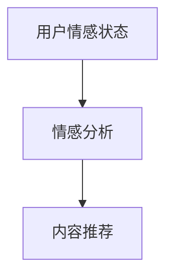

##### 5.1.3 内容质量评估与优化

内容质量评估与优化是人机协作2.0在内容创作领域的另一个重要应用。通过评估算法，可以识别和优化低质量内容，提高整体内容质量。

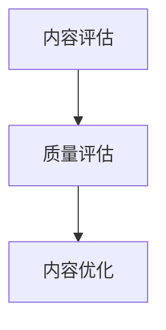

#### 5.2 实战案例：内容创作平台搭建

##### 5.2.1 项目背景与需求分析

某知名媒体公司希望通过人机协作2.0技术，提升其内容创作效率和质量，满足读者多样化需求。

##### 5.2.2 系统架构设计

系统架构包括前端交互层、后端服务层和数据库层。核心算法包括自动写作、情感分析和内容推荐。

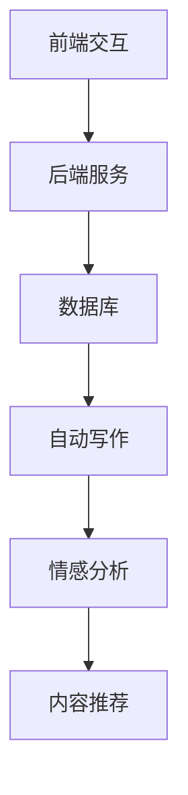

##### 5.2.3 核心算法实现与优化

核心算法包括基于GPT-3的自动写作模型、基于BERT的情感分析模型和基于协同过滤的内容推荐系统。在实现过程中，通过优化算法和模型参数，提升系统性能。

```python
# 自动写作模型伪代码
def generate_text(input_topic):
    # 使用GPT-3模型生成文本
    # ...
    return text

# 情感分析模型伪代码
def sentiment_analysis(text):
    # 使用BERT模型进行情感分析
    # ...
    return sentiment

# 内容推荐系统伪代码
def collaborative_filtering(user_data):
    # 使用协同过滤算法生成推荐列表
    # ...
    return recommendations
```

##### 5.2.4 系统测试与部署

系统在测试阶段通过多种测试用例，验证其功能正确性和性能。最终，系统在生产环境中稳定运行，为媒体公司提供了高效的自动化内容创作支持。

### 第三部分：人机协作2.0的未来发展

#### 第6章：人机协作2.0的伦理与法律问题

##### 6.1 人机协作2.0的伦理问题

人机协作2.0的快速发展引发了一系列伦理问题，如数据隐私、责任归属、人工智能道德准则等。这些问题需要全社会共同努力，制定出合理的伦理规范和道德准则。

##### 6.1.1 人工智能道德准则

人工智能道德准则是指一套指导人工智能设计和应用的基本原则，旨在确保人工智能的发展符合人类价值观和社会伦理。以下是一些关键准则：

1. **公平性与无偏见**：人工智能系统应避免对特定群体产生歧视或偏见。
2. **透明性与解释性**：人工智能系统的决策过程应具备透明性和解释性，方便用户理解。
3. **安全性**：确保人工智能系统的安全，防止恶意攻击和滥用。

##### 6.1.2 数据隐私保护

数据隐私保护是人机协作2.0面临的一个重要挑战。为了保护用户隐私，需要采取以下措施：

1. **数据去标识化**：对用户数据进行去标识化处理，确保无法直接识别用户身份。
2. **加密传输与存储**：确保数据在传输和存储过程中的安全性。
3. **用户知情同意**：用户在参与人机协作2.0应用时，应明确知晓自己的数据将被用于何种目的。

##### 6.1.3 人机协同决策中的责任分配

在人机协同决策中，责任分配是一个复杂的问题。以下是一些可能的解决方案：

1. **明确责任边界**：在系统设计和应用过程中，明确划分人类与人工智能的责任范围。
2. **多方参与**：在决策过程中，引入第三方机构或专业团队，共同参与决策，降低责任风险。
3. **保险与赔偿机制**：建立完善的保险和赔偿机制，为因人工智能错误导致的损失提供保障。

##### 6.2 人机协作2.0的法律问题

人机协作2.0的发展还涉及一系列法律问题，如合同法、知识产权、信息安全与数据保护等。

##### 6.2.1 合同法与知识产权

合同法与人机协作2.0的关系主要体现在以下几个方面：

1. **合同主体**：确定合同主体，明确谁是人机协作2.0的服务提供者、用户和责任方。
2. **合同内容**：制定合理的合同条款，明确双方的权利和义务。
3. **知识产权**：保护人工智能系统及其应用的知识产权，防止侵权和盗版行为。

##### 6.2.2 信息安全与数据保护

信息安全与数据保护是人机协作2.0的关键问题。以下是一些关键措施：

1. **数据加密**：采用先进的数据加密技术，确保数据在传输和存储过程中的安全性。
2. **访问控制**：建立严格的访问控制机制，确保数据仅对授权用户开放。
3. **安全审计**：定期进行安全审计，及时发现和解决安全隐患。

##### 6.2.3 跨国数据传输与监管

随着全球化的进程，跨国数据传输和监管问题日益突出。以下是一些解决方案：

1. **数据本地化**：将数据存储在本国境内，减少跨境数据传输的风险。
2. **国际合作**：加强国际间的合作与协调，制定统一的数据保护标准和法规。
3. **法律适用性**：明确跨国数据传输中的法律适用性问题，确保数据在不同司法辖区内的合法性。

#### 第7章：人机协作2.0的未来展望

##### 7.1 人机协作2.0的发展趋势

人机协作2.0的发展趋势主要体现在以下几个方面：

1. **模型精度的提高**：随着深度学习技术的不断进步，语言模型和其他人工智能模型的精度将进一步提高，为人机协作提供更强大的支持。
2. **人机交互的自然化**：人机交互将更加自然、流畅，用户可以通过语音、手势等多种方式与计算机系统进行互动。
3. **多模态与人机融合**：多模态学习将融合多种类型的数据，提高人机协作的效率和效果。

##### 7.2 人机协作2.0的潜在应用领域

人机协作2.0的潜在应用领域非常广泛，以下是一些重要领域：

1. **教育与培训**：通过智能教学系统，提供个性化、互动式的学习体验。
2. **医疗与健康**：利用人工智能技术，实现精准医疗、智能诊断和个性化治疗。
3. **制造业与自动化**：通过人机协作，提高生产效率、降低成本，实现智能制造。
4. **其他潜在应用领域**：如金融、法律、艺术创作等，人机协作2.0有望在这些领域发挥重要作用。

### 附录

#### 附录A：人机协作2.0相关资源

##### A.1 开发工具与框架

1. **TensorFlow**：开源机器学习框架，适用于构建和训练深度学习模型。
2. **PyTorch**：开源机器学习库，支持动态计算图，便于研究和开发。
3. **OpenAI**：全球领先的人工智能研究机构，提供多种先进的自然语言处理模型和工具。
4. **其他常用工具与框架**：如Keras、Theano、MXNet等。

##### A.2 研究论文与文献

1. **人机协作2.0相关论文**：涵盖人机协作的理论基础、核心算法和应用实践等方面的研究。
2. **基础技术论文**：涉及深度学习、自然语言处理、多模态学习等领域的基础研究。
3. **应用实践论文**：介绍人机协作2.0在不同领域的应用实践和案例研究。

##### A.3 实践指南与案例

1. **开发实践指南**：提供人机协作2.0系统的开发指南和最佳实践。
2. **应用案例分享**：分享人机协作2.0在不同领域的成功应用案例。
3. **行业最佳实践**：总结人机协作2.0在各行业中的最佳实践和经验。

### 作者信息

作者：AI天才研究院/AI Genius Institute & 禅与计算机程序设计艺术 /Zen And The Art of Computer Programming

---

通过以上内容，本文对人机协作2.0进行了全面而深入的探讨。从概念、技术基础到应用实践，再到伦理和法律问题，以及未来展望，本文力求为读者提供一个全面、系统的认识。人机协作2.0作为人工智能领域的重要发展方向，将在未来带来更多的变革和机遇。希望本文能为相关领域的研究者和实践者提供有益的参考和启示。

