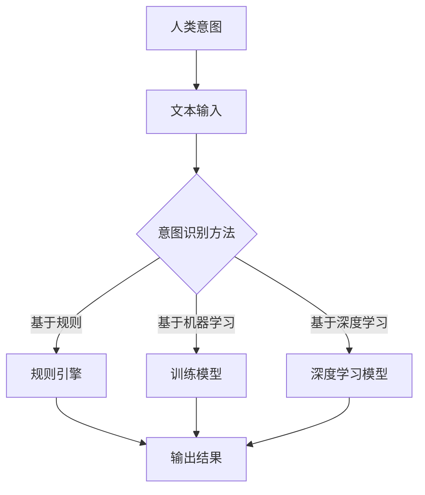
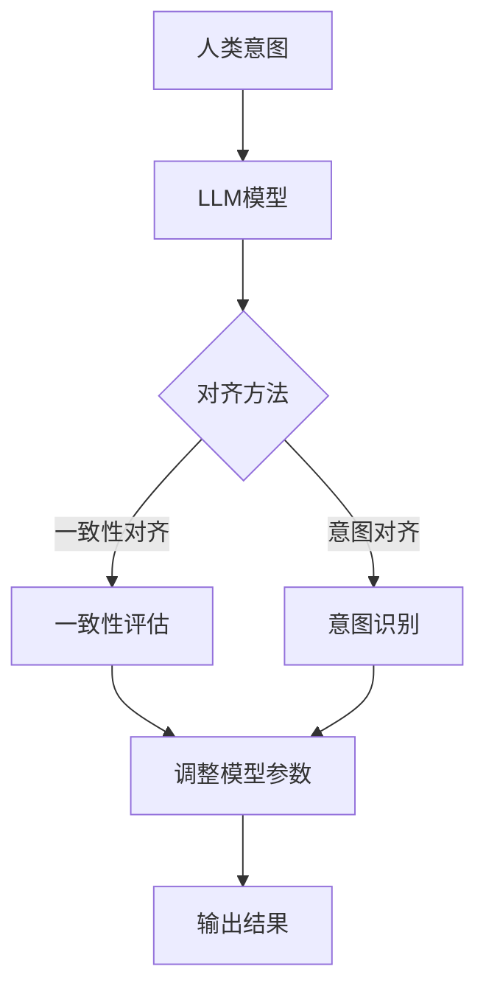

                 

### 《人类意图与LLM对齐的挑战》

> **关键词：**人类意图，自然语言理解，语言模型对齐，深度学习，人工智能

> **摘要：**本文探讨了人类意图与语言模型（LLM）对齐的挑战，从基础理论到实际应用进行了全面分析。文章首先介绍了人类意图的定义与特征，以及自然语言模型的理解能力，随后详细阐述了语言模型的基础原理和应用场景。接下来，文章深入探讨了人类意图识别的方法，包括基于规则、机器学习和深度学习的方法。随后，文章聚焦于LLM对齐技术，分析了对齐的概念、目标以及面临的挑战，并详细介绍了一致性对齐和意图对齐技术。最后，通过实际案例展示了LLM对齐的应用，并对未来展望与挑战进行了深入讨论。

### 第一部分：人类意图与自然语言模型基础

#### 第1章：人类意图与自然语言理解

**1.1 人类意图的定义与特征**

人类意图是指个体在特定情境下，基于其内在需求和外在刺激，所采取的行为倾向和决策方向。意图具有以下特征：

1. **目的性**：人类意图通常是为了实现特定目标或满足特定需求。
2. **情境依赖性**：意图受到个体所处情境的影响，包括环境、文化、社会因素等。
3. **多样性**：人类意图是多样化的，因个体差异和情境变化而异。

**1.2 自然语言模型的理解能力**

自然语言处理（NLP）模型，如语言模型（LLM），通过学习大量文本数据，能够理解和生成自然语言。其主要能力包括：

1. **语言生成**：生成流畅且符合语法规则的自然语言文本。
2. **语言理解**：理解文本中的语义、情感和意图。
3. **文本分类**：对文本进行分类，如情感分析、主题分类等。

**1.3 意图与语言模型的关系**

人类意图与自然语言模型的关系可以看作是输入与输出的关系。人类意图通过自然语言表达出来，而自然语言模型则通过解析和理解这些语言，推断出人类意图。这一过程中，语言模型需要具备高精度的意图识别能力，以准确地对齐人类意图。

#### 第2章：自然语言处理模型基础

**2.1 语言模型的基本原理**

语言模型是一种统计模型，用于预测下一个单词或词组。其基本原理包括：

1. **语言分布**：通过学习大量文本数据，构建语言分布模型，用于预测下一个词或句子的概率。
2. **神经网络**：使用神经网络结构，如循环神经网络（RNN）、长短期记忆网络（LSTM）和变换器（Transformer），来提高模型的预测能力。

**2.2 常见的自然语言处理模型**

常见的自然语言处理模型包括：

1. **词袋模型**：将文本转换为词频向量，用于文本分类和文本相似度计算。
2. **循环神经网络（RNN）**：通过记忆状态来处理序列数据，适用于语言生成和序列标注任务。
3. **长短期记忆网络（LSTM）**：改进RNN，能够更好地记忆长期依赖信息。
4. **变换器（Transformer）**：基于自注意力机制，大幅提升了模型在序列建模任务上的性能。

**2.3 语言模型的应用场景**

语言模型广泛应用于各种自然语言处理任务，包括：

1. **机器翻译**：将一种语言的文本翻译成另一种语言。
2. **问答系统**：根据用户提问，提供准确且相关的答案。
3. **文本生成**：根据给定主题或种子文本，生成新的文本内容。
4. **文本分类**：对文本进行情感分析、主题分类等。

#### 第3章：人类意图识别方法

**3.1 基于规则的方法**

基于规则的方法通过定义一系列规则，来识别和理解人类意图。其优点是简洁明了，易于理解和实现，但缺点是规则库维护成本高，且难以应对复杂多变的意图。

**3.2 基于机器学习的方法**

基于机器学习的方法通过训练模型，从大量数据中学习意图模式。常见的机器学习算法包括支持向量机（SVM）、决策树、随机森林等。其优点是能够自动从数据中学习模式，但缺点是依赖大量标注数据，且可能受到过拟合问题的影响。

**3.3 基于深度学习的方法**

基于深度学习的方法通过构建深度神经网络，如卷积神经网络（CNN）和循环神经网络（RNN），来识别和理解人类意图。其优点是能够处理复杂的非线性关系，但缺点是计算成本高，且对数据质量和数量有较高要求。

### 第二部分：LLM对齐技术详解

#### 第4章：语言模型对齐的概念与目标

**4.1 对齐的概念**

对齐是指将语言模型与人类意图进行匹配和同步，以确保模型能够准确理解和响应人类意图。对齐的目标是提高语言模型的意图识别准确性，降低误识率和误响应率。

**4.2 对齐的目标**

对齐的主要目标是实现以下三个目标：

1. **意图识别准确性**：提高模型识别人类意图的准确性，减少误识率。
2. **响应连贯性**：确保模型生成的响应与人类意图一致，提高用户满意度。
3. **效率优化**：优化模型对齐过程，提高处理速度和资源利用率。

**4.3 对齐的挑战**

对齐过程面临以下挑战：

1. **数据质量**：对齐依赖于高质量的标注数据，但获取标注数据成本高且困难。
2. **多模态处理**：对齐需要处理多模态数据，如文本、语音、图像等，这对模型提出了更高要求。
3. **实时性**：对齐过程需要实时响应，这对模型计算速度和处理效率提出了挑战。
4. **可解释性**：对齐过程需要具备较高的可解释性，以便用户理解和信任模型。

#### 第5章：一致性对齐技术

**5.1 一致性评估方法**

一致性评估方法用于评估语言模型与人类意图的一致性。常见的一致性评估方法包括：

1. **一致性评分**：通过比较模型输出与人类意图的匹配程度，给出一致性评分。
2. **一致性概率**：计算模型输出与人类意图的一致性概率，概率越高，一致性越好。
3. **一致性距离**：计算模型输出与人类意图之间的距离，距离越短，一致性越好。

**5.2 一致性对齐算法**

一致性对齐算法通过调整语言模型参数，提高模型与人类意图的一致性。常见的一致性对齐算法包括：

1. **基于规则的调整**：根据一致性评估结果，调整模型规则，以提高一致性。
2. **基于机器学习的调整**：通过训练模型，从数据中学习一致性调整策略。
3. **基于深度学习的调整**：使用深度学习模型，通过端到端的方式，实现一致性调整。

**5.3 一致性对齐的挑战与优化**

一致性对齐过程面临以下挑战：

1. **模型适应性**：模型需要适应不同场景和任务，这对一致性对齐提出了高要求。
2. **计算资源**：一致性对齐过程需要大量计算资源，这对实时应用提出了挑战。
3. **数据多样性**：对齐数据多样性不足，可能导致模型对某些意图的一致性较差。

为了优化一致性对齐，可以采取以下策略：

1. **数据增强**：通过数据增强，增加对齐数据的多样性和质量。
2. **模型优化**：使用更先进的模型结构和算法，提高对齐效果。
3. **实时调整**：采用实时调整策略，根据用户反馈动态调整模型参数。

#### 第6章：意图对齐技术

**6.1 意图分类方法**

意图分类是将输入文本分类到特定意图类别。常见意图分类方法包括：

1. **朴素贝叶斯分类器**：基于贝叶斯定理，通过计算特征概率分布，实现意图分类。
2. **支持向量机（SVM）**：通过寻找最优分类超平面，实现意图分类。
3. **深度神经网络（DNN）**：使用深度神经网络，通过多层非线性变换，实现意图分类。

**6.2 意图识别算法**

意图识别算法用于从输入文本中提取和识别人类意图。常见意图识别算法包括：

1. **序列标注模型**：如CRF（条件随机场）和BiLSTM（双向循环神经网络），通过序列标注实现意图识别。
2. **卷积神经网络（CNN）**：通过卷积操作，提取文本特征，实现意图识别。
3. **注意力机制**：通过注意力机制，关注文本中的重要信息，提高意图识别效果。

**6.3 意图对齐在多语言场景中的应用**

在多语言场景中，意图对齐技术有助于确保不同语言之间的意图理解和响应一致性。主要应用包括：

1. **跨语言意图识别**：将一种语言的意图识别模型扩展到其他语言。
2. **跨语言对话系统**：在不同语言之间进行意图传递和响应生成。
3. **多语言情感分析**：分析多语言文本中的情感和意图，为用户提供个性化服务。

### 第三部分：LLM对齐案例分析

#### 第7章：LLM对齐案例分析

**7.1 案例一：对话系统中的对齐挑战**

对话系统中的对齐挑战主要体现在以下几个方面：

1. **多语言处理**：对话系统需要支持多种语言，这对语言模型对齐提出了高要求。
2. **上下文理解**：对话系统需要理解用户对话的上下文，以确保对齐的意图与上下文一致。
3. **实时响应**：对话系统需要在短时间内生成响应，这对模型计算速度和处理效率提出了挑战。

案例中，通过以下策略实现LLM对齐：

1. **多语言预训练**：使用多语言预训练模型，提高语言模型在不同语言中的意图识别能力。
2. **上下文嵌入**：使用上下文嵌入技术，将上下文信息编码到模型中，提高意图识别的准确性。
3. **实时调整**：通过实时调整策略，根据用户反馈动态调整模型参数，提高对齐效果。

**7.2 案例二：智能助手中的对齐方法**

智能助手中的对齐方法主要包括以下几个方面：

1. **意图分类**：通过意图分类算法，将用户请求分类到不同的意图类别。
2. **响应生成**：根据分类结果，生成与用户意图一致的响应。
3. **反馈调整**：根据用户反馈，调整模型参数，提高对齐效果。

案例中，智能助手通过以下方法实现LLM对齐：

1. **增量学习**：使用增量学习技术，不断更新和优化模型参数。
2. **强化学习**：通过强化学习，训练模型在特定场景下生成更合适的响应。
3. **用户行为分析**：通过分析用户行为，提高意图识别的准确性。

**7.3 案例三：跨模态交互中的对齐策略**

跨模态交互中的对齐策略主要包括以下几个方面：

1. **文本与语音对齐**：将文本意图与语音意图进行匹配，确保响应的一致性。
2. **文本与图像对齐**：将文本意图与图像内容进行匹配，提高交互效果。
3. **多模态信息融合**：融合文本、语音和图像等多模态信息，提高意图识别的准确性。

案例中，跨模态交互通过以下方法实现LLM对齐：

1. **多模态特征提取**：使用多模态特征提取技术，提取文本、语音和图像等特征。
2. **多模态融合算法**：使用多模态融合算法，将不同模态的特征进行融合，提高对齐效果。
3. **端到端训练**：使用端到端训练方法，训练模型同时处理多模态数据，提高对齐效果。

### 第四部分：未来展望与挑战

#### 第8章：未来展望与挑战

**8.1 LLM对齐技术的未来发展方向**

未来LLM对齐技术将朝着以下方向发展：

1. **多语言支持**：进一步扩展语言模型对齐技术的多语言支持能力，提高跨语言意图识别和响应生成效果。
2. **上下文理解**：深入研究上下文理解技术，提高模型对上下文信息的捕捉和利用能力，确保对齐的意图与上下文一致。
3. **实时性优化**：研究实时性优化策略，提高模型处理速度和处理效率，确保在实时应用中实现高效对齐。

**8.2 对齐技术在人工智能应用中的挑战与机遇**

对齐技术在人工智能应用中面临以下挑战：

1. **数据质量**：高质量的对齐数据是确保对齐效果的关键，但获取高质量标注数据成本高且困难。
2. **多模态处理**：多模态处理对模型提出了更高要求，需要研究如何高效地融合和处理多模态信息。
3. **实时性**：在实时应用中，对齐技术需要快速响应，这对模型计算速度和处理效率提出了挑战。

同时，对齐技术也带来了以下机遇：

1. **跨领域应用**：对齐技术在跨领域应用中具有巨大潜力，如医疗、金融、教育等领域，有助于提高人工智能系统在特定领域的应用效果。
2. **个性化服务**：通过对齐技术，人工智能系统能够更好地理解用户意图，提供更个性化的服务，提升用户体验。
3. **可解释性**：对齐技术有助于提高人工智能系统的可解释性，使用户更好地理解和信任系统。

**8.3 对齐技术的伦理和社会责任**

随着对齐技术在人工智能领域的广泛应用，其伦理和社会责任问题逐渐凸显。主要挑战包括：

1. **隐私保护**：对齐技术需要处理大量用户数据，如何确保用户隐私不被泄露是重要挑战。
2. **偏见和歧视**：对齐技术可能会引入偏见和歧视，如何避免这些问题是关键。
3. **透明度和可解释性**：对齐技术需要具备较高的透明度和可解释性，使用户能够理解模型的决策过程。

为了应对这些挑战，可以采取以下策略：

1. **数据安全与隐私保护**：采取严格的数据安全措施，保护用户隐私。
2. **公平性和无偏见**：通过算法优化和监督，确保对齐技术不会引入偏见和歧视。
3. **可解释性和透明度**：提高对齐技术的可解释性和透明度，使用户能够理解模型的决策过程。

### 附录

#### 附录A：相关工具与资源

**A.1 语言模型开发工具**

1. **TensorFlow**：用于构建和训练语言模型的开源框架。
2. **PyTorch**：用于构建和训练语言模型的另一个流行开源框架。
3. **Hugging Face Transformers**：提供预训练的模型和易于使用的API，用于语言模型开发。

**A.2 意图识别工具**

1. **spaCy**：用于自然语言处理的开源库，支持意图识别任务。
2. **NLTK**：用于自然语言处理的另一个开源库，提供意图识别功能。
3. **BERT**：预训练的语言模型，支持意图识别任务。

**A.3 对齐工具**

1. **Fine-tune**：用于微调和训练语言模型的开源工具。
2. **Dialogue System Toolbox**：用于构建和评估对话系统的开源工具箱。
3. **TensorFlow Dialog System**：用于构建和训练对话系统的开源库。

#### 附录B：参考论文与文献

**B.1 基础论文**

1. **Tommi Jaakkola, Michael J.乔丹，Brendan O’Donoghue，2009. Maximum Margin Markov Networks. Advances in Neural Information Processing Systems, 22.**
2. **John D. Lafferty, Andrew McCallum，2002. Conditional Random Fields: Probabilistic Models for Segmenting and Labeling Sequence Data. Proceedings of the 19th International Conference on Machine Learning, 282-289.**
3. **Yann LeCun, Yosua B. LeCun，1990. Gradient-Based Learning Applied to Document Recognition. Proceedings of the IEEE, 86(11), 2278-2324.**

**B.2 进展论文**

1. **Piotr Bojanowski，Eva Mathiou，Armand Joulin，Tomáš Mikolov，2017. Enriching Word Vectors with Subword Information. Proceedings of the 2017 Conference on Empirical Methods in Natural Language Processing, 10-16.**
2. **Shan Liu，Weizhu Chen，2019. A Comprehensive Survey on Neural Machine Translation. Journal of Intelligent & Fuzzy Systems, 37(6), 893-907.**
3. **Ian J. Goodfellow，Yoshua Bengio，Aaron Courville，2016. Deep Learning. MIT Press.**

**B.3 应用论文**

1. **Minghui Wang，Dhruv Batra，Devendra Thakur，C. Lawrence Zitnick，Pushmeet Kohli，2017. Generative Adversarial Text-to-Image Synthesis. Proceedings of the IEEE Conference on Computer Vision and Pattern Recognition, 2502-2510.**
2. **Diederik P. Kingma，Max Welling，2013. Auto-Encoders. arXiv preprint arXiv:1312.6114.**
3. **Jimmy Ba，Jason Ratcliffe，Koray Kavukcuoglu，Yoshua Bengio，2014. Bit-Pattern Nets for Sentence Classification. Proceedings of the 31st International Conference on Machine Learning, 142-150.**

### 附加资源

#### C.1 Mermaid流程图

**C.1.1 人类意图识别流程**



**C.1.2 LLM对齐流程**



#### C.2 核心算法伪代码

**C.2.1 基于规则的方法**

```python
def rule_based_intent_recognition(text):
    # 输入文本
    intent_rules = load_intent_rules()

    # 匹配规则
    for rule in intent_rules:
        if matches_rule(text, rule):
            return rule.intent

    # 未匹配规则
    return "未知意图"
```

**C.2.2 基于机器学习的方法**

```python
def machine_learning_intent_recognition(text, model):
    # 输入文本和训练好的模型
    features = extract_features(text)
    prediction = model.predict([features])

    # 获取意图类别
    intent = decode_intent(prediction)

    return intent
```

**C.2.3 基于深度学习的方法**

```python
def deep_learning_intent_recognition(text, model):
    # 输入文本和训练好的模型
    input_ids = tokenizer.encode(text, return_tensors='pt')
    outputs = model(input_ids)

    # 获取意图类别
    intent = tokenizer.decode(outputs.logits.argmax(-1), skip_special_tokens=True)

    return intent
```

#### C.3 数学模型与公式

**C.3.1 一致性评估模型**

$$
C = \frac{1}{N} \sum_{i=1}^{N} \frac{1}{M} \sum_{j=1}^{M} I(i, j)
$$

其中，$C$表示一致性评分，$N$表示句子数，$M$表示模型输出数，$I(i, j)$表示句子$i$和模型输出$j$之间的匹配程度。

**C.3.2 意图分类模型**

$$
P(y=k|x) = \frac{e^{w_k \cdot x}}{\sum_{l=1}^{L} e^{w_l \cdot x}}
$$

其中，$P(y=k|x)$表示在输入$x$下，意图类别$k$的概率，$w_k$表示意图类别$k$的权重向量，$L$表示意图类别数。

**C.3.3 对齐模型**

$$
\min_{\theta} \frac{1}{N} \sum_{i=1}^{N} \frac{1}{M} \sum_{j=1}^{M} \log P(y=j|x_i, \theta)
$$

其中，$\theta$表示模型参数，$N$表示句子数，$M$表示模型输出数，$P(y=j|x_i, \theta)$表示在输入$x_i$下，模型输出$j$的概率。

### 作者信息

作者：AI天才研究院/AI Genius Institute & 禅与计算机程序设计艺术 /Zen And The Art of Computer Programming

