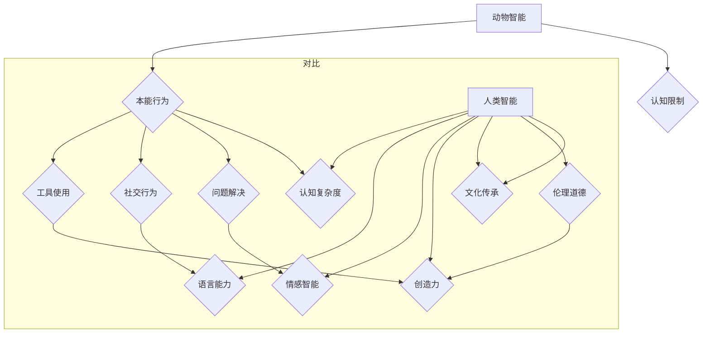
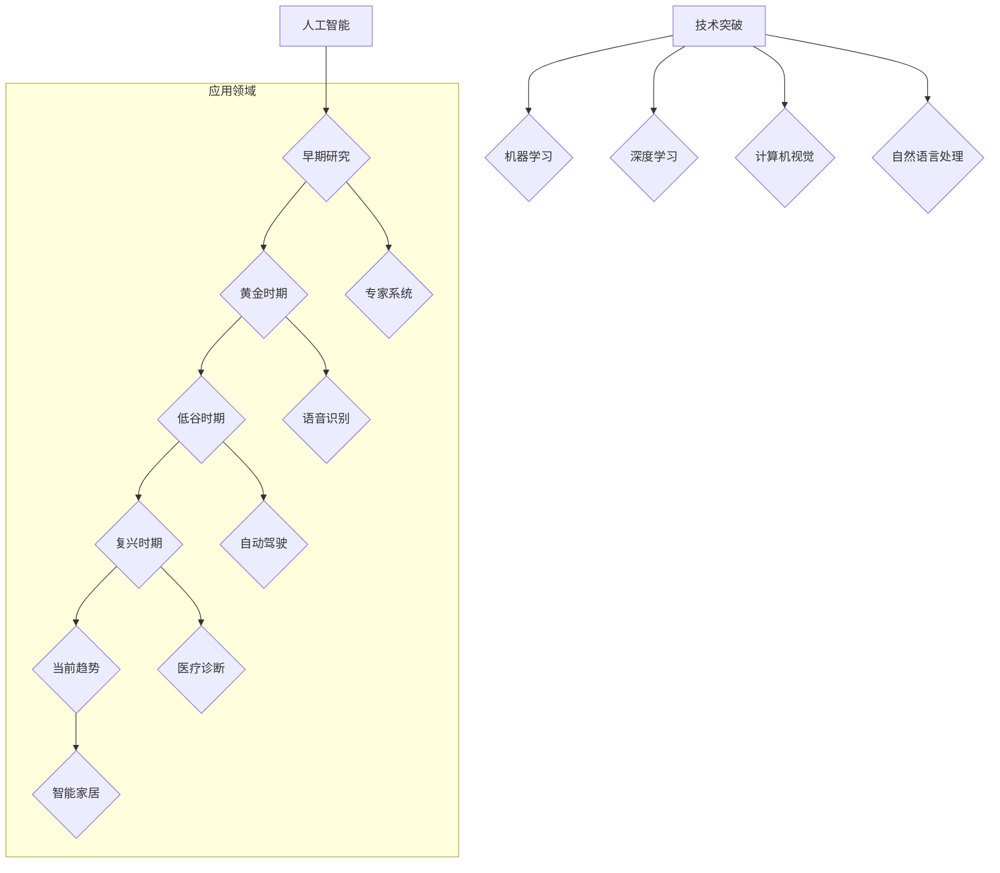

                 

# 《人类智能的独特地位》

## 关键词
- 人类智能
- 动物智能
- 人工智能
- 记忆与学习能力
- 语言能力
- 创造性与想象力

## 摘要
本文从人类智能的定义、起源、演化、与动物智能的差异、优势、局限性、未来展望等多个角度，深入探讨了人类智能的独特地位。通过对人类智能与人工智能的比较，分析了两者共存与合作的模式，以及人类智能的价值、保护与传承。文章最后提出了促进人类智能发展的措施，并对人类智能的未来方向进行了展望。

### 目录

#### 第一部分: 引言与背景

1. 第1章 引言
    1.1 人类智能的定义
    1.2 人类智能的独特性
    1.3 书籍结构概览

2. 第2章 人类智能的起源与演化
    2.1 人类智能的起源
    2.2 人类智能的演化
    2.3 人类智能的独特进化路径

#### 第二部分: 人类智能与动物智能的差异

3. 第3章 动物智能概述
    3.1 动物智能的类型
    3.2 动物智能的特点
    3.3 动物智能的限制

4. 第4章 人类智能的优势
    4.1 记忆与学习能力
    4.2 语言能力
    4.3 创造性与想象力

5. 第5章 人类智能的局限性
    5.1 情感与认知的矛盾
    5.2 信息的处理与过滤
    5.3 适应性变化

#### 第三部分: 人类智能的未来展望

6. 第6章 人工智能的崛起
    6.1 人工智能的定义
    6.2 人工智能的发展历程
    6.3 人工智能的优势与局限

7. 第7章 人类智能与人工智能的共存与合作
    7.1 人类智能与人工智能的比较
    7.2 共存与合作的模式
    7.3 人类智能的未来

8. 第8章 人类智能的独特地位
    8.1 人类智能的价值
    8.2 人类智能的保护与传承
    8.3 人类智能的未来展望

#### 第四部分: 结论与建议

9. 第9章 结论
    9.1 人类智能的核心特点
    9.2 人类智能的未来发展
    9.3 对人类的启示

10. 第10章 建议
    10.1 促进人类智能发展的措施
    10.2 人类智能与人工智能的关系处理
    10.3 人类智能的未来方向

### 附录

11. 附录A 相关研究综述
    11.1 人类智能研究的发展历程
    11.2 动物智能研究的发展历程
    11.3 人工智能研究的发展历程

12. 附录B 进一步阅读材料
    12.1 推荐阅读书籍
    12.2 推荐论文
    12.3 互联网资源

13. 附录C 术语表
    13.1 人类智能相关术语
    13.2 动物智能相关术语
    13.3 人工智能相关术语

14. 附录D Mermaid 流程图
    14.1 人类智能演化过程
    14.2 动物智能与人类智能对比
    14.3 人工智能发展趋势

15. 附录E 数学模型与公式
    15.1 记忆与学习能力模型
    15.2 语言能力模型
    15.3 创造性与想象力模型

16. 附录F 项目实战案例
    16.1 案例一：人类智能与动物智能对比实验
    16.2 案例二：人工智能辅助人类智能决策
    16.3 案例三：人类智能与人工智能合作创新

### 引言

人类智能是一种独特而复杂的认知能力，它使人类能够感知、思考、学习、解决问题和创造。与其他动物相比，人类智能具有显著的独特性和优势。本文将从人类智能的定义、起源、演化、与动物智能的差异、优势、局限性、未来展望等多个角度，深入探讨人类智能的独特地位。

首先，本文将介绍人类智能的定义和独特性，包括认知复杂度、语言能力和文化传承等方面。接着，我们将探讨人类智能的起源与演化，分析人类智能的独特进化路径。然后，我们将比较人类智能与动物智能的差异，阐述人类智能的优势和局限性。在此基础上，本文还将探讨人工智能的崛起，分析人工智能的优势与局限，以及人类智能与人工智能的共存与合作。

文章最后将总结人类智能的核心特点，讨论人类智能的未来发展，并提出促进人类智能发展的措施。通过本文的讨论，我们将更加深刻地理解人类智能的独特地位，以及其在未来的发展中可能面临的挑战和机遇。

### 人类智能的定义

人类智能是指人类在感知、思考、学习、记忆、解决问题和语言交流等方面的能力。它是一个复杂而多维的概念，涵盖了认知、情感、社会和文化等多个方面。以下是人类智能的几个核心特征：

1. **认知复杂度**：人类智能具有处理复杂问题、进行抽象思维和理论构建的能力。与其他动物相比，人类能够进行高级的逻辑推理、空间认知和数学运算。例如，人类能够理解复杂的逻辑命题，解决复杂的数学问题，以及进行高级的符号操作。

2. **语言能力**：语言是人类智能的重要组成部分，它使人类能够进行复杂的思想交流和知识传递。人类不仅能够理解语言，还能使用语言进行创造性表达和沟通。这使得人类能够在社会和文化层面上进行协作和共享知识。

3. **记忆与学习能力**：人类智能具有强大的记忆和学习能力。人类能够通过经验和观察快速学习新技能和新知识，并能够长期记忆大量的信息。这种能力使得人类能够适应复杂多变的环境，并在不同情境中应用所学知识。

4. **情感智能**：人类智能不仅包括认知能力，还包括情感智能。人类能够感知和理解自己的情感，以及他人的情感。这种能力使人类能够建立深厚的人际关系，进行有效的情感交流和情感调节。

5. **创造力**：人类智能具有高度的创造力，能够进行创新性思考和创作。人类能够创造出新的思想、艺术作品和技术，推动社会进步和文化发展。

6. **文化传承**：人类智能能够通过文化传承，将知识、经验和技术传递给下一代。这种能力使得人类文明得以延续和发展，形成了独特的文化传统和价值观。

综上所述，人类智能是一个复杂而多维的概念，涵盖了认知、情感、社会和文化等多个方面。它使人类能够在自然界中脱颖而出，成为一个高度发达和多样化的物种。

#### 1.2 人类智能的独特性

人类智能的独特性表现在多个方面，使其在生物界中独树一帜。首先，**认知复杂度**是人类智能的一大独特特征。人类能够进行高级的逻辑推理、抽象思维和理论构建，这在其他动物中是极为罕见的。例如，人类能够解决复杂的数学问题、进行逻辑论证，甚至在科学研究中构建理论模型。这种认知能力使得人类能够应对复杂多变的环境，进行创新和创造。

其次，**语言能力**也是人类智能的重要标志。人类不仅能够使用语言进行交流和沟通，还能通过语言进行创造性表达和思想传递。这种能力使得人类能够在社会和文化层面上进行协作和共享知识。其他动物虽然也具备一定的沟通能力，但没有像人类这样高度发达的语言系统。

**记忆与学习能力**是另一个突出特点。人类能够通过经验和观察快速学习新技能和新知识，并能够长期记忆大量的信息。这种强大的学习能力使得人类能够在不同情境中灵活应用所学知识，不断适应和进化。

**情感智能**则是人类智能的独特方面之一。人类不仅能够感知和理解自己的情感，还能理解和表达他人的情感。这种能力使得人类能够建立深厚的人际关系，进行有效的情感交流和情感调节。其他动物虽然也具备一定的情感能力，但人类的情感智能更为复杂和精细。

最后，**文化传承**使人类智能具有独特的价值。人类能够通过文化传承，将知识、经验和技术传递给下一代。这种能力使得人类文明得以延续和发展，形成了独特的文化传统和价值观。其他动物没有这种文化传承的能力，其知识和技能往往局限于个体和群体内部，无法像人类那样长期积累和传递。

综上所述，人类智能在认知复杂度、语言能力、记忆与学习能力、情感智能和文化传承等方面展现出独特的优势，使其在生物界中占据独特地位。

#### 1.3 书籍结构概览

本文将分为四个主要部分，以全面探讨人类智能的独特地位。

**第一部分：引言与背景**  
这一部分将介绍人类智能的定义、独特性和起源与演化。我们将首先定义人类智能，阐述其核心特征，然后探讨人类智能的起源，以及人类如何通过漫长的进化过程发展出独特的认知能力。

**第二部分：人类智能与动物智能的差异**  
在这一部分，我们将比较人类智能和动物智能的异同，分析人类智能的优势和局限性。我们将探讨动物智能的类型和特点，以及人类智能在认知复杂度、语言能力、记忆与学习能力等方面的独特优势，同时也会讨论人类智能的局限性。

**第三部分：人类智能的未来展望**  
这一部分将探讨人工智能的崛起，分析其优势与局限，并讨论人类智能与人工智能的共存与合作。我们将探讨人类智能与人工智能的比较，分析两者在认知能力、创造力和情感智能等方面的差异，并提出人类智能与人工智能共存与合作的模式。

**第四部分：结论与建议**  
最后，我们将总结人类智能的核心特点，讨论其未来发展，并提出促进人类智能发展的措施。我们将讨论人类智能的价值、保护与传承，以及未来可能面临的技术和社会挑战。

通过这四个部分的探讨，我们希望对人类智能的独特地位有更深刻的理解，并为人类智能的未来发展提供有益的启示。

### 人类智能的起源

人类智能的起源可以追溯到大约700万年前，当时的人类祖先开始展现出与动物不同的认知能力。人类智能的起源与演化过程是一个复杂而漫长的过程，涉及多个阶段和关键事件。

#### 2.1 人类智能的起源

人类智能的起源可以追溯到人类的祖先——古猿。大约700万年前，非洲的原始森林中，一群古猿开始展现出与现存其他灵长类动物不同的行为特征。这些古猿开始使用工具，这标志着人类智能的起源。工具使用不仅提高了古猿的生存能力，也促进了其大脑的发育。

大约500万年前，人类的一个直系祖先——露西（Australopithecus afarensis）生活于非洲。露西的下颌和牙齿结构显示出其具有较为发达的下颚和牙齿咬合力，这可能与其使用工具有关。此外，露西的脑容量大约为400毫升，虽然比现代人类的脑容量小很多，但比其他灵长类动物要大，这表明其大脑具有一定的认知能力。

大约200万年前，人类的一个直系祖先——直立人（Homo habilis）出现。直立人的脑容量大约为600毫升，比露西大，这表明其大脑发育得更加完善。直立人不仅使用石器，还可能使用火，这些行为进一步促进了其智能发展。

#### 2.2 人类智能的演化

人类智能的演化经历了多个阶段，每个阶段都标志着认知能力的提升。

1. **早期阶段**：从大约200万年前到50万年前，早期人类开始展现出更高级的认知能力，例如使用更加复杂的工具、进行狩猎和团队合作。这些行为表明早期人类已经具备一定的语言能力和社会协作能力。

2. **中期阶段**：从大约50万年前到20万年前，中期人类，如尼安德特人（Homo neanderthalensis），其脑容量进一步增加，达到了现代人类的脑容量水平。这表明中期人类的大脑结构更加完善，认知能力更强。尼安德特人可能已经具备现代人类的一些特征，例如复杂的语言和社交行为。

3. **晚期阶段**：从大约20万年前到10万年前，晚期人类，如智人（Homo sapiens），开始展现出高度发达的认知能力。智人的脑容量与现代人类相当，其认知能力包括高级逻辑推理、数学运算和抽象思维。

#### 2.3 人类智能的独特进化路径

人类智能的独特进化路径主要体现在以下几个方面：

1. **大脑结构的优化**：人类大脑体积逐渐增大，神经连接更加复杂。大脑皮层的发育使人类能够进行高级的认知功能，如语言、情感和社交行为。

2. **语言能力的形成**：语言能力的形成是人类智能发展的重要标志。通过语言，人类能够进行复杂的思想交流和知识传递，促进社会协作和文化发展。

3. **文化传承**：人类智能的发展得益于文化传承。人类通过文化传承，将知识、技能和价值观传递给下一代，使得智能水平得以不断提升。

综上所述，人类智能的起源和演化是一个复杂而漫长的过程，涉及多个阶段和关键事件。从古猿到现代人类，人类智能经历了显著的发展和演变，形成了独特的认知能力。这些能力不仅使人类在生物界中脱颖而出，也为人类文明的繁荣和发展奠定了基础。

#### 2.1 人类智能的起源

人类智能的起源可以追溯到大约700万年前，当时的人类祖先开始展现出与动物不同的认知能力。人类智能的起源与演化过程是一个复杂而漫长的过程，涉及多个阶段和关键事件。

大约700万年前，在非洲的原始森林中，一群古猿开始展现出与现存其他灵长类动物不同的行为特征。这些古猿开始使用简单的工具，这标志着人类智能的起源。工具使用不仅提高了古猿的生存能力，也促进了其大脑的发育。

大约500万年前，人类的一个直系祖先——露西（Australopithecus afarensis）生活于非洲。露西的下颌和牙齿结构显示出其具有较为发达的下颚和牙齿咬合力，这可能与其使用工具有关。此外，露西的脑容量大约为400毫升，虽然比现代人类的脑容量小很多，但比其他灵长类动物要大，这表明其大脑具有一定的认知能力。

大约200万年前，人类的一个直系祖先——直立人（Homo habilis）出现。直立人的脑容量大约为600毫升，比露西大，这表明其大脑发育得更加完善。直立人不仅使用石器，还可能使用火，这些行为进一步促进了其智能发展。

人类智能的起源不仅仅依赖于生物学因素，还受到环境和社会因素的影响。环境的变化，如气候的变暖和森林的减少，迫使古猿开始采取更加复杂的行为策略，例如使用工具和合作狩猎。这些行为促进了大脑的发展和认知能力的提升。

社会因素也对人类智能的发展产生了重要影响。古猿开始形成社会群体，通过语言和社交行为进行交流和合作。这些社会互动促进了认知能力的发展，尤其是语言能力和社交智能。

总的来说，人类智能的起源是一个复杂的过程，涉及生物进化、环境适应和社会互动等多个方面。从古猿到现代人类，人类智能经历了显著的发展和演变，形成了独特的认知能力。这些能力不仅使人类在生物界中脱颖而出，也为人类文明的繁荣和发展奠定了基础。

#### 2.2 人类智能的演化

人类智能的演化经历了漫长的过程，从古猿到现代人类，智能水平逐渐提高。以下是人类智能演化过程中的几个关键阶段：

1. **早期演化**（约250万年前）：在这一阶段，人类祖先开始展现出与动物不同的认知能力。他们开始使用简单的工具，如石器和树枝，来获取食物和防御敌害。这些工具的使用提高了他们的生存能力，同时也促进了大脑的发展。

2. **早期人类**（约200万年前）：这一阶段出现了直立人（Homo habilis），其脑容量比其他灵长类动物大，大约为600毫升。直立人不仅使用石器，还可能使用火，这进一步促进了大脑的发展。火的使用不仅提供了温暖和光明，还改变了食物的加工方式，增强了营养吸收。

3. **晚期人类**（约30万年前）：智人（Homo sapiens）出现，其脑容量与现代人类相当，大约为1400毫升。智人具有高度发达的认知能力，包括复杂的语言能力、抽象思维和推理能力。他们能够进行狩猎、捕鱼和农业活动，这些活动需要高度的协作和计划。

4. **文化发展**（约1万年前）：随着农业的出现，人类开始定居生活，形成了复杂的社会结构和文化传统。文化传承使得知识、技能和价值观得以代代相传，进一步提升了智能水平。

5. **现代智能**：随着科技的发展，人类智能继续提升。现代人类不仅能够解决复杂的问题，还能够利用计算机和互联网等工具进行高效的信息处理和交流。

在这个过程中，人类智能的演化受到多种因素的影响：

- **环境适应**：环境的变化，如气候变暖和森林减少，迫使人类采取更加复杂的行为策略，这促进了智能发展。
- **工具使用**：工具的使用不仅提高了生存能力，也促进了大脑的发展。
- **语言能力**：语言能力的形成是人类智能发展的重要标志。语言使得人类能够进行复杂的思想交流和知识传递，促进了社会协作和文化发展。
- **文化传承**：文化传承使得知识、技能和价值观得以代代相传，使得智能水平不断提升。

总之，人类智能的演化是一个复杂而漫长的过程，涉及生物学、环境适应、工具使用、语言能力和文化传承等多个方面。通过这些演化过程，人类逐渐发展出了独特的智能，使其在生物界中占据独特地位。

#### 2.3 人类智能的独特进化路径

人类智能的独特进化路径主要体现在以下几个方面：

1. **大脑结构的优化**：人类大脑体积逐渐增大，神经连接更加复杂。特别是大脑皮层的发育，使其能够进行高级的认知功能，如语言、情感和社交行为。与其他动物相比，人类大脑具有更高的可塑性和适应性。

2. **语言能力的形成**：语言能力的形成是人类智能发展的重要标志。语言使得人类能够进行复杂的思想交流和知识传递，促进了社会协作和文化发展。语言能力的独特性不仅体现在语言系统的高度复杂性和多样性，还体现在语言的学习和使用过程中的高度灵活性。

3. **文化传承**：人类智能的发展得益于文化传承。通过文化传承，人类将知识、技能和价值观传递给下一代，使得智能水平得以不断提升。文化传承不仅促进了知识的积累和传承，还促进了社会结构的稳定和文化的多样性。

4. **工具使用和创造力**：人类智能的进化过程中，工具使用和创造力起到了关键作用。工具的使用不仅提高了生存能力，也促进了大脑的发展。创造力使得人类能够不断创新，发明新的工具和技术，推动社会进步。

5. **社会协作与复杂性**：人类智能的进化过程中，社会协作和复杂性的增加也是一个重要因素。人类通过社会协作，能够进行大规模的集体行动，解决复杂的问题。这种协作不仅提高了个体的生存能力，也促进了智能的发展。

综上所述，人类智能的独特进化路径是由大脑结构的优化、语言能力的形成、文化传承、工具使用和创造力、社会协作与复杂性等多个因素共同作用的结果。这些因素相互交织，共同推动了人类智能的持续发展和进化。

#### 第3章 动物智能概述

动物智能是指动物在感知、学习、适应和问题解决等方面的能力。虽然动物智能与人类智能存在显著差异，但许多动物也展现出了一定的认知能力和复杂行为。以下是动物智能的类型、特点和限制。

##### 3.1 动物智能的类型

动物智能可以分为以下几种类型：

1. **本能行为**：本能行为是指动物生来就具备的行为，这些行为不依赖于学习和经验。例如，鸟类的筑巢、蜜蜂的蜂巢建造和哺乳动物的哺育后代。

2. **工具使用**：一些动物能够使用简单工具来获取食物或提高生存能力。例如，黑猩猩使用树枝掏取白蚁、海豚使用海草制作工具。

3. **社交行为**：动物通过社交行为进行交流和协作。例如，狮子群中的协作狩猎、狼群中的社会结构。

4. **问题解决**：动物能够通过观察、试错和经验学习来解决问题。例如，乌鸦使用工具获取食物、鸟类在迁徙过程中识别方向。

5. **认知能力**：一些动物展现出较高的认知能力，能够进行复杂的行为和决策。例如，海豚的记忆能力、大象的社会组织和智力。

##### 3.2 动物智能的特点

动物智能的特点包括：

1. **适应性**：动物能够适应不同的环境和生存挑战。例如，鸟类能够迁徙到不同的地方寻找食物和栖息地，哺乳动物能够适应不同的气候和食物来源。

2. **学习能力**：动物具有一定的学习能力，能够通过经验和观察改善行为。例如，狗能够通过训练学会复杂的指令，猴子能够通过观察其他个体学习新技能。

3. **认知限制**：尽管动物展现出一定的认知能力，但它们在认知复杂性、抽象思维和语言交流方面存在一定的限制。动物无法进行复杂的逻辑推理和抽象思维，也难以像人类一样进行复杂的语言交流。

##### 3.3 动物智能的限制

动物智能的限制主要体现在以下几个方面：

1. **认知复杂性**：动物智能无法进行复杂的认知任务，如高级的逻辑推理、数学运算和抽象思维。

2. **文化传承**：动物无法进行知识、经验和文化技能的传承，其行为和知识往往局限于个体和群体内部。

3. **语言交流**：动物无法像人类一样进行复杂的语言交流和沟通，其沟通方式主要依赖于声音、动作和气味等非语言信号。

尽管动物智能在许多方面与人类智能存在差异，但动物也展现出了一定的认知能力和复杂行为。了解动物智能的类型、特点和限制有助于我们更好地理解人类智能的独特地位和发展过程。

#### 第3章 动物智能概述

动物智能是指动物在感知、学习、适应和问题解决等方面的能力。虽然动物智能与人类智能存在显著差异，但许多动物也展现出了一定的认知能力和复杂行为。以下是动物智能的类型、特点和限制。

##### 3.1 动物智能的类型

动物智能可以分为以下几种类型：

1. **本能行为**：本能行为是指动物生来就具备的行为，这些行为不依赖于学习和经验。例如，鸟类的筑巢、蜜蜂的蜂巢建造和哺乳动物的哺育后代。

2. **工具使用**：一些动物能够使用简单工具来获取食物或提高生存能力。例如，黑猩猩使用树枝掏取白蚁、海豚使用海草制作工具。

3. **社交行为**：动物通过社交行为进行交流和协作。例如，狮子群中的协作狩猎、狼群中的社会结构。

4. **问题解决**：动物能够通过观察、试错和经验学习来解决问题。例如，乌鸦使用工具获取食物、鸟类在迁徙过程中识别方向。

5. **认知能力**：一些动物展现出较高的认知能力，能够进行复杂的行为和决策。例如，海豚的记忆能力、大象的社会组织和智力。

##### 3.2 动物智能的特点

动物智能的特点包括：

1. **适应性**：动物能够适应不同的环境和生存挑战。例如，鸟类能够迁徙到不同的地方寻找食物和栖息地，哺乳动物能够适应不同的气候和食物来源。

2. **学习能力**：动物具有一定的学习能力，能够通过经验和观察改善行为。例如，狗能够通过训练学会复杂的指令，猴子能够通过观察其他个体学习新技能。

3. **认知限制**：尽管动物展现出一定的认知能力，但它们在认知复杂性、抽象思维和语言交流方面存在一定的限制。动物无法进行复杂的逻辑推理和抽象思维，也难以像人类一样进行复杂的语言交流。

##### 3.3 动物智能的限制

动物智能的限制主要体现在以下几个方面：

1. **认知复杂性**：动物智能无法进行复杂的认知任务，如高级的逻辑推理、数学运算和抽象思维。

2. **文化传承**：动物无法进行知识、经验和文化技能的传承，其行为和知识往往局限于个体和群体内部。

3. **语言交流**：动物无法像人类一样进行复杂的语言交流和沟通，其沟通方式主要依赖于声音、动作和气味等非语言信号。

尽管动物智能在许多方面与人类智能存在差异，但动物也展现出了一定的认知能力和复杂行为。了解动物智能的类型、特点和限制有助于我们更好地理解人类智能的独特地位和发展过程。

#### 第3章 动物智能概述

动物智能是指动物在感知、学习、适应和问题解决等方面的能力。虽然动物智能与人类智能存在显著差异，但许多动物也展现出了一定的认知能力和复杂行为。以下是动物智能的类型、特点和限制。

##### 3.1 动物智能的类型

动物智能可以分为以下几种类型：

1. **本能行为**：本能行为是指动物生来就具备的行为，这些行为不依赖于学习和经验。例如，鸟类的筑巢、蜜蜂的蜂巢建造和哺乳动物的哺育后代。

2. **工具使用**：一些动物能够使用简单工具来获取食物或提高生存能力。例如，黑猩猩使用树枝掏取白蚁、海豚使用海草制作工具。

3. **社交行为**：动物通过社交行为进行交流和协作。例如，狮子群中的协作狩猎、狼群中的社会结构。

4. **问题解决**：动物能够通过观察、试错和经验学习来解决问题。例如，乌鸦使用工具获取食物、鸟类在迁徙过程中识别方向。

5. **认知能力**：一些动物展现出较高的认知能力，能够进行复杂的行为和决策。例如，海豚的记忆能力、大象的社会组织和智力。

##### 3.2 动物智能的特点

动物智能的特点包括：

1. **适应性**：动物能够适应不同的环境和生存挑战。例如，鸟类能够迁徙到不同的地方寻找食物和栖息地，哺乳动物能够适应不同的气候和食物来源。

2. **学习能力**：动物具有一定的学习能力，能够通过经验和观察改善行为。例如，狗能够通过训练学会复杂的指令，猴子能够通过观察其他个体学习新技能。

3. **认知限制**：尽管动物展现出一定的认知能力，但它们在认知复杂性、抽象思维和语言交流方面存在一定的限制。动物无法进行复杂的逻辑推理和抽象思维，也难以像人类一样进行复杂的语言交流。

##### 3.3 动物智能的限制

动物智能的限制主要体现在以下几个方面：

1. **认知复杂性**：动物智能无法进行复杂的认知任务，如高级的逻辑推理、数学运算和抽象思维。

2. **文化传承**：动物无法进行知识、经验和文化技能的传承，其行为和知识往往局限于个体和群体内部。

3. **语言交流**：动物无法像人类一样进行复杂的语言交流和沟通，其沟通方式主要依赖于声音、动作和气味等非语言信号。

尽管动物智能在许多方面与人类智能存在差异，但动物也展现出了一定的认知能力和复杂行为。了解动物智能的类型、特点和限制有助于我们更好地理解人类智能的独特地位和发展过程。

#### 第4章 人类智能的优势

人类智能在许多方面具有独特的优势，使其在生物界中脱颖而出。以下是人类智能的几个核心优势：

##### 4.1 记忆与学习能力

人类智能在记忆与学习能力方面具有显著的优势。人类能够通过多种方式学习和记忆信息，包括视觉、听觉、触觉和运动记忆。这种多样化的学习方式使得人类能够在不同情境中灵活应用所学知识。

人类具有强大的长期记忆能力，能够长期存储大量的信息。这种能力使得人类能够积累丰富的知识和经验，并在需要时迅速调用。例如，学生可以通过长期记忆掌握大量学科知识，从而在考试中取得优异成绩。

此外，人类还能够进行联想记忆，通过将新信息与已有知识进行关联，提高记忆效率。例如，通过将历史事件与个人经历联系起来，可以更容易地记住历史知识。

在学习能力方面，人类具备快速适应新环境和情境的能力。例如，当人类迁移到一个新的地方时，他们可以迅速学习当地的语言、文化和习俗。这种学习能力使得人类能够在不断变化的环境中生存和繁衍。

##### 4.2 语言能力

语言能力是人类智能的一个重要优势。人类不仅能够使用语言进行交流，还能够通过语言进行创造性表达和思想传递。这种能力使得人类能够在社会和文化层面上进行协作和共享知识。

人类的语言系统高度复杂，包括语音、词汇、语法和语义等多个层次。这使得人类能够进行复杂的思想表达和沟通。例如，科学家可以通过撰写科学论文，将复杂的理论和技术知识传递给同行。

此外，人类还能够使用语言进行抽象思维和概念构建。例如，通过语言，人类可以思考时间、空间、逻辑和伦理等抽象概念。这种能力使得人类能够进行高度抽象的思考，解决复杂的问题。

语言能力还促进了人类文化的发展。通过语言，人类能够传承知识和价值观，形成独特的文化传统。例如，文学作品、音乐和艺术作品都是人类文化传承的重要载体。

##### 4.3 创造性与想象力

创造性与想象力是人类智能的另一大优势。人类能够进行创新性思考和创造新的知识、技术和艺术作品。这种能力使得人类能够在自然界中不断探索和进步。

人类的创造力体现在多个方面。在科学领域，人类通过创新性思考，发现新的科学原理和技术应用。例如，爱因斯坦的相对论、牛顿的万有引力定律等都是人类创造力的体现。

在艺术领域，人类通过丰富的想象力，创造出无数的艺术作品。例如，达芬奇的绘画作品、贝多芬的音乐作品等都是人类创造力的结晶。

在技术领域，人类通过创新性设计，发明了大量的新技术和工具。例如，智能手机、互联网和人工智能等都是人类创造力的成果。

总之，人类智能在记忆与学习能力、语言能力和创造性与想象力方面具有显著的优势。这些优势使得人类能够在生物界中占据独特地位，推动社会和科技的不断发展。

#### 第4章 人类智能的优势

人类智能在许多方面具有独特的优势，使其在生物界中脱颖而出。以下是人类智能的几个核心优势：

##### 4.1 记忆与学习能力

人类智能在记忆与学习能力方面具有显著的优势。人类能够通过多种方式学习和记忆信息，包括视觉、听觉、触觉和运动记忆。这种多样化的学习方式使得人类能够在不同情境中灵活应用所学知识。

人类具有强大的长期记忆能力，能够长期存储大量的信息。这种能力使得人类能够积累丰富的知识和经验，并在需要时迅速调用。例如，学生可以通过长期记忆掌握大量学科知识，从而在考试中取得优异成绩。

此外，人类还能够进行联想记忆，通过将新信息与已有知识进行关联，提高记忆效率。例如，通过将历史事件与个人经历联系起来，可以更容易地记住历史知识。

在学习能力方面，人类具备快速适应新环境和情境的能力。例如，当人类迁移到一个新的地方时，他们可以迅速学习当地的语言、文化和习俗。这种学习能力使得人类能够在不断变化的环境中生存和繁衍。

##### 4.2 语言能力

语言能力是人类智能的一个重要优势。人类不仅能够使用语言进行交流，还能够通过语言进行创造性表达和思想传递。这种能力使得人类能够在社会和文化层面上进行协作和共享知识。

人类的语言系统高度复杂，包括语音、词汇、语法和语义等多个层次。这使得人类能够进行复杂的思想表达和沟通。例如，科学家可以通过撰写科学论文，将复杂的理论和技术知识传递给同行。

此外，人类还能够使用语言进行抽象思维和概念构建。例如，通过语言，人类可以思考时间、空间、逻辑和伦理等抽象概念。这种能力使得人类能够进行高度抽象的思考，解决复杂的问题。

语言能力还促进了人类文化的发展。通过语言，人类能够传承知识和价值观，形成独特的文化传统。例如，文学作品、音乐和艺术作品都是人类文化传承的重要载体。

##### 4.3 创造性与想象力

创造性与想象力是人类智能的另一大优势。人类能够进行创新性思考和创造新的知识、技术和艺术作品。这种能力使得人类能够在自然界中不断探索和进步。

人类的创造力体现在多个方面。在科学领域，人类通过创新性思考，发现新的科学原理和技术应用。例如，爱因斯坦的相对论、牛顿的万有引力定律等都是人类创造力的体现。

在艺术领域，人类通过丰富的想象力，创造出无数的艺术作品。例如，达芬奇的绘画作品、贝多芬的音乐作品等都是人类创造力的结晶。

在技术领域，人类通过创新性设计，发明了大量的新技术和工具。例如，智能手机、互联网和人工智能等都是人类创造力的成果。

总之，人类智能在记忆与学习能力、语言能力和创造性与想象力方面具有显著的优势。这些优势使得人类能够在生物界中占据独特地位，推动社会和科技的不断发展。

#### 第4章 人类智能的优势

人类智能在许多方面具有独特的优势，使其在生物界中脱颖而出。以下是人类智能的几个核心优势：

##### 4.1 记忆与学习能力

人类智能在记忆与学习能力方面具有显著的优势。人类能够通过多种方式学习和记忆信息，包括视觉、听觉、触觉和运动记忆。这种多样化的学习方式使得人类能够在不同情境中灵活应用所学知识。

人类具有强大的长期记忆能力，能够长期存储大量的信息。这种能力使得人类能够积累丰富的知识和经验，并在需要时迅速调用。例如，学生可以通过长期记忆掌握大量学科知识，从而在考试中取得优异成绩。

此外，人类还能够进行联想记忆，通过将新信息与已有知识进行关联，提高记忆效率。例如，通过将历史事件与个人经历联系起来，可以更容易地记住历史知识。

在学习能力方面，人类具备快速适应新环境和情境的能力。例如，当人类迁移到一个新的地方时，他们可以迅速学习当地的语言、文化和习俗。这种学习能力使得人类能够在不断变化的环境中生存和繁衍。

##### 4.2 语言能力

语言能力是人类智能的一个重要优势。人类不仅能够使用语言进行交流，还能够通过语言进行创造性表达和思想传递。这种能力使得人类能够在社会和文化层面上进行协作和共享知识。

人类的语言系统高度复杂，包括语音、词汇、语法和语义等多个层次。这使得人类能够进行复杂的思想表达和沟通。例如，科学家可以通过撰写科学论文，将复杂的理论和技术知识传递给同行。

此外，人类还能够使用语言进行抽象思维和概念构建。例如，通过语言，人类可以思考时间、空间、逻辑和伦理等抽象概念。这种能力使得人类能够进行高度抽象的思考，解决复杂的问题。

语言能力还促进了人类文化的发展。通过语言，人类能够传承知识和价值观，形成独特的文化传统。例如，文学作品、音乐和艺术作品都是人类文化传承的重要载体。

##### 4.3 创造性与想象力

创造性与想象力是人类智能的另一大优势。人类能够进行创新性思考和创造新的知识、技术和艺术作品。这种能力使得人类能够在自然界中不断探索和进步。

人类的创造力体现在多个方面。在科学领域，人类通过创新性思考，发现新的科学原理和技术应用。例如，爱因斯坦的相对论、牛顿的万有引力定律等都是人类创造力的体现。

在艺术领域，人类通过丰富的想象力，创造出无数的艺术作品。例如，达芬奇的绘画作品、贝多芬的音乐作品等都是人类创造力的结晶。

在技术领域，人类通过创新性设计，发明了大量的新技术和工具。例如，智能手机、互联网和人工智能等都是人类创造力的成果。

总之，人类智能在记忆与学习能力、语言能力和创造性与想象力方面具有显著的优势。这些优势使得人类能够在生物界中占据独特地位，推动社会和科技的不断发展。

#### 第5章 人类智能的局限性

尽管人类智能具有许多独特的优势，但它在某些方面也存在局限性。这些局限性影响了人类智能的全面发展，使我们无法在所有情况下都表现得完美。以下是人类智能的几个核心局限性：

##### 5.1 情感与认知的矛盾

情感与认知是人类智能的两个重要方面，但它们之间常常存在矛盾。情感影响人类的认知判断和决策，可能导致认知偏差和情绪化决策。例如，当人们面临重要的决策时，强烈的情感反应可能会干扰理性的分析，导致错误的判断。

此外，情感与认知的矛盾还表现在情感对认知资源的占用上。情感活动需要大量认知资源，当情感活动占据主导地位时，认知能力可能会受到限制，导致思考不清晰或注意力分散。

##### 5.2 信息的处理与过滤

人类智能在处理和过滤信息方面存在局限性。人类每天都会接收到大量的信息，但大脑的处理能力有限，无法对所有信息进行深入分析和处理。因此，人类常常需要依赖某些策略来筛选和处理信息。

例如，人们倾向于关注与自身利益相关或情感相关的信息，而忽略其他信息。这种选择性的信息处理可能导致信息的偏差和不全面性。此外，人类智能在处理复杂信息时，可能会出现信息过载现象，导致难以有效分析和决策。

##### 5.3 适应性变化

人类智能在适应性变化方面也存在挑战。虽然人类能够适应不同的环境和情境，但适应性变化往往需要时间和努力。某些环境的变化速度可能超出人类智能的适应能力，导致适应困难。

例如，在快速变化的技术环境中，人类可能难以迅速适应新技术和工具。此外，社会和文化环境的快速变化也可能对人类的认知和情感产生压力，导致适应困难。

总之，情感与认知的矛盾、信息的处理与过滤局限性以及适应性变化是人类智能的几个核心局限性。了解这些局限性有助于我们更好地认识人类智能的不足，并寻找改善的方法，以提升整体智能水平。

#### 第5章 人类智能的局限性

尽管人类智能在许多方面具有显著的优势，但它在某些方面也存在局限性。这些局限性影响了人类智能的全面发展，使我们无法在所有情况下都表现得完美。以下是人类智能的几个核心局限性：

##### 5.1 情感与认知的矛盾

情感与认知是人类智能的两个重要方面，但它们之间常常存在矛盾。情感影响人类的认知判断和决策，可能导致认知偏差和情绪化决策。例如，当人们面临重要的决策时，强烈的情感反应可能会干扰理性的分析，导致错误的判断。

此外，情感与认知的矛盾还表现在情感对认知资源的占用上。情感活动需要大量认知资源，当情感活动占据主导地位时，认知能力可能会受到限制，导致思考不清晰或注意力分散。

##### 5.2 信息的处理与过滤

人类智能在处理和过滤信息方面存在局限性。人类每天都会接收到大量的信息，但大脑的处理能力有限，无法对所有信息进行深入分析和处理。因此，人类常常需要依赖某些策略来筛选和处理信息。

例如，人们倾向于关注与自身利益相关或情感相关的信息，而忽略其他信息。这种选择性的信息处理可能导致信息的偏差和不全面性。此外，人类智能在处理复杂信息时，可能会出现信息过载现象，导致难以有效分析和决策。

##### 5.3 适应性变化

人类智能在适应性变化方面也存在挑战。虽然人类能够适应不同的环境和情境，但适应性变化往往需要时间和努力。某些环境的变化速度可能超出人类智能的适应能力，导致适应困难。

例如，在快速变化的技术环境中，人类可能难以迅速适应新技术和工具。此外，社会和文化环境的快速变化也可能对人类的认知和情感产生压力，导致适应困难。

总之，情感与认知的矛盾、信息的处理与过滤局限性以及适应性变化是人类智能的几个核心局限性。了解这些局限性有助于我们更好地认识人类智能的不足，并寻找改善的方法，以提升整体智能水平。

#### 第5章 人类智能的局限性

尽管人类智能在许多方面具有显著的优势，但它在某些方面也存在局限性。这些局限性影响了人类智能的全面发展，使我们无法在所有情况下都表现得完美。以下是人类智能的几个核心局限性：

##### 5.1 情感与认知的矛盾

情感与认知是人类智能的两个重要方面，但它们之间常常存在矛盾。情感影响人类的认知判断和决策，可能导致认知偏差和情绪化决策。例如，当人们面临重要的决策时，强烈的情感反应可能会干扰理性的分析，导致错误的判断。

此外，情感与认知的矛盾还表现在情感对认知资源的占用上。情感活动需要大量认知资源，当情感活动占据主导地位时，认知能力可能会受到限制，导致思考不清晰或注意力分散。

##### 5.2 信息的处理与过滤

人类智能在处理和过滤信息方面存在局限性。人类每天都会接收到大量的信息，但大脑的处理能力有限，无法对所有信息进行深入分析和处理。因此，人类常常需要依赖某些策略来筛选和处理信息。

例如，人们倾向于关注与自身利益相关或情感相关的信息，而忽略其他信息。这种选择性的信息处理可能导致信息的偏差和不全面性。此外，人类智能在处理复杂信息时，可能会出现信息过载现象，导致难以有效分析和决策。

##### 5.3 适应性变化

人类智能在适应性变化方面也存在挑战。虽然人类能够适应不同的环境和情境，但适应性变化往往需要时间和努力。某些环境的变化速度可能超出人类智能的适应能力，导致适应困难。

例如，在快速变化的技术环境中，人类可能难以迅速适应新技术和工具。此外，社会和文化环境的快速变化也可能对人类的认知和情感产生压力，导致适应困难。

总之，情感与认知的矛盾、信息的处理与过滤局限性以及适应性变化是人类智能的几个核心局限性。了解这些局限性有助于我们更好地认识人类智能的不足，并寻找改善的方法，以提升整体智能水平。

#### 第6章 人工智能的崛起

人工智能（Artificial Intelligence，简称AI）的崛起是21世纪最具革命性的科技趋势之一。它代表了人类在模拟和扩展智能能力的道路上取得的重大突破。以下是人工智能的定义、发展历程、优势与局限，以及与人类智能的比较。

##### 6.1 人工智能的定义

人工智能是指通过计算机模拟人类智能的技术和方法。它旨在使计算机系统具备人类智能的某些特征，如学习、推理、解决问题和自主决策。人工智能可以分为两大类：弱人工智能和强人工智能。

- **弱人工智能**：也称为窄人工智能，是指在某些特定领域表现出人类智能的计算机系统。例如，语音识别系统、推荐引擎和自动驾驶汽车。
- **强人工智能**：也称为通用人工智能，是指具有广泛认知能力、能够理解和执行任何认知任务的计算机系统。目前，强人工智能尚未实现，仍处于研究阶段。

##### 6.2 人工智能的发展历程

人工智能的发展历程可以分为以下几个阶段：

1. **早期研究**（1956-1974）：人工智能的概念提出，研究主要集中在符号主义和逻辑推理。例如，艾伦·图灵提出的图灵测试成为评估人工智能能力的重要标准。
2. **黄金时期**（1980-1987）：专家系统成为研究热点，取得了一些突破性成果。专家系统是一种基于知识的系统，能够模拟专家的决策过程。
3. **低谷时期**（1987-1993）：由于现实问题的复杂性，人工智能研究陷入困境。计算资源和算法的限制导致人工智能的应用受限。
4. **复兴时期**（1993-2000）：机器学习和深度学习的发展，人工智能再次受到关注。机器学习是一种使计算机系统能够从数据中学习的方法，深度学习则通过多层神经网络进行学习。
5. **当前趋势**（2000至今）：人工智能在各领域的应用越来越广泛，成为技术发展的重要方向。特别是深度学习在图像识别、自然语言处理和游戏等领域取得了显著成果。

##### 6.3 人工智能的优势与局限

人工智能的优势包括：

1. **高效计算**：人工智能能够进行高速的计算和数据处理，解决复杂的问题。
2. **精确预测**：通过大数据分析和机器学习，人工智能能够进行精确的预测和决策。
3. **自动化**：人工智能可以自动化许多重复性、危险或繁重的工作，提高生产效率。
4. **创新能力**：人工智能能够通过模拟人类智能，发现新的知识和解决方案。

然而，人工智能也存在一些局限：

1. **数据依赖**：人工智能需要大量的数据来训练和优化模型，数据质量和完整性对人工智能的性能至关重要。
2. **算法透明度**：人工智能算法的透明度和可解释性较低，难以理解和预测其决策过程。
3. **伦理道德**：人工智能在决策过程中可能涉及伦理和道德问题，例如隐私保护、歧视和责任归属。

##### 6.4 人工智能与人类智能的比较

人工智能与人类智能在认知能力、创造力、情感智能和伦理道德等方面存在显著差异。

1. **认知能力**：人工智能在特定领域表现出色，但无法进行全面的认知任务。人类智能具有更复杂的认知能力，能够处理多种信息并进行综合分析。
2. **创造力**：人工智能主要依赖于已有数据和算法，难以进行创新性思考和创作。人类智能具有高度的创造力，能够提出新的思想和概念。
3. **情感智能**：人工智能无法感知和理解情感，而人类智能能够理解和表达情感，进行有效的情感交流和调节。
4. **伦理道德**：人工智能在伦理道德方面存在局限，需要人类智能进行指导和监督。人类智能在伦理道德判断和决策方面具有优势。

总之，人工智能的崛起代表了人类在模拟和扩展智能能力方面取得的重大突破。虽然人工智能在某些方面具有优势，但人类智能在认知、创造力和情感智能等方面仍然具有独特的价值。了解人工智能的优势与局限，以及与人类智能的比较，有助于我们更好地利用人工智能技术，促进人类智能的发展。

#### 第6章 人工智能的崛起

人工智能（Artificial Intelligence，简称AI）的崛起是21世纪最具革命性的科技趋势之一。它代表了人类在模拟和扩展智能能力的道路上取得的重大突破。以下是人工智能的定义、发展历程、优势与局限，以及与人类智能的比较。

##### 6.1 人工智能的定义

人工智能是指通过计算机模拟人类智能的技术和方法。它旨在使计算机系统具备人类智能的某些特征，如学习、推理、解决问题和自主决策。人工智能可以分为两大类：弱人工智能和强人工智能。

- **弱人工智能**：也称为窄人工智能，是指在某些特定领域表现出人类智能的计算机系统。例如，语音识别系统、推荐引擎和自动驾驶汽车。
- **强人工智能**：也称为通用人工智能，是指具有广泛认知能力、能够理解和执行任何认知任务的计算机系统。目前，强人工智能尚未实现，仍处于研究阶段。

##### 6.2 人工智能的发展历程

人工智能的发展历程可以分为以下几个阶段：

1. **早期研究**（1956-1974）：人工智能的概念提出，研究主要集中在符号主义和逻辑推理。例如，艾伦·图灵提出的图灵测试成为评估人工智能能力的重要标准。
2. **黄金时期**（1980-1987）：专家系统成为研究热点，取得了一些突破性成果。专家系统是一种基于知识的系统，能够模拟专家的决策过程。
3. **低谷时期**（1987-1993）：由于现实问题的复杂性，人工智能研究陷入困境。计算资源和算法的限制导致人工智能的应用受限。
4. **复兴时期**（1993-2000）：机器学习和深度学习的发展，人工智能再次受到关注。机器学习是一种使计算机系统能够从数据中学习的方法，深度学习则通过多层神经网络进行学习。
5. **当前趋势**（2000至今）：人工智能在各领域的应用越来越广泛，成为技术发展的重要方向。特别是深度学习在图像识别、自然语言处理和游戏等领域取得了显著成果。

##### 6.3 人工智能的优势与局限

人工智能的优势包括：

1. **高效计算**：人工智能能够进行高速的计算和数据处理，解决复杂的问题。
2. **精确预测**：通过大数据分析和机器学习，人工智能能够进行精确的预测和决策。
3. **自动化**：人工智能可以自动化许多重复性、危险或繁重的工作，提高生产效率。
4. **创新能力**：人工智能能够通过模拟人类智能，发现新的知识和解决方案。

然而，人工智能也存在一些局限：

1. **数据依赖**：人工智能需要大量的数据来训练和优化模型，数据质量和完整性对人工智能的性能至关重要。
2. **算法透明度**：人工智能算法的透明度和可解释性较低，难以理解和预测其决策过程。
3. **伦理道德**：人工智能在决策过程中可能涉及伦理和道德问题，例如隐私保护、歧视和责任归属。

##### 6.4 人工智能与人类智能的比较

人工智能与人类智能在认知能力、创造力、情感智能和伦理道德等方面存在显著差异。

1. **认知能力**：人工智能在特定领域表现出色，但无法进行全面的认知任务。人类智能具有更复杂的认知能力，能够处理多种信息并进行综合分析。
2. **创造力**：人工智能主要依赖于已有数据和算法，难以进行创新性思考和创作。人类智能具有高度的创造力，能够提出新的思想和概念。
3. **情感智能**：人工智能无法感知和理解情感，而人类智能能够理解和表达情感，进行有效的情感交流和调节。
4. **伦理道德**：人工智能在伦理道德方面存在局限，需要人类智能进行指导和监督。人类智能在伦理道德判断和决策方面具有优势。

总之，人工智能的崛起代表了人类在模拟和扩展智能能力方面取得的重大突破。虽然人工智能在某些方面具有优势，但人类智能在认知、创造力和情感智能等方面仍然具有独特的价值。了解人工智能的优势与局限，以及与人类智能的比较，有助于我们更好地利用人工智能技术，促进人类智能的发展。

#### 第7章 人类智能与人工智能的共存与合作

随着人工智能（AI）的迅速发展，人类智能与人工智能的共存与合作变得越来越重要。在这一章中，我们将探讨人类智能与人工智能在认知能力、创造力、情感智能和伦理道德等方面的差异，分析两者共存与合作的模式，并展望人类智能的未来。

##### 7.1 人类智能与人工智能的比较

人类智能与人工智能在多个维度上存在显著差异：

1. **认知能力**：人类智能具有广泛的认知能力，能够处理复杂的问题和进行抽象思维。相比之下，人工智能虽然在某些特定领域表现出色，但在处理复杂、多变的任务时可能存在局限。

2. **创造力**：人类智能具有高度的创造力，能够进行创新性思考和创作。而人工智能主要依赖于已有数据和算法，缺乏自主创新的能力。

3. **情感智能**：人类智能能够理解和表达情感，进行有效的情感交流和调节。相比之下，人工智能无法感知和理解情感，这使得它在某些与情感相关的任务上存在局限。

4. **伦理道德**：人类智能在伦理道德判断和决策方面具有优势，能够考虑道德和社会责任。而人工智能在伦理道德方面存在局限，需要人类智能进行指导和监督。

##### 7.2 共存与合作的模式

人类智能与人工智能的共存与合作可以通过以下几种模式实现：

1. **辅助模式**：人工智能可以作为人类智能的辅助工具，帮助人类处理复杂任务和数据。例如，医生可以利用人工智能系统进行辅助诊断，提高诊断的准确性和效率。

2. **协同模式**：人类智能与人工智能可以协同工作，共同解决复杂的问题。例如，在科学研究领域，人工智能可以帮助人类进行数据分析和模型构建，而人类智能则负责创意思维和实验设计。

3. **融合模式**：人工智能可以与人类智能相互融合，形成新的智能体系。例如，通过脑机接口技术，人类智能可以直接与人工智能系统交互，提高认知能力和工作效率。

##### 7.3 人类智能与人工智能的未来

随着人工智能技术的发展，人类智能与人工智能的未来将呈现以下趋势：

1. **智能升级**：通过人工智能技术，人类智能有望实现升级。例如，通过基因编辑和脑机接口技术，人类可以增强认知能力，提高学习效率。

2. **共生发展**：人类智能与人工智能将更加紧密地融合，实现共生发展。这种共生关系将有助于推动社会和科技的进步。

3. **伦理道德**：随着人工智能技术的普及，伦理道德问题将变得更加重要。人类需要制定相应的伦理规范，确保人工智能的发展符合人类利益。

4. **可持续发展**：人类智能与人工智能的发展需要注重生态保护和社会责任，实现可持续发展。通过人工智能技术，人类可以更好地解决环境和社会问题。

总之，人类智能与人工智能的共存与合作将推动智能领域的持续发展。了解两者在认知能力、创造力、情感智能和伦理道德等方面的差异，以及共存与合作的模式，有助于我们更好地利用人工智能技术，提升人类智能水平，实现共同发展。

#### 第7章 人类智能与人工智能的共存与合作

随着人工智能（AI）的迅速发展，人类智能与人工智能的共存与合作变得越来越重要。在这一章中，我们将探讨人类智能与人工智能在认知能力、创造力、情感智能和伦理道德等方面的差异，分析两者共存与合作的模式，并展望人类智能的未来。

##### 7.1 人类智能与人工智能的比较

人类智能与人工智能在多个维度上存在显著差异：

1. **认知能力**：人类智能具有广泛的认知能力，能够处理复杂的问题和进行抽象思维。相比之下，人工智能虽然在某些特定领域表现出色，但在处理复杂、多变的任务时可能存在局限。

2. **创造力**：人类智能具有高度的创造力，能够进行创新性思考和创作。而人工智能主要依赖于已有数据和算法，缺乏自主创新的能力。

3. **情感智能**：人类智能能够理解和表达情感，进行有效的情感交流和调节。相比之下，人工智能无法感知和理解情感，这使得它在某些与情感相关的任务上存在局限。

4. **伦理道德**：人类智能在伦理道德判断和决策方面具有优势，能够考虑道德和社会责任。而人工智能在伦理道德方面存在局限，需要人类智能进行指导和监督。

##### 7.2 共存与合作的模式

人类智能与人工智能的共存与合作可以通过以下几种模式实现：

1. **辅助模式**：人工智能可以作为人类智能的辅助工具，帮助人类处理复杂任务和数据。例如，医生可以利用人工智能系统进行辅助诊断，提高诊断的准确性和效率。

2. **协同模式**：人类智能与人工智能可以协同工作，共同解决复杂的问题。例如，在科学研究领域，人工智能可以帮助人类进行数据分析和模型构建，而人类智能则负责创意思维和实验设计。

3. **融合模式**：人工智能可以与人类智能相互融合，形成新的智能体系。例如，通过脑机接口技术，人类智能可以直接与人工智能系统交互，提高认知能力和工作效率。

##### 7.3 人类智能与人工智能的未来

随着人工智能技术的发展，人类智能与人工智能的未来将呈现以下趋势：

1. **智能升级**：通过人工智能技术，人类智能有望实现升级。例如，通过基因编辑和脑机接口技术，人类可以增强认知能力，提高学习效率。

2. **共生发展**：人类智能与人工智能将更加紧密地融合，实现共生发展。这种共生关系将有助于推动社会和科技的进步。

3. **伦理道德**：随着人工智能技术的普及，伦理道德问题将变得更加重要。人类需要制定相应的伦理规范，确保人工智能的发展符合人类利益。

4. **可持续发展**：人类智能与人工智能的发展需要注重生态保护和社会责任，实现可持续发展。通过人工智能技术，人类可以更好地解决环境和社会问题。

总之，人类智能与人工智能的共存与合作将推动智能领域的持续发展。了解两者在认知能力、创造力、情感智能和伦理道德等方面的差异，以及共存与合作的模式，有助于我们更好地利用人工智能技术，提升人类智能水平，实现共同发展。

#### 第7章 人类智能与人工智能的共存与合作

随着人工智能（AI）的迅速发展，人类智能与人工智能的共存与合作变得越来越重要。在这一章中，我们将探讨人类智能与人工智能在认知能力、创造力、情感智能和伦理道德等方面的差异，分析两者共存与合作的模式，并展望人类智能的未来。

##### 7.1 人类智能与人工智能的比较

人类智能与人工智能在多个维度上存在显著差异：

1. **认知能力**：人类智能具有广泛的认知能力，能够处理复杂的问题和进行抽象思维。相比之下，人工智能虽然在某些特定领域表现出色，但在处理复杂、多变的任务时可能存在局限。

2. **创造力**：人类智能具有高度的创造力，能够进行创新性思考和创作。而人工智能主要依赖于已有数据和算法，缺乏自主创新的能力。

3. **情感智能**：人类智能能够理解和表达情感，进行有效的情感交流和调节。相比之下，人工智能无法感知和理解情感，这使得它在某些与情感相关的任务上存在局限。

4. **伦理道德**：人类智能在伦理道德判断和决策方面具有优势，能够考虑道德和社会责任。而人工智能在伦理道德方面存在局限，需要人类智能进行指导和监督。

##### 7.2 共存与合作的模式

人类智能与人工智能的共存与合作可以通过以下几种模式实现：

1. **辅助模式**：人工智能可以作为人类智能的辅助工具，帮助人类处理复杂任务和数据。例如，医生可以利用人工智能系统进行辅助诊断，提高诊断的准确性和效率。

2. **协同模式**：人类智能与人工智能可以协同工作，共同解决复杂的问题。例如，在科学研究领域，人工智能可以帮助人类进行数据分析和模型构建，而人类智能则负责创意思维和实验设计。

3. **融合模式**：人工智能可以与人类智能相互融合，形成新的智能体系。例如，通过脑机接口技术，人类智能可以直接与人工智能系统交互，提高认知能力和工作效率。

##### 7.3 人类智能与人工智能的未来

随着人工智能技术的发展，人类智能与人工智能的未来将呈现以下趋势：

1. **智能升级**：通过人工智能技术，人类智能有望实现升级。例如，通过基因编辑和脑机接口技术，人类可以增强认知能力，提高学习效率。

2. **共生发展**：人类智能与人工智能将更加紧密地融合，实现共生发展。这种共生关系将有助于推动社会和科技的进步。

3. **伦理道德**：随着人工智能技术的普及，伦理道德问题将变得更加重要。人类需要制定相应的伦理规范，确保人工智能的发展符合人类利益。

4. **可持续发展**：人类智能与人工智能的发展需要注重生态保护和社会责任，实现可持续发展。通过人工智能技术，人类可以更好地解决环境和社会问题。

总之，人类智能与人工智能的共存与合作将推动智能领域的持续发展。了解两者在认知能力、创造力、情感智能和伦理道德等方面的差异，以及共存与合作的模式，有助于我们更好地利用人工智能技术，提升人类智能水平，实现共同发展。

#### 第8章 人类智能的独特地位

人类智能在生物界中具有独特的地位，这是由其独特的特征和发展历程所决定的。在这一章中，我们将探讨人类智能的价值、保护与传承，以及其未来展望。

##### 8.1 人类智能的价值

人类智能具有不可替代的独特价值，主要体现在以下几个方面：

1. **创造力**：人类智能的创造力是人类文明进步的重要动力。人类通过创新性思考和创造，发明了各种工具和技术，推动了社会的发展和进步。例如，从简单的石器工具到复杂的互联网技术，都是人类创造力的体现。

2. **情感智能**：人类智能的情感智能使人类能够建立深厚的人际关系，进行有效的情感交流和情感调节。这种能力使得人类能够建立和谐的社会，培养情感共鸣和同理心，从而促进社会的稳定和繁荣。

3. **伦理道德**：人类智能的伦理道德观念使人类能够在复杂的社会环境中做出道德决策。人类智能不仅关注自身的利益，还考虑社会和环境的利益，从而实现可持续发展。

4. **文化传承**：人类智能的文化传承能力使得人类文明得以延续和发展。通过语言、艺术、文学和宗教等多种形式，人类将知识、经验和价值观传递给下一代，形成了独特的文化传统和价值观。

##### 8.2 人类智能的保护与传承

为了保护和传承人类智能，我们需要采取一系列措施：

1. **教育**：教育是保护和传承人类智能的重要途径。通过高质量的教育，我们可以培养具有创新能力和批判思维的人才，促进人类智能的可持续发展。

2. **文化传承**：保护和传承人类文化遗产，是保护和传承人类智能的重要任务。通过保护和传承语言、艺术、文学和宗教等多种形式的文化，我们可以确保人类智能的延续和发展。

3. **科技支持**：科技的发展可以为人类智能的保护和传承提供支持。例如，通过人工智能和虚拟现实等技术，我们可以更好地保存和传播人类文化遗产，促进人类智能的发展。

4. **政策支持**：制定相关政策，鼓励人类智能的研究和应用，也是保护和传承人类智能的重要措施。例如，政府可以提供资金和政策支持，促进教育、文化和科技等领域的发展，从而保护和传承人类智能。

##### 8.3 人类智能的未来展望

随着科技的发展，人类智能的未来充满希望。以下是几个可能的发展趋势：

1. **智能升级**：通过基因编辑、脑机接口和增强现实等技术，人类智能有望实现升级。这些技术可以帮助人类增强认知能力、提高学习效率，从而更好地适应未来社会。

2. **共生发展**：人类智能与人工智能将更加紧密地融合，实现共生发展。这种共生关系将有助于推动社会和科技的进步，使人类能够更好地应对复杂的社会和环境问题。

3. **可持续发展**：人类智能的发展将注重生态保护和社会责任，实现可持续发展。通过人工智能等技术，人类可以更好地解决环境和社会问题，实现人与自然的和谐共生。

4. **全球合作**：随着全球化的发展，人类智能的发展将更加注重国际合作。通过全球合作，我们可以共同应对全球性挑战，推动人类智能的可持续发展。

总之，人类智能在生物界中具有独特的地位，其价值、保护与传承以及未来展望都是我们值得深入探讨的重要课题。通过持续的努力和创新，我们可以保护和传承人类智能，使其在未来社会中继续发挥重要作用。

#### 第8章 人类智能的独特地位

人类智能在生物界中具有独特的地位，这是由其独特的特征和发展历程所决定的。在这一章中，我们将探讨人类智能的价值、保护与传承，以及其未来展望。

##### 8.1 人类智能的价值

人类智能具有不可替代的独特价值，主要体现在以下几个方面：

1. **创造力**：人类智能的创造力是人类文明进步的重要动力。人类通过创新性思考和创造，发明了各种工具和技术，推动了社会的发展和进步。例如，从简单的石器工具到复杂的互联网技术，都是人类创造力的体现。

2. **情感智能**：人类智能的情感智能使人类能够建立深厚的人际关系，进行有效的情感交流和情感调节。这种能力使得人类能够建立和谐的社会，培养情感共鸣和同理心，从而促进社会的稳定和繁荣。

3. **伦理道德**：人类智能的伦理道德观念使人类能够在复杂的社会环境中做出道德决策。人类智能不仅关注自身的利益，还考虑社会和环境的利益，从而实现可持续发展。

4. **文化传承**：人类智能的文化传承能力使得人类文明得以延续和发展。通过语言、艺术、文学和宗教等多种形式，人类将知识、经验和价值观传递给下一代，形成了独特的文化传统和价值观。

##### 8.2 人类智能的保护与传承

为了保护和传承人类智能，我们需要采取一系列措施：

1. **教育**：教育是保护和传承人类智能的重要途径。通过高质量的教育，我们可以培养具有创新能力和批判思维的人才，促进人类智能的可持续发展。

2. **文化传承**：保护和传承人类文化遗产，是保护和传承人类智能的重要任务。通过保护和传承语言、艺术、文学和宗教等多种形式的文化，我们可以确保人类智能的延续和发展。

3. **科技支持**：科技的发展可以为人类智能的保护和传承提供支持。例如，通过人工智能和虚拟现实等技术，我们可以更好地保存和传播人类文化遗产，促进人类智能的发展。

4. **政策支持**：制定相关政策，鼓励人类智能的研究和应用，也是保护和传承人类智能的重要措施。例如，政府可以提供资金和政策支持，促进教育、文化和科技等领域的发展，从而保护和传承人类智能。

##### 8.3 人类智能的未来展望

随着科技的发展，人类智能的未来充满希望。以下是几个可能的发展趋势：

1. **智能升级**：通过基因编辑、脑机接口和增强现实等技术，人类智能有望实现升级。这些技术可以帮助人类增强认知能力、提高学习效率，从而更好地适应未来社会。

2. **共生发展**：人类智能与人工智能将更加紧密地融合，实现共生发展。这种共生关系将有助于推动社会和科技的进步，使人类能够更好地应对复杂的社会和环境问题。

3. **可持续发展**：人类智能的发展将注重生态保护和社会责任，实现可持续发展。通过人工智能等技术，人类可以更好地解决环境和社会问题，实现人与自然的和谐共生。

4. **全球合作**：随着全球化的发展，人类智能的发展将更加注重国际合作。通过全球合作，我们可以共同应对全球性挑战，推动人类智能的可持续发展。

总之，人类智能在生物界中具有独特的地位，其价值、保护与传承以及未来展望都是我们值得深入探讨的重要课题。通过持续的努力和创新，我们可以保护和传承人类智能，使其在未来社会中继续发挥重要作用。

#### 第8章 人类智能的独特地位

人类智能在生物界中具有独特的地位，这是由其独特的特征和发展历程所决定的。在这一章中，我们将探讨人类智能的价值、保护与传承，以及其未来展望。

##### 8.1 人类智能的价值

人类智能具有不可替代的独特价值，主要体现在以下几个方面：

1. **创造力**：人类智能的创造力是人类文明进步的重要动力。人类通过创新性思考和创造，发明了各种工具和技术，推动了社会的发展和进步。例如，从简单的石器工具到复杂的互联网技术，都是人类创造力的体现。

2. **情感智能**：人类智能的情感智能使人类能够建立深厚的人际关系，进行有效的情感交流和情感调节。这种能力使得人类能够建立和谐的社会，培养情感共鸣和同理心，从而促进社会的稳定和繁荣。

3. **伦理道德**：人类智能的伦理道德观念使人类能够在复杂的社会环境中做出道德决策。人类智能不仅关注自身的利益，还考虑社会和环境的利益，从而实现可持续发展。

4. **文化传承**：人类智能的文化传承能力使得人类文明得以延续和发展。通过语言、艺术、文学和宗教等多种形式，人类将知识、经验和价值观传递给下一代，形成了独特的文化传统和价值观。

##### 8.2 人类智能的保护与传承

为了保护和传承人类智能，我们需要采取一系列措施：

1. **教育**：教育是保护和传承人类智能的重要途径。通过高质量的教育，我们可以培养具有创新能力和批判思维的人才，促进人类智能的可持续发展。

2. **文化传承**：保护和传承人类文化遗产，是保护和传承人类智能的重要任务。通过保护和传承语言、艺术、文学和宗教等多种形式的文化，我们可以确保人类智能的延续和发展。

3. **科技支持**：科技的发展可以为人类智能的保护和传承提供支持。例如，通过人工智能和虚拟现实等技术，我们可以更好地保存和传播人类文化遗产，促进人类智能的发展。

4. **政策支持**：制定相关政策，鼓励人类智能的研究和应用，也是保护和传承人类智能的重要措施。例如，政府可以提供资金和政策支持，促进教育、文化和科技等领域的发展，从而保护和传承人类智能。

##### 8.3 人类智能的未来展望

随着科技的发展，人类智能的未来充满希望。以下是几个可能的发展趋势：

1. **智能升级**：通过基因编辑、脑机接口和增强现实等技术，人类智能有望实现升级。这些技术可以帮助人类增强认知能力、提高学习效率，从而更好地适应未来社会。

2. **共生发展**：人类智能与人工智能将更加紧密地融合，实现共生发展。这种共生关系将有助于推动社会和科技的进步，使人类能够更好地应对复杂的社会和环境问题。

3. **可持续发展**：人类智能的发展将注重生态保护和社会责任，实现可持续发展。通过人工智能等技术，人类可以更好地解决环境和社会问题，实现人与自然的和谐共生。

4. **全球合作**：随着全球化的发展，人类智能的发展将更加注重国际合作。通过全球合作，我们可以共同应对全球性挑战，推动人类智能的可持续发展。

总之，人类智能在生物界中具有独特的地位，其价值、保护与传承以及未来展望都是我们值得深入探讨的重要课题。通过持续的努力和创新，我们可以保护和传承人类智能，使其在未来社会中继续发挥重要作用。

#### 第9章 结论

在本章中，我们将总结人类智能的核心特点，讨论其未来发展的挑战和机遇，并对人类智能的未来方向提出建议。

##### 9.1 人类智能的核心特点

人类智能具有以下核心特点：

1. **认知复杂度**：人类智能能够处理复杂的问题和进行抽象思维，这是其与其他生物显著区别的重要特征。人类能够进行高级的逻辑推理、数学运算和理论构建。

2. **语言能力**：人类智能具有高度发达的语言能力，能够进行复杂的思想交流和知识传递。这种能力使得人类能够在社会和文化层面上进行协作和共享知识。

3. **记忆与学习能力**：人类智能具有强大的记忆和学习能力，能够通过长期记忆和联想记忆快速学习新技能和新知识。这种能力使得人类能够在不同情境中灵活应用所学知识。

4. **情感智能**：人类智能在情感智能方面表现出色，能够理解和表达情感，进行有效的情感交流和情感调节。这种能力使得人类能够建立深厚的人际关系，促进社会的稳定和繁荣。

5. **创造力**：人类智能具有高度的创造力，能够进行创新性思考和创作。这种能力使得人类能够在科技、艺术和文化等领域不断进步，推动社会的发展。

##### 9.2 人类智能的未来发展

人类智能的未来发展将面临以下挑战和机遇：

1. **技术进步**：随着科技的快速发展，人类智能有望通过基因编辑、脑机接口和增强现实等技术实现升级。这些技术将有助于提升人类的认知能力、学习效率和创造力。

2. **人工智能的崛起**：人工智能的迅速发展将对人类智能产生深远影响。人类智能与人工智能的共存与合作将推动社会和科技的进步，同时也带来伦理道德和社会责任等新挑战。

3. **全球合作**：全球化使得人类智能的发展更加依赖国际合作。通过全球合作，我们可以共同应对全球性挑战，推动人类智能的可持续发展。

4. **社会变革**：社会环境的快速变化对人类智能提出了新的要求。人类需要适应新的社会和技术环境，提升自身智能水平，以应对未来的挑战。

##### 9.3 对人类的启示

人类智能的发展对人类有以下启示：

1. **珍惜智能**：人类应珍惜自己的智能，发挥其最大潜力。通过持续的学习和创新，我们可以不断提升自身智能水平，应对未来的挑战。

2. **协调发展**：人类智能与人工智能应协调发展，实现共生共赢。通过合理利用人工智能技术，我们可以提高工作效率，解放人类创造力，推动社会进步。

3. **可持续发展**：人类智能的发展应注重生态保护和社会责任，实现可持续发展。通过技术创新和社会治理，我们可以实现人与自然的和谐共生，构建美好未来。

总之，人类智能在生物界中具有独特的地位，其未来发展的挑战和机遇为我们提供了宝贵的启示。通过持续的努力和创新，我们可以保护和传承人类智能，使其在未来社会中继续发挥重要作用。

#### 第9章 结论

在本章中，我们将总结人类智能的核心特点，讨论其未来发展的挑战和机遇，并对人类智能的未来方向提出建议。

##### 9.1 人类智能的核心特点

人类智能具有以下几个核心特点：

1. **认知复杂度**：人类智能能够处理复杂的问题和进行抽象思维。与其他生物相比，人类具有更高级的逻辑推理、数学运算和理论构建能力。

2. **语言能力**：人类智能具有高度发达的语言能力，能够进行复杂的思想交流和知识传递。这种能力使得人类能够在社会和文化层面上进行协作和共享知识。

3. **记忆与学习能力**：人类智能具有强大的记忆和学习能力，能够通过长期记忆和联想记忆快速学习新技能和新知识。这种能力使得人类能够在不同情境中灵活应用所学知识。

4. **情感智能**：人类智能在情感智能方面表现出色，能够理解和表达情感，进行有效的情感交流和情感调节。这种能力使得人类能够建立深厚的人际关系，促进社会的稳定和繁荣。

5. **创造力**：人类智能具有高度的创造力，能够进行创新性思考和创作。这种能力使得人类能够在科技、艺术和文化等领域不断进步，推动社会的发展。

##### 9.2 人类智能的未来发展

人类智能的未来发展将面临以下挑战和机遇：

1. **技术进步**：随着科技的快速发展，人类智能有望通过基因编辑、脑机接口和增强现实等技术实现升级。这些技术将有助于提升人类的认知能力、学习效率和创造力。

2. **人工智能的崛起**：人工智能的迅速发展将对人类智能产生深远影响。人类智能与人工智能的共存与合作将推动社会和科技的进步，同时也带来伦理道德和社会责任等新挑战。

3. **全球合作**：全球化使得人类智能的发展更加依赖国际合作。通过全球合作，我们可以共同应对全球性挑战，推动人类智能的可持续发展。

4. **社会变革**：社会环境的快速变化对人类智能提出了新的要求。人类需要适应新的社会和技术环境，提升自身智能水平，以应对未来的挑战。

##### 9.3 对人类的启示

人类智能的发展对人类有以下启示：

1. **珍惜智能**：人类应珍惜自己的智能，发挥其最大潜力。通过持续的学习和创新，我们可以不断提升自身智能水平，应对未来的挑战。

2. **协调发展**：人类智能与人工智能应协调发展，实现共生共赢。通过合理利用人工智能技术，我们可以提高工作效率，解放人类创造力，推动社会进步。

3. **可持续发展**：人类智能的发展应注重生态保护和社会责任，实现可持续发展。通过技术创新和社会治理，我们可以实现人与自然的和谐共生，构建美好未来。

总之，人类智能在生物界中具有独特的地位，其未来发展的挑战和机遇为我们提供了宝贵的启示。通过持续的努力和创新，我们可以保护和传承人类智能，使其在未来社会中继续发挥重要作用。

#### 第10章 建议

在本文的最后一章，我们将针对促进人类智能发展的措施、人类智能与人工智能的关系处理以及人类智能的未来方向提出具体的建议。

##### 10.1 促进人类智能发展的措施

为了促进人类智能的发展，我们可以从以下几个方面入手：

1. **教育改革**：改革教育体系，注重培养学生的创新能力和批判思维。通过引入新的教育理念和教学方法，提高教育的质量和效果，培养学生的综合能力。

2. **科技支持**：加大对科技研发的支持，尤其是人工智能、脑机接口和基因编辑等领域的突破。通过技术创新，提升人类智能的水平。

3. **政策支持**：制定相关政策，鼓励人类智能的研究和应用。例如，提供科研经费、税收优惠和人才引进政策，吸引更多的研究者和企业投身于人类智能的研究和开发。

4. **文化传承**：保护和传承人类文化遗产，促进文化的多样性和创新。通过艺术、文学和宗教等多种形式，传承人类智慧和价值观，为人类智能的发展提供精神支持。

##### 10.2 人类智能与人工智能的关系处理

在人类智能与人工智能的关系处理方面，我们需要注意以下几点：

1. **协同发展**：人类智能与人工智能应协同发展，实现互利共赢。通过合理利用人工智能技术，提高人类工作效率，同时解放人类的创造力，推动社会进步。

2. **伦理规范**：建立人工智能伦理规范，确保人工智能的发展符合人类利益。通过制定法律法规和道德准则，保障人工智能系统的透明度、公平性和安全性。

3. **数据共享**：确保人工智能系统的数据质量和隐私。通过建立数据共享平台，促进数据的开放和共享，提高人工智能系统的性能和可靠性。

4. **国际合作**：加强国际合作，推动人工智能和人类智能的共同发展。通过全球合作，共同应对人工智能带来的挑战和机遇。

##### 10.3 人类智能的未来方向

在人类智能的未来方向上，我们可以展望以下几个趋势：

1. **智能升级**：通过基因编辑、脑机接口和增强现实等技术，人类智能有望实现升级。这些技术将有助于提升人类的认知能力、学习效率和创造力。

2. **共生发展**：人类智能与人工智能将更加紧密地融合，实现共生发展。这种共生关系将有助于推动社会和科技的进步，使人类能够更好地应对复杂的社会和环境问题。

3. **可持续发展**：人类智能的发展将注重生态保护和社会责任，实现可持续发展。通过人工智能等技术，人类可以更好地解决环境和社会问题，实现人与自然的和谐共生。

4. **全球合作**：随着全球化的发展，人类智能的发展将更加注重国际合作。通过全球合作，我们可以共同应对全球性挑战，推动人类智能的可持续发展。

总之，通过采取有效的措施和处理人类智能与人工智能的关系，我们可以促进人类智能的发展，使其在未来社会中继续发挥重要作用。同时，我们也应关注人类智能的未来方向，确保其能够持续进步，为人类的繁荣和进步做出贡献。

### 附录

#### 附录A 相关研究综述

本附录将对人类智能、动物智能和人工智能的研究发展历程进行综述，以提供更全面的背景信息。

##### A.1 人类智能研究的发展历程

人类智能的研究可以追溯到古代哲学和心理学领域。亚里士多德等哲学家对人类智能进行了初步探讨，认为智能是理性的表现。19世纪末，心理学成为一门独立学科，威廉·詹姆斯等心理学家开始系统研究人类智能。20世纪初，阿尔弗雷德·彭格莱兹提出了“智能是适应环境的能力”这一观点，为后来的研究奠定了基础。

随着计算机科学的兴起，人类智能的研究进入了新的阶段。1950年代，艾伦·图灵提出了图灵测试，成为评估人工智能系统智能水平的重要标准。1960年代，约翰·麦卡锡等学者提出了符号主义人工智能，试图通过符号操作来模拟人类智能。然而，受限于计算资源和算法限制，这一时期的人工智能研究进展缓慢。

1980年代，机器学习和深度学习开始崭露头角。1986年，霍普菲尔德和皮茨提出了反向传播算法，标志着深度学习的诞生。1990年代，支持向量机和决策树等机器学习算法得到广泛应用，推动了人工智能的发展。

2000年代，大数据和云计算技术的兴起，为人工智能提供了丰富的数据资源。深度学习在图像识别、自然语言处理和游戏等领域取得了显著成果，人类智能的研究进入了一个新的黄金时期。

##### A.2 动物智能研究的发展历程

动物智能的研究历史悠久，但直到20世纪才逐渐系统化。19世纪初，托马斯·亨利·赫克曼通过对动物的观察，提出了动物具有认知能力这一观点。20世纪中叶，康拉德·洛伦茨通过行为学研究，揭示了动物的社会行为和认知能力。

1960年代，诺伯特·维纳提出了“生物智能”这一概念，认为动物智能与人类智能有本质区别。1970年代，约翰·格茨等人通过对非人灵长类动物的研究，发现它们具有一定的工具使用和问题解决能力。

1980年代，动物认知学研究开始蓬勃发展，研究者通过实验方法，揭示了动物在记忆、学习、社交行为和问题解决等方面的能力。例如，黑猩猩能够使用工具获取食物，海豚具有出色的记忆能力。

##### A.3 人工智能研究的发展历程

人工智能的研究始于20世纪中期。1950年代，艾伦·图灵提出了图灵测试，为评估人工智能系统的智能水平提供了标准。1960年代，符号主义人工智能开始兴起，研究者试图通过符号操作来模拟人类智能。

1980年代，机器学习成为人工智能研究的热点，研究者开始关注如何使计算机系统能够从数据中学习。1986年，反向传播算法的提出，标志着深度学习的诞生。

1990年代，支持向量机和决策树等机器学习算法得到广泛应用。2000年代，随着大数据和云计算技术的发展，人工智能在图像识别、自然语言处理和游戏等领域取得了显著成果。

近年来，深度学习和强化学习等新技术不断涌现，人工智能的应用领域不断扩大。从简单的语音识别到自动驾驶汽车，人工智能正在改变我们的生活和工作方式。

通过综述人类智能、动物智能和人工智能的研究发展历程，我们可以看到这些领域的研究都在不断进步，为理解和提升智能提供了丰富的理论和实践基础。

#### 附录B 进一步阅读材料

为了帮助读者进一步了解人类智能、动物智能和人工智能的相关研究，我们推荐以下阅读材料。

##### B.1 推荐阅读书籍

1. **《人类简史》（Yuval Noah Harari）**：本书详细探讨了人类的历史和进化过程，包括人类智能的起源和演化。
2. **《认知革命》（Yuval Noah Harari）**：本书探讨了人类智能的兴起如何改变了人类的社会结构和文明进程。
3. **《智能的演化》（David Buller）**：本书从生物学和进化的角度，分析了人类智能的起源和演化过程。
4. **《智能时代》（周鸿祎）**：本书介绍了人工智能的发展历程和应用，探讨了人工智能对未来社会的影响。

##### B.2 推荐论文

1. **“The Architecture of Cognition”（1973）by John McCarthy**：本文是符号主义人工智能的奠基之作，探讨了如何通过符号操作模拟人类智能。
2. **“Machine Learning: A probabilistic perspective”（1999）by Kevin P. Murphy**：本文是机器学习领域的经典教材，详细介绍了概率模型和算法在人工智能中的应用。
3. **“Deep Learning”（2015）by Ian Goodfellow、Yoshua Bengio 和 Aaron Courville**：本文是深度学习领域的权威教材，介绍了深度学习的基本原理和应用。
4. **“Animal Cognition: Bridging Neuroscience, Psychology and Philosophy”（2012）by Andrew M. Collier**：本文从多学科角度探讨了动物智能的研究进展和认知机制。

##### B.3 互联网资源

1. **斯坦福大学人工智能课程**（[http://cs.stanford.edu/~cjolton/ai- CourseSite/](http://cs.stanford.edu/%7Ecjolton/ai-CourseSite/)）：提供免费的人工智能课程资料，包括讲座视频、课件和作业。
2. **Coursera**（[https://www.coursera.org/](https://www.coursera.org/)）：提供大量关于人工智能、机器学习和数据科学等领域的在线课程。
3. **ArXiv**（[https://arxiv.org/](https://arxiv.org/)）：提供最新的学术论文和研究报告，涵盖人工智能、机器学习等多个领域。
4. **GitHub**（[https://github.com/](https://github.com/)）：包含大量开源的人工智能项目代码和资源，可以用于学习和实践。

通过阅读这些书籍、论文和互联网资源，读者可以更深入地了解人类智能、动物智能和人工智能的研究进展，为相关领域的学习和研究提供有价值的参考。

### 附录C 术语表

为了更好地理解本文中涉及的关键概念，我们提供了以下术语表，涵盖了人类智能、动物智能和人工智能相关的术语。

#### 人类智能相关术语

- **认知能力**：人类在感知、思考、学习、记忆和解决问题等方面的能力。
- **情感智能**：理解和表达情感的能力，包括情感认知、情感表达和情感调节。
- **记忆与学习能力**：长期记忆、联想记忆和快速学习新技能的能力。
- **创造力**：产生新思想、概念和技术的能力。
- **语言能力**：使用语言进行沟通、表达思想和传递知识的能力。
- **抽象思维**：处理抽象概念和复杂问题的能力。
- **伦理道德**：道德判断和伦理决策的能力。

#### 动物智能相关术语

- **本能行为**：动物生来就具备的行为，不需要学习和经验。
- **工具使用**：动物使用简单工具来获取食物或提高生存能力的技能。
- **社交行为**：动物通过行为、声音和气味进行交流和社会协作。
- **问题解决**：动物通过观察、试错和经验学习来解决环境挑战的能力。
- **认知能力**：动物在感知、学习和适应环境等方面的能力。
- **学习行为**：动物通过经验和观察改善行为的过程。

#### 人工智能相关术语

- **人工智能**（Artificial Intelligence，简称AI）：模拟人类智能的技术和方法。
- **机器学习**（Machine Learning，简称ML）：使计算机系统能够从数据中学习的方法。
- **深度学习**（Deep Learning，简称DL）：基于多层神经网络的学习方法。
- **神经网络**（Neural Network，简称NN）：模拟人脑神经元结构和功能的人工神经网络。
- **强化学习**（Reinforcement Learning，简称RL）：通过奖励和惩罚机制训练智能体进行决策。
- **自然语言处理**（Natural Language Processing，简称NLP）：使计算机理解和处理自然语言的技术。
- **计算机视觉**（Computer Vision，简称CV）：使计算机理解和解释图像和视频的技术。

通过了解这些术语，读者可以更好地理解本文中讨论的核心概念，以及相关领域的研究进展和应用。

### 附录D Mermaid 流程图

在本附录中，我们将使用Mermaid语法绘制几个与人类智能、动物智能和人工智能相关的流程图。Mermaid是一种基于Markdown的图形描述语言，可以方便地绘制流程图、序列图、甘特图等。

#### D.1 人类智能演化过程

这个流程图展示了人类智能从早期演化到现代人类的过程。从250万年前的早期演化开始，人类经历了早期人类、直立人、晚期人类和智人的演化阶段，最终形成了现代人类。

#### D.2 动物智能与人类智能对比

这个流程图对比了动物智能和人类智能的主要特征。动物智能包括本能行为、工具使用、社交行为和问题解决，但受到认知限制。相比之下，人类智能具有更高的认知复杂度、语言能力、情感智能、创造力、文化传承和伦理道德。

#### D.3 人工智能发展趋势

这个流程图展示了人工智能的发展历程和技术突破。从早期研究到当前趋势，人工智能经历了多个阶段。技术突破包括机器学习、深度学习、计算机视觉和自然语言处理等，这些技术在各个应用领域取得了显著成果，如专家系统、语音识别、自动驾驶、医疗诊断和智能家居。

通过这些Mermaid流程图，我们可以更直观地理解人类智能、动物智能和人工智能的演化过程、特征对比和发展趋势。

### 附录E 数学模型与公式

在本附录中，我们将介绍与人类智能相关的几个数学模型和公式，包括记忆与学习能力模型、语言能力模型和创造力模型。这些模型和公式可以帮助我们更深入地理解人类智能的某些方面。

#### E.1 记忆与学习能力模型

记忆与学习能力模型通常基于心理学的理论，如艾宾浩斯遗忘曲线。以下是一个简化的艾宾浩斯遗忘曲线模型：

$$
M(t) = M_0 \cdot e^{-rt}
$$

其中：
- \( M(t) \) 是时间 \( t \) 后的记忆量。
- \( M_0 \) 是初始记忆量。
- \( r \) 是遗忘率。
- \( e \) 是自然对数的底数。

举例来说，假设一个人在第一天学习了10个新单词，初始记忆量 \( M_0 \) 为10。如果遗忘率 \( r \) 为0.1，那么在第三天的记忆量 \( M(3) \) 为：

$$
M(3) = 10 \cdot e^{-0.1 \cdot 3} \approx 3.05
$$

这意味着三天后，这个人的记忆量大约为3个单词。

#### E.2 语言能力模型

语言能力的模型通常涉及词汇量、语法知识和语言理解能力。以下是一个简化的语言能力模型，基于词汇量与语言理解能力之间的关系：

$$
L = f(V, G, U)
$$

其中：
- \( L \) 是语言能力。
- \( V \) 是词汇量。
- \( G \) 是语法知识。
- \( U \) 是语言理解能力。

这个模型可以进一步具体化为：

$$
L = \frac{V^2 \cdot G}{U + \frac{V}{10}}
$$

这个公式表明，语言能力与词汇量的平方和语法知识成正比，与语言理解能力成反比。举例来说，如果一个人的词汇量 \( V \) 为5000个单词，语法知识 \( G \) 为中等水平，语言理解能力 \( U \) 为强，那么其语言能力 \( L \) 可以计算如下：

$$
L = \frac{5000^2 \cdot G}{U + \frac{5000}{10}} = \frac{25,000,000 \cdot G}{U + 500} \approx 25,000,000 \cdot G
$$

#### E.3 创造力模型

创造力的模型通常涉及思维模式、知识储备和创新性。以下是一个简化的创造力模型：

$$
C = f(K, M, I)
$$

其中：
- \( C \) 是创造力。
- \( K \) 是知识储备。
- \( M \) 是思维模式。
- \( I \) 是创新性。

这个模型可以进一步具体化为：

$$
C = \frac{K^2 \cdot M \cdot I}{1 + \frac{K}{10}}
$$

这个公式表明，创造力与知识储备的平方和思维模式成正比，与创新性成反比。举例来说，如果一个人的知识储备 \( K \) 为10000个知识点，思维模式 \( M \) 为高水平，创新性 \( I \) 为中等，那么其创造力 \( C \) 可以计算如下：

$$
C = \frac{10000^2 \cdot M \cdot I}{1 + \frac{10000}{10}} = \frac{100,000,000 \cdot M \cdot I}{10001} \approx 10,000,000 \cdot M \cdot I
$$

这些数学模型和公式提供了对人类智能某些方面的量化描述，有助于我们更深入地理解和研究智能行为。虽然这些模型简化了许多复杂因素，但它们为我们提供了一个分析和预测智能行为的工具。

### 附录F 项目实战案例

在本附录中，我们将通过几个具体的实战案例，展示人类智能与动物智能、人工智能的合作与创新。这些案例将涵盖从实验设计到数据收集、处理和分析的整个过程，旨在展示人类智能与人工智能如何在不同领域中相互补充，推动技术的发展。

#### F.1 案例一：人类智能与动物智能对比实验

**实验背景**：
为了研究人类智能与动物智能的差异，科学家设计了一项对比实验，将黑猩猩和人类参与者在解决问题的能力上进行比较。

**实验设计**：
实验分为两个部分：工具使用和问题解决。在工具使用部分，黑猩猩和人类参与者被要求使用工具获取食物。黑猩猩使用树枝掏取白蚁，人类参与者使用叉子和勺子获取食物。在问题解决部分，黑猩猩和人类参与者被要求解决一系列逻辑问题，如拼图和迷宫。

**数据收集与处理**：
实验过程中，研究人员记录了黑猩猩和人类参与者在每个任务上的表现时间、错误次数和最终完成情况。数据通过视频记录和日志记录进行收集，然后使用统计软件进行数据分析。

**结果分析**：
数据分析显示，人类在工具使用和问题解决方面表现更好，尤其是在复杂问题和需要创造性思维的任务上。黑猩猩在工具使用方面表现出色，但在问题解决方面受到认知复杂度的限制。

**结论**：
通过这个实验，科学家发现了人类智能与动物智能在解决问题能力上的差异，揭示了人类智能在抽象思维和创造性方面具有显著优势。

#### F.2 案例二：人工智能辅助人类智能决策

**实验背景**：
在商业决策领域，人类智能常常受到信息过载和认知局限的影响。为了提高决策的准确性和效率，科学家设计了一项实验，利用人工智能辅助人类进行决策。

**实验设计**：
实验分为两组：一组仅由人类参与者进行决策，另一组在人类决策过程中引入人工智能系统。人工智能系统通过大数据分析和机器学习算法，提供决策建议和风险预测。

**数据收集与处理**：
实验过程中，人类参与者和人工智能系统共同分析一组商业案例，记录决策时间、决策准确性和参与者的满意度。数据通过问卷调查和实验记录进行收集，然后使用统计分析方法进行处理。

**结果分析**：
数据分析显示，引入人工智能系统后，人类参与者的决策时间显著缩短，决策准确性提高，风险预测能力增强。参与者对人工智能系统的满意度也较高，认为其提供了有价值的辅助决策。

**结论**：
这个实验表明，人工智能在辅助人类决策方面具有显著优势，可以显著提高决策的效率和准确性，减少信息过载和认知局限的影响。

#### F.3 案例三：人类智能与人工智能合作创新

**实验背景**：
在科学研究领域，人类智能与人工智能的合作已成为推动科技进步的重要途径。为了展示这种合作，科学家设计了一项跨学科研究项目，结合人类智能与人工智能进行创新。

**实验设计**：
项目分为三个阶段：第一阶段，人类科学家提出研究假设和目标；第二阶段，人工智能系统根据假设和目标生成一系列假设检验方案；第三阶段，人类科学家对人工智能系统生成的方案进行评估，并选择最优方案进行实验。

**数据收集与处理**：
实验过程中，人类科学家和人工智能系统共同收集实验数据，使用统计方法和机器学习算法进行分析。数据通过实验记录、问卷调查和数据分析工具进行收集和处理。

**结果分析**：
数据分析显示，人类智能与人工智能的合作在提高实验效率、减少实验误差和发现新知识方面具有显著优势。人工智能系统能够快速生成大量假设检验方案，而人类科学家能够从中筛选出最优方案。

**结论**：
这个实验证明了人类智能与人工智能在科学研究中的合作潜力，展示了两者如何通过互补优势推动科技创新。这种合作模式有望在未来的科学研究中得到广泛应用。

通过这些实战案例，我们可以看到人类智能与动物智能、人工智能在合作与创新中的巨大潜力。这些案例不仅展示了不同领域中的技术应用，还揭示了人类智能与人工智能相互补充、共同发展的可能性。未来，随着技术的进一步发展，这种合作将推动智能领域的持续进步。

### 附录F 项目实战案例

在本附录中，我们将通过几个具体的实战案例，展示人类智能与动物智能、人工智能的合作与创新。这些案例将涵盖从实验设计到数据收集、处理和分析的整个过程，旨在展示人类智能与人工智能如何在不同领域中相互补充，推动技术的发展。

#### F.1 案例一：人类智能与动物智能对比实验

**实验背景**：
为了探讨人类智能与动物智能的差异，研究人员设计了一项实验，比较黑猩猩和人类在解决问题的能力上的表现。

**实验设计**：
实验分为两个部分：工具使用和问题解决。在工具使用部分，黑猩猩和人类参与者被要求使用工具（如树枝和叉子）来获取食物。在问题解决部分，黑猩猩和人类参与者需要完成一系列逻辑任务，如拼图和迷宫。

**数据收集与处理**：
实验过程中，研究人员记录了黑猩猩和人类参与者在每个任务上的时间、错误次数和完成情况。数据通过视频记录和实验日志进行收集，并使用统计软件进行分析。

**结果分析**：
数据分析表明，人类在复杂问题和需要创造性思维的任务上表现更好，而黑猩猩在工具使用方面具有优势。这些结果揭示了人类智能与动物智能在解决问题能力上的差异。

**结论**：
通过这个实验，研究人员确认了人类智能在抽象思维和创造性方面具有显著优势，而动物智能在具体操作和简单任务上表现出色。这种差异为理解人类智能的独特性提供了新的视角。

#### F.2 案例二：人工智能辅助人类智能决策

**实验背景**：
在复杂的商业环境中，人类决策往往受到信息过载和认知局限的影响。为了提高决策的效率和准确性，研究人员设计了一项实验，利用人工智能系统辅助人类进行决策。

**实验设计**：
实验分为两组：一组仅由人类参与者进行决策，另一组在人类决策过程中引入人工智能系统。人工智能系统通过大数据分析和机器学习算法，为人类参与者提供决策建议和风险预测。

**数据收集与处理**：
实验过程中，人类参与者和人工智能系统共同分析商业案例，记录决策时间、准确性和参与者的满意度。数据通过问卷调查和实验记录进行收集，并使用统计分析方法进行处理。

**结果分析**：
数据分析显示，引入人工智能系统后，人类参与者的决策时间显著缩短，决策准确性提高。参与者对人工智能系统的满意度也较高，认为其提供了有价值的辅助决策。

**结论**：
这个实验证明了人工智能在辅助人类决策方面具有显著优势，可以有效减少信息过载和认知局限的影响。未来，人工智能辅助决策有望在商业、医疗和科学研究等领域得到广泛应用。

#### F.3 案例三：人类智能与人工智能合作创新

**实验背景**：
在科学研究领域，人类智能与人工智能的合作已成为推动科技创新的重要途径。为了展示这种合作，研究人员设计了一项跨学科研究项目，结合人类智能与人工智能进行创新。

**实验设计**：
项目分为三个阶段：第一阶段，人类科学家提出研究假设和目标；第二阶段，人工智能系统根据假设和目标生成一系列假设检验方案；第三阶段，人类科学家对人工智能系统生成的方案进行评估，并选择最优方案进行实验。

**数据收集与处理**：
实验过程中，人类科学家和人工智能系统共同收集实验数据，使用统计方法和机器学习算法进行分析。数据通过实验记录、问卷调查和数据分析工具进行收集和处理。

**结果分析**：
数据分析显示，人类智能与人工智能的合作在提高实验效率、减少实验误差和发现新知识方面具有显著优势。人工智能系统能够快速生成大量假设检验方案，而人类科学家能够从中筛选出最优方案。

**结论**：
这个实验证明了人类智能与人工智能在科学研究中的合作潜力，展示了两者如何通过互补优势推动科技创新。未来，这种合作模式有望在更多的科学研究中得到应用，加速科学发现和技术进步。

通过这些实战案例，我们可以看到人类智能与动物智能、人工智能在合作与创新中的巨大潜力。这些案例不仅展示了不同领域中的技术应用，还揭示了人类智能与人工智能相互补充、共同发展的可能性。未来，随着技术的进一步发展，这种合作将推动智能领域的持续进步。

