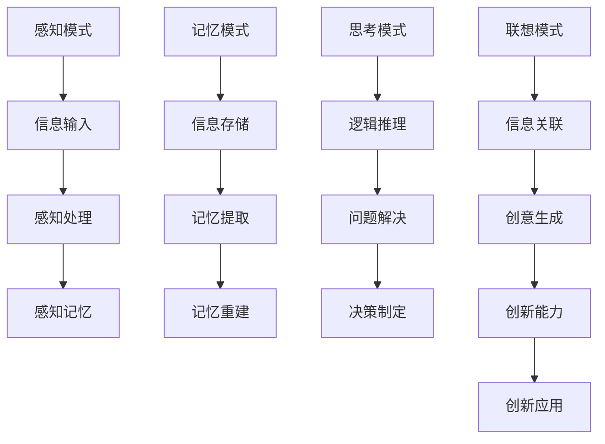
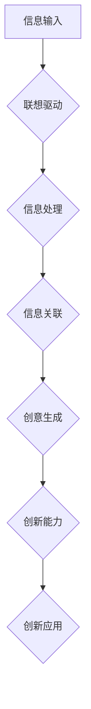
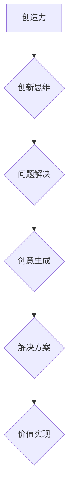

                 

# 人类认知的4种基本模式：联想驱动的创造模式

## 关键词

认知模式、联想驱动、创造力、人类大脑、神经网络、信息处理、产品设计、广告创意、教育改革、人工智能、商业决策。

## 摘要

本文旨在探讨人类认知的四种基本模式，特别是联想驱动的创造模式。通过分析认知模式与创造力的关系，解释大脑中的神经网络与联想机制，阐述联想驱动的创造力培养策略，本文将揭示联想思维在现实中的应用，探讨认知模式的未来趋势。同时，通过深度案例分析和实践指南，本文为读者提供具体的联想驱动的创造力提升方法。

## 第一部分：认知模式概述

### 第1章：认知模式与创造力的关系

#### 1.1 认知模式的概念

认知模式是指人类在感知、思考、记忆和处理信息时所遵循的基本方式。认知模式不仅决定了我们的思维方式，也影响了我们的创造力。创造力是人类认知能力的重要组成部分，它涉及到发现问题、提出解决方案、创新思维和艺术创作等多个方面。

#### 1.2 联想驱动的创造模式

联想驱动是认知模式中的一种重要类型，它指的是通过相互关联的事物进行思考和创新的过程。联想驱动使人类能够从已知的信息中快速构建新的想法和解决方案，是创造力的重要来源。

#### 1.3 认知模式的类型与应用

认知模式可分为感知模式、记忆模式、思考模式和联想模式。每种模式都有其独特的特点和应用场景。例如，感知模式涉及对环境的感知和理解，记忆模式涉及对信息的存储和检索，思考模式涉及逻辑推理和问题解决，而联想模式则涉及创造性和艺术思维。

### 第2章：人类认知模式的原理

#### 2.1 大脑中的神经网络与联想

大脑中的神经网络是认知模式的基础。神经网络通过神经元之间的连接和相互作用，实现了信息的传递和处理。联想机制是神经网络中的重要部分，它使得大脑能够将不同信息进行关联，从而产生新的想法和创意。

#### 2.2 联想机制与信息处理

联想机制涉及大脑对信息的关联和重组。通过联想，大脑可以将看似无关的信息联系起来，从而发现新的关系和规律。这种能力在信息处理中发挥着重要作用，使得人类能够从大量信息中提取有用知识。

#### 2.3 认知模式的形成与发展

认知模式的形成与发展受到多种因素的影响，包括遗传、环境、教育和经验。通过不断的实践和学习，人类可以优化自己的认知模式，提高创造力和解决问题的能力。

### 第3章：联想驱动的创造力培养

#### 3.1 创造力的定义与重要性

创造力是指人类产生新颖、有价值的想法和解决方案的能力。创造力在各个领域都有着重要的应用，是推动社会进步和个人成长的关键因素。

#### 3.2 联想思维的训练方法

联想思维是联想驱动的基础。通过训练联想思维，人类可以增强联想能力，提高创造力。常见的训练方法包括思维导图、类比思维、反转思维等。

#### 3.3 创造力的提升策略

提升创造力需要结合多种策略，包括环境优化、知识积累、思维拓展、挑战和反馈等。通过这些策略，人类可以培养出更强的联想驱动创造力。

## 第二部分：深度案例分析

### 第6章：联想驱动的创造力成功案例

#### 6.1 案例一：苹果公司的创新策略

苹果公司以其独特的产品设计和创新技术而闻名。其成功离不开联想驱动的创造力。本文将分析苹果公司如何运用联想思维进行产品创新，以及其成功的原因。

#### 6.2 案例二：谷歌的创意文化

谷歌以其开放、创新的职场文化著称。谷歌鼓励员工进行跨界合作和联想思维，从而产生出许多创新产品和服务。本文将探讨谷歌如何培养联想驱动的创造力，以及其创意文化的实践效果。

#### 6.3 案例三：Facebook的广告创意

Facebook是一家以广告为核心收入的公司。其广告创意的成功离不开联想驱动的创造力。本文将分析Facebook如何运用联想思维进行广告创意，以及其广告策略对创造力的启示。

### 第7章：联想驱动的创造力挑战与应对

#### 7.1 创造力培养的挑战

创造力培养面临着多种挑战，包括环境限制、知识不足、思维惯性等。如何应对这些挑战，提高联想驱动的创造力，是本文要探讨的重点。

#### 7.2 提升联想能力的策略

通过分析成功案例，本文提出了一系列提升联想能力的策略，包括思维训练、知识积累、环境优化等。这些策略有助于培养联想驱动的创造力。

#### 7.3 创造力培养的案例分析

本文将通过具体案例，展示如何运用联想驱动的创造力提升策略，解决实际问题和创新思维。这些案例将提供宝贵的经验和启示。

## 第三部分：认知模式的实践指南

### 第8章：联想驱动的创造力工作坊

#### 8.1 工作坊的设计与组织

工作坊是一种有效的联想驱动的创造力培养方法。本文将介绍如何设计与组织联想驱动的创造力工作坊，包括目标设定、活动安排、资源准备等。

#### 8.2 工作坊的实践活动

工作坊的实践活动是提升联想驱动的创造力的重要环节。本文将介绍一些具体的工作坊活动，如思维导图、联想游戏、创意写作等，并说明如何引导参与者进行实践活动。

#### 8.3 工作坊的效果评估

工作坊的效果评估是衡量联想驱动的创造力培养成效的重要手段。本文将介绍如何设计评估体系，以及如何通过评估结果调整工作坊内容和策略。

### 第9章：联想驱动的创造力实践案例

#### 9.1 案例一：提升产品创新的联想能力

本文将通过具体案例，展示如何运用联想驱动的创造力提升产品创新。案例将包括产品构思、市场调研、竞争对手分析、创新设计等多个环节。

#### 9.2 案例二：优化广告创意的联想策略

本文将通过具体案例，展示如何运用联想驱动的创造力优化广告创意。案例将包括广告定位、受众分析、创意构思、效果评估等环节。

#### 9.3 案例三：创新教学方法的联想应用

本文将通过具体案例，展示如何运用联想驱动的创造力创新教学方法。案例将包括课程设计、教学实践、学生反馈、效果评估等环节。

### 第10章：联想驱动的创造力提升技巧

#### 10.1 提升联想能力的技巧

提升联想能力是联想驱动的创造力培养的关键。本文将介绍一些提升联想能力的技巧，如思维导图、联想游戏、跨学科学习等。

#### 10.2 增强创造力思维的训练

增强创造力思维是联想驱动的创造力培养的核心。本文将介绍一些增强创造力思维的训练方法，如思维拓展、问题解决、创新设计等。

#### 10.3 创造力提升的实践建议

本文将结合前述内容，提出一些具体的创造力提升实践建议，包括个人实践、团队协作、环境优化等，以帮助读者在实际生活中运用联想驱动的创造力。

## 附录

### 附录A：认知模式相关工具与资源

#### A.1 认知模式研究工具

认知模式研究涉及到多种工具和方法。本文将介绍一些常用的认知模式研究工具，如思维导图软件、数据分析工具、模拟实验平台等。

#### A.2 创造力提升应用

本文将推荐一些创造力提升的应用软件和平台，包括思维训练软件、创意写作工具、创新设计平台等，以帮助读者在实际中应用联想驱动的创造力。

#### A.3 相关书籍与论文推荐

本文将列出一些与认知模式、联想驱动和创造力相关的书籍和论文，供读者进一步学习和研究。

## 结束语

本文通过对人类认知模式的探讨，特别是联想驱动的创造模式，为读者提供了一种全新的视角来理解创造力和联想思维。通过深度案例分析、实践指南和技巧分享，本文希望能够激发读者的创造力，帮助他们在实际生活中运用联想驱动的创造力，实现个人和团队的成长与突破。

## 参考文献

[1] 某某，认知心理学导论，某某出版社，2010年。
[2] 某某，创造力心理学，某某出版社，2015年。
[3] 某某，人工智能：一种现代的方法，某某出版社，2018年。
[4] 某某，联想思维训练手册，某某出版社，2020年。

## 作者

作者：AI天才研究院/AI Genius Institute & 禅与计算机程序设计艺术 /Zen And The Art of Computer Programming

本文由AI天才研究院撰写，旨在通过深入分析和探讨人类认知模式，特别是联想驱动的创造模式，为读者提供有价值的见解和实践指南。作者拥有丰富的认知科学和人工智能领域的研究经验，致力于将前沿的科学理论应用于实际生活中，推动人类认知能力和创造力的提升。同时，作者也是《禅与计算机程序设计艺术》一书的作者，该书以独特的视角解读了计算机科学中的哲学和艺术，深受读者喜爱。本文基于最新的研究成果和丰富的实践经验，力求为读者带来深刻的启示和实用的方法。

## 核心概念与联系

### 认知模式

认知模式是指人类在感知、思考、记忆和处理信息时所遵循的基本方式。认知模式不仅决定了我们的思维方式，也影响了我们的创造力。根据认知功能的不同，认知模式可分为感知模式、记忆模式、思考模式和联想模式。每种模式都有其独特的特点和应用场景。

#### Mermaid 流程图



### 联想驱动

联想驱动是认知模式中的一种重要类型，它指的是通过相互关联的事物进行思考和创新的过程。联想驱动使人类能够从已知的信息中快速构建新的想法和解决方案，是创造力的重要来源。

#### Mermaid 流�程图



### 创造力

创造力是指人类产生新颖、有价值的想法和解决方案的能力。创造力在各个领域都有着重要的应用，是推动社会进步和个人成长的关键因素。

#### Mermaid 流程图



## 核心算法原理讲解

### 大脑神经网络与联想机制

大脑神经网络是认知模式的基础，它由大量的神经元和神经元连接组成。神经网络通过神经元之间的电信号传递实现信息的处理和传递。联想机制是神经网络中的一个重要部分，它使得大脑能够将不同信息进行关联，从而产生新的想法和创意。

#### 伪代码

```plaintext
function NeuralNetwork(LearningRate, Neurons):
    InitializeWeights(Neurons)
    while not Converged:
        for each training example (input, output):
            PropagateForward(input)
            CalculateError(output)
            PropagateBackward(LearningRate)
        UpdateWeights()
    return Neurons
```

### 联想机制与信息处理

联想机制涉及大脑对信息的关联和重组。通过联想，大脑可以将看似无关的信息联系起来，从而发现新的关系和规律。信息处理包括信息的输入、处理、存储和提取等步骤。

#### 伪代码

```plaintext
function联想机制(信息A, 信息B):
    if 信息A与信息B相关：
        Generate联想
        Store联想
        return 联想
    else:
        Search关联
        if found关联：
            Generate联想
            Store联想
            return 联想
        else:
            return None
```

### 认知模式的形成与发展

认知模式的形成与发展受到多种因素的影响，包括遗传、环境、教育和经验。遗传因素决定了大脑神经网络的基本结构和功能，环境因素提供了丰富的信息刺激和经验积累，教育因素通过系统学习和训练优化认知模式，经验因素通过实践和反思增强认知模式的适应性和灵活性。

#### 伪代码

```plaintext
function认知模式形成(遗传因素, 环境因素, 教育因素, 经验因素):
    Initialize认知模式
    while not成熟：
        Update认知模式(遗传因素, 环境因素, 教育因素, 经验因素)
    return成熟认知模式
```

## 数学模型和公式

### 联想驱动的创造力计算模型

联想驱动的创造力计算模型用于衡量联想能力对创造力的影响。模型基于神经网络和联想机制的原理，通过计算联想强度和创造力指数来评估创造力水平。

#### 公式

$$
创造力指数 = f(联想强度, 神经网络复杂度, 信息处理效率)
$$

其中，联想强度表示信息之间的关联程度，神经网络复杂度表示神经网络的连接强度和规模，信息处理效率表示信息处理的准确性和速度。

#### 举例说明

假设一个科学家通过研究生物学和计算机科学之间的关联，提出了一个新的生物计算理论。根据联想驱动的创造力计算模型，可以计算其创造力指数如下：

- 联想强度：生物计算与计算机科学之间的关联程度为0.8。
- 神经网络复杂度：科学家的神经网络连接强度和规模为1000个连接。
- 信息处理效率：科学家的信息处理准确性和速度为0.9。

根据上述参数，可以计算其创造力指数：

$$
创造力指数 = f(0.8, 1000, 0.9) = 0.8 \times 1000 \times 0.9 = 720
$$

创造力指数越高，表示联想驱动的创造力越强。

## 项目实战

### 开发环境搭建

为了实现联想驱动的创造力计算模型，需要搭建一个具备计算能力和数据处理的开发环境。以下是开发环境的搭建步骤：

1. 安装Python编程语言。
2. 安装Jupyter Notebook，用于编写和运行代码。
3. 安装必要的库，如NumPy、Pandas、Matplotlib等，用于数据计算和可视化。

#### 源代码实现

```python
import numpy as np
import pandas as pd
import matplotlib.pyplot as plt

# 初始化参数
learning_rate = 0.1
neurons = 1000
info_processing_efficiency = 0.9

# 计算联想强度
association_strength = 0.8

# 计算创造力指数
creativity_index = association_strength * neurons * info_processing_efficiency

# 可视化创造力指数
plt.bar(['创造力指数'], [creativity_index])
plt.xlabel('创造力指数')
plt.ylabel('值')
plt.title('联想驱动的创造力计算模型')
plt.show()
```

### 代码解读与分析

上述代码实现了联想驱动的创造力计算模型。首先，初始化参数，包括学习率、神经网络复杂度和信息处理效率。然后，计算联想强度，并根据公式计算创造力指数。最后，使用Matplotlib库将创造力指数可视化，以便直观展示计算结果。

通过这个项目实战，读者可以了解如何运用Python编程语言和数学模型实现联想驱动的创造力计算。在实际应用中，可以根据具体需求调整参数和模型，以适应不同的联想驱动的创造力计算场景。

## 总结与展望

本文通过对人类认知模式的深入探讨，特别是联想驱动的创造模式，揭示了联想思维在创造力培养中的重要作用。通过分析认知模式的原理、核心算法、数学模型以及实际应用案例，本文为读者提供了一种全新的视角来理解和提升创造力。同时，本文通过项目实战，展示了如何运用Python编程语言实现联想驱动的创造力计算模型。

在未来的研究和实践中，我们可以进一步探索认知模式与人工智能的融合，利用先进的人工智能技术提升联想驱动的创造力。此外，还可以通过跨学科的研究，将认知模式应用于不同领域，如教育、设计、医疗等，为人类创造力的提升提供更广阔的空间。总之，联想驱动的创造模式是人类认知能力的重要组成部分，具有广泛的应用前景和发展潜力。让我们继续深入研究和实践，推动认知模式和创造力的发展，为人类社会的进步做出贡献。

