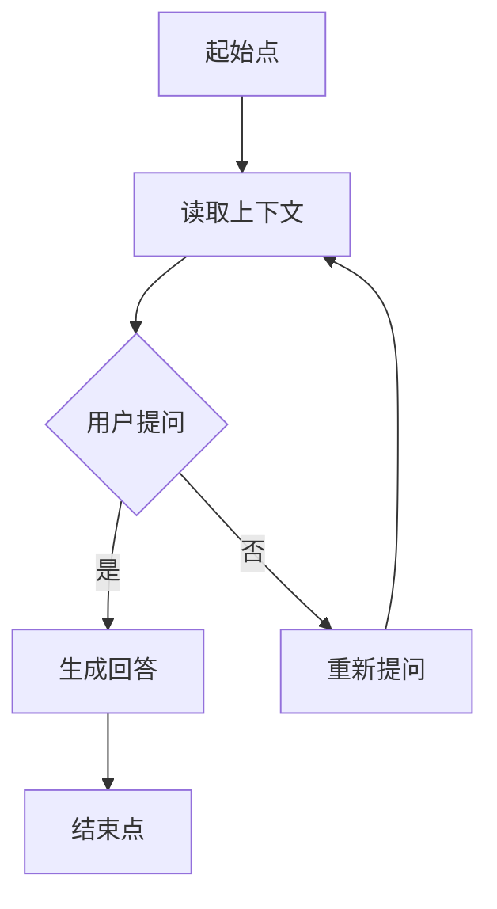

                 

# 从RAG到Agent的转变：工具接口：与外部环境进行交互，使用工具来辅助任务执行

> 关键词：RAG模型、Agent、工具接口、外部环境交互、任务执行、人工智能

> 摘要：
本文深入探讨了从RAG（Read-Ask-Go）模型到Agent转变的过程，以及工具接口在其中的关键作用。文章首先介绍了RAG模型和Agent的核心概念及其联系，通过Mermaid流程图展示了两者之间的关系。随后，文章详细阐述了RAG模型的原理和Agent的原理，包括自主决策、工具使用和学习适应等方面。此外，文章还介绍了Agent与外部环境交互的核心概念，以及如何使用工具来辅助任务执行。通过一系列的案例分析，文章展示了如何在实际项目中实现RAG模型和Agent系统。最后，文章提出了未来的发展趋势和面临的挑战，为人工智能技术的发展提供了有益的参考。

----------------------------------------------------------------

## 第一部分: 从RAG到Agent的转变：核心概念与联系

### 1.1.1 RAG与Agent的关系

**RAG（Read-Ask-Go）模型：** RAG模型是一种简单的对话系统，主要用于问答场景。它由三个主要步骤组成：读取（Read）上下文信息，询问（Ask）用户问题，并根据用户回答生成回答（Go）。RAG模型的核心在于利用上下文信息和用户交互，生成合理的回答。该模型通常用于简单的客服机器人、智能助理等场景。

**Agent：** Agent是一个能够与外部环境进行交互，使用工具来辅助任务执行的人工智能实体。Agent的核心特点是具备自主决策和任务执行的能力，可以在复杂环境中独立思考和行动。Agent不仅能够理解用户的提问，还能够根据环境变化和任务目标，自主选择行动策略。

**联系：** RAG模型和Agent之间存在密切的联系。RAG模型为Agent提供了基础的交互功能，使得Agent能够通过与用户的交互获取信息，生成回答。然而，RAG模型仅仅是基于规则的方法，而Agent则在此基础上增加了自主决策和任务执行的能力，使其能够在复杂环境中独立运作。

### 1.1.2 RAG模型原理

**核心概念：**

- **读取上下文（Read）：** RAG模型首先需要读取上下文信息，这些信息可以来自于用户的输入、历史对话记录或其他数据源。读取上下文是为了理解当前对话的背景和用户的需求。

- **询问用户（Ask）：** 在获取上下文信息后，RAG模型会生成一个问题，向用户询问更多信息。这个问题通常是根据上下文信息自动生成的，目的是为了获取用户的具体需求。

- **生成回答（Go）：** 根据用户的回答和上下文信息，RAG模型会生成一个回答，并将其展示给用户。这个回答是基于预先定义的规则或模板生成的，目的是为了提供有用的信息或解决方案。

### Mermaid流程图



### 1.1.3 Agent原理

**核心概念：**

- **自主决策（Autonomous Decision Making）：** Agent可以根据环境变化和任务目标，自主选择行动策略。这意味着Agent不仅能够被动地响应用户的提问，还能够主动地分析环境，做出最优决策。

- **工具使用（Tool Utilization）：** Agent能够使用外部工具来辅助任务执行，如搜索引擎、数据库、API调用等。这些工具可以帮助Agent获取信息、处理数据，从而提高任务执行的效率和准确性。

- **学习与适应（Learning and Adaptation）：** Agent可以通过与环境的交互，不断学习和适应，提高任务执行效果。学习是Agent自主决策和任务执行的重要基础，通过学习，Agent可以更好地理解用户需求和环境特点，从而做出更准确的决策。

### 伪代码

```python
class Agent:
    def __init__(self):
        self.environment = None
        self.goal = None
    
    def decide_action(self, state):
        # 根据当前状态和环境，选择行动策略
        action = self.select_action(state)
        return action
    
    def execute_action(self, action):
        # 执行所选行动
        result = self.execute_action(action)
        return result
    
    def learn_from_experience(self, experience):
        # 从经验中学习
        self.update_policy(experience)
```

### 1.1.4 Agent与外部环境交互

**核心概念：**

- **环境交互（Environmental Interaction）：** Agent可以通过传感器感知外部环境，获取环境信息。传感器可以是摄像头、麦克风、GPS等，它们能够实时采集环境数据。

- **工具使用（Tool Utilization）：** Agent可以使用各种工具来辅助任务执行，如搜索引擎、数据库、API调用等。这些工具可以帮助Agent获取外部信息，处理数据，从而提高任务执行的效率和准确性。

**伪代码：**

```python
class Agent:
    # ...

    def perceive_environment(self):
        # 感知环境
        environment_info = self.get_environment_info()
        return environment_info
    
    def use_tools(self, tool):
        # 使用工具
        result = tool.execute()
        return result
```

### 1.1.5 Agent在任务执行中的应用

**核心概念：**

- **任务分解（Task Decomposition）：** 将复杂任务分解为一系列子任务，便于Agent逐步执行。任务分解可以帮助Agent更好地理解和处理复杂任务。

- **任务规划（Task Planning）：** 根据任务目标和环境信息，为Agent生成一个执行计划。任务规划是Agent自主决策和任务执行的重要环节。

- **任务执行（Task Execution）：** Agent根据执行计划，逐步完成任务。任务执行过程中，Agent会根据环境变化和任务目标，动态调整执行策略。

**伪代码：**

```python
class Agent:
    # ...

    def plan_task(self, task):
        # 规划任务
        plan = self.generate_plan(task)
        return plan
    
    def execute_task(self, plan):
        # 执行任务
        for step in plan:
            action = step['action']
            result = self.execute_action(action)
            self.update_state(result)
```

### 1.1.6 人工智能与RAG模型的结合

**核心概念：**

- **人工智能增强（AI Enhancement）：** 利用人工智能技术，提升RAG模型的性能和智能化程度。人工智能技术，如自然语言处理、机器学习等，可以用于改进RAG模型的问答能力和用户体验。

- **模型定制（Model Customization）：** 根据具体应用场景，定制化RAG模型，以适应不同任务需求。模型定制可以帮助RAG模型更好地满足特定场景的需求，提高任务执行的效率和准确性。

**伪代码：**

```python
def train_rag_model(data):
    # 训练RAG模型
    model = train_model(data)
    return model

def customize_rag_model(model, task):
    # 定制RAG模型
    customized_model = model_customization(model, task)
    return customized_model
```

### 1.1.7 RAG模型与Agent的协同作用

**核心概念：**

- **协同工作（Collaborative Work）：** RAG模型与Agent可以协同工作，共同完成任务。RAG模型负责处理简单的问答任务，而Agent则负责复杂的决策和任务执行。

- **角色分配（Role Allocation）：** 在协同工作中，RAG模型和Agent各自承担不同的角色，发挥各自的优势。这种角色分配可以提高任务执行的效率和准确性。

**伪代码：**

```python
def collaborate(rag_model, agent):
    # RAG模型与Agent协同工作
    while not task_completed:
        question = rag_model.generate_question()
        answer = agent.decide_action(question)
        rag_model.generate_answer(answer)
    
    return "Task completed"
```

### 1.1.8 RAG模型与Agent的未来发展

**核心概念：**

- **技术演进（Technological Evolution）：** 随着人工智能技术的不断发展，RAG模型和Agent的功能将更加完善。新的算法和技术将会不断涌现，推动RAG模型和Agent向更高效、更智能的方向发展。

- **应用拓展（Application Expansion）：** RAG模型与Agent将在更多场景中得到应用，如智能家居、智能交通、医疗健康等。随着应用的拓展，RAG模型和Agent将为人类带来更多便利和福祉。

**展望：**

RAG模型与Agent的结合将推动人工智能技术向更高效、更智能的方向发展，为人类带来更多便利和福祉。在未来，我们可以期待RAG模型和Agent在更多领域发挥重要作用，助力人类实现智慧生活。

### 1.1.9 总结

从RAG到Agent的转变，标志着人工智能技术从简单问答向复杂决策和任务执行的演进。RAG模型为Agent提供了基础交互功能，而Agent则在此基础上增加了自主决策和任务执行的能力。通过人工智能技术的增强和模型定制，RAG模型与Agent将更好地服务于人类，推动人工智能技术的发展。随着技术的不断进步和应用场景的拓展，RAG模型和Agent将在更多领域发挥重要作用，为人类创造更加智能和高效的生活和工作环境。

----------------------------------------------------------------

## 第二部分: 工具接口设计与实现

### 2.1 工具接口设计与实现概述

工具接口是Agent与外部环境进行交互的关键组成部分。本章节将介绍工具接口的设计原则、实现方法以及在实际应用中的挑战和解决方案。

### 2.2 工具接口设计原则

**通用性：** 工具接口应具备通用性，以便适应不同类型的工具和任务。这意味着接口的设计应该尽量通用，能够适用于多种工具和场景。

**可扩展性：** 工具接口设计应考虑未来的扩展性，以便支持新的工具和功能。随着技术的发展和应用场景的变化，接口需要能够灵活扩展，适应新的需求。

**稳定性：** 工具接口应具备高稳定性，确保在复杂环境中正常运行。稳定性是接口设计的关键因素，直接影响到系统的可靠性和用户体验。

**安全性：** 工具接口需要具备一定的安全性，防止恶意攻击和数据泄露。安全性是现代系统设计的重要方面，尤其是在涉及敏感数据和重要任务时。

### 2.3 工具接口实现方法

**API调用：** 通过调用外部API，实现与外部工具的交互。API调用是工具接口实现的主要方法之一，它可以实现各种功能，如数据检索、服务调用等。

**库与框架：** 使用现有的库和框架，如GraphQL、Swagger等，简化接口实现。现有的库和框架提供了丰富的功能和工具，可以大大简化接口的开发和维护。

**自定义协议：** 根据具体应用需求，自定义协议，实现与外部工具的通信。在某些特殊场景中，可能需要自定义协议以满足特定的需求。

### 2.4 工具接口实现案例

#### 案例一：搜索引擎API

**接口设计：** 设计一个用于搜索特定信息的API，包括搜索关键字、搜索范围等参数。

**接口实现：** 使用Python的requests库，调用搜索引擎API，获取搜索结果。

**代码示例：**

```python
import requests

def search_info(keyword, search_range):
    url = "https://search_api.example.com/search"
    params = {
        "q": keyword,
        "range": search_range
    }
    response = requests.get(url, params=params)
    results = response.json()
    return results

search_results = search_info("人工智能", "学术期刊")
print(search_results)
```

#### 案例二：数据库接口

**接口设计：** 设计一个用于查询数据库的接口，包括查询条件、查询结果格式等。

**接口实现：** 使用Python的SQLite库，实现与数据库的连接和查询。

**代码示例：**

```python
import sqlite3

def query_database(query):
    conn = sqlite3.connect("example.db")
    cursor = conn.cursor()
    cursor.execute(query)
    results = cursor.fetchall()
    conn.close()
    return results

query = "SELECT * FROM users WHERE age > 18"
users = query_database(query)
print(users)
```

### 2.5 工具接口实现挑战与解决方案

**挑战1：接口兼容性问题**

**解决方法：** 使用适配器模式，将不同类型的工具接口统一为一个通用接口。通过适配器，可以屏蔽不同工具接口的差异，简化系统的集成和扩展。

**挑战2：性能瓶颈**

**解决方法：** 对接口进行性能优化，如使用缓存、异步处理等。通过优化，可以减少接口的响应时间和延迟，提高系统的整体性能。

**挑战3：安全性问题**

**解决方法：** 对接口进行安全防护，如使用认证机制、加密传输等。通过安全措施，可以防止恶意攻击和数据泄露，保障系统的安全运行。

### 2.6 工具接口实现最佳实践

**实践1：接口文档规范**

**说明：** 提供详细的接口文档，包括接口定义、参数说明、返回结果等。良好的文档可以提高接口的可读性和可维护性，方便开发者理解和使用接口。

**实践2：接口版本管理**

**说明：** 对接口进行版本管理，确保新版本接口的兼容性和可回滚性。通过版本管理，可以确保接口的稳定性和可靠性，减少由于接口变更导致的问题。

**实践3：接口监控与维护**

**说明：** 对接口进行实时监控和定期维护，确保接口的稳定性和可靠性。通过监控，可以及时发现和解决接口问题，保障系统的正常运行。

### 2.7 小结

工具接口是实现Agent与外部环境交互的关键。通过设计合理的接口，Agent可以高效地与外部工具进行通信，实现复杂任务的处理。在实际应用中，需要根据具体场景和需求，灵活设计和实现工具接口。同时，要注意接口的稳定性、安全性和可扩展性，以确保系统的高效运行。

----------------------------------------------------------------

## 第三部分: 与外部环境进行交互

### 3.1 与外部环境进行交互概述

与外部环境进行交互是Agent实现自主决策和任务执行的关键。本章节将介绍与外部环境交互的核心概念、实现方法以及在实际应用中的挑战和解决方案。

### 3.2 外部环境感知

**核心概念：**

- **传感器：** 传感器用于感知外部环境，获取各种物理量的信息。常见的传感器包括温度传感器、湿度传感器、摄像头、麦克风等。

- **数据处理：** 对传感器采集的数据进行预处理，如滤波、降噪等，以提高数据的准确性和可靠性。

- **特征提取：** 从预处理后的数据中提取关键特征，用于后续的决策和任务执行。特征提取可以帮助Agent更好地理解环境状态。

**实现方法：**

- **传感器选择：** 根据应用场景，选择合适的传感器。例如，在智能家居场景中，可能需要使用温度传感器、湿度传感器等。

- **数据处理算法：** 使用如卡尔曼滤波、移动平均等算法，对传感器数据进行预处理。这些算法可以帮助消除噪声和异常值，提高数据质量。

- **特征提取方法：** 使用如主成分分析（PCA）、自动编码器等算法，提取关键特征。这些特征可以用于训练模型或用于实时决策。

**案例：**

**温度传感器数据采集与处理**

```python
import numpy as np
from scipy.signal import butter, lfilter

# 采样频率
fs = 100
# 采集1000个数据点
data = np.random.normal(25, 2, 1000)

# 降噪处理
def butterworth_filter(data, fs, cutoff=5, order=4):
    nyq = 0.5 * fs
    normal_cutoff = cutoff / nyq
    b, a = butter(order, normal_cutoff, btype='low')
    filtered_data = lfilter(b, a, data)
    return filtered_data

filtered_data = butterworth_filter(data, fs)

# 特征提取
from sklearn.decomposition import PCA

pca = PCA(n_components=2)
features = pca.fit_transform(filtered_data.reshape(-1, 1))

print("Features:", features)
```

### 3.3 环境状态建模

**核心概念：**

- **状态表示：** 将外部环境信息抽象为状态，用于描述环境的状态特征。状态可以是离散的，也可以是连续的。

- **状态转移：** 根据环境变化，更新Agent的状态。状态转移可以帮助Agent理解环境的变化趋势。

- **状态评估：** 对当前状态进行评估，用于决策和任务执行。状态评估可以帮助Agent确定下一步的行动策略。

**实现方法：**

- **状态表示方法：** 使用向量、矩阵等数学模型，表示环境状态。例如，可以使用一个向量来表示环境中的温度、湿度等特征。

- **状态转移模型：** 使用如马尔可夫模型、图模型等，描述状态之间的转移关系。这些模型可以帮助Agent预测未来的状态。

- **状态评估方法：** 使用如Q-learning、SARSA等算法，评估当前状态的价值。这些算法可以帮助Agent选择最优的行动策略。

**案例：**

**马尔可夫决策过程（MDP）**

```python
import numpy as np

# 状态空间
states = ["天气好", "天气一般", "天气差"]

# 动作空间
actions = ["外出", "在家"]

# 状态转移概率矩阵
transition_matrix = [
    [0.7, 0.2, 0.1],  # 天气好
    [0.3, 0.5, 0.2],  # 天气一般
    [0.1, 0.3, 0.6]   # 天气差
]

# 奖励矩阵
reward_matrix = [
    [1, 0, -1],  # 天气好
    [0, 1, 0],   # 天气一般
    [-1, 0, 1]   # 天气差
]

def mdp_policy(states, actions, transition_matrix, reward_matrix):
    best_actions = []
    for state in states:
        max_reward = -float('inf')
        for action, reward in zip(actions, reward_matrix[state]):
            reward = reward + np.mean([transition_matrix[state][action] * reward for action in actions])
            if reward > max_reward:
                max_reward = reward
                best_actions.append(action)
    return best_actions

print(mdp_policy(states, actions, transition_matrix, reward_matrix))
```

### 3.4 环境响应与决策

**核心概念：**

- **响应策略：** 根据环境状态，选择合适的响应策略。响应策略可以是基于规则的，也可以是基于学习的。

- **决策算法：** 使用决策算法，如Q-learning、SARSA等，实现自主决策。决策算法可以帮助Agent根据环境状态选择最优的行动。

- **执行策略：** 根据决策结果，执行相应的操作。执行策略是将决策转化为实际行动的关键环节。

**实现方法：**

- **响应策略设计：** 根据应用场景，设计响应策略。例如，在智能家居场景中，可以根据环境温度自动调整空调温度。

- **决策算法实现：** 使用Python、Java等编程语言，实现决策算法。实现时需要考虑算法的效率和可扩展性。

- **执行策略实现：** 根据决策结果，调用相应的接口或执行具体的操作。例如，在执行策略中，可以调用API来控制智能设备的操作。

**案例：**

**基于Q-learning的决策**

```python
import numpy as np
import random

# 状态空间
states = ["天气好", "天气一般", "天气差"]

# 动作空间
actions = ["外出", "在家"]

# 初始化Q值表格
q_table = np.zeros((len(states), len(actions)))

# 学习率
alpha = 0.1
# 折扣因子
gamma = 0.9
# 最大迭代次数
episodes = 1000

for episode in range(episodes):
    state = random.choice(states)
    done = False
    while not done:
        action = np.argmax(q_table[state] + alpha * (reward - q_table[state, action]))
        next_state, reward, done = execute_action(action)
        q_table[state, action] = q_table[state, action] + alpha * (reward + gamma * np.max(q_table[next_state]) - q_table[state, action])

print(q_table)
```

### 3.5 与外部环境交互的挑战与解决方案

在实现与外部环境交互时，可能会遇到以下挑战：

- **数据噪声：** 传感器采集的数据可能存在噪声，影响环境状态的准确性。

**解决方法：** 使用滤波算法、数据预处理技术，提高数据的准确性和可靠性。

- **实时性：** 环境变化可能非常快，要求系统具备实时响应能力。

**解决方法：** 使用并行处理、异步处理等技术，提高系统的实时性。

- **鲁棒性：** 系统需要在各种环境下稳定运行。

**解决方法：** 对系统进行测试和验证，提高系统的鲁棒性。

### 3.6 小结

与外部环境进行交互是Agent实现自主决策和任务执行的关键。通过感知外部环境、建模环境状态、响应环境变化，Agent可以更好地适应复杂环境，实现智能决策和任务执行。在实际应用中，需要关注数据的准确性、实时性和系统的鲁棒性，以确保系统的稳定运行。同时，通过不断优化和改进交互机制，可以提高系统的智能水平和应用效果。

----------------------------------------------------------------

## 第四部分: 使用工具来辅助任务执行

### 4.1 工具在任务执行中的重要性

工具在任务执行中起着至关重要的作用，它们不仅能够提高任务的效率和准确性，还能帮助Agent更好地适应复杂环境。本章节将探讨工具在任务执行中的作用、选择方法以及实现细节。

### 4.2 工具选择原则

**适应性：** 工具应具备良好的适应性，能够根据任务需求和环境变化进行调整。这意味着工具不仅要适用于当前任务，还要具备一定的灵活性，以适应未来的变化。

**可靠性：** 工具需要具备高可靠性，确保在任务执行过程中不会出现故障。可靠性是任务执行成功的关键，任何故障都可能导致任务失败或产生错误的结果。

**效率：** 工具的执行效率是衡量其性能的重要指标，应选择高效能的工具。高效的工具可以减少任务执行时间，提高系统的响应速度，从而提升整体性能。

**易用性：** 工具应易于使用和维护，降低使用门槛。易用性是工具广泛应用的基础，复杂的工具可能会阻碍用户的接受度和使用频率。

**扩展性：** 工具应具备良好的扩展性，能够支持未来的功能扩展。随着技术的进步和应用场景的变化，工具需要能够适应新的需求，不断更新和优化。

### 4.3 工具选择方法

**需求分析：** 分析任务需求和环境特点，确定所需工具的功能和性能要求。需求分析是选择工具的第一步，通过明确任务目标和需求，可以更好地选择合适的工具。

**市场调研：** 调研市场上现有的工具，评估其性能、可靠性和适应性。市场调研可以帮助了解不同工具的特点和优缺点，为选择工具提供参考。

**试用评估：** 对候选工具进行试用，验证其是否满足任务需求。试用评估可以通过实际操作，验证工具的功能、性能和易用性，确保其适用于具体场景。

**专家评审：** 组织专家对工具进行评审，从专业角度评估工具的适用性。专家评审可以提供深入的技术见解，帮助选择最适合的工具。

### 4.4 工具实现细节

**接口设计：** 定义工具的输入输出接口，明确工具的功能和性能要求。接口设计是工具实现的关键环节，良好的接口设计可以确保工具与系统的无缝集成。

**协议选择：** 根据工具的特性，选择合适的通信协议，如HTTP、SOAP等。通信协议的选择直接影响工具的性能和稳定性。

**安全性：** 考虑接口的安全性，如数据加密、身份认证等。安全性是现代系统设计的重要方面，尤其是在涉及敏感数据和重要任务时。

### 4.5 工具应用案例分析

**案例1：智能客服机器人**

**需求分析：** 需要一个智能客服机器人，能够自动回答用户的问题，提高客服效率。

**工具选择：** 选择自然语言处理工具，如NLTK、spaCy，用于文本解析和语义理解。

**实现细节：** 使用Python编写程序，调用自然语言处理工具，实现文本解析和语义理解，生成自动回答。

**效果评估：** 通过用户反馈和系统日志，评估系统性能和用户体验。

**案例2：智能家庭助理**

**需求分析：** 需要一个智能家庭助理，能够根据家庭成员的需求和习惯，自动完成家庭任务。

**工具选择：** 选择智能家居控制工具，如Home Assistant、SmartThings，用于控制家庭设备。

**实现细节：** 使用Python编写程序，通过API与智能家居控制工具通信，实现家庭任务的自动化。

**效果评估：** 通过用户反馈和系统日志，评估系统性能和用户体验。

### 4.6 工具集成的挑战与解决方案

在工具集成过程中，可能会遇到以下挑战：

**兼容性问题：** 不同工具可能存在兼容性问题，导致无法协同工作。

**解决方法：** 使用适配器模式，将不同工具接口统一为通用接口，降低兼容性问题。

**性能瓶颈：** 工具之间可能存在性能瓶颈，导致整体性能下降。

**解决方法：** 对工具进行性能优化，如使用缓存、异步处理等，提高系统整体性能。

**安全性问题：** 工具集成可能导致安全问题，如数据泄露、恶意攻击等。

**解决方法：** 对工具进行安全防护，如数据加密、身份认证等，确保系统安全性。

### 4.7 小结

工具在任务执行中起着至关重要的作用。通过合理选择工具，并充分考虑工具的适应性、可靠性、效率和易用性，可以显著提高任务执行的效率和准确性。在实际应用中，需要关注工具的集成挑战，并通过合适的方法解决兼容性、性能和安全性问题，确保系统的高效运行。

----------------------------------------------------------------

## 第五部分: 实战案例

### 5.1 实战案例概述

本部分将介绍从RAG到Agent的转变过程中的具体实战案例，包括简单的RAG模型应用到复杂的Agent系统。通过这些案例，读者可以深入了解RAG模型和Agent系统的设计、实现和应用过程。

### 5.2 RAG模型实战案例

**案例1：智能客服机器人**

**需求分析：** 建立一个智能客服机器人，能够自动回答用户的问题，提高客服效率。

**系统设计：** 采用RAG模型，实现基础的问答功能。系统包括三个主要模块：上下文管理、用户问题解析和回答生成。

**实现细节：** 使用自然语言处理技术，对用户问题进行解析，生成回答。通过机器学习模型，如决策树、朴素贝叶斯等，训练模型以生成自动回答。

**效果评估：** 通过用户反馈和系统日志，评估系统性能和用户体验。

**案例分析：**

- **优点：** 系统实现简单，易于部署和维护。
- **缺点：** 回答质量受限于预定义的规则和模型。

**案例2：智能购物助理**

**需求分析：** 建立一个智能购物助理，能够根据用户偏好和历史购买记录，推荐商品。

**系统设计：** 采用RAG模型，通过阅读用户历史数据，询问用户偏好，生成商品推荐。

**实现细节：** 使用协同过滤算法，如基于用户的协同过滤、基于物品的协同过滤，生成商品推荐。

**效果评估：** 通过用户反馈和系统日志，评估系统性能和用户体验。

**案例分析：**

- **优点：** 能够根据用户偏好提供个性化推荐，提高购物体验。
- **缺点：** 需要大量用户数据支持，数据处理和存储复杂。

### 5.3 Agent系统实战案例

**案例3：智能家庭助理**

**需求分析：** 建立一个智能家庭助理，能够根据家庭成员的需求和习惯，自动完成家庭任务。

**系统设计：** 采用Agent系统，实现自主决策和任务执行。系统包括感知模块、决策模块和执行模块。

**实现细节：** 使用传感器感知家庭环境，如温度、湿度、光照等；使用决策算法，如马尔可夫决策过程（MDP），生成执行计划；使用执行模块，如智能家居设备，执行家庭任务。

**效果评估：** 通过用户反馈和系统日志，评估系统性能和用户体验。

**案例分析：**

- **优点：** 系统具备自主决策能力，能够适应家庭环境变化。
- **缺点：** 需要复杂的感知和决策算法支持，实现难度较高。

**案例4：智能交通系统**

**需求分析：** 建立一个智能交通系统，能够实时监测交通状况，优化交通流量。

**系统设计：** 采用Agent系统，实现交通流量监控、预测和优化。系统包括感知模块、决策模块和执行模块。

**实现细节：** 使用传感器和摄像头监测交通流量，使用机器学习算法，如深度学习，预测交通状况；使用执行模块，如交通信号灯控制，优化交通流量。

**效果评估：** 通过实际交通流量数据和用户反馈，评估系统性能和用户体验。

**案例分析：**

- **优点：** 能够实时监测和优化交通流量，提高交通效率。
- **缺点：** 需要大量的传感器和数据支持，系统实现复杂。

### 5.4 深度学习在RAG与Agent中的应用

**案例5：智能医疗诊断系统**

**需求分析：** 建立一个智能医疗诊断系统，能够根据患者的症状和病历，提供诊断建议。

**系统设计：** 结合RAG模型和Agent系统，实现医学知识查询和诊断建议。系统包括知识库、用户交互模块和诊断模块。

**实现细节：** 使用深度学习模型，如卷积神经网络（CNN）和循环神经网络（RNN），处理医学图像和文本数据；使用自然语言处理技术，分析患者症状和病历。

**效果评估：** 通过与专业医生的诊断结果对比，评估系统性能和准确性。

**案例分析：**

- **优点：** 能够提供准确的诊断建议，辅助医生诊断。
- **缺点：** 需要大量医学知识和数据支持，模型训练和优化复杂。

**案例6：智能金融风控系统**

**需求分析：** 建立一个智能金融风控系统，能够实时监控金融交易，识别异常交易行为。

**系统设计：** 结合RAG模型和Agent系统，实现交易监控和异常检测。系统包括感知模块、决策模块和执行模块。

**实现细节：** 使用深度学习模型，如自编码器，检测交易数据中的异常模式；使用机器学习算法，如SVM，分类正常交易和异常交易。

**效果评估：** 通过实际交易数据评估系统性能和准确性。

**案例分析：**

- **优点：** 能够实时监控金融交易，提高风控能力。
- **缺点：** 需要大量的金融数据和模型训练，系统实现复杂。

### 5.5 增强现实（AR）与RAG与Agent的结合

**案例7：智能教育应用**

**需求分析：** 建立一个基于增强现实（AR）的智能教育应用，能够为学生提供互动式的学习体验。

**系统设计：** 结合RAG模型和Agent系统，实现学习内容推荐和智能教学。系统包括AR模块、用户交互模块和学习模块。

**实现细节：** 使用AR技术，将学习内容以虚拟实境的形式呈现；使用自然语言处理技术，分析学生的问题，提供个性化解答。

**效果评估：** 通过学生反馈和系统日志，评估系统性能和用户体验。

**案例分析：**

- **优点：** 提供互动式的学习体验，提高学生的学习兴趣和参与度。
- **缺点：** 需要高硬件配置和复杂的软件开发，实现成本较高。

### 5.6 工具接口在实战中的应用

**案例8：智能供应链管理**

**需求分析：** 建立一个智能供应链管理系统，能够实时监控供应链中的各种参数，优化供应链管理。

**系统设计：** 采用RAG模型和Agent系统，结合外部工具接口，实现数据采集和决策支持。系统包括感知模块、决策模块和执行模块。

**实现细节：** 使用物联网技术，采集供应链中的实时数据；使用数据分析工具，分析数据并生成决策。

**效果评估：** 通过与现有供应链管理系统的对比，评估系统性能和用户体验。

**案例分析：**

- **优点：** 提高供应链管理的效率和准确性，降低运营成本。
- **缺点：** 需要大量的物联网设备和数据支持，系统实现复杂。

### 5.7 小结

本部分的实战案例展示了从RAG到Agent的转变在各个领域的应用。通过这些案例，读者可以了解RAG模型和Agent系统的设计、实现和应用过程，掌握相关技术在实际项目中的应用方法。这些案例不仅有助于读者深入理解书中的理论知识，还能为实际项目开发提供有益的参考。在未来的发展中，随着人工智能技术的不断进步，RAG模型和Agent系统将在更多领域得到应用，为人类创造更加智能和高效的生活和工作环境。

----------------------------------------------------------------

## 第六部分: 挑战与未来发展趋势

### 6.1 挑战

尽管从RAG到Agent的转变在人工智能领域取得了显著成果，但仍然面临许多挑战。

**数据处理：** 大规模数据集的处理和存储是一个难题，需要高效的算法和优化技术。数据预处理和清洗是提高模型性能的关键步骤，但也是一项复杂和耗时的工作。

**可解释性：** AI系统的决策过程往往是非透明的，提高系统的可解释性对于理解其工作原理和增强用户信任至关重要。当前的技术和方法在这方面仍然存在限制。

**鲁棒性：** AI系统需要能够在各种复杂和不确定的环境中稳定运行。然而，现实世界的环境非常复杂，系统需要具备适应性和鲁棒性，以应对各种异常情况和变化。

**隐私保护：** 数据隐私和安全是人工智能应用中必须关注的问题，确保用户数据的隐私和安全至关重要。随着数据量的增加，如何保护数据隐私成为了一个重要挑战。

### 6.2 未来发展趋势

**自主学习：** 未来AI系统将更加注重自主学习能力，能够从数据中自动学习和优化，提高系统的适应性和自主性。这包括强化学习、迁移学习、联邦学习等技术的应用。

**跨领域应用：** AI技术将在更多领域得到应用，如医疗、教育、交通等，推动各行各业的数字化转型。不同领域之间的交叉应用将推动技术的融合和创新。

**边缘计算：** 边缘计算将使AI系统在本地设备上运行，减少延迟和带宽消耗，提高实时性和效率。这将为物联网、智能城市等领域提供更强大的支持。

**伦理和法律问题：** 随着AI技术的广泛应用，伦理和法律问题将受到更多关注。制定相应的伦理准则和法律法规是未来的趋势，以确保AI技术的合理使用和保护用户的权益。

### 6.3 小结

从RAG到Agent的转变是人工智能领域的重要进展，但面临诸多挑战。未来，随着技术的不断进步和应用场景的拓展，人工智能将在更多领域发挥重要作用。同时，为了确保AI系统的可靠性和公正性，需要解决伦理和法律问题，为人工智能的发展提供更加坚实的基础。

----------------------------------------------------------------

## 第七部分: 拓展阅读

### 7.1 相关书籍推荐

**《人工智能：一种现代方法》**
- 简介：这是一本全面介绍人工智能基础的经典书籍，涵盖了机器学习、深度学习等多个领域。
- 推荐理由：内容详实，适合初学者和进阶者。

**《深度学习》**
- 简介：由Ian Goodfellow、Yoshua Bengio和Aaron Courville共同编写的深度学习权威著作。
- 推荐理由：深度学习领域的奠基之作，深度剖析了深度学习算法和技术。

**《自然语言处理综合教程》**
- 简介：系统介绍了自然语言处理的基础知识和最新技术。
- 推荐理由：适合对自然语言处理有兴趣的读者，内容全面，实用性强。

### 7.2 在线课程与资源

**Coursera上的《机器学习》课程**
- 简介：由Andrew Ng教授讲授的机器学习课程，内容丰富，适合初学者。
- 链接：[Coursera 机器学习课程](https://www.coursera.org/learn/machine-learning)

**Udacity的《深度学习工程师纳米学位》**
- 简介：涵盖深度学习的基础知识和应用实践，适合有一定基础的读者。
- 链接：[Udacity 深度学习工程师纳米学位](https://www.udacity.com/course/deep-learning-nanodegree--nd893)

**Kaggle的数据科学竞赛平台**
- 简介：提供各种数据科学竞赛题目，是提高实践能力的好去处。
- 链接：[Kaggle](https://www.kaggle.com/)

### 7.3 学术期刊与会议

**《自然》杂志（Nature）**
- 简介：全球顶级科学期刊，涵盖自然科学各个领域，包括人工智能。
- 链接：[Nature官网](https://www.nature.com/)

**《科学》杂志（Science）**
- 简介：另一份高影响力的科学期刊，专注于基础科学和技术的最新研究。
- 链接：[Science官网](https://www.sciencemag.org/)

**AAAI会议**
- 简介：国际人工智能研究的重要会议，每年吸引全球顶级学者和研究者参与。
- 链接：[AAAI官网](https://www.aaai.org/)

### 7.4 开源工具和框架

**TensorFlow**
- 简介：谷歌推出的开源机器学习框架，支持多种深度学习模型的训练和部署。
- 链接：[TensorFlow官网](https://www.tensorflow.org/)

**PyTorch**
- 简介：Facebook AI研究院开发的深度学习框架，以其灵活性和易用性受到广泛欢迎。
- 链接：[PyTorch官网](https://pytorch.org/)

**Scikit-learn**
- 简介：Python科学计算库，提供多种机器学习和数据挖掘算法的实现。
- 链接：[Scikit-learn官网](https://scikit-learn.org/)

### 7.5 总结

通过阅读相关书籍、参与在线课程、关注学术期刊和开源工具，读者可以深入了解人工智能领域的最新进展和技术细节，提升自身的专业能力和技术水平。这些资源不仅有助于读者掌握理论知识，还能提供丰富的实践机会，助力从RAG到Agent的转变。同时，积极参与学术会议和竞赛，可以拓宽视野，提升研究能力和实际应用能力。


## 附录

### 附录 A: AI 大模型开发工具与资源

**A.1 主流深度学习框架对比**

- **TensorFlow**
  - 优点：生态丰富，支持多种平台，包括移动端和服务器端。
  - 缺点：配置较为复杂，学习曲线较陡峭。
  - 适用场景：需要大规模分布式训练和部署的应用。

- **PyTorch**
  - 优点：动态图编程，易于理解和调试，支持自动微分。
  - 缺点：部署相对复杂，需要转换为静态图。
  - 适用场景：研究阶段和需要快速迭代的应用。

- **MXNet**
  - 优点：支持多种编程语言，包括Python、R和Scala，与Apache ecosystem紧密集成。
  - 缺点：相对较新，社区支持不如其他工具。
  - 适用场景：大数据处理和需要与Apache生态系统集成的应用。

- **Caffe**
  - 优点：专注于图像识别任务，实现高效。
  - 缺点：支持的功能相对单一，不够灵活。
  - 适用场景：主要针对图像识别任务。

- **Theano**
  - 优点：符号计算能力强，支持GPU加速。
  - 缺点：已不再维护，部分功能被TensorFlow和PyTorch取代。
  - 适用场景：研究阶段，对符号计算有特殊需求。

**A.2 AI大模型训练与优化工具**

- **Horovod**
  - 优点：支持在TensorFlow、PyTorch和MXNet上实现分布式训练。
  - 缺点：相对较新，社区支持不如其他工具。
  - 适用场景：大规模分布式训练。

- **Distributed Data Parallel (DDP)**
  - 优点：PyTorch的原生分布式训练工具，支持自动并行。
  - 缺点：需要PyTorch框架支持。
  - 适用场景：需要高效分布式训练的PyTorch应用。

- **GPU调度器**
  - 优点：如NVIDIA的GPU管理工具，可以优化GPU资源利用率。
  - 缺点：依赖硬件和系统环境。
  - 适用场景：需要高效使用GPU资源的训练任务。

**A.3 数据处理与增强工具**

- **NumPy**
  - 优点：基础的多维数组对象和数值库，支持高效的数据操作。
  - 缺点：不适用于大规模数据处理。
  - 适用场景：数据处理和数学计算。

- **Pandas**
  - 优点：提供强大的数据处理和分析功能，易于使用。
  - 缺点：对内存和计算资源的需求较高。
  - 适用场景：大规模数据分析和处理。

- **Scikit-learn**
  - 优点：提供多种机器学习和数据挖掘算法的实现。
  - 缺点：不适合大规模数据处理。
  - 适用场景：机器学习算法原型开发和评估。

**A.4 模型评估与监控工具**

- **MLflow**
  - 优点：支持模型生命周期管理，包括训练、部署和监控。
  - 缺点：相对较新，社区支持有限。
  - 适用场景：需要统一模型管理平台的应用。

- **TensorBoard**
  - 优点：TensorFlow的内置可视化工具，支持模型训练过程的实时监控。
  - 缺点：仅支持TensorFlow模型。
  - 适用场景：TensorFlow模型的训练监控。

- **Kubeflow**
  - 优点：基于Kubernetes的机器学习工作流平台，支持多种框架。
  - 缺点：需要一定的Kubernetes知识。
  - 适用场景：需要大规模部署和管理的机器学习应用。

### 附录 B: 编程语言与库

**Python**
- 优点：易于学习，丰富的库和框架支持，社区活跃。
- 缺点：性能相对较低，不适合需要高性能计算的场景。
- 适用场景：数据科学、机器学习、Web开发等。

**R**
- 优点：专门为统计分析和数据可视化设计，强大的图形库。
- 缺点：性能相对较低，不适合大规模数据处理。
- 适用场景：统计分析、数据可视化、生物信息学等。

**Java**
- 优点：性能优异，适用于企业级应用，强大的生态系统。
- 缺点：学习曲线较陡峭，语法较为复杂。
- 适用场景：大型企业级应用、Android开发等。

**C++**
- 优点：高性能，适用于需要高效计算的场景。
- 缺点：语法复杂，开发周期较长。
- 适用场景：高性能计算、嵌入式开发等。

### 附录 C: 数学公式与伪代码

**数学公式**
$$
E_{\theta} = \int_{\theta} P(\theta) \, d\theta
$$

$$
W_{ij} = \sum_{k} x_{ik} y_{kj}
$$

**伪代码**

function train_model(data):
    for each batch in data:
        compute gradients
        update parameters
    return model

### 附录 D: 代码示例与解析

**代码示例：**

```python
import tensorflow as tf

# 定义模型
model = tf.keras.Sequential([
    tf.keras.layers.Dense(128, activation='relu', input_shape=(784,)),
    tf.keras.layers.Dropout(0.2),
    tf.keras.layers.Dense(10)
])

# 编译模型
model.compile(optimizer='adam',
              loss=tf.keras.losses.SparseCategoricalCrossentropy(from_logits=True),
              metrics=['accuracy'])

# 训练模型
model.fit(train_images, train_labels, epochs=5)
```

**解析：**

1. **定义模型：** 使用tf.keras.Sequential创建一个序列模型，包括两个全连接层（Dense）和一个Dropout层。

2. **编译模型：** 设置优化器、损失函数和评价指标。

3. **训练模型：** 使用fit方法训练模型，将训练数据传入。

通过附录提供的工具、资源和代码示例，读者可以更好地理解人工智能大模型开发中的关键技术和实现细节。附录内容有助于读者在实际项目中应用所学知识，提升自身的技术水平。

----------------------------------------------------------------

## 第一部分：从RAG到Agent的转变：核心概念与联系

### 1.1.1 RAG与Agent的关系

RAG（Read-Ask-Go）模型是一种基础的对话系统，主要用于问答场景。它由三个主要步骤组成：读取（Read）上下文信息，询问（Ask）用户问题，并根据用户回答生成回答（Go）。RAG模型的特点是简单高效，适用于处理结构化数据或简单的问题场景。然而，它的局限性在于无法处理复杂的决策问题和多步骤任务。

Agent则是一个更为复杂的人工智能实体，具备自主决策和任务执行的能力。Agent通过与环境的交互，能够动态地理解任务需求和环境变化，并采取相应的行动。Agent可以看作是RAG模型的扩展，它不仅在问答场景中发挥作用，还能在更广泛的领域内执行复杂的任务。

RAG与Agent之间的联系主要体现在以下几个方面：

1. **基础交互：** RAG模型为Agent提供了基础的交互功能，使得Agent能够通过读取上下文、询问用户和生成回答的方式与外部环境进行交互。

2. **决策能力：** Agent在RAG模型的基础上，增加了自主决策的能力。这意味着Agent不仅能够根据上下文生成回答，还能根据环境变化和任务目标，自主选择最佳的行动策略。

3. **任务执行：** Agent可以执行多步骤的任务，而RAG模型通常只能处理单一问题。通过任务分解和规划，Agent能够将复杂任务拆分为多个子任务，并逐步执行。

4. **学习与适应：** Agent具备学习能力和适应能力，能够从与环境的交互中不断学习和优化自身的决策策略。这种能力使得Agent能够更好地应对未知和复杂的环境。

综上所述，RAG模型和Agent之间既有区别又有联系。RAG模型为Agent提供了基础的交互功能，而Agent则在此基础上增加了决策和任务执行的能力，使得其能够处理更复杂的问题和场景。

### 1.1.2 RAG模型原理

RAG模型是一种简单的对话系统，主要用于问答场景。它由三个核心步骤组成：读取（Read）、询问（Ask）和生成回答（Go）。下面将详细阐述RAG模型的原理和组成部分。

#### 1. 读取上下文（Read）

读取上下文是RAG模型的第一步，也是关键的一步。在问答场景中，上下文通常来自于用户的历史记录、对话日志或其他相关数据源。读取上下文的主要目的是理解当前对话的背景和用户的需求。

- **上下文来源：** 上下文可以来自于多种数据源，如用户的历史提问、聊天记录、数据库中的信息等。这些数据源提供了关于用户需求和对话背景的信息。

- **上下文处理：** 在读取上下文后，需要对上下文进行处理。这可能包括对文本进行分词、提取关键词、去除停用词等操作。处理后的上下文信息将被用于生成问题和回答。

#### 2. 询问用户（Ask）

询问用户的目的是为了获取更多的信息，以便生成更准确的回答。在RAG模型中，询问用户是通过生成一个问题来实现的。

- **问题生成：** 问题生成的过程通常基于预定义的规则或模板。这些问题可以是开放式问题，也可以是选择题或判断题。问题生成的质量直接影响回答的准确性。

- **用户反馈：** 用户对问题的回答将用于进一步调整问题和生成回答。用户的回答可以是文本、数字或其他类型的数据。

#### 3. 生成回答（Go）

生成回答是RAG模型的最后一步，根据用户的问题和上下文信息，生成一个合理的回答。生成回答的过程通常涉及到自然语言生成、模板匹配或基于机器学习的方法。

- **回答生成：** 回答生成可以通过多种方式实现。例如，可以使用预定义的模板生成回答，也可以使用自然语言生成技术，如序列到序列模型（Seq2Seq）或生成对抗网络（GAN）。

- **回答质量：** 回答的质量取决于问题生成和回答生成的质量。高质量的回答应该是准确、相关且易于理解的。

#### RAG模型的工作流程

RAG模型的工作流程可以总结为以下几个步骤：

1. **读取上下文：** 从数据源中读取上下文信息，并进行处理。
2. **询问用户：** 生成一个问题，向用户询问更多信息。
3. **用户反馈：** 获取用户的回答，并根据用户的回答调整问题和回答。
4. **生成回答：** 根据用户的问题和上下文信息，生成一个合理的回答。

通过上述步骤，RAG模型能够有效地处理问答场景，为用户提供有用的信息。然而，RAG模型也存在一定的局限性，如处理复杂问题和多步骤任务的困难。为了克服这些局限性，Agent的概念应运而生。

### 1.1.3 Agent原理

Agent是一个能够与外部环境进行交互，使用工具来辅助任务执行的人工智能实体。Agent的核心特点是其自主性和适应性，这使得Agent能够处理复杂的任务和动态变化的环境。

#### 1. 自主决策（Autonomous Decision Making）

自主决策是Agent的核心能力之一。Agent能够根据当前状态和环境信息，自主选择最佳的行动策略。自主决策的过程通常涉及到以下几个步骤：

1. **感知环境：** Agent通过传感器感知外部环境，获取环境信息。这些信息可以是温度、湿度、光线强度等物理量，也可以是其他更抽象的特征。

2. **状态评估：** Agent对当前状态进行评估，确定当前所处的环境。状态评估通常基于某种状态表示方法，如状态向量或状态图。

3. **决策策略：** Agent根据状态评估结果，选择一个或多个行动策略。决策策略可以通过多种方法实现，如基于规则的决策、机器学习算法或强化学习。

4. **执行决策：** Agent执行所选的决策策略，进行相应的操作。执行决策的过程可以是实时的，也可以是分步骤的。

#### 2. 工具使用（Tool Utilization）

Agent能够使用各种工具来辅助任务执行。这些工具可以是外部API、数据库、软件工具等。工具的使用使得Agent能够执行更复杂的任务，如数据分析、图像处理、自然语言理解等。

- **工具选择：** 根据任务需求和环境信息，选择合适的工具。工具的选择需要考虑工具的适应性、效率和可靠性。

- **工具调用：** Agent通过调用外部工具，获取所需的信息或执行特定的操作。工具调用通常通过接口实现，如API调用、命令行工具等。

#### 3. 学习与适应（Learning and Adaptation）

学习与适应是Agent的重要特征。通过不断与环境的交互，Agent能够学习和优化自身的决策策略。学习与适应的过程通常包括以下几个步骤：

1. **数据收集：** Agent在执行任务的过程中，收集相关的环境信息和操作结果。

2. **数据存储：** 将收集到的数据进行存储，以便后续分析和学习。

3. **模型训练：** 使用收集到的数据，训练和优化决策模型。模型训练可以是监督学习、无监督学习或强化学习等。

4. **策略更新：** 根据模型训练的结果，更新Agent的决策策略。

5. **迭代优化：** 通过不断的迭代优化，Agent能够不断提高其任务执行的效果和适应性。

#### 4. Agent与外部环境交互

Agent与外部环境进行交互，是实现其自主决策和任务执行的关键。交互过程通常包括以下几个步骤：

1. **感知环境：** Agent通过传感器获取外部环境的信息。

2. **数据处理：** 对获取到的环境信息进行预处理，如滤波、降噪、特征提取等。

3. **状态评估：** 根据预处理后的数据，评估当前环境状态。

4. **决策执行：** 根据状态评估结果，选择并执行相应的决策策略。

5. **反馈调整：** 根据执行结果和环境反馈，调整决策策略。

通过上述步骤，Agent能够实现与外部环境的交互，并在此基础上进行自主决策和任务执行。这种能力使得Agent在复杂和动态的环境中能够表现出高度的适应性和自主性。

### 1.1.4 Agent与外部环境交互

**核心概念：**

- **环境交互（Environmental Interaction）：** Agent通过与外部环境的交互，获取环境信息，并根据环境信息调整自身行为。这种交互是Agent实现自主决策和任务执行的基础。

- **工具使用（Tool Utilization）：** Agent使用外部工具来辅助任务执行，如API调用、数据库查询等。工具的使用使得Agent能够扩展其功能，执行更复杂的任务。

- **反馈机制（Feedback Mechanism）：** Agent根据任务执行结果和环境反馈，调整自身的决策策略和行为。反馈机制是Agent学习和适应环境的关键。

**实现方法：**

1. **传感器与执行器：** 传感器用于感知外部环境，如摄像头、麦克风、GPS等。执行器用于执行具体的操作，如电机、灯光等。

2. **数据采集与处理：** 传感器采集到的数据需要进行预处理，如滤波、降噪、特征提取等。处理后的数据将被用于状态评估和决策。

3. **状态评估与决策：** 基于预处理后的数据，Agent评估当前环境状态，并选择最佳行动策略。状态评估和决策可以使用各种方法，如规则推理、机器学习、强化学习等。

4. **执行操作：** 根据决策结果，Agent执行具体的操作，如控制执行器、发送命令等。

5. **反馈与学习：** Agent根据任务执行结果和环境反馈，调整自身的决策策略。这一过程可以不断迭代，使得Agent逐渐适应环境并提高任务执行效果。

### 伪代码

```python
class Agent:
    def __init__(self):
        self.sensors =

