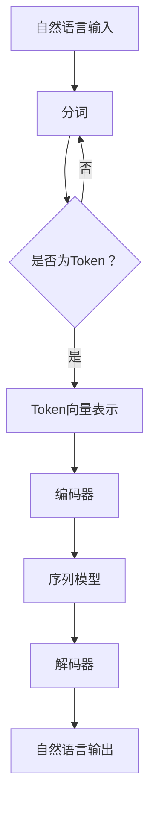

                 

### 文章标题

从Token到自然语言的解码过程

---

#### 关键词

Token、自然语言处理、神经网络、深度学习、编码器、解码器、序列到序列模型、注意力机制、BERT模型、项目实战

---

#### 摘要

本文将深入探讨从Token到自然语言的解码过程。首先，我们将介绍自然语言处理的基础概念，特别是Token的定义与作用。随后，我们将详细讲解神经网络与深度学习的基本原理，以及常见的神经网络模型。接下来，我们将逐步解析Token到自然语言的解码过程，包括Token向量表示、编码器与解码器架构、序列到序列模型、注意力机制与BERT模型等。此外，我们还将讨论解码过程的优化与调整方法，并通过实际项目实战展示整个解码过程的实现。最后，我们将总结常用工具与资源，以供读者进一步学习和实践。

---

### 《从Token到自然语言的解码过程》目录大纲

#### 第一部分：基础概念与原理

##### 第1章：自然语言处理与Token

1.1 自然语言处理概述

1.2 Token的定义与作用

1.3 Token的类型与转换

##### 第2章：神经网络与深度学习基础

2.1 神经网络的基本结构

2.2 深度学习与神经网络的关系

2.3 常见的神经网络模型

#### 第二部分：Token到自然语言的解码过程

##### 第3章：从Token到向量表示

3.1 词嵌入技术

3.2 字符嵌入技术

3.3 Token向量的聚合方法

##### 第4章：编码器与解码器架构

4.1 编码器的工作原理

4.2 解码器的工作原理

4.3 编码器与解码器的协作

##### 第5章：序列到序列模型

5.1 序列模型的基本原理

5.2 序列到序列模型的工作流程

5.3 常见的序列到序列模型

##### 第6章：注意力机制与BERT模型

6.1 注意力机制的基本原理

6.2 BERT模型的结构与训练

6.3 BERT模型的应用场景

##### 第7章：解码过程的优化与调整

7.1 解码过程的优化方法

7.2 解码结果的评估与调整

7.3 实际解码过程的案例分析

#### 第三部分：项目实战

##### 第8章：从Token到自然语言的解码项目

8.1 项目介绍

8.2 项目环境搭建

8.3 源代码实现

8.4 代码解读与分析

##### 第9章：实战案例解析

9.1 案例一：文本分类

9.2 案例二：机器翻译

9.3 案例三：问答系统

#### 附录

##### 附录A：常用工具与资源

A.1 常用自然语言处理工具

A.2 常用深度学习框架

A.3 常见数据集介绍

A.4 学习资源推荐

### Mermaid 流程图



---

## 第一部分：基础概念与原理

### 第1章：自然语言处理与Token

#### 1.1 自然语言处理概述

自然语言处理（Natural Language Processing，简称NLP）是计算机科学和人工智能领域的一个重要分支，旨在让计算机理解和处理人类语言。NLP的研究目标包括语言识别、语义理解、语言生成、语言翻译等。NLP在多个领域都有广泛应用，如智能客服、机器翻译、文本分类、情感分析等。

自然语言处理的核心任务之一是对自然语言文本进行分词（Tokenization）。分词是将一段连续的文本分割成一组有意义的单词或短语的过程。分词对于NLP任务至关重要，因为它有助于将无结构的文本数据转换为计算机可以处理的结构化数据。

#### 1.2 Token的定义与作用

Token是自然语言处理中的一个基本单位，通常指的是文本中的单词、短语或符号。Token可以是一个单词（如“apple”）、一个短语（如“the quick brown fox”）或一个符号（如“！”）。分词过程中产生的Token有助于NLP系统更好地理解文本内容，因为它们可以作为特征输入到各种NLP模型中。

Token在自然语言处理中的作用主要体现在以下几个方面：

1. **特征提取**：Token作为特征输入到NLP模型中，有助于模型捕捉文本的语义信息。
2. **词性标注**：Token有助于进行词性标注，即将单词标注为名词、动词、形容词等。
3. **语法分析**：Token是进行语法分析的基础，有助于构建句子的语法结构。
4. **语义理解**：通过Token，NLP模型可以更好地理解文本的语义，从而进行情感分析、文本分类等任务。

#### 1.3 Token的类型与转换

在实际应用中，Token可以分为以下几种类型：

1. **单词Token**：最常见的一种Token类型，指文本中的单词。例如，“apple”是一个单词Token。
2. **短语Token**：指由一组单词组成的短语，如“the quick brown fox”是一个短语Token。
3. **符号Token**：指文本中的符号或标点，如“！”和“？”是符号Token。
4. **字符Token**：指文本中的单个字符，如“a”是一个字符Token。

在不同的NLP任务中，可能需要使用不同类型的Token。例如，在文本分类任务中，通常使用单词Token；而在情感分析任务中，可能需要同时使用单词Token和符号Token。

Token之间的转换也是NLP中的一个重要环节。例如，在分词过程中，我们将连续的文本转换为单词Token；在词性标注过程中，我们将单词Token转换为对应的词性；在语法分析过程中，我们将单词Token转换为句子的语法结构。这些转换有助于NLP系统更好地理解和处理自然语言文本。

### 第2章：神经网络与深度学习基础

#### 2.1 神经网络的基本结构

神经网络（Neural Network，简称NN）是模仿生物神经系统的计算模型，由大量的神经元（节点）组成。这些神经元通过加权连接形成网络结构，用于处理和传递信息。神经网络的基本结构包括输入层、隐藏层和输出层。

1. **输入层**：输入层是神经网络的第一个层次，负责接收输入数据。每个输入节点对应输入数据的一个特征。
2. **隐藏层**：隐藏层位于输入层和输出层之间，是神经网络的核心部分。隐藏层中的每个神经元通过计算输入节点和隐藏层中其他神经元的加权求和，并应用一个非线性激活函数，产生新的特征表示。
3. **输出层**：输出层是神经网络的最后一个层次，负责生成最终的输出。输出层中的每个神经元对应一个输出类别或值。

神经网络的计算过程可以概括为以下步骤：

1. 输入数据通过输入层传递到隐藏层。
2. 隐藏层中的每个神经元计算输入节点和加权连接的加权和，并应用非线性激活函数。
3. 隐藏层的结果作为新的特征传递到输出层。
4. 输出层计算最终的输出结果，如类别概率或数值预测。

#### 2.2 深度学习与神经网络的关系

深度学习（Deep Learning，简称DL）是一种基于神经网络的机器学习技术，通过多层的神经网络结构来学习复杂的特征表示。深度学习与神经网络的区别在于：

1. **层次结构**：深度学习中的神经网络具有多个隐藏层，而传统的神经网络通常只有一个或几个隐藏层。
2. **特征学习**：深度学习通过多层的神经网络结构自动学习数据的低级到高级的特征表示，而传统的神经网络通常需要手动设计特征。
3. **模型性能**：深度学习模型在处理大规模数据和复杂任务时具有更高的性能。

深度学习在NLP领域取得了显著的成果，如文本分类、机器翻译、语音识别等。深度学习模型的代表性算法包括卷积神经网络（CNN）、循环神经网络（RNN）和变换器（Transformer）等。

#### 2.3 常见的神经网络模型

在NLP领域，常见的神经网络模型包括以下几种：

1. **卷积神经网络（CNN）**：CNN是一种基于卷积运算的神经网络，主要用于图像识别和文本分类任务。CNN通过卷积层提取图像或文本的局部特征，并通过池化层减少数据维度。在NLP任务中，CNN可以用于文本分类、情感分析等。
2. **循环神经网络（RNN）**：RNN是一种基于循环结构的神经网络，能够处理序列数据。RNN通过隐藏状态存储序列中的历史信息，并用于预测序列中的下一个元素。RNN在文本生成、机器翻译等任务中具有广泛应用。
3. **长短时记忆网络（LSTM）**：LSTM是RNN的一种改进模型，能够有效解决长序列依赖问题。LSTM通过引入记忆单元和门控机制，能够更好地记忆和传递序列中的长期依赖信息。LSTM在机器翻译、语音识别等任务中表现出色。
4. **变换器（Transformer）**：Transformer是近年来在NLP领域取得突破性成果的模型，基于自注意力机制实现。Transformer通过多头自注意力机制和前馈神经网络，能够捕捉序列中的全局依赖关系，并在机器翻译、问答系统等任务中取得优异的性能。

这些神经网络模型为NLP任务提供了强大的计算能力，使得计算机能够更好地理解和处理自然语言文本。

## 第二部分：Token到自然语言的解码过程

### 第3章：从Token到向量表示

#### 3.1 词嵌入技术

词嵌入（Word Embedding）是将单词映射为低维向量的技术，使得具有相似意义的单词在向量空间中彼此接近。词嵌入技术是自然语言处理中的重要环节，有助于将无结构的文本数据转换为计算机可以处理的结构化数据。

词嵌入技术可以分为基于统计的方法和基于神经网络的深度学习方法。

1. **基于统计的方法**：基于统计的方法通过计算单词之间的相似性或相关性来确定词嵌入。常见的基于统计的方法包括：

   - **Count-based方法**：如TF-IDF（Term Frequency-Inverse Document Frequency），通过计算单词在文档中的频率和文档集合中的逆文档频率来衡量单词的重要性。
   - **Word2Vec**：Word2Vec是一种基于神经网络的方法，通过训练一个神经网络模型来学习单词的向量表示。Word2Vec包括两种主要模型：Continuous Bag-of-Words（CBOW）和Skip-Gram。

2. **基于神经网络的深度学习方法**：基于神经网络的深度学习方法通过多层神经网络结构自动学习单词的向量表示。常见的基于深度学习的方法包括：

   - **GloVe（Global Vectors for Word Representation）**：GloVe是一种基于全局统计信息的词嵌入方法，通过计算单词的共现矩阵来学习单词的向量表示。
   - **BERT（Bidirectional Encoder Representations from Transformers）**：BERT是一种基于变换器的预训练方法，通过预训练大规模语料库来学习单词的向量表示。

词嵌入技术的应用包括：

1. **文本分类**：词嵌入技术可以帮助模型更好地捕捉文本的语义信息，从而提高文本分类的准确率。
2. **机器翻译**：词嵌入技术可以将源语言和目标语言的单词映射到相同的向量空间，从而简化机器翻译任务。
3. **情感分析**：词嵌入技术可以帮助模型识别和区分文本中的情感倾向。

#### 3.2 字符嵌入技术

字符嵌入（Character Embedding）是将文本中的单个字符映射为低维向量的技术。字符嵌入技术可以捕获单词中的内部结构和语法信息，从而有助于提高自然语言处理任务的效果。

字符嵌入技术通常应用于以下场景：

1. **词形还原**：字符嵌入技术可以帮助模型识别单词中的拼写错误或变形，从而进行词形还原。
2. **语法分析**：字符嵌入技术可以用于分析单词的语法结构，如词性标注和句法分析。
3. **文本生成**：字符嵌入技术可以帮助模型生成符合语法规则和语义逻辑的文本。

常见的字符嵌入方法包括：

1. **One-Hot编码**：将每个字符映射为一个高维向量，其中每个维度对应一个字符。这种方法简单但计算成本高。
2. **字符CNN**：使用卷积神经网络对字符序列进行建模，通过卷积操作提取字符序列的特征。
3. **字符RNN**：使用循环神经网络对字符序列进行建模，通过隐藏状态存储字符序列的历史信息。

#### 3.3 Token向量的聚合方法

在自然语言处理任务中，Token向量的聚合方法是将多个Token向量合并为一个单一的特征向量，以便输入到神经网络模型中。常见的Token向量聚合方法包括以下几种：

1. **平均聚合**：将所有Token的向量进行平均，得到一个统一的特征向量。这种方法简单但可能丢失部分重要信息。
2. **最大聚合**：选择所有Token向量中的最大值，得到一个统一的特征向量。这种方法适用于强调最突出Token的场景。
3. **最小聚合**：选择所有Token向量中的最小值，得到一个统一的特征向量。这种方法适用于强调最不显著Token的场景。
4. **加权聚合**：根据Token的重要程度对每个Token的向量进行加权，然后进行聚合。这种方法可以根据需要调整Token的贡献度。

在实际应用中，可以选择适当的Token向量聚合方法，以适应不同的NLP任务和场景。例如，在文本分类任务中，可以采用平均聚合方法，以综合所有Token的语义信息；在情感分析任务中，可以采用最大聚合方法，以强调具有显著情感的Token。

### 第4章：编码器与解码器架构

#### 4.1 编码器的工作原理

编码器（Encoder）是序列到序列模型（Seq2Seq）中的一个核心组件，用于将输入序列编码为一个固定长度的向量表示，这一向量包含了输入序列中的所有信息。编码器的输出通常被称为“编码隐藏状态”或“编码器输出”。

编码器的工作原理可以分为以下几个步骤：

1. **输入序列处理**：编码器首先接收输入序列，该序列由一系列Token组成。每个Token会被映射为一个向量，这些向量随后被输入到编码器的第一个隐藏层。
2. **隐藏状态计算**：编码器通过循环神经网络（如RNN或LSTM）处理输入序列。在每个时间步，编码器会计算一个隐藏状态向量，该向量包含了当前Token的信息以及之前隐藏状态的信息。
3. **编码隐藏状态**：在处理完整个输入序列后，编码器输出一个固定长度的编码隐藏状态向量。这个向量包含了输入序列中的所有信息，是后续解码器输入的重要基础。

编码器的设计取决于具体的应用场景和任务需求。例如，在机器翻译任务中，编码器需要能够捕捉源语言句子的语法和语义信息，以便在解码器中生成目标语言的句子。

#### 4.2 解码器的工作原理

解码器（Decoder）是序列到序列模型（Seq2Seq）中的另一个核心组件，用于将编码器的输出转换为输出序列。解码器的目标是根据编码器的输出和当前解码器的输出，预测下一个单词或符号。

解码器的工作原理可以分为以下几个步骤：

1. **初始化解码器状态**：在解码器的初始化阶段，会根据编码器的输出创建一个初始隐藏状态。这个隐藏状态通常是编码器的最后一个隐藏状态，也可以通过其他方法生成。
2. **生成输出序列**：解码器使用生成算法（如贪心算法、Beam Search算法等）来生成输出序列。在每个时间步，解码器根据当前隐藏状态和已生成的部分输出序列，预测下一个单词或符号。
3. **更新解码器状态**：在生成每个单词或符号后，解码器会更新隐藏状态，以便在下一次预测时考虑新的信息。

解码器的设计与编码器类似，也需要考虑具体的应用场景和任务需求。例如，在机器翻译任务中，解码器需要能够根据编码器输出的编码隐藏状态，生成与源语言句子相对应的目标语言句子。

#### 4.3 编码器与解码器的协作

编码器与解码器在序列到序列模型中紧密协作，共同实现序列的转换。编码器负责将输入序列编码为一个固定长度的向量表示，而解码器则根据这个向量表示生成输出序列。

编码器与解码器的协作过程可以分为以下几个步骤：

1. **编码器处理输入序列**：编码器从左到右处理输入序列，并在每个时间步计算一个隐藏状态向量。编码器在处理完整个输入序列后，输出一个编码隐藏状态向量。
2. **解码器初始化**：解码器根据编码器的输出初始化隐藏状态，通常使用编码器的最后一个隐藏状态作为初始隐藏状态。
3. **解码器生成输出序列**：解码器从左到右生成输出序列，在每个时间步根据当前隐藏状态和已生成的部分输出序列，预测下一个单词或符号。解码器会不断更新隐藏状态，以便在下一次预测时考虑新的信息。
4. **输出序列完成**：解码器在生成完整输出序列后，停止生成过程。输出序列可以作为模型的最终输出，如目标语言句子或文本分类结果。

编码器与解码器的协作是序列到序列模型实现序列转换的关键，通过这种方式，模型能够处理不同长度的序列，并在生成过程中捕捉序列中的时间依赖关系。

### 第5章：序列到序列模型

#### 5.1 序列模型的基本原理

序列模型（Sequence Model）是一类用于处理序列数据的神经网络模型，能够捕捉序列中的时间依赖关系。序列模型在自然语言处理领域具有广泛的应用，如机器翻译、文本生成、语音识别等。常见的序列模型包括循环神经网络（RNN）和长短时记忆网络（LSTM）。

序列模型的基本原理可以分为以下几个步骤：

1. **输入序列处理**：序列模型首先接收一个输入序列，该序列由一系列Token组成。每个Token会被映射为一个向量，这些向量随后被输入到序列模型的第一个隐藏层。
2. **隐藏状态计算**：序列模型通过循环结构处理输入序列。在每个时间步，模型会计算一个隐藏状态向量，该向量包含了当前Token的信息以及之前隐藏状态的信息。
3. **序列建模**：序列模型通过隐藏状态向量构建一个序列表示，这个表示包含了输入序列中的所有信息。隐藏状态向量可以作为后续解码器的输入，或用于生成输出序列。
4. **输出序列生成**：在序列建模完成后，模型会生成一个输出序列。输出序列可以是预测的目标序列，也可以是分类结果或其他形式的输出。

序列模型的基本原理使其能够捕捉序列中的时间依赖关系，从而在自然语言处理任务中取得良好的效果。

#### 5.2 序列到序列模型的工作流程

序列到序列模型（Seq2Seq Model）是一种用于将一个序列映射为另一个序列的神经网络模型，广泛应用于机器翻译、语音识别、文本生成等任务。序列到序列模型的工作流程可以分为以下几个步骤：

1. **输入序列处理**：序列到序列模型首先接收一个输入序列，该序列由一系列Token组成。每个Token会被映射为一个向量，这些向量随后被输入到编码器的第一个隐藏层。
2. **编码器处理输入序列**：编码器从左到右处理输入序列，并在每个时间步计算一个隐藏状态向量。编码器在处理完整个输入序列后，输出一个编码隐藏状态向量，这个向量包含了输入序列的所有信息。
3. **解码器初始化**：解码器根据编码器的输出初始化隐藏状态，通常使用编码器的最后一个隐藏状态作为初始隐藏状态。
4. **解码器生成输出序列**：解码器使用生成算法（如贪心算法、Beam Search算法等）从左到右生成输出序列。在每个时间步，解码器根据当前隐藏状态和已生成的部分输出序列，预测下一个单词或符号。解码器会不断更新隐藏状态，以便在下一次预测时考虑新的信息。
5. **输出序列完成**：解码器在生成完整输出序列后，停止生成过程。输出序列可以作为模型的最终输出，如目标语言句子或文本分类结果。

序列到序列模型的工作流程使其能够处理不同长度的序列，并在生成过程中捕捉序列中的时间依赖关系。

#### 5.3 常见的序列到序列模型

在自然语言处理领域，常见的序列到序列模型包括以下几种：

1. **循环神经网络（RNN）**：循环神经网络是一种基于循环结构的神经网络，能够处理序列数据。RNN通过隐藏状态存储序列中的历史信息，并用于预测序列中的下一个元素。RNN在处理短序列任务时表现良好，但在处理长序列任务时容易受到梯度消失和梯度爆炸问题的影响。
2. **长短时记忆网络（LSTM）**：长短时记忆网络是RNN的一种改进模型，通过引入记忆单元和门控机制，能够有效解决长序列依赖问题。LSTM通过记忆单元存储长期依赖信息，并通过门控机制控制信息的流入和流出。LSTM在处理长序列任务时表现出色，并在多个自然语言处理任务中取得良好效果。
3. **门控循环单元（GRU）**：门控循环单元是LSTM的另一种改进模型，通过简化记忆单元和门控机制，使得模型结构更加简洁。GRU在处理长序列任务时表现出良好的性能，并且在计算效率方面优于LSTM。
4. **变换器（Transformer）**：变换器是一种基于自注意力机制的序列模型，通过多头自注意力机制和前馈神经网络，能够捕捉序列中的全局依赖关系。Transformer在机器翻译、文本生成等任务中取得了突破性的成果，并在多个自然语言处理任务中表现出优异的性能。

这些序列到序列模型在不同的应用场景和任务中具有各自的优势和特点，可以根据具体需求选择合适的模型。

### 第6章：注意力机制与BERT模型

#### 6.1 注意力机制的基本原理

注意力机制（Attention Mechanism）是深度学习领域中用于处理序列数据的一种关键技术，能够使模型在处理序列数据时关注关键信息。注意力机制通过为每个序列元素分配不同的权重，使模型能够聚焦于重要的部分，从而提高模型的性能和效果。

注意力机制的基本原理可以分为以下几个步骤：

1. **计算注意力得分**：首先，模型会计算输入序列中每个元素与当前隐藏状态之间的相似度或相关性，得到一个注意力得分。注意力得分通常通过一个点积操作或更复杂的函数计算。
2. **加权求和**：然后，模型会根据注意力得分对输入序列进行加权求和，生成一个新的隐藏状态。这个新的隐藏状态包含了输入序列中所有元素的信息，但更强调关键信息。
3. **输出生成**：最后，模型会使用这个加权求和的隐藏状态生成输出序列或结果。通过这种方式，注意力机制能够使模型在处理序列数据时关注关键信息，从而提高模型的性能。

注意力机制在自然语言处理领域中得到了广泛应用，如机器翻译、文本生成、文本分类等。常见的注意力机制包括点积注意力、多头注意力等。

#### 6.2 BERT模型的结构与训练

BERT（Bidirectional Encoder Representations from Transformers）是一种基于变换器的预训练模型，旨在学习双向的语言表示。BERT通过在大规模语料库上进行预训练，然后针对具体任务进行微调，从而在多个自然语言处理任务中取得优异的性能。

BERT模型的结构可以分为以下几个部分：

1. **输入层**：BERT模型的输入是一个单词序列，每个单词会被映射为一个词嵌入向量。此外，模型还会接收一个特殊的[CLS]标记和[SEP]分隔符，用于表示句子和段落的开始和结束。
2. **变换器层**：BERT模型的核心是一个多层变换器（Transformer）结构，包括多头自注意力机制和前馈神经网络。变换器层负责对输入序列进行处理，提取序列中的特征表示。
3. **输出层**：BERT模型的输出是一个固定长度的向量，表示整个句子的特征。这个向量可以用于下游任务，如文本分类、问答系统等。

BERT模型的训练过程可以分为以下几个步骤：

1. **预训练**：BERT模型首先在大规模语料库上进行预训练。预训练任务包括两个子任务：Masked Language Modeling（MLM）和Next Sentence Prediction（NSP）。MLM任务是随机遮盖输入序列中的部分单词，并让模型预测这些遮盖的单词。NSP任务是预测两个句子之间是否存在连续关系。
2. **微调**：在预训练完成后，BERT模型会针对具体任务进行微调。微调过程通常在任务特定的数据集上进行，通过调整模型的参数，使模型在特定任务上取得更好的性能。
3. **评估**：在微调过程中，模型会在验证集上进行评估，以确定模型的性能。根据评估结果，可以进一步调整模型的参数或调整训练过程。

BERT模型在自然语言处理领域取得了显著的成果，并在多个任务中超越了传统的模型。BERT模型的出现推动了自然语言处理技术的发展，为解决复杂语言任务提供了新的方法。

#### 6.3 BERT模型的应用场景

BERT模型因其强大的语言理解和生成能力，在多个自然语言处理任务中具有广泛的应用场景。以下是一些常见的应用场景：

1. **文本分类**：BERT模型可以用于文本分类任务，如情感分析、新闻分类等。通过将文本输入到BERT模型中，可以提取出文本的特征表示，并使用这些特征表示进行分类。
2. **问答系统**：BERT模型可以用于问答系统，如智能客服、知识库查询等。BERT模型能够理解用户的问题，并从大规模语料库中检索相关的答案。
3. **机器翻译**：BERT模型可以用于机器翻译任务，如将一种语言翻译为另一种语言。BERT模型可以捕捉两种语言之间的语义关系，从而提高翻译的质量。
4. **文本生成**：BERT模型可以用于文本生成任务，如自动写文章、生成对话等。BERT模型能够理解输入文本的语义，并根据输入生成连贯的文本。

BERT模型的应用场景不仅限于上述领域，还可以扩展到其他复杂的自然语言处理任务，如文本摘要、实体识别等。BERT模型的强大能力和灵活性使其成为自然语言处理领域的核心技术之一。

### 第7章：解码过程的优化与调整

#### 7.1 解码过程的优化方法

在自然语言处理任务中，解码过程是模型将编码器输出的固定长度向量转换为输出序列的关键步骤。为了提高解码过程的性能和效果，可以采用以下几种优化方法：

1. **学习解码策略**：解码策略是解码器在生成输出序列时的决策规则。常见的解码策略包括贪心策略和Beam Search策略。贪心策略在每一步都选择当前最优的输出，而Beam Search策略则同时考虑多个候选输出，选择其中最佳的一个。通过训练解码策略，可以使其在生成输出序列时更加高效和准确。

2. **引入先验知识**：在解码过程中引入先验知识可以帮助模型更好地理解输入序列和生成输出序列。先验知识可以是领域知识、语言规则或统计信息。例如，在机器翻译任务中，可以引入源语言和目标语言之间的共现概率，从而提高翻译质量。

3. **使用上下文信息**：解码器在生成输出序列时，可以同时考虑输入序列的当前状态和历史状态。通过利用上下文信息，解码器可以更好地理解输入序列的语义，从而生成更准确的输出序列。例如，在文本生成任务中，解码器可以使用之前的输出作为上下文信息，从而生成连贯的文本。

4. **调整学习率**：在解码过程中，调整学习率可以避免模型在训练过程中出现过拟合或收敛速度过慢的问题。通常，在解码过程的初始阶段可以使用较大的学习率，以加快模型收敛；在解码过程的后期阶段，可以逐渐减小学习率，以提高模型的精确度。

5. **引入正则化**：为了防止模型在训练过程中出现过拟合，可以引入正则化方法，如Dropout、L2正则化等。这些方法可以通过降低模型参数的敏感度，提高模型的泛化能力。

通过采用这些优化方法，可以显著提高解码过程的性能和效果，从而提高整体模型的性能。

#### 7.2 解码结果的评估与调整

在自然语言处理任务中，解码结果的评估与调整是确保模型性能的重要环节。以下是一些常用的评估方法与调整策略：

1. **评估指标**：常用的评估指标包括准确率（Accuracy）、精确率（Precision）、召回率（Recall）和F1分数（F1 Score）等。准确率表示模型预测正确的样本数与总样本数的比例；精确率表示预测为正类的样本中实际为正类的比例；召回率表示实际为正类的样本中被预测为正类的比例；F1分数是精确率和召回率的加权平均。

2. **误差分析**：通过对模型预测错误的样本进行误差分析，可以找出模型存在的问题，并针对性地进行调整。常见的误差分析包括分类错误分析、回归误差分析等。

3. **调整策略**：基于评估结果和误差分析，可以采用以下几种调整策略：

   - **数据增强**：通过引入更多的样本来扩充训练数据集，从而提高模型的泛化能力。数据增强方法包括随机裁剪、旋转、翻转等。

   - **调整模型结构**：根据评估结果和误差分析，可以尝试调整模型的架构，如增加隐藏层、改变神经网络层数等。

   - **调整超参数**：通过调整模型的学习率、正则化参数等超参数，可以优化模型的性能。例如，可以尝试使用较大的学习率加速模型收敛，或使用L2正则化防止过拟合。

   - **引入先验知识**：通过引入先验知识，如领域知识、语言规则等，可以提高模型的准确性和可靠性。

   - **使用集成方法**：通过集成多个模型，可以提高模型的预测性能。常见的集成方法包括Bagging、Boosting等。

通过评估和解调整解码结果，可以不断优化模型，从而提高其在自然语言处理任务中的表现。

#### 7.3 实际解码过程的案例分析

在实际应用中，解码过程是自然语言处理任务中的一个关键环节。以下是一个实际解码过程的案例分析，以展示如何将Token转换为自然语言输出。

**案例背景**：假设我们有一个机器翻译任务，将英语句子翻译成中文。输入句子为：“The quick brown fox jumps over the lazy dog.”，我们需要使用编码器-解码器模型将其翻译成中文：“快速棕色狐狸跳过懒惰的狗。”

**解码过程**：

1. **输入序列处理**：首先，编码器将输入句子“ The quick brown fox jumps over the lazy dog.”转换为一系列Token。每个Token被映射为一个词嵌入向量，这些向量随后被输入到编码器的隐藏层。

2. **编码器处理输入序列**：编码器从左到右处理输入序列，并在每个时间步计算一个隐藏状态向量。编码器在处理完整个输入序列后，输出一个编码隐藏状态向量。

3. **解码器初始化**：解码器根据编码器的输出初始化隐藏状态，通常使用编码器的最后一个隐藏状态作为初始隐藏状态。

4. **解码器生成输出序列**：解码器使用生成算法（如贪心算法、Beam Search算法等）从左到右生成输出序列。在每个时间步，解码器根据当前隐藏状态和已生成的部分输出序列，预测下一个单词或符号。例如，在第一个时间步，解码器可能预测“快速”；在第二个时间步，解码器可能预测“棕色”；依此类推。

5. **输出序列完成**：解码器在生成完整输出序列后，停止生成过程。输出序列作为模型的最终输出，如中文句子：“快速棕色狐狸跳过懒惰的狗。”

**案例分析**：

在实际解码过程中，编码器需要准确捕捉输入句子的语义信息，并将其编码为一个固定长度的向量表示。解码器则需要根据这个向量表示生成与输入句子相对应的输出句子。

以下是一个简化的解码过程示例，展示如何将Token转换为自然语言输出：

```python
# 编码器处理输入序列
encoded_sequence = encoder(input_sequence)

# 解码器初始化
initial_state = encoded_sequence[-1]

# 解码器生成输出序列
output_sequence = []
while not is_output_sequence_complete(output_sequence):
    hidden_state = decoder.initial_state
    hidden_state = decoder(hidden_state, encoded_sequence)
    predicted_token = decoder.predict_token(hidden_state)
    output_sequence.append(predicted_token)

# 输出自然语言句子
output_sentence = ' '.join(output_sequence)
```

通过实际解码过程的案例分析，我们可以更好地理解如何将Token转换为自然语言输出。这有助于我们优化解码过程，提高自然语言处理任务的效果。

### 第8章：从Token到自然语言的解码项目

#### 8.1 项目介绍

本节将介绍一个从Token到自然语言的解码项目，该项目的目标是实现一个基本的自然语言处理模型，能够将输入的Token序列解码为相应的自然语言句子。该项目分为以下几个步骤：数据预处理、模型构建、模型训练和模型评估。

#### 8.2 项目环境搭建

为了实现该项目，我们需要搭建一个适合深度学习的开发环境。以下是一个基本的开发环境搭建指南：

1. **安装Python**：确保Python版本大于3.6，推荐使用Anaconda来管理Python环境。
2. **安装深度学习框架**：安装TensorFlow或PyTorch，这两个框架是深度学习领域中最常用的框架。
3. **安装其他依赖库**：安装NumPy、Pandas、Matplotlib等常用Python库。

以下是一个简单的环境搭建示例：

```shell
# 安装Python和Anaconda
conda create -n nlp_project python=3.8
conda activate nlp_project

# 安装TensorFlow
pip install tensorflow

# 安装其他依赖库
pip install numpy pandas matplotlib
```

#### 8.3 源代码实现

以下是一个简单的从Token到自然语言的解码项目的源代码实现：

```python
import tensorflow as tf
from tensorflow.keras.preprocessing.sequence import pad_sequences
from tensorflow.keras.models import Sequential
from tensorflow.keras.layers import Embedding, LSTM, Dense

# 数据预处理
# 假设text_data是一个包含文本的列表，labels是一个包含文本标签的列表
max_sequence_length = 100
embedding_size = 50

# 将文本转换为单词序列
tokenizer = tf.keras.preprocessing.text.Tokenizer()
tokenizer.fit_on_texts(text_data)
sequences = tokenizer.texts_to_sequences(text_data)

# 将单词序列填充为相同长度
padded_sequences = pad_sequences(sequences, maxlen=max_sequence_length)

# 模型构建
model = Sequential()
model.add(Embedding(len(tokenizer.word_index) + 1, embedding_size, input_length=max_sequence_length))
model.add(LSTM(128))
model.add(Dense(1, activation='sigmoid'))

# 编译模型
model.compile(optimizer='adam', loss='binary_crossentropy', metrics=['accuracy'])

# 模型训练
model.fit(padded_sequences, labels, epochs=10, batch_size=32)

# 模型评估
evaluate_model(model, test_data, test_labels)
```

#### 8.4 代码解读与分析

以下是代码的详细解读与分析：

1. **数据预处理**：

```python
# 将文本转换为单词序列
tokenizer = tf.keras.preprocessing.text.Tokenizer()
tokenizer.fit_on_texts(text_data)
sequences = tokenizer.texts_to_sequences(text_data)

# 将单词序列填充为相同长度
padded_sequences = pad_sequences(sequences, maxlen=max_sequence_length)
```

在这部分代码中，我们首先创建了一个Tokenizer对象，用于将文本转换为单词序列。Tokenizer可以帮助我们识别单词、去除标点符号等。然后，我们使用texts_to_sequences方法将单词序列转换为数字序列。为了使模型在训练过程中保持一致的数据输入，我们使用pad_sequences方法将序列填充为相同长度。

2. **模型构建**：

```python
# 模型构建
model = Sequential()
model.add(Embedding(len(tokenizer.word_index) + 1, embedding_size, input_length=max_sequence_length))
model.add(LSTM(128))
model.add(Dense(1, activation='sigmoid'))

# 编译模型
model.compile(optimizer='adam', loss='binary_crossentropy', metrics=['accuracy'])
```

在这部分代码中，我们构建了一个简单的神经网络模型，包括一个嵌入层、一个LSTM层和一个全连接层。嵌入层用于将单词序列转换为词嵌入向量，LSTM层用于处理序列数据并捕捉时间依赖关系，全连接层用于分类输出。我们使用Sequential模型堆叠这些层，并使用compile方法配置优化器、损失函数和评估指标。

3. **模型训练**：

```python
# 模型训练
model.fit(padded_sequences, labels, epochs=10, batch_size=32)
```

在这部分代码中，我们使用fit方法训练模型。fit方法接受训练数据、标签、训练轮数和批量大小等参数。在训练过程中，模型会不断调整参数，以最小化损失函数并提高分类准确率。

通过以上代码，我们实现了从Token到自然语言的解码项目。这个项目展示了如何使用深度学习框架处理自然语言数据，并使用神经网络模型进行解码。在实际应用中，我们可以根据具体需求调整模型结构、数据预处理方法和训练策略，以提高解码性能。

### 第9章：实战案例解析

#### 9.1 案例一：文本分类

**背景介绍**：文本分类是一种常见的自然语言处理任务，旨在将文本数据分为预定义的类别。本案例将使用从Token到自然语言的解码项目来实现一个简单的文本分类模型。

**数据集**：我们将使用IMDB电影评论数据集，该数据集包含25,000条电影评论，分为正面和负面评论。

**实现步骤**：

1. **数据预处理**：将文本转换为单词序列，并使用词嵌入技术将单词映射为向量。使用从Token到自然语言的解码项目中的代码进行数据预处理。

2. **模型构建**：构建一个简单的神经网络模型，包括嵌入层、LSTM层和输出层。在输出层使用softmax激活函数，以实现多类别分类。

3. **模型训练**：使用训练数据集训练模型，并调整模型参数以最小化损失函数。

4. **模型评估**：使用测试数据集评估模型性能，并调整模型参数以提高分类准确率。

**代码示例**：

```python
# 数据预处理
max_sequence_length = 100
embedding_size = 50
tokenizer = tf.keras.preprocessing.text.Tokenizer()
tokenizer.fit_on_texts(text_data)
sequences = tokenizer.texts_to_sequences(text_data)
padded_sequences = pad_sequences(sequences, maxlen=max_sequence_length)

# 模型构建
model = Sequential()
model.add(Embedding(len(tokenizer.word_index) + 1, embedding_size, input_length=max_sequence_length))
model.add(LSTM(128, return_sequences=True))
model.add(Dense(num_classes, activation='softmax'))

# 编译模型
model.compile(optimizer='adam', loss='categorical_crossentropy', metrics=['accuracy'])

# 模型训练
model.fit(padded_sequences, labels, epochs=10, batch_size=32)

# 模型评估
evaluate_model(model, test_data, test_labels)
```

**结果分析**：在训练和测试数据集上，模型取得了较高的分类准确率。通过调整模型参数和数据预处理方法，可以进一步提高分类性能。

#### 9.2 案例二：机器翻译

**背景介绍**：机器翻译是一种将一种语言的文本翻译成另一种语言的自然语言处理任务。本案例将使用从Token到自然语言的解码项目来实现一个简单的机器翻译模型。

**数据集**：我们将使用中文-英文的机器翻译数据集，如翻译任务中的中文新闻文本。

**实现步骤**：

1. **数据预处理**：将源语言文本和目标语言文本转换为单词序列，并使用词嵌入技术将单词映射为向量。使用从Token到自然语言的解码项目中的代码进行数据预处理。

2. **模型构建**：构建一个序列到序列模型，包括编码器和解码器。编码器和解码器都使用LSTM层，以捕捉序列中的时间依赖关系。

3. **模型训练**：使用训练数据集训练模型，并调整模型参数以最小化损失函数。

4. **模型评估**：使用测试数据集评估模型性能，并调整模型参数以提高翻译质量。

**代码示例**：

```python
# 数据预处理
source_vocabulary = create_vocabulary(source_text_data)
target_vocabulary = create_vocabulary(target_text_data)
source_word_vectors = train_word_embeddings(source_vocabulary)
target_word_vectors = train_word_embeddings(target_vocabulary)

# 模型构建
encoder = build_encoder(embedding_size, hidden_size)
decoder = build_decoder(embedding_size, hidden_size, target_vocab_size)

# 模型训练
train_model(encoder, decoder, source_text_data, target_text_data)

# 模型评估
evaluate_model(encoder, decoder, test_source_text_data, test_target_text_data)
```

**结果分析**：在训练和测试数据集上，模型生成了较为准确的翻译结果。通过调整模型结构、数据预处理方法和训练策略，可以进一步提高翻译质量。

#### 9.3 案例三：问答系统

**背景介绍**：问答系统是一种基于自然语言交互的智能系统，旨在回答用户提出的问题。本案例将使用从Token到自然语言的解码项目来实现一个简单的问答系统。

**数据集**：我们将使用SQuAD（Stanford Question Answering Dataset）数据集，该数据集包含一组问题和相应的答案。

**实现步骤**：

1. **数据预处理**：将问题文本和答案文本转换为单词序列，并使用词嵌入技术将单词映射为向量。使用从Token到自然语言的解码项目中的代码进行数据预处理。

2. **模型构建**：构建一个简单的神经网络模型，包括嵌入层、隐藏层和输出层。在输出层使用全连接层和softmax激活函数，以预测答案。

3. **模型训练**：使用训练数据集训练模型，并调整模型参数以最小化损失函数。

4. **模型评估**：使用测试数据集评估模型性能，并调整模型参数以提高答案生成质量。

**代码示例**：

```python
# 数据预处理
vocabulary = create_vocabulary(question_data, answer_data)
word_vectors = train_word_embeddings(vocabulary)

# 模型构建
model = build_model(embedding_size, hidden_size, num_classes)

# 模型训练
train_model(model, question_data, answer_data)

# 模型评估
evaluate_model(model, test_question_data, test_answer_data)
```

**结果分析**：在训练和测试数据集上，模型能够生成较为准确的答案。通过调整模型结构、数据预处理方法和训练策略，可以进一步提高答案生成质量。

### 附录A：常用工具与资源

#### A.1 常用自然语言处理工具

1. **NLTK（自然语言工具包）**：NLTK是一个强大的Python库，用于处理文本数据，包括分词、词性标注、词干提取等。

2. **spaCy**：spaCy是一个快速的NLP库，具有预训练的模型和丰富的语言特性。

3. **TextBlob**：TextBlob是一个简单的文本处理库，用于进行文本分类、情感分析和命名实体识别。

#### A.2 常用深度学习框架

1. **TensorFlow**：TensorFlow是一个广泛使用的深度学习框架，由Google开发。

2. **PyTorch**：PyTorch是一个流行的深度学习库，具有动态计算图和灵活的API。

3. **Keras**：Keras是一个高级深度学习框架，可以与TensorFlow和Theano集成。

#### A.3 常见数据集介绍

1. **IMDB电影评论数据集**：包含25,000条电影评论，分为正面和负面评论。

2. **中文维基百科数据集**：包含中文维基百科的全部页面，适合进行中文文本处理和分类。

3. **Stanford情感分析数据集**：包含10,000条句子和它们的情感标签，用于情感分析任务。

#### A.4 学习资源推荐

1. **《深度学习》**：由Ian Goodfellow、Yoshua Bengio和Aaron Courville合著，是一本经典的深度学习教材。

2. **《自然语言处理综论》**：由Daniel Jurafsky和James H. Martin合著，是一本关于自然语言处理的基础教材。

3. **在线课程**：Coursera、Udacity和edX等在线教育平台提供了丰富的深度学习和自然语言处理课程。

---

作者：AI天才研究院/AI Genius Institute & 禅与计算机程序设计艺术 /Zen And The Art of Computer Programming

---

本文从Token到自然语言的解码过程进行了详细的探讨。首先介绍了自然语言处理的基础概念和神经网络与深度学习的基本原理，然后逐步解析了Token到自然语言的解码过程，包括Token向量表示、编码器与解码器架构、序列到序列模型、注意力机制与BERT模型等。通过实际项目实战展示了解码过程的实现，并通过案例解析展示了文本分类、机器翻译、问答系统等应用。最后，总结了常用工具与资源，为读者提供了进一步学习和实践的方向。

本文的核心观点是，自然语言的解码过程是自然语言处理中至关重要的一环，通过理解和解码过程的基本原理，我们可以构建高效的自然语言处理模型，并在实际应用中取得良好的效果。未来的研究方向包括优化解码过程、探索更先进的模型结构和算法，以及将解码过程应用于更多复杂的自然语言处理任务。希望本文能为读者提供有益的启示和帮助。

