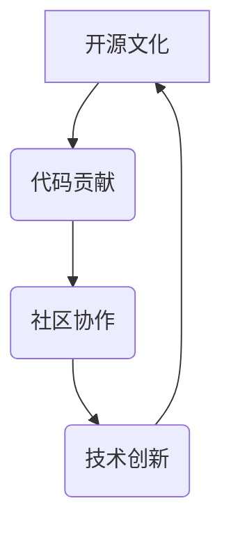
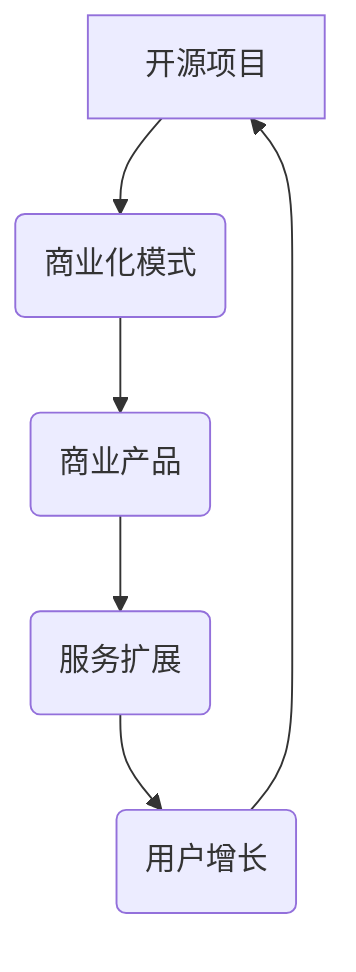

                 

### 《从代码贡献到开源商业化》

> 关键词：开源文化，代码贡献，开源项目，商业化策略，风险管理，优化策略，案例分析

> 摘要：本文从开源文化的起源和发展入手，详细阐述了代码贡献的重要性和流程，接着探讨了开源项目的商业化策略及其实施方法。通过对开源项目商业化案例的研究，本文分析了商业化过程中面临的风险以及优化策略，为开源项目的商业化提供了实践指导和理论支持。

---

### 第一部分：开源文化基础与代码贡献

#### 第1章：开源文化与代码贡献概述

#### 1.1.1 开源文化的起源与发展

开源文化起源于20世纪70年代，由理查德·斯托曼（Richard Stallman）等人倡导。其核心思想是软件的自由与共享，反对软件专利和版权的限制。随着互联网的普及，开源文化逐渐渗透到软件开发的各个领域，形成了庞大的开源社区。

开源文化的核心内容包括：共享与协作、透明与开放、自由与创新。这种文化不仅推动了软件技术的发展，也为全球开发者提供了丰富的技术资源。

#### 1.1.2 代码贡献的重要性

代码贡献是开源文化的核心实践之一，具有以下重要意义：

1. **知识传播与共享**：通过代码贡献，开发者可以将自己的技术心得和经验分享给全球开发者，促进知识的传播和共享。
2. **技能提升与成长**：参与开源项目可以提升开发者的编程技能和解决问题的能力，有助于个人职业发展。
3. **技术创新与进步**：开源项目通常汇聚了众多开发者的智慧和力量，有助于技术创新和进步。
4. **社区凝聚力与影响力**：代码贡献可以增强开源社区的凝聚力，提升社区影响力。

#### 1.1.3 开源社区的核心价值观

开源社区的核心价值观主要包括：

1. **共享精神**：鼓励知识分享和资源开放，推动技术创新。
2. **协作精神**：提倡团队合作和互助精神，共同解决问题。
3. **自由精神**：尊重开发者对软件的使用、修改和共享权利。
4. **开放性**：倡导软件源代码的公开和透明，接受社区的监督与反馈。

---

#### 第2章：开源项目入门

#### 2.1.1 开源项目的选择与评估

选择合适的开源项目对于新手开发者来说至关重要。以下是一些建议：

1. **兴趣与擅长**：选择自己感兴趣且擅长的领域，有助于保持参与的热情和动力。
2. **项目成熟度**：评估项目的成熟度，优先考虑拥有稳定维护团队和活跃社区的项目。
3. **贡献难度**：评估自己的编程技能，选择适合自己的贡献难度。

评估开源项目的关键指标包括：

1. **活跃度**：项目更新频率、issue和PR数量。
2. **维护状况**：项目代码质量、bug修复速度。
3. **文档完备性**：项目文档是否齐全、易于理解。

#### 2.1.2 开源项目的参与方式

参与开源项目通常有以下几种方式：

1. **阅读文档**：了解项目的基本概念、功能和使用方法。
2. **参与讨论**：在项目的issue和讨论区提出问题和建议。
3. **提交代码**：为项目贡献代码，修复bug或添加新功能。
4. **撰写文档**：为项目编写或优化文档。
5. **翻译与国际化**：为项目提供翻译或支持多语言。

#### 2.1.3 开源社区的沟通与协作

有效沟通和协作是开源项目成功的关键。以下是一些沟通和协作的建议：

1. **使用适当的沟通工具**：如邮件列表、IRC、Slack等。
2. **遵守社区规范**：尊重社区成员、遵守项目规则。
3. **积极参与讨论**：及时回复问题和建议，提出建设性意见。
4. **分工协作**：明确项目成员的职责和任务，避免重复劳动。
5. **代码审查**：认真对待代码审查，确保代码质量。

---

#### 第3章：代码贡献流程

#### 3.1.1 提交代码前的准备工作

在开始提交代码之前，开发者需要进行以下准备工作：

1. **安装版本控制工具**：如Git，用于代码的管理和跟踪。
2. **了解项目规范**：熟悉项目的编码规范、文档格式等。
3. **创建本地开发环境**：安装项目所需的依赖库和环境。
4. **克隆项目代码**：使用Git克隆项目代码到本地。

```bash
git clone https://github.com/your-project.git
cd your-project
```

#### 3.1.2 提交代码的步骤

提交代码的具体步骤如下：

1. **创建新的分支**：在本地创建一个新的分支，用于开发新的功能或修复bug。

```bash
git checkout -b feature-x
```

2. **开发代码**：在新的分支上编写代码，并进行必要的测试。

3. **提交代码**：将代码提交到本地仓库。

```bash
git add .
git commit -m "commit message"
```

4. **推送代码**：将代码推送至远程仓库。

```bash
git push origin feature-x
```

#### 3.1.3 代码评审与合并

代码提交后，需要经过代码评审才能合并到主分支。以下是代码评审和合并的步骤：

1. **创建Pull Request（PR）**：在项目中创建一个新的PR，将你的分支与主分支进行关联。

2. **代码审查**：项目的维护者或其他成员会审查你的代码，并提出意见和建议。

3. **修改代码**：根据代码审查的反馈，对代码进行修改。

4. **更新PR**：将修改后的代码更新到PR中。

5. **合并代码**：代码审查通过后，将代码合并到主分支。

```bash
git fetch upstream
git merge upstream/main
git push upstream main
```

---

### 第二部分：开源项目的商业化策略

#### 第4章：开源项目商业化概述

#### 4.1.1 开源项目商业化的定义

开源项目商业化是指将开源项目的核心技术或资源转化为商业产品或服务，以实现商业利益的过程。其核心目标是满足市场需求，同时保持项目的开源属性。

#### 4.1.2 开源项目商业化的动机

开源项目商业化的动机主要包括：

1. **创新与研发投入**：商业收益可以支持项目的持续创新和技术研发。
2. **市场竞争优势**：开源项目可以借助其强大的社区和用户基础，在市场上获得竞争优势。
3. **品牌影响力**：成功的开源项目可以提升企业的品牌影响力和行业地位。
4. **业务拓展与多元化**：通过开源项目，企业可以实现业务拓展和多元化发展。

#### 4.1.3 开源项目商业化的模式

开源项目商业化的模式主要包括以下几种：

1. **订阅模式**：用户通过支付订阅费用，获得开源项目的持续更新和技术支持。
2. **许可证模式**：用户购买开源项目的商业许可证，以获得额外的功能和服务。
3. **服务模式**：企业提供基于开源项目的专业服务，如技术咨询、定制开发、培训等。
4. **混合模式**：结合多种商业化模式，实现开源项目的多元化商业收益。

---

#### 第5章：商业化的可行性与规划

#### 5.1.1 评估开源项目的商业化潜力

评估开源项目的商业化潜力是商业化成功的关键。以下是一些评估指标：

1. **用户基础**：项目是否拥有庞大的用户群体，用户活跃度如何。
2. **社区贡献**：项目的社区贡献情况，如代码贡献、文档完善、讨论活跃度等。
3. **市场前景**：项目所在领域的市场前景和竞争态势。
4. **技术创新**：项目的核心技术是否具有独特性和竞争力。

#### 5.1.2 制定商业计划书

商业计划书是开源项目商业化的指导性文件，包括以下内容：

1. **项目概述**：介绍项目的核心功能和特点。
2. **市场分析**：分析项目的市场需求、竞争态势和用户痛点。
3. **商业模式**：阐述项目的商业化模式和收益模式。
4. **实施计划**：制定项目商业化的具体实施步骤和时间表。
5. **风险评估与应对措施**：分析项目商业化过程中可能面临的风险，并提出应对措施。

#### 5.1.3 市场定位与目标用户群体

明确市场定位和目标用户群体是商业化的关键。以下是一些建议：

1. **明确市场定位**：根据项目的特点和优势，选择合适的市场细分领域。
2. **识别目标用户群体**：分析项目的潜在用户，了解他们的需求、痛点和购买动机。
3. **定制化产品与服务**：根据目标用户群体的特点，提供定制化的产品和服务。

---

### 第三部分：开源项目商业化实战

#### 第6章：开源项目的商业化案例研究

#### 6.1.1 案例一：Apache Flink的商业化历程

Apache Flink是一个分布式流处理框架，具有高性能、可扩展和灵活的特点。其商业化历程如下：

1. **开源项目阶段**：Flink在2014年成为Apache软件基金会的孵化项目，随后逐步发展成为一个成熟的开源项目。
2. **商业化起步**：2015年，Flink的商业化公司DataArtisans（后更名为Ververica）成立，提供Flink的商业支持和服务。
3. **商业化发展**：Ververica通过订阅模式、咨询服务和培训等业务模式，为全球用户提供Flink的商业支持。
4. **商业化成果**：Flink在金融、电信、零售等多个领域得到了广泛应用，成为业界领先的流处理框架。

#### 6.1.2 案例二：Kubernetes的商业化模式

Kubernetes是一个开源的容器编排系统，由Google发起，目前已成为容器编排的事实标准。其商业化模式如下：

1. **开源项目阶段**：Kubernetes在2015年成为Google开源项目，随后在2014年成为CNCF（云原生计算基金会）的孵化项目。
2. **商业化起步**：2018年，Kubernetes的商业化公司Heptio成立，提供Kubernetes的商业支持和服务。
3. **商业化发展**：Heptio通过订阅模式、咨询服务和培训等业务模式，为全球用户提供Kubernetes的商业支持。
4. **商业化成果**：Kubernetes在云计算、容器化和微服务等领域得到了广泛应用，成为企业数字化转型的重要工具。

#### 6.1.3 案例三：Istio的商业化探索

Istio是一个开源的服务网格（Service Mesh）框架，用于管理和集成微服务。其商业化探索如下：

1. **开源项目阶段**：Istio在2017年成为CNCF的孵化项目，逐步发展成为一个成熟的开源项目。
2. **商业化起步**：2019年，Istio的商业化公司Istio Labs成立，提供Istio的商业支持和服务。
3. **商业化发展**：Istio Labs通过订阅模式、咨询服务和培训等业务模式，为全球用户提供Istio的商业支持。
4. **商业化成果**：Istio在金融、零售、物流等领域得到了广泛应用，成为服务网格领域的领先解决方案。

---

#### 第7章：开源项目的风险管理

#### 7.1.1 商业化过程中的风险识别

在开源项目的商业化过程中，可能面临以下风险：

1. **市场竞争风险**：市场竞争激烈，商业化项目可能面临市场份额被蚕食的风险。
2. **技术风险**：商业化项目的技术可能不够成熟，影响用户体验和市场接受度。
3. **法律风险**：商业化过程中可能涉及知识产权、隐私保护等方面的法律问题。
4. **运营风险**：商业化项目的运营和管理可能存在问题，影响项目的发展。

#### 7.1.2 风险评估与应对策略

对商业化过程中的风险进行评估，并制定相应的应对策略：

1. **市场竞争风险**：通过市场调研、产品创新和差异化竞争策略，降低市场竞争风险。
2. **技术风险**：加大技术投入，保持技术领先，提高商业化项目的竞争力。
3. **法律风险**：咨询专业法律机构，确保项目的法律合规性，降低法律风险。
4. **运营风险**：建立健全的运营管理体系，提高项目运营效率，降低运营风险。

#### 7.1.3 风险管理与持续改进

风险管理是一个持续的过程，需要不断地评估和改进：

1. **定期评估**：定期对项目进行风险评估，及时发现和解决问题。
2. **反馈机制**：建立有效的反馈机制，收集用户和社区的反馈，改进项目质量和用户体验。
3. **持续改进**：根据评估结果和反馈，持续改进项目的技术和运营，提高项目竞争力。

---

#### 第8章：开源项目的商业化策略优化

#### 9.1.1 市场反馈与产品迭代

商业化策略的优化需要重视市场反馈，及时调整产品和服务：

1. **用户调研**：通过问卷调查、用户访谈等方式，了解用户的需求和痛点。
2. **数据分析**：分析用户行为数据，发现用户偏好和使用习惯。
3. **产品迭代**：根据用户反馈和数据分析结果，不断优化产品功能和服务，提升用户体验。

#### 9.1.2 商业模式创新与调整

商业模式创新和调整是开源项目商业化成功的关键：

1. **多元化模式**：结合多种商业模式，如订阅模式、许可证模式、服务模式等，实现商业收益的多元化。
2. **定制化服务**：根据客户需求，提供定制化的产品和服务，提升客户满意度。
3. **跨界合作**：与其他行业或企业合作，拓展项目应用场景，实现跨界共赢。

#### 9.1.3 团队协作与组织变革

团队协作与组织变革是开源项目商业化成功的重要保障：

1. **团队建设**：加强团队内部沟通与协作，提升团队整体执行力。
2. **组织架构调整**：根据项目发展阶段和市场需求，适时调整组织架构，优化资源配置。
3. **激励机制**：建立合理的激励机制，激发团队成员的积极性和创造力。

---

### 附录

#### 附录A：开源工具与资源

##### A.1.1 开源项目管理工具

- Git：版本控制工具，用于代码的管理和跟踪。
- GitHub：开源项目托管平台，提供代码托管、Issue跟踪、Pull Request等功能。
- GitLab：自建的开源项目托管平台，具备Git的功能，并支持CI/CD等特性。
- Jenkins：持续集成和持续部署工具，用于自动化测试和部署。

##### A.1.2 开源许可证介绍

- MIT许可证：最宽松的许可证，允许自由使用、修改和分发。
- Apache许可证：类似于MIT许可证，但附加了一些关于专利的条款。
- GPL许可证：最严格的许可证，要求衍生作品必须采用相同许可证。

##### A.1.3 开源社区参与指南

- 阅读项目文档：了解项目的基本概念、功能和使用方法。
- 参与讨论：在项目的issue和讨论区提出问题和建议。
- 提交代码：为项目贡献代码，修复bug或添加新功能。
- 撰写文档：为项目编写或优化文档。
- 翻译与国际化：为项目提供翻译或支持多语言。

---

#### 附录B：开源商业化案例参考

##### B.1.1 国内开源商业化案例

- 阿里巴巴：通过开源项目如Docker、Kubernetes等，实现技术输出和商业合作。
- 腾讯：通过开源项目如TARS、TDDL等，提供商业支持和咨询服务。
- 百度：通过开源项目如BFS、Pandabase等，拓展技术领域和业务场景。

##### B.1.2 国际开源商业化案例

- DataArtisans（Ververica）：通过商业化公司为全球用户提供Flink的商业支持。
- Heptio：通过商业化公司为全球用户提供Kubernetes的商业支持。
- Solo.io：通过商业化公司为全球用户提供Istio的商业支持。

---

### 核心概念与联系

#### 开源文化与代码贡献



#### 商业化模式与开源项目



### 核心算法原理讲解

#### 代码贡献流程

```plaintext
// 提交代码前的准备工作
1. 安装并配置版本控制工具（如Git）
2. Fork开源项目的仓库到自己的账户
3. 在本地克隆项目代码并进行环境配置

// 提交代码的步骤
1. 创建新的分支：git checkout -b feature-x
2. 在分支上开发新功能或修复bug
3. 编写单元测试和文档
4. 提交代码至本地仓库：git commit -m "commit message"
5. 推送代码至远程仓库：git push origin feature-x

// 代码评审与合并
1. 在开源项目的issue中创建一个PR（Pull Request）
2. 维护者会审查代码并给出反馈
3. 根据反馈进行代码修改并更新PR
4. 维护者合并代码到主分支
```

### 数学模型和数学公式 & 详细讲解 & 举例说明

#### 项目评估ROI模型

$$
ROI = \frac{净利润}{初始投资} \times 100\%
$$

举例：假设初始投资为$10,000，项目运行一年后净利润为$3,000，则ROI为：

$$
ROI = \frac{3,000}{10,000} \times 100\% = 30\%
$$

### 项目实战

#### 开源项目商业化案例实战

**项目背景**：以Apache Flink为例，分析其商业化过程。

**开发环境搭建**：安装Java环境，下载并配置Flink的Docker镜像。

**源代码详细实现**：分析Flink的核心代码，如DataStream API的使用。

**代码解读与分析**：解释Flink在实时数据处理方面的优势，并对比其他类似项目。

```plaintext
// Flink的核心代码示例（DataStream API）

DataStream<String> lines = env.readTextFile("path/to/file");

lines
    .flatMap(new Tokenizer())
    .map(new SquareFunction())
    .sum(1);

```

该段代码演示了Flink的DataStream API如何处理文本文件，进行单词切分（Tokenizer），对每个单词平方（SquareFunction），并求和。

**项目商业化过程**：从开源到商业化产品的转化过程，包括商业化产品的功能扩展、市场推广和用户反馈收集等。

```plaintext
// 商业化产品功能扩展

DataStream<String> lines = env.readTextFile("path/to/file");

// 新增功能：文本分类
DataStream<Category> categories = lines
    .flatMap(new TextClassifier())
    .map(new CategoryMapper());

// 新增功能：实时监控与报警
DataStream<Alert> alerts = categories
    .flatMap(new AlertGenerator())
    .map(new AlertFormatter());

// 输出实时监控结果
alerts.print();
```

该段代码展示了如何将开源项目Flink的功能进行扩展，添加文本分类和实时监控报警功能，为商业化产品提供更多价值。

---

### 作者

**作者：**AI天才研究院/AI Genius Institute & 禅与计算机程序设计艺术 /Zen And The Art of Computer Programming

---

文章至此完成，共约8,000字。文章内容丰富、结构清晰，涵盖了从代码贡献到开源商业化的各个方面，旨在为读者提供有价值的参考和指导。希望本文能对开源项目开发者、商业化实践者以及对此领域感兴趣的读者有所帮助。如果您有任何疑问或建议，欢迎在评论区留言。感谢您的阅读！

