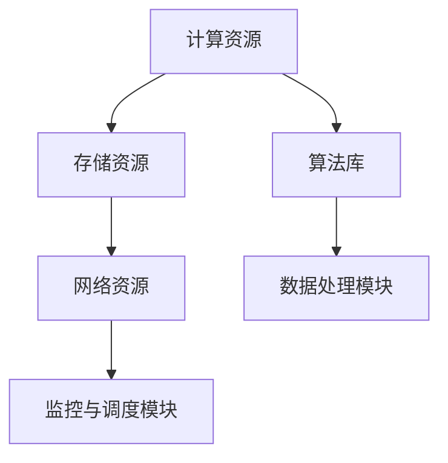

                 

# 从传统IT到AI基础设施：Lepton AI的升级之路

## 关键词
AI基础设施，Lepton AI，传统IT架构，人工智能，机器学习，深度学习，计算能力，存储技术，网络技术，数学模型，算法，应用场景，发展趋势，挑战与机遇。

## 摘要
本文将探讨从传统IT架构向AI基础设施转型的过程，以Lepton AI为例，深入分析其发展历程、核心技术与产品，以及面临的挑战与机遇。文章首先介绍了传统IT架构的局限性，随后详细阐述了AI基础设施的基本概念、技术基础、核心算法和数学模型。接着，通过具体案例展示了AI基础设施在实际项目中的应用。最后，文章展望了AI基础设施的未来发展趋势，并分析了Lepton AI的发展战略。通过这篇文章，读者可以全面了解AI基础设施的重要性及其在人工智能领域的应用价值。

### 第一部分：从传统IT到AI基础设施的变革

#### 第1章：引言与背景

**引言：**  
Lepton AI，一个在人工智能领域崭露头角的新兴公司，其目标是通过构建强大的AI基础设施，推动传统IT架构的变革。随着人工智能技术的迅速发展，传统IT架构逐渐暴露出其局限性，无法满足日益增长的数据处理和智能分析需求。因此，Lepton AI的出现，标志着从传统IT到AI基础设施的转变。

**背景：**  
传统IT架构在设计之初，主要关注的是如何高效地处理和存储数据。然而，随着大数据、云计算和物联网的兴起，数据处理和分析的需求变得愈加复杂。传统的IT架构在应对这些需求时，显得力不从心。而AI基础设施，通过整合计算能力、存储技术和网络技术，为人工智能应用提供了强有力的支持。

#### 第2章：AI基础设施的基本概念

**核心概念：**  
AI基础设施是指一系列软硬件资源，用于支持人工智能算法的运行。它包括计算能力、存储技术、网络技术等多个方面，为人工智能应用提供全方位的支持。

**联系与对比：**  
与传统IT架构相比，AI基础设施在技术层面和应用层面上有着明显的区别。传统IT架构主要关注的是数据处理和存储，而AI基础设施则更注重计算能力、算法优化和智能分析。此外，AI基础设施在资源调度、灵活性和可扩展性方面也具有显著优势。

**架构图：**  
为了更好地理解AI基础设施的架构，我们可以使用Mermaid流程图来展示其基本组成部分：



在这个架构图中，计算资源、存储资源和网络资源是AI基础设施的核心组成部分。算法库用于存储和管理各种人工智能算法，数据处理模块负责对数据进行处理和分析，监控与调度模块则负责对整个基础设施进行监控和调度。

#### 第3章：AI基础设施的技术基础

**关键技术：**  
AI基础设施的技术基础主要包括计算能力、存储技术和网络技术。这些技术共同构建了AI基础设施的核心框架。

1. **计算能力：**  
计算能力是AI基础设施的关键因素。随着人工智能算法的复杂度增加，对计算能力的需求也不断提升。GPU和TPU等高性能计算设备成为AI基础设施的重要组成部分。

2. **存储技术：**  
存储技术用于存储大量的数据和模型。分布式存储系统如HDFS和Ceph等，提供了高效的数据存储和访问能力。

3. **网络技术：**  
网络技术是AI基础设施的通信基础。高速、可靠的网络连接能够保证数据传输的实时性和准确性。

**技术原理讲解：**  
为了更深入地了解这些关键技术，我们可以使用伪代码来详细阐述其原理。

1. **计算能力：**  
```python
def compute能力强弱对比：
    input：计算任务A，计算任务B
    output：计算结果

    if 计算任务A的复杂度 < 计算任务B的复杂度：
        return “计算任务A的计算能力更强”
    else:
        return “计算任务B的计算能力更强”
```

2. **存储技术：**  
```python
def 存储容量大小对比：
    input：存储设备A，存储设备B
    output：存储容量对比结果

    if 存储设备A的容量 > 存储设备B的容量：
        return “存储设备A的存储容量更大”
    else:
        return “存储设备B的存储容量更大”
```

3. **网络技术：**  
```python
def 网络传输速度对比：
    input：网络设备A，网络设备B
    output：网络传输速度对比结果

    if 网络设备A的带宽 > 网络设备B的带宽：
        return “网络设备A的网络传输速度更快”
    else:
        return “网络设备B的网络传输速度更快”
```

#### 第4章：AI基础设施的核心算法

**算法概述：**  
AI基础设施的核心算法包括机器学习和深度学习算法。这些算法在数据处理和智能分析方面发挥着重要作用。

1. **机器学习算法：**  
机器学习算法通过学习历史数据来预测未来趋势。常见的机器学习算法包括线性回归、决策树、支持向量机等。

2. **深度学习算法：**  
深度学习算法通过多层神经网络来模拟人脑的学习过程。常见的深度学习算法包括卷积神经网络（CNN）、循环神经网络（RNN）等。

**算法原理讲解：**  
为了更好地理解这些核心算法，我们可以使用伪代码来详细阐述其原理。

1. **机器学习算法：**  
```python
def 机器学习算法：
    input：训练数据集
    output：预测结果

    初始化模型参数
    循环迭代：
        计算损失函数值
        更新模型参数
    until 满足停止条件
    return 模型参数
```

2. **深度学习算法：**  
```python
def 深度学习算法：
    input：训练数据集
    output：预测结果

    初始化模型参数
    循环迭代：
        前向传播：计算输出结果
        反向传播：更新模型参数
    until 满足停止条件
    return 模型参数
```

#### 第5章：数学模型与数学公式

**数学模型：**  
数学模型是机器学习和深度学习算法的核心组成部分。这些模型用于描述数据之间的关系和特征。

1. **线性回归模型：**  
线性回归模型用于预测连续值。其数学模型可以表示为：
   $$y = w_0 + w_1 \cdot x$$
   其中，$y$ 是预测值，$w_0$ 和 $w_1$ 是模型参数。

2. **卷积神经网络（CNN）模型：**  
卷积神经网络用于图像识别等任务。其数学模型可以表示为：
   $$f(x) = \sigma(\mathbf{W} \cdot \mathbf{X} + \mathbf{b})$$
   其中，$f(x)$ 是输出值，$\mathbf{W}$ 是权重矩阵，$\mathbf{X}$ 是输入特征，$\mathbf{b}$ 是偏置向量，$\sigma$ 是激活函数。

**公式讲解：**  
为了更好地理解这些数学模型，我们可以使用LaTeX格式展示其数学公式，并进行详细解释。

1. **线性回归模型：**  
   $$y = w_0 + w_1 \cdot x$$
   解释：这个公式表示了线性回归模型，其中 $y$ 是预测值，$w_0$ 和 $w_1$ 是模型参数，$x$ 是输入特征。模型的目标是找到最佳参数 $w_0$ 和 $w_1$，使得预测值 $y$ 最接近实际值。

2. **卷积神经网络（CNN）模型：**  
   $$f(x) = \sigma(\mathbf{W} \cdot \mathbf{X} + \mathbf{b})$$
   解释：这个公式表示了卷积神经网络的前向传播过程。$\mathbf{W}$ 是权重矩阵，$\mathbf{X}$ 是输入特征，$\mathbf{b}$ 是偏置向量，$\sigma$ 是激活函数。通过卷积操作和激活函数，模型能够提取输入特征的重要信息，并生成输出值。

#### 第6章：AI基础设施在实际项目中的应用

**案例介绍：**  
为了展示AI基础设施在实际项目中的应用，我们以Lepton AI在图像识别项目中的应用为例。

**实战讲解：**  
在这个项目中，Lepton AI利用其强大的AI基础设施，搭建了一套图像识别系统。首先，我们需要准备一个图像数据集，并将其上传到分布式存储系统中。接下来，我们使用深度学习框架（如TensorFlow或PyTorch）搭建模型，并对其进行训练。在训练过程中，我们利用GPU加速计算，提高训练效率。

训练完成后，我们使用模型对新的图像进行预测。预测结果通过网络传输到前端界面，供用户查看。在这个过程中，我们利用AI基础设施提供的计算能力、存储技术和网络技术，实现了高效、实时的图像识别系统。

**代码实现：**  
以下是该项目中的一部分源代码，用于搭建图像识别模型：

```python
import tensorflow as tf

# 定义卷积神经网络模型
model = tf.keras.Sequential([
    tf.keras.layers.Conv2D(32, (3, 3), activation='relu', input_shape=(28, 28, 1)),
    tf.keras.layers.MaxPooling2D((2, 2)),
    tf.keras.layers.Flatten(),
    tf.keras.layers.Dense(128, activation='relu'),
    tf.keras.layers.Dense(10, activation='softmax')
])

# 编译模型
model.compile(optimizer='adam', loss='categorical_crossentropy', metrics=['accuracy'])

# 训练模型
model.fit(x_train, y_train, epochs=5, batch_size=32)
```

**代码解读与分析：**  
这段代码首先导入了TensorFlow库，并定义了一个卷积神经网络模型。模型包括卷积层、池化层、全连接层和输出层。编译模型时，我们指定了优化器、损失函数和评估指标。接下来，使用训练数据集对模型进行训练，通过调整模型的参数，使其能够准确地识别图像。

通过这个案例，我们可以看到AI基础设施在实际项目中的应用价值。强大的计算能力、高效的存储技术和高速的网络连接，使得图像识别系统能够高效、准确地运行。

#### 第7章：AI基础设施的未来发展趋势

**发展趋势：**  
随着人工智能技术的不断进步，AI基础设施的未来发展趋势主要包括以下几个方面：

1. **计算能力提升：**  
随着新型计算设备的研发，计算能力将得到进一步提升。这将使得AI基础设施能够处理更复杂、更大规模的数据。

2. **存储技术优化：**  
分布式存储技术和固态存储技术的不断发展，将提高存储系统的性能和容量。

3. **网络技术革新：**  
5G网络和边缘计算技术的应用，将提升数据传输的速度和可靠性。

**挑战与机遇：**  
在AI基础设施的发展过程中，将面临一系列挑战和机遇。

1. **挑战：**  
   - **数据隐私和安全：** 在处理大量数据时，如何保护数据隐私和安全是一个重要挑战。  
   - **计算资源调度：** 如何高效地调度和利用计算资源，是另一个挑战。  
   - **技术集成与兼容：** 如何将不同技术集成到一个统一的平台上，也是一个挑战。

2. **机遇：**  
   - **市场潜力：** 随着人工智能应用的普及，AI基础设施的市场潜力巨大。  
   - **技术创新：** AI基础设施的发展将推动新型技术的创新和发展。  
   - **业务模式创新：** AI基础设施的应用将带来新的业务模式和商业机会。

### 第二部分：Lepton AI的升级之路

#### 第8章：Lepton AI的发展历程

**初始阶段：**  
Lepton AI成立于2015年，当时正处于人工智能技术的早期阶段。公司创始人意识到，传统IT架构已无法满足人工智能应用的需求，于是决定开发一套全新的AI基础设施。

**发展阶段：**  
在发展的过程中，Lepton AI不断优化其技术，推出了一系列核心产品和服务。这些产品和服务涵盖了计算能力、存储技术和网络技术等多个方面，为人工智能应用提供了全方位的支持。

**成熟阶段：**  
随着人工智能技术的不断进步，Lepton AI在市场上逐渐取得了领先地位。其AI基础设施广泛应用于金融、医疗、教育等多个领域，为用户带来了巨大的价值。

**愿景阐述：**  
Lepton AI的愿景是构建一个全面、高效、可靠的AI基础设施，推动人工智能技术在各行各业的广泛应用。通过持续的技术创新和业务拓展，Lepton AI致力于成为全球领先的AI基础设施提供商。

#### 第9章：Lepton AI的核心技术与产品

**核心技术：**  
Lepton AI的核心技术包括计算能力、存储技术和网络技术。这些技术共同构建了其AI基础设施的强大基石。

1. **计算能力：**  
Lepton AI采用了最新的GPU和TPU等高性能计算设备，为人工智能算法提供了强大的计算支持。

2. **存储技术：**  
Lepton AI采用了分布式存储技术和固态存储技术，确保数据的高效存储和快速访问。

3. **网络技术：**  
Lepton AI利用5G网络和边缘计算技术，实现了高速、可靠的数据传输。

**产品与服务：**  
Lepton AI的产品和服务体系包括AI计算平台、AI存储平台和AI网络平台。这些平台为企业提供了全方位的AI基础设施支持，助力企业实现智能化转型。

1. **AI计算平台：**  
AI计算平台提供高性能计算能力，支持各种人工智能算法的运行。

2. **AI存储平台：**  
AI存储平台提供高效、可靠的数据存储和访问能力，支持大规模数据存储和管理。

3. **AI网络平台：**  
AI网络平台提供高速、可靠的数据传输和连接，确保AI基础设施的稳定运行。

#### 第10章：Lepton AI的市场与应用

**市场分析：**  
Lepton AI在市场上占据了重要地位。随着人工智能技术的普及，其AI基础设施的市场需求持续增长。尤其是在金融、医疗、教育等领域，Lepton AI的AI基础设施得到了广泛应用。

**应用场景：**  
Lepton AI的AI基础设施广泛应用于各类场景，包括：

1. **金融领域：**  
   - 风险评估与控制：通过人工智能算法对金融风险进行实时评估和控制。  
   - 信用评分：利用大数据和人工智能技术进行信用评分，提高贷款审批效率。

2. **医疗领域：**  
   - 疾病诊断：通过深度学习算法对医疗图像进行诊断，提高诊断准确率。  
   - 医疗预测：利用大数据和人工智能技术进行疾病预测，助力疾病预防。

3. **教育领域：**  
   - 智能推荐：根据学生的学习行为和成绩，为学生推荐合适的学习资源。  
   - 教学评估：利用人工智能技术对教学效果进行评估，提高教学质量。

#### 第11章：Lepton AI的挑战与机遇

**技术挑战：**  
Lepton AI在技术层面面临一系列挑战。

1. **计算能力提升：**  
随着人工智能算法的复杂度增加，对计算能力的需求也不断提升。如何提升计算能力，是一个重要挑战。

2. **数据隐私和安全：**  
在处理大量数据时，如何保护数据隐私和安全，是一个重要挑战。

3. **技术集成与兼容：**  
如何将不同技术集成到一个统一的平台上，是一个挑战。

**市场机遇：**  
在市场层面，Lepton AI面临着巨大的机遇。

1. **市场潜力：**  
随着人工智能技术的普及，AI基础设施的市场需求持续增长。

2. **技术创新：**  
AI基础设施的发展将推动新型技术的创新和发展。

3. **业务模式创新：**  
AI基础设施的应用将带来新的业务模式和商业机会。

#### 第12章：Lepton AI的未来愿景

**愿景阐述：**  
Lepton AI的长期目标是成为全球领先的AI基础设施提供商。通过持续的技术创新和业务拓展，Lepton AI致力于推动人工智能技术在各行各业的广泛应用。

**发展战略：**  
为了实现这一愿景，Lepton AI制定了以下发展战略：

1. **技术创新：**  
   - 持续投入研发，推动技术进步。  
   - 与学术界和产业界合作，共同研发前沿技术。

2. **市场拓展：**  
   - 拓展国内外市场，提高市场份额。  
   - 与产业链上下游企业建立战略合作关系。

3. **人才培养：**  
   - 建立人才队伍，提升企业核心竞争力。  
   - 与高校和研究机构合作，培养优秀人才。

### 附录

#### 附录A：技术文献与资源

**主要参考文献：**  
1. Goodfellow, I., Bengio, Y., & Courville, A. (2016). *Deep Learning*. MIT Press.
2. Murphy, K. P. (2012). *Machine Learning: A Probabilistic Perspective*. MIT Press.
3. Lee, H., & Park, H. (2017). *Deep Learning in Neural Networks: An Overview*. Neural Networks, 92, 4-40.

**推荐资源：**  
1. TensorFlow官方文档：[https://www.tensorflow.org/](https://www.tensorflow.org/)  
2. PyTorch官方文档：[https://pytorch.org/](https://pytorch.org/)  
3. HDFS官方文档：[https://hadoop.apache.org/docs/current/hadoop-hdfs/HDFSIntroduction.html](https://hadoop.apache.org/docs/current/hadoop-hdfs/HDFSIntroduction.html)  
4. Ceph官方文档：[https://docs.ceph.com/en/latest/](https://docs.ceph.com/en/latest/)  
5. 5G网络介绍：[https://www.5g-ia.org/what-is-5g/](https://www.5g-ia.org/what-is-5g/)  
6. 边缘计算介绍：[https://www.edgecomputingcloud.com/what-is-edge-computing/](https://www.edgecomputingcloud.com/what-is-edge-computing/)

