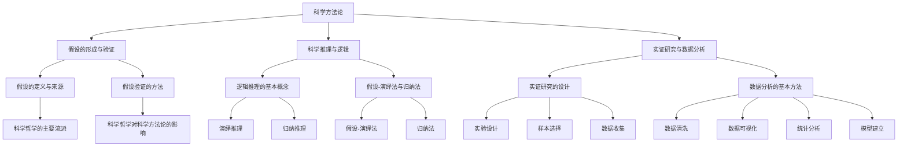

                 

# 从假说到真理：科学方法论的循环

> 关键词：科学方法论，假说，实证研究，推理，数据分析，跨学科融合

> 摘要：本文深入探讨了科学方法论在从假说到真理的过程中所扮演的角色。通过分析科学方法论的基本原理和应用，本文揭示了科学方法在自然科学和社会科学中的实际作用。同时，本文还探讨了科学方法论在教育、哲学和跨学科交流中的重要性，以及未来发展的趋势。

科学方法论是一种通过系统的、逻辑的、实证的方式来探索和解释自然现象的方法。它从假说开始，通过实验和观察来验证或反驳这些假说，最终形成科学理论。科学方法论的重要性在于，它提供了一种严谨的思维方式，确保了科学研究的准确性和可靠性。

## 第1章 引言：科学方法论的重要性

### 1.1 科学方法论的定义与历史演变

科学方法论是指研究科学活动的方法和原则。它包括假设的形成与验证、科学推理与逻辑、实证研究与数据分析等基本原理。科学方法论的历史可以追溯到古希腊时期，当时亚里士多德等人开始提出逻辑和实证的研究方法。

### 1.2 科学方法论的当代意义与应用

在当代，科学方法论的应用非常广泛，涵盖了自然科学和社会科学等多个领域。它不仅帮助科学家们揭示了自然界的奥秘，还为人类社会提供了丰富的知识和技术。

### 第2章 科学方法论的基本原理

#### 2.1 假设的形成与验证

假设是科学研究的起点。它是对现象的一种推测性解释。科学方法论要求假设必须基于已有的知识和观察，并且可以通过实验或观察来验证。

##### 2.1.1 假设的定义与来源

假设是对现象的一种解释或预测。它来源于科学家的直觉、理论、观察或实验。

##### 2.1.2 假设验证的方法

假设验证通常通过实验或观察进行。实验设计要确保假设的可测试性，观察则需要系统的记录和分析。

#### 2.2 科学推理与逻辑

科学推理是科学方法论的核心。它包括逻辑推理和假设-演绎法与归纳法。

##### 2.2.1 逻辑推理的基本概念

逻辑推理是基于事实和原理的推理过程。它包括演绎推理和归纳推理。

##### 2.2.2 假设-演绎法与归纳法

假设-演绎法是从一个假设出发，通过逻辑推理得到结论。归纳法则是从多个实例中总结出普遍规律。

#### 2.3 实证研究与数据分析

实证研究是科学方法论的重要组成部分。它通过收集和分析数据来验证假设。

##### 2.3.1 实证研究的设计

实证研究的设计要确保研究的科学性和有效性。它包括实验设计、样本选择和数据收集。

##### 2.3.2 数据分析的基本方法

数据分析是实证研究的核心。它包括数据清洗、数据可视化、统计分析和模型建立。

### 第3章 科学方法论的应用与挑战

#### 3.1 科学方法论在自然科学中的应用

科学方法论在自然科学中发挥了重要作用，帮助科学家揭示了自然界的规律。

##### 3.1.1 物理学中的科学方法论

物理学中的科学方法论包括实验设计、理论建立和数学建模。

##### 3.1.2 生物学中的科学方法论

生物学中的科学方法论包括实验生物学、进化生物学和生态学。

#### 3.2 科学方法论在社会科学中的应用

科学方法论在社会科学中的应用也相当广泛，包括社会学、经济学、心理学等。

##### 3.2.1 社会科学的研究方法

社会科学的研究方法包括定量研究、定性研究和案例研究。

##### 3.2.2 社会科学中的方法论问题

社会科学中的方法论问题包括数据偏差、理论局限和方法论选择。

#### 3.3 科学方法论面临的挑战与解决方法

科学方法论面临着一些挑战，如方法论选择、数据分析和理论验证等。

##### 3.3.1 科学方法论的限制

科学方法论的限制包括实验条件、数据质量和理论局限。

##### 3.3.2 科学方法论的发展趋势

科学方法论的发展趋势包括跨学科研究、大数据分析和人工智能应用。

### 第4章 科学方法论的教育与普及

#### 4.1 科学方法论在高等教育中的教育

科学方法论在高等教育中的教育包括课程设置、教学方法和实验设计。

##### 4.1.1 科学方法论课程设置

科学方法论课程设置包括科学哲学、科学史和科学研究方法。

##### 4.1.2 科学方法论的教育方法

科学方法论的教育方法包括案例教学、讨论式教学和实验教学。

#### 4.2 科学方法论在社会教育中的普及

科学方法论在社会教育中的普及包括科普宣传、教育和公共活动。

##### 4.2.1 科学方法论的宣传与推广

科学方法论的宣传与推广包括媒体宣传、科普书籍和教育活动。

##### 4.2.2 科学方法论在科普中的应用

科学方法论在科普中的应用包括科学展览、科普讲座和在线教育。

### 第5章 科学方法论的哲学思考

#### 5.1 科学方法论的哲学基础

科学方法论的哲学基础包括科学哲学的主要流派和科学哲学对科学方法论的影响。

##### 5.1.1 科学哲学的主要流派

科学哲学的主要流派包括实证主义、逻辑实证主义和批判理性主义。

##### 5.1.2 科学哲学对科学方法论的影响

科学哲学对科学方法论的影响包括方法论选择、理论建立和科学评价。

#### 5.2 科学方法论与真理的关系

科学方法论与真理的关系包括科学方法论在真理获取中的作用和真理的界限。

##### 5.2.1 科学方法论与真理的获取

科学方法论与真理的获取包括假设验证、推理和实证研究。

##### 5.2.2 科学方法论与真理的界限

科学方法论与真理的界限包括科学知识的局限性、方法论选择和理论验证。

#### 5.3 科学方法论的未来展望

科学方法论的未来展望包括科学方法论的发展趋势和社会进步的关系。

##### 5.3.1 科学方法论的未来趋势

科学方法论的未来趋势包括跨学科研究、大数据分析和人工智能应用。

##### 5.3.2 科学方法论与社会进步的关系

科学方法论与社会进步的关系包括科学方法论在技术创新和社会发展中的作用。

### 第6章 科学方法论的实践应用

#### 6.1 科学方法论在科技创新中的应用

科学方法论在科技创新中的应用包括创新研究、技术验证和产品开发。

##### 6.1.1 科技创新中的科学方法论

科技创新中的科学方法论包括实验设计、模型建立和数据分析。

##### 6.1.2 科技创新中的方法论挑战

科技创新中的方法论挑战包括数据质量、理论验证和技术实现。

#### 6.2 科学方法论在社会科学研究中的应用

科学方法论在社会科学研究中的应用包括社会调查、数据分析和理论建立。

##### 6.2.1 社会科学研究中的科学方法论

社会科学研究中的科学方法论包括定量研究、定性研究和案例研究。

##### 6.2.2 社会科学研究中的方法论问题

社会科学研究中的方法论问题包括数据偏差、理论局限和方法论选择。

#### 6.3 科学方法论在日常生活中的应用

科学方法论在日常生活中的应用包括决策分析、健康管理和生活规划。

##### 6.3.1 生活中的科学方法论

生活中的科学方法论包括健康知识、决策方法和生活技能。

##### 6.3.2 科学方法论在决策中的应用

科学方法论在决策中的应用包括数据支持、模型分析和决策评估。

### 第7章 科学方法论的跨学科交流与融合

#### 7.1 科学方法论的跨学科交流

科学方法论的跨学科交流包括不同学科之间的方法论借鉴和合作。

##### 7.1.1 跨学科交流的重要性

跨学科交流的重要性包括知识整合、创新驱动和问题解决。

##### 7.1.2 跨学科交流的方法与挑战

跨学科交流的方法与挑战包括方法论融合、知识共享和文化冲突。

#### 7.2 科学方法论的跨学科融合

科学方法的跨学科融合包括跨学科研究、交叉领域创新和综合方法论。

##### 7.2.1 跨学科融合的案例研究

跨学科融合的案例研究包括医学工程、生态经济学和数字人文。

##### 7.2.2 跨学科融合的挑战与机遇

跨学科融合的挑战与机遇包括方法论冲突、知识共享和人才培养。

### 第8章 结论：科学方法论的持续发展

#### 8.1 科学方法论的发展历程与成就

科学方法论的发展历程与成就包括理论体系的建立、方法论的创新和科学研究的突破。

#### 8.2 科学方法论的现状与问题

科学方法论的现状与问题包括方法论选择、数据质量和理论验证等。

#### 8.3 科学方法论的展望与未来发展方向

科学方法论的展望与未来发展方向包括跨学科研究、大数据分析和人工智能应用。

### 附录

#### 附录 A 科学方法论相关的参考文献与资料

- Popper, K. R. (1959). The Logic of Scientific Discovery. Routledge.
- Kuhn, T. S. (1970). The Structure of Scientific Revolutions. University of Chicago Press.
- Lakatos, I. (1970). Falsification and the Methodology of Scientific Research Programmes. In I. Lakatos & A. Musgrave (Eds.), Criticism and the Growth of Knowledge (pp. 91-196). Cambridge University Press.
- Resnick, L. B. (1996). Beyond Discovery: The Power of Discovery and How to Harness It. McGraw-Hill.
- Toulmin, S. (1972). The Uses of Argument. Cambridge University Press.

#### 附录 B 科学方法论相关的Mermaid流程图

#### 附录 C 科学方法论相关的数学公式与解析

$$
E(X) = \mu \quad \text{（期望）}
$$

$$
V(X) = \sigma^2 \quad \text{（方差）}
$$

$$
P(A|B) = \frac{P(B|A)P(A)}{P(B)} \quad \text{（贝叶斯定理）}
$$

这些公式在数据分析中非常重要。期望和方差用于描述随机变量的中心位置和离散程度。贝叶斯定理用于概率计算，它在假设验证和决策分析中非常有用。

### 作者

作者：AI天才研究院/AI Genius Institute & 禅与计算机程序设计艺术 /Zen And The Art of Computer Programming

以上是关于科学方法论的循环的详细分析和阐述。从假说到真理，科学方法论为我们提供了一种严谨的思考方式，帮助我们更深入地理解世界。希望通过本文，读者能够对科学方法论有更全面的认识，并在实际应用中受益。让我们继续探索科学的奥秘，推动人类文明的进步。

