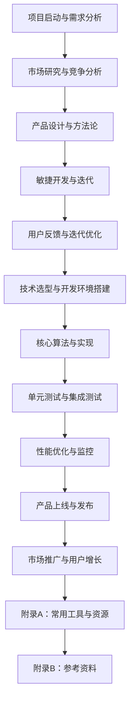

                 

# 从想法到产品的快速实现

> 关键词：产品实现、敏捷开发、用户体验设计、技术选型、用户反馈

> 摘要：本文将探讨从想法到产品的快速实现的全过程。我们将分为四个部分来详细分析：准备阶段、设计阶段、实现阶段和测试与部署阶段。在每个阶段，我们将逐步展开讨论，提供实用的方法和工具，帮助读者将创意转化为实际可行的产品。

                 

### 目录大纲

1. **准备阶段**
   1.1 项目启动与需求分析
   1.2 市场研究与竞争分析
2. **设计阶段**
   2.1 产品设计与方法论
   2.2 敏捷开发与迭代
   2.3 用户反馈与迭代优化
3. **实现阶段**
   3.1 技术选型与开发环境搭建
   3.2 核心算法与实现
4. **测试与部署**
   4.1 单元测试与集成测试
   4.2 性能优化与监控
5. **上线与推广**
   5.1 产品上线与发布
   5.2 市场推广与用户增长
6. **附录**
   6.1 常用工具与资源
   6.2 参考资料

---

## 第一部分：准备阶段

在将想法转化为实际产品之前，需要进行充分的准备。这包括对项目的需求分析、市场调研和竞争分析。以下是准备阶段的主要内容。

### 第1章：项目启动与需求分析

#### 1.1 确定项目目标

在项目启动之初，首先要明确项目目标。项目目标应该具体、可衡量、可达成、相关性强并且时限明确（SMART原则）。例如，一个项目目标可以是“开发一款功能完善的移动应用，用户量达到100万，并在明年Q2实现盈利”。

##### 1.1.1 理解项目愿景

项目愿景是项目目标的长远展望，是对项目未来的一个理想状态。例如，如果目标是开发一款移动应用，愿景可以是“成为全球最受欢迎的移动应用”。

##### 1.1.2 设定明确的目标

基于项目愿景，我们需要设定一系列短期和长期目标。短期目标通常是具体、可衡量的，如“在接下来的三个月内，完成应用的核心功能开发”，而长期目标则是对项目成功的最终期望。

#### 1.2 需求分析

需求分析是项目启动的关键步骤，它确保开发出的产品能够满足用户需求。需求分析可以分为以下三个方面：

##### 1.2.1 用户需求收集

用户需求是通过与用户直接交流、市场调研和竞争分析获得的。了解用户需求可以帮助我们确定产品的核心功能和用户体验。

##### 1.2.2 功能需求梳理

功能需求是将用户需求转化为具体的功能描述。这些功能描述应该明确、具体，并且能够被开发团队理解和实施。

##### 1.2.3 非功能需求考虑

非功能需求是指产品在性能、可靠性、安全性等方面需要满足的要求。例如，系统的响应时间应该不超过2秒，数据需要加密存储等。

### 第2章：市场研究与竞争分析

#### 2.1 市场调研

市场调研是了解目标市场和潜在用户的过程。通过市场调研，我们可以确定产品的市场定位和潜在客户群体。

##### 2.1.1 了解目标市场

了解目标市场包括市场的大小、增长趋势、用户行为等。这些信息可以帮助我们确定产品的市场定位。

##### 2.1.2 分析市场趋势

分析市场趋势可以帮助我们预测未来的市场变化，从而调整产品策略。

#### 2.2 竞争对手分析

竞争对手分析是了解竞争对手的产品、市场策略、用户反馈等。通过分析竞争对手，我们可以找到自身的优势与劣势。

##### 2.2.1 竞争对手定位

竞争对手定位是确定市场上主要的竞争对手。这包括直接竞争对手和潜在的竞争对手。

##### 2.2.2 竞争优势与劣势分析

竞争优势与劣势分析是评估竞争对手在产品、市场策略、用户体验等方面的优势与劣势。

##### 2.2.3 市场定位与目标客户

市场定位是确定产品在市场中的位置，目标客户是产品的主要用户群体。明确市场定位和目标客户可以帮助我们制定有效的市场策略。

### 小结

准备阶段是确保项目成功的基础。通过需求分析和市场研究，我们可以明确项目的目标、用户需求和市场定位，为后续的设计和实现提供清晰的方向。

---

## 第二部分：设计阶段

设计阶段是产品从概念转化为实际产品的关键环节。在这个阶段，我们需要进行产品设计和迭代，确保产品能够满足用户需求，并且具有良好的用户体验。

### 第3章：产品设计与方法论

#### 3.1 产品设计流程

产品设计流程通常包括以下几个阶段：

##### 3.1.1 背景分析

背景分析是了解项目目标和需求的过程。通过背景分析，我们可以明确产品的核心功能和目标用户。

##### 3.1.2 功能设计

功能设计是将用户需求转化为具体的功能模块。这一阶段需要详细列出每个功能模块的细节，包括功能描述、输入输出等。

##### 3.1.3 用户体验设计

用户体验设计是确保产品易用、直观和愉悦的过程。用户体验设计包括界面设计、交互设计和用户研究等。

#### 3.2 设计工具与方法

设计工具与方法的选择对于产品设计至关重要。以下是一些常用的设计工具和方法：

##### 3.2.1 原型设计工具

原型设计工具可以帮助我们快速创建产品的原型，以便进行用户测试和反馈。常用的原型设计工具有Figma、Sketch、Axure等。

##### 3.2.2 设计方法论

设计方法论是一种系统化的设计方法，可以帮助我们高效地进行产品设计。常用的设计方法论有用户体验设计双环模型、设计思维等。

### 第4章：敏捷开发与迭代

敏捷开发是一种以用户需求为导向，强调快速迭代和持续改进的开发方法。以下是敏捷开发的简介和核心原则：

##### 4.1.1 敏捷宣言

敏捷宣言强调了个体和互动、可工作的软件、客户合作和响应变化的重要性。

##### 4.1.2 敏捷开发的核心原则

敏捷开发的核心原则包括：个体和互动重于过程和工具、可工作的软件重于详尽的文档、客户合作重于合同谈判、响应变化重于遵循计划。

#### 4.2 迭代管理

迭代管理是敏捷开发的核心。以下是迭代管理的几个关键方面：

##### 4.2.1 迭代计划

迭代计划是确定每次迭代的目标和任务。迭代计划通常包括迭代周期、任务分配和进度跟踪。

##### 4.2.2 迭代跟踪

迭代跟踪是监控迭代进度和确保任务完成的过程。常用的迭代跟踪工具包括JIRA、Trello等。

##### 4.2.3 迭代评审

迭代评审是评估每次迭代的结果和反馈。迭代评审可以帮助我们识别问题并制定改进计划。

### 第5章：用户反馈与迭代优化

用户反馈是产品迭代优化的重要依据。以下是用户反馈机制和优化策略：

##### 5.1.1 收集用户反馈

收集用户反馈可以通过用户调研、用户访谈、用户满意度调查等方式进行。

##### 5.1.2 分析用户反馈

分析用户反馈是理解用户需求和行为的过程。通过分析用户反馈，我们可以识别产品的优势和不足。

##### 5.2.1 功能优化

功能优化是根据用户反馈对产品功能进行调整和改进。

##### 5.2.2 用户体验优化

用户体验优化是根据用户反馈对产品的用户体验进行改进，包括界面设计、交互设计等。

### 小结

设计阶段是将想法转化为实际产品的关键环节。通过产品设计和迭代，我们可以确保产品满足用户需求，并且具有良好的用户体验。敏捷开发和用户反馈机制是设计阶段的重要工具和方法。

---

## 第三部分：实现阶段

实现阶段是将设计转化为实际产品的过程。在这个阶段，我们需要进行技术选型、开发环境搭建和核心算法与实现。以下是实现阶段的主要内容。

### 第6章：技术选型与开发环境搭建

#### 6.1 技术选型

技术选型是选择最适合产品需求的技术方案。以下是常见的技术选型考虑因素：

##### 6.1.1 前端技术

前端技术主要包括HTML、CSS和JavaScript。常用的前端框架有React、Vue和Angular。

##### 6.1.2 后端技术

后端技术主要包括服务器端编程语言和框架。常用的后端技术有Java、Python和Node.js。

##### 6.1.3 数据库选型

数据库选型是根据产品数据量和访问模式选择最适合的数据库。常用的数据库有MySQL、PostgreSQL和MongoDB。

#### 6.2 开发环境搭建

开发环境搭建是为开发团队提供开发所需的环境和工具。以下是开发环境搭建的几个关键步骤：

##### 6.2.1 环境准备

环境准备包括安装操作系统、安装开发工具和配置网络环境。

##### 6.2.2 开发工具安装

开发工具安装包括安装代码编辑器、版本控制工具和构建工具。

##### 6.2.3 版本控制工具使用

版本控制工具使用包括设置仓库、创建分支和合并代码。

### 第7章：核心算法与实现

#### 7.1 核心算法原理讲解

核心算法是产品实现的关键。以下是常见核心算法原理的讲解：

##### 7.1.1 算法选择与优化

算法选择是根据问题特点和性能要求选择最适合的算法。算法优化是通过改进算法和数据结构来提高性能。

##### 7.1.2 算法伪代码说明

算法伪代码说明是用伪代码形式描述算法的步骤和逻辑。

```plaintext
算法名称：快速排序
输入：数组A
输出：排序后的数组A

快速排序（A）：
    如果 A 的长度小于或等于1，返回 A
    选择 A 中间的元素作为基准元素（pivot）
    创建两个空数组 L 和 R
    对于 A 中的每个元素 x：
        如果 x 小于 pivot，将 x 添加到 L 中
        如果 x 大于 pivot，将 x 添加到 R 中
    递归调用 快速排序（L）
    递归调用 快速排序（R）
    返回 L.concat([pivot]).concat(R)
```

##### 7.1.3 数据处理与存储

数据处理与存储是算法实现的重要组成部分。数据处理包括数据预处理、数据分析和数据存储。数据存储策略包括关系数据库和NoSQL数据库的选择。

##### 7.1.4 数学模型与公式

数学模型与公式在算法实现中起着关键作用。以下是常见数学模型与公式的详细讲解：

$$
f(x) = ax^2 + bx + c
$$

这是一个二次函数的公式，用于描述抛物线的形状。在机器学习算法中，我们经常使用这种公式来拟合数据。

### 小结

实现阶段是将设计转化为实际产品的关键步骤。通过技术选型、开发环境搭建和核心算法与实现，我们可以确保产品具有良好的性能和功能。技术选型和核心算法的实现是实现阶段的核心内容。

---

## 第四部分：测试与部署

在产品实现完成后，我们需要进行全面的测试和部署，以确保产品的稳定性和性能。以下是测试与部署的主要内容。

### 第8章：单元测试与集成测试

#### 8.1 单元测试

单元测试是对软件中最小的可测试部分（通常是一个函数、方法或类）进行测试。单元测试有助于发现代码中的缺陷和错误。

##### 8.1.1 单元测试方法

单元测试方法包括黑盒测试和白盒测试。黑盒测试不考虑内部实现，仅测试输入输出；白盒测试考虑内部实现，测试代码的每一条路径。

##### 8.1.2 单元测试用例设计

单元测试用例设计是根据需求文档和设计文档，为每个单元测试编写具体的测试用例。

```plaintext
测试用例：测试函数sum
输入：a=2, b=3
预期输出：5
实际输出：5

测试用例：测试函数sum
输入：a=-2, b=-3
预期输出：-5
实际输出：-5
```

#### 8.2 集成测试

集成测试是对多个模块或组件进行测试，确保它们能够正确地协作。

##### 8.2.1 集成测试策略

集成测试策略包括自顶向下、自底向上和混合策略。自顶向下策略从顶层模块开始测试，逐渐向下；自底向上策略从底层模块开始测试，逐渐向上；混合策略结合了自顶向下和自底向上的优点。

##### 8.2.2 集成测试实施

集成测试实施包括编写集成测试用例、执行测试和记录测试结果。

### 第9章：性能优化与监控

#### 9.1 性能优化

性能优化是提高软件运行效率和响应速度的过程。

##### 9.1.1 代码优化

代码优化包括减少代码冗余、优化算法和数据结构，以提高代码的执行效率。

##### 9.1.2 系统性能分析

系统性能分析是评估软件系统的性能指标，如响应时间、吞吐量、资源利用率等。

#### 9.2 系统监控

系统监控是实时跟踪软件系统的运行状态和性能指标，以便及时发现和处理问题。

##### 9.2.1 监控工具选择

监控工具选择是根据软件系统的特点和需求，选择最适合的监控工具，如Prometheus、Grafana等。

##### 9.2.2 监控指标设置

监控指标设置是确定需要监控的性能指标，如CPU使用率、内存使用率、网络流量等。

### 小结

测试与部署是确保产品稳定性和性能的关键步骤。通过单元测试和集成测试，我们可以发现和修复代码中的缺陷；通过性能优化和系统监控，我们可以提高软件的运行效率和用户体验。

---

## 第五部分：上线与推广

产品上线和推广是产品从开发阶段到市场普及的关键步骤。以下是产品上线与推广的主要内容。

### 第10章：产品上线与发布

#### 10.1 上线准备

上线准备包括系统部署、数据备份与迁移和发布计划。

##### 10.1.1 系统部署

系统部署是将软件系统部署到生产环境的过程。包括配置服务器、安装软件和配置网络。

##### 10.1.2 数据备份与迁移

数据备份与迁移是将现有数据备份并迁移到新系统的过程。确保数据的安全性和一致性。

##### 10.1.3 发布计划

发布计划是确定产品上线的时间、内容和策略。包括测试计划、发布流程和用户沟通。

#### 10.2 产品发布

产品发布是产品正式向用户开放的过程。包括发布流程、用户反馈收集和问题处理。

##### 10.2.1 发布流程

发布流程包括测试、部署和发布。确保产品的稳定性和可靠性。

##### 10.2.2 用户反馈收集

用户反馈收集是收集用户对产品的使用体验和意见的过程。包括用户调研、用户访谈和用户满意度调查。

### 第11章：市场推广与用户增长

#### 11.1 市场推广策略

市场推广策略是制定产品在市场上的宣传和推广计划。

##### 11.1.1 品牌建设

品牌建设是建立产品品牌形象和用户认知的过程。包括品牌定位、品牌宣传和品牌维护。

##### 11.1.2 推广渠道选择

推广渠道选择是选择最适合产品的推广渠道，如社交媒体、搜索引擎和内容营销等。

##### 11.1.3 用户增长策略

用户增长策略是制定吸引用户和使用用户的方法。包括用户引流、用户留存和用户转化。

#### 11.2 用户互动与社群建设

用户互动与社群建设是增强用户参与和忠诚度的过程。

##### 11.2.1 用户互动策略

用户互动策略是制定与用户互动的方式和策略，如在线问答、用户评价和用户论坛等。

##### 11.2.2 社群运营方法

社群运营方法是建立和管理用户社群的过程，包括社群定位、社群活动和社群管理。

### 小结

上线与推广是产品从开发阶段到市场普及的关键步骤。通过上线准备和产品发布，我们可以确保产品的稳定性和可靠性；通过市场推广策略和用户互动与社群建设，我们可以提高产品的用户数量和用户满意度。

---

## 附录

### 附录A：常用工具与资源

#### A.1 设计工具

- Figma
- Sketch
- Adobe XD

#### A.2 开发工具

- Visual Studio Code
- IntelliJ IDEA
- PyCharm

#### A.3 测试工具

- JUnit
- TestNG
- Selenium

#### A.4 推广工具

- Hootsuite
- Buffer
- Google Ads

### 附录B：参考资料

#### B.1 技术资料

- 《Head First 设计模式》
- 《深入理解计算机系统》
- 《Python编程：从入门到实践》

#### B.2 市场研究报告

- IDC市场研究报告
- Gartner市场研究报告
- 艾瑞咨询市场研究报告

#### B.3 竞争对手分析报告

- 竞争对手网站分析
- 竞争对手产品分析
- 竞争对手市场策略分析

### Mermaid 流程图



### 作者信息

作者：AI天才研究院/AI Genius Institute & 禅与计算机程序设计艺术 /Zen And The Art of Computer Programming

---

通过本文，我们系统地探讨了从想法到产品的快速实现的全过程，包括准备阶段、设计阶段、实现阶段和测试与部署阶段。在每个阶段，我们详细介绍了关键步骤和实用方法，帮助读者将创意转化为实际可行的产品。希望本文对您的产品开发过程有所启发和帮助。

