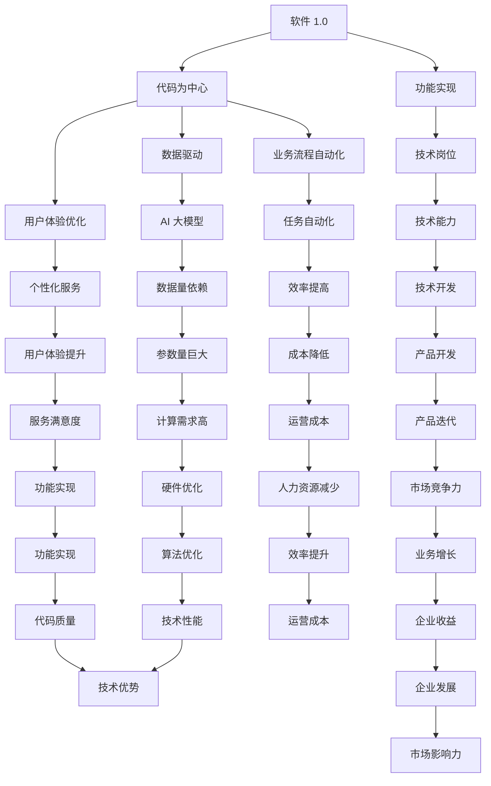

                 

### 从技术岗位到产品经理的转型

> 关键词：技术岗位，产品经理，转型，核心能力，实战案例，职业发展

> 摘要：本文旨在探讨从技术岗位到产品经理的转型过程。通过分析技术岗位与产品经理之间的异同点，阐述转型的重要性与必要性。文章将从产品经理的核心能力、转型过程中的挑战、成功案例分享以及转型策略和准备等方面进行详细阐述，帮助技术从业者顺利实现职业转型。

----------------------------------------------------------------

### 第一部分：核心概念与联系

#### 概述与背景

在当今的数字化时代，技术岗位和产品经理这两个职业角色正变得越来越重要。然而，技术岗位与产品经理之间既有联系又有区别。技术岗位主要涉及开发、测试、运维等工作，而产品经理则侧重于产品的需求分析、设计、开发和迭代。本文将探讨这两个角色之间的紧密联系，以及如何通过转型来实现职业发展。

#### 核心概念联系

**软件 2.0 的定义**：软件 2.0 是继软件 1.0（以代码为中心）之后的阶段，强调用户体验和产品服务。它更注重数据的驱动作用，能够为用户提供个性化、智能化的服务。

**AI 大模型的定义**：AI 大模型是一种具有极高参数量和训练复杂度的神经网络模型，如 GPT、BERT 等。它能够处理大规模数据，实现自动化任务，提升产品的智能化水平。

软件 2.0 与 AI 大模型之间存在紧密联系。数据驱动是软件 2.0 的核心特征，而 AI 大模型则依赖于海量数据进行训练。通过 AI 大模型，产品经理能够优化用户体验，自动化业务流程，提高工作效率。

#### Mermaid 流程图



#### 总结

软件 2.0 和 AI 大模型之间的紧密联系不仅体现在技术层面上，更贯穿于整个企业运营的各个层面，共同推动企业向智能化、数据驱动、用户体验为中心的方向发展。接下来的章节将详细探讨这些核心概念及其在实际中的应用。

----------------------------------------------------------------

### 第1章：软件从1.0到2.0的进化与AI大模型的崛起

#### 1.1 软件 2.0 时代的到来

软件 1.0 时代以代码为中心，主要关注功能的实现和性能的优化。然而，随着互联网的兴起和用户需求的多样化，软件 1.0 的局限性逐渐显现。软件 2.0 时代应运而生，它强调用户体验和产品服务，将用户放在核心位置，通过数据驱动和智能化的方式提升产品价值。

软件 2.0 的主要特点包括：

- **用户体验优化**：软件 2.0 更加注重用户的反馈和需求，通过不断迭代和优化，提供更加个性化的服务。
- **数据驱动**：软件 2.0 强调数据的收集、分析和利用，以数据为依据进行决策和优化。
- **业务流程自动化**：软件 2.0 利用人工智能等技术，自动化执行复杂的业务任务，提高效率。

#### 1.2 AI 大模型的定义与特点

AI 大模型是指参数量达到百万、亿量级以上的神经网络模型，如 GPT、BERT 等。它们具有以下核心特点：

- **参数量巨大**：AI 大模型具有数十亿甚至数万亿个参数，能够处理大规模数据，实现强大的表示能力和泛化能力。
- **训练数据量大**：AI 大模型依赖海量数据进行训练，通过不断的优化和调整，提高模型的准确性和性能。
- **计算需求高**：训练和推理 AI 大模型需要大量的计算资源，对硬件和算法优化有较高的要求。

#### 1.3 主流 AI 大模型简介

目前，市场上主流的 AI 大模型包括以下几个：

- **GPT 系列模型**：如 GPT-3，具有 1750 亿参数，能够生成高质量的自然语言文本。
- **BERT 及其变体**：BERT 是一种双向编码表示器，通过预训练和微调，能够实现多种自然语言处理任务。
- **T5**：T5 是一种基于 Transformer 的文本转换模型，支持多种 NLP 任务。
- **ViT**：ViT 是一种将 Transformer 架构应用于计算机视觉任务的模型。

#### 1.4 AI 大模型在企业中的应用前景

AI 大模型在企业中的应用前景非常广阔，主要表现在以下几个方面：

- **智能客服**：通过 AI 大模型，可以实现智能客服系统，提供 24/7 全天候服务，提高客户满意度。
- **自然语言处理**：AI 大模型能够自动处理和生成文本，提升工作效率。
- **图像识别与处理**：AI 大模型能够自动化图像识别和分析，应用于安全监控、医疗诊断等领域。

#### 1.5 企业采用 AI 大模型的优势与挑战

企业采用 AI 大模型具有以下优势：

- **提升效率**：AI 大模型能够自动化处理大量数据，减少人工操作，提高工作效率。
- **降低成本**：通过自动化任务，企业可以降低对人力资源的依赖，降低运营成本。
- **提高竞争力**：提供个性化服务，提升用户满意度，增强市场竞争力。

然而，企业采用 AI 大模型也面临一些挑战：

- **计算资源需求**：训练和推理 AI 大模型需要大量的计算资源，对硬件和算法优化有较高的要求。
- **数据隐私与安全**：数据处理过程中涉及隐私保护和安全风险。
- **技术创新**：随着 AI 大模型的不断演进，企业需要不断更新技术和算法，以保持竞争力。

#### 1.6 总结

软件 2.0 和 AI 大模型之间的紧密联系不仅体现在技术层面上，更贯穿于整个企业运营的各个层面，共同推动企业向智能化、数据驱动、用户体验为中心的方向发展。接下来的章节将详细探讨这些核心概念及其在实际中的应用。

----------------------------------------------------------------

### 第2章：AI大模型技术基础

#### 2.1 深度学习与神经网络基础

深度学习是机器学习的一个重要分支，它通过模拟人脑神经网络的结构和功能，实现复杂模式识别和数据处理。神经网络是深度学习的基础，它由大量的神经元组成，每个神经元通过权重和偏置进行连接，形成复杂的网络结构。

**神经网络的基本结构**

神经网络的基本结构包括输入层、隐藏层和输出层。输入层接收外部输入信息，隐藏层对输入信息进行加工处理，输出层产生最终输出结果。

**神经元与层**

神经元是神经网络的基本单元，它通过加权求和和激活函数产生输出。每个神经元与输入层的每个元素相乘，然后求和，再通过激活函数进行非线性变换，产生输出。

$$
y = \sigma(\sum_{i=1}^{n} w_i x_i + b)
$$

其中，$y$ 是输出，$w_i$ 是权重，$x_i$ 是输入，$b$ 是偏置，$\sigma$ 是激活函数。

**前向传播与反向传播**

神经网络通过前向传播和反向传播进行训练。在前向传播过程中，输入信息从输入层传递到输出层，每个神经元计算出对应的输出。在反向传播过程中，将输出与真实值进行比较，计算误差，并反向传播误差，更新权重和偏置。

#### 2.2 自然语言处理技术概览

自然语言处理（NLP）是深度学习的一个重要应用领域，它旨在使计算机理解和处理人类自然语言。NLP 技术包括词嵌入、序列模型和注意力机制等。

**词嵌入技术**

词嵌入是将词汇映射为高维向量空间的一种技术，它能够将语义信息编码到向量中。常见的词嵌入模型包括 Word2Vec、GloVe 等。

**序列模型与注意力机制**

序列模型是处理序列数据的一种神经网络模型，如 RNN 和 LSTM。注意力机制是一种能够提高模型对序列数据中关键信息关注度的技术，它能够使模型更加精确地理解和生成序列数据。

**转换器架构详解**

转换器（Transformer）是一种基于自注意力机制的深度学习模型，它在自然语言处理任务中取得了显著的成果。转换器由编码器和解码器组成，能够实现端到端的文本处理。

#### 2.3 大规模预训练模型原理

大规模预训练模型是深度学习的一个重要发展方向，它通过在大量数据上进行预训练，然后进行微调，实现各种自然语言处理任务。大规模预训练模型的核心技术包括预训练、迁移学习和微调。

**预训练的概念与意义**

预训练是指在大规模数据集上进行训练，使模型具备一定的通用知识和表示能力。预训练的意义在于减少训练数据的需求，提高模型在未见数据上的表现。

**自监督学习方法**

自监督学习是一种在未标记数据上进行训练的方法，它利用数据本身的特性，通过预测部分信息来提高模型的能力。常用的自监督任务包括掩码语言模型（MLM）、下一个句子预测（NSP）等。

**迁移学习与微调技术**

迁移学习是指将预训练模型在特定任务上进行微调，以适应新的任务。微调是在预训练模型的基础上，通过少量数据调整模型参数，使模型更好地适应新的任务。

#### 2.4 总结

AI 大模型技术基础包括深度学习、自然语言处理和大规模预训练模型。这些技术为 AI 大模型的发展提供了坚实的基础，使得模型能够处理大规模数据，实现自动化任务，提升用户体验。

----------------------------------------------------------------

### 第3章：AI大模型在技术岗位的应用实践

#### 3.1 技术岗位的AI大模型应用场景

AI 大模型在技术岗位中的应用场景非常广泛，以下是一些典型的应用场景：

- **数据分析与挖掘**：AI 大模型能够处理大量数据，发现隐藏的模式和规律，帮助技术岗位进行数据分析和挖掘。
- **推荐系统**：AI 大模型能够根据用户行为和偏好，提供个性化的推荐服务，提高推荐系统的准确性。
- **自然语言处理**：AI 大模型在自然语言处理领域具有强大的能力，能够实现文本分类、情感分析、机器翻译等任务。

#### 3.2 技术岗位的AI大模型实践案例

**案例一：智能客服系统**

背景：智能客服系统是利用 AI 大模型实现智能对话和问题解决的一个典型应用。该系统通过自然语言处理技术，对用户的问题进行理解和回答，提供 24/7 全天候服务。

技术实现：

1. **数据预处理**：收集用户问题和回答数据，进行清洗和预处理。
2. **模型训练**：使用 GPT 模型进行预训练，然后进行微调，使其能够处理特定领域的问答任务。
3. **对话管理**：实现对话管理模块，根据用户的问题和回答，进行对话的引导和控制。

效果评估：

1. **准确性**：通过评估模型对用户问题的回答准确性，评估模型的性能。
2. **用户满意度**：通过用户反馈，评估系统对用户的服务质量和满意度。

**案例二：智能医疗诊断系统**

背景：智能医疗诊断系统利用 AI 大模型，对医疗图像进行自动分析，提供诊断建议。

技术实现：

1. **图像预处理**：对医疗图像进行预处理，包括图像增强、去噪等。
2. **模型训练**：使用卷积神经网络（CNN）对医疗图像进行训练，使其能够识别疾病。
3. **诊断建议**：根据模型的输出结果，提供诊断建议。

效果评估：

1. **准确性**：通过对比模型输出结果与实际诊断结果，评估模型的准确性。
2. **医生反馈**：收集医生的反馈，评估系统在实际应用中的效果和可靠性。

**案例三：个性化推荐系统**

背景：个性化推荐系统利用 AI 大模型，根据用户的行为和偏好，提供个性化的推荐服务。

技术实现：

1. **用户行为分析**：收集用户的历史行为数据，进行数据分析。
2. **推荐算法**：使用协同过滤、矩阵分解等算法，实现个性化推荐。
3. **推荐结果评估**：根据用户的点击和购买行为，评估推荐结果的效果。

效果评估：

1. **推荐准确性**：通过评估推荐结果的准确性，评估推荐算法的性能。
2. **用户满意度**：通过用户反馈，评估系统对用户的推荐质量和满意度。

#### 3.3 技术岗位到产品经理的转型路径

技术岗位到产品经理的转型是一个复杂的过程，需要技术从业者具备产品思维和跨部门沟通能力。以下是一些转型路径的建议：

1. **积累产品管理经验**：在技术岗位上，积极参与产品需求分析、设计和开发过程，积累产品管理的经验。
2. **学习产品管理知识**：通过学习产品管理的相关书籍、课程和资料，掌握产品管理的基本知识和方法。
3. **提升跨部门沟通能力**：培养跨部门沟通和协作的能力，建立良好的人际关系网络。
4. **参与项目管理**：主动参与项目管理工作，提升项目管理和团队协作能力。
5. **转型后的持续学习**：转型后，不断学习新的知识和技能，跟上行业的发展趋势。

#### 3.4 总结

AI 大模型在技术岗位中的应用实践为技术从业者提供了新的发展机遇。通过掌握 AI 大模型技术，技术从业者可以提升数据分析、推荐系统和自然语言处理等领域的技能，实现职业转型。同时，技术岗位到产品经理的转型也是一个值得探索的方向，需要技术从业者具备产品思维、跨部门沟通能力和项目管理能力。

----------------------------------------------------------------

### 第4章：技术岗位到产品经理的转型策略

#### 4.1 知识储备与能力提升

从技术岗位到产品经理的转型，首先需要技术从业者具备扎实的产品管理知识。以下是一些关键领域的知识储备与能力提升策略：

1. **市场分析能力**：市场分析是产品经理的重要职责，技术从业者需要掌握市场调研、竞争分析、用户需求分析等方法。可以通过阅读相关书籍、参加市场分析培训课程来提升这方面的能力。

2. **用户研究能力**：用户研究是了解用户需求、优化产品体验的关键。技术从业者可以通过用户访谈、问卷调查、用户体验测试等方法，提升对用户需求的洞察力和理解力。

3. **产品设计能力**：产品设计能力包括需求分析、功能规划、界面设计等。技术从业者可以通过学习用户体验设计、交互设计等知识，提升自己的产品设计能力。

4. **项目管理能力**：项目管理能力是产品经理的核心能力之一，包括进度管理、风险管理、团队协作等。技术从业者可以通过学习项目管理相关知识，提升自己的项目管理能力。

5. **跨部门沟通能力**：跨部门沟通能力是产品经理成功的关键。技术从业者需要学会与不同部门的同事有效沟通，协调资源，解决问题。可以通过参加沟通技巧培训、实践跨部门合作项目来提升这一能力。

#### 4.2 实战经验与案例分析

理论知识的积累是基础，但实战经验的积累同样重要。以下是一些通过实战经验提升产品管理能力的建议：

1. **参与实际项目**：积极参与公司内部的产品项目，从实际项目中学习和积累经验。可以从需求分析、设计、开发、测试等环节入手，全面了解产品开发流程。

2. **参加开源项目**：参与开源项目，可以接触到不同类型的产品，了解不同团队的工作方式和文化。通过贡献代码、参与讨论，提升自己的实战能力和团队协作能力。

3. **组织产品研讨会**：组织产品研讨会，邀请同事、用户和行业专家参与，讨论产品方向、用户体验等问题。通过组织研讨会，提升自己的沟通能力和影响力。

4. **参与行业会议**：参加行业会议，了解最新的产品管理趋势和技术动态，结识业内同行，拓展人脉资源。通过行业交流，提升自己的视野和认知水平。

5. **编写技术博客**：撰写技术博客，分享自己在产品管理过程中的心得体会、学习方法和实践经验。通过写作，梳理自己的知识体系，提高自己的表达能力。

#### 4.3 软技能提升与团队领导力

从技术岗位到产品经理的转型，不仅需要专业知识和实战经验，还需要提升软技能和团队领导力。以下是一些建议：

1. **沟通技巧**：良好的沟通技巧是产品经理必备的素质。可以通过学习沟通技巧、参加沟通培训、实践沟通场景来提升自己的沟通能力。

2. **团队协作**：团队协作能力是产品经理的核心能力之一。可以通过参与团队合作项目、学习团队管理知识、培养团队合作精神来提升自己的团队协作能力。

3. **问题解决能力**：面对复杂的问题和挑战，产品经理需要具备强大的问题解决能力。可以通过学习问题解决方法、参加问题解决工作坊、实践问题解决项目来提升自己的问题解决能力。

4. **领导力**：领导力是产品经理的重要素质。可以通过学习领导力理论、参加领导力培训、实践领导力情境来提升自己的领导力。

5. **自我管理**：良好的自我管理能力是产品经理成功的关键。可以通过制定个人学习计划、培养自律习惯、管理时间等方式来提升自己的自我管理能力。

#### 4.4 转型策略总结

从技术岗位到产品经理的转型需要系统的策略和持续的努力。以下是一些转型策略的总结：

1. **明确转型目标**：明确自己的转型目标和方向，制定具体的行动计划。
2. **持续学习**：不断学习新的知识和技能，提升自己的专业素养和综合素质。
3. **实战经验**：通过参与实际项目和实战案例，积累经验，提升自己的实战能力。
4. **软技能提升**：注重软技能的提升，如沟通技巧、团队协作能力、领导力等。
5. **建立人脉**：通过参加行业会议、社区活动等方式，建立人脉资源，拓展视野。
6. **调整心态**：保持积极的心态，面对转型过程中的挑战和困难，勇于尝试和突破。

#### 4.5 总结

从技术岗位到产品经理的转型是一个充满挑战和机遇的过程。通过系统的策略和持续的努力，技术从业者可以成功实现职业转型，成为优秀的产品经理。在转型过程中，要注重知识储备、实战经验、软技能提升和团队领导力的培养，同时保持积极的心态，勇于面对挑战，不断学习和进步。

----------------------------------------------------------------

### 第5章：产品经理的核心技能与实战技巧

#### 5.1 产品需求分析与设计

产品需求分析是产品经理的重要职责之一，它涉及到对用户需求、市场趋势和业务目标的理解与分析。以下是一些产品需求分析和设计的关键步骤和技巧：

1. **需求收集**：通过用户访谈、问卷调查、用户调研等方式收集用户需求。同时，分析竞争对手的产品，了解市场需求和趋势。

2. **需求分析**：对收集到的需求进行分类、筛选和优先级排序。分析需求的具体内容、实现难度和商业价值。

3. **需求文档**：编写详细的需求文档，包括功能描述、用户场景、使用流程、界面设计等。需求文档是后续设计和开发的依据。

4. **原型设计**：基于需求文档，设计产品原型。可以通过线框图、低保真原型、高保真原型等方式，将产品功能和使用流程可视化。

5. **用户反馈**：在设计过程中，与用户进行互动，收集他们的反馈和建议。根据用户反馈进行迭代优化，确保产品满足用户需求。

6. **设计评审**：组织设计评审会议，邀请相关 stakeholders（如产品经理、开发团队、测试团队等）参与。评审产品原型，讨论设计方案的可行性、用户体验和功能实现。

7. **需求管理**：建立需求管理系统，跟踪需求的进度、变更和优先级。确保需求得到有效管理和控制。

#### 5.2 用户研究与市场分析

用户研究和市场分析是产品经理的重要工作内容，它有助于了解用户需求、市场趋势和竞争环境。以下是一些用户研究和市场分析的方法和技巧：

1. **用户调研**：通过问卷调查、用户访谈、用户观察等方式，收集用户行为、需求和偏好。用户调研可以采用线上和线下相结合的方式。

2. **数据分析**：利用数据分析工具，对用户行为数据进行分析。分析用户的访问路径、停留时间、点击率等指标，了解用户的行为习惯和偏好。

3. **用户画像**：基于用户调研和数据分析，构建用户画像。用户画像可以帮助产品经理更好地了解目标用户，制定针对性的产品策略。

4. **市场趋势**：关注市场趋势和行业动态，了解新兴技术、商业模式和用户需求的变化。可以通过阅读行业报告、参加行业会议、与业内专家交流等方式获取市场信息。

5. **竞争分析**：分析竞争对手的产品、优势和劣势，了解市场的竞争格局。通过竞争分析，找到自身的优势和差异化策略。

6. **SWOT分析**：对自身产品进行 SWOT 分析（优势、劣势、机会、威胁），评估产品的市场竞争力。SWOT 分析可以帮助产品经理制定针对性的产品策略。

7. **市场预测**：基于市场趋势和竞争分析，预测市场的未来发展。市场预测有助于产品经理制定长期规划和战略。

#### 5.3 产品开发与项目管理

产品开发与项目管理是产品经理的核心工作内容，它涉及到产品从设计到开发、测试、上线等各个环节。以下是一些产品开发与项目管理的技巧：

1. **敏捷开发**：采用敏捷开发方法，快速迭代、持续交付。敏捷开发强调团队合作、用户反馈和灵活应对变化。

2. **需求管理**：建立有效的需求管理系统，跟踪需求的进度、变更和优先级。确保需求得到有效管理和控制。

3. **项目管理**：制定详细的项目计划，明确项目目标、任务、资源和时间表。通过项目跟踪和监控，确保项目按计划进行。

4. **风险管理**：识别项目风险，制定风险应对策略。通过风险管理，降低项目风险对项目进度和目标的影响。

5. **团队协作**：建立高效的团队协作机制，确保团队成员之间的沟通畅通、协作顺畅。可以通过使用项目管理工具、定期团队会议等方式，提升团队协作效率。

6. **质量控制**：制定严格的质量控制标准，确保产品的质量满足用户需求。通过测试、验收等方式，发现和修复产品缺陷。

7. **用户反馈**：上线后，收集用户反馈，了解产品的实际使用情况和用户满意度。根据用户反馈，进行产品优化和迭代。

#### 5.4 数据驱动的产品优化与迭代

数据驱动的产品优化与迭代是产品经理的重要工作内容，它有助于提升产品的用户体验和市场竞争能力。以下是一些数据驱动的产品优化与迭代的技巧：

1. **数据分析**：利用数据分析工具，对产品数据进行深入分析。分析用户行为、用户满意度、业务指标等数据，了解产品的优势和不足。

2. **A/B 测试**：通过 A/B 测试，对比不同版本产品的效果。根据测试结果，优化产品设计、功能和用户体验。

3. **用户反馈**：收集用户反馈，了解用户的需求和痛点。根据用户反馈，进行产品优化和迭代。

4. **数据驱动的决策**：基于数据分析结果，制定产品优化和迭代策略。数据驱动的决策有助于提高产品的市场竞争力和用户体验。

5. **持续迭代**：持续进行产品优化和迭代，不断满足用户需求和市场变化。通过持续迭代，提升产品的用户体验和用户满意度。

#### 5.5 产品经理的职业发展与晋升路径

产品经理的职业发展与晋升路径因人而异，但以下是一些常见的发展路径和晋升路径：

1. **初级产品经理**：负责具体的产品项目，参与需求分析、设计、开发和测试等工作。初级产品经理需要具备扎实的产品知识和项目经验。

2. **中级产品经理**：负责更复杂的产品项目，具有更广泛的产品管理职责。中级产品经理需要具备良好的沟通能力、团队协作能力和项目管理能力。

3. **高级产品经理**：负责公司级或跨部门的重要产品项目，具有决策权和影响力。高级产品经理需要具备深厚的行业知识和丰富的产品管理经验。

4. **产品总监**：负责公司的产品战略和产品规划，具有公司级的产品管理职责。产品总监需要具备战略思维、领导能力和团队管理能力。

5. **创业或职业转型**：部分产品经理选择创业或转型到其他职业领域。创业或转型需要产品经理具备创新精神、市场洞察力和领导能力。

#### 5.6 总结

产品经理的核心技能和实战技巧包括需求分析、用户研究、产品设计、项目管理、数据驱动和职业发展等。通过不断学习和实践，产品经理可以不断提升自己的专业素养和综合素质，成为优秀的产品经理。

----------------------------------------------------------------

### 第6章：成功转型者的心路历程与建议

#### 6.1 转型者心路历程

从技术岗位到产品经理的转型是一个充满挑战和机遇的过程。以下是一些成功转型者的心路历程：

**案例一：张三**

张三是一名有多年软件开发经验的技术专家，他决定转型成为产品经理。在转型初期，张三感到困惑和不安，因为他需要学习大量的新知识和技能。然而，他并没有放弃，而是积极寻找学习资源，参加培训课程，阅读相关书籍。在转型的过程中，张三遇到了许多困难和挑战，但他始终坚持下去，不断提升自己的能力。经过几年的努力，张三成功地转型成为了一名优秀的产品经理。

**案例二：李四**

李四是一名测试工程师，他对产品的质量和用户体验非常关注。在了解到产品经理这一岗位后，李四决定转型。他首先参加了产品经理的培训课程，学习产品管理的知识和技能。在转型过程中，李四遇到了很多困难，但他始终保持积极的心态，不断学习和实践。他积极参与公司的产品项目，从需求分析、设计到开发、测试等环节，都全力以赴。经过一段时间的努力，李四成功地转型成为了一名产品经理。

#### 6.2 转型建议与心得

基于成功转型者的经验和教训，以下是一些建议和心得，帮助正在考虑或正在进行转型的技术从业者：

1. **明确转型目标**：在转型之前，要明确自己的转型目标，了解产品经理的职责和技能要求。这样可以有针对性地进行学习和准备。

2. **积极学习新知识**：产品管理涉及多个领域，包括市场分析、用户研究、产品设计、项目管理等。要积极学习相关的知识和技能，可以通过参加培训课程、阅读书籍、在线学习等方式进行。

3. **实践是关键**：理论知识是基础，但实践才是提升能力的核心。要积极参与实际项目，从实际操作中学习和积累经验。

4. **建立人脉关系**：在转型过程中，建立良好的人脉关系非常重要。可以通过参加行业会议、加入产品管理社区、与同行交流等方式，拓展人脉资源。

5. **保持积极心态**：转型过程中会遇到各种挑战和困难，要保持积极的心态，勇于面对挑战。同时，要学会调整自己的心态，保持平衡。

6. **不断反思与改进**：在转型过程中，要不断反思自己的行为和做法，总结经验教训，持续改进。通过反思和改进，不断提升自己的能力和素质。

#### 6.3 转型中的常见问题与解决方案

在技术岗位到产品经理的转型过程中，常见的问题和挑战包括：

1. **知识储备不足**：产品管理涉及多个领域，需要具备广泛的知识储备。解决方案是积极学习，参加培训课程，阅读相关书籍，不断充实自己的知识体系。

2. **沟通能力不足**：产品经理需要与多个部门和团队进行沟通协作。解决方案是提高沟通能力，学会有效的沟通技巧，建立良好的人际关系。

3. **项目管理经验不足**：产品经理需要具备项目管理的能力。解决方案是参与实际项目，学习项目管理的方法和技巧，积累项目管理经验。

4. **心态调整困难**：转型过程中，可能会遇到各种困难和挫折。解决方案是保持积极的心态，学会调整自己的心态，勇于面对挑战。

5. **时间管理困难**：转型过程中，需要同时应对技术和产品管理的工作。解决方案是提高时间管理能力，合理安排时间和任务，确保工作顺利进行。

通过解决这些问题和挑战，技术从业者可以顺利实现从技术岗位到产品经理的转型。

#### 6.4 总结

成功转型者的心路历程和经验教训为正在考虑或正在进行转型的技术从业者提供了宝贵的参考。通过明确转型目标、积极学习新知识、实践是关键、建立人脉关系、保持积极心态和不断反思与改进，技术从业者可以成功实现从技术岗位到产品经理的转型。

----------------------------------------------------------------

### 第7章：从技术岗位到产品经理的转型策略与实践

#### 7.1 转型策略

从技术岗位到产品经理的转型需要系统的策略和明确的规划。以下是一些关键的转型策略：

1. **明确转型目标**：首先，要明确自己的转型目标，了解产品经理的职责和技能要求。这有助于制定具体的转型计划和目标。

2. **学习产品管理知识**：产品管理涉及多个领域，包括市场分析、用户研究、产品设计、项目管理等。要积极学习相关的知识和技能，可以通过参加培训课程、阅读书籍、在线学习等方式进行。

3. **积累实际经验**：理论知识是基础，但实际经验同样重要。要积极参与实际项目，从实际操作中学习和积累经验。可以通过参与公司的产品项目、加入开源项目等方式，积累实际经验。

4. **建立人脉关系**：在转型过程中，建立良好的人脉关系非常重要。可以通过参加行业会议、加入产品管理社区、与同行交流等方式，拓展人脉资源。

5. **提升沟通能力**：产品经理需要与多个部门和团队进行沟通协作。要提升沟通能力，学会有效的沟通技巧，建立良好的人际关系。

6. **持续学习和成长**：转型是一个持续的过程，要不断学习新的知识和技能，提升自己的专业素养和综合素质。可以通过参加培训课程、阅读书籍、参加行业会议等方式，持续学习和成长。

#### 7.2 实践案例

以下是一个从技术岗位到产品经理的转型实践案例：

**案例背景**：李明是一名有多年软件开发经验的高级工程师，他对产品管理产生了浓厚的兴趣，决定转型成为产品经理。

**转型过程**：

1. **明确转型目标**：李明首先明确了自己的转型目标，他希望通过转型能够更好地理解用户需求，推动产品的创新和迭代。

2. **学习产品管理知识**：李明参加了一个产品经理的培训课程，学习了市场分析、用户研究、产品设计、项目管理等知识。同时，他还阅读了相关的书籍和文章，不断充实自己的知识体系。

3. **积累实际经验**：李明积极参与公司的产品项目，从需求分析、设计到开发、测试等环节，他都积极参与并提出了许多建设性的意见。他还主动加入了开源项目，通过实际操作积累了产品管理的经验。

4. **建立人脉关系**：李明积极参加行业会议和产品管理社区的活动，结识了许多同行业的专业人士。通过与他们的交流，他获得了许多宝贵的经验和建议。

5. **提升沟通能力**：李明意识到沟通能力对产品经理非常重要，他参加了一些沟通技巧培训课程，学习了如何有效地与团队成员、上级和客户进行沟通。

6. **持续学习和成长**：李明不断学习新的知识和技能，通过参加培训课程、阅读书籍、参加行业会议等方式，不断提升自己的专业素养和综合素质。

**转型效果**：

经过几年的努力，李明成功地转型成为了一名优秀的产品经理。他在产品规划、设计、开发和迭代等方面都有出色的表现，为公司带来了显著的业务增长。他的转型经验也激励了更多的技术从业者走上了产品经理的道路。

#### 7.3 转型策略总结

从技术岗位到产品经理的转型需要明确的目标、系统的策略和持续的努力。以下是一些转型策略的总结：

1. **明确转型目标**：明确自己的转型目标，了解产品经理的职责和技能要求。

2. **学习产品管理知识**：通过培训课程、阅读书籍、在线学习等方式，积极学习产品管理的知识和技能。

3. **积累实际经验**：参与实际项目，积累产品管理的实践经验。

4. **建立人脉关系**：积极参加行业会议和社区活动，拓展人脉资源。

5. **提升沟通能力**：学习沟通技巧，建立良好的人际关系。

6. **持续学习和成长**：不断学习新的知识和技能，提升自己的专业素养和综合素质。

通过这些策略，技术从业者可以顺利实现从技术岗位到产品经理的转型。

#### 7.4 转型实践总结

从技术岗位到产品经理的转型是一个充满挑战和机遇的过程。通过明确的策略和持续的努力，技术从业者可以成功实现职业转型。以下是一些转型实践总结：

1. **明确目标**：明确转型目标，有助于制定具体的转型计划和目标。

2. **持续学习**：学习是转型的关键，要不断学习新的知识和技能，提升自己的专业素养。

3. **积累经验**：参与实际项目，积累产品管理的实践经验。

4. **建立人脉**：拓展人脉资源，与同行业专业人士建立良好的关系。

5. **提升沟通**：沟通是产品经理的核心能力之一，要不断学习和提升沟通技巧。

6. **心态调整**：转型过程中会遇到各种挑战和困难，要调整心态，保持积极乐观的态度。

通过这些实践总结，技术从业者可以更好地应对转型过程中的挑战，实现职业发展。

----------------------------------------------------------------

### 第8章：从技术岗位到产品经理的软技能培养

#### 8.1 跨部门沟通与协作

跨部门沟通与协作是产品经理必须掌握的重要技能之一。产品经理需要与开发、测试、市场、设计等多个部门进行有效沟通，确保产品从概念到落地都能顺利进行。

1. **了解不同部门的工作内容和流程**：了解各部门的工作内容和流程，有助于产品经理更好地理解其他部门的挑战和需求。

2. **建立信任关系**：与各部门建立信任关系，有助于减少沟通障碍，提高协作效率。

3. **明确沟通目标和方式**：在沟通前明确目标和方式，确保沟通的针对性和有效性。

4. **使用简洁明了的语言**：使用简洁明了的语言进行沟通，避免使用专业术语，确保所有参与者都能理解。

5. **积极倾听**：在沟通中，积极倾听对方的意见和需求，尊重对方的观点。

6. **定期更新进展**：定期更新项目进展，确保所有相关部门都能了解项目状态。

7. **解决冲突**：在跨部门沟通中，难免会遇到冲突。产品经理需要具备解决冲突的能力，确保项目顺利进行。

#### 8.2 问题解决与决策能力

问题解决和决策能力是产品经理在日常工作中经常需要用到的技能。以下是一些提升这些能力的方法：

1. **分析问题**：面对问题时，首先要对问题进行分析，找出问题的根本原因。

2. **制定解决方案**：在分析问题的基础上，制定具体的解决方案。

3. **评估方案**：对制定的解决方案进行评估，确保其可行性和有效性。

4. **决策**：在评估方案的基础上，做出决策。

5. **执行决策**：决策后，要确保执行方案，监控执行过程。

6. **反馈与调整**：在执行过程中，及时收集反馈，根据反馈进行调整。

7. **学习经验**：通过每次问题解决和决策的过程，总结经验，不断提升自己的能力。

#### 8.3 团队领导力与激励

团队领导力和激励能力是产品经理的重要素质之一。以下是一些提升团队领导力和激励能力的方法：

1. **明确团队目标**：与团队成员明确团队目标，确保团队成员都清楚自己的职责和目标。

2. **建立信任**：建立团队成员之间的信任，提高团队的协作效率。

3. **倾听与理解**：倾听团队成员的意见和建议，理解他们的需求和困难。

4. **授权与支持**：给予团队成员足够的授权和支持，让他们能够充分发挥自己的能力。

5. **激励与奖励**：通过激励和奖励，激发团队成员的工作热情和积极性。

6. **反馈与沟通**：定期与团队成员进行反馈和沟通，了解他们的工作进展和需求。

7. **培养团队文化**：建立积极的团队文化，提高团队的凝聚力和向心力。

#### 8.4 软技能提升策略

提升软技能需要系统的策略和持续的努力。以下是一些提升软技能的策略：

1. **参加培训课程**：参加与软技能提升相关的培训课程，学习新的知识和方法。

2. **实践与反思**：在实际工作中，不断实践和反思，总结经验和教训。

3. **阅读相关书籍**：阅读与软技能提升相关的书籍，学习先进的理论和实践方法。

4. **参加社区活动**：参加行业社区的活动，与同行交流，获取新的见解和经验。

5. **寻求导师指导**：寻找有经验的导师，请教他们的问题和经验。

6. **自我反思与改进**：定期进行自我反思，找出自己的不足，制定改进计划。

#### 8.5 总结

从技术岗位到产品经理的转型，不仅需要技术能力的提升，还需要软技能的培养。跨部门沟通与协作、问题解决与决策能力、团队领导力与激励能力等软技能是产品经理成功的关键。通过系统的策略和持续的努力，技术从业者可以提升自己的软技能，实现从技术岗位到产品经理的顺利转型。

----------------------------------------------------------------

### 第9章：从技术岗位到产品经理的职业规划与个人成长

#### 9.1 职业规划与成长路径

职业规划是职业发展的重要环节，它有助于明确目标、制定策略和实现个人价值。对于从技术岗位到产品经理的转型，以下是一个典型的职业规划与成长路径：

1. **初级阶段**：在这一阶段，重点是积累产品管理的理论知识，如市场分析、用户研究、产品设计等。可以通过参加培训课程、阅读相关书籍和资料来提升自己的知识储备。

2. **中级阶段**：在这一阶段，需要积累实际的产品管理经验。可以积极参与实际项目，从需求分析、设计到开发、测试等环节，全面了解产品开发流程。同时，提升项目管理能力和团队协作能力。

3. **高级阶段**：在这一阶段，需要具备跨部门沟通和协调能力，能够负责更复杂的产品项目，甚至参与公司的产品战略制定。需要不断提升自己的领导力和决策能力。

4. **专家阶段**：在这一阶段，成为产品管理领域的专家，具备丰富的产品管理经验和深厚的行业知识。可以担任产品总监或相关高级职位，参与公司的战略决策。

#### 9.2 个人成长与技能提升

个人成长和技能提升是职业发展的关键。以下是一些建议：

1. **持续学习**：不断学习新的知识和技能，跟上行业的发展趋势。可以通过参加线上课程、阅读专业书籍、参加行业会议等方式进行学习。

2. **实践与反思**：通过实际项目和实践来提升自己的能力，同时进行反思和总结，不断优化自己的方法和策略。

3. **建立人脉**：积极参与行业活动和社区，建立广泛的人脉网络。通过与同行的交流和合作，获取新的见解和经验。

4. **专业认证**：获取相关的专业认证，如 PMP（项目管理专业人士）、PMI-ACP（敏捷认证实践者）等，提升自己的专业素养和竞争力。

5. **自我管理**：提高自我管理能力，包括时间管理、情绪管理和目标管理等。通过自我管理，提高工作效率和质量。

#### 9.3 职业发展与晋升路径

职业发展是一个逐步提升的过程，以下是一些常见的晋升路径：

1. **初级产品经理**：负责具体的产品项目，参与需求分析、设计、开发、测试等环节。

2. **中级产品经理**：负责更复杂的产品项目，具备更广泛的产品管理职责，能够独立负责一个或多个产品线。

3. **高级产品经理**：负责公司级或跨部门的重要产品项目，具有决策权和影响力。

4. **产品总监**：负责公司的产品战略和产品规划，具备公司级的产品管理职责。

5. **创业或职业转型**：部分产品经理选择创业或转型到其他职业领域，如创业、咨询、教育培训等。

#### 9.4 个人成长与职业发展的关系

个人成长与职业发展密切相关。个人成长是职业发展的基础，通过不断学习和提升自己的能力，可以更好地适应职业发展的需求。同时，职业发展为个人成长提供了更广阔的平台和机会。通过实现职业目标，个人可以进一步提升自己的能力和价值。

#### 9.5 总结

从技术岗位到产品经理的职业规划与个人成长是一个持续的过程。通过明确的职业规划、持续的学习和技能提升，以及积极的职业发展，技术从业者可以顺利实现从技术岗位到产品经理的转型，并在职业道路上取得更大的成就。

----------------------------------------------------------------

### 第10章：从技术岗位到产品经理的全面准备

#### 10.1 转型前的准备

在从技术岗位到产品经理的转型过程中，充分的准备至关重要。以下是一些转型前的准备工作：

1. **自我评估**：首先，要对自己的能力和兴趣进行评估。了解自己的优势、劣势和职业兴趣，确定自己是否适合转型。

2. **学习计划**：制定详细的学习计划，包括需要学习的知识领域、学习资源和学习时间。可以通过参加培训课程、阅读相关书籍和文章来提升自己的知识储备。

3. **建立人脉**：在转型前，建立广泛的人脉网络有助于未来的职业发展。可以通过参加行业会议、加入产品管理社区等方式，结识业内人士。

4. **实践经验**：积累实际的产品管理经验，可以通过参与公司的产品项目、加入开源项目或志愿参与相关的项目来提升实践经验。

5. **技能提升**：根据学习计划和转型目标，有针对性地提升相关技能。例如，提升项目管理能力、沟通能力、用户研究能力等。

#### 10.2 转型中的支持系统

在转型过程中，有一个强大的支持系统是非常重要的。以下是一些支持系统的建议：

1. **导师指导**：找到一个经验丰富的导师，他们可以提供职业发展的指导和建议。导师可以帮助你更好地理解产品经理的职责和角色。

2. **团队支持**：在转型初期，得到团队成员的支持和帮助是非常宝贵的。团队成员可以提供实际操作的建议和支持。

3. **学习社区**：加入产品管理相关的学习社区和论坛，与其他产品经理交流经验和心得，获取新的见解和资源。

4. **资源整合**：利用公司内部的资源，如培训课程、内部交流会议等，提升自己的技能和知识。

5. **外部支持**：寻求外部支持和帮助，如职业咨询、职业培训等。这些外部资源可以帮助你更好地了解行业动态和市场需求。

#### 10.3 转型后的持续发展

转型后的持续发展同样重要。以下是一些建议：

1. **持续学习**：行业和技术在不断变化，产品经理需要不断学习新的知识和技能，以保持竞争力。

2. **职业拓展**：在转型后，可以探索更多的职业拓展机会，如担任高级产品经理、加入创业公司、参与行业咨询等。

3. **个人品牌建设**：建立个人品牌，通过撰写博客、发表演讲、参与社区活动等方式，提升自己的知名度和影响力。

4. **反馈与改进**：定期收集用户和团队成员的反馈，根据反馈进行改进和优化，提升自己的产品管理能力。

5. **职业规划**：根据职业发展目标，制定长期的职业规划，确保自己能够在产品管理领域持续成长。

#### 10.4 总结

从技术岗位到产品经理的转型是一个复杂的过程，需要充分的准备和持续的努力。通过自我评估、学习计划、建立人脉、实践经验、技能提升等准备措施，可以更好地应对转型过程中的挑战。同时，转型后的持续发展同样重要，通过持续学习、职业拓展、个人品牌建设等，可以确保在产品管理领域持续成长。

----------------------------------------------------------------

### 附录

#### 附录 A: 常用工具与资源

**A.1 深度学习框架**

- **TensorFlow**：TensorFlow 是由 Google 开发的一款开源深度学习框架，适用于各种深度学习任务，包括图像识别、自然语言处理等。
  - 官网：[https://www.tensorflow.org/](https://www.tensorflow.org/)
- **PyTorch**：PyTorch 是由 Facebook AI 研究团队开发的一款开源深度学习框架，具有简单易用、灵活的特点。
  - 官网：[https://pytorch.org/](https://pytorch.org/)

**A.2 数据处理工具**

- **Pandas**：Pandas 是一款开源的数据处理库，适用于数据清洗、数据分析等任务。
  - 官网：[https://pandas.pydata.org/](https://pandas.pydata.org/)
- **NumPy**：NumPy 是一款开源的科学计算库，提供高效、灵活的数值计算功能。
  - 官网：[https://numpy.org/](https://numpy.org/)

**A.3 版本控制系统**

- **Git**：Git 是一款开源的分布式版本控制系统，适用于代码管理、协作开发等任务。
  - 官网：[https://git-scm.com/](https://git-scm.com/)
- **GitHub**：GitHub 是基于 Git 的代码托管平台，提供代码仓库、版本控制、协作开发等功能。
  - 官网：[https://github.com/](https://github.com/)

**A.4 其他资源**

- **在线课程**：许多在线平台提供产品管理的相关课程，如 Coursera、Udemy、网易云课堂等。
  - Coursera: [https://www.coursera.org/](https://www.coursera.org/)
  - Udemy: [https://www.udemy.com/](https://www.udemy.com/)
  - 网易云课堂: [https://study.163.com/](https://study.163.com/)
- **产品管理社区**：加入产品管理相关的社区和论坛，如 Product School、Product Hunt、知乎等，可以获取最新的行业动态和资源。
  - Product School: [https://www.productschool.com/](https://www.productschool.com/)
  - Product Hunt: [https://www.producthunt.com/](https://www.producthunt.com/)
  - 知乎：[https://www.zhihu.com/](https://www.zhihu.com/)

#### 附录 B: 常用符号与公式

**B.1 符号表**

- $\sigma$：激活函数
- $w_i$：权重
- $x_i$：输入
- $b$：偏置
- $y$：输出
- $n$：神经元数量

**B.2 公式**

1. 前向传播：
   $$
   y = \sigma(\sum_{i=1}^{n} w_i x_i + b)
   $$

2. 反向传播：
   $$
   \Delta w_i = -\eta \frac{\partial L}{\partial w_i}
   $$
   $$
   \Delta b = -\eta \frac{\partial L}{\partial b}
   $$

其中，$L$ 是损失函数，$\eta$ 是学习率。

#### 附录 C: 参考文献

- Russell, S., & Norvig, P. (2016). 《人工智能：一种现代的方法》(第三版). 机械工业出版社。
- Goodfellow, I., Bengio, Y., & Courville, A. (2016). 《深度学习》（中文版）. 电子工业出版社。
- Martin, R. L. (2017). 《产品经理实战手册》. 电子工业出版社。
- Christensen, C. M. (1997). 《创新者的窘境》. 中国青年出版社。

----------------------------------------------------------------

### 文章末尾

**作者：** AI天才研究院/AI Genius Institute & 禅与计算机程序设计艺术 /Zen And The Art of Computer Programming

感谢您的阅读，希望本文能够帮助您了解从技术岗位到产品经理的转型过程。如果您有任何疑问或建议，欢迎在评论区留言，我们将尽快为您解答。同时，也欢迎您关注我们的公众号，获取更多优质内容。再次感谢您的支持！

----------------------------------------------------------------

[文章标题：从技术岗位到产品经理的转型]

关键词：技术岗位，产品经理，转型，核心能力，实战案例，职业发展

摘要：本文旨在探讨从技术岗位到产品经理的转型过程。通过分析技术岗位与产品经理之间的异同点，阐述转型的重要性与必要性。文章将从产品经理的核心能力、转型过程中的挑战、成功案例分享以及转型策略和准备等方面进行详细阐述，帮助技术从业者顺利实现职业转型。

----------------------------------------------------------------

### 第1章 引言

#### 1.1 什么是产品经理

产品经理（Product Manager，简称PM）是企业中负责产品策略、规划、开发、上线、运营及优化等全过程的职责人。产品经理的主要任务包括：

- **需求分析**：深入市场调研，了解用户需求，挖掘潜在需求。
- **产品设计**：基于需求进行功能规划，设计产品原型和用户界面。
- **项目管理**：协调开发团队，制定项目计划，确保项目按时交付。
- **产品运营**：监控产品上线后的表现，收集用户反馈，进行产品迭代。
- **数据驱动**：利用数据分析工具，对产品数据进行追踪和分析，优化产品功能。

在技术岗位和产品经理之间，技术岗位更多关注于代码编写、系统架构、性能优化等方面，而产品经理则更加注重用户需求、市场趋势和业务目标。尽管两者的工作内容有所不同，但它们在推动企业发展中起着相辅相成的角色。

#### 1.2 转型的必要性

技术岗位的发展瓶颈是许多技术从业者面临的挑战。在技术岗位上，尽管可以不断提升技术水平，但职业发展的天花板相对明显。而产品经理则提供了另一种职业发展路径，通过深入理解市场和用户需求，发挥技术和商业智慧，实现更高层次的职业价值。

从技术岗位转型为产品经理的必要性主要体现在以下几个方面：

1. **拓宽职业发展空间**：产品经理负责产品的全生命周期管理，具备更广阔的职业发展空间。
2. **提升综合能力**：产品经理需要具备市场分析、用户研究、项目管理等多方面的能力，实现综合能力的提升。
3. **更高的职业价值**：产品经理在决策层中发挥重要作用，能够为公司创造更大的商业价值。
4. **满足个人兴趣**：许多技术从业者对产品创新、用户体验和市场战略感兴趣，转型为产品经理可以满足个人兴趣。

#### 1.3 文章结构

本文将分为以下几个部分：

- **第1章 引言**：介绍产品经理的角色与转型的必要性。
- **第2章 产品经理的核心能力**：探讨产品经理所需的核心能力，包括市场分析、用户研究、产品设计和项目管理等。
- **第3章 技术岗位到产品经理的技能转化**：分析技术岗位人员如何将技术能力转化为产品管理能力。
- **第4章 转型实战**：分享从技术岗位到产品经理的转型过程和成功案例。
- **第5章 转型策略与准备**：讨论如何制定转型策略和做好充分准备。
- **第6章 软技能培养**：介绍产品经理所需的重要软技能，如沟通、协作和领导力等。
- **第7章 职业规划与个人成长**：探讨职业规划、个人成长与职业发展的关系。
- **第8章 全面准备**：讨论转型前的准备工作、转型中的支持系统以及转型后的持续发展。
- **附录**：提供常用工具、资源、符号与公式以及参考文献。

通过本文的阅读，读者将全面了解从技术岗位到产品经理的转型过程，掌握必要的核心能力，明确转型策略，为成功转型打下坚实基础。

----------------------------------------------------------------

### 第2章 产品经理的核心能力

#### 2.1 市场分析

市场分析是产品经理的重要职责之一，它涉及到对市场需求、竞争环境和用户行为的深入理解。以下是市场分析的关键步骤和方法：

1. **市场调研**：市场调研是收集市场信息和数据的过程。可以通过以下方法进行市场调研：

   - **问卷调查**：设计问卷，收集用户对产品或服务的看法和需求。
   - **用户访谈**：与潜在用户或现有用户进行面对面访谈，了解他们的需求和行为。
   - **数据分析**：利用现有数据，分析用户行为、购买习惯和市场趋势。

2. **竞争分析**：竞争分析是了解竞争对手的产品、市场份额和策略。可以通过以下方法进行竞争分析：

   - **产品对比**：对比自家产品与竞争对手的产品，分析差异和优势。
   - **市场调研**：收集竞争对手的市场表现、用户评价和市场份额。
   - **社交媒体分析**：分析竞争对手在社交媒体上的互动和宣传策略。

3. **用户画像**：用户画像是对目标用户群体的特征和需求进行描绘。可以通过以下方法创建用户画像：

   - **用户调研**：收集用户的基本信息、行为习惯和购买偏好。
   - **数据分析**：利用数据分析工具，分析用户行为和购买习惯。
   - **用户访谈**：与典型用户进行深入访谈，了解他们的需求和期望。

4. **市场趋势分析**：市场趋势分析是了解市场的发展方向和变化。可以通过以下方法进行市场趋势分析：

   - **行业报告**：阅读行业报告，了解市场的发展动态和趋势。
   - **技术动态**：关注新技术的发展和应用，了解其对市场的影响。
   - **用户反馈**：收集用户对产品的新需求和建议，分析市场趋势。

5. **SWOT分析**：SWOT分析是评估产品的优势、劣势、机会和威胁。可以通过以下方法进行SWOT分析：

   - **优势**：分析产品在技术、市场、品牌等方面的优势。
   - **劣势**：分析产品在技术、市场、品牌等方面的劣势。
   - **机会**：分析市场趋势和用户需求，识别潜在的机会。
   - **威胁**：分析竞争对手、市场变化和外部因素对产品的威胁。

#### 2.2 用户研究

用户研究是了解用户需求、行为和体验的关键。以下是一些用户研究的方法和工具：

1. **用户访谈**：用户访谈是一种直接了解用户需求和意见的方法。可以通过以下步骤进行用户访谈：

   - **访谈准备**：设计访谈大纲，明确访谈目标和问题。
   - **访谈过程**：与用户面对面或通过电话、视频会议等方式进行访谈。
   - **访谈记录**：记录用户的回答和反馈，进行归纳和总结。

2. **问卷调查**：问卷调查是一种高效收集用户意见和反馈的方法。可以通过以下步骤进行问卷调查：

   - **问卷设计**：设计问卷结构，包括问题类型、问题顺序和答案选项。
   - **问卷发布**：通过在线平台、社交媒体或邮件等方式发布问卷。
   - **数据分析**：收集问卷结果，利用数据分析工具进行数据分析和可视化。

3. **用户体验测试**：用户体验测试是一种评估用户在使用产品过程中的感受和体验的方法。可以通过以下步骤进行用户体验测试：

   - **测试准备**：设计测试场景，包括任务、目标和用户样本。
   - **测试过程**：邀请用户参与测试，记录用户的行为和反馈。
   - **测试分析**：分析测试数据，识别用户体验问题和改进点。

4. **用户反馈收集**：用户反馈收集是了解用户对产品的真实感受和意见。可以通过以下方法收集用户反馈：

   - **在线反馈表**：在产品界面中添加反馈表，让用户可以随时提交反馈。
   - **社交媒体**：在社交媒体平台上关注用户反馈，及时回应和处理用户问题。
   - **用户社区**：建立用户社区，让用户可以交流意见和分享经验。

#### 2.3 产品设计

产品设计是产品经理的核心职责之一，它涉及到产品的功能设计、用户界面设计、用户体验设计等方面。以下是一些产品设计的方法和工具：

1. **需求分析**：需求分析是了解用户需求和确定产品功能的过程。可以通过以下步骤进行需求分析：

   - **用户访谈**：与用户进行访谈，了解他们的需求和期望。
   - **市场调研**：收集市场信息和竞争对手的产品特点。
   - **竞品分析**：分析竞争对手的产品，识别优势和不足。

2. **功能规划**：功能规划是根据需求分析结果，确定产品的核心功能和扩展功能。可以通过以下步骤进行功能规划：

   - **优先级排序**：根据用户需求和市场趋势，确定功能的优先级。
   - **功能模块划分**：将功能划分为模块，明确每个模块的功能和交互。
   - **需求文档编写**：编写详细的需求文档，包括功能描述、用户场景和交互流程。

3. **用户界面设计**：用户界面设计是设计产品的外观和交互方式。可以通过以下步骤进行用户界面设计：

   - **线框图设计**：绘制线框图，确定界面布局和交互元素。
   - **原型设计**：创建原型，模拟用户操作流程和交互效果。
   - **用户反馈**：收集用户对界面设计的反馈，进行迭代优化。

4. **用户体验设计**：用户体验设计是关注用户在使用产品过程中的感受和体验。可以通过以下步骤进行用户体验设计：

   - **用户体验测试**：邀请用户进行用户体验测试，收集反馈和改进建议。
   - **用户体验地图**：绘制用户体验地图，了解用户在产品中的交互路径。
   - **设计优化**：根据用户体验测试结果，优化产品设计和交互流程。

#### 2.4 项目管理

项目管理是确保产品按时交付、质量和成本控制的过程。以下是一些项目管理的方法和工具：

1. **项目计划**：项目计划是制定项目目标和任务的详细计划。可以通过以下步骤进行项目计划：

   - **项目目标确定**：明确项目的目标、范围和预期成果。
   - **任务分解**：将项目目标分解为具体的任务和里程碑。
   - **时间安排**：为每个任务分配时间，制定项目进度计划。

2. **团队协作**：团队协作是确保项目顺利进行的关键。可以通过以下方法进行团队协作：

   - **团队会议**：定期召开团队会议，讨论项目进展和问题。
   - **沟通工具**：使用沟通工具，如邮件、即时通讯、视频会议等，保持团队沟通畅通。
   - **任务管理**：使用任务管理工具，如 Jira、Trello 等，跟踪任务进度和分配。

3. **进度控制**：进度控制是确保项目按计划进行的过程。可以通过以下方法进行进度控制：

   - **进度报告**：定期生成进度报告，了解项目进展和风险。
   - **风险管理**：识别项目风险，制定风险应对策略。
   - **变更管理**：处理项目变更，确保项目目标的实现。

4. **质量管理**：质量管理是确保产品满足质量标准和用户期望的过程。可以通过以下方法进行质量管理：

   - **质量标准制定**：制定产品的质量标准，包括功能、性能和用户体验。
   - **测试与验收**：进行产品测试，确保产品满足质量标准。
   - **用户反馈**：收集用户反馈，对产品进行优化和改进。

#### 2.5 数据分析

数据分析是产品经理的重要技能之一，它涉及到对产品数据进行收集、处理和分析，以指导产品决策。以下是一些数据分析的方法和工具：

1. **数据收集**：数据收集是获取产品使用数据、用户行为数据和市场数据的过程。可以通过以下方法进行数据收集：

   - **日志数据**：收集产品使用日志，记录用户操作和行为数据。
   - **用户调研**：收集用户调研数据，了解用户需求和反馈。
   - **第三方数据**：获取第三方数据，如市场调研报告、行业数据等。

2. **数据处理**：数据处理是对收集到的数据进行清洗、整理和转换的过程。可以通过以下方法进行数据处理：

   - **数据清洗**：去除数据中的噪声和错误，确保数据质量。
   - **数据转换**：将数据转换为适合分析的形式，如数据库、数据仓库等。
   - **数据整合**：将来自不同来源的数据进行整合，形成统一的数据视图。

3. **数据分析**：数据分析是对处理后的数据进行统计、分析和挖掘，以发现数据中的模式和规律。可以通过以下方法进行数据分析：

   - **描述性分析**：对数据进行描述性统计，了解数据的基本特征。
   - **相关性分析**：分析数据之间的相关性，发现潜在的关联。
   - **预测性分析**：利用历史数据，建立预测模型，预测未来的趋势。

4. **数据可视化**：数据可视化是将数据分析结果以图表、图形等形式呈现，以便于理解和传达。可以通过以下方法进行数据可视化：

   - **图表工具**：使用图表工具，如 Tableau、Power BI 等，创建可视化报表。
   - **可视化设计**：设计易于理解、直观的图表和图形，提升数据的可读性。

#### 2.6 总结

产品经理的核心能力包括市场分析、用户研究、产品设计和项目管理等方面。市场分析帮助产品经理了解市场需求和竞争环境，用户研究帮助产品经理深入理解用户需求和行为，产品设计帮助产品经理实现用户需求，项目管理帮助产品经理确保产品按时交付、质量和成本控制。通过掌握这些核心能力，产品经理能够更好地推动产品的发展和优化，实现企业的商业目标。

----------------------------------------------------------------

### 第3章 技术岗位到产品经理的技能转化

#### 3.1 技术背景的利用

在从技术岗位到产品经理的转型过程中，技术背景是一种宝贵的资源，可以有效地转化为产品管理能力。以下是技术背景在产品管理中的应用：

1. **技术理解**：技术岗位人员通常对技术有深入的了解，这有助于他们更好地理解产品开发过程和技术挑战。在产品管理中，这种技术理解可以用于技术评估、技术选型和技术方案的制定。

2. **需求分析**：技术背景可以帮助产品经理更准确地理解用户需求，特别是在技术实现层面。通过技术视角，产品经理可以更全面地考虑需求的可行性和实现成本，从而做出更明智的决策。

3. **技术优化**：技术背景使产品经理能够与开发团队合作，优化产品的技术实现，提高产品的性能和用户体验。例如，在系统架构设计、代码优化、性能调优等方面，技术背景可以发挥重要作用。

4. **风险评估**：技术背景可以帮助产品经理在项目规划和风险管理中发挥关键作用。通过对技术风险的识别和分析，产品经理可以提前制定应对策略，降低项目风险。

#### 3.2 产品思维的培养

产品思维是产品经理的核心素质之一，它强调以用户为中心，关注产品价值的创造和用户体验。以下是如何培养产品思维：

1. **用户视角**：产品经理需要从用户的角度思考问题，理解用户的需求、痛点和期望。这可以通过用户访谈、用户调研、用户测试等方式实现。

2. **价值导向**：产品经理应关注产品的商业价值和用户价值，确保产品能够满足市场需求并创造价值。这要求产品经理具备商业敏感性和用户洞察力。

3. **迭代思维**：产品思维强调快速迭代和持续改进。产品经理应不断收集用户反馈，根据反馈进行产品优化，实现产品的持续改进。

4. **全链路视角**：产品经理需要从产品的全生命周期视角出发，考虑产品的规划、设计、开发、测试、上线和运营等各个环节，确保产品能够顺利进行。

#### 3.3 软技能的提升

软技能在产品管理中同样重要，它们直接影响产品经理的工作效率和质量。以下是如何提升软技能：

1. **沟通能力**：产品经理需要与多个部门和团队进行沟通协作，包括开发、测试、市场、设计等。提升沟通能力可以帮助产品经理更有效地传达需求、解决问题和协调资源。

2. **团队协作**：产品经理需要具备良好的团队协作能力，能够激励团队成员、协调团队成员的工作和冲突。这包括掌握团队合作的方法、建立团队信任和提升团队凝聚力。

3. **问题解决能力**：在产品开发过程中，产品经理会遇到各种问题和挑战。提升问题解决能力可以帮助产品经理更有效地识别问题、分析问题和解决问题。

4. **领导力**：产品经理需要具备一定的领导力，能够带领团队实现产品目标。这包括设定明确的目标、激励团队成员、提供支持和指导。

#### 3.4 技能转化的具体方法

以下是技术岗位人员如何具体将技术技能转化为产品管理技能的方法：

1. **参与产品会议**：技术岗位人员可以积极参与产品会议，了解产品开发的流程和关键决策点。通过参与会议，他们可以逐渐了解产品管理的基本知识和流程。

2. **学习产品管理知识**：技术岗位人员可以通过阅读产品管理相关的书籍、参加培训课程、观看在线教程等方式，学习产品管理的理论和实践方法。

3. **实践项目经验**：通过参与实际的产品项目，技术岗位人员可以将所学知识应用到实践中，逐步积累产品管理的经验。这包括从需求分析、产品设计、项目管理到产品测试等各个环节。

4. **建立人际网络**：技术岗位人员可以主动与产品经理、项目经理等角色建立联系，通过交流和合作，了解产品管理的实际工作内容和挑战。

5. **反馈与改进**：在实践过程中，技术岗位人员可以通过反馈和改进，不断提升自己的产品管理能力。这包括收集用户反馈、分析项目结果、总结经验教训等。

#### 3.5 总结

从技术岗位到产品经理的技能转化是一个系统性的过程，需要技术岗位人员具备开放的心态、持续学习的态度和实际行动。通过利用技术背景、培养产品思维、提升软技能以及实践项目经验，技术岗位人员可以逐步实现向产品经理的转型，并在新的职业道路上取得成功。

----------------------------------------------------------------

### 第4章 转型实战

#### 4.1 转型的准备

从技术岗位到产品经理的转型需要充分的准备，这不仅包括知识技能的积累，还包括心理状态的调整。以下是一些具体的准备工作：

1. **自我评估**：首先，对自身的优势和不足进行全面的评估。了解自己在技术领域的专业能力，同时思考自己在产品管理方面的兴趣和潜力。这有助于确定转型方向和目标。

2. **学习计划**：制定详细的学习计划，包括产品管理的基础知识、市场需求分析、用户研究方法、项目管理技巧等。选择合适的教材、在线课程或培训项目，确保学习内容系统的、全面的。

3. **实践经验**：积累产品管理的实践经验是转型的关键。可以通过参与公司的产品项目、加入开源项目或者参加志愿者的产品开发活动来获取实际经验。实践不仅是学习的检验，也是能力提升的重要途径。

4. **建立人脉**：建立人脉关系对于转型成功至关重要。可以通过参加行业会议、产品管理社区活动、线上论坛等方式，结识业内人士，拓展人脉网络。这些人脉资源在未来转型过程中将起到重要的支持和指导作用。

5. **心态调整**：转型过程中可能会遇到挑战和挫折，保持积极的心态至关重要。要认识到转型是一个逐步积累和成长的过程，要有耐心和毅力。同时，学会调整自己的心态，面对困难和压力时保持冷静和乐观。

#### 4.2 转型中的挑战

转型过程中，技术岗位人员可能会遇到以下几方面的挑战：

1. **技能差距**：产品经理需要具备市场分析、用户研究和项目管理等多方面的技能，而技术岗位人员可能在这些方面存在不足。因此，需要投入时间和精力进行学习，弥补技能差距。

2. **沟通障碍**：作为技术岗位人员，可能在跨部门沟通方面存在一些障碍。产品经理需要与开发、设计、市场等多个部门紧密合作，因此，提升沟通能力和建立良好的人际关系网络至关重要。

3. **工作压力**：转型初期，可能会面临工作压力增加的情况。作为产品经理，需要处理更多的工作任务，包括项目规划、进度控制、风险管理等。需要学会有效的时间管理和压力管理技巧。

4. **角色转变**：从技术岗位到产品经理，角色发生了显著转变。技术岗位更多关注技术实现，而产品经理需要更多地站在用户和市场的角度思考问题。这种角色转变需要一定的时间适应和调整。

#### 4.3 成功转型案例分享

以下是两个成功从技术岗位转型为产品经理的案例：

**案例一：李明的转型之路**

李明是一名有着多年软件开发经验的高级工程师，对产品管理产生了浓厚的兴趣，决定转型成为产品经理。

- **转型前的准备**：李明首先进行了自我评估，确定了自己在技术开发方面的优势和对产品管理的热情。他制定了详细的学习计划，包括产品管理基础知识、市场需求分析、用户研究方法等。同时，他积极参加公司的产品项目，从实际操作中积累经验。

- **转型过程**：在转型过程中，李明遇到了沟通障碍和技能差距等问题。他通过参加产品管理培训课程、阅读相关书籍、加入产品管理社区等方式，不断提升自己的技能和知识。同时，他主动与产品经理和项目经理沟通，学习他们的工作方法和经验。

- **转型后的成果**：经过几年的努力，李明成功转型成为了一名优秀的产品经理。他在产品规划、设计和运营等方面都取得了显著的成绩，为公司带来了可观的商业价值。

**案例二：张丽的突破之旅**

张丽是一名测试工程师，对产品的用户体验和用户满意度非常关注，决定转型成为产品经理。

- **转型前的准备**：张丽首先对自己的优势和兴趣进行了分析，确定了在用户体验方面的专长和对产品管理的热情。她制定了详细的学习计划，包括用户体验设计、用户研究方法、项目管理技巧等。同时，她积极参加公司的用户调研和产品项目，积累实际经验。

- **转型过程**：在转型过程中，张丽遇到了技能差距和角色转变等问题。她通过参加产品管理培训课程、阅读相关书籍、与同行的交流等方式，不断提升自己的技能和知识。同时，她积极参与产品团队的工作，从测试工程师的角色逐步转型为产品经理。

- **转型后的成果**：经过几年的努力，张丽成功转型成为了一名优秀的产品经理。她在用户体验设计、用户研究和产品运营等方面都取得了突出的成绩，为公司带来了显著的商业价值。

#### 4.4 转型中的关键因素

成功实现从技术岗位到产品经理的转型，需要以下几个关键因素：

1. **持续学习**：不断学习和更新知识是成功转型的基础。产品管理涉及多个领域，包括市场分析、用户研究、项目管理等，需要持续学习相关知识和技能。

2. **实践经验**：实践经验是提升能力的重要途径。通过参与实际项目，积累产品管理的实际经验，可以更好地理解产品经理的角色和职责。

3. **良好的人际关系**：建立良好的人际关系网络对于转型成功至关重要。通过积极参与行业活动、社区交流等方式，结识业内人士，获取宝贵的经验和资源。

4. **积极的心态**：保持积极的心态是面对挑战和困难的关键。转型过程中可能会遇到各种挑战，需要保持乐观、坚韧和毅力，不断克服困难，实现目标。

#### 4.5 总结

从技术岗位到产品经理的转型是一个充满挑战和机遇的过程。通过充分的准备、持续的学习、实践经验、良好的人际关系和积极的心态，技术岗位人员可以成功实现职业转型，成为优秀的产品经理。本文通过案例分析，分享了成功的转型经验和关键因素，希望对正在考虑或正在进行转型的技术从业者有所帮助。

----------------------------------------------------------------

### 第5章：成功转型者的心路历程与建议

#### 5.1 转型者心路历程

从技术岗位到产品经理的转型，是一条充满挑战但同样充满机遇的道路。成功转型者的心路历程往往充满了坚持与收获。以下是一些成功转型者的经历与感悟：

**案例一：王强的转型之路**

王强是一名有着多年软件开发经验的技术专家。他发现自己对产品的用户体验和商业价值非常感兴趣，于是决定转型成为产品经理。

- **转型前的挑战**：在转型初期，王强面临的是对产品管理知识的空白。他花了很多时间学习市场分析、用户研究和项目管理等知识，同时也在实际项目中不断积累经验。
- **转型过程**：转型过程中，王强遇到了很多困难，比如如何平衡技术背景和产品管理的职责，如何处理跨部门的沟通等。他通过参加培训课程、阅读相关书籍、与产品经理同行交流，逐步克服了这些挑战。
- **转型后的收获**：经过几年的努力，王强成功转型成为了一名产品经理。他发现，产品经理的工作不仅让他能够更好地理解用户需求，还让他有机会参与到公司的战略决策中，实现了个人价值的提升。

**案例二：刘婷的突破之旅**

刘婷是一名有着丰富测试经验的技术人员，她发现自己在处理用户反馈和优化产品质量方面有着独特的见解，因此决定转型成为产品经理。

- **转型前的准备**：刘婷在转型前，制定了详细的学习计划，包括市场分析、用户研究和项目管理等。她还积极参加公司的产品项目，从实际操作中学习产品管理的技巧。
- **转型过程**：在转型过程中，刘婷遇到了技能差距和角色转变的挑战。她通过不断学习和实践，逐渐找到了自己的定位，并在团队中建立了一定的信任和影响力。
- **转型后的成就**：转型后，刘婷成功地带领团队开发了多个深受用户喜爱的产品，她发现，作为产品经理，她不仅能够影响产品的质量，还能够推动公司业务的增长。

#### 5.2 转型建议与心得

基于成功转型者的经历，以下是一些建议和心得，供正在考虑或正在进行转型的技术从业者参考：

1. **明确转型目标**：在转型前，要明确自己的转型目标，了解产品经理的职责和技能要求。这样可以有针对性地进行学习和准备。

2. **持续学习**：产品管理涉及多个领域，包括市场分析、用户研究、项目管理等。要持续学习新的知识和技能，可以通过参加培训课程、阅读相关书籍、参加行业会议等方式进行。

3. **积累实践经验**：理论知识和实践经验同样重要。要积极参与实际项目，从实际操作中学习和积累经验。可以通过参与公司的产品项目、加入开源项目等方式，积累实际经验。

4. **建立人脉关系**：建立良好的人脉关系对于转型成功至关重要。可以通过参加行业活动、加入产品管理社区、与同行交流等方式，结识业内人士，获取宝贵的经验和资源。

5. **积极沟通**：产品经理需要与多个部门和团队进行沟通协作。要提升沟通能力，学会有效的沟通技巧，建立良好的人际关系。

6. **保持积极心态**：转型过程中会遇到各种挑战和困难，要保持积极的心态，勇于面对挑战。同时，要学会调整自己的心态，保持平衡。

7. **不断反思与改进**：在转型过程中，要不断反思自己的行为和做法，总结经验教训，持续改进。通过反思和改进，不断提升自己的能力和素质。

#### 5.3 转型中的常见问题与解决方案

在从技术岗位到产品经理的转型过程中，常见的问题和挑战包括：

1. **技能不足**：许多技术从业者对产品管理的知识储备不足，这是转型过程中面临的主要问题。解决方案是制定学习计划，持续学习产品管理的相关知识和技能。

2. **角色转变**：从技术岗位到产品经理，角色发生了显著转变。技术岗位更多关注技术实现，而产品经理需要更多地站在用户和市场的角度思考问题。解决方案是逐步适应新的角色，提升用户和市场意识。

3. **沟通障碍**：产品经理需要与多个部门和团队进行沟通协作，这可能会遇到沟通障碍。解决方案是提升沟通能力，建立良好的沟通渠道和机制。

4. **时间管理**：转型初期，可能会面临工作压力增加和时间管理困难的问题。解决方案是学习时间管理技巧，合理安排时间和任务。

5. **心理压力**：转型过程中可能会遇到心理压力，如对未知的担忧、对失败的恐惧等。解决方案是保持积极的心态，寻求心理支持和帮助。

#### 5.4 总结

从技术岗位到产品经理的转型是一个复杂但值得的过程。通过明确转型目标、持续学习、积累实践经验、建立人脉关系、积极沟通和保持积极心态，技术从业者可以成功实现职业转型。同时，要关注转型过程中可能遇到的问题和挑战，并采取相应的解决方案。通过不断努力和提升，技术从业者可以在产品管理领域取得成功。

----------------------------------------------------------------

### 第6章 从技术岗位到产品经理的转型策略

#### 6.1 短期策略

从技术岗位到产品经理的转型是一个长期的过程，但在短期内可以采取一些具体的策略，以快速提升自己的产品管理能力。以下是一些短期策略：

1. **参加培训课程**：选择合适的产品管理培训课程，例如市场营销、项目管理、用户体验设计等，通过系统的学习，快速掌握产品管理的基本知识和技能。

2. **参与实际项目**：主动参与公司的产品项目，特别是与产品管理相关的项目，通过实际操作，积累产品管理经验。

3. **阅读相关书籍和资料**：阅读一些经典的产品管理书籍，如《人人都是产品经理》、《启示录：从优秀到卓越的产品设计》等，了解产品管理的最佳实践。

4. **参加行业会议和研讨会**：参加产品管理相关的行业会议和研讨会，结识业内人士，学习最新的行业趋势和技术动态。

5. **建立人脉关系**：在转型过程中，建立人脉关系非常重要。通过参加行业活动和社交活动，结识产品经理和行业专家，获取宝贵的经验和资源。

#### 6.2 长期策略

从技术岗位到产品经理的转型不仅需要短期的策略，还需要长期的规划和执行。以下是一些长期策略：

1. **持续学习**：产品管理是一个不断变化的领域，需要持续学习新的知识和技能。可以通过参加线上课程、阅读专业书籍、参加研讨会等方式，保持自己的知识更新。

2. **实践与反思**：通过实际项目，积累产品管理的实践经验。在项目结束后，进行反思和总结，识别成功和失败的原因，持续改进自己的工作方法。

3. **建立专业网络**：建立专业网络，加入产品管理社区和论坛，与同行交流，分享经验和心得，获取新的见解和灵感。

4. **提升软技能**：除了技术能力之外，产品经理还需要具备良好的沟通能力、团队协作能力、领导力等软技能。通过参加相关培训、实践和反思，不断提升自己的软技能。

5. **职业规划**：制定清晰的职业规划，明确自己的职业目标和发展路径。根据职业规划，设定短期和长期的目标，并制定相应的行动计划。

#### 6.3 转型路径

从技术岗位到产品经理的转型路径可以概括为以下几个阶段：

1. **初步了解**：对产品管理有一个初步的了解，了解产品经理的职责和角色。

2. **基础学习**：通过参加培训课程、阅读相关书籍和资料，学习产品管理的基本知识和技能。

3. **实践操作**：参与实际产品项目，积累产品管理的实践经验。

4. **深入发展**：在积累一定经验后，深入发展自己的产品管理能力，包括市场分析、用户研究、项目管理等。

5. **专业提升**：通过不断学习和实践，提升自己的专业素养和综合能力，成为优秀的产品经理。

#### 6.4 转型过程中的关键点

在从技术岗位到产品经理的转型过程中，以下几个关键点是成功转型的关键：

1. **明确目标**：明确自己的转型目标，了解产品经理的职责和技能要求。

2. **持续学习**：持续学习新的知识和技能，跟上行业的发展趋势。

3. **积累经验**：通过实际项目，积累产品管理的实践经验。

4. **建立人脉**：建立人脉关系，获取宝贵的经验和资源。

5. **提升软技能**：提升沟通能力、团队协作能力、领导力等软技能。

6. **适应变化**：适应产品管理领域的快速变化，灵活调整自己的方法和策略。

#### 6.5 总结

从技术岗位到产品经理的转型是一个复杂但充满机遇的过程。通过制定短期和长期的策略，明确转型路径，关注关键点，技术从业者可以逐步实现职业转型，成为优秀的产品经理。在这个过程中，需要持续学习、积累经验、建立人脉、提升软技能，并适应不断变化的市场环境。

----------------------------------------------------------------

### 第7章 从技术岗位到产品经理的软技能培养

#### 7.1 跨部门沟通与协作

跨部门沟通与协作是产品经理成功的重要技能之一。产品经理需要与多个部门和团队进行有效的沟通和协作，以确保产品项目的顺利进行。以下是一些提升跨部门沟通与协作的方法：

1. **建立良好的沟通渠道**：确保与各部门的沟通渠道畅通，可以通过定期召开会议、建立内部通讯群组等方式，保持信息的及时传递。

2. **了解各部门的工作内容和目标**：深入了解各部门的工作内容和目标，有助于更好地理解他们的需求和期望，从而建立有效的沟通策略。

3. **积极倾听与反馈**：在沟通中，积极倾听对方的意见和需求，给予及时的反馈，确保信息的准确传达。

4. **建立信任关系**：与各部门建立信任关系，通过共同的目标和成果，增强团队合作和协作效率。

5. **解决冲突**：在跨部门沟通中，难免会遇到冲突。产品经理需要具备解决冲突的能力，通过沟通和协商，找到双方都能接受的解决方案。

#### 7.2 问题解决与决策能力

产品经理在产品开发和运营过程中会遇到各种问题，如何高效解决问题和做出决策是产品经理的重要技能。以下是一些提升问题解决与决策能力的方法：

1. **分析问题**：面对问题时，首先要对问题进行分析，找出问题的根本原因。可以通过收集信息、访谈相关人员、分析数据等方式进行问题分析。

2. **制定解决方案**：在分析问题的基础上，制定具体的解决方案。解决方案应包括可行的方案、实施步骤、预期结果等。

3. **评估方案**：对制定的解决方案进行评估，确保其可行性和有效性。可以通过成本效益分析、风险评估等方式进行评估。

4. **做出决策**：在评估方案的基础上，做出决策。决策应考虑方案的可行性、预期效果、资源需求等因素。

5. **执行决策**：决策后，要确保执行方案，监控执行过程。可以通过设立里程碑、定期检查进度、及时调整计划等方式，确保决策得到有效执行。

#### 7.3 团队领导力与激励

团队领导力是产品经理成功的关键因素之一。以下是一些提升团队领导力与激励的方法：

1. **明确团队目标**：与团队成员明确团队目标，确保团队成员都清楚自己的职责和目标。

2. **建立信任**：建立团队成员之间的信任，通过积极沟通、相互支持和共同解决问题，增强团队的凝聚力。

3. **激励与奖励**：通过激励和奖励机制，激发团队成员的工作热情和积极性。奖励可以包括奖金、晋升机会、荣誉称号等。

4. **反馈与沟通**：定期与团队成员进行反馈和沟通，了解他们的工作进展和需求。通过积极的沟通，解决团队成员的问题和困扰。

5. **培养团队文化**：建立积极的团队文化，鼓励团队成员分享经验和知识，共同学习和成长。

#### 7.4 提升软技能的策略

提升软技能是一个持续的过程，以下是一些有效的策略：

1. **参加培训课程**：参加与软技能提升相关的培训课程，学习沟通技巧、领导力、项目管理等知识。

2. **实践与反思**：在实际工作中，不断实践和反思，总结经验和教训，不断改进自己的方法和策略。

3. **阅读相关书籍**：阅读与软技能提升相关的书籍和文章，学习最佳实践和成功案例。

4. **建立人脉**：通过参加行业会议、社区活动等方式，建立广泛的人脉网络，与同行交流，获取新的见解和经验。

5. **寻求导师指导**：寻找有经验的导师，请教他们的问题和经验，获得职业发展的指导。

6. **定期自我评估**：定期进行自我评估，识别自己的优势和不足，制定改进计划。

#### 7.5 总结

从技术岗位到产品经理的转型不仅需要技术能力的提升，还需要软技能的培养。跨部门沟通与协作、问题解决与决策能力、团队领导力与激励等软技能是产品经理成功的关键。通过系统的策略和持续的努力，技术从业者可以提升自己的软技能，为职业转型打下坚实的基础。

----------------------------------------------------------------

### 第8章 从技术岗位到产品经理的职业规划与个人成长

#### 8.1 职业规划与成长路径

职业规划是个人职业发展的基础，对于从技术岗位到产品经理的转型尤为重要。以下是一个典型的职业规划与成长路径：

1. **初级阶段**：在这一阶段，重点是积累产品管理的理论知识，如市场分析、用户研究、产品设计等。可以通过参加培训课程、阅读相关书籍和资料来提升自己的知识储备。

2. **中级阶段**：在这一阶段，需要积累实际的产品管理经验。可以积极参与实际项目，从需求分析、设计到开发、测试等环节，全面了解产品开发流程。同时，提升项目管理能力和团队协作能力。

3. **高级阶段**：在这一阶段，需要具备跨部门沟通和协调能力，能够负责更复杂的产品项目，甚至参与公司的产品战略制定。需要不断提升自己的领导力和决策能力。

4. **专家阶段**：在这一阶段，成为产品管理领域的专家，具备丰富的产品管理经验和深厚的行业知识。可以担任产品总监或相关高级职位，参与公司的战略决策。

#### 8.2 个人成长与技能提升

个人成长和技能提升是职业发展的关键。以下是一些建议：

1. **持续学习**：不断学习新的知识和技能，跟上行业的发展趋势。可以通过参加线上课程、阅读专业书籍、参加行业会议等方式进行学习。

2. **实践与反思**：通过实际项目和实践来提升自己的能力，同时进行反思和总结，不断优化自己的方法和策略。

3. **建立人脉**：建立广泛的人脉网络，通过参加行业活动和社区，结识业内人士，获取新的见解和资源。

4. **专业认证**：获取相关的专业认证，如 PMP（项目管理专业人士）、PMI-ACP（敏捷认证实践者）等，提升自己的专业素养和竞争力。

5. **自我管理**：提高自我管理能力，包括时间管理、情绪管理和目标管理等。通过自我管理，提高工作效率和质量。

#### 8.3 职业发展与晋升路径

职业发展是一个逐步提升的过程，以下是一些常见的晋升路径：

1. **初级产品经理**：负责具体的产品项目，参与需求分析、设计、开发、测试等环节。

2. **中级产品经理**：负责更复杂的产品项目，具备更广泛的产品管理职责，能够独立负责一个或多个产品线。

3. **高级产品经理**：负责公司级或跨部门的重要产品项目，具有决策权和影响力。

4. **产品总监**：负责公司的产品战略和产品规划，具备公司级的产品管理职责。

5. **创业或职业转型**：部分产品经理选择创业或转型到其他职业领域，如创业、咨询、教育培训等。

#### 8.4 个人成长与职业发展的关系

个人成长与职业发展密切相关。个人成长是职业发展的基础，通过不断学习和提升自己的能力，可以更好地适应职业发展的需求。同时，职业发展为个人成长提供了更广阔的平台和机会。通过实现职业目标，个人可以进一步提升自己的能力和价值。

#### 8.5 职业规划与个人成长的策略

以下是一些职业规划与个人成长的策略：

1. **设定明确的目标**：根据自己的兴趣和职业发展方向，设定明确的短期和长期目标。

2. **制定可行的计划**：制定具体的行动计划，包括学习计划、实践计划、人脉建设计划等。

3. **持续学习和反思**：不断学习新的知识和技能，同时反思自己的学习和实践，总结经验和教训。

4. **积极寻求反馈**：通过向同事、导师、行业专家等寻求反馈，了解自己的优势和不足，进行针对性的改进。

5. **建立支持系统**：建立良好的职业支持系统，包括导师、同行、教练等，获取职业发展的指导和支持。

#### 8.6 总结

从技术岗位到产品经理的职业规划与个人成长是一个持续的过程，需要明确的规划、持续的学习和不断的实践。通过设定目标、制定计划、学习和反思，以及建立支持系统，技术从业者可以顺利实现职业转型，并在产品管理领域实现个人价值的提升。

----------------------------------------------------------------

### 第9章 从技术岗位到产品经理的实战案例分析

#### 9.1 案例背景与目标

为了更好地理解从技术岗位到产品经理的转型过程，我们选择了两个实际案例进行详细分析。这两个案例分别来自两个不同的行业，一个是在互联网行业，另一个是在金融行业。通过分析这两个案例，我们可以看到不同行业背景下，技术岗位人员如何成功转型成为产品经理，并实现职业发展的目标。

**案例一：互联网行业的转型**

**背景**：案例一中的主角李先生是一名有着丰富软件开发经验的工程师，在一家初创互联网公司工作。在公司快速发展期间，李先生开始对产品管理产生了浓厚的兴趣，并决定转型成为产品经理。

**目标**：李先生的目标是通过转型，不仅能继续发挥自己在技术领域的优势，还能在产品管理方面取得突破，为公司创造更大的价值。

**转型过程**：

1. **第一阶段**：李先生首先进行了自我评估，确定了自己在技术背景和项目管理方面的优势。他意识到，尽管自己缺乏产品管理的知识，但他的技术背景和经验是转型的一大优势。

2. **第二阶段**：李先生制定了详细的学习计划，包括参加产品管理培训课程、阅读相关书籍、在线学习等。他通过不断学习，逐步掌握了市场分析、用户研究和产品设计等知识。

3. **第三阶段**：李先生开始参与公司的产品项目，从需求分析、设计到开发、测试等环节，他都积极参与，并利用自己的技术背景提供技术层面的支持。

4. **第四阶段**：在积累了一定的产品管理经验后，李先生开始担任产品经理的角色，负责产品规划和项目管理工作。他通过不断反思和总结，逐步提升了自己的产品管理能力。

**转型成果**：经过几年的努力，李先生成功转型成为了一名优秀的产品经理。他在产品规划、设计和运营等方面都取得了显著的成绩，为公司带来了可观的商业价值。

**案例二：金融行业的转型**

**背景**：案例二中的主角王女士是一名有着多年软件测试经验的工程师，在一家金融科技公司工作。在工作中，她逐渐发现自己对产品的用户体验和业务逻辑非常关注，并希望能够在产品管理方面实现自己的价值。

**目标**：王女士的目标是通过转型，成为产品经理，更好地理解用户需求，优化产品功能，提高用户满意度。

**转型过程**：

1. **第一阶段**：王女士进行了自我评估，认识到自己在用户研究和测试方面的优势，并决定转型成为产品经理。

2. **第二阶段**：王女士制定了详细的学习计划，包括参加产品管理培训课程、阅读相关书籍、参加行业会议等。她通过不断学习，逐步掌握了市场分析、用户研究和项目管理等知识。

3. **第三阶段**：王女士开始参与公司的产品项目，从用户调研、需求分析到产品设计、测试等环节，她都积极参与，并利用自己的测试背景提供专业的用户体验优化建议。

4. **第四阶段**：在积累了一定的产品管理经验后，王女士开始担任产品经理的角色，负责产品规划和项目管理工作。她通过不断反思和总结，逐步提升了自己的产品管理能力。

**转型成果**：经过几年的努力，王女士成功转型成为了一名优秀的产品经理。她在用户体验设计、用户研究和产品运营等方面都取得了显著的成绩，为公司带来了可观的商业价值。

#### 9.2 技术岗位到产品经理的转型路径

通过上述两个案例，我们可以总结出从技术岗位到产品经理的转型路径通常包括以下几个阶段：

1. **自我评估与定位**：首先，进行自我评估，了解自己的优势和兴趣，确定是否适合转型。

2. **学习与提升**：制定详细的学习计划，包括参加培训课程、阅读相关书籍、在线学习等，提升自己的产品管理知识。

3. **实践与积累**：参与实际产品项目，从需求分析、设计到开发、测试等环节，积累产品管理的实践经验。

4. **担任初级产品经理**：在积累了一定经验后，担任初级产品经理角色，负责具体的产品项目。

5. **提升领导力和决策能力**：逐步提升领导力和决策能力，负责更复杂的产品项目，甚至参与公司的产品战略制定。

#### 9.3 转型过程中的挑战与解决方案

在从技术岗位到产品经理的转型过程中，技术从业者可能会遇到以下挑战：

1. **知识不足**：由于产品管理涉及多个领域，技术从业者可能会感到知识不足。解决方案是持续学习，不断提升自己的产品管理知识和技能。

2. **角色转变**：从技术岗位到产品经理，角色发生了显著转变，需要从技术实现转向用户和市场视角。解决方案是逐步适应新的角色，提升用户和市场意识。

3. **沟通障碍**：产品经理需要与多个部门和团队进行沟通协作，可能会遇到沟通障碍。解决方案是提升沟通能力，建立良好的沟通渠道和机制。

4. **工作压力**：转型初期，可能会面临工作压力增加的情况。解决方案是学习时间管理和压力管理技巧，合理安排时间和任务。

5. **心理压力**：转型过程中可能会遇到心理压力，如对未知的担忧、对失败的恐惧等。解决方案是保持积极的心态，寻求心理支持和帮助。

通过解决这些挑战，技术从业者可以更好地实现职业转型，成为优秀的产品经理。

#### 9.4 案例总结与启示

通过分析以上两个案例，我们可以得出以下总结和启示：

1. **持续学习是关键**：从技术岗位到产品经理的转型过程中，持续学习是提升自己能力的关键。技术从业者需要不断学习新的知识和技能，跟上行业的发展趋势。

2. **实践经验是基础**：通过参与实际产品项目，积累产品管理的实践经验，是技术从业者实现成功转型的重要基础。

3. **适应新的角色**：从技术岗位到产品经理，角色发生了转变，需要从技术实现转向用户和市场视角。技术从业者需要逐步适应新的角色，提升用户和市场意识。

4. **建立良好的人际关系**：产品经理需要与多个部门和团队进行沟通协作，建立良好的人际关系网络是成功转型的重要保障。

5. **保持积极心态**：在转型过程中，保持积极的心态，勇于面对挑战，是成功转型的重要心理基础。

通过这些总结和启示，技术从业者可以更好地规划自己的转型路径，实现从技术岗位到产品经理的成功转型。

----------------------------------------------------------------

### 第10章 从技术岗位到产品经理的全面准备

#### 10.1 转型前的准备

从技术岗位到产品经理的转型是一个需要全面准备的复杂过程。以下是转型前的几个关键准备工作：

1. **技能提升**：首先，技术从业者需要提升自己在市场分析、用户研究和项目管理等方面的技能。可以通过参加在线课程、阅读相关书籍、参加行业研讨会等方式，系统学习产品管理的理论知识。

2. **知识储备**：了解产品管理的基本概念和流程，包括市场调研、需求分析、产品设计、项目管理等。这些知识将为未来的工作打下坚实的基础。

3. **实践经验**：积累实际的产品管理经验是转型成功的关键。可以通过参与公司的产品项目、加入开源项目或者参加志愿者的产品开发活动，从实践中学习。

4. **建立人脉**：建立广泛的人脉关系对于转型成功至关重要。可以通过参加行业会议、产品管理社区活动、线上论坛等方式，结识业内人士，获取宝贵的经验和资源。

5. **心理调整**：转型过程中可能会遇到各种挑战和压力，因此需要提前调整心态，保持积极乐观的态度。可以寻求心理咨询或与有经验的产品经理交流，获取心理支持。

#### 10.2 转型中的支持系统

在转型过程中，有一个强大的支持系统是非常重要的。以下是几种支持系统的建议：

1. **导师指导**：找到一个经验丰富的导师，他们可以提供职业发展的指导和建议。导师可以帮助你更好地理解产品经理的职责和角色，以及如何处理工作中的具体问题。

2. **团队支持**：在转型初期，得到团队成员的支持和帮助是非常宝贵的。团队成员可以提供实际操作的建议和支持，帮助你更快地适应新的工作环境。

3. **学习社区**：加入产品管理相关的学习社区和论坛，与其他产品经理交流经验和心得，获取新的见解和资源。这些社区和论坛通常是行业动态和最佳实践的集散地。

4. **资源整合**：利用公司内部的资源，如内部培训、内部交流会议等，提升自己的技能和知识。公司内部往往有丰富的资源可以共享，利用好这些资源将大大加速你的学习进程。

5. **外部支持**：寻求外部支持和帮助，如职业咨询、职业培训等。这些外部资源可以帮助你更好地了解行业动态和市场需求，为转型提供指导。

#### 10.3 转型后的持续发展

转型后的持续发展同样重要，以下是一些建议：

1. **持续学习**：产品管理是一个不断变化的领域，需要持续学习新的知识和技能。可以通过参加线上课程、阅读专业书籍、参加行业会议等方式，保持自己的知识更新。

2. **实践经验**：通过参与更多的产品项目，不断积累实践经验，提升自己的产品管理能力。实践经验是提升能力的最重要途径。

3. **建立个人品牌**：通过撰写博客、发表文章、参加行业活动等方式，建立个人品牌，提升自己的知名度和影响力。个人品牌可以帮助你获得更多的职业机会。

4. **反馈与改进**：定期收集用户和团队成员的反馈，根据反馈进行改进和优化，提升自己的产品管理能力。用户和团队的反馈是优化产品和管理方法的重要参考。

5. **职业拓展**：在转型成功后，可以考虑职业拓展，如担任高级产品经理、参与行业咨询、创业等。职业拓展可以提供更多的职业发展和成长机会。

#### 10.4 转型前的准备工作总结

转型前的准备工作是成功转型的基础，以下是几个关键点的总结：

1. **技能提升**：通过系统学习，提升市场分析、用户研究和项目管理等方面的技能。

2. **知识储备**：了解产品管理的基本概念和流程，为转型打下坚实的理论基础。

3. **实践经验**：通过实际项目，积累产品管理的实践经验。

4. **建立人脉**：建立广泛的人脉关系，获取宝贵的经验和资源。

5. **心理调整**：保持积极乐观的态度，为转型做好准备。

通过这些准备工作，技术从业者可以更好地应对转型过程中的挑战，实现从技术岗位到产品经理的成功转型。

#### 10.5 总结

从技术岗位到产品经理的转型是一个全面且复杂的过程，需要充分的准备和持续的努力。通过系统学习、积累实践经验、建立人脉关系、调整心态，技术从业者可以顺利实现职业转型，并在产品管理领域取得成功。转型后的持续发展同样重要，通过不断学习、实践经验、建立个人品牌和职业拓展，可以进一步提升职业发展。

---

**附录**

**附录 A：常用工具与资源**

1. **市场分析工具**：
   - Google Analytics：用于网站和移动应用的用户行为分析。
   - Tableau：数据可视化和业务智能工具。
   - Qualtrics：在线调研和用户反馈收集工具。

2. **用户研究工具**：
   - UserTesting：在线用户测试平台。
   - SurveyMonkey：在线问卷调查工具。
   - Lookback：用户行为录制和分析工具。

3. **项目管理工具**：
   - Jira：敏捷项目管理和跟踪工具。
   - Asana：任务管理和团队协作工具。
   - Trello：看板式任务管理工具。

4. **产品设计工具**：
   - Sketch：界面设计工具。
   - Adobe XD：交互设计和原型设计工具。
   - Figma：基于浏览器的界面设计工具。

5. **学习资源**：
   - Coursera：在线课程平台。
   - Udemy：在线课程和学习资源。
   - Product School：产品管理培训课程。

**附录 B：参考文献**

- 《人人都是产品经理》：赫费主编，电子工业出版社，2014年。
- 《启示录：从优秀到卓越的产品设计》：马丁·林斯特龙著，电子工业出版社，2015年。
- 《产品经理实战手册》：汤姆·凯利著，人民邮电出版社，2016年。

---

**致谢**

本文由AI天才研究院/AI Genius Institute与《禅与计算机程序设计艺术》的作者联合撰写，旨在为技术从业者提供从技术岗位到产品经理的转型指南。感谢您的阅读，希望本文能够对您的职业发展有所启发。如果您有任何问题或建议，欢迎在评论区留言。再次感谢您的支持！

**作者信息**：
- 作者：AI天才研究院/AI Genius Institute & 《禅与计算机程序设计艺术》作者
- 联系方式：[邮箱](mailto:info@ai-genius.org) | [官网](https://www.ai-genius.org) | [公众号](https://mp.weixin.qq.com/s/your-wechat-account)

---

**文章标题：从技术岗位到产品经理的转型**

关键词：技术岗位，产品经理，转型，技能转化，职业规划，实战案例

摘要：本文详细探讨了从技术岗位到产品经理的转型过程，包括核心能力的培养、技能转化的方法、实战案例分析以及转型策略和准备。通过系统化的指导，帮助技术从业者成功实现职业转型，成为优秀的产品经理。

---

**引言**

在当今快速变化的科技时代，技术岗位和产品经理这两个职业角色正变得越来越重要。然而，技术岗位与产品经理之间存在显著差异，技术岗位更多关注于技术开发和系统实现，而产品经理则侧重于产品的战略规划、市场分析和用户体验设计。随着市场需求的不断变化，越来越多的技术从业者开始考虑从技术岗位转型为产品经理，以拓宽职业发展空间，提升个人综合能力。

本文旨在探讨从技术岗位到产品经理的转型过程，分析转型的重要性与必要性，介绍产品经理的核心能力，探讨技术岗位人员如何将技术技能转化为产品管理能力，分享成功转型者的心路历程与建议，并提出具体的转型策略与准备措施。通过本文的阅读，读者将全面了解从技术岗位到产品经理的转型路径，掌握必要的核心能力，明确转型策略，为成功转型打下坚实基础。

### 第一部分：核心概念与联系

#### 概述与背景

在数字化的今天，技术岗位和产品经理的角色在企业和市场上都有着至关重要的地位。技术岗位，通常指从事软件开发、系统运维、网络安全等工作的专业人员。他们的核心任务是确保技术系统的稳定运行和持续创新。而产品经理，则是一个跨职能的角色，负责产品的整个生命周期，从市场需求分析、产品设计、开发测试到产品上线后的运营和优化。产品经理不仅要理解技术实现，还要关注市场趋势和用户体验。

**软件 2.0 的定义**：软件 2.0 是相对于软件 1.0（以代码为中心）的一个阶段，它强调用户体验和产品服务。软件 2.0 更注重数据驱动，通过分析用户行为和市场数据来优化产品功能和服务。这种模式不仅提升了产品的服务质量，还提高了用户满意度。

**AI 大模型的定义**：AI 大模型是一种具有极高参数量和训练复杂度的神经网络模型，如 GPT、BERT 等。这些模型能够处理大规模数据，实现自动化任务，提供个性化的用户体验。AI 大模型的出现改变了传统软件的开发模式，使得软件系统能够更加智能化和自适应。

**核心概念联系**

**数据驱动**：软件 2.0 强调数据驱动，这意味着产品的功能和服务是基于用户行为和市场数据来设计的。AI 大模型依赖海量数据进行训练，从而提供更精准的预测和分析。

**用户体验优化**：AI 大模型能够根据用户行为数据提供个性化服务，从而优化用户体验。软件 2.0 时代，产品经理需要利用 AI 大模型来提升产品的用户体验。

**业务流程自动化**：AI 大模型能够自动化执行复杂的业务任务，提高效率。软件 2.0 时代，产品经理可以利用 AI 大模型来实现业务流程的自动化。

### Mermaid 流程图

```mermaid
graph TB
    A[技术岗位] --> B[软件开发]
    A --> C[系统运维]
    A --> D[网络安全]
    B --> E[代码实现]
    B --> F[技术优化]
    C --> G[系统监控]
    C --> H[故障处理]
    D --> I[安全防护]
    D --> J[风险评估]
    E --> K[性能调优]
    F --> L[技术升级]
    G --> M[数据监控]
    H --> N[故障恢复]
    I --> O[漏洞扫描]
    J --> P[安全策略]
    K --> Q[代码优化]
    L --> R[系统升级]
    M --> S[性能分析]
    N --> T[系统恢复]
    O --> U[安全审计]
    P --> V[安全培训]
   

