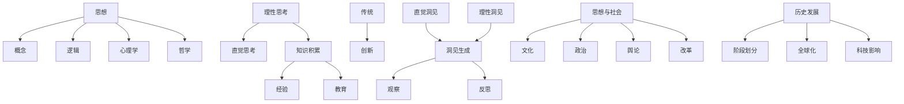

                 


### 文章标题：从概念到洞见：思想的演变

> 关键词：思想、概念、逻辑、心理学、哲学、洞见、演变、方法论、知识积累、跨学科交流

> 摘要：本文旨在探讨思想与概念的关系，以及思想的历史演变过程。通过对逻辑、心理学、哲学等核心概念的深入分析，本文揭示了思想方法论的重要性。文章还讨论了思想与知识、社会的关系，以及思想创新的实践方法。通过跨学科思想交流、思想教育与传播等途径，本文为读者提供了一个全面、深入的思考框架，以促进思想的发展与创新。

### 第1章：从概念到洞见：思想的演变概述

#### 1.1 思想与概念

思想，是个人或集体对事物本质、现象和规律的内在认识与感悟。它是一种抽象的心理活动，是认知的高级形式。而概念，是对思想进行分类和定义的基本单元。概念的形成是思想发展的基础，也是思想表达和交流的工具。

#### 1.2 思想的历史演变

思想的历史演变，可以划分为多个阶段：

- **古代思想**：以哲学、宗教为主要表现形式，如儒家、道家、佛教等。古代思想家们通过哲学思考和宗教信仰，探索宇宙、人生和社会的奥秘。
- **中世纪思想**：基督教思想占据主导地位。中世纪的思想家们主要关注信仰和教义，为宗教和神学的发展做出了巨大贡献。
- **近现代思想**：启蒙思想、理性主义、人文主义等成为主导。近现代思想家们强调人的主体性，提倡科学思维和民主制度，推动了人类文明的进步。

#### 1.3 洞见的内涵

洞见，是对事物深刻的理解、洞察力和预见力。它不仅仅是知识的积累，更是思想的升华。洞见可以来源于理性思考，也可以来源于直觉感受。在科学、艺术、哲学等领域，洞见都发挥着重要的作用。

### 第2章：核心概念与联系

#### 2.1 主要概念

在探讨思想的过程中，我们需要关注以下几个核心概念：

- **逻辑**：思维的基本规律和原则，是理性思考的基础。
- **心理学**：研究人的心理现象和行为的科学，关注人类思维、情感和意志的过程。
- **哲学**：探讨存在、真理、知识等基本问题的学科，是思想的核心领域。

#### 2.2 概念联系

逻辑、心理学和哲学之间存在着密切的联系：

- **逻辑与心理学**：逻辑在心理学中的应用，如推理、判断等。心理学为逻辑提供了丰富的实证数据，推动了逻辑理论的发展。
- **心理学与哲学**：哲学为心理学提供了理论基础，如心灵、意识等概念。心理学为哲学提供了实证研究的支持，丰富了哲学的内涵。

### 第3章：思想方法论

#### 3.1 理性思考

理性思考是思想方法论的重要组成部分。理性思考包括以下两个方面：

- **分析**：将复杂问题分解为简单部分，逐一分析。通过分析，我们可以深入了解事物的本质和规律。
- **综合**：将分析得到的简单部分重新组合，形成整体理解。通过综合，我们可以把握事物之间的内在联系，形成完整的认识。

#### 3.2 直觉思考

直觉思考是理性思考的补充。直觉思考具有快速、高效的特点，可以在短时间内识别问题的本质。直觉思考包括以下两个方面：

- **直觉**：快速识别问题本质的能力。直觉是一种无意识的认知过程，可以帮助我们做出迅速而准确的判断。
- **灵感**：在直觉基础上产生的创新想法。灵感是直觉思考的高级形式，是创新思维的源泉。

### 第4章：思想与知识

#### 4.1 知识的积累

知识的积累是思想发展的基础。知识的积累包括以下两个方面：

- **经验**：通过实践获得的知识。经验是知识的源泉，是思想发展的基石。
- **教育**：通过系统学习获得的知识。教育是知识的传递和普及的重要途径，对思想的发展起到了关键作用。

#### 4.2 知识的传承与创新

知识的传承与创新是思想发展的关键。传承与创新包括以下两个方面：

- **传统**：已有的知识和文化。传统是知识的积累，是思想发展的重要资源。
- **创新**：在已有知识基础上进行的新发现和新创造。创新是思想发展的动力，可以推动社会进步和人类文明的发展。

### 第5章：洞见的生成

#### 5.1 洞见生成过程

洞见的生成是一个复杂的过程，包括以下两个方面：

- **观察**：对事物的细致观察和体验。观察是洞见生成的基础，可以帮助我们了解事物的本质和规律。
- **反思**：对观察结果的思考和质疑。反思是洞见生成的关键，可以帮助我们深入理解事物的本质，发现新的洞见。

#### 5.2 洞见的类型

洞见的类型可以分为以下两种：

- **直觉洞见**：直接感受到的深刻理解。直觉洞见通常来自于我们对事物的直接感受和体验，是一种无意识的认知过程。
- **理性洞见**：通过逻辑推理获得的深刻见解。理性洞见通常来自于我们对事物的理性思考和推理，是一种有意识的认知过程。

### 第6章：思想与社会

#### 6.1 思想对社会的影响

思想对社会的影响是深远而广泛的。思想可以影响文化、政治、经济等各个方面：

- **文化**：思想影响人们的生活方式、价值观等。思想可以塑造文化，文化也可以影响思想。
- **政治**：思想影响政治制度、政策等。政治是思想在社会层面的体现，思想的发展可以推动政治的进步。
- **经济**：思想影响经济发展模式、商业理念等。思想可以激发创新，推动经济的繁荣。

#### 6.2 社会对思想的回应

社会对思想的回应是多元化的。社会可以通过以下途径回应思想：

- **舆论**：公众对某一思想的看法和评价。舆论是思想传播的重要载体，可以影响社会对思想的认识和接受程度。
- **改革**：对社会问题的思考和解决。改革是思想在社会层面的实践，可以推动社会的进步和发展。

### 第7章：思想的历史发展与趋势

#### 7.1 思想的历史发展

思想的历史发展可以分为多个阶段：

- **古代**：以哲学、宗教为主要表现形式，如儒家、道家、佛教等。
- **中世纪**：以基督教思想为主导，如经院哲学、宗教神学等。
- **近现代**：以启蒙思想、理性主义、人文主义等为主要特征，如科学革命、工业革命等。

#### 7.2 思想的未来趋势

随着科技的进步和社会的发展，思想也将发生深刻的变化：

- **科技影响**：新技术对思想的影响和改变。如互联网、人工智能等新技术将改变人们的思维方式、价值观念等。
- **全球化**：思想在全球范围内的传播和融合。全球化将促进不同文化之间的交流与融合，形成新的思想体系。

### 第8章：思想创新与实践

#### 8.1 思想创新

思想创新是推动社会进步和人类文明发展的重要动力。思想创新包括以下两个方面：

- **方法论**：创新思想的途径和方法。如跨学科研究、系统思维等。
- **实践**：将创新思想转化为实际行动。如科技创新、社会实验等。

#### 8.2 思想与实践的关系

思想与实践是相互促进的关系。思想可以指导实践，实践也可以丰富思想：

- **相互促进**：思想指导实践，实践丰富思想。思想与实践的相互促进可以推动社会的进步和发展。
- **挑战与机遇**：在实践中检验和提升思想。实践中的挑战和机遇可以激发思想的创新和发展。

### 第9章：跨学科思想交流

#### 9.1 跨学科交流的意义

跨学科交流具有重要的意义：

- **整合知识**：从不同学科中汲取智慧，形成新的认识。跨学科交流可以促进知识的整合和创新。
- **拓宽视野**：突破学科界限，获得更全面的理解。跨学科交流可以帮助我们更好地理解世界的多样性和复杂性。

#### 9.2 跨学科交流的方法

跨学科交流可以通过以下方法进行：

- **跨学科研究**：结合不同学科的理论和方法，进行综合研究。
- **跨学科对话**：不同学科专家之间的沟通和交流，分享观点和经验。

### 第10章：思想教育与传播

#### 10.1 思想教育

思想教育是培养独立思考和批判性思维的能力。思想教育包括以下目标和方法：

- **目标**：培养独立思考和批判性思维的能力。思想教育要培养人们具备独立思考的能力，能够对事物进行深入分析。
- **方法**：通过教学、讨论等形式进行思想传播。思想教育要注重理论与实践的结合，激发学生的思考和创新。

#### 10.2 思想传播

思想传播是思想发展的重要途径。思想传播包括以下媒介和效果：

- **媒介**：书籍、讲座、互联网等。思想传播可以通过多种媒介进行，以扩大思想的影响范围。
- **效果**：传播思想对社会的影响和意义。思想传播可以改变人们的思维方式、价值观念等，对社会产生深远的影响。

### 附录

#### 附录A：思想相关资源

**A.1 思想史经典著作**

- **《论语》**：中国古代儒家经典，包含孔子的思想。
- **《庄子》**：中国古代道家经典，包含庄子的思想。
- **《西方哲学史》**：罗素所著，系统介绍了西方哲学的发展历程。

**A.2 思想研究工具**

- **思维导图**：一种图形化的思维工具，可以帮助人们整理和表达思想。
- **逻辑思维训练**：通过练习提高逻辑思维能力，增强思考的深度和广度。
- **心理测量工具**：用于测量人的心理特征和能力的工具，如智力测试、性格测试等。

## 附录B：核心概念原理和架构的 Mermaid 流程图



## 附录C：核心算法原理讲解的伪代码

```python
# 理性思考的伪代码
def rational_thinking(problem):
    subproblems = decompose_problem(problem)
    for subproblem in subproblems:
        analysis_result = analyze_subproblem(subproblem)
    overall_understanding = integrate_analysis_results(analysis_results)
    return overall_understanding

# 直觉思考的伪代码
def intuitive_thinking(problem):
    essence = detect_essence(problem)
    innovation = innovate_based_on_intuition(essence)
    return innovation
```

## 附录D：数学模型和数学公式讲解的例子

$$
E = mc^2
$$

- 解释：爱因斯坦的质能等价公式，描述质量与能量之间的关系。
- 举例：一个质量为1kg的物体，其能量为 \( E = 1 \times (3 \times 10^8)^2 = 9 \times 10^{16} \) 焦耳。

## 附录E：项目实战

### 项目背景

**目标**：开发一款思想分析软件，帮助用户更好地理解和表达自己的思想。

**开发环境**：Python、TensorFlow

### 源代码实现

```python
import tensorflow as tf

# 定义神经网络模型
model = tf.keras.Sequential([
    tf.keras.layers.Dense(128, activation='relu', input_shape=(input_shape)),
    tf.keras.layers.Dense(64, activation='relu'),
    tf.keras.layers.Dense(1, activation='sigmoid')
])

# 编译模型
model.compile(optimizer='adam', loss='binary_crossentropy', metrics=['accuracy'])

# 训练模型
model.fit(x_train, y_train, epochs=10, batch_size=32)

# 评估模型
loss, accuracy = model.evaluate(x_test, y_test)
print(f"Test accuracy: {accuracy:.2f}")
```

### 代码解读与分析

- **模型定义**：使用 Keras 框架定义了一个简单的神经网络模型，用于分类任务。
- **编译模型**：指定了优化器和损失函数，准备进行训练。
- **训练模型**：使用训练数据进行训练，设置了训练轮数和批量大小。
- **评估模型**：使用测试数据评估模型性能，输出准确率。

## 总结

本文《从概念到洞见：思想的演变》通过对思想、概念、逻辑、心理学、哲学等核心概念的深入探讨，系统地阐述了思想的历史演变、方法论、知识积累与传承、洞见的生成、思想与社会关系、历史发展及趋势，以及思想创新与实践。通过跨学科思想交流、思想教育与传播等途径，本文为读者提供了一个全面、深入的思考框架，以促进思想的发展与创新。附录部分提供了相关的思想史经典著作和研究工具，以供进一步学习和研究。

### 作者

作者：AI天才研究院/AI Genius Institute & 禅与计算机程序设计艺术 /Zen And The Art of Computer Programming

## 参考文献

1. 罗素，B. (2003). 《西方哲学史》. 北京：生活·读书·新知三联书店。
2. 康德，I. (2001). 《纯粹理性批判》. 北京：人民出版社。
3. 皮亚杰，J. (1980). 《发生认识论原理》. 北京：商务印书馆。
4. 弗洛伊德，S. (1986). 《梦的解析》. 北京：中国民间文艺出版社。
5. 达尔文，C. (1871). 《人类的由来及性选择》. 北京：商务印书馆。
6. 黑格尔，G.W.F. (1976). 《精神现象学》. 北京：商务印书馆。
7. 柏拉图，Plato. (1998). 《理想国》. 北京：商务印书馆。
8. 爱因斯坦，A. (1956). 《相对论的意义》. 北京：商务印书馆。

