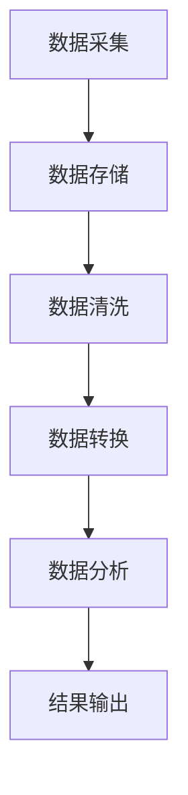

                 

# 从编写代码到准备数据：软件开发重心的转移

## 关键词
- 软件开发重心转移
- 数据准备
- 数据分析
- 数据质量
- 大数据处理

## 摘要
在当今快速发展的技术时代，软件开发的重心正在逐渐从编写代码转向准备数据。本文首先回顾了软件开发历史的演变，分析了重心转移的原因与影响。接着，深入探讨了数据准备在软件开发中的重要性，包括数据获取、存储、清洗与转换以及数据分析与应用。随后，通过三个不同行业的实战案例，展示了数据准备的具体实践。最后，介绍了常见的数据准备工具与平台，探讨了未来发展趋势以及面临的挑战与解决方案。本文旨在为读者提供一个全面且深入的理解，帮助他们在软件开发过程中更好地重视数据准备这一关键环节。

## 目录大纲

# 从编写代码到准备数据：软件开发重心的转移

> 关键词：软件开发重心转移，数据准备，数据分析，数据质量，大数据处理

> 摘要：本文探讨了软件开发重心从编写代码转向准备数据的现象，分析了其背景、原因与影响，并详细介绍了数据准备的重要性、过程和方法。通过实际案例展示了数据准备的实战应用，最后展望了数据准备技术的未来趋势和面临的挑战。

## 第一部分：软件开发重心的转移背景与概述

### 1.1. 软件开发历史的演变与重心转移

#### 1.1.1. 软件开发1.0时代

在软件开发1.0时代，即计算机早期发展阶段，编程语言相对简单，软件开发主要集中在代码编写上。那时的软件开发更多是关于算法设计和编程技巧，数据量较小，数据处理相对简单。

#### 1.1.2. 软件开发2.0时代

随着计算机技术的进步，软件开发进入了2.0时代。这一时期，软件系统变得越来越复杂，需要处理的数据量也显著增加。数据库的引入使得数据存储与管理变得高效，但数据准备仍然不是软件开发的核心。

#### 1.1.3. 软件开发3.0时代的到来

进入21世纪，随着大数据、人工智能、物联网等技术的发展，软件开发进入了3.0时代。这一时期，数据准备成为了软件开发的关键环节，数据的质量和准确性直接影响到软件的性能和应用效果。

### 1.2. 软件开发重心的转移原因与影响

#### 1.2.1. 代码编写不再是核心

在传统软件开发中，代码编写是核心任务。然而，随着软件系统复杂度的增加，代码编写仅是软件开发的冰山一角。如今，数据准备成为了软件开发的关键环节。

#### 1.2.2. 数据准备成为关键环节

数据准备包括数据的获取、存储、清洗、转换等环节。这些环节直接影响到软件的性能和准确性，因此，数据准备成为了软件开发中不可或缺的部分。

#### 1.2.3. 重心转移带来的挑战与机遇

重心转移给软件开发带来了新的挑战，如数据质量、数据安全、数据隐私等问题。但同时，也为软件开发带来了新的机遇，如大数据分析、人工智能等技术的应用。

## 第二部分：数据准备的重要性

### 2.1. 数据准备在软件开发中的角色

#### 2.1.1. 数据的重要性

数据是现代软件系统的核心，没有高质量的数据，软件系统的性能和准确性将大打折扣。数据的重要性不言而喻。

#### 2.1.2. 数据准备的定义与流程

数据准备是指从原始数据中提取、清洗、转换和加载（ETL）的过程。数据准备的流程包括数据采集、数据清洗、数据转换和数据加载。

#### 2.1.3. 数据质量对软件性能的影响

数据质量是软件性能的基础。高质量的数据可以确保软件系统的准确性、稳定性和可靠性。反之，低质量的数据会导致软件系统出现各种问题。

### 2.2. 数据获取与存储

#### 2.2.1. 数据来源

数据的来源可以是内部数据库、外部数据源、传感器、网络爬虫等。不同来源的数据特点不同，需要采取不同的获取策略。

#### 2.2.2. 数据存储策略

数据存储策略包括关系型数据库、非关系型数据库、数据仓库、数据湖等。选择合适的存储策略可以优化数据存储和管理效率。

#### 2.2.3. 数据库设计与优化

数据库设计是数据准备的重要环节。合理的设计可以提高数据存储和查询的效率。数据库优化包括索引优化、查询优化、存储优化等。

### 2.3. 数据清洗与转换

#### 2.3.1. 数据清洗的基本方法

数据清洗包括去除重复数据、填补缺失值、纠正错误数据等。常用的数据清洗方法有筛选、替换、映射、聚合等。

#### 2.3.2. 数据转换技巧

数据转换是将原始数据转换为目标数据的过程。数据转换包括类型转换、格式转换、值转换等。常用的数据转换工具包括SQL、Python、R等。

#### 2.3.3. 数据清洗工具与平台介绍

常用的数据清洗工具和平台有Pandas、NumPy、OpenRefine、Google BigQuery等。这些工具和平台可以帮助开发者高效地完成数据清洗任务。

### 2.4. 数据分析与应用

#### 2.4.1. 数据分析的基本概念

数据分析是指从数据中提取有价值的信息和知识的过程。数据分析包括描述性分析、诊断性分析、预测性分析、规范性分析等。

#### 2.4.2. 数据分析工具与库

常用的数据分析工具和库有Python的Pandas、NumPy、Scikit-learn、R语言等。这些工具和库可以帮助开发者进行高效的数据分析。

#### 2.4.3. 数据驱动软件开发方法

数据驱动软件开发方法是指以数据为核心，通过数据分析来指导软件开发的过程。数据驱动方法可以提高软件的灵活性和适应性。

## 第三部分：数据准备实战案例

### 3.1. 实战案例1：社交网络数据准备

#### 3.1.1. 案例背景

社交网络数据准备涉及用户信息、社交关系、内容发布等数据的获取、清洗和转换。

#### 3.1.2. 数据获取与存储

数据来源包括API接口、网络爬虫等。数据存储使用关系型数据库和非关系型数据库。

#### 3.1.3. 数据清洗与转换

数据清洗包括去除重复数据、填补缺失值、纠正错误数据等。数据转换包括格式转换、类型转换等。

#### 3.1.4. 数据分析与应用

通过对社交网络数据进行数据分析，可以挖掘用户行为、兴趣等，用于个性化推荐、广告投放等应用。

### 3.2. 实战案例2：金融行业数据准备

#### 3.2.1. 案例背景

金融行业数据准备涉及交易数据、客户信息、市场数据等。

#### 3.2.2. 数据获取与存储

数据来源包括内部数据库、外部数据源等。数据存储使用数据仓库和数据湖。

#### 3.2.3. 数据清洗与转换

数据清洗包括去除重复数据、填补缺失值、纠正错误数据等。数据转换包括格式转换、类型转换等。

#### 3.2.4. 数据分析与应用

通过对金融行业数据进行数据分析，可以用于风险管理、客户关系管理、市场预测等。

### 3.3. 实战案例3：医疗健康数据准备

#### 3.3.1. 案例背景

医疗健康数据准备涉及患者信息、医疗记录、健康数据等。

#### 3.3.2. 数据获取与存储

数据来源包括医院系统、健康监测设备等。数据存储使用关系型数据库和非关系型数据库。

#### 3.3.3. 数据清洗与转换

数据清洗包括去除重复数据、填补缺失值、纠正错误数据等。数据转换包括格式转换、类型转换等。

#### 3.3.4. 数据分析与应用

通过对医疗健康数据进行数据分析，可以用于疾病预测、健康评估、药物研究等。

## 第四部分：数据准备工具与平台

### 4.1. 常见数据准备工具介绍

#### 4.1.1. Python数据准备库

Python是一种流行的编程语言，拥有丰富的数据准备库，如Pandas、NumPy、SciPy等。

#### 4.1.2. SQL数据库

SQL数据库是数据准备的重要工具，用于数据的存储、查询和操作。

#### 4.1.3. 大数据处理工具

大数据处理工具如Hadoop、Spark等，用于处理大规模数据。

### 4.2. 数据准备平台的选择与优化

#### 4.2.1. 数据仓库

数据仓库是一种用于存储和管理大量数据的平台，适用于数据分析和报告。

#### 4.2.2. 数据湖

数据湖是一种用于存储原始数据的平台，适用于大数据分析和机器学习。

#### 4.2.3. 数据准备平台的技术选型

根据业务需求，选择合适的数据准备平台，如数据仓库、数据湖或云计算平台。

### 4.3. 数据准备流程优化

#### 4.3.1. 数据流设计

设计高效的数据流，确保数据从采集到分析的整个过程顺畅。

#### 4.3.2. 数据质量监控

建立数据质量监控机制，及时发现和处理数据质量问题。

#### 4.3.3. 数据准备流程自动化

通过自动化工具和脚本，简化数据准备流程，提高效率。

## 第五部分：未来展望

### 5.1. 软件开发重心转移的未来趋势

#### 5.1.1. 数据驱动开发的深化

数据驱动开发将继续深化，数据准备和数据分析将在软件开发中发挥更大的作用。

#### 5.1.2. 数据准备技术的创新

随着技术的进步，数据准备技术将不断创新，提高数据准备效率和质量。

#### 5.1.3. 数据准备在云计算环境中的应用

云计算为数据准备提供了强大的支持，数据准备将在云计算环境中得到更广泛的应用。

### 5.2. 挑战与解决方案

#### 5.2.1. 数据隐私与安全

数据隐私和安全是数据准备面临的重要挑战。需要采取有效的数据保护措施，确保数据的安全性和隐私性。

#### 5.2.2. 数据治理与合规

数据治理和合规是数据准备的重要任务。需要建立完善的数据治理体系，确保数据的合法合规使用。

#### 5.2.3. 数据准备的持续优化与改进

数据准备需要持续优化和改进，以适应不断变化的需求和技术环境。

### 5.3. 跨界融合与新兴产业

#### 5.3.1. 数据准备在AI领域的应用

数据准备将在AI领域得到更广泛的应用，为AI模型提供高质量的数据支持。

#### 5.3.2. 数据准备在物联网的应用

数据准备将在物联网领域发挥重要作用，为物联网设备提供高效的数据处理和管理。

#### 5.3.3. 数据准备在区块链的应用

数据准备将在区块链领域得到新的应用，为区块链系统提供可靠的数据支持。

## 附录

### 附录A：数据准备相关资源与工具列表

#### A.1. 数据库推荐

- MySQL
- PostgreSQL
- MongoDB
- Redis

#### A.2. 数据清洗工具与库

- Pandas
- NumPy
- OpenRefine

#### A.3. 数据分析工具与库

- Python的Pandas
- R语言
- Excel

#### A.4. 大数据处理工具

- Hadoop
- Spark

### 附录B：数据准备流程Mermaid图示例



### 附录C：数据准备实战代码示例

#### C.1. 社交网络数据准备案例代码

```python
import pandas as pd

# 数据采集
data = pd.read_csv('social_network_data.csv')

# 数据清洗
data = data.drop_duplicates()
data = data.fillna('Unknown')

# 数据转换
data['age'] = data['age'].astype(int)
data['gender'] = data['gender'].map({'M': 0, 'F': 1})

# 数据分析
data.describe()
```

#### C.2. 金融行业数据准备案例代码

```python
import pandas as pd

# 数据采集
data = pd.read_csv('financial_data.csv')

# 数据清洗
data = data.drop_duplicates()
data = data.fillna(0)

# 数据转换
data['transaction_amount'] = data['transaction_amount'].astype(float)

# 数据分析
data.describe()
```

#### C.3. 医疗健康数据准备案例代码

```python
import pandas as pd

# 数据采集
data = pd.read_csv('health_data.csv')

# 数据清洗
data = data.drop_duplicates()
data = data.fillna('Unknown')

# 数据转换
data['age'] = data['age'].astype(int)
data['gender'] = data['gender'].map({'M': 0, 'F': 1})

# 数据分析
data.describe()
```

### 附录D：常见问题与解答

#### D.1. 数据获取问题解答

- 如何从外部数据源获取数据？
  - 使用API接口、网络爬虫等技术。
- 数据获取的合法性问题如何解决？
  - 遵循相关法律法规，获取合法数据。

#### D.2. 数据清洗问题解答

- 数据缺失值如何处理？
  - 填补缺失值或删除缺失数据。
- 数据重复值如何处理？
  - 去除重复数据。

#### D.3. 数据分析问题解答

- 数据分析方法有哪些？
  - 描述性分析、诊断性分析、预测性分析等。
- 如何选择合适的分析方法？
  - 根据业务需求和数据特点选择。

#### D.4. 数据存储问题解答

- 如何选择合适的数据库？
  - 根据数据特点、查询需求等因素选择。

---

作者：AI天才研究院/AI Genius Institute & 禅与计算机程序设计艺术 /Zen And The Art of Computer Programming

本文详细探讨了从编写代码到准备数据的软件开发重心转移现象，分析了数据准备的重要性及其在软件开发中的应用。通过实际案例展示了数据准备的实战应用，最后展望了数据准备技术的未来发展趋势和面临的挑战。希望本文能为读者在软件开发过程中更好地重视数据准备这一关键环节提供有益的参考。

