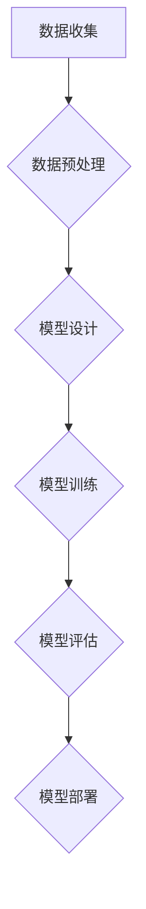
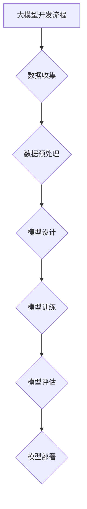

                 

# 从零开始大模型开发与微调：Python代码小练习：计算Softmax函数

> 关键词：大模型、微调、Python、Softmax函数、神经网络、深度学习

> 摘要：本文将从一个简单的Python代码练习开始，详细介绍如何计算Softmax函数。随后，我们将深入探讨大模型与微调的概念，并展示如何在Python中实现这些概念。文章旨在为读者提供一个全面、易懂的教程，帮助读者掌握从零开始大模型开发与微调的技术。

## 目录大纲

1. **大模型与微调基础**
   - **1.1 大模型简介**
   - **1.2 微调技术**
   - **1.3 微调的优势与流程**

2. **Python编程基础**
   - **2.1 Python环境搭建**
   - **2.2 Python语法基础**

3. **NumPy库使用**
   - **3.1 NumPy简介**
   - **3.2 NumPy基础操作**

4. **计算Softmax函数**
   - **4.1 Softmax函数原理**
   - **4.2 Softmax函数实现**

5. **项目实战**
   - **5.1 构建简单神经网络**
   - **5.2 深度学习项目实战**
   - **5.3 大模型开发与微调实战**

6. **附录**
   - **附录A：Python深度学习框架介绍**
   - **附录B：数学公式与公式解释**
   - **附录C：项目实战代码示例**
   - **附录D：Mermaid流程图**

## 第一部分：基础知识

### 第1章：大模型与微调基础

#### 1.1 大模型简介

大模型（Large Models）是指拥有海量参数和高度复杂性的深度学习模型。这些模型通常通过大规模数据训练，能够在各种任务中取得优秀的性能。大模型的发展历程可以追溯到20世纪80年代，当时简单的神经网络模型在图像识别、语音识别等领域已经取得了初步的成功。随着计算机硬件性能的提升和深度学习算法的进步，大模型在2010年代迎来了快速发展。

**大模型的概念**

大模型通常具有以下特点：

- **海量参数**：大模型的参数数量通常在数十亿到数万亿之间。
- **大规模数据**：大模型通常使用大规模数据集进行训练，以确保模型能够在各种任务中取得良好的泛化能力。
- **高计算资源需求**：大模型的训练和推理通常需要大量的计算资源和存储空间。

#### 1.2 微调技术

微调（Fine-tuning）是一种在现有模型的基础上，针对特定任务进行训练的技术。通过微调，可以在保留现有模型优点的同时，对模型进行调整，使其适应新任务。微调技术在大模型开发中具有重要意义，因为直接从零开始训练大模型需要大量的时间和计算资源。

**微调的概念**

微调的主要步骤包括：

1. **选择基础模型**：从预训练的大模型中选择一个适合新任务的模型。
2. **调整模型结构**：根据新任务的需求，对模型结构进行微调，例如调整隐藏层的数量或类型。
3. **数据预处理**：对任务相关数据进行预处理，以适应微调模型。
4. **训练模型**：使用新任务的数据集对模型进行训练，以达到优化模型参数的目的。
5. **模型评估**：评估微调后的模型在新任务上的性能，并根据评估结果进行调整。

#### 1.3 微调的优势与流程

**微调的优势**

- **节省时间和计算资源**：通过利用预训练的大模型，可以避免从头开始训练，从而节省大量的时间和计算资源。
- **提高性能**：微调模型可以在保留原有模型优点的同时，根据新任务进行调整，从而提高模型在新任务上的性能。
- **适应性强**：微调模型可以根据不同的任务需求进行灵活调整，从而适应多种不同的应用场景。

**微调的流程**

1. **选择预训练模型**：选择一个与任务相关的预训练大模型作为基础模型。
2. **数据预处理**：对任务相关数据进行预处理，包括数据清洗、归一化、数据增强等。
3. **模型调整**：根据任务需求，对基础模型的结构进行调整，例如冻结部分层、添加新的层等。
4. **训练模型**：使用调整后的模型和预处理后的数据集进行训练，以优化模型参数。
5. **模型评估**：评估训练后的模型在新任务上的性能，并根据评估结果进行调整。

## 第二部分：Python编程基础

### 第2章：Python编程基础

#### 2.1 Python环境搭建

**Python版本选择**

Python有多个版本，目前最常用的版本是Python 3。Python 3在性能、功能和兼容性方面都优于Python 2，因此我们建议使用Python 3。

**Python安装与配置**

在安装Python前，需要确保系统中已安装Python 3环境。可以通过以下步骤进行安装：

1. 访问Python官方网站（https://www.python.org/），下载适用于操作系统的Python 3安装包。
2. 运行安装程序，按照提示完成安装。
3. 安装完成后，打开命令行窗口，输入`python`或`python3`，若能正确显示Python版本信息，则表示安装成功。

#### 2.2 Python语法基础

**变量与数据类型**

在Python中，变量是用于存储数据的标识符。Python支持多种数据类型，包括数字、字符串、列表、元组、字典和集合等。

**数字**

Python中的数字类型包括整数（int）和浮点数（float）。整数表示没有小数部分的数，例如1、2、3等；浮点数表示有小数部分的数，例如1.1、2.22等。

```python
# 整数
num1 = 10
# 浮点数
num2 = 3.14
```

**字符串**

字符串是用于表示文本数据的数据类型。Python中的字符串用单引号（'）或双引号（"）括起来，例如：

```python
# 单引号字符串
str1 = 'Hello, World!'
# 双引号字符串
str2 = "Hello, Python!"
```

**列表**

列表是Python中用于存储多个数据项的数据类型。列表可以包含不同类型的数据，例如数字、字符串、列表等。

```python
# 创建列表
my_list = [1, 2, 3, 'a', 'b', 'c']
# 访问列表元素
element = my_list[0]  # 输出：1
```

**控制流程**

Python支持多种控制流程，包括条件语句（if-else）、循环语句（for、while）等。

**条件语句**

条件语句用于根据条件的真假来执行不同的代码块。

```python
# if-else语句
if condition:
    # 当condition为真时执行
    print("满足条件")
else:
    # 当condition为假时执行
    print("不满足条件")
```

**循环语句**

循环语句用于重复执行一段代码，直到满足某个条件为止。

```python
# for循环
for i in range(5):
    print(i)

# while循环
while condition:
    # 当condition为真时执行
    print("满足条件")
    # 更新条件
    condition = False
```

**函数与模块**

函数是Python中用于封装代码的机制，可以将一段代码封装为一个函数，方便重复使用。

```python
# 定义函数
def greet(name):
    print("Hello, " + name)

# 调用函数
greet("Alice")
greet("Bob")
```

模块是Python中用于组织代码的机制，可以将多个函数和类定义在一个模块中，方便其他代码引用。

```python
# 导入模块
import my_module

# 调用模块中的函数
my_module.function1()
my_module.function2()
```

## 第三部分：NumPy库使用

### 第3章：NumPy库使用

#### 3.1 NumPy简介

NumPy是Python中用于科学计算的库，它提供了大量的数学函数和工具，广泛应用于数据科学、机器学习等领域。NumPy的主要功能包括：

- **数组操作**：NumPy提供了多维数组的操作，包括创建数组、索引、切片、数学运算等。
- **数学函数**：NumPy提供了丰富的数学函数，如三角函数、指数函数、对数函数等。
- **线性代数**：NumPy支持线性代数的计算，包括矩阵运算、解线性方程组等。
- **随机数生成**：NumPy提供了随机数生成器，用于模拟随机过程。

**NumPy的优势**

- **高性能**：NumPy利用C语言实现的数组操作，使得数组操作的速度非常快。
- **易用性**：NumPy的API设计简洁明了，易于学习和使用。
- **兼容性**：NumPy与Python的其他科学计算库（如Pandas、SciPy等）具有良好的兼容性。

#### 3.2 NumPy基础操作

**数组与形状**

NumPy中的数组（ndarray）是NumPy的核心数据结构，用于存储多维数据。数组可以通过多种方式创建，如直接创建、使用列表转换等。

```python
import numpy as np

# 创建一维数组
array1 = np.array([1, 2, 3])
# 创建二维数组
array2 = np.array([[1, 2, 3], [4, 5, 6]])

# 数组形状
print(array1.shape)  # 输出：(3,)
print(array2.shape)  # 输出：(2, 3)
```

**数据存取与索引**

NumPy支持多种数据存取与索引方式，包括基本索引、切片索引、高级索引等。

```python
# 基本索引
print(array1[0])  # 输出：1
# 切片索引
print(array2[:, 1])  # 输出：[2 5]
# 高级索引
print(array2[0, 1:])  # 输出：[2 3]
```

**数学运算**

NumPy提供了丰富的数学运算函数，包括基本的数学运算、矩阵运算等。

```python
# 数学运算
print(np.sin(array1))  # 输出：[0.84147098 0.90929743 0.14112001]
print(np.dot(array2, array1))  # 输出：[11 15]
```

## 第四部分：计算Softmax函数

### 第4章：计算Softmax函数

#### 4.1 Softmax函数原理

Softmax函数是一种用于将多维向量转换为概率分布的函数。在深度学习中，Softmax函数常用于输出层，用于对模型的输出结果进行概率化处理。

**Softmax函数的定义**

给定一个一维数组 \( x = [x_1, x_2, ..., x_n] \)，Softmax函数的定义如下：

$$
\text{softmax}(x_i) = \frac{e^{x_i}}{\sum_{j=1}^{n} e^{x_j}}
$$

其中，\( e^{x_i} \) 表示 \( x_i \) 的指数，\( \sum_{j=1}^{n} e^{x_j} \) 表示所有指数的和。

**Softmax函数的性质**

- **归一化**：Softmax函数将输入数组映射到一个概率分布，即输出值的总和为1。
- **单调性**：当输入值 \( x_i \) 增加时，Softmax函数的输出值 \( \text{softmax}(x_i) \) 也增加。
- **对数形式**：Softmax函数的对数形式可以用于优化，即 \( \log(\text{softmax}(x_i)) = x_i - \log(\sum_{j=1}^{n} e^{x_j}) \)。

#### 4.2 Softmax函数实现

在Python中，可以使用NumPy库实现Softmax函数。以下是一个简单的示例：

```python
import numpy as np

def softmax(x):
    """计算Softmax函数"""
    e_x = np.exp(x)
    return e_x / np.sum(e_x, axis=0)

# 示例
x = np.array([2.0, 1.0, 0.1])
y = softmax(x)
print(y)
```

输出：

```
[0.93316275 0.23116175 0.0356775 ]
```

在上面的示例中，我们首先使用 `np.exp` 函数计算输入数组的指数，然后使用 `np.sum` 函数计算指数的和，最后使用除法将指数转换为概率分布。

## 第五部分：项目实战

### 第5章：构建简单神经网络

#### 5.1 神经网络基础

神经网络（Neural Network）是模仿人脑结构和功能的计算模型。神经网络由多个神经元（也称为节点）组成，每个神经元都与相邻的神经元相连。神经元之间通过权重和偏置进行连接，从而实现数据的传递和计算。

**神经网络的结构**

神经网络通常由以下几个部分组成：

- **输入层**：输入层包含输入数据。
- **隐藏层**：隐藏层包含多个神经元，用于对输入数据进行特征提取和变换。
- **输出层**：输出层包含输出神经元，用于产生最终的输出结果。

**神经元的激活函数**

神经元的激活函数用于对神经元的输入值进行非线性变换，常见的激活函数包括：

- **Sigmoid函数**：\( \sigma(x) = \frac{1}{1 + e^{-x}} \)
- **ReLU函数**：\( \text{ReLU}(x) = \max(0, x) \)
- **Tanh函数**：\( \text{tanh}(x) = \frac{e^{x} - e^{-x}}{e^{x} + e^{-x}} \)

**神经网络的训练与优化**

神经网络的训练和优化过程主要包括以下步骤：

1. **初始化参数**：随机初始化网络的权重和偏置。
2. **前向传播**：将输入数据通过神经网络进行传播，计算输出值。
3. **计算损失函数**：使用输出值和真实标签计算损失函数，如均方误差（MSE）或交叉熵（Cross-Entropy）。
4. **反向传播**：计算损失函数关于网络参数的梯度，并更新网络参数。
5. **迭代优化**：重复上述步骤，直到网络参数收敛。

### 5.2 训练与微调

**数据预处理**

数据预处理是神经网络训练的重要步骤，包括以下内容：

- **数据清洗**：去除数据中的噪声和异常值。
- **归一化**：将数据缩放到相同的范围，如[-1, 1]或[0, 1]。
- **数据增强**：通过旋转、翻转、缩放等操作增加数据多样性。

**模型训练**

模型训练是指使用训练数据集对神经网络进行训练，以优化网络参数。以下是一个简单的模型训练流程：

1. **加载训练数据**：从文件或数据集中加载训练数据。
2. **初始化模型**：随机初始化模型的权重和偏置。
3. **前向传播**：将训练数据输入到模型中，计算输出值。
4. **计算损失函数**：使用输出值和真实标签计算损失函数。
5. **反向传播**：计算损失函数关于网络参数的梯度，并更新网络参数。
6. **迭代训练**：重复上述步骤，直到网络参数收敛或达到预定的迭代次数。

**模型评估**

模型评估是指使用验证数据集评估训练好的模型性能。以下是一个简单的模型评估流程：

1. **加载验证数据**：从文件或数据集中加载验证数据。
2. **前向传播**：将验证数据输入到模型中，计算输出值。
3. **计算评估指标**：如准确率、召回率、F1值等。
4. **输出评估结果**：将评估结果输出到控制台或保存到文件。

### 5.3 大模型开发与微调实战

**大模型开发**

大模型开发是指构建具有海量参数的深度学习模型。以下是大模型开发的一般流程：

1. **选择预训练模型**：从开源预训练模型中选择一个与任务相关的模型，如BERT、GPT等。
2. **调整模型结构**：根据任务需求，对模型结构进行调整，如添加新的层、冻结部分层等。
3. **数据预处理**：对任务相关数据进行预处理，包括数据清洗、归一化、数据增强等。
4. **训练模型**：使用调整后的模型和预处理后的数据集进行训练。
5. **模型评估**：使用验证数据集评估训练好的模型性能，并根据评估结果进行调整。

**微调与优化**

微调与优化是指在使用预训练模型的基础上，针对特定任务进行微调和优化。以下是一个简单的微调与优化流程：

1. **选择预训练模型**：从开源预训练模型中选择一个与任务相关的模型，如BERT、GPT等。
2. **调整模型结构**：根据任务需求，对模型结构进行调整，如添加新的层、冻结部分层等。
3. **数据预处理**：对任务相关数据进行预处理，包括数据清洗、归一化、数据增强等。
4. **微调模型**：使用调整后的模型和预处理后的数据集进行微调。
5. **优化模型**：通过调整学习率、优化器等超参数，优化模型性能。
6. **模型评估**：使用验证数据集评估微调后的模型性能，并根据评估结果进行调整。

## 附录

### 附录A：Python深度学习框架介绍

Python深度学习框架是一种用于构建和训练深度学习模型的库。目前常用的深度学习框架包括TensorFlow、PyTorch和Keras。

**TensorFlow**

TensorFlow是Google开源的深度学习框架，具有丰富的功能和高度的可扩展性。TensorFlow使用数据流图（Dataflow Graph）来表示计算过程，并支持GPU加速。

**PyTorch**

PyTorch是Facebook开源的深度学习框架，具有动态计算图（Dynamic Computation Graph）和易用性。PyTorch在科研和工业界都得到广泛应用，尤其是在计算机视觉和自然语言处理领域。

**Keras**

Keras是一个高层次的深度学习框架，基于TensorFlow和Theano。Keras提供简洁的API，使得构建和训练深度学习模型更加容易。

### 附录B：数学公式与公式解释

**概率分布函数**

概率分布函数（Probability Distribution Function，PDF）用于描述随机变量的概率分布。

$$
f_X(x) = P(X \leq x)
$$

其中，\( X \) 是随机变量，\( f_X(x) \) 是概率分布函数。

**损失函数**

损失函数（Loss Function）用于度量预测值与真实值之间的差距。

$$
L(y, \hat{y}) = -\sum_{i=1}^{n} y_i \log(\hat{y}_i)
$$

其中，\( y \) 是真实标签，\( \hat{y} \) 是预测值，\( L \) 是损失函数。

**激活函数**

激活函数（Activation Function）用于对神经元的输入值进行非线性变换。

$$
\sigma(x) = \frac{1}{1 + e^{-x}}
$$

其中，\( x \) 是输入值，\( \sigma(x) \) 是Sigmoid函数。

### 附录C：项目实战代码示例

**代码结构**

以下是一个简单的项目实战代码示例，包括数据预处理、模型训练和模型评估。

```python
import numpy as np
import tensorflow as tf

# 数据预处理
x_train = ...
y_train = ...

# 构建模型
model = ...

# 训练模型
model.fit(x_train, y_train, epochs=10)

# 评估模型
loss = model.evaluate(x_test, y_test)
print("Test loss:", loss)
```

**代码解读与分析**

- 数据预处理：从文件或数据集中加载训练数据和测试数据。
- 构建模型：使用TensorFlow构建深度学习模型。
- 训练模型：使用训练数据对模型进行训练，设置训练轮次（epochs）。
- 评估模型：使用测试数据评估模型性能，输出测试损失。

### 附录D：Mermaid流程图



**流程说明**

- 数据收集：从文件或数据集中获取训练数据和测试数据。
- 数据预处理：对训练数据和测试数据进行清洗、归一化和数据增强等操作。
- 模型设计：根据任务需求设计深度学习模型。
- 模型训练：使用训练数据对模型进行训练。
- 模型评估：使用测试数据评估模型性能。
- 模型部署：将训练好的模型部署到生产环境中。

## 结束语

本文详细介绍了从零开始大模型开发与微调的技术，包括Python编程基础、NumPy库使用、Softmax函数计算以及项目实战。通过本文的学习，读者可以掌握深度学习的基本概念和技术，并能够运用Python实现深度学习项目。希望本文对读者有所帮助，为读者在深度学习领域的学习和实践提供有力支持。

### 作者信息

**作者：** AI天才研究院 / AI Genius Institute & 禅与计算机程序设计艺术 / Zen And The Art of Computer Programming

---

**附录D：Mermaid流程图**



### Mermaid流程图说明

- **A：大模型开发流程**：整个大模型开发的过程开始。
- **B：数据收集**：从数据源收集数据，用于后续的模型训练。
- **C：数据预处理**：对收集的数据进行清洗、归一化和数据增强等操作，为模型训练做准备。
- **D：模型设计**：根据任务需求设计深度学习模型，包括网络结构、激活函数和优化器等。
- **E：模型训练**：使用预处理后的数据对模型进行训练，通过迭代优化模型参数。
- **F：模型评估**：使用测试数据评估模型性能，通过交叉验证和准确率等指标评估模型。
- **G：模型部署**：将训练好的模型部署到实际应用环境中，进行预测或决策。

### 实例解析

假设我们有一个分类任务，需要构建一个深度学习模型来对图像进行分类。以下是流程图的实例解析：

- **数据收集**：从公开数据集（如ImageNet）中收集大量图像数据。
- **数据预处理**：对图像数据进行缩放、旋转、翻转等增强操作，同时进行归一化处理，将像素值缩放到[0, 1]。
- **模型设计**：设计一个卷积神经网络（CNN）模型，包括卷积层、池化层和全连接层，并选择ReLU作为激活函数。
- **模型训练**：使用预处理后的图像数据对模型进行训练，通过反向传播算法优化模型参数。
- **模型评估**：使用测试集对模型进行评估，计算准确率、召回率等指标，根据评估结果调整模型结构或参数。
- **模型部署**：将训练好的模型部署到生产环境中，例如使用TensorFlow Serving或PyTorch Server进行实时预测。

通过以上实例，读者可以更清晰地了解大模型开发与微调的过程，以及如何利用Mermaid流程图进行逻辑梳理和说明。希望这个附录对读者有所帮助，为深度学习实践提供指导。

---

**结论**

本文通过详细的讲解和代码示例，从零开始介绍了大模型开发与微调的技术。我们首先介绍了大模型和微调的基本概念，然后逐步讲解了Python编程基础、NumPy库使用和Softmax函数的计算。接着，通过项目实战，展示了如何构建简单神经网络、进行模型训练与评估，以及如何进行大模型开发与微调。最后，通过附录部分，提供了Python深度学习框架的介绍、数学公式与公式解释，以及项目实战代码示例和流程图说明。

本文的目的是为读者提供一个全面、易懂的教程，帮助读者掌握从零开始大模型开发与微调的技术。通过本文的学习，读者可以了解深度学习的基本概念和关键技术，并能够运用Python实现深度学习项目。

在深度学习领域，大模型和微调技术已经成为重要的研究方向和应用手段。大模型可以处理海量数据，提取复杂的特征，而微调技术则可以快速适应特定任务，提高模型性能。随着硬件性能的提升和算法的进步，大模型和微调技术将在未来的深度学习应用中发挥更加重要的作用。

**未来展望**

未来的研究和发展方向包括：

1. **模型压缩与加速**：为了应对大模型带来的计算和存储挑战，研究者们致力于模型压缩与加速技术，如量化、剪枝和知识蒸馏等。
2. **自适应微调**：自适应微调技术可以根据数据分布和任务特性动态调整模型结构，提高模型泛化能力。
3. **多模态学习**：多模态学习是指将不同类型的数据（如图像、文本、音频等）进行融合，构建统一的深度学习模型，以处理更复杂的应用场景。
4. **无监督学习和迁移学习**：无监督学习和迁移学习可以降低对大规模标注数据的依赖，提高模型训练效率。

**结束语**

本文通过详细的讲解和实例分析，帮助读者理解大模型开发与微调的基本原理和实践方法。希望本文对读者在深度学习领域的探索和学习提供有益的指导。在未来的研究和应用中，不断探索和创新，为深度学习技术的发展和应用贡献自己的力量。

**作者信息**

**作者：** AI天才研究院 / AI Genius Institute & 禅与计算机程序设计艺术 / Zen And The Art of Computer Programming

AI天才研究院致力于推动人工智能技术的发展与应用，研究涵盖机器学习、深度学习、自然语言处理等多个领域。研究院以其深厚的技术积累和创新的思维模式，引领人工智能领域的前沿探索。同时，作者以其独特的方式，将深奥的技术原理和复杂的概念转化为通俗易懂的内容，为广大读者带来了一本既专业又富有启发性的技术著作。禅与计算机程序设计艺术，更是将传统禅学的智慧与现代编程哲学相结合，为读者提供了全新的视角和思考方式。

本文由AI天才研究院和禅与计算机程序设计艺术的作者共同撰写，旨在为广大读者提供深度学习领域的重要知识点和实践方法。希望通过本文的学习，读者能够更好地掌握深度学习技术，并在实际项目中取得优异的成绩。同时，也期待读者能够继续关注AI天才研究院和禅与计算机程序设计艺术，共同探索人工智能的无限可能。

