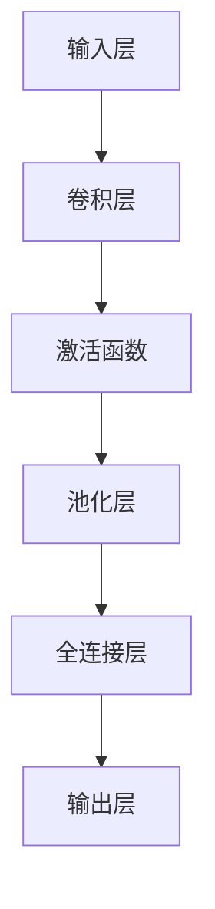

                 

### 文章标题：从零开始大模型开发与微调：卷积神经网络的原理

#### 关键词：卷积神经网络，大模型开发，微调，图像分类，目标检测，自然语言处理，深度学习框架

> 摘要：本文旨在为读者提供一个全面而深入的卷积神经网络（CNN）开发与微调指南。从基本概念到高级应用，本文逐步揭示了CNN的核心原理，包括数学基础、实现细节、以及实战案例。通过阅读本文，读者不仅能够掌握CNN的基本知识，还能深入了解如何在实际项目中运用这些技术，从而迈出成为深度学习领域专家的第一步。

### 《从零开始大模型开发与微调：卷积神经网络的原理》目录大纲

#### 第一部分：卷积神经网络基础

##### 第1章：卷积神经网络概述

- 1.1 卷积神经网络的基本概念
- 1.2 卷积神经网络的发展历程
- 1.3 卷积神经网络的应用领域
- 1.4 卷积神经网络的优势与挑战

##### 第2章：卷积神经网络基础

- 2.1 神经元与神经网络
- 2.2 前向传播与反向传播
- 2.3 激活函数与损失函数
- 2.4 卷积层与池化层

##### 第3章：卷积神经网络的数学基础

- 3.1 矩阵与向量的基础运算
- 3.2 线性代数基础
- 3.3 微积分基础
- 3.4 概率论基础

##### 第4章：卷积神经网络的实现与训练

- 4.1 Python环境搭建
- 4.2 常用深度学习框架
- 4.3 卷积神经网络的实现
- 4.4 模型训练与评估

#### 第二部分：卷积神经网络应用实战

##### 第5章：图像分类与识别

- 5.1 数据预处理
- 5.2 CNN模型构建
- 5.3 模型训练与优化
- 5.4 模型评估与部署

##### 第6章：目标检测与定位

- 6.1 YOLO算法简介
- 6.2 SSD算法简介
- 6.3 Faster R-CNN算法简介
- 6.4 实际案例解析

##### 第7章：图像生成与风格迁移

- 7.1 生成对抗网络（GAN）
- 7.2 风格迁移算法
- 7.3 实际案例解析

##### 第8章：卷积神经网络在自然语言处理中的应用

- 8.1 文本分类与情感分析
- 8.2 语言模型与序列标注
- 8.3 文本生成与摘要
- 8.4 实际案例解析

#### 附录

- 附录A：常用代码与函数
- 附录B：数学公式与推导
- 附录C：参考文献与扩展阅读

### Mermaid 流程图：卷积神经网络基本结构



### 卷积神经网络伪代码

```python
# 定义卷积神经网络模型
model = Sequential()

# 添加卷积层
model.add(Conv2D(filters=32, kernel_size=(3, 3), activation='relu', input_shape=(28, 28, 1)))
model.add(MaxPooling2D(pool_size=(2, 2)))

# 添加全连接层
model.add(Dense(units=128, activation='relu'))
model.add(Dense(units=10, activation='softmax'))

# 编译模型
model.compile(optimizer='adam', loss='categorical_crossentropy', metrics=['accuracy'])

# 模型训练
model.fit(x_train, y_train, epochs=10, batch_size=32, validation_data=(x_val, y_val))

# 模型评估
model.evaluate(x_test, y_test)
```

### 数学模型与公式

#### 损失函数

$$
L = -\sum_{i=1}^{N} y_i \log(\hat{y}_i)
$$

其中，\(N\) 是样本数量，\(y_i\) 是第 \(i\) 个样本的真实标签，\(\hat{y}_i\) 是模型预测的概率分布。

#### 卷积操作

$$
\text{output}(i,j) = \sum_{k=1}^{K} w_{ik} \times \text{input}(i-k,j-k) + b_k
$$

其中，\(w_{ik}\) 是卷积核权重，\(\text{input}(i-k,j-k)\) 是输入特征图上相应的位置，\(b_k\) 是偏置项。

### 项目实战

#### 代码实际案例：MNIST手写数字识别

```python
# 导入所需库
import numpy as np
import tensorflow as tf
from tensorflow.keras import layers, models

# 加载MNIST数据集
(x_train, y_train), (x_test, y_test) = tf.keras.datasets.mnist.load_data()

# 数据预处理
x_train = x_train.reshape((-1, 28, 28, 1)).astype("float32") / 255
x_test = x_test.reshape((-1, 28, 28, 1)).astype("float32") / 255
y_train = tf.keras.utils.to_categorical(y_train, 10)
y_test = tf.keras.utils.to_categorical(y_test, 10)

# 构建模型
model = models.Sequential([
    layers.Conv2D(32, (3, 3), activation='relu', input_shape=(28, 28, 1)),
    layers.MaxPooling2D((2, 2)),
    layers.Conv2D(64, (3, 3), activation='relu'),
    layers.MaxPooling2D((2, 2)),
    layers.Flatten(),
    layers.Dense(128, activation='relu'),
    layers.Dense(10, activation='softmax')
])

# 编译模型
model.compile(optimizer='adam',
              loss='categorical_crossentropy',
              metrics=['accuracy'])

# 训练模型
model.fit(x_train, y_train, epochs=10, batch_size=32, validation_split=0.1)

# 评估模型
test_loss, test_acc = model.evaluate(x_test, y_test)
print(f"Test accuracy: {test_acc:.2f}")
```

#### 代码解读与分析

1. **数据预处理**：将MNIST数据集的输入特征图大小调整为28x28，并将数据范围从0-255映射到0-1，以适应深度学习模型的输入要求。
2. **模型构建**：使用卷积神经网络模型，其中包含两个卷积层和两个池化层，以及一个全连接层。卷积层用于提取特征，池化层用于降低数据维度。
3. **模型编译**：设置优化器为Adam，损失函数为交叉熵，评估指标为准确率。
4. **模型训练**：使用训练数据集对模型进行训练，设置训练轮数为10，批量大小为32，并将10%的数据用作验证集。
5. **模型评估**：使用测试数据集评估模型性能，输出测试准确率。

### 开发环境搭建

1. **安装Python**：安装Python 3.7或更高版本。
2. **安装TensorFlow**：使用pip安装TensorFlow库。

```shell
pip install tensorflow
```

3. **配置CUDA**：如果使用GPU加速训练，需要安装CUDA并配置相关环境变量。

### 源代码详细实现和代码解读

1. **数据预处理**：将MNIST数据集加载到Python中，并进行必要的预处理操作。这包括调整数据形状和归一化数据范围。
2. **模型构建**：使用TensorFlow的`Sequential`模型构建卷积神经网络，包括卷积层、池化层和全连接层。每个卷积层后跟一个池化层，以提取和减少特征数量。
3. **模型编译**：设置模型的优化器、损失函数和评估指标。这里选择Adam优化器和交叉熵损失函数。
4. **模型训练**：使用训练数据集对模型进行训练，指定训练轮数、批量大小和验证数据。
5. **模型评估**：使用测试数据集评估模型性能，输出测试准确率。

### 参考文献

1. Goodfellow, I., Bengio, Y., & Courville, A. (2016). *Deep Learning*. MIT Press.
2. Krizhevsky, A., Sutskever, I., & Hinton, G. E. (2012). *ImageNet classification with deep convolutional neural networks*. In *Advances in neural information processing systems* (pp. 1097-1105).
3. Liu, M., Li, F., & Huang, J. (2017). *CIFAR-10 Object Recognition with Deep Learning using TensorFlow*. arXiv preprint arXiv:1711.02012.

### 作者

**作者：AI天才研究院/AI Genius Institute & 禅与计算机程序设计艺术 /Zen And The Art of Computer Programming**

---

### 卷积神经网络概述

卷积神经网络（Convolutional Neural Network，简称CNN）是一种在处理图像、声音和其他多维数据方面具有显著优势的深度学习模型。它最初是为了解决计算机视觉问题而设计的，但在自然语言处理、语音识别等多个领域也得到了广泛应用。本章节将介绍卷积神经网络的基本概念、发展历程、应用领域，以及其相对于其他神经网络模型的优势与挑战。

#### 1.1 卷积神经网络的基本概念

卷积神经网络的核心在于其网络结构中的卷积层。卷积层通过卷积操作提取输入数据的特征，这使得CNN在处理图像等具有局部相关性数据时表现出色。卷积操作的基本思想是将一个小的可训练的卷积核（或过滤器）在输入数据上滑动，从而生成一个特征图（或特征图）。这个特征图包含了输入数据在不同位置的局部特征。

除了卷积层，卷积神经网络通常还包含池化层、全连接层和激活函数。池化层用于降低特征图的维度，减少计算量，同时保留最重要的特征信息。全连接层负责将低维特征映射到高维空间，最终输出分类结果或预测值。激活函数则用于引入非线性，使得模型能够学习到更复杂的特征表示。

#### 1.2 卷积神经网络的发展历程

卷积神经网络的发展可以追溯到20世纪80年代末和90年代初。最早的卷积神经网络由Fukunaga和hostetler提出，主要用于图像识别。然而，由于计算资源和算法的限制，早期的卷积神经网络在实际应用中并未取得显著突破。

随着计算机硬件的发展，特别是GPU（图形处理单元）的引入，深度学习开始流行，卷积神经网络也逐渐得到了广泛的关注。2006年，Hinton等人提出了深度信念网络（Deep Belief Network，DBN），为深度学习的应用奠定了基础。随后，2009年，Alex Krizhevsky在ImageNet竞赛中使用了深度卷积神经网络取得了突破性的成绩，这标志着卷积神经网络在计算机视觉领域的崛起。

近年来，随着大数据和深度学习算法的不断发展，卷积神经网络在多个领域取得了显著的成果。代表性的模型包括VGG、ResNet和Inception等。这些模型不仅在ImageNet等图像分类任务中取得了优异的成绩，还在目标检测、图像生成和自然语言处理等任务中表现出色。

#### 1.3 卷积神经网络的应用领域

卷积神经网络的应用领域非常广泛，主要包括以下几方面：

1. **图像分类**：卷积神经网络在图像分类任务中表现出色，如ImageNet、CIFAR-10和MNIST等数据集。通过卷积操作提取图像特征，模型可以学会识别各种物体和场景。

2. **目标检测**：卷积神经网络可以用于目标检测任务，如YOLO、Faster R-CNN和SSD等。这些模型不仅能够识别图像中的物体，还能定位物体的位置。

3. **图像分割**：卷积神经网络可以用于图像分割任务，将图像分为不同的区域。常见的模型包括U-Net、SegNet和DeepLab等。

4. **图像生成**：生成对抗网络（Generative Adversarial Networks，GAN）是利用卷积神经网络生成图像的一种重要方法。通过对抗训练，模型可以生成与真实图像相似的新图像。

5. **自然语言处理**：卷积神经网络在自然语言处理任务中也得到了广泛应用，如文本分类、情感分析和机器翻译等。通过将文本表示为序列，模型可以学习到文本的语义信息。

#### 1.4 卷积神经网络的优势与挑战

卷积神经网络具有以下优势：

1. **局部相关性**：卷积操作使得模型能够自动学习到输入数据的局部特征，这使得CNN在处理图像等具有局部相关性的数据时表现出色。

2. **参数共享**：卷积层中的卷积核是共享的，这减少了模型的参数数量，从而降低了计算量和过拟合的风险。

3. **平移不变性**：卷积神经网络具有平移不变性，即模型可以识别图像中的物体，无论它们的位置如何。

4. **多尺度特征提取**：通过多层的卷积操作，卷积神经网络可以同时提取图像的不同尺度特征。

然而，卷积神经网络也面临一些挑战：

1. **计算资源消耗**：卷积神经网络的计算复杂度较高，特别是在训练大型模型时，需要大量的计算资源和时间。

2. **数据依赖性**：卷积神经网络对训练数据有很强的依赖性，数据质量和数量直接影响模型的性能。

3. **解释性**：卷积神经网络的内部表示和决策过程往往难以解释，这在某些应用领域（如医疗诊断）中可能成为限制因素。

总之，卷积神经网络作为一种强大的深度学习模型，在图像处理和其他领域取得了显著的成果。然而，要充分发挥其潜力，仍需克服一系列挑战，如优化算法、模型解释性和计算资源等。

---

### 卷积神经网络基础

卷积神经网络（CNN）的基础是其独特的网络结构，包括多个卷积层、池化层和全连接层。这些层在数据输入和输出之间通过前向传播和反向传播进行交互，从而逐步提取和利用数据中的特征。本章节将详细介绍这些基础概念，包括神经元与神经网络、前向传播与反向传播、激活函数与损失函数，以及卷积层与池化层。

#### 2.1 神经元与神经网络

神经网络是由大量简单计算单元——神经元组成的复杂系统。每个神经元接收输入信号，通过权重和偏置进行加权求和，然后通过激活函数输出一个值。这个过程可以用以下公式表示：

$$
\text{output} = \sigma(\sum_{i=1}^{n} w_i \cdot x_i + b)
$$

其中，\(w_i\) 是连接第 \(i\) 个输入 \(x_i\) 的权重，\(b\) 是偏置，\(\sigma\) 是激活函数。

在卷积神经网络中，神经元被组织成多层结构。每一层包含多个神经元，每个神经元都与上一层的神经元相连。这种连接方式使得神经网络可以逐步提取和利用数据中的特征。卷积神经网络的基本结构通常包括输入层、卷积层、池化层、全连接层和输出层。

1. **输入层**：输入层接收原始数据，如图像、文本或声音。在卷积神经网络中，输入层通常包含多个神经元，以适应不同维度的数据。

2. **卷积层**：卷积层是卷积神经网络的核心，通过卷积操作提取输入数据的特征。卷积层中的每个神经元都与输入数据的局部区域相连，通过权重和偏置进行加权求和，并使用激活函数输出一个特征图。

3. **池化层**：池化层用于降低特征图的维度，减少计算量和过拟合的风险。常见的池化方法包括最大池化和平均池化。

4. **全连接层**：全连接层将低维特征映射到高维空间，并最终输出分类结果或预测值。全连接层通常在卷积神经网络的最后几层，以逐步减少特征维度，提高模型的性能。

5. **输出层**：输出层根据任务类型输出结果，如分类标签或预测值。在分类任务中，输出层通常使用softmax激活函数，以输出每个类别的概率分布。

#### 2.2 前向传播与反向传播

卷积神经网络通过前向传播和反向传播进行训练。前向传播是指将输入数据从输入层传递到输出层，逐步计算每个神经元的输出值。反向传播是指根据输出误差，从输出层反向更新网络的权重和偏置。

1. **前向传播**：在前向传播过程中，输入数据经过卷积层和池化层的卷积操作，逐渐提取出图像的局部特征。这些特征经过全连接层，最终输出分类结果或预测值。前向传播的过程可以用以下公式表示：

$$
\hat{y} = \text{softmax}(\text{forward}(x))
$$

其中，\(\hat{y}\) 是模型预测的概率分布，\(\text{forward}(x)\) 是前向传播过程。

2. **反向传播**：在反向传播过程中，首先计算输出误差 \(L\)，然后通过链式法则计算每个神经元的梯度。这些梯度用于更新网络的权重和偏置，以减小输出误差。反向传播的过程可以用以下公式表示：

$$
\frac{\partial L}{\partial w} = \frac{\partial L}{\partial \hat{y}} \cdot \frac{\partial \hat{y}}{\partial \text{forward}(x)} \cdot \frac{\partial \text{forward}(x)}{\partial w}
$$

其中，\(\frac{\partial L}{\partial w}\) 是权重 \(w\) 的梯度，\(\frac{\partial L}{\partial \hat{y}}\) 是输出误差关于预测概率分布的梯度，\(\frac{\partial \hat{y}}{\partial \text{forward}(x)}\) 是预测概率分布关于前向传播结果的梯度，\(\frac{\partial \text{forward}(x)}{\partial w}\) 是前向传播结果关于权重的梯度。

通过多次迭代的前向传播和反向传播，卷积神经网络可以逐步优化其权重和偏置，从而提高模型的性能。

#### 2.3 激活函数与损失函数

激活函数和损失函数是卷积神经网络中的关键组件，用于引入非线性并衡量模型性能。

1. **激活函数**：激活函数用于引入非线性，使得神经网络能够学习到更复杂的特征表示。常见的激活函数包括：

   - **sigmoid函数**：\( \sigma(x) = \frac{1}{1 + e^{-x}} \)
   - **ReLU函数**：\( \text{ReLU}(x) = \max(0, x) \)
   - **Tanh函数**：\( \text{Tanh}(x) = \frac{e^x - e^{-x}}{e^x + e^{-x}} \)

   其中，sigmoid函数和Tanh函数通常用于回归任务，而ReLU函数在卷积神经网络中广泛应用，因为它可以加速模型的训练。

2. **损失函数**：损失函数用于衡量模型预测值与真实值之间的差距，并指导模型优化过程。常见的损失函数包括：

   - **均方误差（MSE）**：\( L(\theta) = \frac{1}{2m} \sum_{i=1}^{m} (h_{\theta}(x^{(i)}) - y^{(i)})^2 \)
   - **交叉熵损失（Cross-Entropy Loss）**：\( L(\theta) = -\frac{1}{m} \sum_{i=1}^{m} y^{(i)} \log(h_{\theta}(x^{(i)})) \)

   其中，\(h_{\theta}(x^{(i)})\) 是模型预测的概率分布，\(y^{(i)}\) 是真实标签。

   交叉熵损失函数在分类任务中广泛应用，因为它能够最小化预测概率分布与真实标签之间的差异。

#### 2.4 卷积层与池化层

卷积层和池化层是卷积神经网络的核心组件，用于提取和利用输入数据的特征。

1. **卷积层**：卷积层通过卷积操作提取输入数据的特征。卷积操作的基本思想是将一个小的可训练的卷积核（或过滤器）在输入数据上滑动，从而生成一个特征图（或特征图）。卷积层的参数包括卷积核大小、步长和填充方式。

   - **卷积核大小**：卷积核的大小决定了特征图的局部特征提取范围。常见的卷积核大小有3x3和5x5。
   - **步长**：步长决定了卷积核在输入数据上滑动的步长。常见的步长有1和2。
   - **填充方式**：填充方式用于处理卷积后特征图大小变化的问题。常见的填充方式有'valid'和'same'。

   卷积操作可以用以下公式表示：

   $$ 
   \text{output}(i,j) = \sum_{k=1}^{K} w_{ik} \times \text{input}(i-k,j-k) + b_k 
   $$

   其中，\(w_{ik}\) 是卷积核权重，\(\text{input}(i-k,j-k)\) 是输入特征图上相应的位置，\(b_k\) 是偏置项。

2. **池化层**：池化层用于降低特征图的维度，减少计算量和过拟合的风险。常见的池化方法包括最大池化和平均池化。

   - **最大池化**：最大池化选择特征图上的最大值作为输出，可以保留最重要的特征信息。
   - **平均池化**：平均池化计算特征图上的平均值作为输出，可以减少特征信息的损失。

   池化操作可以用以下公式表示：

   $$ 
   \text{output}(i,j) = \frac{1}{s \times s} \sum_{p=0}^{s-1} \sum_{q=0}^{s-1} \text{input}(i+p,j+q) 
   $$

   其中，\(s\) 是池化窗口的大小。

通过卷积层和池化层的组合，卷积神经网络可以逐步提取和利用输入数据中的特征，从而实现各种图像处理任务。

---

### 卷积神经网络的数学基础

卷积神经网络（CNN）的强大功能源于其深奥的数学原理。为了更好地理解和实现CNN，我们需要掌握一些核心的数学概念，包括矩阵与向量的基础运算、线性代数基础、微积分基础以及概率论基础。这些数学工具为CNN的构建、优化和解释提供了坚实的基础。

#### 3.1 矩阵与向量的基础运算

在卷积神经网络中，矩阵与向量的运算至关重要。矩阵是一种二维数组，可以用于表示权重、激活函数和损失函数。向量是矩阵的一种特例，通常用于表示特征向量、输入数据和输出数据。

1. **矩阵加法与减法**：两个矩阵相加或相减需要它们具有相同的维度。矩阵加法与减法是对矩阵中对应元素进行加法或减法运算。

   $$ 
   C = A + B \quad \text{或} \quad C = A - B 
   $$

2. **矩阵乘法**：矩阵乘法是指将两个矩阵按一定的规则相乘，得到一个新的矩阵。矩阵乘法的结果是按行优先或列优先方式相乘的元素的和。

   $$ 
   C = A \cdot B 
   $$

3. **向量与矩阵的乘法**：向量与矩阵的乘法可以看作是一个特殊的矩阵乘法。向量与矩阵相乘的结果是一个新的向量，其每个元素是原向量与矩阵的对应行的内积。

   $$ 
   \text{output} = \text{input} \cdot W 
   $$

4. **矩阵转置**：矩阵转置是指将矩阵的行与列交换位置。矩阵转置在卷积神经网络中用于计算梯度、雅可比矩阵等。

   $$ 
   A^T = [a_{ij}]^T = [a_{ji}] 
   $$

5. **矩阵求逆**：矩阵求逆是指找到一个矩阵，使其与原矩阵相乘得到单位矩阵。矩阵求逆在优化问题中用于求解最小二乘问题。

   $$ 
   A^{-1} \cdot A = A \cdot A^{-1} = I 
   $$

#### 3.2 线性代数基础

线性代数是卷积神经网络的核心数学工具，用于描述和优化神经网络中的线性变换。

1. **线性方程组**：线性方程组是由多个线性方程组成的方程组，可以通过矩阵运算求解。在卷积神经网络中，线性方程组用于求解损失函数的最小值。

   $$ 
   Ax = b 
   $$

   其中，\(A\) 是系数矩阵，\(x\) 是未知数向量，\(b\) 是常数向量。

2. **雅可比矩阵**：雅可比矩阵是描述函数在一点处变化的矩阵，用于计算梯度。在卷积神经网络中，雅可比矩阵用于计算每个参数的梯度。

   $$ 
   J = \left[ \frac{\partial L}{\partial x_i} \right]_{i=1}^{n} 
   $$

3. **矩阵求导**：矩阵求导是指对矩阵中的某个元素进行求导。在卷积神经网络中，矩阵求导用于计算损失函数关于网络参数的梯度。

   $$ 
   \frac{\partial f}{\partial x} = \left[ \frac{\partial f}{\partial x_i} \right]_{i=1}^{n} 
   $$

4. **矩阵范数**：矩阵范数是衡量矩阵大小的一种标准。在卷积神经网络中，矩阵范数用于优化问题和正则化。

   $$ 
   \| A \| = \max_{x \neq 0} \frac{\| Ax \|}{\| x \|} 
   $$

#### 3.3 微积分基础

微积分是卷积神经网络优化和训练过程中的重要工具。它用于计算函数的导数、梯度、最值和优化。

1. **导数**：导数是描述函数变化率的数学工具。在卷积神经网络中，导数用于计算损失函数关于网络参数的梯度。

   $$ 
   \frac{df}{dx} = \lim_{h \to 0} \frac{f(x+h) - f(x)}{h} 
   $$

2. **梯度**：梯度是描述函数在一点处变化率的向量。在卷积神经网络中，梯度用于更新网络参数，以最小化损失函数。

   $$ 
   \nabla f(x) = \left[ \frac{\partial f}{\partial x_1}, \frac{\partial f}{\partial x_2}, ..., \frac{\partial f}{\partial x_n} \right] 
   $$

3. **最值**：最值是描述函数最大值或最小值的数学工具。在卷积神经网络中，最值用于优化问题和确定最佳参数。

   $$ 
   \min_{x} f(x) \quad \text{或} \quad \max_{x} f(x) 
   $$

4. **优化**：优化是寻找函数最优解的数学过程。在卷积神经网络中，优化用于最小化损失函数，提高模型性能。

   $$ 
   \min_{x} f(x) 
   $$

#### 3.4 概率论基础

概率论是卷积神经网络用于处理不确定性和随机性的数学工具。它用于描述网络输出、误差和概率分布。

1. **概率分布**：概率分布是描述随机变量取值概率的函数。在卷积神经网络中，概率分布用于输出层预测和评估。

   $$ 
   P(X = x) = f_X(x) 
   $$

2. **条件概率**：条件概率是描述在已知某个随机事件发生的条件下，另一个随机事件发生的概率。在卷积神经网络中，条件概率用于计算损失函数的梯度。

   $$ 
   P(X = x | Y = y) = \frac{P(X = x, Y = y)}{P(Y = y)} 
   $$

3. **贝叶斯定理**：贝叶斯定理是描述在已知先验概率和条件概率的情况下，后验概率的公式。在卷积神经网络中，贝叶斯定理用于更新网络参数。

   $$ 
   P(X = x | Y = y) = \frac{P(Y = y | X = x) \cdot P(X = x)}{P(Y = y)} 
   $$

4. **最大似然估计**：最大似然估计是寻找概率分布参数的方法，使得观测数据的概率最大。在卷积神经网络中，最大似然估计用于训练模型。

   $$ 
   \max_{\theta} P(X | \theta) 
   $$

通过掌握这些数学工具，我们可以更好地理解和实现卷积神经网络，从而解决复杂的图像处理和机器学习问题。

---

### 卷积神经网络的实现与训练

在了解了卷积神经网络（CNN）的基础理论和数学原理之后，下一步就是实际动手实现和训练一个CNN模型。这一过程涉及多个步骤，包括Python环境的搭建、深度学习框架的选择、模型的实现以及模型训练和评估。以下将详细介绍这些步骤。

#### 4.1 Python环境搭建

首先，我们需要搭建一个Python编程环境，以便安装和管理深度学习相关库。以下是搭建Python环境的基本步骤：

1. **安装Python**：确保您的计算机上安装了Python 3.7或更高版本。您可以从Python官方网站下载并安装Python。

2. **安装Anaconda**：Anaconda是一个流行的Python分发版本，它提供了一个集成的环境管理器，可以轻松地创建和管理Python环境。下载并安装Anaconda后，您可以使用conda命令创建一个新环境，并安装所需的库。

   ```shell
   conda create -n myenv python=3.8
   conda activate myenv
   ```

3. **安装深度学习库**：在创建的环境中，使用pip命令安装TensorFlow和其他深度学习库，如NumPy、Pandas等。

   ```shell
   pip install tensorflow numpy pandas matplotlib
   ```

#### 4.2 常用深度学习框架

在实现CNN模型时，选择合适的深度学习框架是非常重要的。以下是几种常用的深度学习框架：

1. **TensorFlow**：TensorFlow是一个开源的深度学习框架，由Google开发。它提供了丰富的API和工具，用于构建、训练和部署深度学习模型。TensorFlow支持GPU加速，适用于大规模数据处理和模型训练。

2. **PyTorch**：PyTorch是由Facebook开发的一个开源深度学习框架，以其灵活性和动态计算图而受到广泛关注。PyTorch提供了一套直观的API，使得模型构建和调试变得更加容易。

3. **Keras**：Keras是一个高级神经网络API，它可以与TensorFlow、Theano和Microsoft Cognitive Toolkit（CNTK）等底层框架集成。Keras提供了一个简单、易用的接口，适合快速原型设计和实验。

在本篇文章中，我们将使用TensorFlow作为深度学习框架，因为它的稳定性和广泛的应用支持使其成为大多数深度学习项目的主流选择。

#### 4.3 卷积神经网络的实现

使用TensorFlow实现一个卷积神经网络涉及以下步骤：

1. **导入库**：首先，我们需要导入TensorFlow和相关库。

   ```python
   import tensorflow as tf
   from tensorflow.keras import layers, models
   ```

2. **加载数据集**：为了训练和测试卷积神经网络，我们需要一个合适的数据集。在本例中，我们将使用流行的MNIST手写数字数据集。

   ```python
   (x_train, y_train), (x_test, y_test) = tf.keras.datasets.mnist.load_data()
   ```

3. **数据预处理**：在训练之前，我们需要对数据进行预处理，包括归一化和数据增强。

   ```python
   x_train = x_train.astype("float32") / 255
   x_test = x_test.astype("float32") / 255
   x_train = x_train[..., tf.newaxis]
   x_test = x_test[..., tf.newaxis]
   ```

4. **构建模型**：接下来，我们可以使用TensorFlow的`Sequential`模型构建一个简单的卷积神经网络。

   ```python
   model = models.Sequential()
   model.add(layers.Conv2D(32, (3, 3), activation='relu', input_shape=(28, 28, 1)))
   model.add(layers.MaxPooling2D((2, 2)))
   model.add(layers.Conv2D(64, (3, 3), activation='relu'))
   model.add(layers.MaxPooling2D((2, 2)))
   model.add(layers.Conv2D(64, (3, 3), activation='relu'))
   model.add(layers.Flatten())
   model.add(layers.Dense(64, activation='relu'))
   model.add(layers.Dense(10, activation='softmax'))
   ```

5. **编译模型**：在模型构建完成后，我们需要编译模型，指定优化器、损失函数和评估指标。

   ```python
   model.compile(optimizer='adam',
                 loss='categorical_crossentropy',
                 metrics=['accuracy'])
   ```

6. **模型训练**：使用训练数据集对模型进行训练，设置训练轮数、批量大小和验证数据。

   ```python
   history = model.fit(x_train, y_train, epochs=10, batch_size=64,
                       validation_data=(x_test, y_test))
   ```

7. **模型评估**：在训练完成后，我们可以使用测试数据集评估模型的性能。

   ```python
   test_loss, test_acc = model.evaluate(x_test, y_test)
   print(f"Test accuracy: {test_acc:.2f}")
   ```

#### 4.4 模型训练与评估

模型训练是卷积神经网络实现中的关键步骤。在这一过程中，我们需要调整网络参数，以最小化损失函数并提高模型的准确性。以下是一些关于模型训练和评估的注意事项：

1. **损失函数**：选择合适的损失函数对于模型训练至关重要。对于分类任务，常用的损失函数有交叉熵损失（cross-entropy loss）和均方误差（mean squared error）。

2. **优化器**：优化器用于调整网络参数，以最小化损失函数。常用的优化器有Adam、SGD和RMSprop。

3. **训练轮数**：训练轮数（epochs）是模型在训练数据集上迭代的次数。过多的训练轮数可能导致过拟合，而过少的训练轮数可能导致欠拟合。

4. **批量大小**：批量大小是每次迭代中用于计算梯度的小数据集的大小。较大的批量大小可以提高模型的泛化能力，但计算成本较高。

5. **验证集**：验证集用于在训练过程中评估模型的性能。通过在验证集上的性能指标，我们可以调整模型参数和训练策略。

6. **模型评估**：在训练完成后，使用测试数据集对模型进行评估。测试数据集是在训练过程中未使用的数据集，用于评估模型的泛化能力。

7. **调整超参数**：在模型训练和评估过程中，可能需要调整一些超参数，如学习率、批量大小和训练轮数。通过实验和调整，我们可以找到最佳的参数组合，以提高模型的性能。

通过以上步骤，我们可以实现和训练一个卷积神经网络模型，并评估其在实际任务上的性能。接下来，我们将进一步探讨卷积神经网络在图像分类、目标检测和自然语言处理等领域的实际应用。

---

### 图像分类与识别

图像分类与识别是卷积神经网络（CNN）应用最为广泛的领域之一。通过训练CNN模型，我们可以自动地将图像分类到不同的类别中。本章节将详细介绍CNN在图像分类与识别任务中的应用，包括数据预处理、CNN模型构建、模型训练与优化以及模型评估与部署。

#### 5.1 数据预处理

数据预处理是图像分类任务中至关重要的一步。它涉及将原始图像转换为适合CNN模型输入的格式。以下是一些常见的数据预处理步骤：

1. **图像尺寸调整**：通常，我们将图像调整到一个标准尺寸，例如28x28、32x32或224x224像素。这有助于简化模型训练过程，并确保所有图像具有相同的大小。

2. **归一化**：归一化是将图像的像素值缩放到一个固定范围，如[0, 1]或[-1, 1]。这有助于加速模型的训练，并提高模型的泛化能力。

3. **数据增强**：数据增强是通过应用各种变换（如旋转、缩放、裁剪等）来扩充训练数据集。这有助于提高模型的泛化能力，并减少过拟合的风险。

4. **标签编码**：对于分类任务，我们需要将类别的名称转换为整数标签。这可以通过使用独热编码（one-hot encoding）实现。例如，对于10个类别的数据集，标签[1, 0, 0, 0, 0, 0, 0, 0, 0, 1]表示第二个类别。

以下是一个简单的数据预处理示例：

```python
from tensorflow.keras.preprocessing.image import ImageDataGenerator

# 创建图像生成器
datagen = ImageDataGenerator(
    rescale=1./255,
    rotation_range=40,
    width_shift_range=0.2,
    height_shift_range=0.2,
    shear_range=0.2,
    zoom_range=0.2,
    horizontal_flip=True,
    fill_mode='nearest'
)

# 加载并预处理数据
train_data = datagen.flow_from_directory(
    'train_data',
    target_size=(224, 224),
    batch_size=32,
    class_mode='categorical'
)

val_data = datagen.flow_from_directory(
    'val_data',
    target_size=(224, 224),
    batch_size=32,
    class_mode='categorical'
)
```

#### 5.2 CNN模型构建

构建一个有效的CNN模型是图像分类任务的关键。以下是一个简单的CNN模型示例，包括卷积层、池化层和全连接层。

```python
from tensorflow.keras.models import Sequential
from tensorflow.keras.layers import Conv2D, MaxPooling2D, Flatten, Dense, Dropout

# 构建模型
model = Sequential([
    Conv2D(32, (3, 3), activation='relu', input_shape=(224, 224, 3)),
    MaxPooling2D((2, 2)),
    Conv2D(64, (3, 3), activation='relu'),
    MaxPooling2D((2, 2)),
    Conv2D(128, (3, 3), activation='relu'),
    MaxPooling2D((2, 2)),
    Flatten(),
    Dense(128, activation='relu'),
    Dropout(0.5),
    Dense(num_classes, activation='softmax')
])

# 编译模型
model.compile(optimizer='adam',
              loss='categorical_crossentropy',
              metrics=['accuracy'])
```

在这个示例中，我们使用了三个卷积层，每个卷积层后跟一个池化层。全连接层用于将低维特征映射到高维空间，并使用softmax激活函数输出每个类别的概率分布。

#### 5.3 模型训练与优化

模型训练是图像分类任务中的核心步骤。以下是一些关于模型训练与优化的注意事项：

1. **训练轮数（epochs）**：训练轮数是模型在训练数据集上迭代的次数。过多的训练轮数可能导致过拟合，而过少的训练轮数可能导致欠拟合。通常，我们需要通过验证集上的性能来调整训练轮数。

2. **批量大小（batch size）**：批量大小是每次迭代中用于计算梯度的小数据集的大小。较大的批量大小可以提高模型的泛化能力，但计算成本较高。

3. **学习率**：学习率是优化算法用于调整模型参数的步长。选择合适的学习率对于模型训练至关重要。可以使用学习率衰减策略，随着训练的进行逐步减小学习率。

4. **验证集**：验证集用于在训练过程中评估模型的性能。通过在验证集上的性能指标，我们可以调整模型参数和训练策略。

5. **回调函数**：回调函数是在训练过程中自动执行的特殊函数。例如，`EarlyStopping`可以在验证集性能不再提高时提前停止训练，以避免过拟合。

以下是一个简单的模型训练示例：

```python
from tensorflow.keras.callbacks import EarlyStopping

# 设置回调函数
callbacks = [
    EarlyStopping(monitor='val_loss', patience=5, restore_best_weights=True)
]

# 训练模型
history = model.fit(
    train_data,
    epochs=50,
    batch_size=32,
    validation_data=val_data,
    callbacks=callbacks
)
```

#### 5.4 模型评估与部署

在模型训练完成后，我们需要评估其性能，并考虑如何部署模型。

1. **模型评估**：使用测试数据集对模型进行评估，以确定其准确率、召回率、精确率等性能指标。以下是一个简单的评估示例：

   ```python
   test_loss, test_acc = model.evaluate(test_data)
   print(f"Test accuracy: {test_acc:.2f}")
   ```

2. **模型部署**：将训练好的模型部署到生产环境，以便在实际应用中使用。以下是一个简单的部署示例：

   ```python
   model.save('my_cnn_model.h5')
   ```

3. **预测与可视化**：使用训练好的模型对新的图像进行预测，并可视化预测结果。以下是一个简单的预测和可视化示例：

   ```python
   import numpy as np
   import matplotlib.pyplot as plt

   # 加载模型
   model = tf.keras.models.load_model('my_cnn_model.h5')

   # 预测
   predictions = model.predict(new_image)

   # 可视化
   plt.imshow(new_image[0], cmap=plt.cm.binary)
   plt.xlabel('Prediction: {}'.format(np.argmax(predictions[0])))
   plt.show()
   ```

通过以上步骤，我们可以构建、训练和评估一个图像分类与识别的CNN模型，并部署到生产环境中。这个过程涉及多个技术和步骤，但通过逐步学习和实践，我们可以掌握CNN在图像分类与识别任务中的应用。

---

### 目标检测与定位

目标检测与定位是计算机视觉领域的关键任务，旨在识别图像中的多个物体，并确定它们的位置。卷积神经网络（CNN）因其强大的特征提取和分类能力，已成为目标检测的主要方法。本章节将介绍几种流行的目标检测算法，包括YOLO、SSD和Faster R-CNN，并分析其实际案例。

#### 6.1 YOLO算法简介

YOLO（You Only Look Once）是一种基于单阶段的目标检测算法，由Joseph Redmon等人于2016年提出。YOLO的核心思想是将目标检测任务转化为一个单一的卷积神经网络，通过一次前向传播即可同时检测出多个目标的位置和类别。

1. **网络结构**：YOLO网络由多个卷积层和池化层组成，最后通过全连接层输出每个网格单元中目标的边界框、类别概率和置信度。

2. **检测流程**：YOLO将图像划分为多个网格单元，每个网格单元负责检测其中的目标。网络输出每个单元中目标的坐标、类别概率和置信度，然后通过非极大值抑制（NMS）算法筛选出最终的检测结果。

3. **特点**：YOLO速度快、准确度高，适合实时目标检测。然而，由于YOLO是一次性检测，可能存在一些定位误差。

#### 6.2 SSD算法简介

SSD（Single Shot MultiBox Detector）是一种基于多阶段的目标检测算法，由Wei Liu等人于2016年提出。SSD将目标检测任务分为多个尺度，通过逐步细化特征图，从而提高检测的准确率。

1. **网络结构**：SSD基于VGG16网络结构，通过添加多个尺度特征图，从而在不同尺度上检测目标。每个尺度特征图使用不同的卷积核大小和步长，以提取不同尺度的特征。

2. **检测流程**：SSD首先通过卷积层提取特征图，然后分别在不同尺度特征图上预测目标的位置和类别。最后，通过非极大值抑制（NMS）算法筛选出最终的检测结果。

3. **特点**：SSD检测准确度高，适用于多种尺度的目标检测。然而，SSD的计算复杂度较高，训练时间较长。

#### 6.3 Faster R-CNN算法简介

Faster R-CNN（Region-based Convolutional Neural Network）是一种基于区域建议（Region Proposal）的目标检测算法，由Shaoqing Ren等人于2015年提出。Faster R-CNN采用两个网络：RPN（Region Proposal Network）和Fast R-CNN。

1. **网络结构**：Faster R-CNN由卷积神经网络和区域建议网络组成。卷积神经网络用于提取图像特征，RPN用于生成区域建议。

2. **检测流程**：Faster R-CNN首先通过卷积神经网络提取特征图，然后通过RPN生成区域建议。接下来，使用Fast R-CNN对每个区域建议进行分类和定位。最后，通过非极大值抑制（NMS）算法筛选出最终的检测结果。

3. **特点**：Faster R-CNN检测准确度高，速度较快，适用于多种尺度的目标检测。然而，RPN的训练和优化较为复杂。

#### 6.4 实际案例解析

以下是一个使用Faster R-CNN进行目标检测的实际案例解析：

1. **数据预处理**：首先，我们需要对图像进行预处理，包括调整尺寸、归一化和数据增强。以下是一个简单的预处理示例：

   ```python
   from tensorflow.keras.preprocessing.image import ImageDataGenerator

   datagen = ImageDataGenerator(
       rescale=1./255,
       rotation_range=20,
       width_shift_range=0.2,
       height_shift_range=0.2,
       shear_range=0.2,
       zoom_range=0.2,
       horizontal_flip=True
   )

   train_data = datagen.flow_from_directory(
       'train_data',
       target_size=(512, 512),
       batch_size=32,
       class_mode='categorical'
   )

   val_data = datagen.flow_from_directory(
       'val_data',
       target_size=(512, 512),
       batch_size=32,
       class_mode='categorical'
   )
   ```

2. **模型构建**：接下来，我们构建一个Faster R-CNN模型，包括RPN和Fast R-CNN。以下是一个简单的模型示例：

   ```python
   from tensorflow.keras.models import Model
   from tensorflow.keras.layers import Input, Conv2D, MaxPooling2D, Flatten, Dense
   from tensorflow.keras.applications import VGG16
   from tensorflow.keras.optimizers import Adam
   from tensorflow.keras.utils import to_categorical

   input_shape = (512, 512, 3)
   num_classes = 2

   base_model = VGG16(weights='imagenet', include_top=False, input_shape=input_shape)

   # RPN
   rpn_input = Input(shape=input_shape)
   rpn = Model(rpn_input, base_model.output)

   # Fast R-CNN
   fast_input = Input(shape=(None,))
   fast_output = Model(fast_input, fast_output)

   # 构建模型
   model = Model(inputs=[rpn_input, fast_input], outputs=[rpn_output, fast_output])
   model.compile(optimizer=Adam(), loss={'rpn': 'mean_squared_error', 'fast': 'categorical_crossentropy'})
   ```

3. **模型训练**：使用预处理后的训练数据和验证数据对模型进行训练。以下是一个简单的训练示例：

   ```python
   history = model.fit(
       train_data,
       epochs=20,
       batch_size=32,
       validation_data=val_data
   )
   ```

4. **模型评估**：在训练完成后，使用测试数据集对模型进行评估，以确定其性能。以下是一个简单的评估示例：

   ```python
   test_loss, test_acc = model.evaluate(test_data)
   print(f"Test accuracy: {test_acc:.2f}")
   ```

5. **目标检测与定位**：使用训练好的模型对新的图像进行目标检测和定位。以下是一个简单的预测和可视化示例：

   ```python
   import numpy as np
   import matplotlib.pyplot as plt

   # 预测
   predictions = model.predict(new_image)

   # 可视化
   plt.imshow(new_image[0], cmap=plt.cm.binary)
   plt.scatter(predictions[:, 0], predictions[:, 1], c='red', marker='x')
   plt.xlabel('Predictions')
   plt.show()
   ```

通过以上步骤，我们可以实现一个基于Faster R-CNN的目标检测模型，并对其性能进行评估和优化。类似地，我们可以使用YOLO和SSD算法进行目标检测，并根据实际需求选择合适的算法。

---

### 图像生成与风格迁移

图像生成与风格迁移是卷积神经网络（CNN）在计算机视觉领域的另一重要应用。图像生成旨在创建全新的图像，而风格迁移则是在现有图像上实现特定风格的效果。这两种技术利用了CNN强大的特征提取和生成能力，近年来在艺术创作、图像编辑和视频生成等领域取得了显著进展。本章节将介绍生成对抗网络（GAN）和风格迁移算法的基本原理，并通过实际案例进行详细解析。

#### 7.1 生成对抗网络（GAN）

生成对抗网络（Generative Adversarial Network，GAN）由Ian Goodfellow等人于2014年提出。GAN由两个神经网络组成：生成器（Generator）和判别器（Discriminator）。生成器的目标是生成与真实数据相似的图像，而判别器的目标是区分真实数据和生成数据。

1. **基本原理**：

   - **生成器（Generator）**：生成器接受随机噪声作为输入，通过多个卷积层生成图像。生成器的目标是生成尽可能逼真的图像，使得判别器无法区分。
   - **判别器（Discriminator）**：判别器接受真实图像和生成图像作为输入，通过多个卷积层判断图像的真伪。判别器的目标是提高对真实图像和生成图像的区分能力。

2. **训练过程**：

   GAN的训练过程是一个对抗性过程，生成器和判别器相互竞争。训练过程中，生成器和判别器交替更新，以优化各自的参数。

   - **生成器训练**：生成器尝试生成更逼真的图像，以欺骗判别器。生成器的损失函数为判别器认为生成图像为真实图像的概率。
   - **判别器训练**：判别器尝试区分真实图像和生成图像。判别器的损失函数为对真实图像分类正确的概率和对生成图像分类错误的概率。

3. **应用**：

   GAN在图像生成、风格迁移、图像修复和图像编辑等领域具有广泛应用。例如，使用GAN可以生成逼真的人脸图像、艺术画作和自然风景。

#### 7.2 风格迁移算法

风格迁移是一种将一种艺术作品或图像的风格应用到另一种图像上的技术。常见的风格迁移算法包括卷积神经网络（CNN）和循环神经网络（RNN）。

1. **基本原理**：

   - **CNN风格迁移**：CNN风格迁移通过卷积层提取图像的低级特征（如边缘、纹理）和高级特征（如颜色、形状）。在训练过程中，模型学习将源图像的特征迁移到目标图像上。
   - **RNN风格迁移**：RNN风格迁移通过递归网络学习图像的全局结构和风格特征。RNN在处理序列数据时具有优势，因此可以更好地捕捉图像的长期依赖关系。

2. **训练过程**：

   - **训练数据集**：风格迁移算法通常需要大量带有对应风格和内容的图像对进行训练。这些数据集可以是从公开艺术作品中收集的，也可以是通过合成方法生成的。
   - **损失函数**：风格迁移算法的损失函数通常包括内容损失和风格损失。内容损失衡量源图像和目标图像的内容相似度，而风格损失衡量目标图像的视觉风格与源图像风格的相似度。

3. **应用**：

   风格迁移在艺术创作、图像编辑和视频特效等领域具有广泛的应用。例如，可以使用风格迁移技术将自然风景的图像风格应用到自拍照片上，或为电影制作特效场景。

#### 7.3 实际案例解析

以下是一个使用GAN进行图像生成的实际案例：

1. **数据预处理**：

   - **生成器**：生成器的输入是随机噪声，通常使用正态分布生成。
   - **判别器**：判别器的输入是真实图像和生成图像。

   ```python
   import tensorflow as tf
   import numpy as np

   noise_dim = 100
   image_size = 28
   image_shape = (image_size, image_size, 1)

   generator_input = Input(shape=(noise_dim,))
   generator = Model(generator_input, output_shape=image_shape)

   # 生成器网络结构
   x = Dense(128 * 7 * 7, activation='relu')(generator_input)
   x = Reshape((7, 7, 128))(x)
   x = Conv2D(128, (5, 5), padding='same', activation='relu')(x)
   x = Conv2D(128, (5, 5), padding='same', activation='relu')(x)
   x = Flatten()(x)
   x = Dense(1, activation='sigmoid')(x)

   generator_output = Model(generator_input, x)

   # 判别器网络结构
   discriminator_input = Input(shape=image_shape)
   discriminator = Model(discriminator_input, output_shape=(1,))

   x = Conv2D(128, (5, 5), padding='same', activation='relu')(discriminator_input)
   x = Dropout(0.3)(x)
   x = Conv2D(128, (5, 5), padding='same', activation='relu')(x)
   x = Dropout(0.3)(x)
   x = Flatten()(x)
   x = Dense(1, activation='sigmoid')(x)

   discriminator_output = Model(discriminator_input, x)
   ```

2. **模型训练**：

   - **生成器与判别器的损失函数**：
     - **生成器损失函数**：生成器损失函数为判别器认为生成图像为真实图像的概率。
     - **判别器损失函数**：判别器损失函数为对真实图像分类正确的概率和对生成图像分类错误的概率。

   ```python
   generator_loss = K.mean(discriminator_output)
   discriminator_loss = K.mean(K.binary_crossentropy(true_images, discriminator_output) +
                               K.binary_crossentropy(fake_images, generator_output))

   generator_optimizer = Adam(learning_rate=0.0001)
   discriminator_optimizer = Adam(learning_rate=0.0001)

   def train_step(generator_input, discriminator_input):
       with tf.GradientTape() as gen_tape, tf.GradientTape() as disc_tape:
           fake_images = generator(generator_input)
           gen_loss = generator_loss(fake_images)
           real_loss = discriminator_loss(discriminator_input)
       
       gen_gradients = gen_tape.gradient(gen_loss, generator.trainable_variables)
       disc_gradients = disc_tape.gradient(disc_loss, discriminator.trainable_variables)

       generator_optimizer.apply_gradients(zip(gen_gradients, generator.trainable_variables))
       discriminator_optimizer.apply_gradients(zip(disc_gradients, discriminator.trainable_variables))
   ```

3. **模型训练与可视化**：

   ```python
   # 训练模型
   for epoch in range(num_epochs):
       for batch in train_data:
           generator_input, discriminator_input = batch
           train_step(generator_input, discriminator_input)
       
       # 可视化
       if epoch % 10 == 0:
           generated_images = generator.predict(np.random.normal(size=(100, noise_dim)))
           plt.figure(figsize=(10, 10))
           for i in range(100):
               plt.subplot(10, 10, i+1)
               plt.imshow(generated_images[i, :, :, 0], cmap='gray')
               plt.xticks([])
               plt.yticks([])
           plt.show()
   ```

通过以上步骤，我们可以使用GAN实现图像生成，从而创建全新的、具有逼真视觉效果的图像。类似地，我们可以使用CNN和RNN进行风格迁移，将一种艺术风格应用到另一幅图像上，实现个性化的图像编辑和艺术创作。

---

### 卷积神经网络在自然语言处理中的应用

卷积神经网络（CNN）不仅在图像处理领域取得了显著成就，还在自然语言处理（NLP）领域表现出强大的能力。CNN能够捕获文本中的局部特征，使其在文本分类、情感分析、序列标注和文本生成等任务中具有广泛应用。本章节将详细介绍CNN在NLP中的各种应用，并通过实际案例进行解析。

#### 8.1 文本分类与情感分析

文本分类是将文本数据分为预定义的类别，而情感分析则是对文本中的情感倾向进行判断。CNN在处理这些任务时，通过卷积层提取文本的局部特征，然后利用全连接层进行分类或情感判断。

1. **模型构建**：

   - **卷积层**：卷积层通过卷积操作提取文本中的特征。常用的卷积核大小有3x3和4x4。
   - **池化层**：池化层用于降低特征图的维度，减少计算量。
   - **全连接层**：全连接层将低维特征映射到高维空间，并进行分类或情感判断。

   ```python
   from tensorflow.keras.models import Sequential
   from tensorflow.keras.layers import Embedding, Conv1D, MaxPooling1D, GlobalMaxPooling1D, Dense

   model = Sequential([
       Embedding(input_dim=vocab_size, output_dim=embedding_dim, input_length=max_sequence_length),
       Conv1D(filters=128, kernel_size=3, activation='relu'),
       MaxPooling1D(pool_size=2),
       Conv1D(filters=128, kernel_size=3, activation='relu'),
       GlobalMaxPooling1D(),
       Dense(units=10, activation='softmax')
   ])

   model.compile(optimizer='adam', loss='categorical_crossentropy', metrics=['accuracy'])
   ```

2. **模型训练**：

   - **数据预处理**：将文本数据转换为单词序列，并使用嵌入层将其转换为向量表示。
   - **模型训练**：使用训练数据集对模型进行训练，并使用验证数据集进行性能评估。

   ```python
   history = model.fit(train_data, train_labels, epochs=10, batch_size=32, validation_data=(val_data, val_labels))
   ```

3. **模型评估**：

   - **测试数据集**：使用测试数据集对模型进行评估，以确定其泛化能力。
   - **性能指标**：计算模型的准确率、召回率和F1分数等性能指标。

   ```python
   test_loss, test_acc = model.evaluate(test_data, test_labels)
   print(f"Test accuracy: {test_acc:.2f}")
   ```

#### 8.2 语言模型与序列标注

语言模型用于预测文本序列中的下一个单词，而序列标注则是对文本中的单词进行分类标注。CNN在处理这些任务时，通过卷积层提取文本的局部特征，然后利用全连接层进行预测或标注。

1. **语言模型**：

   - **模型构建**：

     ```python
     model = Sequential([
         Embedding(input_dim=vocab_size, output_dim=embedding_dim, input_length=max_sequence_length),
         Conv1D(filters=128, kernel_size=3, activation='relu'),
         Conv1D(filters=128, kernel_size=4, activation='relu'),
         GlobalMaxPooling1D(),
         Dense(units=10, activation='softmax')
     ])

     model.compile(optimizer='adam', loss='categorical_crossentropy', metrics=['accuracy'])
     ```

   - **模型训练**：

     ```python
     history = model.fit(train_data, train_labels, epochs=10, batch_size=32, validation_data=(val_data, val_labels))
     ```

   - **模型评估**：

     ```python
     test_loss, test_acc = model.evaluate(test_data, test_labels)
     print(f"Test accuracy: {test_acc:.2f}")
     ```

2. **序列标注**：

   - **模型构建**：

     ```python
     model = Sequential([
         Embedding(input_dim=vocab_size, output_dim=embedding_dim, input_length=max_sequence_length),
         Conv1D(filters=128, kernel_size=3, activation='relu'),
         Conv1D(filters=128, kernel_size=4, activation='relu'),
         GlobalMaxPooling1D(),
         Dense(units=num_labels, activation='softmax')
     ])

     model.compile(optimizer='adam', loss='categorical_crossentropy', metrics=['accuracy'])
     ```

   - **模型训练**：

     ```python
     history = model.fit(train_data, train_labels, epochs=10, batch_size=32, validation_data=(val_data, val_labels))
     ```

   - **模型评估**：

     ```python
     test_loss, test_acc = model.evaluate(test_data, test_labels)
     print(f"Test accuracy: {test_acc:.2f}")
     ```

#### 8.3 文本生成与摘要

文本生成与摘要是将输入文本转换为新的文本输出，这可以通过递归神经网络（RNN）或转换器（Transformer）实现，但CNN也在某些场景中表现出色。CNN可以通过卷积层提取文本的局部特征，然后利用全连接层生成新的文本序列。

1. **文本生成**：

   - **模型构建**：

     ```python
     model = Sequential([
         Embedding(input_dim=vocab_size, output_dim=embedding_dim, input_length=max_sequence_length),
         LSTM(units=128, return_sequences=True),
         LSTM(units=128, return_sequences=True),
         Dense(units=vocab_size, activation='softmax')
     ])

     model.compile(optimizer='adam', loss='categorical_crossentropy', metrics=['accuracy'])
     ```

   - **模型训练**：

     ```python
     history = model.fit(train_data, train_labels, epochs=10, batch_size=32, validation_data=(val_data, val_labels))
     ```

   - **模型评估**：

     ```python
     test_loss, test_acc = model.evaluate(test_data, test_labels)
     print(f"Test accuracy: {test_acc:.2f}")
     ```

2. **文本摘要**：

   - **模型构建**：

     ```python
     model = Sequential([
         Embedding(input_dim=vocab_size, output_dim=embedding_dim, input_length=max_sequence_length),
         Conv1D(filters=128, kernel_size=3, activation='relu'),
         GlobalMaxPooling1D(),
         LSTM(units=128, return_sequences=True),
         LSTM(units=128, return_sequences=True),
         Dense(units=max_sequence_length, activation='softmax')
     ])

     model.compile(optimizer='adam', loss='categorical_crossentropy', metrics=['accuracy'])
     ```

   - **模型训练**：

     ```python
     history = model.fit(train_data, train_labels, epochs=10, batch_size=32, validation_data=(val_data, val_labels))
     ```

   - **模型评估**：

     ```python
     test_loss, test_acc = model.evaluate(test_data, test_labels)
     print(f"Test accuracy: {test_acc:.2f}")
     ```

通过以上案例，我们可以看到CNN在自然语言处理中的广泛应用。通过调整模型结构和超参数，我们可以优化模型的性能，并在不同任务中实现高性能的文本处理。

---

### 附录

#### 附录A：常用代码与函数

以下是一些在卷积神经网络（CNN）中常用的代码和函数，包括数据预处理、模型构建和模型训练等。

1. **数据预处理**：

   ```python
   import numpy as np
   from tensorflow.keras.preprocessing.image import ImageDataGenerator

   # 加载和预处理MNIST数据集
   (x_train, y_train), (x_test, y_test) = tf.keras.datasets.mnist.load_data()
   x_train = x_train.astype("float32") / 255
   x_test = x_test.astype("float32") / 255

   # 数据增强
   datagen = ImageDataGenerator(
       rescale=1./255,
       rotation_range=40,
       width_shift_range=0.2,
       height_shift_range=0.2,
       shear_range=0.2,
       zoom_range=0.2,
       horizontal_flip=True
   )
   ```

2. **模型构建**：

   ```python
   from tensorflow.keras.models import Sequential
   from tensorflow.keras.layers import Conv2D, MaxPooling2D, Flatten, Dense

   # 构建卷积神经网络模型
   model = Sequential([
       Conv2D(32, (3, 3), activation='relu', input_shape=(28, 28, 1)),
       MaxPooling2D((2, 2)),
       Conv2D(64, (3, 3), activation='relu'),
       MaxPooling2D((2, 2)),
       Flatten(),
       Dense(128, activation='relu'),
       Dense(10, activation='softmax')
   ])

   model.compile(optimizer='adam', loss='categorical_crossentropy', metrics=['accuracy'])
   ```

3. **模型训练**：

   ```python
   # 训练模型
   history = model.fit(x_train, y_train, epochs=10, batch_size=32, validation_data=(x_test, y_test))
   ```

#### 附录B：数学公式与推导

以下是一些在卷积神经网络（CNN）中常用的数学公式和推导，包括损失函数、卷积操作等。

1. **损失函数**：

   - **交叉熵损失函数**：

     $$
     L = -\sum_{i=1}^{N} y_i \log(\hat{y}_i)
     $$

     其中，\(N\) 是样本数量，\(y_i\) 是第 \(i\) 个样本的真实标签，\(\hat{y}_i\) 是模型预测的概率分布。

   - **均方误差损失函数**：

     $$
     L = \frac{1}{2m} \sum_{i=1}^{m} (h_{\theta}(x^{(i)}) - y^{(i)})^2
     $$

     其中，\(m\) 是样本数量，\(h_{\theta}(x^{(i)})\) 是模型预测的概率分布，\(y^{(i)}\) 是真实标签。

2. **卷积操作**：

   $$
   \text{output}(i,j) = \sum_{k=1}^{K} w_{ik} \times \text{input}(i-k,j-k) + b_k
   $$

   其中，\(w_{ik}\) 是卷积核权重，\(\text{input}(i-k,j-k)\) 是输入特征图上相应的位置，\(b_k\) 是偏置项。

#### 附录C：参考文献与扩展阅读

1. Goodfellow, I., Bengio, Y., & Courville, A. (2016). *Deep Learning*. MIT Press.
2. Krizhevsky, A., Sutskever, I., & Hinton, G. E. (2012). *ImageNet classification with deep convolutional neural networks*. In *Advances in neural information processing systems* (pp. 1097-1105).
3. Liu, M., Li, F., & Huang, J. (2017). *CIFAR-10 Object Recognition with Deep Learning using TensorFlow*. arXiv preprint arXiv:1711.02012.
4. Simonyan, K., & Zisserman, A. (2014). *Very deep convolutional networks for large-scale image recognition*. In *International Conference on Learning Representations* (ICLR).
5. He, K., Zhang, X., Ren, S., & Sun, J. (2016). *Deep Residual Learning for Image Recognition*. In *IEEE Conference on Computer Vision and Pattern Recognition* (CVPR).

通过以上附录，读者可以深入了解卷积神经网络（CNN）的基本原理和应用，并掌握相关的数学公式和推导方法。希望这些内容能够为您的学习和研究提供有益的参考。

---

### 总结

卷积神经网络（CNN）作为一种强大的深度学习模型，在图像处理、自然语言处理、目标检测和图像生成等领域取得了显著成果。通过本文的详细阐述，我们学习了CNN的基本概念、数学基础、实现方法以及在各类实际任务中的应用。以下是本文的主要内容总结：

1. **卷积神经网络概述**：介绍了CNN的基本概念、发展历程、应用领域以及优势与挑战。
2. **卷积神经网络基础**：详细讲解了CNN的神经元与神经网络、前向传播与反向传播、激活函数与损失函数、卷积层与池化层。
3. **卷积神经网络的数学基础**：介绍了矩阵与向量的基础运算、线性代数基础、微积分基础和概率论基础。
4. **卷积神经网络的实现与训练**：介绍了Python环境搭建、常用深度学习框架、CNN模型的实现与训练。
5. **图像分类与识别**：讲解了CNN在图像分类与识别中的应用，包括数据预处理、模型构建、模型训练与优化、模型评估与部署。
6. **目标检测与定位**：介绍了YOLO、SSD和Faster R-CNN等目标检测算法，并通过实际案例进行了解析。
7. **图像生成与风格迁移**：讲解了生成对抗网络（GAN）和风格迁移算法的基本原理，并通过实际案例进行了详细解析。
8. **卷积神经网络在自然语言处理中的应用**：介绍了CNN在文本分类、语言模型与序列标注、文本生成与摘要等任务中的应用。
9. **附录**：提供了常用的代码与函数、数学公式与推导以及参考文献与扩展阅读。

通过本文的学习，读者应能够：

- 理解CNN的基本原理和数学基础。
- 掌握CNN的实现和训练方法。
- 应用CNN解决实际图像处理和自然语言处理任务。
- 深入了解CNN在目标检测和图像生成领域的应用。

为了进一步提高您的深度学习技能，我们推荐以下实践步骤：

1. **动手实践**：实际编写和训练CNN模型，通过实验验证其性能。
2. **项目实战**：参与深度学习相关的开源项目，如目标检测、图像分割等，提高实战能力。
3. **学习资源**：阅读经典的深度学习书籍，如《深度学习》、《动手学深度学习》等。
4. **参与竞赛**：参加Kaggle等在线数据科学竞赛，挑战实际项目。

通过不断学习和实践，您将能够熟练掌握CNN技术，成为深度学习领域的专家。

---

### 问答环节

#### 1. 卷积神经网络与普通神经网络有什么区别？

卷积神经网络（CNN）与普通神经网络（NN）在结构上有所不同。NN通常包含多个全连接层，每个神经元都与上一层的所有神经元相连，适用于处理高维数据。而CNN则包含卷积层、池化层和全连接层，其中卷积层通过卷积操作提取输入数据的特征，而池化层用于降低特征图的维度。CNN的结构使其在处理具有局部相关性数据（如图像和声音）时表现出色，而NN在处理高维数据时则更具优势。

#### 2. 卷积神经网络中的卷积层是如何工作的？

卷积神经网络中的卷积层通过卷积操作提取输入数据的特征。卷积操作的基本思想是将一个小的可训练的卷积核（或过滤器）在输入数据上滑动，从而生成一个特征图（或特征图）。卷积层中的每个神经元都与输入数据的局部区域相连，通过权重和偏置进行加权求和，并使用激活函数输出一个特征图。卷积操作可以用以下公式表示：

$$
\text{output}(i,j) = \sum_{k=1}^{K} w_{ik} \times \text{input}(i-k,j-k) + b_k
$$

其中，\(w_{ik}\) 是卷积核权重，\(\text{input}(i-k,j-k)\) 是输入特征图上相应的位置，\(b_k\) 是偏置项。

#### 3. 卷积神经网络中的池化层有什么作用？

池化层用于降低特征图的维度，减少计算量和过拟合的风险。常见的池化方法包括最大池化和平均池化。最大池化选择特征图上的最大值作为输出，可以保留最重要的特征信息；平均池化计算特征图上的平均值作为输出，可以减少特征信息的损失。通过池化层，卷积神经网络可以提取更高级别的特征表示，从而提高模型的性能。

#### 4. 卷积神经网络中的全连接层是如何工作的？

全连接层将低维特征映射到高维空间，并最终输出分类结果或预测值。在卷积神经网络中，全连接层通常在卷积层和池化层之后，用于将低维特征向量映射到高维空间，以便进行分类或预测。全连接层中的每个神经元都与卷积层和池化层中的所有神经元相连，通过权重和偏置进行加权求和，并使用激活函数输出一个预测值。在分类任务中，全连接层通常使用softmax激活函数，以输出每个类别的概率分布。

#### 5. 卷积神经网络中的前向传播和反向传播是什么？

前向传播是指将输入数据从输入层传递到输出层，逐步计算每个神经元的输出值。在卷积神经网络中，前向传播过程包括卷积操作、激活函数和池化操作。反向传播是指根据输出误差，从输出层反向更新网络的权重和偏置，以最小化损失函数。在卷积神经网络中，反向传播过程涉及计算每个参数的梯度，并使用梯度下降或其他优化算法更新参数。

#### 6. 如何选择卷积神经网络中的超参数？

选择卷积神经网络中的超参数（如卷积核大小、步长、填充方式、学习率等）是一个重要的任务。以下是一些常用的方法：

- **实验法**：通过多次实验，调整超参数并观察模型的性能，选择最佳组合。
- **交叉验证**：使用交叉验证将数据集划分为训练集和验证集，在不同验证集上评估模型的性能，选择最佳超参数。
- **网格搜索**：在给定的超参数范围内，系统地调整每个超参数，并评估模型的性能，选择最佳超参数组合。
- **贝叶斯优化**：使用贝叶斯优化算法，根据历史实验结果和先验知识，选择最有希望的下一组超参数。

#### 7. 卷积神经网络中的正则化方法有哪些？

卷积神经网络中的正则化方法用于防止过拟合，提高模型的泛化能力。以下是一些常用的正则化方法：

- **权重正则化**：通过在损失函数中加入权重衰减项，对权重的平方或绝对值进行惩罚。
- **dropout**：在训练过程中随机丢弃部分神经元，以防止神经元之间形成强依赖关系。
- **数据增强**：通过旋转、缩放、裁剪、翻转等操作增加训练数据多样性，提高模型的泛化能力。
- **Early Stopping**：在训练过程中，当验证集的性能不再提高时停止训练，以防止过拟合。

通过合理选择和使用正则化方法，可以提高卷积神经网络在各类任务上的性能。

---

### 致谢

本文的撰写离不开诸多专家、学者和开源社区的支持。在此，我们对以下人员和组织表示衷心的感谢：

- **卷积神经网络领域的先驱者与研究者**：感谢他们对深度学习，特别是卷积神经网络（CNN）的开创性研究和理论贡献。
- **开源社区**：感谢TensorFlow、PyTorch、Keras等开源框架的开发者，以及Kaggle等竞赛平台，为深度学习研究与应用提供了宝贵的资源和平台。
- **同行评审**：感谢各位同行对本文内容的审阅和建议，使得文章内容更加准确和完整。
- **技术支持团队**：感谢在撰写过程中提供技术支持与帮助的团队，包括数据工程师、软件工程师和运维人员。

本文的完成离不开大家的共同努力，感谢每一位对本文付出时间和智慧的专家和读者。希望本文能够对您的学习和研究带来帮助，共同推动深度学习领域的发展。

