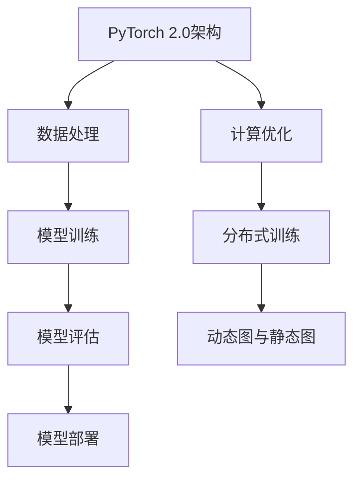

                 

# 从零开始大模型开发与微调：基于PyTorch 2.0的强化学习实战

> 关键词：大模型、PyTorch 2.0、强化学习、微调、神经网络、数据增强、模型优化、环境搭建、算法实现

> 摘要：本文将详细介绍如何从零开始进行大模型的开发与微调，主要基于PyTorch 2.0的强化学习实战。文章首先对大模型的基本概念和重要性进行了阐述，然后介绍了PyTorch 2.0的特点和应用。接着，深入探讨了大模型的技术原理，包括架构、训练技巧和优化方法。随后，文章重点介绍了强化学习的基础知识，以及如何在PyTorch 2.0中实现强化学习。此外，文章还详细讨论了微调技术及其在模型优化中的应用。最后，通过项目实战和案例分析，展示了大模型在实际应用中的效果，并展望了其未来的发展趋势。附录部分提供了常用工具和资源的介绍。

## 第1章 大模型概述与PyTorch 2.0介绍

### 1.1 大模型的概念与重要性

#### 1.1.1 大模型的定义

大模型，又称巨型模型，是指参数量非常大、结构复杂的神经网络模型。这些模型通常具有数十亿至数万亿个参数，远超传统机器学习模型。大模型的典型代表包括GPT-3、BERT、Turing等。

#### 1.1.2 大模型的发展历程

大模型的发展可以追溯到深度学习技术的兴起。随着计算资源和数据量的不断增加，深度学习模型逐渐向更大、更复杂的方向发展。2018年，GPT-3的发布标志着大模型技术达到了新的高度。

#### 1.1.3 大模型的重要性

大模型在诸多领域展现出强大的潜力，如自然语言处理、计算机视觉、语音识别等。其重要性主要体现在以下几个方面：

1. **提高模型性能**：大模型能够更好地捕捉数据中的复杂模式，提高模型在各类任务上的性能。
2. **实现模型泛化**：大模型具有更强的泛化能力，能够更好地应对未见过的数据。
3. **推动技术创新**：大模型的研究和开发推动了深度学习技术的发展，为新的算法和架构提供了启示。

### 1.2 PyTorch 2.0的特点与应用

#### 1.2.1 PyTorch 2.0的引入

PyTorch 2.0是PyTorch框架的最新版本，引入了诸多新特性和优化，使得大模型的开发变得更加高效和便捷。

#### 1.2.2 PyTorch 2.0的优势

1. **动态图计算**：PyTorch 2.0引入了动态图计算机制，使得模型的构建和调试更加灵活。
2. **计算优化**：PyTorch 2.0在计算性能方面进行了大量优化，特别是针对大模型的训练。
3. **分布式训练**：PyTorch 2.0支持分布式训练，能够充分利用多GPU和多节点资源。

#### 1.2.3 PyTorch 2.0的应用场景

PyTorch 2.0适用于各类大模型的开发，包括自然语言处理、计算机视觉、语音识别等。其在工业界和学术界都得到了广泛应用。

### 1.3 PyTorch 2.0的Mermaid流程图



### 1.4 PyTorch 2.0基础模型构建

#### 1.4.1 神经网络基本结构

神经网络由多个层次组成，包括输入层、隐藏层和输出层。每一层由多个神经元组成，神经元之间通过权重连接。

#### 1.4.2 深层神经网络构建

深层神经网络（Deep Neural Network, DNN）是指具有多个隐藏层的神经网络。DNN能够更好地捕捉数据中的复杂模式。

#### 1.4.3 PyTorch 2.0模型构建示例

```python
import torch
import torch.nn as nn

class SimpleModel(nn.Module):
    def __init__(self):
        super(SimpleModel, self).__init__()
        self.fc1 = nn.Linear(10, 10)
        self.fc2 = nn.Linear(10, 5)
        self.fc3 = nn.Linear(5, 1)

    def forward(self, x):
        x = self.fc1(x)
        x = torch.relu(x)
        x = self.fc2(x)
        x = torch.relu(x)
        x = self.fc3(x)
        return x
```

### 1.5 伪代码：神经网络优化算法

```python
// 伪代码：神经网络优化算法
initialize_parameters()
for each epoch do
    for each batch do
        compute_gradient()
        update_parameters(learning_rate)
    end
end

// 示例：梯度下降算法
def gradient_descent(parameters, gradients, learning_rate):
    new_parameters = parameters - learning_rate * gradients
    return new_parameters
```

### 1.6 数学模型与公式

#### 1.6.1 激活函数

$$
f(x) = \text{ReLU}(x) = \begin{cases}
x & \text{if } x > 0 \\
0 & \text{if } x \leq 0
\end{cases}
$$

#### 1.6.2 损失函数

$$
J(\theta) = \frac{1}{m} \sum_{i=1}^{m} (-y^{(i)} \log(a^{(i)}_y) - (1 - y^{(i)}) \log(1 - a^{(i)}_y))
$$

### 1.7 PyTorch 2.0环境搭建

#### 1.7.1 系统要求

- Python版本：Python 3.7或更高版本
- PyTorch版本：PyTorch 2.0或更高版本

#### 1.7.2 安装步骤

1. 打开命令行窗口，执行以下命令：

   ```bash
   pip install torch torchvision torchaudio
   ```

2. 验证安装：

   ```python
   import torch
   print(torch.__version__)
   ```

#### 1.7.3 配置与调试

1. 配置GPU支持：

   ```python
   import torch
   print(torch.cuda.is_available())
   ```

2. 调试环境：

   ```python
   import torchvision
   print(torchvision.__version__)
   ```

## 第2章 PyTorch 2.0基础

### 2.1 环境搭建与配置

#### 2.1.1 操作系统与Python版本

- 操作系统：Windows、Linux或macOS
- Python版本：Python 3.7或更高版本

#### 2.1.2 安装PyTorch 2.0

1. 打开命令行窗口，执行以下命令：

   ```bash
   pip install torch torchvision torchaudio
   ```

2. 验证安装：

   ```python
   import torch
   print(torch.__version__)
   ```

#### 2.1.3 环境变量配置

1. 设置PyTorch环境变量：

   ```bash
   export PATH=$PATH:/path/to/PyTorch
   ```

2. 验证环境变量：

   ```bash
   which torch
   ```

### 2.2 数据处理与加载

#### 2.2.1 数据集准备

1. 下载并解压数据集：

   ```bash
   wget https://www.csie.ntu.edu.tw/~cjlin/libsvm/datasets/libsvm_kddcup_10_20_45_90.tar.gz
   tar -xvf libsvm_kddcup_10_20_45_90.tar.gz
   ```

2. 数据集目录：

   ```
   kddcup_10_20_45_90/
   ├── train.txt
   ├── test.txt
   ├── valid.txt
   ```

#### 2.2.2 数据预处理

1. 数据读取：

   ```python
   import torch
   from torch.utils.data import Dataset

   class KDDCupDataset(Dataset):
       def __init__(self, file_path):
           self.file_path = file_path
           self.data = torch.load(self.file_path)

       def __len__(self):
           return len(self.data)

       def __getitem__(self, idx):
           return self.data[idx]
   ```

2. 数据预处理：

   ```python
   train_data = KDDCupDataset('train.txt')
   valid_data = KDDCupDataset('valid.txt')
   test_data = KDDCupDataset('test.txt')
   ```

#### 2.2.3 DataLoader的使用

1. DataLoader初始化：

   ```python
   import torch.utils.data as data

   train_loader = data.DataLoader(train_data, batch_size=64, shuffle=True)
   valid_loader = data.DataLoader(valid_data, batch_size=64, shuffle=True)
   test_loader = data.DataLoader(test_data, batch_size=64, shuffle=True)
   ```

2. DataLoader使用：

   ```python
   for data in train_loader:
       inputs, labels = data
       # 模型训练代码
   ```

### 2.3 基础模型构建

#### 2.3.1 神经网络基础

1. 神经网络结构：

   ```python
   import torch
   import torch.nn as nn

   class SimpleModel(nn.Module):
       def __init__(self):
           super(SimpleModel, self).__init__()
           self.fc1 = nn.Linear(10, 10)
           self.fc2 = nn.Linear(10, 5)
           self.fc3 = nn.Linear(5, 1)

       def forward(self, x):
           x = self.fc1(x)
           x = torch.relu(x)
           x = self.fc2(x)
           x = torch.relu(x)
           x = self.fc3(x)
           return x
   ```

2. 模型训练：

   ```python
   model = SimpleModel()
   criterion = nn.BCELoss()
   optimizer = torch.optim.Adam(model.parameters(), lr=0.001)

   for epoch in range(100):
       for inputs, labels in train_loader:
           optimizer.zero_grad()
           outputs = model(inputs)
           loss = criterion(outputs, labels)
           loss.backward()
           optimizer.step()
   ```

#### 2.3.2 模型构建示例

1. 数据预处理：

   ```python
   train_data = KDDCupDataset('train.txt')
   valid_data = KDDCupDataset('valid.txt')
   test_data = KDDCupDataset('test.txt')

   train_loader = data.DataLoader(train_data, batch_size=64, shuffle=True)
   valid_loader = data.DataLoader(valid_data, batch_size=64, shuffle=True)
   test_loader = data.DataLoader(test_data, batch_size=64, shuffle=True)
   ```

2. 模型训练：

   ```python
   model = SimpleModel()
   criterion = nn.BCELoss()
   optimizer = torch.optim.Adam(model.parameters(), lr=0.001)

   for epoch in range(100):
       for inputs, labels in train_loader:
           optimizer.zero_grad()
           outputs = model(inputs)
           loss = criterion(outputs, labels)
           loss.backward()
           optimizer.step()
   ```

3. 模型评估：

   ```python
   model.eval()
   with torch.no_grad():
       for inputs, labels in test_loader:
           outputs = model(inputs)
           # 计算准确率、召回率等指标
   ```

## 第3章 大模型技术原理

### 3.1 大模型架构与设计

#### 3.1.1 大模型的基本结构

大模型通常由多个层次组成，包括输入层、隐藏层和输出层。隐藏层数量和层数可以根据需求进行调整。

#### 3.1.2 大模型的层次结构

大模型的层次结构可以分为以下几个部分：

1. **输入层**：接收外部输入数据，如文本、图像、声音等。
2. **嵌入层**：将输入数据转化为向量表示。
3. **编码器**：对输入数据进行编码，提取特征。
4. **解码器**：对编码后的数据进行解码，生成输出结果。
5. **输出层**：将解码后的数据转化为最终输出。

#### 3.1.3 大模型的扩展与定制

大模型的扩展与定制可以通过以下方式进行：

1. **添加层**：在原有模型基础上添加新的层，如卷积层、全连接层等。
2. **调整层数**：增加或减少隐藏层的数量，以适应不同任务的需求。
3. **替换层**：将原有层替换为更合适的层，如使用残差网络替换普通全连接层。

### 3.2 大模型训练技巧

#### 3.2.1 训练策略

1. **批量训练**：将训练数据分成多个批次，逐个批次进行训练。
2. **小批量训练**：使用较小的批量大小进行训练，以提高模型的鲁棒性和泛化能力。
3. **交叉验证**：将训练数据划分为多个子集，每个子集用于不同的训练和验证过程。

#### 3.2.2 数据增强

1. **图像增强**：对图像进行旋转、缩放、裁剪等操作，以增加数据多样性。
2. **文本增强**：对文本进行替换、插入、删除等操作，以丰富文本数据。
3. **声音增强**：对声音进行混响、回声、速度调整等操作，以增加声音数据的多样性。

#### 3.2.3 模型压缩与量化

1. **模型压缩**：通过减少模型参数数量和计算量，降低模型的复杂度。
2. **模型量化**：将模型的浮点数参数转换为较低精度的整数参数，以减少模型大小和计算资源消耗。

### 3.3 大模型优化与调试

#### 3.3.1 优化算法

1. **梯度下降**：通过计算损失函数关于模型参数的梯度，更新模型参数。
2. **Adam优化器**：结合梯度下降和动量项，提高优化效果。
3. **RMSprop优化器**：基于梯度平方的指数加权平均，优化梯度更新。

#### 3.3.2 模型调试方法

1. **数据可视化**：通过可视化模型输出和损失函数曲线，分析模型性能。
2. **调试工具**：使用调试工具（如pdb、print函数等）进行代码调试。
3. **错误分析**：分析模型输出和实际结果之间的差异，找出错误原因。

#### 3.3.3 性能调优技巧

1. **调整学习率**：通过调整学习率，优化模型性能。
2. **批量大小**：调整批量大小，以提高模型稳定性和收敛速度。
3. **训练时长**：合理设置训练时长，避免过度训练。

## 第4章 强化学习基础

### 4.1 强化学习概述

#### 4.1.1 强化学习的基本概念

强化学习（Reinforcement Learning, RL）是一种机器学习范式，旨在通过互动来学习策略。其核心概念包括：

1. **代理**（Agent）：执行行动并从环境中接收反馈的智能体。
2. **环境**（Environment）：代理行动发生的场景。
3. **状态**（State）：环境中代理所处的位置。
4. **动作**（Action）：代理可以采取的行为。
5. **奖励**（Reward）：代理从环境中获得的奖励或惩罚。

#### 4.1.2 强化学习的主要类型

强化学习可以分为以下几种主要类型：

1. **模型基础强化学习**（Model-Based RL）：使用模型来预测环境的转移概率和奖励。
2. **模型自由强化学习**（Model-Free RL）：不使用环境模型，直接从经验中学习。
3. **部分可观测强化学习**（Partially Observable RL）：代理无法完全观察到环境状态。
4. **多代理强化学习**（Multi-Agent RL）：多个代理共同交互，学习策略。

#### 4.1.3 强化学习在人工智能中的应用

强化学习在人工智能领域具有广泛的应用，包括：

1. **机器人控制**：自主机器人通过强化学习来学习控制策略。
2. **游戏AI**：智能体在游戏中通过强化学习来获得高分。
3. **推荐系统**：强化学习用于优化推荐策略。
4. **自动驾驶**：自动驾驶车辆通过强化学习来学习驾驶策略。

### 4.2 强化学习算法介绍

#### 4.2.1 Q学习算法

Q学习（Q-Learning）是一种模型自由、值迭代的方法，用于学习最优策略。其核心思想是更新每个状态-动作对的Q值，直到收敛。

1. **目标函数**：

$$
Q(s, a) \leftarrow Q(s, a) + \alpha [r + \gamma \max_{a'} Q(s', a') - Q(s, a)]
$$

2. **伪代码**：

```python
initialize Q(s, a) randomly
for each episode do
    for each time step do
        if epsilon-greedy policy is used, select action a using epsilon-greedy strategy
        else, select action a using the current policy
        execute action a in the environment
        observe the reward r and the next state s'
        update Q(s, a) using the Q-learning update rule
        s <- s'
    end
end
```

#### 4.2.2 SARSA算法

SARSA（State-Action-Reward-State-Action, SARSA）是一种基于值迭代的策略评估方法，用于学习最优策略。与Q学习类似，SARSA通过更新每个状态-动作对的值来学习。

1. **目标函数**：

$$
Q(s, a) \leftarrow Q(s, a) + \alpha [r + \gamma Q(s', a')]
$$

2. **伪代码**：

```python
initialize Q(s, a) randomly
for each episode do
    for each time step do
        if epsilon-greedy policy is used, select action a using epsilon-greedy strategy
        else, select action a using the current policy
        execute action a in the environment
        observe the reward r and the next state s'
        select action a' using epsilon-greedy strategy
        update Q(s, a) using the SARSA update rule
        s <- s'
    end
end
```

#### 4.2.3 策略梯度算法

策略梯度算法（Policy Gradient Algorithms）是一种直接优化策略的方法，通过梯度上升更新策略参数。

1. **目标函数**：

$$
J(\theta) = \sum_{s, a} \pi(\theta)(s, a) \cdot [r + \gamma \max_{a'} \pi(\theta)(s', a')]
$$

2. **伪代码**：

```python
initialize policy parameters \theta
for each episode do
    for each time step do
        execute action a from the current policy \pi(\theta)
        observe the reward r and the next state s'
        calculate the advantage function A(s, a)
        update the policy parameters \theta using gradient ascent
    end
end
```

## 第5章 基于PyTorch 2.0的强化学习实现

### 5.1 强化学习环境搭建

#### 5.1.1 OpenAI Gym简介

OpenAI Gym是一个开源的强化学习环境库，提供了多种标准化的环境和工具，方便研究人员和开发者进行强化学习研究和实验。

#### 5.1.2 创建自定义环境

1. **环境定义**：

```python
import gym

class CustomEnv(gym.Env):
    def __init__(self):
        super(CustomEnv, self).__init__()
        # 初始化环境参数
        self.action_space = gym.spaces.Discrete(2)
        self.observation_space = gym.spaces.Box(low=-1, high=1, shape=(3,), dtype=np.float32)

    def step(self, action):
        # 执行动作
        # 更新状态
        # 返回奖励、新状态、是否完成、额外信息
        return reward, next_state, done, info

    def reset(self):
        # 重置环境状态
        return initial_state

    def render(self, mode='human'):
        # 渲染环境
```

2. **运行环境**：

```python
env = CustomEnv()
obs = env.reset()
while True:
    env.render()
    action = env.action_space.sample()
    obs, reward, done, info = env.step(action)
    if done:
        break
```

#### 5.1.3 PyTorch 2.0与OpenAI Gym的集成

1. **环境封装**：

```python
class PyTorchEnv(gym.Env):
    def __init__(self, env):
        super(PyTorchEnv, self).__init__()
        self.env = env
        self.device = torch.device("cuda" if torch.cuda.is_available() else "cpu")

    def step(self, action):
        action = torch.tensor(action).unsqueeze(0).to(self.device)
        with torch.no_grad():
            obs, reward, done, info = self.env.step(action.cpu().numpy())
        obs = torch.tensor(obs).unsqueeze(0).to(self.device)
        return obs, reward, done, info

    def reset(self):
        obs = torch.tensor(self.env.reset()).unsqueeze(0).to(self.device)
        return obs

    def render(self, mode='human'):
        self.env.render(mode=mode)
```

2. **使用PyTorchEnv**：

```python
env = CustomEnv()
torch_env = PyTorchEnv(env)
obs = torch_env.reset()
while True:
    action = torch.randint(0, 2, (1,)).item()
    obs, reward, done, info = torch_env.step(action)
    print(f"Action: {action}, Reward: {reward}, Done: {done}")
    if done:
        break
```

### 5.2 强化学习算法实现

#### 5.2.1 Q学习算法实现

1. **模型定义**：

```python
import torch
import torch.nn as nn
import torch.optim as optim

class QNetwork(nn.Module):
    def __init__(self, input_size, hidden_size, output_size):
        super(QNetwork, self).__init__()
        self.fc1 = nn.Linear(input_size, hidden_size)
        self.fc2 = nn.Linear(hidden_size, output_size)

    def forward(self, x):
        x = torch.relu(self.fc1(x))
        x = self.fc2(x)
        return x
```

2. **训练过程**：

```python
def train(q_network, target_q_network, optimizer, criterion, episodes, env):
    for episode in range(episodes):
        obs = env.reset()
        done = False
        while not done:
            q_values = q_network(torch.tensor(obs).float())
            action = torch.argmax(q_values).item()
            next_obs, reward, done, _ = env.step(action)
            target_q_values = target_q_network(torch.tensor(next_obs).float())
            target_value = reward + (1 - int(done)) * discount_factor * target_q_values.max()
            loss = criterion(q_values[0, action], target_value)
            optimizer.zero_grad()
            loss.backward()
            optimizer.step()
            obs = next_obs
```

3. **使用Q学习算法**：

```python
q_network = QNetwork(input_size=env.observation_space.shape[0], hidden_size=64, output_size=env.action_space.n)
target_q_network = QNetwork(input_size=env.observation_space.shape[0], hidden_size=64, output_size=env.action_space.n)
optimizer = optim.Adam(q_network.parameters(), lr=0.001)
criterion = nn.MSELoss()

 episodes = 1000
discount_factor = 0.99
train(q_network, target_q_network, optimizer, criterion, episodes, torch_env)
```

#### 5.2.2 SARSA算法实现

1. **模型定义**：

```python
class SARSAQNetwork(nn.Module):
    def __init__(self, input_size, hidden_size, output_size):
        super(SARSAQNetwork, self).__init__()
        self.fc1 = nn.Linear(input_size, hidden_size)
        self.fc2 = nn.Linear(hidden_size, output_size)

    def forward(self, x):
        x = torch.relu(self.fc1(x))
        x = self.fc2(x)
        return x
```

2. **训练过程**：

```python
def train_sarsa(sarsa_q_network, optimizer, criterion, episodes, env):
    for episode in range(episodes):
        obs = env.reset()
        done = False
        while not done:
            q_values = sarsa_q_network(torch.tensor(obs).float())
            action = torch.argmax(q_values).item()
            next_obs, reward, done, _ = env.step(action)
            next_q_values = sarsa_q_network(torch.tensor(next_obs).float())
            target_value = reward + (1 - int(done)) * discount_factor * next_q_values.max()
            loss = criterion(q_values[0, action], target_value)
            optimizer.zero_grad()
            loss.backward()
            optimizer.step()
            obs = next_obs
```

3. **使用SARSA算法**：

```python
sarsa_q_network = SARSAQNetwork(input_size=env.observation_space.shape[0], hidden_size=64, output_size=env.action_space.n)
optimizer = optim.Adam(sarsa_q_network.parameters(), lr=0.001)
criterion = nn.MSELoss()

episodes = 1000
discount_factor = 0.99
train_sarsa(sarsa_q_network, optimizer, criterion, episodes, torch_env)
```

#### 5.2.3 策略梯度算法实现

1. **模型定义**：

```python
class PolicyGradientModel(nn.Module):
    def __init__(self, input_size, hidden_size, output_size):
        super(PolicyGradientModel, self).__init__()
        self.fc1 = nn.Linear(input_size, hidden_size)
        self.fc2 = nn.Linear(hidden_size, output_size)

    def forward(self, x):
        x = torch.relu(self.fc1(x))
        x = self.fc2(x)
        x = torch.softmax(x, dim=1)
        return x
```

2. **训练过程**：

```python
def train_policy_gradient(policy_network, optimizer, criterion, episodes, env):
    for episode in range(episodes):
        obs = env.reset()
        done = False
        total_reward = 0
        while not done:
            policy = policy_network(torch.tensor(obs).float())
            action = torch.argmax(policy).item()
            next_obs, reward, done, _ = env.step(action)
            log_prob = torch.log(policy[0, action])
            total_reward += reward
            advantage = reward + (1 - int(done)) * discount_factor * env.reward_range * (1 - policy[0, action])
            loss = -log_prob * advantage
            optimizer.zero_grad()
            loss.backward()
            optimizer.step()
            obs = next_obs
        print(f"Episode: {episode}, Total Reward: {total_reward}")
```

3. **使用策略梯度算法**：

```python
policy_network = PolicyGradientModel(input_size=env.observation_space.shape[0], hidden_size=64, output_size=env.action_space.n)
optimizer = optim.Adam(policy_network.parameters(), lr=0.001)
criterion = nn.CrossEntropyLoss()

episodes = 1000
discount_factor = 0.99
train_policy_gradient(policy_network, optimizer, criterion, episodes, torch_env)
```

### 5.3 强化学习性能评估

#### 5.3.1 评估指标

强化学习性能评估通常包括以下几个指标：

1. **平均奖励**：在给定策略下，环境平均奖励的累积值。
2. **平均回报**：在给定策略下，环境平均回报的累积值。
3. **成功率**：在特定任务中，代理成功完成任务的比例。
4. **动作选择频率**：在特定策略下，不同动作的选择频率。

#### 5.3.2 性能对比分析

1. **Q学习与SARSA算法对比**：

   - Q学习通过目标值更新Q值，而SARSA算法通过当前值更新Q值。
   - Q学习可能收敛得更快，但SARSA算法更稳健。

2. **策略梯度算法与Q学习、SARSA算法对比**：

   - 策略梯度算法直接优化策略，而非值函数。
   - 策略梯度算法在探索和利用之间需要权衡。

#### 5.3.3 性能优化策略

1. **探索策略**：使用ε-贪婪策略、UCB算法等探索策略来平衡探索和利用。
2. **学习率调整**：根据训练过程调整学习率，避免过早收敛。
3. **经验回放**：使用经验回放机制，避免样本相关性和偏差。

## 第6章 大模型微调与优化

### 6.1 微调技术概述

#### 6.1.1 微调的概念

微调（Fine-tuning）是一种在大模型基础上进行微调的方法，用于适应特定任务。微调的目的是利用预训练模型已有的知识和能力，对模型进行少量调整，以提高特定任务的表现。

#### 6.1.2 微调的优势

微调具有以下优势：

1. **快速收敛**：利用预训练模型已有知识，减少训练时间和计算资源。
2. **提高性能**：通过微调，可以进一步提高模型在特定任务上的性能。
3. **降低训练成本**：利用预训练模型，减少大规模数据集的收集和标注成本。

#### 6.1.3 微调的应用场景

微调适用于以下场景：

1. **自然语言处理**：如文本分类、机器翻译等。
2. **计算机视觉**：如图像分类、目标检测等。
3. **语音识别**：如语音合成、语音识别等。

### 6.2 微调策略与实现

#### 6.2.1 微调策略的选择

微调策略主要包括以下几种：

1. **从头训练**：从头开始训练模型，适用于数据量较大、任务复杂的情况。
2. **全量微调**：在预训练模型的基础上，对所有层进行微调。
3. **部分微调**：仅对部分层进行微调，适用于预训练模型已有较好表现，但需适应新任务的场景。
4. **自适应微调**：根据模型在验证集上的表现，自适应调整微调的层级和范围。

#### 6.2.2 微调算法的实现

1. **模型定义**：

```python
import torch
import torch.nn as nn
import torch.optim as optim

class FineTunedModel(nn.Module):
    def __init__(self, model, fine_tune_layers):
        super(FineTunedModel, self).__init__()
        self.model = model
        self.fine_tune_layers = fine_tune_layers

        for layer in self.fine_tune_layers:
            layer.requires_grad = True

    def forward(self, x):
        return self.model(x)
```

2. **训练过程**：

```python
def fine_tune(model, data_loader, optimizer, criterion, num_epochs):
    for epoch in range(num_epochs):
        for inputs, labels in data_loader:
            optimizer.zero_grad()
            outputs = model(inputs)
            loss = criterion(outputs, labels)
            loss.backward()
            optimizer.step()
```

3. **使用微调模型**：

```python
model = PretrainedModel()  # 预训练模型
fine_tuned_model = FineTunedModel(model, fine_tune_layers=[model.fc1, model.fc2])
optimizer = optim.Adam(fine_tuned_model.parameters(), lr=0.001)
criterion = nn.CrossEntropyLoss()

data_loader = DataLoader(dataset, batch_size=64, shuffle=True)
fine_tune(fine_tuned_model, data_loader, optimizer, criterion, num_epochs=10)
```

### 6.3 微调效果评估

#### 6.3.1 微调效果的评估指标

微调效果的评估指标主要包括：

1. **准确率**：分类任务中，正确预测的样本比例。
2. **召回率**：分类任务中，实际为正类且被正确预测为正类的样本比例。
3. **F1值**：准确率与召回率的调和平均值。
4. **损失函数值**：训练过程中损失函数的值，用于评估模型性能。

#### 6.3.2 微调效果的对比分析

1. **微调前与微调后的性能对比**：

   - 对比微调前后的准确率、召回率、F1值等指标，评估微调对模型性能的影响。
   - 分析微调过程中参数调整对模型性能的影响。

2. **不同微调策略的对比**：

   - 对比全量微调、部分微调、自适应微调等策略的优劣，为实际应用提供参考。

#### 6.3.3 微调效果的优化方法

1. **超参数调整**：

   - 调整学习率、批量大小、训练时长等超参数，优化微调效果。
   - 使用超参数搜索方法（如网格搜索、贝叶斯优化等）寻找最佳超参数。

2. **数据增强**：

   - 使用数据增强方法（如旋转、缩放、裁剪等）增加训练数据的多样性，提高模型泛化能力。

3. **模型压缩与量化**：

   - 通过模型压缩与量化技术，减少模型参数数量和计算资源消耗，提高微调效果。

## 第7章 项目实战与案例分析

### 7.1 强化学习项目实战

#### 7.1.1 项目背景

本次项目基于强化学习技术，旨在实现一个智能体在特定环境中进行自主决策，以达到最大化累积奖励的目标。

#### 7.1.2 项目目标

1. **环境搭建**：使用OpenAI Gym构建一个简单的环境，如CartPole。
2. **模型设计**：设计一个基于深度强化学习的模型，包括Q网络和策略网络。
3. **训练过程**：使用Q学习算法和策略梯度算法对模型进行训练。
4. **性能评估**：评估模型在测试集上的性能，包括平均奖励、成功率等指标。

#### 7.1.3 项目实施步骤

1. **环境搭建**：

   - 使用OpenAI Gym构建CartPole环境。
   - 定义状态空间和动作空间。

2. **模型设计**：

   - 设计Q网络和策略网络，包括输入层、隐藏层和输出层。
   - 使用ReLU激活函数和线性层。

3. **训练过程**：

   - 使用Q学习算法训练Q网络。
   - 使用策略梯度算法训练策略网络。
   - 记录每个策略下的平均奖励。

4. **性能评估**：

   - 对训练过程进行性能评估。
   - 选择最佳策略，评估在测试集上的性能。

### 7.2 案例分析

#### 7.2.1 案例一：智能机器人导航

**背景**：智能机器人在复杂环境中进行自主导航，避开障碍物并到达目标位置。

**目标**：设计一个基于强化学习的导航算法，使机器人能够高效、安全地到达目标。

**实施步骤**：

1. **环境搭建**：使用模拟器构建一个简单的导航环境，包括地图、障碍物和目标点。
2. **模型设计**：设计一个基于深度强化学习的导航模型，包括状态编码器、动作解码器和奖励函数。
3. **训练过程**：使用Q学习算法和策略梯度算法对模型进行训练。
4. **性能评估**：评估模型在导航任务中的性能，包括路径长度、成功率等指标。

#### 7.2.2 案例二：自动驾驶

**背景**：自动驾驶汽车在复杂交通环境中进行驾驶，包括道路识别、车辆控制等。

**目标**：设计一个基于强化学习的自动驾驶算法，使汽车能够安全、高效地行驶。

**实施步骤**：

1. **环境搭建**：使用模拟器构建一个简单的自动驾驶环境，包括道路、车辆、行人等。
2. **模型设计**：设计一个基于深度强化学习的自动驾驶模型，包括感知模块、控制模块和奖励函数。
3. **训练过程**：使用Q学习算法和策略梯度算法对模型进行训练。
4. **性能评估**：评估模型在自动驾驶任务中的性能，包括行驶安全、行驶效率等指标。

#### 7.2.3 案例三：游戏AI

**背景**：游戏中的智能体进行自主决策，提高游戏难度和趣味性。

**目标**：设计一个基于强化学习的游戏AI，使游戏更具挑战性。

**实施步骤**：

1. **环境搭建**：选择一款游戏，如Atari游戏，构建游戏环境。
2. **模型设计**：设计一个基于深度强化学习的游戏AI模型，包括状态编码器、动作解码器和奖励函数。
3. **训练过程**：使用Q学习算法和策略梯度算法对模型进行训练。
4. **性能评估**：评估模型在游戏中的性能，包括游戏得分、游戏时间等指标。

### 7.3 项目经验总结

#### 7.3.1 项目成功的因素

1. **环境搭建**：选择合适的强化学习环境，为模型训练提供基础。
2. **模型设计**：设计合适的模型结构，包括状态编码器、动作解码器和奖励函数。
3. **算法选择**：选择合适的强化学习算法，如Q学习、策略梯度算法等。
4. **超参数调整**：根据实验结果，调整超参数，优化模型性能。

#### 7.3.2 项目面临的挑战

1. **计算资源**：强化学习模型训练需要大量计算资源，如何高效利用计算资源是一个挑战。
2. **数据收集**：在现实环境中进行数据收集，如何保证数据质量和多样性是一个挑战。
3. **模型解释性**：强化学习模型通常缺乏解释性，如何解释模型的决策过程是一个挑战。

#### 7.3.3 项目经验与启示

1. **实验设计**：在项目初期，进行充分的实验设计，包括环境选择、模型设计、算法选择等。
2. **数据收集**：在数据收集过程中，注重数据质量和多样性，为模型训练提供有力支持。
3. **模型优化**：根据实验结果，不断优化模型结构和超参数，提高模型性能。
4. **团队合作**：在项目过程中，注重团队合作，充分利用团队成员的专长和经验。

## 第8章 大模型在其他领域的应用

### 8.1 自然语言处理

#### 8.1.1 大模型在NLP中的应用

大模型在自然语言处理（NLP）领域具有广泛的应用，如文本分类、机器翻译、文本生成等。

1. **文本分类**：大模型能够自动提取文本特征，实现高效的文本分类。
2. **机器翻译**：大模型能够利用预训练的模型，实现高质量的机器翻译。
3. **文本生成**：大模型能够生成高质量的文本，包括文章、故事、对话等。

#### 8.1.2 语言模型与文本生成

语言模型是NLP的核心组成部分，用于预测下一个单词或句子。大模型在语言模型中发挥着重要作用，通过大规模预训练，能够捕捉语言中的复杂规律。

1. **预训练方法**：使用大规模语料库进行预训练，包括GPT、BERT等模型。
2. **生成文本**：利用预训练的语言模型，生成符合语言规则的文本。

#### 8.1.3 问答系统与对话系统

问答系统和对话系统是NLP的重要应用领域，大模型在其中的作用越来越突出。

1. **问答系统**：大模型能够自动回答用户的问题，提高问答系统的准确性。
2. **对话系统**：大模型能够模拟人类的对话过程，实现人机交互。

### 8.2 计算机视觉

#### 8.2.1 大模型在CV中的应用

大模型在计算机视觉（CV）领域具有广泛的应用，如图像分类、目标检测、图像生成等。

1. **图像分类**：大模型能够自动提取图像特征，实现高效的图像分类。
2. **目标检测**：大模型能够检测图像中的目标对象，包括人脸、车辆等。
3. **图像生成**：大模型能够生成高质量的图像，包括艺术作品、虚拟现实场景等。

#### 8.2.2 图像分类与目标检测

图像分类和目标检测是CV领域的核心任务，大模型在其中的作用越来越重要。

1. **图像分类**：使用卷积神经网络（CNN）对图像进行分类，提高分类准确性。
2. **目标检测**：使用卷积神经网络（CNN）检测图像中的目标对象，包括定位和分类。

#### 8.2.3 3D建模与视频分析

大模型在3D建模和视频分析领域具有广泛应用，如三维重建、动作识别等。

1. **3D建模**：大模型能够自动生成三维模型，提高建模效率。
2. **视频分析**：大模型能够对视频进行分类、识别和分割，实现视频分析。

### 8.3 语音识别

#### 8.3.1 大模型在语音识别中的应用

大模型在语音识别领域具有广泛的应用，如语音合成、语音识别、语音增强等。

1. **语音合成**：大模型能够自动生成语音，实现高质量的语音合成。
2. **语音识别**：大模型能够自动识别语音中的文字信息，实现语音识别。
3. **语音增强**：大模型能够增强语音信号，提高语音质量。

#### 8.3.2 语音合成与语音增强

语音合成和语音增强是语音识别的重要应用领域，大模型在其中的作用越来越突出。

1. **语音合成**：使用文本到语音（Text-to-Speech, TTS）技术，实现高质量的语音合成。
2. **语音增强**：使用语音增强技术，提高语音信号的清晰度和可理解性。

#### 8.3.3 语音交互与智能助手

大模型在语音交互和智能助手领域具有广泛应用，如语音助手、语音控制、语音翻译等。

1. **语音助手**：大模型能够实现语音交互，为用户提供语音服务。
2. **语音控制**：大模型能够识别用户的语音指令，实现语音控制。
3. **语音翻译**：大模型能够实现语音翻译，为用户提供跨语言的交流支持。

## 第9章 大模型未来发展趋势

### 9.1 技术演进方向

大模型在未来将继续向以下方向发展：

1. **模型架构**：探索新的模型架构，如图神经网络（Graph Neural Networks, GNN）、生成对抗网络（Generative Adversarial Networks, GAN）等。
2. **训练算法**：优化训练算法，提高大模型的训练效率和性能。
3. **跨模态学习**：实现跨模态学习，如将图像、文本、语音等多种模态信息进行融合。

### 9.2 应用前景展望

大模型在未来的应用前景将非常广阔，包括：

1. **工业生产与自动化**：大模型将提高工业生产线的自动化水平，实现高效、精准的生产。
2. **金融服务与风险管理**：大模型将用于金融产品的设计、风险评估等，提高金融服务的质量和效率。
3. **教育医疗与健康管理**：大模型将用于个性化教育、医疗诊断、健康管理等领域，提高教育、医疗和健康服务的水平。

### 9.3 面临的挑战与解决方案

大模型在发展过程中面临以下挑战：

1. **计算资源与能耗**：大模型训练和推理需要大量计算资源和能源，如何降低计算资源和能耗是重要挑战。
2. **数据安全与隐私保护**：大模型在处理数据时，如何确保数据安全和个人隐私是关键问题。
3. **伦理与社会影响**：大模型在应用过程中，如何平衡技术创新与社会责任，避免不良影响是重要挑战。

针对上述挑战，可以采取以下解决方案：

1. **计算优化与能耗管理**：通过优化算法和硬件，提高大模型的计算效率和能源利用率。
2. **数据安全与隐私保护**：采用加密、去标识化等技术，确保数据安全和个人隐私。
3. **伦理与社会责任**：制定相关法律法规，引导大模型的应用和发展，确保其符合社会价值观和伦理标准。

## 附录

### 附录A：常用工具与资源

#### A.1 PyTorch 2.0常用库与模块

1. **torch**：PyTorch核心库，用于定义神经网络模型、训练模型等。
2. **torchvision**：用于计算机视觉任务的库，包括数据集、模型等。
3. **torchaudio**：用于音频处理的库，包括音频处理函数、模型等。

#### A.2 强化学习相关资源

1. **OpenAI Gym**：开源的强化学习环境库，提供多种标准化的环境和工具。
2. **Stable Baselines**：开源的强化学习算法实现库，包括各种常见算法的实现。
3. **RLlib**：Apache SINGA的强化学习库，提供分布式强化学习框架。

#### A.3 大模型开发实用技巧与建议

1. **模型压缩与量化**：通过模型压缩和量化技术，减少模型参数数量和计算资源消耗。
2. **模型部署与维护**：合理规划模型部署流程，确保模型在生产和部署过程中稳定运行。
3. **开发流程与工具使用**：采用敏捷开发流程，充分利用代码管理工具、调试工具等，提高开发效率。

