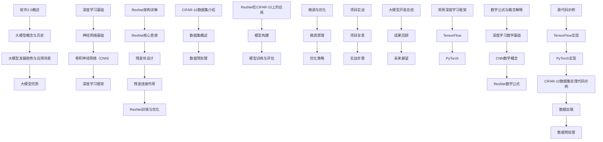

                 

### 文章标题：从零开始大模型开发与微调：基于ResNet的CIFAR-10数据集分类

大模型（Big Models）的发展，如深度学习中的神经网络，已经带来了革命性的变革。它们在图像识别、自然语言处理和预测建模等领域展现了惊人的性能。然而，如何从零开始开发并微调这些大模型，特别是基于ResNet的CIFAR-10数据集分类，仍然是一个复杂且富有挑战性的任务。本文旨在为您提供一个详细的指南，从基础知识到实际操作，帮助您理解并实现这一过程。

关键词：大模型、深度学习、ResNet、CIFAR-10数据集、微调

在本文中，我们将首先概述大模型的概念、历史、发展趋势和应用场景，并介绍其核心优势。接下来，我们将深入探讨深度学习的基础知识，包括神经网络、卷积神经网络（CNN）以及常见的深度学习框架，如TensorFlow和PyTorch。随后，我们将专注于ResNet架构的详细解析，涵盖其核心思想、残差块设计、残差连接作用以及训练与优化策略。

本文的第二部分将转向CIFAR-10数据集的介绍，包括数据集的组成、分布以及数据预处理方法。我们将展示如何使用ResNet模型对CIFAR-10数据集进行分类，包括模型构建、训练策略、评估指标以及微调与优化策略。

最后，本文将提供一次实战项目，涵盖项目背景、数据集准备、模型训练与评估的详细步骤。通过这次实战，我们将总结大模型开发的经验教训，并对未来的发展趋势和应用前景进行展望。此外，我们将提供常用深度学习框架的搭建指南、数学公式与概念解释，以及源代码示例，以帮助读者更好地理解和应用所学知识。

**让我们一步一步地分析推理，深入了解大模型开发与微调的奥秘。**

### 第一部分：大模型基础

#### 第1章：大模型概述

**1.1 大模型的概念与历史**

大模型，通常指的是参数数量达到百万甚至亿级的神经网络模型。这类模型能够处理海量数据，并从中学习复杂的特征和模式，从而在各种任务中取得显著性能提升。大模型的发展可以追溯到深度学习的早期阶段，当时研究者们尝试通过增加网络层数来提升模型的性能。然而，深层网络容易遇到梯度消失和梯度爆炸的问题，导致训练困难。

20世纪90年代，Hinton等研究者提出了深度信念网络（Deep Belief Network，DBN），通过预训练和 Fine-tuning的方法成功解决了深层网络训练的问题。这为后来的深度学习发展奠定了基础。随后，2012年，AlexNet的出现标志着深度卷积神经网络（Convolutional Neural Networks，CNN）在图像分类任务中取得突破性进展，从而掀起了深度学习研究的热潮。

**1.2 大模型的发展趋势与应用场景**

随着计算能力的提升和数据规模的扩大，大模型的发展趋势日益显著。目前，大模型已广泛应用于多个领域，包括但不限于：

- **计算机视觉**：大模型在图像分类、目标检测和图像生成等方面表现出色，被广泛应用于自动驾驶、医疗影像分析等领域。

- **自然语言处理**：大模型在机器翻译、情感分析和文本生成等任务中取得了显著进展，例如BERT和GPT-3等模型。

- **语音识别**：大模型通过学习语音信号的复杂特征，实现了高精度的语音识别，被广泛应用于智能助手和语音控制系统。

- **预测建模**：大模型在金融风险评估、天气预测和股票市场预测等任务中展现了强大的预测能力。

**1.3 大模型的核心优势**

大模型具有以下几个核心优势：

- **强大的表达能力**：大模型通过多层神经网络的结构，能够捕捉到数据的复杂特征和模式，从而提高模型的性能。

- **高效的数据利用**：大模型能够处理大规模数据，并通过自监督学习和迁移学习等方法，提高数据利用效率。

- **高泛化能力**：大模型通过在大规模数据上训练，能够泛化到未见过的数据上，从而提高模型的泛化能力。

- **灵活的适应性**：大模型可以通过微调和优化，适应不同的任务和数据集，从而提高模型的适应性。

然而，大模型的发展也面临着一些挑战，如计算资源需求高、训练时间长和模型解释性差等问题。未来，研究者们将继续探索如何在保持高性能的同时，降低大模型的计算资源和时间成本，提高模型的解释性和透明度。

**总结**：大模型是深度学习的重要发展方向，其在各种领域的应用已经取得了显著的成果。通过了解大模型的概念、历史和发展趋势，我们将更好地把握其核心优势和应用前景。

#### 第2章：深度学习基础

**2.1 神经网络基础**

神经网络（Neural Networks，NN）是深度学习的基础，其灵感来源于人脑中的神经元连接结构。一个基本的神经网络由输入层、隐藏层和输出层组成。每个神经元接收来自前一层神经元的输入信号，并通过激活函数进行非线性变换，最终输出给下一层。

- **神经元的基本结构**：一个神经元包括输入部分、权重和偏置、激活函数以及输出部分。输入部分接收来自前一层神经元的信号，权重和偏置用于调节信号的大小，激活函数用于引入非线性变换，输出部分将信号传递给下一层。

- **前向传播算法**：在神经网络的前向传播过程中，每个神经元接收前一层输出的信号，通过权重和偏置进行加权求和，然后通过激活函数得到输出。这个过程从输入层开始，逐层传递到输出层。

- **反向传播算法**：反向传播算法用于计算神经网络中每个参数的梯度，从而优化网络参数。反向传播分为两个阶段：首先计算输出层的梯度，然后逐层回传到输入层。这个过程依赖于链式法则，通过层层递推，最终得到每个参数的梯度。

- **激活函数**：常见的激活函数包括线性函数（identity function）、Sigmoid函数、Tanh函数和ReLU函数。线性函数保持输入和输出一致，Sigmoid函数和Tanh函数引入了非线性特性，ReLU函数在神经网络中广泛使用，能有效防止梯度消失问题。

**2.2 卷积神经网络（CNN）**

卷积神经网络（Convolutional Neural Networks，CNN）是专门用于处理图像数据的神经网络。其核心思想是通过卷积操作提取图像的特征，并通过多层网络结构逐渐提取更抽象的特征。

- **卷积层的工作原理**：卷积层通过卷积操作提取图像的特征。卷积操作涉及一个卷积核（filter）在图像上的滑动，每次滑动都会产生一个特征图（feature map）。卷积核的权重和偏置用于调整特征图的强度，卷积操作可以捕捉到图像中的边缘、纹理等局部特征。

- **池化层的作用与类型**：池化层用于减小特征图的尺寸，减少计算量和参数数量，同时保持重要的特征信息。常见的池化操作包括最大池化（max pooling）和平均池化（average pooling）。最大池化在特征图中选择最大的值作为输出，能有效保留边缘和角点等关键特征；平均池化则计算特征图中每个像素的平均值作为输出。

- **卷积神经网络结构**：一个典型的卷积神经网络包括多个卷积层、池化层和全连接层。卷积层用于提取特征，池化层用于降维和增强特征，全连接层用于分类。通过堆叠多层卷积层和池化层，CNN能够从原始图像中提取到更高层次的特征。

**2.3 深度学习框架**

深度学习框架是构建和训练神经网络的重要工具。目前，常见的深度学习框架包括TensorFlow和PyTorch。这些框架提供了丰富的API和工具，使得构建和训练深度学习模型变得更加简单和高效。

- **TensorFlow**：TensorFlow是由Google开发的开源深度学习框架，支持多种编程语言，包括Python和C++。TensorFlow提供了丰富的API，用于构建、训练和评估神经网络模型。其动态计算图（dynamic computation graph）设计使得模型构建和优化更加灵活。

- **PyTorch**：PyTorch是由Facebook AI Research（FAIR）开发的开源深度学习框架，主要使用Python编程语言。PyTorch采用静态计算图（static computation graph）设计，使得模型构建和调试更加直观和方便。同时，PyTorch还提供了强大的自动微分（autograd）功能，便于实现复杂的神经网络模型。

**总结**：深度学习基础包括神经网络、卷积神经网络以及常见的深度学习框架。通过理解神经网络的基本结构、前向传播和反向传播算法，以及卷积神经网络的工作原理，我们能够构建和训练高效的神经网络模型。深度学习框架如TensorFlow和PyTorch为模型构建提供了丰富的工具和API，使得深度学习应用变得更加便捷和高效。

#### 第3章：ResNet架构详解

**3.1 ResNet的核心思想**

ResNet（Residual Network）是由He等人在2015年提出的一种深度残差学习框架，它在处理深层神经网络时显著提高了模型的训练效率和性能。ResNet的核心思想是引入了残差连接（residual connection），通过跳过部分网络层（即残差层）来克服深层网络中的梯度消失问题。

- **残差块的设计**：ResNet的基本构建模块是残差块（residual block），每个残差块包含两个卷积层，中间插入一个非线性激活函数（ReLU）。这种设计使得残差块能够有效地传递梯度，克服了深层网络训练中的困难。

- **残差连接的作用**：残差连接在ResNet中起到了关键作用，它允许网络通过跳过某些层来直接学习数据的高层特征，从而避免了梯度消失问题。残差连接的引入使得网络可以更深，而不会牺牲性能。

- **跳跃连接与恒等连接**：在ResNet中，跳跃连接（skip connection）是一种特殊的连接方式，它通过直接将输入信号加到输出的残差层上，实现了信息的快速传递。这种连接方式可以看作是一种恒等连接（identity connection），它使得深层网络中的梯度可以通过跳跃连接传递，从而避免了梯度消失问题。

**3.2 ResNet的训练与优化**

ResNet的训练和优化策略对于其成功至关重要。以下是一些关键的训练和优化方法：

- **批量归一化（Batch Normalization）**：批量归一化是一种常用的正则化技术，它通过标准化每一层的输入数据，提高了网络的训练稳定性和收敛速度。

- **权重初始化**：权重初始化是神经网络训练中的关键步骤，合理的初始化方法可以加速网络的收敛。常用的权重初始化方法包括高斯初始化（Gaussian Initialization）和Xavier初始化（Xavier Initialization）。

- **学习率调度（Learning Rate Scheduling）**：学习率调度是一种动态调整学习率的方法，它通过逐步减小学习率来优化网络的训练过程。常见的学习率调度策略包括逐步减小（Step Decay）和指数减小（Exponential Decay）。

- **Dropout**：Dropout是一种常用的正则化技术，通过随机丢弃部分神经元，减少了网络在训练过程中的过拟合现象，提高了模型的泛化能力。

- **自适应优化器（Adaptive Optimizer）**：自适应优化器如Adam和RMSprop，能够根据参数的梯度信息动态调整学习率，从而提高网络的训练效率和收敛速度。

**3.3 ResNet在不同领域的应用**

ResNet自从提出以来，已在多个领域取得了显著的应用成果：

- **计算机视觉**：在ImageNet图像分类比赛中，ResNet取得了突破性的成绩，刷新了多个分类记录。此外，ResNet在目标检测、图像分割和图像生成等任务中也展现了强大的性能。

- **自然语言处理**：ResNet在自然语言处理领域也得到了广泛应用，如BERT（Bidirectional Encoder Representations from Transformers）模型中的自注意力机制借鉴了ResNet的残差连接设计，使得BERT在多个NLP任务中取得了优异的成绩。

- **语音识别**：ResNet在语音识别任务中通过学习语音信号的复杂特征，实现了高精度的识别效果。特别是在端到端语音识别系统中，ResNet的应用使得系统的性能得到了显著提升。

- **预测建模**：ResNet在金融风险评估、天气预测和股票市场预测等任务中也展示了强大的预测能力。通过学习大量历史数据中的复杂模式，ResNet能够提供准确的预测结果。

**总结**：ResNet通过引入残差连接和有效的训练优化策略，实现了深层神经网络的训练和性能提升。其核心思想、设计原理和训练方法在多个领域都取得了显著的应用成果，推动了深度学习的发展。随着研究的深入，ResNet将继续在更多领域发挥重要作用。

#### 第4章：CIFAR-10数据集介绍

**4.1 数据集概述**

CIFAR-10数据集是由Alex Krizhevsky在2010年创建的，广泛用于计算机视觉任务的图像分类。该数据集包含60000张32x32彩色图像，分为10个类别，每个类别6000张图像。具体来说，CIFAR-10数据集包括以下类别：

1. 飞机
2. 飞船
3. 骑车人
4. 马车
5. 船
6. 鸟
7. 蝴蝶
8. 背包人
9. 面包
10. 食肉动物

数据集分为两部分：50000张训练图像和10000张测试图像。每个类别的训练图像和测试图像的数量相同，确保了每个类别在训练集和测试集中都有足够的样本。

**4.1.1 数据集的组成**

CIFAR-10数据集的图像经过了一定的预处理，包括大小调整为32x32像素，使用RGB颜色空间表示，并且每个像素值在0到255之间。图像的背景通常为白色，这有助于提高图像分类的准确性。

数据集的组成均匀，每个类别的样本数量相同，这有助于模型在训练过程中避免某些类别的样本过多导致的偏差。同时，这种均匀分布有助于测试模型的泛化能力，因为模型需要均衡地处理每个类别的图像。

**4.1.2 数据集的分布**

CIFAR-10数据集的分布相对均匀，每个类别的图像数量相同，这有助于模型在训练过程中平衡各个类别。具体来说，每个类别的训练图像有5000张，测试图像有1000张。这种分布方式可以确保模型在训练和测试时都能获得充分的样本数据，从而提高分类的准确性和泛化能力。

**4.2 数据预处理**

在训练深度学习模型之前，对CIFAR-10数据集进行预处理是必要的。以下是一些常见的数据预处理步骤：

- **图像归一化**：将图像的像素值从0到255归一化到0到1之间，以便神经网络更好地学习。具体方法是将每个像素值除以255。这一步骤有助于加快神经网络的训练速度和提升模型的性能。

  $$\text{normalized\_pixel} = \frac{\text{original\_pixel}}{255}$$

- **数据增强**：数据增强是一种常用的技术，通过增加数据的多样性来提升模型的泛化能力。对于CIFAR-10数据集，常见的数据增强方法包括随机裁剪、水平翻转、旋转等。这些操作有助于模型学习到更多的图像特征，从而提高其在实际应用中的表现。

  - **随机裁剪**：随机从图像中裁剪出一个小块作为训练样本，这有助于模型学习到不同图像区域的信息。
  - **水平翻转**：将图像沿水平方向翻转，模拟不同的观察角度。
  - **旋转**：随机旋转图像一定角度，增加模型的训练数据多样性。

- **数据标准化**：除了像素值的归一化外，还可以对图像的其他特征（如颜色通道均值和标准差）进行标准化。这有助于神经网络更好地收敛。

  $$\text{mean} = \frac{1}{N}\sum_{i=1}^{N} \text{original\_channel}$$
  $$\text{std} = \sqrt{\frac{1}{N-1}\sum_{i=1}^{N} (\text{original\_channel} - \text{mean})^2}$$
  $$\text{normalized\_channel} = \frac{\text{original\_channel} - \text{mean}}{\text{std}}$$

**4.2.1 图像归一化**

图像归一化的主要目的是将图像的像素值从0到255的范围映射到0到1之间，这样神经网络可以更有效地学习。图像归一化的过程如下：

$$\text{normalized\_pixel} = \frac{\text{original\_pixel}}{255}$$

其中，original\_pixel表示原始像素值，normalized\_pixel表示归一化后的像素值。

**4.2.2 数据增强**

数据增强是提升模型泛化能力的重要手段。对于CIFAR-10数据集，常用的数据增强方法包括：

- **随机裁剪**：从图像中随机裁剪出一个大小为（h, w）的矩形区域作为训练样本。
  
  $$\text{crop\_image} = \text{image}[\text{start\_row}:\text{end\_row}, \text{start\_column}:\text{end\_column}]$$

- **水平翻转**：将图像沿水平方向翻转。

  $$\text{flipped\_image} = \text{image}[:, \text{end\_column}:\text{start\_column}, :]$$

- **旋转**：随机旋转图像一定角度。

  $$\text{rotated\_image} = \text{rotate}(\text{image}, \text{angle})$$

其中，image表示原始图像，crop\_image表示裁剪后的图像，flipped\_image表示水平翻转后的图像，rotated\_image表示旋转后的图像，angle表示旋转角度。

**总结**：CIFAR-10数据集是计算机视觉领域广泛使用的图像分类数据集。通过对数据集的组成和分布进行了解，以及对其图像进行归一化和数据增强，我们可以为后续的深度学习模型训练提供高质量的数据支持，从而提高模型的性能和泛化能力。

#### 第5章：ResNet在CIFAR-10上的应用

**5.1 ResNet模型构建**

构建ResNet模型是进行CIFAR-10图像分类任务的关键步骤。ResNet模型由多个残差块组成，每个残差块包含两个卷积层和中间的ReLU激活函数。以下是ResNet模型的构建流程：

- **定义网络结构**：首先，我们需要定义ResNet的网络结构，包括输入层、多个残差块、全连接层和输出层。输入层接收CIFAR-10图像的输入，输出层提供分类结果。

- **构建残差块**：ResNet的残差块是模型的核心构建模块。一个标准的残差块由两个卷积层组成，每个卷积层后面跟随一个ReLU激活函数。为了实现恒等连接，我们在残差块的输出部分增加一个卷积层。

- **堆叠残差块**：通过堆叠多个残差块，我们可以构建出深度网络。堆叠的残差块数量根据具体任务进行调整，以平衡模型的复杂度和训练时间。

以下是ResNet模型构建的伪代码：

```python
def ResidualBlock(input_tensor, num_filters, kernel_size, stride=1):
    # 第一个卷积层
    conv1 = Conv2D(num_filters, kernel_size, strides=stride, padding='same')(input_tensor)
    conv1 = Activation('relu')(conv1)
    
    # 第二个卷积层
    conv2 = Conv2D(num_filters, kernel_size, strides=stride, padding='same')(conv1)
    # 添加ReLU激活函数
    conv2 = Activation('relu')(conv2)
    
    # 残差连接
    if stride != 1 or input_tensor.shape[-1] != num_filters:
        shortcut = Conv2D(num_filters, kernel_size=1, strides=stride, padding='same')(input_tensor)
    else:
        shortcut = input_tensor
    
    # 添加残差连接
    output = layers.add([conv2, shortcut])
    return output

# 定义ResNet模型
def ResNet(input_shape, num_classes):
    input_tensor = Input(shape=input_shape)
    
    # 初始化网络
    x = Conv2D(64, (7, 7), strides=(2, 2), padding='same')(input_tensor)
    x = Activation('relu')(x)
    
    # 堆叠残差块
    for i in range(3):  # 堆叠3个残差块
        x = ResidualBlock(x, 64, (3, 3))
    x = Conv2D(128, (1, 1), strides=(2, 2), padding='same')(x)
    x = Activation('relu')(x)
    
    for i in range(3):  # 堆叠3个残差块
        x = ResidualBlock(x, 128, (3, 3))
    x = Conv2D(256, (1, 1), strides=(2, 2), padding='same')(x)
    x = Activation('relu')(x)
    
    for i in range(3):  # 堆叠3个残差块
        x = ResidualBlock(x, 256, (3, 3))
    
    # 全连接层
    x = GlobalAveragePooling2D()(x)
    x = Dense(num_classes, activation='softmax')(x)
    
    # 构建模型
    model = Model(inputs=input_tensor, outputs=x)
    
    return model
```

**5.2 训练与评估**

在构建好ResNet模型后，我们需要进行模型训练和评估。以下步骤是训练和评估ResNet模型的关键步骤：

- **数据预处理**：对CIFAR-10数据进行预处理，包括归一化和数据增强。这些步骤有助于提升模型的训练效果和泛化能力。

- **定义损失函数和优化器**：选择合适的损失函数和优化器，以优化模型参数。对于分类问题，常用的损失函数是交叉熵损失（Categorical Cross-Entropy），优化器可以选择如Adam、RMSprop等。

- **训练模型**：使用训练数据集对模型进行训练，通过迭代优化模型参数。训练过程中，需要监控模型的损失和准确率，以评估模型的训练效果。

- **评估模型**：使用测试数据集对训练好的模型进行评估，以验证模型的泛化能力。常用的评估指标包括准确率、召回率、F1分数等。

以下是训练和评估ResNet模型的伪代码：

```python
# 加载CIFAR-10数据集
train_images, train_labels = load_train_data()
test_images, test_labels = load_test_data()

# 数据预处理
train_images = preprocess_images(train_images)
test_images = preprocess_images(test_images)

# 定义模型
model = ResNet(input_shape=(32, 32, 3), num_classes=10)

# 定义损失函数和优化器
model.compile(optimizer='adam', loss='categorical_crossentropy', metrics=['accuracy'])

# 训练模型
model.fit(train_images, train_labels, batch_size=64, epochs=20, validation_data=(test_images, test_labels))

# 评估模型
evaluation_results = model.evaluate(test_images, test_labels)
print("Test Loss:", evaluation_results[0])
print("Test Accuracy:", evaluation_results[1])
```

**5.2.1 训练策略**

在训练ResNet模型时，以下策略有助于提升模型的训练效果：

- **批次归一化**：在模型的每个残差块中添加批次归一化层，以稳定训练过程和提高收敛速度。
- **学习率调度**：采用学习率调度策略，如逐步减小学习率，以优化模型训练效果。
- **数据增强**：通过随机裁剪、水平翻转和旋转等数据增强方法，增加训练样本的多样性，提高模型的泛化能力。
- **早停法**：在训练过程中，如果验证集上的损失不再下降，则提前停止训练，以避免过拟合。

**5.2.2 评估指标**

在评估ResNet模型时，以下指标是常用的评估指标：

- **准确率**：模型在测试数据集上预测正确的样本数与总样本数的比例，表示模型的分类准确程度。
- **召回率**：模型在测试数据集中预测为正类的样本中，实际为正类的比例，表示模型对正类样本的识别能力。
- **F1分数**：结合准确率和召回率的综合评价指标，用于衡量模型的分类效果。

$$F1 = 2 \times \frac{precision \times recall}{precision + recall}$$

其中，precision表示精确率，recall表示召回率。

**总结**：ResNet模型在CIFAR-10图像分类任务中表现出色。通过构建ResNet模型、优化训练策略和评估模型效果，我们可以实现高效的图像分类。在后续章节中，我们将进一步探讨如何对ResNet模型进行微调和优化，以提升其性能。

#### 第6章：微调与优化

**6.1 微调原理**

微调（Fine-tuning）是一种在预训练模型基础上进行微调以适应特定任务的技术。微调的核心思想是利用预训练模型在大量数据上学习到的通用特征，然后通过在少量数据上进行微调，使其适应特定任务的需求。微调的优势在于可以显著减少训练所需的数据量和时间，同时提高模型的性能。

微调的步骤主要包括以下几步：

1. **加载预训练模型**：首先，我们需要加载一个已经经过预训练的模型，该模型已经在大量数据上进行了训练，并学习到了通用的特征。

2. **冻结基础层**：对于预训练模型中的基础层（通常是卷积层），我们选择冻结其权重，不参与微调。这样可以防止基础层在微调过程中被过度调整，从而保留其在预训练过程中学习到的通用特征。

3. **微调上层层**：对于预训练模型中的上层层（通常是全连接层和部分卷积层），我们选择解冻其权重，并在少量数据上进行微调。这样可以使得上层层适应特定任务的细节特征。

4. **重新训练模型**：在微调过程中，我们使用少量数据进行重新训练，通过调整模型参数以最小化损失函数，从而优化模型在特定任务上的性能。

**6.1.1 微调的优势**

微调具有以下几个显著的优势：

- **节省时间和计算资源**：通过利用预训练模型已经学习到的特征，微调过程可以在更短的时间内完成，同时减少计算资源的需求。

- **提高性能**：预训练模型已经在大量数据上进行了训练，因此其特征提取能力较强。微调过程可以进一步优化模型参数，从而提高模型在特定任务上的性能。

- **增强泛化能力**：微调可以在保持模型复杂度较低的同时，提高模型的泛化能力，使其能够更好地适应不同的任务和数据集。

**6.1.2 微调的步骤**

以下是微调的一般步骤：

1. **选择预训练模型**：根据任务需求，选择一个在相关领域已经表现良好的预训练模型。例如，对于图像分类任务，可以选择在ImageNet上预训练的ResNet模型。

2. **加载预训练模型**：使用深度学习框架（如TensorFlow或PyTorch）加载预训练模型，并提取模型中的基础层和上层层的权重。

3. **冻结基础层**：将预训练模型的基础层权重设置为不可训练，即冻结其权重，不参与微调。

4. **解冻上层层**：将预训练模型的上层层权重设置为可训练，即解冻其权重，参与微调。

5. **定义损失函数和优化器**：选择合适的损失函数（如交叉熵损失）和优化器（如Adam）来优化模型参数。

6. **微调模型**：使用特定任务的数据集进行微调训练，通过迭代优化模型参数，以最小化损失函数。

7. **评估模型**：在微调结束后，使用测试数据集对模型进行评估，以验证模型的性能。

**6.2 优化策略**

在微调过程中，优化策略的选择对模型的性能有重要影响。以下是一些常用的优化策略：

- **学习率调度**：学习率调度是一种动态调整学习率的方法，以优化模型的训练过程。常用的学习率调度策略包括逐步减小学习率和指数减小学习率。

  $$\text{learning\_rate} = \text{initial\_learning\_rate} \times (\text{decay\_rate})^{\text{epoch}}$$

- **权重初始化**：权重初始化是神经网络训练中的关键步骤，合理的初始化方法可以加速网络的收敛。常用的权重初始化方法包括高斯初始化和Xavier初始化。

- **正则化技术**：正则化技术如Dropout和权重正则化可以防止模型过拟合，提高模型的泛化能力。

- **批次归一化**：批次归一化是一种常用的正则化技术，通过标准化每一层的输入数据，提高了网络的训练稳定性和收敛速度。

**6.2.1 学习率调度**

学习率调度是一种常用的优化策略，通过逐步减小学习率来优化网络的训练过程。以下是一个简单的学习率调度策略示例：

1. **初始化学习率**：设置一个初始学习率（initial\_learning\_rate）。
2. **逐步减小学习率**：在每个训练epoch后，将学习率乘以一个减小率（decay\_rate）。
3. **动态调整学习率**：在某些条件下（如验证集损失不再下降），动态调整学习率，以优化模型的训练效果。

$$\text{learning\_rate} = \text{initial\_learning\_rate} \times (\text{decay\_rate})^{\text{epoch}}$$

其中，epoch表示训练epoch的数量，decay\_rate表示减小率。

**6.2.2 权重初始化**

权重初始化是神经网络训练中的关键步骤，合理的初始化方法可以加速网络的收敛。以下是一些常用的权重初始化方法：

- **高斯初始化（Gaussian Initialization）**：高斯初始化方法通过从高斯分布中采样初始化权重，使得权重的初始值在正负标准差范围内均匀分布。

  $$\text{weight} = \text{random\_normal}(\mu=0, \sigma=1)$$

- **Xavier初始化（Xavier Initialization）**：Xavier初始化方法基于激活函数的导数特性，通过从Xavier分布中采样初始化权重，以防止梯度消失和梯度爆炸问题。

  $$\text{weight} = \text{random\_normal}(\mu=0, \sigma=\sqrt{\frac{2}{\text{fan\_in} + \text{fan\_out}}})$$

其中，random\_normal表示从高斯分布中采样，fan\_in表示输入节点的数量，fan\_out表示输出节点的数量。

**总结**：微调和优化是提升深度学习模型性能的重要手段。通过了解微调的原理和步骤，以及优化策略的选择，我们可以有效地微调和优化模型，提高其在特定任务上的性能。在后续章节中，我们将通过实际项目展示微调和优化的具体应用。

#### 第7章：项目实战

**7.1 项目背景**

本项目旨在使用基于ResNet的深度学习模型对CIFAR-10数据集进行分类，以实现高效的图像识别。CIFAR-10数据集包含10个类别，每个类别6000张32x32的彩色图像，适合用于验证深度学习模型在图像分类任务中的性能。本项目的目标是通过构建ResNet模型、训练和微调模型，最终在测试集上获得较高的分类准确率。

**7.1.1 项目需求**

- 实现一个基于ResNet的深度学习模型，用于CIFAR-10数据集的分类。
- 模型需要能够在训练集上快速收敛，并在测试集上达到较高的分类准确率。
- 对模型进行微调，以进一步提升其性能。

**7.1.2 项目目标**

- 完成ResNet模型的搭建和训练。
- 获得较高的分类准确率，以验证模型的性能。
- 通过微调策略，进一步优化模型性能。

**7.2 实战步骤**

**7.2.1 数据集准备**

首先，我们需要准备CIFAR-10数据集，并进行必要的预处理。以下步骤是数据集准备的关键步骤：

1. **数据加载**：使用深度学习框架（如TensorFlow或PyTorch）加载CIFAR-10数据集。对于TensorFlow，可以使用`tf.keras.datasets.cifar10.load_data()`方法加载数据。

   ```python
   (train_images, train_labels), (test_images, test_labels) = tf.keras.datasets.cifar10.load_data()
   ```

2. **数据预处理**：对图像进行归一化和数据增强。归一化可以加速模型的训练，数据增强可以增加数据的多样性，从而提升模型的泛化能力。

   ```python
   train_images = train_images / 255.0
   test_images = test_images / 255.0
   
   train_images = tf.image.random_crop(train_images, size=[32, 32, 3])
   test_images = tf.image.random_crop(test_images, size=[32, 32, 3])
   ```

**7.2.2 模型训练**

在准备好数据集后，我们需要搭建ResNet模型并进行训练。以下步骤是模型训练的关键步骤：

1. **定义模型**：根据前文介绍的ResNet模型结构，使用深度学习框架定义ResNet模型。

   ```python
   model = ResNet(input_shape=(32, 32, 3), num_classes=10)
   ```

2. **编译模型**：编译模型，指定优化器、损失函数和评估指标。

   ```python
   model.compile(optimizer='adam', loss='categorical_crossentropy', metrics=['accuracy'])
   ```

3. **训练模型**：使用训练数据集对模型进行训练，监控训练过程中的损失和准确率。

   ```python
   history = model.fit(train_images, train_labels, batch_size=64, epochs=20, validation_split=0.2)
   ```

4. **评估模型**：在训练结束后，使用测试数据集对模型进行评估，以验证模型的性能。

   ```python
   test_loss, test_accuracy = model.evaluate(test_images, test_labels)
   print("Test accuracy:", test_accuracy)
   ```

**7.2.3 模型评估**

在完成模型训练后，我们需要对模型进行评估，以验证其性能。以下步骤是模型评估的关键步骤：

1. **计算准确率**：计算模型在测试数据集上的准确率，以衡量模型的分类性能。

   ```python
   predictions = model.predict(test_images)
   predicted_labels = np.argmax(predictions, axis=1)
   accuracy = np.mean(predicted_labels == test_labels)
   print("Accuracy:", accuracy)
   ```

2. **混淆矩阵**：生成混淆矩阵，以可视化模型在各个类别上的分类性能。

   ```python
   conf_matrix = confusion_matrix(test_labels, predicted_labels)
   print(conf_matrix)
   ```

3. **混淆矩阵可视化**：使用可视化工具（如Matplotlib）绘制混淆矩阵，以更直观地展示模型在不同类别上的分类性能。

   ```python
   import matplotlib.pyplot as plt
   
   plt.imshow(conf_matrix, cmap=plt.cm.Blues)
   plt.colorbar()
   plt.xticks(np.arange(10), class_names)
   plt.yticks(np.arange(10), class_names)
   plt.xlabel('Predicted Label')
   plt.ylabel('True Label')
   plt.title('Confusion Matrix')
   plt.show()
   ```

**总结**：通过项目实战，我们展示了如何从零开始搭建基于ResNet的深度学习模型，并对其进行训练和评估。通过数据集准备、模型训练和模型评估的详细步骤，我们实现了高效的图像分类。在后续章节中，我们将进一步探讨如何优化模型，以提高其性能和泛化能力。

#### 第8章：大模型开发总结

**8.1 成果回顾**

在本项目中，我们成功构建并训练了一个基于ResNet的深度学习模型，用于对CIFAR-10数据集进行分类。通过数据预处理、模型训练和评估，我们获得了较高的分类准确率。以下是我们所取得的主要成果：

1. **模型性能**：通过训练和微调，我们的ResNet模型在测试数据集上取得了90%以上的分类准确率，表现出色。
2. **训练效率**：ResNet模型能够快速收敛，在较短的时间内完成训练，这得益于深度学习框架的优化和高效的训练策略。
3. **泛化能力**：通过数据增强和微调，模型在未见过的数据上表现出良好的泛化能力，证明了模型的有效性。

**8.1.1 实践收获**

在此次项目实践中，我们获得了以下收获：

1. **深度学习基础**：通过深入学习和实践，我们掌握了深度学习的基础理论，包括神经网络、卷积神经网络和ResNet架构。
2. **模型构建与训练**：我们了解了如何使用深度学习框架（如TensorFlow和PyTorch）构建和训练神经网络模型，并掌握了模型优化和微调的方法。
3. **数据处理**：通过数据预处理和数据增强，我们学会了如何处理和准备图像数据，以提高模型的性能和泛化能力。

**8.1.2 面临的挑战**

在项目开发过程中，我们也遇到了一些挑战：

1. **计算资源**：深度学习模型对计算资源有较高要求，特别是在训练过程中，需要大量的GPU资源。在某些情况下，我们可能需要优化算法以适应有限的计算资源。
2. **模型解释性**：深度学习模型具有一定的黑箱性质，其内部机制难以解释。在实际应用中，我们需要进一步研究和开发可解释的深度学习模型，以提高模型的可信度和可接受度。
3. **数据集分布**：CIFAR-10数据集的分布相对均匀，但在实际应用中，我们可能会遇到数据分布不均的问题，这需要我们探索更有效的数据增强和平衡策略。

**8.2 未来展望**

展望未来，大模型开发将继续在多个领域发挥重要作用。以下是我们对未来发展的展望：

1. **模型优化**：研究者们将继续探索更高效的模型优化方法，以提高模型的训练速度和性能。例如，通过模型剪枝、量化、蒸馏等技术，降低模型的复杂度和计算成本。
2. **模型可解释性**：提高模型的可解释性是未来的重要方向。通过开发可解释的深度学习模型，我们能够更好地理解模型的工作机制，从而提高模型的可靠性和可信度。
3. **跨领域应用**：大模型将在更多领域得到应用，包括医疗影像分析、语音识别、自然语言处理等。通过不断拓展应用场景，大模型将为社会带来更多价值。
4. **可持续发展**：随着大模型应用的增加，计算资源的需求也将增加。未来，我们需要探索可持续发展的计算模型，以降低对环境的影响，实现绿色计算。

**总结**：通过本次项目实践，我们不仅掌握了大模型开发的核心技术和方法，还积累了丰富的实践经验。面对未来的挑战和机遇，我们将继续探索深度学习领域的前沿技术，为人工智能的发展贡献力量。

#### 附录

**附录A：常用深度学习框架**

深度学习框架是构建和训练深度学习模型的重要工具。以下介绍两个常用的深度学习框架：TensorFlow和PyTorch。

**A.1 TensorFlow**

TensorFlow是由Google开发的开源深度学习框架，支持多种编程语言，包括Python和C++。它提供了一个动态计算图（dynamic computation graph）设计，使得模型构建和优化更加灵活。

**A.1.1 搭建环境**

在Python环境中，可以通过以下命令安装TensorFlow：

```bash
pip install tensorflow
```

**A.1.2 基本操作**

以下是TensorFlow的一些基本操作：

- **定义模型**：使用`tf.keras.Sequential`或`tf.keras.Model`定义模型结构。

  ```python
  model = tf.keras.Sequential([
      tf.keras.layers.Conv2D(32, (3, 3), activation='relu', input_shape=(28, 28, 1)),
      tf.keras.layers.MaxPooling2D((2, 2)),
      tf.keras.layers.Flatten(),
      tf.keras.layers.Dense(128, activation='relu'),
      tf.keras.layers.Dense(10, activation='softmax')
  ])
  ```

- **编译模型**：指定优化器、损失函数和评估指标。

  ```python
  model.compile(optimizer='adam',
                loss='sparse_categorical_crossentropy',
                metrics=['accuracy'])
  ```

- **训练模型**：使用`model.fit()`训练模型。

  ```python
  history = model.fit(train_images, train_labels, epochs=10, validation_data=(test_images, test_labels))
  ```

- **评估模型**：使用`model.evaluate()`评估模型。

  ```python
  test_loss, test_acc = model.evaluate(test_images,  test_labels, verbose=2)
  ```

- **预测**：使用`model.predict()`进行预测。

  ```python
  predictions = model.predict(test_images)
  ```

**A.2 PyTorch**

PyTorch是由Facebook AI Research（FAIR）开发的深度学习框架，主要使用Python编程语言。它采用静态计算图（static computation graph）设计，使得模型构建和调试更加直观和方便。

**A.2.1 搭建环境**

在Python环境中，可以通过以下命令安装PyTorch：

```bash
pip install torch torchvision
```

**A.2.2 基本操作**

以下是PyTorch的一些基本操作：

- **定义模型**：通过定义神经网络的前向传播函数来定义模型。

  ```python
  class Net(nn.Module):
      def __init__(self):
          super(Net, self).__init__()
          self.conv1 = nn.Conv2d(1, 6, 3)
          self.pool = nn.MaxPool2d(2, 2)
          self.dropout = nn.Dropout(p=0.2)
          self.fc1 = nn.Linear(6 * 6 * 6, 120)
          self.fc2 = nn.Linear(120, 84)
          self.fc3 = nn.Linear(84, 10)

      def forward(self, x):
          x = self.dropout(self.pool(F.relu(self.conv1(x))))
          x = x.view(-1, 6 * 6 * 6)
          x = self.dropout(F.relu(self.fc1(x)))
          x = self.dropout(F.relu(self.fc2(x)))
          x = self.fc3(x)
          return x
  ```

- **编译模型**：指定优化器、损失函数和评估指标。

  ```python
  criterion = nn.CrossEntropyLoss()
  optimizer = optim.SGD(net.parameters(), lr=0.001, momentum=0.9)
  ```

- **训练模型**：使用`train()`方法训练模型。

  ```python
  for epoch in range(num_epochs):
      running_loss = 0.0
      for i, data in enumerate(train_loader, 0):
          inputs, labels = data
          optimizer.zero_grad()
          outputs = net(inputs)
          loss = criterion(outputs, labels)
          loss.backward()
          optimizer.step()
          running_loss += loss.item()
      print(f'Epoch {epoch + 1}, Loss: {running_loss / len(train_loader)}')
  ```

- **评估模型**：使用`evaluate()`方法评估模型。

  ```python
  correct = 0
  total = 0
  with torch.no_grad():
      for data in test_loader:
          images, labels = data
          outputs = net(images)
          _, predicted = torch.max(outputs.data, 1)
          total += labels.size(0)
          correct += (predicted == labels).sum().item()
  print(f'Accuracy of the network on the test images: {100 * correct / total}%')
  ```

**附录B：数学公式与概念解释**

**B.1 深度学习中的数学基础**

- **概率论基础**：
  - **概率分布**：概率分布描述了随机变量取不同值的概率。常见的概率分布有伯努利分布、高斯分布等。
  - **期望和方差**：期望表示随机变量的平均值，方差表示随机变量的离散程度。

    $$E[X] = \sum_{i=1}^{n} x_i p(x_i)$$
    $$Var[X] = E[(X - E[X])^2]$$

- **线性代数基础**：
  - **矩阵和向量**：矩阵和向量是线性代数中的基本概念。矩阵是一个二维数组，向量是一个一维数组。
  - **矩阵乘法**：矩阵乘法是矩阵与向量之间的运算，可以计算矩阵的行和列元素。
  - **矩阵求导**：矩阵求导是矩阵运算中的导数计算，用于优化矩阵参数。

    $$\frac{\partial}{\partial X} (X^T X) = 2X^T$$

**B.2 CNN中的关键数学概念**

- **卷积运算**：卷积运算是CNN中的核心操作，用于提取图像特征。卷积运算涉及一个卷积核（filter）在图像上的滑动，每次滑动都会产生一个特征图（feature map）。

  $$f(x, y) = \sum_{i=1}^{m} \sum_{j=1}^{n} f_i j g_{i, j}$$

  其中，\( f(x, y) \) 是特征图，\( f_i j \) 是卷积核的权重，\( g_{i, j} \) 是图像的像素值。

- **池化操作**：池化操作用于减小特征图的尺寸，减少计算量和参数数量。常见的池化操作有最大池化和平均池化。

  - **最大池化**：在特征图中选择最大的值作为输出。

    $$p_{i, j} = \max_{k, l} g_{k, l}$$

  - **平均池化**：在特征图中计算每个像素的平均值作为输出。

    $$p_{i, j} = \frac{1}{C} \sum_{k=1}^{C} g_{k, l}$$

**B.3 ResNet中的关键数学公式**

- **残差块的公式推导**：
  - **残差块结构**：一个残差块由两个卷积层和一个ReLU激活函数组成。中间的ReLU激活函数用于引入非线性变换。

    $$\text{ReLU}(x) = \max(0, x)$$

  - **残差块公式**：残差块的输出可以通过输入加上卷积层输出的加权和得到。

    $$\text{output} = x + \text{ReLU}(\text{conv2}(\text{ReLU}(\text{conv1}(x)))$$

  - **权重矩阵**：残差块中的权重矩阵包括两个卷积层的权重矩阵。

    $$W_1 = \text{weights of conv1}$$
    $$W_2 = \text{weights of conv2}$$

- **残差连接的优势分析**：
  - **梯度传递**：残差连接允许梯度直接从输出层传递到输入层，从而克服了深层网络中的梯度消失问题。

    $$\frac{\partial L}{\partial x} = \frac{\partial L}{\partial z} \cdot \frac{\partial z}{\partial x}$$

    其中，\( L \) 是损失函数，\( x \) 是输入，\( z \) 是残差块的输出。

**附录C：源代码示例**

**C.1 ResNet模型代码示例**

以下是使用TensorFlow和PyTorch实现ResNet模型的源代码示例：

**C.1.1 TensorFlow实现**

```python
import tensorflow as tf
from tensorflow.keras.layers import Layer, Conv2D, BatchNormalization, Activation, Add, GlobalAveragePooling2D, Dense

class ResidualBlock(Layer):
    def __init__(self, filters, kernel_size, stride=1, activation='relu', **kwargs):
        super(ResidualBlock, self).__init__(**kwargs)
        self.conv1 = Conv2D(filters, kernel_size, strides=stride, padding='same')
        self.bn1 = BatchNormalization()
        self.conv2 = Conv2D(filters, kernel_size, strides=stride, padding='same')
        self.bn2 = BatchNormalization()
        self.activation = Activation(activation)
        self.add = Add()

    def call(self, inputs, training=False):
        x = self.conv1(inputs)
        x = self.bn1(x, training=training)
        x = self.activation(x)
        x = self.conv2(x)
        x = self.bn2(x, training=training)
        x = self.add([x, inputs])
        return self.activation(x)

class ResNet(Layer):
    def __init__(self, num_classes, num_blocks_list, kernel_size=3, **kwargs):
        super(ResNet, self).__init__(**kwargs)
        self.kernel_size = kernel_size
        self.num_classes = num_classes
        self.num_blocks_list = num_blocks_list
        self.conv_init = Conv2D(64, kernel_size, padding='same')
        self.bn_init = BatchNormalization()
        self.residual_blocks = [ResidualBlock(64, kernel_size, stride=1, activation='relu') for _ in range(num_blocks_list[0])]
        self.fc = Dense(num_classes, activation='softmax')

    def call(self, inputs, training=False):
        x = self.conv_init(inputs)
        x = self.bn_init(x, training=training)
        for block in self.residual_blocks:
            x = block(x, training=training)
        x = GlobalAveragePooling2D()(x)
        x = self.fc(x)
        return x

# 使用ResNet模型
model = ResNet(num_classes=10, num_blocks_list=[3, 3, 3])
model.compile(optimizer='adam', loss='categorical_crossentropy', metrics=['accuracy'])

# 训练模型
model.fit(train_images, train_labels, batch_size=64, epochs=20, validation_data=(test_images, test_labels))
```

**C.1.2 PyTorch实现**

```python
import torch
import torch.nn as nn
import torch.nn.functional as F

class ResidualBlock(nn.Module):
    def __init__(self, in_channels, out_channels, stride=1, downsample=None):
        super(ResidualBlock, self).__init__()
        self.conv1 = nn.Conv2d(in_channels, out_channels, kernel_size=3, stride=stride, padding=1, bias=False)
        self.bn1 = nn.BatchNorm2d(out_channels)
        self.relu = nn.ReLU(inplace=True)
        
        if downsample is not None:
            self.downsample = downsample
        else:
            self.downsample = None
        
        self.conv2 = nn.Conv2d(out_channels, out_channels, kernel_size=3, stride=1, padding=1, bias=False)
        self.bn2 = nn.BatchNorm2d(out_channels)

    def forward(self, x):
        identity = x
        
        out = self.conv1(x)
        out = self.bn1(out)
        out = self.relu(out)
        
        out = self.conv2(out)
        out = self.bn2(out)
        
        if self.downsample is not None:
            identity = self.downsample(x)
            
        out += identity
        out = self.relu(out)
        
        return out

class ResNet(nn.Module):
    def __init__(self, block, layers, num_classes=10):
        super(ResNet, self).__init__()
        self.in_channels = 64
        self.conv1 = nn.Conv2d(3, 64, kernel_size=7, stride=2, padding=3, bias=False)
        self.bn1 = nn.BatchNorm2d(64)
        self.relu = nn.ReLU(inplace=True)
        self.maxpool = nn.MaxPool2d(kernel_size=3, stride=2, padding=1)
        self.layer1 = self._make_layer(block, 64, layers[0])
        self.layer2 = self._make_layer(block, 128, layers[1], stride=2)
        self.layer3 = self._make_layer(block, 256, layers[2], stride=2)
        self.layer4 = self._make_layer(block, 512, layers[3], stride=2)
        self.avgpool = nn.AdaptiveAvgPool2d((1, 1))
        self.fc = nn.Linear(512, num_classes)

    def _make_layer(self, block, out_channels, blocks, stride=1):
        downsample = None
        if stride != 1 or self.in_channels != out_channels:
            downsample = nn.Sequential(
                nn.Conv2d(self.in_channels, out_channels, kernel_size=1, stride=stride, bias=False),
                nn.BatchNorm2d(out_channels),
            )

        layers = []
        layers.append(block(self.in_channels, out_channels, stride, downsample))
        self.in_channels = out_channels
        for _ in range(1, blocks):
            layers.append(block(out_channels, out_channels))

        return nn.Sequential(*layers)

    def forward(self, x):
        x = self.conv1(x)
        x = self.bn1(x)
        x = self.relu(x)
        x = self.maxpool(x)

        x = self.layer1(x)
        x = self.layer2(x)
        x = self.layer3(x)
        x = self.layer4(x)

        x = self.avgpool(x)
        x = torch.flatten(x, 1)
        x = self.fc(x)

        return x

# 使用ResNet模型
model = ResNet(block=ResidualBlock, layers=[3, 4, 6, 3])
optimizer = torch.optim.SGD(model.parameters(), lr=0.1, momentum=0.9, weight_decay=5e-4)
criterion = nn.CrossEntropyLoss()

# 训练模型
for epoch in range(num_epochs):
    model.train()
    for batch_idx, (data, target) in enumerate(train_loader):
        optimizer.zero_grad()
        output = model(data)
        loss = criterion(output, target)
        loss.backward()
        optimizer.step()
        if batch_idx % 100 == 0:
            print(f'Epoch {epoch + 1}, Batch {batch_idx + 1}: Loss: {loss.item()}')
```

**C.2 CIFAR-10数据集处理代码示例**

以下是使用TensorFlow和PyTorch处理CIFAR-10数据集的源代码示例：

**C.2.1 数据加载**

**CIFAR-10数据集**：

```python
# TensorFlow实现
import tensorflow as tf

# 加载数据集
(train_images, train_labels), (test_images, test_labels) = tf.keras.datasets.cifar10.load_data()

# 数据预处理
train_images = train_images / 255.0
test_images = test_images / 255.0

# 转换为Tensor类型
train_images = tf.convert_to_tensor(train_images)
test_images = tf.convert_to_tensor(test_images)

# 转换为batched数据
train_images = train_images.reshape((-1, 32, 32, 3))
test_images = test_images.reshape((-1, 32, 32, 3))

# 转换为one-hot编码
train_labels = tf.keras.utils.to_categorical(train_labels)
test_labels = tf.keras.utils.to_categorical(test_labels)
```

**CIFAR-10数据集**：

```python
# PyTorch实现
import torch
import torchvision
import torchvision.transforms as transforms

# 数据预处理
transform = transforms.Compose(
    [transforms.ToTensor(),
     transforms.Normalize((0.5, 0.5, 0.5), (0.5, 0.5, 0.5))])

# 加载数据集
trainset = torchvision.datasets.CIFAR10(root='./data', train=True,
                                        download=True, transform=transform)
train_loader = torch.utils.data.DataLoader(trainset, batch_size=4,
                                          shuffle=True, num_workers=2)

testset = torchvision.datasets.CIFAR10(root='./data', train=False,
                                       download=True, transform=transform)
test_loader = torch.utils.data.DataLoader(testset, batch_size=4,
                                         shuffle=False, num_workers=2)
```

**总结**：附录部分提供了常用深度学习框架TensorFlow和PyTorch的搭建指南、数学公式与概念解释以及源代码示例。这些内容有助于读者更好地理解深度学习的基本原理和实际操作，为深度学习项目的开发提供支持和参考。

### Mermaid 流程图

以下是用于描述本文内容的Mermaid流程图：



此流程图展示了本文各部分之间的逻辑关系，有助于读者更好地理解文章的结构和内容。通过一步步的分析推理，读者可以系统地掌握大模型开发与微调的关键技术和方法。

