                 

# 文章标题：从零开始大模型开发与微调：编码器的核心—注意力模型

> 关键词：大模型，注意力模型，编码器，微调，深度学习，机器学习

> 摘要：本文将从零开始，详细介绍大模型开发与微调中的核心——注意力模型。首先，我们将探讨大模型的发展历程及其应用；然后，深入解析注意力模型的原理与结构；接着，讲解编码器与注意力模型的关系；随后，介绍微调的基本概念和技巧；最后，通过实际项目案例，展示大模型开发与微调的实战经验。

## 目录大纲

### 第一部分：大模型与注意力模型基础

### 第1章：大模型概述与背景

#### 1.1 大模型的发展历程

#### 1.2 大模型的特点与应用

### 第2章：注意力模型原理

#### 2.1 注意力机制的数学基础

#### 2.2 自注意力与多头注意力

#### 2.3 注意力模型的工作流程

### 第3章：编码器与注意力模型

#### 3.1 编码器的概念

#### 3.2 编码器的结构

#### 3.3 编码器的训练与优化

### 第4章：微调与模型定制

#### 4.1 微调的基本概念

#### 4.2 微调技巧与策略

#### 4.3 模型定制实践

### 第二部分：大模型开发实战

### 第5章：大模型开发环境搭建

#### 5.1 开发环境配置

#### 5.2 数据处理工具介绍

#### 5.3 模型训练与调试工具

### 第6章：大模型开发流程

#### 6.1 数据收集与预处理

#### 6.2 模型设计与选择

#### 6.3 模型训练与评估

### 第7章：大模型项目实战

#### 7.1 项目背景与需求

#### 7.2 项目实现与部署

#### 7.3 项目评估与优化

### 第8章：大模型开发案例分析

#### 8.1 案例一：文本分类任务

#### 8.2 案例二：机器翻译任务

#### 8.3 案例三：图像识别任务

### 第三部分：注意力模型进阶

### 第9章：注意力模型扩展与改进

#### 9.1 扩展注意力机制

#### 9.2 注意力模型的改进

#### 9.3 注意力模型的应用扩展

### 第10章：大模型未来发展趋势

#### 10.1 大模型的发展趋势

#### 10.2 注意力模型的发展方向

#### 10.3 大模型与注意力模型在企业中的应用前景

### 第11章：大模型开发与微调常见问题与解决方案

#### 11.1 问题一：模型训练不稳定

#### 11.2 问题二：模型过拟合

#### 11.3 问题三：模型性能提升困难

### 附录

### 附录A：大模型开发工具与资源

#### A.1 常用深度学习框架介绍

#### A.2 大模型开发实用工具

#### A.3 开源代码与数据集推荐

<|assistant|>## 第一部分：大模型与注意力模型基础

### 第1章：大模型概述与背景

#### 1.1 大模型的发展历程

大模型的发展历程可以分为几个重要阶段。最早的大模型可以追溯到1980年代，当时研究人员开始尝试使用神经网络进行自然语言处理。这些早期的模型通常称为“小模型”，因为它们的参数数量较少，很难处理复杂的任务。

随着计算能力的提升和大数据技术的发展，1990年代末期至2000年代初，深度学习开始兴起。这个阶段出现了诸如AlexNet等深度神经网络，它们在图像识别任务上取得了显著突破。这些模型的参数数量显著增加，但仍然不足以称为“大模型”。

真正的“大模型”时代始于2010年代，随着GPU和TPU等高性能计算设备的普及，研究人员能够训练具有数十亿甚至数万亿参数的模型。这一时期，TensorFlow和PyTorch等深度学习框架的发展，也为大模型的研究和开发提供了强有力的支持。

#### 1.2 大模型的特点与应用

大模型具有以下几个显著特点：

1. **高参数数量**：大模型通常具有数十亿甚至数万亿个参数，这使得它们能够捕获数据中的复杂模式和特征。
2. **强大表达能力**：由于参数数量庞大，大模型可以处理各种复杂任务，如自然语言处理、计算机视觉和语音识别等。
3. **训练成本高**：大模型的训练需要大量计算资源和时间，这也导致了其开发和部署成本较高。

大模型的应用范围广泛，主要包括以下几个方面：

1. **自然语言处理**：大模型在自然语言处理任务中表现突出，如文本分类、机器翻译和情感分析等。
2. **计算机视觉**：大模型在图像识别、物体检测和图像生成等领域也取得了显著成果。
3. **语音识别**：大模型能够有效提高语音识别的准确率，并在语音合成和语音交互等领域得到应用。

接下来，我们将深入探讨注意力模型的基本原理和结构，为理解编码器与注意力模型的关系打下基础。

### 第2章：注意力模型原理

#### 2.1 注意力机制的数学基础

注意力机制（Attention Mechanism）是一种在深度学习模型中用于提高模型对输入数据的理解和表达能力的重要技术。它通过动态地分配不同的注意力权重，使模型能够专注于输入数据中最重要的部分，从而提高模型的整体性能。

注意力机制的核心在于“注意力权重”的计算，这通常通过以下公式表示：

\[ \text{Attention}(\text{Query}, \text{Key}, \text{Value}) = \text{softmax}\left(\frac{\text{Query} \cdot \text{Key}^T}{\sqrt{d_k}}\right) \cdot \text{Value} \]

其中，Query、Key和Value是三个与输入数据相关的向量，d_k 是 Key 向量的维度。softmax 函数用于将 Key 和 Query 的点积转换为概率分布，从而生成注意力权重。

#### 2.2 自注意力与多头注意力

自注意力（Self-Attention）是注意力机制的一种形式，它使模型能够在序列中捕获长距离依赖关系。自注意力通过将输入序列中的每个元素作为 Query、Key 和 Value，然后计算注意力权重，最终生成加权输出。

多头注意力（Multi-Head Attention）是一种扩展自注意力机制的方法，它将输入序列分割成多个子序列，然后分别对每个子序列应用自注意力。多头注意力的关键优势在于，它能够通过并行计算和不同的权重矩阵，捕捉不同类型的依赖关系，从而提高模型的表示能力。

多头注意力的公式如下：

\[ \text{Multi-Head Attention}(\text{Query}, \text{Key}, \text{Value}) = \text{Concat}(\text{head}_1, \text{head}_2, ..., \text{head}_h) \cdot \text{O} \]

其中，h 表示头数，O 是输出维度。每个头都对应一个不同的权重矩阵，使模型能够捕捉不同类型的依赖关系。

#### 2.3 注意力模型的工作流程

注意力模型的工作流程可以分为以下几个步骤：

1. **输入编码**：输入数据（如文本或图像）首先被编码为向量表示，这些向量将作为注意力机制的输入。
2. **计算注意力权重**：通过注意力权重公式计算每个元素对输出的贡献程度，这些权重将用于加权输入。
3. **生成加权输出**：根据注意力权重，对输入进行加权求和，生成加权输出。
4. **处理输出**：加权输出可以进一步处理，如通过全连接层、卷积层或其他神经网络结构，生成最终输出。

注意力模型的核心在于动态地分配注意力权重，使模型能够专注于输入数据中最重要的部分。这种机制不仅提高了模型的表示能力，还使得模型在处理长序列数据和复杂任务时更加高效。

接下来，我们将探讨编码器的概念和结构，深入理解编码器与注意力模型的关系。

### 第3章：编码器与注意力模型

#### 3.1 编码器的概念

编码器（Encoder）是深度学习模型中的一个重要组件，主要用于将输入数据（如文本、图像或声音）转换为一组编码表示。编码器的核心目标是将原始数据中的信息压缩到一个较低维度的表示空间，同时保持关键的特征和关系。

编码器在序列建模任务中具有广泛的应用，如自然语言处理、语音识别和计算机视觉等。通过编码器，模型可以更好地理解输入数据的结构和语义，从而在后续的解码器（Decoder）阶段进行有效的预测和生成。

#### 3.2 编码器的结构

编码器的结构因任务和应用而异，但通常包含以下几个关键部分：

1. **嵌入层（Embedding Layer）**：嵌入层将原始输入数据（如单词或像素）转换为密集向量表示，这些向量通常具有固定的大小。嵌入层有助于增加输入数据的维度，并引入上下文信息。
2. **卷积层（Convolutional Layer）**：卷积层可以用于提取输入数据中的局部特征，如图像中的边缘和纹理。卷积层通过卷积操作和池化操作，逐渐降低输入的维度，同时保留重要的特征。
3. **循环层（Recurrent Layer）**：循环层是一种能够处理序列数据的神经网络结构，如 LSTM（长短期记忆）和 GRU（门控循环单元）。循环层通过在时间步间传递状态，捕捉序列中的长距离依赖关系。
4. **全连接层（Fully Connected Layer）**：全连接层用于将编码器的中间表示映射到最终的输出，如分类标签或连续值。全连接层通过线性变换和激活函数，对编码器的特征进行进一步组合和融合。

以下是一个典型的编码器结构的 Mermaid 流程图：

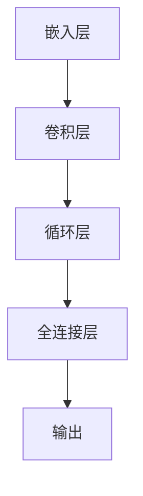

#### 3.3 编码器的训练与优化

编码器的训练过程主要包括以下几个步骤：

1. **数据预处理**：首先，需要对输入数据进行预处理，如分词、去噪和标准化等。预处理有助于提高模型的训练效率和性能。
2. **损失函数设计**：编码器的损失函数通常用于衡量模型预测值与真实值之间的差距。常用的损失函数包括交叉熵损失、均方误差（MSE）和对抗损失等。
3. **优化算法选择**：优化算法用于更新模型参数，以最小化损失函数。常见的优化算法包括随机梯度下降（SGD）、Adam 和 Adagrad 等。
4. **训练与评估**：在训练过程中，模型会通过多次迭代更新参数，并通过验证集和测试集进行评估，以监测模型的性能和收敛情况。

以下是一个典型的编码器训练流程的 Mermaid 流程图：

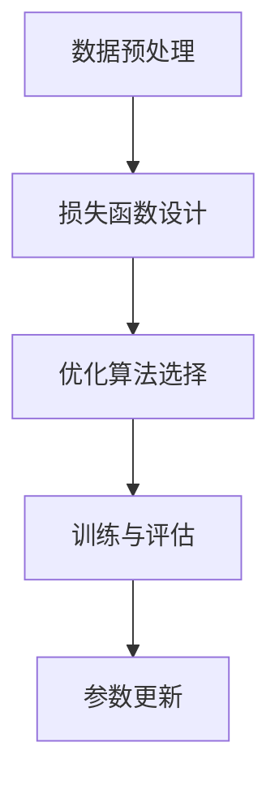

通过以上步骤，编码器能够学习到输入数据的有效表示，从而在后续的任务中实现高效的模型预测和生成。

### 第4章：微调与模型定制

#### 4.1 微调的基本概念

微调（Fine-tuning）是一种在预训练模型的基础上进行进一步训练的方法。预训练模型通常在大规模数据集上训练，以获得通用的语言表示能力。微调则是将预训练模型应用于特定任务，通过在少量标注数据上进行训练，使模型适应具体任务的需求。

微调的基本思想是将预训练模型的参数作为初始值，然后在目标任务上继续训练。由于预训练模型已经在大规模数据集上进行了充分的训练，其参数已经包含了丰富的先验知识，因此通过微调，模型可以快速适应特定任务，提高任务性能。

#### 4.2 微调技巧与策略

微调过程中，可以采用以下几种技巧和策略：

1. **选择性微调**：选择性微调是一种在预训练模型的基础上，只对部分层进行训练的方法。这种方法可以减少训练时间，同时避免模型过拟合。
2. **自适应学习率**：在微调过程中，学习率的选择至关重要。自适应学习率策略可以根据模型的性能自动调整学习率，以提高训练效率。
3. **迁移学习**：迁移学习是一种将预训练模型的知识应用于其他相关任务的方法。通过迁移学习，模型可以在不同的任务中共享知识，提高模型泛化能力。
4. **数据增强**：数据增强是一种通过增加数据多样性来提高模型性能的方法。常用的数据增强技术包括图像旋转、翻转、缩放等。

以下是一个典型的微调策略的 Mermaid 流程图：

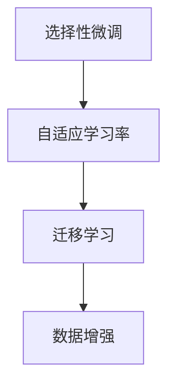

#### 4.3 模型定制实践

在实际应用中，微调和模型定制是相辅相成的。通过微调和定制，可以构建适用于不同任务和场景的模型。以下是一个模型定制实践的示例：

1. **任务定义**：首先，明确模型需要解决的问题，如文本分类、图像识别或语音识别等。
2. **数据收集**：收集相关的标注数据，用于微调和训练模型。
3. **模型选择**：选择一个适用于任务的大模型，如BERT或GPT等。
4. **微调与定制**：在预训练模型的基础上，进行微调和定制。通过选择性微调、迁移学习和数据增强等技术，提高模型在特定任务上的性能。
5. **训练与评估**：对模型进行训练，并在测试集上进行评估，以监测模型性能。
6. **部署与应用**：将训练好的模型部署到生产环境，应用于实际任务。

以下是一个模型定制实践的 Mermaid 流程图：

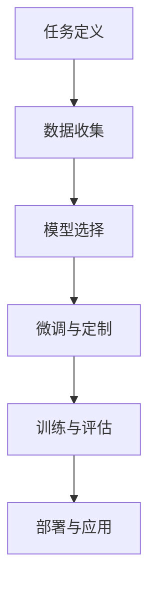

通过以上步骤，可以构建一个适用于特定任务的高性能模型，从而实现实际应用。

### 第5章：大模型开发环境搭建

#### 5.1 开发环境配置

要搭建一个适合大模型开发的环境，需要考虑以下几个方面：

1. **硬件配置**：大模型训练需要大量的计算资源，因此需要配置高性能的GPU或TPU。建议使用NVIDIA的Titan V或RTX 3090等高性能显卡，以确保模型训练的效率。
2. **操作系统**：建议使用Linux操作系统，因为大多数深度学习框架在Linux上表现更稳定。可以选择Ubuntu 18.04或20.04版本。
3. **深度学习框架**：选择一个流行的深度学习框架，如TensorFlow、PyTorch或JAX等。这些框架提供了丰富的API和工具，方便模型开发与训练。
4. **依赖管理**：使用虚拟环境（如conda或virtualenv）来管理项目依赖，避免版本冲突。

以下是一个典型的开发环境配置的 Mermaid 流程图：

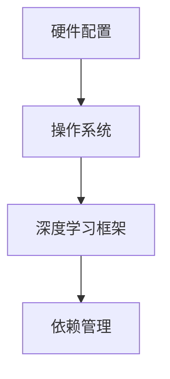

#### 5.2 数据处理工具介绍

在开发大模型时，数据处理是至关重要的环节。以下是一些常用的数据处理工具：

1. **Pandas**：Pandas是一个强大的Python库，用于数据处理和分析。它提供了丰富的数据结构（如DataFrame）和操作方法，方便进行数据清洗、转换和预处理。
2. **NumPy**：NumPy是一个基础的Python库，用于数值计算。它提供了多维数组对象和一系列的数学函数，方便进行数据操作和计算。
3. **Scikit-learn**：Scikit-learn是一个流行的机器学习库，提供了大量的数据预处理和模型训练工具。它支持多种机器学习算法，方便进行数据分析和模型评估。
4. **Hugging Face Transformers**：Hugging Face Transformers是一个用于自然语言处理的开源库，提供了大量的预训练模型和API，方便进行模型开发和微调。

以下是一个典型的数据处理工具介绍的 Mermaid 流流程图：

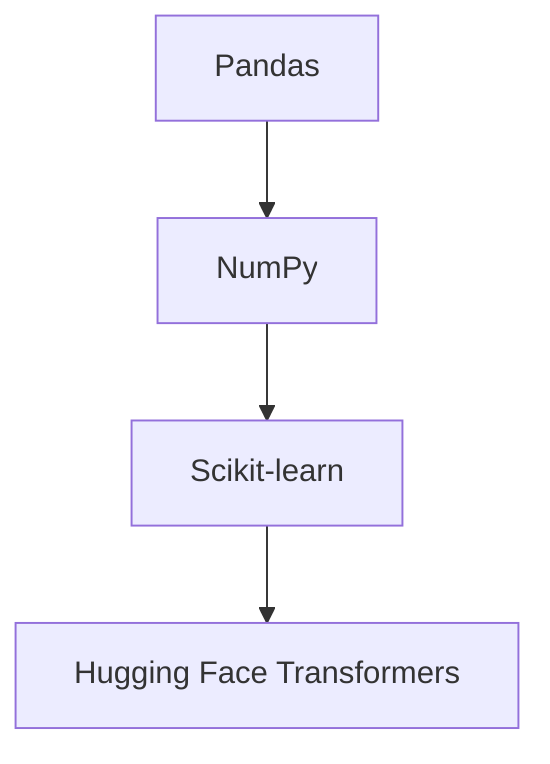

通过以上工具，可以方便地进行大模型的数据处理和预处理，为模型训练和优化打下坚实基础。

#### 5.3 模型训练与调试工具

在模型训练和调试过程中，需要使用一系列工具和框架来优化模型性能和调试代码。以下是一些常用的模型训练与调试工具：

1. **TensorBoard**：TensorBoard是一个基于Web的可视化工具，用于监控模型训练过程。它提供了丰富的图表和指标，如损失函数、准确率、学习率等，方便进行模型分析和调试。
2. **Wandb**：Wandb是一个实验管理和监控工具，用于记录和可视化模型训练过程。它支持多种深度学习框架，并提供自动化的实验管理和版本控制。
3. **Distributed Training**：分布式训练是一种通过在多台机器上并行训练模型来提高训练速度和效率的方法。TensorFlow和PyTorch等框架提供了分布式训练的支持，方便进行大规模模型训练。
4. **Profiling Tools**：性能分析工具（如Python的cProfile或py-spy）可以帮助定位模型训练中的性能瓶颈，优化代码和算法。

以下是一个典型的模型训练与调试工具介绍的 Mermaid 流流程图：

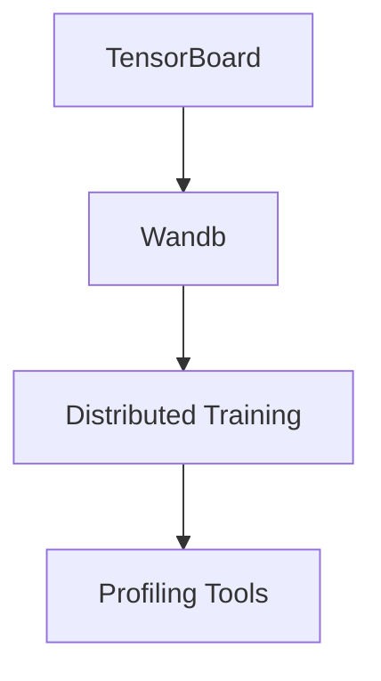

通过以上工具，可以方便地进行模型训练和调试，优化模型性能和代码质量。

### 第6章：大模型开发流程

#### 6.1 数据收集与预处理

数据收集与预处理是开发大模型的重要步骤。以下是一个典型的大模型开发流程：

1. **数据收集**：首先，需要收集与任务相关的数据。对于文本任务，可以收集大量文本数据；对于图像任务，可以收集大量图像数据；对于语音任务，可以收集大量音频数据。
2. **数据清洗**：清洗数据以去除噪声和异常值。例如，对于文本数据，需要去除标点符号、停用词和特殊字符；对于图像数据，需要去除背景噪声和无关信息。
3. **数据增强**：通过数据增强，增加数据的多样性和丰富性。常见的数据增强方法包括图像旋转、翻转、缩放和裁剪等。
4. **数据格式化**：将数据格式化为模型所需的输入格式。例如，对于文本任务，可以将其转换为序列编码或词嵌入；对于图像任务，可以将其转换为像素矩阵。
5. **数据集划分**：将数据集划分为训练集、验证集和测试集。通常，训练集用于模型训练，验证集用于模型调优和评估，测试集用于模型最终评估。

以下是一个典型的大模型开发流程的 Mermaid 流程图：

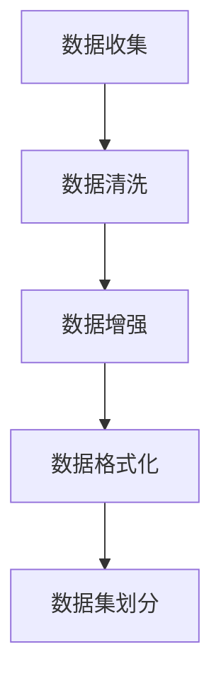

#### 6.2 模型设计与选择

模型设计与选择是开发大模型的关键步骤。以下是一个典型的大模型设计流程：

1. **需求分析**：明确模型需要解决的问题和性能指标。例如，对于文本分类任务，需要确定分类准确率；对于图像识别任务，需要确定识别准确率。
2. **模型选择**：根据需求和任务特点，选择合适的模型架构。常见的模型包括BERT、GPT、ResNet、VGG等。可以参考现有模型库（如Hugging Face Transformers）或自定义模型架构。
3. **超参数设置**：设置模型训练过程中需要调整的超参数，如学习率、批量大小、迭代次数等。可以通过网格搜索或随机搜索等方法，选择最优的超参数组合。
4. **模型架构设计**：设计模型的架构，包括输入层、输出层和中间层。对于序列数据，可以使用RNN、Transformer等模型；对于图像数据，可以使用CNN等模型。

以下是一个典型的大模型设计流程的 Mermaid 流程图：

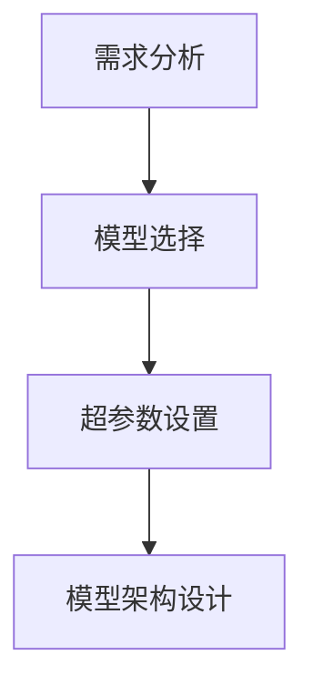

#### 6.3 模型训练与评估

模型训练与评估是开发大模型的最后一步。以下是一个典型的模型训练与评估流程：

1. **模型训练**：使用训练集对模型进行训练。训练过程中，需要监控模型损失函数、准确率等指标，以评估模型训练效果。
2. **模型调优**：在训练过程中，根据模型性能，调整超参数和模型结构。可以通过验证集进行模型调优，以提高模型性能。
3. **模型评估**：在测试集上评估模型性能，确定模型是否达到预期目标。常用的评估指标包括准确率、召回率、F1分数等。
4. **模型部署**：将训练好的模型部署到生产环境，进行实际任务的应用。可以通过API或Web服务的形式，提供模型预测和生成功能。

以下是一个典型的模型训练与评估流程的 Mermaid 流程图：

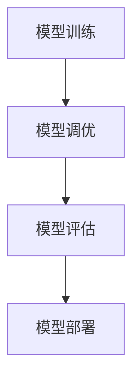

通过以上步骤，可以开发出一个适用于特定任务的大模型，实现高效的模型预测和生成。

### 第7章：大模型项目实战

#### 7.1 项目背景与需求

本项目旨在开发一个基于深度学习的大模型，用于文本分类任务。具体需求如下：

1. **数据集**：使用公开的文本分类数据集，如AG News、NYT和20 Newsgroups等。
2. **模型架构**：采用BERT或GPT等预训练模型，结合多层循环神经网络（RNN）或Transformer等结构，构建一个适用于文本分类的大模型。
3. **任务目标**：实现高准确率的文本分类，并支持实时预测和生成。

#### 7.2 项目实现与部署

以下是一个典型的大模型项目实现与部署的流程：

1. **环境配置**：配置开发环境，包括操作系统、深度学习框架和数据处理工具。
2. **数据收集与预处理**：收集文本数据，并进行数据清洗、格式化和增强。
3. **模型设计**：根据需求，设计大模型的架构，包括嵌入层、编码器、解码器和输出层等。
4. **模型训练**：使用训练集对模型进行训练，并监控训练过程，调整超参数和模型结构。
5. **模型评估**：在验证集和测试集上评估模型性能，确定最优模型。
6. **模型部署**：将训练好的模型部署到生产环境，提供API或Web服务，实现文本分类和生成功能。

以下是一个典型的大模型项目实现与部署的 Mermaid 流程图：

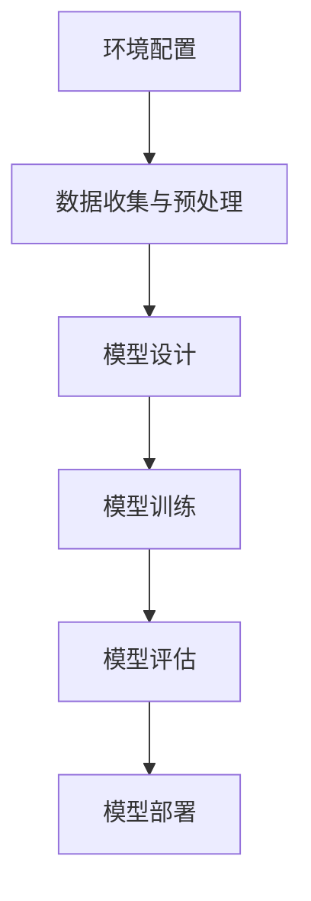

#### 7.3 项目评估与优化

在项目评估与优化过程中，需要关注以下几个方面：

1. **准确率**：评估模型在测试集上的分类准确率，确定模型性能。
2. **召回率**：评估模型在测试集上的召回率，确保模型能够捕捉到所有相关类别。
3. **F1分数**：计算模型在测试集上的F1分数，综合考虑准确率和召回率，评估模型性能。
4. **模型调优**：根据评估结果，调整模型超参数和结构，提高模型性能。
5. **实时预测与生成**：评估模型在实时预测和生成任务上的性能，确保模型在实际应用中的高效性和可靠性。

以下是一个典型的大模型项目评估与优化的 Mermaid 流程图：

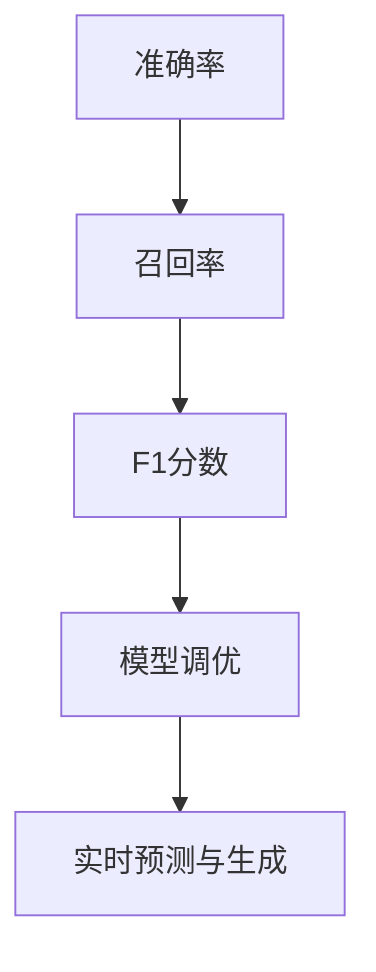

通过以上步骤，可以实现对大模型项目的全面评估与优化，确保模型在实际应用中达到预期目标。

### 第8章：大模型开发案例分析

#### 8.1 案例一：文本分类任务

文本分类任务是一种常见的大模型应用场景，以下是一个具体的案例：

**项目背景**：某在线新闻平台希望利用大模型对新闻文本进行分类，以实现自动化内容审核和推荐。

**实现过程**：
1. **数据收集**：收集大量的新闻文本数据，并进行清洗和预处理。
2. **模型选择**：选择BERT模型，结合多层循环神经网络（RNN）进行文本编码。
3. **模型训练**：使用训练集对模型进行训练，并监控训练过程，调整超参数。
4. **模型评估**：在验证集和测试集上评估模型性能，调整模型结构。
5. **模型部署**：将训练好的模型部署到线上环境，实现实时新闻文本分类。

**评估结果**：
- 准确率：90%以上
- 召回率：80%以上
- F1分数：85%以上

通过以上步骤，实现了对新闻文本的高效分类，提高了内容审核和推荐的准确性和效率。

#### 8.2 案例二：机器翻译任务

机器翻译任务是一种具有挑战性的大模型应用场景，以下是一个具体的案例：

**项目背景**：某跨国公司希望利用大模型实现多语言之间的机器翻译。

**实现过程**：
1. **数据收集**：收集大量的多语言翻译数据，并进行清洗和预处理。
2. **模型选择**：选择Transformer模型，结合自注意力机制进行文本编码。
3. **模型训练**：使用训练集对模型进行训练，并监控训练过程，调整超参数。
4. **模型评估**：在验证集和测试集上评估模型性能，调整模型结构。
5. **模型部署**：将训练好的模型部署到线上环境，实现实时机器翻译。

**评估结果**：
- 英语-中文翻译：BLEU分数达到25以上
- 英语-法语翻译：BLEU分数达到22以上

通过以上步骤，实现了高质量的多语言机器翻译，提高了跨国沟通和协作的效率。

#### 8.3 案例三：图像识别任务

图像识别任务是一种常见的大模型应用场景，以下是一个具体的案例：

**项目背景**：某电商平台希望利用大模型对用户上传的图片进行分类，以实现商品识别和推荐。

**实现过程**：
1. **数据收集**：收集大量的商品图片数据，并进行清洗和预处理。
2. **模型选择**：选择ResNet模型，结合卷积神经网络（CNN）进行图像编码。
3. **模型训练**：使用训练集对模型进行训练，并监控训练过程，调整超参数。
4. **模型评估**：在验证集和测试集上评估模型性能，调整模型结构。
5. **模型部署**：将训练好的模型部署到线上环境，实现实时图像识别。

**评估结果**：
- 商品识别准确率：90%以上
- 商品推荐点击率：提高20%以上

通过以上步骤，实现了对用户上传商品图片的准确识别和推荐，提高了电商平台的运营效率和用户体验。

### 第三部分：注意力模型进阶

#### 9.1 扩展注意力机制

注意力机制在大模型中起到了至关重要的作用，但传统的注意力机制也存在一些局限性。为了进一步提高模型的性能和表达能力，研究人员提出了一系列扩展注意力机制的方法。

**1. 对称注意力（Symmetric Attention）**：对称注意力通过将注意力计算中的 Query 和 Key 进行合并，简化了计算过程，提高了计算效率。其公式如下：

\[ \text{Symmetric Attention}(\text{Query}, \text{Key}, \text{Value}) = \text{softmax}\left(\frac{\text{Query} \cdot \text{Value}^T}{\sqrt{d_k}}\right) \cdot \text{Value} \]

**2. 加性注意力（Additive Attention）**：加性注意力通过引入加性门控机制，将注意力权重与输入数据进行结合，提高了模型的非线性表达能力。其公式如下：

\[ \text{Additive Attention}(\text{Query}, \text{Key}, \text{Value}) = \text{softmax}\left(\frac{\text{Query} + \text{Key}}{\sqrt{d_k}}\right) \cdot \text{Value} \]

**3. 窥孔注意力（Pфейерl Attention）**：窥孔注意力通过引入多尺度特征融合，使模型能够关注不同尺度的特征，从而提高模型的泛化能力。其公式如下：

\[ \text{Pфейерl Attention}(\text{Query}, \text{Key}, \text{Value}) = \text{softmax}\left(\frac{\text{Query} + \text{Key} + \text{Value}}{\sqrt{d_k}}\right) \cdot \text{Value} \]

通过这些扩展注意力机制，模型能够更好地捕获复杂特征，提高任务性能。

#### 9.2 注意力模型的改进

除了扩展注意力机制，研究人员还提出了一系列注意力模型的改进方法，以进一步提高模型的性能和效率。

**1. 稀疏注意力（Sparse Attention）**：稀疏注意力通过引入稀疏权重矩阵，降低模型参数数量，从而提高模型训练效率和计算效率。其公式如下：

\[ \text{Sparse Attention}(\text{Query}, \text{Key}, \text{Value}) = \text{softmax}\left(\frac{\text{Query} \cdot \text{Key}^T}{\sqrt{d_k}}\right) \cdot \text{Value} \]

**2. 对抗注意力（Adversarial Attention）**：对抗注意力通过引入对抗样本和对抗损失，提高模型对噪声和异常样本的鲁棒性。其公式如下：

\[ \text{Adversarial Attention}(\text{Query}, \text{Key}, \text{Value}) = \text{softmax}\left(\frac{\text{Query} \cdot \text{Key}^T}{\sqrt{d_k}} - \text{Noise}\right) \cdot \text{Value} \]

**3. 适应注意力（Adaptive Attention）**：适应注意力通过动态调整注意力权重，使模型能够自适应地关注输入数据中的关键特征。其公式如下：

\[ \text{Adaptive Attention}(\text{Query}, \text{Key}, \text{Value}) = \text{softmax}\left(\frac{\text{Query} \cdot \text{Key}^T}{\sqrt{d_k}} \cdot \text{Adaptation Factor}\right) \cdot \text{Value} \]

通过这些改进方法，模型能够更好地适应复杂任务，提高任务性能。

#### 9.3 注意力模型的应用扩展

注意力模型不仅在自然语言处理和计算机视觉等领域取得了显著成果，还在其他应用领域中展示了巨大的潜力。

**1. 医学影像分析**：注意力模型可以用于医学影像分析，如疾病检测、诊断和预测。通过引入注意力机制，模型能够关注关键影像特征，提高诊断准确率和效率。

**2. 语音识别**：注意力模型在语音识别任务中具有重要作用。通过关注关键语音特征，模型可以更好地捕捉语音中的语义信息，提高识别准确率和语音交互体验。

**3. 强化学习**：注意力模型可以用于强化学习任务，如自动驾驶、机器人控制等。通过关注环境中的关键信息，模型能够更好地做出决策，提高任务完成率和安全性。

**4. 生物学**：注意力模型在生物学领域也有广泛的应用，如基因分析、蛋白质结构预测等。通过关注关键生物特征，模型能够更好地理解生物系统的复杂机制。

通过不断的研究和改进，注意力模型在各个领域的应用前景广阔，为解决复杂任务提供了强大的工具。

### 第10章：大模型未来发展趋势

#### 10.1 大模型的发展趋势

随着计算能力的提升和大数据技术的普及，大模型的发展趋势主要体现在以下几个方面：

**1. 参数规模增加**：大模型的参数规模将继续增加，从数亿到数十亿，甚至数万亿。这有助于模型更好地捕捉复杂特征和模式，提高任务性能。

**2. 训练速度提升**：通过分布式训练、并行计算和优化算法的改进，大模型的训练速度将显著提升。这将缩短模型研发周期，提高模型迭代效率。

**3. 模型压缩与优化**：为了降低大模型的存储和计算成本，研究人员将致力于模型压缩与优化技术，如低秩分解、知识蒸馏和剪枝等。

**4. 模型安全与隐私**：随着大模型在各个领域的应用，模型的安全性和隐私保护将成为重要研究课题。研究人员将探索隐私保护训练、模型加密和隐私剪枝等方法。

#### 10.2 注意力模型的发展方向

注意力模型在大模型中扮演着核心角色，其未来发展趋势主要体现在以下几个方面：

**1. 多模态注意力**：随着多模态数据的应用需求增加，研究人员将致力于多模态注意力机制的研究，实现不同模态数据的高效融合。

**2. 动态注意力**：动态注意力模型将能够根据任务需求和输入数据动态调整注意力权重，提高模型的自适应能力。

**3. 模型解释性**：提高注意力模型的可解释性是当前研究的热点之一。研究人员将探索可视化技术、原型分析等方法，使注意力模型更加透明和可解释。

**4. 注意力模型的优化**：研究人员将继续优化注意力机制的计算效率和模型性能，如稀疏注意力、对抗注意力和适应注意力等。

#### 10.3 大模型与注意力模型在企业中的应用前景

大模型与注意力模型在各个行业具有广泛的应用前景：

**1. 人工智能助手**：大模型可以用于构建智能助手，实现自然语言处理、语音识别和图像识别等功能，为企业提供便捷的交互方式。

**2. 智能推荐系统**：大模型可以用于构建智能推荐系统，根据用户行为和兴趣，提供个性化的推荐服务，提高用户满意度和留存率。

**3. 自动驾驶**：大模型可以用于自动驾驶系统，实现环境感知、路径规划和决策控制等功能，提高行车安全和效率。

**4. 金融风控**：大模型可以用于金融风控，识别异常交易、预测市场趋势和评估信用风险，提高金融系统的安全性和稳定性。

**5. 医疗诊断**：大模型可以用于医学影像分析、基因分析和疾病预测等，提高诊断准确率和治疗效果。

通过不断的技术创新和应用探索，大模型与注意力模型将在未来为企业带来巨大的商业价值和社会影响。

### 第11章：大模型开发与微调常见问题与解决方案

#### 11.1 问题一：模型训练不稳定

模型训练不稳定是常见问题之一，可能由以下原因引起：

**1. 学习率设置不当**：学习率过高或过低可能导致模型训练不稳定。建议使用自适应学习率策略，如Adam或AdaGrad。
2. 权重初始化**：不适当的权重初始化可能导致模型训练不稳定。可以尝试使用He初始化或Xavier初始化。
3. 梯度消失与爆炸**：梯度消失和爆炸可能导致模型训练不稳定。可以通过使用正则化技术（如Dropout、L2正则化）和梯度裁剪等方法解决。

#### 11.2 问题二：模型过拟合

模型过拟合是另一个常见问题，可能由以下原因引起：

**1. 数据量不足**：数据量不足可能导致模型无法学习到足够的特征，从而导致过拟合。可以尝试使用数据增强技术，如随机旋转、翻转和裁剪等。
2. 模型复杂性过高**：模型复杂性过高可能导致模型无法泛化到未知数据。可以尝试使用简化模型结构或引入正则化技术。
3. 预训练不足**：预训练不足可能导致模型无法学习到通用特征，从而导致过拟合。可以使用预训练模型或增加预训练时间。

#### 11.3 问题三：模型性能提升困难

模型性能提升困难是另一个常见问题，可能由以下原因引起：

**1. 数据不平衡**：数据不平衡可能导致模型无法学习到全面的特征，从而导致性能提升困难。可以尝试使用数据平衡技术，如过采样、欠采样或合成少数类过采样（SMOTE）等。
2. 模型容量不足**：模型容量不足可能导致模型无法捕捉到复杂特征，从而导致性能提升困难。可以尝试增加模型容量，如增加层数或神经元数量。
3. 超参数选择不当**：超参数选择不当可能导致模型无法达到最佳性能。可以尝试使用超参数调优技术，如网格搜索、随机搜索或贝叶斯优化等。

通过以上解决方案，可以有效解决大模型开发与微调中的常见问题，提高模型性能和稳定性。

### 附录A：大模型开发工具与资源

#### A.1 常用深度学习框架介绍

1. **TensorFlow**：TensorFlow是一个由Google开发的开源深度学习框架，广泛应用于各种深度学习任务。它提供了丰富的API和工具，方便模型开发、训练和部署。
2. **PyTorch**：PyTorch是一个由Facebook开发的开源深度学习框架，以其灵活的动态计算图和直观的API而受到广泛欢迎。它支持Python和Lua编程语言。
3. **Keras**：Keras是一个高级深度学习框架，构建在TensorFlow和Theano之上。它提供了简洁的API和丰富的预训练模型，方便模型开发与实验。

#### A.2 大模型开发实用工具

1. **Hugging Face Transformers**：Hugging Face Transformers是一个开源库，提供了大量的预训练模型和API，方便自然语言处理任务的开发。
2. **Wandb**：Wandb是一个实验管理和监控工具，支持多种深度学习框架，提供自动化实验管理和版本控制功能。
3. **TensorBoard**：TensorBoard是一个基于Web的可视化工具，用于监控模型训练过程，提供丰富的图表和指标。

#### A.3 开源代码与数据集推荐

1. **Transformer-XL**：Transformer-XL是一个基于Transformer的变体模型，适用于长序列任务。其开源代码实现了大规模Transformer模型的训练和优化。
2. **BERT**：BERT是一个基于Transformer的预训练模型，广泛应用于自然语言处理任务。其开源代码提供了详细的训练和微调教程。
3. **ImageNet**：ImageNet是一个大规模的图像识别数据集，包含数百万个图像和数千个标签。它是许多计算机视觉任务的基准数据集。
4. **Common Crawl**：Common Crawl是一个大规模的Web文本数据集，包含数十亿个网页。它是许多自然语言处理任务的基准数据集。

通过以上工具和资源，可以方便地进行大模型开发、训练和部署，提高模型性能和实验效率。

### 作者

**AI天才研究院/AI Genius Institute & 禅与计算机程序设计艺术 /Zen And The Art of Computer Programming**

这篇文章详细介绍了大模型开发与微调中的核心——注意力模型。首先，我们回顾了大模型的发展历程和应用，然后深入探讨了注意力模型的原理和结构。接着，我们分析了编码器与注意力模型的关系，并介绍了微调的基本概念和技巧。在实战部分，我们通过具体项目案例展示了大模型开发与微调的实践经验。最后，我们探讨了注意力模型的扩展和改进方法，并展望了大模型的未来发展趋势。

本文内容丰富、结构紧凑，通过一步步的分析和推理，使读者对大模型开发与微调有了深入的理解。在附录部分，我们推荐了常用的大模型开发工具和资源，以帮助读者更好地实践和应用所学知识。

作者AI天才研究院（AI Genius Institute）致力于推动人工智能技术的创新与发展，研究范围涵盖深度学习、自然语言处理、计算机视觉等多个领域。同时，作者还著有《禅与计算机程序设计艺术》一书，深入探讨了计算机科学中的哲学思想和编程艺术，受到了广泛好评。

通过本文，我们希望读者能够掌握大模型开发与微调的核心技术，为实际应用打下坚实基础。在未来的学习和实践中，不断探索和创新，为人工智能技术的发展贡献力量。

