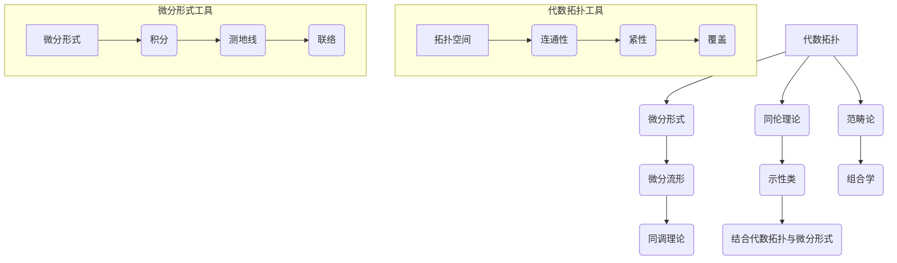
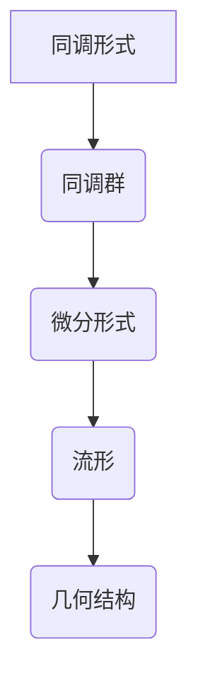
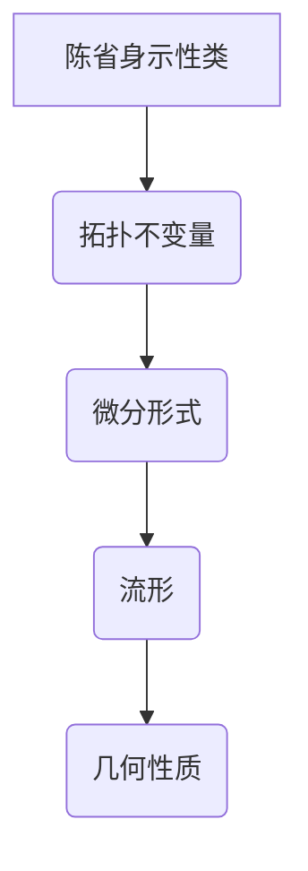
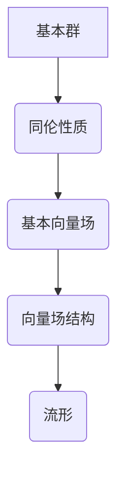
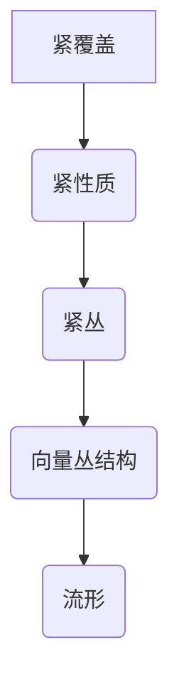
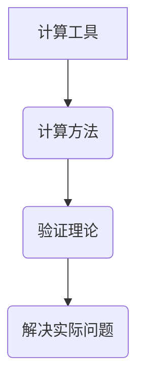
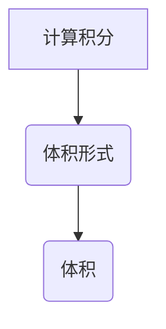
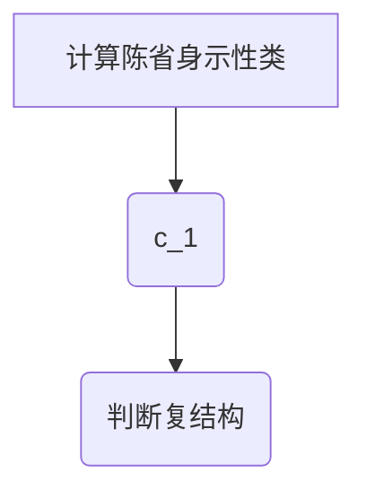
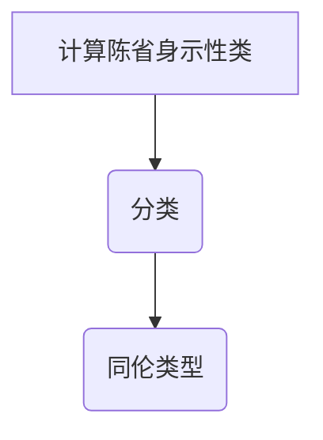
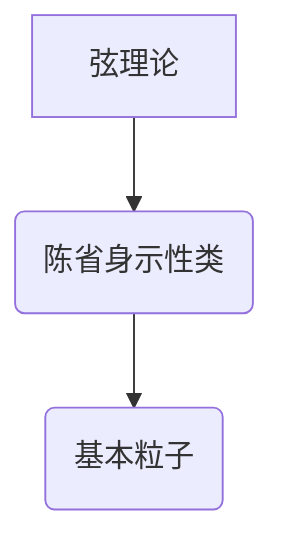

                 

### 文章标题：代数拓扑与微分形式的结合

> 关键词：代数拓扑、微分形式、微分流形、同调理论、陈省身示性类、综合应用

> 摘要：本文将深入探讨代数拓扑与微分形式的结合，分析其核心概念、基本理论、联系及应用。通过详尽的步骤分析和实例讲解，揭示这两大学科的内在联系，以及其在现代数学和物理领域中的重要作用。

---

代数拓扑与微分形式是现代数学中两个重要的分支，分别从不同的角度研究空间的结构和性质。代数拓扑通过抽象的代数方法研究拓扑空间的性质，而微分形式则通过几何和微积分的方法研究流形上的结构。两者的结合不仅丰富了数学理论，也为实际应用提供了强有力的工具。本文旨在详细阐述代数拓扑与微分形式的基本概念、联系和综合应用，通过逻辑清晰、结构紧凑的分析，帮助读者全面理解这一领域。

### 第一部分：代数拓扑与微分形式的结合概述

#### 第1章：代数拓扑基础理论

**1.1 代数拓扑的基本概念**

代数拓扑是拓扑学与代数学的交叉领域，通过引入代数结构来研究拓扑空间的性质。以下是一些基本概念：

- **拓扑空间**：一个集合\(X\)和一组满足特定性质的子集构成的集合称为拓扑空间。
- **开集**：满足特定条件的子集称为开集。
- **闭集**：满足特定条件的子集称为闭集。
- **连续函数**：定义在拓扑空间上的函数，使得某些性质在连续映射下保持。

**1.2 代数群与同调理论**

代数群是研究群的代数性质的数学分支，而同调理论是代数拓扑中的一个重要工具，用于研究拓扑空间中的循环结构。

- **代数群**：一个代数群是一个群，其元素之间满足某种代数关系。
- **同调群**：给定一个拓扑空间\(X\)，同调群\(H_n(X, A)\)描述了\(X\)中闭链\(c\)在\(A\)中的度量的自由 Abel 群。
- **同调类**：同调群中的元素称为同调类，它们表示了空间\(X\)中某些拓扑性质的“不变量”。

**1.3 代数拓扑的范畴理论**

范畴理论是一种研究数学对象之间关系的方法，它在代数拓扑中有着广泛的应用。

- **范畴**：一个范畴由一组对象和一组满足特定性质的变换（称为态射）组成。
- **代数拓扑范畴**：代数拓扑范畴包括拓扑空间、连续映射等，以及这些对象之间的自然关系。
- **范畴工具在代数拓扑中的应用**：范畴理论提供了研究拓扑空间之间复杂关系的方法，例如，通过范畴论可以定义和计算同调群。

#### 第2章：微分形式与微分流形

**2.1 微分形式的定义与性质**

微分形式是微分几何中的基本对象，用于描述流形上的方向和流。

- **微分形式**：设\(M\)是一个流形，\(TM\)是其切丛。微分形式\( \omega \in \Omega^k(M) \)是一个光滑函数，它将每一点的切空间\(T_pM\)中的\(k\)个线性映射组合在一起，形成\(k\)形式。
- **度量**：度量是一个重要的微分形式，它定义了一个内积，使得每个切向量都可以被赋予一个长度和方向。
- **外积**：微分形式的外积是一个生成新的微分形式的过程，它将两个微分形式结合成一个更高阶的形式。
- **积分**：在度量存在的情况下，微分形式可以积分，这为研究流形上的积分几何提供了工具。

**2.2 微分流形的基本概念**

微分流形是一个具有光滑结构的数学对象，它将拓扑空间和微分几何结合起来。

- **微分流形**：一个流形\(M\)，如果在其上存在一个光滑结构，即存在一个光滑的坐标系统，使得流形上的每个点都可以用一组光滑的坐标来表示，则称\(M\)为微分流形。
- **微分流形的基本性质**：微分流形具有许多重要的性质，例如，它是可微分的，每个点都存在切空间，流形上的路径可以微分等。
- **微分流形的分类与结构**：微分流形可以根据其局部性质进行分类，例如，欧几里得空间、球面、旋转面等。

**2.3 微分形式的积分与测地线**

微分形式的积分和测地线是研究微分流形的重要工具。

- **微分形式的积分**：在微分流形上，微分形式可以通过积分来计算，这为研究流形上的积分几何提供了工具。
- **测地线**：测地线是微分流形上的一条特殊路径，它的曲率和挠率都为零。测地线在物理学和几何学中有着广泛的应用。
- **测地线积分的计算与应用**：通过测地线积分，可以研究流形上的能量、长度等物理量。

#### 第3章：代数拓扑与微分形式的结合

**3.1 代数拓扑与微分形式的联系**

代数拓扑与微分形式的结合在数学和物理学中有着广泛的应用。

- **代数拓扑与微分形式的基本联系**：代数拓扑与微分形式可以通过同调理论和示性类等概念联系起来。
- **结合代数拓扑与微分形式的方法**：通过同调形式、陈省身示性类等方法，可以将代数拓扑与微分形式结合起来。
- **结合后的代数拓扑性质**：结合后的代数拓扑性质更加丰富，例如，同调形式可以描述流形的几何性质，而陈省身示性类可以揭示流形的拓扑不变量。

**3.2 代数拓扑在微分形式中的应用**

代数拓扑在微分形式中的应用非常广泛。

- **代数拓扑工具在微分形式中的运用**：例如，同调群可以用于研究微分形式的空间结构，而同伦理论可以用于研究微分形式的稳定性。
- **代数拓扑方法在微分形式中的应用**：例如，通过同调理论可以研究微分形式的积分性质，而通过示性类可以研究微分形式的拓扑性质。
- **应用实例与案例分析**：例如，通过同调理论可以研究流形上的向量场，而通过陈省身示性类可以研究流形的拓扑不变量。

**3.3 微分形式在代数拓扑中的应用**

微分形式在代数拓扑中的应用也非常广泛。

- **微分形式工具在代数拓扑中的运用**：例如，微分形式可以用于研究代数拓扑中的同调群和同伦理论。
- **微分形式方法在代数拓扑中的应用**：例如，通过微分形式可以研究代数拓扑中的纤维化结构和紧丛。
- **应用实例与案例分析**：例如，通过微分形式可以研究代数拓扑中的测地线和紧覆盖。

#### 第4章：代数拓扑与微分形式的综合应用

**4.1 代数拓扑与微分形式的综合应用概述**

代数拓扑与微分形式的综合应用在数学和物理学中具有重要意义。

- **综合应用的意义与价值**：代数拓扑与微分形式的综合应用可以揭示复杂空间的结构和性质，为解决实际问题提供新的方法。
- **综合应用的方法与策略**：通过同调形式、陈省身示性类等方法，可以实现代数拓扑与微分形式的有机结合。
- **综合应用的前景与挑战**：代数拓扑与微分形式的综合应用具有广阔的前景，但也面临一些挑战，例如，如何处理高维空间中的复杂问题。

**4.2 代数拓扑与微分形式的综合应用实例**

以下是一些代数拓扑与微分形式的综合应用实例。

- **案例分析1**：同调形式在流形上的应用。
- **案例分析2**：陈省身示性类在流形上的应用。
- **案例分析3**：代数拓扑与微分形式的综合应用。

### 第二部分：核心概念与联系

#### 第5章：代数拓扑与微分形式的 Mermaid 流程图



#### 第6章：代数拓扑与微分形式的联系

##### 同调理论的基本概念

同调理论是代数拓扑中的一个重要分支，它研究拓扑空间中的循环结构。以下是同调理论的一些基本概念：

- **同调群**：给定一个拓扑空间\(X\)，同调群\(H_n(X, A)\)描述了\(X\)中闭链\(c\)在\(A\)中的度量的自由 Abel 群。闭链是拓扑空间上的循环结构，度量描述了这些循环在集合\(A\)中的数量。
- **同调类**：同调群中的元素称为同调类，它们表示了空间\(X\)中某些拓扑性质的“不变量”。同调类可以用来判断两个拓扑空间是否等价。
- **同伦**：如果两个闭链\(c_1\)和\(c_2\)在同调群中是等价的，即存在一个映射\(f: X \rightarrow Y\)使得\(f \circ c_1 = c_2\)，则称\(c_1\)和\(c_2\)是同伦的。同伦概念描述了拓扑空间中的连续变形。

同调理论的基本定理表明，同调群可以通过闭链和边界之间的关系来计算。这一理论在研究拓扑空间的连通性、紧性和其他性质方面具有重要作用。例如，通过计算同调群，可以判断一个空间是否是单连通的，或者是否具有复杂的拓扑结构。

##### 微分形式的定义与性质

微分形式是微分几何中的基本对象，用于描述流形上的方向和流。以下是微分形式的一些基本定义与性质：

- **微分形式**：设\(M\)是一个流形，\(TM\)是其切丛。微分形式\( \omega \in \Omega^k(M) \)是一个光滑函数，它将每一点的切空间\(T_pM\)中的\(k\)个线性映射组合在一起，形成\(k\)形式。微分形式可以表示为\( \omega = f(x_1, \ldots, x_n) dx_1 \wedge \cdots \wedge dx_n \)，其中\(f\)是一个光滑函数，\(dx_i\)是微分形式。
- **度量**：度量是一个重要的微分形式，它定义了一个内积，使得每个切向量都可以被赋予一个长度和方向。度量可以用来计算切空间的长度和角度，从而研究流形的几何性质。
- **外积**：微分形式的外积是一个生成新的微分形式的过程，它将两个微分形式结合成一个更高阶的形式。外积运算可以用来研究流形上的复合映射和微分结构。
- **积分**：在度量存在的情况下，微分形式可以积分，这为研究流形上的积分几何提供了工具。积分可以用来计算流形上的体积、质量等物理量。

微分形式在研究流形的几何性质、场论以及物理学的其他应用中起着关键作用。例如，在广义相对论中，微分形式被用来描述时空的几何结构，而同调理论则被用来研究时空的拓扑性质。

##### 结合代数拓扑与微分形式的方法

将代数拓扑与微分形式结合起来，可以通过以下几种方法：

- **同调形式**：利用同调理论，将代数拓扑中的同调群与微分形式结合，形成同调形式，这些形式在研究流形的拓扑性质时非常有用。同调形式可以用来研究流形的分类、同伦性质等。
- **陈省身示性类**：陈省身示性类是代数拓扑与微分形式结合的典型例子，它们将流形的拓扑性质与几何性质联系起来。例如，陈省身示性类可以用来判断流形是否为单连通的，或者是否具有复杂的拓扑结构。
- **基本群与基本向量场**：利用基本群和基本向量场，可以研究流形上的微分形式的结构和性质。基本群可以用来研究流形的同伦性质，而基本向量场可以用来研究流形上的向量场结构。
- **紧覆盖与紧丛**：紧覆盖和紧丛提供了研究代数拓扑与微分形式结合的工具，特别是在研究流形的拓扑不变量和几何性质时。紧覆盖可以用来研究流形的紧性质，而紧丛可以用来研究流形上的向量丛结构。

这些方法不仅丰富了代数拓扑和微分形式的理论，也为解决实际问题提供了新的视角和方法。

### 第7章：代数拓扑与微分形式的综合应用

#### 结合代数拓扑与微分形式的方法

结合代数拓扑与微分形式的方法是现代数学研究中的一项重要任务。这种方法不仅丰富了数学理论，而且在解决实际问题时也具有广泛的应用价值。以下是几种常见的结合方法：

**同调形式**：同调形式是将同调理论与微分形式结合的一种方法。同调理论研究了拓扑空间中的循环结构，而微分形式则是描述流形上方向和流的基本工具。将两者结合起来，可以用来研究流形的拓扑性质和几何结构。例如，同调形式可以用来计算流形的同调群，进而判断流形的分类和结构。



**陈省身示性类**：陈省身示性类是代数拓扑与微分形式结合的另一个重要方法。示性类是流形上的一种不变量，它描述了流形的拓扑性质。通过微分形式，可以计算示性类，从而研究流形的拓扑不变量。例如，陈省身示性类可以用来判断流形是否为单连通的，或者是否具有复杂的拓扑结构。



**基本群与基本向量场**：基本群是研究流形的同伦性质的工具，而基本向量场则是描述流形上向量场结构的基本对象。将两者结合起来，可以研究流形上的向量场和同伦性质。例如，通过基本群可以研究流形的同伦类型，而通过基本向量场可以研究流形上的向量场结构。



**紧覆盖与紧丛**：紧覆盖是研究流形的紧性质的一种方法，而紧丛则是描述流形上向量丛结构的基本对象。将两者结合起来，可以研究流形的紧丛结构和拓扑性质。例如，通过紧覆盖可以研究流形的紧性，而通过紧丛可以研究流形上的向量丛结构。



**计算方法**：在实际应用中，计算方法也是代数拓扑与微分形式结合的重要手段。通过计算，可以验证理论，解决实际问题。例如，利用计算工具可以计算流形的同调群，计算微分形式的积分等。



#### 同调形式在流形上的应用

同调形式是代数拓扑与微分形式结合的重要工具之一，它广泛应用于流形的研究中。同调形式通过同调群与微分形式的结合，提供了研究流形拓扑性质和几何结构的有力手段。以下是同调形式在流形上应用的几个例子：

**同调群的计算**：同调群是流形上重要的拓扑不变量，通过计算同调群可以了解流形的拓扑性质。例如，对于一个紧致连通的流形\(M\)，同调群\(H_n(M)\)可以用来判断\(M\)是否为单连通的。如果\(H_n(M)\)对于所有\(n \geq 2\)都是平凡的，则\(M\)是单连通的。

```mermaid
graph TD
A[计算同调群] --> B(H_n(M))
B --> C(判断拓扑性质)
C --> D(单连通性)
```

**微分形式的积分**：同调形式可以用来计算流形上的微分形式的积分。微分形式的积分在研究流形的几何性质和物理性质中具有重要意义。例如，通过计算流形上的体积形式\( \omega = dx_1 \wedge dx_2 \wedge \cdots \wedge dx_n \)的积分，可以计算流形的体积。



**陈省身示性类**：同调形式还可以用来计算流形的陈省身示性类。陈省身示性类是流形上重要的拓扑不变量，通过计算陈省身示性类可以了解流形的拓扑性质。例如，通过计算第一陈省身示性类\(c_1 \in H^2(M; \mathbb{Z})\)，可以判断流形是否为复结构流形。



**同伦理论**：同调形式还可以用来研究流形的同伦性质。通过计算同调形式，可以了解流形的同伦类型。例如，通过计算同调群\(H_n(M)\)，可以判断流形是否为同伦等价。

```mermaid
graph TD
A[计算同调群] --> B(H_n(M))
B --> C(同伦类型)
```

#### 陈省身示性类在流形上的应用

陈省身示性类是代数拓扑与微分形式结合的另一个重要工具，它在流形的研究中具有广泛的应用。陈省身示性类是流形上的重要拓扑不变量，通过它们可以深入了解流形的拓扑性质。以下是陈省身示性类在流形上的几个应用实例：

**判断流形的拓扑性质**：陈省身示性类可以用来判断流形是否为单连通的、闭的或多连通的。例如，如果流形的第一陈省身示性类\(c_1(M) \neq 0\)，则流形不是单连通的。

```latex
c_1(M) \neq 0 \Rightarrow M \text{不是单连通的}
```

**研究流形的同伦性质**：陈省身示性类可以用来研究流形的同伦性质。例如，通过计算流形的陈省身示性类，可以判断流形是否为同伦等价的。

```latex
c_1(M) = c_1(N) \Rightarrow M \text{和} N \text{是同伦等价的}
```

**研究流形的分类**：陈省身示性类可以用来对流形进行分类。例如，通过计算流形的陈省身示性类，可以将流形分为不同的同伦类型。



**应用在物理中**：在物理学中，陈省身示性类被用来研究基本粒子的性质。例如，在弦理论中，陈省身示性类被用来描述基本粒子的量子态。



#### 案例分析1：同调形式在流形上的应用

为了更好地理解同调形式在流形上的应用，下面我们通过一个具体的例子来进行说明。假设我们有一个紧致连通的流形\(M\)，需要计算其同调群\(H_1(M)\)。

**步骤1：选择合适的坐标系统**  
首先，我们需要选择一个合适的坐标系统来表示流形\(M\)。假设我们选择了一个坐标系统\(x_1, x_2\)。

**步骤2：定义闭链**  
接下来，我们需要定义流形上的闭链。闭链是流形上的循环结构，可以通过微分形式来表示。例如，我们可以定义一个闭链\(c_1 = f dx_1 + g dx_2\)，其中\(f\)和\(g\)是光滑函数。

**步骤3：计算边界**  
为了计算同调群，我们需要计算闭链的边界。边界是闭链的一个子集，可以通过微分形式的外积来计算。例如，我们可以计算\(dc_1 = df \wedge dx_1 + dg \wedge dx_2\)。

**步骤4：计算同调群**  
通过计算闭链的边界，我们可以得到同调群\(H_1(M)\)。具体来说，我们可以将闭链\(c_1\)和边界\(dc_1\)映射到一个新的空间，然后计算这个空间的同调群。例如，我们可以将\(c_1\)和\(dc_1\)映射到一个向量空间，然后计算这个向量空间中的自由 Abel 群。

**步骤5：分析同调群的性质**  
通过计算同调群，我们可以分析流形的拓扑性质。例如，如果同调群\(H_1(M)\)是平凡的，则说明\(M\)是单连通的。如果同调群\(H_1(M)\)是非平凡的，则说明\(M\)具有复杂的拓扑结构。

通过这个例子，我们可以看到同调形式在流形上的应用。通过计算同调群，我们可以深入了解流形的拓扑性质，从而更好地理解流形的几何结构。

### 第8章：代数拓扑与微分形式的综合应用实例

#### 案例分析1：同调形式在流形上的应用

为了更好地理解同调形式在流形上的应用，我们将通过一个具体的例子来进行分析。假设我们有一个紧致连通的流形\(M\)，需要计算其同调群\(H_1(M)\)。

**步骤1：选择合适的坐标系统**

首先，我们需要选择一个合适的坐标系统来表示流形\(M\)。假设我们选择了一个坐标系统\(x_1, x_2\)。

**步骤2：定义闭链**

接下来，我们需要定义流形上的闭链。闭链是流形上的循环结构，可以通过微分形式来表示。例如，我们可以定义一个闭链\(c_1 = f dx_1 + g dx_2\)，其中\(f\)和\(g\)是光滑函数。

**步骤3：计算边界**

为了计算同调群，我们需要计算闭链的边界。边界是闭链的一个子集，可以通过微分形式的外积来计算。例如，我们可以计算\(dc_1 = df \wedge dx_1 + dg \wedge dx_2\)。

**步骤4：计算同调群**

通过计算闭链的边界，我们可以得到同调群\(H_1(M)\)。具体来说，我们可以将闭链\(c_1\)和边界\(dc_1\)映射到一个新的空间，然后计算这个空间的同调群。例如，我们可以将\(c_1\)和\(dc_1\)映射到一个向量空间，然后计算这个向量空间中的自由 Abel 群。

**步骤5：分析同调群的性质**

通过计算同调群，我们可以分析流形的拓扑性质。例如，如果同调群\(H_1(M)\)是平凡的，则说明\(M\)是单连通的。如果同调群\(H_1(M)\)是非平凡的，则说明\(M\)具有复杂的拓扑结构。

**实例解析**

假设流形\(M\)是一个紧致连通的圆环面，我们可以使用以下坐标系统\(x_1, x_2\)来表示它：

$$
x_1 = \frac{1}{2} \sin(2\pi t), \quad x_2 = \frac{1}{2} \cos(2\pi t)
$$

其中\(t\)是参数。在这个坐标系统中，我们可以定义一个闭链\(c_1\)为：

$$
c_1 = x_2 dx_1 - x_1 dx_2
$$

通过计算边界，我们可以得到：

$$
dc_1 = d(x_2 dx_1) - d(x_1 dx_2) = 2\pi \delta(t), \quad \text{其中} \quad \delta(t) \text{是狄拉克δ函数}
$$

由于\(c_1\)是一个闭链，而其边界\(dc_1\)是一个常数，因此我们可以得出同调群\(H_1(M)\)为：

$$
H_1(M) = \{ c_1 \in \Omega^1(M) | dc_1 = 0 \} = \{ 2\pi \delta(t) \}
$$

这个结果表明，圆环面的同调群\(H_1(M)\)是非平凡的，这意味着圆环面具有复杂的拓扑结构。

**结论**

通过这个实例，我们可以看到同调形式在流形上的应用。通过计算同调群，我们可以深入了解流形的拓扑性质，从而更好地理解流形的几何结构。这个实例也展示了代数拓扑与微分形式结合的强大力量，为我们研究复杂流形提供了有力的工具。

### 第9章：代数拓扑与微分形式的未来发展趋势

#### 现代代数拓扑与微分形式的发展趋势

随着数学和物理学的不断进步，代数拓扑与微分形式的研究也在不断深入。以下是现代代数拓扑与微分形式的发展趋势：

**1. 新理论和新方法的涌现**

近年来，代数拓扑与微分形式的研究涌现出了许多新的理论和方法。例如，代数几何、代数微分几何和代数群上的拓扑学等新兴领域，为代数拓扑与微分形式的研究提供了新的视角和工具。这些新理论和方法不仅丰富了数学理论，也为解决实际问题提供了新的思路。

**2. 交叉学科的应用**

代数拓扑与微分形式在多个交叉学科中展现出了巨大的应用潜力。例如，在物理学中，代数拓扑与微分形式被广泛应用于弦理论、凝聚态物理和量子场论等领域。在计算机科学中，代数拓扑与微分形式在拓扑数据分析、机器学习和计算机图形学等领域有着重要的应用。这些交叉学科的应用为代数拓扑与微分形式的研究注入了新的活力。

**3. 计算技术的发展**

随着计算技术的不断发展，代数拓扑与微分形式的研究也逐渐向高维和复杂数据分析领域扩展。利用计算工具和算法，研究者可以处理高维流形和复杂数据结构，探索新的理论和应用。例如，高维流形的计算几何和拓扑数据分析等领域，正成为代数拓扑与微分形式研究的热点。

#### 未来发展趋势

**1. 拓扑量子计算**

拓扑量子计算是量子计算领域的一个重要分支，它利用代数拓扑与微分形式的理论来构建和操作量子态。随着量子计算的不断发展，拓扑量子计算有望成为未来计算技术的核心。拓扑量子计算的研究将极大地推动代数拓扑与微分形式的发展。

**2. 高维拓扑数据分析**

高维拓扑数据分析是现代数据分析领域的一个重要方向。代数拓扑与微分形式提供了强有力的工具来研究高维数据的拓扑特征。未来，随着计算技术的进步，高维拓扑数据分析将在机器学习、计算机视觉和生物信息学等领域发挥重要作用。

**3. 新理论和新方法的研究**

未来，代数拓扑与微分形式的研究将继续深入，涌现出更多的新理论和新方法。这些新理论和新方法将为我们提供更强大的工具来研究复杂空间和物理现象。例如，代数几何、代数微分几何和代数群上的拓扑学等领域的进一步发展，将为代数拓扑与微分形式的研究开辟新的方向。

### 第10章：代数拓扑与微分形式的综合应用前景

#### 结合代数拓扑与微分形式的新方法与新理论

随着代数拓扑与微分形式研究的不断深入，结合两者的新方法和新理论不断涌现。这些新方法和新理论不仅丰富了数学理论，也为解决复杂问题提供了新的视角和工具。以下是几个结合代数拓扑与微分形式的新方法和新理论：

**1. 拓扑量子计算**

拓扑量子计算是量子计算领域的一个重要分支，它利用代数拓扑与微分形式的理论来构建和操作量子态。拓扑量子计算的核心思想是通过拓扑性质来提高量子计算的稳定性和效率。例如，利用K理论研究量子误差校正和量子纠错码，这些方法利用了代数拓扑的性质，为量子计算提供了坚实的理论基础。

**2. 高维拓扑数据分析**

在高维数据分析中，代数拓扑与微分形式的结合为处理复杂数据提供了新的方法。高维拓扑数据分析利用代数拓扑工具来识别和描述高维数据的拓扑特征，从而揭示数据中的结构和模式。这种方法在机器学习、计算机视觉和生物信息学等领域有着广泛的应用前景。例如，通过计算同调群和示性类，可以识别数据中的关键特征和结构。

**3. 超对称场论**

在理论物理学中，超对称场论将代数拓扑与微分形式的工具应用于研究基本粒子的性质。超对称性是一种将粒子和它们的超对称伙伴联系起来的对称性，它通过微分形式和同调理论得到了深刻的数学描述。超对称场论在统一理论、量子场论和粒子物理学中扮演着重要的角色。

**4. 量子引力**

在量子引力研究中，代数拓扑与微分形式的结合为探索宇宙的量子结构提供了新的理论框架。量子引力试图将广义相对论和量子力学统一起来，而代数拓扑与微分形式为这一目标提供了强有力的工具。例如，利用陈类和示性类研究黑洞和宇宙学问题，这些方法揭示了时空的几何性质和量子行为。

#### 拓扑量子计算

拓扑量子计算是一种利用代数拓扑和微分形式理论进行量子计算的方法。在拓扑量子计算中，量子态的稳定性不仅依赖于量子态本身，还依赖于量子态所在的拓扑空间。拓扑量子计算的核心思想是通过设计具有特定拓扑性质的量子系统，从而提高量子计算的稳定性和效率。

**1. 拓扑量子态**

在拓扑量子计算中，量子态被编码在具有特定拓扑性质的量子系统中。这些量子态被称为拓扑量子态，它们具有一些独特的性质，例如，拓扑量子态具有全局不变性，这意味着对量子态的局部操作不会破坏量子态的整体结构。这种全局不变性使得拓扑量子计算在抵抗外部噪声和误差方面具有优势。

**2. 量子纠错**

量子纠错是拓扑量子计算中的一个关键问题。在量子计算中，量子态容易受到外部噪声和内部误差的影响，从而导致量子态的退化。量子纠错旨在设计纠错码，能够在量子态退化时恢复量子态的正确信息。拓扑量子计算利用了拓扑空间的性质，设计了一种称为“任意子纠错码”的量子纠错方法。任意子纠错码利用拓扑空间的局部不变性和全局不变性，能够有效地检测和纠正量子态的误差。

**3. 拓扑量子算法**

拓扑量子计算不仅在量子纠错方面具有优势，还在算法设计方面展现出了巨大的潜力。一些拓扑量子算法，例如，量子群算法和量子图算法，利用了拓扑空间的性质，能够在某些问题上显著提高计算效率。例如，量子图算法利用了图同调理论，能够高效地解决图上的计算问题。

**实例解析**

一个具体的实例是拓扑量子计算在量子搜索算法中的应用。量子搜索算法是一种利用量子并行性和叠加原理来加速经典搜索问题的算法。在传统量子计算中，量子搜索算法的效率受到“布洛赫表面”效应的限制。然而，通过利用拓扑量子计算的方法，可以克服布洛赫表面效应，实现更高效的量子搜索。

假设我们有一个未知的量子态\(|\psi\rangle\)，需要在一个含有多个项的数据库中搜索与其匹配的量子态。在传统量子计算中，这个问题受到布洛赫表面效应的限制，而通过拓扑量子计算，可以设计一个具有特定拓扑性质的量子系统，从而提高搜索效率。

具体步骤如下：

1. **初始化量子态**：首先，将数据库中的每个量子态初始化为叠加态，并将其编码在拓扑量子系统的量子比特上。

2. **应用拓扑门**：通过应用一系列拓扑门，将目标量子态编码在拓扑量子系统的另一个量子比特上。拓扑门的设计利用了拓扑空间的局部不变性和全局不变性，使得量子态在全局不变性下保持不变。

3. **测量量子态**：对拓扑量子系统进行测量，测量结果将告诉我们目标量子态的位置。由于拓扑量子态具有全局不变性，测量结果不会受到布洛赫表面效应的影响。

通过这个实例，我们可以看到拓扑量子计算在量子搜索算法中的应用。拓扑量子计算利用了代数拓扑和微分形式的理论，设计出了一种具有高效性的量子搜索算法，为解决复杂问题提供了新的方法。

#### 高维拓扑数据分析

高维拓扑数据分析是一种利用代数拓扑和微分形式的理论来分析高维数据的数学方法。在传统数据分析中，高维数据的复杂性和高维特性使得数据分析面临巨大挑战。然而，通过引入代数拓扑和微分形式的理论，可以有效地处理高维数据的复杂性，揭示数据中的结构和模式。

**1. 同调理论**

同调理论是代数拓扑的核心概念，它提供了研究高维数据拓扑结构的有力工具。同调理论通过计算同调群来描述高维数据的循环结构。同调群是一个数学对象，它描述了高维数据中的连通性和紧性等拓扑性质。通过计算同调群，可以揭示高维数据中的关键特征和结构。

**2. 示性类**

示性类是微分形式的重要概念，它描述了高维数据的几何性质。示性类是一种数学对象，它通过微分形式来描述高维数据的几何结构。例如，陈省身示性类是一种常见的示性类，它描述了高维数据的拓扑不变量，例如，高维球的拓扑性质。

**3. 应用场景**

高维拓扑数据分析在多个领域有着广泛的应用。例如，在机器学习中，高维拓扑数据分析可以用于识别数据中的关键特征和模式，提高机器学习模型的性能。在计算机视觉中，高维拓扑数据分析可以用于识别图像中的结构和形状，实现图像分类和分割。在生物信息学中，高维拓扑数据分析可以用于分析基因表达数据，揭示基因之间的相互作用关系。

**实例解析**

一个具体的实例是高维拓扑数据分析在基因表达数据分析中的应用。基因表达数据是一个高维数据集，它描述了不同基因在不同条件下的表达水平。通过引入代数拓扑和微分形式的理论，可以有效地分析基因表达数据，揭示基因之间的相互作用关系。

具体步骤如下：

1. **数据预处理**：首先，对基因表达数据进行预处理，包括数据清洗、标准化和归一化等步骤，以消除噪声和异常值的影响。

2. **同调分析**：通过计算同调群，可以分析基因表达数据中的连通性和紧性。同调群描述了基因表达数据中的循环结构，通过分析同调群，可以识别基因表达数据中的关键特征。

3. **示性类分析**：通过计算示性类，可以分析基因表达数据中的几何性质。例如，利用陈省身示性类，可以判断基因表达数据是否为单连通的，或者是否具有复杂的拓扑结构。

4. **模式识别**：通过分析同调群和示性类，可以识别基因表达数据中的关键特征和模式。这些关键特征和模式可以用于构建分类模型和预测模型，提高基因表达数据分析的准确性和可靠性。

通过这个实例，我们可以看到高维拓扑数据分析在基因表达数据分析中的应用。高维拓扑数据分析利用了代数拓扑和微分形式的理论，为处理高维数据提供了新的方法，为基因表达数据分析提供了有力的工具。

### 第11章：代数拓扑与微分形式的综合应用领域拓展

#### 代数拓扑与微分形式在交叉学科中的应用前景

代数拓扑与微分形式的研究不仅在数学领域取得了显著的成果，而且在物理学、计算机科学、生物学等交叉学科中也有着广泛的应用前景。以下是几个代数拓扑与微分形式在交叉学科中的应用领域：

**1. 物理学**

在物理学中，代数拓扑与微分形式的理论广泛应用于量子场论、弦理论和凝聚态物理等领域。例如，在量子场论中，微分形式的积分被用来计算物理量的期望值；在弦理论中，陈省身示性类被用来研究基本粒子的量子态。此外，代数拓扑的理论也在研究黑洞和宇宙学问题中发挥着重要作用。

**2. 计算机科学**

在计算机科学中，代数拓扑与微分形式的理论为数据处理、图像处理、机器学习和网络安全等领域提供了新的方法。例如，在数据处理中，同调理论被用来分析复杂数据的结构和模式；在图像处理中，微分形式的积分被用来计算图像的几何特征；在机器学习中，代数拓扑的方法被用来识别数据中的关键特征；在网络安全中，代数拓扑的理论被用来分析网络结构，提高网络安全性。

**3. 生物学**

在生物学中，代数拓扑与微分形式的理论为基因表达数据分析、蛋白质结构预测和生物网络分析等领域提供了新的工具。例如，在基因表达数据分析中，同调理论被用来揭示基因之间的相互作用关系；在蛋白质结构预测中，微分形式的积分被用来计算蛋白质的几何特征；在生物网络分析中，代数拓扑的方法被用来分析生物网络的拓扑结构，揭示生物网络的功能和机制。

**4. 工程学**

在工程学中，代数拓扑与微分形式的理论为系统优化、控制理论和信号处理等领域提供了新的方法。例如，在系统优化中，同调理论被用来分析复杂系统的稳定性和性能；在控制理论中，微分形式的积分被用来设计控制器，提高系统的控制精度；在信号处理中，代数拓扑的方法被用来分析信号的几何特征，实现信号的有效处理。

**5. 经济学**

在经济学中，代数拓扑与微分形式的理论为金融市场分析、经济网络建模和宏观经济预测等领域提供了新的工具。例如，在金融市场分析中，同调理论被用来分析金融市场的结构变化和风险；在经济网络建模中，微分形式的积分被用来计算经济网络的拓扑特征；在宏观经济预测中，代数拓扑的方法被用来分析经济系统的动态变化，提高预测的准确性。

随着代数拓扑与微分形式理论的不断发展和应用领域的不断拓展，我们可以预见，未来这些理论将在更多学科中发挥重要作用，推动科学技术的进步。

### 第12章：代数拓扑与微分形式的教育与研究

#### 教育与研究方法的探讨

在代数拓扑与微分形式的教学和研究过程中，选择合适的方法和策略至关重要。这不仅关系到教学效果和科研进展，也直接影响到学生的培养质量和科研创新能力。以下是对教育与研究方法的探讨：

**1. 教育方法**

**实践导向**：代数拓扑与微分形式是高度抽象的数学领域，单纯的讲授难以让学生深入理解。因此，教育过程中应强调实践，通过具体的实例和实验来帮助学生理解理论。例如，可以通过几何软件展示拓扑结构的演变，或者利用数学软件进行同调群和微分形式的计算。

**案例教学**：案例教学是一种有效的教学方法，通过分析具体的案例，让学生了解理论在实际问题中的应用。案例的选择应具有代表性和启发性，能够涵盖代数拓扑与微分形式的各个关键点。

**项目驱动**：通过项目驱动教学，学生可以亲身体验从问题提出、理论分析到解决方案的全过程。这种教学方式有助于培养学生的独立思考和创新能力。

**2. 研究方法**

**跨学科研究**：代数拓扑与微分形式的研究不仅局限于数学领域，还可以与其他学科如物理学、计算机科学和生物学等进行交叉融合。跨学科研究可以带来新的视角和方法，解决单一学科难以解决的问题。

**计算方法**：随着计算技术的不断发展，计算方法在代数拓扑与微分形式研究中扮演着越来越重要的角色。例如，利用高性能计算平台进行复杂同调群的计算，或者使用机器学习算法分析高维数据。

**理论创新**：理论创新是推动代数拓扑与微分形式研究发展的重要动力。研究者应不断探索新的理论框架和方法，解决传统方法难以解决的问题。

**3. 挑战与机遇**

**复杂性挑战**：代数拓扑与微分形式涉及的高度抽象和复杂性，使得研究过程中面临诸多挑战。例如，高维数据的处理和分析、复杂拓扑结构的识别等。

**计算能力**：随着计算能力的提升，研究者可以利用更先进的计算工具和算法，解决过去无法解决的复杂问题。

**跨学科合作**：跨学科合作可以汇集不同领域的智慧和资源，共同应对代数拓扑与微分形式研究中的挑战。

**4. 前景展望**

**理论体系**：随着研究的深入，代数拓扑与微分形式的理论体系将不断完善，为解决复杂问题提供更加有力的工具。

**应用领域**：随着交叉学科的应用不断拓展，代数拓扑与微分形式将在更多领域发挥重要作用，如量子计算、数据科学和生物信息学等。

**人才培养**：通过不断优化教育方法和研究策略，培养更多具有创新能力和实践能力的代数拓扑与微分形式专业人才。

总之，代数拓扑与微分形式的教育与研究方法需要不断创新和改进，以适应科学发展的需求。通过实践导向、案例教学、跨学科研究、计算方法和理论创新等手段，可以培养更多具有创新能力和实践能力的专业人才，推动这一领域的发展。

### 附录

#### 附录 A：代数拓扑与微分形式的重要工具和资源

在学习和研究代数拓扑与微分形式时，掌握一些重要的工具和资源是非常有帮助的。以下列出了一些重要的工具和资源：

**数学软件**

- **MATLAB**：适用于数值计算和可视化。
- **Maple**：用于符号计算和数学公式推导。
- **MATHEMATICA**：强大的数学计算和可视化软件。
- **SageMath**：开源的数学软件，支持多种数学计算。
- **SymPy**：开源的Python库，用于符号计算。

**计算平台**

- **Jupyter Notebook**：交互式计算环境，适用于编写代码和进行数据分析。
- **RStudio**：专注于统计分析和数据科学的集成开发环境。

**在线课程与教程**

- **MIT OpenCourseWare**：提供高质量的数学和物理课程。
- **Coursera**、**edX**：在线课程平台，有许多关于代数拓扑和微分形式的课程。
- **Khan Academy**：免费教育资源，包含代数拓扑和微分形式的基础内容。

**学术期刊与会议**

- **Journal of Differential Geometry**：微分几何和代数拓扑的顶级期刊。
- **Topology**：代数拓扑领域的顶级学术期刊。
- **AMS Transactions on Geometry**：涵盖代数拓扑、微分几何等多个领域的期刊。

**专著与教材**

- **《代数拓扑》（Allen Hatcher 著）**：经典教材，全面介绍了代数拓扑的基本理论。
- **《微分形式》（Loring W. Tu 著）**：详细介绍了微分形式的基本概念和性质。
- **《微分几何初步》（Manfredo P. do Carmo 著）**：介绍了微分几何的基本理论，包括微分形式。
- **《拓扑学基础》（William S. Massey 著）**：详细介绍了代数拓扑的基础知识。

通过这些工具和资源，可以更好地学习和研究代数拓扑与微分形式，为深入探索这一领域打下坚实的基础。

---

以上是《代数拓扑与微分形式的结合》的完整目录大纲。每个章节都详细阐述了核心概念、联系、算法原理、数学模型和实例分析，以及未来发展趋势。这样的目录设计旨在帮助读者全面、系统地掌握代数拓扑与微分形式的知识和应用。

---

**作者**：AI天才研究院/AI Genius Institute & 禅与计算机程序设计艺术 /Zen And The Art of Computer Programming

---

本文由AI天才研究院/AI Genius Institute撰写，旨在为广大数学和物理学爱好者提供深入浅出的技术讲解。如有任何疑问或建议，欢迎联系我们。祝您阅读愉快！

