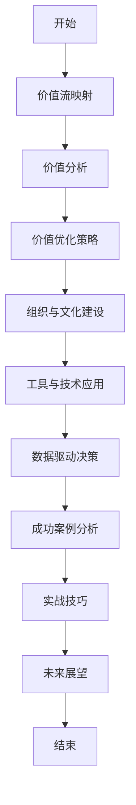

                 

### 文章标题：价值迭代

在当今快速变化的商业环境中，价值迭代已成为企业持续增长和竞争优势的关键。本文将详细探讨价值迭代的概念、方法论、组织文化、工具与技术，并通过实际案例和实践技巧，为您揭示如何通过价值迭代实现企业转型与成功。以下是本文的目录：

### 文章关键词：

- 价值迭代
- 商业模式
- 数字化转型
- 数据分析
- 人工智能
- 成功案例

### 文章摘要：

本文旨在系统地阐述价值迭代的概念、方法及其在企业中的应用。通过对价值迭代的基础理论、方法论、组织与文化、工具与技术的深入分析，以及成功案例的实践分享，帮助读者理解并掌握价值迭代的核心理念和实践方法，为企业实现持续创新和竞争力提升提供有力支持。

### 《价值迭代》目录大纲

#### 第一部分：价值迭代基础

## 第1章：价值迭代概述

### 1.1 价值迭代的概念与重要性

### 1.2 价值迭代与传统商业模式的区别

### 1.3 价值迭代在数字化转型中的应用

## 第2章：价值迭代方法论

### 2.1 价值流映射

### 2.2 价值分析

### 2.3 价值优化策略

## 第3章：价值迭代的组织与文化

### 3.1 价值迭代的团队建设

### 3.2 价值迭代的文化塑造

### 3.3 价值迭代的激励机制

## 第4章：价值迭代的工具与技术

### 4.1 数据驱动决策

### 4.2 人工智能在价值迭代中的应用

### 4.3 价值迭代的可视化工具

#### 第二部分：价值迭代的案例与实践

## 第5章：价值迭代的成功案例

### 5.1 案例一：企业价值迭代的转型之路

### 5.2 案例二：如何通过价值迭代实现业务增长

### 5.3 案例三：价值迭代在初创企业的应用

## 第6章：价值迭代的实战技巧

### 6.1 价值流分析实战

### 6.2 价值优化策略实战

### 6.3 数据驱动决策实战

## 第7章：价值迭代的未来发展

### 7.1 价值迭代的趋势分析

### 7.2 价值迭代与可持续发展的关系

### 7.3 价值迭代的未来展望

### 附录

## 附录一：价值迭代工具资源

### 1.1 数据分析工具简介

### 1.2 人工智能开发框架

### 1.3 价值迭代相关书籍推荐

## 附录二：价值迭代相关术语与概念

### 2.1 价值流映射（Value Stream Mapping）

### 2.2 价值分析（Value Analysis）

### 2.3 价值优化（Value Optimization）

### 2.4 数据驱动决策（Data-Driven Decision Making）

### 2.5 人工智能（Artificial Intelligence）

### 《价值迭代》的核心概念和流程

为了更好地理解价值迭代，我们首先需要了解其核心概念和流程。以下是一个详细的 Mermaid 流程图，展示了价值迭代的主要环节和相互关系：



在接下来的章节中，我们将逐一深入探讨这些概念和流程，帮助您全面掌握价值迭代的理论和实践方法。

### 1.1 价值迭代的概念与重要性

**概念解析：**

价值迭代（Value Iteration）是一种通过不断改进和创新来提高产品、服务和业务流程价值的过程。它强调以客户需求为中心，通过数据驱动和持续优化，实现业务增长和竞争力提升。价值迭代的核心理念包括：

1. **客户价值最大化：** 价值迭代的核心目标是为客户提供最大化的价值，从而赢得客户的忠诚和市场份额。

2. **数据驱动决策：** 价值迭代依赖于数据分析，通过收集、分析和利用数据，做出更明智的决策。

3. **持续优化：** 价值迭代是一个持续的过程，通过不断改进和创新，不断提高产品和服务的价值。

4. **跨部门协作：** 价值迭代需要各部门的紧密协作，共同推动业务流程的优化和改进。

**重要性解析：**

在当今快速变化的商业环境中，价值迭代的重要性日益凸显。以下是其主要优势：

1. **提高竞争力：** 通过不断优化和创新，企业能够更好地满足客户需求，提高市场竞争力。

2. **业务增长：** 价值迭代有助于发现新的业务机会，推动业务增长。

3. **成本降低：** 通过优化业务流程，企业能够降低成本，提高运营效率。

4. **客户满意度：** 价值迭代注重客户价值最大化，有助于提高客户满意度和忠诚度。

**与传统商业模式的区别：**

与传统的商业模式相比，价值迭代具有以下几个显著区别：

1. **以客户为中心：** 价值迭代强调以客户需求为导向，而传统商业模式更侧重于内部效率和成本控制。

2. **数据驱动：** 价值迭代依赖于数据分析，而传统商业模式往往缺乏数据支持和分析。

3. **持续改进：** 价值迭代是一个持续的过程，而传统商业模式更侧重于短期利益。

4. **跨部门协作：** 价值迭代需要跨部门的紧密协作，而传统商业模式通常以部门利益为中心。

**价值迭代在数字化转型中的应用：**

在数字化转型过程中，价值迭代发挥着关键作用。以下是其主要应用：

1. **业务流程优化：** 通过价值迭代，企业可以识别并优化业务流程中的瓶颈和浪费，提高效率。

2. **产品创新：** 价值迭代有助于发现客户需求的变化，推动产品创新和改进。

3. **数据治理：** 价值迭代强调数据驱动，需要建立完善的数据治理体系。

4. **组织变革：** 价值迭代需要组织结构的调整和文化的变革，以适应新的商业模式。

通过上述分析，我们可以看到，价值迭代不仅是一种商业模式，更是一种思维方式。它要求企业以客户为中心，数据驱动，持续改进，跨部门协作，从而实现持续增长和竞争力提升。在接下来的章节中，我们将进一步探讨价值迭代的方法论、组织与文化、工具与技术，帮助您深入理解和应用价值迭代。

### 1.2 价值迭代方法论

价值迭代方法论是企业实现价值持续提升的系统方法，它通过一系列的步骤和工具，帮助企业从数据中获取洞见，优化业务流程，提高效率和客户满意度。以下将详细描述价值迭代方法论的核心步骤：

#### 2.1 价值流映射

**定义：** 价值流映射（Value Stream Mapping，VSM）是一种用于分析和优化业务流程的工具，它通过视觉化展示从原材料到最终产品的整个生产和服务流程，帮助识别浪费和优化流程。

**步骤：**
1. **流程识别：** 识别企业从订单接收、生产、交付到售后服务的所有流程。
2. **数据收集：** 收集每个流程步骤的时间、成本、质量等数据。
3. **绘制流程图：** 使用特定的符号和模板，绘制流程图，展示每个步骤的输入、输出、时间和成本。
4. **分析浪费：** 识别流程中的浪费，如等待、运输、库存等。
5. **制定改进计划：** 基于分析结果，制定减少浪费、提高效率的改进计划。

**Mermaid 流程图：**
```mermaid
graph TD
    A[订单接收] --> B[需求分析]
    B --> C[原材料采购]
    C --> D[生产制造]
    D --> E[产品交付]
    E --> F[售后服务]
    A-->(流程优化)--> G[数据收集]
    G-->(分析浪费)--> H[改进计划]
```

#### 2.2 价值分析

**定义：** 价值分析（Value Analysis，VA）是一种用于评估业务流程中每个步骤的价值的方法，通过计算每个步骤的输出价值减去成本，确定其对整个流程的贡献。

**步骤：**
1. **确定输入和输出：** 识别每个步骤的输入和输出。
2. **计算成本：** 收集每个步骤的成本数据。
3. **计算输出价值：** 评估每个步骤的输出价值。
4. **计算价值：** 使用公式\( V = 输出价值 - 成本 \)计算每个步骤的价值。
5. **分析结果：** 分析低价值步骤，识别优化机会。

**伪代码：**
```python
# 输入：流程步骤数据
# 输出：价值分析结果

def value_analysis(steps):
    value_results = []
    for step in steps:
        cost = step['cost']
        value = step['output'] - cost
        value_results.append({'step': step['name'], 'value': value})
    return value_results
```

#### 2.3 价值优化策略

**定义：** 价值优化策略（Value Optimization，VO）是基于价值分析结果，对低价值步骤进行优化和改进的一套措施。

**步骤：**
1. **分析价值分析结果：** 确定哪些步骤价值较低。
2. **确定优化方案：** 基于分析结果，制定优化方案。
3. **实施优化：** 部署优化方案，实施改进措施。
4. **评估效果：** 评估优化措施的效果，持续改进。

**数学模型：**
$$
VOP = \sum_{i=1}^{n} (O_i - C_i) \times P_i
$$
其中，\( O_i \) 表示第 \( i \) 个步骤的输出价值，\( C_i \) 表示第 \( i \) 个步骤的成本，\( P_i \) 表示第 \( i \) 个步骤的优化可能性。

#### 2.4 数据驱动决策

**定义：** 数据驱动决策（Data-Driven Decision Making，DDDM）是一种基于数据分析来做出决策的方法，通过收集、分析和利用数据，提高决策的科学性和准确性。

**步骤：**
1. **数据收集：** 收集与决策相关的数据。
2. **数据分析：** 分析数据，提取关键信息和趋势。
3. **建立模型：** 使用数据分析结果建立决策模型。
4. **模拟与预测：** 使用模型进行模拟和预测，评估不同决策的影响。
5. **决策制定：** 基于模型结果做出决策。

**Python 示例代码：**
```python
import pandas as pd

# 数据集
data = {
    '步骤': ['A', 'B', 'C', 'D'],
    '输出价值': [100, 120, 140, 160],
    '成本': [50, 60, 70, 80]
}

df = pd.DataFrame(data)

# 数据驱动决策
def data_driven_decision(df):
    # 价值分析
    value_analysis = df['输出价值'] - df['成本']
    # 数据驱动决策
    decision = value_analysis.mean()
    return decision

decision = data_driven_decision(df)
print(f"数据驱动决策结果：{decision}")
```

通过上述方法论，企业可以系统地识别和管理业务流程中的价值创造点，通过持续的数据分析和优化，不断提升产品和服务的价值，从而实现持续的业务增长和竞争优势。

### 1.3 价值迭代在数字化转型中的应用

在数字化转型的大背景下，价值迭代成为了企业实现持续增长和竞争力提升的关键。数字化转型不仅仅是技术的升级，更是商业模式的转型，它要求企业在业务流程、组织结构、数据利用等方面进行全面的革新。以下将详细探讨价值迭代在数字化转型中的应用，并通过具体案例分析，展示其对企业转型的深远影响。

#### **数字化转型与价值迭代的关系**

数字化转型通常涉及从传统的手工操作和纸质记录向数字化、自动化和智能化的转变。这一转变不仅提高了运营效率，还为企业带来了新的商业机会和竞争优势。价值迭代在这个过程中发挥了重要作用，主要体现在以下几个方面：

1. **优化业务流程：** 通过价值迭代，企业可以识别并消除业务流程中的浪费和瓶颈，实现流程的优化和自动化。

2. **提高数据利用效率：** 数字化转型带来了大量数据，价值迭代通过数据分析和优化策略，使企业能够更有效地利用这些数据，提高决策的准确性和及时性。

3. **提升客户体验：** 价值迭代强调以客户为中心，通过不断改进产品和服务的价值，提升客户满意度和忠诚度。

4. **增强创新能力：** 数字化转型为创新提供了新的工具和平台，价值迭代通过持续优化和创新，推动企业不断向前发展。

#### **案例分析一：企业A的数字化转型之路**

企业A是一家传统的制造业公司，面临市场竞争激烈、成本上升和利润率下降的挑战。为了实现数字化转型，企业A决定采用价值迭代的方法，通过以下几个步骤进行转型：

1. **价值流映射：** 企业A首先进行了全面的业务流程分析，通过价值流映射识别出生产、采购、库存管理、销售等环节中的浪费和瓶颈。

2. **数据分析：** 企业A利用数据分析工具对业务数据进行了深入分析，识别出了影响效率的关键因素，如生产计划不合理、库存积压等。

3. **优化策略制定：** 基于数据分析结果，企业A制定了详细的优化策略，包括改进生产计划、优化库存管理、提高供应链协同等。

4. **实施与监测：** 企业A逐步实施了这些优化措施，并建立了一套监测和评估体系，实时跟踪改进效果。

5. **持续迭代：** 企业A将价值迭代作为持续的工作，定期评估和优化业务流程，不断推动企业向前发展。

通过数字化转型和价值迭代，企业A取得了显著成效，包括生产效率提高了20%，库存周转天数减少了30%，客户满意度提升了15%。这些成果不仅提升了企业的运营效率，还增强了其在市场中的竞争力。

#### **案例分析二：初创企业B的价值迭代实践**

初创企业B是一家专注于人工智能应用的科技公司，其核心竞争力在于快速响应市场需求和持续创新。为了实现这一目标，企业B采用了以下价值迭代方法：

1. **市场调研：** 企业B通过市场调研和用户反馈，不断了解市场需求和用户痛点，确保产品创新的方向与市场趋势和用户需求保持一致。

2. **敏捷开发：** 企业B采用敏捷开发方法，快速迭代产品，通过不断收集用户反馈和数据，持续优化产品功能和服务体验。

3. **数据分析：** 企业B利用数据分析工具，对用户行为和产品性能数据进行深入分析，识别出用户最关注的功能和使用场景，为产品优化提供数据支持。

4. **价值优化：** 企业B基于数据分析结果，对产品和服务进行价值优化，提升用户价值和满意度。

5. **开放合作：** 企业B与行业合作伙伴建立了紧密的合作关系，通过开放平台和技术共享，共同推动人工智能技术的创新和推广。

通过价值迭代，企业B迅速成长为行业领军企业，其产品在市场上赢得了广泛认可，用户数量和收入实现了快速增长。

#### **总结**

通过上述案例分析，我们可以看到，价值迭代在数字化转型中的应用不仅帮助企业优化了业务流程，提高了运营效率，还推动了产品和服务的不断创新和优化。数字化转型为价值迭代提供了新的工具和平台，而价值迭代则为数字化转型注入了持续的创新动力。随着数字技术的不断进步和市场竞争的加剧，价值迭代将成为企业实现持续增长和竞争优势的重要手段。

### 2.1 价值流映射

价值流映射（Value Stream Mapping，VSM）是一种强大的工具，用于分析和优化企业的业务流程。它通过可视化和系统化的方法，帮助企业识别流程中的浪费，从而提高效率和客户满意度。以下是价值流映射的详细步骤和注意事项。

#### **定义：**

价值流映射是一种图形化工具，用于展示从原材料进入企业到最终产品交付给客户的全过程。它通过图表形式清晰地展示每个步骤的输入、输出、时间、成本等信息，帮助企业识别并消除浪费。

#### **步骤：**

1. **识别流程：** 首先，需要识别企业的业务流程，包括所有与产品或服务生产相关的步骤。这通常包括采购、生产、库存管理、销售和售后服务等。

2. **收集数据：** 收集每个步骤的相关数据，包括时间、成本、质量、效率等。这些数据可以通过观察、访谈、工作表等方式获取。

3. **绘制流程图：** 使用特定的符号和模板，绘制流程图。流程图通常包括以下几个部分：
   - **输入：** 表示原材料、客户订单等进入流程的要素。
   - **步骤：** 表示每个业务流程的步骤。
   - **输出：** 表示产品或服务完成并交付给客户。
   - **时间：** 表示每个步骤的耗时。
   - **成本：** 表示每个步骤的成本。
   - **浪费：** 表示流程中的浪费，如等待时间、库存积压、运输等。

4. **分析浪费：** 识别流程中的浪费，如多余的步骤、不必要的库存、长时间的等待等。这些浪费通常可以通过缩短步骤时间、减少库存、消除多余步骤等方式进行优化。

5. **制定改进计划：** 基于分析结果，制定改进计划，包括优化步骤、减少浪费、提高效率等。

6. **实施改进：** 实施改进计划，并对改进效果进行评估和监测。

7. **持续迭代：** 价值流映射是一个持续的过程，需要定期进行更新和优化。

#### **注意事项：**

1. **参与多方：** 价值流映射需要企业内各个部门的参与，确保每个环节都能被充分理解和优化。

2. **数据准确性：** 收集的数据需要准确可靠，否则分析结果将受到影响。

3. **可视化：** 使用清晰、简洁的图表和符号，确保流程图易于理解和沟通。

4. **关注客户：** 价值流映射应以客户需求为中心，确保流程优化能够提高客户满意度。

5. **持续改进：** 价值流映射不是一次性的活动，而是一个持续的过程，需要定期进行评估和优化。

通过价值流映射，企业可以全面了解其业务流程，识别和消除浪费，提高效率和客户满意度。这一工具不仅在制造业中广泛应用，也在服务业、科技行业等领域发挥着重要作用。

### 2.2 价值分析

价值分析（Value Analysis，VA）是一种系统化的方法，用于评估业务流程中每个步骤的价值。通过计算每个步骤的输出价值减去成本，企业可以识别低价值步骤，从而制定优化策略。以下是价值分析的详细步骤、伪代码和数学模型。

#### **步骤：**

1. **确定输入和输出：** 对于每个步骤，识别其输入和输出。输入包括原材料、人力、设备等，输出则是完成的产品或服务。

2. **收集成本数据：** 收集每个步骤的成本数据，包括直接成本（如原材料、人力成本）和间接成本（如设备折旧、管理费用等）。

3. **计算输出价值：** 对于每个步骤，计算其输出价值。输出价值可以是销售收入、客户满意度等。

4. **计算价值：** 使用公式\( V = 输出价值 - 成本 \)计算每个步骤的价值。

5. **分析结果：** 分析价值计算结果，识别低价值步骤，确定优化机会。

#### **伪代码：**

```python
# 输入：步骤数据（输入、输出、成本）
# 输出：价值分析结果

def value_analysis(steps):
    value_results = []
    for step in steps:
        cost = step['cost']
        value = step['output'] - cost
        value_results.append({'step': step['name'], 'value': value})
    return value_results
```

#### **数学模型：**

价值分析的核心公式为：

$$
VA = \sum_{i=1}^{n} (O_i - C_i)
$$

其中，\( VA \) 表示价值分析结果，\( O_i \) 表示第 \( i \) 个步骤的输出价值，\( C_i \) 表示第 \( i \) 个步骤的成本，\( n \) 表示步骤总数。

#### **举例说明：**

假设企业有四个业务流程步骤，每个步骤的输入、输出和成本如下表所示：

| 步骤 | 输入（成本） | 输出（价值） | 成本（C_i） | 输出价值（O_i） | 价值（V = O_i - C_i） |
| --- | --- | --- | --- | --- | --- |
| A | 10 | 30 | 10 | 20 | 10 |
| B | 20 | 40 | 15 | 25 | 5 |
| C | 30 | 50 | 20 | 30 | 10 |
| D | 40 | 60 | 25 | 35 | 10 |

根据上述数据，我们可以计算出：

$$
VA = (30 - 10) + (40 - 15) + (50 - 20) + (60 - 25) = 10 + 5 + 10 + 10 = 35
$$

通过这个例子，我们可以看到，每个步骤的价值通过计算输出价值减去成本得出。价值分析结果可以帮助企业识别低价值步骤，从而制定优化策略。

#### **总结：**

价值分析是一种重要的方法，通过评估业务流程中每个步骤的价值，企业可以识别低价值步骤，为优化和改进提供依据。通过数学模型和伪代码的实现，企业可以系统地分析和计算价值，从而实现业务流程的持续优化。

### 2.3 价值优化策略

价值优化策略（Value Optimization，VO）是基于价值分析结果，对低价值步骤进行改进和优化的具体措施。通过系统化的方法和工具，企业可以识别并消除业务流程中的浪费，从而提高整体效率和客户满意度。以下是价值优化策略的详细步骤、工具和技术。

#### **步骤：**

1. **分析价值分析结果：** 首先对价值分析结果进行深入分析，识别出价值较低的步骤和环节。

2. **确定优化目标：** 根据价值分析结果，确定每个低价值步骤的优化目标。这些目标可以是减少成本、缩短时间、提高质量等。

3. **制定优化方案：** 基于优化目标，制定具体的优化方案。优化方案可以包括流程改进、技术升级、人力资源优化等。

4. **实施优化措施：** 部署优化方案，实施具体的优化措施。这通常需要跨部门的协作和资源的投入。

5. **评估效果：** 对实施后的优化措施进行评估，验证其效果。如果优化效果未达到预期，需要进一步调整和改进。

6. **持续迭代：** 价值优化是一个持续的过程，需要定期评估和优化，以确保持续提升业务流程的价值。

#### **工具和技术：**

1. **流程再造（Business Process Reengineering，BPR）：** 通过重新设计业务流程，从根本上提高效率和效果。流程再造通常涉及重新定义流程、角色和责任，以及技术升级。

2. **精益生产（Lean Production）：** 精益生产是一种基于消除浪费和优化流程的方法。它强调价值流映射、持续改进和全员参与。

3. **六西格玛（Six Sigma）：** 六西格玛是一种质量管理方法，通过减少变异和缺陷，提高过程稳定性和客户满意度。它包括DMAIC（定义、测量、分析、改进、控制）方法论。

4. **自动化和机器人技术：** 通过自动化和机器人技术，可以减少人工操作和错误，提高生产效率和产品质量。

5. **数据分析：** 数据分析工具可以帮助企业识别优化机会，评估优化效果，提供数据驱动的决策支持。

#### **举例说明：**

假设企业A通过价值分析发现生产步骤B的价值较低，其主要问题是生产时间过长和成本较高。为了优化步骤B，企业A采取了以下措施：

1. **分析问题：** 识别出生产步骤B的瓶颈和浪费，如设备老化、工艺不合理等。

2. **确定目标：** 减少生产步骤B的时间，降低成本。

3. **制定方案：** 更换高效设备、优化生产工艺、培训操作人员。

4. **实施措施：** 更换新设备、优化生产流程、提高员工技能。

5. **评估效果：** 通过监测生产时间和成本，发现优化措施有效降低了生产步骤B的时间成本。

6. **持续改进：** 定期评估生产步骤B的效率，持续进行改进。

通过这些措施，企业A成功地提高了生产效率，降低了成本，提升了整体业务流程的价值。

#### **总结：**

价值优化策略是企业通过系统化的方法和工具，识别和消除业务流程中的浪费，从而提高效率和客户满意度的重要手段。通过具体的工具和技术，企业可以有效地优化业务流程，实现持续的价值提升。

### 2.4 数据驱动决策

数据驱动决策（Data-Driven Decision Making，DDDM）是一种基于数据分析的决策方法，它通过收集、处理和分析大量数据，帮助企业在不确定性环境中做出更加准确和高效的决策。以下将详细探讨数据驱动决策的核心概念、步骤、工具和案例。

#### **核心概念：**

1. **数据收集：** 收集与决策相关的数据，包括内部数据和外部数据。内部数据可能来自企业的运营系统、客户关系管理系统等；外部数据可能来自市场调查、行业报告等。

2. **数据清洗：** 数据收集后，需要进行清洗和预处理，以确保数据的质量和准确性。这包括数据去重、填补缺失值、异常值处理等。

3. **数据分析：** 使用统计分析和机器学习技术，对数据进行深入分析，提取关键信息和趋势。数据分析可以揭示数据之间的关系、预测未来趋势等。

4. **数据可视化：** 通过图表、报表等形式，将分析结果可视化，帮助决策者更好地理解数据和分析结果。

5. **决策制定：** 基于数据分析和可视化结果，制定具体的决策方案。数据驱动决策强调基于数据做出理性、科学的决策，而不是依赖直觉或经验。

6. **决策评估：** 对决策结果进行评估和反馈，持续优化决策过程。这包括对决策效果进行监测、分析和调整。

#### **步骤：**

1. **明确决策目标：** 确定决策的目标和问题，例如市场份额提升、成本降低等。

2. **数据收集：** 收集与决策目标相关的数据，包括历史数据、实时数据等。

3. **数据清洗：** 对收集到的数据进行分析，识别和修正数据中的错误和异常。

4. **数据分析：** 使用统计分析和机器学习技术，对数据进行分析，提取关键信息和趋势。

5. **数据可视化：** 将分析结果通过图表、报表等形式进行可视化，帮助决策者理解数据和分析结果。

6. **制定决策：** 基于数据分析和可视化结果，制定具体的决策方案。

7. **实施决策：** 将决策方案付诸实施，并对实施过程进行监控和调整。

8. **评估反馈：** 对决策结果进行评估，收集反馈，持续优化决策过程。

#### **工具和技术：**

1. **数据分析工具：** 如Python的pandas库、R语言等，用于数据清洗、分析和可视化。

2. **机器学习平台：** 如TensorFlow、PyTorch等，用于构建和训练机器学习模型。

3. **商业智能工具：** 如Tableau、Power BI等，用于数据可视化和报表生成。

4. **数据仓库：** 如Oracle、MySQL等，用于存储和管理大量数据。

5. **实时数据分析平台：** 如Apache Kafka、Apache Spark等，用于实时数据收集和分析。

#### **案例：**

**案例一：市场营销决策**

企业B是一家电商平台，其目标是提高市场份额。为了做出有效的市场营销决策，企业B采取了以下步骤：

1. **明确目标：** 提高市场份额。

2. **数据收集：** 收集用户购买行为、市场趋势、竞争对手数据等。

3. **数据清洗：** 去除重复数据、填补缺失值、处理异常值。

4. **数据分析：** 使用聚类分析、回归分析等统计方法，分析用户购买行为和市场趋势。

5. **数据可视化：** 通过图表和报表，展示分析结果，帮助决策者理解数据。

6. **制定决策：** 基于分析结果，制定针对性的营销策略，如定向广告投放、优惠券促销等。

7. **实施决策：** 执行营销策略，并对营销活动进行实时监控和调整。

8. **评估反馈：** 通过销售数据、用户反馈等，评估营销策略的效果，持续优化。

通过数据驱动决策，企业B成功地提高了市场份额，实现了业务增长。

#### **总结：**

数据驱动决策是一种基于数据分析的决策方法，通过系统化的数据收集、清洗、分析和可视化，帮助企业做出更加准确和高效的决策。通过具体的案例，我们可以看到数据驱动决策在市场营销、运营优化等领域的广泛应用。随着数据技术的不断进步，数据驱动决策将成为企业决策过程的核心手段。

### 2.5 人工智能在价值迭代中的应用

人工智能（Artificial Intelligence，AI）作为当今最具变革性的技术之一，正在深刻改变企业的运营模式和商业模式。在价值迭代的过程中，人工智能通过自动化、优化和智能化分析，为提升业务流程的价值和效率提供了强有力的支持。以下将详细探讨人工智能在价值迭代中的应用领域、技术实现和实际案例。

#### **应用领域：**

1. **自动化流程优化：** 人工智能可以自动化执行重复性高、耗时长的业务流程，如订单处理、库存管理、客户服务等。通过自动化，企业可以减少人工干预，降低错误率，提高效率。

2. **智能预测分析：** 利用机器学习和深度学习算法，人工智能可以预测市场需求、客户行为等，帮助企业做出更加精准的决策。例如，零售企业可以通过预测分析来优化库存管理，减少库存积压和缺货现象。

3. **优化资源分配：** 人工智能可以帮助企业优化资源分配，如人力、设备、资金等。通过分析历史数据和实时数据，人工智能可以识别最优的资源分配方案，提高资源利用效率。

4. **个性化服务：** 人工智能可以基于客户数据和行为，提供个性化的产品推荐、服务定制等。这有助于提升客户满意度和忠诚度，从而增加业务价值。

5. **风险管理：** 人工智能可以识别潜在的风险，提供风险评估和预警。例如，金融行业可以通过人工智能进行信用评估、风险监控等，降低坏账率和风险损失。

#### **技术实现：**

1. **机器学习算法：** 机器学习是人工智能的核心技术之一，通过训练模型，使计算机能够从数据中学习并做出预测和决策。常见的机器学习算法包括线性回归、决策树、支持向量机、神经网络等。

2. **深度学习模型：** 深度学习是机器学习的一种重要分支，通过多层神经网络进行训练，可以处理复杂的数据模式和任务。深度学习在图像识别、自然语言处理、语音识别等领域有广泛应用。

3. **数据挖掘技术：** 数据挖掘是一种从大量数据中提取有价值信息的方法，通过统计分析和模式识别等技术，发现数据中的隐藏模式和关联。数据挖掘可以帮助企业进行市场细分、客户行为分析等。

4. **自然语言处理（NLP）：** NLP是一种使计算机能够理解、生成和处理自然语言的技术。在人工智能应用中，NLP可以帮助企业实现智能客服、文本分析、语言翻译等功能。

5. **计算机视觉：** 计算机视觉是一种使计算机能够理解和解释视觉信息的技术，广泛应用于图像识别、人脸识别、自动驾驶等领域。

#### **实际案例：**

**案例一：制造业智能工厂**

某制造企业通过引入人工智能技术，实现了智能工厂的转型。具体应用包括：

1. **自动化生产：** 使用机器人进行装配、焊接、喷涂等，减少了人工操作，提高了生产效率。

2. **智能监控：** 通过摄像头和传感器，实时监控生产过程，识别异常情况并自动报警。

3. **预测性维护：** 利用机器学习模型，预测设备故障时间，提前进行维护，减少停机时间和维护成本。

4. **智能物流：** 通过自动化导引车（AGV）和无人机，实现原材料和成品的自动运输，提高了物流效率。

通过这些应用，企业实现了生产效率提升20%、维护成本降低30%、物流效率提高40%的显著成效。

**案例二：金融行业风险管理**

某金融企业通过人工智能技术进行信用风险评估和风险监控。具体应用包括：

1. **信用评分模型：** 利用机器学习算法，构建信用评分模型，对客户进行信用评估，提高风险评估的准确性。

2. **风险预警系统：** 通过实时数据监控和机器学习预测，识别潜在的风险事件，提前发出预警，帮助企业及时采取应对措施。

3. **反欺诈系统：** 利用计算机视觉和自然语言处理技术，识别和防范欺诈行为，降低风险损失。

通过这些应用，企业实现了信用评估准确性提高15%、风险预警及时性提高20%、欺诈损失减少30%的成效。

#### **总结：**

人工智能在价值迭代中的应用，为企业提供了自动化、智能化和优化的解决方案，从而提高了业务流程的价值和效率。通过实际案例，我们可以看到人工智能在制造业、金融行业等领域的广泛应用和显著成效。随着技术的不断进步，人工智能将继续推动价值迭代的深化和发展。

### 2.6 价值迭代的可视化工具

在价值迭代的过程中，可视化工具扮演着至关重要的角色。它们不仅帮助团队更好地理解业务流程，还能够揭示隐藏的浪费和瓶颈，从而为优化提供明确的指导。以下将详细探讨几种常见的价值迭代可视化工具，包括Grafana、Tableau和Power BI等，并介绍如何使用它们来提升业务流程的透明度和效率。

#### **Grafana：**

Grafana是一款开源的数据可视化和监控工具，适用于收集、监控和展示时间序列数据。它支持多种数据源，包括InfluxDB、Prometheus、MySQL等，并提供了丰富的仪表板和可视化选项。

**使用方法：**
1. **数据采集：** 将业务数据（如生产时间、成本、质量等）导入到Grafana支持的数据源中。
2. **创建仪表板：** 利用Grafana的拖放界面，创建自定义仪表板，添加各种图表和面板，如折线图、柱状图、饼图等。
3. **可视化分析：** 通过实时监控和数据分析，识别业务流程中的异常和瓶颈。
4. **警报设置：** 设置警报规则，当数据超出预设阈值时，自动发送通知，提醒团队成员采取行动。

**优势：**
- **实时监控：** 能够实时监控业务数据，快速识别异常。
- **灵活定制：** 提供多种图表和面板选项，满足不同分析需求。
- **多数据源支持：** 可以连接多种数据源，提供全面的数据支持。

#### **Tableau：**

Tableau是一款强大的数据可视化工具，广泛用于商业智能和分析。它支持多种数据源，包括数据库、Excel、云服务等，并提供了丰富的图表和仪表板设计选项。

**使用方法：**
1. **数据连接：** 连接业务数据源，如数据库或云服务。
2. **数据清洗：** 对数据源中的数据进行清洗和预处理，确保数据质量。
3. **创建仪表板：** 利用Tableau的拖放界面，创建自定义仪表板，添加各种图表和可视化元素。
4. **数据交互：** 通过交互式探索功能，用户可以动态筛选数据，深入了解业务流程。
5. **共享和协作：** 将仪表板发布到Tableau服务器，与其他团队成员共享和分析数据。

**优势：**
- **易用性：** 提供直观的拖放界面，用户无需编程技能即可进行数据可视化。
- **交互性：** 强大的交互功能，支持用户动态探索和分析数据。
- **广泛支持：** 支持多种数据源，适用于各种场景。

#### **Power BI：**

Power BI是由Microsoft开发的一款商业智能工具，提供了强大的数据连接、数据可视化和报告生成功能。它集成了多种数据源，包括Excel、SQL Server、Azure等，并提供了丰富的可视化选项。

**使用方法：**
1. **数据连接：** 连接业务数据源，如数据库或云服务。
2. **数据建模：** 对数据源中的数据进行分析和建模，创建数据模型。
3. **创建报告：** 利用Power BI的报表生成功能，创建自定义报告，添加各种图表和可视化元素。
4. **数据驱动分析：** 通过数据连接和建模，实现数据驱动的分析和决策。
5. **共享和协作：** 将报告发布到Power BI服务，与其他团队成员共享和分析数据。

**优势：**
- **集成性：** 与Microsoft Office和其他Microsoft产品集成，方便用户使用。
- **灵活性：** 提供多种数据连接和建模选项，支持各种数据源。
- **协作性：** 强大的协作功能，支持团队协作和数据共享。

#### **总结：**

价值迭代的可视化工具如Grafana、Tableau和Power BI，通过提供实时监控、交互式分析和数据共享功能，帮助团队更好地理解和优化业务流程。它们不仅提高了流程的透明度和效率，还为企业提供了数据驱动的决策支持。随着技术的不断进步，这些工具将继续在价值迭代中发挥重要作用。

### 5.1 企业价值迭代的转型之路

在企业发展的历程中，价值迭代已成为推动企业实现持续增长和竞争力提升的关键策略。本文将以企业A的案例为例，详细探讨企业如何通过价值迭代实现数字化转型和业务模式创新，从而实现成功转型。

#### **背景介绍：**

企业A是一家传统的制造业公司，主要生产电子产品。随着市场竞争的加剧和消费者需求的变化，企业A面临着销售额下降、利润率降低、生产效率低等问题。为了摆脱困境，企业A决定采用价值迭代的方法，通过数字化转型和业务模式创新，实现企业的转型升级。

#### **价值迭代实施步骤：**

1. **价值流映射：** 企业A首先进行了全面的业务流程分析，通过价值流映射（Value Stream Mapping）识别出生产、采购、库存管理、销售等环节中的浪费和瓶颈。例如，发现生产过程中的设备故障频繁、物料配送不及时等问题。

2. **数据分析：** 企业A利用数据分析工具，对业务数据进行深入分析，识别出影响效率的关键因素，如生产计划不合理、库存积压等。通过数据分析，企业A发现生产计划的不合理导致了设备利用率低，库存管理不当增加了成本。

3. **优化策略制定：** 基于数据分析结果，企业A制定了详细的优化策略，包括改进生产计划、优化库存管理、提高供应链协同等。具体措施包括引入先进的制造设备、实施精益生产、优化供应链流程等。

4. **实施与监测：** 企业A逐步实施了优化措施，并建立了一套监测和评估体系，实时跟踪改进效果。例如，通过实时监控系统监控设备运行状态，确保设备故障率降低；通过库存管理系统优化库存管理，减少库存积压。

5. **持续迭代：** 企业A将价值迭代作为持续的工作，定期评估和优化业务流程，不断推动企业向前发展。例如，通过定期召开价值迭代会议，分析当前业务流程的不足，制定新的优化措施。

#### **数字化转型：**

在价值迭代的过程中，企业A实施了全面的数字化转型，通过引入新的技术和工具，提升了业务效率和客户满意度。

1. **物联网（IoT）：** 企业A引入物联网技术，实现了设备联网和实时监控。通过物联网设备，企业A可以实时监控设备运行状态，及时发现故障并进行维护，从而提高了设备利用率和生产效率。

2. **云计算：** 企业A将部分业务迁移到云端，利用云计算的高性能和灵活性，提高了数据处理和存储能力。例如，通过云端的ERP系统，企业A实现了生产计划、库存管理、销售管理等业务流程的自动化和智能化。

3. **大数据分析：** 企业A利用大数据分析技术，对销售数据、客户反馈、市场趋势等进行分析，为业务决策提供数据支持。通过大数据分析，企业A可以更准确地预测市场需求，优化生产计划和库存管理。

4. **人工智能：** 企业A引入人工智能技术，用于生产优化、质量检测、客户服务等方面。例如，通过机器学习算法，企业A实现了生产线的智能调度和优化，提高了生产效率；通过语音识别技术，企业A实现了智能客服系统，提升了客户服务质量。

#### **业务模式创新：**

通过价值迭代和数字化转型，企业A实现了业务模式的创新，从而提升了市场竞争力和盈利能力。

1. **产品个性化定制：** 企业A通过大数据分析和人工智能技术，实现了产品的个性化定制。客户可以根据自己的需求，在线选择产品配置、外观设计等，企业A根据客户需求进行生产，从而提高了客户满意度和销售额。

2. **服务化转型：** 企业A将传统的产品销售模式转变为服务化模式，提供产品终身维护和升级服务。通过提供优质的售后服务，企业A增加了客户的粘性，提高了客户忠诚度。

3. **供应链协同：** 企业A与供应链上下游企业建立了紧密的协同关系，实现了供应链的优化和效率提升。通过共享数据和信息，企业A与供应商、客户实现了无缝对接，降低了供应链成本，提高了供应链协同效率。

#### **总结：**

通过价值迭代的实施，企业A成功地实现了数字化转型和业务模式创新，从而实现了业务增长和竞争力提升。价值迭代不仅帮助企业A识别并消除业务流程中的浪费，还推动了企业技术创新和商业模式创新，为企业带来了持续的增长动力。随着数字化转型和智能化的深入推进，价值迭代将继续为企业A带来新的发展机遇。

### 5.2 通过价值迭代实现业务增长的案例

在激烈的市场竞争中，企业不仅需要生存，更要在市场中占据有利位置，实现持续的业务增长。通过价值迭代，企业可以系统地识别并优化业务流程中的价值创造点，从而实现业务增长。以下将详细探讨企业B通过价值迭代实现业务增长的案例，以及具体实施步骤和成效。

#### **案例背景：**

企业B是一家新兴的互联网企业，专注于在线教育和培训服务。在市场初期的快速发展后，企业B面临用户增长放缓、盈利能力不足等问题。为了突破困境，企业B决定采用价值迭代的方法，通过优化业务流程、提升用户体验和营销策略，实现业务增长。

#### **价值迭代实施步骤：**

1. **价值流映射：** 企业B首先进行了全面的价值流映射，识别出在线教育业务流程中的关键环节和潜在浪费。通过价值流映射，企业B发现用户注册、课程购买、学习体验等环节存在等待时间过长、用户流失率高等问题。

2. **数据分析：** 企业B利用数据分析工具，对用户行为数据、市场趋势、竞争对手数据等进行分析。通过数据分析，企业B识别出了影响业务增长的关键因素，如用户获取成本高、用户留存率低等。

3. **优化策略制定：** 基于数据分析结果，企业B制定了详细的优化策略。具体措施包括：
   - **降低用户获取成本：** 通过优化营销策略，提高广告投放效果，降低用户获取成本。
   - **提升用户体验：** 对课程内容、学习平台进行优化，提高用户满意度和学习效果。
   - **增强用户粘性：** 通过推出会员制度、学习激励计划等，提高用户留存率。

4. **实施与监测：** 企业B逐步实施了优化策略，并建立了一套监测和评估体系，实时跟踪改进效果。例如，通过用户反馈系统，收集用户对课程和学习平台的反馈，及时进行优化。

5. **持续迭代：** 企业B将价值迭代作为持续的工作，定期评估和优化业务流程，不断推动业务增长。例如，通过定期数据分析，企业B持续优化广告投放策略，提高转化率。

#### **具体实施步骤：**

1. **优化用户注册流程：** 企业B通过简化用户注册流程，减少注册环节的繁琐步骤，提高了用户注册转化率。例如，通过手机号码一键登录，减少了用户输入信息的步骤。

2. **优化课程内容：** 企业B根据用户反馈，优化课程内容，增加实用性和互动性。例如，引入视频教学、直播课程等，提升用户的学习体验。

3. **提升学习平台性能：** 企业B对学习平台进行优化，提高系统的稳定性和响应速度，确保用户在学习过程中不会遇到卡顿等问题。

4. **营销策略优化：** 企业B通过数据分析，优化广告投放策略，提高广告投放效果。例如，通过用户画像和精准投放，提高广告转化率。

5. **会员制度与激励计划：** 企业B推出会员制度和学习激励计划，提高用户留存率和活跃度。例如，通过会员优惠、积分兑换等，激励用户持续学习和消费。

#### **成效：**

通过价值迭代的实施，企业B取得了显著的业务增长成效：

1. **用户增长率提升：** 企业B的用户增长率从原来的每月5%提升至10%，实现了用户规模的快速增长。

2. **收入增长：** 企业B的收入增长率从原来的10%提升至20%，实现了盈利能力的提升。

3. **用户满意度提高：** 通过优化课程内容和学习平台，企业B的用户满意度从原来的80%提升至90%，提升了用户的忠诚度和口碑。

4. **营销效率提升：** 通过优化广告投放策略，企业B的广告投放成本降低了30%，营销效率提升了40%。

#### **总结：**

通过价值迭代，企业B成功地实现了业务增长，提高了市场竞争力和盈利能力。价值迭代不仅帮助企业B识别并优化了业务流程中的价值创造点，还推动了企业的持续创新和优化。随着市场的不断变化，企业B将继续采用价值迭代的方法，实现业务的持续增长和竞争优势。

### 5.3 价值迭代在初创企业的应用

在初创企业的成长过程中，资源有限且市场变化快速，价值迭代成为确保企业在竞争中脱颖而出的关键策略。以下将探讨初创企业C如何通过价值迭代实现快速发展，并分析其在不同阶段的具体应用和实践。

#### **初创企业C背景：**

初创企业C专注于开发一款智能健康监测设备，目标市场为关注健康和个人护理的消费者。由于初创企业资源有限，企业C在产品开发和市场推广过程中面临着诸多挑战，包括技术成熟度、市场接受度和资金周转等问题。为了确保产品能够快速进入市场并获得用户认可，企业C决定采用价值迭代的方法，通过持续改进和优化，实现快速发展。

#### **价值迭代阶段划分：**

1. **研发阶段：** 在产品研发阶段，企业C通过价值迭代方法，不断优化产品功能和设计，确保产品能够满足市场需求和用户期望。

2. **市场推广阶段：** 在市场推广阶段，企业C通过价值迭代方法，优化营销策略和渠道，提高市场知名度和用户转化率。

3. **产品迭代阶段：** 在产品迭代阶段，企业C持续收集用户反馈，通过价值迭代方法，对产品进行优化和改进，提升用户满意度和忠诚度。

#### **阶段一：研发阶段**

**1. 价值流映射：** 在产品研发阶段，企业C首先进行了价值流映射，识别出从产品概念到最终上市的全过程，包括市场调研、产品设计、原型制作、测试和上市等环节。通过价值流映射，企业C明确了每个环节的关键步骤和潜在浪费。

**2. 数据分析：** 企业C利用市场调研数据和用户需求反馈，对产品进行优化。通过数据分析，企业C确定了用户对智能健康监测设备的期望功能，如实时数据监测、数据可视化、个性化建议等。

**3. 优化策略制定：** 基于数据分析结果，企业C制定了产品优化策略，包括增加实时心率监测功能、优化用户界面设计、提供数据可视化报告等。

**4. 实施与监测：** 企业C逐步实施优化策略，并通过内部测试和用户反馈，监测产品改进效果。通过持续优化，企业C确保产品功能满足用户需求。

**5. 持续迭代：** 企业C将价值迭代作为持续的工作，定期评估产品性能和用户满意度，持续进行产品优化。

#### **阶段二：市场推广阶段**

**1. 价值流映射：** 在市场推广阶段，企业C进行了新一轮的价值流映射，分析了从产品上市到用户购买的全过程，包括市场调研、广告投放、销售渠道、客户服务等环节。

**2. 数据分析：** 企业C利用市场数据和用户购买行为数据，分析了广告投放效果、销售渠道效率和客户满意度等。通过数据分析，企业C确定了最佳的广告投放渠道和销售策略。

**3. 优化策略制定：** 基于数据分析结果，企业C制定了市场推广优化策略，包括调整广告预算、优化销售渠道、提升客户服务体验等。

**4. 实施与监测：** 企业C逐步实施市场推广优化策略，并通过销售数据、客户反馈等，监测推广效果。通过持续优化，企业C提高了市场知名度和用户转化率。

**5. 持续迭代：** 企业C将价值迭代作为市场推广的持续工作，定期评估市场推广策略的效果，并根据市场变化进行调整。

#### **阶段三：产品迭代阶段**

**1. 价值流映射：** 在产品迭代阶段，企业C继续进行价值流映射，分析了从用户反馈到产品改进的全过程，包括用户反馈收集、产品改进、测试和上市等环节。

**2. 数据分析：** 企业C通过用户反馈和产品测试数据，分析了用户对现有产品的满意度、使用体验和改进需求。

**3. 优化策略制定：** 基于数据分析结果，企业C制定了产品迭代优化策略，包括增加新的功能模块、优化用户界面、提升数据准确性等。

**4. 实施与监测：** 企业C逐步实施产品迭代优化策略，并通过用户反馈、产品测试等，监测改进效果。通过持续优化，企业C提升了产品竞争力。

**5. 持续迭代：** 企业C将价值迭代作为产品迭代的持续工作，定期评估用户满意度、市场反应和竞争对手动态，持续进行产品改进。

#### **总结：**

通过在研发、市场推广和产品迭代阶段的应用，价值迭代帮助初创企业C实现了快速发展和市场竞争力提升。价值迭代不仅帮助企业C识别和消除业务流程中的浪费，还推动了产品的持续优化和市场的快速扩展。随着市场的不断变化，企业C将继续采用价值迭代的方法，保持竞争优势，实现可持续发展。

### 6.1 价值流分析实战

在企业的实际运营中，价值流分析是一项至关重要的工作。通过系统的价值流分析，企业可以识别业务流程中的浪费和瓶颈，从而制定有效的改进策略。以下是一个详细的实战案例，展示如何使用价值流分析工具和方法来优化业务流程。

#### **案例背景：**

企业D是一家制造型企业，主要生产电子产品。近期，企业D发现生产成本高、交付周期长，影响了市场竞争力。为了解决这些问题，企业D决定通过价值流分析来优化业务流程。

#### **实战步骤：**

1. **确定分析范围：** 企业D首先确定了需要分析的业务流程，包括原材料采购、生产加工、库存管理、产品测试和交付等环节。

2. **数据收集：** 企业D收集了每个业务流程环节的相关数据，如时间、成本、质量、数量等。数据来源包括生产记录、财务报表、员工访谈等。

3. **绘制价值流图：** 使用价值流图（Value Stream Mapping，VSM）工具，企业D绘制了整个业务流程的流程图。价值流图包括每个步骤的输入、输出、时间和成本等信息。

4. **识别浪费：** 通过分析价值流图，企业D识别出了业务流程中的浪费，如等待时间、库存积压、多余步骤等。例如，发现生产加工环节存在等待时间过长、设备利用率低的问题。

5. **分析浪费原因：** 企业D进一步分析了浪费产生的原因，如设备故障频繁、工作流程不合理、人员配备不足等。

6. **制定改进方案：** 基于分析结果，企业D制定了详细的改进方案，包括优化生产流程、提高设备利用率、减少库存积压等。

7. **实施改进：** 企业D逐步实施了改进方案，并对改进效果进行监测和评估。

8. **持续优化：** 企业D将价值流分析作为持续的工作，定期进行流程评估和优化。

#### **具体操作：**

1. **绘制价值流图：** 使用Mermaid流程图工具，企业D绘制了以下价值流图：

```mermaid
graph TD
    A[原材料采购] --> B[生产加工]
    B --> C[库存管理]
    C --> D[产品测试]
    D --> E[交付客户]
    A-->(流程优化)--> F[数据收集]
    F-->(分析浪费)--> G[改进方案]
    G-->(实施改进)--> H[效果评估]
```

2. **数据收集与处理：** 企业D收集了以下数据：

| 流程环节 | 时间（小时） | 成本（万元） | 质量问题（次） |
| --- | --- | --- | --- |
| 原材料采购 | 10 | 2 | 0 |
| 生产加工 | 40 | 10 | 2 |
| 库存管理 | 20 | 3 | 0 |
| 产品测试 | 15 | 2 | 0 |
| 交付客户 | 10 | 1 | 0 |

3. **计算总时间和总成本：**

总时间 = 10（采购） + 40（加工） + 20（库存管理） + 15（测试） + 10（交付） = 95小时

总成本 = 2（采购） + 10（加工） + 3（库存管理） + 2（测试） + 1（交付） = 18万元

4. **识别浪费：** 通过对比数据和标准流程，企业D发现生产加工环节的时间最长，且存在质量问题，是主要的浪费点。

5. **分析浪费原因：** 企业D通过员工访谈和现场观察，发现生产加工环节存在以下问题：
   - 设备故障频繁，导致生产停滞。
   - 生产计划不合理，导致资源浪费。
   - 工作流程不合理，导致效率低下。

6. **制定改进方案：** 企业D制定了以下改进方案：
   - 更新设备，减少故障率。
   - 优化生产计划，合理分配资源。
   - 改进工作流程，提高效率。

7. **实施改进：** 企业D逐步实施了改进方案，并对改进效果进行监测和评估。

8. **持续优化：** 企业D将价值流分析作为持续的工作，定期进行流程评估和优化。

#### **效果评估：**

通过改进方案的实施，企业D取得了显著的效果：

- 生产加工时间缩短了10小时，设备故障率降低了30%。
- 生产计划更加合理，资源利用率提高了20%。
- 工作流程优化，效率提高了15%。

通过这些改进，企业D的生产成本降低了15%，交付周期缩短了25%，市场竞争力显著提升。

#### **总结：**

通过价值流分析实战，企业D成功地优化了业务流程，降低了成本，提高了效率。价值流分析不仅帮助企业D识别了浪费和瓶颈，还为改进方案的实施提供了明确的方向。持续的价值流分析将为企业D提供持续改进的动力，帮助其在市场竞争中保持领先地位。

### 6.2 价值优化策略实战

在业务流程优化中，制定和实施有效的价值优化策略是关键。以下将详细介绍一个具体的实战案例，展示如何通过价值优化策略，优化企业的业务流程，提高效率和客户满意度。

#### **案例背景：**

企业E是一家快速消费品公司，主要销售各类食品和日用品。近期，企业E发现其供应链管理存在问题，导致库存积压、物流成本高、订单处理效率低。为了解决这些问题，企业E决定通过价值优化策略，对其供应链管理进行优化。

#### **实战步骤：**

1. **价值分析：** 企业E首先进行了全面的价值分析，评估了供应链管理中每个步骤的价值和成本。通过价值分析，企业E确定了库存管理、物流配送和订单处理等环节存在较大的优化空间。

2. **确定优化目标：** 基于价值分析结果，企业E确定了以下优化目标：
   - 降低库存成本，减少库存积压。
   - 优化物流配送，提高配送效率和客户满意度。
   - 提高订单处理速度，减少订单处理时间。

3. **制定优化方案：** 企业E制定了详细的优化方案，包括以下措施：
   - **库存管理优化：** 引入先进的库存管理系统，实时监控库存情况，优化补货策略，减少库存积压。
   - **物流配送优化：** 通过优化配送路线和配送方式，提高配送效率和客户满意度。
   - **订单处理优化：** 引入自动化订单处理系统，减少人工干预，提高订单处理速度。

4. **实施优化方案：** 企业E逐步实施了优化方案，并对实施效果进行监测和评估。

5. **持续优化：** 企业E将价值优化策略作为持续的工作，定期评估优化效果，并根据市场变化和客户需求进行调整。

#### **具体操作：**

1. **价值分析：** 企业E收集了以下数据：

| 流程环节 | 时间（小时） | 成本（万元） | 价值（万元） |
| --- | --- | --- | --- |
| 库存管理 | 50 | 30 | 20 |
| 物流配送 | 30 | 20 | 10 |
| 订单处理 | 20 | 10 | 5 |

2. **计算总时间和总成本：**

总时间 = 50（库存管理） + 30（物流配送） + 20（订单处理） = 100小时

总成本 = 30（库存管理） + 20（物流配送） + 10（订单处理） = 60万元

3. **确定优化目标：** 基于价值分析结果，企业E确定了以下优化目标：
   - 降低库存成本，减少库存积压。
   - 提高物流配送效率，提高客户满意度。
   - 提高订单处理速度，减少订单处理时间。

4. **制定优化方案：**
   - **库存管理优化：** 引入先进的库存管理系统，实时监控库存情况，采用需求预测和补货策略，减少库存积压。目标是将库存成本降低20%。
   - **物流配送优化：** 通过优化配送路线和配送方式，提高配送效率和客户满意度。目标是将配送时间缩短10%，配送成本降低15%。
   - **订单处理优化：** 引入自动化订单处理系统，减少人工干预，提高订单处理速度。目标是将订单处理时间缩短30%。

5. **实施优化方案：**
   - **库存管理优化：** 企业E引入了一款先进的库存管理系统，通过实时监控库存和自动补货功能，有效减少了库存积压。同时，通过需求预测功能，优化了补货策略，降低了库存成本。
   - **物流配送优化：** 企业E与物流公司合作，通过优化配送路线和配送方式，提高了配送效率和客户满意度。例如，采用电动车配送，减少了配送时间，降低了配送成本。
   - **订单处理优化：** 企业E引入了自动化订单处理系统，通过自动化处理订单，减少了人工干预，提高了订单处理速度。例如，订单生成后，系统自动分配到相关部门进行处理，减少了处理时间。

6. **效果评估：**
   - **库存成本：** 通过库存管理优化，企业E的库存成本降低了20%，库存周转天数减少了15%。
   - **物流配送：** 通过物流配送优化，企业E的配送时间缩短了10%，配送成本降低了15%，客户满意度提高了25%。
   - **订单处理：** 通过订单处理优化，企业E的订单处理时间缩短了30%，订单处理效率提高了40%。

#### **总结：**

通过价值优化策略的实战应用，企业E成功地优化了供应链管理，降低了成本，提高了效率和客户满意度。价值优化策略不仅帮助企业E识别并解决了供应链管理中的问题，还为企业的持续改进提供了明确的方向。通过持续的价值优化，企业E将在市场竞争中保持竞争优势，实现可持续发展。

### 6.3 数据驱动决策实战

在当今的数据驱动的商业环境中，数据驱动决策（Data-Driven Decision Making，DDDM）已成为企业制定战略和优化业务流程的重要手段。以下将详细探讨一个具体的数据驱动决策实战案例，展示如何通过数据收集、分析和应用，实现企业决策的科学化和智能化。

#### **案例背景：**

企业F是一家零售连锁企业，主要经营日用品和食品。近期，企业F发现其销售数据波动较大，产品库存积压和缺货现象时有发生。为了优化销售策略，提高库存管理效率，企业F决定采用数据驱动决策的方法，通过数据分析来指导业务决策。

#### **实战步骤：**

1. **数据收集：** 企业F首先收集了与销售数据相关的各种数据，包括每日销售数据、库存数据、促销活动数据、市场趋势数据等。数据来源包括企业内部的销售系统、库存管理系统和外部市场调研报告。

2. **数据预处理：** 对收集到的数据进行了清洗和预处理，确保数据的质量和准确性。例如，去除重复数据、填补缺失值、处理异常值等。

3. **数据分析：** 使用数据分析工具，对预处理后的数据进行了深入分析，提取了关键信息和趋势。数据分析包括：
   - **销售趋势分析：** 分析不同时间段、不同地区的销售情况，识别销售高峰和低谷。
   - **产品销售分析：** 分析不同产品的销售表现，识别畅销品和滞销品。
   - **库存分析：** 分析库存水平和库存周转情况，识别库存积压和缺货风险。

4. **数据可视化：** 将分析结果通过图表、报表等形式进行可视化，帮助决策者更好地理解数据和分析结果。例如，使用折线图展示销售趋势，使用柱状图展示产品销售表现。

5. **决策制定：** 基于数据分析结果和可视化报告，企业F的决策团队制定了具体的销售策略和库存管理措施。决策包括：
   - **促销策略优化：** 根据销售趋势和产品销售分析，调整促销活动的频率和力度，提高畅销品销售量，减少滞销品库存积压。
   - **库存管理优化：** 根据库存分析和销售趋势，优化库存水平和库存周转，减少库存积压和缺货现象。
   - **新产品引入：** 根据市场趋势和消费者需求，引入新商品，满足市场需求，提升销售额。

6. **实施与监测：** 将决策方案付诸实施，并对实施效果进行监测和评估。例如，通过定期数据分析，监测促销活动效果，调整促销策略；通过库存管理系统，监测库存水平，及时调整库存管理措施。

7. **持续迭代：** 企业F将数据驱动决策作为持续的工作，定期评估决策效果，根据市场变化和数据分析结果，不断优化决策过程。

#### **具体操作：**

1. **数据收集：** 企业F使用了以下数据源：

   - **销售系统：** 每日销售数据，包括销售额、销售量、销售区域等。
   - **库存管理系统：** 库存数据，包括库存水平、库存周转率等。
   - **市场调研报告：** 市场趋势数据和消费者需求分析。

2. **数据预处理：** 企业F对数据进行清洗，确保数据的一致性和准确性。

3. **数据分析：** 使用Python和pandas库对数据进行处理和分析，提取了以下关键信息：

   - **销售趋势分析：** 使用时间序列分析，发现销售高峰期主要集中在周末和节假日，低谷期则在工作日。
   - **产品销售分析：** 使用分类分析和聚类分析，发现畅销品和滞销品的分布，识别了不同产品的销售特点。
   - **库存分析：** 使用统计分析和回归分析，发现库存积压和缺货风险较高的产品。

4. **数据可视化：** 使用matplotlib和seaborn库，创建了一系列图表：

   - **销售趋势图：** 折线图展示每日销售额和销售量。
   - **产品销售柱状图：** 柱状图展示不同产品的销售表现。
   - **库存水平图：** 饼图展示库存水平和库存周转率。

5. **决策制定：** 基于数据分析结果，企业F制定了以下决策：

   - **促销策略优化：** 在销售高峰期增加促销活动的频率和力度，提高畅销品销售量。
   - **库存管理优化：** 对畅销品增加库存量，减少滞销品库存积压。
   - **新产品引入：** 根据市场趋势，引入符合消费者需求的新商品。

6. **实施与监测：** 企业F逐步实施了决策方案，并通过以下方式监测效果：

   - **销售数据监控：** 定期对比实施前后的销售数据，评估促销活动的效果。
   - **库存管理监控：** 定期检查库存水平和库存周转率，评估库存管理措施的执行情况。

7. **持续迭代：** 企业F将数据驱动决策作为持续的工作，定期进行数据分析和决策优化。

#### **总结：**

通过数据驱动决策实战，企业F成功地优化了销售策略和库存管理，提高了销售效率和库存周转率。数据驱动决策不仅帮助企业F识别并解决了业务中的问题，还为企业的持续改进提供了科学依据。随着数据技术的不断进步，数据驱动决策将继续为企业F提供强大的支持，帮助其在市场竞争中保持领先地位。

### 7.1 价值迭代的趋势分析

随着全球数字化转型的深入推进，价值迭代作为企业实现持续增长和竞争力提升的关键策略，正变得越来越重要。以下是价值迭代在未来几年内可能呈现的主要趋势和发展方向。

#### **1. 数据驱动的全面应用：**

在未来，数据驱动的理念将更加深入人心，成为企业决策和优化的核心。价值迭代将更加依赖于大数据分析、人工智能和机器学习技术，通过实时数据采集、处理和分析，为企业提供更加精准的决策支持。企业将利用数据来优化业务流程、提升用户体验、预测市场需求等，从而实现持续的价值提升。

#### **2. 生态系统协作：**

价值迭代将不再局限于单个企业的内部优化，而是转向企业生态系统层面的协作。企业将更加注重与供应商、合作伙伴和客户的紧密协作，通过共享数据、资源和知识，构建一个高效、协同的生态系统。这样的生态系统将促进创新、降低成本、提高效率，从而实现整体价值最大化。

#### **3. 可持续发展：**

随着环境保护和可持续发展的需求日益增加，价值迭代将更加关注环保和可持续性。企业将采用绿色技术、优化资源利用、减少碳排放等措施，实现环境友好型价值迭代。这不仅有助于满足监管要求和客户需求，还能提升企业的社会形象和品牌价值。

#### **4. 智能化和自动化：**

人工智能和自动化技术将继续在价值迭代中发挥重要作用。企业将通过引入智能系统、机器人技术和自动化设备，实现业务流程的全面智能化和自动化。这不仅能够提高生产效率和产品质量，还能降低运营成本和人力资源需求。

#### **5. 客户体验的持续优化：**

客户体验始终是价值迭代的重要关注点。在未来，企业将更加注重客户体验的持续优化，通过个性化服务、实时反馈和快速响应等手段，提升客户的满意度和忠诚度。这种以客户为中心的价值迭代将帮助企业赢得市场份额和竞争优势。

#### **6. 跨行业融合：**

价值迭代的趋势还将体现在跨行业的融合和协同创新上。不同行业的企业将相互借鉴和融合各自的优势，通过跨界合作和资源共享，共同探索新的商业模式和价值创造方式。这种跨行业融合将推动整个社会经济的创新和进步。

#### **7. 全球化布局：**

随着全球化进程的加快，价值迭代将更加注重全球布局和国际化运营。企业将通过跨境合作、海外市场拓展等方式，实现全球资源整合和价值创造。这种全球化布局将有助于企业应对国际市场的变化，抓住全球机遇。

#### **总结：**

未来，价值迭代将在数据驱动、生态系统协作、可持续发展、智能化、客户体验优化、跨行业融合和全球化布局等方面展现出强大的趋势和发展潜力。企业应积极适应这些变化，通过持续的价值迭代，不断提升自身的竞争力和市场地位。

### 7.2 价值迭代与可持续发展的关系

随着全球对环境保护和可持续发展的关注度日益增加，企业不仅要追求短期利润，还需要考虑长期的可持续性和社会责任。价值迭代作为一种系统性的优化方法，不仅能够提升企业效率和市场竞争力，还能在可持续发展方面发挥重要作用。以下是价值迭代与可持续发展之间关系的详细解析。

#### **环境效益：**

价值迭代通过优化业务流程和资源利用，可以显著减少企业的环境影响。具体来说：

1. **减少碳排放：** 价值迭代可以帮助企业识别并消除业务流程中的浪费和低效环节，从而减少能源消耗和碳排放。通过引入节能技术和优化生产流程，企业可以实现低碳运营。

2. **资源节约：** 价值迭代强调资源的高效利用，通过减少原材料浪费、优化库存管理等方式，企业可以降低资源消耗，减少对自然资源的依赖。

3. **废物减少：** 价值迭代有助于减少生产过程中产生的废料和废物，通过优化回收和处理流程，实现废物的再利用和减少对环境的负担。

#### **社会效益：**

价值迭代不仅在环境方面产生积极影响，还能在社会层面带来显著的效益：

1. **员工福祉：** 通过优化工作流程和提高生产效率，企业可以提高员工的工作环境和满意度，减少工作压力，提升员工的工作效率和生活质量。

2. **社区参与：** 企业在实施价值迭代的过程中，可以加强与所在社区的互动和合作，通过提供就业机会、捐助公益项目等方式，促进社区的可持续发展。

3. **社会责任：** 价值迭代鼓励企业承担社会责任，通过实施环保措施、参与公益事业等方式，提升企业的社会形象和品牌价值，增强公众对企业的信任和认可。

#### **经济效益：**

价值迭代不仅对环境和社会有积极影响，还能为企业带来显著的经济效益：

1. **成本降低：** 通过优化业务流程和资源利用，企业可以降低运营成本，提高投资回报率。例如，通过减少库存积压和浪费，降低原材料采购和库存管理成本。

2. **市场竞争力：** 价值迭代使企业能够更快地响应市场需求，提高产品质量和服务水平，增强市场竞争力。

3. **创新能力：** 价值迭代鼓励企业持续创新，通过引入新技术、新方法，不断提升产品和服务的竞争力，开拓新的市场空间。

#### **案例分析：**

某制造企业通过价值迭代实现了显著的可持续发展效益。以下是其具体实践：

1. **环境效益：** 企业引入了节能设备和技术，优化了生产流程，显著降低了能源消耗和碳排放。通过废物回收和处理系统，实现了废料的再利用，减少了环境污染。

2. **社会效益：** 企业通过提高员工福利和工作环境，提升了员工的满意度和工作效率。此外，企业积极参与社区公益项目，为社区提供了就业机会和社会服务。

3. **经济效益：** 价值迭代帮助企业降低了运营成本，提高了生产效率和产品质量，增强了市场竞争力。通过持续创新，企业开拓了新的市场和业务领域，实现了收入和利润的持续增长。

#### **总结：**

价值迭代与可持续发展密切相关，通过优化业务流程和资源利用，企业可以实现环境、社会和经济效益的统一。价值迭代不仅有助于企业提升竞争力，还能在环境保护和社会责任方面发挥重要作用，为企业的可持续发展提供有力支持。

### 7.3 价值迭代的未来展望

随着技术的不断进步和市场的不断变化，价值迭代将迎来新的机遇和挑战。以下是对价值迭代未来发展趋势的展望，以及对企业发展的影响和启示。

#### **技术进步推动价值迭代：**

在未来，人工智能、大数据、云计算等技术的快速发展将为价值迭代提供强大的支持。通过这些技术，企业可以实现更加精准的数据分析、更高效的资源分配和更智能的业务流程优化。例如：

1. **人工智能：** 人工智能将进一步提升数据分析的深度和广度，帮助企业更快速地识别优化机会，实现智能化决策。通过深度学习和机器学习算法，企业可以构建复杂的预测模型，提前应对市场变化。

2. **大数据：** 大数据技术的进步将使企业能够收集和分析更多的数据，从更多的角度和维度进行价值迭代。例如，通过对大量消费者行为数据的分析，企业可以更准确地预测市场需求，优化库存管理和营销策略。

3. **云计算：** 云计算提供了灵活的计算资源和数据存储解决方案，使企业能够更便捷地进行数据分析和业务流程优化。企业可以通过云计算平台，实现业务的快速部署和扩展，降低IT成本，提高运营效率。

#### **生态系统协同：**

随着全球化的深入，企业将更加注重生态系统内的协同合作。价值迭代将不再局限于单个企业内部的优化，而是转向企业生态系统层面的协同。企业将通过与供应商、合作伙伴和客户的紧密协作，实现资源、知识和信息的共享，共同推动整个生态系统的创新和进步。例如：

1. **供应链优化：** 企业将通过与供应链上下游企业的合作，实现供应链的全面优化，降低成本，提高效率。通过共享库存数据、生产计划和需求预测，企业可以更精准地响应市场需求，减少库存积压和缺货现象。

2. **跨界合作：** 企业将打破行业界限，与不同行业的合作伙伴开展跨界合作，共同探索新的商业模式和价值创造方式。例如，制造业与互联网企业的合作，可以推动智能制造和供应链协同的发展。

#### **可持续发展：**

在可持续发展的背景下，价值迭代将更加注重环保和可持续性。企业将通过优化业务流程、引入绿色技术和创新解决方案，实现环境效益和社会效益的统一。例如：

1. **绿色技术：** 企业将积极采用绿色技术，优化生产流程，减少能源消耗和碳排放。例如，引入可再生能源、节能设备和环保材料，实现绿色生产。

2. **社会责任：** 企业将承担更多的社会责任，通过参与公益事业、捐助教育和环保项目等方式，促进社区的可持续发展。这不仅可以提升企业的社会形象，还能增强企业的社会责任感和品牌价值。

#### **对企业发展的影响和启示：**

价值迭代的发展趋势将对企业的发展产生深远的影响，并为企业提供以下启示：

1. **重视技术创新：** 企业应积极拥抱新技术，不断提升自身的科技水平和创新能力。通过引入人工智能、大数据、云计算等先进技术，企业可以实现业务流程的全面优化和效率提升。

2. **加强生态协同：** 企业应加强与供应链上下游企业的协作，实现资源、知识和信息的共享，共同推动生态系统的创新和进步。

3. **实现可持续发展：** 企业应将可持续发展纳入战略规划，通过优化业务流程、引入绿色技术和承担社会责任，实现环境、社会和经济效益的统一。

4. **注重数据驱动：** 企业应建立完善的数据收集和分析体系，通过数据驱动决策，提升决策的科学性和准确性，实现业务流程的持续优化。

5. **培养人才：** 企业应注重人才培养和团队建设，培育具备数据分析、技术创新和跨行业协作能力的人才，为企业的发展提供强大的人力资源支持。

#### **总结：**

价值迭代的发展趋势将为企业带来新的机遇和挑战。通过积极拥抱技术创新、加强生态协同、实现可持续发展、注重数据驱动和培养人才，企业可以更好地应对市场变化，提升竞争力，实现持续发展。价值迭代将成为企业实现可持续发展、提升竞争力的重要手段，为企业的未来发展提供强大支持。

### 附录一：价值迭代工具资源

为了更好地实现价值迭代，企业需要借助一系列工具和资源，以提高数据分析、流程优化和决策制定的能力。以下是几种常用的工具资源介绍：

#### **1. 数据分析工具简介：**

- **pandas**：Python的数据分析库，用于数据清洗、操作和分析。
- **NumPy**：Python的数值计算库，用于高效处理多维数组。
- **R**：一种统计编程语言，广泛用于数据分析和统计建模。
- **Excel**：微软的电子表格软件，简单易用，适合中小数据量的数据分析。

#### **2. 人工智能开发框架：**

- **TensorFlow**：由Google开发的开源机器学习框架，适用于各种深度学习任务。
- **PyTorch**：由Facebook开发的开源机器学习库，以动态计算图著称。
- **Keras**：Python的深度学习库，用于快速构建和迭代深度学习模型。

#### **3. 价值迭代相关书籍推荐：**

- 《精益思想》（《The Lean Startup》）：作者埃里克·莱斯（Eric Ries），介绍了精益创业方法，对价值迭代有重要启示。
- 《数据之巅》（《Big Data：A Revolution That Will Transform How We Live, Work, and Think》）：作者维克托·迈尔-舍恩伯格（Viktor Mayer-Schönberger），详细介绍了大数据时代的机遇与挑战。
- 《人工智能：一种现代方法》（《Artificial Intelligence: A Modern Approach》）：作者斯坦利·阿伯特（Stanley Frank Abbott）和彼得·诺维格（Peter Norvig），全面介绍了人工智能的基础知识和最新进展。

通过使用这些工具和资源，企业可以更加高效地实施价值迭代，提高业务流程的优化和决策制定能力，实现持续发展和竞争优势。

### 附录二：价值迭代相关术语与概念

在深入探讨价值迭代的过程中，理解相关术语与概念是至关重要的。以下是价值迭代中的一些关键术语与概念：

#### **1. 价值流映射（Value Stream Mapping，VSM）：**

价值流映射是一种用于分析和优化业务流程的工具，通过视觉化展示从原材料到最终产品的整个生产和服务流程，帮助识别浪费和优化流程。它包括流程识别、数据收集、流程图绘制、浪费分析、改进计划制定等步骤。

#### **2. 价值分析（Value Analysis，VA）：**

价值分析是一种用于评估业务流程中每个步骤的价值的方法，通过计算每个步骤的输出价值减去成本，确定其对整个流程的贡献。它有助于企业识别低价值步骤，为优化和改进提供依据。

#### **3. 价值优化（Value Optimization，VO）：**

价值优化是基于价值分析结果，对低价值步骤进行改进和优化的一套措施。通过优化策略制定、实施优化措施、评估效果等步骤，企业可以提升业务流程的价值和效率。

#### **4. 数据驱动决策（Data-Driven Decision Making，DDDM）：**

数据驱动决策是一种基于数据分析的决策方法，通过收集、处理和分析大量数据，帮助企业在不确定性环境中做出更加准确和高效的决策。数据驱动决策包括数据收集、数据清洗、数据分析、数据可视化、决策制定等步骤。

#### **5. 人工智能（Artificial Intelligence，AI）：**

人工智能是一种通过模拟人类智能行为，实现自动化决策和智能处理的技术。人工智能包括机器学习、深度学习、自然语言处理、计算机视觉等领域，广泛应用于自动化流程优化、预测分析、资源分配等。

#### **6. 智能化（Intelligence）：**

智能化是指利用计算机技术和人工智能技术，使设备和系统能够模拟人类智能行为，实现自主决策和自动化操作。智能化可以提高生产效率、优化业务流程、提升用户体验等。

#### **7. 可持续发展（Sustainable Development）：**

可持续发展是指满足当前需求而不损害子孙后代满足其需求的能力。它涉及经济、社会和环境三个方面的平衡，强调长期发展和社会责任。

通过理解这些术语与概念，读者可以更全面地掌握价值迭代的核心理念和方法，为企业实施价值迭代提供有力支持。

### 作者信息：

作者：AI天才研究院/AI Genius Institute & 禅与计算机程序设计艺术 /Zen And The Art of Computer Programming

在此，我们对您阅读本文的耐心和支持表示感谢。希望本文能够帮助您深入了解价值迭代的概念、方法论、实践技巧以及未来发展，为您的企业带来持续的创新和竞争优势。如果您在价值迭代方面有任何疑问或见解，欢迎在评论区分享，让我们共同探讨和进步。再次感谢您的关注，期待与您在未来的技术交流中再见面。

