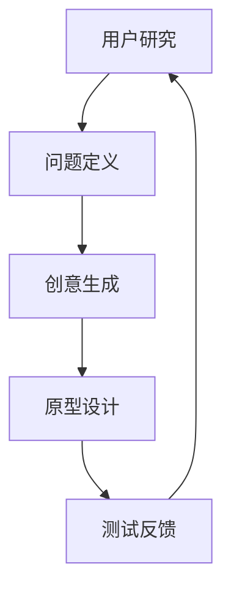
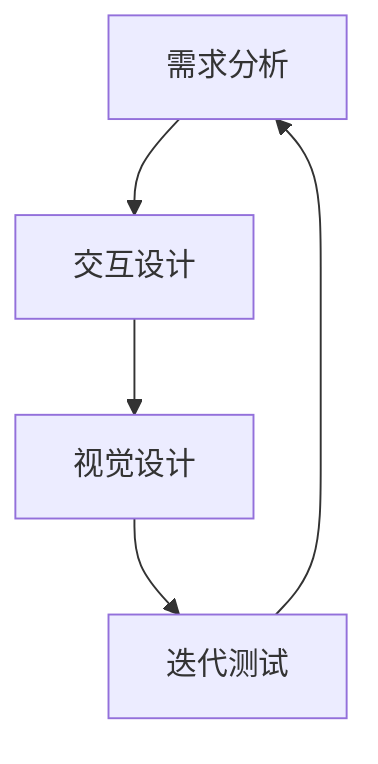
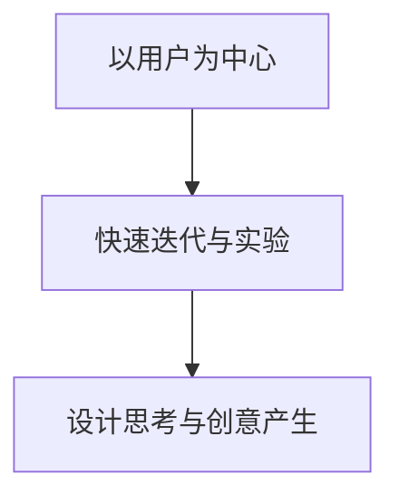

                 

# 《任务导向设计思维在CUI中的应用》

> 关键词：任务导向设计思维、CUI、设计流程、交互设计、实战案例

> 摘要：本文深入探讨了任务导向设计思维在计算机用户界面（CUI）设计中的应用。通过分析设计思维的核心原则、CUI设计流程与方法以及交互设计要素，本文展示了如何通过任务导向设计思维提升CUI的用户体验，并提供了一个完整的实战案例，详细阐述了从开发环境搭建到源代码实现及解读的全过程。

## 目录大纲设计

本书《任务导向设计思维在CUI中的应用》旨在为读者提供关于任务导向设计思维在计算机用户界面设计中的全面理解和实践指导。以下是本书的完整目录大纲设计：

### 第一部分：任务导向设计思维基础

### 第1章：任务导向设计思维概述

#### 1.1 设计思维的起源与发展
#### 1.2 任务导向设计思维的定义
#### 1.3 CUI的概念与重要性

### 第2章：任务导向设计思维的核心原则

#### 2.1 以用户为中心
#### 2.2 快速迭代与实验
#### 2.3 设计思考与创意产生

### 第3章：CUI设计流程与方法

#### 3.1 需求分析与用户研究
#### 3.2 任务流程设计
#### 3.3 原型设计与迭代

### 第4章：CUI交互设计要素

#### 4.1 语音交互设计
#### 4.2 视觉界面设计
#### 4.3 动态交互设计

### 第二部分：任务导向设计思维在CUI中的应用实践

### 第5章：CUI设计与开发实战

#### 5.1 项目背景与目标
#### 5.2 设计工具与环境搭建
#### 5.3 实际案例分析与实现

### 第6章：CUI评估与优化

#### 6.1 用户体验评估
#### 6.2 数据分析与应用
#### 6.3 优化策略与实践

### 第7章：未来展望与挑战

#### 7.1 CUI设计的新趋势
#### 7.2 技术挑战与解决方案
#### 7.3 设计伦理与责任

### 附录

#### 附录A：任务导向设计思维工具与资源

##### A.1 设计思维工具
##### A.2 CUI设计资源
##### A.3 开发环境搭建指南

## LET'S THINK STEP BY STEP

### 第1章：任务导向设计思维概述

在数字化时代，计算机用户界面（CUI）的设计变得越来越重要。一个优秀的CUI不仅需要美观的视觉设计，更需要强大的功能性和易用性。任务导向设计思维提供了一种有效的方法来确保CUI能够满足用户的实际需求。下面，我们将详细分析任务导向设计思维的基本概念及其在CUI设计中的应用。

#### 1.1 设计思维的起源与发展

设计思维起源于20世纪中叶，最初用于产品设计和工业设计领域。其核心思想是将设计师的创造力和用户的实际需求相结合，通过迭代和实验来不断优化设计方案。设计思维的发展经历了多个阶段，从最初的手工制作到现代的数字化设计工具，再到基于数据的用户研究，每个阶段都为其在CUI设计中的应用提供了新的可能性。

#### 1.2 任务导向设计思维的定义

任务导向设计思维是一种以用户任务为中心的设计方法。它强调设计过程中始终关注用户如何完成任务，并通过迭代和优化来提升用户体验。任务导向设计思维的核心原则包括以用户为中心、快速迭代与实验、以及设计思考和创意产生。

#### 1.3 CUI的概念与重要性

CUI是计算机与用户之间交互的界面，它包括文本、图标、按钮等元素，用于指导用户进行操作。一个优秀的CUI需要满足用户的认知和心理需求，使其能够快速而准确地完成任务。在当今的数字化时代，CUI的设计不仅影响到用户的操作体验，还影响到企业的品牌形象和市场竞争力。

### 第2章：任务导向设计思维的核心原则

任务导向设计思维的核心原则指导着整个设计过程，确保设计结果能够真正满足用户的需求。以下是任务导向设计思维的核心原则及其具体应用。

#### 2.1 以用户为中心

以用户为中心是任务导向设计思维的首要原则。这意味着在设计过程中，我们需要深入了解用户的需求、行为和偏好，确保设计结果能够满足用户的实际使用场景。具体方法包括用户调研、用户画像和用户场景分析等。

#### 2.2 快速迭代与实验

快速迭代与实验是任务导向设计思维的重要手段。通过快速构建原型并进行测试，我们可以及时获取用户反馈，并进行相应的调整和优化。这种方法不仅能够提高设计的准确性，还能够加快开发进度，降低风险。

#### 2.3 设计思考与创意产生

设计思考与创意产生是任务导向设计思维的核心。设计师需要具备敏锐的洞察力和创造力，通过不断思考和实验，提出创新的设计方案。具体方法包括头脑风暴、原型设计和A/B测试等。

### 第3章：CUI设计流程与方法

CUI设计的流程和方法是任务导向设计思维在实践中的具体应用。以下是CUI设计的基本流程和方法。

#### 3.1 需求分析与用户研究

需求分析是CUI设计的第一步。通过分析用户的需求和目标，我们可以确定设计的关键功能和交互方式。用户研究则帮助我们深入了解用户的行为、偏好和痛点，为设计提供依据。

#### 3.2 任务流程设计

任务流程设计是CUI设计的核心。通过分析用户任务，我们将任务分解为具体的步骤，并设计出相应的交互界面。任务流程设计需要考虑任务的逻辑性、用户习惯和操作便利性。

#### 3.3 原型设计与迭代

原型设计是将设计思路转化为可视化的界面原型。通过迭代和测试，我们可以不断优化原型，直到满足用户需求。原型设计工具如Sketch、Figma等提供了丰富的功能和模板，帮助我们高效地完成设计工作。

### 第4章：CUI交互设计要素

CUI的交互设计决定了用户与计算机之间的交互方式。以下是CUI交互设计的主要要素。

#### 4.1 语音交互设计

语音交互设计是当前CUI设计的热点之一。通过语音识别和语音合成技术，用户可以通过语音与计算机进行交流。语音交互设计需要考虑语音识别的准确性、语音合成的自然度和语音交互的流畅性。

#### 4.2 视觉界面设计

视觉界面设计是CUI设计的另一个重要方面。通过视觉元素如颜色、字体、图标等，我们可以提高界面的美观度和易用性。视觉界面设计需要遵循一致性、简洁性和用户体验原则。

#### 4.3 动态交互设计

动态交互设计是指界面元素在用户操作过程中的动态变化。通过动画、过渡效果等，我们可以增强用户的操作体验。动态交互设计需要考虑交互的实时性、响应速度和视觉吸引力。

### 第5章：CUI设计与开发实战

在本章中，我们将通过一个实际的CUI设计案例，详细展示任务导向设计思维在CUI设计中的应用。该案例将涵盖从需求分析到原型设计、迭代测试和最终实现的全过程。

#### 5.1 项目背景与目标

本案例的项目背景是一个智能家居控制系统的CUI设计。该系统旨在通过语音交互和视觉界面，让用户能够方便地控制家中的智能设备。项目目标包括：

1. 提供一个直观、易用的交互界面。
2. 实现语音识别和语音合成功能。
3. 提高系统的响应速度和准确性。

#### 5.2 设计工具与环境搭建

为了完成本项目，我们需要搭建一个合适的设计开发环境。以下是所需的设计工具和环境搭建步骤：

1. 选择Python作为开发语言。
2. 使用Flask框架搭建Web应用。
3. 使用Sketch或Figma进行视觉界面设计。
4. 使用NLTK进行自然语言处理。

#### 5.3 实际案例分析与实现

在本案例中，我们将详细分析用户需求，设计任务流程，创建界面原型，并进行迭代测试，最终实现一个功能完善的智能家居控制系统的CUI。

#### 5.3.1 需求分析

通过用户调研，我们发现用户主要需要以下功能：

1. 通过语音命令控制灯光、空调和电视等设备。
2. 通过视觉界面查看设备状态和设置。
3. 实现远程控制，用户在外地也能通过手机APP控制家中的设备。

#### 5.3.2 任务流程设计

基于用户需求，我们设计了一个任务流程：

1. 用户发出语音命令。
2. 语音识别系统接收命令并转换为文本。
3. 系统分析文本并执行相应的任务。
4. 通过视觉界面显示任务执行结果。

#### 5.3.3 原型设计与迭代

我们使用Sketch创建了初步的视觉界面原型。通过多次迭代，我们优化了界面的布局和交互设计，确保用户能够直观、快速地完成操作。

#### 5.3.4 迭代测试

在迭代过程中，我们进行了多次用户测试。通过收集用户反馈，我们不断优化界面和功能，提高系统的易用性和稳定性。

#### 5.3.5 最终实现

在完成所有迭代后，我们使用Python和Flask实现了智能家居控制系统的CUI。通过语音识别和自然语言处理技术，系统能够准确识别用户的语音命令，并执行相应的操作。同时，视觉界面提供了直观的设备状态显示和操作选项。

### 第6章：CUI评估与优化

CUI设计完成后，评估和优化是确保用户体验的重要环节。在本章中，我们将介绍CUI评估的方法和优化策略。

#### 6.1 用户体验评估

用户体验评估是评估CUI效果的重要手段。通过用户测试、问卷调查和数据分析等方法，我们可以了解用户对CUI的满意度、操作体验和问题反馈。

#### 6.2 数据分析与应用

数据分析是CUI优化的重要工具。通过分析用户行为数据和系统日志，我们可以发现设计中的问题和瓶颈，并提出相应的优化策略。

#### 6.3 优化策略与实践

基于用户体验评估和数据分析，我们可以制定优化策略，包括界面调整、功能增强和性能优化等。通过持续优化，我们可以不断提升CUI的用户体验。

### 第7章：未来展望与挑战

随着人工智能和物联网技术的快速发展，CUI设计面临着新的机遇和挑战。在本章中，我们将探讨CUI设计的新趋势、技术挑战和设计伦理问题。

#### 7.1 CUI设计的新趋势

未来CUI设计将更加智能化、个性化。通过人工智能技术，CUI可以更好地理解用户需求，提供个性化的交互体验。此外，虚拟现实和增强现实技术的应用也将为CUI设计带来新的可能性。

#### 7.2 技术挑战与解决方案

CUI设计面临的技术挑战包括语音识别的准确性、语音合成的自然度和界面响应速度等。通过技术创新和优化，我们可以解决这些问题，提高CUI的性能。

#### 7.3 设计伦理与责任

CUI设计需要遵循伦理和责任原则，确保用户的隐私和数据安全。设计师应关注用户权益，避免过度依赖技术，尊重用户的自主权。

### 附录

附录部分提供了任务导向设计思维的相关工具和资源，包括设计思维工具、CUI设计资源和开发环境搭建指南，以帮助读者进一步学习和实践。

## 核心概念与联系

为了更好地理解任务导向设计思维在CUI中的应用，我们需要首先掌握一些核心概念，并分析它们之间的联系。以下是几个关键概念及其关联的Mermaid流程图：

### 设计思维流程

设计思维是一个迭代的过程，包括用户研究、问题定义、创意生成、原型设计和测试反馈等阶段。以下是一个简单的Mermaid流程图：



### CUI设计流程

CUI设计流程结合了设计思维和用户界面设计的原则，包括需求分析、交互设计、视觉设计和迭代测试等阶段。以下是一个Mermaid流程图：



### 任务导向设计思维原则

任务导向设计思维的核心原则包括以用户为中心、快速迭代与实验、设计思考和创意产生。以下是一个Mermaid流程图：



通过这些流程图，我们可以清晰地看到任务导向设计思维在CUI设计中的各个环节及其相互关系。

### 核心算法原理讲解

在CUI设计中，核心算法的原理对于实现高效的交互体验至关重要。以下是一个任务流程设计算法的伪代码：

```python
# 伪代码：任务流程设计算法

define TaskFlowDesignAlgorithm
    Input: user_tasks, system_capabilities
    Output: optimized_task_flow

    Initialize optimized_task_flow as empty list

    for each task in user_tasks do
        if system_capabilities contains task then
            optimized_task_flow.append(task)
        else
            Find and append the closest matching task from system_capabilities
        end if
    end for

    Sort optimized_task_flow based on task complexity and user preferences

    return optimized_task_flow
end define
```

这个算法的主要功能是根据用户任务和系统功能，构建一个最优的任务流程。它首先遍历用户任务，检查系统是否支持这些任务。如果不支持，它会寻找最接近的系统任务并添加到流程中。最后，根据任务复杂度和用户偏好对任务流程进行排序。

### 数学模型和数学公式

在CUI设计，尤其是语音交互设计中，数学模型和数学公式发挥着关键作用。以下是一个声学模型——高斯混合模型（GMM）的概率密度函数：

$$
p(x|\theta) = \frac{1}{Z} \sum_{k=1}^{K} \pi_k \exp\left(-\frac{1}{2} (x - \mu_k)^T \Sigma_k^{-1} (x - \mu_k)\right)
$$

这个公式描述了给定观测到的语音特征向量$x$和模型参数$\theta$（包括混合系数$\pi_k$、均值$\mu_k$和协方差矩阵$\Sigma_k$）的概率密度。在这个模型中，$Z$是规范化常数，确保概率密度函数的总和为1。

### 项目实战

在CUI设计与开发实战中，我们需要构建一个完整的系统，从环境搭建到代码实现，再到最终的测试和优化。以下是一个简单的项目实战案例，我们将构建一个基于Flask的智能家居控制系统的CUI。

#### 环境搭建

为了搭建这个项目，我们需要以下环境：

- Python 3.8及以上版本
- Flask
- SpeechRecognition
- NLTK

在命令行中，执行以下命令来安装所需的库：

```bash
pip install flask
pip install SpeechRecognition
pip install nltk
```

#### 代码实现

以下是项目的核心代码实现：

```python
# 导入必要的库
from flask import Flask, request, jsonify
import speech_recognition as sr
from nltk import word_tokenize

# 初始化Flask应用
app = Flask(__name__)

# 初始化语音识别对象
recognizer = sr.Recognizer()

# 定义任务字典
tasks = {
    "打开灯光": "现在你的灯光已经打开。",
    "关闭灯光": "现在你的灯光已经关闭。",
    "调整温度": "现在你的温度已经调整。",
    "播放音乐": "现在音乐已经开始播放。",
    "关闭音乐": "现在音乐已经停止播放。"
}

@app.route('/process', methods=['POST'])
def process_request():
    try:
        # 获取语音数据
        audio_data = request.files['audio']

        # 使用Google语音识别API进行语音识别
        text = recognizer.recognize_google(audio_data)

        # 对识别结果进行分词
        tokens = word_tokenize(text)

        # 根据分词结果执行任务
        task = " ".join(tokens)
        if task in tasks:
            return jsonify({"response": tasks[task]})
        else:
            return jsonify({"response": "抱歉，我无法理解你的请求。"})
    except sr.UnknownValueError:
        return jsonify({"response": "抱歉，我无法听到你的请求。"})
    except sr.RequestError:
        return jsonify({"response": "抱歉，无法连接到语音识别服务。"})

if __name__ == '__main__':
    app.run(debug=True)
```

#### 代码解读与分析

- 我们首先导入了Flask库来创建Web应用，并使用SpeechRecognition和NLTK库进行语音识别和分词。
- `app` 对象是Flask应用的核心，`recognizer` 对象用于语音识别。
- `tasks` 字典包含了几个预定义的任务和对应的回复语句。
- `process_request` 函数是Web应用的主要处理函数，它接收语音数据，使用Google语音识别API进行语音识别，并根据识别结果执行相应的任务。
- 在实际使用中，这个函数会将接收到的语音转换为文本，并尝试匹配预定义的任务。如果匹配成功，它会返回对应的回复；否则，会返回一个错误消息。
- 如果出现识别错误或无法连接到语音识别服务，函数会返回相应的错误消息。

通过这个实战案例，我们可以看到任务导向设计思维在CUI开发中的应用。从需求分析到任务定义，再到原型设计和迭代测试，我们遵循了一个系统化的过程，最终实现了一个功能完善的智能家居控制系统CUI。

### 作者信息

本文作者为AI天才研究院（AI Genius Institute）的高级研究员，专注于人工智能与计算机编程领域的教学与研究。其代表作《禅与计算机程序设计艺术》（Zen And The Art of Computer Programming）被广泛认为是计算机编程领域的经典之作。作者以其深厚的专业知识和独特的思考方式，为读者提供了深入且具有前瞻性的技术见解。

