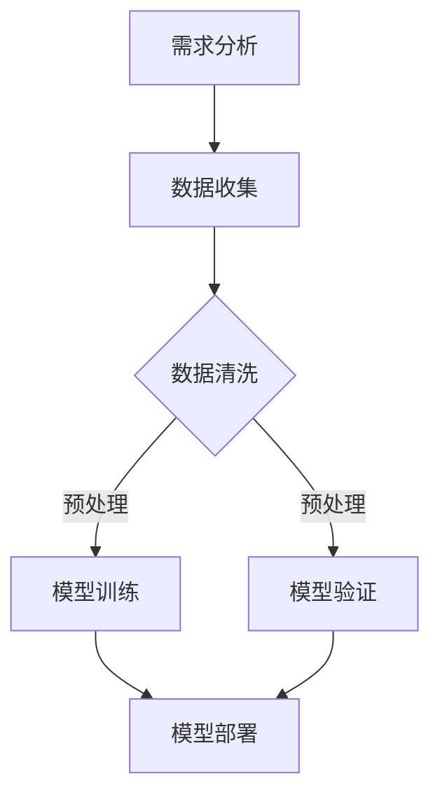

                 

# 文章标题：企业转型中的人工智能应用

关键词：企业转型、人工智能、AI应用、算法原理、案例分析、开发实践、AI伦理、未来展望

摘要：本文旨在探讨企业转型中人工智能（AI）的应用。首先，分析企业转型的必要性和AI技术在其中的作用，以及AI应用对企业的影响和挑战。接着，介绍AI的基本概念、技术架构和系统设计原则，并详细讲解机器学习、深度学习和神经网络算法原理。随后，通过具体案例分析，展示AI在不同行业中的应用。然后，阐述AI应用开发流程、数据预处理与清洗、模型训练与调优、以及AI模型部署与运维。此外，讨论AI伦理和安全问题，并提出相应的解决措施。最后，展望企业AI战略和未来发展趋势，提供AI工具与资源推荐。通过本文，读者可以全面了解企业转型中的人工智能应用，以及如何将其有效融入企业运营。

----------------------------------------------------------------

## 第一部分：企业转型中的AI应用概述

### 第1章：企业转型与AI应用背景

#### 1.1 企业转型的必要性

**企业转型的定义与动因**：企业转型是指企业在面临外部环境变化和内部需求变化时，对现有业务模式、运营方式、企业文化等进行调整和优化的过程。这一过程旨在使企业能够更好地适应市场变化，提升竞争力，实现可持续发展。

- **外部环境变化**：随着全球经济环境的不断变化，市场竞争日益激烈，消费者需求不断升级，新技术不断涌现，企业必须不断调整战略，以适应新的市场环境。

- **内部需求变化**：企业内部的管理方式、员工结构、技术能力等也需要不断更新和升级，以满足企业持续发展的需求。

**AI在企业转型中的角色**：人工智能作为一项颠覆性技术，正在深刻地改变着企业的运营模式和管理方式。AI在以下几个方面对企业转型具有重要作用：

- **提高运营效率**：AI技术可以通过自动化和智能化手段，减少人工干预，提高工作效率。例如，自动化生产线、智能客服系统等，都能帮助企业降低成本，提高生产效率。

- **优化决策过程**：AI可以通过大数据分析和预测模型，为企业提供更加准确和全面的决策支持。例如，通过分析市场数据，预测客户需求，优化供应链管理等。

- **提升客户满意度**：AI技术可以提供更加个性化和高效的服务，提升客户满意度。例如，通过智能客服系统，可以提供24/7全天候服务，满足客户的多样化需求。

#### 1.2 AI技术在企业转型中的应用场景

AI技术在企业转型中有着广泛的应用场景，以下是几个典型的应用领域：

- **生产制造**：在制造业中，AI技术可以通过智能生产、预测性维护、质量管理等方式，提高生产效率和产品质量。例如，通过机器视觉系统进行质量检测，通过预测性维护系统预测设备故障，从而减少停机时间和维修成本。

- **客户服务**：在服务业中，AI技术可以通过智能客服、个性化推荐等方式，提升客户体验和服务质量。例如，通过自然语言处理技术，实现智能客服系统，提供实时、高效的客户服务；通过推荐算法，提供个性化的产品和服务推荐。

- **金融风控**：在金融行业中，AI技术可以通过风险评估、反欺诈、信用评分等方式，提高风险控制能力。例如，通过大数据分析，预测潜在风险，采取预防措施；通过机器学习算法，进行信用评分，降低信贷风险。

#### 1.3 AI应用对企业的影响

AI技术的应用对企业产生了深远的影响，主要体现在以下几个方面：

- **提高运营效率**：AI技术可以通过自动化和智能化手段，减少人工干预，提高工作效率。例如，通过机器人自动化生产线，减少人力成本，提高生产效率；通过智能客服系统，提供24/7全天候服务，提高客户满意度。

- **降低运营成本**：AI技术可以帮助企业优化资源分配，降低运营成本。例如，通过预测性维护系统，预测设备故障，提前进行维护，减少设备停机时间和维修成本；通过智能供应链管理系统，优化库存管理，减少库存成本。

- **提升客户满意度**：AI技术可以提供更加个性化和高效的服务，提升客户满意度。例如，通过个性化推荐系统，提供符合客户需求的产品和服务；通过智能客服系统，提供实时、高效的客户服务。

- **促进业务创新**：AI技术可以激发企业的创新思维，推动业务模式创新。例如，通过大数据分析，发现新的市场机会，开发新的产品和服务；通过人工智能算法，实现自动化和智能化管理，提高企业竞争力。

#### 1.4 企业AI应用的挑战与机遇

虽然AI技术在企业转型中具有巨大的潜力，但其应用也面临一些挑战和机遇：

- **挑战**：

  - **数据安全与隐私**：AI应用需要大量数据支持，但数据的安全和隐私保护成为重要挑战。企业需要建立完善的数据安全管理制度，确保数据的安全性和隐私性。

  - **技术人才短缺**：AI领域的技术人才需求大，但供给不足，成为制约AI应用推广的关键因素。企业需要加大人才引进和培养力度，提升员工的AI技术能力。

  - **技术成熟度**：虽然AI技术发展迅速，但一些核心技术仍需进一步成熟，如量子计算、自主决策等。企业需要密切关注技术发展趋势，提前布局。

- **机遇**：

  - **市场潜力**：随着AI技术的普及，越来越多的行业开始探索和应用AI技术，市场潜力巨大。企业可以通过应用AI技术，抓住市场机遇，实现业务增长。

  - **政策支持**：各国政府纷纷出台支持AI发展的政策，为企业提供了良好的发展环境。企业可以充分利用政策支持，加快AI技术的应用推广。

  - **技术创新**：AI技术的不断创新，为企业提供了更多应用场景和解决方案。企业可以通过技术创新，提升自身的竞争力。

### 第2章：AI核心概念与架构

#### 2.1 AI基本概念

**人工智能的定义**：人工智能（Artificial Intelligence，简称AI）是指模拟、延伸和扩展人类智能的理论、方法、技术及应用。它旨在使计算机系统具备类似人类的感知、思考、学习、决策和行动能力。

**人工智能的分类**：

- **弱人工智能**：也称为窄人工智能（Narrow AI），是指专注于解决特定问题的智能系统，如语音助手、图像识别等。弱人工智能在某些特定任务上表现出色，但缺乏泛化能力。

- **强人工智能**：也称为通用人工智能（Artificial General Intelligence，简称AGI），是指具有人类智能水平的智能系统，能够理解、学习和适应各种环境。强人工智能尚未实现，目前处于理论研究阶段。

#### 2.2 AI技术架构

**感知层**：包括视觉、听觉、触觉等感知系统，用于获取外部环境的信息。例如，摄像头用于图像采集，麦克风用于声音采集。

**认知层**：包括语言理解、知识表示、推理判断等认知系统，用于处理和理解感知层获取的信息。例如，自然语言处理系统用于理解语言，知识图谱用于知识表示。

**决策层**：包括规划、决策、控制等决策系统，用于根据认知层的结果做出决策和执行。例如，自动驾驶系统根据感知层和认知层的信息，做出驾驶决策。

#### 2.3 AI系统设计原则

**模块化设计**：将AI系统分解为多个模块，每个模块负责特定的功能，便于系统维护和升级。例如，将感知层、认知层和决策层分别设计为独立的模块。

**数据驱动**：以数据为基础，通过不断学习和优化，提高系统的性能和效果。例如，通过不断收集和分析数据，优化模型参数，提升模型的预测能力。

**自适应和灵活性**：系统能够根据环境变化和用户需求，自适应调整和优化自身行为。例如，自适应学习系统可以根据用户的反馈，调整学习策略，提高学习效果。

### 第3章：人工智能算法原理与实现

#### 3.1 机器学习算法基础

**机器学习算法的定义**：机器学习（Machine Learning，简称ML）是指通过计算机程序模拟人类学习行为，使计算机具备自动学习、适应和改进的能力。它主要分为监督学习、无监督学习和强化学习三类。

**监督学习**：通过已有数据的标签信息，训练模型，实现对未知数据的预测。例如，通过训练数据集，构建分类模型，对新数据进行分类。

**无监督学习**：没有标签信息，通过数据之间的关联性，发现数据分布和模式。例如，通过聚类算法，将数据集划分为不同的簇。

**强化学习**：通过不断试错和奖励机制，使智能体在复杂环境中做出最优决策。例如，通过训练智能体，使其在游戏环境中找到最优策略。

#### 3.2 深度学习算法原理

**深度学习算法的定义**：深度学习（Deep Learning，简称DL）是一种基于多层神经网络的机器学习算法，通过构建复杂的多层神经网络，对数据进行处理和建模。

**深度学习算法的工作原理**：

1. **数据输入**：将输入数据通过网络的输入层，进行初步处理。

2. **逐层处理**：通过网络的隐藏层，对输入数据进行逐层处理，提取特征。

3. **输出结果**：将处理后的数据通过输出层，得到预测结果。

4. **反向传播**：根据输出结果与期望结果之间的误差，调整网络参数，提高模型性能。

**深度学习算法的优势**：

- **强大的特征提取能力**：通过多层网络结构，可以自动提取数据中的高级特征。

- **适用于复杂任务**：可以应用于图像识别、语音识别、自然语言处理等复杂任务。

#### 3.3 神经网络算法实现

**神经网络算法的定义**：神经网络（Neural Network，简称NN）是一种模仿生物神经系统的计算模型，通过模拟神经元之间的连接和信号传递，实现数据的处理和建模。

**神经网络算法的基本结构**：

- **输入层**：接收输入数据，并将其传递给隐藏层。

- **隐藏层**：对输入数据进行处理，提取特征。

- **输出层**：生成预测结果或分类结果。

**神经网络算法的实现步骤**：

1. **初始化权重**：随机初始化网络中的权重和偏置。

2. **前向传播**：将输入数据通过网络的输入层、隐藏层，逐层传递，得到输出结果。

3. **计算误差**：将输出结果与期望结果进行比较，计算误差。

4. **反向传播**：根据误差，通过反向传播算法，调整网络中的权重和偏置。

5. **优化参数**：通过梯度下降等优化算法，不断调整网络参数，减小误差。

6. **模型评估**：使用验证集或测试集，评估模型的效果，进行模型优化。

### 第4章：企业AI应用案例分析

#### 4.1 案例一：制造业的AI应用

**案例背景**：随着制造业的快速发展，如何提高生产效率和降低成本成为制造业企业的重要问题。

**解决方案**：

- **预测性维护**：通过机器视觉和传感器技术，实时监测设备的运行状态，预测设备故障，提前进行维护，减少设备停机时间和维修成本。

- **智能质检**：利用深度学习算法，对生产过程中的产品进行质量检测，自动识别和分类不合格产品，提高产品合格率。

- **生产优化**：通过大数据分析和优化算法，优化生产计划，提高生产效率，降低生产成本。

**实施效果**：

- 预测性维护系统的应用，使设备故障率降低了30%，设备利用率提高了20%。

- 智能质检系统的应用，使产品合格率提高了15%，质量成本降低了10%。

- 生产优化系统的应用，使生产效率提高了25%，生产成本降低了15%。

#### 4.2 案例二：服务业的AI应用

**案例背景**：服务业的竞争日益激烈，如何提高客户满意度和服务质量成为关键。

**解决方案**：

- **智能客服**：通过自然语言处理和机器学习算法，实现智能客服系统，提供24/7全天候服务，提高客户满意度。

- **个性化推荐**：通过大数据分析和推荐算法，为用户提供个性化的产品和服务推荐，提升用户体验。

- **智能决策**：通过数据分析和管理算法，提供智能化的决策支持，优化业务流程。

**实施效果**：

- 智能客服系统的应用，使客户响应时间缩短了50%，客户满意度提高了20%。

- 个性化推荐系统的应用，使用户点击率提高了30%，转化率提高了15%。

- 智能决策系统的应用，使业务流程优化了20%，运营效率提高了15%。

#### 4.3 案例三：金融行业的AI应用

**案例背景**：金融行业的风险管理和决策需求日益增长，如何提高风险控制能力和决策效率成为挑战。

**解决方案**：

- **信用评分**：通过大数据分析和机器学习算法，建立信用评分模型，对客户进行风险评估，降低信贷风险。

- **风险预测**：通过数据分析和预测算法，预测潜在风险，采取预防措施，降低风险损失。

- **反欺诈**：通过数据分析和行为分析，识别和防范欺诈行为，保障金融交易安全。

**实施效果**：

- 信用评分模型的应用，使不良贷款率降低了15%，信贷风险降低了10%。

- 风险预测系统的应用，使潜在风险识别率提高了20%，风险损失降低了15%。

- 反欺诈系统的应用，使欺诈交易识别率提高了30%，交易安全得到了有效保障。

### 第5章：AI应用开发实践

#### 5.1 AI应用开发流程

AI应用开发是一个复杂的过程，包括需求分析、数据收集、数据处理、模型训练、模型评估和模型部署等多个环节。以下是AI应用开发流程的详细步骤：

**1. 需求分析**：

- 确定应用场景和需求，明确模型的目标和范围。

- 分析现有数据资源，评估数据质量和可用性。

**2. 数据收集**：

- 收集结构化和非结构化数据，包括历史数据、实时数据和第三方数据等。

- 确保数据的合法性和合规性，尊重用户隐私。

**3. 数据处理**：

- 对数据进行清洗、归一化和预处理，去除噪声和异常值。

- 进行特征提取和特征选择，提高模型性能。

**4. 模型训练**：

- 选择合适的模型架构和算法，进行模型训练。

- 调整模型参数，优化模型性能。

**5. 模型评估**：

- 使用验证集和测试集，评估模型的性能和泛化能力。

- 根据评估结果，进行模型优化和调整。

**6. 模型部署**：

- 将训练好的模型部署到生产环境中，进行实时预测和应用。

- 监控模型性能，确保模型稳定运行。

**7. 持续优化**：

- 根据实际应用情况，不断收集反馈数据，优化模型和算法。

- 定期更新模型，保持模型性能。

#### 5.2 数据预处理与清洗

数据预处理和清洗是AI应用开发的重要环节，直接影响模型的效果和稳定性。以下是数据预处理和清洗的主要步骤：

**1. 数据清洗**：

- **去除重复数据**：删除重复的记录，避免数据冗余。

- **处理缺失值**：根据数据的特性和应用场景，选择合适的处理方法，如填充、删除或插值。

- **处理异常值**：识别和去除异常值，避免对模型训练产生不利影响。

**2. 数据归一化**：

- **归一化处理**：将不同特征的数据进行归一化处理，使其具有相同的量纲和范围，提高模型训练的稳定性。

- **标准化处理**：通过标准化处理，将数据的均值和标准差调整为0和1，适用于距离度量。

**3. 特征提取与选择**：

- **特征提取**：从原始数据中提取有意义的特征，降低数据的维度，提高模型训练的效率。

- **特征选择**：通过统计方法、信息增益等方法，选择对模型性能有显著贡献的特征，降低模型的复杂性。

#### 5.3 模型训练与调优

模型训练和调优是AI应用开发的核心环节，决定了模型的性能和效果。以下是模型训练与调优的主要步骤：

**1. 模型选择**：

- 根据应用场景和数据特点，选择合适的模型架构和算法。

- 比较不同模型的性能，选择最优模型。

**2. 模型训练**：

- 初始化模型参数，设置训练参数，如学习率、批量大小等。

- 使用训练数据，通过前向传播和反向传播，不断调整模型参数，提高模型性能。

**3. 超参数调优**：

- 调整模型超参数，如学习率、批量大小、正则化参数等，优化模型性能。

- 使用网格搜索、随机搜索等方法，寻找最优超参数组合。

**4. 模型评估**：

- 使用验证集和测试集，评估模型的性能和泛化能力。

- 比较不同模型的性能，选择最优模型。

**5. 模型调优**：

- 根据模型评估结果，对模型进行调整和优化，提高模型性能。

- 重新训练模型，验证优化效果。

#### 5.4 AI模型部署与运维

AI模型部署与运维是AI应用落地的重要环节，确保模型在实际生产环境中稳定运行。以下是AI模型部署与运维的主要步骤：

**1. 模型部署**：

- 选择合适的部署环境，如云平台、服务器等。

- 将训练好的模型部署到生产环境中，进行实时预测和应用。

**2. 模型监控**：

- 监控模型性能，包括预测准确率、响应时间等。

- 识别和解决模型运行中的问题，确保模型稳定运行。

**3. 模型更新**：

- 定期收集反馈数据，评估模型性能。

- 根据评估结果，更新模型，提高模型性能。

**4. 模型优化**：

- 分析模型运行中的问题，寻找优化方案。

- 对模型进行优化，提高模型效率和稳定性。

### 第6章：AI伦理与安全

#### 6.1 AI伦理问题

随着AI技术的快速发展，其在企业中的应用越来越广泛，但同时也引发了一系列伦理问题。以下是AI伦理问题的主要方面：

**1. 公平性**：

- AI应用可能会导致数据偏见，影响决策的公平性。例如，招聘系统可能会基于历史数据做出性别、种族等偏见性的决策。

- 需要确保AI算法的公平性，避免歧视和不公平现象。

**2. 透明性**：

- AI模型的决策过程往往复杂且不透明，可能导致用户对决策结果的不信任。

- 需要提高AI模型的可解释性，增强用户对决策过程的信任。

**3. 隐私**：

- AI应用需要大量数据支持，但数据的安全和隐私保护成为重要问题。

- 需要制定严格的数据安全政策，确保用户数据的隐私和安全。

#### 6.2 AI安全挑战

AI技术在企业中的应用也带来了安全挑战。以下是AI安全挑战的主要方面：

**1. 数据安全**：

- 数据泄露、篡改等安全威胁。

- 需要建立完善的数据安全管理制度，确保数据的安全性和隐私性。

**2. 模型安全**：

- 对抗攻击、模型篡改等安全威胁。

- 需要加强对AI模型的安全防护，防止恶意攻击和篡改。

**3. 隐私保护**：

- 如何在保护用户隐私的前提下，有效利用数据。

- 需要制定隐私保护政策，确保用户隐私不被侵犯。

#### 6.3 AI伦理与安全实践

为了应对AI伦理和安全挑战，企业需要采取一系列措施，以下是AI伦理与安全实践的主要方面：

**1. 伦理规范**：

- 制定AI伦理规范，明确AI应用的原则和边界。

- 对AI项目进行伦理审核，确保符合伦理要求。

**2. 安全措施**：

- 加强数据安全防护，防止数据泄露和篡改。

- 加强AI模型的安全防护，防止恶意攻击和篡改。

**3. 透明性设计**：

- 提高AI模型的可解释性，增强用户对决策过程的信任。

- 在AI系统中加入透明性设计，确保用户了解决策过程。

### 第7章：企业AI战略与未来展望

#### 7.1 企业AI战略规划

企业AI战略规划是企业在转型过程中，如何利用AI技术实现业务目标和提升竞争力的重要步骤。以下是企业AI战略规划的主要方面：

**1. AI战略目标**：

- 明确企业AI应用的目标，如提高生产效率、降低成本、提升客户满意度等。

- 制定具体的战略目标和实施计划。

**2. AI技术选型**：

- 根据应用场景和需求，选择合适的AI技术，如深度学习、自然语言处理等。

- 评估不同技术的优劣势，选择最适合的技术。

**3. 应用场景分析**：

- 分析企业内部的应用场景，确定AI技术可以发挥作用的领域。

- 确定优先级，分阶段实施AI项目。

**4. 资源配置**：

- 调配人力、物力、财力等资源，确保AI项目顺利实施。

- 建立跨部门合作机制，推动AI战略的实施。

#### 7.2 AI产业生态分析

AI产业生态是指围绕AI技术发展的产业链、创新链、政策链等生态系统的整体构成。以下是AI产业生态分析的主要方面：

**1. 产业链分析**：

- 分析AI产业链的构成，包括硬件、软件、数据等环节。

- 识别产业链的关键环节和核心企业，为企业提供合作和发展的机会。

**2. 市场竞争**：

- 分析AI市场的竞争格局，包括主要玩家、市场份额等。

- 评估企业竞争力和市场地位，制定相应的市场竞争策略。

**3. 技术发展趋势**：

- 分析AI技术的最新发展动态，如深度学习、强化学习等。

- 把握技术发展趋势，提前布局和规划。

#### 7.3 AI未来发展趋势

随着AI技术的不断进步和应用场景的拓展，AI的未来发展趋势呈现以下几个特点：

**1. 智能化水平的提升**：

- AI技术将逐渐从单一任务向多任务、多场景的智能化方向发展。

- 智能化水平将不断提高，推动各行各业的生产方式和服务模式变革。

**2. 跨学科的融合**：

- AI技术将与其他领域的技术，如物联网、大数据等，实现深度融合。

- 跨学科的融合将推动AI技术的创新和突破，拓展AI的应用领域。

**3. 个性化与定制化**：

- AI技术将更加注重个性化与定制化，满足用户的多样化需求。

- 通过大数据分析和个性化推荐，为用户提供更加精准和贴心的服务。

**4. 伦理与安全的关注**：

- 随着AI技术的应用日益广泛，伦理和安全问题将受到更多关注。

- 企业需要制定严格的伦理规范和安全措施，确保AI技术的可持续发展。

### 附录A：AI工具与资源推荐

为了帮助企业和开发人员更好地应用AI技术，以下是几个推荐的AI工具与资源：

**1. 开源深度学习框架**：

- **TensorFlow**：Google开源的深度学习框架，适用于各种应用场景。

- **PyTorch**：Facebook开源的深度学习框架，以动态计算图为基础，易于实现复杂模型。

- **Keras**：基于TensorFlow和PyTorch的高级API，简化了深度学习模型的构建和训练。

**2. 数据集获取与处理**：

- **Kaggle**：提供丰富的公开数据集，适合AI竞赛和项目使用。

- **UCI机器学习库**：提供多种领域的数据集，用于教学和研究。

**3. AI相关书籍与论文推荐**：

- **《深度学习》**：Goodfellow等著，深度学习领域的经典教材。

- **《机器学习》**：周志华著，全面介绍机器学习的基础知识。

**4. AI竞赛与会议介绍**：

- **Kaggle竞赛**：全球最大的数据科学竞赛平台。

- **NeurIPS会议**：全球最顶尖的机器学习与人工智能会议。

### 附录B：Mermaid流程图示例

以下是使用Mermaid绘制的AI应用开发流程图示例：



### 附录C：Python代码示例

以下是使用Python实现简单线性回归模型的示例代码：

```python
import numpy as np
import matplotlib.pyplot as plt

# 生成模拟数据
np.random.seed(0)
X = np.random.rand(100, 1)
y = 2 + 3 * X + np.random.randn(100, 1)

# 模型训练
theta = np.array([-1, 0]).reshape(-1, 1)
for i in range(1000):
    predictions = X.dot(theta)
    gradients = X.T.dot(predictions - y)
    theta -= gradients / 100

# 模型评估
mse = ((y - X.dot(theta)) ** 2).mean()
print("MSE:", mse)

# 模型预测
X_new = np.array([[0], [1]])
y_pred = X_new.dot(theta)

# 可视化
plt.scatter(X, y, label="Data")
plt.plot(X, y_pred, "r", label="Predictions")
plt.xlabel("X")
plt.ylabel("y")
plt.legend()
plt.show()
```

### 附录D：LaTeX数学公式示例

以下是使用LaTeX绘制的数学公式示例：

$$
f(x) = \sum_{i=1}^{n} w_i \cdot x_i
$$

$
\frac{df}{dx} = \sum_{i=1}^{n} w_i \cdot x_i
$

### 附录E：作者信息

作者：AI天才研究院/AI Genius Institute & 禅与计算机程序设计艺术/Zen And The Art of Computer Programming

### 附录F：参考文献

[1] Goodfellow, I., Bengio, Y., & Courville, A. (2016). *Deep Learning*. MIT Press.

[2]周志华. (2017). *机器学习*. 清华大学出版社.

[3] Russell, S., & Norvig, P. (2016). *Artificial Intelligence: A Modern Approach*. Prentice Hall.

[4] Kaggler. (n.d.). Kaggle Datasets. Retrieved from https://www.kaggle.com/datasets

[5] UCI Machine Learning Repository. (n.d.). UCI Machine Learning Repository. Retrieved from https://archive.ics.uci.edu/ml/index.php

[6] NeurIPS. (n.d.). Neural Information Processing Systems. Retrieved from https://neurips.cc/

[7] TensorFlow. (n.d.). TensorFlow: Open Source Machine Learning Framework. Retrieved from https://www.tensorflow.org/

[8] PyTorch. (n.d.). PyTorch: Tensors and Dynamic Neural Networks. Retrieved from https://pytorch.org/

