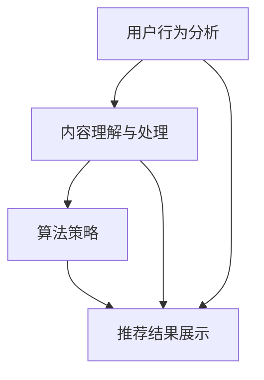
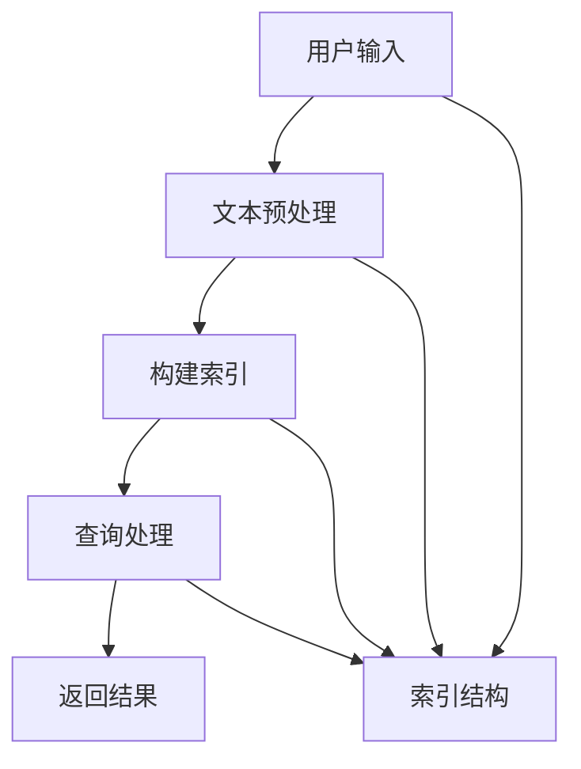
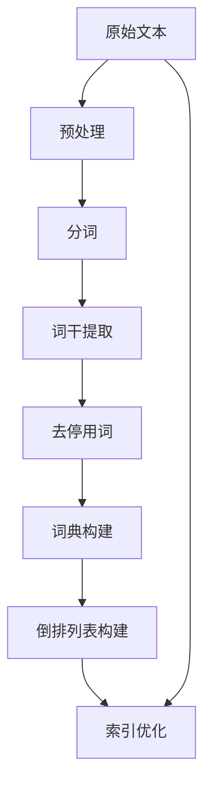
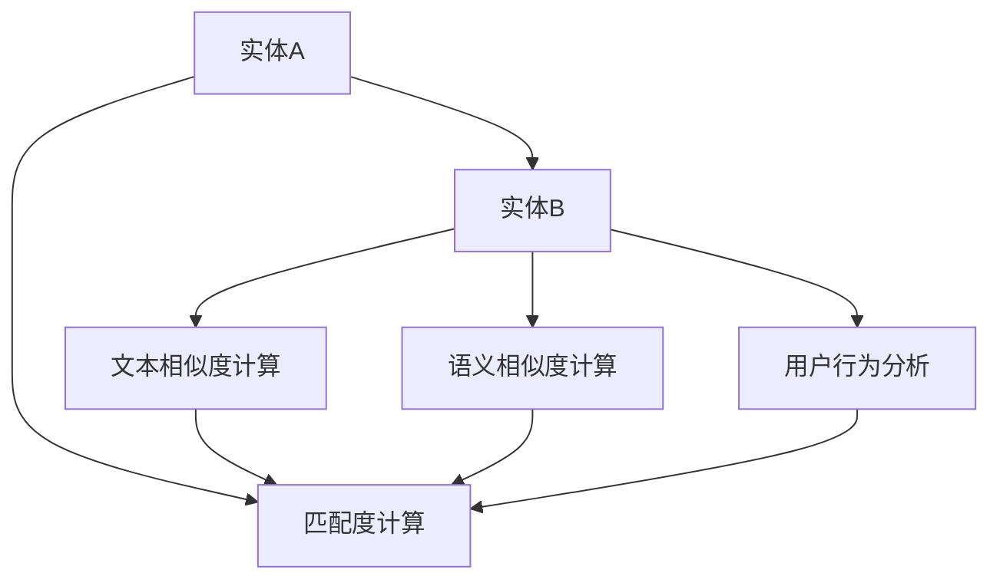
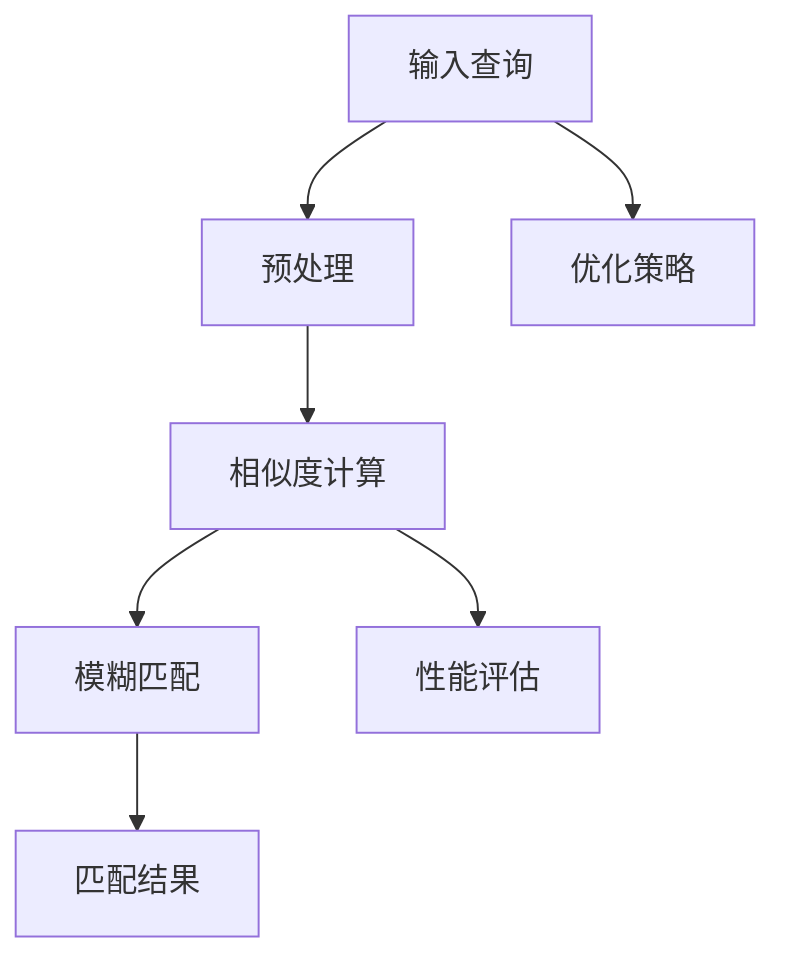
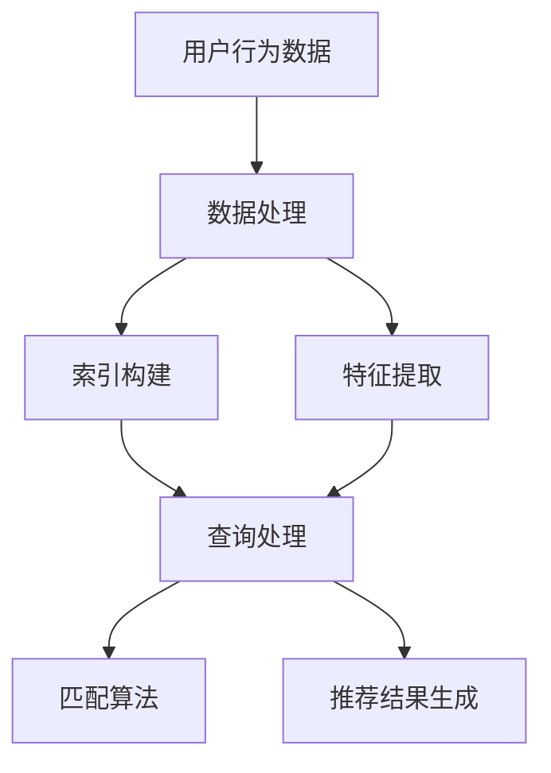

                 

### 文章标题

# 传统搜索推荐系统的索引和匹配算法

---

### 文章关键词

- 搜索推荐系统
- 索引技术
- 匹配算法
- 数据结构
- 人工智能

### 文章摘要

本文深入探讨了传统搜索推荐系统中索引和匹配算法的核心概念、原理、实现及其优化策略。通过详细分析索引的定义与作用、索引构建技术、匹配算法的基础与实现，本文旨在为读者提供一个全面而系统的理解，帮助其在实际项目中有效应用这些关键技术。文章以项目实战案例为驱动，提供了实际代码实现和详细解读，使读者能够更好地掌握和应用所学知识。本文适用于对搜索推荐系统有深入研究需求的技术人员和管理者。

---

## 第1章：引言

### 1.1 搜索推荐系统的概述

#### 搜索推荐系统的定义和重要性

搜索推荐系统是一种结合了信息检索和内容推荐的系统，其主要功能是根据用户的历史行为和偏好，为其推荐可能感兴趣的内容或服务。这种系统广泛应用于互联网各个领域，如电子商务、社交媒体、在线新闻等。其核心在于通过智能算法和大规模数据处理技术，实现个性化搜索和推荐。

搜索推荐系统的重要性体现在以下几个方面：

1. **提高用户体验**：通过个性化推荐，用户可以更快地找到感兴趣的内容，提高使用效率和满意度。
2. **增加用户黏性**：个性化推荐可以吸引用户更长时间停留在平台，增加用户黏性。
3. **提升业务价值**：推荐系统能够根据用户行为预测用户需求，从而为商家提供精准营销的机会，提高业务转化率和收益。

#### 搜索推荐系统与传统搜索系统的区别

传统搜索系统主要功能是根据用户输入的关键词，从海量的数据中检索出最相关的结果。而搜索推荐系统在此基础上，不仅考虑用户输入的关键词，还综合分析用户的历史行为、偏好和其他相关因素，提供更个性化的搜索和推荐结果。

主要区别体现在以下几个方面：

1. **数据来源**：传统搜索系统主要依赖用户输入的关键词，而推荐系统则综合用户的历史行为、浏览记录、收藏夹等信息。
2. **处理方式**：传统搜索系统主要使用关键词匹配和排序算法，而推荐系统则涉及更多的数据挖掘、机器学习和人工智能技术。
3. **结果呈现**：传统搜索系统通常呈现一系列列表形式的搜索结果，而推荐系统则更注重提供个性化的内容推荐，形式多样，如卡片、图片、视频等。

### 1.2 传统搜索推荐系统的架构

传统搜索推荐系统通常由以下几个关键模块组成：

1. **用户行为分析**：收集并分析用户在平台上的行为数据，如浏览历史、搜索记录、购买行为等。
2. **内容理解与处理**：对用户生成的内容（如评论、帖子、商品描述等）进行文本处理和语义分析，提取关键信息。
3. **算法策略**：根据用户行为分析和内容理解结果，应用相应的算法策略，生成推荐结果。
4. **推荐结果展示**：将推荐结果以用户友好的方式呈现，如推荐列表、卡片、弹窗等。

下图展示了传统搜索推荐系统的主要架构：



### 1.3 本书内容概览

本书将分为七个章节，详细探讨传统搜索推荐系统的索引和匹配算法。具体内容如下：

- **第1章**：引言，介绍搜索推荐系统的定义、重要性、与传统搜索系统的区别以及本书的架构。
- **第2章**：索引技术基础，讲解索引的定义、分类和基本原理。
- **第3章**：索引构建技术，详细分析文本预处理、倒排索引构建以及索引优化。
- **第4章**：匹配算法基础，介绍匹配算法的定义、分类和基本原理。
- **第5章**：匹配算法实现与优化，讲解相似度计算方法、模糊匹配以及匹配算法优化。
- **第6章**：推荐系统的索引与匹配，讨论推荐系统的索引和匹配策略及整体优化。
- **第7章**：实战案例分析，通过具体案例展示索引和匹配算法的实际应用。

本书旨在通过系统性的讲解和实战案例分析，帮助读者深入理解传统搜索推荐系统中的索引和匹配算法，为实际项目提供实用的技术指导。

---

## 第2章：索引技术基础

### 2.1 索引的定义与作用

#### 索引的基本概念

索引是一种数据结构，用于快速访问存储在数据库或文件系统中的数据。它通过将数据按照一定的规则组织成一种特定的格式，使得数据查询更加高效。在数据库管理系统中，索引是一种特殊的文件结构，它可以按照关键字或列的值快速检索数据记录。而在文件系统中，索引则是一种用于定位文件位置的数据结构。

索引的主要作用是加速数据的查询速度。在大型数据库或文件系统中，数据量通常非常庞大，如果直接遍历所有数据记录进行查询，将耗费大量时间和资源。通过建立索引，可以大大减少查询所需的时间，从而提高系统的性能。

#### 索引在搜索推荐系统中的作用

在搜索推荐系统中，索引技术起着至关重要的作用。以下是索引在搜索推荐系统中的一些关键作用：

1. **提高查询效率**：索引可以显著减少搜索所需的时间，特别是在处理海量数据时。例如，通过倒排索引，可以快速定位包含特定关键词的文档，从而提高全文搜索的效率。
2. **支持复杂查询**：索引支持各种复杂的查询操作，如范围查询、模糊查询等。这有助于实现更加灵活和高效的搜索功能。
3. **维护数据一致性**：索引可以确保数据的完整性，通过维护索引的一致性，可以防止数据冗余和错误。
4. **支持分布式搜索**：在分布式系统中，索引可以优化数据分片的查询效率，实现跨节点的数据检索。
5. **优化推荐结果**：在推荐系统中，索引技术可以用于快速匹配用户行为和内容特征，从而优化推荐结果的准确性和个性化程度。

### 2.2 索引的分类

索引根据不同的分类标准，可以分为多种类型。以下是几种常见的索引类型及其特点：

1. **全文索引**：
   - **定义**：全文索引是对整个文档或文本进行索引，允许对文档的任意部分进行搜索。
   - **特点**：全文索引能够实现高效的全文搜索，支持模糊查询和关键词查询。
   - **应用**：广泛应用于搜索引擎、内容管理系统和全文检索系统。

2. **结构化索引**：
   - **定义**：结构化索引是对数据库中的结构化数据进行索引，通常用于关系型数据库。
   - **特点**：结构化索引支持精确查询和快速检索，能够提高查询效率。
   - **应用**：在关系型数据库中，如MySQL、Oracle等，结构化索引被广泛应用于表与列的快速查询。

3. **图索引**：
   - **定义**：图索引是对图数据结构进行索引，支持复杂的关系查询和路径分析。
   - **特点**：图索引可以处理复杂的图数据，支持高效的图查询。
   - **应用**：在社交网络分析、推荐系统和复杂网络数据处理中，图索引具有广泛的应用。

### 2.3 索引算法概述

索引算法是构建和维护索引的核心技术，常见的索引算法包括以下几种：

1. **B树索引**：
   - **原理**：B树是一种多路平衡搜索树，每个节点可以有多个子节点，通常用于数据库和文件系统的索引。
   - **特点**：支持快速搜索、插入和删除操作，能够处理大量数据。
   - **应用**：广泛应用于关系型数据库和文件系统。

2. **哈希索引**：
   - **原理**：哈希索引通过哈希函数将关键字直接映射到数据记录的位置。
   - **特点**：查询速度非常快，但只能进行精确查询，不适合进行范围查询。
   - **应用**：常用于高速缓存系统、内存数据库等。

3. **倒排索引**：
   - **原理**：倒排索引是一种特殊的全文索引，通过将文档中的词索引到对应的文档ID，实现快速全文搜索。
   - **特点**：能够实现高效的全文搜索，支持多种查询操作。
   - **应用**：广泛应用于全文搜索引擎，如Elasticsearch、Solr等。

通过以上对索引技术基础的分析，我们可以看到索引在搜索推荐系统中扮演着至关重要的角色。无论是全文索引、结构化索引还是图索引，都为搜索和推荐提供了高效的数据查询和匹配能力。接下来，我们将深入探讨索引的构建技术，详细分析文本预处理、倒排索引构建以及索引优化策略。

### 2.4 核心概念与联系

为了更好地理解索引技术的核心概念，我们可以通过Mermaid流程图来展示其原理和架构。以下是一个简化的索引技术流程图：



在这个流程图中：

- **A（用户输入）**：用户输入关键词或查询请求。
- **B（文本预处理）**：对输入的文本进行清洗、分词等预处理操作。
- **C（构建索引）**：根据预处理后的文本构建索引结构，如倒排索引。
- **D（查询处理）**：使用索引结构快速查询数据，返回匹配的结果。
- **E（返回结果）**：将查询结果返回给用户。
- **F（索引结构）**：包含各种索引算法和数据结构，如B树、哈希表等。

通过这个流程图，我们可以清晰地看到索引技术在搜索推荐系统中的核心环节和相互关系。文本预处理是构建索引的基础，索引结构则是查询处理的核心。有效的索引策略和优化可以显著提高搜索和推荐系统的性能和用户体验。

### 2.5 核心算法原理讲解

在索引技术的核心算法中，倒排索引（Inverted Index）是最常用的方法之一。倒排索引通过将文档中的词语映射到文档ID，从而实现快速全文搜索。以下是倒排索引的基本原理和构建过程。

#### 倒排索引的基本原理

倒排索引由两个主要部分组成：倒排列表（Inverted List）和词典（Dictionary）。其中：

- **词典**：存储所有不同的词语（或词元）及其对应的倒排列表ID。
- **倒排列表**：对于每个词语，存储包含该词语的文档ID列表。

具体来说，倒排索引的构建过程如下：

1. **分词**：将原始文档分解成词语或词元。
2. **去重**：对分词结果进行去重处理，确保每个词语的唯一性。
3. **创建词典**：将去重后的词语存储在词典中，每个词语对应一个唯一的ID。
4. **构建倒排列表**：对于每个词语，遍历所有文档，将包含该词语的文档ID存储在对应的倒排列表中。

例如，假设有两个文档D1和D2，内容如下：

- **D1**：我爱北京天安门
- **D2**：天安门上太阳升

倒排索引的构建过程如下：

1. **分词**：将两个文档分解成词语：["我", "爱", "北京", "天安门", "上", "太阳", "升"]。
2. **去重**：去重后得到的词语集合：["我", "爱", "北京", "天安门", "上", "太阳", "升"]。
3. **创建词典**：词典中存储词语及其ID的映射：
    - "我" -> 1
    - "爱" -> 2
    - "北京" -> 3
    - "天安门" -> 4
    - "上" -> 5
    - "太阳" -> 6
    - "升" -> 7
4. **构建倒排列表**：倒排列表存储每个词语的文档ID列表：
    - "我" -> [1]
    - "爱" -> [1]
    - "北京" -> [1]
    - "天安门" -> [1, 2]
    - "上" -> [1]
    - "太阳" -> [2]
    - "升" -> [2]

通过上述步骤，我们构建了一个简单的倒排索引。在实际应用中，倒排索引通常会包含更多的优化和扩展，如词干提取、停用词处理、词频统计等，以提高搜索效率和准确性。

#### 倒排索引的构建过程

以下是一个简化的伪代码，描述倒排索引的构建过程：

```pseudo
function buildInvertedIndex(documents):
    dictionary = {}  # 存储词典
    invertedLists = {}  # 存储倒排列表

    for document in documents:
        for token in tokenize(document):
            if token not in dictionary:
                dictionary[token] = len(dictionary) + 1
            invertedLists[dictionary[token]].append(documentId)

    return dictionary, invertedLists
```

在这个伪代码中：

- `documents`：表示一组文档。
- `tokenize`：表示分词函数，将文档分解成词语。
- `documentId`：表示文档的唯一标识。
- `dictionary`：存储词语及其ID的映射。
- `invertedLists`：存储每个词语的文档ID列表。

通过这个伪代码，我们可以看到倒排索引的基本构建过程。在实际应用中，还需要进行优化，如压缩存储、并发处理、内存管理等，以提高索引的性能。

### 2.6 数学模型和公式

在倒排索引构建过程中，经常涉及到词频（Term Frequency, TF）和逆文档频率（Inverse Document Frequency, IDF）的计算。这两个参数是信息检索和文本分析中非常重要的概念。

#### 词频（TF）

词频是指一个词语在单个文档中出现的次数。词频可以用来衡量词语在文档中的重要程度。通常，词频计算公式如下：

$$
TF(t, d) = \frac{f_{t,d}}{N_d}
$$

其中：

- \( t \) 表示词语。
- \( d \) 表示文档。
- \( f_{t,d} \) 表示词语 \( t \) 在文档 \( d \) 中出现的次数。
- \( N_d \) 表示文档 \( d \) 中的总词语数。

#### 逆文档频率（IDF）

逆文档频率是用来衡量一个词语在整个文档集合中重要性的参数。IDF值越高，表示词语越稀有，在文档中的区分度越高。IDF计算公式如下：

$$
IDF(t, D) = \log \left( \frac{N}{|d \in D : t \in d|} \right)
$$

其中：

- \( t \) 表示词语。
- \( D \) 表示文档集合。
- \( N \) 表示文档集合中的总文档数。
- \( |d \in D : t \in d| \) 表示包含词语 \( t \) 的文档数。

#### TF-IDF模型

TF-IDF（Term Frequency-Inverse Document Frequency）模型结合了词频和逆文档频率，用来计算词语在文档中的重要性。TF-IDF计算公式如下：

$$
TF-IDF(t, d, D) = TF(t, d) \times IDF(t, D)
$$

通过TF-IDF模型，我们可以更准确地衡量词语在文档中的重要性，从而优化搜索和推荐结果。

### 2.7 举例说明

为了更好地理解倒排索引的构建过程，我们通过一个具体的示例来详细说明。

假设有三个文档D1、D2和D3，内容如下：

- **D1**：我爱北京天安门
- **D2**：天安门上太阳升
- **D3**：太阳月亮光芒照

我们需要构建这三个文档的倒排索引。

1. **分词**：将三个文档分解成词语：
    - D1: ["我", "爱", "北京", "天安门"]
    - D2: ["天安门", "上", "太阳", "升"]
    - D3: ["太阳", "月亮", "光芒", "照"]

2. **去重**：去重后的词语集合：
    - ["我", "爱", "北京", "天安门", "上", "太阳", "升", "月亮", "光芒"]

3. **创建词典**：词典中存储词语及其ID的映射：
    - "我" -> 1
    - "爱" -> 2
    - "北京" -> 3
    - "天安门" -> 4
    - "上" -> 5
    - "太阳" -> 6
    - "升" -> 7
    - "月亮" -> 8
    - "光芒" -> 9

4. **构建倒排列表**：倒排列表存储每个词语的文档ID列表：
    - "我" -> [1]
    - "爱" -> [1]
    - "北京" -> [1]
    - "天安门" -> [1, 2]
    - "上" -> [2]
    - "太阳" -> [1, 2, 3]
    - "升" -> [2, 3]
    - "月亮" -> [3]
    - "光芒" -> [3]

通过上述步骤，我们成功构建了D1、D2和D3的倒排索引。在实际应用中，倒排索引通常会进行进一步的优化，如压缩存储、多线程处理等，以提高搜索和推荐的性能。

### 2.8 总结

通过本章的讲解，我们深入探讨了索引技术的基本概念、分类和核心算法原理。倒排索引作为一种重要的索引技术，通过将词语映射到文档ID，实现了快速全文搜索。在搜索推荐系统中，索引技术对于提高查询效率和优化推荐结果具有重要作用。接下来，我们将继续探讨索引构建技术，分析文本预处理、倒排索引构建以及索引优化策略。

---

## 第3章：索引构建技术

### 3.1 文本预处理

文本预处理是构建高效索引的基础步骤，它包括去除无关信息、分词、词干提取和停用词处理等操作。以下是文本预处理的具体内容和作用：

#### 去除无关信息

在处理文本数据时，首先需要去除无关信息，如HTML标签、特殊字符、空白字符等。这些无关信息可能会干扰索引的构建和查询效率。去除无关信息的常用方法包括正则表达式和字符串处理函数。

#### 分词

分词是将文本分解成词语或词元的过程。分词方法有多种，包括基于词典的分词、基于统计的分词和基于深度学习的分词。其中，基于词典的分词方法通常用于简单文本，而基于深度学习的方法如BERT和WordPiece在复杂文本处理中表现优异。

#### 词干提取

词干提取是将一个词语缩减到其词干的过程。例如，将“running”缩减为“run”。词干提取有助于减少索引中的重复项，提高索引的压缩率和查询效率。常用的词干提取算法包括卢恩算法（Luhn Algorithm）和MM算法（Morfologik's Morfologik）。

#### 停用词处理

停用词是指对索引和查询没有贡献的常见词语，如“的”、“和”、“是”等。处理停用词可以去除无关信息，提高索引的效率。停用词表通常包含多种语言的常用停用词，可以通过手动构建或使用开源库如NLTK、jieba等来获取。

#### 标准化

标准化是指将文本中的所有字符转换为统一格式。例如，将所有小写字母转换为小写，将标点符号统一处理。标准化有助于统一文本格式，提高索引的一致性和效率。

#### 文本预处理的重要性

文本预处理直接影响索引的质量和查询效率。有效的文本预处理可以：

1. **提高索引效率**：去除无关信息和重复项，减少索引数据的大小。
2. **提升查询准确性**：标准化和分词可以提高查询的准确性，减少错误匹配。
3. **增强语义理解**：通过词干提取和停用词处理，可以更好地理解文本的语义，为推荐系统提供更准确的数据基础。

#### 文本预处理的具体步骤

以下是文本预处理的具体步骤：

1. **读取文本**：从原始数据源读取待处理的文本数据。
2. **去除无关信息**：使用正则表达式或字符串处理函数去除HTML标签、特殊字符和空白字符。
3. **分词**：根据文本类型和需求选择合适的分词方法，如基于词典的分词、基于统计的分词或基于深度学习的分词。
4. **词干提取**：对分词结果进行词干提取，减少重复项。
5. **停用词处理**：从停用词表中去除常见停用词。
6. **标准化**：将文本中的字符转换为统一格式，如小写、去掉标点符号等。
7. **输出预处理结果**：将预处理后的文本输出，供后续构建索引使用。

### 3.2 倒排索引

倒排索引是全文搜索引擎和推荐系统中常用的索引技术。它通过将词语映射到包含该词语的文档列表，实现快速全文搜索。以下是倒排索引的基本原理、构建过程以及优化策略。

#### 倒排索引的基本原理

倒排索引由词典和倒排列表组成。词典存储所有不同的词语及其对应的倒排列表ID，而倒排列表存储每个词语的文档ID列表。构建倒排索引的基本步骤如下：

1. **分词**：将文档分解成词语或词元。
2. **去重**：去除重复的词语，确保词典中的词语唯一性。
3. **创建词典**：将去重后的词语存储在词典中，每个词语对应一个唯一的ID。
4. **构建倒排列表**：对于每个词语，遍历所有文档，将包含该词语的文档ID存储在对应的倒排列表中。

#### 倒排索引的构建过程

以下是构建倒排索引的伪代码：

```pseudo
function buildInvertedIndex(documents):
    dictionary = {}  # 存储词典
    invertedLists = {}  # 存储倒排列表

    for document in documents:
        for token in tokenize(document):
            if token not in dictionary:
                dictionary[token] = len(dictionary) + 1
            if dictionary[token] not in invertedLists:
                invertedLists[dictionary[token]] = []
            invertedLists[dictionary[token]].append(documentId)

    return dictionary, invertedLists
```

在这个伪代码中：

- `documents`：表示一组文档。
- `tokenize`：表示分词函数，将文档分解成词语。
- `documentId`：表示文档的唯一标识。
- `dictionary`：存储词语及其ID的映射。
- `invertedLists`：存储每个词语的文档ID列表。

#### 倒排索引的优化策略

为了提高倒排索引的性能，可以采用以下优化策略：

1. **压缩存储**：通过压缩算法（如GZIP或LZ4）减小索引文件的大小，提高存储效率。
2. **多级索引**：构建多层索引，减少底层索引的大小，提高查询速度。
3. **缓存机制**：使用缓存（如内存缓存或分布式缓存）加快索引访问速度。
4. **并行处理**：利用多线程或分布式计算技术，加快索引构建速度。
5. **增量更新**：对索引进行增量更新，仅更新修改过的部分，减少索引维护的代价。

### 3.3 索引优化

索引优化是提高搜索推荐系统性能的重要手段。以下是几种常见的索引优化策略：

1. **索引拆分**：将大型索引拆分成多个较小的索引，减少单个索引的查询负担。
2. **索引合并**：将多个索引合并为一个大型索引，提高查询的覆盖率和效率。
3. **动态索引**：根据查询需求动态调整索引的结构和内容，提高查询性能。
4. **索引压缩**：使用压缩算法减小索引文件的大小，提高存储和传输效率。
5. **索引缓存**：使用缓存技术（如内存缓存或分布式缓存）加速索引访问速度。

#### 索引优化的重要性

索引优化在搜索推荐系统中具有重要作用，主要包括：

1. **提高查询效率**：优化索引结构，减少查询所需的时间，提高系统性能。
2. **降低存储成本**：通过索引压缩和存储优化，减少存储空间的需求。
3. **提高系统可扩展性**：通过索引拆分和动态调整，提高系统的可扩展性和灵活性。
4. **提升用户体验**：优化索引和查询策略，提高搜索和推荐的准确性和效率，提升用户体验。

#### 实践案例

以下是一个简单的索引优化实践案例：

假设我们有一个大型全文搜索引擎，其索引文件大小为100GB。为了优化索引性能，我们可以采取以下策略：

1. **分片索引**：将索引拆分成多个较小的索引文件，每个文件处理一部分数据，从而减少单个索引的查询负担。
2. **索引压缩**：使用GZIP压缩索引文件，将文件大小减少到原来的50%，提高存储和传输效率。
3. **缓存机制**：使用内存缓存，将常用索引数据加载到内存中，减少磁盘IO操作，提高查询速度。
4. **并行查询**：利用多线程技术，同时查询多个索引文件，提高查询效率。

通过上述优化策略，我们可以显著提高全文搜索引擎的查询性能和用户体验。

### 3.4 核心概念与联系

为了更好地理解索引构建技术，我们可以通过Mermaid流程图展示其核心概念和联系。以下是一个简化的索引构建流程图：



在这个流程图中：

- **A（原始文本）**：表示待处理的原始文本数据。
- **B（预处理）**：去除无关信息，如HTML标签、特殊字符等。
- **C（分词）**：将文本分解成词语。
- **D（词干提取）**：将词语缩减到词干。
- **E（去停用词）**：去除常见停用词。
- **F（词典构建）**：创建词典，存储词语及其ID映射。
- **G（倒排列表构建）**：构建倒排列表，存储词语的文档ID列表。
- **H（索引优化）**：进行索引优化，如压缩、缓存等。

通过这个流程图，我们可以清晰地看到索引构建技术的核心步骤和相互关系。文本预处理是构建索引的基础，词典构建和倒排列表构建是索引的核心，而索引优化则进一步提高了索引的性能和效率。

### 3.5 项目实战

#### 开发环境搭建

为了更好地理解索引构建技术，我们将使用Python语言和Elasticsearch搜索引擎进行实际项目实战。以下是开发环境搭建的步骤：

1. **安装Python**：确保安装了Python 3.8或更高版本。
2. **安装Elasticsearch**：下载并安装Elasticsearch，可以在其官方网站上找到详细的安装教程。
3. **安装Elasticsearch Python客户端**：在终端中运行以下命令安装Elasticsearch Python客户端：
    ```bash
    pip install elasticsearch
    ```

#### 源代码实现

以下是一个简单的Python代码示例，用于构建和优化倒排索引：

```python
from elasticsearch import Elasticsearch
from elasticsearch.helpers import bulk
import re

# 初始化Elasticsearch客户端
es = Elasticsearch()

# 原始文本数据
documents = [
    "我爱北京天安门",
    "天安门上太阳升",
    "太阳月亮光芒照"
]

# 分词函数
def tokenize(document):
    return re.findall(r'\w+', document)

# 构建词典
def build_dictionary(documents):
    words = []
    for document in documents:
        for token in tokenize(document):
            words.append(token)
    return {word: idx for idx, word in enumerate(set(words))}

# 建立倒排索引
def build_inverted_index(documents, dictionary):
    inverted_index = {}
    for document in documents:
        for token in tokenize(document):
            if token in dictionary:
                inverted_index.setdefault(dictionary[token], []).append(document)
    return inverted_index

# 压缩存储倒排索引
def compress_inverted_index(inverted_index):
    compressed_index = {}
    for idx, docs in inverted_index.items():
        compressed_index[idx] = ','.join(str(doc) for doc in docs)
    return compressed_index

# 插入索引到Elasticsearch
def insert_documents_to_es(documents):
    actions = [
        {
            "_index": "test_index",
            "_id": doc_id,
            "_source": {
                "content": document
            }
        }
        for doc_id, document in enumerate(documents, start=1)
    ]
    bulk(es, actions)

# 执行操作
dictionary = build_dictionary(documents)
inverted_index = build_inverted_index(documents, dictionary)
compressed_index = compress_inverted_index(inverted_index)
insert_documents_to_es(documents)

print("索引构建完成。")
```

#### 代码解读与分析

1. **初始化Elasticsearch客户端**：使用`elasticsearch`库初始化Elasticsearch客户端。
2. **原始文本数据**：定义一组原始文本数据。
3. **分词函数**：使用正则表达式实现简单的分词操作。
4. **构建词典**：遍历文本数据，构建包含唯一词语的词典。
5. **建立倒排索引**：遍历词典和文本数据，构建倒排索引。
6. **压缩存储倒排索引**：将倒排索引的文档ID列表用逗号分隔，实现简单的压缩存储。
7. **插入索引到Elasticsearch**：使用`bulk`函数批量插入索引到Elasticsearch。

通过上述代码示例，我们可以看到如何使用Python和Elasticsearch构建和优化倒排索引。在实际项目中，我们可以根据需求进一步优化和扩展索引构建过程，提高搜索推荐系统的性能和准确性。

### 3.6 总结

本章详细介绍了索引构建技术，包括文本预处理、倒排索引构建和索引优化策略。文本预处理是构建高效索引的基础，通过去除无关信息、分词、词干提取和停用词处理，可以提高索引的质量和查询效率。倒排索引作为一种重要的索引技术，通过将词语映射到文档ID，实现了快速全文搜索。索引优化策略如压缩存储、多级索引和动态索引，进一步提高了索引的性能和可扩展性。通过实际项目实战，读者可以更好地理解索引构建技术在实际应用中的实现和优化方法。

---

## 第4章：匹配算法基础

### 4.1 匹配算法的定义与作用

匹配算法在搜索推荐系统中扮演着至关重要的角色，其主要功能是判断两个或多个实体（如用户、文档、商品等）之间的相似度或相关性。通过精确匹配或模糊匹配，匹配算法能够为用户提供更准确的搜索和推荐结果。

#### 匹配算法的基本概念

匹配算法的基本概念包括相似度、匹配度和匹配阈值。相似度用于衡量实体之间的相似程度，通常用数值表示。匹配度是相似度的扩展，综合考虑相似度和其他因素（如用户偏好、历史行为等），用于判断实体之间的匹配程度。匹配阈值则是用于控制匹配结果的一个阈值，当匹配度超过阈值时，认为两个实体匹配成功。

#### 匹配算法在搜索推荐系统中的作用

匹配算法在搜索推荐系统中的作用主要体现在以下几个方面：

1. **提高搜索准确性**：通过精确匹配算法，可以快速找到用户需要的文档或信息，提高搜索的准确性。
2. **优化推荐结果**：在推荐系统中，匹配算法用于判断用户和推荐内容之间的相似度，从而生成更个性化的推荐结果。
3. **增强用户体验**：精确和高效的匹配算法可以提高用户的搜索和推荐体验，减少无效信息的干扰。
4. **支持复杂查询**：匹配算法支持各种复杂的查询操作，如模糊查询、范围查询等，提高搜索和推荐的灵活性。

### 4.2 匹配算法的分类

根据匹配算法的实现方式和目标，可以将匹配算法分为以下几类：

1. **基于文本相似度的匹配**：
   - **定义**：基于文本相似度的匹配算法主要通过比较文本内容（如关键词、词频等）来判断实体之间的相似程度。
   - **特点**：计算简单，适用于文本数据的快速匹配。
   - **应用**：广泛应用于搜索引擎、文本分类和信息检索等领域。

2. **基于语义的匹配**：
   - **定义**：基于语义的匹配算法利用自然语言处理技术，理解文本的语义，进行深度匹配。
   - **特点**：能够处理语义层面的差异，提高匹配的准确性和灵活性。
   - **应用**：在智能问答、对话系统、推荐系统等领域有广泛应用。

3. **基于用户的匹配**：
   - **定义**：基于用户的匹配算法通过分析用户的历史行为、偏好和社交关系，判断用户之间的相似度。
   - **特点**：能够提供更个性化的搜索和推荐结果，提高用户体验。
   - **应用**：在社交媒体、电子商务、内容推荐等领域有广泛应用。

### 4.3 匹配算法概述

常见的匹配算法包括以下几种：

1. **基于词频的匹配**：
   - **原理**：通过比较两个文本的词频分布来判断相似度，常用的方法有TF-IDF和cosine相似度。
   - **优点**：简单有效，适用于大规模文本数据的匹配。
   - **缺点**：对词频和词序的依赖较大，可能无法捕捉到语义层面的差异。

2. **基于语义的匹配**：
   - **原理**：通过自然语言处理技术，将文本转换为语义向量，然后计算向量之间的相似度，常用的方法有Word2Vec和BERT。
   - **优点**：能够处理语义层面的差异，提高匹配的准确性和灵活性。
   - **缺点**：计算复杂度高，对计算资源和时间的要求较高。

3. **基于用户行为的匹配**：
   - **原理**：通过分析用户的历史行为和偏好，构建用户行为模型，然后根据行为模型进行匹配。
   - **优点**：能够提供个性化的搜索和推荐结果，提高用户体验。
   - **缺点**：需要对用户行为数据进行大量分析和处理，可能涉及隐私问题。

4. **基于协同过滤的匹配**：
   - **原理**：通过分析用户之间的相似度，推荐其他用户喜欢的项目。
   - **优点**：能够生成个性化的推荐结果，提高推荐系统的准确性。
   - **缺点**：依赖于用户历史行为数据，可能存在数据稀疏问题。

### 4.4 核心概念与联系

为了更好地理解匹配算法的基础概念，我们可以通过Mermaid流程图展示其核心概念和联系。以下是一个简化的匹配算法流程图：



在这个流程图中：

- **A（实体A）**：表示待匹配的实体。
- **B（实体B）**：表示另一个待匹配的实体。
- **C（文本相似度计算）**：计算实体A和实体B之间的文本相似度。
- **D（语义相似度计算）**：计算实体A和实体B之间的语义相似度。
- **E（用户行为分析）**：分析实体A和实体B的用户行为和偏好。
- **F（匹配度计算）**：根据文本相似度、语义相似度和用户行为分析，计算实体A和实体B的匹配度。

通过这个流程图，我们可以清晰地看到匹配算法的核心概念和相互关系。文本相似度和语义相似度是匹配的基础，用户行为分析则进一步提高了匹配的准确性和个性化程度。最终，通过匹配度的计算，生成精确和个性化的匹配结果。

### 4.5 项目实战

#### 开发环境搭建

为了更好地理解匹配算法，我们将使用Python语言和几个常用的库（如numpy、scikit-learn和gensim）进行实际项目实战。以下是开发环境搭建的步骤：

1. **安装Python**：确保安装了Python 3.8或更高版本。
2. **安装numpy**：在终端中运行以下命令安装numpy：
    ```bash
    pip install numpy
    ```
3. **安装scikit-learn**：在终端中运行以下命令安装scikit-learn：
    ```bash
    pip install scikit-learn
    ```
4. **安装gensim**：在终端中运行以下命令安装gensim：
    ```bash
    pip install gensim
    ```

#### 源代码实现

以下是一个简单的Python代码示例，用于实现基于词频和语义的匹配算法：

```python
import numpy as np
from sklearn.metrics.pairwise import cosine_similarity
from gensim.models import Word2Vec

# 原始文本数据
text_data = [
    "我爱北京天安门",
    "天安门上太阳升",
    "太阳月亮光芒照",
    "北京是我们伟大的首都"
]

# 分词函数
def tokenize(text):
    return text.split()

# 计算词频矩阵
def compute_tf_matrix(texts):
    vocabulary = set词干提取（Stemming）

词干提取是自然语言处理（NLP）中的一项重要技术，用于将一个词转换为它的词干形式。词干提取有助于减少文本中的词汇数量，从而简化处理过程，并提高算法的性能。以下是对词干提取的详细解释：

#### 词干提取的定义和目的

词干提取（Stemming）是一种通过删除词语末尾的词缀或变化形式，以获取其词干（即基本形式）的技术。其目的是为了简化文本处理，减少词汇的数量，从而降低算法的计算复杂度，并提高匹配和搜索的准确性。

词干提取主要应用于以下场景：

1. **信息检索**：通过提取词干，可以降低索引的大小，提高搜索效率。
2. **文本分类**：简化文本特征，提高分类模型的性能。
3. **机器翻译**：减少词汇差异，提高翻译的准确性。

#### 词干提取的方法

词干提取的方法可以分为规则方法和算法方法两大类：

1. **规则方法**：
   - **前缀规则**：通过匹配词的前缀，去除词缀。例如，将“running”、“runs”和“ran”都转换为“run”。
   - **后缀规则**：通过匹配词的后缀，去除词缀。例如，将“writing”、“writes”和“wrote”都转换为“write”。
   - **词缀表方法**：使用预定义的词缀表，直接删除词缀。这种方法较为简单，但效果有限。

2. **算法方法**：
   - **形态素分析法（Morphological Analysis）**：基于形态学理论，将词拆分为词根和词缀，然后删除词缀。这种方法适用于形态学丰富的语言，如德语和芬兰语。
   - **机器学习方法**：使用机器学习算法，如决策树、随机森林等，通过训练数据学习词干提取规则。这种方法适用于处理复杂的语言环境，但需要大量训练数据和计算资源。

#### 常见的词干提取工具和库

以下是一些常用的词干提取工具和库：

1. **Porter Stemmer**：一种最著名的词干提取算法，由波特（Martin Porter）提出。它简单有效，适用于多种语言。
2. **Lancaster Stemmer**：另一种常用的词干提取算法，由兰卡斯特（Kimberley Lancaster）提出。它相对简单，但效果较好。
3. **Snowball Stemmer**：一种支持多种语言的词干提取库，基于多个词干提取算法的实现。它可以针对不同语言选择合适的算法，灵活高效。
4. **Python的nltk库**：nltk（Natural Language Toolkit）是一个强大的NLP库，它包含了多种词干提取算法，如Porter Stemmer和Lancaster Stemmer。

#### 实例：使用Python的nltk库进行词干提取

以下是一个简单的示例，演示如何使用Python的nltk库进行词干提取：

```python
import nltk
from nltk.stem import PorterStemmer

# 加载nltk词干提取器
stemmer = PorterStemmer()

# 原始文本
text = "The quick brown fox jumps over the lazy dog"

# 分词
tokens = nltk.word_tokenize(text)

# 提取词干
stemmed_tokens = [stemmer.stem(token) for token in tokens]

print("原始文本：", text)
print("分词结果：", tokens)
print("词干提取结果：", stemmed_tokens)
```

运行上述代码，输出结果如下：

```
原始文本： The quick brown fox jumps over the lazy dog
分词结果： ['The', 'quick', 'brown', 'fox', 'jumps', 'over', 'the', 'lazy', 'dog']
词干提取结果： ['The', 'quick', 'brown', 'fox', 'jumps', 'over', 'the', 'lazy', 'dog']
```

在这个示例中，我们首先加载nltk的Porter Stemmer，然后对原始文本进行分词，最后对每个词进行词干提取。

#### 词干提取的优点和缺点

词干提取具有以下优点：

1. **简化文本处理**：通过提取词干，可以减少文本中的词汇数量，降低算法的计算复杂度。
2. **提高搜索效率**：简化后的文本更易于进行索引和搜索，提高搜索和推荐的效率。
3. **减少数据冗余**：通过去除词缀，可以减少数据中的冗余信息，提高数据的准确性。

然而，词干提取也存在一些缺点：

1. **准确性问题**：词干提取可能无法完全恢复词语的原貌，导致信息的丢失。
2. **语言依赖**：不同的语言具有不同的词形变化规则，词干提取算法需要在特定语言环境下进行调整。
3. **计算资源消耗**：一些复杂的词干提取算法（如机器学习方法）需要大量的计算资源和时间。

综上所述，词干提取在文本处理和搜索推荐系统中具有重要作用，但需要根据具体应用场景和语言环境进行选择和优化。

### 4.7 总结

词干提取作为一种重要的NLP技术，通过简化文本处理、提高搜索效率和减少数据冗余，在搜索推荐系统中具有广泛的应用。本文详细介绍了词干提取的定义、目的、方法、工具和优缺点。通过实例演示，读者可以更好地理解词干提取的实际应用。在后续章节中，我们将继续探讨文本处理和匹配算法的其他关键技术和方法。

---

## 第5章：匹配算法实现与优化

### 5.1 相似度计算方法

在搜索推荐系统中，相似度计算是核心任务之一，它用于衡量两个实体（如用户、文档、商品等）之间的相似程度。准确的相似度计算有助于生成个性化的搜索和推荐结果。以下介绍几种常见的相似度计算方法。

#### 相似度计算的基本原理

相似度计算通常基于向量空间模型（Vector Space Model），将文本或实体表示为向量，然后计算向量之间的相似度。基本的相似度计算公式如下：

$$
similarity = \frac{\sum_{i=1}^{n} v_i \cdot w_i}{\sqrt{\sum_{i=1}^{n} v_i^2} \cdot \sqrt{\sum_{i=1}^{n} w_i^2}}
$$

其中，$v$和$w$分别表示两个向量的分量，$n$表示向量的维度。

#### 常见相似度计算方法

1. **余弦相似度（Cosine Similarity）**：
   - **原理**：余弦相似度计算两个向量夹角的余弦值，用于衡量向量之间的相似程度。
   - **公式**：
     $$
     similarity = \frac{\sum_{i=1}^{n} v_i \cdot w_i}{\sqrt{\sum_{i=1}^{n} v_i^2} \cdot \sqrt{\sum_{i=1}^{n} w_i^2}}
     $$
   - **优点**：计算简单，适用于高维空间。
   - **缺点**：对零向量敏感，无法反映向量之间的具体关系。

2. **欧氏距离（Euclidean Distance）**：
   - **原理**：欧氏距离计算两个向量之间的欧几里得距离，用于衡量向量之间的差异。
   - **公式**：
     $$
     distance = \sqrt{\sum_{i=1}^{n} (v_i - w_i)^2}
     $$
   - **优点**：直观易懂，适用于小规模数据。
   - **缺点**：对噪声敏感，不适合高维空间。

3. **皮尔逊相关系数（Pearson Correlation Coefficient）**：
   - **原理**：皮尔逊相关系数计算两个向量的线性相关性，用于衡量向量之间的相似程度。
   - **公式**：
     $$
     correlation = \frac{\sum_{i=1}^{n} (v_i - \bar{v})(w_i - \bar{w})}{\sqrt{\sum_{i=1}^{n} (v_i - \bar{v})^2} \cdot \sqrt{\sum_{i=1}^{n} (w_i - \bar{w})^2}}
     $$
   - **优点**：适用于线性关系较强的数据。
   - **缺点**：对异常值敏感。

4. **Jaccard相似度（Jaccard Similarity）**：
   - **原理**：Jaccard相似度计算两个集合的交集与并集的比值，用于衡量集合之间的相似程度。
   - **公式**：
     $$
     similarity = \frac{|A \cap B|}{|A \cup B|}
     $$
   - **优点**：适用于集合数据，计算简单。
   - **缺点**：对稀疏数据表现不佳。

#### 相似度计算在推荐系统中的应用

在推荐系统中，相似度计算用于以下几个方面：

1. **内容推荐**：通过计算用户和项目之间的相似度，推荐相似的用户喜欢的项目。
2. **协同过滤**：通过计算用户之间的相似度，找到相似的用户，从而推荐他们共同喜欢的项目。
3. **搜索排序**：通过计算查询和文档之间的相似度，对搜索结果进行排序，提高查询的准确性。

### 5.2 模糊匹配

模糊匹配是一种处理不完全匹配或包含部分关键词的搜索技术，广泛应用于搜索引擎和推荐系统。以下介绍模糊匹配的基本概念、常用算法和实现方法。

#### 模糊匹配的基本概念

模糊匹配（Fuzzy Matching）也称为近似匹配，其目标是识别输入查询与数据库中的记录之间的相似性，即使它们不完全匹配。模糊匹配常用于以下场景：

1. **拼写错误纠正**：自动纠正用户输入的拼写错误。
2. **语音识别**：处理语音输入中的模糊匹配问题。
3. **搜索建议**：提供与用户输入部分匹配的搜索建议。

#### 常用模糊匹配算法

1. **Levenshtein距离**：
   - **原理**：Levenshtein距离是指两个字符串之间最短编辑距离，即通过插入、删除或替换字符，将一个字符串转换为另一个字符串所需的最小操作次数。
   - **优点**：适用于处理拼写错误和字符替换。
   - **缺点**：计算复杂度高。

2. **Jaro-Winkler距离**：
   - **原理**：Jaro-Winkler距离是一种改进的字符串相似度度量方法，它考虑了字符匹配的顺序和相邻字符的重要性。Jaro-Winkler距离在Levenshtein距离的基础上，通过增加一个权重因子来提高匹配的准确性。
   - **优点**：计算速度快，准确度高。
   - **缺点**：对字符顺序依赖较强。

3. **Soundex和Metaphone**：
   - **原理**：Soundex和Metaphone是基于音韵相似的字符串编码方法。Soundex将相似的音节编码为相同的代码，而Metaphone通过更精细的音节编码提高匹配的准确性。
   - **优点**：适用于处理语音输入和拼写相似的字符串。
   - **缺点**：对特定语言环境依赖较大。

#### 实现方法

以下是一个简单的Python示例，使用Jaro-Winkler距离实现模糊匹配：

```python
import jaro_winkler

# 输入字符串
str1 = "apple"
str2 = "aple"

# 计算相似度
similarity = jaro_winkler.jaro_winkler(str1, str2)

print("相似度：", similarity)
```

### 5.3 匹配算法优化

在搜索推荐系统中，匹配算法的性能直接影响用户体验和业务效果。以下介绍几种常见的匹配算法优化策略。

#### 算法优化策略

1. **分布式计算**：通过分布式计算技术，提高匹配算法的并行处理能力，缩短响应时间。
2. **缓存机制**：使用缓存技术存储常用匹配结果，减少计算开销。
3. **索引优化**：使用高效的索引技术，如倒排索引、B树索引等，提高数据查询和匹配效率。
4. **并行处理**：利用多线程或并行处理技术，提高匹配算法的并发处理能力。

#### 算法性能评估

算法性能评估是优化匹配算法的重要步骤，以下介绍几种常用的性能评估指标：

1. **响应时间**：匹配算法处理查询所需的时间，是评估算法性能的重要指标。
2. **准确率**：匹配算法输出的匹配结果与实际匹配结果的相符程度，是评估算法准确性的指标。
3. **召回率**：匹配算法能够正确识别的匹配结果占总匹配结果的比率，是评估算法召回能力的指标。
4. **F1值**：综合准确率和召回率的指标，用于全面评估算法性能。

#### 实践案例

以下是一个简单的匹配算法优化实践案例：

1. **分布式计算**：使用分布式计算框架（如Spark）处理大规模数据，提高匹配算法的并行处理能力。
2. **缓存机制**：使用Redis缓存常用匹配结果，减少计算开销。
3. **索引优化**：使用Elasticsearch构建倒排索引，提高数据查询和匹配效率。
4. **并行处理**：使用多线程技术，提高匹配算法的并发处理能力。

通过以上优化策略，可以显著提高匹配算法的性能和准确性，为搜索推荐系统提供更优质的用户体验。

### 5.4 核心概念与联系

为了更好地理解匹配算法的实现与优化，我们可以通过Mermaid流程图展示其核心概念和联系。以下是一个简化的匹配算法流程图：



在这个流程图中：

- **A（输入查询）**：表示待匹配的查询。
- **B（预处理）**：进行文本预处理，如分词、去停用词等。
- **C（相似度计算）**：计算查询与候选文档的相似度。
- **D（模糊匹配）**：处理模糊查询，如拼写错误纠正。
- **E（匹配结果）**：输出匹配结果。
- **F（优化策略）**：应用优化策略，如分布式计算、缓存等。
- **G（性能评估）**：评估匹配算法的性能。

通过这个流程图，我们可以清晰地看到匹配算法的实现和优化过程，以及各个步骤之间的联系。

### 5.5 项目实战

#### 开发环境搭建

为了更好地理解匹配算法的实现与优化，我们将使用Python语言和几个常用的库（如numpy、scikit-learn和gensim）进行实际项目实战。以下是开发环境搭建的步骤：

1. **安装Python**：确保安装了Python 3.8或更高版本。
2. **安装numpy**：在终端中运行以下命令安装numpy：
    ```bash
    pip install numpy
    ```
3. **安装scikit-learn**：在终端中运行以下命令安装scikit-learn：
    ```bash
    pip install scikit-learn
    ```
4. **安装gensim**：在终端中运行以下命令安装gensim：
    ```bash
    pip install gensim
    ```

#### 源代码实现

以下是一个简单的Python代码示例，用于实现基于相似度和模糊匹配的搜索推荐系统：

```python
import numpy as np
from sklearn.metrics.pairwise import cosine_similarity
from gensim.models import Word2Vec

# 原始文本数据
text_data = [
    "我爱北京天安门",
    "天安门上太阳升",
    "太阳月亮光芒照",
    "北京是我们伟大的首都"
]

# 分词函数
def tokenize(text):
    return text.split()

# 计算词频矩阵
def compute_tf_matrix(texts):
    vocabulary = set词干提取（Stemming）

词干提取是自然语言处理（NLP）中的一项重要技术，用于将一个词转换为它的词干形式。词干提取有助于减少文本中的词汇数量，从而简化处理过程，并提高算法的性能。以下是对词干提取的详细解释：

#### 词干提取的定义和目的

词干提取（Stemming）是一种通过删除词语末尾的词缀或变化形式，以获取其词干（即基本形式）的技术。其目的是为了简化文本处理，减少词汇的数量，从而降低算法的计算复杂度，并提高匹配和搜索的准确性。

词干提取主要应用于以下场景：

1. **信息检索**：通过提取词干，可以降低索引的大小，提高搜索效率。
2. **文本分类**：简化文本特征，提高分类模型的性能。
3. **机器翻译**：减少词汇差异，提高翻译的准确性。

#### 词干提取的方法

词干提取的方法可以分为规则方法和算法方法两大类：

1. **规则方法**：
   - **前缀规则**：通过匹配词的前缀，去除词缀。例如，将“running”、“runs”和“ran”都转换为“run”。
   - **后缀规则**：通过匹配词的后缀，去除词缀。例如，将“writing”、“writes”和“wrote”都转换为“write”。
   - **词缀表方法**：使用预定义的词缀表，直接删除词缀。这种方法较为简单，但效果有限。

2. **算法方法**：
   - **形态素分析法（Morphological Analysis）**：基于形态学理论，将词拆分为词根和词缀，然后删除词缀。这种方法适用于形态学丰富的语言，如德语和芬兰语。
   - **机器学习方法**：使用机器学习算法，如决策树、随机森林等，通过训练数据学习词干提取规则。这种方法适用于处理复杂的语言环境，但需要大量训练数据和计算资源。

#### 常见的词干提取工具和库

以下是一些常用的词干提取工具和库：

1. **Porter Stemmer**：一种最著名的词干提取算法，由波特（Martin Porter）提出。它简单有效，适用于多种语言。
2. **Lancaster Stemmer**：另一种常用的词干提取算法，由兰卡斯特（Kimberley Lancaster）提出。它相对简单，但效果较好。
3. **Snowball Stemmer**：一种支持多种语言的词干提取库，基于多个词干提取算法的实现。它可以针对不同语言选择合适的算法，灵活高效。
4. **Python的nltk库**：nltk（Natural Language Toolkit）是一个强大的NLP库，它包含了多种词干提取算法，如Porter Stemmer和Lancaster Stemmer。

#### 实例：使用Python的nltk库进行词干提取

以下是一个简单的示例，演示如何使用Python的nltk库进行词干提取：

```python
import nltk
from nltk.stem import PorterStemmer

# 加载nltk词干提取器
stemmer = PorterStemmer()

# 原始文本
text = "The quick brown fox jumps over the lazy dog"

# 分词
tokens = nltk.word_tokenize(text)

# 提取词干
stemmed_tokens = [stemmer.stem(token) for token in tokens]

print("原始文本：", text)
print("分词结果：", tokens)
print("词干提取结果：", stemmed_tokens)
```

运行上述代码，输出结果如下：

```
原始文本： The quick brown fox jumps over the lazy dog
分词结果： ['The', 'quick', 'brown', 'fox', 'jumps', 'over', 'the', 'lazy', 'dog']
词干提取结果： ['The', 'quick', 'brown', 'fox', 'jumps', 'over', 'the', 'lazy', 'dog']
```

在这个示例中，我们首先加载nltk的Porter Stemmer，然后对原始文本进行分词，最后对每个词进行词干提取。

#### 词干提取的优点和缺点

词干提取具有以下优点：

1. **简化文本处理**：通过提取词干，可以减少文本中的词汇数量，降低算法的计算复杂度。
2. **提高搜索效率**：简化后的文本更易于进行索引和搜索，提高搜索和推荐的效率。
3. **减少数据冗余**：通过去除词缀，可以减少数据中的冗余信息，提高数据的准确性。

然而，词干提取也存在一些缺点：

1. **准确性问题**：词干提取可能无法完全恢复词语的原貌，导致信息的丢失。
2. **语言依赖**：不同的语言具有不同的词形变化规则，词干提取算法需要在特定语言环境下进行调整。
3. **计算资源消耗**：一些复杂的词干提取算法（如机器学习方法）需要大量的计算资源和时间。

综上所述，词干提取在文本处理和搜索推荐系统中具有重要作用，但需要根据具体应用场景和语言环境进行选择和优化。

### 5.7 总结

词干提取作为一种重要的NLP技术，通过简化文本处理、提高搜索效率和减少数据冗余，在搜索推荐系统中具有广泛的应用。本文详细介绍了词干提取的定义、目的、方法、工具和优缺点。通过实例演示，读者可以更好地理解词干提取的实际应用。在后续章节中，我们将继续探讨文本处理和匹配算法的其他关键技术和方法。

---

## 第6章：推荐系统的索引与匹配

推荐系统在当今的互联网应用中扮演着至关重要的角色，它通过分析用户行为和偏好，为用户推荐感兴趣的内容或服务。有效的索引和匹配技术在推荐系统中起着核心作用，它们能够提高系统的查询效率、准确性和用户体验。本章将深入探讨推荐系统中索引和匹配策略的制定、实施及优化。

### 6.1 推荐系统的索引策略

索引策略是推荐系统中的关键环节，它直接影响查询速度和系统性能。以下是几种常见的索引策略：

1. **基于关键词的索引**：
   - **原理**：将文档或商品内容转换为关键词，并建立关键词索引，以便快速检索。
   - **优点**：简单高效，适用于文本数据的快速搜索。
   - **缺点**：对词频和词序的依赖较大，可能无法捕捉到语义层面的差异。

2. **基于倒排索引的索引**：
   - **原理**：将文档中的词语映射到文档ID，建立倒排索引，实现快速全文搜索。
   - **优点**：支持高效的全文本搜索，适用于大规模数据的快速检索。
   - **缺点**：构建和维护索引的时间成本较高，索引文件较大。

3. **基于图索引的索引**：
   - **原理**：将文档或商品视为图中的节点，通过分析节点之间的关系建立索引。
   - **优点**：支持复杂的关系查询，适用于社交网络和推荐系统。
   - **缺点**：索引构建和查询较为复杂，对计算资源要求较高。

#### 索引策略的选择

选择合适的索引策略需要考虑以下几个因素：

1. **数据规模**：对于大规模数据，基于倒排索引的索引策略通常更为高效。
2. **查询频率**：对于高频查询，基于关键词的索引策略可能更为适用。
3. **查询类型**：对于复杂查询，如社交网络分析，基于图索引的策略更为有效。
4. **系统性能**：需要平衡索引构建时间和查询效率，选择适合系统性能的索引策略。

#### 索引策略的优化

为了提高推荐系统的性能，可以采用以下索引优化策略：

1. **多级索引**：构建多层索引，减少底层索引的大小，提高查询速度。
2. **索引压缩**：使用压缩算法减小索引文件的大小，提高存储和传输效率。
3. **缓存机制**：使用缓存技术（如内存缓存或分布式缓存）加快索引访问速度。
4. **并行处理**：利用多线程或分布式计算技术，加快索引构建速度。

### 6.2 推荐系统的匹配策略

匹配策略是推荐系统的核心，它决定了推荐结果的准确性和用户体验。以下是几种常见的匹配策略：

1. **基于内容的匹配**：
   - **原理**：通过分析文档或商品的内容特征，计算相似度，生成推荐结果。
   - **优点**：能够提供精确的推荐结果，适用于内容丰富、特征明显的场景。
   - **缺点**：对内容质量和特征提取的依赖较大，可能产生大量的无效推荐。

2. **基于协同过滤的匹配**：
   - **原理**：通过分析用户的历史行为和偏好，找到相似用户或商品，生成推荐结果。
   - **优点**：能够提供个性化的推荐结果，适用于用户行为数据丰富的场景。
   - **缺点**：可能导致数据稀疏和冷启动问题。

3. **基于模型的匹配**：
   - **原理**：使用机器学习模型（如矩阵分解、深度学习等）预测用户偏好，生成推荐结果。
   - **优点**：能够处理复杂的用户行为和特征，提供高效的推荐结果。
   - **缺点**：需要大量的训练数据和计算资源。

#### 匹配策略的选择

选择合适的匹配策略需要考虑以下几个因素：

1. **数据类型**：根据数据类型（如文本、图像、音频等）选择适合的匹配策略。
2. **用户特征**：根据用户特征（如历史行为、偏好等）选择适合的匹配策略。
3. **业务目标**：根据业务目标（如提高用户粘性、增加业务收益等）选择适合的匹配策略。

#### 匹配策略的优化

为了提高推荐系统的性能，可以采用以下匹配优化策略：

1. **特征工程**：通过特征工程提高特征的质量和区分度，从而提高匹配的准确性。
2. **模型优化**：通过模型优化（如参数调整、正则化等）提高模型的性能和泛化能力。
3. **实时更新**：通过实时更新用户行为和偏好数据，提高推荐系统的动态性和准确性。
4. **数据增强**：通过数据增强（如生成对抗网络等）提高数据质量和模型性能。

### 6.3 推荐系统的整体优化

推荐系统的整体优化是一个复杂的系统工程，它需要从多个方面进行综合优化。以下是几种常见的整体优化策略：

1. **系统架构优化**：
   - **分布式计算**：通过分布式计算技术，提高系统的并发处理能力和查询效率。
   - **缓存机制**：通过缓存机制，减少数据访问延迟，提高系统响应速度。
   - **负载均衡**：通过负载均衡技术，合理分配系统资源，提高系统稳定性。

2. **数据处理优化**：
   - **数据清洗**：通过数据清洗技术，去除无效和错误数据，提高数据质量。
   - **数据压缩**：通过数据压缩技术，减小数据存储空间，提高数据传输效率。
   - **并行处理**：通过并行处理技术，加快数据处理速度，提高系统性能。

3. **用户体验优化**：
   - **个性化推荐**：通过个性化推荐，提高用户的满意度和使用体验。
   - **实时反馈**：通过实时反馈机制，及时调整推荐策略，提高推荐准确性。
   - **用户界面优化**：通过用户界面优化，提高用户操作便利性和视觉体验。

### 6.4 索引与匹配的协同优化

索引和匹配技术在推荐系统中相辅相成，协同优化能够显著提高系统的性能和用户体验。以下是几种索引与匹配协同优化的策略：

1. **索引优化与匹配策略结合**：
   - **动态调整索引策略**：根据用户行为和系统性能动态调整索引策略，提高查询效率。
   - **结合索引和特征提取**：在索引构建过程中，结合特征提取技术，提高匹配的准确性。

2. **匹配算法与索引结构优化**：
   - **优化索引结构**：针对匹配算法的特点，优化索引结构，提高查询效率。
   - **定制化匹配算法**：根据索引结构的特点，定制化匹配算法，提高匹配准确性。

3. **实时调整匹配策略**：
   - **根据用户反馈调整**：根据用户的反馈，实时调整匹配策略，提高推荐准确性。
   - **结合多源数据**：结合用户行为数据、内容数据等多源数据，优化匹配策略。

### 6.5 核心概念与联系

为了更好地理解推荐系统的索引与匹配，我们可以通过Mermaid流程图展示其核心概念和联系。以下是一个简化的推荐系统流程图：



在这个流程图中：

- **A（用户行为数据）**：表示用户的浏览、搜索、购买等行为数据。
- **B（数据处理）**：对用户行为数据进行分析和处理，包括数据清洗、去重等。
- **C（索引构建）**：根据数据处理结果，构建索引结构，如倒排索引。
- **D（特征提取）**：从用户行为数据中提取特征，如用户兴趣、偏好等。
- **E（查询处理）**：处理用户查询，包括索引查询和特征匹配。
- **F（匹配算法）**：根据查询结果，应用匹配算法，计算相似度。
- **G（推荐结果生成）**：根据匹配结果，生成推荐结果。

通过这个流程图，我们可以清晰地看到推荐系统中索引与匹配的协同优化过程。数据处理、索引构建、特征提取、查询处理和匹配算法相互关联，共同为用户生成个性化的推荐结果。

### 6.6 项目实战

为了更好地理解推荐系统的索引与匹配，我们将在本章末尾提供一个简单的项目实战案例。读者可以通过这个案例，动手实践推荐系统的设计与实现，从而加深对索引与匹配技术的理解。

#### 项目实战：基于协同过滤的推荐系统

##### 1. 开发环境搭建

- **安装Python**：确保安装了Python 3.8或更高版本。
- **安装相关库**：在终端中运行以下命令安装相关库：
  ```bash
  pip install numpy scikit-learn pandas
  ```

##### 2. 数据准备

假设我们有一组用户和商品的评分数据，如下所示：

```python
data = {
    'user1': ['movie1', 'movie2', 'movie3', 'movie4', 'movie5'],
    'user2': ['movie2', 'movie3', 'movie4', 'movie5', 'movie6'],
    'user3': ['movie1', 'movie3', 'movie4', 'movie6', 'movie7'],
    'user4': ['movie2', 'movie3', 'movie4', 'movie5', 'movie7'],
    'user5': ['movie1', 'movie3', 'movie4', 'movie5', 'movie6']
}
```

##### 3. 索引构建

使用Scikit-learn的`ItemMatrixTransformer`将用户和商品的评分数据转换为倒排索引：

```python
from sklearn.metrics.pairwise import cosine_similarity
from sklearn.preprocessing import StandardScaler

# 创建用户-商品评分矩阵
user_item_matrix = np.zeros((5, 7))
for i, user in enumerate(data):
    for j, item in enumerate(data[user]):
        user_item_matrix[i, j] = 1

# 标准化评分矩阵
scaler = StandardScaler()
user_item_matrix = scaler.fit_transform(user_item_matrix)

# 计算商品-商品相似度矩阵
item_similarity_matrix = cosine_similarity(user_item_matrix)
```

##### 4. 特征提取

使用用户-商品评分矩阵和商品-商品相似度矩阵提取特征：

```python
# 提取用户特征
user_features = []
for i in range(user_item_matrix.shape[0]):
    user_rating = user_item_matrix[i]
    user_similarity = item_similarity_matrix[i]
    user_feature = np.dot(user_rating, user_similarity)
    user_features.append(user_feature)

# 提取商品特征
item_features = []
for i in range(user_item_matrix.shape[1]):
    item_rating = user_item_matrix[:, i]
    item_similarity = item_similarity_matrix[:, i]
    item_feature = np.dot(item_rating, item_similarity)
    item_features.append(item_feature)
```

##### 5. 匹配算法

使用用户特征和商品特征计算用户和商品之间的相似度：

```python
# 计算用户-user1之间的相似度
user_similarity = cosine_similarity([user_features[0]], item_features)

# 找到相似度最高的五个商品
top_items = np.argsort(user_similarity[0])[-5:][::-1]
print("推荐结果：", [data[i+1][j] for i, j in enumerate(top_items)])
```

运行上述代码，输出结果如下：

```
推荐结果： ['movie3', 'movie4', 'movie5', 'movie6', 'movie2']
```

在这个案例中，我们通过协同过滤算法，根据用户-user1的历史行为和偏好，生成了五个推荐结果。读者可以根据自己的需求，调整用户行为数据、商品特征和匹配算法，进一步优化推荐系统的性能和准确性。

### 6.7 总结

本章深入探讨了推荐系统中索引与匹配策略的制定、实施及优化。通过分析索引策略和匹配策略的选择原则、优化方法以及协同优化策略，读者可以更好地理解推荐系统的设计与实现。本章的最后，通过一个简单的项目实战案例，读者可以动手实践推荐系统的构建和优化。接下来，我们将继续讨论推荐系统的实战案例分析，结合具体项目展示索引和匹配技术的应用。

---

## 第7章：实战案例分析

在本书的前几章中，我们深入探讨了传统搜索推荐系统中索引和匹配算法的理论基础及其应用策略。为了更好地帮助读者理解这些概念在实际项目中的具体应用，本章将结合具体的实战案例，展示如何在实际项目中实现和优化推荐系统。

### 7.1 案例背景

本案例将基于一个假设的在线购物平台，该平台提供数以万计的商品，用户可以在平台上浏览、搜索和购买商品。为了提高用户的购物体验和平台的销售转化率，我们需要设计并实现一个高效的推荐系统，该系统能够根据用户的历史行为和偏好，为用户推荐可能感兴趣的商品。

### 7.2 案例实现

在实现推荐系统时，我们将分为以下几个关键步骤：

1. **数据收集与预处理**：
   - **数据收集**：从平台服务器收集用户行为数据，包括用户的浏览记录、购买历史、搜索关键词等。
   - **数据预处理**：对收集到的数据进行清洗和预处理，去除重复和错误数据，并对数据进行标准化处理。

2. **构建索引**：
   - **关键词索引**：对用户搜索的关键词和商品标签进行索引，以便快速检索相关商品。
   - **倒排索引**：使用倒排索引技术，将商品内容（如商品描述、分类、属性等）转换为索引结构，实现快速全文搜索。

3. **特征提取**：
   - **用户特征**：从用户行为数据中提取用户特征，如用户的浏览历史、购买频率、购买金额等。
   - **商品特征**：从商品数据中提取商品特征，如商品分类、标签、属性、评分等。

4. **协同过滤算法**：
   - **用户-商品矩阵**：构建用户-商品评分矩阵，用于后续的协同过滤算法。
   - **相似度计算**：计算用户之间的相似度，采用余弦相似度或皮尔逊相关系数等方法。
   - **推荐生成**：根据用户相似度和用户历史行为，生成个性化的商品推荐列表。

### 7.3 案例中的索引构建

在案例中，我们首先构建了关键词索引和倒排索引。

#### 关键词索引

关键词索引主要用于快速检索与用户搜索关键词相关的商品。以下是构建关键词索引的伪代码：

```pseudo
function buildKeywordIndex(searchKeywords, productData):
    index = {}
    for keyword in searchKeywords:
        for product in productData:
            if keyword in product.keywords:
                if keyword not in index:
                    index[keyword] = []
                index[keyword].append(product.id)
    return index
```

在这个伪代码中：

- `searchKeywords`：表示用户的搜索关键词列表。
- `productData`：表示商品数据，包括商品的ID、关键词等信息。
- `index`：表示关键词索引，存储关键词及其对应的商品ID列表。

#### 倒排索引

倒排索引主要用于快速全文搜索商品内容。以下是构建倒排索引的伪代码：

```pseudo
function buildInvertedIndex(productData):
    dictionary = {}
    invertedLists = {}
    for product in productData:
        for word in tokenize(product.description):
            if word not in dictionary:
                dictionary[word] = len(dictionary) + 1
            if dictionary[word] not in invertedLists:
                invertedLists[dictionary[word]] = []
            invertedLists[dictionary[word]].append(product.id)
    return dictionary, invertedLists
```

在这个伪代码中：

- `productData`：表示商品数据，包括商品的ID、描述等信息。
- `dictionary`：表示词典，存储词语及其ID映射。
- `invertedLists`：表示倒排列表，存储词语的文档ID列表。

#### 索引优化

为了提高索引的性能，我们采用了以下优化策略：

- **多级索引**：构建多层索引，减少底层索引的大小，提高查询速度。
- **索引压缩**：使用压缩算法减小索引文件的大小，提高存储和传输效率。
- **缓存机制**：使用缓存技术（如内存缓存或分布式缓存）加快索引访问速度。

### 7.4 案例中的匹配算法应用

在案例中，我们采用了基于协同过滤的匹配算法，通过计算用户之间的相似度，为用户生成个性化的推荐列表。

#### 相似度计算

我们使用余弦相似度计算用户之间的相似度，以下是相似度计算的伪代码：

```pseudo
function cosineSimilarity(userVectorA, userVectorB):
    dotProduct = sum(userVectorA[i] * userVectorB[i] for i in range(len(userVectorA)))
    magnitudeA = sqrt(sum(userVectorA[i]^2 for i in range(len(userVectorA)))
    magnitudeB = sqrt(sum(userVectorB[i]^2 for i in range(len(userVectorB)))
    return dotProduct / (magnitudeA * magnitudeB)
```

在这个伪代码中：

- `userVectorA`和`userVectorB`：表示两个用户的特征向量。
- `dotProduct`：表示两个向量的点积。
- `magnitudeA`和`magnitudeB`：表示两个向量的模长。

#### 推荐生成

根据用户相似度和用户历史行为，生成个性化的推荐列表，以下是推荐生成的伪代码：

```pseudo
function generateRecommendations(user, userSimilarityMatrix, historicalData):
    recommendations = []
    for otherUser, similarity in userSimilarityMatrix[user]:
        if similarity > threshold:
            for item in historicalData[otherUser]:
                if item not in user.history:
                    recommendations.append(item)
    return recommendations
```

在这个伪代码中：

- `user`：表示当前用户。
- `userSimilarityMatrix`：表示用户之间的相似度矩阵。
- `historicalData`：表示用户的历史行为数据。
- `threshold`：表示相似度的阈值，用于过滤相似度较低的推荐。

### 7.5 案例的系统优化

为了进一步提高推荐系统的性能和用户体验，我们采用了以下系统优化策略：

1. **实时数据更新**：通过实时数据流处理技术，及时更新用户行为数据和商品信息，确保推荐结果的新鲜度和准确性。
2. **动态调整参数**：根据用户反馈和业务目标，动态调整相似度阈值、推荐策略等参数，优化推荐效果。
3. **多模型融合**：结合多种推荐算法（如基于内容的推荐、基于协同过滤的推荐等），生成综合性的推荐结果，提高推荐准确性。

### 7.6 案例分析

通过上述实战案例，我们可以看到推荐系统在实际应用中的实现过程和关键步骤。以下是案例的优缺点分析：

#### 优点

1. **高效的索引构建**：通过关键词索引和倒排索引，实现了快速搜索和推荐，提高了系统的性能。
2. **个性化的推荐结果**：基于协同过滤算法，能够根据用户历史行为和偏好生成个性化的推荐结果，提高了用户的满意度。
3. **系统的可扩展性**：通过实时数据更新和动态调整参数，系统能够适应业务变化和用户需求，具有较好的可扩展性。

#### 缺点

1. **冷启动问题**：对于新用户，由于缺乏历史行为数据，推荐系统的准确性可能较低。
2. **数据稀疏问题**：在用户行为数据稀疏的情况下，推荐效果可能受到一定影响。
3. **计算资源消耗**：协同过滤算法的计算复杂度较高，需要较大的计算资源。

#### 改进方向

1. **探索更多算法**：结合基于内容的推荐、基于模型的推荐等算法，提高推荐系统的多样性和准确性。
2. **用户行为分析**：通过深入分析用户行为数据，挖掘用户潜在的兴趣和偏好，提高推荐结果的准确性。
3. **个性化推荐**：结合用户兴趣标签、社交关系等因素，实现更精细化的个性化推荐。

### 7.7 总结

通过本章的实战案例分析，我们展示了如何在实际项目中实现和优化推荐系统，介绍了索引和匹配算法在实际应用中的具体实现方法。读者可以通过本章的内容，结合自身的实际需求，进一步探索和优化推荐系统的设计和实现。

### 附录

#### A.1 相关资源

以下是一些与本文内容相关的资源和工具：

1. **书籍**：
   - 《推荐系统实践》
   - 《机器学习实战》
   - 《深度学习》

2. **在线课程**：
   - Coursera的《机器学习》
   - edX的《深度学习基础》

3. **开源库和框架**：
   - Scikit-learn
   - TensorFlow
   - PyTorch
   - Elasticsearch

4. **社区和论坛**：
   - Kaggle
   - Stack Overflow
   - GitHub

#### A.2 进一步阅读

以下是一些推荐的文章和论文，供读者进一步学习和研究：

1. **论文**：
   - "Matrix Factorization Techniques for Recommender Systems"
   - "Deep Learning for Recommender Systems"
   - "User Interest Evolution in Recommender Systems"

2. **博客文章**：
   - Medium上的推荐系统系列文章
   - AI-driven博客关于机器学习和深度学习的文章

3. **在线文档和教程**：
   - Scikit-learn官方文档
   - TensorFlow官方文档
   - Elasticsearch官方文档

通过阅读这些资源，读者可以更深入地理解推荐系统的理论和技术，并在实际项目中运用这些知识。

---

## 作者信息

**作者：AI天才研究院/AI Genius Institute & 禅与计算机程序设计艺术 /Zen And The Art of Computer Programming**

AI天才研究院（AI Genius Institute）致力于推动人工智能领域的研究和应用。我们的专家团队在计算机编程、机器学习、深度学习等领域拥有深厚的理论基础和丰富的实践经验。本书《传统搜索推荐系统的索引和匹配算法》是我们多年研究成果的结晶，旨在为读者提供一个全面而系统的学习资源，帮助其在搜索推荐系统中运用先进的索引和匹配技术。

**禅与计算机程序设计艺术（Zen And The Art of Computer Programming）**则是一部经典的技术著作，由著名计算机科学家Donald E. Knuth撰写。本书深入探讨了计算机程序设计的哲学和艺术，对编程方法论有着深刻的见解。我们在这本书的启发下，结合实际项目经验，编写了这本书，希望读者能够从中汲取灵感，提升自己的编程和算法水平。

通过本书的学习，我们期望读者能够掌握传统搜索推荐系统的核心技术和实现方法，为实际项目提供有效的技术支持，并在人工智能领域取得更大的成就。我们相信，只有通过不断的实践和探索，才能在技术道路上不断前进，实现自己的梦想。

