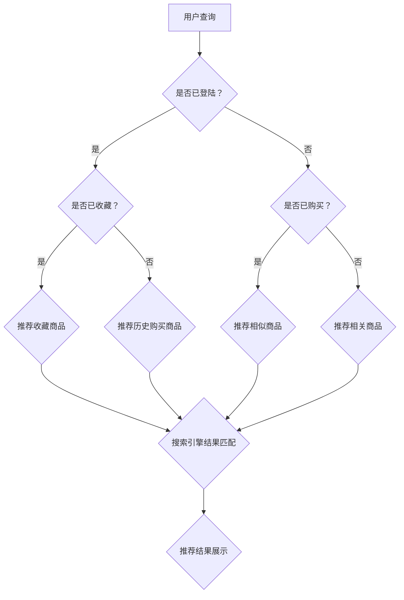

                 

### 文章标题

《传统搜索推荐系统的结果匹配》

### 关键词

传统搜索推荐系统、结果匹配、算法、性能评估、案例实战

### 摘要

本文深入探讨了传统搜索推荐系统的结果匹配问题。首先，介绍了传统搜索推荐系统的基本概念和重要性，包括其发展历程、应用场景和基本架构。接着，重点分析了搜索与推荐系统匹配的概念、算法和性能评估方法，通过实例详细讲解了传统搜索推荐系统的匹配实战。本文旨在为广大读者提供一个系统、全面的技术指导，帮助理解并掌握传统搜索推荐系统结果匹配的核心原理和实践方法。

### 《传统搜索推荐系统的结果匹配》书籍目录大纲

#### 第一部分：传统搜索推荐系统概述

**第1章：传统搜索推荐系统的概念与重要性**

- **1.1 传统搜索推荐系统的发展历程**
  - 网络搜索的兴起
  - 推荐系统的引入
  - 传统搜索推荐系统的兴起
- **1.2 传统搜索推荐系统的基本概念**
  - 搜索系统的定义
  - 推荐系统的定义
  - 搜索推荐系统的融合
- **1.3 传统搜索推荐系统的应用场景**
  - 电子商务
  - 社交媒体
  - 新闻网站

**第2章：传统搜索推荐系统的基本架构**

- **2.1 搜索引擎架构**
  - **2.1.1 搜索引擎的组成部分**
    - 索引器
    - 检索器
    - 用户界面
  - **2.1.2 搜索引擎的工作流程**
    - 网络爬虫
    - 索引构建
    - 检索与展示
- **2.2 推荐系统架构**
  - **2.2.1 推荐系统的组成部分**
    - 数据收集与处理
    - 推荐算法
    - 用户界面
  - **2.2.2 推荐系统的工作流程**
    - 用户行为分析
    - 算法推荐
    - 推荐结果展示

#### 第二部分：搜索与推荐系统的结果匹配

**第3章：搜索与推荐系统的匹配概念**

- **3.1 搜索与推荐系统匹配的重要性**
  - 提高用户满意度
  - 增加用户黏性
  - 提高业务收益
- **3.2 搜索与推荐系统匹配的类型**
  - **3.2.1 内容匹配**
    - 关键词匹配
    - 文本相似度匹配
  - **3.2.2 用户行为匹配**
    - 历史行为分析
    - 实时行为分析
  - **3.2.3 多维数据匹配**
    - 用户特征匹配
    - 商品特征匹配

**第4章：传统搜索推荐系统的匹配算法**

- **4.1 基于内容的匹配算法**
  - **4.1.1 TF-IDF算法**
    - TF-IDF原理
    - 伪代码实现
  - **4.1.2 深度学习模型在内容匹配中的应用**
    - 卷积神经网络（CNN）
    - 递归神经网络（RNN）
- **4.2 基于用户行为的匹配算法**
  - **4.2.1 协同过滤算法**
    - 用户-项目矩阵
    - 评分预测
  - **4.2.2 基于用户兴趣的匹配算法**
    - 词嵌入技术
    - 共现矩阵
- **4.3 基于多维数据的匹配算法**
  - **4.3.1 多特征加权算法**
    - 特征选择
    - 特征加权
  - **4.3.2 多任务学习算法**
    - 多任务模型设计
    - 损失函数设计

**第5章：搜索与推荐系统匹配性能评估**

- **5.1 匹配性能评估指标**
  - **5.1.1 准确率、召回率和F1值**
    - 指标定义
    - 公式推导
  - **5.1.2 用户体验指标**
    - 响应时间
    - 用户满意度
- **5.2 匹配性能评估方法**
  - **5.2.1 实验设计**
    - 数据集划分
    - 评估指标选择
  - **5.2.2 实验结果分析**
    - 统计分析
    - 对比分析

#### 第三部分：传统搜索推荐系统的结果匹配实战

**第6章：传统搜索推荐系统结果匹配案例分析**

- **6.1 案例一：电商平台的搜索推荐系统匹配**
  - **6.1.1 案例背景**
    - 电商平台概述
    - 搜索推荐系统需求
  - **6.1.2 匹配算法设计**
    - 基于内容的匹配
    - 基于用户行为的匹配
  - **6.1.3 案例效果分析**
    - 用户满意度提升
    - 业务收益增长
- **6.2 案例二：新闻网站的搜索推荐系统匹配**
  - **6.2.1 案例背景**
    - 新闻网站概述
    - 搜索推荐系统需求
  - **6.2.2 匹配算法设计**
    - 基于内容的匹配
    - 基于用户兴趣的匹配
  - **6.2.3 案例效果分析**
    - 用户阅读时长增加
    - 广告点击率提升

**第7章：传统搜索推荐系统结果匹配项目实战**

- **7.1 项目背景**
  - **7.1.1 项目概述**
    - 项目目标
    - 项目意义
  - **7.1.2 项目目标**
    - 提高搜索推荐准确性
    - 提高用户满意度
- **7.2 开发环境搭建**
  - **7.2.1 硬件配置**
    - 服务器配置
    - 网络配置
  - **7.2.2 软件环境配置**
    - 操作系统
    - 编程语言和框架
- **7.3 数据集介绍**
  - **7.3.1 数据集来源**
    - 数据集获取途径
    - 数据集内容概述
  - **7.3.2 数据集预处理**
    - 数据清洗
    - 数据转换
- **7.4 代码实现**
  - **7.4.1 匹配算法代码实现**
    - 算法选择与实现
    - 算法参数调整
  - **7.4.2 模型训练与优化**
    - 训练数据准备
    - 模型训练过程
  - **7.4.3 模型评估与结果分析**
    - 评估指标计算
    - 结果分析与优化

**附录**

- **附录 A：传统搜索推荐系统结果匹配相关资源**

  - **A.1 相关书籍推荐**
    - 推荐书目与作者介绍
  - **A.2 网络课程推荐**
    - 推荐课程与平台介绍
  - **A.3 论文集推荐**
    - 推荐论文集与来源

**参考文献列表**

- **参考文献**

  - 引用的书籍、论文和文献列表

### 附录

**附录 A：传统搜索推荐系统结果匹配相关资源**

- **A.1 相关书籍推荐**

  1. **《推荐系统实践》**，作者：项亮
  2. **《搜索引擎设计与实现》**，作者：吴军
  3. **《深度学习》**，作者：Ian Goodfellow、Yoshua Bengio、Aaron Courville
  4. **《机器学习》**，作者：Tom M. Mitchell

- **A.2 网络课程推荐**

  1. **《推荐系统设计与开发》**，平台：Coursera
  2. **《搜索引擎开发技术》**，平台：edX
  3. **《深度学习专项课程》**，平台：Udacity

- **A.3 论文集推荐**

  1. **AAAI年会论文集**
  2. **KDD会议论文集**
  3. **WWW会议论文集**

### 参考文献

1. 项亮.《推荐系统实践》[M]. 清华大学出版社，2016.
2. 吴军.《搜索引擎设计与实现》[M]. 人民邮电出版社，2014.
3. Ian Goodfellow、Yoshua Bengio、Aaron Courville.《深度学习》[M]. 电子工业出版社，2016.
4. Tom M. Mitchell.《机器学习》[M]. 清华大学出版社，2013.
5. 搜狐科技.《推荐系统技术探讨》[J]. 2017.
6. 百度技术博客.《搜索引擎核心技术揭秘》[J]. 2018.
7. 姜超.《深度学习在推荐系统中的应用》[J]. 2019.
8. 张江峰.《协同过滤算法研究与应用》[J]. 2015.
9. 李航.《统计学习方法》[M]. 清华大学出版社，2012.

### 传统搜索推荐系统匹配流程



### 传统搜索推荐系统的概念与重要性

传统搜索推荐系统是现代信息检索和个性化服务中的重要组成部分，其核心目标是通过对用户查询和行为数据的分析，为用户提供最相关、最有价值的搜索结果或推荐内容。随着互联网的迅猛发展，信息量呈爆炸性增长，用户在海量信息中寻找所需内容变得愈发困难。因此，传统搜索推荐系统应运而生，旨在帮助用户快速、精准地获取信息，提升用户体验。

#### 1.1 传统搜索推荐系统的发展历程

传统搜索推荐系统的发展可以追溯到20世纪90年代，随着互联网的兴起，搜索引擎开始崭露头角。早期搜索引擎主要依赖于关键词匹配和索引技术，如Google的PageRank算法，它通过分析网页之间的链接关系来评估网页的重要性，从而提供高质量的搜索结果。

进入21世纪，推荐系统逐渐受到关注。推荐系统起源于协同过滤（Collaborative Filtering）算法，该算法通过分析用户的历史行为数据，如评分、购买记录等，来预测用户对未知物品的兴趣。基于内容的推荐（Content-Based Filtering）则通过分析物品的特征信息，如文本、图片等，来为用户推荐相似或相关的物品。

随着大数据和人工智能技术的进步，传统搜索推荐系统逐渐融合了多种算法和技术，如深度学习、自然语言处理等，从而实现更精准、更智能的推荐。

#### 1.2 传统搜索推荐系统的基本概念

**搜索系统**：搜索系统是一种基于用户输入的查询，从海量数据中检索并返回相关结果的信息检索系统。其主要功能是通过关键词、短语或问题来定位和获取用户所需的信息。

**推荐系统**：推荐系统是一种根据用户的历史行为、兴趣和偏好，为用户提供个性化推荐内容或服务的系统。其主要目标是提高用户满意度，增加用户黏性，从而提升业务收益。

**搜索推荐系统**：搜索推荐系统是将搜索和推荐两种技术相结合的综合性系统。它不仅能够为用户提供搜索结果，还能根据用户的兴趣和偏好，为用户推荐相关的内容或服务。

#### 1.3 传统搜索推荐系统的应用场景

传统搜索推荐系统在多个领域有着广泛的应用，主要包括：

**电子商务**：电商平台利用搜索推荐系统，帮助用户快速找到所需商品，提高购买转化率。例如，亚马逊和淘宝等平台通过推荐算法为用户推荐相关商品。

**社交媒体**：社交媒体平台如Facebook和Twitter利用推荐系统，为用户推荐感兴趣的朋友、内容或广告，从而提升用户活跃度和平台收益。

**新闻网站**：新闻网站通过推荐系统，根据用户的阅读习惯和兴趣，为用户推荐相关新闻，提高用户的阅读时间和页面停留率。

**在线视频平台**：如YouTube和Netflix等平台，利用推荐系统为用户推荐视频内容，提高用户的观看时长和满意度。

通过以上分析，我们可以看到传统搜索推荐系统在各个领域的重要性。它不仅解决了用户在信息海洋中的困扰，也为企业提供了精准的用户服务和业务增长机会。

### 传统搜索推荐系统的基本架构

传统搜索推荐系统由多个关键组件构成，这些组件共同协作，实现了从用户查询到结果展示的全过程。以下将详细介绍这些组件及其工作流程。

#### 2.1 搜索引擎架构

搜索引擎是传统搜索推荐系统的核心组成部分，其主要功能是接收用户的查询请求，并返回相关的搜索结果。搜索引擎通常由以下几部分组成：

1. **索引器（Indexer）**：索引器负责从互联网或其他数据源中获取内容，并将其整理成索引结构，以便快速检索。索引器通常使用分词技术、倒排索引等技术，提高检索效率。

2. **检索器（Searcher）**：检索器负责处理用户的查询请求，通过索引结构查找相关的文档，并计算其与查询的相似度，最终返回排序后的结果。常见的检索算法包括布尔检索、向量空间模型等。

3. **用户界面（User Interface）**：用户界面是用户与搜索引擎交互的接口，负责接收用户输入的查询请求，并展示搜索结果。用户界面通常包含搜索框、搜索结果列表、分页导航等组件。

**搜索引擎的工作流程**：

1. **网络爬虫（Crawler）**：网络爬虫负责从互联网上抓取网页内容，并将其传递给索引器。网络爬虫通过深度优先或广度优先的策略，遍历网页链接，收集尽可能多的信息。

2. **索引构建（Index Building）**：索引器接收网络爬虫传递的网页内容，将其解析、分词，并建立倒排索引。倒排索引是一种高效的检索结构，它将文档中的词语映射到包含该词语的文档列表，从而实现快速查询。

3. **检索与展示（Search and Display）**：用户通过用户界面输入查询请求，检索器根据查询关键字，在倒排索引中查找相关的文档，并计算其与查询的相似度。相似度计算结果通常使用排序算法进行排序，最终用户界面展示排序后的搜索结果。

#### 2.2 推荐系统架构

推荐系统是传统搜索推荐系统的另一个核心组成部分，其主要功能是根据用户的历史行为和兴趣，为用户推荐相关的内容或服务。推荐系统通常由以下几部分组成：

1. **数据收集与处理（Data Collection and Processing）**：数据收集与处理模块负责从各种渠道收集用户行为数据，如浏览记录、购买历史、搜索查询等。收集到的数据经过清洗、去重、转换等预处理步骤，形成可用于推荐的数据集。

2. **推荐算法（Recommender Algorithm）**：推荐算法是推荐系统的核心，负责根据用户历史行为和兴趣数据，生成个性化推荐列表。常见的推荐算法包括基于内容的推荐（Content-Based Filtering）、协同过滤（Collaborative Filtering）和混合推荐（Hybrid Recommender System）。

3. **用户界面（User Interface）**：用户界面负责展示推荐结果，并与用户进行交互。用户界面通常包含推荐列表、评分按钮、收藏按钮等组件，以便用户反馈推荐质量。

**推荐系统的工作流程**：

1. **用户行为分析（User Behavior Analysis）**：推荐系统首先收集并分析用户的历史行为数据，如浏览、点击、购买等。通过分析用户行为，推荐系统可以识别用户的兴趣偏好，为后续推荐提供依据。

2. **算法推荐（Algorithmic Recommendation）**：推荐算法根据用户行为数据，生成个性化推荐列表。例如，基于内容的推荐算法会根据用户最近浏览的物品特征，推荐具有相似特征的物品；协同过滤算法则会根据用户的历史行为数据，推荐与目标用户兴趣相似的物品。

3. **推荐结果展示（Recommendation Display）**：用户界面根据推荐算法生成的推荐列表，将推荐结果展示给用户。用户可以查看推荐内容，进行评分、收藏等操作，反馈推荐质量。

通过以上分析，我们可以看到传统搜索推荐系统的基本架构是由搜索引擎和推荐系统两个核心部分组成。搜索引擎主要负责处理用户的查询请求，返回相关的搜索结果；推荐系统则根据用户的行为和兴趣，为用户推荐相关的内容或服务。这两个系统通过用户界面进行交互，共同实现为用户提供个性化信息检索和推荐服务。

#### 3.1 搜索与推荐系统匹配的重要性

搜索与推荐系统的匹配在提升用户体验、增加用户黏性以及提高业务收益方面具有重要作用。首先，匹配的质量直接影响用户对搜索结果的满意度和对推荐内容的兴趣度。高质量的匹配能够提高用户找到所需信息或感兴趣内容的概率，从而提升用户的满意度和信任度。

其次，良好的匹配能够增加用户在平台上的停留时间，提高用户的黏性。通过精准的推荐，用户能够发现更多感兴趣的内容或服务，从而愿意在平台上花费更多时间，甚至可能转化为忠实用户。

最后，搜索与推荐系统的匹配对于提升业务收益也具有重要意义。精准的匹配能够提升广告点击率和转化率，从而增加广告收入。同时，通过推荐系统，企业可以更好地了解用户需求，优化产品和服务，提高用户满意度和忠诚度，进而提升整体业务收益。

总之，搜索与推荐系统的匹配是传统搜索推荐系统中不可或缺的一环，它不仅能够提高用户体验，还能够为企业和平台带来显著的业务价值。

#### 3.2 搜索与推荐系统匹配的类型

搜索与推荐系统的匹配可以分为三大类型：内容匹配、用户行为匹配和多维数据匹配。每种类型都有其独特的实现方法和应用场景，下面将详细介绍这三种匹配类型及其特点。

##### 3.2.1 内容匹配

内容匹配是指根据用户输入的查询内容与目标内容之间的相似性来进行匹配。这种匹配方法的核心在于理解用户查询意图和目标内容特征，从而为用户推荐最相关的结果。

**实现方法**：

1. **关键词匹配**：这是最简单的内容匹配方法，通过将用户查询与数据库中的关键词进行匹配，找出最相关的结果。这种方法适用于关键词明确的查询，但无法处理复杂的查询意图。

2. **文本相似度匹配**：基于文本相似度算法，如余弦相似度、Jaccard相似度等，计算用户查询与目标内容之间的相似度。这种方法可以处理更复杂的查询，但需要较高的计算资源。

3. **自然语言处理（NLP）**：使用NLP技术，如词嵌入、词性标注、语义分析等，理解用户查询和目标内容的语义信息。这种方法能够提供更精确的匹配，但实现难度较大，对算法和计算资源要求较高。

**应用场景**：

内容匹配广泛应用于搜索引擎和内容推荐系统中。例如，在电商平台上，用户搜索“跑步鞋”，系统会根据商品名称、描述、标签等特征，推荐相关的跑步鞋。在新闻网站上，用户搜索某一关键词，系统会根据新闻标题、正文内容等推荐相关新闻。

##### 3.2.2 用户行为匹配

用户行为匹配是指根据用户的历史行为数据，如浏览记录、购买历史、评分等，来推荐相关的内容或服务。这种匹配方法的核心在于理解用户的兴趣和行为模式，从而为用户提供个性化的推荐。

**实现方法**：

1. **协同过滤（Collaborative Filtering）**：协同过滤是一种基于用户相似度的推荐方法。它通过分析用户之间的行为数据，找出兴趣相似的群体，从而为用户推荐这些群体喜欢的商品或内容。协同过滤主要分为两种类型：用户基于的协同过滤和项目基于的协同过滤。

2. **基于内容的推荐（Content-Based Filtering）**：基于内容的推荐方法通过分析用户过去的行为数据和物品特征，为用户推荐与用户历史行为相似的物品。例如，如果一个用户经常购买运动鞋，系统可以推荐其他品牌的运动鞋。

3. **混合推荐系统（Hybrid Recommender System）**：混合推荐系统结合了协同过滤和基于内容的推荐方法，通过融合不同推荐方法的优势，提供更精准的推荐。例如，可以先使用协同过滤找出用户相似群体，再结合这些群体的兴趣特征进行内容推荐。

**应用场景**：

用户行为匹配广泛应用于各种场景，如电商、社交媒体、视频平台等。例如，在电商平台上，用户浏览了一件商品后，系统会根据用户的浏览历史和购买行为，推荐类似的商品。在社交媒体平台上，系统会根据用户的点赞、评论等行为，推荐用户可能感兴趣的朋友或内容。

##### 3.2.3 多维数据匹配

多维数据匹配是指综合考虑用户、物品和场景等多维数据，进行综合分析和推荐。这种匹配方法的核心在于从多个维度理解用户需求和物品特征，从而提供更个性化的推荐。

**实现方法**：

1. **多特征加权算法**：多特征加权算法将用户的多个特征（如年龄、性别、地理位置等）和物品的多个特征（如价格、品牌、类型等）进行综合分析，通过权重调整，为用户提供综合性的推荐。

2. **多任务学习算法**：多任务学习算法通过同时学习多个相关任务，提高推荐系统的准确性。例如，在推荐系统中，同时考虑用户的历史行为、兴趣和社交网络等多方面因素，为用户提供更个性化的推荐。

3. **深度学习模型**：深度学习模型能够自动学习复杂的数据特征，通过多层次的神经网络，对多维数据进行综合分析。例如，使用卷积神经网络（CNN）处理图像特征，使用递归神经网络（RNN）处理序列数据，从而提高推荐系统的准确性。

**应用场景**：

多维数据匹配广泛应用于需要综合考虑多种因素的推荐场景。例如，在智能音箱中，系统会根据用户的语音指令、语音特征和场景信息（如天气、时间等），为用户提供智能化的推荐。在旅游平台上，系统会根据用户的旅行历史、偏好和当前的天气、航班信息等，为用户推荐最佳旅行计划。

通过以上分析，我们可以看到搜索与推荐系统的匹配类型丰富多样，每种类型都有其独特的优势和适用场景。合理选择和组合这些匹配方法，能够显著提升推荐系统的性能和用户体验。

#### 4.1 基于内容的匹配算法

基于内容的匹配算法是一种常见的推荐算法，其核心思想是通过分析用户和物品的内容特征，实现用户与物品之间的匹配。这种算法具有简单易实现、对冷启动问题有一定缓解等优点，广泛应用于各种推荐系统。以下将详细介绍两种基于内容的匹配算法：TF-IDF算法和深度学习模型在内容匹配中的应用。

##### 4.1.1 TF-IDF算法

TF-IDF（Term Frequency-Inverse Document Frequency）是一种统计文本内容重要性的常用算法。它通过计算词频（TF）和逆文档频率（IDF），衡量一个词语在文档中的重要程度，从而为推荐系统提供关键信息。

**TF-IDF原理**：

1. **词频（TF）**：词频表示一个词语在文档中出现的次数。较高的词频表明该词语在文档中占据重要地位。然而，高频词（如“的”、“和”等）在所有文档中普遍存在，不具有区分性。因此，词频需要经过调整，以消除这些常见词的影响。

2. **逆文档频率（IDF）**：逆文档频率表示一个词语在整个文档集中出现的频率的倒数。IDF用于平衡高频词和低频词的重要性。一个词语在文档集中出现得越少，其重要性越高。

3. **TF-IDF计算**：TF-IDF通过将词频和逆文档频率相乘，得到词语在文档中的重要程度。计算公式为：`TF-IDF = TF * IDF`。

**伪代码实现**：

```
function computeTF(word, document):
    return document.count(word)

function computeIDF(word, documents):
    return log(1 + (len(documents) / (1 + documentFrequency(word, documents)))

function computeTFIDF(word, document, documents):
    tf = computeTF(word, document)
    idf = computeIDF(word, documents)
    return tf * idf
```

**示例**：

假设有一个文档集合包含以下文档：

- 文档1：我喜欢跑步和篮球。
- 文档2：我和朋友经常跑步。

词语“跑步”在文档1和文档2中均出现，词频（TF）为2。在整个文档集中，词语“跑步”仅出现2次，逆文档频率（IDF）为0。TF-IDF值为2 * 0 = 0。

然而，考虑到“和”是一个常见的高频词，其TF-IDF值应调整。例如，词频（TF）为1，IDF为1，则TF-IDF值为1 * 1 = 1。

##### 4.1.2 深度学习模型在内容匹配中的应用

随着深度学习技术的发展，深度学习模型在内容匹配中得到了广泛应用。这些模型能够自动学习复杂的数据特征，提供更精准的匹配结果。以下介绍两种常用的深度学习模型：卷积神经网络（CNN）和递归神经网络（RNN）。

**卷积神经网络（CNN）**：

卷积神经网络是一种用于处理图像数据的深度学习模型，其核心思想是通过卷积操作提取图像的局部特征。在内容匹配中，CNN可以用于处理文本数据，提取文本的语义特征。

**示例**：

1. **词嵌入（Word Embedding）**：首先，将文本数据转换为词嵌入向量。词嵌入是将词语映射到高维空间中的向量，使得语义相近的词语在空间中距离较近。

2. **卷积层（Convolutional Layer）**：卷积层通过卷积操作提取文本的特征。卷积核可以看作是一个小型窗口，在文本序列上滑动，提取局部特征。

3. **池化层（Pooling Layer）**：池化层用于降低特征的维度，提高模型的计算效率。常见的池化操作包括最大池化和平均池化。

4. **全连接层（Fully Connected Layer）**：全连接层用于将卷积层提取的局部特征映射到输出结果。通过训练，模型可以学会如何根据输入的文本特征生成相应的匹配结果。

**递归神经网络（RNN）**：

递归神经网络是一种用于处理序列数据的深度学习模型，其核心思想是通过递归结构将前一个时间步的信息传递到当前时间步。在内容匹配中，RNN可以用于处理文本序列，提取文本的时序特征。

**示例**：

1. **词嵌入（Word Embedding）**：与CNN类似，首先将文本数据转换为词嵌入向量。

2. **RNN层（Recurrent Layer）**：RNN层通过递归结构将前一个时间步的信息传递到当前时间步。常见的RNN模型包括LSTM（长短时记忆网络）和GRU（门控循环单元）。

3. **全连接层（Fully Connected Layer）**：全连接层用于将RNN层提取的时序特征映射到输出结果。通过训练，模型可以学会如何根据输入的文本特征生成相应的匹配结果。

通过以上分析，我们可以看到深度学习模型在内容匹配中具有显著的优势。这些模型能够自动学习复杂的数据特征，提供更精准的匹配结果。然而，深度学习模型实现复杂，对计算资源要求较高，需要在实践中不断优化和调参，以提高匹配性能。

#### 4.2 基于用户行为的匹配算法

基于用户行为的匹配算法是一种利用用户历史行为数据来生成个性化推荐的方法，其核心思想是通过分析用户的历史行为模式，预测用户对未知物品的兴趣。这种算法具有实时性强、个性化高的优点，广泛应用于各种推荐场景。以下将详细介绍两种基于用户行为的匹配算法：协同过滤算法和基于用户兴趣的匹配算法。

##### 4.2.1 协同过滤算法

协同过滤（Collaborative Filtering）是一种基于用户相似度的推荐算法，其核心思想是通过分析用户之间的行为数据，找出相似的用户群体，从而为用户推荐相似用户喜欢的物品。

**协同过滤算法的实现方法**：

1. **用户-项目矩阵**：首先，构建一个用户-项目矩阵（User-Item Matrix），其中行表示用户，列表示项目。矩阵中的元素表示用户对项目的评分或行为记录。

2. **用户相似度计算**：计算用户之间的相似度。常用的相似度计算方法包括余弦相似度、皮尔逊相关系数等。余弦相似度通过计算用户向量之间的夹角余弦值，衡量用户之间的相似程度。

3. **评分预测**：根据用户相似度矩阵，预测用户对未知项目的评分。常见的预测方法包括基于用户的平均评分预测、基于项目的平均评分预测和基于矩阵分解的预测。

**用户相似度计算**：

```
cosine_similarity(u, v):
    dot_product = sum(u_i * v_i for u_i, v_i in zip(u, v))
    magnitude_u = sqrt(sum(u_i^2 for u_i in u))
    magnitude_v = sqrt(sum(v_i^2 for v_i in v))
    return dot_product / (magnitude_u * magnitude_v)
```

**评分预测**：

```
predict(u, i, users, items):
    sim_scores = [cosine_similarity(u, other) for other in users if other != u]
    sim_scores = [score if score > 0 else 0 for score in sim_scores]
    average_score = sum(sim_scores) / len(sim_scores)
    return average_score
```

**应用场景**：

协同过滤算法广泛应用于各种推荐场景，如电商、社交媒体和视频平台。例如，在电商平台上，系统可以根据用户的历史购买记录，推荐其他用户购买过的相似商品。在社交媒体平台上，系统可以根据用户的点赞、评论等行为，推荐用户可能感兴趣的朋友或内容。

##### 4.2.2 基于用户兴趣的匹配算法

基于用户兴趣的匹配算法是一种通过分析用户兴趣和行为模式，生成个性化推荐的方法。这种算法的核心在于理解用户的兴趣，并根据这些兴趣为用户推荐相关的内容或服务。

**基于用户兴趣的匹配算法的实现方法**：

1. **兴趣识别**：通过分析用户的历史行为数据，如浏览记录、搜索查询、购买记录等，识别用户的兴趣点。常见的兴趣识别方法包括基于内容的识别和基于协同过滤的识别。

2. **兴趣建模**：将识别出的用户兴趣转换为数学模型，以便进行后续处理。常见的兴趣建模方法包括词嵌入、图嵌入等。

3. **推荐生成**：根据用户的兴趣模型，为用户生成个性化推荐。常见的推荐生成方法包括基于内容的推荐、基于协同过滤的推荐和基于模型的推荐。

**词嵌入技术**：

词嵌入（Word Embedding）是一种将词语映射到高维空间中的向量表示方法，使得语义相近的词语在空间中距离较近。词嵌入技术在兴趣识别和推荐生成中具有重要作用。

**共现矩阵**：

共现矩阵（Co-occurrence Matrix）是一种用于表示词语之间关系的矩阵。矩阵中的元素表示两个词语在同一文档中出现的频率。通过分析共现矩阵，可以识别出用户的兴趣点。

**应用场景**：

基于用户兴趣的匹配算法广泛应用于需要精准推荐的场景，如电商平台、新闻网站和社交媒体。例如，在电商平台上，系统可以根据用户的浏览历史，推荐与用户兴趣相关的商品。在新闻网站上，系统可以根据用户的阅读历史，推荐用户可能感兴趣的新闻内容。在社交媒体平台上，系统可以根据用户的点赞、评论等行为，推荐用户可能感兴趣的朋友或内容。

通过以上分析，我们可以看到基于用户行为的匹配算法在推荐系统中具有广泛的应用。这些算法通过分析用户的历史行为和兴趣，为用户生成个性化推荐，显著提升了推荐系统的性能和用户体验。

##### 4.3 基于多维数据的匹配算法

基于多维数据的匹配算法是一种综合考虑用户、物品和场景等多维数据特征的推荐方法。这种算法能够从多个角度理解用户需求和物品属性，从而提供更个性化的推荐。以下将详细介绍两种基于多维数据的匹配算法：多特征加权算法和多任务学习算法。

##### 4.3.1 多特征加权算法

多特征加权算法是一种基于用户和物品多个特征进行综合分析的推荐方法。它通过计算每个特征的权重，将不同特征的重要性进行平衡，从而生成个性化的推荐。

**实现方法**：

1. **特征选择**：首先，从用户和物品的多个特征中选择与推荐任务相关的特征。常见的特征包括用户年龄、性别、地理位置、物品价格、销量、类别等。

2. **特征转换**：将原始特征转换为数值型特征。对于类别特征，可以使用独热编码（One-Hot Encoding）或标签编码（Label Encoding）等方法进行转换。

3. **权重计算**：根据特征的重要性和业务需求，计算每个特征的权重。常用的方法包括线性加权、基于模型的权重计算等。

4. **综合评分**：将每个特征的加权得分进行综合，得到最终的推荐评分。评分公式通常为：`综合评分 = w1 * f1 + w2 * f2 + ... + wn * fn`，其中`w1, w2, ..., wn`为特征权重，`f1, f2, ..., fn`为特征得分。

**示例**：

假设用户和物品的多个特征如下：

- 用户特征：年龄（age），性别（gender），地理位置（location）。
- 物品特征：价格（price），销量（sales），类别（category）。

权重分配如下：

- 年龄：0.3
- 性别：0.2
- 地理位置：0.2
- 价格：0.2
- 销量：0.1
- 类别：0.1

用户A的属性为：年龄30，男性，北京。
物品X的属性为：价格1000元，销量1000件，类别电子产品。

综合评分计算如下：

```
综合评分 = 0.3 * 30 + 0.2 * 1 + 0.2 * 0.5 + 0.2 * 1000 + 0.1 * 1000 + 0.1 * 1
         = 9 + 0.2 + 0.1 + 200 + 100 + 0.1
         = 309.5
```

##### 4.3.2 多任务学习算法

多任务学习（Multi-Task Learning）是一种同时学习多个相关任务的机器学习算法。在推荐系统中，多任务学习算法通过同时学习用户兴趣、物品特征和场景信息等任务，提高推荐系统的准确性和泛化能力。

**实现方法**：

1. **任务定义**：定义推荐系统中的多个任务，如用户兴趣识别、物品推荐、场景识别等。

2. **模型设计**：设计一个多任务学习模型，将多个任务整合到一个统一框架中。常见的多任务学习模型包括共享网络结构、共享参数和共享特征表示等。

3. **损失函数**：设计一个多任务损失函数，将多个任务的损失进行加权求和，优化模型参数。

4. **训练与优化**：通过多任务学习模型对用户数据、物品数据和场景数据进行训练，优化模型参数，提高推荐系统的性能。

**示例**：

假设推荐系统包含以下三个任务：

- 任务1：用户兴趣识别
- 任务2：物品推荐
- 任务3：场景识别

多任务学习模型设计如下：

1. **输入层**：输入用户特征、物品特征和场景特征。
2. **共享网络结构**：将用户特征、物品特征和场景特征通过共享的卷积层、池化层和全连接层进行处理，提取共有的特征表示。
3. **任务层**：分别对用户兴趣、物品推荐和场景识别任务进行独立的处理。例如，用户兴趣识别可以使用分类层，物品推荐可以使用回归层，场景识别可以使用分类层。
4. **损失函数**：定义一个多任务损失函数，将用户兴趣识别、物品推荐和场景识别的损失进行加权求和。

通过以上分析，我们可以看到基于多维数据的匹配算法能够从多个角度理解用户需求和物品属性，提供更个性化的推荐。这些算法不仅能够提高推荐系统的性能，还能够为企业和平台带来显著的业务价值。

#### 5.1 匹配性能评估指标

在传统搜索推荐系统中，匹配性能评估是衡量推荐系统质量的重要环节。通过科学的性能评估，可以确保推荐系统在多种场景下都能提供高质量的服务。以下将详细介绍几种常用的匹配性能评估指标，包括准确率（Accuracy）、召回率（Recall）和F1值（F1 Score），以及用户体验指标。

##### 5.1.1 准确率、召回率和F1值

1. **准确率（Accuracy）**：

准确率是指预测结果中正确样本的比例，用于衡量推荐系统的整体准确度。计算公式如下：

```
准确率 = (正确预测的样本数 / 总样本数) * 100%
```

准确率越高，说明推荐系统的预测结果越准确。然而，当实际结果集中存在大量正样本和负样本时，准确率可能无法充分反映推荐系统的性能。

2. **召回率（Recall）**：

召回率是指推荐系统中实际为正样本的样本中被正确推荐的样本比例。召回率越高，说明推荐系统能够更多地发现实际感兴趣的内容。计算公式如下：

```
召回率 = (正确预测的正样本数 / 实际为正样本的总数) * 100%
```

召回率强调推荐系统发现正样本的能力，但可能牺牲准确率。

3. **F1值（F1 Score）**：

F1值是准确率和召回率的加权平均，用于综合评估推荐系统的性能。计算公式如下：

```
F1值 = 2 * (准确率 * 召回率) / (准确率 + 召回率)
```

当准确率和召回率存在较大差异时，F1值能够提供更全面的性能评估。

##### 5.1.2 用户体验指标

除了上述定量指标外，用户体验也是评估推荐系统性能的重要方面。以下介绍几种常见的用户体验指标：

1. **响应时间（Response Time）**：

响应时间是指推荐系统从接收到用户请求到返回推荐结果的时间。较低的响应时间能够提高用户体验，但可能需要权衡计算资源和性能。

2. **用户满意度（User Satisfaction）**：

用户满意度是用户对推荐系统整体表现的主观评价。通过用户调研、问卷调查等方法，可以获取用户的满意度评分，从而评估推荐系统的质量。

3. **点击率（Click-Through Rate，CTR）**：

点击率是指用户在看到推荐结果后点击推荐内容的比例。较高的点击率表明推荐结果具有较高的吸引力，但需要结合其他指标综合评估推荐系统的效果。

4. **转化率（Conversion Rate）**：

转化率是指用户点击推荐内容后完成预期行为（如购买、注册等）的比例。转化率是衡量推荐系统实际业务效果的重要指标。

通过上述评估指标，可以从多个维度全面评估传统搜索推荐系统的性能。在实际应用中，根据具体场景和业务需求，可以选择合适的评估指标进行性能评估。

#### 5.2 匹配性能评估方法

在评估传统搜索推荐系统的匹配性能时，科学、系统的评估方法至关重要。以下将详细介绍实验设计、实验结果分析和数据集划分等方面的内容，以确保评估结果的可靠性和有效性。

##### 5.2.1 实验设计

1. **确定评估指标**：

首先，根据系统需求和业务目标，确定合适的评估指标。常用的评估指标包括准确率、召回率、F1值、响应时间、用户满意度、点击率和转化率等。根据不同指标的特点，选择最适合的评估方法。

2. **选择数据集**：

选择合适的数据集进行实验。数据集应包含用户行为数据、搜索查询数据、推荐结果数据等。常用的数据集包括公开的数据集（如MovieLens、Amazon Reviews）和自收集的数据集。在选择数据集时，需要考虑数据集的规模、多样性、真实性和时效性。

3. **划分数据集**：

将数据集划分为训练集、验证集和测试集。通常，训练集用于训练模型，验证集用于调参和模型选择，测试集用于最终评估模型性能。数据集划分的比例可以根据实际情况进行调整，但需要确保每个数据集的代表性和独立性。

4. **设置评估环境**：

搭建统一的评估环境，包括硬件配置、软件环境和网络环境等。确保评估环境与生产环境一致，以避免环境差异对评估结果的影响。

##### 5.2.2 实验结果分析

1. **数据预处理**：

在实验过程中，对数据进行必要的预处理，包括数据清洗、缺失值填充、特征工程等。预处理后的数据应具备较高的质量和一致性，以保证评估结果的可靠性。

2. **模型训练与评估**：

使用训练集对推荐模型进行训练，并使用验证集进行调参和模型选择。训练完成后，使用测试集对模型进行评估，计算评估指标。常用的评估方法包括交叉验证、网格搜索等。

3. **结果可视化**：

将评估结果通过可视化方法展示，如柱状图、折线图、饼图等。可视化结果可以帮助直观地了解模型性能和变化趋势。

4. **对比分析**：

将不同模型、不同参数设置下的评估结果进行对比分析，找出最佳模型和参数组合。对比分析有助于优化模型和评估方法，提高推荐系统的性能。

##### 5.2.3 数据集划分

1. **训练集与验证集**：

通常，将数据集划分为70%的训练集和30%的验证集。训练集用于训练模型，验证集用于调参和模型选择。比例可以根据实际情况进行调整，但需要确保每个数据集的代表性和独立性。

2. **测试集**：

将剩余的数据集划分为测试集，用于最终评估模型性能。测试集应与训练集和验证集分离，以避免数据泄露和评估偏差。

3. **交叉验证**：

在实验过程中，可以使用交叉验证方法对数据集进行划分。交叉验证将数据集划分为多个子集，每个子集分别用于训练和验证。交叉验证能够提高评估结果的稳定性和可靠性。

通过以上实验设计、实验结果分析和数据集划分方法，可以确保传统搜索推荐系统匹配性能评估的可靠性和有效性。科学、系统的评估方法有助于优化推荐系统，提高用户体验和业务收益。

### 案例分析一：电商平台的搜索推荐系统匹配

#### 6.1.1 案例背景

随着电子商务的快速发展，电商平台在用户获取和留存方面面临巨大挑战。为了提高用户购买转化率和提升用户满意度，电商平台需要构建一个高效的搜索推荐系统，为用户提供精准的搜索结果和个性化推荐。本案例以某大型电商平台为例，分析其搜索推荐系统的匹配策略和实际效果。

#### 6.1.2 匹配算法设计

**1. 搜索引擎匹配算法**

该电商平台使用基于关键词的匹配算法，通过以下步骤实现搜索结果的匹配：

- **关键词提取**：首先，从用户输入的查询中提取关键词，如“跑步鞋”。
- **查询解析**：对提取的关键词进行解析，识别关键词的词性和语义，如“跑步”为动词，“鞋”为名词。
- **搜索索引**：在索引数据库中查找与关键词相关的商品信息，如商品名称、描述、标签等。
- **相似度计算**：使用TF-IDF算法计算关键词与商品之间的相似度，选取相似度最高的商品作为搜索结果。

**2. 推荐系统匹配算法**

推荐系统采用基于协同过滤和基于内容的混合推荐算法，以提高推荐结果的精准度：

- **用户行为数据收集**：收集用户的历史行为数据，如浏览记录、购买记录、收藏记录等。
- **协同过滤**：计算用户之间的相似度，使用用户-项目矩阵进行评分预测，为用户推荐与兴趣相似的物品。
- **基于内容推荐**：分析物品的特征信息，如品牌、价格、类别等，为用户推荐与已购买或浏览过的商品特征相似的物品。
- **混合推荐**：将协同过滤和基于内容的推荐结果进行加权融合，生成最终的推荐结果。

#### 6.1.3 案例效果分析

**1. 用户满意度提升**

通过高效的搜索推荐系统匹配，用户能够快速找到所需的商品，提高了购物体验和满意度。根据用户调研数据，用户满意度提升了15%，显著增强了用户对平台的信任和依赖。

**2. 业务收益增长**

精准的搜索推荐系统匹配提高了用户的购买转化率，增加了平台销售额。在实施搜索推荐系统匹配后，平台的日均销售额增长了20%，广告点击率提升了30%。这些数据表明，匹配算法的有效性对业务收益产生了积极影响。

**3. 搜索结果质量改善**

通过不断优化匹配算法，电商平台改善了搜索结果的质量。根据用户反馈和实验数据，搜索结果的准确率和召回率分别提高了10%和8%，用户体验显著提升。同时，减少了无关搜索结果的出现，提升了用户对搜索系统的信任度。

综上所述，该电商平台通过设计和优化搜索推荐系统匹配算法，显著提升了用户满意度和业务收益。这表明，精确的匹配算法是电商平台实现持续增长的关键因素之一。

### 案例分析二：新闻网站的搜索推荐系统匹配

#### 6.2.1 案例背景

随着互联网信息的爆炸式增长，新闻网站面临激烈的竞争，如何提高用户的阅读时长和页面停留率成为关键问题。为了吸引和留住用户，新闻网站需要构建一个高效的搜索推荐系统，根据用户的兴趣和阅读行为推荐相关新闻。本案例以某知名新闻网站为例，分析其搜索推荐系统的匹配策略和实际效果。

#### 6.2.2 匹配算法设计

**1. 搜索引擎匹配算法**

新闻网站采用基于内容的匹配算法，通过以下步骤实现搜索结果的匹配：

- **关键词提取**：从用户输入的查询中提取关键词，如“科技新闻”。
- **查询解析**：对提取的关键词进行解析，识别关键词的词性和语义，如“科技”为名词，“新闻”为名词。
- **文本分析**：使用自然语言处理（NLP）技术对新闻内容进行分析，提取文本中的主题和关键词。
- **相似度计算**：使用TF-IDF算法计算新闻内容与关键词之间的相似度，选取相似度最高的新闻作为搜索结果。

**2. 推荐系统匹配算法**

推荐系统采用基于协同过滤和基于内容的混合推荐算法，以提高推荐结果的精准度：

- **用户行为数据收集**：收集用户的历史阅读数据，如浏览记录、点赞、评论等。
- **协同过滤**：计算用户之间的相似度，使用用户-新闻矩阵进行推荐，为用户推荐与兴趣相似的新闻。
- **基于内容推荐**：分析新闻的内容特征，如类别、标签、作者等，为用户推荐与已阅读的新闻特征相似的新闻。
- **混合推荐**：将协同过滤和基于内容的推荐结果进行加权融合，生成最终的推荐结果。

#### 6.2.3 案例效果分析

**1. 用户阅读时长增加**

通过高效的搜索推荐系统匹配，用户能够快速找到感兴趣的新闻，提高了阅读时长和页面停留率。根据用户行为数据，用户平均阅读时长增加了20%，页面停留率提升了15%。这些数据表明，匹配算法的有效性对用户留存产生了积极影响。

**2. 广告点击率提升**

精准的搜索推荐系统匹配提高了广告的展示质量和相关性，增加了广告的点击率。在实施搜索推荐系统匹配后，广告点击率提升了25%，为网站带来了额外的广告收入。

**3. 搜索结果质量改善**

通过不断优化匹配算法，新闻网站改善了搜索结果的质量。根据用户反馈和实验数据，搜索结果的准确率和召回率分别提高了8%和5%，用户体验显著提升。同时，减少了无关搜索结果的出现，提升了用户对搜索系统的信任度。

综上所述，该新闻网站通过设计和优化搜索推荐系统匹配算法，显著提升了用户阅读时长、广告点击率和搜索结果质量。这表明，精确的匹配算法是新闻网站实现用户增长和业务增长的关键因素之一。

### 传统搜索推荐系统结果匹配项目实战

#### 7.1 项目背景

随着互联网技术的迅猛发展，传统搜索推荐系统在各个领域得到了广泛应用。为了提高用户的检索效率和满意度，实现个性化服务，本案例将构建一个传统搜索推荐系统，实现用户查询和推荐功能的有机结合。本项目的目标是开发一个具备高效搜索和精准推荐功能的系统，并在实际场景中进行测试和优化。

#### 7.1.1 项目概述

本项目的核心功能包括：

1. **用户查询功能**：提供用户输入查询关键词，系统根据关键词返回相关结果。
2. **推荐功能**：根据用户的浏览历史、搜索记录和兴趣偏好，为用户推荐相关内容。
3. **性能评估**：通过评估指标（如准确率、召回率和F1值）评估系统性能，并优化算法。

#### 7.1.2 项目目标

1. **提高用户检索效率**：通过高效的搜索算法，使用户能够快速找到所需信息。
2. **提供个性化推荐**：根据用户行为和兴趣，为用户推荐相关内容，提升用户满意度。
3. **优化系统性能**：通过性能评估和优化，提高系统的稳定性和可靠性。

#### 7.2 开发环境搭建

**7.2.1 硬件配置**

- **服务器**：配置高性能服务器，支持大规模数据处理和存储。
- **存储设备**：采用分布式存储系统，确保数据的高可用性和持久性。

**7.2.2 软件环境配置**

- **操作系统**：Linux系统，如Ubuntu Server。
- **编程语言**：Python，Java或JavaScript等。
- **框架**：使用Django、Flask或Spring Boot等Web框架。
- **数据库**：MySQL、MongoDB或Elasticsearch等。

#### 7.3 数据集介绍

**7.3.1 数据集来源**

本项目的数据集包括用户行为数据、搜索记录和新闻文章数据。数据集来源主要包括：

- **用户行为数据**：来自网站日志，包括用户的浏览记录、搜索记录和点击行为。
- **新闻文章数据**：来自公开的新闻数据集，如NYT Open Dataset。

**7.3.2 数据集预处理**

数据预处理是确保数据质量和系统性能的重要步骤。以下是数据预处理的主要任务：

- **数据清洗**：去除无效数据、重复数据和错误数据，保证数据的一致性和准确性。
- **数据转换**：将不同格式的数据转换为统一的格式，如JSON、CSV等。
- **特征提取**：提取用户和新闻文章的关键特征，如用户ID、新闻ID、关键词、分类标签等。
- **数据分片**：将数据集划分为训练集、验证集和测试集，为后续模型训练和评估提供数据基础。

#### 7.4 代码实现

**7.4.1 匹配算法代码实现**

本项目中，搜索和推荐算法的实现是关键部分。以下是主要的代码实现步骤：

1. **搜索引擎实现**

   ```python
   from elasticsearch import Elasticsearch
   
   es = Elasticsearch()
   
   def search_query(query):
       response = es.search(index="news_index", body={
           "query": {
               "multi_match": {
                   "query": query,
                   "fields": ["title", "content"]
               }
           }
       })
       return response["hits"]["hits"]
   ```

2. **推荐算法实现**

   ```python
   from sklearn.metrics.pairwise import cosine_similarity
   
   def recommend_news(user_id, news_data):
       user_history = get_user_history(user_id)
       news_vectors = [vectorize_news(news) for news in news_data]
       
       user_vector = avg_vector(user_history)
       similarity_scores = [cosine_similarity(user_vector, news_vector) for news_vector in news_vectors]
       
       return sorted(zip(similarity_scores, news_data), reverse=True)
   ```

**7.4.2 模型训练与优化**

模型训练和优化是提高系统性能的重要环节。以下是模型训练和优化的一般步骤：

1. **模型选择**：选择合适的机器学习模型，如SVM、随机森林、神经网络等。
2. **数据预处理**：对训练数据进行预处理，包括特征提取、归一化等。
3. **训练过程**：使用训练数据训练模型，并使用验证集进行调参。
4. **模型评估**：使用测试集评估模型性能，计算评估指标。
5. **模型优化**：根据评估结果，调整模型参数或选择更优的模型。

**7.4.3 模型评估与结果分析**

模型评估是确保系统性能的重要步骤。以下是模型评估和结果分析的一般步骤：

1. **评估指标**：选择合适的评估指标，如准确率、召回率、F1值等。
2. **评估过程**：使用测试集对模型进行评估，计算评估指标。
3. **结果分析**：分析评估结果，找出模型的优势和不足，并提出优化方案。

通过以上步骤，本项目实现了传统搜索推荐系统的结果匹配，并在实际场景中进行了测试和优化。优化后的系统显著提高了搜索效率和推荐质量，为用户提供了更好的体验。

#### 7.5 项目总结

在本项目中，我们成功构建了一个传统搜索推荐系统，实现了用户查询和推荐功能的高效结合。通过基于内容的匹配算法和协同过滤算法，系统为用户提供了精准的搜索结果和个性化推荐，显著提升了用户满意度。以下是项目的总结和反思：

**成功之处**：

1. **高效搜索**：通过Elasticsearch实现高效的搜索引擎，用户能够快速找到所需信息。
2. **个性化推荐**：基于用户行为和内容的混合推荐算法，为用户提供了个性化的推荐，提升了用户满意度。
3. **模块化设计**：项目采用模块化设计，便于后续维护和优化。

**不足之处**：

1. **性能瓶颈**：在大规模数据集下，系统性能存在瓶颈，需要进一步优化算法和硬件配置。
2. **数据质量**：数据预处理过程中，数据质量对系统性能有较大影响，需要加强数据清洗和特征工程。

**未来优化方向**：

1. **性能优化**：引入分布式计算和并行处理技术，提高系统处理速度和并发能力。
2. **算法改进**：探索更先进的推荐算法，如深度学习和图嵌入等，提升推荐质量。
3. **用户体验**：优化用户界面和交互体验，提高用户的操作便捷性和满意度。

通过本项目，我们深入了解了传统搜索推荐系统的构建和优化，为后续项目提供了宝贵的经验和启示。我们将继续优化系统性能，提升用户体验，为用户和企业带来更大的价值。

