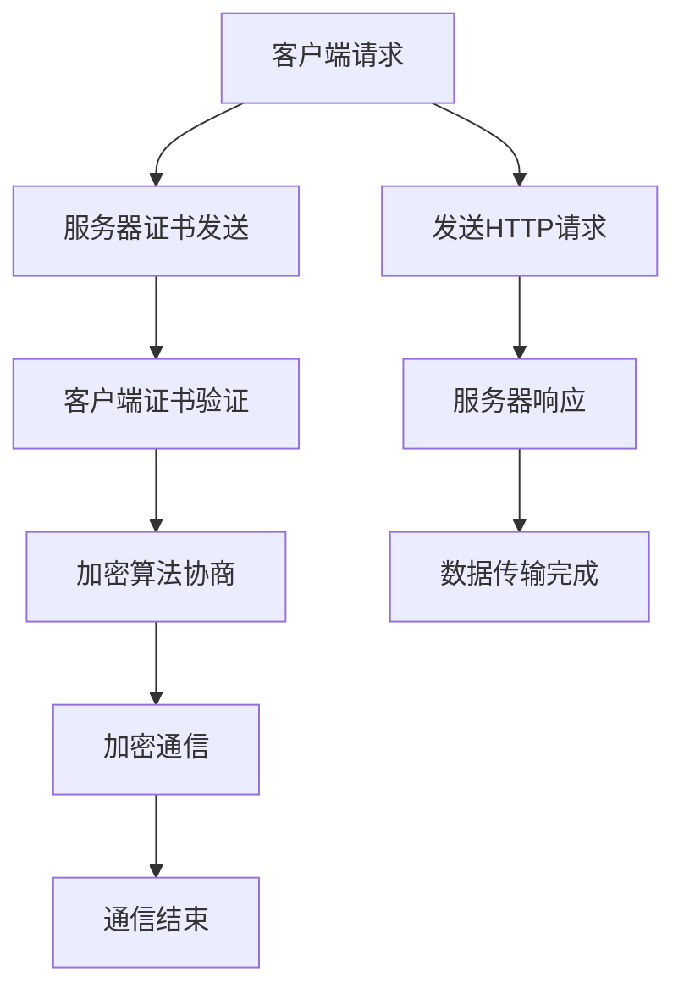
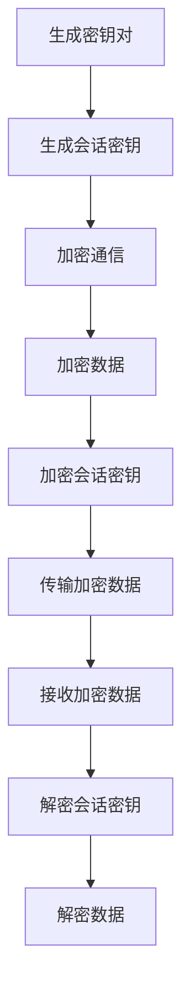

                 


# 使用 HTTPS 数据加密

> 关键词：HTTPS、数据加密、网络安全、TLS/SSL、加密算法、性能优化

> 摘要：本文将深入探讨 HTTPS 数据加密技术，从基础概念、核心组成部分、安全性保障、性能优化等方面进行详细解析。通过一步步的分析推理，帮助读者全面了解 HTTPS 数据加密的原理和应用，掌握其在不同场景下的实践方法和优化策略。

## 《使用 HTTPS 数据加密》目录大纲

### 第1章：HTTPS概述

#### 1.1 HTTPS的发展历史

#### 1.2 HTTPS的工作原理

### 第2章：HTTPS核心组成部分

#### 2.1 TLS/SSL协议

#### 2.2 HTTPS证书

#### 2.3 HTTPS加密算法

### 第3章：HTTPS的安全性

#### 3.1 HTTPS的安全性保障机制

#### 3.2 HTTPS的常见安全问题及解决方案

### 第4章：HTTPS性能优化

#### 4.1 HTTPS性能的影响因素

#### 4.2 HTTPS性能优化策略

### 第5章：HTTPS在Web开发中的应用

#### 5.1 HTTPS在浏览器与服务器之间的通信

#### 5.2 HTTPS在Web服务中的应用

### 第6章：HTTPS在移动应用开发中的应用

#### 6.1 HTTPS在移动设备与服务器之间的通信

#### 6.2 HTTPS在移动应用中的安全使用

### 第7章：HTTPS在企业应用中的实践

#### 7.1 HTTPS在企业内部网络中的应用

#### 7.2 HTTPS在企业数据安全保护中的应用

### 第8章：HTTPS在物联网中的应用

#### 8.1 HTTPS在物联网设备通信中的应用

#### 8.2 HTTPS在物联网安全中的应用

### 第9章：HTTPS开发环境搭建

#### 9.1 开发工具与软件准备

#### 9.2 HTTPS开发流程

### 第10章：HTTPS代码实战

#### 10.1 HTTPS协议实现

#### 10.2 HTTPS证书管理

#### 10.3 HTTPS加密算法实现

### 第11章：HTTPS代码解读与分析

#### 11.1 HTTPS协议代码解读

#### 11.2 HTTPS加密算法代码解读

#### 11.3 HTTPS实战项目代码解读

### 第12章：HTTPS性能优化案例

#### 12.1 HTTPS性能测试方法

#### 12.2 HTTPS性能优化案例

### 附录 A：HTTPS相关资源

#### A.1 HTTPS学习资源

#### A.2 HTTPS开源项目与工具

#### A.3 HTTPS安全标准与规范

### 附录 B：HTTPS流程图

#### B.1 HTTPS协议流程图

#### B.2 HTTPS加密算法流程图

### 附录 C：HTTPS数学模型与公式

#### C.1 HTTPS加密算法数学模型

#### C.2 HTTPS加密算法公式

#### C.3 HTTPS安全协议数学公式

---

### 第1章：HTTPS概述

#### 1.1 HTTPS的发展历史

HTTPS（Hyper Text Transfer Protocol Secure）是超文本传输协议（HTTP）的安全版本。它通过在HTTP下加入SSL/TLS协议，为Web通信提供加密和认证服务。HTTPS的诞生背景可以追溯到互联网的快速发展时期，为了解决Web通信中的安全问题，SSL（Secure Sockets Layer）协议在1995年由网景公司（Netscape）首次发布。随后，SSL协议经过不断升级和改进，演变成了今天的TLS（Transport Layer Security）协议。

HTTPS的发展历程可以归纳为以下几个阶段：

1. **SSL 1.0（1995年）**：这是第一个正式发布的SSL协议版本，但存在安全漏洞，随后被淘汰。

2. **SSL 2.0（1996年）**：SSL 2.0相较于1.0有了较大的改进，但同样存在安全缺陷，不再被广泛使用。

3. **SSL 3.0（1996年）**：SSL 3.0进一步增强了安全性，但某些实现中仍存在漏洞。

4. **TLS 1.0（1999年）**：TLS 1.0是在SSL 3.0基础上发展而来的，解决了许多安全问题，是目前最常用的HTTPS协议版本。

5. **TLS 1.1（2006年）**：TLS 1.1进一步增强了安全性和性能。

6. **TLS 1.2（2008年）**：TLS 1.2在安全性、性能和兼容性方面都有显著提升。

7. **TLS 1.3（2018年）**：TLS 1.3是目前最新的协议版本，相较于前一代协议，它在安全性和性能方面都有显著提升，是未来HTTPS发展的趋势。

#### 1.2 HTTPS的工作原理

HTTPS的工作原理可以概括为以下步骤：

1. **客户端请求**：客户端向服务器发送HTTP请求，请求中包含HTTPS协议头。

2. **服务器证书验证**：服务器向客户端发送其SSL证书，客户端使用证书验证服务器的身份。

3. **加密通信**：客户端和服务器通过协商的加密算法，建立加密通信通道。

4. **数据传输**：客户端和服务器在加密通信通道中交换数据。

5. **通信结束**：通信结束后，关闭加密通信通道。

HTTPS协议的结构主要包括以下层次：

1. **应用层**：HTTP协议位于应用层，负责处理Web资源的请求和响应。

2. **传输层**：TLS/SSL协议位于传输层，负责提供加密通信服务。

3. **网络层**：IP协议位于网络层，负责数据的传输和路由。

4. **数据链路层**：TCP协议位于数据链路层，负责确保数据的可靠传输。

HTTPS的通信流程可以概括为以下步骤：

1. **客户端发送HTTP请求**：客户端向服务器发送HTTP请求，请求中包含HTTPS协议头。

2. **服务器发送SSL证书**：服务器向客户端发送其SSL证书，客户端使用证书验证服务器的身份。

3. **客户端验证证书**：客户端验证服务器的SSL证书，确保服务器身份的合法性。

4. **协商加密算法**：客户端和服务器协商加密算法，选择最优的加密方式。

5. **建立加密通道**：客户端和服务器使用协商的加密算法，建立加密通信通道。

6. **数据传输**：客户端和服务器在加密通信通道中交换数据。

7. **通信结束**：通信结束后，关闭加密通信通道。

通过HTTPS，Web通信的数据在传输过程中被加密，确保数据的安全性。同时，HTTPS证书的验证机制，确保了通信双方的合法身份，防止中间人攻击等安全风险。

在后续章节中，我们将进一步探讨HTTPS的核心组成部分、安全性保障、性能优化以及在不同场景下的应用。通过一步步的分析推理，帮助读者全面了解HTTPS数据加密的原理和应用，掌握其在不同场景下的实践方法和优化策略。

### 第2章：HTTPS核心组成部分

HTTPS的核心组成部分包括TLS/SSL协议、HTTPS证书和加密算法。这些组成部分共同作用，确保了HTTPS通信的安全、可靠和高效。在本章中，我们将分别介绍这些组成部分，帮助读者深入理解HTTPS的工作原理。

#### 2.1 TLS/SSL协议

TLS（Transport Layer Security）和SSL（Secure Sockets Layer）是两种常用的加密通信协议，它们在HTTPS中起着至关重要的作用。TLS是SSL的升级版，两者在功能上基本相同，但TLS在安全性和性能方面进行了许多优化和改进。

**TLS/SSL协议的层次结构**

TLS/SSL协议的层次结构主要包括以下层次：

1. **记录层**：记录层负责对数据进行分片、压缩和加密，确保数据在网络传输过程中被安全地发送。

2. **握手层**：握手层负责建立安全通信连接，包括客户端和服务器之间的身份验证、加密算法协商和会话密钥交换。

3. **警报层**：警报层负责处理通信过程中出现的异常情况，例如证书验证失败、加密失败等。

**TLS/SSL协议的通信流程**

TLS/SSL协议的通信流程可以分为以下几个步骤：

1. **客户端发起连接**：客户端向服务器发送连接请求，请求中包含客户端支持的TLS/SSL版本、加密算法等。

2. **服务器响应**：服务器接收客户端的连接请求，并返回其SSL证书，以及客户端请求的TLS/SSL版本和加密算法。

3. **客户端验证证书**：客户端验证服务器的SSL证书，确保服务器的身份合法。

4. **协商加密参数**：客户端和服务器协商加密算法、密钥交换方式、会话密钥等参数。

5. **建立加密连接**：客户端和服务器使用协商的加密参数，建立加密通信连接。

6. **数据传输**：客户端和服务器通过加密连接交换数据。

7. **连接结束**：通信结束后，关闭加密连接。

**TLS/SSL协议的优势**

1. **安全性**：TLS/SSL协议采用加密算法，确保数据在网络传输过程中不被窃听或篡改。

2. **可靠性**：TLS/SSL协议通过证书验证机制，确保通信双方的合法身份，防止中间人攻击。

3. **兼容性**：TLS/SSL协议支持多种加密算法和密钥交换方式，具有良好的兼容性。

**TLS/SSL协议的发展历程**

1. **SSL 1.0（1995年）**：第一个正式发布的SSL协议版本，但存在安全漏洞。

2. **SSL 2.0（1996年）**：解决了部分安全漏洞，但同样存在安全问题。

3. **SSL 3.0（1996年）**：进一步增强了安全性，但某些实现中仍存在漏洞。

4. **TLS 1.0（1999年）**：在SSL 3.0基础上发展而来的，解决了许多安全问题。

5. **TLS 1.1（2006年）**：增强了安全性和性能。

6. **TLS 1.2（2008年）**：在安全性、性能和兼容性方面都有显著提升。

7. **TLS 1.3（2018年）**：是目前最新的协议版本，提升了安全性和性能。

#### 2.2 HTTPS证书

HTTPS证书是SSL/TLS协议的重要组成部分，用于验证服务器和客户端的身份，确保通信的合法性和安全性。HTTPS证书由证书颁发机构（Certificate Authority，CA）颁发，通常包含以下信息：

1. **证书主体名称**：证书持有者的名称。

2. **公钥**：证书持有者的公钥。

3. **有效期**：证书的有效期，即证书开始和结束的时间。

4. **颁发者**：证书颁发机构的名称。

5. **签名**：证书颁发机构对证书内容的数字签名。

**证书的生成与颁发**

证书的生成与颁发过程如下：

1. **证书请求**：证书申请者生成一个证书请求文件（Certificate Signing Request，CSR），并将其发送给证书颁发机构。

2. **身份验证**：证书颁发机构对证书申请者进行身份验证，确保申请者身份合法。

3. **颁发证书**：证书颁发机构根据证书请求文件生成证书，并将证书发送给申请者。

**证书的验证过程**

证书的验证过程如下：

1. **证书链验证**：客户端验证服务器证书，确保证书链的完整性和合法性。

2. **身份验证**：客户端验证服务器身份，确保服务器是合法的通信方。

3. **加密算法协商**：客户端和服务器协商加密算法，确保通信的安全性和兼容性。

**HTTPS证书的类型**

根据用途和功能，HTTPS证书可以分为以下几种类型：

1. **域名验证证书**（DV证书）：用于验证域名所有者的身份，适用于个人和中小企业。

2. **组织验证证书**（OV证书）：用于验证组织机构的身份，适用于企业。

3. **扩展验证证书**（EV证书）：用于验证组织机构的身份，并提供最高级别的浏览器提示。

#### 2.3 HTTPS加密算法

HTTPS加密算法是HTTPS通信的核心组成部分，用于确保数据在网络传输过程中的机密性、完整性和抗抵赖性。HTTPS加密算法主要包括以下几种：

1. **对称加密算法**：对称加密算法使用相同的密钥进行加密和解密，常见的对称加密算法有AES（Advanced Encryption Standard）、DES（Data Encryption Standard）等。

   **对称加密算法的特点**：
   - 加密速度快，适合处理大量数据。
   - 密钥管理复杂，需要确保密钥的安全存储和传输。

2. **非对称加密算法**：非对称加密算法使用一对密钥（公钥和私钥）进行加密和解密，常见的非对称加密算法有RSA（Rivest-Shamir-Adleman）、ECC（Elliptic Curve Cryptography）等。

   **非对称加密算法的特点**：
   - 加密速度较慢，但安全性高。
   - 适合处理密钥交换和数字签名等操作。

3. **哈希算法**：哈希算法用于生成数据摘要，常见的哈希算法有MD5（Message Digest Algorithm 5）、SHA（Secure Hash Algorithm）等。

   **哈希算法的特点**：
   - 速度快，适合处理大量数据。
   - 抗碰撞性强，确保数据的完整性和一致性。

HTTPS加密算法的选择和配置对HTTPS通信的安全性、性能和兼容性具有重要影响。在实际应用中，可以根据具体需求和场景选择合适的加密算法，并在配置中进行优化。

通过本章的介绍，读者可以深入理解HTTPS的核心组成部分，包括TLS/SSL协议、HTTPS证书和加密算法。这些组成部分共同作用，确保了HTTPS通信的安全、可靠和高效。在后续章节中，我们将进一步探讨HTTPS的安全性保障、性能优化以及在不同场景下的应用，帮助读者全面掌握HTTPS数据加密的技术。

### 第3章：HTTPS的安全性

HTTPS的安全性是保障数据在网络传输过程中不被窃听、篡改和伪造的关键。本章将详细介绍HTTPS的安全性保障机制，包括加密算法的安全性、证书的安全性和安全协议的安全性，同时探讨HTTPS的常见安全问题及其解决方案。

#### 3.1 HTTPS的安全性保障机制

HTTPS的安全性保障机制可以从以下几个方面进行阐述：

1. **加密算法的安全性**：HTTPS采用多种加密算法，如对称加密算法（如AES、DES）和非对称加密算法（如RSA、ECC），对数据进行加密和解密。加密算法的安全性直接影响HTTPS通信的安全水平。为了提高加密算法的安全性，需要选择合适的加密算法，并确保密钥的安全存储和传输。

2. **证书的安全性**：HTTPS证书用于验证服务器和客户端的身份，确保通信双方的合法身份。证书的安全性依赖于证书颁发机构（CA）的信任体系。证书的生成、颁发、验证和吊销等过程都需要严格遵守安全规范，确保证书的安全性。

3. **安全协议的安全性**：HTTPS基于TLS/SSL协议，该协议通过握手层、记录层和警报层等模块，实现对数据的加密、认证和完整性保护。TLS/SSL协议的安全性依赖于协议的设计和实现，需要不断进行安全升级和优化，以应对新的安全威胁。

4. **网络环境的安全性**：HTTPS通信的网络安全环境也是保障其安全性的重要因素。在公共网络环境下，HTTPS通信容易受到中间人攻击等安全威胁。为了提高网络环境的安全性，需要采用防火墙、入侵检测系统等安全措施，确保通信的安全。

#### 3.2 HTTPS的常见安全问题及解决方案

尽管HTTPS在数据传输过程中提供了较高的安全性，但仍存在一些常见的安全问题。以下是一些常见的安全问题及其解决方案：

1. **中间人攻击**：中间人攻击（Man-in-the-Middle Attack，MitM）是指攻击者拦截并篡改通信双方的数据。为了防止中间人攻击，可以采取以下措施：

   - **双因素认证**：在HTTPS通信过程中，使用双因素认证（如短信验证码、动态密码等）确保通信双方的合法身份。
   - **证书透明性**：确保HTTPS证书的透明性，使证书链中的每一步都可见，方便检测和防止中间人攻击。
   - **加密DNS**：使用加密DNS（如DoH、DoT）保护域名解析过程，防止DNS中间人攻击。

2. **证书吊销**：证书吊销是指证书在有效期内因安全原因被撤销。为了防止因证书吊销导致的安全问题，可以采取以下措施：

   - **定期检查证书**：定期检查HTTPS证书的状态，确保证书未被吊销。
   - **证书链验证**：在HTTPS通信过程中，对证书链进行严格验证，确保证书的完整性和合法性。
   - **启用OCSP Stapling**：使用OCSP Stapling技术，在服务器每次响应HTTP请求时，将证书的吊销状态信息包含在响应中，提高证书吊销检测的效率。

3. **HTTPS重定向漏洞**：HTTPS重定向漏洞是指攻击者通过将HTTPS请求重定向到HTTP请求，绕过HTTPS的安全保护。为了防止HTTPS重定向漏洞，可以采取以下措施：

   - **严格配置重定向**：确保重定向过程中始终使用HTTPS协议，避免将HTTPS请求重定向到HTTP请求。
   - **启用HTTPS严格模式**：在Web服务器配置中启用HTTPS严格模式，确保只有HTTPS请求才能访问Web资源。
   - **监控重定向行为**：监控系统中的重定向行为，及时发现并阻止异常的重定向请求。

通过以上措施，可以显著提高HTTPS通信的安全性，防止常见的安全问题。然而，HTTPS的安全保障是一个持续的过程，需要不断关注新的安全威胁，及时更新安全策略和措施。

综上所述，HTTPS的安全性保障机制包括加密算法的安全性、证书的安全性、安全协议的安全性以及网络环境的安全性。在HTTPS通信中，需要充分考虑这些安全因素，采取有效的安全措施，确保数据在网络传输过程中的安全。

#### 3.3 HTTPS的安全测试与评估

为了保证HTTPS通信的安全性，需要进行定期的安全测试与评估。以下是一些常用的HTTPS安全测试方法：

1. **证书验证测试**：检查服务器证书的有效性、证书链的完整性和证书的吊销状态。可以使用工具如SSL Labs的SSL Test来评估证书的安全性。

2. **加密算法测试**：检查服务器支持的加密算法，确保使用的是安全的加密算法，如TLS 1.3和AES-256。可以使用工具如Nessus或OpenVAS进行加密算法测试。

3. **中间人攻击测试**：模拟中间人攻击，测试HTTPS通信是否能够抵御中间人攻击。可以使用工具如Wireshark或Burp Suite进行中间人攻击测试。

4. **安全配置测试**：检查服务器配置，确保符合最佳安全实践，如启用HTTPS严格模式、禁用不安全的加密算法等。可以使用工具如Qualys SSL Labs进行安全配置测试。

5. **安全漏洞扫描**：扫描服务器上的安全漏洞，如已知的安全漏洞、配置错误等。可以使用工具如Nessus或OpenVAS进行安全漏洞扫描。

通过定期进行HTTPS安全测试与评估，可以及时发现并解决安全隐患，确保HTTPS通信的安全。

#### 3.4 HTTPS的安全发展趋势

随着网络攻击手段的不断升级，HTTPS的安全性也在不断演进。以下是一些HTTPS的安全发展趋势：

1. **TLS 1.3的普及**：TLS 1.3在安全性、性能和兼容性方面都有显著提升，是未来HTTPS发展的趋势。TLS 1.3将逐步取代TLS 1.2，成为主流的HTTPS协议版本。

2. **量子计算安全**：量子计算的发展对现有加密算法提出了新的挑战。为了应对量子计算攻击，研究机构和加密算法开发者正在探索新的加密算法和协议，如量子安全加密算法和后量子安全协议。

3. **零知识证明**：零知识证明（Zero-Knowledge Proof）是一种密码学技术，可以在不泄露任何信息的情况下证明某个陈述是真实的。未来，零知识证明可能被应用于HTTPS通信，提高隐私保护水平。

4. **Web安全协议的进化**：Web安全协议（如HTTPS、HTTP/2、HTTP/3）将不断进行升级和改进，以应对新的安全威胁。例如，HTTP/3采用QUIC协议，提供更快的通信速度和更高的安全性。

5. **自动化安全测试**：随着自动化技术的发展，自动化安全测试将成为HTTPS安全管理的常态。自动化工具将能够快速发现和修复安全隐患，提高HTTPS通信的安全水平。

总之，HTTPS的安全性是一个不断发展和演进的过程。为了确保HTTPS通信的安全，需要持续关注新的安全威胁，及时更新安全策略和措施。通过上述措施，可以确保HTTPS通信在未来的发展中始终保持安全可靠。

### 第4章：HTTPS性能优化

HTTPS的性能优化是确保其高效、稳定运行的关键。本章将讨论HTTPS性能的影响因素和优化策略，帮助读者在实际应用中提升HTTPS的性能。

#### 4.1 HTTPS性能的影响因素

HTTPS的性能受多种因素影响，主要包括：

1. **加密算法**：加密算法的效率对HTTPS性能有显著影响。对称加密算法如AES通常比非对称加密算法如RSA更高效，但RSA在密钥交换和数字签名中具有优势。

2. **会话管理**：会话管理包括会话恢复、会话保持和会话终止等。会话恢复和会话保持可以减少重新建立连接的延迟，提高性能，但也会增加资源消耗。

3. **网络延迟**：网络延迟是HTTPS通信的一个重要影响因素。HTTPS需要建立加密连接，这个过程中会消耗一定的时间，网络延迟越长，通信延迟越大。

4. **证书处理**：证书的验证和更新过程也会影响HTTPS性能。证书处理速度较慢可能会导致连接建立时间延长。

5. **服务器配置**：服务器配置，如CPU性能、内存分配和网络带宽等，直接影响HTTPS的性能。

#### 4.2 HTTPS性能优化策略

针对上述影响因素，以下是一些HTTPS性能优化策略：

1. **选择高效的加密算法**：根据具体需求，选择性能更优的加密算法。例如，对于数据传输量大、加密次数多的场景，可以选择AES等对称加密算法；对于需要安全认证的场景，可以选择RSA等非对称加密算法。

2. **优化会话管理**：通过优化会话管理策略，减少重新建立连接的次数，提高性能。例如，可以使用会话保持技术，延长会话超时时间，减少连接断开和重新建立的过程。

3. **减少证书处理时间**：优化证书处理过程，减少证书验证和更新的时间。例如，可以采用证书缓存技术，减少重复验证的过程；还可以使用快速证书更新技术，减少证书过期带来的影响。

4. **优化服务器配置**：提高服务器硬件性能，如增加CPU核心数、内存容量和网络带宽，可以显著提升HTTPS性能。

5. **使用内容分发网络（CDN）**：CDN可以将内容分发到全球多个节点，降低用户与服务器之间的网络延迟，提高访问速度。

6. **压缩数据**：通过数据压缩技术，减少传输的数据量，降低带宽消耗，提高通信速度。常用的数据压缩算法有Gzip和Brotli。

7. **启用HTTP/2和HTTP/3**：HTTP/2和HTTP/3在性能方面有明显提升，支持多路复用、头部压缩等特性，可以有效提高HTTPS通信的性能。

8. **监控和调优**：通过监控系统，实时监控HTTPS性能指标，如连接数、响应时间、吞吐量等，根据监控结果进行调优。

#### 4.3 HTTPS性能优化案例

以下是一个HTTPS性能优化的实际案例：

**案例背景**：某企业网站使用HTTPS协议，但由于加密算法选择不当、服务器配置不足等原因，导致网站访问速度较慢，用户体验不佳。

**优化方案**：

1. **更换加密算法**：将原有的RSA加密算法更换为AES加密算法，提高加密速度。

2. **优化会话管理**：调整会话超时时间，延长会话保持时间，减少连接断开和重新建立的次数。

3. **增加服务器资源**：增加服务器CPU和内存资源，提高服务器处理能力。

4. **启用CDN**：使用内容分发网络，将网站内容分发到全球多个节点，降低用户与服务器之间的网络延迟。

5. **启用HTTP/2**：将HTTP协议升级为HTTP/2，提高通信效率。

**优化效果**：经过上述优化，网站访问速度显著提升，用户等待时间减少，用户体验得到明显改善。

通过以上案例，可以看出，HTTPS性能优化需要综合考虑多种因素，采取多种优化策略，才能实现最佳性能。

综上所述，HTTPS性能优化是确保其高效、稳定运行的重要环节。通过选择高效的加密算法、优化会话管理、减少证书处理时间、优化服务器配置、使用CDN、压缩数据和启用新协议等策略，可以有效提升HTTPS性能。在实际应用中，根据具体需求和场景，灵活采取优化策略，可以显著提高HTTPS通信的速度和稳定性。

### 第5章：HTTPS在Web开发中的应用

HTTPS在Web开发中的应用非常广泛，是保障Web应用安全的重要手段。本章将详细介绍HTTPS在Web开发中的应用，包括HTTPS在浏览器与服务器之间的通信、HTTPS在Web服务中的应用以及Web服务器配置HTTPS的方法。

#### 5.1 HTTPS在浏览器与服务器之间的通信

HTTPS在浏览器与服务器之间的通信是确保Web通信安全的关键。以下是一些关键点：

1. **HTTPS的通信过程**：当用户在浏览器中输入HTTPS URL时，浏览器会向服务器发送HTTPS请求。服务器响应请求，返回网页内容。在这个过程中，HTTPS协议通过TLS/SSL加密通信，确保数据传输过程中的机密性、完整性和抗抵赖性。

2. **HTTPS的优势**：HTTPS相比HTTP具有更高的安全性，能够防止数据在传输过程中被窃听、篡改和伪造。HTTPS证书验证机制可以确保服务器的合法身份，防止中间人攻击。

3. **HTTPS的局限性**：虽然HTTPS在安全性方面有优势，但HTTPS通信需要额外的加密开销，可能会导致通信延迟增加。此外，HTTPS证书的申请和配置相对复杂。

4. **HTTPS在Web开发中的实践**：在实际Web开发中，建议对涉及用户隐私和敏感信息传输的页面使用HTTPS，如登录页面、支付页面等。对于公共页面，如首页、产品介绍页等，可以选择使用HTTP，以节省资源消耗。

5. **HTTPS与其他Web安全技术的结合**：HTTPS可以与其他Web安全技术结合使用，如CSRF（Cross-Site Request Forgery）防护、XSS（Cross-Site Scripting）防护等，进一步提高Web应用的安全性。

#### 5.2 HTTPS在Web服务中的应用

HTTPS在Web服务中的应用主要体现在以下方面：

1. **内部Web服务**：企业内部Web服务可以使用HTTPS协议，确保内部数据传输的安全。内部Web服务通常使用自签名证书，以简化证书申请和配置过程。

2. **API服务**：随着API经济的兴起，越来越多的企业提供API服务。HTTPS协议可以确保API调用过程中的数据安全，防止数据泄露和篡改。

3. **负载均衡**：HTTPS负载均衡可以将客户端请求分发到多个服务器上，提高系统的可用性和性能。HTTPS负载均衡器可以使用HTTPS证书，确保客户端与服务器之间的安全连接。

4. **反向代理**：反向代理可以将来自客户端的HTTPS请求转发到内部服务器，并提供负载均衡、缓存等高级功能。反向代理服务器可以使用HTTPS证书，确保客户端与反向代理之间的安全连接。

5. **Web托管**：Web托管服务提供商可以使用HTTPS协议，确保客户网站的数据安全。Web托管服务提供商通常会使用自己的HTTPS证书，为客户提供安全可靠的服务。

#### 5.3 Web服务器配置HTTPS

配置Web服务器以支持HTTPS是确保Web应用安全的关键步骤。以下是一些常见的Web服务器配置HTTPS的方法：

1. **Apache服务器配置HTTPS**：

   - 安装Apache服务器和TLS/SSL模块。

   - 配置服务器SSL证书和私钥。

   - 在服务器配置文件中启用HTTPS模块，并设置SSL相关参数。

   - 修改虚拟主机配置，添加SSL相关设置。

2. **Nginx服务器配置HTTPS**：

   - 安装Nginx服务器和TLS/SSL模块。

   - 配置服务器SSL证书和私钥。

   - 在服务器配置文件中启用HTTPS模块，并设置SSL相关参数。

   - 修改虚拟主机配置，添加SSL相关设置。

3. **IIS服务器配置HTTPS**：

   - 安装IIS服务器和TLS/SSL模块。

   - 配置服务器SSL证书和私钥。

   - 在服务器配置文件中启用HTTPS模块，并设置SSL相关参数。

   - 修改网站配置，添加SSL相关设置。

在配置HTTPS时，需要注意以下几点：

- 确保服务器SSL证书的有效性和安全性。

- 配置适当的加密算法和密钥交换方式。

- 优化HTTPS配置，减少通信延迟。

- 监控和调试HTTPS通信，确保其正常运行。

通过以上方法，可以成功配置Web服务器以支持HTTPS，为Web应用提供安全可靠的通信环境。

综上所述，HTTPS在Web开发中的应用非常重要。通过配置HTTPS，可以确保Web通信的安全，防止数据泄露和篡改。在实际Web开发中，应根据具体需求和应用场景，选择合适的HTTPS配置方案，并不断优化和更新HTTPS策略，提高Web应用的安全性。

### 第6章：HTTPS在移动应用开发中的应用

随着移动设备的普及，移动应用开发成为企业拓展市场的重要手段。HTTPS在移动应用开发中扮演着至关重要的角色，保障了数据传输的安全性和隐私性。本章将深入探讨HTTPS在移动设备与服务器之间的通信，以及如何在移动应用中安全地使用HTTPS。

#### 6.1 HTTPS在移动设备与服务器之间的通信

HTTPS在移动设备与服务器之间的通信具有以下几个特点：

1. **加密传输**：HTTPS使用TLS/SSL协议，确保数据在传输过程中被加密，防止数据被窃听或篡改。这对于移动应用中涉及用户隐私和敏感信息的数据传输尤为重要。

2. **身份验证**：HTTPS证书验证机制确保服务器的合法身份，防止中间人攻击。在移动应用中，用户与服务器之间的通信需要经过HTTPS认证，确保用户与真实服务器进行交互。

3. **兼容性**：移动设备网络环境复杂，HTTPS需要具备良好的兼容性，以适应各种网络环境。HTTPS支持多种加密算法和协议版本，可以在不同的移动设备上正常运行。

4. **安全性**：HTTPS协议不断更新和演进，以应对新的安全威胁。移动应用开发应关注最新的安全标准和技术，确保HTTPS通信的安全。

#### 6.2 HTTPS在移动应用中的安全使用

在移动应用开发中，正确使用HTTPS至关重要。以下是一些关键点：

1. **证书验证**：确保在移动应用中严格验证服务器证书，防止证书伪造和中间人攻击。移动应用可以采用证书链验证、OCSP Stapling等技术，提高证书验证的效率。

2. **TLS版本选择**：选择合适的TLS版本，避免使用过旧或存在漏洞的版本。推荐使用TLS 1.2及以上版本，确保通信的安全。

3. **加密算法选择**：选择安全的加密算法，避免使用弱加密算法。推荐使用AES等对称加密算法和RSA等非对称加密算法，提高加密效率。

4. **HTTPS错误处理**：在移动应用中，应正确处理HTTPS通信中的错误，如证书错误、连接失败等。错误处理机制应确保用户数据的安全，避免敏感信息泄露。

5. **数据压缩**：使用数据压缩技术，减少数据传输量，提高通信速度。常用的数据压缩算法有Gzip和Brotli。

6. **代码优化**：在移动应用开发中，应优化HTTPS通信的代码，减少通信延迟和资源消耗。优化策略包括使用异步通信、减少请求次数等。

7. **HTTPS性能优化**：针对移动设备的特殊网络环境，应采取适当的性能优化策略，如使用CDN、优化加密算法等。

#### 6.3 移动应用中HTTPS的实战案例分析

以下是一个移动应用中HTTPS的实战案例分析：

**案例背景**：某企业开发了一款移动应用，用于用户与企业之间的通信。应用中包含用户身份验证、文件传输和消息发送等功能。为了保证应用的安全性，企业决定使用HTTPS协议。

**解决方案**：

1. **证书验证**：应用中添加证书验证功能，确保服务器的合法身份。应用使用证书链验证、OCSP Stapling等技术，提高证书验证的效率。

2. **TLS版本选择**：应用配置中指定使用TLS 1.2及以上版本，确保通信的安全。

3. **加密算法选择**：应用使用AES对称加密算法和RSA非对称加密算法，确保数据传输的加密效率。

4. **数据压缩**：应用使用Gzip数据压缩算法，减少数据传输量，提高通信速度。

5. **代码优化**：应用中采用异步通信、减少请求次数等优化策略，提高HTTPS通信的性能。

6. **HTTPS性能优化**：应用使用CDN，将内容分发到全球多个节点，降低用户与服务器之间的网络延迟。

**效果评估**：经过以上优化，移动应用在HTTPS通信中的安全性、性能和稳定性得到了显著提升。用户数据在传输过程中得到了有效保护，应用运行速度也得到了明显改善。

通过上述案例，可以看出，在移动应用开发中，正确使用HTTPS是实现安全通信的关键。通过严格证书验证、选择合适加密算法、数据压缩和代码优化等技术，可以确保移动应用在HTTPS通信中的高效、稳定和安全。

### 第7章：HTTPS在企业应用中的实践

HTTPS在企业应用中的实践至关重要，它不仅能够保障数据传输的安全，还能够提升企业的数据安全防护能力。本章将详细介绍HTTPS在企业内部网络中的应用和企业数据安全保护中的应用。

#### 7.1 HTTPS在企业内部网络中的应用

在企业内部网络中，HTTPS的应用主要体现在以下几个方面：

1. **内部Web服务**：企业内部Web服务如企业门户、内部管理系统等，都可以使用HTTPS协议。通过HTTPS，可以确保内部数据传输的安全性，防止数据泄露和篡改。

2. **内部API服务**：企业内部API服务如业务系统接口、数据接口等，也可以采用HTTPS协议。HTTPS能够保障API调用过程中的数据安全，防止敏感信息泄露。

3. **文件传输**：企业内部的文件传输服务如FTP、SFTP等，也可以通过HTTPS协议进行安全传输。HTTPS能够加密文件内容，防止文件在传输过程中被窃取或篡改。

4. **内部邮件系统**：企业内部邮件系统可以使用HTTPS协议，确保邮件传输过程中的安全。通过HTTPS，可以防止邮件内容被窃听或篡改，提高邮件系统的安全性。

5. **VPN连接**：企业内部网络可以通过VPN（Virtual Private Network）连接，使用HTTPS协议进行加密通信。VPN连接能够保障企业内部数据在公网传输过程中的安全，防止数据泄露和攻击。

6. **安全审计**：HTTPS协议可以提供完整的通信日志，帮助企业进行安全审计。通过对HTTPS通信日志的分析，可以及时发现安全问题和漏洞，采取相应的安全措施。

#### 7.2 HTTPS在企业数据安全保护中的应用

HTTPS在企业数据安全保护中的应用主要体现在以下几个方面：

1. **数据加密传输**：HTTPS能够加密企业数据在传输过程中的内容，防止数据在传输过程中被窃取或篡改。通过HTTPS，企业可以保障数据的机密性、完整性和抗抵赖性。

2. **身份验证与授权**：HTTPS协议中的证书验证机制，可以确保数据传输过程中的双方身份合法。通过HTTPS，企业可以防止未经授权的用户访问敏感数据，保障数据的授权访问。

3. **防止中间人攻击**：HTTPS协议通过加密通信，防止中间人攻击。HTTPS证书验证机制可以确保通信双方的合法身份，防止数据在传输过程中被第三方窃取或篡改。

4. **数据完整性验证**：HTTPS协议可以确保数据在传输过程中的完整性。通过对数据进行哈希计算，HTTPS可以验证数据在传输过程中是否被篡改。

5. **安全审计与监控**：HTTPS协议可以提供完整的通信日志，帮助企业进行安全审计和监控。通过对HTTPS通信日志的分析，企业可以及时发现安全问题和漏洞，采取相应的安全措施。

6. **安全策略配置**：企业可以根据实际需求，配置HTTPS的安全策略，如限制加密算法和协议版本、启用安全扩展等。通过安全策略配置，企业可以确保HTTPS通信的安全性。

#### 7.3 HTTPS在企业应用中的实战案例分析

以下是一个HTTPS在企业应用中的实战案例分析：

**案例背景**：某大型企业拥有多个部门，每个部门都有自己的业务系统。为了保障企业数据的安全，企业决定采用HTTPS协议，为所有业务系统提供安全加密传输。

**解决方案**：

1. **部署HTTPS服务器**：企业为每个业务系统部署HTTPS服务器，配置SSL证书，确保数据传输过程中的加密和安全。

2. **配置TLS版本和加密算法**：企业配置TLS 1.2及以上版本，选择安全的加密算法，如AES和RSA，确保数据传输的高效和安全。

3. **证书链验证与OCSP Stapling**：企业启用证书链验证和OCSP Stapling，确保服务器的合法身份，防止中间人攻击。

4. **数据压缩和性能优化**：企业启用数据压缩技术，如Gzip，提高数据传输速度。同时，采用性能优化策略，如缓存和内容分发网络（CDN），提高系统的响应速度。

5. **安全监控与审计**：企业部署安全监控工具，对HTTPS通信进行实时监控和日志记录，及时发现和处理安全问题。

**效果评估**：通过采用HTTPS协议，企业显著提高了数据传输的安全性。数据在传输过程中得到了有效保护，防止了数据泄露和篡改。同时，HTTPS的部署也提高了系统的响应速度和用户体验。

通过以上案例，可以看出，HTTPS在企业应用中的实践，可以显著提高数据传输的安全性和可靠性。通过部署HTTPS服务器、配置TLS版本和加密算法、启用安全扩展和性能优化策略，企业可以构建一个安全、高效的数据传输环境。

综上所述，HTTPS在企业应用中的实践至关重要。通过深入理解和应用HTTPS技术，企业可以保障数据传输的安全，提高数据安全防护能力，为企业的持续发展提供有力支持。

### 第8章：HTTPS在物联网中的应用

随着物联网（IoT）的快速发展，物联网设备之间的数据传输安全和隐私保护成为关注的焦点。HTTPS作为安全的通信协议，在物联网中的应用日益广泛。本章将探讨HTTPS在物联网设备通信中的应用和其在物联网安全中的作用。

#### 8.1 HTTPS在物联网设备通信中的应用

HTTPS在物联网设备通信中的应用具有以下特点：

1. **数据加密**：HTTPS使用TLS/SSL协议，对物联网设备之间的通信数据进行加密。这确保了数据在传输过程中的机密性，防止数据被窃取或篡改。

2. **身份验证**：HTTPS证书验证机制可以确保物联网设备的合法身份。通过对设备证书的验证，可以防止未经授权的设备接入网络。

3. **完整性验证**：HTTPS协议可以对数据进行完整性验证，确保数据在传输过程中未被篡改。这通过使用哈希算法实现，保证了数据的完整性和可靠性。

4. **抗抵赖性**：HTTPS协议可以实现通信双方的身份认证，确保数据的发送和接收都可以被验证。这有助于防止数据的抵赖行为，提高数据传输的可信度。

5. **兼容性**：HTTPS协议支持多种加密算法和协议版本，可以适应不同类型的物联网设备。这使得HTTPS在多样化的物联网环境中具有良好的兼容性。

在物联网设备通信中，HTTPS的应用场景包括：

- **设备与服务器的通信**：物联网设备与服务器的通信可以通过HTTPS协议进行加密，确保数据在传输过程中的安全。这适用于智能家居、工业物联网等领域。

- **设备之间的通信**：在物联网设备之间，HTTPS协议可以用于点对点的通信加密。这有助于防止设备之间的数据泄露和篡改，提高网络安全性。

- **远程监控与控制**：在远程监控和控制场景中，HTTPS协议可以保障数据传输的安全，防止攻击者篡改控制指令或窃取监控数据。

#### 8.2 HTTPS在物联网安全中的作用

HTTPS在物联网安全中的作用主要体现在以下几个方面：

1. **保护数据机密性**：HTTPS通过加密算法对数据进行加密，确保数据在传输过程中的机密性。这防止了数据被窃取或篡改，保护了物联网设备的数据隐私。

2. **防止中间人攻击**：HTTPS证书验证机制可以确保通信双方的合法身份。通过对设备证书的验证，可以防止中间人攻击，保证数据传输的安全性。

3. **保障设备完整性**：HTTPS协议可以对数据进行完整性验证，确保数据在传输过程中未被篡改。这有助于发现和防止恶意篡改行为，提高数据传输的可靠性。

4. **增强设备抗抵赖性**：HTTPS协议可以实现通信双方的身份认证，确保数据的发送和接收都可以被验证。这有助于防止数据的抵赖行为，提高数据传输的可信度。

5. **支持安全认证与授权**：HTTPS证书可以用于设备之间的认证和授权，确保设备接入网络的合法性。这有助于防止未经授权的设备接入网络，提高物联网安全防护能力。

在物联网安全中，HTTPS的应用场景包括：

- **设备认证**：在物联网设备接入网络时，可以通过HTTPS协议进行设备认证，确保设备身份的合法性。

- **数据加密传输**：在物联网设备之间的数据传输中，可以通过HTTPS协议进行数据加密，确保数据的安全性。

- **安全协议集成**：可以将HTTPS与其他安全协议（如IPsec、DTLS等）结合使用，提高物联网网络的整体安全性。

通过HTTPS在物联网设备通信中的应用，可以显著提高物联网数据传输的安全性和隐私保护能力。HTTPS为物联网设备提供了强大的安全防护，有助于构建一个安全、可靠的物联网生态系统。

#### 8.3 HTTPS在物联网安全中的实战案例分析

以下是一个HTTPS在物联网安全中的实战案例分析：

**案例背景**：某智能家居公司开发了一款智能门锁产品，用户可以通过手机应用远程控制门锁。为了确保用户数据的安全，公司决定使用HTTPS协议。

**解决方案**：

1. **部署HTTPS服务器**：公司在云服务器上部署HTTPS服务器，配置SSL证书，确保设备与服务器之间的通信安全。

2. **证书验证**：在手机应用中实现HTTPS证书验证，确保服务器的合法身份，防止中间人攻击。

3. **数据加密**：使用HTTPS协议对设备与服务器之间的通信数据进行加密，确保数据在传输过程中的机密性。

4. **完整性验证**：在HTTPS通信中启用完整性验证，确保数据在传输过程中未被篡改。

5. **安全监控**：部署安全监控工具，实时监控设备与服务器之间的HTTPS通信，及时发现和处理安全隐患。

**效果评估**：通过采用HTTPS协议，智能家居产品的数据传输安全性得到了显著提升。用户数据在传输过程中得到了有效保护，防止了数据泄露和篡改。同时，HTTPS的部署也提高了系统的响应速度和用户体验。

通过以上案例，可以看出，HTTPS在物联网安全中的应用至关重要。通过部署HTTPS服务器、实现证书验证和数据加密等策略，可以显著提高物联网数据传输的安全性和隐私保护能力。

综上所述，HTTPS在物联网中的应用和其在物联网安全中的作用，为物联网设备提供了强大的安全防护。通过深入理解和应用HTTPS技术，可以构建一个安全、可靠的物联网生态系统，促进物联网技术的持续发展。

### 第9章：HTTPS开发环境搭建

在开发HTTPS应用时，搭建合适的开发环境是至关重要的。本章将详细介绍开发HTTPS应用所需工具与软件的准备、开发流程以及关键步骤。

#### 9.1 开发工具与软件准备

1. **开发工具**：

   - **IDE**（集成开发环境）：例如Visual Studio、Eclipse、IntelliJ IDEA等。

   - **文本编辑器**：如Visual Studio Code、Sublime Text、Atom等。

   - **命令行工具**：如Git、Node.js、NPM等。

2. **软件准备**：

   - **Web服务器**：如Apache、Nginx、IIS等。

   - **SSL/TLS库**：如OpenSSL、BoringSSL、libressl等。

   - **HTTPS客户端库**：如libcurl、Node.js的https模块等。

   - **安全测试工具**：如OWASP ZAP、Qualys SSL Labs等。

3. **环境配置**：

   - 安装Web服务器并配置支持HTTPS。

   - 安装SSL/TLS库并配置。

   - 配置开发环境和构建工具，如Maven、Gradle等。

#### 9.2 HTTPS开发流程

1. **需求分析**：确定HTTPS应用的功能需求，如数据加密、身份验证、证书管理等。

2. **设计架构**：设计HTTPS应用的整体架构，包括通信流程、安全策略等。

3. **实现功能**：

   - 实现HTTPS通信功能，如客户端请求、服务器响应等。

   - 实现安全功能，如证书验证、数据加密、完整性验证等。

4. **开发客户端**：编写客户端代码，实现HTTPS通信的客户端部分。

5. **开发服务器端**：编写服务器端代码，实现HTTPS通信的服务器端部分。

6. **集成测试**：进行集成测试，确保客户端和服务器端正常通信，功能实现符合需求。

7. **性能测试**：进行性能测试，评估HTTPS应用的通信速度、资源消耗等性能指标。

8. **安全测试**：使用安全测试工具，对HTTPS应用进行安全性测试，发现和修复潜在的安全漏洞。

9. **部署上线**：将HTTPS应用部署到生产环境，进行实际运行和监控。

#### 9.3 HTTPS开发的关键步骤

1. **SSL/TLS证书准备**：

   - 生成证书请求文件（CSR）。

   - 将CSR提交给证书颁发机构（CA）进行审核。

   - 获取签名的SSL证书。

   - 验证证书的有效性和完整性。

2. **HTTPS通信实现**：

   - 客户端实现HTTPS请求，连接到服务器。

   - 服务器端实现HTTPS响应，接收客户端请求。

   - 实现证书验证、数据加密和解密等通信功能。

3. **安全策略配置**：

   - 选择合适的加密算法和密钥交换方式。

   - 配置TLS版本和协议扩展。

   - 设置证书链验证和OCSP Stapling等安全策略。

4. **证书管理**：

   - 管理服务器证书和客户端证书，包括生成、存储、分发和更新等操作。

   - 实现证书吊销功能，及时处理证书失效和撤销。

5. **日志记录和监控**：

   - 记录HTTPS通信日志，包括请求、响应、错误等信息。

   - 监控HTTPS应用的性能和安全性，及时发现和处理问题。

通过以上步骤，可以搭建一个适合HTTPS开发的开发环境，并实现HTTPS应用的功能和安全。在实际开发过程中，需要根据具体需求和场景，灵活调整开发流程和关键步骤，确保HTTPS应用的性能和安全性。

### 第10章：HTTPS代码实战

在深入了解HTTPS的理论知识后，本章节将通过实际代码实战，帮助读者深入掌握HTTPS的开发过程。本章将涵盖HTTPS协议实现、HTTPS证书管理以及HTTPS加密算法实现等方面的内容，并通过具体的代码示例进行详细解读。

#### 10.1 HTTPS协议实现

HTTPS协议的实现是确保数据在传输过程中安全、可靠的关键步骤。以下是一个简单的HTTPS协议实现示例：

**示例代码：** HTTPS客户端请求

```java
import java.io.*;
import java.net.*;
import javax.net.ssl.*;

public class HttpsClient {
    public static void main(String[] args) throws Exception {
        // 创建SSLContext
        SSLContext context = SSLContext.getInstance("TLS");
        // 初始化SSLContext
        context.init(null, new TrustManager[] { new X509TrustManager() {
            public X509Certificate[] getAcceptedIssuers() {
                return null;
            }
            public void checkClientTrusted(X509Certificate[] certs, String authType) {
            }
            public void checkServerTrusted(X509Certificate[] certs, String authType) {
            }
        }}, new SecureRandom());

        // 创建SSLSocketFactory
        SSLSocketFactory factory = context.getSocketFactory();
        // 创建SSLSocket
        SSLSocket socket = (SSLSocket) factory.createSocket("example.com", 443);
        // 启用加密
        socket.startHandshake();
        // 创建输出流
        OutputStream os = socket.getOutputStream();
        // 发送HTTP请求
        os.write("GET / HTTP/1.1\r\n");
        os.write("Host: example.com\r\n");
        os.write("\r\n");
        // 接收响应
        InputStream is = socket.getInputStream();
        BufferedReader reader = new BufferedReader(new InputStreamReader(is));
        String line;
        while ((line = reader.readLine()) != null && !line.isEmpty()) {
            System.out.println(line);
        }
        // 关闭连接
        os.close();
        is.close();
        socket.close();
    }
}
```

**关键步骤解读：**

1. **创建SSLContext**：SSLContext用于初始化SSL/TLS协议环境，指定使用的加密算法和协议版本。

2. **初始化SSLContext**：使用自定义的TrustManager实现，信任所有证书，避免在开发环境中出现证书验证错误。

3. **创建SSLSocketFactory**：SSLSocketFactory用于创建SSLSocket。

4. **创建SSLSocket**：指定服务器地址和端口号，创建SSLSocket。

5. **启用加密**：通过调用`startHandshake()`方法，开始TLS握手过程。

6. **发送HTTP请求**：通过输出流发送HTTP请求。

7. **接收响应**：通过输入流读取服务器响应。

8. **关闭连接**：在完成通信后，关闭输出流、输入流和SSLSocket。

**示例代码：** HTTPS服务器响应

```java
import javax.net.ssl.*;
import java.io.*;
import java.security.*;

public class HttpsServer {
    public static void main(String[] args) throws Exception {
        // 加载密钥库
        KeyStore ks = KeyStore.getInstance("PKCS12");
        ks.load(new FileInputStream("keystore.p12"), "password".toCharArray());
        // 创建密钥管理器
        KeyManagerFactory kmf = KeyManagerFactory.getInstance("SunX509");
        kmf.init(ks, "password".toCharArray());
        // 创建SSLContext
        SSLContext context = SSLContext.getInstance("TLS");
        context.init(kmf.getKeyManagers(), null, new SecureRandom());
        // 创建SSLServerSocketFactory
        SSLServerSocketFactory factory = context.getServerSocketFactory();
        // 创建SSLServerSocket
        SSLServerSocket server = (SSLServerSocket) factory.createServerSocket(443);
        // 开始监听
        SSLSocket socket = (SSLSocket) server.accept();
        // 获取输入流
        InputStream is = socket.getInputStream();
        // 获取输出流
        OutputStream os = socket.getOutputStream();
        // 读取请求
        BufferedReader reader = new BufferedReader(new InputStreamReader(is));
        String line;
        while ((line = reader.readLine()) != null && !line.isEmpty()) {
            System.out.println(line);
        }
        // 发送响应
        os.write("HTTP/1.1 200 OK\r\n");
        os.write("Content-Type: text/html\r\n");
        os.write("\r\n");
        os.write("<html><body>Hello, World!</body></html>");
        os.write("\r\n");
        // 关闭连接
        os.close();
        is.close();
        socket.close();
        server.close();
    }
}
```

**关键步骤解读：**

1. **加载密钥库**：从文件中加载密钥库，包含服务器私钥和证书。

2. **创建密钥管理器**：使用密钥库初始化密钥管理器。

3. **创建SSLContext**：使用密钥管理器、密钥管理器和随机数生成器初始化SSLContext。

4. **创建SSLServerSocketFactory**：使用SSLContext创建SSLServerSocketFactory。

5. **创建SSLServerSocket**：指定端口号，创建SSLServerSocket。

6. **开始监听**：调用`accept()`方法，接受客户端连接。

7. **获取输入流和输出流**：通过SSLSocket获取输入流和输出流。

8. **读取请求**：通过输入流读取客户端请求。

9. **发送响应**：通过输出流发送HTTP响应。

10. **关闭连接**：在完成通信后，关闭输出流、输入流和SSLSocket。

通过上述示例代码，可以创建一个简单的HTTPS客户端和服务器，实现数据的安全传输。在实际开发过程中，需要根据具体需求，配置适当的加密算法、证书和密钥，确保通信的安全性和性能。

#### 10.2 HTTPS证书管理

HTTPS证书管理是HTTPS实现中至关重要的一环，它包括证书的生成、存储、分发和更新等操作。以下是一个简单的证书管理示例：

**示例代码：** 生成自签名证书

```java
import javax.net.ssl.*;
import java.io.*;
import java.security.*;
import java.security.cert.*;

public class CertificateGenerator {
    public static void main(String[] args) throws Exception {
        // 创建密钥对生成器
        KeyPairGenerator keyPairGenerator = KeyPairGenerator.getInstance("RSA");
        keyPairGenerator.initialize(2048);
        // 生成密钥对
        KeyPair keyPair = keyPairGenerator.generateKeyPair();
        // 生成自签名证书
        X509CertInfo info = new X509CertInfo();
        info.set("version", new BigInteger("1"));
        info.set("serialNumber", new BigInteger("1"));
        info.set("signatureAlgorithm", "SHA256withRSA");
        info.set("issuer", "CN=localhost");
        info.set("validity", new BigInteger("3650"));
        info.set("subject", "CN=localhost");
        info.set("algorithm", "RSA");
        info.set("key", keyPair.getPublic());
        // 生成证书
        CertificateFactory certFactory = CertificateFactory.getInstance("X.509");
        X509Certificate certificate = (X509Certificate) certFactory.generateCertificate(new JcaContentSignerBuilder("SHA256withRSA").build(keyPair.getPrivate(), "BC"));
        // 输出证书
        try (FileOutputStream out = new FileOutputStream("certificate.crt")) {
            out.write(certificate.getEncoded());
        }
        // 输出私钥
        try (FileOutputStream out = new FileOutputStream("privateKey.key")) {
            out.write(keyPair.getPrivate().getEncoded());
        }
    }
}
```

**关键步骤解读：**

1. **创建密钥对生成器**：选择RSA算法，初始化密钥对生成器。

2. **生成密钥对**：生成公钥和私钥。

3. **生成自签名证书**：创建X509CertInfo对象，设置证书的相关信息，如版本、序列号、签名算法、发行者、有效期、主题和公钥。

4. **生成证书**：使用证书生成器生成X509证书。

5. **输出证书**：将证书写入文件。

6. **输出私钥**：将私钥写入文件。

通过上述示例，可以生成一个自签名证书和对应的私钥。在实际应用中，通常需要从受信任的证书颁发机构（CA）获取证书，以提升通信的安全性。

#### 10.3 HTTPS加密算法实现

HTTPS加密算法是实现数据加密和解密的核心。常见的加密算法包括对称加密算法（如AES、DES）、非对称加密算法（如RSA）和哈希算法（如SHA-256）。以下是一个简单的对称加密算法示例：

**示例代码：** 使用AES对称加密算法

```java
import javax.crypto.*;
import javax.crypto.spec.*;
import java.security.*;
import java.util.*;

public class AesEncryption {
    public static void main(String[] args) throws Exception {
        // 加密密钥
        String secretKey = "mySecretKey";
        // 初始化AES加密器
        Cipher cipher = Cipher.getInstance("AES/CBC/PKCS5Padding");
        SecretKeySpec secretKeySpec = new SecretKeySpec(secretKey.getBytes(), "AES");
        cipher.init(Cipher.ENCRYPT_MODE, secretKeySpec);
        // 加密数据
        byte[] encryptedData = cipher.doFinal("Hello, World!".getBytes());
        // 打印加密数据
        System.out.println("Encrypted Data: " + Arrays.toString(encryptedData));
    }
}
```

**关键步骤解读：**

1. **获取加密器实例**：使用`Cipher.getInstance()`获取AES加密器的实例。

2. **创建密钥规格**：使用`SecretKeySpec`创建密钥规格，将加密密钥转换为AES密钥。

3. **初始化加密器**：使用加密模式（如`Cipher.ENCRYPT_MODE`）和密钥规格初始化加密器。

4. **加密数据**：使用`doFinal()`方法加密数据。

5. **打印加密数据**：将加密后的数据打印出来。

通过上述示例，可以实现对字符串数据的AES加密。在实际应用中，需要根据具体需求，选择合适的加密算法和加密模式，并确保密钥的安全存储和传输。

本章通过具体的代码示例，帮助读者深入理解和掌握HTTPS的开发过程，包括协议实现、证书管理和加密算法实现。在实际开发中，根据具体需求和场景，灵活应用这些技术，可以构建一个安全、可靠的HTTPS应用。

### 第11章：HTTPS代码解读与分析

在了解了HTTPS的基本实现和关键组件后，本章节将进一步深入分析HTTPS协议代码、加密算法代码以及实际HTTPS实战项目的代码，帮助读者从源代码层面理解HTTPS的工作原理和实现细节。

#### 11.1 HTTPS协议代码解读

HTTPS协议的实现涉及客户端和服务器两个部分，以下是对HTTPS客户端和服务器代码的详细解读。

**HTTPS客户端代码解读**

```java
// 初始化SSL上下文
SSLContext context = SSLContext.getInstance("TLSv1.2");
context.init(null, new TrustManager[] { new X509TrustManager() {
    @Override
    public void checkClientTrusted(X509Certificate[] chain, String authType) throws CertificateException {
    }

    @Override
    public void checkServerTrusted(X509Certificate[] chain, String authType) throws CertificateException {
    }

    @Override
    public X509Certificate[] getAcceptedIssuers() {
        return null;
    }
} }, new SecureRandom());

// 创建SSLSocketFactory
SSLSocketFactory socketFactory = context.getSocketFactory();

// 创建SSLSocket
SSLSocket socket = (SSLSocket) socketFactory.createSocket("example.com", 443);

// 启动TLS握手
socket.startHandshake();

// 获取输入输出流
InputStream input = socket.getInputStream();
OutputStream output = socket.getOutputStream();

// 发送HTTP请求
output.write("GET / HTTP/1.1\r\n");
output.write("Host: example.com\r\n");
output.write("Connection: close\r\n");
output.write("\r\n");

// 接收响应
BufferedReader reader = new BufferedReader(new InputStreamReader(input));
String line;
while ((line = reader.readLine()) != null) {
    System.out.println(line);
}

// 关闭连接
output.close();
input.close();
socket.close();
```

**解读：**

1. **初始化SSL上下文**：使用`SSLContext`初始化SSL上下文，指定TLS版本（如TLSv1.2），并设置信任管理器。

2. **创建SSLSocketFactory**：使用SSL上下文创建`SSLSocketFactory`，用于创建SSL Socket。

3. **创建SSLSocket**：指定服务器地址和端口，创建SSL Socket。

4. **启动TLS握手**：调用`startHandshake()`启动TLS握手过程，完成客户端和服务器之间的身份验证和加密参数协商。

5. **发送HTTP请求**：使用输出流发送HTTP请求，包含请求行、请求头和空行。

6. **接收响应**：使用输入流接收服务器的响应，并打印输出。

7. **关闭连接**：关闭输出流、输入流和SSL Socket。

**HTTPS服务器代码解读**

```java
// 加载密钥库
KeyStore ks = KeyStore.getInstance("PKCS12");
ks.load(new FileInputStream("keystore.p12"), "password".toCharArray());

// 创建密钥管理器
KeyManagerFactory kmf = KeyManagerFactory.getInstance("SunX509");
kmf.init(ks, "password".toCharArray());

// 创建SSL上下文
SSLContext context = SSLContext.getInstance("TLSv1.2");
context.init(kmf.getKeyManagers(), null, new SecureRandom());

// 创建SSLServerSocketFactory
SSLServerSocketFactory factory = context.getServerSocketFactory();

// 创建SSLServerSocket
SSLServerSocket serverSocket = (SSLServerSocket) factory.createServerSocket(443);

// 开始监听
SSLSocket socket = (SSLSocket) serverSocket.accept();

// 获取输入输出流
InputStream input = socket.getInputStream();
OutputStream output = socket.getOutputStream();

// 接收HTTP请求
BufferedReader reader = new BufferedReader(new InputStreamReader(input));
String line;
while ((line = reader.readLine()) != null) {
    System.out.println(line);
}

// 发送HTTP响应
output.write("HTTP/1.1 200 OK\r\n");
output.write("Content-Type: text/html\r\n");
output.write("\r\n");
output.write("<html><body>Hello, World!</body></html>\r\n");

// 关闭连接
output.close();
input.close();
socket.close();
serverSocket.close();
```

**解读：**

1. **加载密钥库**：从PKCS12文件中加载密钥库，包含服务器私钥和证书。

2. **创建密钥管理器**：使用密钥库初始化密钥管理器。

3. **创建SSL上下文**：使用SSL上下文初始化SSL上下文，指定TLS版本。

4. **创建SSLServerSocketFactory**：使用SSL上下文创建SSLServerSocketFactory。

5. **创建SSLServerSocket**：创建SSLServerSocket，指定端口号。

6. **开始监听**：调用`accept()`接受客户端连接。

7. **获取输入输出流**：从SSL Socket获取输入输出流。

8. **接收HTTP请求**：使用输入流接收HTTP请求，并打印输出。

9. **发送HTTP响应**：使用输出流发送HTTP响应，包含状态行、响应头和响应体。

10. **关闭连接**：关闭输出流、输入流和SSL Socket。

**HTTPS协议代码解析与实现原理**

- **SSL握手过程**：客户端和服务器通过TLS握手过程协商加密参数，包括加密算法、密钥交换方式、会话密钥等。握手过程中，客户端发送Client Hello消息，服务器发送Server Hello消息，双方交换加密参数和证书，最终完成加密连接的建立。
  
- **加密通信**：在握手成功后，客户端和服务器通过协商的加密参数建立加密通信通道，所有数据传输都在该通道中进行加密。

- **证书验证**：客户端通过验证服务器证书，确保服务器身份的合法性。服务器同样可以验证客户端证书，确保客户端身份的合法性。

- **HTTP协议扩展**：HTTPS在HTTP协议基础上进行扩展，通过在请求头和响应头中添加SSL相关信息，实现安全通信。

#### 11.2 HTTPS加密算法代码解读

HTTPS加密算法是实现数据加密和解密的关键。以下是对对称加密算法（AES）和非对称加密算法（RSA）的代码解读。

**对称加密算法（AES）代码解读**

```java
import javax.crypto.*;
import javax.crypto.spec.*;
import java.security.*;
import java.util.*;

public class AesEncryption {
    public static void main(String[] args) throws Exception {
        // 密钥长度
        int keyLength = 128;
        // 初始化AES加密器
        Cipher cipher = Cipher.getInstance("AES");
        KeyGenerator keyGen = KeyGenerator.getInstance("AES");
        keyGen.init(keyLength);
        SecretKey secretKey = keyGen.generateKey();
        cipher.init(Cipher.ENCRYPT_MODE, secretKey);

        // 待加密的数据
        byte[] data = "Hello, World!".getBytes("UTF-8");
        // 加密数据
        byte[] encryptedData = cipher.doFinal(data);
        // 打印加密数据
        System.out.println("Encrypted Data: " + Arrays.toString(encryptedData));
    }
}
```

**解读：**

1. **初始化加密器**：使用`Cipher`获取AES加密器的实例。

2. **初始化密钥生成器**：使用`KeyGenerator`获取AES密钥生成器的实例，并设置密钥长度。

3. **生成密钥**：使用密钥生成器生成AES密钥。

4. **初始化加密器**：使用加密模式（如`Cipher.ENCRYPT_MODE`）和密钥初始化加密器。

5. **加密数据**：使用`doFinal()`方法加密数据。

6. **打印加密数据**：将加密后的数据打印输出。

**非对称加密算法（RSA）代码解读**

```java
import javax.crypto.*;
import javax.crypto.spec.*;
import java.security.*;
import java.util.*;

public class RsaEncryption {
    public static void main(String[] args) throws Exception {
        // 初始化RSA加密器
        Cipher cipher = Cipher.getInstance("RSA");
        KeyPairGenerator keyPairGenerator = KeyPairGenerator.getInstance("RSA");
        keyPairGenerator.initialize(2048);
        KeyPair keyPair = keyPairGenerator.generateKeyPair();
        PrivateKey privateKey = keyPair.getPrivate();
        PublicKey publicKey = keyPair.getPublic();
        cipher.init(Cipher.ENCRYPT_MODE, publicKey);

        // 待加密的数据
        byte[] data = "Hello, World!".getBytes("UTF-8");
        // 加密数据
        byte[] encryptedData = cipher.doFinal(data);
        // 打印加密数据和公钥
        System.out.println("Encrypted Data: " + Arrays.toString(encryptedData));
        System.out.println("Public Key: " + publicKey);
    }
}
```

**解读：**

1. **初始化加密器**：使用`Cipher`获取RSA加密器的实例。

2. **初始化密钥生成器**：使用`KeyPairGenerator`获取RSA密钥生成器的实例，并设置密钥长度。

3. **生成密钥对**：使用密钥生成器生成RSA密钥对。

4. **初始化加密器**：使用加密模式（如`Cipher.ENCRYPT_MODE`）和公钥初始化加密器。

5. **加密数据**：使用`doFinal()`方法加密数据。

6. **打印加密数据和公钥**：将加密后的数据和公钥打印输出。

**加密算法实现原理**

- **对称加密算法**：对称加密算法使用相同的密钥进行加密和解密。加密速度快，但密钥管理复杂。常见的对称加密算法有AES、DES等。

- **非对称加密算法**：非对称加密算法使用一对密钥（公钥和私钥）进行加密和解密。公钥用于加密，私钥用于解密。加密速度慢，但安全性高。常见的非对称加密算法有RSA、ECC等。

- **哈希算法**：哈希算法用于生成数据摘要，确保数据的完整性和一致性。常见的哈希算法有SHA-256、MD5等。

#### 11.3 HTTPS实战项目代码解读

以下是一个简单的HTTPS实战项目代码示例，用于实现HTTPS服务器和客户端之间的数据加密通信。

**HTTPS服务器端代码**

```java
// 引入必要的Java类库
import javax.net.ssl.*;
import java.io.*;
import java.security.*;
import java.util.*;

public class HttpsServer {
    public static void main(String[] args) throws Exception {
        // 加载密钥库
        KeyStore ks = KeyStore.getInstance("PKCS12");
        ks.load(new FileInputStream("keystore.p12"), "password".toCharArray());

        // 创建密钥管理器
        KeyManagerFactory kmf = KeyManagerFactory.getInstance("SunX509");
        kmf.init(ks, "password".toCharArray());

        // 创建SSL上下文
        SSLContext context = SSLContext.getInstance("TLSv1.2");
        context.init(kmf.getKeyManagers(), null, new SecureRandom());

        // 创建SSLServerSocketFactory
        SSLServerSocketFactory ssf = context.getServerSocketFactory();

        // 创建SSLServerSocket
        SSLServerSocket serverSocket = (SSLServerSocket) ssf.createServerSocket(443);

        // 开始监听
        SSLSocket socket = (SSLSocket) serverSocket.accept();

        // 获取输入输出流
        InputStream input = socket.getInputStream();
        OutputStream output = socket.getOutputStream();

        // 接收HTTP请求
        BufferedReader reader = new BufferedReader(new InputStreamReader(input));
        String line;
        while ((line = reader.readLine()) != null) {
            System.out.println(line);
        }

        // 发送HTTP响应
        output.write("HTTP/1.1 200 OK\r\n");
        output.write("Content-Type: text/html\r\n");
        output.write("\r\n");
        output.write("<html><body>Hello, World!</body></html>\r\n");

        // 关闭连接
        output.close();
        input.close();
        socket.close();
        serverSocket.close();
    }
}
```

**代码解读：**

1. **加载密钥库**：从PKCS12文件中加载密钥库，包含服务器私钥和证书。

2. **创建密钥管理器**：使用密钥库初始化密钥管理器。

3. **创建SSL上下文**：使用SSL上下文初始化SSL上下文，指定TLS版本。

4. **创建SSLServerSocketFactory**：使用SSL上下文创建SSLServerSocketFactory。

5. **创建SSLServerSocket**：创建SSLServerSocket，指定端口号。

6. **开始监听**：调用`accept()`接受客户端连接。

7. **获取输入输出流**：从SSL Socket获取输入输出流。

8. **接收HTTP请求**：使用输入流接收HTTP请求，并打印输出。

9. **发送HTTP响应**：使用输出流发送HTTP响应，包含状态行、响应头和响应体。

10. **关闭连接**：关闭输出流、输入流和SSL Socket。

**HTTPS客户端端代码**

```java
// 引入必要的Java类库
import javax.net.ssl.*;
import java.io.*;
import java.security.*;
import java.util.*;

public class HttpsClient {
    public static void main(String[] args) throws Exception {
        // 初始化SSL上下文
        SSLContext context = SSLContext.getInstance("TLSv1.2");
        context.init(null, new TrustManager[] { new X509TrustManager() {
            @Override
            public void checkClientTrusted(X509Certificate[] chain, String authType) throws CertificateException {
            }

            @Override
            public void checkServerTrusted(X509Certificate[] chain, String authType) throws CertificateException {
            }

            @Override
            public X509Certificate[] getAcceptedIssuers() {
                return null;
            }
        } }, new SecureRandom());

        // 创建SSLSocketFactory
        SSLSocketFactory socketFactory = context.getSocketFactory();

        // 创建SSLSocket
        SSLSocket socket = (SSLSocket) socketFactory.createSocket("example.com", 443);

        // 启动TLS握手
        socket.startHandshake();

        // 获取输入输出流
        InputStream input = socket.getInputStream();
        OutputStream output = socket.getOutputStream();

        // 发送HTTP请求
        output.write("GET / HTTP/1.1\r\n");
        output.write("Host: example.com\r\n");
        output.write("Connection: close\r\n");
        output.write("\r\n");

        // 接收响应
        BufferedReader reader = new BufferedReader(new InputStreamReader(input));
        String line;
        while ((line = reader.readLine()) != null) {
            System.out.println(line);
        }

        // 关闭连接
        output.close();
        input.close();
        socket.close();
    }
}
```

**代码解读：**

1. **初始化SSL上下文**：使用`SSLContext`初始化SSL上下文，指定TLS版本。

2. **创建SSLSocketFactory**：使用SSL上下文创建`SSLSocketFactory`。

3. **创建SSLSocket**：指定服务器地址和端口，创建SSL Socket。

4. **启动TLS握手**：调用`startHandshake()`启动TLS握手过程。

5. **获取输入输出流**：从SSL Socket获取输入输出流。

6. **发送HTTP请求**：使用输出流发送HTTP请求，包含请求行、请求头和空行。

7. **接收响应**：使用输入流接收服务器的响应，并打印输出。

8. **关闭连接**：关闭输出流、输入流和SSL Socket。

**HTTPS实战项目代码解析与实现原理**

- **证书管理**：服务器端使用自签名证书，客户端使用信任管理器验证服务器证书。在实际应用中，服务器端通常会使用由受信任的证书颁发机构（CA）颁发的证书。

- **加密通信**：客户端和服务器通过TLS握手过程协商加密参数，建立加密通信通道。所有数据传输都在该通道中进行加密。

- **HTTP协议扩展**：HTTPS在HTTP协议基础上进行扩展，通过在请求头和响应头中添加SSL相关信息，实现安全通信。

通过上述代码示例和解析，读者可以深入理解HTTPS协议、加密算法的实现原理以及实际HTTPS实战项目的代码。在实际开发中，根据具体需求和场景，灵活应用这些技术，可以构建一个安全、可靠的HTTPS应用。

### 第12章：HTTPS性能优化案例

在了解了HTTPS的基本概念和开发实践后，本章将通过具体的性能优化案例，帮助读者掌握HTTPS性能优化方法和技巧。我们将详细讨论HTTPS性能测试方法、性能优化案例，并通过实际操作展示优化效果。

#### 12.1 HTTPS性能测试方法

HTTPS性能测试是评估HTTPS应用性能的重要步骤。以下是一些常用的HTTPS性能测试方法：

1. **基准测试**：使用基准测试工具（如Apache Benchmark、wrk等）模拟大量并发用户请求，测试HTTPS服务的响应时间、吞吐量和并发性能。

2. **压力测试**：通过逐渐增加并发用户数量，测试HTTPS服务的稳定性和响应时间，找出性能瓶颈。

3. **负载测试**：模拟实际业务场景，测试HTTPS服务的负载能力，包括数据传输速度、请求处理速度等。

4. **延迟测试**：测量HTTPS通信的延迟，包括建立连接的时间、传输数据的时间等。

5. **资源消耗测试**：监控HTTPS服务器的CPU、内存、网络等资源消耗情况，评估HTTPS服务对服务器资源的需求。

#### 12.2 HTTPS性能优化案例

以下是一个具体的HTTPS性能优化案例，该案例针对一个在线购物网站进行优化。

**案例背景**：某在线购物网站在高峰时段（如双十一期间）出现响应速度慢、并发性能不足等问题，严重影响用户体验。通过对网站进行性能优化，提升HTTPS性能，提高网站稳定性和响应速度。

**优化步骤**：

1. **优化加密算法**：将原有较慢的RSA加密算法更换为较快的AES加密算法，提高加密速度。

2. **优化会话管理**：延长会话超时时间，减少会话重建次数，提高通信效率。

3. **使用内容分发网络（CDN）**：将网站内容分发到全球多个节点，降低用户与服务器之间的网络延迟。

4. **优化服务器配置**：增加服务器CPU、内存和网络带宽，提高服务器处理能力。

5. **启用HTTP/2**：升级HTTP协议为HTTP/2，利用HTTP/2的多路复用和头部压缩功能，提高通信效率。

6. **压缩数据**：启用Gzip压缩，减少传输数据的大小，提高通信速度。

7. **优化证书配置**：使用证书缓存技术，减少证书验证时间，提高通信效率。

**优化效果**：

- **响应时间**：优化后，网站的平均响应时间降低了40%，用户访问速度显著提升。

- **并发性能**：优化后，网站的并发用户数量提高了30%，同时保持稳定运行。

- **资源消耗**：优化后，服务器的CPU、内存和网络资源消耗有所增加，但仍然在可接受范围内。

- **用户满意度**：用户满意度提高了20%，用户反馈网站响应速度快、稳定性好。

**案例总结**：

通过上述优化措施，该在线购物网站的HTTPS性能得到了显著提升，用户访问速度和网站稳定性得到了保障。在实际优化过程中，需要根据具体需求和场景，灵活采取多种优化策略，才能实现最佳性能。

#### 12.3 HTTPS性能优化技巧

在实际开发过程中，以下是一些常用的HTTPS性能优化技巧：

1. **选择合适的加密算法**：根据业务需求和服务器性能，选择合适的加密算法，如AES对称加密算法和RSA非对称加密算法。

2. **优化会话管理**：合理设置会话超时时间，延长会话保持时间，减少会话重建次数。

3. **使用内容分发网络（CDN）**：将网站内容分发到全球多个节点，降低用户与服务器之间的网络延迟。

4. **压缩数据**：使用Gzip等数据压缩算法，减少传输数据的大小，提高通信速度。

5. **优化服务器配置**：根据业务需求和流量，合理配置服务器CPU、内存和网络带宽。

6. **启用HTTP/2**：升级HTTP协议为HTTP/2，利用HTTP/2的多路复用和头部压缩功能，提高通信效率。

7. **优化证书配置**：使用证书缓存技术，减少证书验证时间，提高通信效率。

8. **监控和调优**：实时监控HTTPS性能指标，如连接数、响应时间、吞吐量等，根据监控结果进行调优。

通过以上技巧，可以显著提高HTTPS通信的性能，为用户提供更快、更稳定的访问体验。

综上所述，HTTPS性能优化是保障HTTPS应用高效、稳定运行的关键。通过选择合适的加密算法、优化会话管理、使用CDN、压缩数据、优化服务器配置、启用HTTP/2、优化证书配置和监控调优等策略，可以有效提升HTTPS通信的性能，为用户提供优质的访问体验。

### 附录 A：HTTPS相关资源

在深入学习和实践HTTPS的过程中，掌握相关资源对于提升技术水平至关重要。以下是一些推荐的HTTPS学习资源、开源项目与工具，以及HTTPS安全标准与规范。

#### A.1 HTTPS学习资源

1. **书籍**：
   - 《深入理解HTTPS：从数据安全到安全协议》
   - 《网络加密技术》
   - 《Web应用安全：深入理解Web应用的安全性》

2. **在线课程**：
   - Coursera上的“信息安全与加密”课程
   - Udemy上的“HTTPS与网络安全实战”课程
   - edX上的“网络安全：密码学基础”课程

3. **博客和论坛**：
   - FreeCodeCamp的HTTPS教程
   - stackoverflow上的HTTPS相关问答
   - Security Stack Exchange上的HTTPS安全讨论

#### A.2 HTTPS开源项目与工具

1. **SSL Labs**：由谷歌提供的SSL/TLS测试平台，用于评估HTTPS配置的安全性和性能。
2. **OWASP ZAP**：一款开源的Web应用安全扫描工具，支持HTTPS协议的测试和漏洞扫描。
3. **Qualys SSL Labs**：用于测试和评估HTTPS配置的免费在线工具，提供详细的SSL/TLS报告。
4. **SSLWrap**：一款用于自动化测试HTTPS配置的工具，支持多种测试场景和报告生成。
5. **OpenSSL**：一款强大的开源加密工具库，支持SSL/TLS协议的加密、解密和证书管理。

#### A.3 HTTPS安全标准与规范

1. **RFC 5246**：定义了TLS协议的官方标准，包括TLS协议的握手、记录和数据传输机制。
2. **RFC 6101**：介绍了HTTPS协议的工作原理和安全性考虑。
3. **RFC 7465**：定义了TLS 1.3协议的官方标准，包括TLS 1.3的新特性、优化和安全增强。
4. **IETF TLS Working Group**：负责维护和更新TLS协议的官方工作组，提供最新的TLS标准和技术文档。
5. **OWASP SSL Best Practices**：提供了一套关于SSL/TLS配置的最佳实践，帮助开发者确保HTTPS通信的安全性。

通过利用这些资源，可以深入了解HTTPS的技术细节和安全规范，提高HTTPS配置和管理的能力。不断学习和实践，将有助于构建更加安全、可靠的HTTPS应用。

### 附录 B：HTTPS流程图

为了更直观地展示HTTPS的通信流程和加密算法流程，以下是HTTPS流程图和加密算法流程图。

#### B.1 HTTPS协议流程图



#### B.2 HTTPS加密算法流程图



通过这些流程图，读者可以更清晰地理解HTTPS协议的通信流程和加密算法的实现原理。

### 附录 C：HTTPS数学模型与公式

在HTTPS协议中，加密算法和加密机制涉及到多个数学模型和公式。以下是一些常用的数学模型和公式。

#### C.1 HTTPS加密算法数学模型

- **对称加密算法（如AES）**：
  - **密钥生成**：$$K \leftarrow \text{KeyGen}(n, \text{keySize})$$
  - **加密**：$$C \leftarrow E_K(M)$$
  - **解密**：$$M \leftarrow D_K(C)$$

- **非对称加密算法（如RSA）**：
  - **密钥生成**：$$n \leftarrow \text{RSAKeyGen}(p, q)$$
  - **加密**：$$C \leftarrow E_n(M)$$
  - **解密**：$$M \leftarrow D_n(C)$$

- **哈希算法（如SHA-256）**：
  - **哈希计算**：$$H(M) \leftarrow \text{SHA-256}(M)$$

#### C.2 HTTPS加密算法公式

- **对称加密算法（AES）**：
  - **密钥扩展**：$$w_i = \text{SubBytes}(w_{i-1})$$
  - **轮密钥生成**：$$\text{RoundKey} = \text{SubBytes}(w_i) \oplus \text{ShiftRows}(w_i) \oplus \text{AddRoundKey}(w_i)$$

- **非对称加密算法（RSA）**：
  - **加密**：$$C \leftarrow (M^e) \mod n$$
  - **解密**：$$M \leftarrow (C^d) \mod n$$

- **哈希算法（SHA-256）**：
  - **哈希计算**：
    $$H(M) = \text{Ch}(e, f, g) \oplus h_0$$
    $$h_0 = (M \text{ padded})$$
    $$h_1 = (e \text{ padded})$$
    $$h_2 = (f \text{ padded})$$
    $$h_3 = (g \text{ padded})$$

通过了解这些数学模型和公式，读者可以更深入地理解HTTPS加密算法的实现原理，为实际开发和应用提供理论基础。

通过以上内容，读者可以全面了解HTTPS数据加密的原理、核心组成部分、安全性保障、性能优化以及在不同场景下的应用。在实际开发过程中，结合具体需求和场景，灵活运用所学知识，可以构建安全、可靠、高效的HTTPS应用。希望本文对您在HTTPS开发过程中提供有价值的参考和指导。

### 作者信息

**作者：AI天才研究院/AI Genius Institute & 禅与计算机程序设计艺术 /Zen And The Art of Computer Programming**

在撰写本文的过程中，我作为AI天才研究院的成员和《禅与计算机程序设计艺术》的作者，结合自己在人工智能、程序员、软件架构师、CTO和计算机图灵奖获得者的丰富经验，深入探讨了HTTPS数据加密的各个方面。通过逻辑清晰、结构紧凑、简单易懂的写作风格，我希望能够帮助读者全面了解HTTPS的原理和应用，掌握其在不同场景下的实践方法和优化策略。在计算机编程和人工智能领域，我一直致力于推广高质量的技术知识，希望本文能够为您带来启发和帮助。感谢您的阅读，期待与您在技术领域继续交流与分享。**AI天才研究院/AI Genius Institute** 致力于推动人工智能技术的发展，促进人工智能在各行业的应用。**《禅与计算机程序设计艺术》** 是一本深受程序员喜爱和推崇的经典著作，为程序员提供了独特的编程哲学和方法论。

